# Adaptive Red Team Runtime — Promptfoo + RTAP + Frozen

> Статус: **нормативная целевая архитектура для поэтапной реализации**
> Дата ревизии: 2026-08-30
> Родительская архитектура: [ARCHITECTURE.md](./ARCHITECTURE.md)
> Frozen META-Harness positioning: [FROZEN_META_HARNESS.md](./FROZEN_META_HARNESS.md)
> Frozen HLD: [FROZEN_REDTEAM_HLD.md](./FROZEN_REDTEAM_HLD.md)
> Execution Safety & Recovery HLD: [EXECUTION_SAFETY_RECOVERY.md](./EXECUTION_SAFETY_RECOVERY.md)
> Детальный контракт Frozen: [FROZEN_INTEGRATION.md](./FROZEN_INTEGRATION.md)

Этот документ определяет normative closed-loop архитектуру, в которой заменяемые
execution harnesses производят evidence, RTAP владеет security truth, а заменяемый
**Intelligence META-Harness** моделирует пространство экспериментов и ранжирует
следующую полезную работу.

Главное решение:

> **Frozen не является интеграционным адаптером Promptfoo и не вызывает его напрямую.**
> Promptfoo остаётся сменным Execution Harness/Runtime, Frozen — сменным Intelligence
> META-Harness за портом `FrozenModelRuntime`, а RTAP Control Plane является единственной
> mediation, authority и orchestration boundary между ними.

Краткая формула:

```text
Promptfoo and other execution engines
+
RTAP Control Plane and canonical campaign state
+
Frozen CampaignWorld and utility model
+
guarded adaptive planner
=
Adaptive Red Team Runtime
```

---

## 1. Architectural decision

### 1.1 Разделение ответственности

```text
Promptfoo:
    How is a probe generated and executed?
    What native evidence and grading were produced?

RTAP Control Plane:
    Was execution authorized and durably scheduled?
    What canonically happened?
    Is there a verified Finding and Verdict?

Frozen:
    What is the current campaign state?
    What is already known?
    Which candidate probe appears most useful next?

Campaign Planner:
    Which recommendation may be executed under budget,
    policy, coverage, exploration and freshness constraints?
```

Frozen влияет на направление исследования, но не находится на вершине trust hierarchy:

```text
Frozen MAY influence:
- what to test next;
- which target or probe appears more promising;
- how much remaining budget to allocate;
- when campaign saturation deserves operator attention.

Frozen MUST NOT:
- validate a Finding;
- produce or override a canonical Verdict;
- reinterpret missing evidence as success;
- call an execution engine directly;
- execute a stale recommendation;
- become a raw-text LLM or semantic payload embedder.
```

### 1.2 Harness taxonomy

| Architectural class | Implementations | Responsibility | Forbidden authority |
|---|---|---|---|
| **Execution Harness** | Promptfoo, Duo Static, future scanner/agent/fuzzer | generate or execute individual experiments; collect native evidence and grading | canonical Finding/Verdict; campaign-wide planning |
| **Intelligence META-Harness** | Frozen today; another `FrozenModelRuntime` implementation tomorrow | reconstruct derived world; preserve memory/replay context; compile candidate features; score utility; verify laws; emit advisory recommendations | target execution; RunStep creation; security Verdict |
| **Authority / Orchestration Boundary** | RTAP Control Plane | authorize, schedule and commit campaign evolution; validate bindings; own Observation/Finding/Verdict | engine-native grading internals; opaque model decisions without provenance |

`META` means that Frozen reasons over the **space and history of experiments**, rather
than executing one experiment. It does not mean that Frozen owns the campaign scheduler.
Normative wording:

```text
Promptfoo performs experiments.
Frozen models the experiment space and proposes the next useful experiment.
RTAP decides which experiment is authorized and necessary, creates its RunStep,
and commits what canonically happened.
```

Consequently, Promptfoo does not know Frozen exists. Frozen receives no Promptfoo-native
DTO and does not know which execution harness produced an Observation; it sees only RTAP
canonical contracts and provenance.

### 1.3 Non-goals

- не переписывать Promptfoo внутри Frozen;
- не модифицировать Promptfoo core ради RTAP integration;
- не передавать native `EvalResult` непосредственно в Frozen;
- не считать utility выполненного probe online-рекомендацией следующего probe;
- не смешивать `promptfoo.*`, `duo.*` и `frozen.*` scores;
- не делать adaptive planner критическим условием успешного завершения assessment;
- не включать model-driven execution до shadow benchmark и replay proof.

---

## 2. Three-plane architecture

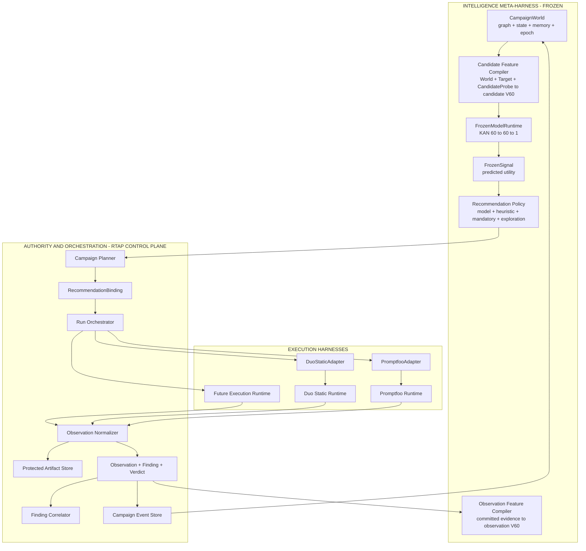

Направление «Frozen поверх Promptfoo» является **логическим layering**, а не прямой
runtime dependency. RTAP Control Plane — единственная mediation bus между Intelligence
и Execution. Между ними всегда находятся versioned ports, `RecommendationBinding`,
durable `RunStep`, ACL, normalization и committed `CampaignEvent`.

Promptfoo не знает о Frozen; Frozen не знает, какой конкретный engine выполнил probe.
Оба runtime зависят только от RTAP-owned contracts.

---

## 3. Closed-loop control system

```mermaid
flowchart LR
    Target["Target"] --> Engine["Execution Engine"]
    Engine --> Native["Native Result"]
    Native --> ACL["Engine Adapter + Normalizer"]
    ACL --> Commit["Atomic commit<br/>Observation + CampaignEvent"]
    Commit --> World["CampaignWorld<br/>epoch N"]
    World --> Candidates["Eligible CandidateProbes"]
    Candidates --> Features["V60 per candidate"]
    Features --> Model["Frozen utility model"]
    Model --> Recommendations["Bound recommendations"]
    Recommendations --> Planner["Guarded Planner"]
    Planner --> RunStep["Durable RunStep"]
    RunStep --> Engine
```

Canonical loop:

```text
authorized RunStep
→ native execution
→ protected evidence
→ normalized Observation
→ atomic Observation + CampaignEvent commit
→ deterministic CampaignWorld transition
→ candidate enumeration
→ V60 candidate scoring
→ advisory FrozenSignal
→ policy-constrained Recommendation
→ freshness check
→ next authorized RunStep
```

Запрещённые shortcuts:

```text
Promptfoo EvalResult ─X→ Frozen model
FrozenSignal         ─X→ Promptfoo
FrozenSignal         ─X→ Finding or Verdict
Planner              ─X→ execution without durable RunStep
uncommitted result   ─X→ CampaignWorld
```

---

## 4. Canonical contracts

### 4.1 Core objects

| Object | Owner | Purpose |
|---|---|---|
| `Campaign` | RTAP | versioned targets, probes, policies and budget |
| `AssessmentRun` | RTAP | immutable execution snapshots for one campaign run |
| `RunStep` | RTAP | durable, leased and idempotent unit of execution |
| `Probe` | RTAP | normalized vulnerability class + delivery strategy |
| `ProbeAttempt` | RTAP | one actual application of a Probe to a Target |
| `Eval` / `EvalResult` | Promptfoo | native execution and grading result |
| `Observation` | RTAP | normalized result with provenance and evidence refs |
| `Finding` / `Verdict` | RTAP | canonical security result |
| `CampaignEvent` | RTAP | ordered and replayable world transition input |
| `CampaignWorld` | Frozen context | derived graph, state, memory, epoch and binding |
| `ObservationFeatureSnapshot` | RTAP/Frozen contract | immutable `OBSERVATION` V60 describing committed evidence |
| `CandidateFeatureSnapshot` | RTAP/Frozen contract | immutable `CANDIDATE` V60 describing potential next work |
| `FrozenSignal` | Frozen | advisory model output, never a Verdict |
| `RecommendationBinding` | RTAP | protocol object binding advice to executable state |

### 4.2 Ports

```text
EngineAdapter
    capabilities() -> EngineCapabilities
    execute(RunStep, SnapshotRefs) -> NativeRunRef
    collect(NativeRunRef) -> NativeResultBatch

ObservationNormalizer
    normalize(NativeResult, AdapterContext) -> Observation | NormalizationError

CampaignEventReducer
    apply(CampaignWorld, OrderedEvent) -> CampaignWorld | ReplayError

ObservationFeatureCompiler
    compile(CommittedObservation, WorldBinding)
        -> ObservationFeatureSnapshot<V60, OBSERVATION>

CandidateFeatureCompiler
    compile(WorldBinding, TargetSnapshot, CandidateProbe, BudgetState)
        -> CandidateFeatureSnapshot<V60, CANDIDATE>

FrozenModelRuntime
    score(ModelSnapshot, CandidateFeatureSnapshot<V60>)
        -> FrozenSignal<ProbeUtility>

CampaignPlanner
    recommend(World, CandidateSet, FrozenSignals, PlannerPolicy)
        -> Recommendation[]

RunOrchestrator
    dispatch(RecommendationBinding) -> RunStep | StaleRecommendation
```

### 4.3 Provenance

Каждая нормализованная Observation сохраняет как минимум:

```text
engine_id
engine_version
adapter_version
schema_version
native_run_id
native_result_id
grader_kind
grader_version
capability_snapshot_ref
evidence_refs
```

Каждый model signal сохраняет:

```text
campaign_id
world_generation
world_epoch
world_fingerprint
candidate_probe_id
target_snapshot_ref
feature_view = CANDIDATE
feature_schema_version
feature_snapshot_digest
compiler_build
normalization_profile
taxonomy_version
model_digest
model_generation
policy_version
predicted_utility
quality
created_at
```

### 4.4 Feature views

Оба compiler используют versioned V60 schema family, но их input semantics не
взаимозаменяемы:

```text
ObservationFeatureCompiler
    committed Observation + WorldBinding
    -> FeatureSnapshot(view=OBSERVATION)
    -> describes evidence already obtained

CandidateFeatureCompiler
    WorldBinding + TargetSnapshot + CandidateProbe + BudgetState
    -> FeatureSnapshot(view=CANDIDATE)
    -> describes a possible next RunStep
```

`feature_view` является частью binding. Utility model, обученная и admitted для
`CANDIDATE`, обязана отвергать `OBSERVATION` snapshot даже при совпадающей размерности
V60. Общими остаются только versioning, normalization discipline, taxonomy bindings и
wire envelope; значение каждой координаты определяется конкретным view.

---

## 5. Promptfoo execution boundary

Фактический Promptfoo runtime уже реализует:

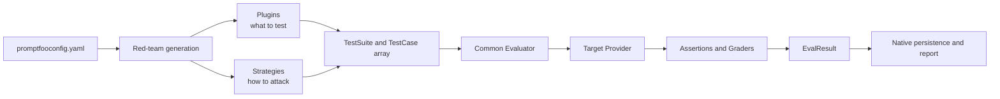

Source-grounded entry points:

- [`promptfoo/src/redteam/shared.ts`](../../promptfoo/src/redteam/shared.ts) — generation,
  generated configuration and common `doEval` orchestration;
- [`promptfoo/src/redteam/index.ts`](../../promptfoo/src/redteam/index.ts) — purpose,
  entities, plugins, strategies and `TestCase[]` synthesis;
- [`promptfoo/src/evaluator.ts`](../../promptfoo/src/evaluator.ts) — provider execution,
  assertions, grading and `EvaluateResult`;
- [`promptfoo/src/redteam/graders.ts`](../../promptfoo/src/redteam/graders.ts) — native
  red-team assertion-to-grader registry.

Promptfoo remains replaceable because its native types end at `PromptfooAdapter`.
RTAP Domain never imports `Eval` or `EvalResult`.

### 5.1 Verdict normalization

Promptfoo `success` means that an assertion passed; it is not a canonical statement that
an attack succeeded. Normalization requires grading provenance:

| Native outcome | Canonical result |
|---|---|
| grader confirms attack goal | `VULNERABLE` |
| grader/verifier confirms protection | `RESISTANT` |
| provider, transport, runtime or grader error | `ERROR` |
| absent grading, empty output or insufficient evidence | `UNVERIFIED` |

In particular, red-team `success=true` without `gradingResult` cannot become
`RESISTANT`.

---

## 6. Committed event and replay path

CampaignWorld consumes only committed canonical events:

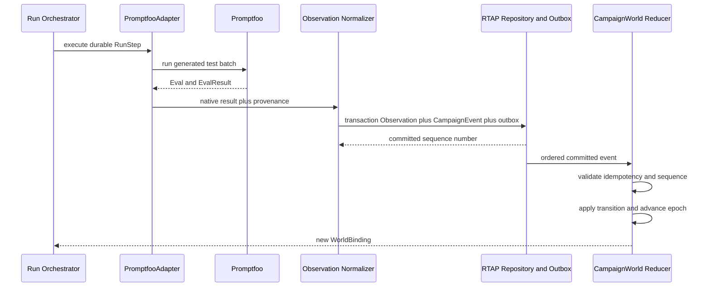

Reducer invariants:

- sequence gaps are rejected;
- duplicate `event_id` is idempotent;
- same ordered events produce the same world fingerprint;
- every accepted state-changing event advances epoch;
- replay never depends on Promptfoo availability;
- native evidence remains in ArtifactStore and enters world only through structured refs.

---

## 7. Offline training flow

Historical outcomes provide labels; they are not online recommendations by themselves.
Training uses the world state **before** the candidate was executed.

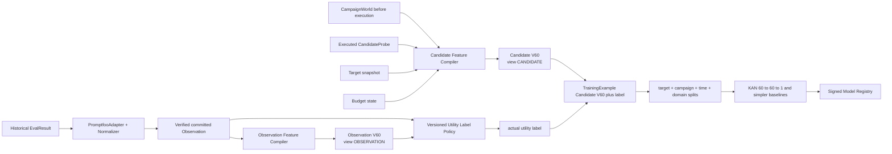

`ObservationFeatureCompiler` describes evidence already obtained and supports label
construction, telemetry and drift analysis. The model input for probe utility is always
the `CandidateFeatureSnapshot` reconstructed from the world state **before** that probe
was executed.

Utility label is a versioned policy, for example:

```text
utility =
    finding_novelty_weight * unique_confirmed_finding
  + evidence_gain_weight * evidence_quality_delta
  + coverage_weight * taxonomy_coverage_delta
  - target_call_cost_weight * target_calls
  - latency_weight * normalized_latency
  - error_weight * execution_or_grader_error
```

Точные коэффициенты принадлежат `UtilityLabelPolicy`, а не training code. Из обучающего
набора исключаются ungraded/defaulted/config-ignored результаты и rows без достаточного
provenance.

Обязательные baselines:

- random;
- fixed order;
- deterministic heuristic;
- logistic/linear regression where applicable;
- tree or boosting baseline;
- current KAN scalar regression.

---

## 8. Online candidate scoring

Online inference оценивает **ещё не выполненные** candidates:

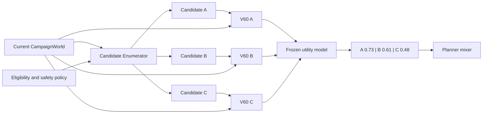

Conceptual function:

```text
predicted_utility = f(
    WorldBinding,
    TargetSnapshot,
    CandidateProbe,
    CampaignHistory,
    BudgetState,
    FeatureSchema,
    ModelSnapshot
)
```

`CandidateFeatureSnapshot` must set `feature_view=CANDIDATE` and identify the candidate,
world binding, compiler build, normalization profile, taxonomy and feature semantics. The
utility model answers:

> If the next authorized RunStep is spent on this candidate probe, how much campaign
> intelligence is expected to improve?

A score without these bindings is not executable advice. An `OBSERVATION` snapshot is
never accepted as online input merely because it also contains 60 coordinates.

---

## 9. Shadow-first lifecycle

### 9.1 Frozen v0

```text
Promptfoo
→ EvalResult
→ normalized committed Observation
→ ObservationFeatureSnapshot(view=OBSERVATION)
→ CampaignEvent
→ CampaignWorld
→ eligible candidate set
→ CandidateFeatureSnapshot(view=CANDIDATE) per candidate
→ scalar utility per candidate
→ bound shadow recommendation
→ shadow evaluation log
```

In `SHADOW`, Promptfoo execution order remains mandatory/fixed/heuristic. Frozen
predictions are persisted for counterfactual evaluation but cannot create RunSteps. The
comparison record joins:

```text
Frozen recommendation and rank
+
actual probe selected by the active non-model policy
+
actual verified utility outcome
+
heuristic and random baseline ranks
```

Only this joined record can support promotion evidence; a high predicted score alone
cannot.

### 9.2 Promotion state

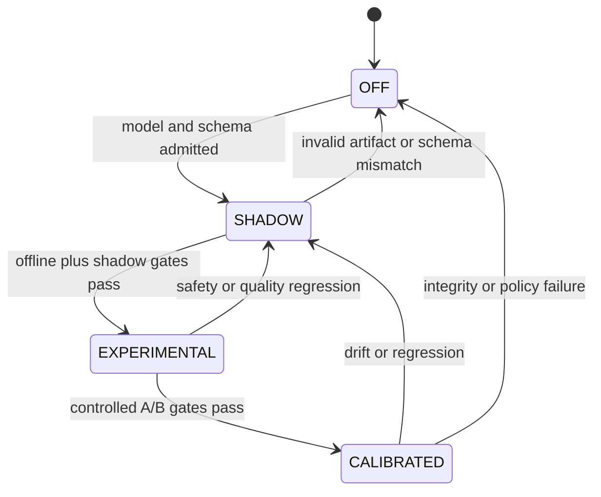

| Mode | Planner effect | Required evidence |
|---|---|---|
| `OFF` | none | no admitted compatible model |
| `SHADOW` | none | signed artifact, compatible schema, replayable inputs |
| `EXPERIMENTAL` | bounded share | baseline gain, freshness guard, control arm |
| `CALIBRATED` | policy-limited production share | stable A/B gain, drift limits, rollback proof |

Promotion is controlled by RTAP policy and Model Registry metadata, never by the model
itself.

---

## 10. Guarded planner

The planner combines independent arms:

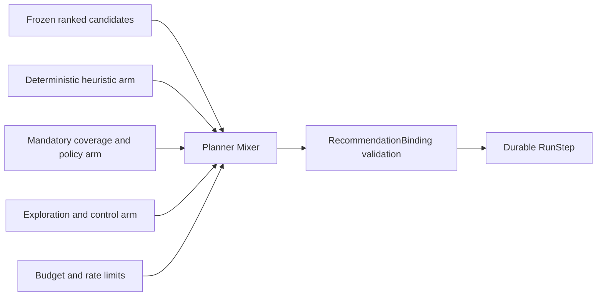

Model ranking cannot remove:

- mandatory policy probes;
- safety and compliance checks;
- deterministic control arm;
- minimum exploration share;
- target rate limits and authorization;
- operator-imposed exclusions.

### 10.1 RecommendationBinding

`RecommendationBinding` is an RTAP-owned protocol object, not an opaque model payload:

```text
RecommendationBinding {
    recommendation_id
    campaign_id
    assessment_run_id
    candidate_probe_id
    target_snapshot_ref

    world_generation
    world_epoch
    world_fingerprint

    feature_view = CANDIDATE
    feature_schema_version
    feature_snapshot_digest
    compiler_build

    model_digest
    model_generation
    planner_policy_version

    predicted_utility
    rank
    quality
    created_at
    not_after
}
```

A recommendation is executable only when its complete binding matches current state:

```text
recommendation.campaign_id == current.campaign_id
and recommendation.assessment_run_id == current.assessment_run_id
and recommendation.world_generation == current.world_generation
and recommendation.world_epoch == current.world_epoch
and recommendation.world_fingerprint == current.world_fingerprint
and recommendation.feature_view == CANDIDATE
and recommendation.feature_schema_version == active.feature_schema_version
and recommendation.compiler_build == active.compiler_build
and recommendation.model_digest == active.model_digest
and recommendation.planner_policy_version == active.planner_policy_version
and recommendation.not_after > now
```

Validation has explicit protocol outcomes:

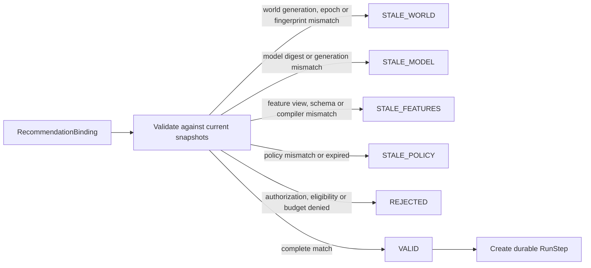

Any `STALE_*` or `REJECTED` outcome terminates dispatch; the binding is never silently
recomputed or patched in place. A new recommendation must be produced from current state.
This turns `redteam.planner/stale-recommendation-is-not-executed` into a concrete protocol
invariant enforced before RunStep creation.

Epoch is the central anti-stale mechanism, but not a globally unique identity. Generation,
fingerprint and snapshot bindings prevent accidental reuse after replay, restore, branch
or migration.

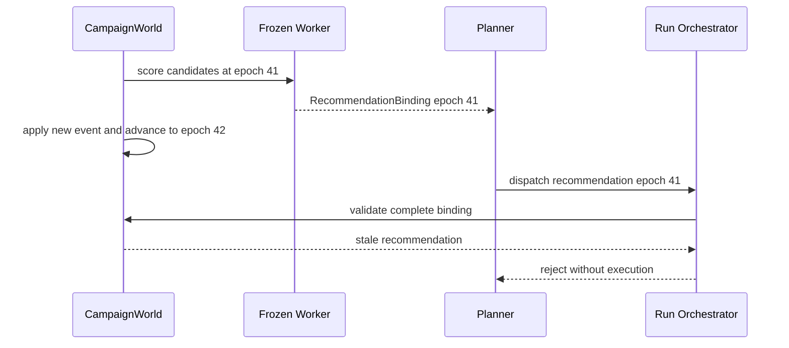

---

## 11. Failure and degradation

| Failure | Required behavior |
|---|---|
| Promptfoo unavailable | fail/retry affected RunStep; do not fabricate Observation |
| Promptfoo native result cannot normalize | store protected artifact; emit `ERROR` or normalization failure, not silent pass |
| Event sequence gap | stop reducer; request replay/reconciliation |
| Frozen worker unavailable | continue with deterministic heuristic planner |
| model or feature schema mismatch | reject signal; remain `OFF`/`SHADOW` |
| stale recommendation | reject before RunStep creation |
| invalid model signature/digest | do not load artifact |
| drift or quality regression | demote to `SHADOW` |
| planner failure | preserve canonical observations/findings; stop adaptation only |

Frozen failure may reduce efficiency, but must not corrupt canonical execution results or
turn uncertain security evidence into success.

---

## 12. Trust and ownership boundaries

| Capability | Promptfoo | RTAP | Frozen |
|---|---:|---:|---:|
| generate LLM/agent attacks | owns | configures through ACL | no |
| execute target probes | owns | authorizes and schedules | no |
| native assertions and grading | owns | validates provenance | no |
| durable cross-engine orchestration | no | owns | no |
| protected evidence policy | produces native data | owns | reads structured refs only |
| canonical Observation | no | owns | consumes committed events |
| Finding and Verdict | no | owns | forbidden |
| CampaignWorld | no | owns canonical events | owns derived runtime state |
| candidate utility | no | consumes | produces advisory signal |
| final probe selection | no | owns guarded planner policy | advisory only |
| model registry and promotion | no | owns admission policy | loads admitted snapshot |

Trust rule:

```text
Execution engines produce evidence.
RTAP Control Plane owns security truth.
Frozen produces advisory intelligence.
Planner converts admissible intelligence into guarded work.
```

---

## 13. Deployment view

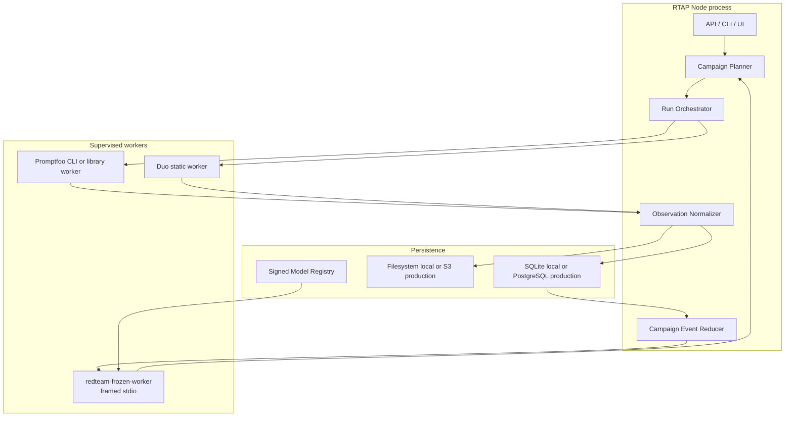

Process isolation keeps Promptfoo and Frozen replaceable and prevents Rust
`panic=abort` or engine-level failures from terminating the Control Plane.

---

## 14. Architecture Laws

Minimum executable laws:

```text
redteam.verdict/ungraded-never-becomes-resistant
redteam.adapter/native-types-do-not-cross-acl
redteam.observation/every-observation-has-provenance
redteam.observation/uncommitted-result-never-enters-world
redteam.event/duplicate-event-is-idempotent
redteam.event/sequence-gap-is-rejected
redteam.replay/same-events-produce-same-world-fingerprint
redteam.frozen/state-change-advances-epoch
redteam.frozen/signal-is-not-a-verdict
redteam.feature/observation-and-candidate-views-are-not-interchangeable
redteam.frozen/candidate-score-has-complete-binding
redteam.planner/stale-recommendation-is-not-executed
redteam.planner/control-arm-never-disappears
redteam.planner/frozen-failure-falls-back-to-heuristic
redteam.score/native-score-namespaces-are-never-averaged
redteam.artifact/public-report-never-inlines-sensitive-payload
```

Each law has stable ID, statement, deterministic seed, randomized trials and replayable
counterexamples.

---

## 15. Delivery roadmap

```mermaid
flowchart LR
    P0["P0 Contracts and laws"] --> P1["P1 Promptfoo vertical slice"]
    P1 --> P2["P2 Offline dataset and baselines"]
    P2 --> P3["P3 Shadow candidate scoring"]
    P3 --> P4["P4 Event-sourced CampaignWorld"]
    P4 --> G45["P4.5 Execution Safety and Recovery gate"]
    G45 --> P5["P5 Experimental planner"]
    P5 --> P6["P6 Calibrated adaptive runtime"]
    P6 --> P7["P7 Duo and future engines"]
```

### P0 — Contracts and laws

- canonical schemas and ports;
- FeatureSchema v1 and UtilityLabelPolicy v1;
- provenance, artifact and verdict laws;
- RecommendationBinding and stale rejection.

### P1 — Promptfoo vertical slice

- durable RunStep;
- PromptfooAdapter;
- protected native artifact;
- `EvalResult → Observation → Finding → report`;
- atomic Observation + CampaignEvent commit.

### P2 — Offline utility experiment

- verified historical corpus;
- world-before-execution reconstruction;
- target/campaign/time/domain splits;
- random/fixed/heuristic/linear/tree/KAN comparison;
- signed scalar model artifact.

### P3 — Shadow candidate scoring

- eligible candidate enumeration;
- V60 per unexecuted candidate;
- persisted shadow ranking and counterfactual dashboard;
- no influence on Promptfoo order.

### P4 — Replayable CampaignWorld

- ordered event store;
- idempotent reducer;
- epoch, generation and fingerprint;
- deterministic restore and replay laws.

### P4.5 — Execution Safety & Recovery gate

P4.5 is a mandatory hardening/admission gate and does not renumber P0–P7. The normative
protocol and laws are defined in
[EXECUTION_SAFETY_RECOVERY.md](./EXECUTION_SAFETY_RECOVERY.md).

- active `ExecutionAttempt` and lease-generation binding for every accepted result;
- late-result fencing and stale artifact quarantine;
- `EffectReceipt`, explicit `UNKNOWN_EFFECT_OUTCOME` and capability-derived recovery;
- authorization receipts, fail-closed concurrency barriers and typed interceptor plans;
- crash matrix proving no duplicate Observation/Event and deterministic world replay.

### P5 — Experimental planner

- bounded model-selected share;
- mandatory, heuristic and exploration arms;
- freshness validation before RunStep creation;
- A/B measurement and automatic demotion.

### P6 — Calibrated adaptive runtime

- production policy limits;
- drift monitoring;
- rollback drill;
- target/domain admission matrix.

### P7 — Additional engines

- Duo Static observations;
- engine-independent feature semantics;
- future adapters without changing Frozen or RTAP Domain.

---

## 16. Admission criteria

Shadow admission requires:

- complete provenance and immutable FeatureSchema;
- signed model artifact with compatible digest;
- no target/campaign leakage in dataset splits;
- utility label ownership and versioning;
- performance reported against simpler baselines;
- deterministic inference for the same bound input.

Experimental planner admission additionally requires:

- positive lift in `unique confirmed findings / 100 target calls`;
- no regression in mandatory taxonomy coverage;
- bounded error and timeout rates;
- stale recommendations rejected in tests and replay;
- control/exploration share preserved;
- worker-loss fallback demonstrated.

Calibrated admission additionally requires:

- sustained A/B gain across target and time holdouts;
- model and feature drift thresholds;
- signed rollback target;
- operator-visible reason codes and provenance;
- no critical-class false-negative or coverage regression beyond policy limits.

Stop conditions:

- model does not beat deterministic heuristic;
- gains disappear on campaign/time holdout;
- ranking reduces coverage or exploration;
- utility labels cannot be audited;
- replay produces different world fingerprint;
- model output cannot be traced to complete binding.

---

## 17. Final invariant

```text
Promptfoo remains a replaceable Execution Harness/Runtime behind EngineAdapter.
Frozen remains a replaceable Intelligence META-Harness behind FrozenModelRuntime.
RTAP remains the canonical authority, mediation and orchestration boundary.
CampaignWorld and canonical contracts survive replacement of either harness.
The Planner remains the only guarded bridge from intelligence to execution.
```

Therefore:

> **Adaptive Red Team Runtime is an event-driven platform in which interchangeable
> execution harnesses perform experiments, RTAP authorizes and commits campaign
> evolution, and an interchangeable Intelligence META-Harness understands the experiment
> space and ranks future work without becoming a security grader or execution authority.**
