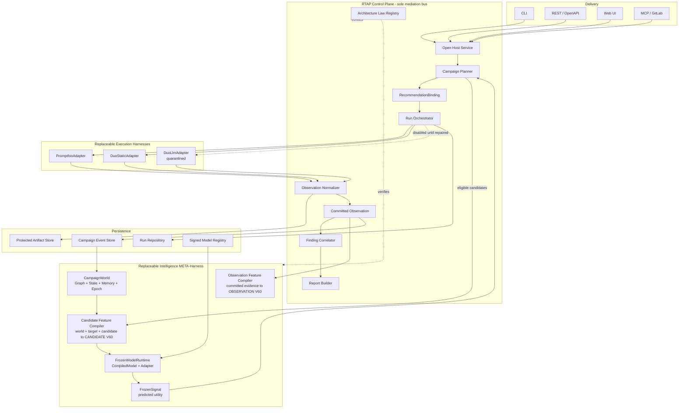
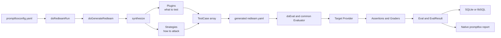
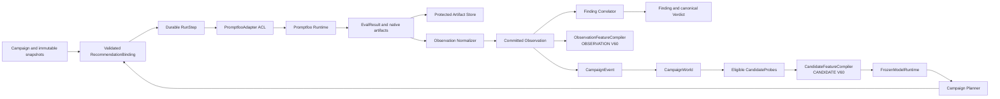

# Red_Team Assessment Platform — архитектура v2

> Статус: **принято для поэтапной реализации**
> Дата ревизии: 2026-08-30
> Источники: `promptfoo`, `duo-agents`, `frozen`, `wiki/`
> Frozen META-Harness positioning: [FROZEN_META_HARNESS.md](./FROZEN_META_HARNESS.md)
> Нормативный Adaptive Runtime HLD: [ADAPTIVE_REDTEAM_RUNTIME.md](./ADAPTIVE_REDTEAM_RUNTIME.md)
> Execution Safety & Recovery HLD: [EXECUTION_SAFETY_RECOVERY.md](./EXECUTION_SAFETY_RECOVERY.md)
> As-built снимок реализации (2026-08-31, commit `c913ac6`): [RTAP_AS_BUILT.md](./RTAP_AS_BUILT.md)
> Детальный дизайн frozen: [FROZEN_INTEGRATION.md](./FROZEN_INTEGRATION.md)

Этот документ определяет единый архитектурный объект **RedTeam Assessment Platform
(RTAP)**. RTAP не сливает четыре кодовые базы в один runtime. Он владеет канонической
моделью кампании и подключает специализированные движки через Anti-Corruption Layer.

Версия v2 заменяет прежний дизайн RedTeam Overlay Gateway. Главное изменение:
`frozen` больше не является периферийным адаптером `Recognize() → dedup_key`.
Он становится внутренним **Campaign Intelligence Context** архитектурного класса
**Intelligence META-Harness**: реконструирует производное состояние campaign, сохраняет
memory/replay context, оценивает candidates и проверяет laws. META-Harness не владеет
scheduler или security truth: RTAP остаётся единственной authority, mediation и
orchestration boundary. Exact dedup артефактов выполняется криптографическим digest, а
не `frozen_embed`.

---

## 0. Паспорт решения

```text
┌─────────────────────────────────────────────────────────────────────────────┐
│ RedTeam Assessment Platform (RTAP)                                          │
├─────────────────────────────────────────────────────────────────────────────┤
│ Control Plane       RTAP authority + mediation + orchestration boundary      │
│ Execution harnesses promptfoo · duo static · duo LLM (quarantined)          │
│ META-harness        frozen CampaignWorld + compiled model runtime            │
│ Contracts           JSON Schema + OpenAPI + versioned events                │
│ Local persistence   SQLite + protected filesystem artifacts                 │
│ Production profile  PostgreSQL + S3-compatible artifacts + KMS/Vault        │
│ Integration         ACL + Open Host Service + durable run steps             │
│ Deferred            message broker · microservice split · frozen verdicts   │
└─────────────────────────────────────────────────────────────────────────────┘
```

### Роли источников

| Источник | Роль в RTAP | Уровень доверия |
|---|---|---|
| `promptfoo` | Основной LLM/agent Execution Harness и фабрика обучающих данных | production backbone |
| `duo-agents` static | Experimental repository Execution Harness и источник code-context signals | experimental executor |
| `duo-agents` LLM redteam | Quarantined Execution Harness до появления реального TargetProvider и обязательного grading | unverified |
| `frozen` | Intelligence META-Harness: derived world, memory/replay, candidate utility, laws and advisory planning signals | research runtime, shadow-first |
| `wiki` | Published Language, ADR, threat model и архитектурные доказательства | normative documentation |

### Что сознательно не делаем

- не создаём cross-language Shared Kernel;
- не модифицируем promptfoo core ради интеграции;
- не выдаём advisory-сигнал frozen за security verdict;
- не усредняем native risk scores разных движков;
- не используем `frozen_embed` как semantic embedding или security-grade dedup;
- не вводим broker до появления нескольких независимых потребителей событий;
- не связываем frozen с недостижимым `frozen_trainable`-кластером duo-agents.

---

## 1. Ubiquitous Language

| Термин RTAP | Значение |
|---|---|
| **Campaign** | Версионируемый план оценки: targets, probes, engines, budget, policy. |
| **AssessmentRun** | Один фактический запуск Campaign с неизменяемыми snapshots. Термин `Session` не используется как корень, чтобы не конфликтовать с conversational target session. |
| **EngineRun** | Дочерний запуск одного execution engine внутри AssessmentRun. |
| **Target** | Проверяемый объект с `TargetKind`: `LLM_ENDPOINT`, `AGENT`, `REPOSITORY`, `MODEL_ARTIFACT`. Credentials представлены только `secret_ref`. |
| **Probe** | Нормализованная техника: vulnerability class + delivery strategy + taxonomy references. |
| **ProbeAttempt** | Одна фактическая попытка применить Probe к Target. |
| **Observation** | Нормализованный результат одной попытки с provenance и evidence. Promptfoo `EvalResult`, duo `TestResult` и static scan record переводятся сначала сюда. |
| **Finding** | Агрегированная проблема, подтверждённая одним или несколькими Observation. Finding не является синонимом каждого engine result. |
| **EvidenceRef** | Ссылка на защищённый payload/response/trace/snippet/native report. |
| **Verdict** | `VULNERABLE`, `RESISTANT`, `UNVERIFIED`, `ERROR`. |
| **NativeMetric** | Namespaced метрика движка: `promptfoo.*`, `duo.*`, `frozen.*`; между namespaces автоматически не агрегируется. |
| **CampaignWorld** | Stateful представление кампании во frozen: schema, entities, relations, memory, events, epoch. |
| **FeatureSnapshot** | Versioned V60 envelope with mandatory `feature_view`: `OBSERVATION` describes committed evidence; `CANDIDATE` describes potential next work. Views are not interchangeable. |
| **ModelSnapshot** | Ссылка на immutable `.frz`, adapter `.adp`, feature/taxonomy versions, digest и подпись. |
| **FrozenSignal** | Advisory output: probe utility, saturation, trend, drift, anomaly, disagreement. Не Verdict. |
| **ArchitectureLaw** | Исполняемый инвариант со стабильным ID, randomized trials и replay seed. |
| **ExecutionHarness** | Сменный runtime, который генерирует/исполняет отдельные experiments и возвращает native evidence через `EngineAdapter`; не владеет Campaign/Finding/Verdict. |
| **IntelligenceMetaHarness** | Сменный runtime над пространством и историей experiments: derived world, memory, replay, feature compilation, utility, laws и advisory ranking; не создаёт RunStep. |
| **AuthorityBoundary** | RTAP Control Plane: единственный владелец authorization, durable orchestration, RecommendationBinding validation и canonical security truth. |

### Явное разведение слова Entity

- `DomainEntity` promptfoo — понятие предметной области target;
- `CodeEntity` duo-agents — узел графа исходного кода;
- `CampaignEntity` RTAP/frozen — Target, ProbeClass, Finding, Control и другие узлы CampaignWorld;
- token identity из `frozen_embed` не является семантической сущностью RTAP.

---

## 2. Карта контекстов



### DDD relationships

- RTAP → promptfoo/duo: **Customer/Supplier through ACL**;
- promptfoo ↔ duo: **Separate Ways**;
- Control Plane является единственной authority/mediation/orchestration boundary между
  execution harnesses и Intelligence META-Harness;
- `EngineAdapter` и `FrozenModelRuntime` делают оба harness заменяемыми без изменения
  CampaignWorld и canonical RTAP contracts;
- wiki → все контексты: **Published Language**;
- metadata repository и artifact store: **Ports & Adapters**.

Frozen глубоко включён в цикл планирования, но не находится на критическом пути
канонического verdict: его отказ ухудшает адаптивность, а не превращает Run в ложный
успех.

---

## 3. Слои платформы

### 3.1 Contracts

- JSON Schema для Campaign, Run, Observation, Finding, Event и FrozenSignal;
- OpenAPI для OHS;
- capability schema для engine adapters;
- taxonomy и feature schema manifests с обязательным `feature_view` (`OBSERVATION` или
  `CANDIDATE`);
- wire objects всегда содержат `schema_version`.

### 3.2 Domain

Чистые агрегаты:

```text
Campaign
  └── AssessmentRun
        ├── TargetSnapshot
        ├── PolicySnapshot
        ├── TaxonomySnapshot
        ├── ObservationFeatureSnapshot
        ├── CandidateFeatureSnapshot
        ├── ModelSnapshot
        └── EngineRun[]
              └── ProbeAttempt[]
                    └── Observation[]

Finding ── aggregates 1..N Observation
CampaignWorld ── consumes committed Observation events
```

### 3.3 Application

- validate/authorize Campaign;
- materialize immutable snapshots;
- plan/start/cancel/retry/resume AssessmentRun;
- validate engine capabilities before dispatch;
- normalize native results;
- commit Observation and publish campaign event atomically;
- compile committed evidence through `ObservationFeatureCompiler` for telemetry, labels
  and drift analysis;
- enumerate eligible probes and compile each through `CandidateFeatureCompiler` for
  online utility scoring;
- correlate Findings;
- ask frozen for advisory recommendations;
- validate complete `RecommendationBinding` before creating a RunStep;
- build JSON/Markdown/SARIF reports.

### 3.4 Ports

```text
EngineAdapter
TargetConnector
RunRepository
ArtifactStore
SecretProvider
AuthorizationProvider
EventSink
ObservationFeatureCompiler
CandidateFeatureCompiler
FrozenModelRuntime
ModelRegistry
ReportRenderer
```

### 3.5 Infrastructure

- Promptfoo CLI adapter first; public library adapter may replace it later;
- Duo static HTTP/CLI adapter;
- Duo LLM adapter remains disabled until remediation;
- Rust `redteam-frozen-worker` as process-isolated runtime;
- SQLite/filesystem local profile, PostgreSQL/S3 production profile.

---

## 4. Execution lifecycle

```text
1. Campaign validated against target ownership, policy and adapter capabilities.
2. Control Plane freezes Campaign/Policy/Taxonomy/Feature/Model snapshots.
3. Planner creates mandatory/fixed/heuristic work or validates a bound recommendation.
4. Run Orchestrator creates a durable RunStep with idempotency key and lease.
5. EngineAdapter executes a batch of ProbeAttempts.
6. Native output is stored as protected artifact.
7. Normalizer creates Observation; absent grading becomes UNVERIFIED.
8. Observation and CampaignEvent commit atomically through outbox semantics.
9. ObservationFeatureCompiler may emit OBSERVATION V60 for labels/telemetry/drift.
10. Event reducer advances CampaignWorld and epoch from ordered committed events.
11. Planner enumerates eligible CandidateProbes.
12. CandidateFeatureCompiler emits CANDIDATE V60 for each potential next probe.
13. FrozenModelRuntime emits advisory utility signals with complete provenance.
14. Planner mixes model, heuristic, mandatory and exploration arms.
15. RecommendationBinding is validated against current world/model/schema/policy.
16. Only VALID binding may become the next durable RunStep.
17. Run completes when budget, coverage, policy or saturation condition fires.
```

### Run state

```text
AssessmentRun: PLANNED → AUTHORIZED → QUEUED → RUNNING
                                      └→ COMPLETED | PARTIAL | FAILED | CANCELLED
RunStep: PENDING → LEASED → RUNNING → SUCCEEDED | FAILED | CANCELLED
```

Durable `run_steps` use `lease_owner`, `lease_expires_at`, `attempt`,
`idempotency_key`, `last_error`, `committed_at`. Весь actor runtime duo-agents для
этого не переносится.

### 4.1 Promptfoo Execution Context

`promptfoo` подключается как отдельный **LLM/agent red-team execution context** за
`PromptfooAdapter`, а не как часть Domain RTAP и не как источник канонической security
truth.

> Promptfoo генерирует и исполняет атаки, сохраняет native evidence и выполняет native
> grading. RTAP авторизует и планирует запуск, нормализует результат и владеет
> Observation, Finding и Verdict.

#### Source-grounded runtime

Текущий working path внутри `promptfoo`:



Этот runtime уже реализован:

- [`redteam/shared.ts`](../../promptfoo/src/redteam/shared.ts) связывает generation,
  generated `redteam.yaml`, общий `doEval` и persisted `Eval`;
- [`redteam/index.ts`](../../promptfoo/src/redteam/index.ts) реализует `synthesize`:
  purpose/entities, plugins, strategies и итоговые `TestCase[]`;
- [`evaluator.ts`](../../promptfoo/src/evaluator.ts) строит execution matrix, вызывает
  target provider, запускает assertions и формирует `EvaluateResult`;
- promptfoo persistence и report остаются native operational surfaces движка, а не
  каноническими хранилищем и отчётом RTAP.

Plugins определяют **что тестировать**, strategies — **как доставлять атаку**, graders —
**сработала ли она по native semantics**. Red-team generation создаёт обычный `TestSuite`;
отдельного red-team evaluator нет — используется общий Evaluation Context.

### 4.2 Anti-Corruption Layer

Целевой integration path:



`PromptfooAdapter` обязан:

1. проверить target authorization и engine capabilities до dispatch;
2. материализовать immutable Target/Policy/Taxonomy snapshots в promptfoo config;
3. связать native eval/result со stable `EngineRun`, `ProbeAttempt` и idempotency key;
4. сохранить prompt, response, trace и native report в protected `ArtifactStore`;
5. перевести plugin + strategy в нормализованный `Probe`/`ProbeAttempt`;
6. сформировать provenance-aware `Observation` через локальный target contract
   `rtap/schemas/observation.schema.json`;
7. сохранить native scores только в namespace `promptfoo.*`;
8. не пропускать типы `Eval`/`EvalResult` через ACL в Domain RTAP.

CLI adapter является первым вариантом инфраструктуры. Public library adapter может
заменить его после MVP, не изменяя domain port и Published Language.

### 4.3 Verdict normalization

Promptfoo `success` означает, что assertion прошёл, а не универсальное «атака успешна».
Поэтому boolean нельзя копировать в RTAP Verdict:

| Promptfoo native outcome | RTAP Verdict | Условие допуска |
|---|---|---|
| Red-team grader подтверждает достижение attack goal; обычно assertion failed | `VULNERABLE` | есть grading provenance и evidence |
| Assertion passed и grader/verifier действительно проверил защиту | `RESISTANT` | есть grading provenance и evidence |
| Provider, transport, runtime или grader error | `ERROR` | ошибка сохранена с native context |
| Grader отсутствует, output пуст, config проигнорирован или evidence недостаточно | `UNVERIFIED` | запрещён silent pass |

В текущем evaluator `applyEmptyResponseOutcome` может поставить red-team row
`success=true` без `gradingResult`. Такой row **не является доказательством устойчивости** и
нормализуется в `UNVERIFIED`. Это закрепляется законом:

```text
redteam.verdict/ungraded-never-becomes-resistant
```

`promptfoo.*` attack-success и risk metrics сохраняются как `NativeMetric`; они не
усредняются с `duo.*` или `frozen.*` и сами по себе не становятся canonical Verdict.

### 4.4 Ownership boundary

| Promptfoo owns | RTAP owns |
|---|---|
| target discovery и извлечение purpose/entities | target ownership и authorization |
| plugins и vulnerability-specific test generation | Campaign и immutable AssessmentRun snapshots |
| strategies и agentic attack delivery | durable RunSteps, leases, retry и outbox |
| provider invocation, concurrency, cache, timeout, tracing | canonical Observation и provenance policy |
| assertions, deterministic verifiers и LLM graders | canonical Verdict mapping и Finding correlation |
| native `Eval`/`EvalResult` persistence | protected cross-engine evidence policy |
| native report и `promptfoo.*` metrics | JSON/Markdown/SARIF cross-engine report |
| operational execution UI | Frozen feature semantics и adaptive planning |

Promptfoo и duo-agents используют **Separate Ways**: они не вызывают друг друга и
сходятся только после ACL в canonical `Observation`. Frozen получает только committed
structured observations; прямой `promptfoo → frozen` call path запрещён.

### 4.5 Implementation status

```text
WORKING SOURCE
promptfoo config → generation → plugins/strategies → target call
→ assertions/graders → EvalResult → native persistence/report

TARGET ARCHITECTURE
Campaign → guarded work selection → RecommendationBinding → RunStep
→ PromptfooAdapter → protected artifact → Observation Normalizer
→ committed Observation → Finding → RTAP report
                       ├→ ObservationFeatureCompiler(view=OBSERVATION)
                       └→ CampaignEvent → CampaignWorld → CandidateFeatureCompiler
                          → FrozenModelRuntime → Campaign Planner
```

На текущем source snapshot первый контур работает. Исполняемые `PromptfooAdapter`, Run
Orchestrator, `EvalResult → Observation` mapper и Finding Correlator не найдены; в `rtap/`
пока присутствуют contract/schema foundations. Поэтому promptfoo является **реальным
executor, но пока архитектурно, а не программно подключённым к RTAP Control Plane**.
Phase 1 должна закрыть именно этот vertical slice до adaptive planning.

---

## 5. Frozen Intelligence META-Harness

Полная спецификация находится в [FROZEN_INTEGRATION.md](./FROZEN_INTEGRATION.md).
Ключевая роль:

> Реконструировать derived CampaignWorld, понимать пространство и историю experiments и
> ранжировать следующую полезную работу при ограниченном бюджете. Frozen предлагает;
> RTAP авторизует, создаёт RunStep и фиксирует canonical outcome.

### 5.1 Что используется из frozen

- `GraphSchema`: immutable типы сущностей и допустимых связей;
- `DynamicState`: mutable state, relations, event memory, epoch и binding;
- `FrozenProgram`: compiled schedule;
- `CompiledModel`: immutable executable artifact;
- `.adp`: специализация общего ядра по доменам;
- runtime laws: replay, state identity, model/adapter fit;
- traffic accounting и benchmark discipline.

### 5.2 Первый ML use case

**Adaptive Probe Prioritizer** ранжирует ещё не выполненные probes. Основная метрика:

```text
unique confirmed findings / 100 target calls
```

Frozen сравнивается с random, fixed-order и heuristic baselines. В shadow mode его
вывод не влияет на execution. После допуска Planner сохраняет exploration/control arm,
чтобы модель не замкнула покрытие на уже знакомых классах.

### 5.3 Advisory-only boundary

Frozen может выдавать:

- next-probe utility;
- campaign saturation;
- risk trajectory;
- retest priority;
- grader disagreement;
- target drift;
- anomaly signal.

Frozen не выдаёт канонические `RESISTANT`, `VULNERABLE`, severity или compliance
verdict до отдельного ADR и доказанного classifier benchmark.

### 5.4 Feature boundary

Два compiler используют versioned V60 schema family, но имеют разные input semantics:

- `ObservationFeatureCompiler` преобразует committed evidence в
  `FeatureSnapshot(view=OBSERVATION)` для telemetry, labels и drift analysis;
- `CandidateFeatureCompiler` преобразует `(WorldBinding, TargetSnapshot,
  CandidateProbe, BudgetState)` в `FeatureSnapshot(view=CANDIDATE)` для online utility
  scoring.

Utility model принимает только `CANDIDATE` view. Совпадающая размерность V60 не делает
views взаимозаменяемыми. Binding включает feature schema, view, compiler build,
normalization profile и taxonomy version. Raw payload не проходит через
`frozen_embed`; semantics immutable inside an AssessmentRun.

### 5.5 Persistence and authenticity

- Control Plane владеет canonical event log;
- CampaignWorld восстанавливается deterministic replay;
- FZM/FZA fingerprint используется для совместимости, не для authenticity;
- model registry хранит SHA-256, signature, issuer, dataset/benchmark refs;
- exact artifact dedup использует SHA-256/BLAKE3 или tenant-scoped keyed digest с
  byte verification.

---

## 6. Verdict, provenance и scoring

### Verdict mapping

| Native state | RTAP Verdict |
|---|---|
| Проверенный successful attack | `VULNERABLE` |
| Проверенный отказ/защита | `RESISTANT` |
| Нет grader, ignored config, insufficient evidence | `UNVERIFIED` |
| Transport/runtime failure | `ERROR` |

`PASS/FAIL` не являются Published Language RTAP: они неоднозначны относительно того,
кто «прошёл» — атака или защита.

### Provenance

Каждый Observation хранит:

```text
engine_id · engine_version · adapter_version · schema_version
native_run_id · native_result_id · grader_kind · grader_version
capability_snapshot_ref · evidence_refs · feature_snapshot_ref
```

Native metrics namespaced и не усредняются. FrozenSignal — отдельный advisory namespace,
а не третья версия общего RiskScore.

---

## 7. Security and artifact policy

1. Ни один Run не исполняется без target authorization.
2. Secrets передаются только через `secret_ref` и не входят в snapshots/reports.
3. Raw payload, full response и sensitive source snippets хранятся отдельно.
4. Публичный Finding содержит `EvidenceRef` и redacted preview.
5. Artifact access tenant-scoped и аудируется.
6. Engine workers имеют egress allowlist, timeout, rate limit и cancellation.
7. Arbitrary repository path из внешнего HTTP запрещён.
8. Model artifacts проверяются digest/signature до загрузки.
9. Frozen worker принимает только total boundary DTO; panic не является ответом API.
10. Cross-tenant dedup запрещён без отдельной privacy policy.

---

## 8. Architecture Laws

Механизм `frozen-core::law` переносится как паттерн в RTAP:

```text
redteam.verdict/ungraded-never-becomes-resistant
redteam.adapter/unsupported-capability-is-rejected
redteam.finding/every-finding-has-observation
redteam.observation/every-observation-has-provenance
redteam.artifact/public-report-never-inlines-payload
redteam.run/committed-step-is-idempotent
redteam.score/native-scores-are-never-averaged
redteam.frozen/state-change-advances-epoch
redteam.frozen/model-and-adapter-must-fit
redteam.feature/observation-and-candidate-views-are-not-interchangeable
redteam.replay/same-events-produce-same-state
redteam.planner/stale-recommendation-is-not-executed
redteam.planner/control-arm-never-disappears
```

Каждый закон имеет stable ID, statement, randomized trials, deterministic seed и replay.
Зелёный закон не считается доказательством сам по себе: mechanism + derivation +
coverage/calibrated counterexample injection остаются обязательными.

---

## 9. Roadmap

Resequenced 2026-08-30 to match [FROZEN_INTEGRATION.md §12](./FROZEN_INTEGRATION.md#12-delivery-plan),
itself resequenced against a source-level audit of `frozen-runtime`/`frozen-ir`/`frozen-kan`/
`frozen-cli`. The former Phase 2 "Frozen foundation" bundled worker, GraphSchema, FeatureCompiler,
deterministic replay and signed ModelRegistry into one phase; the audit found these sit at
materially different distances from working code (laws and signed artifacts — high readiness;
full event-sourced replay — low/medium, `DynamicState` has no persistence today). Phases below
carry an explicit `F#` tag mapping to the matching FROZEN_INTEGRATION.md delivery phase — see
that document for the full bullet-level detail; this roadmap states only what's RTAP-wide.

### Phase 0 — Architecture Constitution [F0]

- JSON Schema/OpenAPI/UL;
- threat model и license ADR;
- engine capability matrix;
- FeatureSchema v1;
- Architecture Law Registry skeleton, including `redteam.frozen/aggregate-boundary-is-enforced`;
- `FrozenService` facade removing direct access to `CompiledModel`/`DynamicState` internals —
  a prerequisite for every later frozen phase, not optional hardening.

### Phase 1 — Promptfoo vertical slice

- Control Plane + durable RunSteps;
- SQLite/filesystem profile;
- PromptfooAdapter;
- Observation/Finding/report pipeline;
- запись CampaignEvents, frozen пока replay-only fixture.
- Independent of frozen readiness — can proceed in parallel with Phase 0.

### Phase 2 — Frozen substrate: signed artifacts and supervised worker [F1]

- `SignedModelArtifact` envelope and ModelRegistry — high readiness, FZM1/FZA2 formats and
  bounded decoding already exist, this phase only wraps them;
- supervised stdio worker (length-prefixed JSON/CBOR, structured errors, batching, restart
  supervision) — explicitly not the `frozen-cli` binary, which silently swallows model-load
  failures and may retrain instead of erroring;
- degraded fallback (deterministic heuristic) when the worker is unavailable.
- No CampaignWorld persistence yet — deferred to Phase 4.

### Phase 3 — Offline Probe Utility experiment and shadow signal [F2, F3]

- export promptfoo dataset; human-reviewed labels excluding duo `defaulted-pass` and
  config-ignored runs;
- target/campaign/time/domain-transfer splits;
- baselines: random, fixed order, heuristic, logistic regression, tree/boosting;
- scalar `KanNet [60, 60, 1]` MSE regression — a direct use of training code that already
  exists, not a new loss function;
- ship as `FrozenSignal{kind: PROBE_UTILITY, quality: SHADOW}` only; no planner influence yet.

### Phase 4 — Event-sourced CampaignWorld [F4]

- canonical `campaign_events` store owned by Control Plane;
- Campaign GraphSchema, event application, epoch/binding/fingerprint inspection;
- deterministic replay: reject sequence gaps, idempotent duplicate `eventId`, identical
  fingerprint on re-replay.
- Deliberately after Phase 2–3, not before: none of the signed-artifact, worker or shadow-signal
  work depends on persistent world state, and this is the lowest-readiness piece of the four.

### Phase 4.5 — Execution Safety & Recovery gate

Phase 4.5 is a mandatory hardening/admission gate and does not renumber Phase 0–7. Its
normative design is defined in
[EXECUTION_SAFETY_RECOVERY.md](./EXECUTION_SAFETY_RECOVERY.md).

- bind every accepted native result and committed Observation to an active
  `ExecutionAttempt` and lease generation;
- fence late results from superseded leases;
- journal non-atomic external effects through `EffectReceipt` and represent unresolved
  execution as `UNKNOWN_EFFECT_OUTCOME`;
- derive retry/reconciliation from declared adapter operation capability rather than from
  exception text or retry budget;
- apply fail-closed concurrency classes (`UNKNOWN → EXCLUSIVE`), authorization receipts and
  deterministic interceptor plans;
- pass crash-injection, duplicate-commit and replay laws before Planner influence is enabled.

### Phase 5 — Controlled planning and campaign signals [F5]

- exploitation/heuristic/exploration mixer; stale-signal protection; A/B evaluation; limited
  production influence;
- campaign saturation signal (same MSE-regression shape as Probe Utility);
- target behavioral drift signal (baseline/threshold/reason codes built explicitly on top of
  frozen's state storage and geometry);
- retest prioritizer after `MitigationApplied`.
- Only meaningful once Phase 4's replay determinism is proven — optimizing a planner before
  world-state stability is proven would be optimizing noise.

### Phase 6 — Duo static fusion and domain adapters [F6]

- repository TargetKind;
- DuoStaticAdapter, code-context features enter CampaignWorld, SARIF/GitLab projections;
- measured domain `.adp` adapters, admitted only after a diagonal cross-domain matrix shows
  real gain; `reassign_every > 0` calibration disallowed for overlay-only adapters;
- hot swap at run boundary first, mid-run swap only after state-invariance laws.

### Phase 7 — Production profile

- PostgreSQL/S3/KMS, RBAC, tenancy, audit;
- snapshots/replay recovery;
- UI/MCP/GitLab delivery.

### Phase R — Duo LLM remediation

- real TargetProvider;
- strategies/domains connected;
- mandatory grader or explicit UNVERIFIED;
- deterministic scoring and versioned DTO;
- only then enable DuoLlmAdapter.

### Future gate — Frozen verdict research

A frozen classifier may affect verdict only after separate ADR, calibrated gold dataset,
critical-class false-negative limit, signed artifact and superiority to simpler baseline.
Gated last deliberately: `frozen-kan` today has no classification/ranking loss, calibration
or PR-AUC tooling — only scalar MSE regression. A frozen-based grader is R&D from the current
codebase, not an integration task.

---

## 10. Risks and decisions still open

| Risk | Mitigation / decision |
|---|---|
| Frozen overfits historical promptfoo behavior | split by Target/Campaign; temporal holdout; exploration arm |
| Feature drift or view confusion silently corrupts V60 meaning | immutable FeatureSnapshot + mandatory `feature_view` + compiler/schema compatibility rejection |
| DynamicState currently RAM-only | canonical event sourcing + deterministic replay; snapshots later |
| FZM fingerprint is not authentication | external digest/signature and trusted ModelRegistry |
| Advisory signal is read as verdict | separate `FrozenSignal`, UI labeling, no automatic verdict mapping |
| Domain adapters specialize only nominally | require diagonal cross-domain matrix and baseline gain |
| Duo default-pass contaminates training | exclude UNVERIFIED/config-ignored from labels |
| AGPL boundary of duo-agents | legal/deployment ADR before production distribution |
| Planner exploits only known probes | mandatory control/exploration budget law |
| Frozen worker failure blocks campaign | heuristic fallback; mark intelligence degraded, continue execution |
| Native scores are incomparable | namespaced storage; no synthetic average |
| Microservices arrive too early | modular monolith + process workers + outbox first |

Open ADRs before implementation:

1. local-first single tenant or multi-tenant from day one;
2. Promptfoo CLI adapter versus public library adapter after MVP;
3. exact FeatureSchema v1 and label ownership;
4. worker transport: stdio framed JSON/CBOR versus loopback gRPC;
5. event retention, snapshot cadence and model rollback;
6. model-signing authority and key rotation;
7. acceptable exploration share for adaptive planning.

---

## 11. Superseded decision record

Предыдущая ревизия назначала `FrozenAdapter.Recognize()` источником `dedup_key` для
payload storage. Решение **отменено** после проверки реализации:

- identity начинается с некриптографического 64-bit FNV-1a;
- нет Unicode/JSON/escape canonicalization;
- random V60 identity не сохраняет semantic similarity;
- persistent dedup index отсутствует;
- controlled adversary не входит в threat model этого recognizer.

`frozen_embed` остаётся внутренним механизмом identity для задач frozen, но не security
boundary RTAP. Глубокая интеграция строится вокруг compiled models, state, graph, memory,
adapters и laws.

---

## 12. Источники истины

- [frozen/ARCHITECTURE.md](../../frozen/ARCHITECTURE.md) — immutable/mutable split,
  CompiledModel, adapters, schedule, graph, laws and limitations;
- `wiki/Arch_promptfoo/` — зрелый execution/evaluation backbone;
- `wiki/Arch_duo-agents/` — фактические границы static и LLM red-team paths;
- [FROZEN_INTEGRATION.md](./FROZEN_INTEGRATION.md) — детальный контракт Campaign
  Intelligence Context.
