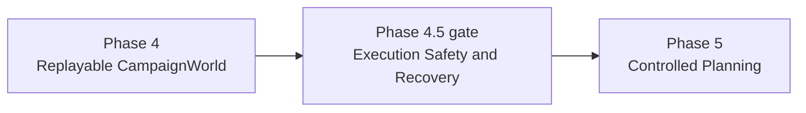
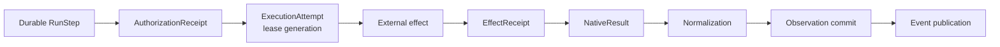
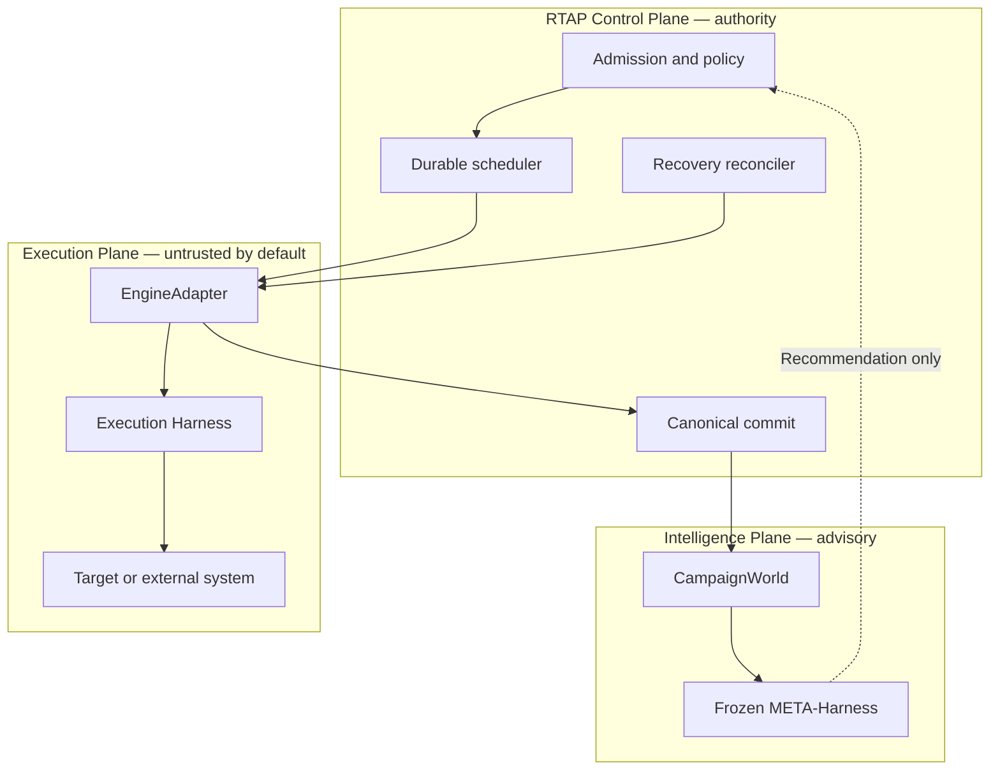
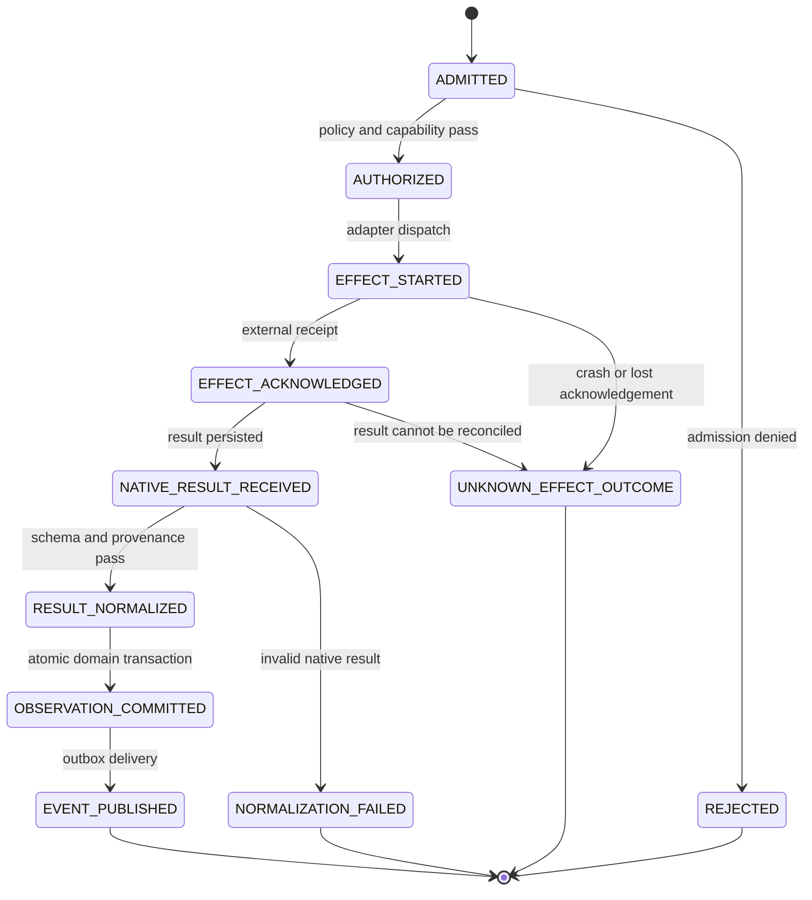
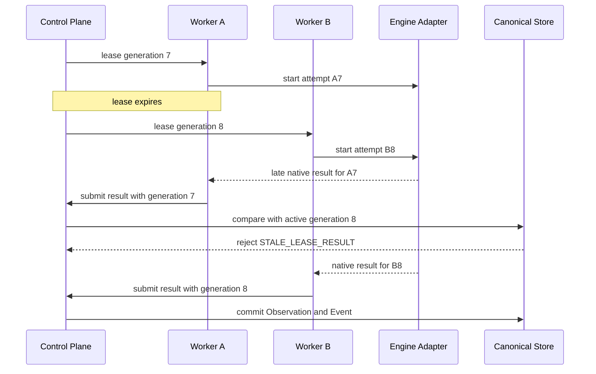
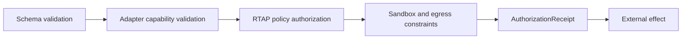
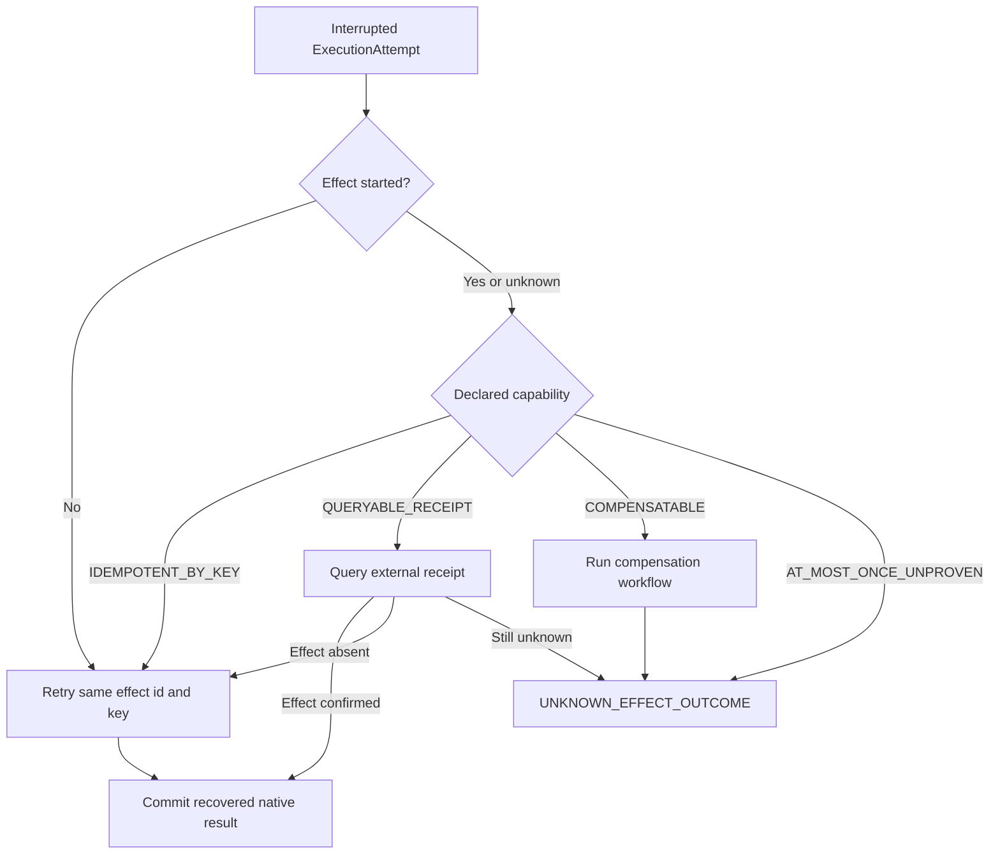

# RTAP Execution Safety & Recovery — High-Level Design

> Статус: **принято как обязательный hardening gate перед controlled planning**
> Дата ревизии: 2026-08-30
> Нормативная область: путь от admitted `RunStep` до canonical `Observation` и `CampaignEvent`
> Основная архитектура: [ARCHITECTURE.md](./ARCHITECTURE.md)
> Adaptive Runtime HLD: [ADAPTIVE_REDTEAM_RUNTIME.md](./ADAPTIVE_REDTEAM_RUNTIME.md)
> Frozen positioning: [FROZEN_META_HARNESS.md](./FROZEN_META_HARNESS.md)

Этот документ определяет **Execution Safety & Recovery boundary** RedTeam Assessment
Platform (RTAP). Он формализует identity внешнего исполнения, authorization, lifecycle
неатомарного effect, fencing устаревших результатов, recovery после crash и admission
criteria для перехода от Phase 4 к Phase 5.

Решение заимствует operational patterns из `wiki/Arch_claude`, но адаптирует их к
authority model RTAP. RTAP не становится general-purpose agent harness, а Frozen не
получает права исполнять effects или изменять canonical security truth.

---

## 1. Решение

Внешний вызов target, scanner, repository tool или agent runtime **не является атомарной
частью** транзакции RTAP. Durable `RunStep`, external effect, native result,
`Observation` commit и публикация события — разные стадии с разными failure modes.

RTAP вводит:

1. полную execution identity hierarchy;
2. отдельный `ExecutionAttempt` для каждой lease generation и физической попытки;
3. `AuthorizationReceipt` до пересечения adapter boundary;
4. `EffectReceipt` и явный outcome `UNKNOWN_EFFECT_OUTCOME`;
5. fencing late results по lease generation;
6. adapter-declared recovery capabilities;
7. fail-closed concurrency classes и scheduler barriers;
8. typed, ordered и versioned `InterceptorPlan`;
9. сквозной `OperationalEnvelope`, не являющийся source of truth;
10. crash-injection matrix и исполняемые Architecture Laws.

Эти контракты составляют **Phase 4.5 — Execution Safety & Recovery gate**. Gate не
перенумеровывает Phase 0–7 и не является новой product phase. Он запрещает admission в
Phase 5, пока execution substrate не доказал безопасное поведение при retry, crash,
lease takeover и неоднозначном внешнем effect.

### 1.1 Почему gate расположен после Phase 4

Phase 4 доказывает deterministic replay `CampaignWorld`. Только после этого можно
проверить, что recovery execution не создаёт divergent canonical history. Phase 5
разрешает Planner влиять на выбор следующей работы; такой контроль нельзя включать над
substrate, который способен повторить неизвестный effect или принять late result старой
lease.



---

## 2. Existing foundation и закрываемый gap

RTAP уже имеет:

- three-plane authority split;
- durable `RunStep`, lease, attempt и idempotency key;
- immutable snapshots и полный `RecommendationBinding`;
- atomic `Observation + CampaignEvent` commit;
- outbox, event sequence, duplicate rejection и replay;
- `WorldGeneration`, `WorldEpoch` и fingerprint;
- process-isolated Frozen worker и deterministic fallback;
- signed model artifacts, Architecture Laws и shadow promotion.

Эти механизмы остаются foundation и не дублируются данным HLD.

Незакрытый участок начинается после admission durable work и заканчивается canonical
commit:



Database transaction не может атомарно охватить target или внешний engine. Поэтому
idempotency `RunStep` не доказывает exactly-once external effect.

---

## 3. Authority и trust boundaries



Нормативные правила:

- только Control Plane создаёт `RunStep`, выдаёт lease и коммитит `Observation`;
- `EngineAdapter`, engine, target и native result не считаются authority;
- Frozen не создаёт `ExecutionAttempt`, не авторизует effect и не выполняет recovery;
- telemetry, hooks и interceptors не меняют Verdict;
- engine-native permissions могут сужать доступ, но не заменяют RTAP authorization;
- любой новый MCP, agent или scanner входит через OHS/ACL и тот же effect protocol.

---

## 4. Execution identity hierarchy

Canonical hierarchy:

```text
Campaign
└── AssessmentRun
    └── RunStep
        └── LeaseGeneration
            └── ExecutionAttempt
                └── EngineRequest
                    └── ExternalEffect
                        └── NativeResult
                            └── Observation
                                └── CampaignEvent
```

### 4.1 Семантика identity

| Identity | Семантика | Стабильность |
|---|---|---|
| `campaign_id` | Версионируемый план оценки | Между runs |
| `assessment_run_id` | Один запуск immutable campaign snapshots | На весь run |
| `run_step_id` | Одна единица durable intended work | Между retry |
| `lease_generation` | Монотонный fencing token владения | Меняется при takeover |
| `execution_attempt_id` | Одна физическая попытка исполнения | Новый для каждой попытки |
| `engine_request_id` | Correlation identity adapter/engine request | На один physical request |
| `effect_id` | Identity логического внешнего effect | Стабилен только при safe retry |
| `native_result_id` | Identity сохранённого native result | Immutable |
| `observation_id` | Canonical normalized evidence identity | После commit |
| `event_id` | Canonical campaign event identity | После commit |

`attempt_no` не является fencing token: два workers могут локально видеть одинаковый
номер. Authority имеет только монотонная `lease_generation`, выданная Control Plane.

### 4.2 ExecutionAttempt

```text
ExecutionAttempt {
    execution_attempt_id
    assessment_run_id
    run_step_id
    lease_generation
    attempt_no
    engine_adapter_id
    engine_adapter_version
    engine_request_id
    effect_id
    policy_snapshot_ref
    target_snapshot_ref
    interceptor_plan_generation
    concurrency_class
    started_at
    terminal_reason?
}
```

Обязательные invariants:

- attempt принадлежит ровно одному `RunStep` и lease generation;
- attempt immutable после перехода в terminal state;
- accepted native result связан с существующим active attempt;
- `Observation` наследует execution binding и provenance;
- retry не переиспользует `execution_attempt_id`;
- `effect_id` переиспользуется только если capability гарантирует безопасный retry.

---

## 5. Effect commit protocol

### 5.1 State machine



`EFFECT_STARTED` не означает, что effect подтверждён. `EFFECT_ACKNOWLEDGED` не означает,
что результат canonical. `OBSERVATION_COMMITTED` не означает, что outbox уже доставлен.

### 5.2 EffectReceipt

```text
EffectReceipt {
    effect_id
    execution_attempt_id
    engine_adapter_id
    engine_request_id
    idempotency_key?
    capability
    started_at
    acknowledged_at?
    external_receipt_ref?
    reconciliation_token?
    outcome:
        CONFIRMED
        FAILED_BEFORE_EFFECT
        UNKNOWN
}
```

Receipt хранит metadata и защищённые references, а не secret или raw target payload.
`external_receipt_ref` может указывать на encrypted native artifact.

### 5.3 Terminal reasons

Минимальная taxonomy:

```text
COMPLETED
CANCELLED
TIMED_OUT_BEFORE_EFFECT
AUTHORIZATION_DENIED
CAPABILITY_UNSUPPORTED
TARGET_UNAVAILABLE
FAILED_BEFORE_EFFECT
UNKNOWN_EFFECT_OUTCOME
NORMALIZATION_FAILED
STALE_LEASE_RESULT
OBSERVATION_COMMITTED
```

`ERROR` без reason code недостаточен для recovery policy.

---

## 6. Adapter recovery capabilities

Каждый `EngineAdapter` объявляет capability для каждой operation family, а не один
глобальный флаг на весь adapter.

```text
EffectCapability:
    IDEMPOTENT_BY_KEY
    QUERYABLE_RECEIPT
    COMPENSATABLE
    AT_MOST_ONCE_UNPROVEN
```

| Capability | Допустимое recovery behavior |
|---|---|
| `IDEMPOTENT_BY_KEY` | Повторить тот же logical effect с тем же idempotency key после fencing старого attempt |
| `QUERYABLE_RECEIPT` | Сначала запросить внешний status/receipt; retry только после доказанного отсутствия effect |
| `COMPENSATABLE` | Запустить explicit compensation workflow и сохранить оба receipts |
| `AT_MOST_ONCE_UNPROVEN` | Не retry автоматически; перейти в `UNKNOWN_EFFECT_OUTCOME` и применить operator/policy decision |

Правила:

- default для undeclared operation — `AT_MOST_ONCE_UNPROVEN`;
- adapter не может повысить capability динамически без новой version/digest;
- recovery policy вычисляется из capability, policy snapshot и receipt, а не из текста
  exception;
- retry budget не разрешает retry, запрещённый capability;
- cancellation не считается compensation;
- отсутствие ACK не доказывает отсутствие effect;
- `UNKNOWN_EFFECT_OUTCOME` является устойчивым business outcome, а не transient exception.

---

## 7. Lease-generation fencing

### 7.1 Late result sequence



### 7.2 Fencing algorithm

При приёме native result Control Plane атомарно проверяет:

1. `run_step_id` существует;
2. `execution_attempt_id` принадлежит этому step;
3. result binding совпадает с attempt;
4. attempt lease generation равна active generation;
5. attempt не terminal и не superseded;
6. authorization и policy snapshot не отозваны по fail-closed policy;
7. native artifact digest совпадает с persisted reference;
8. Observation для этого accepted result ещё не committed.

Нарушение пунктов 2–5 создаёт diagnostic/audit record, но не canonical Observation.
Late result может быть сохранён как quarantined native artifact для расследования.

---

## 8. Capability authorization

### 8.1 AuthorizationReceipt

```text
AuthorizationReceipt {
    authorization_id
    campaign_id
    assessment_run_id
    run_step_id
    operation_family
    target_snapshot_ref
    adapter_identity
    adapter_capability_digest
    policy_revision
    sandbox_profile_ref
    egress_policy_ref
    approved_at
    expires_at
}
```

Authorization pipeline:



Нормативные правила:

- receipt выдаётся на конкретный `RunStep`, operation family и immutable target snapshot;
- receipt expires до effect или подтверждается атомарно при dispatch;
- adapter version/capability digest mismatch требует новой authorization;
- target credentials представлены только `secret_ref`;
- engine-native permission не может расширить RTAP receipt;
- interactive approval и MCP elicitation не входят в Phase 4.5, но обязаны выдавать тот
  же typed receipt при будущем внедрении.

---

## 9. Scheduler safety classes

Каждая adapter operation объявляет:

```text
ConcurrencyDeclaration {
    concurrency_class
    resource_keys
    max_in_flight
    supports_cancellation
    destructive
    rate_limit_scope
}
```

Классы:

| Class | Допустимое исполнение |
|---|---|
| `READ_ONLY_PARALLEL` | Parallel в пределах `max_in_flight` и provider limits |
| `TARGET_SERIAL` | Не более одного effect на target/resource key |
| `CAMPAIGN_SERIAL` | Не более одного effect на Campaign |
| `EXCLUSIVE` | Глобальный barrier для данного runtime/resource set |
| `UNKNOWN` | Нормализуется в `EXCLUSIVE` |

Scheduler reservation создаётся до dispatch и освобождается только после terminal
resolution или explicit recovery takeover. Истёкшая worker lease не освобождает
external resource автоматически: сначала применяется effect recovery policy.

Для нескольких declarations действует наиболее строгий class. Planner не может
ослабить class или обойти barrier ради exploration budget.

---

## 10. Typed InterceptorPlan

RTAP допускает расширение execution pipeline только через compiled plan:

```text
InterceptorPlan {
    plan_generation
    policy_snapshot_ref
    ordered_descriptors[]
    rejected_descriptors[]
    plan_digest
}

InterceptorDescriptor {
    interceptor_id
    version
    stage
    criticality
    input_schema
    output_schema
    timeout
    side_effect_policy
}
```

Допустимые stages:

```text
PRE_DISPATCH
POST_NATIVE_RESULT
PRE_NORMALIZATION
POST_OBSERVATION_COMMIT
PRE_REPORT
```

Правила:

- порядок deterministic и входит в `plan_digest`;
- security-critical interceptor fail-closed;
- advisory interceptor может fail-open только с typed diagnostic;
- arbitrary shell/HTTP hook запрещён в canonical transaction path;
- interceptor не меняет identity, authorization или lease generation;
- `POST_OBSERVATION_COMMIT` не может откатить committed truth;
- plan generation входит в `ExecutionAttempt` и provenance `Observation`;
- изменение plan применяется только к новым attempts, если отдельная migration policy не
  доказала совместимость.

---

## 11. OperationalEnvelope и observability

```text
OperationalEnvelope {
    campaign_id
    assessment_run_id
    run_step_id
    lease_generation
    execution_attempt_id
    effect_id
    engine_request_id
    probe_attempt_id?
    observation_id?
    event_sequence?
    world_generation?
    world_epoch?
    model_digest?
    trace_id
}
```

Envelope переносится через logs, traces и metrics, но не является source of truth.
Canonical binding читается из domain store.

Требования:

- telemetry failure не изменяет Verdict и не блокирует canonical commit;
- raw prompts, responses, credentials и evidence не попадают в labels/logs по умолчанию;
- sink-specific redaction и retention обязательны;
- cardinality-sensitive IDs не используются как unrestricted metric labels;
- audit records для authorization, unknown effect и stale result имеют отдельную
  retention policy;
- SLO различают scheduler delay, execution duration, effect reconciliation и outbox lag.

Минимальные operational metrics:

```text
rtap_execution_attempts_total{adapter,terminal_reason}
rtap_unknown_effect_outcomes_total{adapter,operation_family}
rtap_stale_lease_results_total{adapter}
rtap_effect_reconciliation_duration_seconds{adapter}
rtap_scheduler_barrier_wait_seconds{concurrency_class}
rtap_observation_commit_latency_seconds{adapter}
rtap_outbox_lag_seconds
```

---

## 12. Recovery protocol

Recovery Reconciler работает от durable state, а не от process memory.



Retry создаёт новый `ExecutionAttempt` и новую lease generation либо выполняется
текущим active owner согласно scheduler policy. Старый attempt остаётся immutable.

`Commit recovered native result` проходит обычные validation, fencing, normalization и
atomic commit; recovery не имеет обходного пути к `Observation`.

---

## 13. Crash-injection matrix

Phase 4.5 требует deterministic kill points и проверку durable postconditions.

| Kill point | Ожидаемое состояние после restart |
|---|---|
| До authorization | Effect не запущен; step можно безопасно перераспределить |
| После authorization, до dispatch | Receipt может быть переиспользован только пока valid и binding не изменился |
| После dispatch, до локальной записи `EFFECT_STARTED` | Outcome считается unknown, если adapter не докажет отсутствие effect |
| После effect, до ACK | Reconciliation по capability; automatic blind retry запрещён |
| После ACK, до native result persistence | Receipt query или `UNKNOWN_EFFECT_OUTCOME` |
| После native result persistence, до normalization | Повторная deterministic normalization того же digest |
| После normalization, до Observation commit | Повтор transaction с duplicate protection |
| После Observation commit, до outbox delivery | Outbox публикует event без повторного Observation |
| После event delivery, до delivery ACK | Consumer dedup по `event_id` и sequence |
| После lease takeover, до late result старого worker | Late result rejected и quarantined |
| Между world apply и snapshot publication | Replay восстанавливает тот же fingerprint |
| После Frozen scoring, до Planner consumption | Recommendation принимается только с полным fresh binding |

Тест обязан проверять не только exit code, но и:

- число фактических external effects;
- terminal state обоих attempts;
- отсутствие duplicate Observation/Event;
- active lease generation;
- receipt/reconciliation audit;
- одинаковый CampaignWorld fingerprint после replay.

---

## 14. Architecture Laws

Каждый law имеет stable ID, deterministic seed, randomized trials и replayable
counterexample.

| Law ID | Statement |
|---|---|
| `redteam.execution/observation-binds-active-attempt` | Каждый committed `Observation` связан с active non-superseded `ExecutionAttempt` |
| `redteam.execution/late-result-from-old-lease-is-rejected` | Result с generation ниже active generation не становится canonical evidence |
| `redteam.execution/effect-start-is-not-commit` | `EFFECT_STARTED` не эквивалентен `OBSERVATION_COMMITTED` |
| `redteam.execution/unknown-effect-is-not-auto-retried` | Unknown external outcome не вызывает blind retry |
| `redteam.execution/retry-follows-adapter-capability` | Recovery action разрешена declared operation capability |
| `redteam.execution/authorization-precedes-effect` | External effect имеет valid bound `AuthorizationReceipt` |
| `redteam.execution/effect-id-stable-only-for-safe-retry` | Effect identity переиспользуется только при доказанной idempotency/reconciliation semantics |
| `redteam.execution/unknown-concurrency-is-exclusive` | Undeclared concurrency не приводит к optimistic parallel execution |
| `redteam.execution/interceptor-order-is-deterministic` | Один plan digest даёт одинаковый порядок и schemas |
| `redteam.execution/telemetry-is-not-authority` | Потеря или изменение telemetry не меняет domain outcome |
| `redteam.execution/recovery-preserves-single-observation` | Crash/restart не создаёт второй Observation для одного accepted native result |
| `redteam.execution/replay-preserves-effect-resolution` | Replay сохраняет terminal resolution и CampaignWorld fingerprint |

Laws проверяются на in-memory/fake adapters и минимум на одном production-shaped adapter
с controllable kill points.

---

## 15. Phase 4.5 admission criteria

Phase 5 запрещена, пока одновременно не выполнены все критерии:

1. late result предыдущей lease generation отвергается атомарно;
2. каждый `Observation` содержит binding на active `ExecutionAttempt`;
3. blind retry после неизвестного внешнего effect отсутствует;
4. recovery policy выводится из versioned adapter operation capability;
5. crash между effect и canonical commit корректно reconciled;
6. crash после Observation commit не создаёт duplicate Observation/Event;
7. `UNKNOWN` concurrency выполняется как `EXCLUSIVE`;
8. authorization receipt связан с immutable target/policy/adapter snapshots;
9. interceptor order deterministic и входит в provenance;
10. OperationalEnvelope трассирует путь без превращения telemetry в authority;
11. crash matrix выполняется в CI с replayable seeds;
12. все Architecture Laws проходят для Promptfoo vertical slice;
13. runbook описывает ручное разрешение `UNKNOWN_EFFECT_OUTCOME`;
14. rollback drill доказывает, что отключение hardening feature flag не ослабляет
    fencing уже начатых attempts.

Результат gate — не обещание exactly-once. Гарантия формулируется точнее:

> RTAP предотвращает duplicate canonical commit, fences stale execution owners и никогда
> не повторяет неоднозначный внешний effect без capability-backed recovery decision.

---

## 16. Delivery sequence

### 4.5.1 Identity и fencing

- schema `ExecutionAttempt`;
- монотонная lease generation;
- native result binding;
- stale-result quarantine;
- laws active-attempt и late-result rejection.

### 4.5.2 Effect journal и recovery

- effect lifecycle transitions;
- `EffectReceipt`;
- adapter operation capability declarations;
- reconciler и `UNKNOWN_EFFECT_OUTCOME`;
- crash kill points.

### 4.5.3 Authorization и scheduling

- `AuthorizationReceipt`;
- concurrency declarations и barriers;
- fail-closed defaults;
- protected audit records.

### 4.5.4 Interceptors и operations

- compiled `InterceptorPlan`;
- `OperationalEnvelope`;
- reason taxonomy, metrics и runbook;
- full admission suite.

Изменения сначала применяются к Promptfoo vertical slice. Duo, MCP и будущие engines
admit только после прохождения тех же contracts.

---

## 17. Deferred designs

### Phase 7 / production profile

- MCP как отдельный bounded context через OHS/ACL;
- interactive approvals и elicitation deadlines;
- PostgreSQL advisory/row locks для distributed barriers;
- multi-tenant authorization and quota isolation;
- external receipt reconciliation workers и operator UI.

### При появлении реального CustomAgentAdapter

- process generation и heartbeat lease;
- backend-neutral worker identity;
- output cursor и stale async publication guards;
- `ContextBuildReport`;
- отдельные task/process/result projections;
- subagent supervision и bounded tool delegation.

Эти contracts не вводятся преждевременно в Campaign Domain.

---

## 18. Non-goals

- перенос Claude conversation/model/tool loop внутрь Frozen;
- actor/swarm runtime в RTAP Domain;
- JSONL transcript как source of truth;
- conversation compaction для `CampaignWorld`;
- arbitrary shell/HTTP hooks в canonical transaction path;
- streaming external effect до authorization;
- in-process plugin marketplace;
- automatic retry на основе exception text;
- exactly-once claim без adapter/external-system evidence;
- разрешение Frozen создавать `RunStep`, исполнять effect или определять Verdict;
- унификация native permissions разных engines в общий неограниченный ACL.

---

## 19. Traceability к Arch_claude

Идеи использованы как source patterns, а не как authority или готовая реализация.

| Source | Перенесённый pattern | RTAP adaptation |
|---|---|---|
| [`12-agent-harness-and-tool-loop-atlas.md`](../Arch_claude/12-agent-harness-and-tool-loop-atlas.md), §181 | Identity hierarchy | Campaign/RunStep/lease/attempt/effect/result identities |
| Там же, §184 | Effect commit levels | Non-atomic effect state machine и receipts |
| Там же, §185 | Scheduler lanes | Fail-closed concurrency classes и barriers |
| Там же, §186 | Permission pipeline | Bound `AuthorizationReceipt` at adapter boundary |
| Там же, §187 | Retry/fallback generations | Lease fencing и new-attempt recovery |
| [`11-durability-projections-and-external-runtime.md`](../Arch_claude/11-durability-projections-and-external-runtime.md), §163 | Durability barriers | Explicit boundaries между effect, commit и publication |
| Там же, §165–166 | Hook plan | Typed/versioned `InterceptorPlan` без arbitrary hooks |
| Там же, §168 | Stale task generations | Late-result rejection by lease generation |
| [`13-assurance-boundaries-operations-and-ui-atlas.md`](../Arch_claude/13-assurance-boundaries-operations-and-ui-atlas.md), §203–204 | Telemetry/SLO | Non-authoritative `OperationalEnvelope` и reason taxonomy |
| Там же, §205–206 | Trust zones/capabilities | Operation-level capability and authorization receipts |
| Там же, §207 | Crash consistency matrix | Mandatory kill-point integration suite |
| [`02-ddd-reliability-and-operations.md`](../Arch_claude/02-ddd-reliability-and-operations.md), §19.1 | Единая семантика исполнения для всех оболочек доставки (`query.ts` — один источник model/tool-цикла и для REPL, и для headless/SDK) | `executeLeasedStep()` — единственная композиция admission → dispatch → fenced commit → settlement; CLI/MCP/GitLab/API получают одну семантику шага, а не по своей на поверхность |

При конфликте с [ARCHITECTURE.md](./ARCHITECTURE.md), authority split,
`RecommendationBinding` или canonical event laws приоритет имеет нормативная RTAP
архитектура. Этот HLD расширяет execution boundary, но не меняет владельцев truth.

Первые одиннадцать строк — **первый заход добычи**: все из трёх документов (11, 12,
13), все под execution safety. Двенадцатая — из второго захода,
[ARCH_CLAUDE_TRANSFER.md](./ARCH_CLAUDE_TRANSFER.md), выработавшего все четырнадцать
документов с адверсарной проверкой каждого кандидата против кода `rtap/src`. Из шести
его предложений реализованы §2.1 (`settleAttempt()`), §2.2 (back-pressure, частично) и
§2.3 (`executeLeasedStep()`); из них только §2.3 добавил новый architectural pattern,
поэтому строка в таблице одна. Остальные строки добавляются по мере принятия
предложений.

---

## 20. Итоговая позиция

```text
RunStep is durable intent.
AuthorizationReceipt is permission to cross the boundary.
ExecutionAttempt is one physical owner and generation.
EffectReceipt is evidence about a non-atomic external effect.
Observation is canonical normalized evidence.
CampaignEvent is the replayable domain consequence.
```

Между этими объектами нет неявных переходов. Каждый переход имеет typed identity,
durable state, fencing rule и recovery policy. Именно это делает controlled adaptive
planning безопасным: Planner может влиять на выбор work, но не может ослабить execution
safety, authorization или canonical truth.
