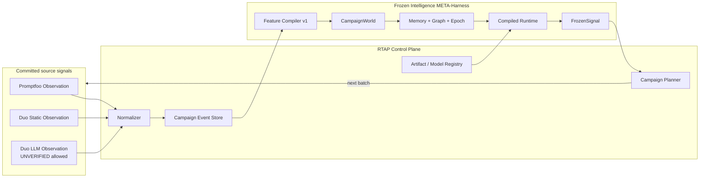
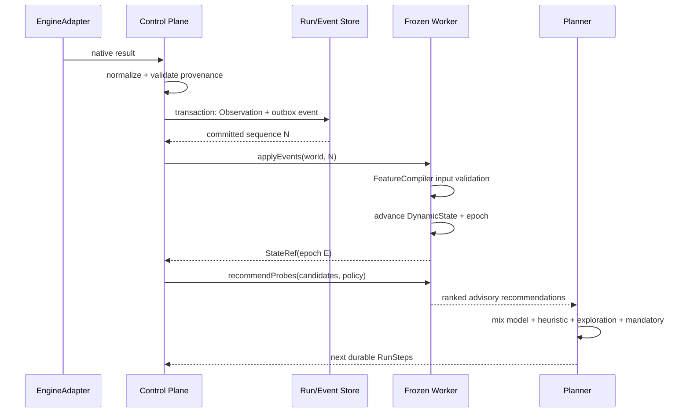
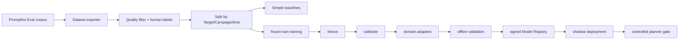

# Frozen Intelligence META-Harness — Campaign Intelligence Context

> Детальная спецификация глубокой интеграции `frozen` в RedTeam Assessment Platform.
> Родительская архитектура: [ARCHITECTURE.md](./ARCHITECTURE.md)
> Frozen META-Harness positioning: [FROZEN_META_HARNESS.md](./FROZEN_META_HARNESS.md)
> Нормативный Adaptive Runtime HLD: [ADAPTIVE_REDTEAM_RUNTIME.md](./ADAPTIVE_REDTEAM_RUNTIME.md)
> Source-grounded Mermaid HLD: [FROZEN_REDTEAM_HLD.md](./FROZEN_REDTEAM_HLD.md)
> Upstream rationale: [frozen/ARCHITECTURE.md](../../frozen/ARCHITECTURE.md)

## 0. Решение

`frozen` включается в RTAP как **Campaign Intelligence Context** архитектурного класса
**Intelligence META-Harness**, а не как четвёртый источник Findings. Контекст получает
committed Observations, поддерживает derived state кампании и возвращает advisory-сигналы
для Planner. META-Harness моделирует пространство experiments, но не владеет scheduler.

```text
Execution harnesses produce evidence.
Canonical graders produce native verdict evidence.
Frozen models the experiment space and proposes what to investigate next.
RTAP authorizes, schedules and commits what canonically happens.
```

Первый продукт — **Adaptive Probe Prioritizer**: ранжирование следующих probes при
фиксированном бюджете target calls.

### Цели

- увеличить число уникальных подтверждённых Findings на единицу бюджета;
- сохранять историю поведения Target между шагами и runs;
- обнаруживать saturation, drift и grader disagreement;
- объединять LLM observations и static code context без смешивания verdict semantics;
- поставлять компактные immutable model artifacts и domain adapters;
- сделать ключевые инварианты платформы исполняемыми laws.

### Не-цели первой версии

- raw-text semantic embedding;
- payload dedup через `frozen_embed`;
- генерация атак;
- замена promptfoo graders;
- автоматический `RESISTANT`/`VULNERABLE`;
- единый risk score поверх promptfoo и duo;
- обучение внутри production worker.

### Trust invariant

Frozen не решает, является ли событие уязвимостью. Frozen оценивает пространство
следующих experiments и их ожидаемую полезность; RTAP Planner решает, какое действие
разрешено и необходимо выполнить. Формально:

```text
Frozen MAY influence:
    what to test next;
    how to allocate the remaining budget;
    which target/probe appears more promising.

Frozen MUST NOT:
    validate a Finding;
    produce or override a Verdict;
    reinterpret missing evidence as success;
    execute a stale Recommendation;
    replace Promptfoo or Duo;
    consume raw payloads as semantic embeddings.
```

"Reinterpret missing evidence as success" is the same rule as
`redteam.observation/unverified-data-is-not-a-positive-label` (§10.3), restated at the
trust-boundary level rather than the label-hygiene level. "Execute a stale Recommendation"
is `redteam.planner/stale-recommendation-is-not-executed` (§10.2), formalized in §6 as the
`RecommendationBinding` check. Это тот же trust rule, что и везде в документе (execution
engines производят evidence, Control Plane владеет Observation/Finding/Verdict, Frozen
производит advisory-сигналы) — но собранный в одно проверяемое утверждение, а не рассеянный
по разделам 0/5.4/6/10. Frozen находится *внутри* feedback loop Campaign Planner'а, а не на
вершине trust hierarchy.

Центральная архитектурная единица — не сама KAN-модель, а воспроизводимая цепочка:

```text
ordered event
  → deterministic reducer
  → bound world state
  → versioned feature snapshot
  → immutable model generation
  → advisory signal
  → guarded planner recommendation
  → epoch-checked execution
```

Именно она превращает frozen из inference library в adaptive, replayable and verifiable
Intelligence META-Harness behind `FrozenModelRuntime`.

---

## 1. Architectural placement



Control Plane владеет lifecycle, persistence и authorization. Worker владеет только
materialized CampaignWorld и loaded immutable model during execution.

Если worker недоступен:

- новые Observations продолжают записываться;
- Planner переключается на deterministic heuristic;
- AssessmentRun получает `intelligence_status=DEGRADED`;
- verdict pipeline не меняется;
- после восстановления worker выполняет replay.

---

## 2. Bounded-context language

| Термин | Значение |
|---|---|
| **CampaignWorld** | Materialized frozen `DynamicState` одной логической campaign lineage. |
| **WorldBinding** | `(core_fingerprint, rotation_fingerprint, feature_schema_version, taxonomy_version)`. |
| **WorldEpoch** | Монотонная версия materialized state внутри one world lifetime. |
| **WorldGeneration** | Счётчик, инкрементируемый при каждой полной пересборке `CampaignWorld` (replay-from-scratch, schema migration, recovery from corruption). `epoch` в новом generation переиспользует малые числа — сам по себе не глобально уникален, поэтому staleness-проверки используют `(generation, epoch)`, не голый `epoch`. |
| **CampaignEvent** | Каноническое событие, полученное только из committed RTAP state. |
| **FeatureCompiler** | Total deterministic mapping structured event/context → V60. |
| **FeatureSnapshot** | Immutable manifest, определяющий каждую координату V60 и normalization. |
| **FrozenCoreRef** | Ссылка на signed `.frz` и metadata. |
| **DomainAdapterRef** | Ссылка на `.adp`, совместимый с core и конкретным domain. |
| **FrozenSignal** | Advisory result with provenance, confidence/quality and model refs. |
| **ProbeUtility** | Оценка полезности следующего Probe для получения новой информации. |
| **Saturation** | Оценка убывающей отдачи новых ProbeAttempts. |
| **Drift** | Изменение Target behavior относительно reference epoch/run. |
| **Replay** | Детерминированное восстановление CampaignWorld из ordered CampaignEvents. |
| **RecommendationBinding** | Composite key `(campaignId, worldGeneration, worldEpoch, featureSchemaVersion, modelDigest, policyVersion)` attached to every `FrozenSignal`/`ProbeRecommendation`. Distinct from `WorldBinding`: `WorldBinding` answers "is this artifact compatible with this world", `RecommendationBinding` answers "is this specific advisory output still safe to act on right now". See §6. |

---

## 3. World model

### 3.1 Immutable GraphSchema

```text
EntityType
  Target
  ProbeClass
  Strategy
  Finding
  SecurityControl
  Domain
  ModelVersion

RelationType
  PROBE_TESTS_TARGET          ProbeClass → Target
  STRATEGY_DELIVERS_PROBE     Strategy → ProbeClass
  TARGET_EXPOSES_FINDING      Target → Finding
  FINDING_CORRELATES_WITH     Finding → Finding
  CONTROL_MITIGATES_FINDING   SecurityControl → Finding
  TARGET_BELONGS_TO_DOMAIN    Target → Domain
  TARGET_USES_MODEL           Target → ModelVersion
```

Schema is compiled into ModelSnapshot. Illegal relations are rejected before a world
mutation. `CodeEntity` from duo may contribute features and EvidenceRefs, but it is not
inserted as CampaignEntity by default; otherwise repository graphs can dominate the
small state model.

### 3.2 Mutable state

Each core entity may have V60 state. For Target it represents:

```text
exposure profile
observed resistance
coverage distribution
uncertainty
risk trajectory
grader reliability
campaign saturation
recent drift
```

The coordinates do not directly correspond one-to-one to these labels after model
training. Interpretability belongs to FeatureSnapshot/readout metadata, not to an
informal coordinate name.

Mutable world also contains:

- relation confidence and timestamps;
- event sequence and last committed event ID;
- episodic memory rings;
- `epoch`;
- binding to model/rotation/feature/taxonomy identity.

### 3.3 Event catalog

```text
ProbeScheduled
ProbeExecuted
VulnerabilityObserved
ResistanceObserved
ObservationUnverified
GraderDisagreed
ExecutionFailed
FindingConfirmed
FindingSuppressed
MitigationApplied
RetestPassed
RetestFailed
TargetChanged
StaticRiskObserved
CampaignBudgetChanged
```

Every event envelope contains:

```typescript
interface CampaignEventEnvelope<T> {
  schemaVersion: string;
  eventId: string;
  campaignId: string;
  assessmentRunId: string;
  sequence: number;
  occurredAt: string;
  committedAt: string;
  eventType: string;
  sourceObservationIds: string[];
  featureSnapshotRef: string;
  taxonomySnapshotRef: string;
  payload: T;
}
```

Event payload contains structured fields and EvidenceRefs, never raw malicious text.
Ordering is per CampaignWorld. Duplicate `eventId` is idempotent.

---

## 4. FeatureCompiler v1

### 4.1 Contract

```typescript
interface FeatureCompiler {
  readonly featureSchemaVersion: string;

  compileObservation(input: {
    observation: Observation;
    target: TargetSnapshot;
    probe: ProbeSnapshot;
    history: CampaignHistoryView;
    staticContext?: StaticContextView;
  }): Result<V60, FeatureError>;
}
```

The compiler is:

- deterministic;
- total for supported schema versions;
- pure: no network, clock or mutable global state;
- explicit about missing values;
- frozen for the duration of AssessmentRun;
- tested against golden vectors and randomized laws.

### 4.2 Coordinate groups

| Coordinates | Group | Count | Examples |
|---|---|---:|---|
| 0–11 | Response behavior | 12 | refusal, tool-call behavior, output shape, response-length bucket |
| 12–21 | Grading | 10 | deterministic result, judge score, disagreement, evidence completeness |
| 22–31 | Runtime and trace | 10 | latency, token/cost bucket, retries, session continuity, trace availability |
| 32–41 | Probe and strategy | 10 | vulnerability family, delivery complexity, multi-turn, exploitability metadata |
| 42–51 | Campaign history | 10 | repeats, independent confirmations, coverage, recent outcomes, retest state |
| 52–59 | Provenance and quality | 8 | engine trust, config support, unverified ratio, static-context confidence |

Exact coordinate semantics, normalization ranges, missing-value encoding and taxonomy
mapping live in `FeatureSnapshot`, not only in prose.

### 4.3 Forbidden inputs

FeatureCompiler must not:

- call `frozen_embed(payload)`;
- treat token identity as semantic proximity;
- put secrets or raw payload bytes into V60;
- use duo `defaulted-pass` as resistant label;
- derive a feature from information unavailable at inference time;
- normalize using statistics from test/production future data.

### 4.4 Identity

Every produced vector is associated with:

```text
feature_schema_version
normalization_version
taxonomy_version
compiler_build
source_observation_id
```

A worker rejects vectors that do not match WorldBinding. Silent coercion is forbidden.

---

## 5. Worker boundary

### 5.1 Aggregate boundary hardening (prerequisite)

Source-level audit (2026-08-30) of `frozen-runtime` found that `DynamicState`'s aggregate
boundary is not enforced by the current public API: only `EntityRecord.state` is private,
while `schema`, `metadata`, `relations`, `memory`, `events`, `time` and the `rotator` are
public and directly mutable. External code can therefore change relations, memory or
events without going through a path that advances `epoch` — a live violation surface for
`redteam.frozen/state-change-advances-epoch` (§10.1) that exists independent of whether
that law is ever exercised against a build that permits it. Several public APIs also index
internal arrays by caller-provided IDs without bounds validation and can panic on malformed
input.

Source: `frozen/crates/frozen-runtime/src/state.rs` — field visibility audited manually;
not covered by an existing test or law.

This is a **prerequisite**, not a nice-to-have: nothing downstream should treat
`DynamicState` mutation as gated by the law registry until a narrow facade removes the
ability to bypass it. Required before worker implementation begins (F0, §12):

- introduce a `FrozenService` facade (Rust trait) that is the *only* type re-exported to
  worker code; `CompiledModel` and `DynamicState` internals stay crate-private beyond it;
- every mutation path through the facade is total (`try_*`) and advances `epoch`
  unconditionally — no direct field access from outside `frozen-runtime`;
- caller-provided IDs are validated before array indexing; malformed input returns a typed
  error, never panics;
- add a companion law `redteam.frozen/aggregate-boundary-is-enforced` (§10.1) that fails
  the build if `DynamicState` internals are reachable from outside the facade module —
  `state-change-advances-epoch` is only meaningful once this facade exists.

### 5.2 Deployment

A new Rust binary wraps controlled portions of `frozen-core`, `frozen-ir` and
`frozen-runtime`, built *against the facade in §5.1*, never against `DynamicState`
directly:

```text
redteam-frozen-worker
  load-model
  open-world
  apply-events
  evaluate-batch
  recommend-probes
  inspect-state
  replay
  health
```

Training remains offline and does not run in the serving worker.

Initial transport can be framed stdio JSON/CBOR for process isolation. Loopback gRPC is
an optimization ADR, not a requirement. Batch calls are mandatory to avoid IPC per
ProbeAttempt.

### 5.3 Port

```typescript
interface FrozenModelRuntime {
  describeCapabilities(): Promise<FrozenCapabilities>;
  loadModel(ref: ModelSnapshot): Promise<ModelHandle>;
  openWorld(input: OpenWorldRequest): Promise<WorldHandle>;
  applyEvents(world: WorldHandle, events: CampaignEventEnvelope[]): Promise<StateRef>;
  evaluateBatch(world: WorldHandle, inputs: FrozenInput[]): Promise<FrozenSignal[]>;
  recommendProbes(
    world: WorldHandle,
    candidates: ProbeCandidate[],
    policy: PlannerPolicySnapshot,
  ): Promise<ProbeRecommendation[]>;
  inspectState(world: WorldHandle): Promise<WorldInspection>;
  replay(input: ReplayRequest): Promise<StateRef>;
  closeWorld(world: WorldHandle): Promise<void>;
}
```

Every response includes worker build, core/adapter refs, feature version, input epoch and
output epoch.

### 5.4 Typed signals

```typescript
interface FrozenSignal {
  kind:
    | 'PROBE_UTILITY'
    | 'SATURATION'
    | 'RISK_TREND'
    | 'RETEST_PRIORITY'
    | 'GRADER_DISAGREEMENT'
    | 'TARGET_DRIFT'
    | 'ANOMALY';
  subjectRef: string;
  value: number;
  quality: 'SHADOW' | 'EXPERIMENTAL' | 'CALIBRATED';
  reasonCodes: string[];
  evidenceObservationIds: string[];
  modelRef: string;
  adapterRef?: string;
  featureSnapshotRef: string;
  worldGeneration: number;
  worldEpoch: number;
}
```

No mapper from FrozenSignal to Verdict exists in the initial contract.

**`kind` is not a uniform ML-output enum.** Bundling seven kinds under one `FrozenSignal`
interface implies they are equally grounded in the trained model; they are not. Each has a
distinct computation mechanism, and only one currently exists as a trained artifact:

| `kind` | Mechanism | Source | Delivery phase |
|---|---|---|---|
| `PROBE_UTILITY` | Trained scalar regression, `KanNet [60,60,1]` | Frozen model (§8.2 of this doc) | F2/F3 |
| `SATURATION` | Deterministic campaign metric (declining marginal new-information rate over a window) | CampaignWorld coverage/event stats — no model required | F5 |
| `TARGET_DRIFT` | Statistical distance between current and reference V60 aggregates | CampaignWorld state — statistical, not a KAN inference | F5 |
| `RETEST_PRIORITY` | Deterministic graph-weighted ranking over `GraphMessage`/episodic memory | CampaignWorld graph — no model required | F5 |
| `RISK_TREND` | Deterministic time-series aggregation of native risk scores | CampaignWorld event history — no model required | F5 |
| `GRADER_DISAGREEMENT` | Deterministic comparison of grader verdicts on equivalent inputs | Canonical Correlator, not frozen — surfaced through CampaignWorld | F5 |
| `ANOMALY` | Undefined — only graph/state primitives exist today, no detection logic | BUILD/DEFER, no committed mechanism | Research gate |

Consequence: reaching F5 does not require a second trained model. Six of the seven `kind`
values are deterministic or statistical computations over the same graph/state/memory
substrate the KAN model also reads — `ANOMALY` is the one genuine open research item, and is
gated accordingly (§12 Research gate). Producer mapping, restated as the design intends it
to be read:

```text
Frozen model       → predicted utility
CampaignWorld       → state, saturation, drift, retest and risk-trend metrics
Canonical pipeline  → grader disagreement, Finding and Verdict
Planner policy      → mandatory / heuristic / exploration mix (never a FrozenSignal kind)
```

### 5.5 Probe recommendation

```typescript
interface ProbeRecommendation {
  probeId: string;
  utility: number;
  rank: number;
  reasonCodes: string[];
  modelRef: string;
  campaignId: string;
  worldGeneration: number;
  worldEpoch: number;
  policyVersion: string;
}
```

`campaignId`, `worldGeneration`, `worldEpoch`, `modelRef` and `policyVersion` together form
the `RecommendationBinding` (§2) checked at execution time — see §6.

Planner does not blindly execute top-K. It combines:

```text
model exploitation arm
heuristic arm
random/control exploration arm
mandatory policy probes
```

The exploration share is versioned in PlannerPolicySnapshot and protected by an
ArchitectureLaw.

---

## 6. Sequence and consistency



Consistency rules:

1. Frozen only consumes committed events.
2. Event sequence gaps stop materialization and trigger replay; they are not skipped.
3. Reapplying an event ID does not advance state twice.
4. State mutation implies epoch advance.
5. Recommendation identifies exact input epoch.
6. Planner rejects stale recommendation if world advanced beyond policy tolerance.
7. A committed Observation never rolls back because worker failed.

`epoch` is the anti-stale mechanism for the whole loop, but it is not sufficient alone:
after a replay-from-scratch, schema migration or corruption recovery, a rebuilt
`CampaignWorld` starts counting epochs again from a low number, so a recommendation held
from a *previous* world lifetime can carry an `epoch` value that coincidentally matches the
*new* lifetime's current epoch — an ABA problem. `WorldGeneration` (§2) closes it: epoch is
only meaningful paired with the generation it was produced in.

```text
World generation 3, epoch 41 → FeatureSnapshot(3,41) → FrozenSignal(3,41) → Recommendation(3,41)

new event committed → epoch 42 (same generation 3)
Recommendation(3,41) is no longer executable.

world rebuilt from replay → generation 4, epoch resets and climbs again
Recommendation(3,41) must never be confused with a generation-4 epoch 41 that will occur later.
```

Formal rule — `RecommendationBinding` (§2) is checked at execution time, not just at
consumption time:

```text
execute(recommendation)  iff  recommendation.binding == current.binding
otherwise                     reject_as_stale(recommendation)

binding == (campaignId, worldGeneration, worldEpoch, featureSchemaVersion, modelDigest, policyVersion)
```

`campaignId`, `worldGeneration`, `featureSchemaVersion`, `modelDigest` and `policyVersion`
require **exact** equality — a mismatch on any of these is a correctness bug (wrong
campaign, wrong model, wrong policy), not mere staleness. `worldEpoch` alone may be checked
against a policy-defined tolerance (default: exact match, i.e. tolerance `0`) rather than
forced to exact equality unconditionally: the world can advance an epoch per committed
event, and a hard zero-tolerance gate on epoch specifically — as opposed to the other five
fields — risks livelock in a fast-moving campaign where the world outpaces the
recommend-then-act round trip. This is a deliberate refinement of the exact-equality
proposal this section is built from — flag it if strict epoch equality with no tolerance is
actually the intended contract; the other five fields are non-negotiable either way.

Rule 5 names the binding a recommendation was computed against; rule 6 is what makes that
naming enforceable. Every consumer of a `FrozenSignal` or `ProbeRecommendation` checks its
full `RecommendationBinding` before acting on it — this is the concrete mechanism behind
`redteam.planner/stale-recommendation-is-not-executed` (§10.2).

---

## 7. Persistence and replay

Control Plane is source of truth:

```text
campaign_events
  campaign_id
  sequence
  event_id
  event_type
  schema_version
  feature_snapshot_ref
  model_snapshot_ref
  body_json / artifact refs
  committed_at
```

Initial recovery:

```text
ordered events → FeatureCompiler → DynamicState replay → state fingerprint + epoch
```

Periodic snapshots may be added after measuring replay cost. A snapshot includes:

- campaign/world ID;
- last event sequence;
- world fingerprint;
- epoch;
- ModelSnapshot and WorldBinding;
- cryptographic digest;
- format version.

Snapshot never replaces canonical event history until retention and audit policy explicitly
allows compaction.

---

## 8. Model lifecycle



### 8.1 Labels

First prioritizer label estimates whether executing candidate Probe yields:

- a new confirmed Finding;
- a new independent confirmation;
- meaningful reduction of uncertainty;
- a high-value retest result.

Labels exclude:

- duo default-pass;
- ignored strategies/domains;
- transport failures treated as resistance;
- duplicate payload leakage across train/test;
- unreviewed Critical outcomes when used as ground truth.

The utility formula that produces the label — e.g.
`new_confirmed_finding·w1 + critical_finding·w2 + independent_evidence·w3 +
uncertainty_reduction·w4 − normalized_cost·w5` — is a **versioned policy artifact**, not
code embedded in the training pipeline. It ships alongside `FeatureSnapshot`/`ModelSnapshot`
with its own version, is reviewable independent of a model retrain, and a weight change is a
policy change subject to the same review as any other `PlannerPolicySnapshot` edit — not a
silent side effect of the next training run.

### 8.2 Splits

Random row split is forbidden. Required holdouts:

- unseen Target;
- unseen Campaign;
- temporal future;
- rare/Critical vulnerability classes;
- domain transfer.

### 8.3 Baselines

Frozen must beat or justify itself against:

- random ranking;
- fixed taxonomy order;
- hand-written heuristic;
- logistic regression;
- tree/boosting baseline;
- optional small MLP.

A smaller artifact or lower traffic is not sufficient if decision quality degrades beyond
the accepted budget.

### 8.4 Core and adapters

General `.frz` core learns cross-domain campaign dynamics. `.adp` specialization may be
created for financial, medical, coding-agent, support-agent, autonomous-agent and RAG
targets.

An adapter is admitted only if a cross-domain matrix shows real specialization:

```text
                     financial eval   medical eval
financial adapter          ↑               ↓/=
medical adapter            ↓/=             ↑
```

Report core bytes, adapter bytes, quality gain and cross-domain degradation together.
No claim of a “free adapter” is allowed.

---

## 9. Model and artifact security

FZM/FZA checksum/fingerprint establishes compatibility and accidental corruption checks,
not authenticity. ModelRegistry envelope contains:

```typescript
interface SignedModelArtifact {
  modelRef: string;
  format: 'FZM' | 'FZA';
  formatVersion: number;
  sha256: string;
  signature: string;
  issuer: string;
  createdAt: string;
  coreFingerprint: string;
  featureSchemaVersion: string;
  taxonomyVersion: string;
  trainingDatasetRef: string;
  benchmarkRef: string;
  parentCoreRef?: string;
}
```

Worker rules:

- verify digest and signature before parsing;
- enforce bounded decode and supported versions;
- validate model before materialization;
- reject adapter/core mismatch;
- expose `try_*` APIs at all untrusted boundaries;
- never return panic/abort as protocol behavior;
- run under restricted filesystem/network permissions;
- preserve previous healthy model for rollback.

Payload artifact dedup is outside frozen and uses cryptographic, tenant-scoped policy.

---

## 10. Architecture Law Registry

Frozen’s executable-law pattern is adopted both inside worker and across RTAP.

### 10.1 Campaign laws

```text
redteam.frozen/replaying-the-same-events-produces-the-same-fingerprint
redteam.frozen/state-change-advances-epoch
redteam.frozen/aggregate-boundary-is-enforced
redteam.frozen/duplicate-event-is-idempotent
redteam.frozen/event-gap-is-rejected
redteam.frozen/model-and-adapter-must-fit
redteam.frozen/feature-version-mismatch-is-rejected
redteam.frozen/recommendation-names-its-input-epoch
redteam.frozen/worker-failure-does-not-change-verdict
```

### 10.2 Planner laws

```text
redteam.planner/mandatory-probes-cannot-be-ranked-away
redteam.planner/exploration-arm-never-disappears
redteam.planner/stale-recommendation-is-not-executed
redteam.planner/budget-is-never-exceeded
```

### 10.3 Domain safety laws

```text
redteam.verdict/ungraded-never-becomes-resistant
redteam.observation/unverified-data-is-not-a-positive-label
redteam.signal/frozen-signal-is-not-a-verdict
redteam.artifact/raw-payload-never-enters-feature-vector
```

Each law has stable ID, statement, `held_by`, trials, deterministic seed, replay and a
calibrated positive/counterexample path. A green test without a justified statement and
coverage is insufficient.

---

## 11. Metrics and admission gates

### 11.1 Decision quality

- unique confirmed Findings / 100 target calls;
- recall@K and NDCG@K for useful probes;
- budget to first Critical Finding;
- coverage at fixed budget;
- PR-AUC/AUROC where classification is used;
- Brier score / expected calibration error;
- false-negative rate for Critical classes;
- performance on unseen targets and temporal holdout.

### 11.2 Runtime

- p50/p95 batch latency;
- throughput;
- RSS;
- core/adapter artifact size;
- declared versus measured traffic;
- replay duration by event count;
- worker restart recovery time.

### 11.3 Reliability

- replay fingerprint equality;
- artifact corruption rejection;
- adapter mismatch rejection;
- no panic on malformed external DTO;
- exact event sequence recovery;
- recommendation freshness;
- fallback campaign completion rate.

### 11.4 Promotion states

```text
OFF
SHADOW
EXPERIMENTAL        planner may consume with strict cap
CALIBRATED          measured production influence
```

Promotion requires benchmark artifact, owner approval and rollback plan. `CALIBRATED`
does not grant authority to emit Verdict.

---

## 12. Delivery plan

Resequenced 2026-08-30 against a source-level audit of `frozen-runtime`/`frozen-ir`/
`frozen-kan`/`frozen-cli` (readiness verified by file:line tracing, not by reading this
design doc). Original F-phases bundled GraphSchema, FeatureCompiler, deterministic replay
and signed ModelRegistry into one early phase; the audit found these sit at materially
different distances from working code — laws and signed artifacts are readiness "high",
full event-sourced replay is readiness "low/medium" because `DynamicState` has no
persistence at all today (no save/load, no snapshots, no event IDs, no gap detection). The
phases below are ordered by that readiness, not by narrative convenience.

### F0 — Contract, laws and hardened boundary

- FeatureSnapshot schema;
- CampaignEvent schema;
- FrozenSignal and ModelSnapshot schemas;
- law registry skeleton, including `redteam.frozen/aggregate-boundary-is-enforced` (§5.1,
  §10.1) — ships first because it requires no training data and no persistence, only API
  hardening on code that already exists;
- `Dataset::try_new()`/`validate()` and total `try_*` APIs at every untrusted boundary;
- `FrozenService` facade (§5.1) removing direct access to `CompiledModel`/`DynamicState`
  internals;
- heuristic baseline.

### F1 — Signed artifacts and supervised worker

- `SignedModelArtifact` envelope and ModelRegistry (§9) — readiness "high", the FZM1/FZA2
  formats and bounded decoding already exist, only signing/registry wrap them;
- supervised stdio worker: length-prefixed JSON/CBOR, `request_id`, structured error codes,
  batch scoring, strict stdout protocol (logs to stderr only), timeout/cancellation, restart
  supervision;
- explicitly **not** the `frozen-cli` binary as a stand-in protocol: it accepts unknown
  options silently, and `load_net()` swallows a load failure and may train a fresh model
  instead of erroring — unacceptable behavior behind an API boundary;
- degraded fallback (deterministic heuristic) when the worker is unavailable.

### F2 — Offline Probe Utility experiment

- promptfoo dataset exporter;
- label policy and human review; excluded sources: duo `defaulted-pass`, ignored
  strategies/domains, transport failures relabeled as resistance, duplicate payload leakage
  across train/test, unreviewed Critical outcomes as ground truth;
- target/campaign/time splits (§8.2), plus rare/Critical class and domain-transfer holdouts;
- baselines: random, fixed taxonomy order, hand-written heuristic, logistic regression,
  tree/boosting;
- scalar `KanNet [60, 60, 1]` MSE regression as the frozen candidate — readiness "medium":
  this is a direct use of training code that already exists (MSE/Adam/mini-batch/cosine
  decay), not a new loss function or a new training loop.

### F3 — Shadow Probe Utility signal

- freeze/calibrate the F2 model;
- ship as `FrozenSignal{kind: PROBE_UTILITY, quality: SHADOW}` only — no planner influence;
- validate against fixtures (full replay is not required yet — see F4);
- promote past SHADOW only per the benchmark/owner/rollback gate in §11.4.

### F4 — Event-sourced CampaignWorld

- canonical `campaign_events` store owned by Control Plane (§7);
- Campaign GraphSchema, event application, epoch/binding/fingerprint inspection;
- deterministic replay: reject sequence gaps, idempotent duplicate `eventId`, identical
  fingerprint on re-replay;
- this phase — not F0/F1 — is where `DynamicState` starts persisting across runs; ordered
  after F1–F3 because the audit rates it lower readiness than laws, signed artifacts or the
  scalar regression pilot, and none of F1–F3 depend on it.

### F5 — Controlled planning and campaign signals

- exploitation/heuristic/exploration mixer; stale-signal protection; A/B evaluation;
  limited production influence (former F4);
- campaign saturation signal (declining marginal information from new ProbeAttempts) —
  same MSE regression shape as the Probe Utility pilot, output `0..1`; mandatory coverage
  and the exploration arm remain independent of it;
- target behavioral drift signal (`distance(current_target_state, reference_target_state)`)
  — baseline, threshold and reason codes must be built explicitly, the runtime only supplies
  state storage and geometry;
- retest prioritizer after `MitigationApplied`, using `GraphMessage`/episodic memory for
  propagation; relations still originate from the canonical Correlator/Policy, never guessed
  by the runtime.

### F6 — Domain adapters and duo static fusion

- duo static signals enter CampaignWorld (former F5);
- measured domain `.adp` specialization, admitted only after a diagonal cross-domain matrix
  shows real gain (§8.4); calibration with `reassign_every > 0` changes core identity and
  must be disallowed for overlay-only adapters — only adapter-owned changes are permitted;
- hot swap at run boundary first; mid-run swap only after state-invariance laws;
- adapter rollback.

### Research gate — verdict/classification support

Requires a separate ADR. Minimum evidence:

- human-reviewed gold set;
- calibrated readout;
- Critical false-negative bound;
- comparison to deterministic and simpler ML baselines;
- explainable provenance;
- fail-closed mapping to `UNVERIFIED`;
- security review of model artifact and feature pipeline.

Gated last deliberately: the audit found no classification/ranking loss, calibration,
confusion-matrix or PR-AUC tooling anywhere in `frozen-kan` today — only scalar MSE
regression. A frozen-based grader is R&D from the current codebase, not an integration
task, and anomaly detection and Finding correlation (graph storage only, no correlation
logic) sit behind this same gate for the same reason.

---

## 13. Open decisions

1. FeatureSchema v1 exact coordinate definitions and normalization.
2. Whether one CampaignWorld spans multiple AssessmentRuns or each run forks lineage.
3. Framed stdio JSON, CBOR or loopback gRPC transport.
4. Event retention and snapshot cadence.
5. Target/domain adapter selection policy.
6. Exploration budget and mandatory taxonomy coverage.
7. Model signing authority, key rotation and revocation.
8. Human-review workflow and gold-label ownership.
9. Whether static code graph is summarized into features or partially mirrored in World.
10. Threshold for moving from SHADOW to EXPERIMENTAL.

---

## 14. Superseded integration

The former `FrozenAdapter.Recognize() → dedup_key` design is retired. It used the part
of frozen least appropriate for an adversarial security boundary and ignored the parts
that create architectural value: compiled immutable objects, adapters, graph schema,
dynamic state, memory, routing and executable laws.

Deep integration therefore means:

```text
not: payload → FNV identity → storage key

but: committed campaign history
      → versioned structured V60
      → replayable graph/state/memory
      → compiled model + measured adapter
      → advisory next action
```
