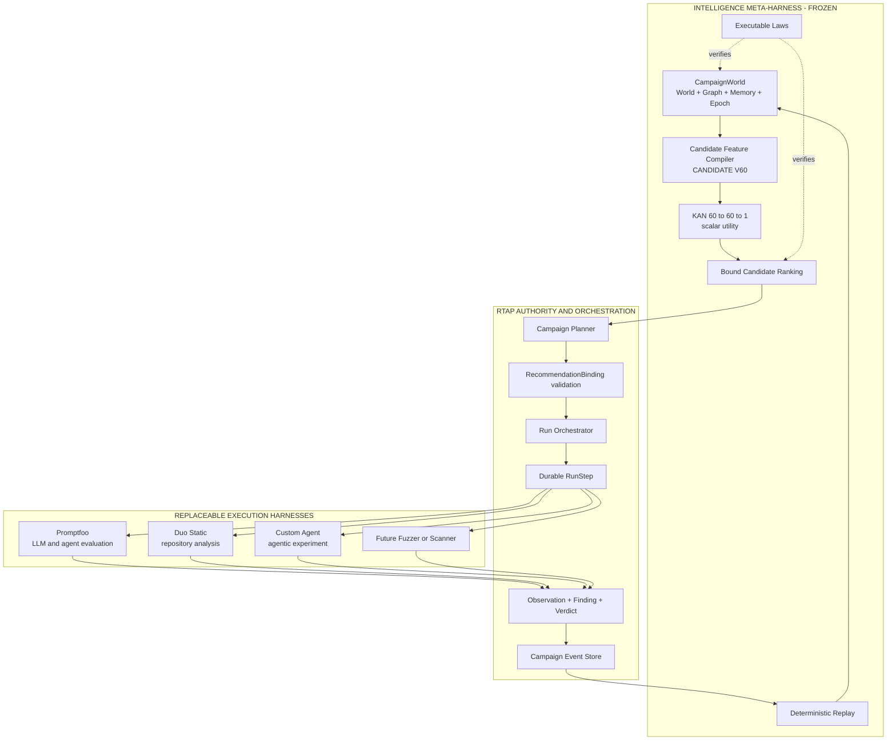
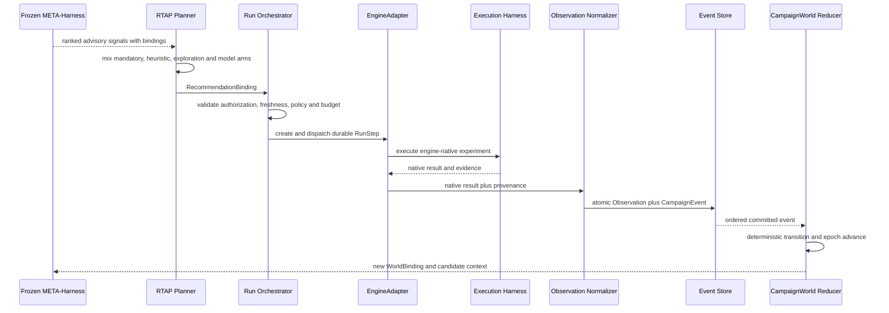
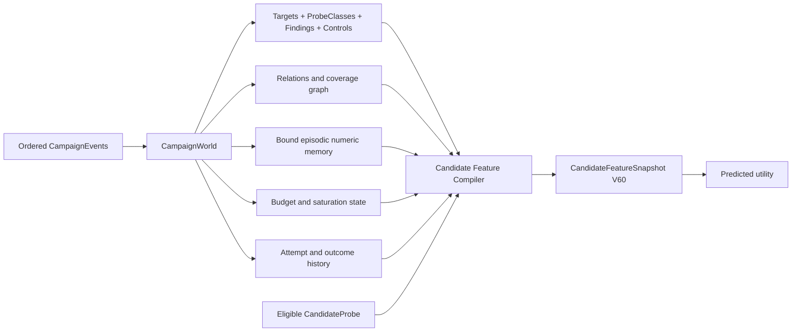
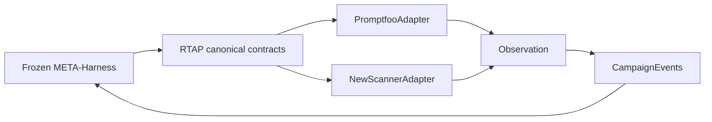
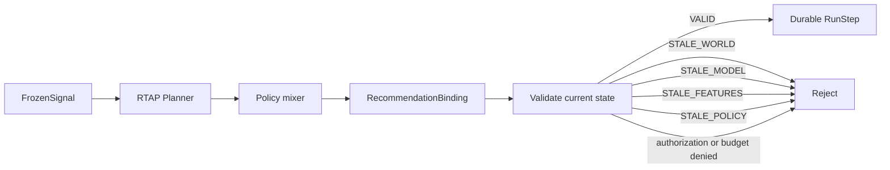
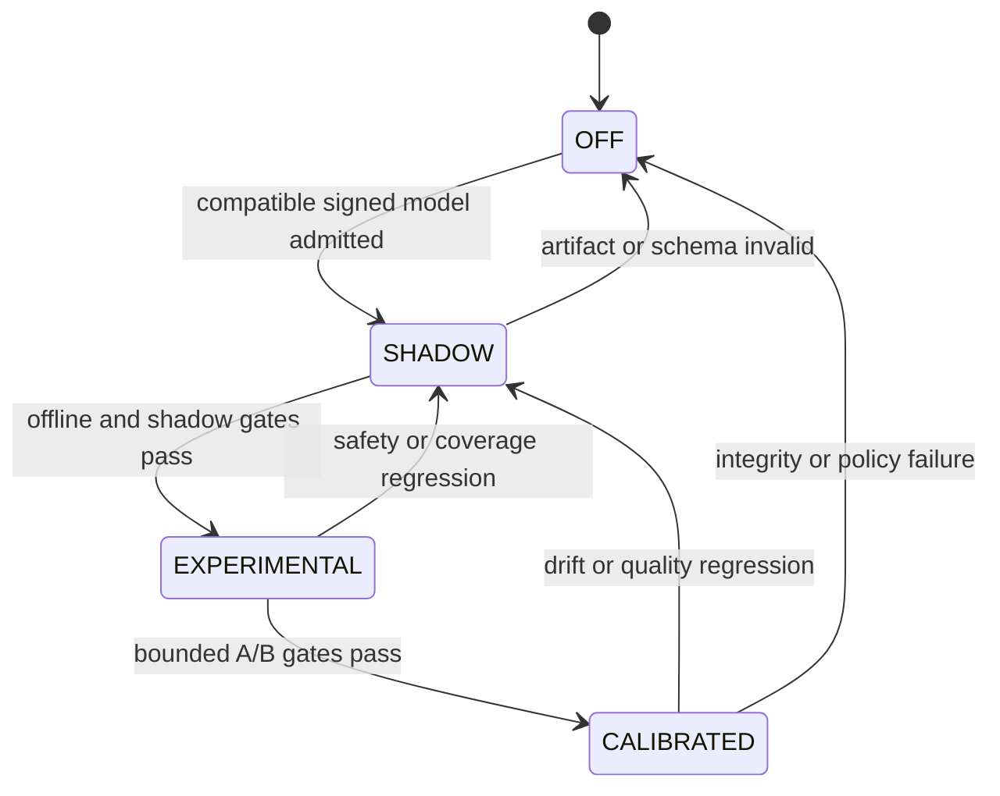

# Frozen Intelligence META-Harness — Architectural Positioning

> Статус: **нормативное architectural positioning**
> Дата ревизии: 2026-08-30
> Родительская архитектура: [ARCHITECTURE.md](./ARCHITECTURE.md)
> Closed-loop HLD: [ADAPTIVE_REDTEAM_RUNTIME.md](./ADAPTIVE_REDTEAM_RUNTIME.md)
> Детальный integration contract: [FROZEN_INTEGRATION.md](./FROZEN_INTEGRATION.md)
> Source-grounded Frozen HLD: [FROZEN_REDTEAM_HLD.md](./FROZEN_REDTEAM_HLD.md)

Этот документ фиксирует главный архитектурный positioning `frozen` внутри RedTeam
Assessment Platform.

Не:

```text
Frozen = Promptfoo++
```

А:

```text
Frozen = compact model-driven Intelligence META-Harness
RTAP   = authoritative orchestration and security-truth layer
Promptfoo / Duo / future engines = replaceable Execution Harnesses
```

---

## 0. Normative decision

> **Frozen is a compact, model-driven Intelligence META-Harness for adaptive Red Team
> campaigns.**

> **RTAP is the authoritative orchestration, provenance and security-truth layer.**

> **Promptfoo is one replaceable execution/evaluation harness among multiple current and
> future engines.**

Canonical responsibility formula:

```text
Frozen models and ranks.
RTAP authorizes and orchestrates.
Execution Harnesses execute.
RTAP commits canonical outcomes.
```

Frozen is not an adapter for Promptfoo. It is semantically above the execution ecosystem,
but it has no direct dependency on any particular engine. RTAP Control Plane is the only
mediation, authority and orchestration boundary between intelligence and execution.

---

## 1. Why META

An ordinary execution harness operates on one concrete experiment:

```text
Probe
  → Target or Model
  → Evaluation
  → Native Result
```

The Intelligence META-Harness operates on the campaign as a system:

```text
Campaign
  ├── Targets
  ├── CandidateProbes
  ├── Committed Observations
  ├── Findings
  ├── History
  ├── Memory
  ├── Budget
  ├── Coverage
  └── WorldBinding
          │
          ▼
  Intelligence META-Harness
          │
          ▼
  advisory answer:
  "Which eligible experiment is expected to improve campaign intelligence most?"
```

`META` means reasoning over the **space, order and history of experiments**. It does not
mean ownership of target execution, scheduler, Findings or Verdicts.

Frozen manages neither Promptfoo nor Duo. It:

- reconstructs a derived CampaignWorld from canonical events;
- preserves compact graph/state/memory context;
- compiles structured candidate features;
- scores expected utility;
- verifies architecture laws and replay invariants;
- emits bound advisory signals for RTAP Planner.

---

## 2. Platform placement



Logical layering does not create direct runtime coupling:

```text
Frozen ─X→ Promptfoo
Frozen ─X→ Duo
Frozen ─X→ Custom Agent

FrozenSignal → RTAP Planner → RecommendationBinding → RunStep → EngineAdapter
```

---

## 3. Harness taxonomy

| Architectural class | Responsibility | Examples | Explicitly does not own |
|---|---|---|---|
| **Execution Harness** | Generate or execute one class of experiments; collect native response, trace, grading and metrics | Promptfoo, Duo Static, custom agent, fuzzer, scanner | campaign-wide planning; canonical Finding/Verdict |
| **Intelligence META-Harness** | Model campaign state and experiment space; rank candidate work; preserve replayable context; verify laws | Frozen behind `FrozenModelRuntime` | target execution; RunStep creation; authorization; Verdict |
| **Authority / Orchestration Boundary** | Validate policy and bindings; allocate durable work; commit canonical outcomes | RTAP Control Plane | hidden engine-native semantics; unproven model authority |

Canonical definitions:

```text
Execution Harness:
    "Perform this authorized experiment and return native evidence."

Intelligence META-Harness:
    "Given this bound campaign state, estimate the value of each eligible experiment."

RTAP Control Plane:
    "Decide which experiment is authorized and necessary, execute it durably,
     and commit what canonically happened."
```

---

## 4. Mediated feedback loop



The loop crosses boundaries only through RTAP-owned objects:

```text
RecommendationBinding
RunStep
Observation
CampaignEvent
WorldBinding
FeatureSnapshot
FrozenSignal
EvidenceRef
```

No engine-native DTO is part of the Frozen contract.

---

## 5. What Frozen understands

Frozen understands normalized campaign semantics, not engine implementation details:



Frozen does not need to know whether an Observation originated from Promptfoo, Duo or a
future scanner beyond normalized provenance features needed by the versioned schema.

---

## 6. Compact intelligence core

Frozen's intended strength is not model size. It is a small deterministic substrate:

```text
CampaignWorld
+
Graph / State / Memory / Epoch
+
Deterministic Replay
+
Versioned V60 FeatureSnapshot
+
Compiled scalar utility model
+
Executable Architecture Laws
+
Bound advisory ranking
```

Desired runtime properties:

- compact immutable model artifacts;
- deterministic inference for identical bound input;
- supervised process isolation;
- replayable world reconstruction;
- explicit model/schema/policy provenance;
- fast batch scoring of candidate probes;
- air-gapped execution where required;
- graceful fallback to deterministic heuristic planning.

Frozen remains useful without becoming a general-purpose LLM. Raw payload semantics,
attack generation and security grading remain outside its MVP boundary.

---

## 7. Replaceability

### 7.1 Replace an Execution Harness



Replacing Promptfoo does not change:

- CampaignWorld event semantics;
- candidate feature schema;
- RecommendationBinding protocol;
- Finding/Verdict ownership;
- Frozen model port;
- planner safety laws.

The new adapter must only produce canonical Observation, provenance and EvidenceRefs.

### 7.2 Replace the Intelligence META-Harness

```text
FrozenModelRuntime
    score(ModelSnapshot, CandidateFeatureSnapshot)
        → FrozenSignal
```

A future intelligence implementation may replace Frozen without changing:

- EngineAdapters;
- durable RunStep;
- Observation/Finding/Verdict;
- Campaign Event Store;
- RecommendationBinding validation;
- planner mandatory/control/exploration arms.

### 7.3 Platform invariant

```text
CampaignWorld and canonical RTAP contracts survive replacement
of either the Execution Harness or the Intelligence META-Harness.
```

---

## 8. Authority boundary

Frozen advisory output is not executable by itself.



RTAP validates at least:

```text
campaign_id
assessment_run_id
candidate_probe_id
world_generation
world_epoch
world_fingerprint
feature_view = CANDIDATE
feature_schema_version
feature_snapshot_digest
compiler_build
model_digest
model_generation
planner_policy_version
not_after
authorization
eligibility
budget
```

A stale recommendation is never patched in place. RTAP requests a new recommendation
against current state.

---

## 9. Security truth boundary

```text
Execution Harness:
    native evidence and native grading

RTAP:
    normalized Observation
    canonical Finding
    VULNERABLE / RESISTANT / UNVERIFIED / ERROR

Frozen META-Harness:
    utility / saturation / drift / retest / anomaly advisory signals
```

Frozen MUST NOT:

- validate a Finding;
- produce or override canonical Verdict;
- reinterpret absent grading as resistance;
- aggregate incomparable native scores;
- convert model confidence into security truth;
- bypass the Observation Normalizer or Finding Correlator.

Failure of Frozen reduces adaptive efficiency, not correctness of canonical security
results.

---

## 10. Operating lifecycle



| Mode | META-Harness behavior | Execution authority |
|---|---|---|
| `OFF` | no model recommendations | RTAP mandatory/fixed/heuristic policy |
| `SHADOW` | rank and log candidates; no RunStep influence | RTAP mandatory/fixed/heuristic policy |
| `EXPERIMENTAL` | bounded recommendation share | RTAP guarded planner with control arm |
| `CALIBRATED` | policy-limited production share | RTAP guarded planner with rollback |

The model cannot promote itself. Promotion and demotion belong to RTAP policy and signed
Model Registry metadata.

---

## 11. Architecture invariants

```text
meta-harness-is-not-an-execution-adapter
meta-harness-signal-is-not-a-verdict
meta-harness-does-not-create-runstep
execution-harness-does-not-own-campaign-truth
rtap-is-the-only-authority-boundary
native-types-do-not-cross-engine-acl
uncommitted-result-never-enters-campaign-world
same-events-produce-same-world-fingerprint
state-change-advances-world-epoch
observation-and-candidate-feature-views-are-not-interchangeable
candidate-score-has-complete-binding
stale-recommendation-is-not-executed
control-and-exploration-arms-never-disappear
meta-harness-failure-falls-back-to-heuristic
```

These are protocol constraints, not naming conventions. Violating one is an architecture
defect even if individual model predictions appear accurate.

---

## 12. Non-goals

Frozen META-Harness is not:

- Promptfoo replacement;
- attack generator;
- generic LLM agent;
- raw-text semantic encoder;
- payload dedup service;
- canonical security grader;
- Finding correlator;
- authorization service;
- durable scheduler;
- owner of target credentials;
- universal risk score aggregator.

RTAP is not a model inference implementation, and Promptfoo is not the canonical campaign
aggregate. Each component remains bounded by its own port.

---

## 13. Evolution scenarios

### Today

```text
Frozen META-Harness
        ↓ advisory signals
RTAP Control Plane
        ↓ authorized RunStep
Promptfoo + Duo Static
        ↓ evidence
RTAP canonical state
        ↺ CampaignEvents
Frozen CampaignWorld
```

### Future execution ecosystem

```text
Frozen META-Harness
        ↓
RTAP Control Plane
        ├── PromptfooAdapter
        ├── DuoStaticAdapter
        ├── CustomAgentAdapter
        ├── FuzzerAdapter
        ├── ScannerAdapter
        └── ModelArtifactAdapter
```

Frozen continues to work because new engines implement RTAP Observation and provenance
contracts rather than Frozen-specific integration.

### Future intelligence ecosystem

```text
RTAP FrozenModelRuntime port
        ├── Frozen KAN utility runtime
        ├── deterministic heuristic runtime
        ├── alternative compact model runtime
        └── research ensemble runtime
```

RTAP continues to work because RecommendationBinding, RunStep and security truth remain
Control Plane contracts.

---

## 14. Final positioning

```text
small deterministic Intelligence META-Harness
+
authoritative RTAP Control Plane
+
replaceable Execution Harness ecosystem
=
adaptive, replayable and engine-independent Red Team platform
```

Final statement:

> **Promptfoo performs experiments. Frozen understands the experiment space and ranks
> potential next work. RTAP decides which experiment is authorized and necessary, creates
> its durable RunStep, and commits the canonical outcome.**

This is a platform architecture, not `Promptfoo++`: execution and intelligence may evolve
independently while CampaignWorld, provenance, replay and security truth remain stable.
