# Frozen × Red Team — Source-Grounded High-Level Design

> Статус: архитектурное предложение на основе source-аудита
> Дата: 2026-08-30
> Родительская архитектура: [ARCHITECTURE.md](./ARCHITECTURE.md)
> Frozen META-Harness positioning: [FROZEN_META_HARNESS.md](./FROZEN_META_HARNESS.md)
> Детальный integration contract: [FROZEN_INTEGRATION.md](./FROZEN_INTEGRATION.md)
> Upstream rationale: [frozen/ARCHITECTURE.md](../../frozen/ARCHITECTURE.md)

## 0. Решение

`frozen` используется в RedTeam Assessment Platform не как text encoder, payload hash
или самостоятельный security grader. Его целевая роль — **Intelligence META-Harness**
(реализующий Campaign Intelligence Runtime) и **verification substrate**:

1. executable Architecture Laws;
2. validated immutable model/policy artifacts;
3. scalar prediction signals над structured features;
4. replayable CampaignWorld с graph/state/memory;
5. adaptive probe prioritization;
6. measured domain adapters;
7. компактный air-gapped inference.

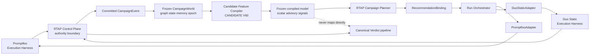

Promptfoo/Duo выполняют experiments. Frozen META-Harness моделирует experiment space и
предлагает следующую полезную работу. Только RTAP валидирует binding и создаёт RunStep.

Главный первый ML use case:

> Для каждой ещё не выполненной проверки оценить scalar utility и ранжировать probes
> так, чтобы увеличить число уникальных подтверждённых Findings на 100 target calls.

---

## 1. Легенда готовности

| Маркер | Значение |
|---|---|
| **IMPLEMENTED** | Механика присутствует в исходниках и имеет реальные call paths/tests. |
| **HARDEN** | Механика существует, но публичная/production boundary небезопасна. |
| **BUILD** | Компонент нужен для Red Team, но в frozen отсутствует. |
| **DEFER** | Не включать до появления данных, метрик или необходимых primitives. |
| **REJECT** | Текущий механизм принципиально не подходит для этой роли. |

---

## 2. Текущее состояние исходников

### 2.1 Crate map

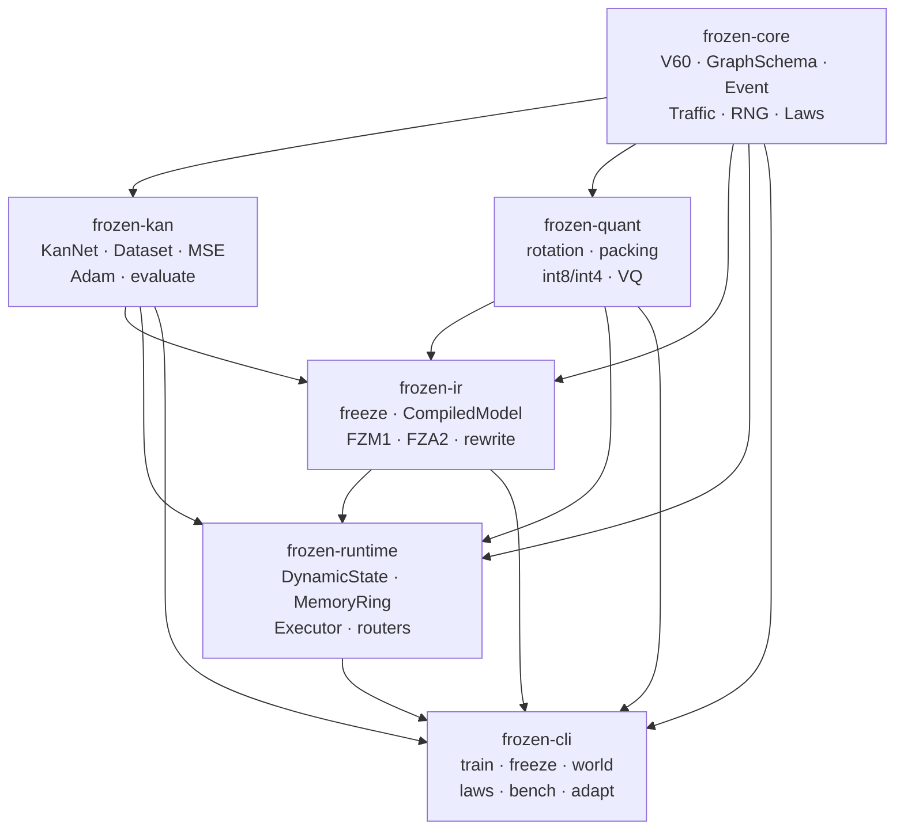

Workspace состоит из шести Rust crates, не имеет внешних package dependencies и
собирает immutable half отдельно от mutable runtime.

### 2.2 Capability map

```mermaid
flowchart LR
    subgraph Implemented["IMPLEMENTED"]
        I1["Fixed-width vector regression"]
        I2["Dense int8 int4 Select LUT lowering"]
        I3["FZM1 v4 validated model artifact"]
        I4["FZA2 domain adapter"]
        I5["GraphSchema and DynamicState"]
        I6["MemoryRing and Executor"]
        I7["epoch fingerprint binding"]
        I8["Executable laws"]
        I9["traffic and latency benchmark"]
    end

    subgraph Harden["HARDEN"]
        H1["Dataset shape and finite validation"]
        H2["Total ID based runtime APIs"]
        H3["Sealed DynamicState aggregate"]
        H4["Signed artifact envelope"]
        H5["Worker protocol and supervision"]
        H6["Adapter concurrency model"]
    end

    subgraph Build["BUILD"]
        B1["Feature Compiler"]
        B2["Campaign event reducer"]
        B3["World persistence and replay"]
        B4["Probe utility readout"]
        B5["Planner mixer"]
        B6["Drift saturation anomaly signals"]
        B7["Red Team dataset exporter"]
    end

    subgraph Defer["DEFER or REJECT"]
        D1["Security verdict classifier"]
        D2["Raw text semantic encoder"]
        D3["Payload dedup via frozen_embed"]
        D4["Direct Node FFI"]
        D5["Automatic finding correlation"]
    end

    Implemented --> Harden --> Build --> Defer
```

### 2.3 Реальный runtime path

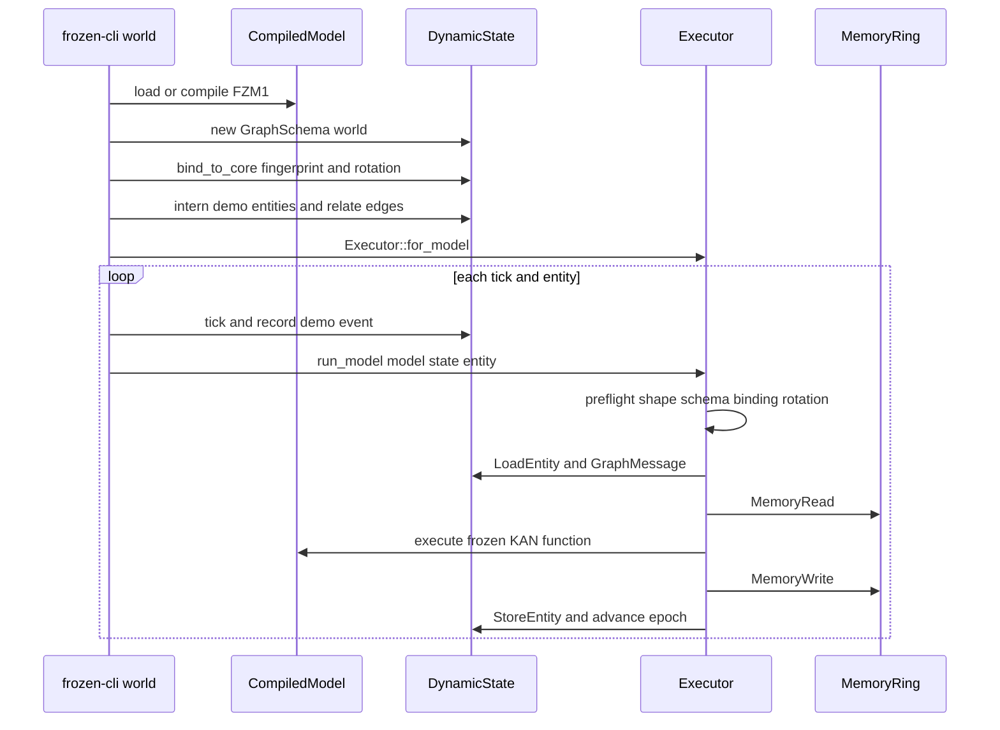

Этот path реален, но ontology, initial entities и events в CLI являются industrial demo,
а не Red Team implementation.

---

## 3. Source-level strengths

### 3.1 Stateful graph execution

`DynamicState` уже поддерживает entities, relations, events, time, per-entity memory,
epoch, state fingerprint и model/rotation binding.

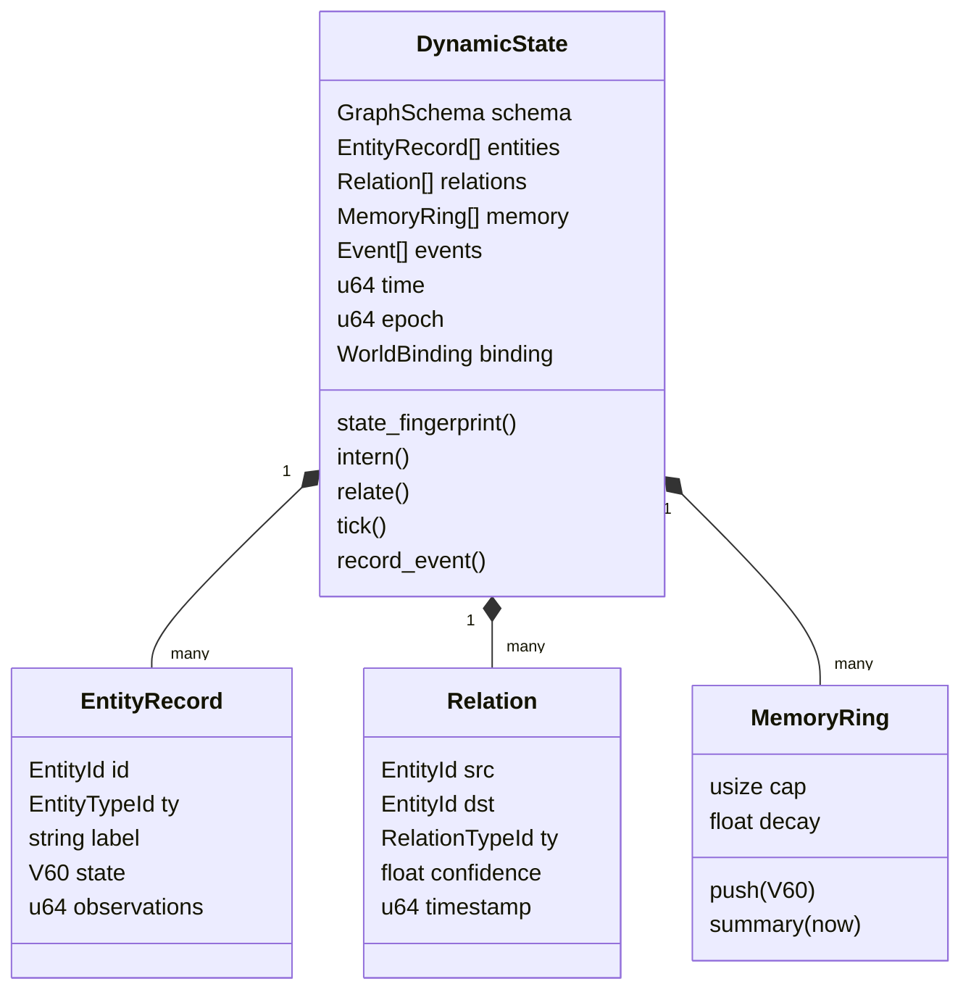

Ограничение: часть полей aggregate публична. Внешний код может обойти root mutators,
не поднять epoch или рассинхронизировать relations и private adjacency. Перед
production use aggregate должен быть sealed.

### 3.2 Validated immutable object

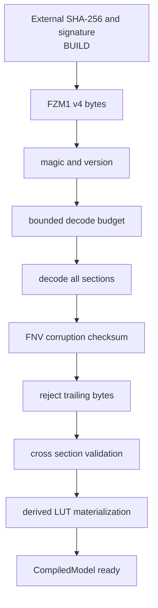

Встроенный checksum и core fingerprint — compatibility/corruption mechanisms, не
security authenticity. Red Team registry обязан проверять внешний cryptographic digest
и signature до FZM parsing.

### 3.3 Domain adapter mechanics

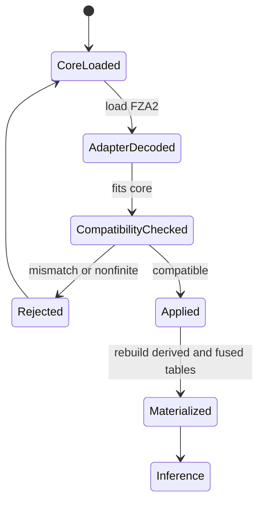

Adapter меняет domain-owned codebook words, scale tables, scale indices и bias. Direction
codes остаются core-owned. Поскольку `apply` мутирует model in place, global shared model
нельзя переключать конкурентно без clone/resolved immutable generation.

### 3.4 Executable laws

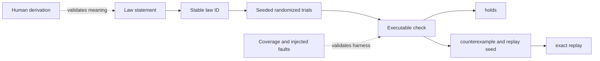

Сильная сторона frozen — не только количество tests, а release-compiled registry с
воспроизводимыми seeds. Для RTAP нужен тот же треугольник: mechanism + derivation +
coverage/fault injection.

---

## 4. Gaps before Red Team production

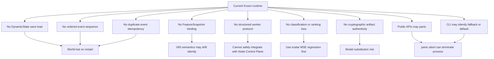

### Required hardening

1. `Dataset::try_new` and exact shape/finite validation.
2. Total `try_*` runtime APIs for all untrusted IDs and numeric values.
3. Private `DynamicState` internals with root-mediated mutation.
4. One-shot/versioned WorldBinding.
5. Canonical event IDs, sequence, gap rejection and idempotency.
6. Deterministic replay and optional snapshots.
7. Signed outer envelope for FZM/FZA.
8. Narrow `FrozenService` facade.
9. Process-isolated worker because release uses `panic=abort`.
10. Strict protocol; never parse the current human CLI output.

---

## 5. Ranked Red Team applications

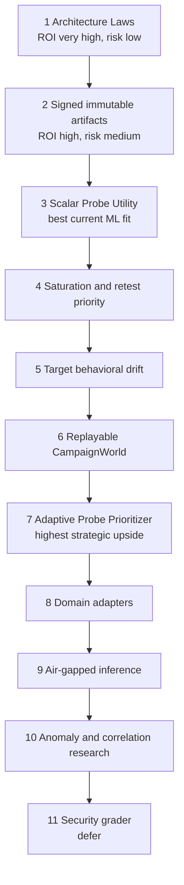

| Rank | Use case | Readiness | Required work |
|---:|---|---|---|
| 1 | Architecture Laws | High | Extract registry/pattern and define RTAP laws |
| 2 | Signed artifacts | Medium/high | Cryptographic envelope, registry, anti-rollback |
| 3 | Probe Utility regression | Medium | FeatureCompiler, dataset, scalar readout, worker |
| 4 | Saturation/retest | Medium | Labels, baseline and threshold policy |
| 5 | Target drift | Medium | Reference state, distance/readout, calibration |
| 6 | CampaignWorld | Low/medium | Event reducer, persistence, replay, sealed state |
| 7 | Adaptive planning | Medium after data | Candidate scoring, exploration/control mixer |
| 8 | Domain adapters | Mechanics ready | Cross-domain evidence and immutable resolved model |
| 9 | Air-gapped inference | Medium | Worker packaging, signing and operations |
| 10 | Anomaly/correlation | Low | Explicit models and canonical linking logic |
| 11 | Frozen grader | Low | BCE/CE, calibration, metrics, gold labels, ADR |

---

## 6. Target architecture

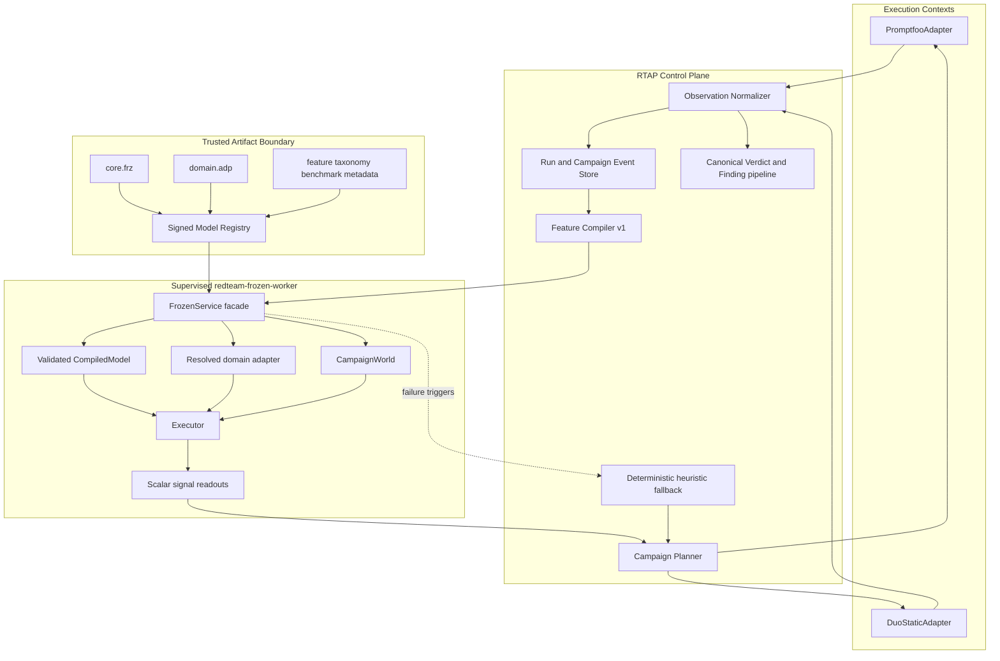

### Trust rule

```text
Execution engines produce evidence.
Control Plane owns Observation, Finding and Verdict.
Frozen produces advisory signals.
Frozen failure degrades planning, never changes a verdict to success.
```

---

## 7. CampaignWorld domain model

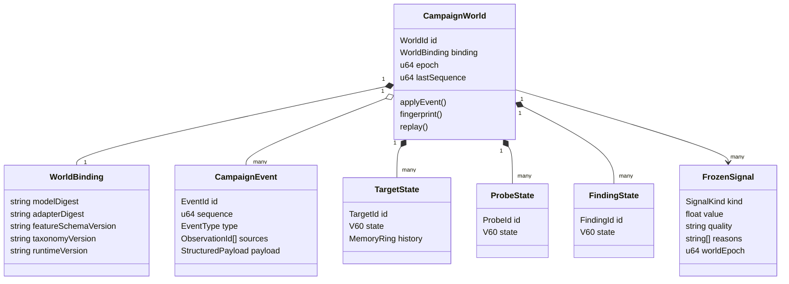

### Event state machine

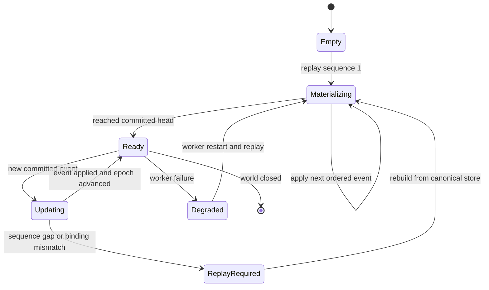

---

## 8. Feature and scalar model flow

### 8.1 V60 contract

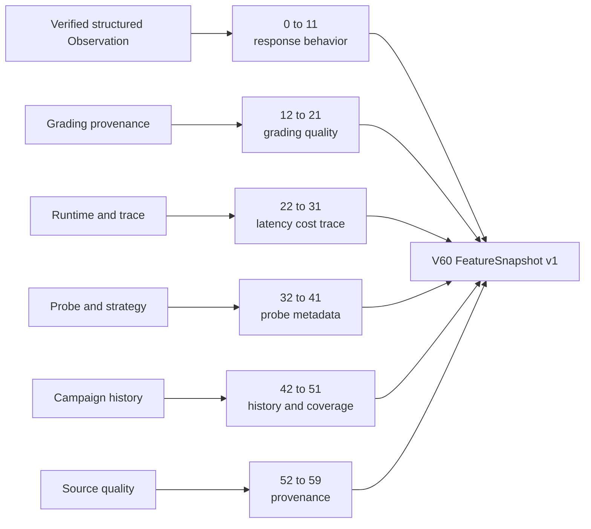

Raw payload, secrets and `frozen_embed(payload)` are forbidden inputs. Every vector is
bound to feature schema, normalization, taxonomy and compiler build.

### 8.2 First model

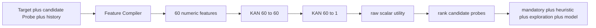

Model configuration:

```text
widths = [60, 60, 1]
residual = false
loss = MSE
output = unbounded scalar utility
```

Initial utility label can combine new Finding, Critical impact, independent evidence,
uncertainty reduction and normalized cost. Formula is versioned policy, not hidden inside
training code.

---

## 9. Training and artifact lifecycle

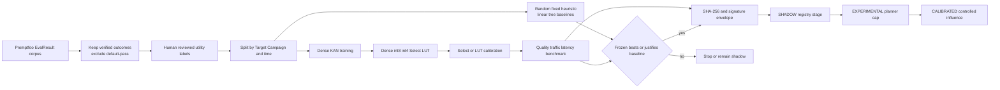

### Promotion state

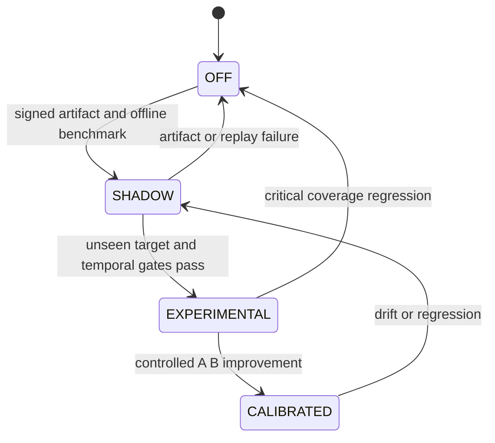

---

## 10. Domain adapter lifecycle

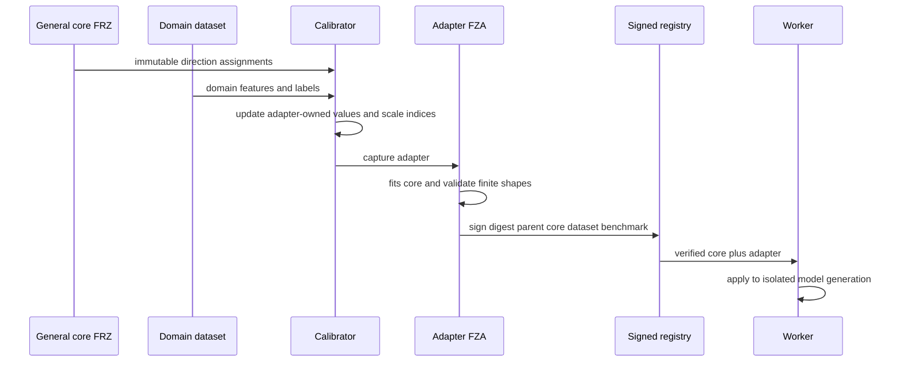

Rules:

- `reassign_every = 0` for adapter-only specialization;
- exact replay key includes both core and adapter cryptographic digests;
- adapter is admitted only after diagonal cross-domain evaluation;
- global mutable model switching is forbidden;
- mid-run adapter swap is deferred until state-invariance laws and rollback exist.

---

## 11. Worker deployment

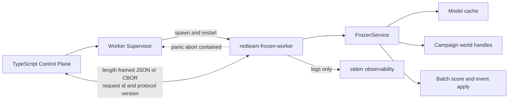

Required operations:

```text
health
load_model
open_world
apply_events
score_batch
recommend_probes
inspect_world
replay_world
close_world
```

Direct Node FFI is rejected initially because `panic=abort` would terminate the host.
HTTP/gRPC is deferred until the internal facade and replay contract stabilize.

---

## 12. Artifact trust boundaries

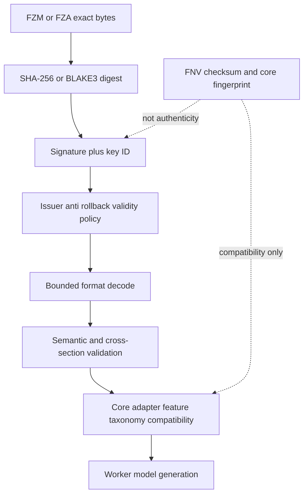

Signed metadata includes:

```text
artifact kind and format version
exact byte digest
issuer and signature algorithm
parent core digest for adapters
feature schema and taxonomy version
training dataset reference
benchmark reference
anti rollback sequence
```

---

## 13. Planner safety

```mermaid
flowchart LR
    C["Candidate probes"] --> M["Model ranked arm"]
    C --> H["Heuristic arm"]
    C --> R["Random exploration arm"]
    C --> P["Mandatory policy probes"]
    M --> MIX["Planner mixer"]
    H --> MIX
    R --> MIX
    P --> MIX
    MIX --> BUDGET["Budget and capability validation"]
    BUDGET --> STEPS["Durable RunSteps"]
```

Architecture Laws:

```text
redteam.planner/mandatory-probes-cannot-be-ranked-away
redteam.planner/exploration-arm-never-disappears
redteam.planner/stale-recommendation-is-not-executed
redteam.planner/budget-is-never-exceeded
redteam.signal/frozen-signal-is-not-a-verdict
redteam.frozen/worker-failure-does-not-change-verdict
```

---

## 14. MVP roadmap

```mermaid
flowchart TB
    F0["F0 Laws and contracts<br/>FeatureSnapshot Event Signal DTO"]
    F1["F1 Hardening<br/>Dataset validation total APIs sealed state"]
    F2["F2 Stateless worker<br/>signed model and batch scalar score"]
    F3["F3 Offline utility experiment<br/>baselines dense and frozen variants"]
    F4["F4 Replayable world<br/>event reducer epoch binding recovery"]
    F5["F5 Shadow prioritizer<br/>recommendations without influence"]
    F6["F6 Controlled planner<br/>mandatory heuristic exploration model"]
    F7["F7 Drift saturation retest"]
    F8["F8 Domain adapters and air gap packaging"]
    FR["Research gate<br/>classification and verdict support"]

    F0 --> F1 --> F2 --> F3
    F3 -->|quality gate passes| F4
    F3 -->|fails baseline| STOP["Stop or redesign features"]
    F4 --> F5 --> F6 --> F7 --> F8 --> FR
```

### Deliverables by phase

| Phase | Deliverable |
|---|---|
| F0 | Laws, schemas, stable IDs and deterministic fixtures |
| F1 | No panic on untrusted DTO, exact Dataset validation, sealed world mutation |
| F2 | Supervised framed worker, signed model load, batch scalar inference |
| F3 | Source dataset, group/time splits, baseline and representation benchmark |
| F4 | Event ID/sequence, idempotency, gap rejection, replay fingerprint |
| F5 | Shadow recommendations and stale-epoch protection |
| F6 | Planner mixer with immutable exploration policy |
| F7 | Calibrated drift/saturation/retest signals |
| F8 | Measured adapters, rollback and distributable air-gapped package |
| Research | BCE/CE/ranking losses, calibration and separate verdict ADR |

---

## 15. Admission criteria

### 15.1 Product value

```text
unique confirmed findings per 100 target calls
budget to first Critical Finding
coverage at fixed budget
calls saved at equal coverage
```

### 15.2 Ranking and model quality

```text
recall at K
NDCG at K
rank correlation
MSE and MAE for utility regression
unseen Target holdout
unseen Campaign holdout
temporal holdout
rare and Critical class slices
```

### 15.3 Runtime

```text
p50 and p95 batch latency
throughput
RSS
core and adapter bytes
declared versus measured traffic
worker restart time
world replay time
```

### 15.4 Reliability and security

```text
same events produce same world fingerprint
sequence gap rejected
duplicate event idempotent
corrupt artifact rejected
invalid signature rejected
adapter core mismatch rejected
feature version mismatch rejected
malformed request does not abort Control Plane
worker failure triggers fallback and campaign completes
```

### 15.5 Stop conditions

```mermaid
flowchart TB
    TEST["Evaluation result"] --> A{"Beats or justifies simpler baseline"}
    A -->|no| STOP["Stop or remain shadow"]
    A -->|yes| B{"Critical coverage preserved"}
    B -->|no| STOP
    B -->|yes| C{"Unseen target and temporal quality acceptable"}
    C -->|no| STOP
    C -->|yes| D{"Replay and worker safety gates pass"}
    D -->|no| STOP
    D -->|yes| PROMOTE["Promote one stage"]
```

---

## 16. Explicitly rejected uses

```mermaid
flowchart LR
    RAW["Raw payload"] -.->|REJECT| EMB["frozen_embed"]
    EMB -.->|not semantic| CORR["Finding correlation"]
    EMB -.->|not collision resistant| DEDUP["Artifact dedup"]
    SCORE["Uncalibrated MSE score"] -.->|REJECT| VERDICT["Security Verdict"]
    CLI["Human CLI stdout"] -.->|REJECT| API["Production API"]
    FFI["In-process Node FFI"] -.->|REJECT initially| NODE["Control Plane"]
```

Reasons:

- `frozen_embed` starts from unkeyed 64-bit FNV identity and has no canonicalization;
- random identity V60 does not preserve semantic similarity;
- current training has no classification loss or calibration;
- CLI silently accepts/falls back in ways unsuitable for automation;
- release `panic=abort` makes an in-process host boundary unsafe;
- current graph stores declared relations but does not infer correlation.

---

## 17. Source reference index

| Concern | Source |
|---|---|
| Dynamic world, memory, epoch, binding | `../../frozen/crates/frozen-runtime/src/state.rs` |
| Executor preflight and operations | `../../frozen/crates/frozen-runtime/src/exec.rs` |
| Recognizer and deterministic projections | `../../frozen/crates/frozen-runtime/src/recognize.rs` |
| Routers and adapter routing | `../../frozen/crates/frozen-runtime/src/router.rs` |
| Real CLI world lifecycle | `../../frozen/crates/frozen-cli/src/world.rs` |
| Dataset, MSE training, Adam, evaluate | `../../frozen/crates/frozen-kan/src/train.rs` |
| KanNet topology and residual contract | `../../frozen/crates/frozen-kan/src/net.rs` |
| Freeze modes and quantization integration | `../../frozen/crates/frozen-ir/src/lower.rs` |
| Calibration and reselection | `../../frozen/crates/frozen-ir/src/calibrate.rs` |
| CompiledModel validation and FZM1 | `../../frozen/crates/frozen-ir/src/object.rs` |
| FZA2 adapter lifecycle | `../../frozen/crates/frozen-ir/src/adapter.rs` |
| FrozenProgram | `../../frozen/crates/frozen-ir/src/program.rs` |
| Fold-based validation and reporting | `../../frozen/crates/frozen-ir/src/fold.rs` |
| Rewrite engine and receipts | `../../frozen/crates/frozen-ir/src/rewrite.rs` |
| Executable IR laws | `../../frozen/crates/frozen-ir/src/laws.rs` |
| Worker-hostile CLI parsing/fallbacks | `../../frozen/crates/frozen-cli/src/main.rs` |
| Workspace and panic profile | `../../frozen/Cargo.toml` |

---

## 18. Final architectural position

```mermaid
flowchart LR
    NOW["Use now<br/>laws validated artifacts scalar regression"]
    NEXT["Build next<br/>worker event reducer replay"]
    THEN["Adopt after evidence<br/>adaptive planning drift adapters"]
    LATER["Research later<br/>classification and verdict support"]

    NOW --> NEXT --> THEN --> LATER
```

Максимальная ценность frozen для Red Team возникает не от попытки превратить его в
LLM или заменить promptfoo. Она возникает от комбинации:

```text
structured campaign telemetry
+ immutable compiled model
+ replayable graph state and memory
+ compact scalar prediction
+ executable architectural laws
= adaptive and verifiable Red Team campaign intelligence
```
