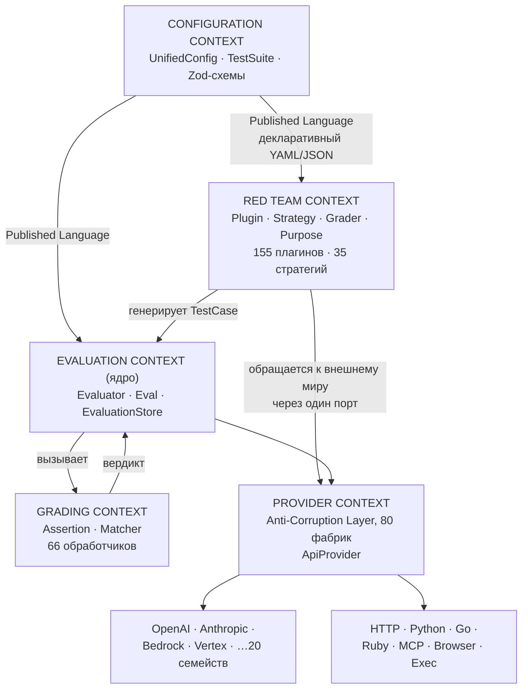
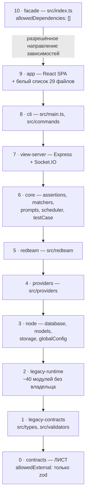
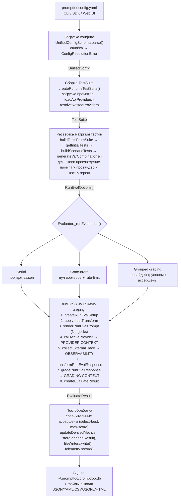
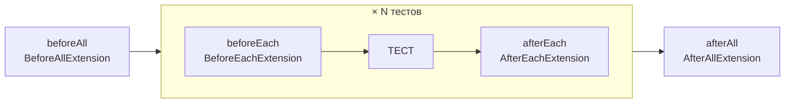

# Архитектура Promptfoo — обзор и ядро

> Часть 1 из 3. Разбор архитектуры через призму **Domain-Driven Design**.
> Диаграммы — псевдографика (ANSI box-drawing), читаются в терминале, в `less`, в `cat`.
>
> [← Индекс](./ARCHITECTURE.md) · **Обзор и ядро** · [Погружения в код](./03-code-deep-dives.md) · [DDD, надёжность, эксплуатация](./02-ddd-reliability-and-operations.md)

---

## 0. Паспорт системы

```
╔══════════════════════════════════════════════════════════════════════════════╗
║  PROMPTFOO — LLM eval & red-team toolkit                                     ║
╠══════════════════════════════════════════════════════════════════════════════╣
║  Версия          0.122.0                                                     ║
║  Коммит          2c140ef (main, 25.08.2026)                                  ║
║  Лицензия        MIT                                                         ║
║  Язык            TypeScript (strict, ESM), Node >= 22.22.0                   ║
║  Объём           1 615 файлов .ts/.tsx · 453 719 строк                       ║
║  Тесты           1 128 тестовых файлов (Vitest)                              ║
║  Примеры         231 директория в examples/                                  ║
╠══════════════════════════════════════════════════════════════════════════════╣
║  Провайдеры      244 файла · 98 696 строк · 80 фабрик в реестре              ║
║  Red-team        221 файл · 50 925 строк · 155 плагинов · 35 стратегий       ║
║  Ассёршены       58 файлов · 8 935 строк · 66 обработчиков                   ║
║  Web UI          695 файлов · 90 937 строк (React 19 + Vite + Zustand)       ║
║  Ядро оценки     src/evaluator.ts — 5 073 строки в одном файле               ║
║  Хранилище       SQLite/libSQL через Drizzle · 15 таблиц · 26 миграций       ║
║  HTTP API        10 роутеров + Socket.IO                                     ║
╚══════════════════════════════════════════════════════════════════════════════╝
```

**Что это за система по сути.** Promptfoo — движок воспроизводимых экспериментов над
LLM. Он берёт декларативную конфигурацию (`promptfooconfig.yaml`), разворачивает её в
декартово произведение «промпт × провайдер × тест-кейс», прогоняет каждую комбинацию,
оценивает результат набором проверок и сохраняет всё в локальную базу. Красная команда
(red team) — это надстройка: она **синтезирует** тест-кейсы, вместо того чтобы читать их
из конфига.

---

## 1. Единый язык (Ubiquitous Language)

DDD начинается со словаря. Термины ниже — не выдумка аналитика, а имена, реально
живущие в коде: в типах, в именах файлов, в CLI и в схеме БД.

| Термин | Где живёт в коде | Смысл в предметной области |
|---|---|---|
| **Eval** | `src/models/eval.ts`, таблица `evals` | Один прогон эксперимента. Корень агрегата. |
| **EvalResult** | `src/models/evalResult.ts`, таблица `eval_results` | Один результат: пересечение промпта, провайдера и тест-кейса. |
| **UnifiedConfig** | `src/types/index.ts:1398` | Полная декларация эксперимента. Zod-схема. |
| **TestSuite** | `TestSuiteConfigSchema` | Конфиг, приведённый к runtime-виду: загруженные промпты и провайдеры. |
| **TestCase / AtomicTestCase** | `src/types/index.ts` | Набор переменных + ожидания. «Атомарный» — уже без сценариев и матриц. |
| **Prompt / CompletedPrompt** | `src/prompts/` | Шаблон и его отрендеренная версия с метриками. |
| **Provider (ApiProvider)** | `src/types/providers.ts:123` | Порт к внешней LLM или к тестируемому приложению. |
| **Target** | синоним `providers` в конфиге | То же самое, но в лексике red-team: «мишень». |
| **Assertion** | `src/assertions/` | Проверка выхода. 66 типов. |
| **GradingResult** | `src/types/` | Вердикт проверки: pass/score/reason. |
| **Matcher** | `src/matchers/` | Доменный сервис оценки, где судьёй выступает сама LLM. |
| **Plugin** (red-team) | `src/redteam/plugins/` | Генератор атак под конкретную уязвимость. **Что** атакуем. |
| **Strategy** (red-team) | `src/redteam/strategies/` | Трансформация атаки. **Как** атакуем. |
| **Grader** (red-team) | `src/redteam/graders.ts` | Судья: удалась ли атака. |
| **Purpose** | `src/redteam/extraction/purpose.ts` | Извлечённое назначение системы-мишени. Контекст для атак. |
| **injectVar** | сквозной параметр | Переменная промпта, в которую внедряется полезная нагрузка. |
| **Scenario** | `ScenarioSchema` | Группировка данных и тестов в матрицу. |
| **Trace / Span** | `src/tracing/`, таблицы `traces`, `spans` | OpenTelemetry-телеметрия исполнения мишени. |
| **Blob** | `src/blobs/`, таблицы `blob_assets` | Бинарное вложение (изображение, аудио, видео) вне строки результата. |

**Правило именования, зафиксированное в конфиге.** `providers` и `targets` — одно и то
же поле; схема требует ровно одно из двух (`UnifiedConfigSchema.refine`) и нормализует
`targets → providers`. Это прямой след двух субкультур пользователей: инженеры качества
говорят «провайдер», безопасники — «мишень».

---

## 2. Карта ограниченных контекстов (Context Map)

```
                       ┌─────────────────────────────────────────┐
                       │        CONFIGURATION CONTEXT            │
                       │  UnifiedConfig · TestSuite · Zod-схемы  │
                       │  src/types · validators · util/config   │
                       └───────────────────┬─────────────────────┘
                                           │ Published Language
                                           │ (декларативный YAML/JSON)
                                           ▼
   ┌──────────────────┐          ┌──────────────────────┐          ┌─────────────────┐
   │  RED TEAM        │ upstream │   EVALUATION         │ upstream │   GRADING       │
   │  CONTEXT         ├─────────►│   CONTEXT  (ядро)    ├─────────►│   CONTEXT       │
   │                  │генерирует│                      │ вызывает │                 │
   │ Plugin · Strategy│ TestCase │ Evaluator · Eval     │          │ Assertion       │
   │ Grader · Purpose │          │ EvaluationStore      │◄─────────┤ Matcher         │
   │ 155 плагинов     │          │ RunEvalOptions       │  вердикт │ 66 обработчиков │
   │ 35 стратегий     │          │                      │          │                 │
   └────────┬─────────┘          └──────────┬───────────┘          └────────┬────────┘
            │                               │                                │
            │  обе стороны обращаются к     ▼                                │
            │  внешнему миру через один порт                                 │
            │                    ┌──────────────────────┐                    │
            └───────────────────►│  PROVIDER CONTEXT    │◄───────────────────┘
                                 │  (Anti-Corruption    │
                                 │   Layer, 80 фабрик)  │
                                 │  ApiProvider         │
                                 └──────────┬───────────┘
                                            │
                          ┌─────────────────┴─────────────────┐
                          ▼                                   ▼
                 ┌─────────────────┐                 ┌─────────────────┐
                 │ OpenAI/Anthropic│                 │ HTTP · Python   │
                 │ Bedrock · Vertex│                 │ Go · Ruby · MCP │
                 │ ...20 семейств  │                 │ Browser · Exec  │
                 └─────────────────┘                 └─────────────────┘

   ═══════════════════════════════ поперечные контексты ═══════════════════════════════

   ┌──────────────────┐  ┌──────────────────┐  ┌──────────────────┐  ┌───────────────┐
   │  PERSISTENCE     │  │  PRESENTATION    │  │  OBSERVABILITY   │  │  SCHEDULING   │
   │  Drizzle · SQLite│  │  view-server+app │  │  OTel · Tracing  │  │  rate limits  │
   │  15 таблиц       │  │  10 API-роутеров │  │  traces · spans  │  │  concurrency  │
   └──────────────────┘  └──────────────────┘  └──────────────────┘  └───────────────┘
```

Тот же поток данных между контекстами как Mermaid-диаграмма:



**Своими словами.** Представь ресторан с общей поваренной книгой на кухне.
Поваренная книга (Configuration Context) лежит в одном экземпляре, но
пользуются ею два разных человека: обычный повар (Evaluation) готовит по
ней заказанные блюда, а отдельный технолог по стресс-тестам (Red Team)
придумывает по мотивам той же книги провокационные блюда, которыми
проверяют, не отравится ли посетитель. Технолог не готовит сам — он просто
передаёт свои рецепты обычному повару, и тот готовит их точно так же, как
обычный заказ. Готовое блюдо повар не выдаёт гостю напрямую — сначала его
пробует дегустатор (Grading), который выносит вердикт «съедобно» или
«не съедобно» и возвращает оценку обратно на кухню. А ингредиенты и повар,
и технолог получают не напрямую от поставщиков, а через единое приёмное
окно (Provider Context) — окно само разбирается, чей это грузовик приехал
(OpenAI, Anthropic, HTTP-эндпойнт или что угодно ещё), и перекладывает груз
в стандартную тару кухни, так что ни повару, ни технологу не нужно знать,
с какого именно склада и в какой упаковке приехал конкретный помидор.

### Типы отношений между контекстами

| Пара контекстов | Паттерн DDD | Как выражен в коде |
|---|---|---|
| Configuration → все | **Published Language** | Zod-схемы + генерируемая JSON Schema (`npm run jsonSchema:generate`) |
| Red Team → Evaluation | **Upstream/Downstream, Conformist** | Red-team не имеет своего движка: `doRedteamRun` синтезирует `redteam.yaml` и передаёт его в обычный `doEval` |
| Evaluation → Provider | **Ports & Adapters** | Интерфейс `ApiProvider`, реализации грузятся лениво через реестр фабрик |
| Provider → внешние API | **Anti-Corruption Layer** | Каждый провайдер переводит чужой протокол в `ProviderResponse` |
| Evaluation → Persistence | **Repository + Port** | `EvaluationStore` — порт; `EvalEvaluationStore` — адаптер к модели `Eval` |
| Evaluation → Grading | **Shared Kernel** | Общие типы `GradingResult`, `AssertionParams` из `src/types` |
| App → всё остальное | **Open Host Service** | REST `/api/*` + Socket.IO; в браузер утекают только DTO |

---

## 3. Слоевая модель: то, что архитектура декларирует о себе сама

Уникальная черта репозитория: архитектура не описана в вики постфактум, а **исполняется
как код**. Файл `architecture/layers.json` — машиночитаемая конституция, а
`npm run architecture:check` — её прокурор.

### 3.1. Заявленная топология (`tierOrder`)

```
   ▲ выше = ближе к пользователю
   │
  10 ┌──────────────┐  facade            src/index.ts — публичный npm-API
   │ └──────────────┘                    allowedDependencies: [] (никого не тянет вверх)
   9 ┌──────────────┐  app               src/app — React SPA
   │ └──────────────┘                    + белый список из 29 конкретных файлов
   8 ┌──────────────┐  cli               src/main.ts, src/commands
   │ └──────────────┘
   7 ┌──────────────┐  view-server       src/server — Express + Socket.IO
   │ └──────────────┘
   6 ┌──────────────┐  core              assertions, matchers, prompts,
   │ └──────────────┘                    scheduler, testCase
   5 ┌──────────────┐  redteam           src/redteam
   │ └──────────────┘
   4 ┌──────────────┐  providers         src/providers
   │ └──────────────┘
   3 ┌──────────────┐  node              database, models, storage, globalConfig
   │ └──────────────┘                    (адаптеры Node-рантайма)
   2 ┌──────────────┐  legacy-runtime    ~40 корневых модулей без владельца
   │ └──────────────┘
   1 ┌──────────────┐  legacy-contracts  src/types, src/validators
   │ └──────────────┘
   0 ┌══════════════┐  contracts         src/contracts — ЛИСТ
     └══════════════┘                    allowedExternal: ["zod"] и больше ничего
   ▼ ниже = чистая доменная модель
```

Та же лестница слоёв как Mermaid-диаграмма:



**Своими словами.** Это многоэтажный дом, где действует одно строгое
правило: жилец с любого этажа может попросить об услуге только соседей
СНИЗУ, но не сверху. На верхнем этаже (facade) живёт консьерж, единственный,
кто общается с улицей, — и ему запрещено вообще у кого-либо просить об
одолжении внутри дома. Чуть ниже — квартира с витриной на улицу (app), у
которой есть свой, заранее согласованный список из 29 конкретных соседей,
к кому можно стучаться, и не больше. Дальше вниз идут этажи попроще —
интерфейс командной строки, веб-сервер, ядро бизнес-логики, red-team,
провайдеры, адаптеры к диску и базе — и каждый следующий этаж ниже ближе к
фундаменту. А в самом подвале (contracts) живёт затворник, которому
запрещено выходить наружу вообще ни к кому, кроме одной-единственной внешней
службы (`zod`), — это чистая, ничего не знающая о доме модель предметной
области, будущий отдельно продаваемый пакет.

**`contracts` — первый по-настоящему выделенный слой.** Ему запрещено импортировать
что-либо, кроме `zod`. Даже `node:fs` — запрещён (проверка нормализует префикс `node:`,
так что `"fs"` и `"node:fs"` неотличимы). Это заготовка под будущий пакет
`@promptfoo/schema`: браузеро-безопасное ядро контрактов.

### 3.2. Реальная топология: что показывает `edge-baseline.json`

Базовая линия фиксирует **каждое** межслойное ребро с точным числом импортов. Всего
50 рёбер, 2 851 импорт. Из них **13 рёбер (183 импорта) идут против объявленного
порядка** — это и есть техдолг, выраженный в числах:

```
   ОБРАТНЫЕ РЁБРА (нарушают tierOrder, отсортированы по весу)

   legacy-runtime ──► node          101 импортов  ████████████████████████
   legacy-runtime ──► providers      14           ███
   legacy-runtime ──► core           12           ██
   legacy-contracts ──► redteam      11           ██
   node ──► redteam                  10           ██
   node ──► core                      8           █
   node ──► providers                 7           █
   legacy-runtime ──► redteam         6           █
   legacy-contracts ──► legacy-runtime 4          ▌
   providers ──► redteam              4           ▌
   legacy-contracts ──► node          3           ▌
   redteam ──► core                   2           ▌
   providers ──► core                 1           ▌
                                    ────
                                     183 из 2 851  (6,4 %)
```

### 3.3. Цикл в графе слоёв

Формально это компонента сильной связности. Она одна, и в неё входит шесть слоёв:

```
        ┌───────────────────────────────────────────────────────┐
        │        КОМПОНЕНТА СИЛЬНОЙ СВЯЗНОСТИ (размер 6)        │
        │                                                       │
        │    legacy-contracts ◄──────────► legacy-runtime       │
        │           ▲   ▲                     ▲   │             │
        │           │   └──────┐         ┌────┘   ▼             │
        │           │          ▼         │      node            │
        │           │        redteam ◄───┴───────▲ │            │
        │           │          ▲ │               │ ▼            │
        │           └──────► providers ◄─────────┘ core         │
        │                                                       │
        │  Лимит (layers.json): maxSCC = 6                      │
        │  Фактический размер:  6  ──►  ЗАПАС ИСЧЕРПАН          │
        └───────────────────────────────────────────────────────┘

   Вне цикла (уже ацикличны):  contracts · view-server · cli · app · facade
```

Практический вывод: **любое новое взаимное связывание внутри шестёрки уронит CI.**
Храповик затянут до упора — расти можно только вниз, в сторону разрыва цикла.

### 3.4. Три храповика, удерживающих архитектуру

```
┌────────────────────────────────────────────────────────────────────────────┐
│  ХРАПОВИК 1 · Запрет на импорт фасада                                      │
│  Ни один внутренний модуль не смеет импортировать src/index.ts.            │
│  Иначе граф зависимостей заворачивается внутрь через публичный API.        │
├────────────────────────────────────────────────────────────────────────────┤
│  ХРАПОВИК 2 · Базовая линия рёбер                                          │
│  edge-baseline.json — потолок для каждого существующего ребра.             │
│  Новое ребро = красный CI. Снизил связность → architecture:baseline.       │
│  Обновлять базовую линию ради новой зависимости — запрещено.               │
├────────────────────────────────────────────────────────────────────────────┤
│  ХРАПОВИК 3 · Белый список браузерных импортов                             │
│  Слой app перечисляет 29 конкретных ФАЙЛОВ (не директорий), которые ему    │
│  можно тянуть из рантайма. Новый импорт из корня падает даже тогда, когда  │
│  отношение слоёв в целом разрешено.                                        │
└────────────────────────────────────────────────────────────────────────────┘
```

Плюс два точечных теста-инварианта в `test/architecture/`:
`providerRedteamBoundary.test.ts` (путь диспетчеризации провайдеров не должен статически
тянуть red-team — иначе ломается ленивая загрузка) и `evaluatorStoreBoundary.test.ts`.

---

## 4. Ядро: Evaluation Context

### 4.1. Агрегат `Eval`

```
        ┌─────────────────────────────────────────────────────────────┐
        │                    АГРЕГАТ  «Eval»                          │
        │                    src/models/eval.ts                       │
        ├─────────────────────────────────────────────────────────────┤
        │  ◆ КОРЕНЬ АГРЕГАТА: Eval                                    │
        │      id: string          (идентичность)                     │
        │      config: Partial<UnifiedConfig>                         │
        │      prompts: CompletedPrompt[]                             │
        │      persisted: boolean                                     │
        │      createdAt · author · description                       │
        │                                                             │
        │  ├─ ○ СУЩНОСТЬ: EvalResult  (0..N)                          │
        │  │     идентичность = (evalId, promptIdx, testIdx)          │
        │  │     score · success · latencyMs · cost · response        │
        │  │                                                          │
        │  ├─ ◇ ЗНАЧЕНИЕ: GradingResult                               │
        │  │     pass · score · reason · namedScores                  │
        │  │                                                          │
        │  ├─ ◇ ЗНАЧЕНИЕ: TokenUsage                                  │
        │  │     prompt · completion · cached · total                 │
        │  │                                                          │
        │  └─ ◇ ЗНАЧЕНИЕ: CompletedPrompt + PromptMetrics             │
        │                                                             │
        │  ИНВАРИАНТЫ, охраняемые корнем:                             │
        │   • метрики промпта пересчитываются только через агрегат    │
        │   • результат не может ссылаться на несуществующий промпт   │
        │   • при сбое записи фиксируется resultPersistenceFailed     │
        └─────────────────────────────────────────────────────────────┘

        Границы транзакции проходят по агрегату: EvalResult не сохраняется
        и не читается в обход Eval. Именно поэтому появился порт
        EvaluationStore — чтобы движок не знал о самой модели Eval.
```

Фабричные методы корня — классический DDD: `Eval.create()`, `Eval.findById()`,
`Eval.latest()`, `Eval.getMany()`. Отдельный объект `EvalQueries` вынесен для
read-запросов (переменные, ключи метаданных) — зачаток разделения команд и запросов.

### 4.2. Порты и адаптеры вокруг движка

Это самая зрелая часть архитектуры. `src/evaluator/runtime.ts` объявляет узкий порт,
и движок работает **только** через него:

```
                     ┌───────────────────────────────────────┐
                     │  Evaluator<TEvaluation, TResult>      │
                     │  src/evaluator.ts:3285                │
                     │                                       │
                     │  Не знает ни про SQLite, ни про Eval, │
                     │  ни про файловую систему.             │
                     └───────────────┬───────────────────────┘
                                     │ зависит от абстракции
                     ┌───────────────┴───────────────────────┐
                     │           ПОРТЫ (интерфейсы)          │
                     │  src/evaluator/runtime.ts             │
                     ├───────────────────────────────────────┤
                     │  EvaluationStore                      │
                     │    appendResult()   readResults()     │
                     │    appendPrompts()  save()            │
                     │    recordFinalResult()                │
                     │    readCompletedIndexPairs()  ← resume│
                     │    hasResultPersistenceFailure()      │
                     │                                       │
                     │  EvaluatorResultWriter                │
                     │    write() · close()                  │
                     │                                       │
                     │  EvaluatorRuntime                     │
                     │    createEvaluationStore()            │
                     │    createResultWriters()              │
                     │    resolveRuntimeTestSuite()?         │
                     └───────┬───────────────────────┬───────┘
                             │                       │
             ┌───────────────▼──────┐   ┌────────────▼──────────────┐
             │  АДАПТЕР: Node       │   │  АДАПТЕР: In-Memory       │
             │  src/node/           │   │  src/evaluator/           │
             │   evaluationStore.ts │   │   inMemoryStore.ts        │
             │                      │   │                           │
             │  EvalEvaluationStore │   │  Для встраивания и тестов │
             │  implements          │   │  и точечных тестов.       │
             │    EvaluationStore   │   │  Никаких зависимостей.    │
             │      <Eval,EvalResult>│  │                           │
             │                      │   │                           │
             │  → Drizzle → SQLite  │   │  → память процесса        │
             └──────────────────────┘   └───────────────────────────┘
```

Заметьте: адаптер `EvalEvaluationStore` — тонкая обёртка-делегат. Ровно то, чем адаптер
и должен быть. Вся логика осталась в агрегате.

### 4.3. Поток одной оценки: от YAML до строки в базе

```
 CLI / SDK / Web UI
      │
      │  promptfooconfig.yaml
      ▼
 ┌────────────────────┐
 │ ЗАГРУЗКА КОНФИГА   │  src/util/config/load.ts
 │ + Zod-валидация    │  UnifiedConfigSchema.parse()
 └─────────┬──────────┘  ошибка → ConfigResolutionError
           │  UnifiedConfig
           ▼
 ┌────────────────────┐
 │ СБОРКА TestSuite   │  src/evaluate.ts → createRuntimeTestSuite()
 │  • загрузка промптов│  src/prompts/  (file://, python://, js-функции)
 │  • loadApiProviders │  src/providers/index.ts → реестр фабрик
 │  • разрешение      │  resolveNestedProviders() — провайдеры внутри
 │    вложенных       │  ассёршенов и defaultTest
 └─────────┬──────────┘
           │  TestSuite (уже с живыми объектами)
           ▼
 ┌───────────────────────────────────────────────────────────────┐
 │ РАЗВЁРТКА МАТРИЦЫ ТЕСТОВ            src/evaluator.ts          │
 │                                                               │
 │   buildTestsFromSuite → getInitialTests → buildScenarioTests  │
 │   generateVarCombinations()   ← декартово произведение        │
 │                                                               │
 │   for prompt in prompts:                                      │
 │     for provider in providers:                                │
 │       for test in tests:                                      │
 │         for repeat in 1..N:                                   │
 │            → RunEvalOptions                                   │
 └─────────┬─────────────────────────────────────────────────────┘
           │  RunEvalOptions[]  (плоский список задач)
           ▼
 ┌───────────────────────────────────────────────────────────────┐
 │ ИСПОЛНЕНИЕ                        Evaluator._runEvaluation()  │
 │                                                               │
 │   ┌─────────────┐   ┌──────────────┐   ┌──────────────────┐   │
 │   │ Serial      │   │ Concurrent   │   │ Grouped grading  │   │
 │   │ (порядок    │   │ (пул воркеров│   │ (провайдер-      │   │
 │   │  важен)     │   │  + rate-limit)│  │  групповые       │   │
 │   └─────────────┘   └──────────────┘   │  ассёршены)      │   │
 │                                         └──────────────────┘  │
 │   filterCompletedResumeSteps()  ← докат прерванного прогона   │
 │   adjustConcurrencyForSerialFeatures()                        │
 └─────────┬─────────────────────────────────────────────────────┘
           │  каждая задача:
           ▼
 ┌───────────────────────────────────────────────────────────────┐
 │ runEval()                              src/evaluator.ts:1559  │
 │                                                               │
 │  1. createRunEvalSetup      подготовка переменных             │
 │  2. applyInputTransform     transform на входе                │
 │  3. renderRunEvalPrompt     Nunjucks-рендеринг                │
 │  4. callActiveProvider  ────────────────► PROVIDER CONTEXT    │
 │  5. collectExternalTrace ───────────────► OBSERVABILITY       │
 │  6. transformRunEvalResponse                                  │
 │  7. gradeRunEvalResponse ───────────────► GRADING CONTEXT     │
 │  8. createEvaluateResult                                      │
 └─────────┬─────────────────────────────────────────────────────┘
           │  EvaluateResult
           ▼
 ┌───────────────────────────────────────────────────────────────┐
 │ ПОСТОБРАБОТКА И СОХРАНЕНИЕ                                    │
 │   • сравнительные ассёршены: select-best, max-score           │
 │   • updateDerivedMetrics — производные метрики                │
 │   • store.appendResult() ──► EvaluationStore (порт)           │
 │   • fileWriters.write()  ──► JSON/YAML/CSV/JSONL/HTML         │
 │   • telemetry.record()                                        │
 └─────────┬─────────────────────────────────────────────────────┘
           ▼
      SQLite ~/.promptfoo/promptfoo.db  +  файлы вывода
```

Тот же поток одной оценки как Mermaid-диаграмма:



**Своими словами.** Это конвейер большой кухни, готовящей банкет по
заранее согласованному меню. Сначала приносят само меню (YAML) — и первым
делом его не начинают готовить, а проверяют на внутреннюю непротиворечивость:
не заказан ли несуществующий соус, правильно ли записаны блюда (загрузка
конфига и Zod-валидация); если меню составлено с ошибкой, банкет даже не
начинается. Меню, прошедшее проверку, превращается в реальный план кухни —
уже с найденными поставщиками ингредиентов и загруженными рецептами
(сборка TestSuite). Дальше составляется полный список ТИКЕТОВ на
приготовление: каждое блюдо нужно приготовить для каждого гостя, каждым
поваром, и если банкет повторяется несколько вечеров — то и по разу на
каждый вечер, — получается плоский список всех сочетаний (развёртка
матрицы). У кухни есть три манеры работать с этим списком тикетов: готовить
строго по одному, в порядке очереди; готовить несколькими поварами сразу,
но не выпуская больше блюд, чем позволяет скорость конкретного поставщика;
или группировать тикеты по поставщику, чтобы дегустатор пробовал сразу
партию от одного и того же повара. Но какой бы манерой кухня ни
пользовалась, каждый отдельный тикет всё равно проходит через одну и ту же
восьмишаговую цепочку: подготовить ингредиенты, замариновать по рецепту,
оформить подачу, отправить заказ поставщику, сделать фото процесса для
отчётности, поправить подачу под факт, отдать дегустатору на пробу и
записать итог. В самом конце все итоги сравнивают между собой (кто
приготовил лучше), подсчитывают общую статистику вечера и записывают
результат в журнал банкетного зала — в базу данных и в файлы отчёта.

### 4.4. Расширения как доменные события

Механизм `extensions` в конфиге — это событийные хуки жизненного цикла. Типы контекста
объявлены в `src/evaluatorHelpers.ts` и экспортированы публично:

```
   beforeAll ──► [ beforeEach ──► ТЕСТ ──► afterEach ] × N ──► afterAll
       │              │                        │                  │
       ▼              ▼                        ▼                  ▼
  BeforeAllExtension  BeforeEach...      AfterEach...       AfterAll...
   HookContext         HookContext        HookContext        HookContext
```

Та же последовательность хуков как Mermaid-диаграмма:



**Своими словами.** Это спортивный турнир с чёткой церемонией. Один раз,
в самом начале, проходит открытие турнира (`beforeAll`) — и только тогда.
Дальше перед КАЖДЫМ отдельным матчем судья проводит короткий протокол
(`beforeEach`), сам матч играется (`ТЕСТ`), и сразу после матча — ещё один
протокол, уже закрывающий (`afterEach`), — и это повторяется для каждого
следующего матча заново, ровно N раз. И только когда сыграны абсолютно все
матчи, один-единственный раз проходит церемония закрытия (`afterAll`).
Каждая из этих четырёх церемоний получает на руки свой собственный,
специально под неё оформленный протокол (`HookContext`) — открытие турнира
не видит информацию отдельного матча, а протокол закрытия матча не видит
того, что происходит на других матчах.

Это domain events в бедной форме: синхронные хуки без шины и без персистентности
событий, но с чётко типизированным контекстом.

---

---

*Документ описывает состояние репозитория promptfoo на коммите `2c140ef`,
версия 0.122.0, дата среза — 26 августа 2026.*
