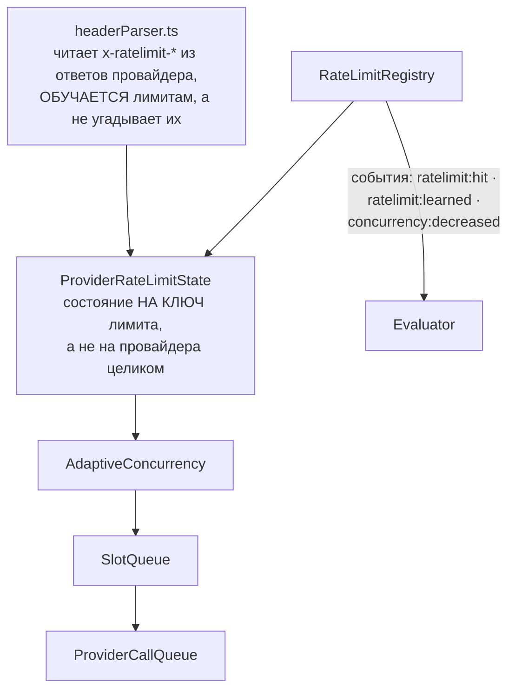
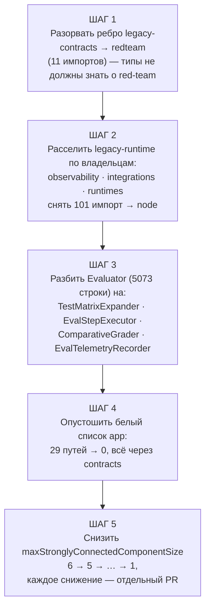

# Архитектура Promptfoo — DDD, надёжность и эксплуатация

> Часть 3 из 3. Разбор архитектуры через призму **Domain-Driven Design**.
> Диаграммы — псевдографика (ANSI box-drawing), читаются в терминале, в `less`, в `cat`.
>
> [← Индекс](./ARCHITECTURE.md) · [Обзор и ядро](./01-overview-and-core.md) · [Погружения в код](./03-code-deep-dives.md) · **DDD, надёжность, эксплуатация**

---

## 10. Поперечные механизмы

### 10.1. Планировщик — адаптивная конкурентность

```
   ┌─────────────────────────────────────────────────────────────┐
   │  src/scheduler/                                             │
   │                                                             │
   │  RateLimitRegistry ──── события ────►  Evaluator            │
   │       │                  ratelimit:hit                      │
   │       │                  ratelimit:learned                  │
   │       │                  concurrency:decreased              │
   │       ▼                                                     │
   │  ProviderRateLimitState   ← состояние на КЛЮЧ лимита,       │
   │       │                     не на провайдера целиком        │
   │       ▼                                                     │
   │  AdaptiveConcurrency  ──► SlotQueue ──► ProviderCallQueue   │
   │                                                             │
   │  headerParser.ts — вычитывает x-ratelimit-* из ответов и    │
   │  ОБУЧАЕТСЯ лимитам вместо того, чтобы их угадывать.         │
   └─────────────────────────────────────────────────────────────┘
```

Та же схема как Mermaid-диаграмма:



**Своими словами.** Представь курьера, который развозит грузы по нескольким
входам одного большого здания, и у каждого входа — свой грузовой лифт
с неизвестной курьеру максимальной нагрузкой. Курьер не звонит на
завод-изготовитель узнавать паспортные данные лифта — он просто начинает
грузить, и если лифт «жалуется» (застревает, выдаёт ошибку перегруза),
курьер запоминает это именно для ЭТОГО входа, а не для всего здания сразу,
потому что у соседнего входа может стоять лифт помощнее (состояние
хранится на ключ лимита, не на провайдера целиком). Ещё курьер
приглядывается к запискам, которые лифт сам иногда прикрепляет к кабине —
что-то вроде «максимум 10 подъёмов в минуту», — и, если такая записка
есть, сразу подстраивается под неё, вместо того чтобы находить предел
на ощупь через застревания (это и есть `headerParser`, который читает
подсказки из заголовков ответа). Дальше это выученное значение управляет
тем, сколько посылок курьер грузит одновременно (`AdaptiveConcurrency`)
и в каком порядке они выстраиваются в очередь на подъём (`SlotQueue`,
`ProviderCallQueue`). А обо всех важных событиях у каждого лифта —
«застрял», «наконец понял лимит», «пришлось снизить нагрузку» —
диспетчер (`RateLimitRegistry`) докладывает наверх, менеджеру всего
здания (`Evaluator`), чтобы тот видел общую картину по всем входам сразу.

Это не инфраструктурная мелочь, а доменное правило: «не бей по мишени сильнее, чем она
разрешает». Оно вынесено в `core`, а не в `providers`, — и это верно, потому что политика
нагрузки принадлежит процессу оценки, а не конкретному вендору.

### 10.2. Кэш

`src/cache.ts` даёт пространства имён (`withCacheNamespace`), поколения инвалидации
(`getCacheClearGeneration`) и однократный захват ключа (`claimCacheKeyOnce`) — защиту от
шторма одинаковых запросов при параллельном прогоне.

### 10.3. Трассировка

`src/tracing/` — приёмник OTLP внутри процесса (`otlpReceiver.ts`), собственный экспортёр
в SQLite (`localSpanExporter.ts`), фильтрация и санитизация атрибутов. Мишень может
отдавать свои спаны, и они станут доступны ассёршенам `trace-*`. Это делает возможной
оценку не только ответа, но и **процесса** его получения — критично для агентных систем.

---

## 11. Диагноз: зрелость по DDD

```
╔═══════════════════════════════════════════════════════════════════════════╗
║  ЧТО СДЕЛАНО ХОРОШО                                                       ║
╠═══════════════════════════════════════════════════════════════════════════╣
║  ✔ Единый язык реален. Термины домена = имена в коде, CLI и схеме БД.     ║
║  ✔ Порты и адаптеры вокруг движка выделены честно и узко                  ║
║    (EvaluationStore — 14 методов, ни одного лишнего).                     ║
║  ✔ ACL провайдеров — образцовый: 80 фабрик за одним интерфейсом,          ║
║    диспетчеризация ленивая, граница защищена тестом.                      ║
║  ✔ Архитектура исполняема. layers.json + edge-baseline + boundary-тесты   ║
║    превращают намерение в CI-проверку. Это редкость.                      ║
║  ✔ Слой contracts — настоящий лист: только zod, ни одного node: импорта.  ║
║  ✔ Политики (маппинг на OWASP/NIST/MITRE) вынесены в данные, не в код.    ║
╠═══════════════════════════════════════════════════════════════════════════╣
║  ГДЕ БОЛИТ                                                                ║
╠═══════════════════════════════════════════════════════════════════════════╣
║  ✘ src/evaluator.ts — 5 073 строки. Класс Evaluator несёт 36 методов:     ║
║    развёртку матрицы, исполнение, тайм-ауты, сравнительное оценивание,    ║
║    телеметрию, прогресс-бар. Это God Object, и он же — единственный       ║
║    узел, знающий обо всех контекстах сразу.                               ║
║                                                                           ║
║  ✘ legacy-runtime — 39 модулей «без владельца»: от logger.ts до           ║
║    googleSheets.ts и microsoftSharepoint.ts в одной куче. Именно из него  ║
║    исходит самое тяжёлое обратное ребро (101 импорт в node).              ║
║                                                                           ║
║  ✘ Цикл из 6 слоёв при лимите 6. Запас исчерпан полностью.                ║
║    redteam ↔ providers ↔ node ↔ core ↔ legacy-* — взаимно связаны.        ║
║                                                                           ║
║  ✘ legacy-contracts (src/types) импортирует redteam — 11 раз. Слой типов  ║
║    не должен знать о прикладной подобласти. Это протечка модели.          ║
║                                                                           ║
║  ✘ Границы агрегата Eval размыты чтением: класс несёт и command-методы    ║
║    (addResult, save), и сложные query-методы с построением SQL            ║
║    (buildFilterWhereSql, getTablePage, queryTestIndices — ~300 строк).    ║
╚═══════════════════════════════════════════════════════════════════════════╝
```

### Оценка по осям

```
   Единый язык          ████████████████████░  9/10
   Границы контекстов   ██████████████░░░░░░░  7/10
   Агрегаты             ████████████░░░░░░░░░  6/10
   Порты и адаптеры     ██████████████████░░░  8/10
   Изоляция домена      ██████████░░░░░░░░░░░  5/10   ← мешает legacy-runtime
   Исполняемость правил ████████████████████░  9/10   ← сильнейшая сторона
   Доменные события     ████████░░░░░░░░░░░░░  4/10   ← только хуки, без шины
```

---

## 12. Вектор развития, заложенный в самом репозитории

Авторы не скрывают направление — оно записано в `docs/architecture/packages.md`:
разделение монолита на пакеты. Порядок вытекает из графа:

```
   ШАГ 1  Разорвать ребро legacy-contracts ──► redteam (11 импортов)
          Самое дешёвое и самое принципиальное: типы не должны знать о red-team.

   ШАГ 2  Расселить legacy-runtime. Каждый модуль получает владельца:
          logger/telemetry ──► будущий @promptfoo/observability
          googleSheets/sharepoint ──► @promptfoo/integrations
          python/ruby/golang ──► @promptfoo/runtimes
          Цель — снять 101 импорт legacy-runtime ──► node.

   ШАГ 3  Разбить Evaluator. Кандидаты на выделение из 5 073 строк:
          • TestMatrixExpander   (развёртка декартова произведения)
          • EvalStepExecutor     (исполнение + тайм-ауты + resume)
          • ComparativeGrader    (select-best / max-score)
          • EvalTelemetryRecorder

   ШАГ 4  Опустошить белый список app. 29 путей ──► 0, всё через contracts.

   ШАГ 5  Снизить maxStronglyConnectedComponentSize 6 ──► 5 ──► ... ──► 1
          Каждое снижение — отдельный PR с обновлением базовой линии.
```

Тот же план как Mermaid-диаграмма:



**Своими словами.** Это план капитального ремонта большого старого дома,
где нельзя просто снести всё и построить заново — жильцы (пользователи
пакета) живут в доме прямо во время ремонта. Начинают с самого дешёвого
и самого принципиального: убирают одну неправильно проложенную трубу,
которая соединяет комнату общего назначения (типы) с личной квартирой
одного конкретного жильца (`redteam`) — труба стоила всего одиннадцать
соединений, но по смыслу общие коммуникации не должны знать, что
происходит в чьей-то одной квартире. Дальше расселяют огромную
коммунальную кухню (`legacy-runtime`, где логгер и таблицы Google живут
в одной куче без единого хозяина) по отдельным квартирам с именными
табличками на дверях — у логирования будет своя квартира, у интеграций
с внешними сервисами своя, у обвязки для Python и Ruby своя. После этого
разбирают самую перегруженную комнату во всём доме — пять тысяч строк
в одном классе `Evaluator`, где одновременно происходит и готовка,
и стирка, и бухгалтерия, — на четыре отдельные комнаты с одной
обязанностью у каждой. Затем закрывают старую дыру в заборе — список
из двадцати девяти путей, которым разрешалось заходить в дом в обход
парадной двери, — и оставляют ровно одну дверь для всех. И в конце
постепенно затягивают правило пожарной безопасности: сколько человек
одновременно может находиться в одной круговой цепочке комнат, — снижая
лимит шаг за шагом, каждый раз официально фиксируя новую, более строгую
отметку, чтобы откатиться назад можно было только осознанным решением,
а не по ошибке.

Храповики уже настроены так, чтобы этот путь был односторонним: базовую линию можно
обновлять только в сторону уменьшения связности. Правило зафиксировано прямо в
документации: *не обновляйте базовую линию только ради того, чтобы новая зависимость
прошла проверку.*

---

## 13. Карта репозитория для навигации

```
promptfoo/
├── architecture/            ◄── КОНСТИТУЦИЯ: layers.json + edge-baseline.json
├── scripts/
│   └── checkArchitectureBoundaries.ts   ◄── прокурор (npm run architecture:check)
├── docs/architecture/packages.md        ◄── замысел разделения на пакеты
├── src/
│   ├── contracts/           слой 0 · только zod · будущий @promptfoo/schema
│   ├── types/ validators/   слой 1 · legacy-contracts
│   ├── evaluator.ts         ЯДРО · 5 073 строки · класс Evaluator
│   ├── evaluator/
│   │   ├── runtime.ts       ◄── ПОРТЫ: EvaluationStore, EvaluatorRuntime
│   │   └── inMemoryStore.ts     адаптер без зависимостей
│   ├── node/
│   │   ├── evaluationStore.ts   ◄── адаптер к модели Eval
│   │   ├── evaluatorRuntime.ts  JSONL-писатели, resume
│   │   └── doEval.ts            прикладной сервис прогона
│   ├── models/eval.ts       ◄── АГРЕГАТ Eval
│   ├── database/tables.ts   15 таблиц Drizzle
│   ├── providers/           ACL · 244 файла · registry.ts = 80 фабрик
│   ├── redteam/
│   │   ├── plugins/         155 плагинов · base.ts = RedteamPluginBase
│   │   ├── strategies/      35 стратегий · index.ts = реестр
│   │   ├── extraction/      разведка мишени (purpose, entities, mcpTools)
│   │   ├── constants/       таксономия + маппинги на OWASP/NIST/MITRE/EU AI Act
│   │   └── shared.ts        doRedteamRun — оркестрация
│   ├── assertions/          66 обработчиков · index.ts:229 = таблица диспетчеризации
│   ├── matchers/            доменные сервисы LLM-судейства
│   ├── scheduler/           адаптивная конкурентность и лимиты
│   ├── tracing/             OTel-приёмник и хранилище спанов
│   ├── server/              Express + Socket.IO · 10 роутеров
│   ├── app/                 React 19 SPA · 695 файлов
│   └── index.ts             ФАСАД · публичный npm-API
└── test/architecture/       точечные тесты-инварианты границ
```

---

## 14. Команды для самостоятельной проверки утверждений

Ни одно число выше не взято на веру — всё воспроизводится:

```bash
npm run architecture:check     # проверить границы слоёв
npm run architecture:baseline  # пересчитать базовую линию рёбер
npm run deps:ownership         # отчёт: какой слой владеет какой npm-зависимостью
npm run knip                   # мёртвый код: неиспользуемые файлы/экспорты
node dist/src/main.js redteam plugins   # список всех 155 плагинов
```

---

*Документ описывает состояние репозитория promptfoo на коммите `2c140ef`,
версия 0.122.0, дата среза — 26 августа 2026.*