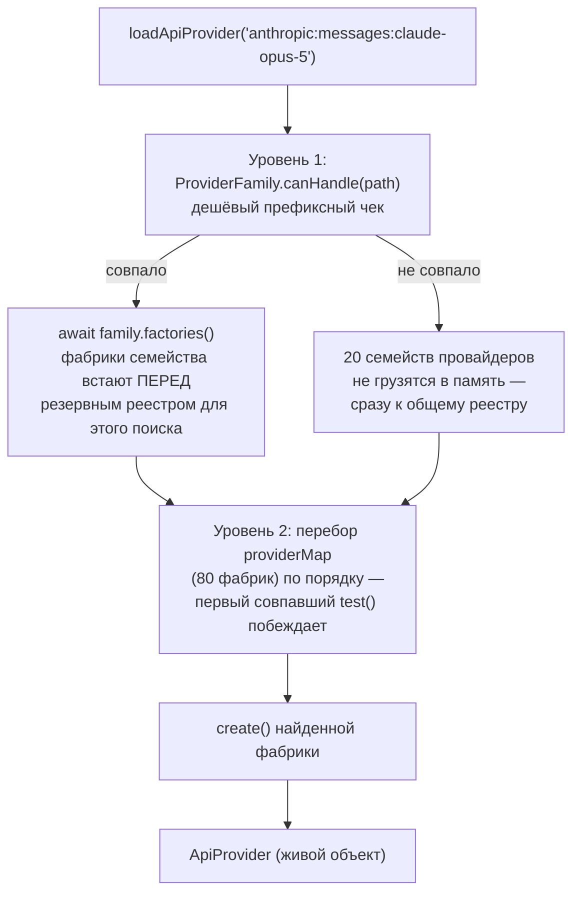
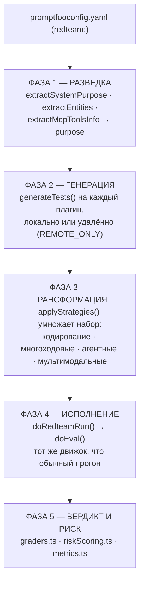
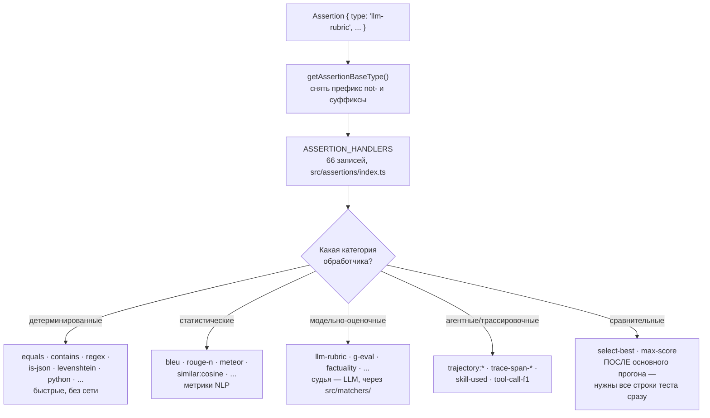
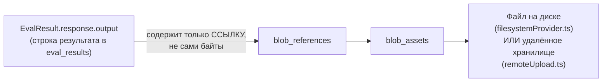

# Архитектура Promptfoo — погружения в код

> Часть 2 из 3. Разбор архитектуры через призму **Domain-Driven Design**.
> Диаграммы — псевдографика (ANSI box-drawing), читаются в терминале, в `less`, в `cat`.
>
> [← Индекс](./ARCHITECTURE.md) · [Обзор и ядро](./01-overview-and-core.md) · **Погружения в код** · [DDD, надёжность, эксплуатация](./02-ddd-reliability-and-operations.md)

---

## 5. Provider Context — антикоррупционный слой

### 5.1. Порт

```
   ┌──────────────────────────────────────────────────────────┐
   │  interface ApiProvider          src/types/providers.ts   │
   ├──────────────────────────────────────────────────────────┤
   │  id(): string                    ← идентичность          │
   │  callApi(prompt, ctx, options)   ← ОБЯЗАТЕЛЬНЫЙ метод    │
   │                                                          │
   │  callEmbeddingApi?()             ← опциональные          │
   │  callClassificationApi?()           возможности          │
   │  callSimilarityApi?()                                    │
   │  callModerationApi?()                                    │
   │                                                          │
   │  cleanup?()   ← освобождение долгоживущих ресурсов:      │
   │                 воркеров, браузерных сессий, пулов       │
   │  delay?  ·  label?  ·  transform?  ·  getSessionId?()    │
   └──────────────────────────────────────────────────────────┘

   Расширения-роли (сегрегация интерфейсов):
     ApiEmbeddingProvider · ApiSimilarityProvider
     ApiClassificationProvider · ApiModerationProvider
```

### 5.2. Двухуровневая диспетчеризация

```
   loadApiProvider('anthropic:messages:claude-opus-5')
              │
              ▼
   ┌─────────────────────────────────────────────────────────────┐
   │ УРОВЕНЬ 1 · ProviderFamily.canHandle(path)                  │
   │   Дешёвый префиксный чек. Это ВОРОТА ЗАГРУЗКИ, не диспетчер.│
   │   Вернул true → await family.factories() → фабрики семейства│
   │   встают ПЕРЕД резервным реестром для этого одного поиска.  │
   │                                                             │
   │   Смысл: 20 семейств провайдеров (openai, anthropic, azure, │
   │   bedrock, google, mistral, groq, xai, ...) не грузятся     │
   │   в память, пока в них нет нужды.                           │
   └────────────────────────┬────────────────────────────────────┘
                            ▼
   ┌─────────────────────────────────────────────────────────────┐
   │ УРОВЕНЬ 2 · ProviderFactory.test(path)                      │
   │   providerMap: ProviderFactory[] — 80 записей.              │
   │   Перебор по порядку, первый совпавший test() выигрывает,   │
   │   вызывается его create(). ПОРЯДОК ЗАПИСЕЙ ЗНАЧИМ.          │
   └────────────────────────┬────────────────────────────────────┘
                            ▼
                    ApiProvider (живой объект)
```

Та же диспетчеризация как Mermaid-диаграмма:



**Своими словами.** Представь звонок в большую компанию с автоответчиком.
Первое, что происходит, — не оператор перебирает список ВСЕХ сотрудников
компании подряд, а дешёвое голосовое меню: «если вы по вопросу продаж —
нажмите 1, по вопросу поддержки — нажмите 2». Это и есть уровень 1 —
проверка по одному короткому признаку (префиксу «anthropic:»), а не
настоящий поиск нужного человека. Если ты нажал цифру, которая совпала
с реальным отделом, — только ТОГДА система поднимает картотеку именно
этого отдела, и она встаёт первой в очереди на просмотр, обгоняя общий
список компании. А если ни одна цифра меню не подошла — картотеку
конкретного отдела вообще не трогают, компания не тратит память на
загрузку персонала отделов, которые сейчас никому не нужны. И только
после того, как нужная картотека (или общий список, если меню не
сработало) поднята, начинается настоящий, дотошный поиск — уровень 2:
перебор карточек одна за другой по порядку, пока не найдётся первая,
которая точно подходит под твой запрос, и именно её и соединяют с
линией. Порядок карточек в этом списке важен: если два сотрудника
формально могли бы ответить на звонок, выигрывает тот, чья карточка
лежит раньше.

Инвариант защищён тестом: `test/architecture/providerRedteamBoundary.test.ts` следит,
чтобы `providers/index.ts`, `providers/registry.ts` и `registryTypes.ts` не имели
**статических** импортов из red-team. Type-only импорты разрешены — TypeScript стирает
их при сборке, ленивую загрузку они не ломают.

### 5.3. Что скрывается за портом

```
  ОБЛАЧНЫЕ LLM              ЛОКАЛЬНЫЕ/КАСТОМНЫЕ         ИНТЕГРАЦИОННЫЕ
  ─────────────             ───────────────────         ──────────────
  openai · anthropic        python:  · golang:          http: · https:
  azure · bedrock           ruby:    · exec:            mcp:  · a2a:
  google/vertex             file://…js                  browser:
  mistral · cohere          localai · ollama            websocket:
  groq · xai · deepseek     llama.cpp                   echo: · manual-input:
  fireworks · together      abliteration                sequence: · redteam:
  ...ещё ~40 вендоров
```

Каждый из них — переводчик с чужого протокола на язык домена (`ProviderResponse`:
`output`, `tokenUsage`, `cost`, `error`, `metadata`, `guardrails`). Это и есть ACL в
чистом виде: домен не знает, что у OpenAI `choices[0].message.content`, а у Anthropic
`content[0].text`.

---

## 6. Red Team Context

Здесь предметная область другая: не «измерить качество», а «найти пролом». Отсюда
собственный словарь и собственная модель.

### 6.1. Три роли, образующие ядро

```
   ┌──────────────┐      ┌──────────────┐      ┌──────────────┐
   │   PLUGIN     │      │   STRATEGY   │      │    GRADER    │
   │  «ЧТО»       │      │   «КАК»      │      │  «УДАЛОСЬ?»  │
   ├──────────────┤      ├──────────────┤      ├──────────────┤
   │ Генерирует   │─────►│ Трансформирует│────►│ Судит ответ  │
   │ тест-кейсы   │      │ их в атаки    │     │ мишени       │
   │ под уязвимость│     │               │     │              │
   │              │      │               │     │              │
   │ 155 штук     │      │ 35 штук       │     │ по плагину   │
   └──────────────┘      └──────────────┘      └──────────────┘
   RedteamPluginBase     Strategy.action()     RedteamGraderBase
   ├ abstract id         (testCases,           ├ abstract id
   ├ abstract            injectVar,            ├ abstract rubric
   │  getTemplate()      config,               ├ renderRubric()
   ├ abstract            strategyId,           ├ getResult()
   │  getAssertions()    runtimeContext)       └ getSuggestions()
   └ generateTests()     → TestCase[]
```

**Комбинаторика — суть модели.** Один плагин × несколько стратегий = покрытие. Плагин
`pii:direct` под стратегиями `base64`, `jailbreak:composite` и `crescendo` — это три
разных вектора одной и той же уязвимости.

### 6.2. Конвейер синтеза атак

```
 promptfooconfig.yaml (redteam:)
        │
        ▼
 ┌──────────────────────────────────────────────────────────────┐
 │ ФАЗА 1 · РАЗВЕДКА              src/redteam/extraction/       │
 │   extractSystemPurpose()   ← зачем существует мишень         │
 │   extractEntities()        ← допустимые сущности домена      │
 │   extractMcpToolsInfo()    ← какие инструменты доступны      │
 │                                                              │
 │   Результат — `purpose`. Он делает атаки контекстными:       │
 │   PII-атака на банк и на медцентр выглядят по-разному.       │
 └────────────┬─────────────────────────────────────────────────┘
              ▼
 ┌──────────────────────────────────────────────────────────────┐
 │ ФАЗА 2 · ГЕНЕРАЦИЯ             src/redteam/plugins/          │
 │   для каждого плагина: generateTests(purpose, injectVar, n)  │
 │                                                              │
 │   Локально ИЛИ удалённо (remoteGeneration.ts):               │
 │   часть плагинов помечена REMOTE_ONLY — их шаблоны атак      │
 │   не лежат в открытом репозитории.                           │
 └────────────┬─────────────────────────────────────────────────┘
              ▼  TestCase[]  (сырые атаки)
 ┌──────────────────────────────────────────────────────────────┐
 │ ФАЗА 3 · ТРАНСФОРМАЦИЯ         src/redteam/strategies/       │
 │   applyStrategies() — стратегии УМНОЖАЮТ набор               │
 │                                                              │
 │   Кодирование:  base64 · hex · leetspeak · homoglyph · rot13 │
 │   Однопроходные:citation · best-of-n · gcg · likert          │
 │   Многоходовые: crescendo · goat · jailbreak:tree ·          │
 │                 jailbreak:hydra · jailbreak:meta · goblin    │
 │   Мультимодальные: image · audio · video                     │
 │   Агентные:     indirect-web-pwn · mischievous-user · layer  │
 │                                                              │
 │   Флаг requiresGoalExtraction — стратегии, которым нужна     │
 │   явная цель атаки, а не только текст полезной нагрузки.     │
 └────────────┬─────────────────────────────────────────────────┘
              ▼  redteam.yaml — обычный TestSuite
 ┌──────────────────────────────────────────────────────────────┐
 │ ФАЗА 4 · ИСПОЛНЕНИЕ                                          │
 │   doRedteamRun() → doEval()                                  │
 │   Никакого отдельного движка. Red-team здесь — Conformist:   │
 │   подчиняется модели Evaluation Context полностью.           │
 └────────────┬─────────────────────────────────────────────────┘
              ▼
 ┌──────────────────────────────────────────────────────────────┐
 │ ФАЗА 5 · ВЕРДИКТ И ОЦЕНКА РИСКА                              │
 │   graders.ts → пройдена ли атака                             │
 │   riskScoring.ts → severity: critical | high | medium | low  │
 │   metrics.ts → агрегация по категориям                       │
 └──────────────────────────────────────────────────────────────┘
```

Тот же конвейер как Mermaid-диаграмма:



**Своими словами.** Представь команду, которая готовит проверку охраны
банка по заказу самого банка. Сначала команда просто изучает объект
издалека: чем этот банк вообще занимается, какие у него внутренние
правила, какое оборудование стоит на входе (фаза разведки) — потому что
проверка банка и проверка больницы должны выглядеть по-разному, если
цель — реально похожие на правду сценарии, а не одна и та же заготовка
для всех. Дальше под этот конкретный банк готовят конкретные сценарии
проникновения — часть заготовок берут из общей библиотеки команды, а
часть, самых чувствительных, держат в сейфе и достают только удалённо,
не раздавая их каждому исполнителю на руки (фаза генерации). Затем один
и тот же базовый сценарий размножают на множество вариантов маскировки —
разный грим, разная одежда, разная легенда, от простого переодевания до
многоходовых спектаклей в несколько актов (фаза трансформации). После
этого команда не изобретает отдельный «специальный вход для проверяющих» —
она идёт через ту же самую парадную дверь, которой пользуется любой
обычный посетитель банка, и это принципиально: проверка не должна
получать привилегий, которых нет у реальной атаки (фаза исполнения,
тот же движок, что у обычного прогона). А в самом конце все попытки
собирают в один отчёт: что удалось, что не удалось, насколько опасна
была бы каждая удавшаяся попытка, если бы это была не проверка (фаза
вердикта и оценки риска).

### 6.3. Таксономия и соответствие стандартам

Плагины сгруппированы в коллекции, а коллекции спроецированы на внешние нормативные
рамки — это отдельная подобласть в `src/redteam/constants/frameworks.ts`:

```
   ПЛАГИНЫ ПО ГРУППАМ                    ПРОЕКЦИИ НА СТАНДАРТЫ
   ─────────────────                     ─────────────────────
   FOUNDATION_PLUGINS      44            OWASP LLM Top 10
   ADDITIONAL_PLUGINS     100            OWASP API Top 10
   BASE_PLUGINS             5            OWASP Agentic Top 10
   PII_PLUGINS              4            OWASP LLM Red Team
   AGENTIC_PLUGINS          1            NIST AI RMF
   GUARDRAILS_EVAL         42            MITRE ATLAS (+ legacy-маппинг)
   COLLECTIONS             14            EU AI Act
   ────────────────────────────          ISO 42001
   ВСЕГО (CLI)            155            GDPR
                                         DoD AI Ethics
   СТРАТЕГИИ               35
```

Маппинг вида `Record<ControlId, { plugins, strategies }>` — это, по сути, **политика**
в терминах DDD: правило предметной области, вынесенное в данные, а не зашитое в код.
Запустил `owasp:llm` — получил ровно тот набор плагинов и стратегий, который покрывает
контроли стандарта.

---

## 7. Grading Context — оценка результата

### 7.1. Диспетчеризация проверок

```
   Assertion { type: 'llm-rubric', value: '...', threshold: 0.8 }
          │
          ▼
   getAssertionBaseType()  ← снимает префикс not- и суффиксы
          │
          ▼
   ASSERTION_HANDLERS: Record<BaseAssertionTypes, Handler>
   src/assertions/index.ts:229 — плоская таблица на 66 записей
          │
          ├─ ДЕТЕРМИНИРОВАННЫЕ (быстрые, без сети)
          │    equals · contains · regex · starts-with · is-json
          │    is-xml · is-sql · levenshtein · word-count · latency
          │    cost · finish-reason · javascript · python · ruby
          │
          ├─ СТАТИСТИЧЕСКИЕ (метрики NLP)
          │    bleu · gleu · rouge-n · meteor · perplexity
          │    similar:cosine · similar:dot · similar:euclidean
          │
          ├─ МОДЕЛЬНО-ОЦЕНОЧНЫЕ (судья — LLM) ──► src/matchers/
          │    llm-rubric · g-eval · factuality · answer-relevance
          │    context-faithfulness · context-recall · context-relevance
          │    model-graded-closedqa · classifier · moderation
          │
          ├─ АГЕНТНЫЕ / ТРАССИРОВОЧНЫЕ
          │    agent-rubric · trajectory:goal-success
          │    trajectory:tool-sequence · trajectory:tool-args-match
          │    trace-span-count · trace-span-duration · trace-error-spans
          │    skill-used · tool-call-f1
          │
          └─ СРАВНИТЕЛЬНЫЕ (нужны все строки теста сразу)
               select-best · max-score
               ↑ выполняются ПОСЛЕ основного прогона, в отдельной фазе
```

Та же диспетчеризация как Mermaid-диаграмма:



**Своими словами.** Представь приёмный покой больницы, куда поступают
направления на анализы, и на каждом направлении написан тип анализа
буквами — но иногда с приставкой «не» и разными суффиксами, которые
сначала нужно отбросить, чтобы понять суть направления (снятие префикса
`not-`). Дальше медсестра сверяется с общей таблицей из 66 видов
анализов и решает, в какой именно кабинет отправить пациента. Часть
анализов — это быстрые тесты прямо у стойки, без очереди и без
лаборатории (детерминированные: сравнить строки, проверить формат).
Другая часть требует стандартной лабораторной панели по готовой формуле —
посчитать конкретные числовые показатели (статистические метрики).
Третья группа — самая дорогая: нужен отдельный врач-эксперт, который
посмотрит на результат и вынесет суждение, а не просто сверится с
таблицей норм (модельно-оценочные, судья — LLM). Четвёртая группа
анализов вообще не про один укол, а про то, как пациент передвигался по
всей больнице — куда заходил, что делал по пути (агентные и
трассировочные). И есть особая, пятая группа анализов, которые в
принципе нельзя оценить по одному пациенту в изоляции — нужно сравнить
ВСЕХ пациентов дня между собой и выбрать, скажем, у кого показатели
лучше остальных; поэтому эти анализы обрабатывают не сразу, а отдельным
приёмом в конце дня, когда все пациенты уже прошли через больницу
(сравнительные).

Ленивая загрузка встроена и здесь: обработчик `meteor` импортируется динамически и
отдаёт вежливое сообщение, если опциональный пакет `natural` не установлен. Тяжёлые
зависимости не тянутся ради тех, кто ими не пользуется.

### 7.2. Matchers — доменные сервисы

`src/matchers/` — это те операции, что не принадлежат ни одной сущности: они
координируют вызов модели-судьи. Классические **domain services**:

```
   llmGrading.ts   rubric.ts    comparison.ts   similarity.ts
   classification.ts  moderation.ts  rag.ts  agent.ts  search.ts
```

Особенность: судья сам является `ApiProvider`. Оценка использует тот же порт, что и
основной прогон, — единый способ говорить с внешним миром.

---

## 8. Persistence Context

### 8.1. Схема хранилища

```
 ┌─────────────┐         ┌──────────────────┐        ┌─────────────┐
 │  prompts    │◄───────►│  evals_to_prompts│◄──────►│    evals    │
 └─────────────┘  M:N    └──────────────────┘  M:N   └──────┬──────┘
                                                            │ 1:N
 ┌─────────────┐         ┌──────────────────┐               ▼
 │    tags     │◄───────►│  evals_to_tags   │◄───────┐ ┌──────────────┐
 └─────────────┘  M:N    └──────────────────┘        └─┤ eval_results │
                                                       └───────┬──────┘
 ┌─────────────┐         ┌──────────────────┐                  │
 │  datasets   │◄───────►│ evals_to_datasets│◄─────────────────┘
 └─────────────┘  M:N    └──────────────────┘

 ┌─────────────┐   ┌──────────────────┐   ┌─────────────┐   ┌──────────────┐
 │   traces    │──►│      spans       │   │ blob_assets │◄─┤blob_references│
 └─────────────┘1:N└──────────────────┘   └─────────────┘   └──────────────┘

 ┌─────────────┐   ┌──────────────────┐   ┌─────────────┐
 │   configs   │   │   model_audits   │   │ llm_outputs │
 └─────────────┘   └──────────────────┘   └─────────────┘

 Всего 15 таблиц · 26 миграций Drizzle · SQLite/libSQL
 По умолчанию: ~/.promptfoo/promptfoo.db
```

### 8.2. Разделение бинарных данных

Отдельного упоминания заслуживает пара `blob_assets` / `blob_references`. Мультимодальные
атаки (image, audio, video) порождают мегабайты полезной нагрузки. Держать их в строке
результата — убить производительность выборки. Поэтому:

```
   EvalResult.response.output   содержит ССЫЛКУ на blob
                 │
                 ▼
        blob_references ──► blob_assets ──► файл или удалённое хранилище
                                              src/blobs/filesystemProvider.ts
                                              src/blobs/remoteUpload.ts
```

Та же схема как Mermaid-диаграмма:



**Своими словами.** Представь театральный гардероб. Зрителю неудобно
весь спектакль таскать с собой тяжёлое зимнее пальто — поэтому на входе
пальто сдают, а взамен получают маленький бумажный номерок. Именно этот
номерок зритель и носит с собой весь вечер (это и есть ссылка в строке
результата), а само пальто (мегабайты картинки, аудио или видео от
мультимодальной атаки) едет отдельно — вешается в гардеробе на
отдельную вешалку, а не таскается по залу вместе с зрителем. Если бы
каждый зритель носил с собой полное пальто, в зале было бы не протолкнуться
и находить нужного человека в толпе стало бы медленно (это и есть цена
хранения тяжёлых данных прямо в строке результата — выборка бы
замедлилась). Номерок устроен так, что его может прочитать и распорядитель
у входа, и гардеробщик внутри — что на языке кода означает: ссылка на
блоб понятна и браузеру, и серверному Node, а не только одной из сторон.
А сама вешалка с пальто может физически находиться либо тут же, в
подвале театра, либо, если своего подвала не хватает, в отдельном
арендованном складе за углом (файл на диске или удалённое хранилище) —
зрителю с его номерком разницы никакой.

Это value object, вынесенный в отдельное хранилище по соображениям производительности —
и контракт на него (`src/contracts/blobs.ts`) лежит в самом чистом слое, потому что
ссылка на блоб должна быть понятна и браузеру, и Node.

---

## 9. Presentation Context

```
 ┌──────────────────────────────────────────────────────────────────────┐
 │  БРАУЗЕР                                    :3000 (dev, Vite)        │
 │  React 19 · Zustand · React Router v7 · Radix UI · Tailwind · MUI v7 │
 │                                                                      │
 │  pages/  eval · eval-creator · evals · datasets · prompts · history  │
 │          redteam · model-audit · media · launcher · login            │
 │                                                                      │
 │  ПРАВИЛО: никаких прямых fetch(). Только callApi() —                 │
 │  единственная точка, знающая про базовый URL и режим сборки.         │
 └───────────────────────────────┬──────────────────────────────────────┘
                                 │ REST + Socket.IO
                                 ▼
 ┌──────────────────────────────────────────────────────────────────────┐
 │  VIEW-SERVER  (Express)                     :15500                   │
 │                                                                      │
 │  /api/eval        /api/redteam      /api/traces     /api/user        │
 │  /api/providers   /api/model-audit  /api/blobs      /api/configs     │
 │  /api/media       /api/version                                       │
 │                                                                      │
 │  middleware: cors · csrfProtection · compression · json(limit)       │
 │  Socket.IO — живой поток прогресса прогона в UI                      │
 └──────────────────────────────────────────────────────────────────────┘
```

**Открытый вопрос архитектуры.** Слой `app` имеет право импортировать 29 конкретных
файлов из рантайма — включая `src/util/database.ts` и `src/redteam/constants.ts`. Это
означает, что часть доменной логики физически шарится с браузером. Белый список — не
решение, а **счётчик долга**: он не даёт списку расти, но и не сокращает его сам.
Правильный вектор, зафиксированный в `docs/architecture/packages.md`, — переносить эти
файлы в браузеро-безопасный `contracts` и вычёркивать пути из списка.

---

---

*Документ описывает состояние репозитория promptfoo на коммите `2c140ef`,
версия 0.122.0, дата среза — 26 августа 2026.*
