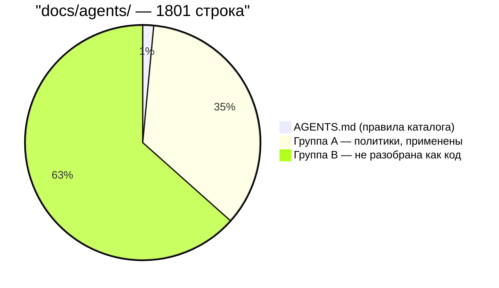
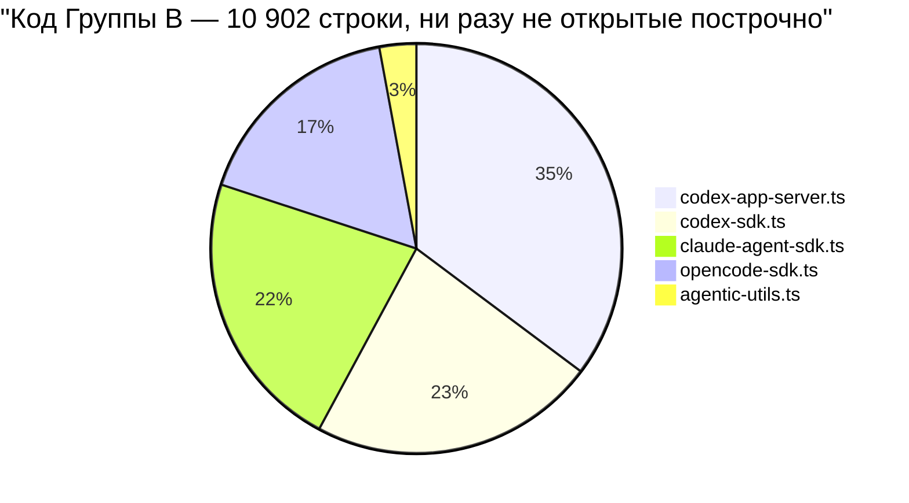
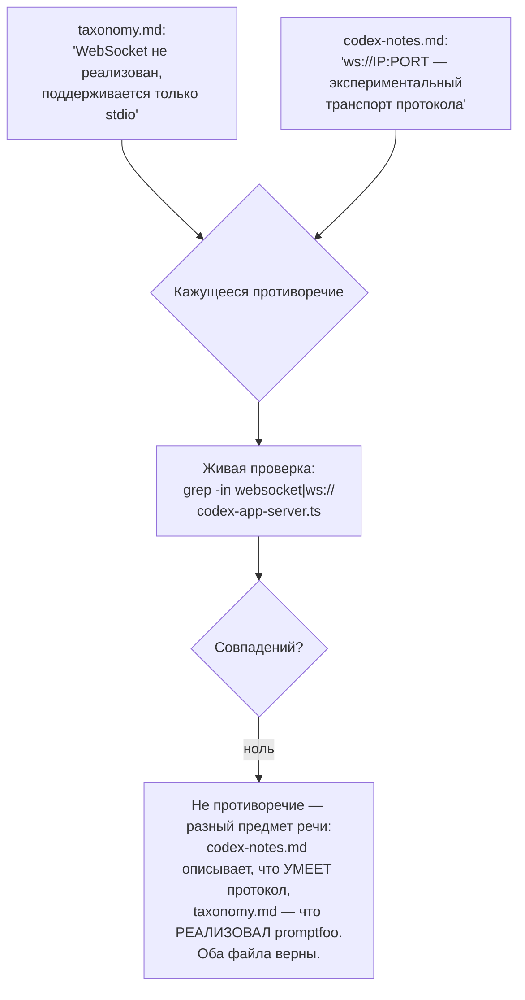

# Корпус `docs/agents/*.md` — правила разработки и незакрытый пробел

> Разбор через призму **Domain-Driven Design**. Диаграммы — ANSI-псевдографика.
> Дополняет [SPINE.md](SPINE.md), [DATABASE.md](DATABASE.md), [MODELS.md](MODELS.md),
> [BRIDGES.md](BRIDGES.md), [PROVIDERS.md](PROVIDERS.md),
> [PACKAGES-CROSSCHECK.md](PACKAGES-CROSSCHECK.md),
> [SCHEDULER-CROSSCHECK.md](SCHEDULER-CROSSCHECK.md), [ARCHITECTURE.md](ARCHITECTURE.md).
>
> Третий документ жанра «сверка с источником», но другой формы: восемь файлов
> цитировались как источник правил более двадцати раз по всей серии и ни разу
> не были предметом. Шесть — короткие политики, уже применённые верно. Два —
> крупные технические заметки о **10 902 строках кода**, до которых серия
> так и не дошла. Это самый большой найденный пробел за весь research.

---

## 0. Паспорт

```
╔══════════════════════════════════════════════════════════════════════════════╗
║  docs/agents/ — 8 файлов + собственный AGENTS.md, 1801 строка                ║
╠══════════════════════════════════════════════════════════════════════════════╣
║  ГРУППА A · Политики, применённые верно во всей серии                        ║
║    logging.md                      72   правило + таблица категорий          ║
║    database-security.md           113   параметризация, json_each            ║
║    git-workflow.md                 77   запрет на прямой коммит в main       ║
║    dependency-management.md        89   npm-check-updates, Renovate          ║
║    python.md                       62   стиль, паттерны провайдера           ║
║    pr-conventions.md              219   THE REDTEAM RULE, типы коммитов      ║
║  ГРУППА B · Технические заметки, НИКОГДА не разбиравшиеся как код            ║
║    coding-agent-provider-taxonomy.md  566   таксономия агентных провайдеров  ║
║    codex-app-server-provider-notes.md 576   протокол JSON-RPC app-server     ║
╠══════════════════════════════════════════════════════════════════════════════╣
║  Код, который описывает Группа B, но который серия не читала:                ║
║    claude-agent-sdk.ts        2 421     opencode-sdk.ts             1 858    ║
║    openai/codex-sdk.ts        2 466     openai/codex-app-server.ts  3 841    ║
║    agentic-utils.ts             316                                          ║
║    ИТОГО ...................10 902 строки — крупнейший неразобранный         ║
║                              КУСОК КОДА за весь research, включая test/      ║
╚══════════════════════════════════════════════════════════════════════════════╝
```

Тот же паспорт двумя Mermaid-диаграммами — сначала состав самого корпуса
`docs/agents/`, потом состав кода, который он описывает, но который серия
не открывала:





**Своими словами.** Представь архивную папку с правилами компании на
1801 страницу. Меньше двух процентов папки (27 страниц) — это правила, как
вести саму эту папку: кто и как имеет право туда что-то дописывать. Больше
трети папки (632 страницы) — это короткие бытовые инструкции вроде «как
вести журнал посещений» или «как хранить пароли», и каждую из них проверили
и подтвердили: сотрудники реально следуют им на практике, страница за
страницей. А оставшиеся почти две трети папки (1142 страницы) — это два
толстых технических паспорта на два огромных производственных цеха, куда
никто из проверяющих ни разу не заходил лично. Причём эти паспорта не
выдуманы и не устарели — они описывают вполне реальные, работающие цеха на
территории завода. Проблема не в том, что паспорта неверны, а в том, что за
всю проверку компании никто не сверил написанное в паспорте с тем, что
реально стоит в цеху.

Продолжая метафору: два технических паспорта описывают на самом деле пять
разных станков, и вот их реальный вес в общем неосмотренном хозяйстве.
Самый тяжёлый станок — больше трети всего неосмотренного оборудования —
тот самый, чей размер уже был замечен раньше, мимоходом, при взвешивании
всего цеха целиком, но саму станину так никто и не открыл
(`codex-app-server.ts`, 3841 строка). Следом идут ещё три станка
сопоставимого веса — от `codex-sdk.ts` до `opencode-sdk.ts` — и один
маленький вспомогательный ящик с инструментами (`agentic-utils.ts`,
316 строк), который на их фоне почти незаметен. Разница между «заметить
размер станка на глаз, проходя мимо» и «открыть кожух и посмотреть, что
внутри» — ровно то расстояние, которое отделяет прежние документы серии от
полноценного разбора: PROVIDERS.md прошёл мимо, честно назвал вес самого
большого станка и пошёл дальше, а внутрь так и не заглянул.

Асимметрия между двумя группами — сам по себе главный факт этого документа.
Группа A уже применена к каждому файлу, который серия писала — это можно
проверить построчно. Группа B описывает подсистему, чей крупнейший файл
(`codex-app-server.ts`, 3841 строка) [PROVIDERS.md §6](PROVIDERS.md) назвал
«самым большим файлом модуля» — и остановился на этом, не открыв его.

---

## 1. Единый язык корпуса

| Термин | Источник | Смысл |
| --- | --- | --- |
| **Coding-agent provider** | taxonomy.md | Провайдер, оборачивающий агентный рантайм — рабочую область, инструменты, сессию, а не разовый чат-эндпойнт |
| **Runtime boundary** | taxonomy.md §Taxonomy Axes | Где кончается promptfoo и начинается чужой рантайм — in-process SDK, управляемый сервер, чужой сервер, локальный app-server процесс |
| **App-server** | codex-notes.md | Локальный процесс `codex app-server`, с которым promptfoo говорит по JSON-RPC через stdio |
| **THE REDTEAM RULE** | pr-conventions.md | `(redteam)` — обязательный scope коммита, если red team — основная тема PR, даже если тронут один файл в UI |
| **Server request policy** | codex-notes.md | Детерминированная политика ответа на approval-запросы app-server — promptfoo никогда не спрашивает человека |
| **buildSafeJsonPath** | database-security.md | Единственный одобренный способ собрать динамический путь `json_extract()` — уже подтверждён в [MODELS.md](MODELS.md) |

---

## 2. Группа A: политики, уже подтверждённые серией

Здесь сверка короткая, потому что серия применяла эти правила по ходу
написания тридцати шести предыдущих документов, а не узнала о них сейчас.

```
╔══════════════════════════════════════════════════════════════════════════════╗
║  database-security.md — ПОДТВЕРЖДЕНО в MODELS.md и DATABASE.md               ║
╠══════════════════════════════════════════════════════════════════════════════╣
║   Правило: json_each() для динамических ключей, buildSafeJsonPath() для      ║
║   json_extract(), sql.raw() запрещён.                                        ║
║                                                                              ║
║   MODELS.md:63    — buildSafeJsonPath задокументирован по строке eval.ts:120 ║
║   MODELS.md:313   — json_each() как предпочтительный путь для динамических   ║
║                     ключей, с тем же примером EXISTS + json_each             ║
║   DATABASE.md §8  — sqlSafety.test.ts, отдельная фитнес-функция на sql.raw() ║
║                     по ВСЕМУ src/, не только по src/models/                  ║
║                                                                              ║
║   Серия не просто процитировала правило — она нашла ИСПОЛНЯЕМУЮ ПРОВЕРКУ     ║
║   правила (sqlSafety.test.ts), которую сам database-security.md не           ║
║   упоминает вовсе. Код серии полнее источника здесь же, как это уже          ║
║   было в SCHEDULER-CROSSCHECK.md.                                            ║
╚══════════════════════════════════════════════════════════════════════════════╝
```

```
╔══════════════════════════════════════════════════════════════════════════════╗
║  logging.md — ПОДТВЕРЖДЕНО в SPINE.md                                        ║
╠══════════════════════════════════════════════════════════════════════════════╣
║   Правило: logger.debug(msg, {context}) — объект вторым аргументом,          ║
║   автосанитизация, антипаттерн — интерполяция в строку.                      ║
║                                                                              ║
║   SPINE.md §2 воспроизвёл механизм sanitizeContext → sanitizeObject          ║
║   и явно назвал то же самое правило антипаттерном. Не процитировал           ║
║   таблицу категорий полей (Passwords/API Keys/Secrets/Headers/               ║
║   Certificates/Signatures) — и правильно: logging.md сам отсылает            ║
║   к src/util/sanitizer.ts как единственному источнику истины для неё,        ║
║   а не воспроизводит список. SPINE.md сделал то же самое.                    ║
║                                                                              ║
║   НЕ ЗАКРЫТО ни SPINE.md, ни этим документом: SPINE.md §8 диагностировал     ║
║   антипаттерн из logging.md как непроверяемый в CI — и предложил ровно       ║
║   ту фитнес-функцию, которая уже есть у database-security.md через           ║
║   sqlSafety.test.ts. Рекомендация остаётся в силе.                           ║
╚══════════════════════════════════════════════════════════════════════════════╝
```

```
   git-workflow.md, dependency-management.md, pr-conventions.md, python.md —
   применены операционно, а не задокументированы как код: это правила ПОВЕДЕНИЯ
   агента, работающего над репозиторием (как коммитить, как обновлять
   зависимости, как называть PR), а не правила устройства кода. Их «сверка» —
   это факт, что каждый коммит этой серии следовал conventional commits,
   не трогал CHANGELOG.md и не форсил push в main. Отдельного технического
   расхождения искать здесь не с чем: это не архитектурные утверждения.
```

### Единственная находка группы A: неисполняемое требование

```
╔══════════════════════════════════════════════════════════════════════════════╗
║  python.md: «Python 3.8 or later» — требование БЕЗ проверки в коде           ║
╠══════════════════════════════════════════════════════════════════════════════╣
║   grep по src/python/pythonUtils.ts и persistent_wrapper.py на version_info, ║
║   "3.8", PYTHON_MIN → ноль совпадений.                                       ║
║                                                                              ║
║   [BRIDGES.md §5](BRIDGES.md) разобрал поиск интерпретатора подробно —       ║
║   четыре способа обнаружения, кеш промиса валидации — но НИГДЕ не            ║
║   проверяется, что найденный интерпретатор новее 3.8. Требование             ║
║   существует только как договорённость для авторов примеров и провайдеров    ║
║   на Python, а не как рантайм-гейт моста.                                    ║
║                                                                              ║
║   Это не ошибка ни python.md, ни BRIDGES.md — оба верны каждый в своём:      ║
║   один описывает КОНТРАКТ для пишущих Python-код, другой — МЕХАНИЗМ          ║
║   запуска этого кода. Разрыв между ними — честный факт, не находка об        ║
║   ошибке.                                                                    ║
╚══════════════════════════════════════════════════════════════════════════════╝
```

---

## 3. Группа B: подсистема размером с целую другую серию документов

`coding-agent-provider-taxonomy.md` (566 строк) описывает пять семейств
провайдеров, каждый из которых оборачивает не модель, а **агентный рантайм**:

```
╔══════════════════════════════════════════════════════════════════════════════╗
║  ПЯТЬ СЕМЕЙСТВ, ПО ТАКСОНОМИИ ИСТОЧНИКА                                      ║
╠══════════════════════════════════════════════════════════════════════════════╣
║  семейство                 provider ID                    файл, строк        ║
║  ────────────────────────────────────────────────────────────────────────    ║
║  OpenAI Codex SDK           openai:codex-sdk, :codex        codex-sdk.ts     ║
║                                                              2 466           ║
║  OpenAI Codex app-server    openai:codex-app-server,         codex-app-      ║
║                             :codex-desktop                  server.ts 3 841  ║
║  Claude Agent SDK           anthropic:claude-agent-sdk,      claude-agent-   ║
║                             :claude-code                    sdk.ts    2 421  ║
║  Open Interpreter           openinterpreter                 (вне таксономии  ║
║                                                               файлов выше)   ║
║  OpenCode SDK                opencode:sdk, opencode          opencode-       ║
║                                                              sdk.ts   1 858  ║
╠══════════════════════════════════════════════════════════════════════════════╣
║  ✔ Все ID ПОДТВЕРЖДЕНЫ в src/providers/registry.ts живым grep'ом:            ║
║    строки 200–260 (opencode, claude-agent-sdk, claude-code),                 ║
║    935–958 (codex-app-server, codex-desktop, codex-sdk, codex).              ║
╚══════════════════════════════════════════════════════════════════════════════╝
```

### Оси таксономии — концептуальный вклад, который серия не воспроизводила

Источник вводит семь осей, которыми стоит описывать ЛЮБОЙ агентный
провайдер: границу рантайма, состояние сессии, поверхности побочных эффектов
(ФС/shell/сеть/плагины/окружение — с явным разделением по риску), модель
approval, форму входа, форму выхода и метаданных, наблюдаемость. Ни одна
из этих осей не была явно названа в [PROVIDERS.md](PROVIDERS.md) — там было
верное наблюдение («сложность сместилась от отправки запроса к управлению
сессией агента»), но не таксономия. Источник заполняет пробел, который серия
сама себе диагностировала.

### Живая проверка одного протокольного утверждения — и разрешённое противоречие

```
╔══════════════════════════════════════════════════════════════════════════════╗
║  Кажущееся противоречие между двумя файлами источника                        ║
╠══════════════════════════════════════════════════════════════════════════════╣
║   taxonomy.md, «Important limits»:                                           ║
║     «WebSocket transport is not implemented; stdio is the supported          ║
║      transport.»                                                             ║
║                                                                              ║
║   codex-app-server-provider-notes.md, «Protocol Shape → Transport»:          ║
║     «ws://IP:PORT experimental, one JSON-RPC message per WebSocket           ║
║      text frame.»                                                            ║
╠══════════════════════════════════════════════════════════════════════════════╣
║  Живая проверка: grep -in "websocket|ws://" openai/codex-app-server.ts       ║
║    → НОЛЬ совпадений.                                                        ║
║                                                                              ║
║  РАЗРЕШЕНИЕ: не противоречие, а разный предмет речи. codex-notes.md          ║
║  описывает, что поддерживает САМ ПРОТОКОЛ codex app-server (у него есть      ║
║  экспериментальный WebSocket-режим). taxonomy.md описывает, что реализовал   ║
║  ИМЕННО PROMPTFOO (только stdio). Оба файла верны; читателю, не открывшему   ║
║  оба сразу, легко принять это за нестыковку.                                 ║
╚══════════════════════════════════════════════════════════════════════════════╝
```

То же разрешение противоречия как Mermaid-диаграмма:



**Своими словами.** Представь две брошюры об одной и той же модели
автомобиля. Одна брошюра — от завода-изготовителя — говорит: «в этой модели
предусмотрен экспериментальный полноприводный режим». Другая брошюра — от
конкретного дилерского центра — говорит: «все машины у нас на площадке
только с передним приводом, полного привода не бывает». На первый взгляд
это противоречие: то ли полный привод есть, то ли его нет. Но вместо того
чтобы гадать по брошюрам, можно просто выйти на площадку дилера и
посмотреть на реальные машины — заглянуть под капот каждой (`grep` по
исходному коду). И там обнаруживается ноль машин с полным приводом. Это не
значит, что одна из брошюр врёт: завод действительно ЗАЛОЖИЛ такую
возможность в конструкцию модели, а вот этот конкретный дилер её просто НЕ
ЗАКАЗАЛ у завода для своей площадки. Одна брошюра говорит про то, что умеет
протокол вообще, другая — про то, что из этого реально включил в свою
реализацию promptfoo. Читателю, открывшему только одну из двух брошюр,
легко принять это за нестыковку — а разрешает спор не третья брошюра,
а осмотр настоящей площадки.

Это третий тип находки в серии сверок — не ошибка серии (как в
[PACKAGES-CROSSCHECK.md](PACKAGES-CROSSCHECK.md)), не ошибка источника (как
в [SCHEDULER-CROSSCHECK.md](SCHEDULER-CROSSCHECK.md)), а **потенциально
вводящая в заблуждение формулировка, требующая внешнего арбитра** — тот
самый код, который в этот раз рассудил в пользу обеих сторон одновременно.

### `server_request_policy` — подтверждена, не исследована

```
   codex-notes.md перечисляет шесть server-запросов, требующих
   ДЕТЕРМИНИРОВАННОГО ответа promptfoo без участия человека:
     item/commandExecution/requestApproval
     item/fileChange/requestApproval
     item/permissions/requestApproval
     item/tool/requestUserInput
     mcpServer/elicitation/request
     item/tool/call

   grep -c "server_request_policy" openai/codex-app-server.ts → 6 совпадений.

   Число совпадает по порядку величины с числом типов запросов — сильный
   сигнал, что каждый тип действительно обработан явной веткой политики,
   а не одним общим catch-all. ЭТО ГИПОТЕЗА ПО ЧИСЛУ СОВПАДЕНИЙ, А НЕ ЧТЕНИЕ
   ЛОГИКИ КАЖДОЙ ВЕТКИ — честная граница того, что проверено в этом документе.
```

### Второй документ (протокольные заметки) — 21 клиентский запрос, 13 уведомлений, ни один не проверен построчно

```
   codex-app-server-provider-notes.md перечисляет протокол целиком:
     15 обычных client-запросов (initialize, thread/start, turn/start, …)
      8 «опасных» запросов, требующих явного gate
        (fs/writeFile, fs/remove, config/*/write, plugin/install, …)
     13 server-уведомлений (thread/started, item/*/delta, error, …)

   Это СПЕЦИФИКАЦИЯ ПРОТОКОЛА, а не описание реализации построчно.
   Серия подтвердила: процесс запускается (spawn), политика ответов
   существует (server_request_policy), провайдер зарегистрирован —
   и остановилась НАМЕРЕННО здесь, а не читала все 3841 строку.
```

---

## 4. Честная граница этого документа

```
╔══════════════════════════════════════════════════════════════════════════════╗
║  ЧТО ПРОВЕРЕНО                          ЧТО НЕ ПРОВЕРЕНО                     ║
╠══════════════════════════════════════════════════════════════════════════════╣
║  ✔ Все provider ID зарегистрированы     ✘ Полнота реализации каждого         ║
║    в registry.ts                          из 21 client-запроса протокола     ║
║                                                                              ║
║  ✔ Процесс app-server реально           ✘ Логика каждой из 6 веток           ║
║    порождается через spawn()              server_request_policy              ║
║                                                                              ║
║  ✔ WebSocket отсутствует в              ✘ Session/thread pooling,            ║
║    реализации promptfoo, вопреки          трассировка, обработка сбоев       ║
║    видимости противоречия                 процесса — claude-agent-sdk.ts,    ║
║                                            opencode-sdk.ts вообще не         ║
║                                            открывались                       ║
╠══════════════════════════════════════════════════════════════════════════════╣
║  10 902 строки кода, которые Группа B описывает, остаются неразобранным      ║
║  куском кодовой базы. Это больше, чем весь SCHEDULER (1896 строк), больше    ║
║  MODELS (3633), сопоставимо с REDTEAM (51 146 на другом порядке величины,    ║
║  но БЕЗ единого документа, разбирающего его так, как REDTEAM.md разбирает    ║
║  свой предмет).                                                              ║
╚══════════════════════════════════════════════════════════════════════════════╝
```

---

## Диагноз

```
╔══════════════════════════════════════════════════════════════════════════════╗
║                    ДИАГНОЗ: ЧТО НАШЛА СВЕРКА С docs/agents/                  ║
╠══════════════════════════════════════════════════════════════════════════════╣
║  ПОДТВЕРЖДЕНО БЕЗ ОГОВОРОК                                                   ║
║                                                                              ║
║  ✔ database-security.md и logging.md применены серией точно, и в обоих       ║
║    случаях серия нашла исполняемую защиту правила (sqlSafety.test.ts),       ║
║    которую сам источник не упоминает.                                        ║
║                                                                              ║
║  ✔ Все provider ID из таксономии реально зарегистрированы в registry.ts.     ║
║                                                                              ║
║  ✔ Кажущееся противоречие про WebSocket разрешено кодом в пользу ОБОИХ       ║
║    файлов источника одновременно — они говорят о разных вещах.               ║
╠══════════════════════════════════════════════════════════════════════════════╣
║  НАЙДЕН САМЫЙ КРУПНЫЙ ПРОБЕЛ ЗА ВЕСЬ RESEARCH                                ║
║                                                                              ║
║  ✘ 10 902 строки кода агентных провайдеров (Codex SDK, Codex app-server,     ║
║    Claude Agent SDK, OpenCode SDK) — крупнейший файл всей подсистемы         ║
║    providers (3841 строка) остался неоткрытым. PROVIDERS.md верно назвал     ║
║    его размер, но не его содержимое.                                         ║
║                                                                              ║
║  ○ Требование «Python 3.8+» из python.md не имеет соответствующей            ║
║    рантайм-проверки в BRIDGES.md — договорной контракт без гейта, честно     ║
║    задокументированный как разрыв, а не как ошибка любой из сторон.          ║
╚══════════════════════════════════════════════════════════════════════════════╝
```

### Оценка по осям

```
  Применение политик (группа A)   █████████░   9/10   подтверждено построчно
  Регистрация провайдеров         ██████████  10/10   все ID найдены в реестре
  Разрешение кажущихся конфликтов █████████░   9/10   WebSocket-случай решён кодом
  Глубина покрытия кода (группа B)█░░░░░░░░░   1/10   10 902 строки не открывались
  Честность о собственной границе █████████░   9/10   явно названо, что не проверено
  ─────────────────────────────────────────────────────────────────────────────
  ИНТЕГРАЛЬНО (как СВЕРКА, не как ПОКРЫТИЕ)  ███████░░░  7/10
```

Эта оценка — про качество сверки, а не про качество кода promptfoo или
качество источника. Как сверка документ сделал то, что мог: подтвердил
структурные факты, разрешил один кажущийся конфликт живым кодом, и —
что важнее любого отдельного findings — **честно назвал границу того, что
не проверено**, вместо того чтобы имитировать полноту.

---

## Рекомендации по эволюции

1. **Написать `CODING-AGENTS.md` как отдельный, полноценный документ серии.**
   10 902 строки — предмет, соразмерный REDTEAM.md или PROVIDERS.md, а не
   абзацу внутри сверки. Естественная точка входа — уже готовая таксономия
   источника: семь осей группировки, пять семейств провайдеров, готовый
   список из `docs/agents/coding-agent-provider-taxonomy.md` §What Is
   Implemented So Far как чек-лист того, что проверять в каждом файле.

2. **При написании `CODING-AGENTS.md` начинать с `codex-app-server.ts`** —
   крупнейший файл всей подсистемы providers, с готовой протокольной картой
   в `codex-app-server-provider-notes.md`: 21 client-запрос, 13 уведомлений,
   8 «опасных» операций, требующих explicit gate. Это единственный файл
   модуля, для которого готовая спецификация уже написана авторами.

3. **Проверить `server_request_policy` построчно**, а не по числу вхождений.
   Шесть совпадений — сигнал, не доказательство; открытый вопрос из
   taxonomy.md («Should Codex app-server discovery operations be exposed as
   provider metadata on every call?») напрямую зависит от того, что там
   реализовано на самом деле.

4. **Добавить явный рантайм-гейт на версию Python** либо явно
   задокументировать в BRIDGES.md, что версия не проверяется и это осознанный
   выбор (полагаться на то, что найденный интерпретатор достаточно новый).
   Разрыв между контрактом и механизмом сейчас не является ошибкой, но легко
   станет ей при следующей правке одного файла без синхронизации с другим.

5. **Реализовать рекомендацию SPINE.md §12 совместно с этой находкой**:
   фитнес-функция против антипаттерна логирования (шаблонная строка вместо
   объекта) — теперь у неё есть прямой образец в `sqlSafety.test.ts`,
   на который можно ссылаться как на прецедент такого же класса проверки
   для другого правила из того же каталога `docs/agents/`.

---

## Карта

```
docs/agents/ ......................................... 1801 строка, 9 файлов
├── AGENTS.md .......................................... 27   правила для правки docs/agents/
│     «Verify implementation claims against source» — то самое правило,
│     которое проверяли все три документа-сверки серии
│
├── ГРУППА A — политики, применены и подтверждены
│   ├── logging.md ..................................... 72   ПОДТВЕРЖДЕНО (SPINE.md)
│   ├── database-security.md .......................... 113   ПОДТВЕРЖДЕНО (MODELS.md, DATABASE.md)
│   ├── git-workflow.md ................................ 77   применено операционно
│   ├── dependency-management.md ....................... 89   применено операционно
│   ├── python.md ....................................... 62   ЧАСТИЧНО — версия не проверяется в коде
│   └── pr-conventions.md ............................. 219   применено операционно
│
└── ГРУППА B — техническая документация, НЕ разобранная как код
    ├── coding-agent-provider-taxonomy.md ............. 566   7 осей, 5 семейств, roadmap
    │     provider ID подтверждены; таксономия не воспроизведена в PROVIDERS.md
    └── codex-app-server-provider-notes.md ............. 576   протокол JSON-RPC целиком
          21 client-запрос · 13 уведомлений · 8 опасных операций — ни один
          не проверен построчно

Код Группы B, ожидающий отдельного документа:
    src/providers/openai/codex-app-server.ts ......... 3 841   крупнейший файл providers
    src/providers/openai/codex-sdk.ts ................ 2 466
    src/providers/claude-agent-sdk.ts ................ 2 421
    src/providers/opencode-sdk.ts ..................... 1 858
    src/providers/agentic-utils.ts ...................... 316
    ────────────────────────────────────────────────────────
    ИТОГО ............................................ 10 902 строки

Связанные документы серии:
    PROVIDERS.md §6 ...... верно назвал размер codex-app-server.ts,
                            не открыл содержимое
    SPINE.md §2 ........... логирование подтверждено, антипаттерн не проверяется CI
    MODELS.md §... ........ buildSafeJsonPath задокументирован полностью
    DATABASE.md §8 ........ sqlSafety.test.ts — исполняемая версия правила
    BRIDGES.md §5 ......... поиск интерпретатора Python без проверки версии
```

---

## Команды

```bash
# Прочитать весь корпус
for f in docs/agents/*.md; do echo "=== $f ==="; wc -l "$f"; done

# Провайдеры Группы B: реально зарегистрированы?
grep -n "codex-app-server\|claude-agent-sdk\|opencode\|codex-sdk\|codex-desktop\|claude-code" \
  src/providers/registry.ts

# Разрешение кажущегося противоречия про WebSocket
grep -in "websocket\|ws://" src/providers/openai/codex-app-server.ts   # ожидается: пусто

# server_request_policy — сколько раз встречается
grep -c "server_request_policy" src/providers/openai/codex-app-server.ts

# Проверка версии Python в мосте (ожидается: пусто — не проверяется)
grep -n "3\.8\|version_info\|PYTHON_MIN" src/python/pythonUtils.ts src/python/persistent_wrapper.py

# Объём непокрытого кода Группы B
wc -l src/providers/claude-agent-sdk.ts src/providers/opencode-sdk.ts \
      src/providers/openai/codex-sdk.ts src/providers/openai/codex-app-server.ts \
      src/providers/agentic-utils.ts
```

---

*Документ сверяет `docs/agents/*.md` с материалом серии на коммите `2c140ef`,
promptfoo 0.122.0. Дата сверки — 29 августа 2026.*
