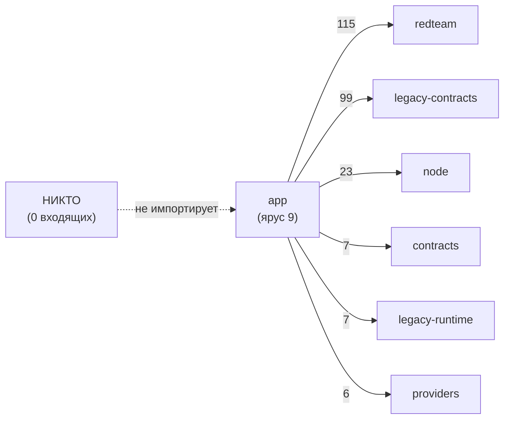
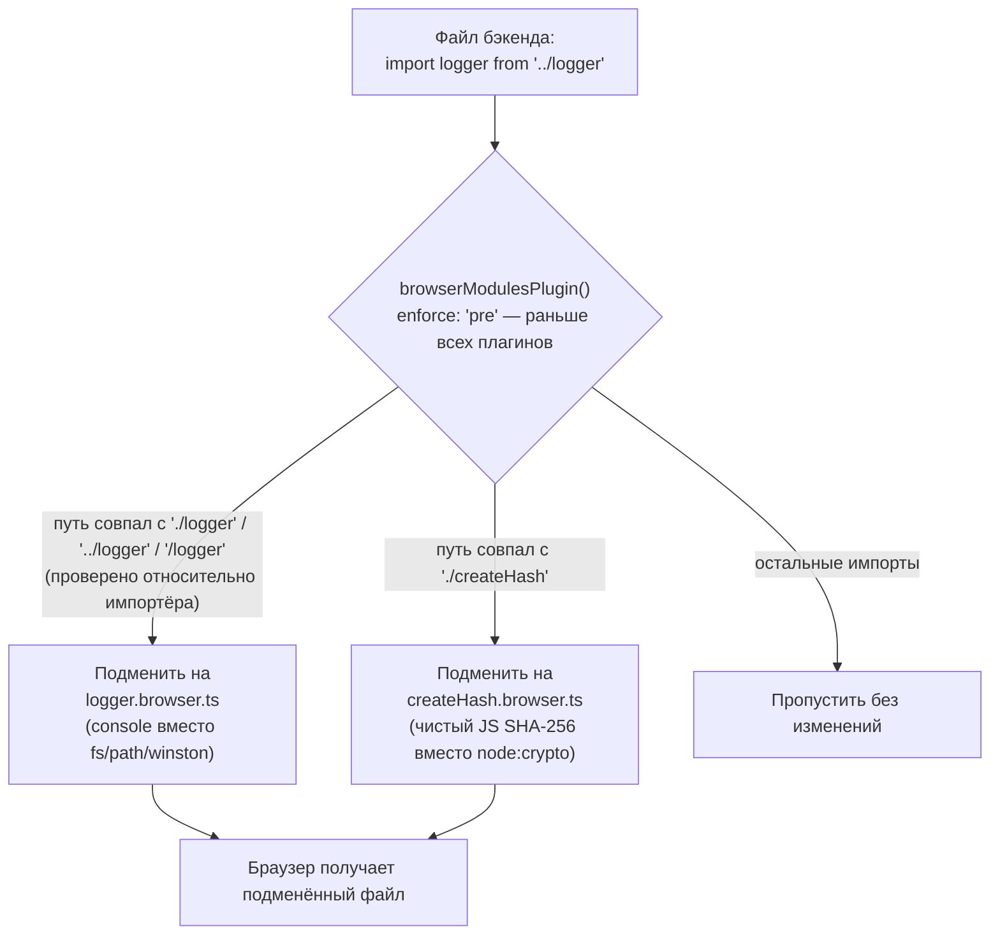
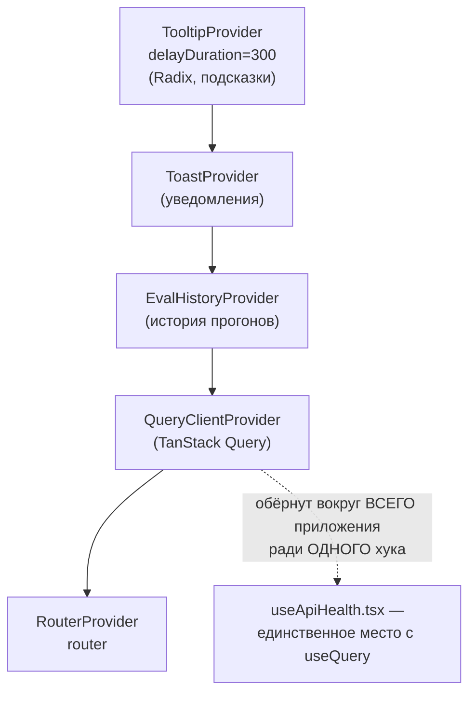
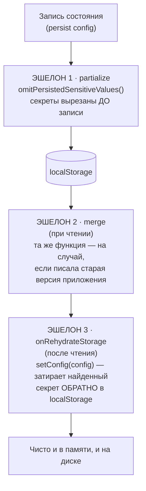

# Подсистема Web UI — `src/app`

> Разбор через призму **Domain-Driven Design**. Диаграммы — ANSI-псевдографика.
> Дополняет [ARCHITECTURE.md](./ARCHITECTURE.md), [REDTEAM.md](./REDTEAM.md),
> [PROVIDERS.md](./PROVIDERS.md).

---

## 0. Паспорт подсистемы

```
╔══════════════════════════════════════════════════════════════════════════════╗
║  APP CONTEXT — браузерное представление домена                               ║
╠══════════════════════════════════════════════════════════════════════════════╣
║  Слой в layers.json     app (ярус 9 из 11) · отдельный npm-воркспейс         ║
║  Стек                   React 19 · Vite · TypeScript · Zustand               ║
║                         React Router v7 · Radix UI · Tailwind v4 · Lucide    ║
╠══════════════════════════════════════════════════════════════════════════════╣
║  Продакшн-код           367 файлов ·  82 061 строка                          ║
║  Тесты                  283 файла  · 115 611 строк  ←  в 1,4 раза БОЛЬШЕ     ║
║  Storybook              38 файлов                                            ║
╠══════════════════════════════════════════════════════════════════════════════╣
║  pages/       редтим 111 файлов · 35 491 строка                              ║
║               eval    54 файла  · 16 011                                     ║
║               eval-creator 24 · 5 638   media 17 · 4 081                     ║
║               model-audit   19 · 3 591   + 9 мелких страниц                  ║
║  components/  151 файл · 27 334 строки   из них ui/ — 104 файла              ║
║  stores/        7 файлов ·  4 089        hooks/  27 файлов · 2 997           ║
║  utils/        22 файла  ·  4 008        contexts/ 10 файлов ·  540          ║
╠══════════════════════════════════════════════════════════════════════════════╣
║  Импортов из бэкенда (@promptfoo/*)   242                                    ║
║  Внутренних импортов (@app/*)       1 330                                    ║
║  Файлов бэкенда в белом списке         29                                    ║
║  Персистентных хранилищ                 9                                    ║
║  CSS-переменных дизайн-системы        172                                    ║
║  Пакетов Radix в зависимостях          17                                    ║
║  Пакетов MUI в зависимостях             0  ←  миграция завершена             ║
╚══════════════════════════════════════════════════════════════════════════════╝
```

**Формулировка предметной области в одном предложении.** App Context — единственный
контекст системы, у которого **нет ни одного входящего ребра**: от него не зависит
никто. Это чистый лист-потребитель, который переводит доменные понятия (прогон,
результат, плагин, мишень) в экранные формы и обратно, ничего не добавляя к самой
модели.

---

## 1. Единый язык подсистемы

| Термин | Носитель в коде | Смысл |
|---|---|---|
| **callApi** | `utils/api.ts:14` | Единственная разрешённая дверь наружу. Обычный `fetch()` запрещён. |
| **PageShell** | `components/PageShell.tsx` | Корневой макет: навигация, баннеры, `<Outlet/>`. |
| **Store** | `stores/*.ts` | Хранилище Zustand. Девять из них переживают перезагрузку. |
| **Context** | `contexts/*.tsx` | React-контекст. Каждый разделён на `…Context` и `…ContextDef`. |
| **ui/** | `components/ui/` | Дизайн-система: 104 файла примитивов поверх Radix. |
| **Design token** | `index.css` | 172 CSS-переменные. Захардкоженные цвета запрещены. |
| **Route constant** | `constants/routes.ts` | `EVAL_ROUTES` · `REDTEAM_ROUTES` · `MODEL_AUDIT_ROUTES` · `ROUTES`. |
| **DataTable** | `components/data-table/` | Таблица с серверной сортировкой и виртуализацией. |
| **Target draft** | `useRedTeamConfig` | Черновик конфигурации мишени в браузерном хранилище. |
| **browserModulesPlugin** | `vite.shared.ts` | Подмена Node-модулей браузерными на этапе разрешения импорта. |
| **@app/** | алиас Vite | Внутренние импорты, 1 330 штук. |
| **@promptfoo/** | алиас Vite | Импорты из бэкенда, 242 штуки, только по белому списку. |

---

## 2. Место подсистемы в архитектуре

```
                     ВХОДЯЩИЕ 0                    ИСХОДЯЩИЕ 257
                     (кто зависит от app)          (от кого зависит app)

                                             ┌──115──►  redteam
                     ┌─────────────┐         │── 99──►  legacy-contracts
        НИКТО  ─────►│     app     │─────────┤── 23──►  node
                     │  (ярус 9)   │         │──  7──►  contracts
                     └─────────────┘         │──  7──►  legacy-runtime
                                             └──  6──►  providers

   ┌──────────────────────────────────────────────────────────────────────┐
   │  ЧТО ЭТО ЗНАЧИТ                                                      │
   │                                                                      │
   │  • Ноль входящих рёбер. Приложение можно вырезать целиком, и         │
   │    остальная система соберётся. Это признак настоящего листа.        │
   │                                                                      │
   │  • Слой уже ацикличен: в компоненту сильной связности из шести       │
   │    слоёв app не входит (см. ARCHITECTURE.md §3.3).                   │
   │                                                                      │
   │  • Но 257 исходящих импортов — это прямые обращения браузера к       │
   │    коду бэкенда. Не к API, а к исходникам, через алиас сборки.       │
   │    Самое тяжёлое: app → redteam, 115 импортов.                       │
   └──────────────────────────────────────────────────────────────────────┘
```

Тот же расклад как Mermaid-диаграмма:



**Своими словами.** Представь дерево, на котором `app` — крайний лист на
самой тонкой веточке. Ни один другой лист не растёт из этого листа — если
его оторвать, дерево не заметит потери и будет расти дальше как ни в чём
не бывало (ноль входящих рёбер, приложение можно вырезать целиком). Но
сам лист вовсе не отрезан от дерева — внутрь него идёт целый пучок жилок
из более толстых веток снизу, и толщина у каждой жилки своя. Самая толстая
(115 из 257) тянется от ветки `redteam` — не случайность, а прямое
свидетельство того, что почти весь интерфейс приложения посвящён именно
red-team тестированию. Следующая по толщине (99) идёт от `legacy-contracts`,
а дальше жилки быстро худеют — 23, 7, 7, 6. Лист живой и питается — просто
питаться от него самого не может никто.

### 2.1. Белый список: 29 файлов, а не 29 директорий

Слой `app` — единственный, к которому применяется дополнительное ограничение:
`allowedImportPaths` в `architecture/layers.json` перечисляет **точные файлы**,
а не корни каталогов.

```
   ЧТО БРАУЗЕРУ РАЗРЕШЕНО ТЯНУТЬ ИЗ БЭКЕНДА

   redteam     9 файлов  ██████████  constants · constants/metadata
                                     constants/strategies · types · metrics
                                     riskScoring · sharedFrontend
                                     commands/discover · plugins/policy/utils
   util        8 файлов  █████████   convertEvalResultsToTable · database
                                     fileExtensions · invariant · objectUtils
                                     sanitizer · text · yamlLoad
   types       5 файлов  ██████      index · api/eval · api/modelAudit
                                     email · modelAudit
   корень      3 файла   ████        contracts.ts · csv.ts · logger.ts
   providers   2 файла   ██          constants.ts · http.ts
   tracing     1 файл    █           store.ts
   validators  1 файл    █           providers.ts
                        ────
                          29

   ┌──────────────────────────────────────────────────────────────────────┐
   │  ПРАВИЛО ХРАПОВИКА                                                   │
   │                                                                      │
   │  Новый импорт из корневого рантайма ломает CI, ДАЖЕ если отношение   │
   │  слоёв в целом разрешено. Перенося импорт на более узкую поверхность,│
   │  старый путь ОБЯЗАН быть вычеркнут из списка.                        │
   │                                                                      │
   │  Список — не разрешение, а счётчик долга. Он не даёт себе расти,     │
   │  но и не сокращается сам.                                            │
   └──────────────────────────────────────────────────────────────────────┘
```

### 2.2. Фактическое распределение 242 импортов

```
   @promptfoo/types                        87  ████████████████████████████
   @promptfoo/redteam/constants            55  ██████████████████
   @promptfoo/redteam/types                24  ████████
   @promptfoo/redteam/plugins/policy/utils 17  █████
   @promptfoo/contracts                     7  ██
   @promptfoo/util/invariant                6  ██
   @promptfoo/redteam/sharedFrontend        6  ██
   @promptfoo/types/api/eval                5  ██
   @promptfoo/redteam/metrics               5  ██
   @promptfoo/providers/constants           5  ██
   … ещё 15 путей по 1–4 импорта

   ┌──────────────────────────────────────────────────────────────────────┐
   │  ЧИТАЕТСЯ ТАК: браузеру нужны прежде всего ТИПЫ и ТАКСОНОМИЯ.        │
   │  87 импортов @promptfoo/types — это в основном `import type`,        │
   │  который стирается сборкой и в бандл не попадает.                    │
   │  А вот redteam/constants (55) и plugins/policy/utils (17) —          │
   │  реальные значения: списки плагинов, стратегий, описания, маппинги   │
   │  на стандарты. Именно они и делают редтим-раздел работающим.         │
   │                                                                      │
   │  Найденная аномалия: FrameworkCsvExporter.tsx импортирует            │
   │      '@promptfoo/app/src/utils/redteam'                              │
   │  то есть файл САМОГО ПРИЛОЖЕНИЯ через бэкендовый алиас. Должно быть  │
   │  '@app/utils/redteam'. Работает, но обходит смысл разделения алиасов.│
   └──────────────────────────────────────────────────────────────────────┘
```

---

## 3. Как браузер вообще импортирует бэкенд

Ключевой механизм, без которого §2 был бы невозможен: плагин Vite, подменяющий
Node-специфичные модули браузерными **на этапе разрешения импорта**.

```
   ┌─────────────────────────────────────────────────────────────────────────┐
   │  browserModulesPlugin()          src/app/vite.shared.ts                 │
   │  enforce: 'pre'  —  срабатывает раньше остальных плагинов               │
   ├─────────────────────────────────────────────────────────────────────────┤
   │                                                                         │
   │   Файл бэкенда пишет:            Браузер получает:                      │
   │                                                                         │
   │     import logger from           ────►   src/logger.browser.ts          │
   │       '../logger'                       (console вместо fs/path/winston)│
   │                                                                         │
   │     import { createHash } from   ────►   src/util/createHash.browser.ts │
   │       './createHash'                     (чистый JS SHA-256 вместо      │
   │                                           node:crypto)                  │
   │                                                                         │
   │   Совпадение проверяется по трём формам пути: './logger', '../logger',  │
   │   '/logger' — и подтверждается разрешением относительно импортёра,      │
   │   чтобы не перехватить чужой модуль с тем же именем.                    │
   └─────────────────────────────────────────────────────────────────────────┘

   ┌─────────────────────────────────────────────────────────────────────────┐
   │  ПОЧЕМУ ЭТО АРХИТЕКТУРНО ЗНАЧИМО                                        │
   │                                                                         │
   │  Подмена — это Anti-Corruption Layer наоборот: не домен защищается от   │
   │  внешнего мира, а браузерная среда защищается от предположений домена   │
   │  о наличии Node. Ровно два модуля, ровно две замены.                    │
   │                                                                         │
   │  Цена: белый список из 29 файлов держится не на дисциплине авторов,     │
   │  а на том, что эти 29 файлов случайно не используют ничего, кроме       │
   │  logger и createHash. Тридцатый файл может привезти node:fs — и это     │
   │  выяснится только на сборке.                                            │
   │                                                                         │
   │  Правильный вектор (зафиксирован в docs/architecture/packages.md):      │
   │  переносить нужное в src/contracts — листовой слой, которому вообще     │
   │  запрещены Node-встроенные модули. Тогда браузеро-безопасность          │
   │  становится проверяемым свойством, а не удачным стечением обстоятельств.│
   └─────────────────────────────────────────────────────────────────────────┘
```

Тот же механизм подмены как Mermaid-диаграмма:



**Своими словами.** Это как дублёр в кино для опасных трюков. Актёр (файл
бэкенда) в сценарии написан один — он просто идёт и произносит свою реплику:
«возьми logger» или «посчитай хэш». Но прежде чем включится камера (прежде
чем сборщик Vite разрешит импорт), на площадке дежурит ассистент режиссёра
(`browserModulesPlugin`), который успевает подменить актёра на дублёра ДО
начала съёмки — он работает раньше всех остальных плагинов, `enforce: 'pre'`.
Если по сценарию нужен `logger` — подставляется дублёр, который умеет то же
самое (писать в консоль), но без опасного трюка (без обращения к файловой
системе, которой в браузере просто нет). Если нужен `createHash` — тот же
приём: чистая JS-реализация вместо трюка с `node:crypto`. Причём дублёра
подставляют, только убедившись, что это действительно тот самый актёр по
имени, а не однофамилец из соседней сцены (сверка пути относительно
импортёра). Все остальные актёры в сценарии играют сами, без подмены.
Зритель — браузер — в итоге никогда не видит настоящего актёра, только
дублёра, и не замечает разницы.

---

## 4. Композиция приложения и маршруты

```
 ┌─────────────────────────────────────────────────────────────────────────────┐
 │  App.tsx — четыре вложенных провайдера, порядок значим                      │
 ├─────────────────────────────────────────────────────────────────────────────┤
 │                                                                             │
 │   <TooltipProvider delayDuration={300}>        Radix, глобальные подсказки  │
 │     <ToastProvider>                            уведомления                  │
 │       <EvalHistoryProvider>                    история прогонов             │
 │         <QueryClientProvider>                  TanStack Query               │
 │           <RouterProvider router={router} />                                │
 │                                                                             │
 │   ⚠  QueryClientProvider обёрнут вокруг всего приложения ради ОДНОГО хука:  │
 │      hooks/useApiHealth.tsx — единственное место с useQuery во всём коде.   │
 │      Остальные данные тянутся вручную через callApi в Zustand-хранилища.    │
 └─────────────────────────────────────────────────────────────────────────────┘

 ┌─────────────────────────────────────────────────────────────────────────────┐
 │  ДЕРЕВО МАРШРУТОВ                                                           │
 ├─────────────────────────────────────────────────────────────────────────────┤
 │                                                                             │
 │  /launcher                      только при VITE_PROMPTFOO_LAUNCHER          │
 │                                 ВНЕ PageShell — отдельный вход              │
 │                                                                             │
 │  / ─── <PageShell>                                                          │
 │        └── <TelemetryTracker>   ← Outlet-обёртка, шлёт webui_page_view      │
 │                                   на каждую смену pathname                  │
 │            │                                                                │
 │            ├─ index          →  /launcher или /eval                         │
 │            ├─ /eval  /eval/:evalId  /evals                                  │
 │            ├─ /history      ← /progress перенаправляется сюда (с v0.104.5)  │
 │            ├─ /datasets  /prompts  /media  /setup  /login                   │
 │            │                                                                │
 │            ├─ /model-audit        ┐                                         │
 │            ├─ /model-audits       │ каждый обёрнут в собственный            │
 │            ├─ /model-audit/setup  │ <ErrorBoundary name="…">                │
 │            ├─ /model-audit/:id    ┘ ← ТОЛЬКО эта ветка так защищена         │
 │            │                                                                │
 │            ├─ /redteam/setup   ← /redteam перенаправляется сюда             │
 │            ├─ /reports         ← /report перенаправляется сюда (с v0.118.2) │
 │            └─ *                →  NotFoundPage                              │
 └─────────────────────────────────────────────────────────────────────────────┘

   Наблюдение: устаревшие маршруты не удаляются, а перенаправляются, причём
   с указанием версии, начиная с которой действует редирект. Ссылки, которыми
   поделились раньше, продолжают работать. То же — в constants/routes.ts, где
   старые имена помечены @deprecated, но сохранены.
```

Порядок вложенных провайдеров как Mermaid-диаграмма:



**Своими словами.** Представь матрёшку из пяти кукол, вложенных одна в
другую в строго определённом порядке — переставить их местами нельзя,
иначе кукла не закроется как надо. Снаружи — самая большая кукла,
`TooltipProvider`, она отвечает за подсказки для вообще всего, что внутри.
В ней — кукла поменьше, `ToastProvider`, для уведомлений. Внутри неё —
кукла с историей прогонов. Дальше — кукла `QueryClientProvider`. И вот
здесь начинается странность: эта кукла рассчитана на то, чтобы держать
внутри целый склад данных с кэшированием запросов, а реально внутри неё
лежит только один маленький предмет — хук `useApiHealth`. Самая внутренняя
кукла, маршрутизатор, вообще не пользуется тем, что умеет эта кукла-склад:
данные приложение таскает вручную, мимо неё, через `callApi` прямо в
Zustand-хранилища. Кукла стоит на своём месте и работает исправно — просто
её объём сильно не соответствует тому немногому, что в ней хранится.

---

## 5. Состояние: девять персистентных хранилищ

Управление состоянием — Zustand, без Redux и без глобального кэша запросов.
Хранилища живут на трёх уровнях.

```
 ┌─────────────────────────────────────────────────────────────────────────────┐
 │  УРОВЕНЬ 1 · ГЛОБАЛЬНЫЕ                    src/stores/ (и src/store/)       │
 ├─────────────────────────────────────────────────────────────────────────────┤
 │    evalConfig.ts     1 384   ключ 'promptfoo'                ← см. §6       │
 │    userStore.ts         75   в памяти                                       │
 │    apiConfig.ts         32   ключ 'api-config-storage'                      │
 │    redteamJobStore.ts   30   ключ 'promptfoo-redteam-job'                   │
 │    providersStore.ts    16   в памяти          ← лежит в store/, не stores/ │
 ├─────────────────────────────────────────────────────────────────────────────┤
 │  УРОВЕНЬ 2 · СТРАНИЧНЫЕ                     рядом со страницей              │
 ├─────────────────────────────────────────────────────────────────────────────┤
 │    pages/eval/components/store.ts        1 097   ключ 'eval-settings'       │
 │        useTableStore + useResultsViewSettingsStore                          │
 │    pages/redteam/setup/hooks/                                               │
 │        useRedTeamConfig.ts               1 821   ключи 'redTeamConfig'      │
 │                                                  и 'recentlyUsedPlugins'    │
 │        useSetupState.ts                          ключ 'setupState'          │
 │    pages/redteam/report/components/store.ts      ключ 'ReportViewStorage'   │
 │    pages/model-audit/stores/                     ключ 'model-audit-config-  │
 │        useModelAuditConfigStore.ts                     store'               │
 ├─────────────────────────────────────────────────────────────────────────────┤
 │  УРОВЕНЬ 3 · REACT-КОНТЕКСТЫ                src/contexts/                   │
 ├─────────────────────────────────────────────────────────────────────────────┤
 │    ToastContext · EvalHistoryContext · UserContext · ShiftKeyContext        │
 │                                                                             │
 │    Приём: каждый контекст разбит НА ДВА ФАЙЛА —                             │
 │        XContextDef.ts   только createContext и типы                         │
 │        XContext.tsx     провайдер и логика                                  │
 │    Это разрывает цикл «компонент → провайдер → компонент» и позволяет       │
 │    Fast Refresh не сбрасывать состояние при правке провайдера.              │
 └─────────────────────────────────────────────────────────────────────────────┘
```

**Замечание о структуре.** Соседствуют `src/store/` (одно хранилище) и
`src/stores/` (четыре). Каталог в единственном числе — остаток, на который
до сих пор ссылается `AGENTS.md`. Разночтение мелкое, но именно такие расхождения
и заставляют искать хранилище в двух местах.

---

## 6. Браузерное хранилище как недоверенный ввод

Самая интересная часть подсистемы. Конфигурация мишени — это URL, заголовки,
схемы аутентификации. Она попадает в `localStorage`. Из этого следуют два
требования, и оба реализованы.

### 6.1. Секреты не должны попасть в хранилище — три эшелона

```
   stores/evalConfig.ts, persist({ … })

   ┌─────────────────────────────────────────────────────────────────────┐
   │  ЭШЕЛОН 1 · partialize                     ПРИ ЗАПИСИ               │
   │    config: omitPersistedSensitiveValues(state.config)               │
   │    Секреты вырезаются перед сериализацией в localStorage.           │
   ├─────────────────────────────────────────────────────────────────────┤
   │  ЭШЕЛОН 2 · merge                          ПРИ ЧТЕНИИ               │
   │    Та же функция применяется к прочитанному состоянию — на случай,  │
   │    если запись сделала предыдущая версия приложения, ещё без        │
   │    фильтрации.                                                      │
   ├─────────────────────────────────────────────────────────────────────┤
   │  ЭШЕЛОН 3 · onRehydrateStorage                ПОСЛЕ ЧТЕНИЯ          │
   │    state?.setConfig(state.config)                                   │
   │    Комментарий в коде: «Re-persist so credentials dropped during    │
   │    merge are also cleared from storage.»                            │
   │    То есть найденный старый секрет не просто игнорируется в памяти  │
   │    — он ЗАТИРАЕТСЯ в самом хранилище.                               │
   └─────────────────────────────────────────────────────────────────────┘

   КАК РАСПОЗНАЁТСЯ СЕКРЕТ — четыре независимых механизма:

     1  CREDENTIAL_TOKEN_PATTERN — регулярное выражение по имени поля:
          api_key · api_secret · token · jwt_token · id_token · ssh_key
          password · passphrase · credential · signature · cookie
          authorization · bearer · x_api_key · json_web_token

     2  INLINE_CREDENTIAL_MATERIAL_NAMES — поля, чьё ЗНАЧЕНИЕ всегда
        является ключевым материалом, даже если имя не подошло под п.1:
          pfx · pfx_content · jks_content · key_content
          keystore_content · certificate_content

     3  HEADER_CREDENTIAL_NAMES — голые имена заголовков-носителей,
        проверяются ТОЛЬКО внутри объекта headers:
          auth · x_auth · proxy_authorization
          x_amz_security_token · x_honeycomb_team

     4  Разбор URL на составные части: URL_USERINFO (логин:пароль@хост),
        URL_QUERY_PARAMETER, URL_PATH_SEGMENT — секрет вырезается и из
        строки адреса, а не только из отдельных полей.

   Плюс инверсные списки, чтобы не переусердствовать:
     NON_SECRET_CREDENTIAL_NAME_PATTERNS · SAFE_TRACING_PROVIDER_HEADER_NAMES
     SAFE_CREDENTIAL_TEMPLATE_FILTERS (trim, urlencode)
     OPAQUE_PROVIDER_CONFIG_KEYS

   Отдельно обрабатываются Nunjucks-ссылки {{ … }}: путь разбирается
   (parseSafeNunjucksPath), и шаблон, ведущий к безопасному значению,
   не вычищается вместе с настоящими секретами.
```

Три эшелона как Mermaid-диаграмма:



**Своими словами.** Представь камеру хранения в аэропорту с тремя разными
сотрудниками, а не с одним. Первый стоит на приёме багажа: прежде чем
поставить чемодан на полку, он открывает его и вынимает всё, что провозить
нельзя, — это происходит ДО того, как чемодан вообще коснулся полки
(эшелон 1, вырезание секретов при записи). Второй работает на выдаче: когда
чемодан снимают с полки, он ещё раз проверяет содержимое тем же способом —
потому что чемодан мог попасть на полку давно, в те времена, когда первого
сотрудника ещё не было и досмотр при сдаче не проводился (эшелон 2, слияние
при чтении старых записей). А третий сотрудник делает то, что кажется
странным, пока не понимаешь зачем: если на выдаче он всё-таки нашёл
запрещённый предмет, он не просто забирает его у владельца — он идёт и
перекладывает чемодан на полке заново, уже без этого предмета, чтобы в
следующий раз там тоже было чисто (эшелон 3, `onRehydrateStorage`
переписывает само хранилище, а не только копию в памяти). Тройная защита
существует именно потому, что чемодан на этой полке — не разовый: он
хранится месяцами, переживает обновления самой камеры хранения, и в старой
версии правил мог оказаться там с чем-то лишним внутри.

### 6.2. Прочитанное из хранилища не должно ломать приложение

`useRedTeamConfig.ts` — 1 821 строка, и бо́льшая их часть это **не логика формы,
а валидация восстановленного черновика**. Браузерное хранилище правится вручную,
переживает обновления приложения и может содержать что угодно.

```
   ПРОВЕРКИ, ПРИМЕНЯЕМЫЕ К ВОССТАНОВЛЕННОМУ КОНФИГУ МИШЕНИ

   Структура      isPlainObject · isStringRecord · isNonEmptyString
   HTTP           isValidHttpConfig · isValidHttpUrlOrTemplate
                  isValidRawHttpRequest · RAW_HTTP_METHODS (белый список)
   Заголовки      isValidHeaderName  — только символы token из RFC
                  isValidHeaderValue — коды 9 и 32…255, кроме 127
                                       (то есть без управляющих символов
                                        и без переводов строк → защита от
                                        расщепления заголовков)
   Аутентификация isValidHttpAuth · isValidA2AAuth
   Загрузка       isValidMultipartConfig
   Браузер        isSafeBrowserNavigateUrl
   Шаблоны        isSimpleNunjucksInterpolation

   ┌──────────────────────────────────────────────────────────────────────┐
   │  onRehydrateStorage: () => (state) => {                              │
   │    if (state && !isPlainObject(state.config.target?.config)) {       │
   │      state.setFullConfig(state.config);   ← принудительная починка   │
   │    }                                                                 │
   │  }                                                                   │
   │                                                                      │
   │  Плюс два механизма согласования:                                    │
   │    useRedTeamConfig.subscribe(…) → reassertTargetConfigValidation()  │
   │      любая правка конфига немедленно перепроверяется                 │
   │    registerTargetConfigReconciler(…)                                 │
   │      сверяет состояние в памяти с тем, что реально лежит в хранилище │
   └──────────────────────────────────────────────────────────────────────┘

   ВЫВОД ДЛЯ ЧИТАТЕЛЯ: localStorage здесь трактуется как недоверенный ввод —
   ровно так же, как тело HTTP-запроса на сервере. Для фронтенда это редкость
   и, применительно к инструменту безопасности, единственно правильный подход.
```

---

## 7. Слой доступа к API

Одно из самых строгих правил подсистемы формулируется в `AGENTS.md` капслоком:
**никогда не `fetch()`, всегда `callApi()`**.

```
   ┌─────────────────────────────────────────────────────────────────────┐
   │  utils/api.ts — 71 строка целиком                                   │
   ├─────────────────────────────────────────────────────────────────────┤
   │                                                                     │
   │   getApiBaseUrl():                                                  │
   │     1  useApiConfig.getState().apiBaseUrl     ← настройка в UI      │
   │     2  import.meta.env.VITE_PUBLIC_BASENAME  ← базовый путь сборки  │
   │                                                 (обратный прокси)   │
   │                                                                     │
   │   callApi(path, options) =                                          │
   │     fetch(`${getApiBaseUrl()}/api${path}`, options)                 │
   │                                                                     │
   │   + три готовые операции: fetchUserEmail · fetchUserId ·            │
   │     updateEvalAuthor                                                │
   └─────────────────────────────────────────────────────────────────────┘

   ЗАЧЕМ ЭТО ПРАВИЛО. Приложение живёт в трёх режимах:
     • dev      :3000 обращается к :15500 — разные порты
     • view     собранная статика раздаётся тем же сервером
     • за прокси базовый путь не '/' (VITE_PUBLIC_BASENAME)
   Прямой fetch('/api/…') сломается в двух из трёх.

   Типы для ответов берутся из бэкенда: @promptfoo/contracts,
   @promptfoo/types/api/eval — контракт API типизирован с обеих сторон
   из одного источника.
```

**Как устроен обмен данными в целом:**

```
   ┌──────────────┬───────────────────────────────────────────────────────┐
   │ Запрос-ответ │ callApi → Zustand-хранилище. Основной путь.           │
   │ Кэш запросов │ TanStack Query — ОДИН хук, useApiHealth.              │
   │ Живой поток  │ Socket.IO — ОДНО место, pages/eval/components/Eval.tsx│
   │              │   прогресс прогона; путь сокета вычисляется из        │
   │              │   apiBaseUrl, чтобы работать и за прокси, и на        │
   │              │   удалённом хосте                                     │
   │ Опрос        │ setInterval — launcher, Review, RunTestSuiteButton,   │
   │              │   AudioPreviewButton                                  │
   └──────────────┴───────────────────────────────────────────────────────┘
```

---

## 8. Дизайн-система

```
 ┌─────────────────────────────────────────────────────────────────────────────┐
 │  components/ui/ — 104 файла, ~39 примитивов                                 │
 ├─────────────────────────────────────────────────────────────────────────────┤
 │  Формы        input · textarea · select · combobox · checkbox · switch      │
 │               radio-group · slider · number-input · tag-input · label       │
 │               json-textarea · search-input · helper-text                    │
 │  Оверлеи      dialog · alert-dialog · sheet · popover · tooltip             │
 │               dropdown-menu                                                 │
 │  Навигация    tabs · breadcrumb · navigation-menu · navigation-sidebar      │
 │  Отображение  card · badge · chip · alert · separator · skeleton            │
 │               progress · gauge · spinner · code · copy-button · icons       │
 │  Прочее       button · collapsible · code-editor                            │
 │                                                                             │
 │  Использование: 738 импортов из @app/components/ui/                         │
 │                 144 импорта иконок из lucide-react                          │
 │                  19 прямых импортов @radix-ui (только внутри примитивов)    │
 └─────────────────────────────────────────────────────────────────────────────┘

 ┌─────────────────────────────────────────────────────────────────────────────┐
 │  index.css — 501 строка, 172 CSS-переменных, Tailwind v4                    │
 ├─────────────────────────────────────────────────────────────────────────────┤
 │                                                                             │
 │   @custom-variant dark (&:where([data-theme='dark'], [data-theme='dark'] *))│
 │     Тёмная тема — атрибут data-theme, а не медиазапрос. Значит,             │
 │     переключение управляется приложением (useThemePreference, 157 строк),   │
 │     а не только системной настройкой.                                       │
 │                                                                             │
 │   @theme {                                                                  │
 │     --color-background · --color-foreground · --color-card                  │
 │     --color-primary · --color-secondary · --color-muted · --color-accent    │
 │     --color-destructive · --color-border · --color-input · --color-ring     │
 │                                                                             │
 │     --color-severity-critical   ┐                                           │
 │     --color-severity-high       │ ПРЕДМЕТНАЯ ОБЛАСТЬ В ТОКЕНАХ:             │
 │     --color-severity-medium     │ пять уровней серьёзности из redteam       │
 │     --color-severity-low        │ подняты до уровня дизайн-системы          │
 │     --color-severity-informational ┘                                        │
 │                                                                             │
 │     --radius-sm/md/lg  вычисляются из одного --radius                       │
 │   }                                                                         │
 └─────────────────────────────────────────────────────────────────────────────┘
```

### 8.1. Десять правил `UI_GUIDELINES.md`

Отдельный документ на 528 строк, на который ссылается `AGENTS.md`:

```
    1  Типографика семантическим HTML, а не div-ами с классами
    2  Маленькие композируемые примитивы вместо монолитов с горой пропсов
    3  Иконки осмысленные, никогда декоративные
    4  Загрузка данных отделена от представления
    5  Паттерны React 19: use() · useActionState · useOptimistic ·
       useTransition · refs как обычные пропсы (forwardRef не нужен)
    6  Границы мягкие: border-border, никогда чистый чёрный
    7  Тёмная тема — прозрачностью (dark:bg-red-950/30), а не сплошным цветом
    8  Семантические цвета серьёзности: красный · янтарный · синий · изумрудный
    9  Единый макет страниц через PageContainer и PageHeader
   10  DataTable: правила усечения содержимого ячеек

   ЯВНЫЕ АНТИПАТТЕРНЫ (раздел «DO NOT DO ANY OF THE FOLLOWING»):
     • fetch() вместо callApi()
     • строковые литералы маршрутов вместо констант
     • классовые компоненты и устаревшие методы жизненного цикла
     • избыточная мемоизация простых значений
     • useCallback для вычисляемых значений — для них useMemo
```

---

## 9. Миграция MUI → Radix: завершена, документация — нет

```
   ┌──────────────────────────────────────────────────────────────────────┐
   │  ПРОВЕРЕНО ПО ФАКТУ                                                  │
   │                                                                      │
   │    import из '@mui/…' во всём src/app/src        0                   │
   │    пакетов @mui/* в package.json (корень и app)  0                   │
   │    пакетов @emotion/* там же                     0                   │
   │                                                                      │
   │  Остаточные следы — ровно два, и оба безвредны:                      │
   │    components/ui/icons.tsx:2                                         │
   │      комментарий «Icon mappings from @mui/icons-material to Lucide»  │
   │      — карта соответствия, оставленная как памятка миграции          │
   │    pages/eval-creator/components/YamlEditor.test.tsx:61-69           │
   │      три vi.mock('@mui/icons-material/…') на модули, которых больше  │
   │      не существует — мёртвые заглушки                                │
   │                                                                      │
   │  ⚠  При этом корневой AGENTS.md:19 до сих пор описывает подсистему   │
   │     как «Web UI (React 19/Vite/MUI v7)». Стек в документации         │
   │     устарел: MUI нет ни строчки.                                     │
   └──────────────────────────────────────────────────────────────────────┘
```

Само по себе это мелочь, но показательная: у репозитория есть исполняемые
проверки границ слоёв и импортов — и нет ни одной, которая сверяла бы описание
стека с содержимым `package.json`.

---

## 10. Производительность

```
 ┌─────────────────────────────────────────────────────────────────────────────┐
 │  1 · REACT COMPILER — автоматическая мемоизация                             │
 ├─────────────────────────────────────────────────────────────────────────────┤
 │   reactCompilerPlugin() в vite.shared.ts                                    │
 │                                                                             │
 │   Babel-плагины извлекаются из пресета @vitejs/plugin-react с ТРОЙНОЙ       │
 │   защитной проверкой формы: если API плагина изменится, компилятор просто   │
 │   отключится с предупреждением в buildStart, а не уронит конфигурацию.      │
 │                                                                             │
 │   ⚠  ОДНО ЯВНОЕ ИСКЛЮЧЕНИЕ:                                                 │
 │        pages/eval/components/ResultsTable.tsx    2 701 строка               │
 │      Комментарий объясняет способ: исключение задано таблицей в конфиге,    │
 │      а не директивой в исходнике, потому что директивы-опт-ауты помечаются  │
 │      сканером кода GitHub как неизвестные JS-директивы.                     │
 │      Самый большой и самый горячий компонент приложения оптимизируется      │
 │      вручную.                                                               │
 │                                                                             │
 │   Замер эффекта: __benchmarks__/reactCompiler.test.tsx через React Profiler.│
 ├─────────────────────────────────────────────────────────────────────────────┤
 │  2 · СТАБИЛЬНЫЕ ВЕНДОРНЫЕ ЧАНКИ — четыре группы с приоритетами              │
 ├─────────────────────────────────────────────────────────────────────────────┤
 │      vendor-react     50   react · react-dom · react-router-dom             │
 │      vendor-charts    40   recharts · chart.js                              │
 │      vendor-markdown  30   react-markdown · remark-gfm                      │
 │      vendor-utils     10   js-yaml · diff                                   │
 │                                                                             │
 │   Приоритеты нужны, потому что пакет может подойти под несколько правил;    │
 │   стабильность границ чанков сохраняет кэш браузера между релизами.         │
 ├─────────────────────────────────────────────────────────────────────────────┤
 │  3 · СЕРВЕРНАЯ ВИРТУАЛИЗАЦИЯ ТАБЛИЦЫ                                        │
 ├─────────────────────────────────────────────────────────────────────────────┤
 │   components/data-table/                                                    │
 │     useServerVirtualizedRows  — подгрузка диапазона строк по мере прокрутки,│
 │                                 с AbortSignal на каждый диапазон и          │
 │                                 prunePages для выгрузки далёких страниц     │
 │     useDataTableServerSorting — сортировка на сервере                       │
 │     data-table-filter.tsx      1 190 строк — конструктор фильтров           │
 │                                                                             │
 │   useTableStore (1 097 строк) принимает pageIndex, pageSize, filters и      │
 │   logicOperator и обращается к /api/eval — фильтрация и пагинация целиком   │
 │   на стороне сервера. Прогон на сотни тысяч строк не грузится в браузер.    │
 │                                                                             │
 │   @tanstack/react-virtual — единственная зависимость виртуализации.         │
 └─────────────────────────────────────────────────────────────────────────────┘
```

---

## 11. Фитнес-функции фронтенда

Помимо общесистемного `architecture:check`, у приложения есть собственные
исполняемые правила — тесты, которые проверяют не поведение, а **свойства кода**.

```
 ┌─────────────────────────────────────────────────────────────────────────────┐
 │  tests/test-hygiene.test.ts        ГИГИЕНА ТЕСТОВ                           │
 │    Сканирует все *.test.ts(x) и запрещает:                                  │
 │      • .only и .skip — забытый фокус превращает набор в декорацию           │
 │      • vi.unstubAllGlobals()      — сносит общие глобальные заготовки       │
 │      • globalThis.fetch = …       → mockBrowserProperty(globalThis,'fetch') │
 │      • globalThis.atob = …        → mockBrowserProperty                     │
 │      • window.open = …            → mockWindowOpen()                        │
 │      • window.matchMedia = …      → mockMatchMedia()                        │
 │      • window.IntersectionObserver = …  → mockIntersectionObserver()        │
 │    Каждое правило несёт текст с готовой заменой, а не просто запрет.        │
 ├─────────────────────────────────────────────────────────────────────────────┤
 │  tests/css-variable-syntax.test.ts  СИНТАКСИС TAILWIND v4                   │
 │    Рекурсивно обходит исходники и ловит ошибку, которую компилятор          │
 │    не заметит:                                                              │
 │      z-(--z-dropdown)        ✅  сокращённая форма в обычных классах        │
 │      h-[var(--my-height)]    ✅  произвольное значение ОБЯЗАНО быть в var() │
 │      h-[--my-height]         ❌  внешне правдоподобно, молча не работает    │
 ├─────────────────────────────────────────────────────────────────────────────┤
 │  circularDependencies.test.ts       ЦИКЛЫ                                   │
 │    Пиннинг архитектурных приёмов, введённых ради разрыва циклов:            │
 │      • testCaseGenerationTypes вынесен из TestCaseGenerationProvider        │
 │      • константы макета (SIDEBAR_WIDTH=240, NAVBAR_HEIGHT) вынесены         │
 │        в отдельный constants.ts                                             │
 │    Полная проверка — отдельной командой npm run lint:circular (madge).      │
 ├─────────────────────────────────────────────────────────────────────────────┤
 │  vite.react-compiler.test.ts · vite.config.test.ts   КОНФИГУРАЦИЯ СБОРКИ    │
 │    Проверяют, что подмена браузерных модулей работает и что вендорные       │
 │    группы чанков остались на месте.                                         │
 ├─────────────────────────────────────────────────────────────────────────────┤
 │  vitest.browser.config.ts           НАСТОЯЩИЙ БРАУЗЕР                       │
 │    Playwright + Chromium, 1280×720, headless.                               │
 │    include: src/**/*.browser.{ts,tsx} — отдельное расширение имени.         │
 │    sequence.shuffle = true — порядок тестов случайный, чтобы скрытые        │
 │    зависимости между ними вскрывались, а не накапливались.                  │
 └─────────────────────────────────────────────────────────────────────────────┘
```

### 11.1. Объём тестов

```
   Продакшн   367 файлов ·  82 061 строка  ████████████████
   Тесты      283 файла  · 115 611 строк   ███████████████████████
                                            ↑ в 1,41 раза больше кода,
                                              чем в самом приложении

   Плюс 38 файлов Storybook и отдельный набор бенчмарков.
```

---

## 12. Диагноз: сильные и слабые места

```
╔═══════════════════════════════════════════════════════════════════════════╗
║  СИЛЬНЫЕ СТОРОНЫ                                                          ║
╠═══════════════════════════════════════════════════════════════════════════╣
║  ✔ Ноль входящих зависимостей. Настоящий лист: приложение можно удалить,  ║
║    и остальная система соберётся.                                         ║
║                                                                           ║
║  ✔ Браузерное хранилище трактуется как недоверенный ввод. Три эшелона     ║
║    вычистки секретов и полтысячи строк валидации восстановленного         ║
║    черновика — для фронтенда это редкость.                                ║
║                                                                           ║
║  ✔ Единственная дверь наружу (callApi) с типами, взятыми из бэкенда.      ║
║    Контракт API типизирован с обеих сторон из одного источника.           ║
║                                                                           ║
║  ✔ Дизайн-система на 39 примитивов и 172 токена, с письменным сводом      ║
║    из десяти правил и явным списком антипаттернов.                        ║
║                                                                           ║
║  ✔ Предметная область поднята в токены: пять уровней severity из redteam  ║
║    живут в CSS как --color-severity-*.                                    ║
║                                                                           ║
║  ✔ Собственные фитнес-функции: гигиена тестов, синтаксис Tailwind,        ║
║    отсутствие циклов, конфигурация сборки — всё исполняемо.               ║
║                                                                           ║
║  ✔ Устаревшие маршруты перенаправляются с указанием версии, а не          ║
║    удаляются. Старые ссылки продолжают работать.                          ║
║                                                                           ║
║  ✔ Миграция MUI → Radix доведена до нуля импортов и нуля пакетов.         ║
╠═══════════════════════════════════════════════════════════════════════════╣
║  СЛАБЫЕ МЕСТА                                                             ║
╠═══════════════════════════════════════════════════════════════════════════╣
║  ✘ 257 импортов из бэкенда напрямую в браузер, из них 115 — в redteam.    ║
║    Браузеро-безопасность 29 файлов держится на том, что они не используют ║
║    ничего сложнее logger и createHash. Это свойство не проверяется —      ║
║    оно просто пока выполняется.                                           ║
║                                                                           ║
║  ✘ Гигантские компоненты. ResultsTable 2 701 строка, EvalOutputCell       ║
║    1 698, Review 1 396, StrategyConfigDialog 1 375. При этом правило №2   ║
║    гайдлайнов требует «маленьких композируемых примитивов» — оно          ║
║    соблюдается в ui/, но не в страницах.                                  ║
║                                                                           ║
║  ✘ useRedTeamConfig — 1 821 строка, где логика формы перемешана с         ║
║    валидацией восстановленного состояния. Валидаторы просятся в отдельный ║
║    модуль (или, лучше, в общие Zod-схемы бэкенда).                        ║
║                                                                           ║
║  ✘ Два каталога хранилищ: store/ (одно) и stores/ (четыре). AGENTS.md     ║
║    ссылается на первый.                                                   ║
║                                                                           ║
║  ✘ TanStack Query подключён глобально ради одного хука. Либо перевести    ║
║    загрузку данных на него, либо убрать провайдер.                        ║
║                                                                           ║
║  ✘ ErrorBoundary применён только к четырём маршрутам model-audit.         ║
║    Падение в /eval или /redteam/setup роняет всё приложение.              ║
║                                                                           ║
║  ✘ FrameworkCsvExporter.tsx импортирует файл приложения через бэкендовый  ║
║    алиас: '@promptfoo/app/src/utils/redteam' вместо '@app/utils/redteam'. ║
║                                                                           ║
║  ✘ Стек в корневом AGENTS.md устарел: заявлен MUI v7, которого нет.       ║
╚═══════════════════════════════════════════════════════════════════════════╝
```

### Оценка по осям

```
   Изоляция контекста       ████████████████████░  9/10   ноль входящих рёбер
   Дисциплина границ        ████████████░░░░░░░░░  6/10   белый список не сужается
   Дизайн-система           ██████████████████░░░  8/10
   Управление состоянием    ██████████████░░░░░░░  7/10   два каталога, один Query
   Размер компонентов       ████████░░░░░░░░░░░░░  4/10   четыре файла >1 300 строк
   Безопасность хранилища   ████████████████████░  9/10
   Тестируемость            ██████████████████░░░  8/10
   Актуальность документации ████████████░░░░░░░░  6/10
```

---

## 13. Рекомендации по эволюции

```
   1 · Перенести таксономию redteam в contracts.
       55 импортов redteam/constants + 24 redteam/types + 17
       plugins/policy/utils = 96 из 115. Это списки, описания и маппинги —
       чистые данные, которым место в листовом слое. После переноса
       ребро app → redteam сжимается примерно вчетверо, а браузеро-
       безопасность становится проверяемой, а не предполагаемой.

   2 · Обернуть каждый маршрут в ErrorBoundary.
       Сейчас защищены четыре маршрута из шестнадцати. Приём уже применён —
       достаточно распространить его на остальные.

   3 · Разобрать ResultsTable (2 701 строка).
       Это единственный файл, исключённый из React Compiler, — то есть
       самый горячий и самый сложный. Кандидаты на выделение: рендеринг
       ячейки, управление колонками, фильтрация, режим сравнения.

   4 · Вынести валидаторы useRedTeamConfig в отдельный модуль,
       а ещё лучше — переиспользовать Zod-схемы бэкенда
       (HttpProviderConfigSchema уже описывает ровно то же самое).
       Сейчас правила валидности HTTP-мишени существуют в двух
       независимых реализациях и могут разойтись.

   5 · Свести store/ и stores/ в один каталог, обновить AGENTS.md.

   6 · Определиться с TanStack Query: либо перевести на него загрузку
       данных, либо убрать провайдер и оставить useApiHealth на callApi.

   7 · Добавить фитнес-функцию на соответствие документации стеку —
       простой тест, сверяющий заявленные в AGENTS.md пакеты с
       package.json, поймал бы «MUI v7» автоматически.
```

---

## 14. Карта директории

```
src/app/
├── AGENTS.md                     руководство для агентов
├── UI_GUIDELINES.md         528  десять правил написания компонентов
├── vite.config.ts                port 3000 · alias @app и @promptfoo
├── vite.shared.ts                browserModulesPlugin · reactCompilerPlugin
│                                 vendorCodeSplittingGroups
├── vitest.browser.config.ts      Playwright + Chromium, *.browser.tsx
├── package.json                  19 зависимостей: 17 Radix + react-virtual
│                                 + lightningcss
│
└── src/
    ├── App.tsx                   4 провайдера + дерево маршрутов
    ├── main.tsx                  точка входа
    ├── index.css            501  Tailwind v4 · 172 CSS-переменные
    │
    ├── pages/               445 файлов · 163 836 строк (с тестами)
    │   ├── redteam/         111 · 35 491
    │   │   ├── setup/
    │   │   │   ├── page.tsx                       837
    │   │   │   ├── hooks/useRedTeamConfig.ts    1 821  ← стор + валидация
    │   │   │   ├── hooks/useRedTeamTargetConfigValidation.ts  785
    │   │   │   ├── components/Review.tsx        1 396
    │   │   │   ├── components/StrategyConfigDialog.tsx  1 375
    │   │   │   ├── components/PluginsTab.tsx      909
    │   │   │   ├── components/Purpose.tsx         893
    │   │   │   └── components/Targets/
    │   │   │       ├── ProviderTypeSelector.tsx 1 294
    │   │   │       ├── tabs/AuthorizationTab.tsx 1 052
    │   │   │       ├── tabs/TlsHttpsConfigTab.tsx 1 049
    │   │   │       ├── tabs/SessionsTab.tsx        882
    │   │   │       └── HttpEndpointConfiguration.tsx 986
    │   │   └── report/
    │   │       ├── components/Report.tsx        1 055
    │   │       └── components/store.ts   ключ 'ReportViewStorage'
    │   │
    │   ├── eval/             54 · 16 011
    │   │   └── components/
    │   │       ├── ResultsTable.tsx          2 701  ← вне React Compiler
    │   │       ├── EvalOutputCell.tsx        1 698
    │   │       ├── ResultsView.tsx           1 092
    │   │       ├── store.ts                  1 097  ← useTableStore
    │   │       ├── Eval.tsx                         ← Socket.IO
    │   │       ├── ResultsFilters/ · TableSettings/
    │   │
    │   ├── eval-creator/     24 ·  5 638   setupReadiness.ts 802
    │   ├── media/            17 ·  4 081   MediaModal 937 · Media 777
    │   ├── model-audit/      19 ·  3 591
    │   └── datasets · evals · prompts · history · launcher · login
    │       model-audit-{history,latest,result,setup}
    │
    ├── components/          151 файл · 27 334 строки
    │   ├── ui/              104 файла · ~39 примитивов поверх Radix
    │   ├── data-table/        data-table 1 053 · filter 1 190
    │   │                      use-server-sorting · use-server-virtualized-rows
    │   ├── layout/            PageContainer · PageHeader
    │   ├── traces/            TraceTimeline · TraceView
    │   ├── PageShell · Navigation · ErrorBoundary · Logo
    │   ├── ApiSettingsModal · InfoModal · ThemeSelector
    │   └── PostHog{Context,Provider,PageViewTracker} · PylonChat
    │
    ├── stores/                7 файлов · 4 089 строк
    │   ├── evalConfig.ts    1 384   ключ 'promptfoo' · вычистка секретов
    │   ├── userStore.ts        75
    │   ├── apiConfig.ts        32   ключ 'api-config-storage'
    │   └── redteamJobStore.ts  30   ключ 'promptfoo-redteam-job'
    ├── store/                        providersStore.ts  ← дубль каталога
    │
    ├── hooks/                27 файлов · 2 997 строк
    │   useThemePreference 157 · useEmailVerification 141
    │   useVersionCheck 116 · useSearchParamState 65 · useApiHealth 45
    │
    ├── contexts/             10 файлов · 540 строк
    │   Toast · EvalHistory · User · ShiftKey  (каждый + …ContextDef)
    │
    ├── utils/                22 файла · 4 008 строк
    │   api.ts 71 ← callApi · media 373 · mediaStorage 189 · date 90
    │
    ├── constants/            routes.ts 47 · languages.ts 566
    │
    ├── tests/                apiMocks · browserMocks · timers
    │   test-hygiene · css-variable-syntax · fetch-mock
    │   browser-mode/browserApis.browser.ts
    │
    ├── __benchmarks__/       reactCompiler.test.tsx
    ├── circularDependencies.test.ts
    └── polyfills/            scroll-timeline.js
```

---

## 15. Команды

```bash
npm run dev:app                    # только фронтенд, localhost:3000
npm run test:app -- <путь> --run   # один тест из корня репозитория
npm run lint:circular              # поиск циклов (madge)
```

Из каталога `src/app/`:

```bash
npm run test:browser               # Playwright + Chromium
npm run storybook                  # каталог компонентов, порт 6006
```

Числа из этого документа воспроизводятся так:

```bash
grep -rhoE "from '@promptfoo/" src/app/src | wc -l                    # 242
grep -rhoE "from '@mui/" src/app/src | wc -l                          # 0
find src/app/src -name '*.test.ts*' | wc -l                           # 283
```

---

*Документ описывает `src/app` на коммите `2c140ef`, promptfoo 0.122.0.
Дата среза — 26 августа 2026.*
