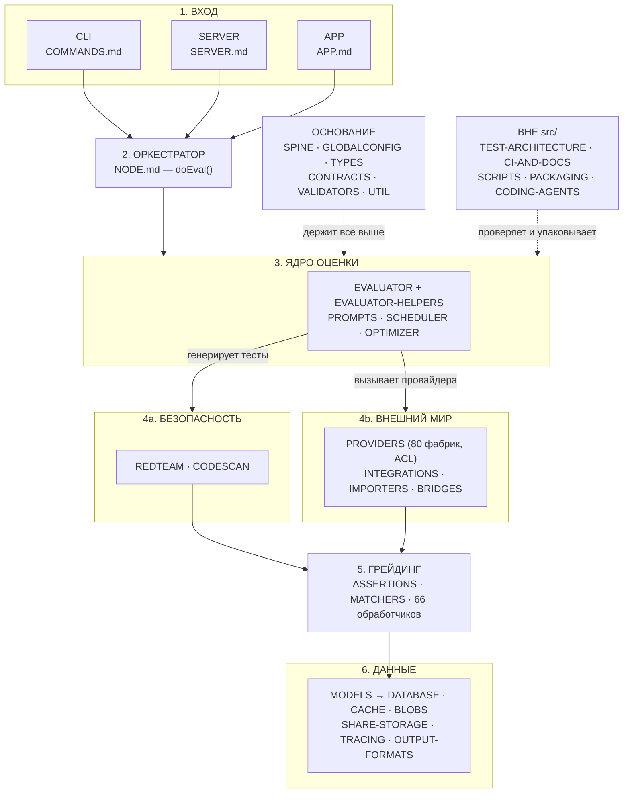

# Архитектура Promptfoo — индекс

> Разбор архитектуры через призму **Domain-Driven Design**.
> Диаграммы — псевдографика (ANSI box-drawing), читаются в терминале, в `less`, в `cat`.
>
> Состояние репозитория promptfoo на коммите `2c140ef`, версия 0.122.0.
> Дата среза — 26 августа 2026.

---

## HLD — вся система в одной картинке

Синтез сорока двух документов серии в один снимок: как запрос из командной
строки, сервера или браузера превращается в строку результата в базе.
Каждый блок ниже — это ссылка на документ (или группу документов), а не
новое исследование: диаграмма собирает уже установленные в §2 и §3
[01-overview-and-core.md](01-overview-and-core.md) факты (карта контекстов,
слоевая модель) в единую сквозную схему прохождения одного запроса.

```
╔══════════════════════════════════════════════════════════════════════════════╗
║              HLD — PROMPTFOO В ОДНОЙ КАРТИНКЕ (42 документа)                 ║
╠══════════════════════════════════════════════════════════════════════════════╣
║                                                                              ║
║  1. ВХОД              CLI (COMMANDS.md) · SERVER (SERVER.md) · APP (APP.md)  ║
║                              │                                               ║
║                              ▼                                               ║
║  2. ОРКЕСТРАТОР        NODE.md — doEval(), единственная точка входа          ║
║                              │                                               ║
║                              ▼                                               ║
║  3. ЯДРО ОЦЕНКИ        EVALUATOR + EVALUATOR-HELPERS                         ║
║                         PROMPTS · SCHEDULER · OPTIMIZER                      ║
║                              │                                               ║
║               ┌──────────────┴──────────────┐                                ║
║               ▼ генерирует тесты             ▼ вызывает провайдера           ║
║  4a. БЕЗОПАСНОСТЬ                   4b. ВНЕШНИЙ МИР                          ║
║      REDTEAM · CODESCAN                 PROVIDERS (80 фабрик, ACL) ·         ║
║                                          INTEGRATIONS · IMPORTERS · BRIDGES  ║
║               └──────────────┬──────────────┘                                ║
║                              ▼                                               ║
║  5. ГРЕЙДИНГ            ASSERTIONS · MATCHERS — 66 обработчиков, вердикт     ║
║                              │                                               ║
║                              ▼                                               ║
║  6. ДАННЫЕ              MODELS → DATABASE · CACHE · BLOBS ·                  ║
║                         SHARE-STORAGE · TRACING · OUTPUT-FORMATS             ║
║                                                                              ║
╠══════════════════════════════════════════════════════════════════════════════╣
║  ОСНОВАНИЕ (держит каждый блок выше, не только соседний):                    ║
║    SPINE · GLOBALCONFIG · TYPES · CONTRACTS · VALIDATORS · UTIL              ║
╠══════════════════════════════════════════════════════════════════════════════╣
║  ВНЕ src/ (проверяет и упаковывает всё нарисованное выше):                   ║
║    TEST-ARCHITECTURE · CI-AND-DOCS · SCRIPTS · PACKAGING · CODING-AGENTS     ║
╚══════════════════════════════════════════════════════════════════════════════╝
```

Та же схема как Mermaid-диаграмма:



**Своими словами.** Представь больницу. Пациент попадает внутрь через одну
из трёх дверей — регистратуру, приёмный покой или сайт записи (CLI, сервер,
браузерное приложение) — но за какой бы дверью он ни вошёл, его сразу
направляют к одной и той же дежурной медсестре-диспетчеру (`NODE.md`),
и дальше маршрут для всех одинаков. Диспетчер передаёт пациента в
процедурный кабинет (`EVALUATOR`), где над ним работает бригада: один
готовит назначения по протоколу (`PROMPTS`), другой следит, чтобы кабинет
не принял больше пациентов, чем может обработать одновременно
(`SCHEDULER`), третий — если это исследовательский протокол — подбирает
дозировку методом проб и ошибок (`OPTIMIZER`). Из процедурного кабинета
пациента отправляют по одному из двух маршрутов: либо к команде
стресс-тестирования, которая намеренно пытается спровоцировать сбой,
чтобы проверить, выдержит ли организм (`REDTEAM`, `CODESCAN`), либо к
внешней лаборатории на анализы — а лаборатория может быть любой из
двадцати разных сетей, и приёмное окно (`PROVIDERS`) само разбирается,
какие пробирки и бланки нужны именно этой лаборатории, так что бригаде
в кабинете не нужно об этом знать. Оба маршрута сходятся у одного и того
же врача-эксперта, который выносит диагноз: здоров или нет
(`ASSERTIONS`, `MATCHERS`). Диагноз и вся история болезни попадают в общую
картотеку — а это уже не один шкаф, а целый архив с разными полками:
основная база, аптечный склад-кэш, хранилище рентгеновских снимков,
журнал наблюдения за жизненными показателями и стол выписок
(`MODELS`/`DATABASE`, `CACHE`, `BLOBS`, `TRACING`, `OUTPUT-FORMATS`).
Ни один кабинет больницы не работает сам по себе — все они держатся на
общей инфраструктуре здания: электричество, водопровод, единый бейдж
персонала (`SPINE`, `GLOBALCONFIG`, `TYPES`, `CONTRACTS`, `VALIDATORS`,
`UTIL`). А прежде чем больница вообще откроет двери для пациентов, её
проверяет санитарная инспекция и служба, которая упаковывает оборудование
для филиалов (`TEST-ARCHITECTURE`, `CI-AND-DOCS`, `SCRIPTS`, `PACKAGING`,
`CODING-AGENTS`) — это не часть лечения, а условие, без которого лечить
вообще нельзя.

---

## Общий обзор архитектуры

Разбит на три части. Нумерация разделов сквозная и сохранена от исходного документа.

| Файл | Разделы | Содержание |
|---|---|---|
| [01-overview-and-core.md](./01-overview-and-core.md) | **0–4** | Паспорт системы · единый язык · карта ограниченных контекстов · слоевая модель и три храповика · ядро Evaluation Context |
| [03-code-deep-dives.md](./03-code-deep-dives.md) | **5–9** | Provider Context · Red Team Context · Grading Context · Persistence Context · Presentation Context |
| [02-ddd-reliability-and-operations.md](./02-ddd-reliability-and-operations.md) | **10–14** | Поперечные механизмы · диагноз зрелости по DDD · вектор развития · карта репозитория · команды самопроверки |

### Где искать конкретный раздел

```
   0  Паспорт системы .......................... 01-overview-and-core.md
   1  Единый язык (Ubiquitous Language) ........ 01-overview-and-core.md
   2  Карта ограниченных контекстов ............ 01-overview-and-core.md
   3  Слоевая модель ........................... 01-overview-and-core.md
        3.1 Заявленная топология (tierOrder)
        3.2 Реальная топология (edge-baseline)
        3.3 Цикл в графе слоёв
        3.4 Три храповика
   4  Ядро: Evaluation Context ................. 01-overview-and-core.md
        4.1 Агрегат Eval        4.2 Порты и адаптеры
        4.3 Поток одной оценки  4.4 Расширения как доменные события
   ─────────────────────────────────────────────────────────────────────
   5  Provider Context — антикоррупционный слой  03-code-deep-dives.md
   6  Red Team Context ......................... 03-code-deep-dives.md
   7  Grading Context .......................... 03-code-deep-dives.md
   8  Persistence Context ...................... 03-code-deep-dives.md
   9  Presentation Context ..................... 03-code-deep-dives.md
   ─────────────────────────────────────────────────────────────────────
  10  Поперечные механизмы ..... 02-ddd-reliability-and-operations.md
        10.1 Планировщик   10.2 Кэш   10.3 Трассировка
  11  Диагноз: зрелость по DDD . 02-ddd-reliability-and-operations.md
  12  Вектор развития .......... 02-ddd-reliability-and-operations.md
  13  Карта репозитория ........ 02-ddd-reliability-and-operations.md
  14  Команды самопроверки ..... 02-ddd-reliability-and-operations.md
```

---

## Индекс и покрытие

### Вне src/

| Документ | Строк | Предмет |
|---|---|---|
| [TEST-ARCHITECTURE.md](./TEST-ARCHITECTURE.md) | 506 | `test/` — тестовая архитектура: 1114 файлов, четыре яруса, фитнес-функции против гниения тестов |
| [CI-AND-DOCS.md](./CI-AND-DOCS.md) | 638 | `.github/` и `site/` — конвейер релиза, инциденты и Docusaurus-инфраструктура |
| [PACKAGES-CROSSCHECK.md](./PACKAGES-CROSSCHECK.md) | 385 | Сверка серии с `docs/architecture/packages.md` — авторским описанием слоёв; нашла и исправила одну ошибку в NODE.md |
| [SCHEDULER-CROSSCHECK.md](./SCHEDULER-CROSSCHECK.md) | 367 | Сверка SCHEDULER.md с `docs/scheduler-architecture.md` — нашла ошибку не в серии, а в источнике (AIMD vs реальный ×1.5) |
| [AGENTS-DOCS.md](./AGENTS-DOCS.md) | 435 | Сверка с `docs/agents/*.md` — политики подтверждены; найден крупнейший пробел серии: 10 902 строки агентных провайдеров без разбора |
| [CODING-AGENTS.md](./CODING-AGENTS.md) | 599 | Провайдеры кодинг-агентов (Codex, Claude Agent SDK, OpenCode) — 11 072 строки, крупнейший закрытый пробел серии |
| [PACKAGING.md](./PACKAGING.md) | 488 | `code-scan-action/` и `plugins/`, `.agents/` — как promptfoo упаковывает себя для GitHub Actions и AI-агентов |
| [SCRIPTS.md](./SCRIPTS.md) | 681 | `scripts/` — 17 файлов build/release-тулинга: фитнес-функции, релизный дым-тест, генераторы производных артефактов |

| Документ | Строк | Предмет |
|---|---|---|
| [INDEX-COVERAGE.md](./INDEX-COVERAGE.md) | 331 | Измеренный индекс `src/`: 1613 файлов, fan-in каждого, покрытие разборами по четырём метрикам, ранжированный пробел |

## Разборы подсистем

Каждый документ построен по одной схеме: паспорт · единый язык · место в архитектуре ·
механика · диагноз · рекомендации · карта директории · команды проверки.

### Ядро оценки

| Документ | Строк | Предмет |
|---|---|---|
| [EVALUATOR.md](./EVALUATOR.md) | 931 | `src/evaluator.ts` — оркестрация прогона, порты и адаптеры, три режима исполнения |
| [ASSERTIONS.md](./ASSERTIONS.md) | 870 | `src/assertions` — 66 обработчиков проверок, агрегация вердиктов |
| [MATCHERS.md](./MATCHERS.md) | 859 | `src/matchers` — доменные сервисы судейства, выбор модели-судьи |
| [PROMPTS.md](./PROMPTS.md) | 709 | `src/prompts` — загрузка промптов, двенадцать обработчиков форматов |
| [EVALUATOR-HELPERS.md](./EVALUATOR-HELPERS.md) | 590 | `src/evaluatorHelpers.ts` — рендеринг промпта, граница доверия, хуки расширений |
| [SCHEDULER.md](./SCHEDULER.md) | 736 | `src/scheduler` — адаптивная конкурентность, лимиты частоты |
| [OPTIMIZER.md](./OPTIMIZER.md) | 905 | `src/optimizer` — поисковый цикл над текстом промпта, раздел валидации |

### Внешний мир

| Документ | Строк | Предмет |
|---|---|---|
| [PROVIDERS.md](./PROVIDERS.md) | 1044 | `src/providers` — 80 фабрик за одним портом, крупнейший модуль |
| [INTEGRATIONS.md](./INTEGRATIONS.md) | 578 | `src/integrations` — реестры промптов и наборы данных |
| [IMPORTERS.md](./IMPORTERS.md) | 683 | `src/importers` — импорт чужих прогонов |
| [BRIDGES.md](./BRIDGES.md) | 615 | `src/python` · `src/ruby` · `src/golang` — исполнение кода вне Node |

### Безопасность

| Документ | Строк | Предмет |
|---|---|---|
| [REDTEAM.md](./REDTEAM.md) | 904 | `src/redteam` — 155 плагинов, 35 стратегий, 14 агентов атак |
| [CODESCAN.md](./CODESCAN.md) | 667 | `src/codeScan` — проверка pull request, весь вход недоверенный |

### Данные и наблюдаемость

| Документ | Строк | Предмет |
|---|---|---|
| [MODELS.md](./MODELS.md) | 728 | `src/models` — агрегат Eval, граница транзакции |
| [TRACING.md](./TRACING.md) | 706 | `src/tracing` — OpenTelemetry, роли спанов |
| [DATABASE.md](./DATABASE.md) | 652 | `src/database` — схема, соединение, конкурентность, миграции |
| [BLOBS.md](./BLOBS.md) | 663 | `src/blobs` — контентно-адресуемое хранилище |
| [CACHE.md](./CACHE.md) | 603 | `src/cache.ts` — кэш ответов провайдеров, секреты в ключе, пространства имён |
| [SHARE-STORAGE.md](./SHARE-STORAGE.md) | 562 | `src/share.ts` и `src/storage` — публикация прогона наружу, медиахранилище |
| [OUTPUT-FORMATS.md](./OUTPUT-FORMATS.md) | 508 | Форматы ввода-вывода: table · csv · googleSheets · microsoftSharepoint |

### Интерфейсы и основание

| Документ | Строк | Предмет |
|---|---|---|
| [SERVER.md](./SERVER.md) | 854 | `src/server` — Express и Socket.IO, 68 эндпойнтов |
| [APP.md](./APP.md) | 906 | `src/app` — React 19, единственный лист без входящих рёбер |
| [COMMANDS.md](./COMMANDS.md) | 674 | `src/commands` — CLI и MCP-сервер |
| [NODE.md](./NODE.md) | 606 | `src/node` — оркестратор `doEval`, порты и адаптеры, самый нагруженный слой |
| [CONTRACTS.md](./CONTRACTS.md) | 562 | `src/contracts` — опубликованный язык, единственный лист конституции слоёв |
| [TYPES.md](./TYPES.md) | 625 | `src/types` — единый язык в исполняемом виде |
| [VALIDATORS.md](./VALIDATORS.md) | 568 | `src/validators` — Zod на границе с пользовательским YAML |
| [UTIL.md](./UTIL.md) | 727 | `src/util` — общий слой поддержки |
| [SPINE.md](./SPINE.md) | 732 | Инфраструктурный хребет: logger · envars · cliState · constants · telemetry · esm · version |
| [GLOBALCONFIG.md](./GLOBALCONFIG.md) | 564 | `src/globalConfig` — личность, вход в облако, коммерческие правила |

---

## Как читать

```
   ЗНАКОМСТВО С СИСТЕМОЙ
     01-overview-and-core.md          что это и из чего состоит
     02-ddd-reliability-and-operations.md §11   честный диагноз

   РАБОТА НАД КОНКРЕТНОЙ ЗАДАЧЕЙ
     03-code-deep-dives.md            найти нужный контекст
     затем разбор соответствующей подсистемы

   ПОНИМАНИЕ ГРАНИЦ И ОГРАНИЧЕНИЙ
     01-overview-and-core.md §3       слои, обратные рёбра, храповики
     TYPES.md · UTIL.md               где проходит настоящая граница
```

Все числа в документах воспроизводимы — в каждом есть раздел с командами проверки.

---

*Индекс актуален для коммита `2c140ef`, promptfoo 0.122.0. Дата среза — 26 августа 2026.*
