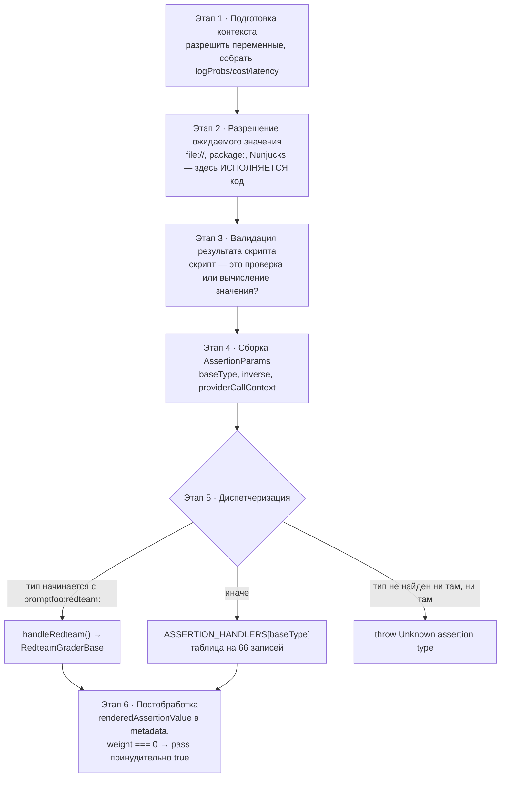
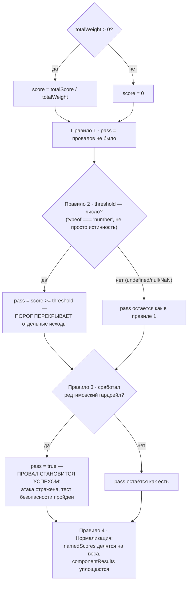
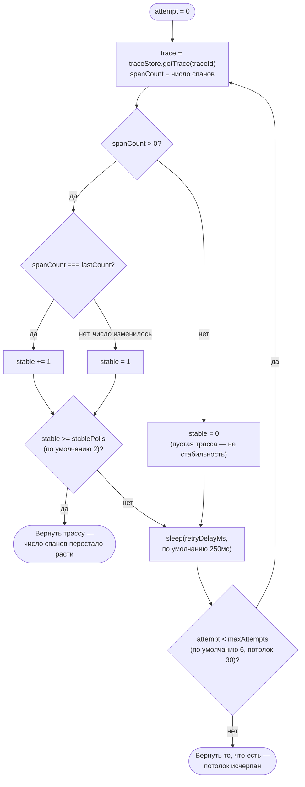

# Подсистема Assertions — `src/assertions`

> Разбор через призму **Domain-Driven Design**. Диаграммы — ANSI-псевдографика.
> Дополняет [ARCHITECTURE.md](./ARCHITECTURE.md), [REDTEAM.md](./REDTEAM.md),
> [PROVIDERS.md](./PROVIDERS.md), [APP.md](./APP.md).

---

## 0. Паспорт подсистемы

```
╔══════════════════════════════════════════════════════════════════════════════╗
║  GRADING CONTEXT — превращение вывода модели в вердикт                       ║
╠══════════════════════════════════════════════════════════════════════════════╣
║  Слой в layers.json     core (ярус 6 из 11)                                  ║
║  Соседи по слою         matchers · prompts · scheduler · testCase            ║
║  Объём                  57 файлов · 8 935 строк                              ║
║  Спутник                src/matchers/  11 файлов · 3 170 строк               ║
║  Заимствованное         src/external/   4 файла  ·   414 строк (Apache)      ║
╠══════════════════════════════════════════════════════════════════════════════╣
║  Обработчиков в ASSERTION_HANDLERS       66                                  ║
║    детерминированные                     31  ████████████████                ║
║    модельные (судья — LLM)               15  ████████                        ║
║    статистические                        11  ██████                          ║
║    агентные и трассировочные              9  █████                           ║
╠══════════════════════════════════════════════════════════════════════════════╣
║  Адресуемое пространство типов          275                                  ║
║      66 базовых + 66 инверсных (not-)                                        ║
║     + 3 особых (select-best · max-score · human)                             ║
║     +140 редтимовских (promptfoo:redteam:*)                                  ║
╠══════════════════════════════════════════════════════════════════════════════╣
║  Тесты                  60 файлов · 30 577 строк  ←  в 3,4 раза больше кода  ║
║                         + 21 файл тестов матчеров                            ║
╚══════════════════════════════════════════════════════════════════════════════╝
```

**Формулировка предметной области в одном предложении.** Assertions — это подобласть,
где субъективное («хороший ли ответ») приводится к объективному (`pass`, `score`,
`reason`) по правилам, которые пользователь объявил заранее. Всё остальное в системе —
подготовка к этому моменту и учёт его результата.

---

## 1. Единый язык подсистемы

| Термин | Носитель в коде | Смысл |
|---|---|---|
| **Assertion** | `AssertionSchema`, `types/index.ts:717` | Одна объявленная проверка: тип, ожидаемое значение, вес, порог, метрика. |
| **AssertionSet** | `AssertionSetSchema` | Группа проверок с собственными порогом и весом. Вложенность — один уровень. |
| **GradingResult** | `types/index.ts:527` | Вердикт: `pass` · `score` · `reason` + метрики и вложенные результаты. |
| **AssertionParams** | `types/index.ts:781` | Всё, что обработчик получает на вход: вывод, промпт, провайдер, тест, контекст. |
| **Handler** | `ASSERTION_HANDLERS`, `index.ts:229` | Функция `AssertionParams → GradingResult`. Плоская таблица на 66 записей. |
| **Matcher** | `src/matchers/` | Доменный сервис: организует вызов модели-судьи. |
| **baseType** | `getAssertionBaseType()` | Тип без префикса `not-`. Ключ диспетчеризации. |
| **inverse** | `isAssertionInverse()` | Признак инверсии. Тип начинается с `not-`. |
| **namedScores** | `GradingResult` | Именованные метрики с накопленными весами. |
| **metric** | поле `Assertion` | Имя метрики. Шаблон Nunjucks — рендерится по переменным теста. |
| **weight** | поле `Assertion` | Вес в средневзвешенном. `weight: 0` = метрика без права провалить тест. |
| **threshold** | поле `Assertion` / `AssertionSet` | Порог агрегата. Перекрывает исход отдельных проверок. |
| **graderError** | `GradingResult.metadata` | Судья не смог вынести вердикт. **Не** равно «критерий не выполнен». |
| **componentResults** | `GradingResult` | Результаты составных частей. Рекурсивная структура. |
| **contextTransform** | поле `Assertion` | Извлечение контекста из вывода — для RAG-проверок. |
| **valueFromScript** | `runAssertionInternal` | Значение, вычисленное пользовательским скриптом. |

---

## 2. Место подсистемы в архитектуре

Подсистема входит в слой `core` вместе с `matchers`, `prompts`, `scheduler`
и `testCase`. Показатели слоя целиком:

```
                    ВХОДЯЩИЕ 29                    ИСХОДЯЩИЕ 262

   legacy-runtime ──12──►┐                    ┌── 94──►  legacy-contracts
   node           ── 8──►│   ┌────────────┐   │── 90──►  node
   cli            ── 5──►├──►│    core    │───┤── 47──►  legacy-runtime
   redteam        ── 2──►│   │  (ярус 6)  │   │── 22──►  providers
   providers      ── 1──►│   └────────────┘   │──  8──►  redteam  ◄── обратное
   view-server    ── 1──►┘                    └──  1──►  contracts

   ┌──────────────────────────────────────────────────────────────────────┐
   │  ПАРАДОКС ЭТОГО СЛОЯ                                                 │
   │                                                                      │
   │  core называется ядром, но по числу зависимостей ведёт себя как      │
   │  прикладной слой: 262 исходящих против 29 входящих.                  │
   │                                                                      │
   │  Настоящее ядро домена должно быть внизу и не знать о рантайме.      │
   │  Здесь наоборот: ассёршены тянут node (90 импортов — база, модели,   │
   │  хранилище трасс), legacy-runtime (47 — логгер, python, ruby,        │
   │  трассировка) и providers (22 — чтобы позвать модель-судью).         │
   │                                                                      │
   │  Причина понятна и не является ошибкой проектирования: проверка      │
   │  «llm-rubric» ПО ОПРЕДЕЛЕНИЮ обращается к внешней модели, а          │
   │  «trace-span-count» — к хранилищу телеметрии. Чистой функцией такая  │
   │  проверка быть не может.                                             │
   │                                                                      │
   │  Но 31 обработчик из 66 — детерминированные: equals, contains,       │
   │  regex, levenshtein, word-count. Они не нуждаются ни в чём, кроме    │
   │  строки. Именно они и есть кандидаты на переезд в contracts.         │
   └──────────────────────────────────────────────────────────────────────┘
```

---

## 3. Пространство типов проверок

```
 ┌─────────────────────────────────────────────────────────────────────────────┐
 │  AssertionTypeSchema = union из четырёх источников                          │
 ├─────────────────────────────────────────────────────────────────────────────┤
 │                                                                             │
 │   1  BaseAssertionTypesSchema           66 значений в z.enum                │
 │        equals · contains · regex · llm-rubric · bleu · trace-span-count …   │
 │                                                                             │
 │   2  NotPrefixedAssertionTypesSchema    66 значений, ВЫВОДЯТСЯ автоматически│
 │        = BaseAssertionTypesSchema.transform(t => `not-${t}`)                │
 │        ↑ инверсия не перечисляется руками: новый базовый тип немедленно     │
 │          получает свой not-вариант, и рассинхронизация невозможна           │
 │                                                                             │
 │   3  SpecialAssertionTypesSchema         3 значения                         │
 │        select-best   сравнивает ВСЕ варианты теста, выбирает лучший         │
 │        max-score     выбирает вывод с наибольшей суммой прочих оценок       │
 │        human         ручная оценка через веб-интерфейс                      │
 │        ↑ ни один из трёх не живёт в ASSERTION_HANDLERS: первые два          │
 │          исполняются эвалюатором ПОСЛЕ основного прогона (нужны все         │
 │          строки теста сразу), третий приходит из UI                         │
 │                                                                             │
 │   4  z.custom<RedteamAssertionTypes>()   `promptfoo:redteam:${string}`      │
 │        140 судей в карте GRADERS — открытое множество, схемой не            │
 │        перечисляется                                                        │
 │                                                                             │
 │                                    ИТОГО ≈ 275 адресуемых типов             │
 └─────────────────────────────────────────────────────────────────────────────┘
```

### 3.1. Поля объявленной проверки

```
   AssertionSchema                        AssertionSetSchema
   ┌──────────────────────────────┐       ┌──────────────────────────────┐
   │ type              ОБЯЗАТЕЛЬНО│       │ type: 'assert-set'           │
   │ value?         ожидание      │       │ assert: Assertion[]  ← lazy  │
   │ config?        произвольная  │       │ weight?                      │
   │                мапа для      │       │ metric?                      │
   │                кастомных     │       │ threshold?                   │
   │ threshold?     порог         │       │ config?                      │
   │ weight?        вес           │       └──────────────────────────────┘
   │ metric?        имя метрики                                          │
   │ provider?      СВОЙ судья    │        z.lazy(() => AssertionSchema)
   │ rubricPrompt?  СВОЯ рубрика  │        — рекурсия объявлена, но на
   │ transform?     обработка     │          практике набор вкладывается
   │                вывода до     │          в тест ровно на один уровень
   │                проверки                                             │
   │ contextTransform?  извлечение                                       │
   │                контекста                                            │
   └──────────────────────────────┘
```

---

## 4. Контракт вердикта: `GradingResult`

```
 ┌─────────────────────────────────────────────────────────────────────────────┐
 │  interface GradingResult              src/types/index.ts:527                │
 ├─────────────────────────────────────────────────────────────────────────────┤
 │                                                                             │
 │  ЯДРО (обязательное)                                                        │
 │    pass: boolean          прошла ли проверка                                │
 │    score: number          обычно 0…1                                        │
 │    reason: string         человекочитаемое объяснение                       │
 │                                                                             │
 │  МЕТРИКИ                                                                    │
 │    namedScores?        Record<string, number>   именованные оценки          │
 │    namedScoreWeights?  Record<string, number>   суммарный вес каждой        │
 │      ↑ пара обязательна: без весов нельзя нормализовать средневзвешенное    │
 │                                                                             │
 │  УЧЁТ                                                                       │
 │    tokensUsed?         TokenUsage — судейство тоже стоит денег              │
 │                                                                             │
 │  СОСТАВНОСТЬ                                                                │
 │    componentResults?   GradingResult[]   ← РЕКУРСИЯ                         │
 │    assertion?          какая проверка породила этот результат               │
 │                                                                             │
 │  ОБРАТНАЯ СВЯЗЬ ПОЛЬЗОВАТЕЛЮ                                                │
 │    comment?            комментарий человека                                 │
 │    suggestions?        ResultSuggestion[] — что сделать, чтобы починить     │
 │                                                                             │
 │  ДИАГНОСТИКА (metadata)                                                     │
 │    renderedAssertionValue?   значение после подстановки переменных          │
 │    renderedGradingPrompt?    полный промпт, ушедший судье                   │
 │    graderOutputs?            сырые ответы фаз судейства                     │
 │    cachedResponse?           вердикт переиспользован без нового запроса     │
 │    context? · contextUnits?  контекст для RAG-проверок                      │
 │    pluginId? · strategyId?   привязка к редтимовской модели                 │
 │    graderError?: true        ← см. ниже                                     │
 └─────────────────────────────────────────────────────────────────────────────┘
```

### 4.1. `graderError` — отдельный инвариант, объяснённый прямо в исходнике

```
   ┌──────────────────────────────────────────────────────────────────────┐
   │  ТРИ СОСТОЯНИЯ, А НЕ ДВА                                             │
   │                                                                      │
   │      pass: true                 критерий выполнен                    │
   │      pass: false                критерий НЕ выполнен                 │
   │      graderError: true          СУДЬЯ НЕ СМОГ ВЫНЕСТИ ВЕРДИКТ        │
   │                                 (сбой транспорта или разбора ответа) │
   │                                                                      │
   │  Комментарий в types/index.ts формулирует правило дословно:          │
   │  вызывающие, поддерживающие инверсию (например `not-g-eval`),        │
   │  НЕ ДОЛЖНЫ переворачивать такой результат в pass — ошибка судьи      │
   │  не является доказательством ни того, что критерий выполнен,         │
   │  ни того, что он нарушен.                                            │
   │                                                                      │
   │  Тип объявлен литералом `true`, а не `boolean`: поле осмысленно      │
   │  только когда присутствует, и явно писать `false` запрещено.         │
   │                                                                      │
   │  ПОЧЕМУ ЭТО ВАЖНО. Без такого различения падение сети в судье        │
   │  превращало бы `not-llm-rubric` в зелёный тест. Для инструмента      │
   │  безопасности это ложноотрицательный результат — пропущенная         │
   │  уязвимость, замаскированная под успех.                              │
   └──────────────────────────────────────────────────────────────────────┘
```

---

## 5. Конвейер одной проверки

```
 runAssertion({ assertion, test, providerResponse, provider, prompt, traceId, … })
        │
        ▼
 ┌──────────────────────────────────────────────────────────────────────────┐
 │ ЭТАП 1 · ПОДГОТОВКА КОНТЕКСТА                                            │
 │   разрешение переменных · coerceString(output) · сбор logProbs, cost,    │
 │   latencyMs · формирование AssertionValueFunctionContext                 │
 └────────────────────────────────┬─────────────────────────────────────────┘
                                  ▼
 ┌──────────────────────────────────────────────────────────────────────────┐
 │ ЭТАП 2 · РАЗРЕШЕНИЕ ОЖИДАЕМОГО ЗНАЧЕНИЯ           ← ИСПОЛНЕНИЕ КОДА      │
 │                                                                          │
 │   value: 'file://check.js:myFn'   →  loadFromJavaScriptFile()            │
 │   value: 'file://check.py'        →  runPython(…, 'get_assert')          │
 │   value: 'file://check.rb'        →  runRuby(…, 'get_assert')            │
 │   value: 'file://expected.txt'    →  processFileReference()              │
 │   value: 'package:mod#fn'         →  loadFromPackage()                   │
 │   value: 'обычная строка'         →  nunjucks.renderString(…)            │
 │   value: [массив]                 →  поэлементно то же самое             │
 │                                                                          │
 │   Скрипту передаются (output, context). Имя функции по умолчанию для     │
 │   Python и Ruby — get_assert; для JS берётся после двоеточия в пути.     │
 └────────────────────────────────┬─────────────────────────────────────────┘
                                  ▼
 ┌──────────────────────────────────────────────────────────────────────────┐
 │ ЭТАП 3 · ВАЛИДАЦИЯ РЕЗУЛЬТАТА СКРИПТА                                    │
 │                                                                          │
 │   SCRIPT_RESULT_ASSERTIONS = { javascript, python, ruby }                │
 │     для них скрипт — это САМА ПРОВЕРКА, и он вправе вернуть              │
 │     boolean, number или готовый GradingResult                            │
 │                                                                          │
 │   для ВСЕХ ОСТАЛЬНЫХ типов скрипт — лишь способ вычислить ожидаемое      │
 │   значение, и возврат функции, boolean или GradingResult приводит        │
 │   к явной ошибке с объяснением, что именно нужно вернуть                 │
 │                                                                          │
 │   ЗАЧЕМ: без этой проверки `contains` со скриптом, вернувшим `true`,     │
 │   искал бы в выводе подстроку "true" — и молча проходил бы или падал     │
 │   по причине, не имеющей отношения к замыслу автора.                     │
 └────────────────────────────────┬─────────────────────────────────────────┘
                                  ▼
 ┌──────────────────────────────────────────────────────────────────────────┐
 │ ЭТАП 4 · СБОРКА AssertionParams                                          │
 │   baseType = getAssertionBaseType(assertion)   ← срез префикса not-      │
 │   inverse  = isAssertionInverse(assertion)                               │
 │   providerCallContext = { originalProvider, prompt, vars, traceparent }  │
 │     ↑ судья получает ССЫЛКУ НА ИСХОДНОГО ПРОВАЙДЕРА и собственный        │
 │       traceparent, привязанный к тому же traceId — вызовы судьи видны    │
 │       в общей трассе как отдельные спаны                                 │
 └────────────────────────────────┬─────────────────────────────────────────┘
                                  ▼
 ┌──────────────────────────────────────────────────────────────────────────┐
 │ ЭТАП 5 · ДИСПЕТЧЕРИЗАЦИЯ                                                 │
 │                                                                          │
 │   if (baseType.startsWith('promptfoo:redteam:'))  →  handleRedteam()     │
 │        мост в RED TEAM CONTEXT: getGraderById() → RedteamGraderBase      │
 │                                                                          │
 │   else  ASSERTION_HANDLERS[baseType](params)                             │
 │        плоская таблица, 66 записей                                       │
 │                                                                          │
 │   иначе  throw new Error(`Unknown assertion type: ${assertion.type}`)    │
 └────────────────────────────────┬─────────────────────────────────────────┘
                                  ▼
 ┌──────────────────────────────────────────────────────────────────────────┐
 │ ЭТАП 6 · ПОСТОБРАБОТКА                                                   │
 │                                                                          │
 │   renderedAssertionValue → в metadata, если отличается от шаблона        │
 │     (чтобы интерфейс показывал подставленные значения, а не {{ … }})     │
 │                                                                          │
 │   weight === 0  →  pass принудительно true                               │
 │     ┌──────────────────────────────────────────────────────────────┐     │
 │     │  ПРИЁМ: «метрика без права голоса». Проверка считается,       │    │
 │     │  её score попадает в namedScores, но провалить тест она       │    │
 │     │  не может. Так измеряют то, за что пока не наказывают.        │    │
 │     └──────────────────────────────────────────────────────────────┘     │
 └──────────────────────────────────────────────────────────────────────────┘
```

Тот же конвейер как Mermaid-диаграмма:



**Своими словами.** Представь приёмный пункт на заводе, куда рабочий приносит
одну деталь на проверку — это и есть одна объявленная проверка (assertion).
Сначала приёмщик готовит рабочее место: раскладывает саму деталь, записывает
время и стоимость её изготовления (этап 1). Дальше — самый рискованный шаг:
если в сопроводительной бумаге написано не число, а «спроси у станка X»
(`file://`, `package:`), приёмщик реально идёт и запускает этот станок, то
есть исполняет чужой код (этап 2). Полученный от станка ответ нужно ещё раз
проверить: станок мог вернуть либо готовый вердикт «деталь проверена
целиком», либо просто число, которое ещё предстоит с чем-то сравнить —
перепутать одно с другим значит зря забраковать нормальную деталь (этап 3).
Затем приёмщик заполняет бланк с общими графами: какой тип проверки, не
инверсия ли это, к какому станку-судье потом идти жаловаться, если что
(этап 4). На развилке приёмщик смотрит на бирку детали: если на ней штамп
«red team» — деталь уходит в отдельный цех с усиленным контролем; если
штампа нет — в обычный цех по одной из 66 линий проверки; а если бирка
нечитаема — деталь возвращается с ошибкой (этап 5). И в самом конце, уже
после вердикта, чиновник просматривает бумаги ещё раз: подставляет в отчёт
реальные значения переменных вместо шаблонных плейсхолдеров и, если деталь
была помечена «вес ноль» — то есть измеряем, но не наказываем — меняет
«не годен» на «годен» (этап 6).

---

## 6. Четыре семейства обработчиков

```
 ┌─────────────────────────────────────────────────────────────────────────────┐
 │ 1 · ДЕТЕРМИНИРОВАННЫЕ — 31 из 66. Без сети, без модели                      │
 ├─────────────────────────────────────────────────────────────────────────────┤
 │   Строки      equals · contains · contains-all · contains-any · icontains   │
 │               icontains-all · icontains-any · starts-with · regex           │
 │               levenshtein · word-count                                      │
 │   Форматы     is-json · contains-json · is-xml · contains-xml               │
 │               is-html · contains-html · is-sql · contains-sql               │
 │                 xml.ts 626 строк · sql.ts 402 · html.ts 365 — разбор        │
 │                 форматов оказался объёмнее всей строковой группы            │
 │   Вызовы      is-valid-function-call · is-valid-openai-function-call        │
 │               is-valid-openai-tools-call                                    │
 │   Метаданные  finish-reason · latency · cost · guardrails · is-refusal      │
 │   Код         javascript · python · ruby · webhook                          │
 ├─────────────────────────────────────────────────────────────────────────────┤
 │ 2 · МОДЕЛЬНЫЕ — 15. Судья сам является ApiProvider                          │
 ├─────────────────────────────────────────────────────────────────────────────┤
 │   Рубрики     llm-rubric · g-eval · agent-rubric · search-rubric            │
 │               model-graded-closedqa                                         │
 │   Факты       factuality · model-graded-factuality                          │
 │   RAG         answer-relevance · context-faithfulness · context-recall      │
 │               context-relevance                                             │
 │   Диалог      conversation-relevance                                        │
 │   Сервисы     classifier · moderation · pi                                  │
 │                                                                             │
 │   MODEL_GRADED_ASSERTION_TYPES — 11 типов помечены отдельно: эвалюатор      │
 │   умеет группировать вызовы к одному судье в общую очередь                  │
 ├─────────────────────────────────────────────────────────────────────────────┤
 │ 3 · СТАТИСТИЧЕСКИЕ — 11. Числовые метрики сходства                          │
 ├─────────────────────────────────────────────────────────────────────────────┤
 │   n-граммы    bleu · gleu · rouge-n · meteor  (+ ngrams.ts как общая база)  │
 │   Векторы     similar · similar:cosine · similar:dot · similar:euclidean    │
 │   Прочее      perplexity · perplexity-score · tool-call-f1                  │
 │                                                                             │
 │   meteor подгружается ДИНАМИЧЕСКИ и при отсутствии пакета `natural`         │
 │   отдаёт вежливый GradingResult с инструкцией по установке — вместо         │
 │   падения всего прогона                                                     │
 ├─────────────────────────────────────────────────────────────────────────────┤
 │ 4 · АГЕНТНЫЕ И ТРАССИРОВОЧНЫЕ — 9. Оценивается ПРОЦЕСС, а не ответ          │
 ├─────────────────────────────────────────────────────────────────────────────┤
 │   Траектория  trajectory:goal-success · trajectory:tool-used                │
 │               trajectory:tool-sequence · trajectory:tool-args-match         │
 │               trajectory:step-count                                         │
 │                 trajectory.ts 668 + trajectoryUtils.ts 527 — второй по      │
 │                 объёму блок после диспетчера                                │
 │   Спаны       trace-error-spans · trace-span-count · trace-span-duration    │
 │   Навыки      skill-used                                                    │
 │                                                                             │
 │   Сопоставление аргументов инструмента устроено нетривиально:               │
 │     matchesExpectedArgsPartial  частичное совпадение объекта                │
 │     stripDefaults               выкидывает значения по умолчанию            │
 │     stripIgnoredArgs            выкидывает поля из ignore-списка            │
 │   Иначе агент, добавивший необязательный параметр, ломал бы проверку.       │
 └─────────────────────────────────────────────────────────────────────────────┘
```

---

## 7. Матчеры: доменные сервисы судейства

`src/matchers/` — операции, не принадлежащие ни одной сущности. Классические
**domain services**: они организуют разговор с моделью-судьёй.

```
   ┌───────────────────────────────────────────────────────────────────────┐
   │  rubric.ts        907   загрузка и рендеринг рубрик                   │
   │  llmGrading.ts    591   llm-rubric · g-eval · pi                      │
   │  rag.ts           450   context-* и answer-relevance                  │
   │  providers.ts     285   РАЗРЕШЕНИЕ ПРОВАЙДЕРА-СУДЬИ                   │
   │  similarity.ts    228   эмбеддинги и косинусная близость              │
   │  comparison.ts    193   select-best · max-score                       │
   │  search.ts        147   search-rubric                                 │
   │  shared.ts        140   общие утилиты                                 │
   │  moderation.ts     95   ·  classification.ts 68  ·  agent.ts 66       │
   └───────────────────────────────────────────────────────────────────────┘

   ПРАВИЛА МОДУЛЯ, зафиксированные в matchers/AGENTS.md:
     • одно семейство матчеров — один модуль, монолит не восстанавливать
     • НЕ создавать barrel-модуль и не реэкспортировать через агрегатор
       (импорт только напрямую из модуля-источника)
     • разрешение провайдера — только в providers.ts,
       загрузка рубрик — только в rubric.ts,
       общие утилиты — только в shared.ts
     • семейства не импортируют друг друга через посредника
   Это прямая профилактика циклов: слой уже находится внутри компоненты
   сильной связности из шести слоёв, и внутренние циклы усугубили бы её.
```

### 7.1. Выбор судьи

```
   getGradingProvider(type, provider, defaultProvider)

   ┌───────────────────────────────────────────────────────────────────────┐
   │  ПРИОРИТЕТ, сверху вниз                                               │
   ├───────────────────────────────────────────────────────────────────────┤
   │   1  assertion.provider — строка             → loadApiProvider()      │
   │   2  assertion.provider — готовый ApiProvider → как есть              │
   │   3  assertion.provider — карта по типу       → рекурсия по type      │
   │        { text: …, embedding: …, classification: … }                   │
   │   4  assertion.provider — ProviderOptions    → loadFromProviderOptions│
   │   5  defaultTest.provider                     ┐                       │
   │   6  defaultTest.options.provider.text        ├ запасная цепочка      │
   │   7  defaultTest.options.provider             ┘                       │
   │   8  DefaultProviders.gradingProvider  ← каскад по учётным данным     │
   │                                          (см. PROVIDERS.md §10)       │
   ├───────────────────────────────────────────────────────────────────────┤
   │  ЯВНОЕ ИСКЛЮЧЕНИЕ                                                     │
   │    promptfoo:simulated-user НИКОГДА не подхватывается как неявный     │
   │    судья из defaultTest. Провайдер, играющий роль собеседника,        │
   │    не может судить сам себя — и код это проверяет отдельной           │
   │    функцией isSimulatedUserProviderConfig().                          │
   ├───────────────────────────────────────────────────────────────────────┤
   │  Массив вместо объекта даёт ОСОБОЕ сообщение об ошибке с подсказкой   │
   │  «проверьте, что провайдер не вложен в массив» — самая частая         │
   │  ошибка в YAML разбирается адресно, а не через общий текст Zod.       │
   └───────────────────────────────────────────────────────────────────────┘

   Каждый вызов судьи проходит через callGradingProvider(), который
   навешивает три вещи: трассировку (role: 'grader'), ограничение частоты
   через rateLimitRegistry и постановку в общую очередь providerCallQueue.
   Судейство подчиняется тем же лимитам, что и основной прогон.
```

---

## 8. Агрегация: `AssertionsResult`

Самая насыщенная правилами часть. Класс на 386 строк превращает набор отдельных
вердиктов в один.

```
 ┌─────────────────────────────────────────────────────────────────────────────┐
 │  addResult({ index, result, metric, weight = 1 })                           │
 ├─────────────────────────────────────────────────────────────────────────────┤
 │                                                                             │
 │   totalScore  += result.score × weight                                      │
 │   totalWeight += weight                                                     │
 │                                                                             │
 │   namedScores[metric]       += result.score × weight                        │
 │   namedScoreWeights[metric] += weight                                       │
 │                                                                             │
 │   Вложенные namedScores наследуются с ПЕРЕМНОЖЕНИЕМ весов:                  │
 │       weightedIncomingWeight = incomingWeight × weight                      │
 │   так вес родителя корректно распространяется вглубь                        │
 │                                                                             │
 │   Учёт токенов нормализуется отдельно (normalizeAssertionTokenUsage):       │
 │     • cachedResponse === true  →  total/prompt/completion обнуляются,       │
 │       всё уходит в cached, numRequests = 0                                  │
 │       ↑ повторное судейство из кэша не должно выглядеть как трата           │
 │     • есть renderedGradingPrompt, но numRequests === 0  →  numRequests = 1  │
 │       ↑ факт обращения к судье восстанавливается, даже если провайдер       │
 │         его не сообщил                                                      │
 │                                                                             │
 │   PROMPTFOO_SHORT_CIRCUIT_TEST_FAILURES=true  →  бросить сразу на первом    │
 │   провале, не досчитывая остальные проверки                                 │
 └─────────────────────────────────────────────────────────────────────────────┘

 ┌─────────────────────────────────────────────────────────────────────────────┐
 │  testResult(scoringFunction?)  —  четыре правила по порядку                 │
 ├─────────────────────────────────────────────────────────────────────────────┤
 │                                                                             │
 │  ПРАВИЛО 1 · СРЕДНЕВЗВЕШЕННОЕ                                               │
 │      score = totalWeight > 0 ? totalScore / totalWeight : 0                 │
 │      pass  = провалов не было                                               │
 │                                                                             │
 │  ПРАВИЛО 2 · ПОРОГ ПЕРЕКРЫВАЕТ ОТДЕЛЬНЫЕ ИСХОДЫ                             │
 │      if (typeof threshold === 'number' && !Number.isNaN(threshold))         │
 │          pass = score >= threshold                                          │
 │                                                                             │
 │      ┌───────────────────────────────────────────────────────────────┐      │
 │      │  Проверка именно на typeof === 'number', а НЕ на истинность,  │      │
 │      │  и не на !== undefined. Комментарий объясняет оба случая:     │      │
 │      │                                                               │      │
 │      │   threshold: 0    осмысленное значение — «собирать оценки,    │      │
 │      │                   но никогда не проваливать тест». Проверка   │      │
 │      │                   на истинность отбросила бы ноль.            │      │
 │      │                                                               │      │
 │      │   threshold:      пустое поле в YAML даёт null. Проверка на   │      │
 │      │                   !== undefined пропустила бы его, и          │      │
 │      │                   `score >= null` тихо проходило бы ВСЕГДА.   │      │
 │      └───────────────────────────────────────────────────────────────┘      │
 │                                                                             │
 │  ПРАВИЛО 3 · ИНВЕРСИЯ РЕДТИМОВСКОГО ГАРДРЕЙЛА                               │
 │      if (failedContentSafetyChecks) { pass = true;                          │
 │                                       reason = GUARDRAIL_BLOCKED_REASON }   │
 │                                                                             │
 │      ┌───────────────────────────────────────────────────────────────┐      │
 │      │  ПРОВАЛ ПРЕВРАЩАЕТСЯ В УСПЕХ. Флаг ставится, когда падает     │      │
 │      │  проверка типа `guardrails` с config.purpose === 'redteam'.   │      │
 │      │                                                               │      │
 │      │  Логика домена: гардрейл отклонил вредоносный запрос, значит  │      │
 │      │  система защитилась, значит АТАКА НЕ УДАЛАСЬ, значит тест     │      │
 │      │  безопасности пройден. Технический провал проверки здесь      │      │
 │      │  означает содержательный успех.                               │      │
 │      │                                                               │      │
 │      │  AGENTS.md подсистемы предупреждает отдельным пунктом:        │      │
 │      │  не менять это поведение без прицельных редтимовских тестов.  │      │
 │      └───────────────────────────────────────────────────────────────┘      │
 │                                                                             │
 │  ПРАВИЛО 4 · НОРМАЛИЗАЦИЯ И УПЛОЩЕНИЕ                                       │
 │      namedScores[k] /= namedScoreWeights[k]                                 │
 │      componentResults уплощаются на ОДИН уровень, и дочерние результаты     │
 │      наследуют assertion родителя, если своей не имеют                      │
 └─────────────────────────────────────────────────────────────────────────────┘
```

Те же четыре правила как Mermaid-диаграмма:



**Своими словами.** Представь итоговую оценку на экзамене, где вместо одной
цифры — цепочка правил, и каждое следующее может переписать решение
предыдущего. Сначала считают обычное средневзвешенное по всем вопросам —
как в школе: сложить баллы с учётом веса каждого вопроса и поделить на сумму
весов (правило 1). Но если в билете отдельно указан проходной порог
(«не менее 70%»), этот порог главнее среднего балла: даже если по сумме
баллов ученик прошёл, а порог не взят — итог всё равно «не сдал» (правило 2,
с отдельной оговоркой, что порог «ноль» — это не то же самое, что «порога
нет вообще», это легко перепутанные, но разные вещи). Дальше — самое
неожиданное правило, специфичное именно для экзамена по технике
безопасности: если сработала аварийная защита — ученик специально попытался
выполнить опасное действие, а автоматика его заблокировала — то формальный
«провал» этого упражнения на самом деле означает, что система защиты
отработала правильно, и экзамен в целом засчитывается как пройденный
(правило 3). Это не натяжка, а сама суть проверки: если бы автоматика НЕ
сработала, вот тогда это был бы настоящий провал. И только в самом конце
все оценки причёсывают: делят накопленные суммы по каждой отдельной метрике
на их веса, а вложенные подгруппы вопросов разворачивают в общий список, как
будто это была одна большая экзаменационная ведомость, а не несколько
вложенных друг в друга блоков (правило 4).

### 8.1. Набор проверок как вложенный агрегат

```
   runAssertions() строит ДВА уровня накопителей:

   ┌─────────────────────────────────────────────────────────────────┐
   │  mainAssertResult          threshold теста                      │
   │  ┌───────────────────────────────────────────────────────┐      │
   │  │  обычная проверка  index 0                            │      │
   │  │  обычная проверка  index 1                            │      │
   │  │                                                        │     │
   │  │  ┌─ subAssertResult ── threshold набора ────────────┐ │      │
   │  │  │   вложенная проверка  index 0                    │ │      │
   │  │  │   вложенная проверка  index 1                    │ │      │
   │  │  └──────────────┬───────────────────────────────────┘ │      │
   │  │                 │ testResult() набора считается ПЕРВЫМ│      │
   │  │                 ▼ и добавляется в главный как ОДИН    │      │
   │  │              index 2  результат с весом набора         │     │
   │  └───────────────────────────────────────────────────────┘      │
   └─────────────────────────────────────────────────────────────────┘

   Порядок исполнения:
     1  все обычные проверки — параллельно, лимит ASSERTIONS_MAX_CONCURRENCY = 3
        (PROMPTFOO_ASSERTIONS_MAX_CONCURRENCY)
     2  ⚠  при активной очереди группировки вызовов провайдера конкурентность
        принудительно опускается до 1: параллельная отправка переставляет
        порядок постановки в очередь и РАЗБИВАЕТ группы одного судьи
     3  затем сворачиваются наборы
     4  затем главный накопитель отдаёт итог

   select-* и max-score пропускаются на шаге 1 явной проверкой: они зависят
   от нескольких выводов сразу и исполняются эвалюатором отдельной фазой.
```

---

## 9. Работа с телеметрией: ожидание неполных данных

Трассировочные проверки сталкиваются с гонкой: спаны приходят асинхронно и
могут ещё не долететь к моменту оценки. Решение — не «подождать N миллисекунд»,
а **дождаться стабилизации**.

```
   loadTraceData(traceId)

   ┌───────────────────────────────────────────────────────────────────────┐
   │   for attempt in 0…maxAttempts:                                       │
   │       trace = traceStore.getTrace(traceId)                            │
   │       spanCount = trace?.spans?.length ?? 0                           │
   │                                                                       │
   │       if (spanCount > 0):                                             │
   │           stable = (spanCount === lastCount) ? stable + 1 : 1         │
   │           if (stable >= stablePolls) return trace   ← ЧИСЛО ПЕРЕСТАЛО │
   │                                                        МЕНЯТЬСЯ       │
   │       else:                                                           │
   │           stable = 0        ← пустая трасса не считается стабильной   │
   │                                                                       │
   │       sleep(retryDelayMs)                                             │
   └───────────────────────────────────────────────────────────────────────┘

   ПАРАМЕТРЫ, каждый с потолком:
     попыток        6   (PROMPTFOO_TRACE_FETCH_MAX_ATTEMPTS,   максимум 30)
     задержка     250мс (PROMPTFOO_TRACE_FETCH_RETRY_DELAY_MS, максимум 5000)
     стаб. опросов  2   (PROMPTFOO_TRACE_FETCH_STABLE_POLLS,   максимум 10)

   Потолки не декоративны: переменная окружения не может превратить ожидание
   трассы в бесконечное зависание прогона.

   ┌───────────────────────────────────────────────────────────────────────┐
   │  ПРЕДЗАГРУЗКА                                                         │
   │  runAssertions вызывает hasTraceAwareAssertions() и, если хоть одна   │
   │  проверка может понадобиться трассе, грузит её ОДИН раз на весь       │
   │  набор — вместо повторного ожидания в каждом обработчике.             │
   │                                                                       │
   │  Список «может понадобиться» шире списка «точно нужна»:               │
   │    • 11 типов из TRACE_AWARE_ASSERTION_TYPES                          │
   │    • любой promptfoo:redteam:coding-agent:*                           │
   │    • ЛЮБАЯ проверка со значением file:// или package:                 │
   │      ↑ пользовательский скрипт получает контекст целиком и может      │
   │        обратиться к трассе — предугадать это нельзя                   │
   │                                                                       │
   │  Правило из AGENTS.md: трассочувствительные проверки обязаны          │
   │  переносить отсутствующие, задержанные и неполные данные, а причина   │
   │  провала должна оставаться объяснимой в тексте reason.                │
   └───────────────────────────────────────────────────────────────────────┘
```

Цикл ожидания трассы (основная часть `loadTraceData`) как Mermaid-диаграмма:



**Своими словами.** Представь, что взвешиваешь сыпучий продукт на кухонных
весах, пока продавец досыпает его из мешка небольшими порциями. Нельзя
просто взглянуть на весы один раз и записать число — досыпка ещё не
закончена, число будет расти. Но нельзя и ждать бесконечно, пока продавец
сам скажет «всё, больше не сыплю» — иногда об этом никто не сообщает.
Поэтому применяют простое правило: посмотреть на весы, запомнить число,
подождать немного и посмотреть снова. Если число не изменилось — весы,
скорее всего, устоялись, но для верности это проверяют ещё раз подряд
(стабильных показаний должно набраться два, а не одно). Если число хоть
немного выросло — счётчик стабильности сбрасывается, и отсчёт начинается
заново с этой отметки. Если же на весах пока вообще пусто (ни один спан ещё
не долетел) — это не считается «стабильностью», это считается «ещё рано
смотреть». И, что важно, всему ожиданию положен жёсткий потолок по числу
попыток — весы не будут проверять до бесконечности, даже если специально
попросить их об этом через переменную окружения: рано или поздно
взвешивание прекратится, и результат — каким бы он ни был на тот момент —
пойдёт в дальнейшую проверку.

---

## 10. Заимствованная методология

Часть проверок реализует опубликованные методики оценки. Они вынесены в
отдельный каталог вместе с текстом лицензии.

```
   src/external/
   ├── APACHE_LICENSE
   ├── prompts/ragas.ts               73   промпты, портированные из RAGAS
   │       ANSWER_RELEVANCY_GENERATE · CONTEXT_RECALL · …
   │       используются context-recall, context-relevance,
   │       context-faithfulness, answer-relevance
   ├── matchers/deepeval.ts          120   matchesConversationRelevance
   ├── matchers/conversationRelevancyTemplate.ts  79
   └── assertions/deepeval.ts        142   handleConversationRelevance
           окно диалога по умолчанию 5 сообщений, порог 0.5 —
           значения взяты из DeepEval, а не выдуманы

   ┌──────────────────────────────────────────────────────────────────────┐
   │  ПОЧЕМУ ЭТО ХОРОШИЙ ПРИЁМ                                            │
   │                                                                      │
   │  Каждый файл открывается комментарием с указанием источника и        │
   │  ссылкой на лицензию. Заимствованная методика физически отделена     │
   │  от собственной, а значит:                                           │
   │    • видно, что именно можно сверить с публикацией                   │
   │    • обновление апстрима не затрагивает свой код                     │
   │    • лицензионные обязательства локализованы в одном каталоге        │
   └──────────────────────────────────────────────────────────────────────┘
```

---

## 11. Обратная операция: генерация проверок

`synthesis.ts` (527 строк) делает то, что противоположно всему остальному
модулю: не проверяет вывод, а **порождает проверки** по набору промптов.

```
   SynthesizeOptions {
     prompts: string[]           исходные промпты
     tests: TestCase[]           существующие тесты
     numQuestions?               сколько сгенерировать
     instructions?               указания генератору
     provider?                   кто генерирует
     type?: 'pi' | 'g-eval' | 'llm-rubric'    ← какого вида проверки создавать
   }

   Питает CLI-команду  promptfoo generate assertions.
   Три поддерживаемых вида — все модельно-оценочные: сгенерировать
   детерминированную проверку по промпту невозможно, а рубрику — можно.
```

---

## 12. Диагноз: сильные и слабые места

```
╔═══════════════════════════════════════════════════════════════════════════╗
║  СИЛЬНЫЕ СТОРОНЫ                                                          ║
╠═══════════════════════════════════════════════════════════════════════════╣
║  ✔ Плоская таблица диспетчеризации на 66 записей вместо цепочки условий.  ║
║    Добавление типа — одна строка плюс файл обработчика.                   ║
║                                                                           ║
║  ✔ Инверсные типы ВЫВОДЯТСЯ из базовых через z.transform. Рассинхрон      ║
║    между списком типов и списком их not-вариантов физически невозможен.   ║
║                                                                           ║
║  ✔ graderError как третье состояние. Ошибка судьи не переворачивается     ║
║    в успех — редкая и очень правильная деталь для инструмента             ║
║    безопасности.                                                          ║
║                                                                           ║
║  ✔ Инверсия редтимовского гардрейла: сработавшая защита превращает        ║
║    провал проверки в успех теста. Предметная логика, а не хак.            ║
║                                                                           ║
║  ✔ Ожидание трассы по стабилизации счётчика спанов, а не по таймауту,     ║
║    с жёсткими потолками на все три параметра.                             ║
║                                                                           ║
║  ✔ Валидация результата скрипта различает «скрипт — это проверка»         ║
║    и «скрипт вычисляет ожидаемое значение», объясняя ошибку по существу.  ║
║                                                                           ║
║  ✔ Заимствованные методики (RAGAS, DeepEval) изолированы в external/      ║
║    с указанием источника и лицензии.                                      ║
║                                                                           ║
║  ✔ Тесты в 3,4 раза объёмнее кода: 30 577 строк против 8 935.             ║
║                                                                           ║
║  ✔ Правила модуля matchers/ прямо запрещают barrel-модуль и взаимные      ║
║    импорты семейств — профилактика циклов внутри и без того               ║
║    закольцованного слоя.                                                  ║
╠═══════════════════════════════════════════════════════════════════════════╣
║  СЛАБЫЕ МЕСТА                                                             ║
╠═══════════════════════════════════════════════════════════════════════════╣
║  ✘ Слой называется core, но зависимостей у него как у прикладного:        ║
║    262 исходящих против 29 входящих. 31 детерминированный обработчик      ║
║    не нуждается ни в чём, кроме строки, но живёт в одном слое с           ║
║    llm-rubric, тянущим providers, node и legacy-runtime.                  ║
║                                                                           ║
║  ✘ index.ts на 921 строку совмещает четыре роли: таблицу диспетчеризации, ║
║    загрузку и исполнение пользовательского кода, ожидание трассы и        ║
║    оркестрацию набора проверок.                                           ║
║                                                                           ║
║  ✘ Три особых типа (select-best, max-score, human) объявлены в схеме      ║
║    вместе с остальными, но исполняются вне подсистемы: первые два —       ║
║    в эвалюаторе, третий приходит из UI. В runAssertions они отсекаются    ║
║    проверкой startsWith('select-'), то есть по префиксу строки.           ║
║                                                                           ║
║  ✘ Инверсия реализована срезом строки: assertion.type.slice(4). Тип,      ║
║    начинающийся с not- по иным причинам, был бы разобран неверно.         ║
║    Схема сейчас такого не допускает, но защиты в коде нет.                ║
║                                                                           ║
║  ✘ Понижение конкурентности до 1 при активной очереди группировки —       ║
║    правильное, но неявное решение: причина живёт в комментарии, а не      ║
║    в типах или тесте, который бы её зафиксировал.                         ║
║                                                                           ║
║  ✘ Разбор форматов занимает 1 393 строки (xml 626 + sql 402 + html 365)   ║
║    — больше, чем весь диспетчер. Это работа для библиотек, а не для       ║
║    подсистемы оценки.                                                     ║
║                                                                           ║
║  ✘ Реестр из 140 редтимовских судей подключён через z.custom<…> —         ║
║    то есть по сути через шаблон строки. Опечатка в                        ║
║    promptfoo:redteam:… проходит валидацию схемы и падает только при       ║
║    исполнении.                                                            ║
╚═══════════════════════════════════════════════════════════════════════════╝
```

### Оценка по осям

```
   Расширяемость            ████████████████████░  9/10   строка в таблице
   Чистота контракта        ██████████████████░░░  8/10   GradingResult продуман
   Изоляция домена          ████████░░░░░░░░░░░░░  4/10   262 исходящих импорта
   Обработка ошибок         ██████████████████░░░  8/10   graderError, потолки
   Наблюдаемость            ████████████████░░░░░  7/10   metadata богата
   Тестируемость            ████████████████████░  9/10
   Явность правил           ████████████░░░░░░░░░  6/10   ключевое — в комментариях
```

---

## 13. Рекомендации по эволюции

```
   1 · Выделить детерминированные обработчики в чистое ядро.
       31 из 66 не нуждается ни в сети, ни в модели, ни в базе. Они
       могут переехать в contracts или в отдельный @promptfoo/assertions-core
       и стать по-настоящему листовыми. Это единственный шаг, который
       реально уменьшает 262 исходящих импорта слоя core.

   2 · Разобрать index.ts (921 строка) на четыре модуля:
         handlerRegistry   — таблица на 66 записей
         valueResolution   — file:// · package: · скрипты · Nunjucks
         traceLoading      — ожидание телеметрии
         runAssertions     — оркестрация набора

   3 · Заменить срез строки на явную пару полей.
       Вместо assertion.type.slice(4) хранить { baseType, inverse } после
       разбора схемой — тогда инверсия перестанет зависеть от того, что
       ни один базовый тип не начинается с not-.

   4 · Ввести реестр редтимовских типов в схему.
       GRADERS уже знает все 140 ключей; их можно поднять в z.enum и
       ловить опечатку при валидации конфига, а не в середине прогона.

   5 · Зафиксировать тестом понижение конкурентности до 1
       при активной очереди группировки. Сейчас это знание существует
       только в комментарии и потеряется при первой же оптимизации.

   6 · Вынести разбор XML, SQL и HTML (1 393 строки) в утилиты
       или во внешние библиотеки. Подсистема оценки не должна
       содержать парсеры форматов.
```

---

## 14. Карта директории

```
src/assertions/
│
├── index.ts                    921  ЯДРО: ASSERTION_HANDLERS (66) ·
│                                    runAssertion · runAssertions ·
│                                    runCompareAssertion · loadTraceData ·
│                                    getAssertionBaseType · isAssertionInverse
├── assertionsResult.ts         386  АГРЕГАТОР: веса · порог · assert-set ·
│                                    инверсия гардрейла · учёт токенов
├── validateAssertions.ts       124  Zod-валидация с адресными подсказками
│                                    по частым ошибкам YAML
├── utils.ts                     78  ·  contextUtils.ts 104  ·  traceUtils.ts 22
├── scriptResultNormalization.ts 159  нормализация результата скрипта
├── synthesis.ts                527  ОБРАТНАЯ ОПЕРАЦИЯ: генерация проверок
│
├── ── детерминированные (31) ───────────────────────────────────────────
├── xml.ts        626   sql.ts        402   html.ts       365
├── contains.ts   259   json.ts       113   wordCount.ts  112
├── javascript.ts 263   python.ts      65   ruby.ts        63
├── webhook.ts     67   equals.ts      37   regex.ts       33
├── levenshtein.ts 29   startsWith.ts  25   latency.ts     27
├── cost.ts        22   finishReason.ts 37  guardrails.ts  55
├── refusal.ts     39   functionToolCall.ts 30
│
├── ── статистические (11) ──────────────────────────────────────────────
├── meteor.ts     296   bleu.ts       207   gleu.ts       186
├── rouge.ts       92   ngrams.ts      20   similar.ts    123
├── perplexity.ts  55   toolCallF1.ts 232
│
├── ── модельные (15) ───────────────────────────────────────────────────
├── geval.ts      116   llmRubric.ts   52   agentRubric.ts    48
├── moderation.ts 110   openai.ts     110   searchRubric.ts   37
├── classifier.ts  34   factuality.ts  33   modelGradedClosedQa.ts 33
├── contextFaithfulness.ts 59  contextRelevance.ts 56
├── contextRecall.ts 52  answerRelevance.ts 30  pi.ts 15
│
├── ── агентные и трассировочные (9) ────────────────────────────────────
├── trajectory.ts      668   trajectoryUtils.ts   527
├── traceErrorSpans.ts 160   traceSpanDuration.ts 113
├── traceSpanCount.ts   65   skill.ts             205
│
└── redteam.ts        211  МОСТ в RED TEAM CONTEXT:
                           getGraderById() → RedteamGraderBase
                           анализ graderError по ходам диалога

src/matchers/                 ДОМЕННЫЕ СЕРВИСЫ СУДЕЙСТВА
├── rubric.ts       907   llmGrading.ts 591   rag.ts        450
├── providers.ts    285   similarity.ts 228   comparison.ts 193
├── search.ts       147   shared.ts     140   moderation.ts  95
└── classification.ts 68  agent.ts       66

src/external/                 ЗАИМСТВОВАННАЯ МЕТОДОЛОГИЯ (Apache 2.0)
├── APACHE_LICENSE
├── prompts/ragas.ts                     73
├── matchers/deepeval.ts                120
├── matchers/conversationRelevancyTemplate.ts  79
└── assertions/deepeval.ts              142
```

---

## 15. Команды

```bash
npx vitest run test/assertions/<название>.test.ts
npx vitest run test/matchers/<название>.test.ts
```

Для изменений в агрегации, трассах или подсчёте оценок:

```bash
npx vitest run test/assertions/assertionsResult.test.ts test/assertions/runAssertions.test.ts test/assertions/trace.test.ts test/evaluator/assertions.test.ts
```

Числа из этого документа воспроизводятся так:

```bash
find src/assertions -name '*.ts' | wc -l                  # 57
cat src/assertions/*.ts | wc -l                           # 8935
grep -c "^  '\?[a-z]" src/assertions/index.ts             # записи таблицы
```

---

*Документ описывает `src/assertions` на коммите `2c140ef`, promptfoo 0.122.0.
Дата среза — 26 августа 2026.*
