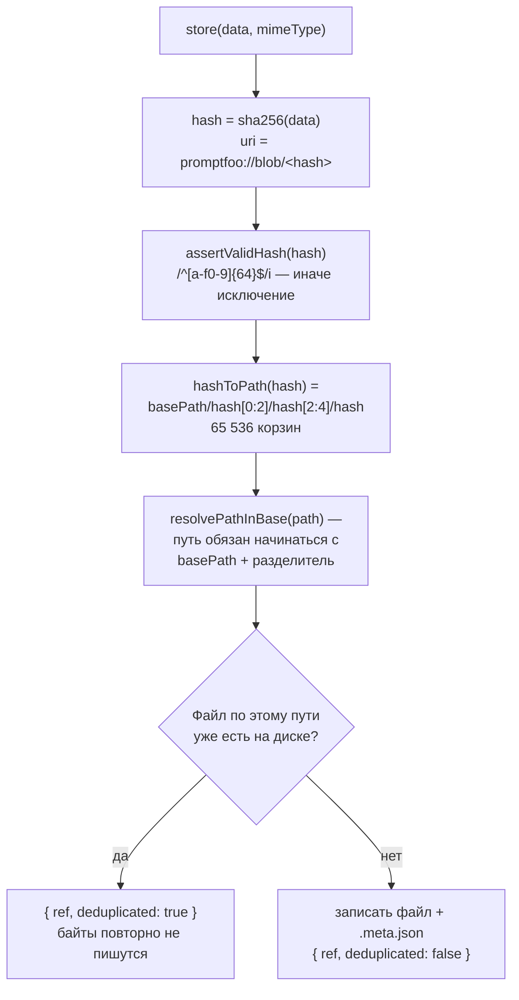
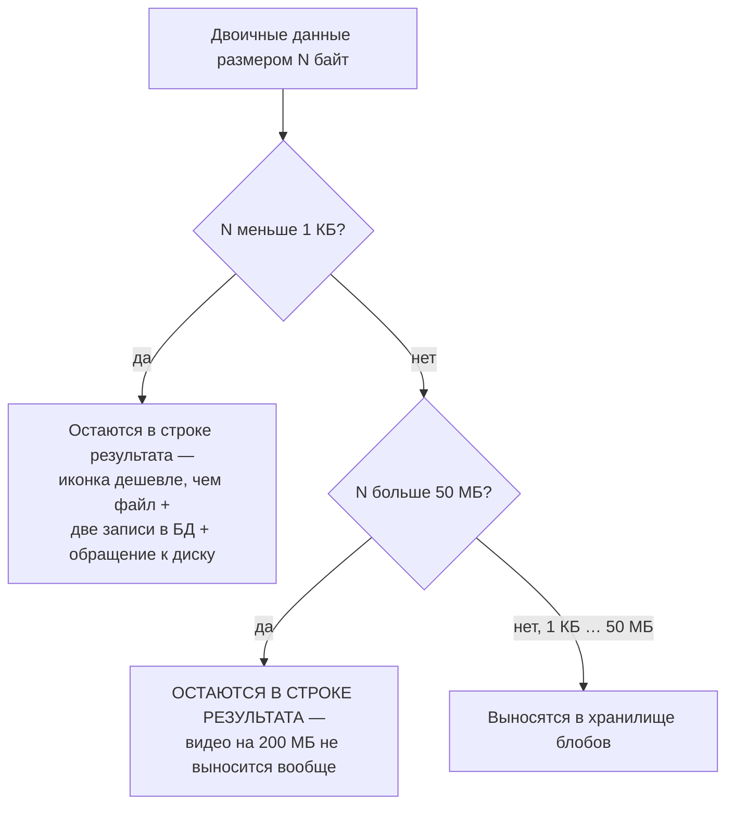
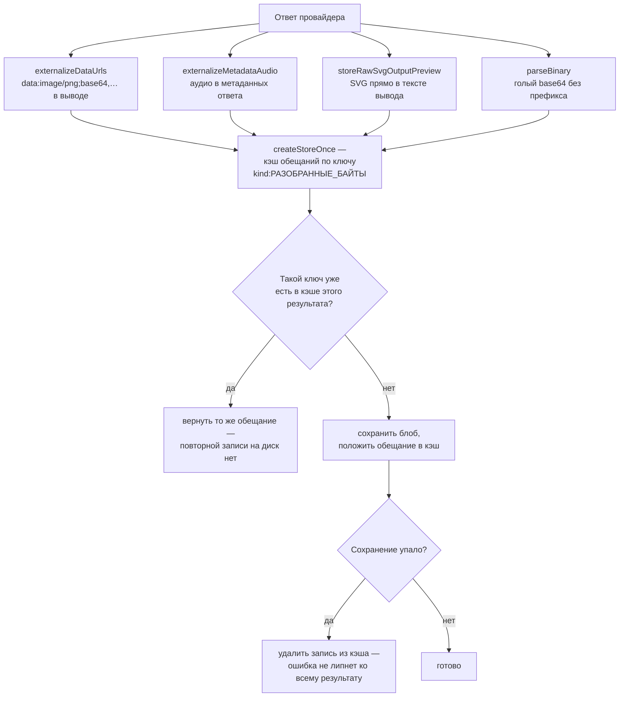
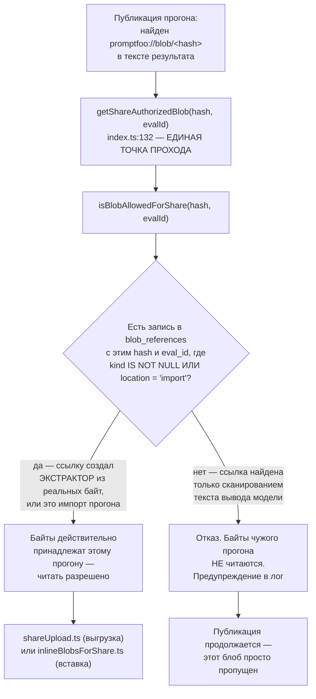

# Бинарные вложения — `src/blobs`

> Разбор через призму **Domain-Driven Design**. Диаграммы — ANSI-псевдографика.
> Дополняет [ARCHITECTURE.md](./ARCHITECTURE.md), [EVALUATOR.md](./EVALUATOR.md),
> [CODESCAN.md](./CODESCAN.md), [TRACING.md](./TRACING.md), [MODELS.md](./MODELS.md),
> [COMMANDS.md](./COMMANDS.md), [TYPES.md](./TYPES.md), [UTIL.md](./UTIL.md),
> [SCHEDULER.md](./SCHEDULER.md), [PROMPTS.md](./PROMPTS.md),
> [MATCHERS.md](./MATCHERS.md), [ASSERTIONS.md](./ASSERTIONS.md),
> [PROVIDERS.md](./PROVIDERS.md), [REDTEAM.md](./REDTEAM.md),
> [SERVER.md](./SERVER.md), [APP.md](./APP.md).

---

## 0. Паспорт подсистемы

```
╔══════════════════════════════════════════════════════════════════════════════╗
║  BLOBS — контентно-адресуемое хранилище для мультимодальных данных           ║
╠══════════════════════════════════════════════════════════════════════════════╣
║  Слой в layers.json     legacy-runtime (ярус 2)                              ║
║  Объём                  8 файлов · 1 380 строк                               ║
║  Контракт               contracts/blobs.ts · 11 строк · ЯРУС 0               ║
╠══════════════════════════════════════════════════════════════════════════════╣
║  extractor.ts             623   извлечение и вынос двоичных данных           ║
║  index.ts                 220   публичное API + авторизация на выдачу        ║
║  filesystemProvider.ts    214   локальное хранилище с шардированием          ║
║  shareUpload.ts           100   выгрузка при публикации                      ║
║  remoteUpload.ts           99   ·  blobRefs.ts 88                            ║
║  types.ts                  32   ·  constants.ts 4                            ║
╠══════════════════════════════════════════════════════════════════════════════╣
║  СМЕЖНОЕ                                                                     ║
║  storage/                 565   ВТОРОЕ хранилище — медиатека                 ║
║  util/inlineBlobsForShare 149   вставка блобов в публикуемый артефакт        ║
║  Таблицы                    2   blob_assets · blob_references                ║
╠══════════════════════════════════════════════════════════════════════════════╣
║  Порог выноса          1 КБ  ·  Потолок  50 МБ                               ║
║  Схема URI             promptfoo://blob/<64 hex>                             ║
║  Тесты                  7 файлов · 2 006 строк  (в 1,5 раза больше кода)     ║
╚══════════════════════════════════════════════════════════════════════════════╝
```

**Формулировка предметной области в одном предложении.** Blobs решает задачу,
которая появляется, как только модели начинают отвечать не текстом:
**изображение на два мегабайта не должно лежать в строке таблицы результатов**,
но должно оставаться доступным для просмотра, оценки и публикации.

**Откуда берётся задача.** Мультимодальные стратегии редтима (`image`, `audio`,
`video`, см. [REDTEAM.md §6](./REDTEAM.md)) порождают мегабайты полезной
нагрузки, а провайдеры возвращают изображения и аудио в виде base64 внутри
`ProviderResponse` ([PROVIDERS.md §4](./PROVIDERS.md)). Без выноса каждая
выборка строки результата тащила бы за собой двоичные данные.

---

## 1. Единый язык подсистемы

| Термин | Носитель в коде | Смысл |
|---|---|---|
| **BlobRef** | `contracts/blobs.ts` | Портируемая ссылка: `uri` · `hash` · `mimeType` · `sizeBytes` · `provider`. |
| **BLOB_SCHEME** | `constants.ts` | `promptfoo://blob/` — префикс URI. |
| **hash** | `filesystemProvider.ts:24` | SHA-256 содержимого. Идентичность блоба. |
| **BlobStorageProvider** | `types.ts` | Порт хранилища: `store` · `getByHash` · `exists` · `deleteByHash` · `getUrl`. |
| **externalize** | `extractor.ts:37` | Вынести данные из строки результата в хранилище. |
| **blob_assets** | таблица | Сам блоб: хэш, размер, тип, провайдер. |
| **blob_references** | таблица | Кто на него ссылается: прогон, координаты, место, вид. |
| **kind** | `blob_references.kind` | `audio` · `image` · `video`. **Признак доверенного происхождения.** |
| **location** | `blob_references.location` | Где в результате найден: `response.audio.data`, `import`, `share`. |
| **getShareAuthorizedBlob** | `index.ts:132` | Единственная точка чтения байт при публикации. |
| **MediaStorage** | `storage/` | Второе, параллельное хранилище. См. §7. |

---

## 2. Место подсистемы в архитектуре

```
   Контракт живёт на ярусе 0 — в contracts, где разрешён только zod:

     export interface BlobRef {
       uri: string;  hash: string;  mimeType: string;
       sizeBytes: number;  provider: string;
     }

   Комментарий: «Портируемый формат ссылки на блоб, используемый ПОПЕРЁК
   границ API и интерфейса.»

   ┌──────────────────────────────────────────────────────────────────────┐
   │  ПОЧЕМУ ССЫЛКА В ЛИСТОВОМ СЛОЕ, А РЕАЛИЗАЦИЯ — НЕТ                   │
   │                                                                      │
   │  BlobRef должен быть понятен браузеру, серверу и ядру одновременно:  │
   │  интерфейс показывает картинку по ссылке, сервер отдаёт байты        │
   │  по хэшу, эвалюатор кладёт ссылку в результат.                       │
   │                                                                      │
   │  Одиннадцать строк без единой зависимости — и все три стороны        │
   │  говорят об одном и том же объекте. Реализация же требует            │
   │  файловой системы и базы, поэтому остаётся ярусом выше.              │
   │                                                                      │
   │  Это ровно тот приём, к которому идёт переезд типов                  │
   │  (TYPES.md §3): определение вниз, реализация наверх.                 │
   └──────────────────────────────────────────────────────────────────────┘

   ПОТРЕБИТЕЛИ

     evaluator.ts            вынос данных из ответа провайдера
     models/evalResult       ссылка вместо байт в строке результата
     server/routes/blobs.ts  три эндпойнта выдачи
     app (белый список)      просмотр в медиатеке
     share.ts                публикация с выгрузкой или вставкой
     util/inlineBlobsForShare  вставка обратно в артефакт
```

---

## 3. Контентная адресация и хранение

```
 ┌─────────────────────────────────────────────────────────────────────────────┐
 │  FilesystemBlobStorageProvider — 214 строк                                  │
 ├─────────────────────────────────────────────────────────────────────────────┤
 │                                                                             │
 │   hash = sha256(data).hex                    идентичность = содержимое      │
 │   uri  = `promptfoo://blob/${hash}`                                         │
 │                                                                             │
 │   ШАРДИРОВАНИЕ ПО ДВУМ УРОВНЯМ                                              │
 │     hashToPath(hash) = basePath/<hash[0:2]>/<hash[2:4]>/<hash>              │
 │                                                                             │
 │     Один каталог на 256 подкаталогов, каждый ещё на 256 — то есть           │
 │     65 536 корзин. Файловые системы плохо работают с каталогами             │
 │     на десятки тысяч записей, а прогон мультимодального редтима             │
 │     легко даёт тысячи блобов.                                               │
 │                                                                             │
 │   МЕТАДАННЫЕ РЯДОМ С ФАЙЛОМ                                                 │
 │     <файл>.meta.json  →  mimeType · sizeBytes · createdAt · provider · key  │
 │                                                                             │
 │   ДЕДУПЛИКАЦИЯ ПО СУЩЕСТВОВАНИЮ ФАЙЛА                                       │
 │     store(data, mimeType):                                                  │
 │       hash = sha256(data)                                                   │
 │       если файл уже есть  →  { ref, deduplicated: true }                    │
 │       иначе               →  записать + метаданные, deduplicated: false     │
 │                                                                             │
 │     Одинаковое изображение в ста результатах хранится один раз.             │
 │     Флаг deduplicated возвращается наверх — вызывающий знает, что           │
 │     байты уже были.                                                         │
 ├─────────────────────────────────────────────────────────────────────────────┤
 │  ДВЕ ЗАЩИТЫ ПУТИ, ПРИМЕНЯЕМЫЕ ВМЕСТЕ                                        │
 │                                                                             │
 │   1  assertValidHash(hash)                                                  │
 │        /^[a-f0-9]{64}$/i — иначе исключение                                 │
 │        Хэш физически не может содержать '..' или '/'                        │
 │                                                                             │
 │   2  resolvePathInBase(unsafePath)                                          │
 │        const safeBase = path.resolve(this.basePath) + path.sep;             │
 │        if (!targetPath.startsWith(safeBase))                                │
 │          throw new Error('[BlobFS] Path traversal attempt detected');       │
 │                                                                             │
 │        Добавление path.sep закрывает ловушку /foo/bar vs /foo/barista       │
 │                                                                             │
 │   ┌───────────────────────────────────────────────────────────────────┐     │
 │   │  Валидация хэша уже делает обход невозможным — вторая проверка    │     │
 │   │  избыточна по логике, но правильна по построению: она защищает    │     │
 │   │  на случай, если появится путь, не проходящий через hashToPath.   │     │
 │   │                                                                    │    │
 │   │  Это пятая независимая работа с безопасностью путей в репозитории  │    │
 │   │  после util/isPathWithinDir, commands/mcp/lib/security,           │     │
 │   │  codeScan/mcp/filesystem и media-маршрута сервера (UTIL.md §4,    │     │
 │   │  COMMANDS.md §6.2, CODESCAN.md §3, SERVER.md §8). Здесь, как      │     │
 │   │  и в MCP, символьные ссылки не разрешаются.                       │     │
 │   └───────────────────────────────────────────────────────────────────┘     │
 └─────────────────────────────────────────────────────────────────────────────┘
```

Путь одного сохранения как Mermaid-диаграмма:



**Своими словами.** Представь архив, где документы подшивают не по
названию, а по отпечатку пальца их содержимого. Прежде чем вообще
искать полку, архивариус дважды проверяет саму заявку. Сперва — похож
ли предъявленный «отпечаток» на настоящий: ровно 64 шестнадцатеричных
символа, никаких точек и слэшей физически быть не может
(`assertValidHash`) — подделать заявку так, чтобы она указывала
куда-то за пределы архива, уже нельзя. Дальше архив не хранит всё
в одной комнате, а раскладывает по системе из двух уровней ящиков,
которые выбираются строго по первым четырём символам отпечатка —
65 536 маленьких ящиков вместо одной комнаты, доверху забитой
бумагами (комната с десятками тысяч дел работает плохо, а именно
столько блобов легко даёт один прогон мультимодального редтима).
И даже после этого архивариус на всякий случай ещё раз щупает: путь
до нужного ящика точно физически находится внутри здания архива,
а не выскочил через боковую дверь наружу — избыточная проверка при
уже надёжном отпечатке, но дешёвая страховка на случай, если однажды
появится заявка, обошедшая первую проверку. И только теперь —
главный вопрос: документ с ТАКИМ ЖЕ отпечатком уже лежит на полке?
Если да, архивариус не подшивает копию, а просто выдаёт адрес уже
лежащего дела и помечает «это уже было». Если нет — подшивает
документ и кладёт рядом карточку с датой, размером и типом.

---

## 4. Порог выноса: что становится блобом

```
   shouldExternalize(buffer, minSizeBytes = BLOB_MIN_SIZE)
     return size >= minSizeBytes && size <= BLOB_MAX_SIZE

     BLOB_MIN_SIZE   1 024 байта     (1 КБ)
     BLOB_MAX_SIZE  52 428 800 байт  (50 МБ)

 ┌─────────────────────────────────────────────────────────────────────────────┐
 │  ДВУСТОРОННИЙ ПОРОГ, А НЕ НИЖНЯЯ ГРАНИЦА                                    │
 │                                                                             │
 │    меньше 1 КБ    остаётся в строке результата                              │
 │                   ↑ крошечная иконка дешевле в строке, чем файл             │
 │                     плюс запись в двух таблицах плюс обращение к диску      │
 │                                                                             │
 │    1 КБ … 50 МБ   выносится в хранилище                                     │
 │                                                                             │
 │    больше 50 МБ   ОСТАЁТСЯ В СТРОКЕ                                         │
 │                   ↑ и это неочевидное решение: видео на 200 МБ              │
 │                     не выносится, а сохраняется как есть                    │
 │                                                                             │
 │    Верхний предел выглядит как защита от исчерпания диска, но               │
 │    эффект обратный: данные всё равно сохраняются, просто в базе,            │
 │    а не в файле. Логичнее было бы отбрасывать с предупреждением             │
 │    или выносить без верхней границы.                                        │
 └─────────────────────────────────────────────────────────────────────────────┘
```

Тот же порог как Mermaid-диаграмма:



**Своими словами.** Представь гардероб на входе в театр с двумя
правилами сразу. Первое правило понятное: шарф и перчатки в гардероб
не сдают — дешевле пронести их с собой, чем оформлять номерок ради
такой мелочи. Второе правило звучит как забота о гардеробе: огромный
чемодан тоже не принимаем, чтобы не забить вешалки. Но результат
второго правила — ровно противоположный тому, что было нужно. Чемодан
никуда не девается: его владелец просто носит его с собой весь вечер,
натыкаясь им на соседей в проходе между рядами — то есть застревает
именно там, откуда гардероб и должен был его убрать. Всё, что между
шарфом и чемоданом — нормальное пальто — вешается в гардероб как
положено, налегке идёшь в зал. Получается, что правило, придуманное
как защита гардероба от перегрузки, для самого тяжёлого случая
работает хуже всего: чем крупнее вещь, тем вероятнее, что она
останется валяться там же, откуда её и хотели убрать.

---

## 5. Извлечение: `extractor.ts`

Самый большой файл подсистемы — 623 строки, потому что двоичные данные
приходят в ответе провайдера в полудюжине разных мест и форм.

```
 ┌─────────────────────────────────────────────────────────────────────────────┐
 │  ЧТО ИЩЕТ ЭКСТРАКТОР                                                        │
 ├─────────────────────────────────────────────────────────────────────────────┤
 │   externalizeDataUrls          data:image/png;base64,… в выводе             │
 │   externalizeMetadataAudio     аудио в метаданных ответа                    │
 │   storeRawSvgOutputPreview     SVG прямо в тексте вывода                    │
 │   parseBinary                  голый base64 без префикса data:              │
 │                                                                             │
 │   normalizeAudioMimeType(format)                                            │
 │     Комментарий: «Некоторые провайдеры возвращают просто 'wav'              │
 │     вместо 'audio/wav'.» — приведение к корректному типу.                   │
 ├─────────────────────────────────────────────────────────────────────────────┤
 │  createStoreOnce — дедупликация ВНУТРИ ОДНОГО РЕЗУЛЬТАТА                    │
 │                                                                             │
 │    Кэш обещаний по ключу `${kind}:${base64 разобранных байт}`               │
 │                                                                             │
 │    Комментарий объясняет выбор ключа:                                       │
 │      «Канонизируем ключ кэша по РАЗОБРАННЫМ БАЙТАМ (а не по сырой           │
 │       входной строке), чтобы URL data:image/png;base64,XYZ и голая          │
 │       base64-строка XYZ попадали в ОДНУ ячейку кэша, когда                  │
 │       декодируются в один и тот же буфер.»                                  │
 │                                                                             │
 │    То есть одно изображение, встреченное дважды в разной записи,            │
 │    сохраняется один раз. Кэш хранит ОБЕЩАНИЕ, а не результат —              │
 │    параллельные обращения к тому же блобу ждут одну операцию записи.        │
 │                                                                             │
 │    При сбое или отказе от сохранения запись из кэша удаляется —             │
 │    иначе неудача закрепилась бы на весь результат.                          │
 └─────────────────────────────────────────────────────────────────────────────┘
```

Тот же конвейер извлечения как Mermaid-диаграмма:



**Своими словами.** Представь почтовое отделение, куда посылки
приходят в четырёх совершенно разных обёртках: фотография, вклеенная
прямо в текст письма; аудиозапись, приложенная отдельной справкой;
рисунок, лежащий в письме вообще без обёртки; и посылка без опознавательных
знаков на обёртке вовсе. На входе стоят четыре разных приёмщика, каждый
натренирован узнавать свою обёртку, — но все четверо относят находку
ОДНОМУ И ТОМУ ЖЕ кладовщику, а не заводят четыре разных склада
(`createStoreOnce`). Кладовщик ведёт блокнот только на текущую партию
посылок, и записывает в него не то, как посылка была обёрнута, а то,
что внутри, — поэтому одна и та же фотография, пришедшая один раз
вклеенной в письмо, а второй раз голым свёртком, распознаётся как
ОДНА И ТА ЖЕ вещь и складируется один раз. Если вторая точно такая же
посылка прибывает, пока первая ещё несётся на склад, кладовщик не
запускает вторую ходку — выдаёт квитанцию на уже идущую. А если
ходка на склад срывается на середине пути, запись в блокноте сразу
вычёркивается — чтобы одна неудачная посылка не испортила блокнот
для всех остальных в этой же партии.

### 5.1. Сбор ссылок с тремя ограничителями

```
   collectBlobHashes(value, options, hashes, visited, depth)   blobRefs.ts

     BLOB_SCAN_MAX_DEPTH          8
     BLOB_SCAN_MAX_STRING_LENGTH  100 000
     visited = new WeakSet<object>()      защита от цикла

 ┌─────────────────────────────────────────────────────────────────────────────┐
 │  ТОНКОСТЬ В shouldScanString                                                │
 │                                                                             │
 │    if (!value.includes(BLOB_SCHEME)) return false;   ← быстрый отказ        │
 │    return maxStringLength === undefined                                     │
 │        || value.startsWith(BLOB_SCHEME)              ← ЧИСТЫЙ URI           │
 │        || value.length <= maxStringLength;                                  │
 │                                                                             │
 │    Три уровня решения:                                                      │
 │      • строка без схемы вообще не проверяется регуляркой                    │
 │      • строка, НАЧИНАЮЩАЯСЯ со схемы, — это сам URI, он короткий            │
 │        и сканируется независимо от лимита                                   │
 │      • строка со схемой ВНУТРИ — это текст ответа модели, и на неё          │
 │        действует ограничение длины                                          │
 │                                                                             │
 │    Ответ модели может быть сколь угодно длинным, и прогон по нему           │
 │    глобальной регуляркой на каждом поле результата стоил бы дорого.         │
 └─────────────────────────────────────────────────────────────────────────────┘
```

---

## 6. Авторизация по происхождению — ключевое решение подсистемы

Это самая содержательная часть модуля, и она существует ровно потому, что
продукт занимается редтимом.

```
 ┌─────────────────────────────────────────────────────────────────────────────┐
 │  isBlobAllowedForShare(hash, evalId)                       index.ts:109     │
 ├─────────────────────────────────────────────────────────────────────────────┤
 │                                                                             │
 │   Комментарий формулирует угрозу прямо:                                     │
 │                                                                             │
 │     «Текст результата МОЖЕТ СОДЕРЖАТЬ СКОПИРОВАННЫЕ URI БЛОБОВ,             │
 │      поэтому только независимо классифицированные или импортированные       │
 │      ссылки авторизуют чтение локальных байт во время публикации.»          │
 │                                                                             │
 │   SELECT id FROM blob_references                                            │
 │   WHERE blob_hash = ? AND eval_id = ?                                       │
 │     AND (kind IS NOT NULL OR location = 'import')                           │
 ├─────────────────────────────────────────────────────────────────────────────┤
 │  ЧТО ЭТО ЗАКРЫВАЕТ                                                          │
 │                                                                             │
 │    Публикация прогона обходит результаты и собирает встреченные             │
 │    URI блобов, чтобы выгрузить байты вместе с отчётом.                      │
 │                                                                             │
 │    Но текст результата — это ВЫВОД МОДЕЛИ, то есть данные,                  │
 │    которыми в редтимовском прогоне управляет атакующий. Достаточно          │
 │    заставить мишень вывести строку promptfoo://blob/<чужой хэш>,            │
 │    и наивная публикация выгрузила бы наружу байты из ДРУГОГО прогона —      │
 │    чужой скриншот, чужое аудио, чужой документ.                             │
 │                                                                             │
 │    Гейт различает два происхождения ссылки:                                 │
 │                                                                             │
 │      kind IS NOT NULL     ссылку создал ЭКСТРАКТОР, разобрав                │
 │                           реальные двоичные данные и определив вид          │
 │                           (audio / image / video) — то есть байты           │
 │                           действительно принадлежат этому прогону           │
 │                                                                             │
 │      location = 'import'  ссылка пришла при импорте прогона                 │
 │                                                                             │
 │    Ссылка, найденная СКАНИРОВАНИЕМ ТЕКСТА, ни того, ни другого              │
 │    не даёт — и байты по ней не читаются.                                    │
 ├─────────────────────────────────────────────────────────────────────────────┤
 │  ЕДИНАЯ ТОЧКА ПРОХОДА                                                       │
 │                                                                             │
 │    getShareAuthorizedBlob(hash, localEvalId)              index.ts:132      │
 │                                                                             │
 │    Комментарий: «Единственная узкая точка для КАЖДОГО пути публикации       │
 │    (удалённая выгрузка и вставка).»                                         │
 │                                                                             │
 │    Проверено: оба пути её используют —                                      │
 │      blobs/shareUpload.ts        выгрузка на удалённый сервер               │
 │      util/inlineBlobsForShare.ts вставка base64 в артефакт                  │
 │        ↑ с повторённым комментарием: «тот же гейт, что и путь выгрузки»     │
 │                                                                             │
 │    Отказ логируется предупреждением с хэшем и идентификатором прогона,      │
 │    а не молчаливым пропуском.                                               │
 └─────────────────────────────────────────────────────────────────────────────┘
```

Тот же гейт как Mermaid-диаграмма:



**Своими словами.** Представь музей, который одолжил журналу подлинник
картины для съёмки статьи. В книге отзывов посетитель мог написать что
угодно, вплоть до «посмотрите на картину №4471 у выхода» — но музей не
станет выдавать картину №4471 только потому, что кто-то упомянул её
номер в книге отзывов. А в мире редтима «кто-то, кто пишет в книгу
отзывов» — это буквально та модель, которую атакуют: атакующий может
заставить её вывести в ответе любую строку, включая номер чужой,
совершенно постороннёй картины, в надежде, что музей по ошибке отдаст
чужой экспонат под видом своего. Поэтому прежде чем выдать картину на
руки, музей смотрит не в книгу отзывов, а в собственный складской
журнал: значится ли картина №4471 в реестре именно ЭТОЙ выставки —
либо потому, что её лично распаковал и занёс в каталог куратор этой
выставки (`kind` — блоб реально извлёк экстрактор из настоящих
двоичных данных), либо потому, что она была официально ввезена с
документами как часть той же коллекции (`location = 'import'`)?
Только тогда картину выдают — причём через ОДНИ и те же ворота склада
для любого вида отгрузки, будь то передача в другой музей или вставка
копии в буклет. Если проверка не пройдена, музей не отменяет выставку
целиком — просто оставляет одну страницу каталога пустой и записывает
в журнал, какой именно экспонат отказался выдавать и почему.

### 6.1. Отказ в безопасную сторону без срыва публикации

```
   uploadAuthorizedBlob — обработка ошибки:

     «Отказываем в безопасную сторону, но СОХРАНЯЕМ ПУБЛИКАЦИЮ ЖИВОЙ:
      ошибка авторизации или выгрузки пропускает ЭТОТ блоб, а не
      прерывает (и откатывает) всю публикацию.»

   Пользователь получает отчёт с предупреждением о недоступном медиафайле
   вместо провалившейся публикации целиком.
```

### 6.2. Ключ кэша выгрузки: не по хэшу, а по координатам

```
   getUploadCacheKey(hash, context) = JSON.stringify({
     hash, remoteEvalId,
     promptIdx: context.promptIdx ?? null,
     testIdx:   context.testIdx   ?? null,
   })

   Комментарий разбирает решение по частям:

     «Ключуем выгрузки по КООРДИНАТАМ СТРОКИ РЕЗУЛЬТАТА, а не только
      по хэшу: удалённая сторона записывает (promptIdx, testIdx) каждой
      выгрузки, поэтому блоб, на который ссылаются несколько строк,
      должен выгрузиться один раз НА КАЖДУЮ СТРОКУ, чтобы сохранить
      происхождение каждой строки. Повторная выгрузка тех же байт
      для каждой строки НАМЕРЕННА — удалённая сторона дедуплицирует
      хранение по содержимому.»

     «Используйте ?? null (а НЕ ||), чтобы ложный индекс 0 (первая
      строка каждого прогона) оставался отличим от ссылки без координат.»

   ┌───────────────────────────────────────────────────────────────────────┐
   │  Второй абзац — классическая ошибка на `||`, поймана и объяснена.     │
   │  promptIdx === 0 ложен в JavaScript, и `context.promptIdx || null`    │
   │  превратил бы первую строку каждого прогона в «без координат»,        │
   │  склеив её с ссылками, у которых координат действительно нет.         │
   └───────────────────────────────────────────────────────────────────────┘
```

---

## 7. Два хранилища вместо одного

```
 ┌──────────────────────────────────────┐  ┌──────────────────────────────────────┐
 │  src/blobs/         1 380 строк      │  │  src/storage/         565 строк      │
 │  BlobStorageProvider                 │  │  MediaStorageProvider                │
 ├──────────────────────────────────────┤  ├──────────────────────────────────────┤
 │  Адресация    ПО СОДЕРЖИМОМУ         │  │  Адресация    ПО КЛЮЧУ               │
 │               sha256(data)           │  │               `${type}/${filename}`  │
 │                                      │  │                                      │
 │  URI          promptfoo://blob/<hash>│  │  путь         audio/abc123.mp3       │
 │                                      │  │                                      │
 │  Дедупликация ДА, автоматически      │  │  Дедупликация нет                    │
 │                                      │  │                                      │
 │  Учёт ссылок  blob_references        │  │  нет                                 │
 │               с координатами строк   │  │                                      │
 │                                      │  │                                      │
 │  Авторизация  по происхождению       │  │  по формату имени в схеме Zod        │
 │               при публикации         │  │  (SERVER.md §8)                      │
 │                                      │  │                                      │
 │  Эндпойнты    /api/blobs  (3)        │  │  /api/media  (3)                     │
 │                                      │  │                                      │
 │  Хранение     шардирование 2×2 hex   │  │  плоские каталоги по типу            │
 └──────────────────────────────────────┘  └──────────────────────────────────────┘

   ┌───────────────────────────────────────────────────────────────────────┐
   │  ДВА МОДУЛЯ РЕШАЮТ ОДНУ ЗАДАЧУ РАЗНЫМИ СПОСОБАМИ                      │
   │                                                                       │
   │  Оба хранят двоичные данные, оба имеют порт с провайдером, оба        │
   │  раздают файлы через свои эндпойнты. Комментарий в storage/types.ts   │
   │  объясняет его существование иначе — через развёртывание:             │
   │                                                                       │
   │    «OSS использует только локальную файловую систему для хранения     │
   │     медиа. Облачные развёртывания могут переопределить провайдера,    │
   │     но облачные типы (например S3) живут в облачном репозитории.»     │
   │                                                                       │
   │  Но ровно то же верно и для blobs — там тоже есть                     │
   │  setBlobStorageProvider для подмены. Разделение выглядит              │
   │  историческим: медиатека появилась раньше, контентная адресация       │
   │  добавилась позже под мультимодальный редтим.                         │
   └───────────────────────────────────────────────────────────────────────┘
```

---

## 8. Схема хранения

```
   blob_assets                          blob_references
   ┌───────────────────────┐            ┌────────────────────────────────┐
   │ hash        PRIMARY   │◄───────────┤ blob_hash   FK, ON DELETE CASCADE
   │ size_bytes            │            │ eval_id     FK, ON DELETE CASCADE
   │ mime_type             │            │ test_idx                       │
   │ provider              │            │ prompt_idx                     │
   │ created_at            │            │ location    response.audio.data│
   └───────────────────────┘            │ kind        audio|image|video  │
                                        │ created_at                     │
                                        └────────────────────────────────┘
     3 индекса                            3 индекса

   ┌───────────────────────────────────────────────────────────────────────┐
   │  ДВА КАСКАДА УДАЛЕНИЯ                                                 │
   │                                                                       │
   │    blob_hash → blob_assets.hash    ON DELETE CASCADE                  │
   │    eval_id   → evals.id            ON DELETE CASCADE                  │
   │                                                                       │
   │  Удаление прогона снимает его ссылки автоматически, в отличие от      │
   │  трасс, где каскада НЕТ и порядок удаления приходится соблюдать       │
   │  вручную (MODELS.md §8.3).                                            │
   │                                                                       │
   │  ⚠  Но сам блоб при этом НЕ УДАЛЯЕТСЯ: строка в blob_assets           │
   │     и файл на диске остаются, даже когда последняя ссылка ушла.       │
   │     Сборки мусора по осиротевшим блобам в модуле нет.                 │
   ├───────────────────────────────────────────────────────────────────────┤
   │  ИНДЕКСЫ ПОД КОНКРЕТНЫЕ ЗАПРОСЫ, с комментариями в схеме:             │
   │                                                                       │
   │    blob_assets_mime_type_idx                                          │
   │      «Индекс для фильтрации по типу в медиатеке                       │
   │       (WHERE mime_type LIKE 'image/%')»                               │
   │                                                                       │
   │    blob_references_blob_created_at_idx  (blob_hash, created_at)       │
   │      «Составной индекс для запроса медиатеки:                         │
   │       SELECT MAX(created_at) WHERE blob_hash = ?»                     │
   │                                                                       │
   │  То есть индексы заведены не «на всякий случай», а под названный      │
   │  запрос интерфейса.                                                   │
   └───────────────────────────────────────────────────────────────────────┘
```

---

## 9. Диагноз

```
╔═══════════════════════════════════════════════════════════════════════════╗
║  СИЛЬНЫЕ СТОРОНЫ                                                          ║
╠═══════════════════════════════════════════════════════════════════════════╣
║  ✔ Авторизация по происхождению закрывает реальную атаку: подделанный     ║
║    URI в выводе модели не даёт прочитать чужие байты при публикации.      ║
║                                                                           ║
║  ✔ Единая узкая точка прохода для обоих путей публикации, и оба           ║
║    её действительно используют.                                           ║
║                                                                           ║
║  ✔ Контракт ссылки вынесен в листовой слой contracts — одиннадцать        ║
║    строк, понятных браузеру, серверу и ядру одновременно.                 ║
║                                                                           ║
║  ✔ Контентная адресация даёт дедупликацию бесплатно, а флаг               ║
║    deduplicated возвращается вызывающему.                                 ║
║                                                                           ║
║  ✔ Шардирование по двум уровням hex — 65 536 корзин вместо одного         ║
║    каталога на тысячи файлов.                                             ║
║                                                                           ║
║  ✔ Ключ кэша извлечения канонизирован по разобранным байтам, поэтому      ║
║    data-URL и голая base64 попадают в одну ячейку.                        ║
║                                                                           ║
║  ✔ Ключ кэша выгрузки построен на `?? null`, а не на `||` — ловушка       ║
║    ложного индекса 0 поймана и объяснена в комментарии.                   ║
║                                                                           ║
║  ✔ Сбор ссылок ограничен тремя способами: глубина, длина строки           ║
║    и WeakSet против циклов.                                               ║
║                                                                           ║
║  ✔ Отказ в безопасную сторону не срывает публикацию целиком.              ║
║                                                                           ║
║  ✔ Две защиты пути применяются вместе, вторая избыточна по логике,        ║
║    но правильна по построению.                                            ║
║                                                                           ║
║  ✔ Индексы заведены под названные в комментариях запросы интерфейса.      ║
╠═══════════════════════════════════════════════════════════════════════════╣
║  СЛАБЫЕ МЕСТА                                                             ║
╠═══════════════════════════════════════════════════════════════════════════╣
║  ✘ НЕТ СБОРКИ МУСОРА. Удаление прогона каскадом снимает ссылки, но        ║
║    строка в blob_assets и файл на диске остаются навсегда. Хранилище      ║
║    растёт монотонно, и очистить его можно только вручную.                 ║
║                                                                           ║
║  ✘ Верхний порог 50 МБ не отбрасывает данные, а оставляет их              ║
║    В СТРОКЕ РЕЗУЛЬТАТА — то есть ровно там, откуда их и пытались          ║
║    вынести. Самый тяжёлый случай обрабатывается хуже среднего.            ║
║                                                                           ║
║  ✘ Два параллельных хранилища (blobs и storage) решают одну задачу        ║
║    разными способами, с двумя портами, двумя наборами эндпойнтов          ║
║    и двумя схемами именования.                                            ║
║                                                                           ║
║  ✘ У подсистемы нет AGENTS.md — единственная из разобранных, где          ║
║    правила работы нигде не записаны, при том что она несёт                ║
║    нетривиальный инвариант авторизации.                                   ║
║                                                                           ║
║  ✘ Символьные ссылки в проверке пути не разрешаются, в отличие            ║
║    от util/isPathWithinDir. Пятая независимая реализация                  ║
║    безопасности путей в репозитории.                                      ║
║                                                                           ║
║  ✘ extractor.ts на 623 строки совмещает разбор четырёх форм               ║
║    представления данных, нормализацию типов, дедупликацию                 ║
║    и запись ссылок.                                                       ║
║                                                                           ║
║  ✘ Метаданные дублируются: `.meta.json` рядом с файлом и строка           ║
║    в blob_assets. При расхождении источником истины считается файл        ║
║    (readMetadata с запасным вариантом), но правило нигде не объявлено.    ║
╚═══════════════════════════════════════════════════════════════════════════╝
```

### Оценка по осям

```
   Авторизация выдачи        ████████████████████░  9/10   по происхождению
   Контентная адресация      ████████████████████░  9/10
   Управление жизненным циклом ████░░░░░░░░░░░░░░░  2/10   нет сборки мусора
   Границы порога            ████████████░░░░░░░░░  6/10   верхний предел странный
   Связность подсистем       ██████████░░░░░░░░░░░  5/10   два хранилища
   Документированность       ████████████░░░░░░░░░  6/10   нет AGENTS.md
   Тестируемость             ██████████████████░░░  8/10
```

---

## 10. Рекомендации по эволюции

```
   1 · Ввести сборку мусора по осиротевшим блобам.
       Запрос простой: SELECT hash FROM blob_assets WHERE hash NOT IN
       (SELECT blob_hash FROM blob_references). Достаточно команды
       `promptfoo cache prune-blobs` или очистки по сроку рядом
       с TraceStore.deleteOldTraces (TRACING.md §9).

   2 · Пересмотреть верхний порог.
       Оставлять 200-мегабайтное видео в строке результата — худший
       из возможных исходов. Разумнее либо выносить без верхней
       границы, либо отбрасывать с явным предупреждением, либо
       выносить с пометкой «крупный объект».

   3 · Свести blobs и storage в одну подсистему.
       Медиатека может адресоваться по хэшу так же, как блобы; ключ
       `${type}/${filename}` тогда становится производным от хэша
       и типа. Это убирает второй порт, второй набор эндпойнтов
       и вторую схему именования.

   4 · Написать AGENTS.md.
       Инвариант авторизации по происхождению существует только
       в комментарии к одной функции. Правило «байты при публикации
       читаются исключительно через getShareAuthorizedBlob» должно быть
       записано так же явно, как правила в codeScan или prompts.

   5 · Переиспользовать util/isPathWithinDir.
       После объединения проверок пути (UTIL.md §10, COMMANDS.md §10,
       CODESCAN.md §10) здесь появится разрешение символьных ссылок
       бесплатно.

   6 · Разбить extractor.ts:
         binaryParsers    data-URL · голый base64 · SVG · метаданные аудио
         mimeNormalizer   приведение типов
         storeOnce        дедупликация в пределах результата
         referenceWriter  запись в blob_references
```

---

## 11. Карта директории

```
src/blobs/                     8 файлов · 1 380 строк
│
├── constants.ts                  4  BLOB_MIN_SIZE 1 КБ · BLOB_MAX_SIZE 50 МБ ·
│                                    BLOB_SCHEME · DEFAULT_FILESYSTEM_SUBDIR
├── types.ts                     32  BlobStorageProvider (порт из 5 методов) ·
│                                    BlobMetadata · StoredBlob · BlobStoreResult
├── blobRefs.ts                  88  BLOB_HASH_REGEX · BLOB_URI_REGEX ·
│                                    collectBlobHashes (глубина 8, длина 100 000,
│                                    WeakSet) · extractBlobHashesFrom*
├── extractor.ts                623  extractAndStoreBinaryData ·
│                                    externalizeDataUrls · externalizeMetadataAudio ·
│                                    storeRawSvgOutputPreview · createStoreOnce ·
│                                    normalizeAudioMimeType · shouldExternalize ·
│                                    isBlobStorageEnabled
├── filesystemProvider.ts       214  FilesystemBlobStorageProvider ·
│                                    шардирование <hash[0:2]>/<hash[2:4]>/<hash> ·
│                                    assertValidHash · resolvePathInBase ·
│                                    дедупликация по существованию файла
├── index.ts                    220  storeBlob · getBlobByHash · getBlobUrl ·
│                                    recordBlobReference ·
│                                    ⚠ isBlobAllowedForShare ·
│                                    ⚠ getShareAuthorizedBlob ← ЕДИНАЯ ТОЧКА
│                                    get/set/resetBlobStorageProvider
├── remoteUpload.ts              99  uploadBlobRemote
└── shareUpload.ts              100  uploadAuthorizedBlob · кэш по координатам

СМЕЖНОЕ
  contracts/blobs.ts             11  BlobRef — ЯРУС 0, только определение
  util/inlineBlobsForShare.ts   149  вставка base64 в артефакт публикации
  storage/                      565  ВТОРОЕ хранилище: медиатека по ключу
    index.ts 98 · localFileSystemProvider.ts 329 · types.ts 138
  database/tables.ts                 blob_assets · blob_references
                                     два каскада ON DELETE, 6 индексов
  server/routes/blobs.ts        500  три эндпойнта выдачи

test/blobs/               6 файлов · ~1 800 строк
    index · blobRefs · filesystemProvider · extractor ·
    remoteUpload · shareUpload
test/server/routes/blobs.test.ts
```

---

## 12. Команды

```bash
npx vitest run test/blobs
npx vitest run test/blobs/shareUpload.test.ts     # авторизация при публикации
npx vitest run test/server/routes/blobs.test.ts   # выдача через HTTP
```

Где лежат блобы:

```bash
ls ~/.promptfoo/blobs/                            # шардированные каталоги
```

Числа из этого документа воспроизводятся так:

```bash
cat src/blobs/*.ts | wc -l                                    # 1380
grep -c "blob" src/database/tables.ts                         # упоминания в схеме
find test -path '*blob*' -name '*.ts' | xargs cat | wc -l     # 2006
```

---

*Документ описывает `src/blobs` и смежное `src/storage` на коммите `2c140ef`,
promptfoo 0.122.0. Дата среза — 26 августа 2026.*
