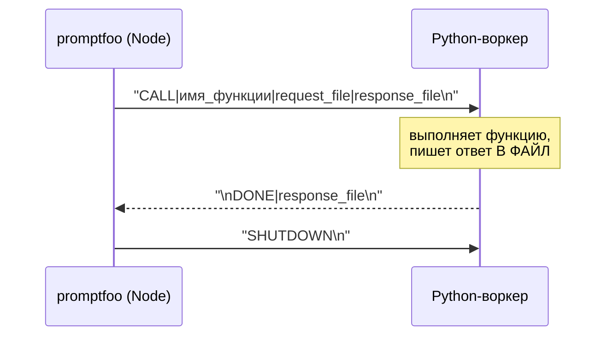
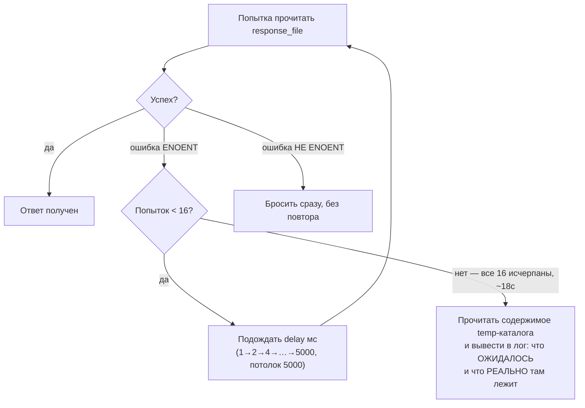
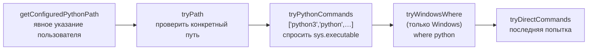

# Мосты в чужие языки — `src/python`, `src/ruby`, `src/golang`

> Разбор через призму **Domain-Driven Design**. Диаграммы — ANSI-псевдографика.
> Дополняет [SPINE.md](SPINE.md), [PROVIDERS.md](PROVIDERS.md),
> [SCHEDULER.md](SCHEDULER.md), [ASSERTIONS.md](ASSERTIONS.md),
> [ARCHITECTURE.md](ARCHITECTURE.md).
>
> Продолжение темы, начатой в [SPINE.md §7](SPINE.md), где `esm.ts` честно
> пометил vm как **не песочницу**. Здесь чужой код исполняется уже не в vm,
> а в отдельном процессе — и вопрос границы доверия ставится заново.

---

## 0. Паспорт: три моста разной зрелости

```
╔══════════════════════════════════════════════════════════════════════════════╗
║  ОДНА ЗАДАЧА, ТРИ РЕШЕНИЯ                                                    ║
╠══════════════════════════════════════════════════════════════════════════════╣
║              строк TS   строк на языке   тестов TS   модель исполнения       ║
║  ──────────────────────────────────────────────────────────────────────────  ║
║  PYTHON          1 004        525 + 853       4 968   разовый ИЛИ постоянный ║
║    pythonUtils.ts   395                               поиск интерпретатора   ║
║    worker.ts        310                               один процесс, протокол ║
║    workerPool.ts    144                               очередь и N процессов  ║
║    stderr.ts        115                               сборка traceback       ║
║    wrapper.ts        40                               разовый запуск         ║
║  ──────────────────────────────────────────────────────────────────────────  ║
║  RUBY              438         46             1 038   только разовый         ║
║    rubyUtils.ts     398                                                      ║
║    wrapper.ts        40                                                      ║
║  ──────────────────────────────────────────────────────────────────────────  ║
║  GOLANG              0         63 + 235         975   компиляция при вызове  ║
║    (нет ни одного .ts — логика целиком в providers/golangCompletion.ts)      ║
╠══════════════════════════════════════════════════════════════════════════════╣
║  Провайдеры: pythonCompletion 433 · rubyCompletion 351 · golangCompletion 193║
║  AGENTS.md .............. НЕТ ни у одного каталога                           ║
║  Общая инфраструктура ... src/util/secureTempFiles.ts · src/esm.ts           ║
╚══════════════════════════════════════════════════════════════════════════════╝
```

Асимметрия — главный факт этого разбора. У Python есть постоянный процесс,
пул воркеров, отдельная сборка traceback и собственные тесты на Python.
У Ruby — один способ запуска. У Go нет даже файла `.ts`: всё умещается
в провайдере, потому что Go надо **компилировать**, а не запускать.

---

## 1. Единый язык

| Термин | Носитель в коде | Смысл в предметной области |
| --- | --- | --- |
| **Wrapper** | `wrapper.py` · `wrapper.rb` · `wrapper.go` | Скрипт-посредник на целевом языке: принимает вызов, зовёт функцию пользователя |
| **Persistent wrapper** | `persistent_wrapper.py` | Тот же посредник, но живущий между вызовами |
| **Worker** | `PythonWorker` | Один запущенный процесс Python плюс протокол общения с ним |
| **Worker pool** | `PythonWorkerPool` | N воркеров и очередь запросов к ним |
| **Control message** | `READY`, `CALL\|…`, `DONE\|…`, `SHUTDOWN` | Управляющая строка в stdout/stdin |
| **Secure temp** | `createSecureTempDirectory` | Каталог `0o700` и файлы `0o600` с флагом `wx` |
| **Wrapper dir** | `getWrapperDir(type)` | Где лежат скрипты-посредники — в `src/` или в `dist/` |

---

## 2. Общая форма моста

```
╔══════════════════════════════════════════════════════════════════════════════╗
║  ЧТО ОДИНАКОВО ВО ВСЕХ ТРЁХ                                                  ║
╠══════════════════════════════════════════════════════════════════════════════╣
║                                                                              ║
║   promptfoo                                    ЧУЖОЙ ЯЗЫК                    ║
║   ┌────────────────────┐                       ┌──────────────────────┐      ║
║   │ providers/         │                       │  wrapper.{py,rb,go}  │      ║
║   │  XxxCompletion.ts  │──── запуск процесса ──▶│                      │     ║
║   │                    │                       │  импортирует скрипт  │      ║
║   │ secureTempFiles    │──── аргументы ───────▶│  пользователя,       │      ║
║   │  0o700 / 0o600     │                       │  зовёт его функцию   │      ║
║   │                    │◀─── результат ────────│                      │      ║
║   └────────────────────┘        (файл)         └──────────────────────┘      ║
║                                                                              ║
║   getWrapperDir(type) из esm.ts находит скрипт-посредник — в src/ при        ║
║   запуске из исходников, в dist/ после сборки (postbuild их копирует).       ║
╠══════════════════════════════════════════════════════════════════════════════╣
║   ГРАНИЦА ДОВЕРИЯ                                                            ║
║                                                                              ║
║   Отдельный процесс — это НЕ изоляция прав. У него те же пользователь,       ║
║   переменные окружения, доступ к ФС и сети, что у promptfoo. Ровно та же     ║
║   оговорка, что в SPINE.md §7 про vm, только здесь она не записана нигде.    ║
╚══════════════════════════════════════════════════════════════════════════════╝
```

Та же общая форма как Mermaid-диаграмма:


**Своими словами.** Это переводчик-курьер между двумя офисами, говорящими
на разных языках. Promptfoo не умеет напрямую разговаривать с чужим
языком, поэтому нанимает курьера-посредника (`wrapper`), который родом
из того же офиса, что и нужная функция. Курьер получает от promptfoo
запечатанный конверт с аргументами — через защищённые временные файлы,
которые может вскрыть только владелец (0o700 на каталог, 0o600 на файл),
заходит в чужой офис, находит нужного сотрудника (функцию пользователя),
передаёт ему задание и приносит ответ обратно тем же защищённым способом,
файлом, а не запиской на словах. Важная оговорка, которую стоит прочитать
до конца: курьер работает в том же здании, с тем же пропуском и теми же
ключами, что и весь остальной офис promptfoo — он не проходит через
отдельный контроль безопасности на входе в чужой офис. Это не
изолированная комната для гостя, а просто человек в форме курьера с
полным доступом ко всему, что доступно самому promptfoo: к файлам, к
сети, к переменным окружения.

### `secureTempFiles` — дисциплина, которой не хватило в другом месте

```
   const SECURE_FILE_OPTIONS = { encoding: 'utf8', flag: 'wx', mode: 0o600 };

   createSecureTempDirectory(prefix)
     if (!isSimpleLeafName(prefix)) throw                 ← нет '..' и путей
     fs.mkdtemp(path.join(os.tmpdir(), prefix))
     if (platform !== 'win32') fs.chmod(directory, 0o700)

   writeSecureTempFile(directory, filename, contents)
     if (!isSimpleLeafName(filename)) throw
     запись с флагом 'wx' — создать или упасть, без перезаписи

   ┌── Три меры в двадцати строках ───────────────────────────────────────┐
   │  0o700 / 0o600   чужой пользователь не прочитает аргументы вызова,   │
   │                  а в них бывают ключи и содержимое тестов            │
   │  'wx'            тот же приём, что в claimCacheKeyOnce (CACHE.md §6) │
   │  isSimpleLeafName  ни prefix, ни filename не могут увести из tmpdir  │
   └──────────────────────────────────────────────────────────────────────┘

   Сравните с GLOBALCONFIG.md: там ключ API пишется обычным writeFileSync
   без mode. Здесь временный файл защищён строже, чем постоянный секрет.
```

---

## 3. Python: два режима исполнения

```
╔══════════════════════════════════════════════════════════════════════════════╗
║  РАЗОВЫЙ (wrapper.py, 43 строки)                                             ║
╠══════════════════════════════════════════════════════════════════════════════╣
║   процесс на каждый вызов → импорт скрипта пользователя заново               ║
║   Скрипт с тяжёлыми зависимостями (torch, transformers) платит               ║
║   секундами импорта за КАЖДЫЙ тест.                                          ║
╠══════════════════════════════════════════════════════════════════════════════╣
║  ПОСТОЯННЫЙ (persistent_wrapper.py, 482 строки)                              ║
╠══════════════════════════════════════════════════════════════════════════════╣
║   процесс живёт, скрипт импортирован ОДИН раз, вызовы идут потоком           ║
║   482 строки против 43 — цена за то, чтобы держать состояние                 ║
╚══════════════════════════════════════════════════════════════════════════════╝
```

### Протокол, описанный в самом скрипте

```
   Из docstring persistent_wrapper.py:

   ┌──────────────────────────────────────────────────────────────────────┐
   │  Node  →  "CALL|<function_name>|<request_file>|<response_file>\n"    │
   │  Worker   выполняет функцию, пишет ответ В ФАЙЛ                      │
   │  Worker →  "\nDONE|<response_file>\n"                                │
   │  Node  →  "SHUTDOWN\n"                                               │
   └──────────────────────────────────────────────────────────────────────┘

   Три решения, каждое объяснено прямо там же:

   ┌── 1. Данные через файлы, управление через stdout ────────────────────┐
   │  «Data transfer uses files (proven UTF-8 handling),                  │
   │   control uses stdin/stdout.»                                        │
   │                                                                      │
   │  Полезная нагрузка может быть любой; смешивать её с управляющими     │
   │  строками в одном потоке — напрашиваться на разъезд кодировок.       │
   └──────────────────────────────────────────────────────────────────────┘

   ┌── 2. Ведущий перевод строки перед маркером ──────────────────────────┐
   │  «Control messages (READY, DONE|) are matched line-anchored by Node, │
   │   so they are emitted with a leading newline: user code may leave    │
   │   stdout mid-line (a write without a trailing newline), and          │
   │   a control marker glued onto that partial line would never match.»  │
   │                                                                      │
   │  print() пользователя без перевода строки — и DONE| прилипает        │
   │  к его тексту. Node ищет маркер с начала строки и не находит.        │
   │  Один \n впереди закрывает целый класс зависаний.                    │
   └──────────────────────────────────────────────────────────────────────┘

   ┌── 3. Разделитель — вертикальная черта ───────────────────────────────┐
   │  «Using pipe (|) delimiter to avoid conflicts with Windows           │
   │   drive letters (C:).»                                               │
   │                                                                      │
   │  Двоеточие сломалось бы на C:\Users\… в первом же пути.              │
   └──────────────────────────────────────────────────────────────────────┘
```

Тот же обмен сообщениями как Mermaid sequenceDiagram:



**Своими словами.** Это работа через окошко выдачи в столовой, где нельзя
говорить напрямую — только передавать записки. Node пишет записку с
точным заказом: какую функцию вызвать, откуда взять входные данные и
куда положить результат (`CALL|имя_функции|request_file|response_file`).
Повар (воркер) готовит блюдо, но само блюдо кладёт не в записку, а в
отдельный контейнер — данные идут через файлы, а не через записки, —
и в ответной записке пишет только «готово, ищи в контейнере номер
такой-то» (`DONE|response_file`). Записки обязательно начинаются с новой
строки: повар мог что-то вывести на кухонное табло без завершающего
переноса строки, и если бы ответная записка приклеилась прямо к этому
недописанному выводу, Node искал бы её с начала строки и никогда бы не
нашёл — один ведущий перенос строки закрывает целый класс таких
зависаний. И разделитель в записке — вертикальная черта, а не двоеточие,
потому что путь на Windows-компьютере сам может содержать двоеточие
(`C:\Users\…`), и записка перепуталась бы уже на первом пути. В конце
Node присылает записку «SHUTDOWN» — рабочий день окончен, повар может
идти домой.

### Гонка файловой системы и отступление

```
   worker.ts:160 — чтение файла ответа

   «Python verifies file readability before sending DONE,
    but OS-level delays may still occur.»

   for (let attempt = 0, delay = 1; attempt < 16; attempt++,
        delay = Math.min(delay * 2, 5000)) {
     try { responseData = await fs.readFile(responseFile, 'utf-8'); break; }
     catch (error) {
       if (error.code === 'ENOENT') { await sleep(delay); continue; }
       throw error;                    ← НЕ ENOENT — не повторять
     }
   }

   1 → 2 → 4 → 8 → 16 → 32 → 64 → 128 → 256 → 512 → 1024 → 2048
     → 4096 → 5000 → 5000 → 5000     ≈ 18 секунд суммарно

   ┌── Что делает диагностика, когда всё исчерпано ───────────────────────┐
   │  const files = await fs.readdir(tempDirectory);                      │
   │  logger.error(`Failed to read response file after 16 attempts        │
   │    (~18s). Expected: ${basename(responseFile)},                      │
   │    Found in temporary directory: ${files.join(', ')}`);              │
   │                                                                      │
   │  Показывает, ЧТО реально лежит в каталоге. Разница между             │
   │  «файла нет» и «файл называется иначе» видна сразу.                  │
   └──────────────────────────────────────────────────────────────────────┘
```

Тот же повтор как Mermaid-диаграмма:



**Своими словами.** Это ожидание письма в почтовом ящике, который иногда
наполняется с опозданием, хотя отправитель клянётся, что письмо уже
брошено. Node заглядывает в ящик; если письма нет (`ENOENT` — «файла
ещё нет»), это не обязательно катастрофа — файловая система могла просто
не успеть «дописать» файл со стороны Python, и стоит подождать и
заглянуть снова, с каждым разом чуть дольше — одну миллисекунду, затем
две, четыре и так далее, но не дольше пяти секунд за один раз, — и так
до шестнадцати попыток, суммарно около восемнадцати секунд. Если же
ящик сломан по совсем другой причине (не «письма нет», а, скажем, «нет
прав на чтение»), ждать бессмысленно, и об этом сообщается немедленно,
без единой попытки повторить. А если и через восемнадцать секунд письма
всё ещё нет, вместо простого «не найдено» в лог выводится полная опись
того, что реально лежит в почтовом ящике — чтобы сразу было видно,
письмо вообще не пришло или пришло, но под другим именем.

---

## 4. Пул воркеров: своя конкурентность рядом со `SCHEDULER.md`

```
╔══════════════════════════════════════════════════════════════════════════════╗
║  PythonWorkerPool — workerPool.ts:9                                          ║
╠══════════════════════════════════════════════════════════════════════════════╣
║                                                                              ║
║   execute(fn, args)                                                          ║
║        │                                                                     ║
║        ├─ getAvailableWorker()      isReady() && !isBusy()                   ║
║        │      │                                                              ║
║        │      ├─ есть → worker.call(...).finally(() => processQueue())       ║
║        │      └─ нет  → queue.push({fn, args, resolve, reject})              ║
║        │                                                                     ║
║   processQueue()  — вызывается при КАЖДОМ освобождении воркера               ║
║        while (queue.length > 0) {                                            ║
║          const worker = getAvailableWorker();                                ║
║          if (!worker) return;          ← вышли, ждём следующего сигнала      ║
║          const request = queue.shift();                                      ║
║          worker.call(...)              ← и снова .finally(processQueue)      ║
║        }                                                                     ║
║                                                                              ║
║   Плюс колбэк в конструкторе воркера: () => this.processQueue() —            ║
║   очередь трогается и когда воркер стал ГОТОВ, а не только освободился.      ║
╚══════════════════════════════════════════════════════════════════════════════╝
```

Это **вторая модель конкурентности в системе**, независимая от
[SCHEDULER.md](SCHEDULER.md). Планировщик управляет числом одновременных
обращений к провайдерам; пул — числом процессов Python внутри одного
провайдера. Они не знают друг о друге, и связывает их только один
источник числа:

```
   getWorkerCount() — providers/pythonCompletion.ts:268
   ┌──────────────────────────────────────────────────────────────────────┐
   │  1. config.workers                «user knows their script's         │
   │                                    requirements»                     │
   │  2. PROMPTFOO_PYTHON_WORKERS      явная настройка для Python         │
   │  3. cliState.maxConcurrency       флаг -j, «general concurrency      │
   │                                    hint, only when explicitly set»   │
   │  4. 1                             «memory-efficient,                 │
   │                                    backward compatible»              │
   │                                                                      │
   │  Все три верхних уровня проверяют < 1 и падают до 1 с warn.          │
   └──────────────────────────────────────────────────────────────────────┘

   Пункт 3 — тот самый cliState из SPINE.md §4, где значение читается
   через AsyncLocalStorage. Флаг -j влияет на два независимых механизма
   сразу, и это единственная нить между ними.

   Предупреждение при 8+ воркерах:
     «This may use significant memory if your script has heavy imports.»
   Каждый воркер — полноценный процесс Python со своей копией torch.
```

Умолчание в **один воркер** консервативно и объяснено: постоянный процесс
даёт выигрыш на импортах, а не на параллелизме, и включать параллелизм
без спроса значило бы умножить потребление памяти на ровном месте.

---

## 5. Поиск интерпретатора: четыре способа и одна гонка

```
   pythonUtils.ts — цепочка обнаружения

   getConfiguredPythonPath(configPath)  :48   явное указание
        ▼
   tryPath(path)                        :199  проверить конкретный путь
        ▼
   tryPythonCommands(['python3','python',…])  :109
        execFileAsync(cmd, ['-c', 'import sys; print(sys.executable)'])
        ▲ спрашивает у самого Python, где он лежит — надёжнее, чем which
        ▼
   tryWindowsWhere()                    :67   для Windows: where python
        ▼
   tryDirectCommands(...)               :144  последняя попытка

   ┌── Особый случай Windows ─────────────────────────────────────────────┐
   │  if (platform === 'win32' && !executablePath.endsWith('.exe')) {     │
   │    if (executablePath.includes('\\') || /^[A-Za-z]:/.test(...)) {    │
   │      return executablePath + '.exe';                                 │
   │    }                                                                 │
   │  }                                                                   │
   │  Суффикс дописывается ТОЛЬКО для путей в стиле Windows — чтобы       │
   │  не испортить путь из WSL или MSYS, где .exe не нужен.               │
   └──────────────────────────────────────────────────────────────────────┘

   ┌── Защита от параллельного поиска ────────────────────────────────────┐
   │  validatePythonPath :234                                             │
   │                                                                      │
   │  if (state.cachedPythonPath) return state.cachedPythonPath;          │
   │  if (!state.validationPromise) { state.validationPromise = (…)(); }  │
   │                                                                      │
   │  «Create validation promise atomically … This prevents race          │
   │   conditions where multiple calls create separate validations.»      │
   │                                                                      │
   │  Без этого десять параллельных тестов запустили бы десять            │
   │  процессов Python только чтобы спросить, где Python.                 │
   └──────────────────────────────────────────────────────────────────────┘
```

Та же цепочка обнаружения как Mermaid-диаграмма:



**Своими словами.** Это поиск нужного человека в незнакомом здании, когда
спрашиваешь у всё более случайных прохожих. Сначала проверяешь адрес,
который человек сам тебе назвал (явно указанный путь к Python) — если
он верный, поиск окончен сразу. Если нет, идёшь по короткому списку
самых вероятных табличек на дверях («python3», «python») и, постучавшись,
не веришь табличке на слово, а спрашиваешь у того, кто внутри: «а как
тебя на самом деле зовут?» — это надёжнее, чем полагаться на надпись
снаружи. На Windows есть ещё один справочник, которого больше нигде нет
(`where python`). И только если вообще ничего не сработало — самая
последняя, самая неразборчивая попытка. Отдельно: если два человека
одновременно начинают этот же обход в поисках интерпретатора (два
параллельных теста запускаются одновременно), только первый реально
идёт стучаться по дверям, а второй просто ждёт результата первого — они
не бегают по зданию вдвоём, дублируя одну и ту же работу.

Сообщение об отсутствии интерпретатора называет и переменную, и пример
пути под текущую платформу:

> Python 3 not found. Tried "…". Please ensure Python 3 is installed and set
> the `PROMPTFOO_PYTHON` environment variable to your Python 3 executable path
> (e.g., `C:\Python39\python.exe` / `/usr/bin/python3`).

---

## 6. `stderr.ts` — traceback как единое сообщение

Отдельный модуль на 115 строк ради одной задачи: не разорвать многострочную
трассировку Python на пятнадцать несвязанных строк лога.

```
╔══════════════════════════════════════════════════════════════════════════════╗
║  class PythonStderrLogger — stderr.ts:5                                      ║
╠══════════════════════════════════════════════════════════════════════════════╣
║                                                                              ║
║   StringDecoder('utf8')     ← многобайтовый символ может прийти              ║
║                               разорванным между двумя чанками                ║
║                                                                              ║
║   Нормализация переводов строк:                                              ║
║     const carry = buffer.endsWith('\r') ? '\r' : '';                         ║
║     normalized = (carry ? buffer.slice(0,-1) : buffer).replace(/\r\n?/g,'\n')║
║     ▲ одинокий \r в конце чанка удерживается: следующий чанк может           ║
║       начаться с \n, и вместе они — один перевод строки, а не два            ║
║                                                                              ║
║   Сборка трассировки:                                                        ║
║     /^Traceback \(most recent call last\):/i  → inTraceback = true           ║
║     while (inTraceback && /^\s/.test(line))   → продолжение той же ошибки    ║
║                                                                              ║
║   MAX_STDERR_BUFFER_LENGTH = 16 384                                          ║
║     ▲ строка без перевода длиннее 16 КБ выводится принудительно —            ║
║       иначе бесконечный вывод пользователя съел бы память                    ║
╚══════════════════════════════════════════════════════════════════════════════╝
```

Ruby и Go такого модуля не имеют. Их ошибки попадают в лог как есть.

---

## 7. Ruby и Go: два способа не делать лишнего

```
╔══════════════════════════════════════════════════════════════════════════════╗
║  RUBY — 438 строк TS, только разовый запуск                                  ║
╠══════════════════════════════════════════════════════════════════════════════╣
║   runRubyCode(code, method, args) — ruby/wrapper.ts, 40 строк целиком        ║
║                                                                              ║
║     createSecureTempDirectory('promptfoo-ruby-code-')                        ║
║     writeSecureTempFile(dir, 'script.rb', code)                              ║
║     await runRuby(tempFilePath, method, args)                                ║
║       ▲ комментарий: «Necessary to await so temp file doesn't get deleted»   ║
║     finally → removeSecureTempDirectory(dir)                                 ║
║                                                                              ║
║   Тридцать строк, из которых половина — обработка ошибок при уборке.         ║
║   Никакого постоянного процесса: у Ruby нет тяжёлых импортов масштаба        ║
║   torch, и выигрыш не окупил бы 482 строк протокола.                         ║
╠══════════════════════════════════════════════════════════════════════════════╣
║  GOLANG — ноль строк TS, потому что Go КОМПИЛИРУЕТСЯ                         ║
╠══════════════════════════════════════════════════════════════════════════════╣
║   providers/golangCompletion.ts:133                                          ║
║                                                                              ║
║     // Copy wrapper.go to the same directory as the script                   ║
║     fs.copyFile(path.join(getWrapperDir('golang'), 'wrapper.go'),            ║
║                 path.join(scriptDir, 'wrapper.go'));                         ║
║     execFile('go', ['build', '-o', executablePath,                           ║
║                     'wrapper.go', basename(relativeScriptPath)]);            ║
║                                                                              ║
║   Посредник не запускается — он КОМПИЛИРУЕТСЯ ВМЕСТЕ со скриптом             ║
║   пользователя в один исполняемый файл. Отсюда и `go.mod` на три строки      ║
║   рядом с wrapper.go: модулю нужно имя.                                      ║
║                                                                              ║
║   Отдельного слоя .ts не появилось, потому что абстрагировать нечего:        ║
║   шаг ровно один, и он специфичен для Go.                                    ║
╚══════════════════════════════════════════════════════════════════════════════╝
```

Асимметрия здесь — не запущенность, а соответствие задаче. Каждый мост
настолько сложен, насколько сложен его язык: Python нуждается в постоянном
процессе из-за импортов, Ruby обходится файлом, Go требует сборки.

---

## Диагноз

```
╔══════════════════════════════════════════════════════════════════════════════╗
║                              ДИАГНОЗ МОСТОВ                                  ║
╠══════════════════════════════════════════════════════════════════════════════╣
║  СИЛЬНЫЕ СТОРОНЫ                                                             ║
║                                                                              ║
║  ✔ secureTempFiles: каталог 0o700, файл 0o600, флаг 'wx', запрет путей       ║
║    в имени. Аргументы вызова недоступны другому пользователю системы.        ║
║                                                                              ║
║  ✔ Протокол постоянного воркера объяснён в самом скрипте, включая три        ║
║    неочевидных решения: файлы для данных, ведущий \n перед маркером,         ║
║    вертикальная черта вместо двоеточия из-за дисков Windows.                 ║
║                                                                              ║
║  ✔ Ведущий перевод строки закрывает целый класс зависаний, вызванных         ║
║    print() пользователя без завершающего \n.                                 ║
║                                                                              ║
║  ✔ Экспоненциальный повтор на ENOENT с потолком и точной диагностикой:       ║
║    при исчерпании показывается фактическое содержимое каталога.              ║
║                                                                              ║
║  ✔ Поиск интерпретатора спрашивает у самого Python его sys.executable,       ║
║    а не полагается на which; .exe дописывается только для путей Windows.     ║
║                                                                              ║
║  ✔ Атомарное создание промиса валидации не даёт десяти параллельным          ║
║    тестам запустить десять процессов ради одного вопроса.                    ║
║                                                                              ║
║  ✔ PythonStderrLogger удерживает одинокий \r между чанками и собирает        ║
║    traceback в одно сообщение; буфер ограничен 16 КБ.                        ║
║                                                                              ║
║  ✔ Умолчание в один воркер объяснено: постоянный процесс экономит            ║
║    импорты, а не даёт параллелизм, и память умножать без спроса нельзя.      ║
║                                                                              ║
║  ✔ Каждый мост ровно такой сложности, какой требует его язык.                ║
╠══════════════════════════════════════════════════════════════════════════════╣
║  СЛАБЫЕ МЕСТА                                                                ║
║                                                                              ║
║  ✘ НИГДЕ не сказано, что отдельный процесс — не граница прав. В esm.ts       ║
║    (SPINE.md §7) такая оговорка есть и написана явно; здесь чужой код        ║
║    исполняется с теми же правами, и об этом не предупреждает ничто.          ║
║                                                                              ║
║  ✘ Вторая модель конкурентности живёт независимо от SCHEDULER.md.            ║
║    Планировщик не знает про пул, пул не знает про планировщик; связывает     ║
║    их только флаг -j, и то как «hint».                                       ║
║                                                                              ║
║  ✘ Ни у одного из трёх каталогов нет AGENTS.md, при том что протокол         ║
║    воркера — самая хрупкая часть подсистемы.                                 ║
║                                                                              ║
║  ✘ Сборка traceback есть только у Python. Многострочные ошибки Ruby          ║
║    и Go разрываются построчно.                                               ║
║                                                                              ║
║  ✘ У Go компиляция происходит при вызове, и wrapper.go копируется            ║
║    В КАТАЛОГ СКРИПТА пользователя — побочный эффект в чужой директории.      ║
║                                                                              ║
║  ✘ Постоянный процесс Python держит состояние между тестами. Скрипт          ║
║    с глобальными переменными поведёт себя иначе, чем при разовом             ║
║    запуске, и об этом различии не предупреждает ни лог, ни документация.     ║
║                                                                              ║
║  ✘ Восемнадцать секунд ожидания файла ответа — это восемнадцать секунд       ║
║    на КАЖДЫЙ сбойный вызов, и потолок ничем не настраивается.                ║
╚══════════════════════════════════════════════════════════════════════════════╝
```

### Оценка по осям

```
  Права на временные файлы     █████████░   9/10   0o700/0o600, wx, leaf-имена
  Объяснённость протокола      █████████░   9/10   три решения в docstring
  Устойчивость к гонкам        ████████░░   8/10   ENOENT-повтор, атомарный промис
  Диагностика ошибок           ████████░░   8/10   листинг каталога, traceback
  Соответствие задаче          ████████░░   8/10   сложность по языку, не по шаблону
  Покрытие тестами             ████████░░   8/10   6981 строка на 1442 строки TS
  Граница доверия              ███░░░░░░░   3/10   не названа нигде
  Согласованность моделей      ███░░░░░░░   3/10   пул и планировщик не знают друг друга
  Документированность          ██░░░░░░░░   2/10   нет AGENTS.md ни у одного
  ─────────────────────────────────────────────────────────────────────────────
  ИНТЕГРАЛЬНО                  ███████░░░   6.4/10
```

Инженерно мосты сделаны внимательно — видно, что каждый повтор и каждый
`\n` появились после конкретного сбоя. Провал в другом: **о том, что здесь
исполняется чужой код с полными правами, не сказано ни слова**, хотя
в соседнем `esm.ts` такое предупреждение написано прямым текстом.

---

## Рекомендации по эволюции

1. **Записать границу доверия.** Один абзац в `AGENTS.md` мостов и ссылка
   на него в документации провайдеров: скрипт пользователя выполняется
   с правами процесса promptfoo, имеет доступ к ФС, сети и переменным
   окружения, включая ключи API. Это уже так; не хватает только слов.

2. **Связать пул с планировщиком.** `SCHEDULER.md` управляет числом
   одновременных обращений; пул — числом процессов. Сейчас при `-j 16`
   и 16 воркерах можно получить 16 процессов Python на одного провайдера.
   Минимум — предупреждение, лучше — общий бюджет.

3. **Сделать 18-секундный потолок настраиваемым.** `PROMPTFOO_PYTHON_RESPONSE_TIMEOUT`
   с текущим значением по умолчанию. На быстрой машине это ожидание никогда
   не нужно, на сетевой ФС может не хватить.

4. **Предупреждать о разделяемом состоянии.** Когда включён постоянный
   процесс, писать в debug: скрипт импортируется один раз, глобальные
   переменные переживают тесты. Это меняет поведение и должно быть видно.

5. **Вынести сборку traceback в общий модуль.** `PythonStderrLogger`
   почти целиком не специфичен для Python: удержание `\r`, буфер, склейка
   отступов. Ruby получил бы то же поведение почти бесплатно.

6. **Не копировать `wrapper.go` в каталог пользователя.** Собирать во
   временном каталоге, куда скопированы оба файла. Сейчас `go build`
   оставляет след в чужой директории и может конфликтовать с файлом
   того же имени.

7. **Завести один `AGENTS.md` на три моста** — по образцу того, что
   предлагалось для хребта в [SPINE.md](SPINE.md). Общего у них достаточно:
   `getWrapperDir`, `secureTempFiles`, форма протокола, граница доверия.

---

## Карта

```
src/python/ ..................................... 1004 строки TS + 525 Python
├── pythonUtils.ts ............................... 395   вход 12
│     getEnvInt :27 · getConfiguredPythonPath :48 · state :56
│     tryWindowsWhere :67 · tryPythonCommands :109 · tryDirectCommands :144
│     getSysExecutable :172 · tryPath :199
│     validatePythonPath :234   ◄── атомарный промис против гонки
│     runPython :302
├── worker.ts .................................... 310   вход 1
│     class PythonWorker :19
│     initialize :42 · call :116 · isReady :266 · isBusy :270 · shutdown :274
│     ◄── повтор ENOENT: 16 попыток, 1→5000 мс, ~18 с
├── workerPool.ts ................................ 144   вход 1
│     class PythonWorkerPool :9
│     initialize · execute · getAvailableWorker · processQueue · shutdown
│     ◄── предупреждение при workerCount > 8
├── stderr.ts .................................... 115   вход 2
│     class PythonStderrLogger :5 · MAX_STDERR_BUFFER_LENGTH 16 384
│     handleData · flush · logLine   ◄── сборка traceback, удержание \r
├── wrapper.ts .................................... 40   вход 1
├── wrapper.py .................................... 43         разовый
├── persistent_wrapper.py ........................ 482         постоянный
├── persistent_wrapper_test.py ................... 743         тесты на Python
└── wrapper_test.py .............................. 110

src/ruby/ ......................................... 438 строк TS + 46 Ruby
├── rubyUtils.ts .................................. 398   вход 2
├── wrapper.ts .................................... 40    вход 1
└── wrapper.rb ................................... 46

src/golang/ ....................................... 0 строк TS + 298 Go
├── wrapper.go ................................... 63    компилируется со скриптом
├── wrapper_test.go ............................. 235
└── go.mod ........................................ 3

Провайдеры и общая инфраструктура:
    providers/pythonCompletion.ts ................ 433   getWorkerCount :268
    providers/rubyCompletion.ts .................. 351
    providers/golangCompletion.ts ................ 193   go build :145
    util/secureTempFiles.ts ......................       0o700 / 0o600 / 'wx'
    esm.ts:59 getWrapperDir ......................       src/ или dist/
    scripts/postbuild.ts .........................       копирует обёртки в dist

Тесты:
    python  4968 строк TS + 853 строки Python
    ruby    1038 строк
    golang   975 строк
```

---

## Команды

```bash
# Состав трёх мостов
for d in python ruby golang; do echo "--- $d"; wc -l src/$d/*; done

# ГЛАВНОЕ: протокол постоянного воркера, объяснённый в самом скрипте
sed -n '1,25p' src/python/persistent_wrapper.py

# Права на временные файлы
grep -n -A 6 'SECURE_FILE_OPTIONS' src/util/secureTempFiles.ts
grep -n 'chmod\|isSimpleLeafName' src/util/secureTempFiles.ts

# Повтор на гонке файловой системы
grep -n -B 4 -A 20 'Exponential backoff' src/python/worker.ts

# Откуда берётся число воркеров
grep -n -A 45 'private getWorkerCount' src/providers/pythonCompletion.ts

# Поиск интерпретатора спрашивает у самого Python
grep -n 'import sys; print(sys.executable)' src/python/pythonUtils.ts

# Защита от параллельного поиска
grep -n -B 3 -A 8 'validationPromise' src/python/pythonUtils.ts | head -20

# Сборка traceback
grep -n 'Traceback\|inTraceback\|MAX_STDERR_BUFFER_LENGTH' src/python/stderr.ts

# Go компилируется вместе со скриптом пользователя
grep -n -B 3 -A 10 "getWrapperDir('golang')" src/providers/golangCompletion.ts

# Тесты
npx vitest run test/python test/ruby test/golang
python3 -m pytest src/python/persistent_wrapper_test.py src/python/wrapper_test.py
```

> **Осторожно:** скрипты на Python, Ruby и Go выполняются в отдельном
> процессе, но **с теми же правами**, что и promptfoo: доступ к файловой
> системе, сети и переменным окружения, включая ключи API. Отдельный
> процесс не является песочницей — так же, как `vm` в [SPINE.md §7](SPINE.md).

---

*Документ описывает `src/python`, `src/ruby` и `src/golang` на коммите `2c140ef`,
promptfoo 0.122.0. Дата среза — 27 августа 2026.*
