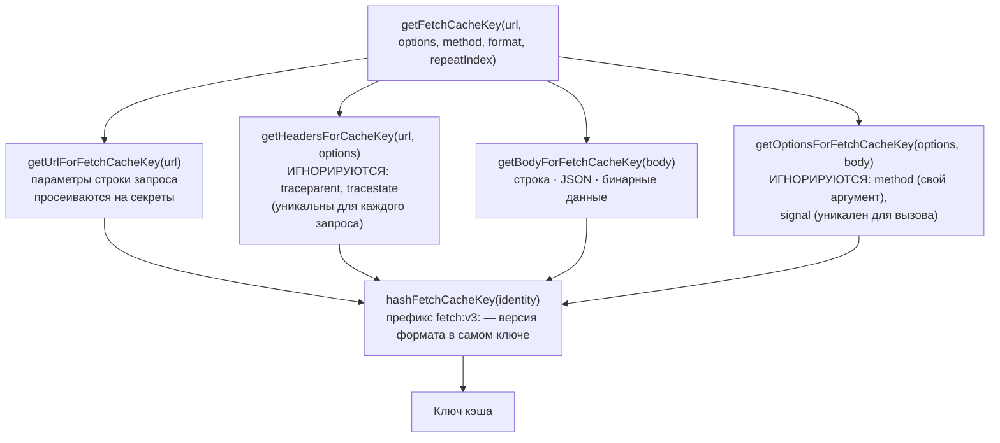
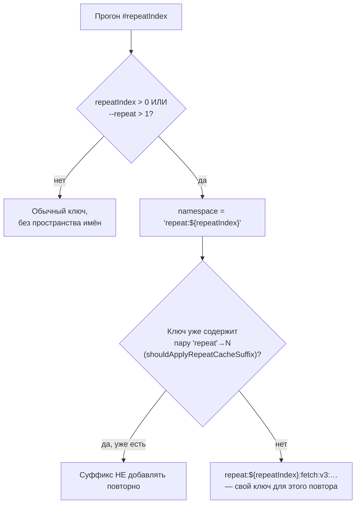
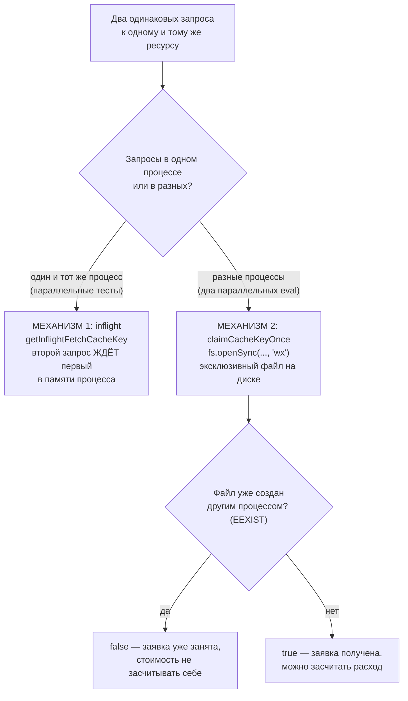
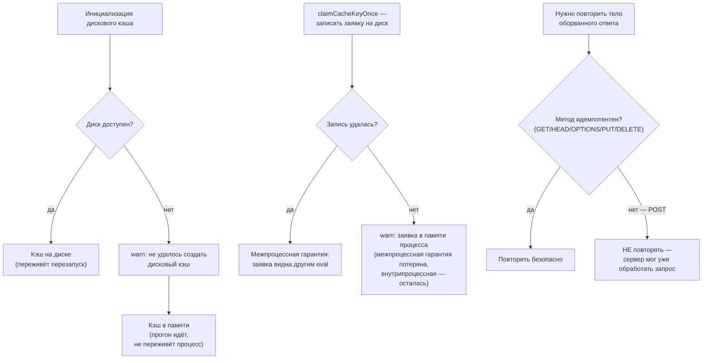

# Кэш ответов провайдеров — `src/cache.ts`

> Разбор через призму **Domain-Driven Design**. Диаграммы — ANSI-псевдографика.
> Дополняет [PROVIDERS.md](PROVIDERS.md), [EVALUATOR.md](EVALUATOR.md),
> [OPTIMIZER.md](OPTIMIZER.md), [REDTEAM.md](REDTEAM.md), [NODE.md](NODE.md),
> [ARCHITECTURE.md](ARCHITECTURE.md).
>
> Три правила всплывали в предыдущих разборах без объяснения: оптимизатор
> принудительно ставит `cache: false`, `AGENTS.md` требует `--no-cache` при
> разработке и **запрещает** чистить `~/.promptfoo/cache`. Здесь — причины.

---

## 0. Паспорт подсистемы

```
╔══════════════════════════════════════════════════════════════════════════════╗
║  src/cache.ts — один файл между promptfoo и каждым платным вызовом API       ║
╠══════════════════════════════════════════════════════════════════════════════╣
║  Строк .................. 987      один файл, без каталога и AGENTS.md       ║
║  Экспортов .............. 13       12 функций + 1 тип                        ║
╠══════════════════════════════════════════════════════════════════════════════╣
║  Слой ................... node     tier 3, один из 10 корней слоя            ║
║  Файлов-потребителей .... 56       из них providers — 42                     ║
╠══════════════════════════════════════════════════════════════════════════════╣
║  Тестов ................. 1930 строк   test/cache.test.ts                    ║
║  Отношение тест/код ..... 1.96 : 1                                           ║
╠══════════════════════════════════════════════════════════════════════════════╣
║  Хранилище .............. ~/.promptfoo/cache/cache.json  (KeyvFile)          ║
║  Версия ключа ........... fetch:v3:                                          ║
║  TTL по умолчанию ....... 14 суток   PROMPTFOO_CACHE_TTL (в секундах)        ║
║  Резервный режим ........ память, если диск недоступен                       ║
╚══════════════════════════════════════════════════════════════════════════════╝
```

Один файл, который стоит между инструментом и деньгами пользователя. Отсюда
и плотность тестов — 1.96:1, — и то, что почти каждое решение внутри снабжено
объяснением в комментарии.

---

## 1. Единый язык подсистемы

| Термин | Носитель в коде | Смысл в предметной области |
| --- | --- | --- |
| **Cache key** | `getFetchCacheKey` | Отпечаток запроса: URL + метод + заголовки + тело + формат |
| **Secret fingerprint** | `fingerprintFetchCacheSecret` | HMAC вместо самого секрета — ключ не должен хранить токен |
| **Namespace** | `withCacheNamespace` | Изолированное подпространство ключей; вкладывается через `:` |
| **Repeat namespace** | `repeat:${repeatIndex}` | Пространство для N-го повтора: `--repeat` обязан бить в провайдер заново |
| **Bust** | `bust: true` | Разовый обход кэша для конкретного запроса |
| **Inflight** | `inflightFetchResponses` | Запрос, уже летящий к провайдеру; второй такой же ждёт первого |
| **Claim** | `claimCacheKeyOnce` | Одноразовое право на действие, эксклюзивное между **процессами** |
| **Clear generation** | `cacheClearGeneration` | Счётчик очисток; позволяет отличить «пусто» от «очищено» |
| **Cache type** | `cacheType` | `disk` или `memory`; определяет, переживёт ли кэш перезапуск |

---

## 2. Три правила и их причины

Это главное, ради чего документ написан.

```
╔══════════════════════════════════════════════════════════════════════════════╗
║  ПРАВИЛО 1: оптимизатор ставит cache: false                                  ║
║             (OPTIMIZER.md §9, promptOptimizer.ts:724)                        ║
╠══════════════════════════════════════════════════════════════════════════════╣
║                                                                              ║
║  Оптимизатор делает от 4 до 8 прогонов, и seed-промпт участвует в КАЖДОМ     ║
║  раунде как колонка сравнения. С кэшем второй и последующие замеры seed'а    ║
║  вернули бы записанный ответ.                                                ║
║                                                                              ║
║  Почему это ломает именно оптимизатор:                                       ║
║                                                                              ║
║    Он сравнивает счёт кандидата со счётом seed'а. Если seed отвечает         ║
║    из кэша, а кандидат — живым вызовом, сравниваются РАЗНЫЕ ВЕЩИ:            ║
║    зафиксированный один раз ответ против свежей выборки из                   ║
║    недетерминированной модели. Кандидат может «выиграть» только              ║
║    потому, что ему выпал удачный сэмпл, а seed'у — нет.                      ║
║                                                                              ║
║    Правило принятия (OPTIMIZER.md §7) сравнивает числа строгим >.            ║
║    Оно предполагает, что оба числа получены одинаковым способом.             ║
║                                                                              ║
║  cache: false ставится ПОСЛЕ спреда пользовательских evaluateOptions —       ║
║  пользователь не может это отменить.                                         ║
╚══════════════════════════════════════════════════════════════════════════════╝

╔══════════════════════════════════════════════════════════════════════════════╗
║  ПРАВИЛО 2: --no-cache при разработке (корневой AGENTS.md)                   ║
╠══════════════════════════════════════════════════════════════════════════════╣
║                                                                              ║
║  Ключ кэша считается по ЗАПРОСУ, а не по коду, который его построил:         ║
║                                                                              ║
║    getFetchCacheKey(url, options, method, format, repeatIndex)               ║
║                                                                              ║
║  Правя провайдер, ассерт или шаблон промпта, разработчик меняет код —        ║
║  но пока итоговый HTTP-запрос совпадает с прежним, ответ приедет             ║
║  из cache.json. Правка выглядит как «ничего не изменилось».                  ║
║                                                                              ║
║  Обратная ошибка тоже возможна: правка ЗАДЕЛА тело запроса — ключ            ║
║  разъехался — пошли живые вызовы и счёт за них.                              ║
║                                                                              ║
║  Отсюда `--no-cache`, а не «почистите кэш»: он отключает чтение,             ║
║  не трогая чужие записи.                                                     ║
╚══════════════════════════════════════════════════════════════════════════════╝

╔══════════════════════════════════════════════════════════════════════════════╗
║  ПРАВИЛО 3: НИКОГДА не чистить ~/.promptfoo/cache                            ║
╠══════════════════════════════════════════════════════════════════════════════╣
║                                                                              ║
║  Содержимое кэша — не производный артефакт. Это ОПЛАЧЕННЫЕ ответы            ║
║  провайдеров: каждая запись когда-то стоила денег и времени.                 ║
║  Пересобрать `dist/` можно командой; пересобрать cache.json —                ║
║  только заново заплатив.                                                     ║
║                                                                              ║
║  При TTL в 14 суток единственная лишняя очистка обнуляет до двух             ║
║  недель накопленных ответов по всем проектам пользователя сразу —            ║
║  кэш общий, а не привязан к конфигу.                                         ║
║                                                                              ║
║  clearCache() сносит и cache.json, и каталог claims/ целиком:                ║
║    fs.rmSync(path.join(cachePath, 'claims'), {force: true, recursive: true}) ║
║                                                                              ║
║  Безопасные альтернативы, которые даёт сам код:                              ║
║    --no-cache            не читать, ничего не удаляя                         ║
║    PROMPTFOO_CACHE_PATH  свой каталог для экспериментов                      ║
║    bust: true            обойти кэш для одного запроса                       ║
║    withCacheNamespace()  своё подпространство ключей                         ║
╚══════════════════════════════════════════════════════════════════════════════╝
```

---

## 3. Ключ кэша: что именно считается одинаковым запросом

```
   getFetchCacheKey(url, options, method, format, repeatIndex)        :538
        │
        ├─ getUrlForFetchCacheKey(url)                :414
        │     параметры строки запроса просеиваются на секреты        :398
        │
        ├─ getHeadersForCacheKey(url, options)        :431
        │     ┌─ ИГНОРИРУЮТСЯ ────────────────────────────────────┐
        │     │  traceparent · tracestate                          │
        │     │  ▲ заголовки OpenTelemetry уникальны для КАЖДОГО   │
        │     │    запроса. Учитывай их — кэш не попадал бы        │
        │     │    никогда. См. TRACING.md.                        │
        │     └────────────────────────────────────────────────────┘
        │
        ├─ getBodyForFetchCacheKey(body)              :475
        │     строка · JSON · бинарные данные (hashBytesForCacheKey :460)
        │
        ├─ getOptionsForFetchCacheKey(options, body)  :508
        │     ┌─ ИГНОРИРУЮТСЯ ────────────────────────────────────┐
        │     │  method — учтён отдельным аргументом              │
        │     │  signal — AbortSignal уникален для вызова         │
        │     └────────────────────────────────────────────────────┘
        │
        └─ hashFetchCacheKey(identity)                :456
              префикс `fetch:v3:` — версия формата в самом ключе.
              Смена формата сериализации = смена префикса = старые
              записи перестают находиться, но НЕ удаляются.
```

Та же сборка ключа как Mermaid-диаграмма:



**Своими словами.** Представь, что для каждого запроса собирается составной
словесный портрет — как в бюро пропусков, где личность сверяют не по одной
примете, а по нескольким сразу, и при этом сознательно закрывают глаза на
приметы, которые у всех разные просто по природе. Портрет складывается из
адреса (с уже вычищенными из него секретами в параметрах), из заголовков (но
не всех — два конкретных заголовка, технически уникальных у КАЖДОГО отдельного
запроса, к портрету не подшиваются, иначе портрет никогда бы не совпал сам с
собой дважды), из тела запроса (какое бы оно ни было — текст, JSON или вовсе
двоичные данные) и из прочих настроек запроса, тоже не всех — метод вынесен
отдельной строкой анкеты, а сигнал отмены не учитывается вовсе, потому что он
тоже одноразовый по природе. Все четыре части портрета сшиваются вместе и
хешируются в один короткий отпечаток — но перед самим отпечатком ставится
штамп версии формата. Если однажды правила составления портрета изменятся,
штамп изменится вместе с ними — и старые отпечатки просто перестанут совпадать
с новыми, а не будут удалены силой: они спокойно долежат в архиве до истечения
срока хранения сами.

Версионирование ключа вместо инвалидации — тихое решение с большими
последствиями: обновление promptfoo, меняющее формат, не обесценивает
кэш пользователя, а просто перестаёт его читать. Записи доживут до TTL
и исчезнут сами.

---

## 4. Секреты не попадают в ключ

Ключ кэша — это данные на диске в открытом виде. Токен провайдера,
подставленный в заголовок, оказался бы в `cache.json` как часть ключа.

```
╔══════════════════════════════════════════════════════════════════════════════╗
║  fingerprintFetchCacheSecret :329                                            ║
╠══════════════════════════════════════════════════════════════════════════════╣
║                                                                              ║
║   crypto.createHmac('sha256', FETCH_CACHE_SECRET_HMAC_SALT)                  ║
║     .update(FETCH_CACHE_SECRET_HMAC_CONTEXT)   'promptfoo:fetch-cache-…'     ║
║     .update('\0')                              разделитель полей             ║
║     .update(value)                                                           ║
║     .digest('hex')                                                           ║
║                                                                              ║
║   → { __promptfooSecretFingerprint: '…' }                                    ║
║                                                                              ║
║   Обнаружение секрета — двумя путями (isSensitiveFetchCacheString :340):     ║
║     isSecretField(fieldName)   по ИМЕНИ поля                                 ║
║     looksLikeSecret(value)     по ВИДУ значения                              ║
║                                                                              ║
║   Обход рекурсивный: строки, массивы, вложенные объекты, параметры           ║
║   строки запроса — getJsonValueForFetchCacheKey :366                         ║
╚══════════════════════════════════════════════════════════════════════════════╝
```

### Соль, которая не секрет, — и сбой, из-за которого она такая

```
   ┌── Комментарий авторов, дословно ─────────────────────────────────────┐
   │                                                                      │
   │  «A fixed, compiled-in salt (NOT a secret). It must be deterministic │
   │   across processes so that a request carrying a static secret — or a │
   │   binary body — hashes to the same on-disk cache key on every run    │
   │   and stays cacheable. A per-process random key broke that: each     │
   │   `promptfoo eval` run produced a new key and re-hit the upstream    │
   │   endpoint. The salt only domain-separates the one-way HMAC so raw   │
   │   secrets are never written into the cache key; it does not need to  │
   │   be unpredictable…»                                                 │
   └──────────────────────────────────────────────────────────────────────┘

   Хроника решения:
   ┌──────────────────────────────────────────────────────────────────────┐
   │  1. Секреты писались в ключ как есть          → утечка в cache.json  │
   │  2. Заменили на HMAC со СЛУЧАЙНЫМ ключом      → безопасно, но кэш    │
   │     на процесс                                   перестал работать:  │
   │                                                  каждый запуск давал │
   │                                                  новые ключи и заново│
   │                                                  бил в провайдера    │
   │  3. Фиксированная соль, вкомпилированная       → и безопасно,        │
   │     в исходник, плюс контекст домена              и кэшируется       │
   └──────────────────────────────────────────────────────────────────────┘

   Версия зашита в саму соль: 'promptfoo:fetch-cache-secret-hmac-salt:v1'.
   Смена соли = смена всех ключей с секретами, поэтому суффикс :v1 нужен
   для будущей ротации.
```

Тонкость, которую стоит назвать вслух: соль **публична** — она лежит в
исходном коде на GitHub. Это осознанно. Задача HMAC здесь не в том, чтобы
никто не восстановил секрет по отпечатку, а в том, чтобы **сам секрет
не оказался записан на диск в открытом виде**. Против атакующего, у которого
уже есть и cache.json, и список кандидатов, схема не защищает — но у такого
атакующего есть и `~/.promptfoo` целиком.

---

## 5. Пространства имён: почему `--repeat` не обманешь

```
   Флаг --repeat N существует, чтобы измерить РАЗБРОС ответов модели.
   С обычным кэшем все N повторов вернули бы один и тот же записанный
   ответ, и разброс оказался бы нулевым — по построению.

   ┌── evaluator.ts:432 ──────────────────────────────────────────────────┐
   │  function getRepeatCacheNamespace(repeatIndex, evaluateOptions) {    │
   │    if (repeatIndex > 0 || (evaluateOptions?.repeat ?? 1) > 1) {      │
   │      return `repeat:${repeatIndex}`;                                 │
   │    }                                                                 │
   │    return undefined;                                                 │
   │  }                                                                   │
   │                                                                      │
   │  evaluator.ts:1560 — runEval оборачивает КАЖДЫЙ прогон:              │
   │    withCacheNamespace(getRepeatCacheNamespace(...), runEvalInternal) │
   └──────────────────────────────────────────────────────────────────────┘

   Ключи расходятся по пространствам:
     repeat:0:fetch:v3:abc…      первый прогон
     repeat:1:fetch:v3:abc…      второй — другой ключ, живой вызов
     repeat:2:fetch:v3:abc…      третий

   ┌── Вложенность и защита от двойного суффикса ─────────────────────────┐
   │  withCacheNamespace :261                                             │
   │    parentNamespace === namespace  → не вкладывать повторно           │
   │    иначе                          → `${parent}:${namespace}`         │
   │                                                                      │
   │  shouldApplyRepeatCacheSuffix :179                                   │
   │    не добавлять `:repeatN`, если текущее пространство ИМЕН УЖЕ       │
   │    содержит пару 'repeat' → N (currentNamespaceIncludesRepeatIndex)  │
   │                                                                      │
   │  Без этой проверки ключ получил бы суффикс дважды — из пространства  │
   │  имён и из аргумента fetchWithCache — и повторы перестали бы         │
   │  совпадать сами с собой.                                             │
   └──────────────────────────────────────────────────────────────────────┘

   Контекст переносится через AsyncLocalStorage (cacheNamespaceStorage),
   как и в src/database (DATABASE.md §5) — тот же приём для той же задачи:
   узнать «где мы находимся», не протаскивая параметр сквозь стек.
```

Та же защита от двойного суффикса как Mermaid-диаграмма:



**Своими словами.** Представь фотоателье, где клиент просит сделать не одну
карточку, а сразу несколько НЕЗАВИСИМЫХ снимков одного и того же человека —
специально, чтобы увидеть, насколько похожи получатся кадры сами по себе, а не
просто напечатать одну и ту же плёнку трижды. Если это обычный заказ на один
снимок — карточка кладётся в общий архив как обычно, без пометки. Но если
заказано несколько повторов — на оборот КАЖДОЙ карточки ставится номер
повтора, и дальше архив ищет совпадения уже с учётом этого номера: карточка
повтора номер ноль никогда не совпадёт с карточкой повтора номер один, даже
если бы модель была снята секунда в секунду. Отдельная забота фотоателье — не
поставить один и тот же номер повтора на обороте дважды, если заказ проходит
через несколько отделов подряд: прежде чем добавить номер, сначала проверяют —
а нет ли его на обороте уже? Без этой проверки карточка получила бы двойной
штамп и её номер перестал бы совпадать сам с собой при следующем поиске в
архиве.

`withCacheEnabled` устроен так же: `src/evaluate.ts:347` оборачивает весь
прогон, если `options.cache === false`. Именно этот путь и использует
оптимизатор.

---

## 6. Два механизма против двойной оплаты

```
╔══════════════════════════════════════════════════════════════════════════════╗
║  МЕХАНИЗМ 1: inflight — дедупликация внутри процесса                         ║
╠══════════════════════════════════════════════════════════════════════════════╣
║                                                                              ║
║   Ситуация: 10 параллельных тестов формируют ОДИН и тот же запрос.           ║
║   Кэш пуст. Без дедупликации — 10 одинаковых обращений к провайдеру.         ║
║                                                                              ║
║   getInflightFetchCacheKey(cacheKey, url, options)              :578         ║
║     ключ + `:signal:${getAbortSignalId(signal)}` при наличии AbortSignal     ║
║                                                                              ║
║   ▲ AbortSignal входит в ключ, потому что два запроса с РАЗНЫМИ              ║
║     сигналами отмены нельзя схлопнуть: отмена одного убила бы второй.        ║
║     Идентификаторы сигналов раздаются через WeakMap — сигнал                 ║
║     не удерживается в памяти после того, как стал не нужен.                  ║
║                                                                              ║
║   Результат несёт признак: `Another concurrent caller owns the upstream      ║
║   request that produced this response.`                                      ║
╠══════════════════════════════════════════════════════════════════════════════╣
║  МЕХАНИЗМ 2: claimCacheKeyOnce — эксклюзивность между ПРОЦЕССАМИ             ║
╠══════════════════════════════════════════════════════════════════════════════╣
║                                                                              ║
║   Комментарий авторов:                                                       ║
║   «Atomically claim a cache-scoped one-time action. Disk-backed claims use   ║
║    an exclusive file so separate eval processes cannot both attribute the    ║
║    same background response's usage.»                                        ║
║                                                                              ║
║   fs.openSync(path.join(claimsPath, sha256(scopedCacheKey)), 'wx')           ║
║                                                          ▲▲                  ║
║               флаг 'wx' — создать ИЛИ упасть с EEXIST, атомарно на уровне    ║
║               файловой системы. Никаких блокировок и гонок проверки.         ║
║                                                                              ║
║   EEXIST → заявка уже занята → вернуть false                                 ║
║   любая другая ошибка → предупреждение и откат на claim в памяти процесса    ║
║                                                                              ║
║   Зачем: учёт токенов. Два параллельных `promptfoo eval`, читающих один      ║
║   кэшированный ответ, не должны оба записать его стоимость себе —            ║
║   расход задвоился бы в отчётах.                                             ║
╚══════════════════════════════════════════════════════════════════════════════╝
```

Оба механизма как Mermaid-диаграмма:



**Своими словами.** Представь офис, где нельзя дважды выставить счёт за один и
тот же уже оплаченный обед. Внутри ОДНОГО кабинета это решается просто: если
два сотрудника одновременно хотят заказать один и тот же обед, второй просто
видит, что коллега за соседним столом уже это делает, и тихо ждёт готового
результата вместо того, чтобы заказывать заново, — это дешёвая договорённость
на словах, действующая, пока оба в одной комнате. Но когда речь о двух РАЗНЫХ,
не связанных друг с другом кабинетах — по телефону между этажами уже не
договоришься так же легко, слова могут разойтись. Здесь применяется более
грубый, но абсолютно надёжный приём: кто первый физически положит записку в
единственный ящик с одним и тем же именем — тот и получает право списать этот
обед на счёт компании; ящик устроен так, что положить в него вторую записку с
тем же именем физически невозможно, и попытка сразу и однозначно проваливается,
без всякого «а вдруг мы не заметили друг друга». Первый способ дешевле и
работает только в границах одной комнаты; второй — грубее, зато работает даже
между кабинетами, которые вообще ничего не знают друг о друге, кроме общего
архива на диске.

Первый механизм экономит деньги, второй — точность отчётности. Оба решают
задачу «одно действие ровно один раз», но на разных уровнях изоляции, и
поэтому разными средствами: структура в памяти против файла на диске.

---

## 7. Деградация вместо отказа

```
   Кэш — оптимизация. Ни один его сбой не должен ронять прогон.

   ┌── Диск недоступен → память ──────────────────────────────────────────┐
   │  } catch (err) {                                                     │
   │    logger.warn(`[Cache] Failed to initialize disk cache: ${…}. ` +   │
   │                `Using memory cache instead.`);                       │
   │    // Falls through to memory cache                                  │
   │  }                                                                   │
   │                                                                      │
   │  createCache({ stores, … }) — пустой массив stores означает          │
   │  кэш в памяти. Прогон идёт, кэш просто не переживёт процесс.         │
   └──────────────────────────────────────────────────────────────────────┘

   ┌── Заявку не записать → заявка в памяти ──────────────────────────────┐
   │  `Failed to persist a one-time cache claim: … Using a process-local  │
   │   claim instead.`                                                    │
   │  Межпроцессная гарантия теряется, внутрипроцессная остаётся.         │
   └──────────────────────────────────────────────────────────────────────┘

   ┌── Прочие настройки ──────────────────────────────────────────────────┐
   │  refreshThreshold: 0        фоновое обновление ВЫКЛЮЧЕНО:            │
   │                             запись не должна протухать и             │
   │                             самообновляться платным вызовом          │
   │  ttl: getCacheTtlMs()       14 суток; PROMPTFOO_CACHE_TTL в секундах │
   │  cacheClearGeneration       счётчик, растущий при каждой очистке     │
   └──────────────────────────────────────────────────────────────────────┘

   Повтор тела ответа — только для идемпотентных методов:
     const isIdempotent = ['GET','HEAD','OPTIONS','PUT','DELETE'].includes(method);
   «the server already processed the request once headers arrived;
    only the response body stream failed» — повторить POST значило бы
    оформить второй заказ.
```

Три деградации как одна Mermaid-диаграмма:



**Своими словами.** Представь дом с резервным генератором: если пропало
основное электричество (диск недоступен), свет не гаснет — просто
автоматически включается генератор послабее (кэш в памяти), и жильцы работают
дальше, зная только, что при следующем отключении дома он снова начнёт с нуля,
а не что дом остался без света вовсе. То же самое с распиской о праве на
разовое действие: если бланк расписки не удаётся положить в общий сейф дома
(записать на диск), не отменяется вся сделка — расписка просто остаётся у
самого клерка на столе (в памяти процесса): для соседнего дома она уже не
будет видна, зато внутри своего кабинета клерк её по-прежнему помнит и
повторно не выпишет. А отдельное правило — про то, что можно переспрашивать
без опаски. Если курьер не уверен, доставлена ли посылка, и хочет уточнить у
клиента ещё раз — это безопасно только для тех видов запроса, где повторный
вопрос ничего не меняет («покажите квитанцию ещё раз» можно спросить сколько
угодно). А вот переспрашивать «оформить ли вам заказ» повторно нельзя:
получатель мог уже оформить заказ по первому разу, и второй вопрос рискует
создать ВТОРОЙ заказ — именно поэтому для POST повтор запрещён категорически,
а не «на всякий случай разрешён».

---

## Диагноз

```
╔══════════════════════════════════════════════════════════════════════════════╗
║                              ДИАГНОЗ src/cache.ts                            ║
╠══════════════════════════════════════════════════════════════════════════════╣
║  СИЛЬНЫЕ СТОРОНЫ                                                             ║
║                                                                              ║
║  ✔ Секреты не попадают в ключ: обнаружение и по имени поля, и по виду        ║
║    значения, обход рекурсивный, замена — односторонний HMAC.                 ║
║                                                                              ║
║  ✔ Комментарий к соли фиксирует ХРОНИКУ решения, включая провалившийся       ║
║    вариант со случайным ключом. Такое пишут после разбора инцидента,         ║
║    и оно спасает следующего, кто захочет «усилить безопасность».             ║
║                                                                              ║
║  ✔ Заявки между процессами через exclusive-файл ('wx') — атомарность         ║
║    на уровне ФС, без блокировок и проверок-с-гонкой.                         ║
║                                                                              ║
║  ✔ traceparent/tracestate исключены из ключа. Не учти их — кэш               ║
║    не попадал бы никогда, а причина была бы невидима.                        ║
║                                                                              ║
║  ✔ Версия формата в ключе (fetch:v3:) вместо инвалидации: обновление         ║
║    promptfoo не обесценивает оплаченный кэш пользователя.                    ║
║                                                                              ║
║  ✔ Любой сбой кэша деградирует, а не роняет прогон: диск → память,           ║
║    межпроцессная заявка → внутрипроцессная.                                  ║
║                                                                              ║
║  ✔ Повтор тела ответа разрешён только идемпотентным методам —                ║
║    POST не будет отправлен дважды.                                           ║
║                                                                              ║
║  ✔ Отношение тест/код 1.96:1 при 56 файлах-потребителях.                     ║
╠══════════════════════════════════════════════════════════════════════════════╣
║  СЛАБЫЕ МЕСТА                                                                ║
║                                                                              ║
║  ✘ 987 строк без AGENTS.md, при том что три правила эксплуатации             ║
║    (cache: false, --no-cache, не чистить) объяснены только здесь,            ║
║    в стороннем документе, а не рядом с кодом.                                ║
║                                                                              ║
║  ✘ Кэш общий для всех проектов пользователя. Конфиг, конфликтующий           ║
║    по ключам с другим, отравляет его, а изоляция возможна только             ║
║    вручную через PROMPTFOO_CACHE_PATH или namespace.                         ║
║                                                                              ║
║  ✘ Записи со старым префиксом (fetch:v1, v2) остаются на диске до TTL,       ║
║    занимая место и не читаясь. Уборки старых версий нет.                     ║
║                                                                              ║
║  ✘ Каталог claims/ растёт по файлу на заявку и чистится только полным        ║
║    clearCache(), который делать не велено. TTL на него не распространяется.  ║
║                                                                              ║
║  ✘ Обнаружение секретов эвристическое (looksLikeSecret). Токен               ║
║    необычного формата в поле с нейтральным именем уедет в ключ как есть.     ║
║                                                                              ║
║  ✘ Соль публична, и это правильно, но нигде не сказано пользователю:         ║
║    cache.json НЕ является защищённым хранилищем. Он лежит рядом с БД,        ║
║    на которую AGENTS.md отдельно обращает внимание.                          ║
╚══════════════════════════════════════════════════════════════════════════════╝
```

### Оценка по осям

```
  Защита секретов              █████████░   9/10   HMAC, рекурсия, два детектора
  Устойчивость к сбоям         █████████░   9/10   деградация вместо отказа
  Корректность ключа           █████████░   9/10   traceparent, signal, идемпотентность
  Покрытие тестами             █████████░   9/10   1.96:1 при 56 потребителях
  Работа с конкурентностью     ████████░░   8/10   inflight + claims на двух уровнях
  Объяснённость решений        ████████░░   8/10   хроника инцидента прямо в коде
  Гигиена хранилища            ████░░░░░░   4/10   claims/ и старые версии не убираются
  Документированность          ███░░░░░░░   3/10   нет AGENTS.md; правила без причин
  ─────────────────────────────────────────────────────────────────────────────
  ИНТЕГРАЛЬНО                  ███████░░░   7.4/10
```

Знакомый по этой серии профиль: **инженерия сильнее сопровождения**. Каждое
решение внутри обосновано, часто со ссылкой на конкретный сбой. Но правила,
которыми пользуются снаружи, объяснены не были — и именно поэтому выглядели
произвольными.

---

## Рекомендации по эволюции

1. **Завести `src/cache.AGENTS.md` или раздел в корневом `AGENTS.md`** с тремя
   причинами из §2. Правило без причины нарушают при первом же неудобстве;
   правило с причиной — обходят правильным способом.

2. **Убирать записи старых версий ключа.** При смене префикса `fetch:vN`
   пройти по хранилищу и удалить всё с прежним префиксом. Это не «очистка
   кэша», а уборка заведомо нечитаемого — под запрет из правила 3 не подпадает.

3. **Дать `claims/` собственный TTL.** Сейчас каталог растёт файлом на заявку
   и чистится только полным `clearCache()`. Достаточно удалять файлы старше
   TTL самого кэша.

4. **Автоматически изолировать кэш по конфигу.** Хеш от `promptfooconfig.yaml`
   как пространство имён по умолчанию снял бы взаимное влияние проектов,
   сохранив общее хранилище. Механизм `withCacheNamespace` для этого уже есть.

5. **Логировать срабатывание детектора секретов на уровне debug.** Сейчас
   подмена значения отпечатком происходит молча; при отладке «почему кэш
   не попадает» это первое, что хочется увидеть.

6. **Написать в документации, что `cache.json` — не защищённое хранилище.**
   Соль публична намеренно, отпечатки не скрывают секрет от того, у кого
   есть файл. Пользователь должен относиться к `~/.promptfoo/cache` так же,
   как к `~/.promptfoo/promptfoo.db`.

---

## Карта файла

```
src/cache.ts ...................................... 987

├─ КОНФИГУРАЦИЯ И ЭКЗЕМПЛЯР                        :41–168
│    DEFAULT_CACHE_TTL_SECONDS = 14 суток          :41
│    getCacheTtlMs                                 :47   ← экспорт
│    getCache                                      :64   ← экспорт
│    getCacheInstance                              :72   диск → память при сбое
│    getNamespacedCache                            :124
│
├─ ПРОСТРАНСТВА ИМЁН                                :168–286
│    getCurrentCacheNamespace                      :168   AsyncLocalStorage
│    currentNamespaceIncludesRepeatIndex           :172
│    shouldApplyRepeatCacheSuffix                  :179   защита от двойного суффикса
│    getScopedCacheKey                             :185   ← экспорт
│    getCacheClearGeneration                       :189   ← экспорт
│    getUnscopedCacheKey                           :193
│    clearNamespacedCache                          :198
│    withCacheNamespace                            :261   ← экспорт
│    withCacheEnabled                              :275   ← экспорт
│    getEffectiveCacheEnabled                      :283
│
├─ КЛЮЧ КЭША И СЕКРЕТЫ                              :287–568
│    FetchWithCacheResult                          :287   ← экспорт (тип)
│    IGNORED_FETCH_CACHE_OPTION_KEYS               :314   method · signal
│    IGNORED_FETCH_CACHE_HEADERS                   :315   traceparent · tracestate
│    FETCH_CACHE_SECRET_HMAC_SALT                  :325   фиксированная, публичная
│    fingerprintFetchCacheSecret                   :329
│    isSensitiveFetchCacheString                   :340   имя поля ∨ вид значения
│    getStringForFetchCacheKey                     :344
│    hasSensitiveJsonValue                         :351   рекурсивно
│    getJsonValueForFetchCacheKey                  :366
│    getBodyStringForFetchCacheKey                 :384
│    hasSensitiveSearchParam                       :398
│    getSearchParamsForFetchCacheKey               :404
│    getUrlForFetchCacheKey                        :414
│    getHeadersForCacheKey                         :431
│    hashFetchCacheKey                             :456
│    hashBytesForCacheKey                          :460   бинарное тело
│    getBodyForFetchCacheKey                       :475
│    getOptionsForFetchCacheKey                    :508
│    getFetchCacheKey                              :538   префикс fetch:v3:
│
├─ ОДНОКРАТНОСТЬ                                    :569–616
│    getAbortSignalId                              :569   WeakMap
│    getInflightFetchCacheKey                      :578
│    claimCacheKeyOnce                              :587   ← экспорт, флаг 'wx'
│
├─ СЕРИАЛИЗАЦИЯ                                     :617–819
│    serializeFetchResponse :617 · deserializeFetchResponse :633
│
└─ ПУБЛИЧНАЯ ПОВЕРХНОСТЬ                            :820–987
     fetchWithCache                                :820   ← экспорт, главная функция
     enableCache  :923 · disableCache :941                ← экспорты
     clearCache                                    :958   ← экспорт, сносит claims/
     isCacheEnabled                                :985   ← экспорт

Связанные файлы:
    src/evaluator.ts:432,:1560 ..........  repeat-пространство имён
    src/evaluate.ts:347 .................  withCacheEnabled для --no-cache
    src/optimizer/promptOptimizer.ts:724   cache: false принудительно
    src/redteam/commands/generate.ts:9 ..  withCacheEnabled при генерации
    src/commands/eval.ts:95 .............  флаг --no-cache
    src/commands/validate.ts:518 ........  disableCache()
    test/cache.test.ts .................. 1930 строк
    ~/.promptfoo/cache/cache.json .......  хранилище (KeyvFile)
    ~/.promptfoo/cache/claims/ ..........  файлы-заявки
```

---

## Команды

```bash
# Размер и экспорты
wc -l src/cache.ts
grep -nE '^export ' src/cache.ts

# ПРАВИЛО 1: где оптимизатор выключает кэш
grep -n -A4 'createEvaluationOptions' src/optimizer/promptOptimizer.ts

# ПРАВИЛО 2: ключ считается по запросу, не по коду
grep -n 'function getFetchCacheKey' -A 12 src/cache.ts

# ПРАВИЛО 3: что именно сносит clearCache
grep -n 'export async function clearCache' -A 12 src/cache.ts

# Хроника решения про соль
grep -n -B12 'FETCH_CACHE_SECRET_HMAC_SALT =' src/cache.ts

# Что исключено из ключа и почему
grep -n 'IGNORED_FETCH_CACHE' src/cache.ts

# Repeat-пространство имён
grep -n 'getRepeatCacheNamespace' -A 8 src/evaluator.ts

# Межпроцессная заявка через exclusive-файл
grep -n "'wx'" src/cache.ts

# Кто пользуется кэшем
grep -rl 'fetchWithCache' src/ --exclude-dir=node_modules | sed 's|^src/||;s|/.*||' | sort | uniq -c | sort -rn

# Тесты
npx vitest run test/cache.test.ts

# Безопасные альтернативы очистке
#   promptfoo eval --no-cache
#   PROMPTFOO_CACHE_PATH=/tmp/pf-cache promptfoo eval …
#   PROMPTFOO_CACHE_TTL=3600 promptfoo eval …
```

> **Осторожно:** корневой `AGENTS.md` promptfoo запрещает удалять или
> очищать `~/.promptfoo/cache` без явного разрешения пользователя. Причина —
> в §2, правило 3: там лежат оплаченные ответы провайдеров за срок до 14 суток.
> Для экспериментов используйте `--no-cache` или отдельный `PROMPTFOO_CACHE_PATH`.

---

*Документ описывает `src/cache.ts` на коммите `2c140ef`, promptfoo 0.122.0. Дата среза — 26 августа 2026.*
