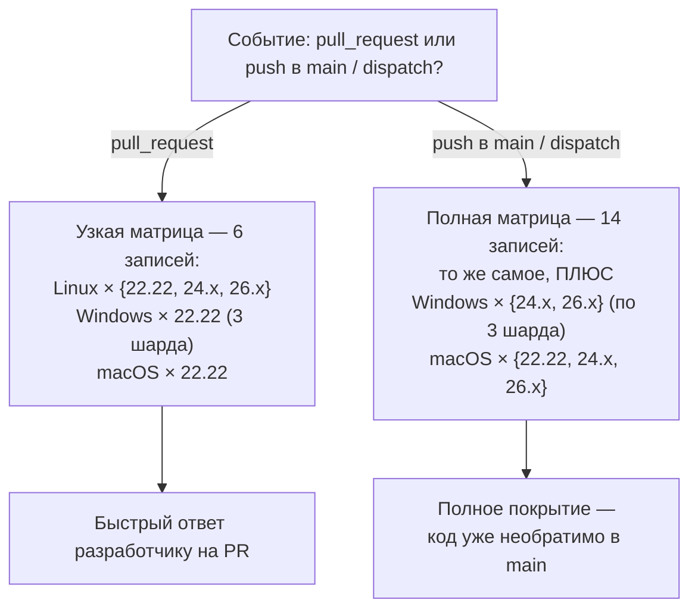
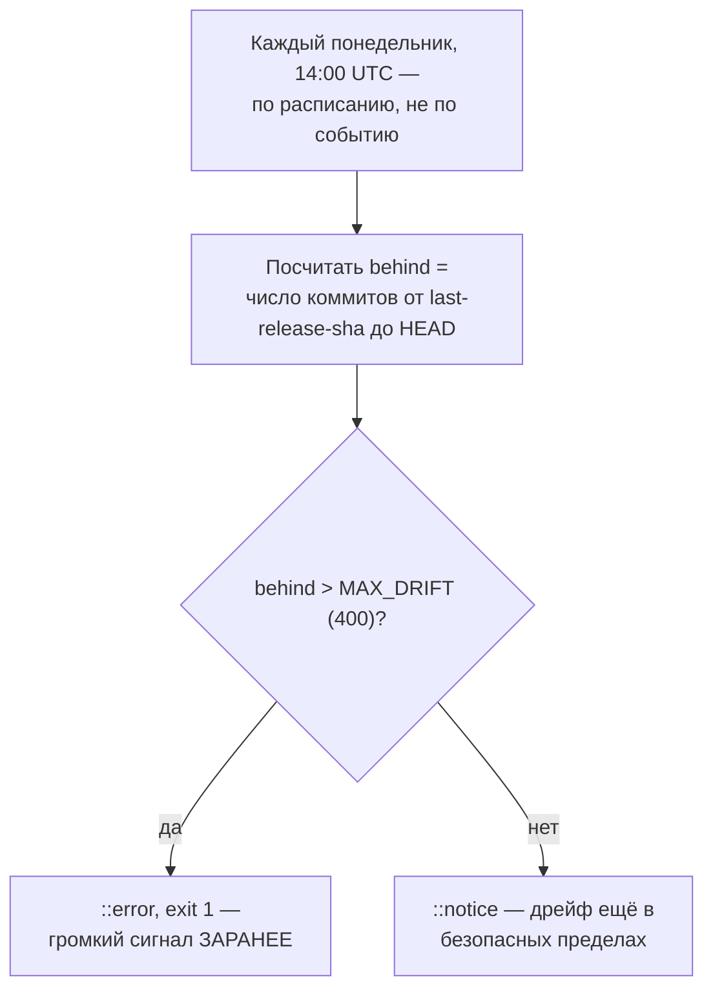
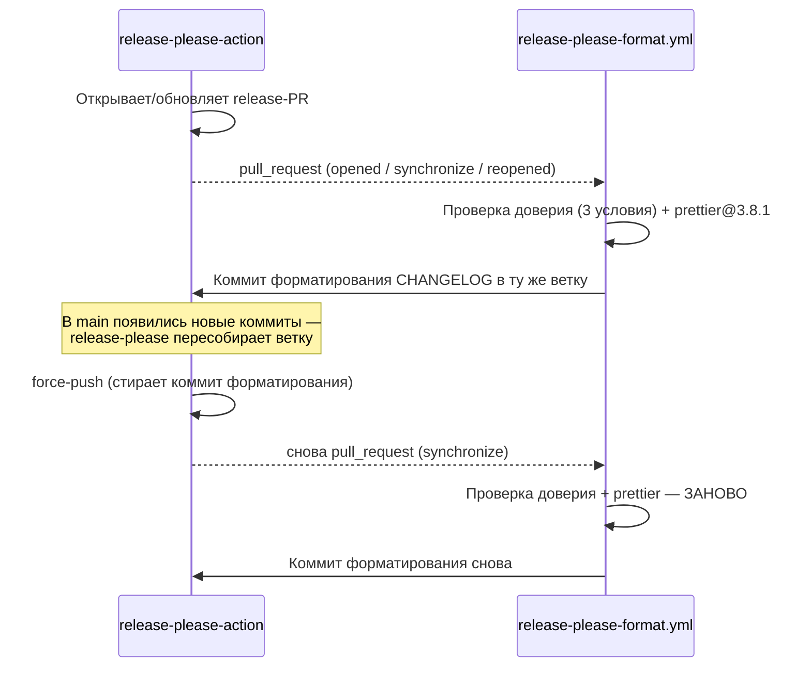
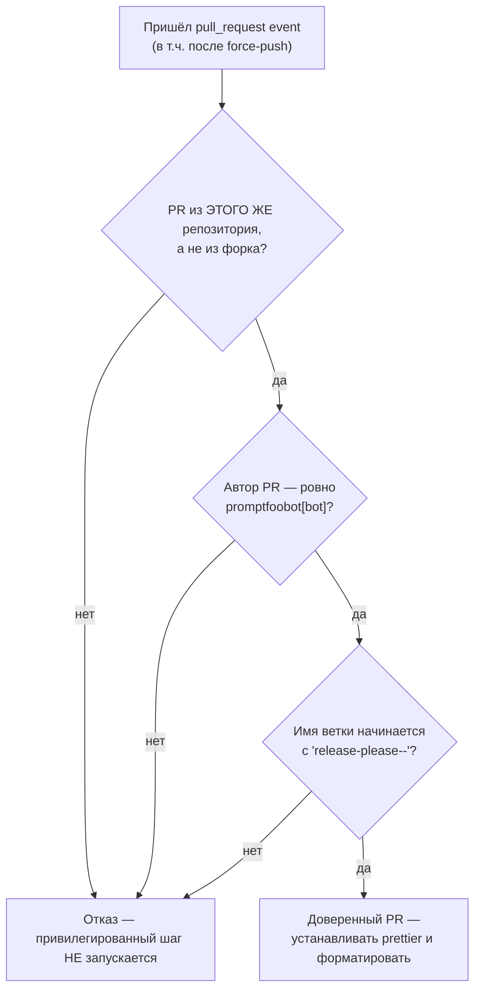

# Выпуск, конвейер и документация — `.github/` и `site/`

> Разбор через призму **Domain-Driven Design**. Диаграммы — ANSI-псевдографика.
> Дополняет [TEST-ARCHITECTURE.md](TEST-ARCHITECTURE.md), [DATABASE.md](DATABASE.md),
> [CODESCAN.md](CODESCAN.md), [ARCHITECTURE.md](ARCHITECTURE.md).
>
> Второй и третий разбор за пределами `src/`. `.github/` — единственное место
> в репозитории, где написано, ЧТО ИМЕННО пытались сломать в promptfoo раньше,
> и как это закрыли. `site/` — единственное место, где инженерия для внешнего
> мира (не для разработчика) получает столько же внимания, сколько ядро.

---

## 0. Паспорт

```
╔══════════════════════════════════════════════════════════════════════════════╗
║  .github/ — конвейер, а не конфигурация                                      ║
╠══════════════════════════════════════════════════════════════════════════════╣
║  Файлов ................. 20                                                 ║
║  workflows/ .............. 12 файлов, 2413 строк YAML                        ║
║    main.yml ............. 874 строки, 19 jobs — основной конвейер PR/push    ║
║    docker.yml ............ 437 строк — сборка и публикация образов           ║
║    release-please.yml .... 423 строки — автоматизация релиза                 ║
║  AGENTS.md ................ 27 строк — плотнее любого встречавшегося в серии ║
╠══════════════════════════════════════════════════════════════════════════════╣
║  site/ — Docusaurus, но не только документы                                  ║
╠══════════════════════════════════════════════════════════════════════════════╣
║  Файлов ................. 1279                                               ║
║  Markdown-контент ........ 446    (то, что обычно называют «доками»)         ║
║  Код: .tsx ............... 111    .ts ................................ 30    ║
║  Кастомный плагин ........ 2456 строк (генератор OG-превью через Satori)     ║
║  docusaurus.config.ts .... 705 строк   sidebars.js ..................... 576 ║
║  Тестов ................... 15   (несоразмерно мало для 141 файла кода)      ║
╚══════════════════════════════════════════════════════════════════════════════╝
```

Оба каталога объединяет одно: они существуют не для того, чтобы код работал,
а для того, чтобы код **безопасно доходил** до пользователя — либо как пакет
на диске, либо как страница в браузере.

---

## 1. Единый язык

| Термин | Носитель в коде | Смысл в предметной области |
| --- | --- | --- |
| **SHA-pin** | `uses: actions/checkout@df4cb1c…` | Ссылка на действие по хешу коммита, не по тегу — тег переезжает |
| **Тонeless фаза / credentialed фаза** | разделение шагов job'а | Untrusted-код выполняется до выпуска токена, не после |
| **App token** | `actions/create-github-app-token` | Токен с ограниченным правами приложения, не личный PAT |
| **Trusted publishing** | `id-token: write` + пустой `NODE_AUTH_TOKEN` | Публикация в npm через OIDC, без долгоживущего секрета |
| **last-release-sha drift** | `release-please-config.json` | Расстояние от статического якоря до HEAD, растущее с каждым релизом |
| **Self-healing workflow** | `release-please-format.yml` | Отдельный workflow, переживающий force-push родительского PR |
| **Incremental review** | `determine-review-scope.sh` | Проверка только нового диффа вместо всего PR при обычном push |
| **OG-image** | `docusaurus-plugin-og-image` | Превью-картинка страницы для соцсетей, сгенерированная при сборке |

---

## 2. `.github/AGENTS.md` — плотность инцидентов на строку

27 строк, и это не общие принципы — это список конкретных атак и обходов,
каждый с названным механизмом эксплуатации.

```
╔══════════════════════════════════════════════════════════════════════════════╗
║  ЦЕПОЧКА УГРОЗ, ЗАКРЫТАЯ ОДНА ЗА ДРУГОЙ                                      ║
╠══════════════════════════════════════════════════════════════════════════════╣
║                                                                              ║
║  УГРОЗА                              ЗАЩИТА                                  ║
║  ─────────────────────────────       ────────────────────────────────────    ║
║  плавающий тег @v4 подменяется       SHA-pin всех actions, без исключений    ║
║  вредоносным обновлением                                                     ║
║                                                                              ║
║  PR ставит npm install/npx —          токен НЕ передаётся в env шага,        ║
║  ворует GH_TOKEN из env шага          untrusted-фаза токенless               ║
║                                                                              ║
║  App-токен существует ДО запуска      выпуск токена — ПОСЛЕ untrusted-кода,  ║
║  чужого кода — доступен через         или два job'а: без токена → работа,    ║
║  побочный канал                       с токеном → пуш                        ║
║                                                                              ║
║  PR подкладывает pre-push/            git -c core.hooksPath=/dev/null        ║
║  pre-commit хук в .git/hooks          на каждой credentialed git-команде     ║
║                                                                              ║
║  .prettierrc.js — ЭТО JS, и он        --no-config --no-editorconfig;         ║
║  исполнится при форматировании        npm install только с явным registry    ║
║                                                                              ║
║  checkout оставляет токен в           persist-credentials: false,            ║
║  .git/config — читаем любым кодом      токен инжектится точечно в один       ║
║                                        git-вызов через Basic-заголовок       ║
║                                                                              ║
║  форматер коммитит НЕ только то,       git diff-tree --name-only --          ║
║  что ожидалось                        ассерт списка путей ПЕРЕД push         ║
║                                                                              ║
║  branch/title/label подставлены        присвоить переменной env, НЕ          ║
║  напрямую в run: — shell injection    интерполировать ${{ … }} в run:        ║
║                                        (форсируется actionlint)              ║
║                                                                              ║
║  branch-name prefix — не граница       same-repo + user.type=='Bot' +        ║
║  доверия сам по себе                  branch-naming — все три условия        ║
╚══════════════════════════════════════════════════════════════════════════════╝
```

Это редкий документ, где каждое правило можно прочитать как «здесь было
дело» — не в смысле, что инцидент случился именно в promptfoo, а в смысле,
что формулировка слишком конкретна, чтобы быть абстрактной рекомендацией.
Сравните с [DATABASE.md §6](DATABASE.md), где комментарий к обходу блокировки
объясняет ровно такой же класс знания — «мы это уже видели» — только
про SQLite, а не про GitHub Actions.

---

## 3. `main.yml` — 19 jobs и асимметричная матрица

```
╔══════════════════════════════════════════════════════════════════════════════╗
║  ci-config — ДИСПЕТЧЕР, решающий, что вообще будет прогнано                  ║
╠══════════════════════════════════════════════════════════════════════════════╣
║                                                                              ║
║  На PULL_REQUEST:                     На PUSH в main / dispatch:             ║
║  ────────────────────────             ────────────────────────────           ║
║  Linux × {22.22, 24.x, 26.x}          то же самое, ПЛЮС:                     ║
║  Windows × 22.22 (3 шарда)            Windows × {24.x, 26.x} (по 3 шарда)    ║
║  macOS × 22.22 (1 версия)             macOS × {22.22, 24.x, 26.x}            ║
║                                                                              ║
║  6 записей матрицы                    14 записей матрицы                     ║
╠══════════════════════════════════════════════════════════════════════════════╣
║  Асимметрия намеренная: разработчик на PR ждёт быстрый ответ по узкой        ║
║  матрице; полная матрица трат на macOS/Windows идёт только там, где          ║
║  результат уже НЕОБРАТИМ — код попал в main.                                 ║
╚══════════════════════════════════════════════════════════════════════════════╝
```

Тот же диспетчер как Mermaid-диаграмма:



**Своими словами.** Представь заводской контроль качества с двумя разными
режимами проверки одного и того же изделия. Пока изделие ещё в цехе и его
легко переделать — на стадии PR — проверяют на небольшом наборе типовых
стендов: три версии одной операционной системы плюс по одной проверке на
двух остальных. Разработчик ждёт результата у станка и должен получить
ответ быстро, поэтому список стендов короткий. А как только изделие уже
погрузили на склад готовой продукции — код слился в `main`, и откатить это
так же просто уже нельзя — тот же самый набор проверок прогоняют ещё раз,
но теперь на полной линейке стендов: добавляются все версии операционных
систем, которые на стадии PR проверялись только частично. Экономия времени
происходит не за счёт того, что часть проверок пропускают навсегда, а за
счёт того, что дорогие проверки откладывают до момента, когда результат
уже нельзя отменить одним нажатием кнопки — именно тогда имеет смысл
проверить всё до последнего стенда.

### Windows тестируется отдельными шардами не просто так

```
   npm run test${{ matrix.shard && format(' -- --shard={0}/3', matrix.shard) }}

   Только Windows-строки матрицы несут shard:1/2/3. Комментарий рядом
   называет причину напрямую: «Cold-cache Node 26 installs can approach
   20m before the test phase starts» — Windows-раннеры GitHub заметно
   медленнее на установке зависимостей и нативных модулей, и без
   деления один прогон 30-секундного timeout на 1114 файлов упёрся бы
   в 40-минутный лимит job'а до того, как дошёл бы до собственно тестов.
```

### Инвариант матрицы: стабильное имя проверки при точной версии

```
   node-version: ${{ matrix.node == '22.22' && '22.22.0' || matrix.node }}

   Метка матрицы — «22.22» (стабильное имя required-check в настройках
   ветки). Фактически устанавливается «22.22.0» — самая старая патч-версия,
   то есть настоящий пол из package.json engines. Назови required check
   именем плавающей версии — придётся перенастраивать branch protection
   при каждом патче Node; фиксируй патч в самом имени — check сломается,
   когда 22.22.1 выйдет и 22.22.0 станет недостижим на раннерах.
```

### Ratchet: покрытие может расти, но не может упасть

```
   npm run test:coverage:ratchet -- --report backend

   ▲ Единственный дублирующий термин с DATABASE.md и CACHE.md: фитнес-
     функция, встроенная в CI, а не документ. «Ratchet» (трещотка) —
     механизм, крутящийся в одну сторону: текущее покрытие фиксируется
     как минимум, и PR, опускающий его ниже зафиксированного порога,
     красит CI. Порог сам по себе не задан руками — он подтягивается
     вверх, когда покрытие выросло, и никогда не опускается автоматически.
```

Codecov upload идёт следом, но **намеренно non-blocking**
(`fail_ci_if_error: false`) — комментарий объясняет: «coverage is gated
in-repo, not by Codecov», то есть реальный гейт — тот же `ratchet`,
а внешний сервис — только визуализация, чей простой не должен красить `main`.

---

## 4. `release-please-sha-drift.yml` — канарейка на конкретный прошлый сбой

Это самый ценный файл во всём каталоге для понимания того, **как** здесь
работают с накопленными знаниями. 82 строки целиком построены вокруг
одного номера PR.

```
╔══════════════════════════════════════════════════════════════════════════════╗
║  Проблема, дословно из комментария в начале файла:                           ║
║                                                                              ║
║  «release-please's last-release-sha in release-please-config.json is         ║
║   a STATIC pin that floors release-please's GraphQL "fetch merge             ║
║   commits" walk. Nobody advances it automatically, so the scan window        ║
║   grows every release and eventually the GraphQL query times out.»           ║
║                                                                              ║
║  Инцидент PR #9517: окно разрослось до ~468 коммитов, GraphQL-запрос         ║
║  начал таймаутиться. При 144 коммитах в окне запрос ещё проходил.            ║
╠══════════════════════════════════════════════════════════════════════════════╣
║  РЕШЕНИЕ — превратить тихий будущий сбой в громкий сигнал заранее            ║
║                                                                              ║
║  MAX_DRIFT = 400                                                             ║
║    ▲ ниже 468 (где реально сломалось), выше 144 (где ещё работало);          ║
║      с commit-batch-size=25 оставляет 100 коммитов запаса до                 ║
║      500-коммитного предела поиска самого release-please                     ║
║                                                                              ║
║  behind = git rev-list --count "${sha}..${DRIFT_HEAD_SHA}"                   ║
║  if (behind > MAX_DRIFT) → ::error, exit 1                                   ║
║                                                                              ║
║  Расписание: КАЖДЫЙ ПОНЕДЕЛЬНИК, 14:00 UTC — проактивно, потому что          ║
║  дрейф растёт БЕЗ ИЗМЕНЕНИЙ КОНФИГА, а значит его некому заметить            ║
║  между релизами, если не спрашивать регулярно.                               ║
╚══════════════════════════════════════════════════════════════════════════════╝
```

Та же канарейка как Mermaid-диаграмма:



**Своими словами.** Это буквально канарейка в шахте, только заведённая на
будильник, а не сидящая там постоянно. Проблема, которую она ловит, растёт
незаметно: расстояние между зафиксированной точкой отсчёта и текущим
состоянием увеличивается с каждым новым релизом само по себе, без единого
коммита в файл настроек — то есть никто и не подумает туда заглянуть, если
специально не спросить. Поэтому вместо того, чтобы ждать жалобы (а жалоба
здесь — это таймаут запроса, случившийся один раз на боевом релизе), каждый
понедельник в одно и то же время кто-то специально идёт и меряет: насколько
далеко отсчёт отстал от текущей головы репозитория. Порог для тревоги
выбран не круглым числом, а между тем местом, где реально сломалось в
прошлый раз, и тем, где ещё точно работало — с запасом в обе стороны. Если
измерение превысило порог — тревога поднимается заранее, пока это ещё
просто предупреждение в логе, а не сорванный релиз в пятницу вечером.

Отдельная деталь — при событии `pull_request` используется не сам merge-SHA,
а голова предложенной ветки:

```
   DRIFT_HEAD_SHA: ${{ github.event.pull_request.head.sha || github.sha }}

   «pull_request checkouts use a synthetic merge commit. Count the
    proposed branch tip instead so the merge wrapper does not consume
    one commit of drift headroom.»
```

Одна лишняя единица дрейфа, съеденная синтетическим merge-коммитом GitHub,
и порог сдвинулся бы незаметно для человека, но не для скрипта, который
считает точно.

---

## 5. `release-please-format.yml` — workflow, спроектированный переживать чужой force-push

`AGENTS.md` формулирует правило одной строкой: не форматировать CHANGELOG
внутри `release-please.yml`. Этот файл — воплощение причины.

```
   release-please-action периодически ПЕРЕПИСЫВАЕТ историю своей PR-ветки
   force-push'ом при появлении новых коммитов в main. Любой коммит
   форматирования, сделанный ВНУТРИ джобы release-please, будет стёрт
   следующим force-push.

   ┌── Решение: отдельный workflow на pull_request synchronize ───────────┐
   │                                                                      │
   │  Триггер: paths: ['**/CHANGELOG.md'], types: [opened, synchronize,   │
   │                                                reopened]             │
   │  → каждый force-push от release-please СНОВА запускает этот          │
   │    workflow, и форматирование накладывается заново.                  │
   │                                                                      │
   │  Название run-name даже включает ветку:                              │
   │    "format CHANGELOG on release PR (${{ …head.ref }})"               │
   └──────────────────────────────────────────────────────────────────────┘
```

Тот же цикл как Mermaid-диаграмма:



**Своими словами.** Представь стену, которую один человек периодически
полностью перекрашивает набело, стирая всё, что на ней было, каждый раз,
когда получает новую информацию (`release-please-action` переписывает свою
ветку force-push'ом при каждом новом коммите в `main`). А рядом — маляр,
который каждый раз, когда видит свежепобеленную стену, снова аккуратно
наносит на неё нужный узор (форматирует CHANGELOG). Наивное решение —
попросить первого человека самого рисовать узор сразу при побелке — не
сработает, потому что он периодически перебеливает стену заново и узор
сотрёт вместе со старой краской. Рабочее решение здесь другое: маляр вообще
не пытается спорить с тем, кто белит стену, а просто настроен реагировать
на сам факт свежей побелки — он подписан на событие «стена только что
перекрашена» и включается заново при каждом его появлении, сколько бы раз
оно ни повторилось. Со стороны это выглядит как бесконечный цикл перекраски
и разрисовки, но на деле это единственный способ гарантировать, что узор
в итоге останется на месте, даже если первый человек передумает белить
стену ещё раз пять.

Проверка доверия — три условия одновременно, ни одно не достаточно само
по себе:

```
   github.event.pull_request.head.repo.full_name == github.repository
     ▲ форк НЕ может подсунуть свою ветку release-please--*
   && github.event.pull_request.user.login == 'promptfoobot[bot]'
     ▲ автор PR — именно бот, а не человек, назвавший ветку похоже
   && startsWith(github.event.pull_request.head.ref, 'release-please--')
     ▲ и только тогда — проверка по имени ветки

   Ровно то правило из AGENTS.md: «Gate privileged workflows tighter
   than a branch-name prefix.»
```

Та же проверка как Mermaid-диаграмма:



**Своими словами.** Представь охранника у двери с ключом от привилегированной
комнаты, который не верит ни одному отдельному пропуску, а требует сразу
три разных подтверждения одновременно. Первое — сам гость должен быть из
ЭТОГО ЖЕ здания, а не из соседнего дома, притворяющегося похожим (PR не из
форка). Второе — это должен быть конкретный, заранее известный сотрудник,
а не кто-то посторонний, который просто представился похожим именем (автор —
именно бот `promptfoobot`, а не человек). Третье — и только когда первые два
уже подтверждены — проверяется бирка на одежде, то есть название ветки
(начинается с `release-please--`). По отдельности ни одна из трёх проверок
не была бы надёжной: подделать бирку с названием несложно, представиться
похожим именем — тоже, а вот подделать сразу все три одновременно — уже нет.
Именно поэтому название ветки — самое слабое из трёх условий — проверяется
последним, только после того, как первые два уже отсеяли самозванцев.

Установка `prettier@3.8.1` (точная версия, не диапазон) происходит
в `$RUNNER_TEMP` **до** checkout PR-ветки — тот самый паттерн из
`AGENTS.md` про изолированную установку раньше недоверенного дерева.
Credential (App-токен) создаётся только после этого шага.

---

## 6. `release-please.yml` — публикация без долгоживущего секрета

```
╔══════════════════════════════════════════════════════════════════════════════╗
║  publish-npm — OIDC trusted publishing вместо NPM_TOKEN                      ║
╠══════════════════════════════════════════════════════════════════════════════╣
║   permissions: { id-token: write }                                           ║
║                                                                              ║
║   - run: npm publish --provenance --access public                            ║
║     env:                                                                     ║
║       NODE_AUTH_TOKEN: ''    ← ПУСТАЯ строка, не отсутствие переменной       ║
║                                                                              ║
║   Комментарий: «Empty NODE_AUTH_TOKEN so npm uses OIDC trusted publishing    ║
║   instead of the placeholder token actions/setup-node writes into .npmrc     ║
║   (actions/setup-node#1440).»                                                ║
║                                                                              ║
║   setup-node с registry-url ВСЕГДА пишет плейсхолдер в .npmrc. Если его      ║
║   не перекрыть явной пустой строкой, npm попытается аутентифицироваться      ║
║   этим плейсхолдером вместо OIDC-обмена и упадёт — известный баг             ║
║   действия, обойдённый одной строкой env.                                    ║
╚══════════════════════════════════════════════════════════════════════════════╝
```

### Разрешения App-токена — subset-request, не grant

```
   Комментарий в release-please job'е дословно фиксирует прошлый инцидент:

   «Previous attempt to narrow via permission-* inputs failed with 422
    because the PROMPTFOOBOT installation does not grant all of them
    (release-please PR #8796 landed green, then main broke on the next
    release-please run).»

   Попытка сузить права токена ДО минимально нужных — правильный
   инстинкт безопасности — сломала следующий прогон, потому что запрос
   несуществующего у установки права GitHub App вызывает 422, а не
   тихое игнорирование. AGENTS.md формализует урок отдельным пунктом:
   «permission-* inputs are a subset-request, not a grant» — сначала
   расширь права самого App-installation, потом сужай запрос токена.
```

---

## 7. `promptfoo-code-scan.yml` — продукт сканирует сам себя

```
   uses: promptfoo/code-scan-action@c4839dcb… # v0
     config-path: .github/promptfoo-code-scan.yaml
     enable-fork-prs: true

   ▲ Та самая подсистема из CODESCAN.md проверяет PR В САМОМ РЕПОЗИТОРИИ,
     который её и производит. Замкнутый цикл: изменение сканера
     проверяется предыдущей опубликованной версией сканера.
```

Здесь тоже задокументирован живой перформанс-инцидент:

```
   node-version: '24.15.0'    ← НЕ .nvmrc, зафиксировано числом

   «Pin to 24.15.0 (not .nvmrc): Node 24.16.0 adds ~10s to every HTTPS
    request on Linux runners, dragging the scanner's uncached npm install
    -g promptfoo (~860 packages) into a 14-minute crawl that trips the
    job timeout. 24.17.0 still has the regression (PR #9859 re-bumped it
    and every scan started timing out), so renovate.json disables Node
    updates for this file.»

   Ренобот НАСТРОЕН обходить именно этот файл стороной — регрессия
   производительности в самом Node задокументирована как активный,
   отслеживаемый долг, а не забытый workaround.
```

`concurrency` с `cancel-in-progress: true` защищает от другого класса
сбоя — второй push поверх ещё сканируемого PR не должен позволить
устаревшему прогону «дописать» комментарии к уже неактуальному коду:

> Without this the superseded run keeps scanning an outdated checkout and
> posts review comments against a head that is no longer current.

---

## 8. `site/` — Docusaurus, GDPR-гейт и генератор превью

`site/AGENTS.md` втрое длиннее `.github/AGENTS.md` (81 строка против 27),
но плотность другая: не атаки и обходы, а стиль текста. Дисциплина здесь —
не про безопасность выполнения, а про качество контента.
Терминология зафиксирована буквально: «eval», не «evaluation»; заглавная
«Promptfoo» для компании, строчная «promptfoo» для команды CLI.

### Кастомный плагин генерации OG-превью — 2456 строк ради картинок в соцсетях

```
╔══════════════════════════════════════════════════════════════════════════════╗
║  docusaurus-plugin-og-image — по шаблону на тип страницы                     ║
╠══════════════════════════════════════════════════════════════════════════════╣
║   generatePricingTemplate    generateAboutTemplate                           ║
║   generateContactTemplate    generatePressTemplate                           ║
║   generateStoreTemplate      generateEventsTemplate                          ║
║   generateSolutionTemplate   generateFinanceTemplate                         ║
║                                                                              ║
║   getSharp() — ленивая загрузка растрового рендерера                         ║
║   getSatoriFonts() — шрифты для рендеринга текста в SVG-разметке             ║
║   getLogoAsBase64() — логотип, вшитый как data URI                           ║
╠══════════════════════════════════════════════════════════════════════════════╣
║   SKIP_OG_GENERATION=true npm run build   ← из AGENTS.md, «faster builds»    ║
║                                                                              ║
║   Генерация под каждый из НЕСКОЛЬКИХ ДЕСЯТКОВ типов страниц (pricing,        ║
║   about, каждое решение из /solutions/…) — при полной пересборке доков       ║
║   это заметный кусок времени сборки, и флаг отключения существует            ║
║   именно ради итеративной разработки контента без ожидания рендера           ║
║   каждого превью.                                                            ║
╚══════════════════════════════════════════════════════════════════════════════╝
```

### GDPR как middleware на границе CDN

```
   functions/_middleware.ts — Cloudflare Pages Function

   onRequest(context) {
     response = await context.next()
     if (!contentType.includes('text/html')) return response;   ← только HTML
     country = request.headers.get('CF-IPCountry')
     if (country) response.headers.append('Set-Cookie',
       `pf_country=${country};Path=/;SameSite=Lax;Secure;Max-Age=86400`)
     return response
   }

   ┌── Почему только HTML ──────────────────────────────────────────────────┐
   │  «Only sets the cookie on HTML responses to preserve CDN cacheability  │
   │   for static assets.»                                                  │
   │                                                                        │
   │  Статический ассет (картинка, CSS, JS) с уникальным Set-Cookie         │
   │  на каждый запрос перестаёт эффективно кэшироваться на CDN —           │
   │  каждый посетитель с разной страной получил бы формально другой        │
   │  ответ. HTML-страницы малы и персонализированы по природе, ассеты —    │
   │  нет.                                                                  │
   └──────────────────────────────────────────────────────────────────────┘

   src/gdpr/consent.js читает pf_country на клиенте и решает, показывать
   ли баннер согласия — гео-таргетинг решён на границе CDN (Cloudflare
   уже знает страну по IP из своей сети), а не HTTP-запросом к внешнему
   геолокационному сервису из браузера пользователя.
```

### Соответствие исходникам как явное правило

```
   site/AGENTS.md, «Source Alignment»:
     Red team docs   ↔ src/redteam/AGENTS.md
     Assertion docs  ↔ site/docs/configuration/expected-outputs/ + tracing.md
     Code scanning   ↔ src/codeScan/ + code-scan-action/README.md

   ▲ Документация не считается независимым артефактом — для трёх
     наиболее часто меняющихся продуктовых поверхностей прямо назван
     код, изменение которого ОБЯЗАНО тянуть правку доки. Это неформальное
     правило (не проверяется CI), но названо явно, а не подразумевается.
```

---

## Диагноз

```
╔══════════════════════════════════════════════════════════════════════════════╗
║                     ДИАГНОЗ .github/ и site/                                 ║
╠══════════════════════════════════════════════════════════════════════════════╣
║  СИЛЬНЫЕ СТОРОНЫ                                                             ║
║                                                                              ║
║  ✔ AGENTS.md конвейера — не абстрактные принципы, а закрытые атаки,          ║
║    каждая с названным механизмом эксплуатации: угнанный env-токен,           ║
║    подложенный git-хук, JS-конфиг форматера, branch-name как ложная          ║
║    граница доверия.                                                          ║
║                                                                              ║
║  ✔ release-please-sha-drift.yml — канарейка на конкретный прошлый            ║
║    инцидент (#9517) с числами ИЗ этого инцидента (468/144/400) вместо        ║
║    произвольного порога, плюс расписание, компенсирующее то, что             ║
║    дрейф растёт без единого коммита в конфиг.                                ║
║                                                                              ║
║  ✔ release-please-format.yml спроектирован переживать force-push             ║
║    родительского workflow — редкий случай, когда «нестабильность             ║
║    среды» не обходится, а встроена в архитектуру решения.                    ║
║                                                                              ║
║  ✔ Асимметричная CI-матрица: узкая и быстрая на PR, широкая и полная         ║
║    после мержа — экономия времени разработчика без потери покрытия.          ║
║                                                                              ║
║  ✔ Coverage ratchet — тот же класс фитнес-функции, что sqlSafety.test.ts     ║
║    (DATABASE.md) и test-hygiene.test.ts (TEST-ARCHITECTURE.md), только       ║
║    встроенный в CI-шаг, а не в тестовый файл.                                ║
║                                                                              ║
║  ✔ Node-версия для code-scan закреплена числом с задокументированным         ║
║    регрессионным багом (24.16.0/24.17.0) и явно исключена из                 ║
║    автообновлений renovate — долг признан и отслеживается, не забыт.         ║
║                                                                              ║
║  ✔ GDPR-cookie ставится только на HTML-ответы намеренно — сохранена          ║
║    кэшируемость статики на CDN ценой отдельной ветки в middleware.           ║
║                                                                              ║
║  ✔ Source Alignment в site/AGENTS.md прямо называет исходный код,            ║
║    изменение которого обязано тянуть правку конкретных страниц доки.         ║
╠══════════════════════════════════════════════════════════════════════════════╣
║  СЛАБЫЕ МЕСТА                                                                ║
║                                                                              ║
║  ✘ У site/ — 15 тестов на 141 файл кода (.tsx + .ts), не считая 446          ║
║    страниц контента. 2456-строчный генератор OG-превью не имеет ни           ║
║    одного нацеленного теста — только 4 общих файла в src/test/ и             ║
║    2 в src/gdpr/.                                                            ║
║                                                                              ║
║  ✘ Source Alignment — соглашение, не механизм. Ничто не проверяет            ║
║    в CI, что правка src/redteam/plugins/*.ts действительно сопровождалась    ║
║    правкой site/docs/red-team/ — контраст с providerRedteamBoundary.test.ts  ║
║    из TEST-ARCHITECTURE.md, где аналогичная граница проверяется кодом.       ║
║                                                                              ║
║  ✘ MAX_DRIFT=400 в sha-drift — статическое число, требующее человеческого    ║
║    пересмотра, если release-please когда-нибудь изменит свой 500-коммитный   ║
║    предел поиска. Проверки на СИНХРОНИЗАЦИЮ порога с апстримом нет.          ║
║                                                                              ║
║  ✘ 19 jobs в main.yml — большой, тесно связанный workflow-файл. Изменение    ║
║    матрицы для одного job'а требует понимания структуры ci-config целиком.   ║
║                                                                              ║
║  ✘ Cloudflare-специфичный код (functions/_middleware.ts, CF-IPCountry)       ║
║    привязывает site/ к конкретному провайдеру хостинга без абстракции —      ║
║    миграция на другой CDN потребует переписывать геотаргетинг с нуля.        ║
╚══════════════════════════════════════════════════════════════════════════════╝
```

### Оценка по осям

```
  Знание прошлых инцидентов    ██████████  10/10   номера PR, точные пороги
  Безопасность workflow-кода   █████████░   9/10   SHA-pin, токен-фазы, хуки
  Устойчивость к нестабильности █████████░   9/10   self-healing формат, канарейка
  Экономия ресурсов CI         ████████░░   8/10   асимметричная матрица, шардинг
  Инженерия сайта              ███████░░░   7/10   OG-плагин, GDPR-middleware
  Покрытие тестами (site)      ██░░░░░░░░   2/10   15 тестов на 141 файл кода
  Проверяемость соответствия   ███░░░░░░░   3/10   Source Alignment не в CI
  ─────────────────────────────────────────────────────────────────────────────
  ИНТЕГРАЛЬНО                  ███████░░░   7.2/10
```

Профиль показательный: `.github/` держит планку почти как лучшие документы
серии — потому что каждое правило родилось из реального сбоя. `site/`
инженерно интереснее, чем ожидаешь от «просто доков», но тестами защищена
слабее любой подсистемы `src/`, разобранной ранее.

---

## Рекомендации по эволюции

1. **Проверить Source Alignment кодом.** По образцу `providerRedteamBoundary.test.ts`:
   тест, сверяющий список изменённых путей PR — если задет `src/redteam/`,
   потребовать изменения и в `site/docs/red-team/`, либо явную метку
   `docs-not-needed`. Сейчас правило существует только как текст в `AGENTS.md`.

2. **Написать тесты на генератор OG-превью.** 2456 строк без покрытия —
   самый большой необеспеченный риск в `site/`. Минимум: снимок сгенерированного
   SVG/PNG для одного шаблона каждого типа, чтобы регрессия шрифтов или
   верстки не прошла молча в продакшен.

3. **Синхронизировать `MAX_DRIFT` с фактическим пределом release-please.**
   Комментарий уже фиксирует источник числа (500-коммитный предел минус
   запас); стоит добавить ссылку на конкретную версию `googleapis/release-please-action`,
   от которой оно унаследовано, чтобы апгрейд экшена стал сигналом
   пересмотреть порог.

4. **Разбить `main.yml` по функциональным группам job'ов**, если файл
   продолжит расти — например, вынести `ruby`/`golang`/`python` мосты
   в отдельный переиспользуемый workflow через `workflow_call`, как это
   уже сделано для `docker.yml`.

5. **Задокументировать зависимость от Cloudflare явно** в `site/AGENTS.md.`
   рядом с остальными Source Alignment пунктами — сейчас привязка к
   `CF-IPCountry` видна только тому, кто открыл `functions/_middleware.ts`.

---

## Карта

```
.github/
├── AGENTS.md ........................................ 27   плотнее любого в серии
├── CODEOWNERS
├── FUNDING.yml
├── ISSUE_TEMPLATE/
├── assets/promptfooconfig.yaml
├── promptfoo-code-scan.yaml ......................... конфиг для собственного сканера
├── scripts/determine-review-scope.sh ................ инкрементальный vs полный обзор
└── workflows/ ....................................... 2413 строк, 12 файлов
      main.yml ....................................... 874   19 jobs, асимметричная матрица
        ci-config → test → build → style-check → …
      docker.yml ..................................... 437   сборка/публикация образов
      release-please.yml ............................. 423   релиз, OIDC-публикация
      release-please-format.yml ...................... 149   self-healing форматирование
      tusk-test-runner-*.yml ......................... 250   (2 файла)
      release-please-sha-drift.yml .................... 82   канарейка на PR #9517
      promptfoo-code-scan.yml ......................... 64   продукт сканирует себя
      deploy-launcher.yml ............................. 50
      image-actions.yml ............................... 38
      validate-renovate-config.yml .................... 28
      validate-pr-title.yml ............................ 18

site/
├── AGENTS.md ......................................... 60   стиль текста, не безопасность
├── docusaurus.config.ts .............................. 705
├── sidebars.js ........................................ 576   34 категории
├── functions/_middleware.ts ........................... 26   GDPR-гео через Cloudflare
├── src/
│   ├── plugins/docusaurus-plugin-og-image/index.js .. 2456   генератор превью, без тестов
│   ├── gdpr/ .......................................... consent + middleware, 2 теста
│   ├── theme/ .......................................... кастомизация Docusaurus-темы
│   └── test/ ........................................... 4 файла стабов для тестов
├── docs/ .............................................. 446 markdown-страниц контента
│     code-scanning · configuration · enterprise · guides ·
│     integrations · model-audit · providers · red-team · tracing · usage
└── blog/, static/ ..................................... контент и ассеты

Связанные файлы:
    package.json:jsonSchema:generate ... генерирует site/static/config-schema.json
                                          (см. VALIDATORS.md §4)
    src/codeScan/ ....................... CODESCAN.md — предмет promptfoo-code-scan.yml
    renovate.json ........................ исключение Node-апдейтов для code-scan job'а
```

---

## Команды

```bash
# Состав каталогов
find .github -type f | wc -l
find site -type f | grep -v node_modules | wc -l

# Число jobs в главном конвейере
python3 -c "
import re
s = open('.github/workflows/main.yml').read()
in_jobs = False; jobs = []
for l in s.split(chr(10)):
    if re.match(r'^jobs:\s*$', l): in_jobs = True; continue
    if in_jobs and (m := re.match(r'^  ([a-zA-Z0-9_-]+):\s*$', l)): jobs.append(m.group(1))
print(len(jobs), jobs)"

# Канарейка на дрейф release-please
cat .github/workflows/release-please-sha-drift.yml

# Правила безопасности workflow
cat .github/AGENTS.md

# Проверка actionlint (тот же линтер, что форсирует env-переменные вместо интерполяции)
actionlint .github/workflows/*.yml

# Генератор OG-превью: пропустить при разработке
cd site && SKIP_OG_GENERATION=true npm run dev

# Тесты сайта
cd site && npx vitest run

# Проверка исключения Node-версии для code-scan из renovate
grep -A 5 "promptfoo-code-scan" renovate.json 2>/dev/null || grep -rn "24.15.0" .github/
```

---

*Документ описывает `.github/` и `site/` на коммите `2c140ef`, promptfoo 0.122.0.
Дата среза — 29 августа 2026.*
