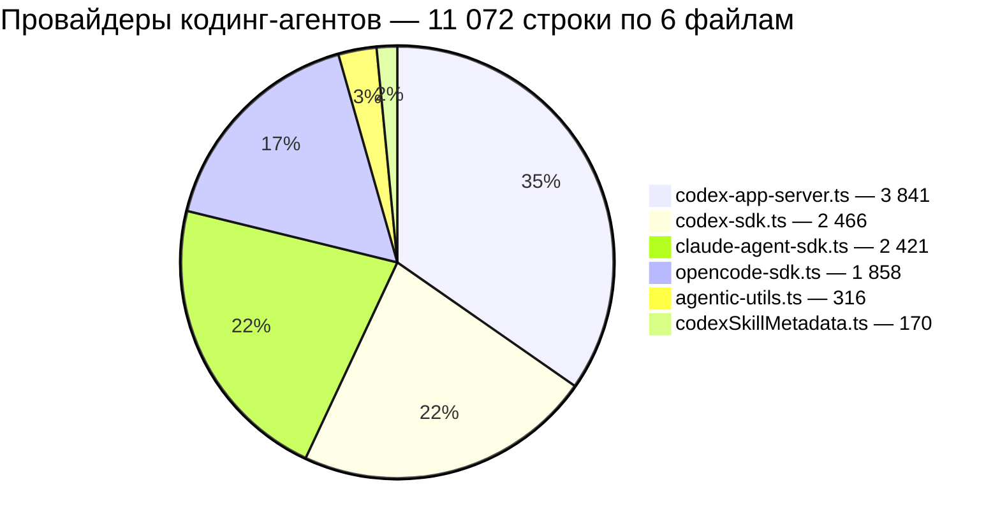
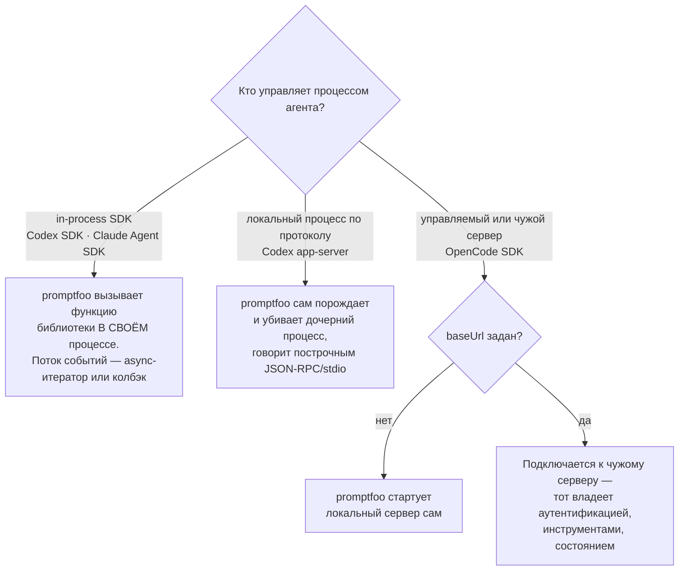
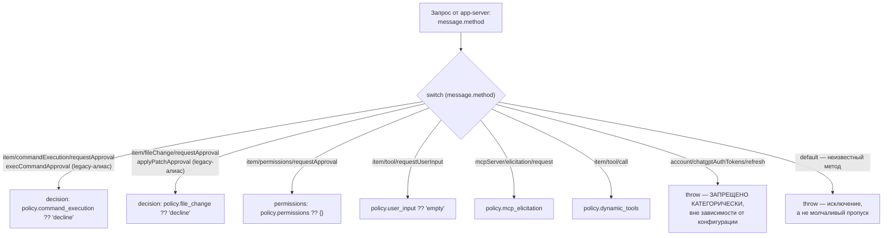
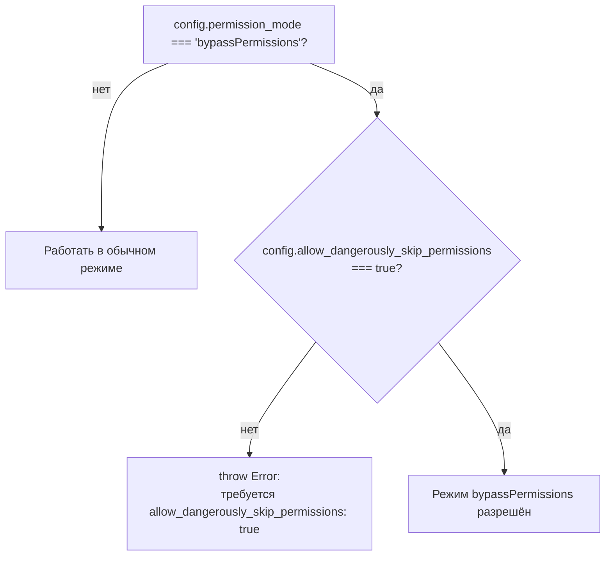

# Провайдеры кодинг-агентов — Codex, Claude Agent SDK, OpenCode

> Разбор через призму **Domain-Driven Design**. Диаграммы — ANSI-псевдографика.
> Дополняет [PROVIDERS.md](PROVIDERS.md), [AGENTS-DOCS.md](AGENTS-DOCS.md),
> [CACHE.md](CACHE.md), [SCHEDULER.md](SCHEDULER.md), [SPINE.md](SPINE.md),
> [ARCHITECTURE.md](ARCHITECTURE.md).
>
> Крупнейший пробел, найденный за весь research ([AGENTS-DOCS.md §3](AGENTS-DOCS.md)):
> 11 072 строки кода, описывающие не «отправить запрос модели», а «управлять
> сессией чужого агентного рантайма». [PROVIDERS.md §6](PROVIDERS.md) верно
> назвал `codex-app-server.ts` крупнейшим файлом подсистемы — здесь наконец
> открыто содержимое.

---

## 0. Паспорт

```
╔══════════════════════════════════════════════════════════════════════════════╗
║  Провайдеры кодинг-агентов — не чат-эндпойнты, а протоколы управления        ║
╠══════════════════════════════════════════════════════════════════════════════╣
║  openai/codex-app-server.ts     3 841   JSON-RPC поверх дочернего процесса   ║
║  openai/codex-sdk.ts            2 466   in-process SDK, потоковая агрегация  ║
║  claude-agent-sdk.ts            2 421   один callApi на ~1000 строк          ║
║  opencode-sdk.ts                1 858   управляемый ИЛИ чужой сервер         ║
║  agentic-utils.ts                 316   общие: обнаружение, кэш, отпечаток   ║
║  openai/codexSkillMetadata.ts     170   эвристика обнаружения скиллов        ║
║  ──────────────────────────────────────────────────────────────────────────  ║
║  ИТОГО                        11 072                                         ║
╠══════════════════════════════════════════════════════════════════════════════╣
║  Тестов ................. 22 262 строки   отношение 2.01 : 1                 ║
║    openai-codex-app-server.test.ts ....... 6 303   больше самого файла       ║
║    codex-sdk (все файлы) .................. 4 429                            ║
║    claude-agent-sdk ........................ 7 581                           ║
║    opencode-sdk ............................ 2 684                           ║
║    agentic-utils ............................. 356                           ║
╠══════════════════════════════════════════════════════════════════════════════╣
║  Источники .............. docs/agents/coding-agent-provider-taxonomy.md,     ║
║                           docs/agents/codex-app-server-provider-notes.md     ║
║  Глубина этого разбора ... структурная карта всех 6 файлов + прицельное      ║
║                           чтение критичных для безопасности узлов;           ║
║                           НЕ построчное покрытие 11 072 строк                ║
╚══════════════════════════════════════════════════════════════════════════════╝
```

Тот же объём как Mermaid-диаграмма:



**Своими словами.** Представь двигатель, который разобрали на шесть деталей
и взвесили каждую. Одна деталь — блок цилиндров (`codex-app-server.ts`) —
тянет больше трети всего веса (3 841 из 11 072 строк), потому что именно она
разговаривает с чужим процессом по протоколу и разгребает все его капризы
сама, без посторонней помощи. Три следующие детали (`codex-sdk.ts`,
`claude-agent-sdk.ts`, `opencode-sdk.ts`) весят почти одинаково — это три
разных способа решить одну и ту же задачу разными техниками, и вес у них
сопоставимый не случайно, а потому что задача сопоставимая. А две последние
детали (`agentic-utils.ts`, `codexSkillMetadata.ts`) — это не отдельные
узлы, а общие крепёж и смазка: маленькие по весу, но используемые всеми
остальными деталями сразу.

Отношение тест/код 2.01:1 опровергает молчаливое предположение, которое легко
сделать из самого факта пробела: «раз документы серии сюда не заходили, значит
и разработчики promptfoo тоже недоглядели». Один только тестовый файл
`openai-codex-app-server.test.ts` — 6303 строки — длиннее исходника, который
проверяет.

---

## 1. Единый язык

| Термин | Носитель в коде | Смысл |
| --- | --- | --- |
| **Agentic provider** | `isAgenticProvider()`, `AGENTIC_PROVIDER_IDS` | Провайдер из жёстко заданного списка в `agentic-utils.ts`, синхронизированного с таксономией руками |
| **Runtime boundary** | пять разных `.ts`-файлов | In-process SDK (Codex SDK, Claude Agent SDK) vs управляемый/чужой сервер (OpenCode) vs локальный процесс по JSON-RPC (Codex app-server) |
| **Server request** | `buildServerRequestResponse()` | Сообщение, на которое app-server ждёт ответа-решения от promptfoo — approval, ввод, инструмент |
| **Thread cache key** | `generateThreadCacheKey()` | SHA-256 от 20+ полей конфига — тот же приём, что ключ кэша HTTP (CACHE.md) и ключ пула лимитов (SCHEDULER.md) |
| **Working-dir fingerprint** | `getWorkingDirFingerprint()` | Хеш от mtime каталога и всех файлов внутри — «менялась ли рабочая область с прошлого запуска» |
| **Skill heuristic** | `getCodexSkillRootPrefixes()` | Обнаружение вызова скилла по СОВПАДЕНИЮ ПУТИ команды с известными каталогами скиллов, а не по явному полю протокола |

---

## 2. Одна и та же задача, три разных ответа

```
╔══════════════════════════════════════════════════════════════════════════════╗
║  ГРАНИЦА РАНТАЙМА — где кончается promptfoo и начинается чужой агент         ║
╠══════════════════════════════════════════════════════════════════════════════╣
║                                                                              ║
║  IN-PROCESS SDK                     ЛОКАЛЬНЫЙ ПРОЦЕСС ПО ПРОТОКОЛУ           ║
║  ────────────────────                ────────────────────────────────        ║
║  Codex SDK        @openai/codex-sdk  Codex app-server   spawn('codex',       ║
║  Claude Agent SDK @anthropic-ai/…      ['app-server']) + JSON-RPC/stdio      ║
║                                                                              ║
║  promptfoo вызывает функцию          promptfoo сам порождает и убивает       ║
║  библиотеки в своём процессе.         дочерний процесс, говорит с ним        ║
║  Поток событий — async-итератор       построчным JSON-RPC, разбирает         ║
║  или колбэк внутри JS.                уведомления и отвечает на запросы.     ║
║                                                                              ║
║              УПРАВЛЯЕМЫЙ ИЛИ ЧУЖОЙ СЕРВЕР                                    ║
║              ────────────────────────────                                    ║
║              OpenCode SDK: baseUrl НЕ задан → promptfoo сам стартует         ║
║              локальный сервер. baseUrl задан → подключается к чужому,        ║
║              который «владеет аутентификацией, инструментами, состоянием».   ║
╠══════════════════════════════════════════════════════════════════════════════╣
║  Три ответа на один вопрос таксономии («кто контролирует рантайм?») —        ║
║  и КАЖДЫЙ файл отвечает на него архитектурой, а не конфигурационным флагом.  ║
╚══════════════════════════════════════════════════════════════════════════════╝
```

Та же граница как Mermaid-диаграмма:



**Своими словами.** Есть три разных способа получить чашку кофе, и это
хорошая модель для трёх способов запустить агента. Первый — сварить кофе
самому у себя на кухне: всё происходит в твоих же стенах, ты просто вызываешь
функцию «сварить» и получаешь результат туда же, откуда позвал (in-process
SDK — Codex SDK и Claude Agent SDK работают библиотекой прямо внутри процесса
promptfoo). Второй способ — отправить курьера на конкретную, отдельную
кухню, которую ты сам же и открыл: ты его туда посылаешь, ждёшь, пока он
сварит и вернётся с запиской, а если курьер пропал — сам идёшь разбираться
(Codex app-server порождает дочерний процесс и говорит с ним построчными
сообщениями). Третий способ — зайти в кафе, и тут развилка: если это кафе,
которое ты сам только что открыл специально для этого похода, — ты по сути
управляешь всем сам, просто через прилавок; а если это чужое, уже
работающее заведение по известному адресу — ты полностью полагаешься на
его правила, его персонал и его кассу, и тебе туда лезть не положено
(OpenCode SDK: без указанного адреса стартует свой сервер, с адресом —
подключается к чужому).

Это ровно то наблюдение, которое [PROVIDERS.md §6](PROVIDERS.md) сделало
издалека — «сложность сместилась от отправки запроса к управлению сессией
агента» — не открывая файлы. Теперь видно, ЧЕМ именно она отличается: не
объёмом кода, а тем, что каждый файл решает другую инженерную задачу под
одной вывеской «провайдер».

---

## 3. `codex-app-server.ts` — протокол, спрятанный за одним классом

3841 строка, из которых 2618 — методы одного класса
`OpenAICodexAppServerProvider`. Внутри — почти полная реализация JSON-RPC
клиента и оркестратора турнов.

```
╔══════════════════════════════════════════════════════════════════════════════╗
║  CodexAppServerConnection — низкоуровневый JSON-RPC поверх stdio             ║
╠══════════════════════════════════════════════════════════════════════════════╣
║   constructor → spawn(command, args)                                         ║
║   initialize(config) → handshake                                             ║
║   request(method, params) → Promise, ждёт ответ по id                        ║
║   notify(method, params) → без ответа                                        ║
║   handleLine() → парсинг построчного JSONL, буферизация неполных строк       ║
║   handleMessage() → диспетчер: response или notification                     ║
║   handleProcessFailure() → отклонение ВСЕХ pending-запросов при крахе        ║
║   close({ graceful }) → мягкое завершение или kill                           ║
╚══════════════════════════════════════════════════════════════════════════════╝
```

### Политика ответов на запросы сервера — центральный узел безопасности

`buildServerRequestResponse()` — единственная функция, через которую проходят
**все** решения, требующие суждения: выполнить команду, изменить файл, дать
доступ, ответить на вопрос агента. Десять веток одного `switch`: восемь
принимают решение по политике, девятая отказывает безусловно, десятая —
`default` на неизвестный метод:

```
   switch (message.method) {
     'item/commandExecution/requestApproval'  → { decision: policy.command_execution ?? 'decline' }
     'execCommandApproval'                    → legacy-алиас той же политики
     'item/fileChange/requestApproval'        → { decision: policy.file_change ?? 'decline' }
     'applyPatchApproval'                     → legacy-алиас той же политики
     'item/permissions/requestApproval'       → { permissions: policy.permissions?.permissions ?? {} }
     'item/tool/requestUserInput'             → policy.user_input ?? 'empty'
     'mcpServer/elicitation/request'          → policy.mcp_elicitation
     'item/tool/call'                         → policy.dynamic_tools
     'account/chatgptAuthTokens/refresh'      → throw — ЗАПРЕЩЕНО КАТЕГОРИЧЕСКИ
     default                                  → throw — неизвестный метод, не игнорируется
   }
```

Тот же switch как Mermaid-диаграмма:



**Своими словами.** Представь строгого вахтёра на проходной, у которого на
каждый тип посетителя заведена своя инструкция. Приходит запрос «можно
выполнить команду» — вахтёр смотрит инструкцию, и если в ней ничего не
написано, по умолчанию отвечает «нет», а не «да, конечно» (та же логика
для запроса на изменение файла). Приходит запрос «можно узнать разрешения»
— если инструкции нет, выдаёт пустой список, а не полный доступ. Приходит
просьба «нужен ввод от пользователя» — если инструкции нет, отвечает
«пусто», а не выдумывает ответ за пользователя. Но есть один запрос,
на который вахтёр отвечает «нет» ВСЕГДА, что бы ни было написано в
инструкции, — просьба обновить пропуск-ключ (токен аутентификации): для
него исключений в принципе не предусмотрено. И если приходит гость, тип
которого вообще не описан ни в одной инструкции, — вахтёр не машет рукой
«проходи, наверное всё в порядке», а поднимает тревогу и останавливает всё.
Ни одна калитка в этой проходной не открыта по умолчанию — открыть можно
только ту, для которой явно выписан пропуск.

```
╔══════════════════════════════════════════════════════════════════════════════╗
║  ТРИ РЕШЕНИЯ, КОТОРЫЕ СТОИТ НАЗВАТЬ ПРЯМО                                    ║
╠══════════════════════════════════════════════════════════════════════════════╣
║   1. КАЖДАЯ ветка при отсутствии конфигурации падает в БЕЗОПАСНУЮ СТОРОНУ:   ║
║      ?? 'decline', ?? 'empty' — ни одна не падает в разрешение по умолчанию. ║
║      Подтверждает claim из taxonomy.md: «Default policy should decline,      ║
║      cancel, or return empty answers unless a config opts into side          ║
║      effects.» — но теперь этот claim верифицирован по каждой ветке.         ║
║                                                                              ║
║   2. Обновление токена ChatGPT — единственный запрос, отклоняемый            ║
║      БЕЗУСЛОВНО, вне зависимости от конфигурации. Нет флага, который бы      ║
║      его разрешил. Аутентификационные секреты выведены из-под управления     ║
║      пользовательской политики целиком.                                      ║
║                                                                              ║
║   3. Неизвестный метод протокола — ИСКЛЮЧЕНИЕ, а не тихий no-op.             ║
║      Расширение протокола на стороне Codex без соответствующей ветки         ║
║      здесь сломает вызов явно, а не пропустит запрос без ответа молча.       ║
╚══════════════════════════════════════════════════════════════════════════════╝
```

### Идентичность сессии — тот же приём, что уже видела вся серия

```
   generateThreadCacheKey(connectionKey, promptCacheBasis, config)

   SHA-256 от ДВАДЦАТИ ПОЛЕЙ конфига: working_dir, model, sandbox_mode,
   approval_policy, personality, collaboration_mode, output_schema, …
   → `openai:codex-app-server:thread:${hash}`

   ┌── Тот же идиом, что уже трижды встречался в серии ────────────────────┐
   │  fetch-cache ключ (CACHE.md §3)   — хеш от URL+заголовков+тела        │
   │  rate-limit ключ (SCHEDULER.md §3) — хеш от providerId+ключа+региона  │
   │  thread cache ключ (здесь)         — хеш от всей конфигурации турна   │
   │                                                                       │
   │  Один и тот же принцип на трёх разных уровнях системы: идентичность   │
   │  определяется ХЕШЕМ РЕЛЕВАНТНОГО СОСТОЯНИЯ, а не отдельным полем ID.  │
   └────────────────────────────────────────────────────────────────────────┘
```

Пул потоков ограничен `thread_pool_size` (по умолчанию 1);
`enforceThreadPoolLimit()` вытесняет самый старый неактивный поток циклом
`while (this.threads.size > poolSize)` — простое LRU без отдельной структуры
данных, потому что размер пула по умолчанию — единица.

### Наблюдаемость встроена в сам вызов, не сбоку

`callApi()` целиком обёрнут в `withGenAISpan(buildSpanContext(...), () =>
callApiInternal(...), extractSpanResult)` — трассировка не опциональная
надстройка, а часть сигнатуры главного метода. `startItemSpan` /
`startTurnSpan` создают дочерние спаны на каждый item и каждый турн — та
самая «глубокая трассировка», которую [taxonomy.md §7](AGENTS-DOCS.md)
называет «opt-in when it requires injecting OpenTelemetry env vars into a
child process» — сам факт, что процесс дочерний, а не библиотека,
требует именно инъекции переменных окружения, а не просто вызова API трейсера.

---

## 4. `codex-sdk.ts` — та же граница задач, другая техника решения

In-process SDK не порождает процесс — вместо JSON-RPC-диспетчера здесь
агрегатор потока событий (`handleStreamingEvent`, `handleStreamingItemStarted
/Completed/Updated`), и вместо политики server-запросов — эвристика.

```
╔══════════════════════════════════════════════════════════════════════════════╗
║  Обнаружение скиллов — не факт протокола, а совпадение путей                 ║
╠══════════════════════════════════════════════════════════════════════════════╣
║   getCodexSkillRootPrefixes({ codexHome, gitRepositoryRoot, homeDir,         ║
║                                workingDir })                                 ║
║     → { CODEX_HOME, /etc/codex, ${workingDir}/.agents,                       ║
║          ${gitRoot}/.agents }                                                ║
║                                                                              ║
║   buildCodexSkillMetadata(items, prefixes, { getCommand,                     ║
║                                              isSuccessfulCommand })          ║
║     → для каждого command_execution: путь команды начинается с одного из     ║
║       префиксов? → это вызов скилла. Успешен (exit_code === 0)? →            ║
║       записан в skillCalls, иначе — в attemptedSkillCalls.                   ║
╠══════════════════════════════════════════════════════════════════════════════╣
║   Это ЭВРИСТИКА в буквальном смысле: протокол Codex SDK не сообщает          ║
║   «был вызван скилл X» отдельным полем — вывод делается из совпадения        ║
║   ПУТИ ИСПОЛНЯЕМОЙ КОМАНДЫ с известными каталогами скиллов. taxonomy.md      ║
║   называет это ограничением прямо: «Skill detection is heuristic» —          ║
║   теперь видно, в чём именно эвристика состоит.                              ║
╚══════════════════════════════════════════════════════════════════════════════╝
```

### Рабочая область обязана быть git-репозиторием — если не сказано иначе

```
   validateWorkingDirectory(workingDir, skipGitCheck = false):
     существует? → нет: throw
     это каталог? → нет: throw
     skipGitCheck === false И НЕ внутри git-репозитория? → throw
       «Working directory … is not inside a Git repository.»
```

Умолчание — отказ работать вне git. Агент с доступом к файловой системе,
запущенный над каталогом без версионирования, не оставляет способа
отличить его правки от правок пользователя постфактум. Это тот же
инстинкт «сначала снапшот, потом операция», что red team QA-чеклист
[taxonomy.md §What To Implement Next](AGENTS-DOCS.md) прямо называет
недостающим для side-effect harness — здесь он уже частично реализован
как предпосылка, а не как отдельный инструмент.

---

## 5. `claude-agent-sdk.ts` — двойной затвор на опасный режим

Класс `ClaudeCodeSDKProvider` необычен для этой пятёрки: `callApi()` — один
метод примерно на 1000 строк, а не десятки приватных методов. Внутри —
последовательность проверок конфигурации перед любым обращением к SDK.

```
╔══════════════════════════════════════════════════════════════════════════════╗
║  Приоритет окружения — задокументирован прямо в коде                         ║
╠══════════════════════════════════════════════════════════════════════════════╣
║   // Precedence is documented on the `env` field of ClaudeCodeOptions:       ║
║   // process.env < config.env < EnvOverrides.                                ║
║                                                                              ║
║   Три слоя накатываются последовательно, КАЖДЫЙ следующий перекрывает        ║
║   предыдущий, ключи сортируются для стабильного хеша кэша.                   ║
╚══════════════════════════════════════════════════════════════════════════════╝

╔══════════════════════════════════════════════════════════════════════════════╗
║  bypassPermissions — режим, который нельзя включить одним флагом             ║
╠══════════════════════════════════════════════════════════════════════════════╣
║   if (config.permission_mode === 'bypassPermissions' &&                      ║
║       config.allow_dangerously_skip_permissions !== true) {                  ║
║     throw new Error(                                                         ║
║       "permission_mode 'bypassPermissions' requires                          ║
║        allow_dangerously_skip_permissions: true as a safety measure");       ║
║   }                                                                          ║
║                                                                              ║
║   ДВА независимых переключателя должны совпасть: режим разрешений            ║
║   плюс отдельный булев флаг с говорящим именем. Опечатка или                 ║
║   унаследованный конфиг с одним включённым полем не откроет полный           ║
║   доступ — нужны оба, и имя второго прямо предупреждает, что это опасно.     ║
╚══════════════════════════════════════════════════════════════════════════════╝
```

Тот же затвор как Mermaid-диаграмма:



**Своими словами.** Это как система с двумя ключами для запуска чего-то
по-настоящему опасного, где один человек физически не может повернуть оба
ключа одновременно по ошибке в одиночку. Первый переключатель — обычная
настройка режима разрешений, её легко перепутать или унаследовать из
старого конфига по невнимательности. Если стоит именно опасное значение
этого переключателя, код не соглашается сразу, а требует ВТОРОЕ,
ОТДЕЛЬНОЕ подтверждение — причём имя этого второго флага само по себе
кричит «осторожно, опасно» прямо в тексте настройки. Не совпали оба —
получаешь чёткую ошибку с объяснением, что нужно включить, а не тихий
переход в опасный режим. Совпали оба — значит, это было осознанное,
не случайное решение.

`FS_READONLY_ALLOWED_TOOLS = ['Read', 'Grep', 'Glob', 'LS'].sort()` —
константа с комментарием прямо в объявлении: «sort and export for tests».
Список инструментов, разрешённых при read-only режиме, отсортирован не
случайно — стабильный порядок делает снапшот-тесты детерминированными,
деталь того же класса, что дисциплина случайного порядка тестов в
[TEST-ARCHITECTURE.md](TEST-ARCHITECTURE.md).

---

## 6. `opencode-sdk.ts` — правила разрешений с защитой от чужеродных объектов

```
   convertPermissionConfigToRuleset(config)

     Object.getPrototypeOf(config) not in [Object.prototype, null]
       → throw 'OpenCode permission must be an object mapping tools
                to permission rules'

   Проверка прототипа, а не просто typeof === 'object': объект, созданный
   через Object.create(SomethingElse.prototype) или пришедший из другого
   контекста выполнения (VM, другой реализм), тоже отсеивается. Формально
   избыточная осторожность для пользовательского YAML — но конфиг проходит
   через renderVarsInObject и может быть результатом шаблонизации, а не
   только буквальным литералом.
```

Каждое правило — тройка `{ permission, pattern, action }`, `action` ограничен
строго `'ask' | 'allow' | 'deny'` — типизированное объединение вместо строки,
ошибку в имени действия ловит компилятор, а не runtime.

Управляемый/чужой сервер — развилка на `baseUrl`:

```
   baseUrl НЕ задан → promptfoo стартует локальный сервер сам,
                       владеет его конфигурацией целиком
   baseUrl задан    → warnOnIgnoredBaseUrlConfig() предупреждает,
                       если заданы опции, которые чужой сервер не увидит —
                       конфигурация локального старта молча игнорируется
                       в этом режиме, и провайдер об этом явно сообщает
```

---

## 7. `agentic-utils.ts` — общий язык, явно синхронизированный с документом

```
╔══════════════════════════════════════════════════════════════════════════════╗
║  isAgenticProvider() — список, а не признак по коду                          ║
╠══════════════════════════════════════════════════════════════════════════════╣
║   const AGENTIC_PROVIDER_IDS = [                                             ║
║     'anthropic:claude-agent-sdk', 'anthropic:claude-code',                   ║
║     'openai:codex', 'openai:codex-app-server', 'openai:codex-desktop',       ║
║     'openai:codex-sdk', 'openinterpreter', 'opencode', 'opencode:sdk',       ║
║   ];                                                                         ║
║                                                                              ║
║   /** Keep this list aligned with                                            ║
║       docs/agents/coding-agent-provider-taxonomy.md. */                      ║
║                                                                              ║
║   ЭТО ПРЯМАЯ ССЫЛКА ИЗ КОДА НА ДОКУМЕНТ, КОТОРЫЙ РАЗБИРАЕТ ЭТОТ ДОКУМЕНТ.    ║
║   Пятое семейство таксономии — Open Interpreter (openinterpreter) — здесь    ║
║   присутствует, хотя у него нет отдельного крупного файла в этом разборе:    ║
║   ✔ ПОДТВЕРЖДЕНО — пятая линия таксономии из AGENTS-DOCS.md §3 реальна,      ║
║   просто её провайдер не попал в список пяти файлов выше по объёму.          ║
╚══════════════════════════════════════════════════════════════════════════════╝
```

### Отпечаток рабочей области — тот же идиом хеширования, третий раз в этом документе

```
   getWorkingDirFingerprint(workingDir):
     dirStat.mtimeMs
     + рекурсивный обход файлов, СТОП через 2 секунды (FINGERPRINT_TIMEOUT_MS)
     + stat() КАЖДОГО файла батчами по 32 параллельно, СТОП через те же 2 с
     + сортировка "путь:mtime" для стабильного порядка
     + SHA-256 от всего вместе

   Два НЕЗАВИСИМЫХ таймаута на два прохода (обход дерева, батч-стат) —
   не один общий на всю функцию: долгий обход тысяч мелких файлов и долгий
   stat() тысяч найденных файлов — разные failure mode, каждый со своим
   пределом.
```

Кэш ответа агента ключуется этим отпечатком: если рабочая область не
менялась с прошлого запуска, детерминированный (по конфигу) прогон агента
можно не повторять. Это ответ на пункт «Session persistence and cleanup»
из чек-листа `taxonomy.md` — не абстрактный принцип, а конкретный механизм
с именем и таймаутом.

---

## 8. Честная граница разбора

```
╔══════════════════════════════════════════════════════════════════════════════╗
║  ЧТО ПРОЧИТАНО ПРИЦЕЛЬНО                 ЧТО НЕ ОТКРЫВАЛОСЬ                  ║
╠══════════════════════════════════════════════════════════════════════════════╣
║  ✔ Структурная карта всех 6 файлов —     ✘ Полная логика каждого из ~90      ║
║    каждый export, каждый метод класса      приватных методов                 ║
║    поимённо                                                                  ║
║                                                                              ║
║  ✔ buildServerRequestResponse() —        ✘ handleStreamingEvent и цепочка    ║
║    все 10 веток, включая default          обработчиков item-событий          ║
║                                            построчно (см. §4, Streaming)     ║
║  ✔ Механизмы идентичности сессии         ✘ MCP-конфигурация и кэширование    ║
║    (thread cache key, working-dir           MCP-соединений (все три файла    ║
║    fingerprint) — с формулами               заявляют поддержку MCP)          ║
║                                                                              ║
║  ✔ Оба затвора опасных режимов           ✘ buildDynamicToolResponse,         ║
║    (Claude bypassPermissions,               buildMcpElicitationResponse —    ║
║    OpenCode permission ruleset)             прочитаны сигнатуры, не тела     ║
╠══════════════════════════════════════════════════════════════════════════════╣
║  Это НЕ то же самое покрытие, что PROVIDERS.md даёт классическим             ║
║  чат-провайдерам, или что REDTEAM.md даёт плагинам red team. Документ        ║
║  закрывает архитектурный пробел («что здесь вообще происходит и как»),       ║
║  не построчный аудит 11 072 строк.                                           ║
╚══════════════════════════════════════════════════════════════════════════════╝
```

---

## Диагноз

```
╔══════════════════════════════════════════════════════════════════════════════╗
║                     ДИАГНОЗ провайдеров кодинг-агентов                       ║
╠══════════════════════════════════════════════════════════════════════════════╣
║  СИЛЬНЫЕ СТОРОНЫ                                                             ║
║                                                                              ║
║  ✔ buildServerRequestResponse() безопасен по умолчанию в каждой из восьми    ║
║    веток без исключения, и девятая — категорический запрет обновления        ║
║    токена аутентификации, не подчиняющийся пользовательской конфигурации.    ║
║                                                                              ║
║  ✔ Неизвестный протокольный метод — исключение, а не молчаливый пропуск.     ║
║    Расширение протокола Codex не пройдёт незамеченным.                       ║
║                                                                              ║
║  ✔ Опасный режим Claude Agent SDK заперт на два независимых переключателя,   ║
║    один из которых называется dangerously в самом имени поля.                ║
║                                                                              ║
║  ✔ Рабочая область по умолчанию обязана быть git-репозиторием — снапшот      ║
║    состояния существует до того, как агент получит доступ на запись.         ║
║                                                                              ║
║  ✔ Один и тот же идиом («хешируй релевантное состояние → детерминированный   ║
║    ключ») применён трижды на трёх разных уровнях: HTTP-кэш (CACHE.md),       ║
║    лимиты (SCHEDULER.md), сессии агентов (здесь) — согласованность           ║
║    архитектурного стиля через независимо написанные подсистемы.              ║
║                                                                              ║
║  ✔ agentic-utils.ts содержит ПРЯМУЮ ссылку из кода на docs/agents/, а не     ║
║    только наоборот — редкий случай двусторонней синхронизации кода           ║
║    и документации, а не документации, угадывающей код задним числом.         ║
║                                                                              ║
║  ✔ Тест/код 2.01:1 — один файл теста длиннее файла, который он проверяет.    ║
╠══════════════════════════════════════════════════════════════════════════════╣
║  СЛАБЫЕ МЕСТА                                                                ║
║                                                                              ║
║  ✘ Пять из шести файлов не имеют собственного построчного разбора нигде      ║
║    в серии — этот документ закрывает архитектурную форму, не покрытие.       ║
║                                                                              ║
║  ✘ AGENTIC_PROVIDER_IDS — статический список, синхронизируемый ВРУЧНУЮ.      ║
║    Комментарий просит держать в согласии с таксономией, но ничто в CI        ║
║    не проверяет рассинхронизацию — тот же класс риска, что allowlist         ║
║    слоя app в APP.md ([PACKAGES-CROSSCHECK.md §4](PACKAGES-CROSSCHECK.md)).  ║
║                                                                              ║
║  ✘ claude-agent-sdk.ts: callApi на ~1000 строк одним методом — резкий        ║
║    контраст с декомпозицией на полсотни приватных методов у остальных        ║
║    четырёх файлов пятёрки.                                                   ║
║                                                                              ║
║  ✘ Единый кросс-провайдерный `metadata.agent` из taxonomy.md §What To        ║
║    Implement Next — открытый пункт роадмапа, ещё не реализован; у каждого    ║
║    провайдера свой namespace метаданных (metadata.codexAppServer и т.п.).    ║
╚══════════════════════════════════════════════════════════════════════════════╝
```

### Оценка по осям

```
  Безопасные умолчания          █████████░   9/10   decline/empty без исключений
  Защита опасных режимов        █████████░   9/10   двойные затворы, явные throw
  Согласованность идиомов       █████████░   9/10   хеш состояния — трижды в системе
  Покрытие тестами              █████████░   9/10   2.01:1, один тест длиннее файла
  Синхронизация код↔документация ███████░░░   7/10   ссылка есть, проверки в CI нет
  Единообразие структуры        ██████░░░░   6/10   один файл резко отличается формой
  Глубина ЭТОГО разбора          ████░░░░░░   4/10   архитектура понята, не построчно
  ─────────────────────────────────────────────────────────────────────────────
  ИНТЕГРАЛЬНО                   ████████░░   7.6/10
```

Оценка «глубина этого разбора» намеренно низкая — она измеряет честность
документа о собственной границе, а не качество кода promptfoo. Остальные
семь осей говорят о самом коде: он написан со вниманием к безопасности
по умолчанию, сопоставимым с лучшими образцами серии.

---

## Рекомендации по эволюции

1. **Фитнес-функция на синхронизацию `AGENTIC_PROVIDER_IDS`.** По образцу
   `providerRedteamBoundary.test.ts` из [TEST-ARCHITECTURE.md](TEST-ARCHITECTURE.md):
   сверить список в `agentic-utils.ts` с таблицей provider ID в
   `coding-agent-provider-taxonomy.md` автоматически, а не полагаться на
   комментарий-просьбу.

2. **Реализовать единую `metadata.agent`-схему** из открытого пункта роадмапа
   источника. Сейчас кросс-провайдерные ассерты невозможны без знания
   namespace конкретного провайдера — ровно та проблема, которую источник
   формулирует как Open Question №1.

3. **Отдельный документ на `handleServerRequest`-семейство целиком**, если
   потребуется глубина: `buildDynamicToolResponse`, `buildMcpElicitationResponse`,
   `buildUserInputResponse` — три функции, определяющие поведение при MCP
   и динамических инструментах, прочитаны только по сигнатуре в этом разборе.

4. **Проверить, оправдан ли монолитный `callApi` в claude-agent-sdk.ts**
   структурно, или это исторический долг относительно декомпозиции, принятой
   в остальных четырёх файлах. Резкий контраст сам по себе не дефект, но
   заслуживает объяснения в комментарии, если он намеренный.

---

## Карта

```
src/providers/
├── agentic-utils.ts .................................... 316
│     AGENTIC_PROVIDER_IDS            ссылается на docs/agents/…taxonomy.md
│     isAgenticProvider · resolveAgenticWorkingDir
│     getWorkingDirFingerprint        два независимых таймаута
│     AgenticCacheOptions · initializeAgenticCache
│     getCachedResponse · cacheResponse
│
├── claude-agent-sdk.ts ................................ 2 421
│     FS_READONLY_ALLOWED_TOOLS       отсортирован, «for tests»
│     ClaudeCodeOptions               382..1335
│     class ClaudeCodeSDKProvider     :1335
│       callApi                       :1388  ~1000 строк, монолит
│         env-precedence: process.env < config.env < EnvOverrides
│         bypassPermissions — двойной затвор
│
├── opencode-sdk.ts .................................... 1 858
│     convertPermissionConfigToRuleset :654  защита от чужого прототипа
│     class OpenCodeSDKProvider        :833
│       buildServerConfig · warnOnIgnoredBaseUrlConfig
│       callApi                        :1730
│
├── openai/
│   ├── codex-sdk.ts .................................. 2 466
│   │     class OpenAICodexSDKProvider :648
│   │       handleStreamingEvent/ItemStarted/Completed/Updated
│   │       validateWorkingDirectory   git-репозиторий обязателен
│   │       buildSkillMetadata → codexSkillMetadata.ts
│   │
│   ├── codex-app-server.ts ........................... 3 841   ◄── крупнейший
│   │     class CodexAppServerConnection      :829   JSON-RPC/stdio клиент
│   │     class OpenAICodexAppServerProvider  :1223
│   │       callApi                            :1318
│   │       buildServerRequestResponse         :2867  ← ЦЕНТР БЕЗОПАСНОСТИ
│   │       generateThreadCacheKey             SHA-256 от 20+ полей
│   │       enforceThreadPoolLimit              LRU-вытеснение
│   │
│   └── codexSkillMetadata.ts ........................... 170
│         getCodexSkillRootPrefixes   CODEX_HOME · /etc/codex · .agents/
│         buildCodexSkillMetadata     эвристика по пути команды

Источники:
    docs/agents/coding-agent-provider-taxonomy.md ...... 566   7 осей, 5 семейств
    docs/agents/codex-app-server-provider-notes.md ..... 576   протокол целиком

Связанные документы серии:
    PROVIDERS.md §6 ...... верно назвал размер, не открыл содержимое
    AGENTS-DOCS.md §3 ..... обнаружил пробел, подтвердил provider ID в реестре
    CACHE.md §3 · SCHEDULER.md §3 ..... тот же идиом хеширования состояния
    TEST-ARCHITECTURE.md .. providerRedteamBoundary.test.ts как образец
                             для рекомендации №1
```

---

## Команды

```bash
# Объём кода и тестов
wc -l src/providers/agentic-utils.ts src/providers/claude-agent-sdk.ts \
      src/providers/opencode-sdk.ts src/providers/openai/codex-sdk.ts \
      src/providers/openai/codex-app-server.ts src/providers/openai/codexSkillMetadata.ts

# ГЛАВНОЕ: политика ответов на запросы app-server
grep -n -A30 "private buildServerRequestResponse" src/providers/openai/codex-app-server.ts

# Список агентных провайдеров и его связь с документацией
grep -n -B3 "AGENTIC_PROVIDER_IDS" src/providers/agentic-utils.ts

# Двойной затвор Claude Agent SDK
grep -n -B2 -A4 "allow_dangerously_skip_permissions !== true" src/providers/claude-agent-sdk.ts

# Требование git-репозитория для рабочей области
grep -n -A5 "is not inside a Git repository" src/providers/openai/codex-sdk.ts

# Эвристика обнаружения скиллов
cat src/providers/openai/codexSkillMetadata.ts

# Все provider ID, зарегистрированные для семейства
grep -n "codex-app-server\|claude-agent-sdk\|opencode\|codex-sdk\|codex-desktop\|claude-code\|openinterpreter" \
  src/providers/registry.ts

# Тесты
npx vitest run test/providers/openai-codex-app-server.test.ts \
  test/providers/claude-agent-sdk.test.ts test/providers/opencode-sdk.test.ts
```

---

*Документ описывает провайдеров кодинг-агентов на коммите `2c140ef`,
promptfoo 0.122.0. Дата среза — 29 августа 2026.*
