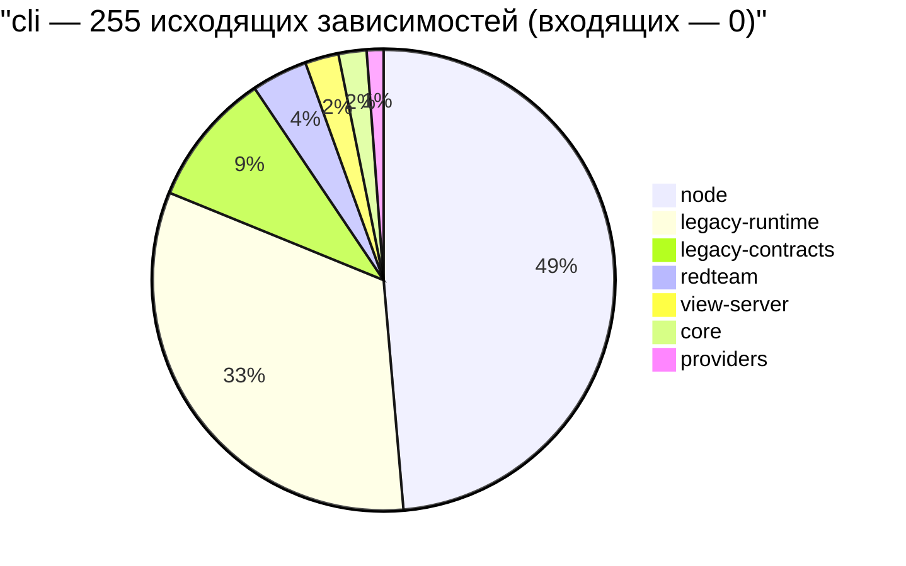
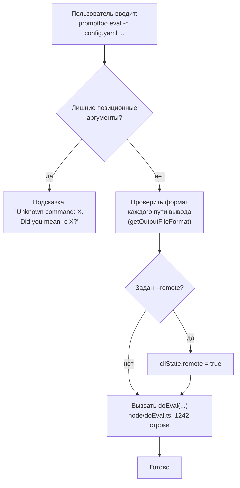
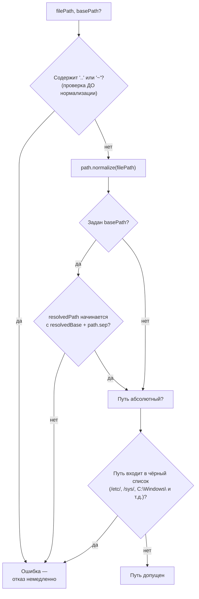

# Командный интерфейс — `src/commands`

> Разбор через призму **Domain-Driven Design**. Диаграммы — ANSI-псевдографика.
> Дополняет [ARCHITECTURE.md](./ARCHITECTURE.md), [EVALUATOR.md](./EVALUATOR.md),
> [TYPES.md](./TYPES.md), [UTIL.md](./UTIL.md), [SCHEDULER.md](./SCHEDULER.md),
> [PROMPTS.md](./PROMPTS.md), [MATCHERS.md](./MATCHERS.md),
> [ASSERTIONS.md](./ASSERTIONS.md), [PROVIDERS.md](./PROVIDERS.md),
> [REDTEAM.md](./REDTEAM.md), [SERVER.md](./SERVER.md), [APP.md](./APP.md).

---

## 0. Паспорт подсистемы

```
╔══════════════════════════════════════════════════════════════════════════════╗
║  CLI CONTEXT — оболочка домена для человека и для другого агента             ║
╠══════════════════════════════════════════════════════════════════════════════╣
║  Слой в layers.json     cli (ярус 8 из 11)                                   ║
║  Корни слоя             main.ts · entrypoint.ts · localEntrypoint.ts ·       ║
║                         commands/                                            ║
║  Объём                  50 файлов · 11 135 строк                             ║
║  Основа                 Commander.js                                         ║
╠══════════════════════════════════════════════════════════════════════════════╣
║  mcp/          24 файла · 4 960 строк  ← 45 % подсистемы, сервер MCP         ║
║  modelScan.ts             1 115   обёртка внешнего сканера моделей           ║
║  validate.ts                593   проверка конфига и связи с мишенью         ║
║  import.ts                  553   ·  auth.ts 508  ·  logs.ts 488             ║
║  init.ts                    421   ·  export.ts 246 · share.ts 244            ║
║  eval.ts                    251   ← ГЛАВНАЯ команда, но всего 251 строка     ║
╠══════════════════════════════════════════════════════════════════════════════╣
║  Команд верхнего уровня        24                                            ║
║  Инструментов MCP              14                                            ║
║  Псевдонимов примеров         ~250  (exampleAliases.ts)                      ║
║  Входящих зависимостей          0   ← слой ни от кого не нужен               ║
║  Исходящих зависимостей       255                                            ║
║  Тесты                  45 файлов · 23 426 строк  (в 2,1 раза больше кода)   ║
╚══════════════════════════════════════════════════════════════════════════════╝
```

**Формулировка предметной области в одном предложении.** `src/commands` —
это **оболочка**: она разбирает аргументы, валидирует их, вызывает домен и
переводит результат в код возврата и текст на экране. Собственных доменных
правил у неё нет — и там, где кажется, что есть, это признак протечки.

**Второй потребитель.** Помимо человека у CLI есть второй адресат — другой
ИИ-агент. Подкаталог `mcp/` на 4 960 строк поднимает MCP-сервер с четырнадцатью
инструментами, то есть почти половина подсистемы обслуживает не терминал,
а машинный вызов.

---

## 1. Единый язык подсистемы

| Термин | Носитель в коде | Смысл |
|---|---|---|
| **Command** | `commander` | Команда верхнего уровня или подкоманда. |
| **`<имя>Command(program, …)`** | соглашение файлов | Функция регистрации. Единственный экспорт большинства файлов. |
| **action handler** | `.action(async (…) => …)` | Тело команды. Не бросает — выставляет `process.exitCode`. |
| **defaultConfig** | `main.ts` | Конфиг из `promptfooconfig.yaml`, загруженный до регистрации команд. |
| **setupEnv** | `util/env.ts` | Загрузка `.env` перед работой. |
| **exitCode** | `process.exitCode` | 0 · 1 · 2. Никогда `process.exit()`. |
| **ToolMetadata** | `mcp/lib/toolRegistry.ts:27` | Описание инструмента MCP с подсказками поведения. |
| **ToolAnnotations** | `mcp/lib/toolRegistry.ts:5` | `readOnlyHint` · `destructiveHint` · `idempotentHint` · `longRunningHint`. |
| **EXAMPLE_ALIASES** | `exampleAliases.ts` | Карта старых имён примеров в новые. |

---

## 2. Место подсистемы в архитектуре

```
                     ВХОДЯЩИЕ 0                       ИСХОДЯЩИЕ 255

                                              ┌──124──►  node
                     ┌──────────────┐         │── 83──►  legacy-runtime
       НИКТО  ──────►│     cli      │─────────┤── 24──►  legacy-contracts
                     │  (ярус 8)    │         │── 10──►  redteam
                     └──────────────┘         │──  6──►  view-server
                                              │──  5──►  core
                                              └──  3──►  providers

   ┌──────────────────────────────────────────────────────────────────────┐
   │  ВТОРОЙ ЛИСТ СИСТЕМЫ                                                 │
   │                                                                      │
   │  Как и app (APP.md §2), слой cli не имеет ни одного входящего ребра. │
   │  Его можно вырезать целиком — библиотека и сервер соберутся.         │
   │                                                                      │
   │  Разница между двумя листьями показательна:                          │
   │    app  →  257 исходящих, из них 115 в redteam                       │
   │    cli  →  255 исходящих, из них 124 в node                          │
   │                                                                      │
   │  Браузер тянет ТАКСОНОМИЮ (перечни плагинов и стратегий),            │
   │  терминал тянет РАНТАЙМ (базу, модели, хранилище). Каждый            │
   │  зависит от того слоя, который ему нужен по существу.                │
   └──────────────────────────────────────────────────────────────────────┘

   ⚠  cli — единственный слой, которому разрешён view-server.
      Команда `promptfoo view` поднимает сервер, и это единственная
      причина существования того ребра (SERVER.md §2).
```

Разбивка 255 исходящих зависимостей как Mermaid-диаграмма:



**Своими словами.** Представь склад заказов в конце цепочки поставок —
конечную точку, куда ничего не поступает С ДРУГИХ складов, но которая сама
постоянно заказывает материалы у семи разных цехов завода. Ни один другой
склад не обращается сюда за материалами — значит, этот склад можно закрыть,
и остальной завод продолжит работать как ни в чём не бывало. Но сам склад
активно закупает: почти половину всего, что ему нужно (124 заявки из 255),
он берёт у цеха node — то есть у «рантайма», где живут база данных, модели
и хранилище. Ещё треть заявок (83) уходит в legacy-runtime — туда, где
логгер и мосты в другие языки программирования. Совсем немного заявок идёт
в оставшиеся четыре цеха — redteam, view-server, core, providers — вместе
это меньше десятой части закупок. Показательно сравнение с другим таким же
складом-тупиком, app (веб-интерфейсом): у того почти половина заказов уходит
в redteam, потому что ему нужны каталоги плагинов и стратегий, а не
рантайм. Два тупиковых склада закупают в совершенно разных направлениях,
потому что им по существу нужны разные вещи: одному — витрина возможностей,
другому — работающий механизм.

---

## 3. Договор о команде

`AGENTS.md` подсистемы задаёт правила в форме «делай / не делай». Проверил
соблюдение перебором по всем 50 файлам.

```
 ┌─────────────────────────────────────────────────────────────────────────────┐
 │  ПРАВИЛА И ФАКТИЧЕСКОЕ СОБЛЮДЕНИЕ                                           │
 ├─────────────────────────────────────────────────────────────────────────────┤
 │                                                                             │
 │   ✔ «Всегда logger, НИКОГДА console»                                        │
 │       вызовов console.log/error/warn найдено:  0                            │
 │                                                                             │
 │   ✔ «Не используйте process.exit()»                                         │
 │       вызовов process.exit(  найдено:  0                                    │
 │       (единственное упоминание — в комментарии, объясняющем,                │
 │        почему его здесь избегают ради совместимости MCP)                    │
 │                                                                             │
 │   ✔ «Выставляйте exitCode при ошибках»                                      │
 │       process.exitCode = 1   65 раз                                         │
 │       process.exitCode = 0    5 раз                                         │
 │       process.exitCode = 2    1 раз                                         │
 │                                                                             │
 │   ✔ «Не бросайте в обработчиках действий»                                   │
 │       обработчики ловят и переводят ошибку в exitCode                       │
 │                                                                             │
 │   ~ «Отслеживайте телеметрию»                                               │
 │       telemetry.record('command_used')  19 раз при 24 командах              │
 │       + feature_used ×3 и funnel ×1                                         │
 │       ↑ покрытие неполное, но близкое                                       │
 └─────────────────────────────────────────────────────────────────────────────┘

   ПОЧЕМУ ЗАПРЕЩЁН process.exit()

     process.exit() обрывает процесс НЕМЕДЛЕННО, не дожидаясь сброса
     потоков вывода и не давая отработать обработчикам завершения.
     А в этой системе на завершении висит многое: закрытие писателей
     JSONL, выгрузка спанов OpenTelemetry, освобождение воркеров Python
     и браузерных сессий (EVALUATOR.md §11, PROVIDERS.md §11).

     process.exitCode = 1 задаёт код возврата и позволяет процессу
     завершиться штатно. Разница между «упасть» и «сообщить о неудаче».
```

### 3.1. Единственный код 2

```
   eval.ts, обработка удалённой опции --interactive-providers:

     logger.warn(«Опция удалена. Используйте -j 1 …»)
     process.exitCode = 2

   Код 1 означает «работа выполнена и провалилась», код 2 —
   «работа не начиналась, вы вызвали меня неправильно». Различение
   полезно в сценариях автоматизации, но применено ровно один раз
   на всю подсистему.
```

---

## 4. Тонкая команда, толстый слой ниже

```
 ┌─────────────────────────────────────────────────────────────────────────────┐
 │  eval.ts — 251 строка на главную команду продукта                           │
 ├─────────────────────────────────────────────────────────────────────────────┤
 │                                                                             │
 │   Из них ~190 строк — ОБЪЯВЛЕНИЕ ОПЦИЙ, сгруппированное комментариями:      │
 │     // Core configuration      -c --config                                  │
 │     // Input sources           -a -p -r -t -v --model-outputs               │
 │     // Prompt modification     --prompt-prefix --prompt-suffix --var --tag  │
 │     // Execution control       -j --repeat --delay --no-cache …             │
 │                                                                             │
 │   Обработчик действия делает ровно пять вещей:                              │
 │     1  отбить лишние позиционные аргументы с подсказкой                     │
 │          «Unknown command: X. Did you mean -c X?»                           │
 │     2  проверить формат каждого пути вывода через getOutputFileFormat       │
 │     3  выставить cliState.remote при --remote                               │
 │     4  вызвать doEval(...)                                                  │
 │     5  всё                                                                  │
 │                                                                             │
 │   А сам doEval живёт в node/doEval.ts — 1 242 строки.                       │
 ├─────────────────────────────────────────────────────────────────────────────┤
 │   В конце файла — реэкспорт с объясняющим комментарием:                     │
 │                                                                             │
 │     export { doEval, EvalCommandSchema };                                   │
 │     // «Сохраняем сложившиеся импорты командного модуля, пока               │
 │     //  реализация живёт в слое node.»                                      │
 │                                                                             │
 │   ┌───────────────────────────────────────────────────────────────────┐     │
 │   │  ЭТО ПРАВИЛЬНОЕ РАЗДЕЛЕНИЕ, ЗАФИКСИРОВАННОЕ ЧЕСТНО.               │     │
 │   │  Команда отвечает за разбор аргументов, слой node — за работу.    │     │
 │   │  Заглушка-реэкспорт оставлена ради обратной совместимости         │     │
 │   │  импортов — тот же приём, что при переезде типов в contracts      │     │
 │   │  (TYPES.md §3).                                                    │    │
 │   └───────────────────────────────────────────────────────────────────┘     │
 └─────────────────────────────────────────────────────────────────────────────┘
```

Пять шагов обработчика `eval.ts` как Mermaid-диаграмма:



**Своими словами.** Представь администратора автосервиса, который принимает
машину у клиента. Работа администратора — не чинить машину, а правильно
оформить заказ-наряд. Сначала он смотрит, не сказал ли клиент что-то лишнее
и непонятное — и если да, вежливо переспрашивает: «вы, наверное, имели
в виду вот эту услугу?» (шаг 1). Потом проверяет, в каком формате клиент
хочет получить итоговый акт работ, и сразу отбраковывает неправильный
формат, не дожидаясь, пока это выяснится в конце (шаг 2). Если клиент
отметил в заявке специальную галочку «удалённое обслуживание», администратор
делает пометку в системе (шаг 3). А дальше он передаёт заказ-наряд в цех —
и на этом его работа заканчивается: саму машину чинят не за стойкой
ресепшена, а в цеху, который в пять раз больше по объёму работы, чем весь
ресепшен вместе взятый — 1242 строки против 251 (шаг 4, и «шаг 5 — всё»).
Хорошо здесь то, что администратор честно признаёт: «ремонт — не моя
работа», и даже оставляет клиенту прежнюю квитанцию с адресом ресепшена,
чтобы тот, кто уже привык обращаться сюда, не потерялся — хотя все настоящие
мастера давно переехали в другой цех.

### 4.1. Где договор нарушен

```
   Соотношение «объём команды / объём её реализации» показывает,
   насколько оболочка осталась оболочкой:

     eval.ts          251  →  node/doEval.ts        1 242    ✔ тонкая
     redteam/*.ts   ~170  →  redteam/commands/*    2 860    ✔ тонкая
     view.ts           56  →  server/server.ts        569    ✔ тонкая
     ─────────────────────────────────────────────────────────────
     modelScan.ts   1 115  →  ???                            ✘ ТОЛСТАЯ
     validate.ts      593  →  ???                            ✘ ТОЛСТАЯ
     import.ts        553  →  ???                            ✘ ТОЛСТАЯ
     auth.ts          508  →  ???                            ✘ ТОЛСТАЯ
     logs.ts          488  →  ???                            ✘ ТОЛСТАЯ

   ┌───────────────────────────────────────────────────────────────────────┐
   │  ЧТО ЛЕЖИТ В ЭТИХ ПЯТИ ФАЙЛАХ ПОМИМО РАЗБОРА АРГУМЕНТОВ               │
   │                                                                       │
   │  modelScan.ts   порождение внешнего процесса (spawnModelAudit),       │
   │                 разбор кодов возврата и сигналов, работа с ревизиями  │
   │                 HuggingFace, решение о повторном сканировании,        │
   │                 предупреждения об устаревших опциях                   │
   │                                                                       │
   │  validate.ts    проверка связи с мишенью (testBasicConnectivity),     │
   │                 проверка HTTP-мишени, разбор и показ преобразованного │
   │                 запроса, восемь функций форматирования вывода         │
   │                                                                       │
   │  auth.ts        разрешение команды по организации, выбор старейшей    │
   │                 команды, вход по ключу и через браузер                │
   │                                                                       │
   │  Это доменная логика в оболочке. У неё нет модуля-владельца ниже,     │
   │  поэтому она осела там, где её вызывают.                              │
   └───────────────────────────────────────────────────────────────────────┘
```

---

## 5. Двадцать четыре команды

```
 ┌─────────────────────────────────────────────────────────────────────────────┐
 │  ПОРЯДОК РЕГИСТРАЦИИ в main.ts — сначала главные, потом по алфавиту         │
 ├─────────────────────────────────────────────────────────────────────────────┤
 │                                                                             │
 │   // Main commands                                                          │
 │     eval        основная работа                                             │
 │     init        мастер создания проекта                                     │
 │     view        поднять веб-интерфейс                                       │
 │     mcp         поднять MCP-сервер                                          │
 │     redteam     базовая команда с шестью подкомандами                       │
 │     share       поделиться прогоном                                         │
 │                                                                             │
 │   // Alphabetical order  ← комментарий прямо в коде                         │
 │     auth · cache · code-scans · config · debug · delete · export ·          │
 │     feedback · generate · import · list · logs · optimize ·                 │
 │     retry · scan-model · show · validate                                    │
 │                                                                             │
 │   Разделение на «главные» и «остальные по алфавиту» — приём для             │
 │   вывода --help: пользователь видит частое сверху, редкое ниже.             │
 ├─────────────────────────────────────────────────────────────────────────────┤
 │  ПОДКОМАНДЫ                                                                 │
 │                                                                             │
 │    redteam →  init · generate · run · eval · discover · report · setup ·    │
 │               plugins                                                       │
 │    generate → dataset · assertions · redteam                                │
 │               ↑ redteam generate ДОСТУПНА ПО ДВУМ ПУТЯМ:                    │
 │                 promptfoo generate redteam  и  promptfoo redteam generate   │
 │                 Один и тот же обработчик регистрируется дважды.             │
 ├─────────────────────────────────────────────────────────────────────────────┤
 │  ОБРАБОТКА НЕИЗВЕСТНЫХ ОПЦИЙ — на уровне program                            │
 │                                                                             │
 │    .showHelpAfterError()                                                    │
 │    .showSuggestionAfterError()      ← подсказка похожей команды             │
 │    .on('option:*', …)               ← перечислить неизвестные опции         │
 │                                       поимённо, показать help, exitCode 1   │
 └─────────────────────────────────────────────────────────────────────────────┘
```

### 5.1. Что происходит до регистрации

```
   main.ts, до создания program:

     1  checkForUpdates()               проверка новой версии
     2  runDbMigrations({ suppressBindingErrorLogging: true })
     3  shouldSkipDefaultConfigLoading(argv)
     4  loadDefaultConfig()             ← promptfooconfig.yaml

   ┌───────────────────────────────────────────────────────────────────────┐
   │  КОНФИГ ЗАГРУЖАЕТСЯ ДО РАЗБОРА АРГУМЕНТОВ                             │
   │                                                                       │
   │  Это нужно, потому что значения по умолчанию для опций берутся        │
   │  из конфига:                                                          │
   │                                                                       │
   │    .option('--prompt-prefix <path>', '…',                             │
   │       typeof defaultConfig.defaultTest === 'object'                   │
   │         ? defaultConfig.defaultTest?.options?.prefix                  │
   │         : undefined)                                                  │
   │                                                                       │
   │  То есть приоритет «аргумент важнее конфига» реализован не в теле     │
   │  команды, а в самом объявлении опции: Commander подставит значение    │
   │  из конфига, если аргумент не задан.                                  │
   │                                                                       │
   │  shouldSkipDefaultConfigLoading существует потому, что некоторым      │
   │  командам (например auth или cache) конфиг не нужен, а его загрузка   │
   │  может упасть на чужом сломанном YAML.                                │
   └───────────────────────────────────────────────────────────────────────┘
```

### 5.2. Совместимость имён примеров

```
   exampleAliases.ts — около 250 записей вида

     'bedrock-agents'   →  'amazon-bedrock/agents'
     'claude-vs-gpt'    →  'compare-claude-vs-gpt'
     'cyberseceval'     →  'redteam-cyberseceval'
     'custom-provider'  →  'provider-custom/basic'

   Комментарий объясняет: «Сопоставляет старые имена примеров с новыми
   после реорганизации по категориям. Это гарантирует, что
   npx promptfoo init --example <старое-имя> продолжит работать.»

   Каталог примеров был переименован под схему «категория-название»,
   и вместо того чтобы сломать все ссылки в статьях и обсуждениях,
   заведена карта переадресации. Тот же принцип, что у редиректов
   устаревших маршрутов в веб-интерфейсе (APP.md §4).
```

---

## 6. MCP-сервер: половина подсистемы

```
 ┌─────────────────────────────────────────────────────────────────────────────┐
 │  mcp/  24 файла · 4 960 строк                                               │
 ├─────────────────────────────────────────────────────────────────────────────┤
 │   server.ts               305   поднятие сервера                            │
 │   resources.ts             55   ·  index.ts 50  ·  types.ts 12              │
 │                                                                             │
 │   lib/                  1 174   инфраструктура                              │
 │     toolRegistry.ts       237   реестр с метаданными                        │
 │     resultFormatter.ts    224   приведение результата к виду для агента     │
 │     utils.ts              218   ·  errors.ts 199                            │
 │     performance.ts        185   ·  security.ts 73  ·  types.ts 38           │
 │                                                                             │
 │   tools/                3 364   четырнадцать инструментов                   │
 │     runEvaluation.ts      525   ·  redteamGenerate.ts   386                 │
 │     logs.ts               297   ·  redteamRun.ts        293                 │
 │     generateTestCases.ts  280   ·  testProvider.ts      272                 │
 │     shareEvaluation.ts    268   ·  validatePromptfooConfig.ts 222           │
 │     compareProviders.ts   222   ·  runAssertion.ts      192                 │
 │     generateDataset.ts    177   ·  getEvaluationDetails.ts 139              │
 │     listEvaluations.ts     91                                               │
 └─────────────────────────────────────────────────────────────────────────────┘
```

### 6.1. Подсказки поведения для агента

Главная содержательная находка подраздела: инструменты описывают **не только
сигнатуру, но и характер побочных эффектов**.

```
   interface ToolAnnotations {         // «per MCP spec 2025-03-26»
     readOnlyHint?     не меняет состояние
     destructiveHint?  может выполнить разрушительную операцию
     idempotentHint?   повторный вызов с теми же аргументами даёт тот же эффект
     longRunningHint?  может занять много времени
   }

   Комментарий объясняет назначение: «Эти подсказки помогают ИИ-агентам
   понять поведение инструмента для лучшего принятия решений.»

 ┌─────────────────────────────────────────────────────────────────────────────┐
 │  РАСПРЕДЕЛЕНИЕ ЧЕТЫРНАДЦАТИ ИНСТРУМЕНТОВ                                    │
 ├──────────────────────────────┬──────────────┬───────────┬───────────────────┤
 │  инструмент                  │  категория   │ readOnly  │  longRunning      │
 ├──────────────────────────────┼──────────────┼───────────┼───────────────────┤
 │  list_evaluations            │ evaluation   │    да     │      да           │
 │  get_evaluation_details      │ evaluation   │    да     │      да           │
 │  run_evaluation              │ evaluation   │    НЕТ    │      да           │
 │  share_evaluation            │ evaluation   │    НЕТ    │      да           │
 │  validate_promptfoo_config   │ configuration│    да     │      да           │
 │  test_provider               │ configuration│    да     │      да           │
 │  run_assertion               │ configuration│    да     │      —            │
 │  generate_dataset            │ generation   │    НЕТ    │      —            │
 │  generate_test_cases         │ generation   │    НЕТ    │      —            │
 │  compare_providers           │ generation   │    да     │      —            │
 │  redteam_generate            │ redteam      │    НЕТ    │      —            │
 │  redteam_run                 │ redteam      │    НЕТ    │      —            │
 │  list_logs                   │ debugging    │    да     │      —            │
 │  read_logs                   │ debugging    │    да     │      —            │
 └──────────────────────────────┴──────────────┴───────────┴───────────────────┘

   ┌───────────────────────────────────────────────────────────────────────┐
   │  ЧТО ЭТО ЗНАЧИТ ДЛЯ АРХИТЕКТУРЫ                                       │
   │                                                                       │
   │  Восемь инструментов помечены readOnly — агент может вызывать их      │
   │  свободно. Шесть меняют состояние: запускают прогон, делятся          │
   │  результатом, генерируют данные, ведут редтим.                        │
   │                                                                       │
   │  Ни один не помечен destructive. Это верно: инструментов удаления     │
   │  среди четырнадцати нет вовсе, хотя команда `promptfoo delete`        │
   │  существует. Разрушительные операции намеренно НЕ вынесены в MCP.     │
   │                                                                       │
   │  Реестр служит и второй цели — автогенерации документации:            │
   │  ToolMetadata несёт description, parameters и category.               │
   └───────────────────────────────────────────────────────────────────────┘
```

### 6.2. Собственная проверка путей

```
   mcp/lib/security.ts — 73 строки, validateFilePath и validateProviderId

 ┌─────────────────────────────────────────────────────────────────────────────┐
 │  validateFilePath(filePath, basePath?)                                      │
 ├─────────────────────────────────────────────────────────────────────────────┤
 │                                                                             │
 │   1  ПРОВЕРКА ОБХОДА ДО НОРМАЛИЗАЦИИ                                        │
 │        if (filePath.includes('..') || filePath.includes('~')) → ошибка      │
 │                                                                             │
 │        Комментарий объясняет порядок: «Проверяем попытки обхода ДО          │
 │        нормализации. Это предотвращает обходы вроде /tmp/../etc/passwd,     │
 │        который нормализуется в /etc/passwd.»                                │
 │        ↑ после normalize() строка выглядит невинно — проверять надо до      │
 │                                                                             │
 │   2  path.normalize(filePath)                                               │
 │                                                                             │
 │   3  если задан basePath — проверка вложенности через                       │
 │        resolvedPath.startsWith(resolvedBase + path.sep)                     │
 │        ↑ добавление path.sep закрывает ловушку /foo/bar vs /foo/barista     │
 │                                                                             │
 │   4  ЧЁРНЫЙ СПИСОК СИСТЕМНЫХ КАТАЛОГОВ для абсолютных путей:                │
 │        /etc/ · /sys/ · /proc/ · /var/run/ · /dev/                           │
 │        C:\Windows\ · C:\Program Files\ · C:\ProgramData\                    │
 ├─────────────────────────────────────────────────────────────────────────────┤
 │  ⚠  ЭТО ВТОРАЯ НЕЗАВИСИМАЯ РЕАЛИЗАЦИЯ ПРОВЕРКИ ПУТИ В РЕПОЗИТОРИИ           │
 │                                                                             │
 │     Первая — util/isPathWithinDir.ts (UTIL.md §4), и она устроена иначе:    │
 │                                                                             │
 │       isPathWithinDir        mcp/lib/security                               │
 │       ─────────────────      ────────────────────                           │
 │       realpath (симлинки)    НЕТ разрешения симлинков                       │
 │       path.relative()        startsWith(base + sep)                         │
 │       рекурсия по родителю   —                                              │
 │       —                      запрет '..' и '~' в исходной строке            │
 │       —                      чёрный список системных каталогов              │
 │                                                                             │
 │     Каждая закрывает то, что не закрывает другая. Симлинк внутри            │
 │     разрешённого каталога, указывающий в /etc, пройдёт проверку MCP:        │
 │     строка не содержит '..', а realpath не вызывается.                      │
 └─────────────────────────────────────────────────────────────────────────────┘

   validateProviderId — три допустимые формы:
     /^[a-zA-Z0-9_-]+:[a-zA-Z0-9_.-]+$/     provider:model
     /^[a-zA-Z0-9_/-]+\.(js|ts|py|mjs)$/    путь к файлу
     /^https?:\/\/.+$/                       HTTP-мишень
   Сообщение об ошибке приводит пример правильного формата.
```

Четыре шага `validateFilePath` как Mermaid-диаграмма:



**Своими словами.** Представь охранника на проходной режимного объекта,
который проверяет пропуск ДО того, как пропуск обработает автоматический
сканер, а не после. Это важно: если сначала прогнать документ через
сканер, который «причёсывает» опечатки и сокращения, поддельная запись
вроде «в обход, потом обратно, потом в засекреченный отдел» может после
причёсывания превратиться в невинную строку «засекреченный отдел» — и
автоматика её пропустит. Поэтому первым делом охранник смотрит на СЫРОЙ,
необработанный пропуск: если там прямым текстом написано «в обход» — от
ворот поворот сразу, дальше можно не проверять (шаг 1). Только после
этого документ причёсывают печатью сканера (шаг 2). Если гостю выдан
пропуск с ограничением «только в такое-то крыло здания», охранник
дополнительно проверяет, что причёсанный адрес назначения действительно
начинается с адреса этого крыла, а не с чего-то похожего по написанию
(шаг 3). И напоследок, даже если все предыдущие проверки пройдены,
охранник сверяется со списком помещений, куда вообще никому нельзя —
серверная, архив, кабинет директора — независимо от того, какое крыло
указано в пропуске (шаг 4). Слабое место этой проходной в том, что она не
проверяет, не ведёт ли разрешённая дверь тайным ходом в запретное
помещение — то есть здесь нет проверки на символические ссылки, которая
есть у соседней, независимо построенной проходной в другой части того же
здания.

---

## 7. Диагноз

```
╔═══════════════════════════════════════════════════════════════════════════╗
║  СИЛЬНЫЕ СТОРОНЫ                                                          ║
╠═══════════════════════════════════════════════════════════════════════════╣
║  ✔ Правила из AGENTS.md соблюдаются фактически, а не декларативно:        ║
║    ноль вызовов console, ноль вызовов process.exit на 11 135 строк.       ║
║                                                                           ║
║  ✔ Запрет process.exit обоснован по существу: на завершении процесса      ║
║    висят сброс JSONL, выгрузка спанов и освобождение воркеров.            ║
║                                                                           ║
║  ✔ Слой не имеет входящих зависимостей — второй настоящий лист системы.   ║
║                                                                           ║
║  ✔ Главная команда тонкая: 251 строка объявлений опций против             ║
║    1 242 строк реализации в слое node.                                    ║
║                                                                           ║
║  ✔ Приоритет «аргумент важнее конфига» выражен в объявлении опции,        ║
║    а не в ветвлении внутри обработчика.                                   ║
║                                                                           ║
║  ✔ Инструменты MCP несут подсказки поведения по спецификации, и           ║
║    разрушительные операции в MCP не вынесены вовсе.                       ║
║                                                                           ║
║  ✔ Проверка обхода пути в MCP выполняется ДО нормализации — порядок,      ║
║    который чаще всего путают, здесь объяснён комментарием.                ║
║                                                                           ║
║  ✔ Около 250 псевдонимов примеров сохраняют работоспособность старых      ║
║    ссылок после переименования каталога.                                  ║
║                                                                           ║
║  ✔ Тесты в 2,1 раза объёмнее кода: 23 426 строк в 45 файлах.              ║
╠═══════════════════════════════════════════════════════════════════════════╣
║  СЛАБЫЕ МЕСТА                                                             ║
╠═══════════════════════════════════════════════════════════════════════════╣
║  ✘ Пять команд нарушают собственный договор «оболочка тонкая»:            ║
║    modelScan 1 115 · validate 593 · import 553 · auth 508 · logs 488.     ║
║    В них живёт доменная логика, у которой нет владельца ниже.             ║
║                                                                           ║
║  ✘ Две независимые реализации проверки безопасности пути:                 ║
║    util/isPathWithinDir (симлинки, relative) и mcp/lib/security           ║
║    (запрет '..', чёрный список каталогов). Каждая закрывает то,           ║
║    что пропускает другая; ни одна не закрывает обе угрозы.                ║
║                                                                           ║
║  ✘ MCP занимает 45 % подсистемы и по сути является отдельным              ║
║    приложением: собственные реестр, форматирование результата,            ║
║    обработка ошибок, безопасность и измерение производительности.         ║
║    Его место — рядом с server/, а не внутри commands/.                    ║
║                                                                           ║
║  ✘ Телеметрия покрывает 19 команд из 24.                                  ║
║                                                                           ║
║  ✘ Код возврата 2 использован ровно один раз. Различие «неверный          ║
║    вызов» и «работа провалилась» заявлено, но не проведено                ║
║    последовательно.                                                       ║
║                                                                           ║
║  ✘ eval.ts экспортирует doEval и EvalCommandSchema обратно из слоя        ║
║    node — заглушка ради совместимости импортов. Работает, но              ║
║    маскирует настоящее расположение реализации.                           ║
║                                                                           ║
║  ✘ Одна и та же подкоманда redteam generate регистрируется дважды         ║
║    под двумя путями. Удобно пользователю, но удваивает поверхность        ║
║    поддержки.                                                             ║
╚═══════════════════════════════════════════════════════════════════════════╝
```

### Оценка по осям

```
   Соблюдение договора      ████████████████████░  9/10   console/exit — ноль
   Тонкость оболочки        ████████████░░░░░░░░░  6/10   пять толстых команд
   Изоляция слоя            ████████████████████░  9/10   ноль входящих
   Безопасность             ██████████████░░░░░░░  7/10   две разные проверки пути
   Связность модуля         ██████████░░░░░░░░░░░  5/10   MCP — 45 % объёма
   Совместимость            ████████████████████░  9/10   250 псевдонимов
   Тестируемость            ██████████████████░░░  8/10
```

---

## 8. Рекомендации по эволюции

```
   1 · Вынести mcp/ из commands/.
       Четыре тысячи девятьсот строк с собственным реестром, форматтером,
       обработкой ошибок и модулем безопасности — это отдельное приложение,
       а не команда. Его место рядом с server/ как второй интерфейс
       к домену. В commands/ остаётся только регистрация `mcp`,
       поднимающая его, — по образцу view.ts на 56 строк.

   2 · Свести две проверки пути в одну.
       util/isPathWithinDir дополнить запретом '..' и '~' до нормализации
       и чёрным списком системных каталогов; mcp/lib/security заменить
       на вызов общей функции. Сейчас симлинк в /etc проходит проверку MCP.

   3 · Найти владельцев для доменной логики пяти толстых команд:
         modelScan  →  src/modelAudit/  (порождение процесса, ревизии,
                       решение о повторном сканировании)
         validate   →  src/providers/   (проверка связи с мишенью уже
                       частично живёт там как /api/providers/test)
         auth       →  src/globalConfig/ (разрешение организации и команды)
         logs       →  src/util/logFiles (частично там уже есть)

   4 · Довести телеметрию до всех 24 команд — иначе картина
       использования смещена в пользу тех девятнадцати, что учтены.

   5 · Провести различие кодов возврата последовательно:
         0  успех
         1  работа выполнена и провалилась
         2  неверный вызов (плохие аргументы, удалённая опция)
       Сейчас код 2 — исключение, а не правило.

   6 · Убрать реэкспорт doEval из eval.ts.
       Заглушка выполнила свою задачу при переносе; импорты пора
       перенаправить на node/doEval напрямую, как это сделано
       при переезде типов в contracts.
```

---

## 9. Карта директории

```
src/commands/                 50 файлов · 11 135 строк
│
├── AGENTS.md                       «Do: logger, telemetry, Zod, exitCode»
│                                   «Don't: console, throw, process.exit»
│
├── ── ГЛАВНЫЕ КОМАНДЫ ───────────────────────────────────────────────────
├── eval.ts                    251  ← ТОНКАЯ: опции + вызов node/doEval
├── evalSetup.ts                41  подкоманда eval
├── init.ts                    421  мастер создания проекта
├── view.ts                     56  ← ТОНКАЯ: поднимает server/
├── share.ts                   244  ·  export.ts 246  ·  import.ts 553
│
├── redteam/                   168  init 72 · setup 49 · report 47
│                                   ← ТОНКИЕ: реализация в redteam/commands/
│
├── generate/                  315  dataset 151 · assertions 164
│
├── ── ТОЛСТЫЕ КОМАНДЫ (доменная логика в оболочке) ──────────────────────
├── modelScan.ts             1 115  spawnModelAudit · ревизии HuggingFace ·
│                                   решение о повторном сканировании
├── validate.ts                593  testBasicConnectivity · testHttpProvider ·
│                                   восемь функций форматирования
├── auth.ts                    508  вход по ключу и через браузер ·
│                                   разрешение организации и команды
├── logs.ts                    488  просмотр журналов
│
├── ── ПРОЧИЕ ────────────────────────────────────────────────────────────
├── show.ts                    241  ·  optimize.ts 179  ·  list.ts 156
├── config.ts                  102  ·  debug.ts 88  ·  delete.ts 78
├── retry.ts                    57  ·  cache.ts 44  ·  feedback.ts 11
├── exampleAliases.ts          220  ~250 псевдонимов имён примеров
│
└── mcp/                     4 960  ← 45 % ПОДСИСТЕМЫ, отдельное приложение
    ├── server.ts              305  поднятие сервера MCP
    ├── index.ts                50  ·  resources.ts 55  ·  types.ts 12
    ├── lib/                 1 174
    │   ├── toolRegistry.ts    237  ToolMetadata · ToolAnnotations ·
    │   │                           TOOL_DEFINITIONS (14 записей)
    │   ├── resultFormatter.ts 224  ·  utils.ts 218  ·  errors.ts 199
    │   ├── performance.ts     185  ·  security.ts 73  ·  types.ts 38
    │   └                           ↑ ВТОРАЯ проверка пути в репозитории
    └── tools/               3 364  четырнадцать инструментов
        ├── runEvaluation.ts   525  ·  redteamGenerate.ts   386
        ├── logs.ts            297  ·  redteamRun.ts        293
        ├── generateTestCases  280  ·  testProvider.ts      272
        ├── shareEvaluation    268  ·  validatePromptfooConfig 222
        ├── compareProviders   222  ·  runAssertion.ts      192
        ├── generateDataset    177  ·  getEvaluationDetails 139
        └── listEvaluations     91

СМЕЖНОЕ
  src/main.ts                       регистрация 24 команд, загрузка конфига
  src/entrypoint.ts                 точка входа собранного CLI
  src/localEntrypoint.ts            точка входа для npm run local
  src/node/doEval.ts          1 242 РЕАЛИЗАЦИЯ команды eval
  src/redteam/commands/       2 860 РЕАЛИЗАЦИЯ команд redteam

test/commands/            45 файлов · 23 426 строк
```

---

## 10. Команды

```bash
npm run local -- eval --help          # справка по главной команде
npm run local -- <команда> --verbose  # запуск из исходников
npx vitest run test/commands          # тесты
```

Проверка соблюдения договора:

```bash
grep -rn "console\.\(log\|error\|warn\)" src/commands   # должно быть пусто
grep -rn "process\.exit(" src/commands                  # должно быть пусто
```

Числа из этого документа воспроизводятся так:

```bash
find src/commands -name '*.ts' | xargs cat | wc -l              # 11135
find src/commands/mcp -name '*.ts' | xargs cat | wc -l          # 4960
grep -rhoE "process\.exitCode = [0-9]" src/commands | sort | uniq -c
```

---

*Документ описывает `src/commands` на коммите `2c140ef`, promptfoo 0.122.0.
Дата среза — 26 августа 2026.*
