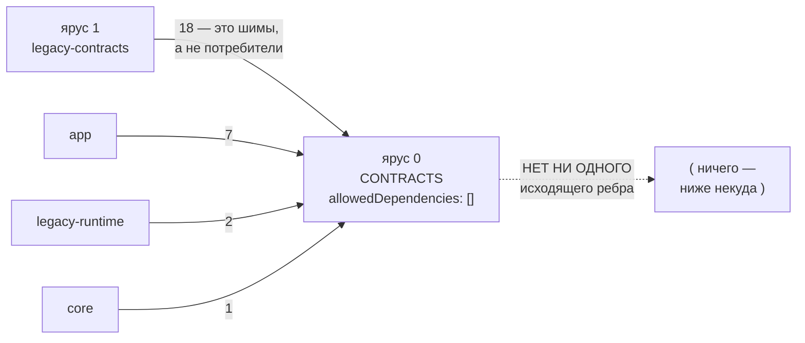
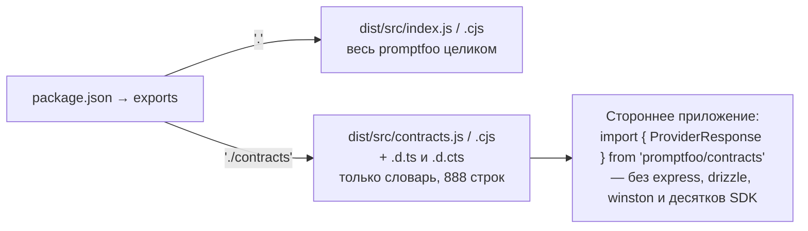
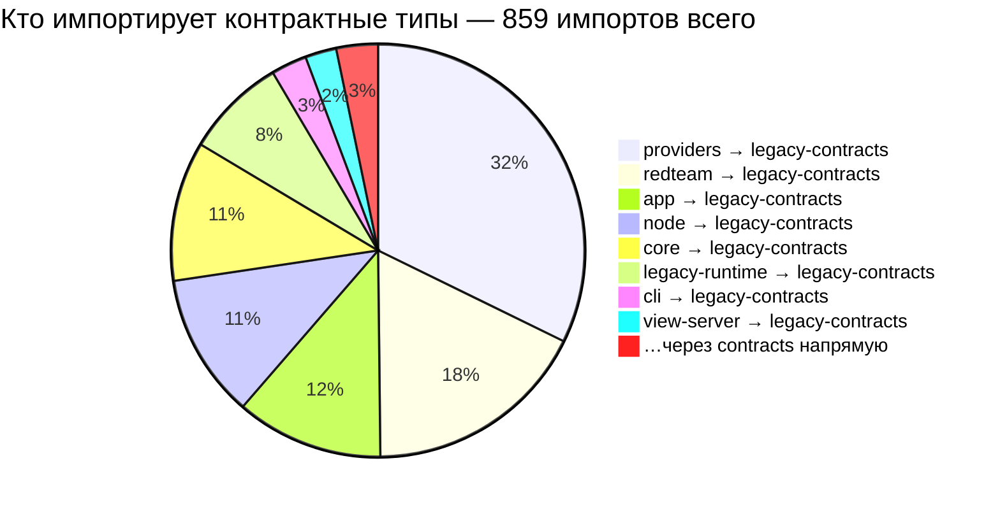
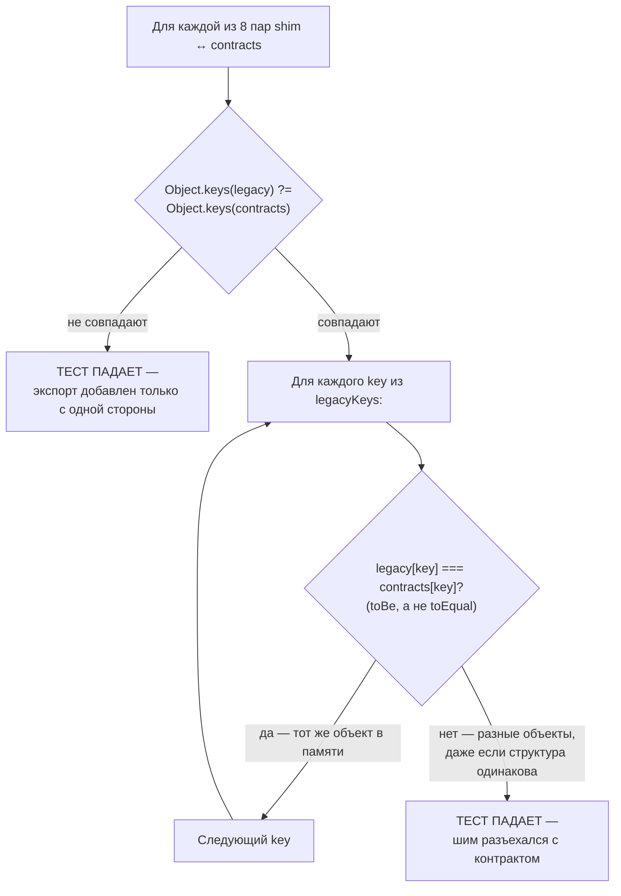

# Опубликованный язык — `src/contracts`

> Разбор через призму **Domain-Driven Design**. Диаграммы — ANSI-псевдографика.
> Дополняет [TYPES.md](TYPES.md), [PROVIDERS.md](PROVIDERS.md), [BLOBS.md](BLOBS.md),
> [ARCHITECTURE.md](ARCHITECTURE.md).
>
> **Это фундамент, на который ссылаются все остальные разборы.** Порядок слоёв
> `tierOrder`, который цитирует каждый документ серии, начинается здесь.

---

## 0. Паспорт подсистемы

```
╔══════════════════════════════════════════════════════════════════════════════╗
║  src/contracts — Published Language в чистом виде                            ║
╠══════════════════════════════════════════════════════════════════════════════╣
║  Файлов ................. 12       + фасад src/contracts.ts (1 строка)       ║
║  Строк .................. 888                                                ║
║  Экспортов .............. 93       45 рантайм-значений + 48 типов            ║
║  Внешних зависимостей ... 1        zod ^4.3.6 — и больше ничего              ║
║  AGENTS.md .............. ЕСТЬ     20 строк, 5 правил                        ║
╠══════════════════════════════════════════════════════════════════════════════╣
║  Слой ................... contracts       tier 0 из 11 — самое дно           ║
║  allowedDependencies .... []              ЕДИНСТВЕННЫЙ слой с пустым списком ║
║  leafLayers ............. ['contracts']   ЕДИНСТВЕННЫЙ лист конституции      ║
║  Исходящих рёбер ........ 0               не зависит ни от чего              ║
║  Входящих рёбер ......... 28              из 859 импортов контрактных типов  ║
╠══════════════════════════════════════════════════════════════════════════════╣
║  Публикуется как ........ promptfoo/contracts   отдельный subpath пакета     ║
║  Форматы ................ ESM + CJS, оба с .d.ts                             ║
╠══════════════════════════════════════════════════════════════════════════════╣
║  Тестов ................. 379 строк                                          ║
║    test/contracts/index.test.ts ............... 331                          ║
║    test/contracts/shimEquivalence.test.ts ......  48   фитнес-функция        ║
║  Плюс test/package-manifests.test.ts — гарантия subpath в package.json       ║
╚══════════════════════════════════════════════════════════════════════════════╝
```

888 строк — меньше одного процента кода `src/`. И при этом это единственный
модуль репозитория, о котором можно сказать: **он не зависит ни от чего**.
Всё остальное в promptfoo стоит на нём.

---

## 1. Единый язык подсистемы

| Термин | Носитель в коде | Смысл в предметной области |
| --- | --- | --- |
| **Published Language** | сам каталог | Словарь, который promptfoo обещает внешнему миру и не ломает без спроса |
| **Leaf layer** | `leafLayers: ['contracts']` | Слой, у которого нет и не может быть исходящих зависимостей |
| **Portable** | правило в `AGENTS.md` | Работает где угодно: без ФС, БД, сервера, SDK провайдеров, телеметрии, CLI |
| **Subpath export** | `promptfoo/contracts` | Отдельная точка входа пакета — можно импортировать, не таща весь promptfoo |
| **Legacy shim** | `src/types/*`, `src/validators/*` | Старые адреса тех же символов; реэкспортируют контракты один в один |
| **Shim equivalence** | `shimEquivalence.test.ts` | Требование референциального равенства: символ обязан быть *тем же объектом* |
| **Narrow schema** | правило в `AGENTS.md` | Узкая Zod-схема для известного контракта; `z.unknown()` — только там, где данные принципиально открытые |
| **Runtime export** | 45 `const`/`function`/`enum` | Zod-схема живёт в рантайме, а не стирается при компиляции — это публичный API |

Разница между **runtime export** и **type export** здесь не техническая
формальность, а граница ответственности. Тип исчезает при компиляции — сломав
его, вы сломаете чужую сборку. Zod-схема остаётся объектом в памяти — сломав
её, вы сломаете чужой продакшен. `AGENTS.md` формулирует это одной строкой:

> Treat every runtime export here as public API.

---

## 2. Место подсистемы в архитектуре: единственный лист

```
              tierOrder ────────────────────────────────────────────────────►
    0              1                 2            3      4         5       6
 CONTRACTS   legacy-contracts   legacy-runtime  node providers redteam  core …
     ▲
     │  src/contracts — здесь, и ниже некуда
     │
 ┌───┴──────────────────────────────────────────────────────────────────────┐
 │  "contracts": { "roots": ["src/contracts", "src/contracts.ts"],          │
 │                 "allowedDependencies": [] }                              │
 │                                                                          │
 │  Пустой список — не упущение, а утверждение. Ни один другой из 11 слоёв  │
 │  не имеет пустого allowedDependencies. И только contracts перечислен     │
 │  в leafLayers.                                                           │
 └───────────────────────────────────────────────────────────────────────────┘

   ВХОДЯЩИЕ РЁБРА — всего 28 импортов
   ┌──────────────────────────────────────────────────────────────────────┐
   │  legacy-contracts → contracts      18    ← это шимы, а не потребители│
   │  app             → contracts        7                                │
   │  legacy-runtime  → contracts        2                                │
   │  core            → contracts        1                                │
   └──────────────────────────────────────────────────────────────────────┘

   ИСХОДЯЩИЕ РЁБРА
   ┌──────────────────────────────────────────────────────────────────────┐
   │                              НЕТ НИ ОДНОГО                           │
   └──────────────────────────────────────────────────────────────────────┘
```

То же положение в конституции слоёв как Mermaid-диаграмма:



**Своими словами.** Представь фундамент дома, у которого физически нет
пола ниже — копать уже некуда, это самый нижний уровень. К такому
фундаменту можно подвести трубы СВЕРХУ, из любой квартиры здания, — и
четыре трубы действительно подведены: этаж легаси (18 труб — но это,
по сути, служебные трубы-переходники, а не настоящие потребители),
интерфейс приложения (7), рантайм (2), ядро (1). А вот вывести трубу ИЗ
фундамента дальше вниз невозможно чисто физически — ниже фундамента
ничего нет. Именно поэтому у фундамента в паспорте здания стоит пустой
список «куда мне разрешено тянуть свои трубы» — не потому что кто-то
поленился его заполнить, а потому что заполнять нечем: это буквально
дно здания, единственный этаж, объявленный листом во всей конструкции.

Ноль исходящих рёбер — это то, чего в promptfoo больше нет нигде. Напомню
контраст из соседних разборов: `legacy-runtime` имеет 203 исходящих импорта,
`providers` — сотни. Здесь ноль, и конституция слоёв запрещает появление
первого.

---

## 3. Что лежит в фундаменте

```
╔══════════════════════════════════════════════════════════════════════════════╗
║  12 ФАЙЛОВ, 93 ЭКСПОРТА                                                      ║
╠══════════════════════════════════════════════════════════════════════════════╣
║                                                                              ║
║  shared.ts               181   Токены, переменные, мультимодальный ввод      ║
║    BaseTokenUsageSchema        учёт токенов — попадает в каждый результат    ║
║    InputTypeSchema             text · pdf · docx · image                     ║
║    InputDefinitionSchema       описание одной входной переменной             ║
║    InputsSchema                имя переменной по /^[a-zA-Z_][a-zA-Z0-9_]*$/  ║
║    VarValue · NunjucksFilterMap                                              ║
║                                                                              ║
║  providers.ts            174   Ответ провайдера — 40+ необязательных полей   ║
║    ProviderResponse            output · raw · error · tokenUsage · cost ·    ║
║                                latencyMs · guardrails · audio · video ·      ║
║                                sessionId · isRefusal · finishReason · …      ║
║    ChatMessage · ModerationFlag · GuardrailResponse · ImageOutput            ║
║    ProviderEmbeddingResponse · ProviderSimilarityResponse                    ║
║                                                                              ║
║  env.ts                  153   ProviderEnvOverridesSchema — строгий z.object ║
║                                перечень переменных окружения провайдеров     ║
║                                                                              ║
║  api/user.ts             152   DTO аккаунта: логин, email, статус, облако    ║
║  api/common.ts            53   MessageResponse · SuccessResponse ·           ║
║                                ErrorResponse — общая форма ответов API       ║
║                                                                              ║
║  prompts.ts               58   Prompt · PromptFunction · PromptConfig ·      ║
║                                MinimalApiProvider                            ║
║  transform.ts             38   TransformContext · TransformFunction          ║
║  validators/prompts.ts    34   PromptSchema · PromptConfigSchema             ║
║  validators/shared.ts     20   NunjucksFilterMapSchema ·                     ║
║                                StringOrFunctionSchema                        ║
║  blobs.ts                 11   BlobRef — ссылка на контентно-адресуемый blob ║
║  traceProviderEndpoint.ts  3   один константный сегмент пути                 ║
║  index.ts                 11   бочка: 10 строк `export *`                    ║
╚══════════════════════════════════════════════════════════════════════════════╝
```

Состав отвечает на вопрос «что именно promptfoo обещает не ломать». Это не
вся модель домена — это её пересечение с внешним миром: **что провайдер
возвращает, что пользователь подаёт на вход, чем настраивается окружение,
как выглядит ответ HTTP-API**.

`ProviderResponse` — самый крупный тип слоя, 98 строк почти сплошь из
необязательных полей. Он и есть настоящая граница системы: любой из 80 с
лишним провайдеров ([PROVIDERS.md](PROVIDERS.md)) заполняет то подмножество,
которое умеет, а ядро оценки читает то, что ему нужно. Цена такой гибкости —
тип, по которому нельзя понять, что придёт на самом деле.

---

## 4. Правило портируемости и чем оно обеспечено

`AGENTS.md` формулирует запрет прямо:

> Keep this layer lightweight and portable: no filesystem, database, server,
> provider SDK, telemetry, or CLI dependencies.

Проверяется это тривиально — достаточно посмотреть, что слой вообще импортирует:

```
   ┌── ВСЕ импорты 12 файлов src/contracts ───────────────────────────────┐
   │                                                                      │
   │     6 ×  from 'zod'          ← единственная внешняя зависимость      │
   │     2 ×  from './shared.js'                                          │
   │     1 ×  from './common.js'     внутренние, между своими файлами     │
   │     1 ×  from './blobs.js'                                           │
   │     1 ×  from '../transform.js'                                      │
   │     1 ×  from '../prompts.js'                                        │
   │                                                                      │
   │  Ни fs, ни path, ни winston, ни drizzle, ни express, ни SDK.         │
   └──────────────────────────────────────────────────────────────────────┘
```

**Правило `.js`-суффиксов** выглядит педантизмом, но выполняет работу:

> Keep `.js` specifiers in `index.ts`; the emitted ESM declarations and runtime
> imports depend on them.

Без расширения Node не разрешит эмитированный ESM. Слой, который обещает
работать «где угодно», обязан быть корректным ESM-модулем — иначе обещание
пустое. Отсюда `export * from './api/common.js'` при исходнике `api/common.ts`.

---

## 5. Опубликованный язык: отдельная дверь в пакет

```
╔══════════════════════════════════════════════════════════════════════════════╗
║  package.json → exports                                                      ║
╠══════════════════════════════════════════════════════════════════════════════╣
║                                                                              ║
║   "."           → dist/src/index.js       весь promptfoo целиком             ║
║                   dist/src/index.cjs                                         ║
║                                                                              ║
║   "./contracts" → dist/src/contracts.js   только словарь, 888 строк          ║
║                   dist/src/contracts.cjs                                     ║
║                   + .d.ts и .d.cts                                           ║
║                                                                              ║
╠══════════════════════════════════════════════════════════════════════════════╣
║  import { ProviderResponse } from 'promptfoo/contracts';                     ║
║                                                                              ║
║  ↑ так стороннее приложение описывает свой провайдер, не устанавливая        ║
║    транзитивно express, drizzle, winston и десятки SDK.                      ║
╚══════════════════════════════════════════════════════════════════════════════╝
```

Те же две двери как Mermaid-диаграмма:



**Своими словами.** Представь книжный магазин, у которого для одной и
той же книги сделаны два разных входа. Через парадную дверь заходишь и
уносишь с собой всё собрание сочинений целиком — весь promptfoo, со всеми
провайдерами, базой данных, сервером (вход `"."`). А сбоку есть отдельная
маленькая дверь, ведущая прямиком в один-единственный шкаф — со словарём
терминов, которым пользуется всё собрание сочинений, и больше ничем
(вход `"./contracts"`). Стороннему разработчику, которому нужно только
знать, как выглядит ответ провайдера, незачем нести из магазина всё
собрание — он заходит через маленькую дверь, берёт словарь и уходит, не
таща на себе тяжеленный шкаф с сервером и базой данных. Обе двери ведут
в один и тот же магазин, но открывают доступ к разным его частям — и это
не случайность оформления витрины, а зафиксированная договорённость:
тест отдельно проверяет, что маленькая дверь на месте, не заперта и не
переименована.

Наличие subpath проверяется тестом — `test/package-manifests.test.ts:99`,
«publishes the lightweight contracts subpath», сверяет все четыре пути
(`import`/`require` × `types`/`default`) с ожидаемыми. То есть удалить
или переименовать точку входа молча нельзя.

Это ровно то, что DDD называет **Published Language**: не просто общая
библиотека типов, а *версионированный, отдельно поставляемый* словарь,
за совместимость которого команда отвечает публично.

---

## 6. Два фундамента: почему их два и какой настоящий

Вот главное, чего не видно ни из одного другого документа серии.

```
╔══════════════════════════════════════════════════════════════════════════════╗
║  СЛОЙ 0 vs СЛОЙ 1 — намерение против факта                                   ║
╠══════════════════════════════════════════════════════════════════════════════╣
║                                                                              ║
║   contracts (tier 0)              legacy-contracts (tier 1)                  ║
║   src/contracts                   src/types  +  src/validators               ║
║   ────────────────────            ─────────────────────────────              ║
║   888 строк, 12 файлов            4968 строк, 34 файла                       ║
║                                                                              ║
║   ВХОДЯЩИХ:      28               ВХОДЯЩИХ:     831                          ║
║   ИСХОДЯЩИХ:      0               ИСХОДЯЩИХ:     36                          ║
║                                                                              ║
║   allowedDependencies: []         allowedDependencies: contracts,            ║
║                                     legacy-runtime, node, providers, redteam ║
╠══════════════════════════════════════════════════════════════════════════════╣
║  Кто на самом деле импортирует контрактные типы (831 из 859 = 96.7%):        ║
║                                                                              ║
║    providers  → legacy-contracts   277    ████████████████████████████████   ║
║    redteam    → legacy-contracts   151    █████████████████                  ║
║    app        → legacy-contracts    99    ███████████                        ║
║    node       → legacy-contracts    97    ███████████                        ║
║    core       → legacy-contracts    94    ██████████                         ║
║    legacy-runtime → …               68    ███████                            ║
║    cli        → legacy-contracts    24    ██                                 ║
║    view-server→ legacy-contracts    21    ██                                 ║
║                                                                              ║
║    … → contracts (напрямую)         28    ███                                ║
╚══════════════════════════════════════════════════════════════════════════════╝
```

Тот же расклад как Mermaid pie-диаграмма:



**Своими словами.** Представь, что в городе построили новую объездную
дорогу специально для того, чтобы грузовики не ехали через центр —
короткую, прямую, без единого светофора (`contracts`, ярус 0). Дорогу
открыли, разметку нанесли, всё готово к использованию. Но сейчас, если
встать и посчитать грузовики, окажется: девяносто шесть из ста всё равно
едут через центр (через `legacy-contracts`), потому что все указатели
в городе — навигаторы, карты, привычные маршруты водителей — по-прежнему
ведут именно туда. Через объездную дорогу проезжает лишь горстка машин —
меньше четырёх из ста. Дорога построена правильно и работает исправно;
проблема не в дороге, а в том, что почти никто ещё не обновил свой
маршрут. Восемь самых загруженных направлений города — от крупнейшего
почтового отделения (`providers`, 277 поездок) до самого маленького
пригорода (`view-server`, 21 поездка) — продолжают ездить старым путём
по привычке.

Читается так: **чистый фундамент построен, но на нём почти никто не стоит**.
96.7% импортов контрактных типов идут через старый адрес.

И это не косметика. Посмотрите на исходящие рёбра старого слоя:

```
   legacy-contracts → contracts        18     вниз, правильно
   legacy-contracts → redteam          11     ▲
   legacy-contracts → legacy-runtime    4     │  ВВЕРХ по tierOrder
   legacy-contracts → node              3     ▼  обратные рёбра
```

Слой, от которого зависят 831 импорт, сам зависит от `redteam`, от рантайма
и от `node`. Это те самые обратные рёбра, которые я считал в
[01-overview-and-core.md §3](01-overview-and-core.md) — 13 рёбер на 183 импорта.
У `contracts` их ноль, и появиться они не могут: пустой `allowedDependencies`
не оставляет места.

Конкретный симптом — `src/types/providers.ts`, шим для крупнейшего
контрактного модуля:

```
import type winston from 'winston';          // ← логгер в «слое контрактов»
import type { MinimalApiProvider } from '../contracts/prompts';
import type { ProviderResponse, … } from '../contracts/providers';
```

Ровно та зависимость, ради избавления от которой `contracts` и заведён.

---

## 7. Фитнес-функция эквивалентности шимов

Пока два адреса сосуществуют, есть риск, который дороже дублирования: они
**разъедутся**. Один и тот же `ProviderResponse` окажется двумя разными
типами, и код, склеивающий их, начнёт врать. Против этого стоит
48-строчный тест.

```
╔══════════════════════════════════════════════════════════════════════════════╗
║  test/contracts/shimEquivalence.test.ts — референциальное равенство          ║
╚══════════════════════════════════════════════════════════════════════════════╝

   Комментарий авторов:
   «The legacy src/types/** and src/validators/** paths re-export the
    src/contracts/** modules. Assert referential equality so a future
    refactor can't accidentally fork the public surface.»

   ┌──────────────────────────────────────────────────────────────────────┐
   │  for (const key of legacyKeys) {                                     │
   │    expect(legacy[key]).toBe(contracts[key]);   ← toBe, НЕ toEqual    │
   │  }                                                                   │
   └──────────────────────────────────────────────────────────────────────┘

   toEqual сравнил бы структуру — и пропустил бы копию.
   toBe требует тот же объект в памяти. Скопировать схему вместо
   реэкспорта теперь невозможно: тест упадёт.

   Плюс проверка состава: Object.keys(legacy) === Object.keys(contracts).
   Экспорт, добавленный только с одной стороны, тоже роняет тест.

   ┌── ПОКРЫТО 8 ПАР ─────────────────────────────────────────────────────┐
   │  api/common · api/user · env · prompts · shared · transform ·        │
   │  validators/prompts · validators/shared                              │
   └──────────────────────────────────────────────────────────────────────┘
```

Логика теста как Mermaid-диаграмма:



**Своими словами.** Представь два паспорта одного человека — оригинал
в сейфе и копию на видном месте, которая должна вести на тот же оригинал,
если её приложить к сканеру. Проверка «выглядит одинаково» здесь не
годится: можно нарисовать поддельную копию, где все буквы и цифры
совпадут один в один с оригиналом, но это будет ДРУГОЙ физический
документ — подделка, которую не отличить на взгляд (это и есть `toEqual`:
сравнение по виду, а не по подлинности). Тест же спрашивает не «выглядит
ли копия так же», а «указывает ли копия на ТОТ ЖЕ САМЫЙ оригинал в
сейфе» (`toBe` — сравнение по физической идентичности объекта в памяти).
Если завтра кто-то тихо подменит копию на похожую, но самостоятельно
нарисованную бумажку вместо честного слепка с оригинала, тест это
немедленно заметит — даже если новая бумажка неотличима на глаз. Перед
этой проверкой тест ещё и сверяет, что в сейфе и на видном месте лежит
одинаковый НАБОР документов: если оригинал завели, а копию забыли —
тест тоже упадёт, ещё до того, как дойдёт до проверки подлинности каждой
отдельной бумаги.

Это редкий случай, когда переходное состояние архитектуры защищено
исполняемой проверкой, а не соглашением. Пока тест зелёный, «два фундамента» —
это два адреса одного фундамента, а не два фундамента.

---

## 8. Три модуля вне гарантии

Из 11 содержательных модулей `contracts` под фитнес-функцией — 8. Оставшиеся
три показательны, и каждый по своей причине.

```
╔══════════════════════════════════════════════════════════════════════════════╗
║  ЧТО НЕ ПОКРЫТО ТЕСТОМ ЭКВИВАЛЕНТНОСТИ                                       ║
╠══════════════════════════════════════════════════════════════════════════════╣
║                                                                              ║
║  providers.ts   174 строки — второй по величине модуль слоя                  ║
║  ─────────────                                                               ║
║    src/types/providers.ts НЕ чистый реэкспорт: он подмешивает свои           ║
║    локальные типы и тянет winston. `export *` тут невозможен, значит         ║
║    и toBe-сверка невозможна.                                                 ║
║    ✘ САМЫЙ КРУПНЫЙ КОНТРАКТ — БЕЗ ГАРАНТИИ ОТ РАСХОЖДЕНИЯ.                   ║
║                                                                              ║
║  blobs.ts        11 строк — BlobRef                                          ║
║  ─────────────                                                               ║
║    Шима не существует вовсе. src/blobs/types.ts импортирует напрямую:        ║
║      import type { BlobRef } from '../contracts/blobs';                      ║
║    ✔ Это ЖЕЛАЕМОЕ конечное состояние: один адрес, сверять нечего.            ║
║                                                                              ║
║  traceProviderEndpoint.ts   3 строки — одна константа пути                   ║
║  ─────────────                                                               ║
║    Импортируется в src/types/index.ts точечно. Риск расхождения              ║
║    для одной строковой константы пренебрежим.                                ║
║    ○ Формально пробел, практически — нет.                                    ║
╚══════════════════════════════════════════════════════════════════════════════╝
```

`blobs.ts` здесь — не дефект, а образец. Он показывает, как выглядит
завершённая миграция: шима нет, потребитель импортирует контракт напрямую,
сверять нечего, потому что адрес один.

---

## Диагноз

```
╔══════════════════════════════════════════════════════════════════════════════╗
║                             ДИАГНОЗ src/contracts                            ║
╠══════════════════════════════════════════════════════════════════════════════╣
║  СИЛЬНЫЕ СТОРОНЫ                                                             ║
║                                                                              ║
║  ✔ Единственный слой с пустым allowedDependencies и единственный лист.       ║
║    Ноль исходящих рёбер — не результат дисциплины, а следствие правила,      ║
║    которое проверяет `npm run architecture:check`.                           ║
║                                                                              ║
║  ✔ Одна внешняя зависимость на весь слой — zod. Портируемость не             ║
║    декларация: она видна в шести строках импортов на 888 строк кода.         ║
║                                                                              ║
║  ✔ Published Language в строгом смысле DDD: отдельный subpath пакета,        ║
║    ESM и CJS, оба с декларациями, и тест, стерегущий сам факт публикации.    ║
║                                                                              ║
║  ✔ Референциальное равенство шимов (toBe, не toEqual) — переходное           ║
║    состояние архитектуры защищено исполняемой проверкой.                     ║
║                                                                              ║
║  ✔ Плотность теста: 379 строк проверок на 888 строк кода, и это без          ║
║    учёта package-manifests и library-exports.                                ║
║                                                                              ║
║  ✔ AGENTS.md формулирует пять правил, включая неочевидное про .js-суффиксы   ║
║    и про «узкие схемы, z.unknown() только где данные открыты по существу».   ║
╠══════════════════════════════════════════════════════════════════════════════╣
║  СЛАБЫЕ МЕСТА                                                                ║
║                                                                              ║
║  ✘ Приняли слой на 3.3%. 28 прямых импортов против 831 через legacy —        ║
║    и из этих 28 восемнадцать делают сами шимы. Настоящих потребителей        ║
║    четыре каталога: tracing, blobs, assertions, app.                         ║
║                                                                              ║
║  ✘ providers.ts — крупнейший контракт после shared.ts — вне фитнес-          ║
║    функции, потому что его шим не чистый и тянет winston.                    ║
║                                                                              ║
║  ✘ Старый фундамент, несущий 96.7% нагрузки, имеет 18 обратных рёбер         ║
║    вверх по tierOrder (redteam 11, legacy-runtime 4, node 3).                ║
║                                                                              ║
║  ✘ ProviderResponse — 40+ необязательных полей без единого обязательного.    ║
║    Тип не сообщает, что придёт; каждый потребитель проверяет сам.            ║
║                                                                              ║
║  ✘ Нет исполняемой проверки самого правила портируемости. Запрет на fs,      ║
║    БД и SDK живёт в AGENTS.md, а не в тесте: первый `import fs` пройдёт      ║
║    architecture:check, потому что конституция слоёв про модули npm молчит.   ║
║                                                                              ║
║  ✘ Нет плана завершения миграции: ни отметок @deprecated на шимах,           ║
║    ни счётчика оставшихся импортов, ни срока.                                ║
╚══════════════════════════════════════════════════════════════════════════════╝
```

### Оценка по осям

```
  Чистота границы              ██████████  10/10   ноль исходящих, пустой список
  Портируемость                █████████░   9/10   одна зависимость; не проверена тестом
  Published Language           █████████░   9/10   subpath, два формата, тест манифеста
  Документированность          ████████░░   8/10   AGENTS.md с неочевидными правилами
  Покрытие тестами             ████████░░   8/10   379 строк на 888; 8 пар из 11
  Защита от расхождения        ███████░░░   7/10   toBe работает, но крупнейший модуль вне
  Выразительность контрактов   █████░░░░░   5/10   ProviderResponse без обязательных полей
  Принятие в кодовой базе      ██░░░░░░░░   2/10   3.3% импортов; миграция стоит
  ─────────────────────────────────────────────────────────────────────────────
  ИНТЕГРАЛЬНО                  ███████░░░   7.3/10
```

Профиль зеркалит профиль [OPTIMIZER.md](OPTIMIZER.md), но по другой оси:
там «сделано правильно, но неудобно», здесь — **«сделано правильно, но
не внедрено»**. Слой спроектирован образцово и почти не используется.

---

## Рекомендации по эволюции

1. **Завести фитнес-функцию портируемости.** Тест, который читает импорты всех
   файлов `src/contracts/**` и падает на любом модуле, кроме `zod` и
   относительных путей. Сейчас правило держится на внимательности ревьюера;
   пять строк на `fs.readdirSync` + regexp переводят его в разряд проверяемых.

2. **Сделать `src/types/providers.ts` чистым шимом.** Локальные типы, ради
   которых он тянет `winston`, вынести в отдельный файл — тогда `export *`
   станет возможен, и крупнейший контракт войдёт под `toBe`-гарантию.
   Это единственный пункт списка, который закрывает сразу два слабых места.

3. **Пометить шимы `@deprecated` с указанием нового адреса.** IDE начнёт
   подсказывать при каждом импорте, и миграция пойдёт сама собой, без
   отдельной кампании.

4. **Считать прогресс миграции в CI.** Одна строка в `architecture:check`:
   доля импортов `contracts` от суммы `contracts + legacy-contracts`.
   Сейчас 3.3%. Число, которое видно на каждом PR, двигается; число, которого
   никто не считает, стоит.

5. **Разделить `ProviderResponse` на обязательное ядро и расширения.**
   Хотя бы `output | error` как размеченное объединение: сейчас тип
   допускает ответ, где нет ни того, ни другого, и каждый потребитель
   пишет свою проверку.

6. **Дать `traceProviderEndpoint.ts` и `blobs.ts` место в барреле осознанно.**
   `blobs` уже импортируют напрямую в обход `index.ts` — стоит решить,
   это норма или обход, и записать решение в `AGENTS.md`.

---

## Карта директории

```
src/contracts/
├── AGENTS.md ...................................... 20   пять правил слоя
├── index.ts ....................................... 11   бочка, 10 × export *
│
├── shared.ts ..................................... 181
│     CompletionTokenDetailsSchema · BaseTokenUsageSchema
│     InputTypeSchema · InputConfigSchema · InputDefinitionSchema
│     InputsSchema · VarValue · NunjucksFilterMap
│
├── providers.ts .................................. 174   ✘ вне shimEquivalence
│     ProviderResponse (98 строк) · ChatMessage · ModerationFlag
│     GuardrailResponse · ImageOutput · ProviderEmbeddingResponse
│     ProviderSimilarityResponse · ProviderClassificationResponse
│
├── env.ts ........................................ 153
│     ProviderEnvOverridesSchema (строгий z.object) · EnvOverrides
│
├── api/
│   ├── user.ts ................................... 152
│   │     EmailStatusEnum · Login/Logout · UpdateUser · CloudConfig
│   └── common.ts .................................. 53
│         MessageResponse · SuccessResponse · ErrorResponse · EmailSchema
│
├── prompts.ts ..................................... 58
│     Prompt · PromptFunction · PromptConfig · MinimalApiProvider
├── transform.ts ................................... 38
│     TransformContext · TransformFunction · isTransformFunction
│
├── validators/
│   ├── prompts.ts ................................. 34
│   └── shared.ts .................................. 20
│
├── blobs.ts ....................................... 11   ○ шима нет — так и надо
└── traceProviderEndpoint.ts ........................ 3   ○ одна константа

Связанные файлы вне каталога:
    src/contracts.ts ................................ 1   фасад subpath
    src/types/*, src/validators/* ................ 4968   legacy-contracts, 34 файла
    test/contracts/index.test.ts .................. 331
    test/contracts/shimEquivalence.test.ts ......... 48   фитнес-функция
    test/package-manifests.test.ts:99 ................... гарантия subpath
    architecture/layers.json ............................ tier 0, leafLayers
```

---

## Команды

```bash
# Состав и объём слоя
find src/contracts -name '*.ts' | xargs wc -l | sort -rn

# Экспорты: рантайм против типов
grep -rhcE '^export (const|function|enum) ' src/contracts/
grep -rhcE '^export (type|interface) ' src/contracts/

# ГЛАВНОЕ: что слой импортирует (ожидается только zod и относительные пути)
grep -rhE "^import .* from '" src/contracts/ | grep -oE "from '[^']+'" | sort | uniq -c

# Положение в конституции слоёв
python3 -c "import json;d=json.load(open('architecture/layers.json'));print([l for l in d['layers'] if l['name']=='contracts'], d['leafLayers'])"

# Соотношение принятия: contracts против legacy-contracts
python3 -c "
import json;b=json.load(open('architecture/edge-baseline.json'))
c=sum(v for k,v in b.items() if k.endswith('-> contracts'))
l=sum(v for k,v in b.items() if k.endswith('-> legacy-contracts'))
print(f'contracts {c} / legacy-contracts {l} = {c/(c+l)*100:.1f}%')"

# Кто импортирует контракты напрямую
grep -rl "contracts/" src/ | grep -E '\.tsx?$' | grep -v '^src/contracts'

# Штатная валидация слоя (из AGENTS.md)
npx vitest run test/contracts test/package-manifests.test.ts \
  test/integration/library-exports.integration.test.ts
npm run tsc

# Проверка конституции слоёв
npm run architecture:check
```

---

*Документ описывает `src/contracts` на коммите `2c140ef`, promptfoo 0.122.0. Дата среза — 26 августа 2026.*
