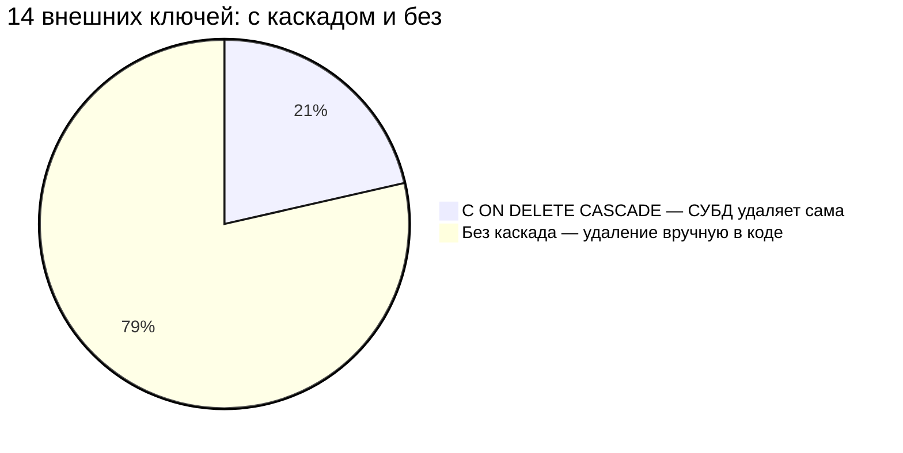
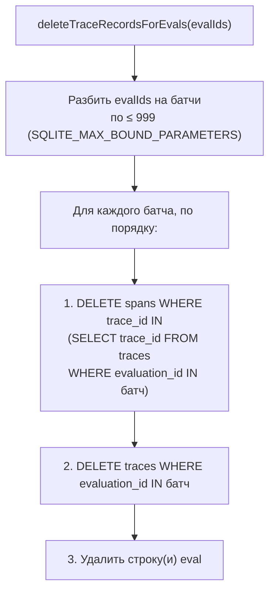
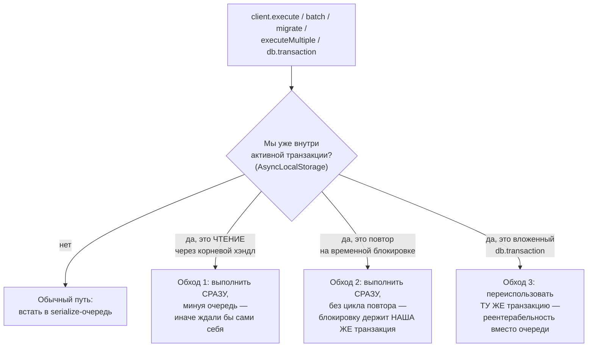
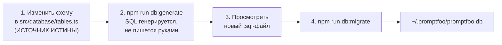

# Слой персистентности — `src/database`

> Разбор через призму **Domain-Driven Design**. Диаграммы — ANSI-псевдографика.
> Дополняет [MODELS.md](MODELS.md), [BLOBS.md](BLOBS.md), [TRACING.md](TRACING.md),
> [NODE.md](NODE.md), [SERVER.md](SERVER.md), [ARCHITECTURE.md](ARCHITECTURE.md).
>
> MODELS.md разбирает агрегат `Eval` как границу транзакции. Здесь — схема,
> соединение и миграции, на которых этот агрегат лежит.

---

## 0. Паспорт подсистемы

```
╔══════════════════════════════════════════════════════════════════════════════╗
║  src/database — SQLite/libSQL: схема, соединение, согласованность            ║
╠══════════════════════════════════════════════════════════════════════════════╣
║  Файлов ................. 5                                                  ║
║  Строк .................. 1398                                               ║
║  AGENTS.md .............. ЕСТЬ    42 строки — один из самых содержательных   ║
╠══════════════════════════════════════════════════════════════════════════════╣
║  Таблиц в схеме ......... 15      tables.ts                                  ║
║  Внешних ключей ......... 14      активных; с ON DELETE CASCADE — 3          ║
║  Файлов миграций ........ 26      drizzle/0000 … drizzle/0025                ║
╠══════════════════════════════════════════════════════════════════════════════╣
║  Слой ................... node    tier 3 (вместе с util, models, cache.ts)   ║
║  Потребителей ........... 11 каталогов src/                                  ║
║    server 5 · models 5 · commands 5 · util 3 · app 3 ·                       ║
║    tracing · redteam · node · blobs · migrate.ts · mainUtils.ts              ║
╠══════════════════════════════════════════════════════════════════════════════╣
║  Тестов ................. 1493 строки / 4 файла                              ║
║    index.test.ts 685 · signal.test.ts 595 · isolation.test.ts 172 ·          ║
║    sqlSafety.test.ts 41  ← фитнес-функция на весь репозиторий                ║
║  Отношение тест/код ..... 1.07 : 1                                           ║
╠══════════════════════════════════════════════════════════════════════════════╣
║  Боевая БД .............. ~/.promptfoo/promptfoo.db                          ║
║  Тестовая ............... file::memory:?cache=shared                         ║
╚══════════════════════════════════════════════════════════════════════════════╝
```

Каталог из пяти файлов, из которых два — `index.ts` и `signal.ts` — решают
задачи, не имеющие отношения к SQL: как не заблокировать самого себя и как
сообщить другому процессу, что данные изменились.

---

## 1. Единый язык подсистемы

| Термин | Носитель в коде | Смысл в предметной области |
| --- | --- | --- |
| **Consistency boundary** | правило в `AGENTS.md` | Строка eval + результаты + трассы + спаны + сигнальные файлы — одно целое |
| **Signal file** | `signal.ts` | Файл на диске, через который процессы узнают об изменении БД |
| **Coalesced signal** | `DatabaseSignal` | Слитое событие: может нести И обновление, И удаление одновременно |
| **Scoped update** | `updatedEvalIds: Set` | Обновление, привязанное к конкретным eval; в отличие от `refreshLatest` |
| **Top-level operation** | `serializeTopLevelOperations` | Запрос вне транзакции; libSQL открывает под него отдельное соединение |
| **Transient lock** | `isTransientDatabaseLockError` | `SQLITE_BUSY` / `SQLITE_LOCKED` — блокировка, которая пройдёт сама |
| **Shared in-memory DB** | `file::memory:?cache=shared` | Тестовая БД, видимая всем внутренним соединениям libSQL |
| **Schema reset** | `resetTestDatabaseClient` | Изоляция тестов через полный сброс схемы, а не через отдельную БД |

Термин **consistency boundary** здесь шире привычного: он охватывает не только
таблицы, но и *файлы на диске*. `AGENTS.md` формулирует прямо:

> Treat eval rows, results, traces, spans, and signal files as one consistency
> boundary. When deleting or mutating eval data, trace every related table and
> file side effect.

---

## 2. Схема: пятнадцать таблиц вокруг одного агрегата

```
╔══════════════════════════════════════════════════════════════════════════════╗
║  tables.ts — 495 строк, 15 таблиц                                            ║
╚══════════════════════════════════════════════════════════════════════════════╝

                          ┌──────────────────┐
                          │      evals       │  ядро агрегата
                          │  id · createdAt  │  results/config/prompts/vars —
                          │  author · descr  │  всё JSON-колонками
                          │  results  (json) │
                          │  config   (json) │  3 индекса:
                          │  prompts  (json) │    created_at · author · is_redteam
                          │  vars     (json) │
                          │  runtimeOptions  │
                          │  isRedteam       │
                          └────────┬─────────┘
                                   │
    ┌──────────────┬───────────────┼───────────────┬──────────────┐
    │              │               │               │              │
    ▼              ▼               ▼               ▼              ▼
┌─────────┐  ┌───────────┐  ┌────────────┐  ┌──────────┐  ┌─────────────┐
│  eval_  │  │ evals_to_ │  │  traces    │  │ evals_to │  │   blob_     │
│ results │  │  prompts  │  │            │  │  _tags   │  │ references  │
│         │  │ CASCADE ✔ │  │     │      │  │          │  │  CASCADE ✔  │
│ 20 кол. │  └─────┬─────┘  │     ▼      │  └────┬─────┘  └──────┬──────┘
│ 17 инд. │        │        │  ┌───────┐ │       │                      │
└─────────┘        ▼        │  │ spans │ │       ▼               ▼
              ┌─────────┐   │  └───────┘ │  ┌────────┐    ┌────────────┐
              │ prompts │   └────────────┘  │  tags  │    │blob_assets │
              └─────────┘                   └────────┘    │ (по hash)  │
                                                          └────────────┘
   Плюс: datasets · evals_to_datasets · configs · llm_outputs · model_audits
```

`evals` — таблица из девяти колонок, четыре из которых JSON. Это осознанный
выбор в пользу гибкости: `config` хранит весь `UnifiedConfig` целиком, а не
раскладывается по столбцам. Цена — запросы по содержимому конфига идут через
`json_extract`, и именно поэтому у `eval_results` **семнадцать индексов**,
включая специализированные `metadataPluginIdIdx` и `metadataStrategyIdIdx`
для red team.

---

## 3. Каскады, которых нет, и почему

```
╔══════════════════════════════════════════════════════════════════════════════╗
║  14 АКТИВНЫХ ВНЕШНИХ КЛЮЧЕЙ — ТОЛЬКО 3 С ON DELETE CASCADE                   ║
╠══════════════════════════════════════════════════════════════════════════════╣
║                                                                              ║
║  С каскадом ✔                          Без каскада ✘                         ║
║  ─────────────────────────             ─────────────────────────             ║
║  evals_to_prompts → evals              eval_results  → evals                 ║
║  blob_references  → blob_assets        traces        → evals                 ║
║  blob_references  → evals              spans         → traces                ║
║                                        evals_to_tags → evals                 ║
║                                        evals_to_datasets → evals             ║
║                                        llm_outputs   → evals                 ║
║                                        …и другие                             ║
╠══════════════════════════════════════════════════════════════════════════════╣
║  Причина записана в самой схеме, tables.ts:276:                              ║
║                                                                              ║
║    // Drizzle doesn't support this migration for sqlite,                     ║
║    // so we remove foreign keys manually.                                    ║
║    //.references(() => evals.id, { onDelete: 'cascade' }),                   ║
║                                                                              ║
║  Каскад ЗАКОММЕНТИРОВАН, а не забыт. SQLite не умеет ALTER TABLE для         ║
║  ограничений, Drizzle не генерирует для этого миграцию — и удаление          ║
║  переехало в код.                                                            ║
╚══════════════════════════════════════════════════════════════════════════════╝
```

Та же пропорция как Mermaid-диаграмма:



**Своими словами.** Представь склад с четырнадцатью полками, каждая
привязана верёвкой к главному стеллажу. У трёх полок верёвка особая —
самоотвязывающаяся: убери главный стеллаж, и она сама аккуратно падает
и убирается. Это и есть каскад: СУБД сама подчищает связанные записи,
когда пропадает eval, на который они ссылались. А вот у одиннадцати
остальных полок верёвка обычная, узлом — она не развяжется сама, кто-то
должен прийти и вручную её обрезать, иначе полка так и будет висеть в
воздухе, зацепленная за то, чего больше нет. Причина не в лени
разработчиков: инструмент, которым собирали склад (SQLite через Drizzle),
просто не умеет менять то, как уже подвязана готовая полка — переделать
крепление можно только при постройке новой полки с нуля. Поэтому там,
где переделать нельзя, оставили пометку прямо на чертеже — «крепление
было бы каскадным, но не получилось» — и обрезание верёвки вручную
переехало в отдельный код (`evalDeletion.ts`).

Отсюда существование `evalDeletion.ts` — сорока строк, которые делают руками
то, что должна была делать СУБД.

---

## 4. `evalDeletion.ts` — сорок строк с тремя нетривиальными решениями

```
   Комментарий авторов, дословно:

   «`traces.evaluation_id -> evals.id` and `spans.trace_id -> traces.trace_id`
    are FK-enforced (see `pragma foreign_keys = ON`) without `ON DELETE CASCADE`,
    so any eval-deletion path must clear spans before traces before the eval
    row itself.»

   ┌── ПОРЯДОК ОБЯЗАТЕЛЕН ────────────────────────────────────────────────┐
   │                                                                      │
   │     1. spans    ──►  2. traces  ──►  3. строка eval                  │
   │                                                                      │
   │  PRAGMA foreign_keys = ON включён (index.ts:153), значит попытка     │
   │  удалить eval раньше traces упадёт на ограничении. Порядок — не      │
   │  стиль, а условие работоспособности.                                 │
   └──────────────────────────────────────────────────────────────────────┘

   ┌── ЛИМИТ ПАРАМЕТРОВ SQLITE ───────────────────────────────────────────┐
   │                                                                      │
   │  const SQLITE_MAX_BOUND_PARAMETERS = 999;                            │
   │                                                                      │
   │  Удаление батчами по 999 evalId. Без этого массовая чистка           │
   │  упала бы на «too many SQL variables».                               │
   └──────────────────────────────────────────────────────────────────────┘

   ┌── КОРРЕЛИРОВАННЫЙ ПОДЗАПРОС ─────────────────────────────────────────┐
   │                                                                      │
   │  delete from spans where trace_id in (                               │
   │    select trace_id from traces where evaluation_id in (…999 шт…)     │
   │  )                                                                   │
   │                                                                      │
   │  Батч ограничивает число EVAL-ов, а трасс у одного eval может быть   │
   │  сколько угодно. Подзапрос удерживает запрос в пределах лимита       │
   │  независимо от их количества — перечисляй мы traceId явно,           │
   │  999 параметров кончились бы на первом же крупном прогоне.           │
   └──────────────────────────────────────────────────────────────────────┘
```

Тот же порядок и та же батчевая логика как Mermaid-диаграмма:



**Своими словами.** Представь, что нужно снести старый дом, а перед этим
по закону обязательно отключить сначала проводку внутри квартир, потом
общий щиток на этаже, и только потом можно сносить сам подъезд — в
обратном порядке снести не дадут инспекторы (это `foreign_keys = ON`:
попытка удалить eval раньше trace упадёт на ограничении). Вот только
домов много и все сразу снести нельзя — у бригады есть грузовик, который
за раз увозит не больше 999 единиц мусора, поэтому дома разбирают
партиями (батчи по 999 evalId). А теперь главная хитрость: сколько
именно проводов внутри каждой квартиры — заранее неизвестно, где-то
пять, где-то пятьсот. Поэтому провода не пересчитывают заранее по одному
поштучно — вместо этого бригада просто говорит «отключить ВСЮ проводку,
какая есть в этих конкретных подъездах» одной командой (вложенный
подзапрос вместо явного перечисления). Так грузовик никогда не
переполняется, сколько бы проводов внутри ни оказалось, — лимит держит
только число подъездов в партии, а не общее число проводов.

Сорок строк, каждое решение в которых отвечает на конкретное ограничение
SQLite. Это тот случай, когда объём кода не говорит ничего о его плотности.

---

## 5. Как слой не блокирует сам себя

Самое сложное место каталога — `serializeTopLevelOperations` в `index.ts:253`.
Проблема формулируется в комментарии:

> libSQL opens a new logical connection for top-level statements and interactive
> transactions, so an ordinary write started while a transaction owns the write
> lock fails with `SQLITE_BUSY` unless root-handle operations are serialized.

```
╔══════════════════════════════════════════════════════════════════════════════╗
║  ОЧЕРЕДЬ + AsyncLocalStorage: три обхода взаимоблокировки                    ║
╚══════════════════════════════════════════════════════════════════════════════╝

   Обёртываются четыре метода клиента и db.transaction:
     client.execute · client.batch · client.migrate · client.executeMultiple

   ┌── ОБХОД 1: чтение из корневого хэндла внутри транзакции ─────────────┐
   │                                                                      │
   │  if (activeTransaction.getStore()) {                                 │
   │    return method(...args);          ← НЕ в очередь, сразу            │
   │  }                                                                   │
   │                                                                      │
   │  «The outer transaction already owns the serialized queue. If a      │
   │   helper called from that transaction uses the root db handle for a  │
   │   read, queueing it behind the outer transaction would deadlock.»    │
   └──────────────────────────────────────────────────────────────────────┘

   ┌── ОБХОД 2: повтор внутри транзакции ─────────────────────────────────┐
   │                                                                      │
   │  «Retrying here would also deadlock (the contending lock is the very │
   │   transaction we are inside), so run it directly.»                   │
   │                                                                      │
   │  Повтор помогает, только когда блокировку держит КТО-ТО ДРУГОЙ.      │
   │  Внутри своей же транзакции повторять — ждать самого себя.           │
   └──────────────────────────────────────────────────────────────────────┘

   ┌── ОБХОД 3: вложенный db.transaction ─────────────────────────────────┐
   │                                                                      │
   │  const currentTransaction = activeTransaction.getStore();            │
   │  if (currentTransaction) return callback(currentTransaction);        │
   │                                                                      │
   │  «Queueing here would deadlock because the outer callback is         │
   │   waiting for the nested promise.»                                   │
   │                                                                      │
   │  Вложенная транзакция переиспользует внешнюю — реентерабельность     │
   │  вместо очереди.                                                     │
   └──────────────────────────────────────────────────────────────────────┘

   Контекст «мы внутри транзакции» переносится через AsyncLocalStorage —
   единственный способ узнать это, не протаскивая параметр через каждый
   промежуточный вызов.
```

Те же три обхода как Mermaid-диаграмма:



**Своими словами.** Представь единственную кассу в маленьком магазине,
у которой стоит строгое правило: занял кассу — обслужи покупателя
полностью, следующий ждёт своей очереди снаружи. Обычно так и работает:
подошёл — встал в очередь (обычный путь). Но что, если кассир САМ, уже
стоя за кассой посреди чужой покупки, вдруг обнаруживает, что ему нужно
быстро взглянуть в свой же чек, который он держит в руках? Вставать в
очередь позади самого себя бессмысленно и вечно — он же и есть тот, кто
занимает кассу; поэтому такой взгляд в собственный чек разрешают сделать
сразу, без очереди (обход 1). Похожая ситуация — если кассир ждёт, пока
разблокируется касса, а касса заблокирована ИМ ЖЕ: тогда бессмысленно
запускать обычное «подождать и попробовать снова», это ожидание самого
себя, которое никогда не кончится — просто действуют напрямую (обход 2).
И третий случай — кассир вдруг понимает, что уже пробивает один чек, и
тут же нужно начать пробивать как бы «чек внутри чека»: вместо того
чтобы открывать вторую отдельную кассовую операцию и вставать за ней
в очередь позади самого себя, он просто продолжает писать в ТОТ ЖЕ
чек, который уже держит в руках (обход 3, реентерабельность). Общее во
всех трёх случаях одно: узнать, что ты «уже внутри», можно только по
специальной метке, которая тихо путешествует вместе с текущим потоком
выполнения, а не передаётся явно из функции в функцию.

### Повтор на временной блокировке

```
   TRANSIENT_LOCK_RETRY_ATTEMPTS = 10
   TRANSIENT_LOCK_RETRY_BASE_MS  = 5      экспонента: 5·2^(n-1)
   TRANSIENT_LOCK_RETRY_MAX_MS   = 250    потолок

   5 → 10 → 20 → 40 → 80 → 160 → 250 → 250 → 250   (суммарно ≈ 1.07 с)

   ┌── Почему повтор безопасен ───────────────────────────────────────────┐
   │  «A statement that fails to acquire its lock never executed, so      │
   │   retrying it is safe (no risk of double-applying a write).»         │
   └──────────────────────────────────────────────────────────────────────┘

   ┌── Почему busy_timeout недостаточно ──────────────────────────────────┐
   │  «Shared-cache table locks surface as SQLITE_LOCKED, which           │
   │   busy_timeout does NOT retry — it only covers SQLITE_BUSY.»         │
   │                                                                      │
   │  PRAGMA busy_timeout = 5000 стоит (index.ts:157), но покрывает       │
   │  только половину случаев. Вторую половину закрывает этот цикл.       │
   └──────────────────────────────────────────────────────────────────────┘

   Опознание ошибки — обход цепочки cause на глубину 6:
   drizzle перезаворачивает ошибку libsql, и её собственное сообщение —
   всего лишь «Failed query: …». Поэтому проверяются code, extendedCode
   и текст сообщения на каждом уровне цепочки.
```

---

## 6. Настройка соединения

```
   ┌── PRAGMA, index.ts:153..181 ─────────────────────────────────────────┐
   │                                                                      │
   │  foreign_keys      = ON      ограничения РЕАЛЬНО работают —          │
   │                              отсюда обязательный порядок удаления    │
   │  busy_timeout      = 5000    ждать снятия SQLITE_BUSY до 5 с         │
   │  journal_mode      = WAL     писатель не блокирует читателей         │
   │  wal_autocheckpoint= 1000    контрольная точка каждые 1000 страниц   │
   │  synchronous       = NORMAL  компромисс надёжности и скорости при WAL│
   │                                                                      │
   │  Режим WAL включается «unless explicitly disabled or using           │
   │  in-memory database», и результат ПЕРЕЧИТЫВАЕТСЯ: PRAGMA не всегда   │
   │  применяется, поэтому код сверяет фактическое значение.              │
   └──────────────────────────────────────────────────────────────────────┘

   ┌── Путь к файлу БД — три уровня защиты ───────────────────────────────┐
   │                                                                      │
   │  resolveDatabaseFileSymlinks()   :43   символические ссылки          │
   │  databasePathsReferToSameFile()  :76   два пути → один файл?         │
   │  getDbPath()                     :121  и подсказка в тексте ошибки:  │
   │        «Set IS_TESTING=true for an in-memory database or set         │
   │         PROMPTFOO_CONFIG_DIR to a test-only directory.»              │
   │                                                                      │
   │  Всё это — вокруг правила №1 из AGENTS.md:                           │
   │  «Never delete or reset the user's local DB or cache.»               │
   └──────────────────────────────────────────────────────────────────────┘

   ┌── Закрытие: closeDb() :364 ──────────────────────────────────────────┐
   │  PRAGMA wal_checkpoint(TRUNCATE)  — слить WAL в основной файл,       │
   │  иначе рядом с promptfoo.db остаётся распухший -wal.                 │
   └──────────────────────────────────────────────────────────────────────┘
```

---

## 7. Сигнальные файлы: межпроцессная шина на файловой системе

`signal.ts` — 347 строк — решает задачу, которой в однопроцессном приложении
не существует: `promptfoo eval` пишет в БД, а запущенный отдельно
`promptfoo view` должен об этом узнать.

```
╔══════════════════════════════════════════════════════════════════════════════╗
║  DatabaseSignal — слитое событие                                             ║
╠══════════════════════════════════════════════════════════════════════════════╣
║                                                                              ║
║   Событие несёт ДВА независимых компонента одновременно:                     ║
║                                                                              ║
║     КОМПОНЕНТ ОБНОВЛЕНИЯ            КОМПОНЕНТ УДАЛЕНИЯ                       ║
║     ─────────────────────           ──────────────────                       ║
║     updatedEvalIds: Set             deletedEvalIds: string[]                 ║
║       набор адресных обновлений       или «удалены все»                      ║
║     refreshLatest: boolean                                                   ║
║       безадресное «обновись до                                               ║
║       последнего прогона»                                                    ║
║     evalId                                                                   ║
║       последний из набора,                                                   ║
║       для legacy-пути                                                        ║
║                                                                              ║
║   Поле `type` — лишь ПОСЛЕДНЯЯ мутация. Полагаться на него нельзя.           ║
╠══════════════════════════════════════════════════════════════════════════════╣
║   Комментарий авторов:                                                       ║
║   «Use updateEvalIds / hasUpdateComponent / hasUnscopedUpdate /              ║
║    hasDeleteComponent rather than the raw fields to decide what to emit,     ║
║    so a `type:'update'` payload carrying `deletedEvalIds` still drops        ║
║    those evals.»                                                             ║
║                                                                              ║
║   То есть API намеренно закрывает прямой доступ к полям четырьмя             ║
║   предикатами — иначе читающий код пропустит удаление, приехавшее            ║
║   внутри события с типом «обновление».                                       ║
╚══════════════════════════════════════════════════════════════════════════════╝
```

Почему `updatedEvalIds` — множество, а не одно значение: несколько адресных
обновлений подряд внутри окна дебаунса должны пережить слияние. Оставь код
одно поле — из трёх обновлений до читателя дошло бы одно.

`setupSignalWatcher(onChange)` возвращает `fs.FSWatcher` — подписка живёт,
пока её не закроют. Это единственная точка каталога, где persistence
превращается в события.

---

## 8. Две фитнес-функции

```
╔══════════════════════════════════════════════════════════════════════════════╗
║  ФУНКЦИЯ 1: sqlSafety.test.ts — 41 строка на весь репозиторий                ║
╠══════════════════════════════════════════════════════════════════════════════╣
║                                                                              ║
║   const SQL_RAW_CALL = /\bsql\.raw\s*\(/;                                    ║
║                                                                              ║
║   it('keeps sql.raw() out of production source', () => {                     ║
║     const offenders = collectSourceFiles(srcRoot)                            ║
║       .filter((file) => SQL_RAW_CALL.test(fs.readFileSync(file, 'utf8')));   ║
║     expect(offenders).toEqual([]);                                           ║
║   });                                                                        ║
║                                                                              ║
║   Обходит ВЕСЬ src/ и падает при первом sql.raw(. Правило из                 ║
║   docs/agents/database-security.md — «Do not build queries with sql.raw()    ║
║   or string interpolation» — переведено из соглашения в проверку.            ║
║                                                                              ║
║   Тест лежит в test/database, но охраняет весь репозиторий.                  ║
╠══════════════════════════════════════════════════════════════════════════════╣
║  ФУНКЦИЯ 2: isolation.test.ts — 172 строки                                   ║
╠══════════════════════════════════════════════════════════════════════════════╣
║                                                                              ║
║   Изоляция тестов сделана НЕ отдельной БД на тест, а общей БД в памяти       ║
║   с полным сбросом схемы:                                                    ║
║                                                                              ║
║     IS_TESTING=true  →  file::memory:?cache=shared                           ║
║                                                                              ║
║   Именно `cache=shared`, потому что libSQL открывает несколько внутренних    ║
║   соединений, и обычный `:memory:` дал бы каждому свою пустую схему.         ║
║   AGENTS.md отдельно запрещает именованные варианты вроде                    ║
║   `file:<name>?mode=memory&cache=shared` — только точный URL из index.ts.    ║
║                                                                              ║
║   Сброс: resetTestDatabaseClient / closeTestDatabaseClients (testing.ts),    ║
║   уже подключённые в afterAll внутри vitest.setup.ts.                        ║
╚══════════════════════════════════════════════════════════════════════════════╝
```

---

## 9. Миграции: 26 файлов и правило «схема не здесь»

```
   drizzle/                                    src/database/tables.ts
   ┌──────────────────────────────┐            ┌──────────────────────────┐
   │ 0000_lush_hellion.sql        │            │  ИСТОЧНИК ИСТИНЫ         │
   │ 0001_wide_calypso.sql        │  ◄─────────│  15 sqliteTable(...)     │
   │ …                            │  db:generate└──────────────────────────┘
   │ 0025_broken_emma_frost.sql                                           │
   └──────────────────────────────┘            drizzle/AGENTS.md, дословно:
              │                                «Schema definitions are in
              │ db:migrate                      src/database/tables.ts,
              ▼                                 NOT in this directory.»
   ~/.promptfoo/promptfoo.db

   Порядок работы (drizzle/AGENTS.md):
     1. изменить схему в tables.ts
     2. npm run db:generate     ← SQL генерируется, не пишется руками
     3. просмотреть новый .sql
     4. npm run db:migrate

   Применение: src/migrate.ts:82 — migrate(db, { migrationsFolder })
   из drizzle-orm/libsql/migrator. Файл умеет и самозапуск: проверяет,
   исполнен ли он напрямую (migrate.js в сборке или migrate.ts через tsx).
```

Тот же порядок работы как Mermaid-диаграмма:



**Своими словами.** Представь архитектора и строителей, которые никогда
не разговаривают напрямую — всё общение только через официальный чертёж.
Архитектор — это `tables.ts`, и только он вправе решать, как выглядит
здание: сколько комнат, какие двери куда ведут. Когда архитектор меняет
чертёж, он не идёт на стройку сам подкручивать гайки — вместо этого
специальная машина (`db:generate`) автоматически печатает точный наряд
работ для строителей: что именно нужно доделать, чтобы старое здание
стало похоже на новый чертёж. Прежде чем наряд уедет на стройку, кто-то
обязательно проверяет его глазами — не напечатала ли машина ерунды.
И только после этой проверки строители (`db:migrate`) выполняют наряд
на реальном здании — том самом файле `promptfoo.db`, где хранятся все
данные. Правило, приклеенное прямо к дверям стройки, гласит: «чертежи
не здесь» — то есть сама стройплощадка (`drizzle/`) не место, где
придумывают, как должно быть устроено здание, а только место, куда
складывают наряды на уже принятые архитектором решения.

Двадцать шесть миграций против пятнадцати таблиц — история схемы длиннее
самой схемы, что нормально для проекта, добавляющего колонки чаще, чем
таблицы.

---

## Диагноз

```
╔══════════════════════════════════════════════════════════════════════════════╗
║                             ДИАГНОЗ src/database                             ║
╠══════════════════════════════════════════════════════════════════════════════╣
║  СИЛЬНЫЕ СТОРОНЫ                                                             ║
║                                                                              ║
║  ✔ Взаимоблокировки разобраны до трёх конкретных сценариев, и каждый         ║
║    закрыт отдельно, с объяснением в комментарии. AsyncLocalStorage для       ║
║    определения «мы внутри транзакции» — точное решение задачи.               ║
║                                                                              ║
║  ✔ Повтор на блокировке обоснован семантически: незахваченный лок значит,    ║
║    что запрос НЕ выполнялся, поэтому двойного применения записи не будет.    ║
║                                                                              ║
║  ✔ Известно, что busy_timeout покрывает только SQLITE_BUSY, и SQLITE_LOCKED  ║
║    добирается вручную. Это знание уровня «наступали на это».                 ║
║                                                                              ║
║  ✔ sqlSafety.test.ts — 41 строка, охраняющая ВЕСЬ репозиторий от sql.raw().  ║
║    Правило безопасности переведено из документа в исполняемую проверку.      ║
║                                                                              ║
║  ✔ Согласованность объявлена шире таблиц: сигнальные файлы входят в ту же    ║
║    границу, что и строки БД, и это записано в AGENTS.md.                     ║
║                                                                              ║
║  ✔ Отсутствующие каскады не забыты, а закомментированы с причиной прямо      ║
║    в схеме. Читатель узнаёт об ограничении там, где оно действует.           ║
║                                                                              ║
║  ✔ evalDeletion.ts решает три ортогональные проблемы SQLite в 40 строках:    ║
║    порядок при foreign_keys=ON, лимит 999 параметров, неограниченное         ║
║    число трасс на один eval.                                                 ║
║                                                                              ║
║  ✔ Защита пользовательской БД эшелонирована: разрешение симлинков,           ║
║    сверка «два пути — один файл», подсказка про IS_TESTING в тексте ошибки.  ║
╠══════════════════════════════════════════════════════════════════════════════╣
║  СЛАБЫЕ МЕСТА                                                                ║
║                                                                              ║
║  ✘ Одиннадцать из четырнадцати внешних ключей без каскада. Целостность при   ║
║    удалении держится на дисциплине вызывающего кода: забыл вызвать           ║
║    deleteTraceRecordsForEvals — получил осиротевшие спаны или отказ FK.      ║
║                                                                              ║
║  ✘ Нет теста, который проверял бы саму границу согласованности: что после    ║
║    удаления eval не осталось ни строк в 15 таблицах, ни файловых следов.     ║
║    Правило из AGENTS.md не подкреплено проверкой, в отличие от sql.raw().    ║
║                                                                              ║
║  ✘ Четыре JSON-колонки в evals означают, что схема не описывает              ║
║    содержимое: config — это весь UnifiedConfig одним текстовым полем.        ║
║    Отсюда 17 индексов на eval_results, часть из них по путям внутри JSON.    ║
║                                                                              ║
║  ✘ Опознание временной блокировки — обход цепочки cause на глубину 6         ║
║    с regexp по тексту сообщения. Работает, но сломается от смены             ║
║    формулировки в libsql или drizzle, и тест этого не заметит.               ║
║                                                                              ║
║  ✘ Изоляция тестов общей БД с полным сбросом схемы означает, что тесты       ║
║    каталога нельзя гонять параллельно. При 1114 тестовых файлах              ║
║    репозитория это ограничение на скорость всего прогона.                    ║
║                                                                              ║
║  ✘ tables.ts на 495 строк смешивает пять несвязанных областей:               ║
║    eval, blob, dataset, config, model audit. Общего у них только БД.         ║
╚══════════════════════════════════════════════════════════════════════════════╝
```

### Оценка по осям

```
  Работа с конкурентностью     ██████████  10/10   три обхода дедлока, каждый объяснён
  Защита данных пользователя   █████████░   9/10   эшелонированная, правило №1 в AGENTS.md
  Безопасность запросов        █████████░   9/10   фитнес-функция против sql.raw()
  Документированность          █████████░   9/10   AGENTS.md здесь и в drizzle/
  Знание платформы             █████████░   9/10   лимит 999, WAL, BUSY против LOCKED
  Покрытие тестами             ███████░░░   7/10   1.07:1; границы согласованности нет
  Целостность на уровне СУБД   ████░░░░░░   4/10   11 из 14 FK без каскада
  Выразительность схемы        ████░░░░░░   4/10   четыре JSON-колонки в ядре
  ─────────────────────────────────────────────────────────────────────────────
  ИНТЕГРАЛЬНО                  ███████░░░   7.6/10
```

Профиль редкий для этой серии: **инженерия сильнее модели**. Как работать с
SQLite под конкурентной нагрузкой — здесь знают досконально. Что именно
хранить и как выразить это схемой — вопрос решён минимально.

---

## Рекомендации по эволюции

1. **Написать тест границы согласованности.** Создать eval с результатами,
   трассами, спанами, тегами, блобами и сигнальным файлом; удалить; проверить,
   что во всех пятнадцати таблицах и на диске не осталось следов. Это ровно
   то правило, которое `AGENTS.md` называет первым, и единственное, у которого
   нет исполняемой проверки — при том что для `sql.raw()` она есть.

2. **Свести удаление в одну функцию.** Сейчас `deleteTraceRecordsForEvals`
   покрывает только спаны и трассы, а остальные некаскадные связи разбросаны
   по вызывающему коду. Один `deleteEvalCompletely(evalId)` с явным порядком
   сделает границу видимой в одном месте.

3. **Восстановить каскады через пересоздание таблиц.** SQLite не умеет
   `ALTER TABLE` для ограничений, но умеет `CREATE TABLE new … INSERT SELECT …
   DROP … RENAME`. Одна миграция на таблицу переносит целостность из кода
   в СУБД — там, где ей место.

4. **Добавить регрессионный тест на опознание блокировки.** Сымитировать
   ошибку libsql с `SQLITE_LOCKED` на третьем уровне цепочки `cause` и
   проверить, что `isTransientDatabaseLockError` её видит. Сейчас смена
   формулировки в зависимости пройдёт молча.

5. **Разнести `tables.ts` по областям.** `tables/eval.ts`, `tables/blobs.ts`,
   `tables/datasets.ts`, `tables/audit.ts` с общей бочкой. Drizzle это
   позволяет, а 495 строк из пяти несвязанных областей — уже неудобно.

6. **Задокументировать JSON-колонки как решение.** В `AGENTS.md` стоит
   написать, почему `config` и `results` хранятся целиком и когда добавлять
   индекс по пути внутри JSON, а когда выносить колонку. Сейчас 17 индексов
   на `eval_results` выглядят как следствие давления, а не выбора.

---

## Карта директории

```
src/database/
├── AGENTS.md ...................................... 42   правила слоя
│
├── tables.ts ..................................... 495   ИСТОЧНИК ИСТИНЫ СХЕМЫ
│     promptsTable            :29     tagsTable            :43
│     evalsTable              :58     evalResultsTable     :79   20 колонок, 17 индексов
│     evalsToPromptsTable    :156 ✔   evalsToTagsTable    :177
│     blobAssetsTable        :211     blobReferencesTable :228 ✔ ✔
│     datasetsTable          :257     evalsToDatasetsTable:269   ← каскад закомментирован
│     configsTable           :324     llmOutputs          :344
│     modelAuditsTable       :385     tracesTable         :439
│     spansTable             :457
│                                     ✔ = ON DELETE CASCADE
│
├── index.ts ...................................... 415   СОЕДИНЕНИЕ И КОНКУРЕНТНОСТЬ
│     DrizzleLogWriter                :25
│     resolveDatabaseFileSymlinks     :43
│     databasePathsReferToSameFile    :76
│     getDbPath                       :121   защита боевой БД
│     getDbSignalPath                 :147
│     PRAGMA foreign_keys/busy_timeout/WAL  :153..181
│     isTransientDatabaseLockError    :205   обход cause на глубину 6
│     withTransientLockRetry          :233   10 попыток, 5→250 мс
│     serializeTopLevelOperations     :253   очередь + AsyncLocalStorage
│     getDb                           :315   IS_TESTING → file::memory:?cache=shared
│     closeDb                         :364   wal_checkpoint(TRUNCATE)
│     isDbOpen :402 · closeDbIfOpen :411
│
├── signal.ts ..................................... 347   МЕЖПРОЦЕССНАЯ ШИНА
│     DatabaseSignal                  :19    слитое событие
│     updateSignalFile                :72
│     hasUpdateComponent              :113   ─┐
│     hasUnscopedUpdate               :128    │ четыре предиката вместо
│     hasDeleteComponent              :136    │ прямого доступа к полям
│     updateEvalIds                   :155   ─┘
│     isAllEvalsDeleted               :146
│     updateSignalFileForDeletedEvals :239
│     readSignalFile :288 · readSignalEvalId :308
│     setupSignalWatcher              :328   fs.FSWatcher
│
├── testing.ts .................................... 101   ИЗОЛЯЦИЯ ТЕСТОВ
│     registerTestDatabaseClient :27 · unregisterTestDatabaseClient :33
│     resetTestDatabaseClient    :37 · closeTestDatabaseClient      :61
│     closeTestDatabaseClients   :81   ← подключён в vitest.setup.ts afterAll
│
└── evalDeletion.ts ................................ 40   РУЧНОЙ КАСКАД
      SQLITE_MAX_BOUND_PARAMETERS = 999
      deleteTraceRecordsForEvals  :20   spans → traces, батчами

Связанные файлы вне каталога:
    drizzle/*.sql ..................................  26 миграций 0000…0025
    drizzle/AGENTS.md ..................................  «схема НЕ здесь»
    src/migrate.ts .................................. 149  применение миграций
    docs/agents/database-security.md ...................  правила против инъекций
    test/database/ ................................. 1493  4 файла
```

---

## Команды

```bash
# Состав каталога и схемы
find src/database -name '*.ts' | xargs wc -l | sort -rn
grep -nE '^export const \w+ = sqliteTable' src/database/tables.ts

# Каскады: сколько FK и сколько из них каскадные
grep -c '\.references(' src/database/tables.ts
grep -c "onDelete: 'cascade'" src/database/tables.ts

# Настройка соединения
grep -nE "PRAGMA|pragma" src/database/index.ts

# Три обхода взаимоблокировки
sed -n '253,315p' src/database/index.ts

# Миграции
ls drizzle/*.sql | wc -l
ls drizzle/*.sql | head -1; ls drizzle/*.sql | tail -1

# Фитнес-функция: sql.raw() не должно быть нигде в src/
npx vitest run test/database/sqlSafety.test.ts
grep -rn 'sql\.raw(' src/ || echo 'чисто'

# Кто зависит от слоя
grep -rl "from '.*database" src/ | grep -E '\.tsx?$' | grep -v '^src/database'

# Штатная валидация (из AGENTS.md)
npx vitest run test/database test/models test/server/routes
npm run local -- eval -c test/smoke/fixtures/configs/basic.yaml --no-cache -o output.json
```

> **Осторожно:** `AGENTS.md` каталога запрещает удалять или сбрасывать
> пользовательскую БД `~/.promptfoo/promptfoo.db` и кэш. Для экспериментов
> задавайте отдельный `PROMPTFOO_CONFIG_DIR` или `IS_TESTING=true`.

---

*Документ описывает `src/database` на коммите `2c140ef`, promptfoo 0.122.0. Дата среза — 26 августа 2026.*
