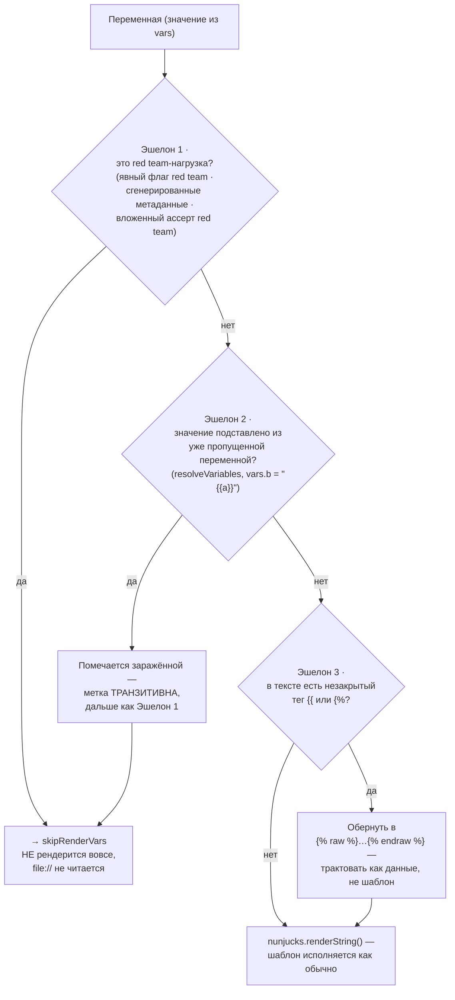
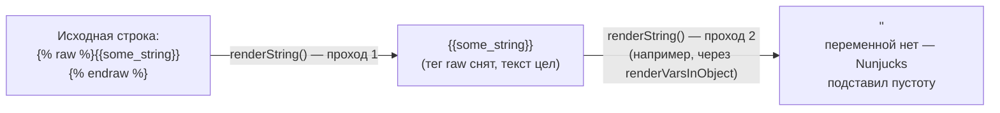
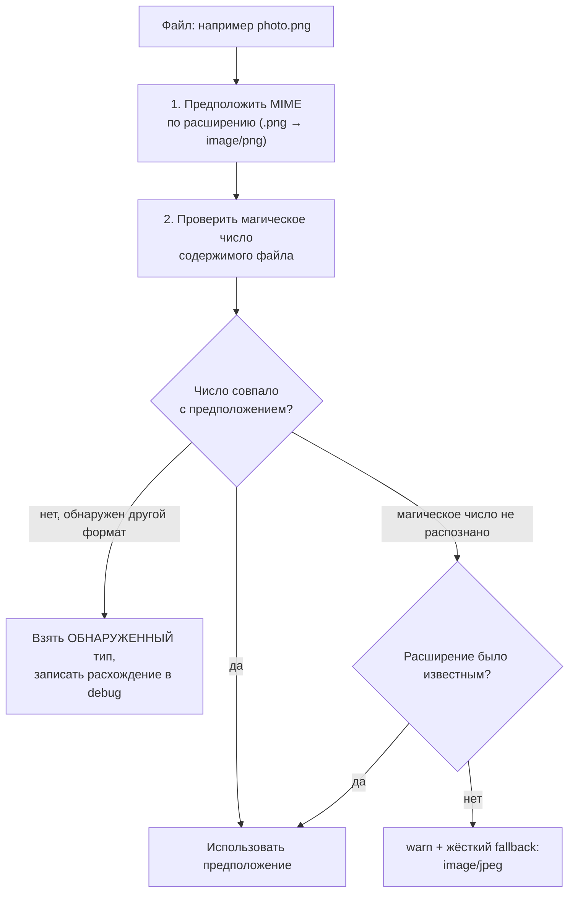
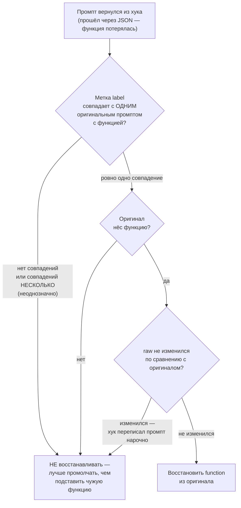

# Рендеринг промпта и хуки расширений — `src/evaluatorHelpers.ts`

> Разбор через призму **Domain-Driven Design**. Диаграммы — ANSI-псевдографика.
> Дополняет [EVALUATOR.md](EVALUATOR.md), [PROMPTS.md](PROMPTS.md), [REDTEAM.md](REDTEAM.md),
> [INTEGRATIONS.md](INTEGRATIONS.md), [ARCHITECTURE.md](ARCHITECTURE.md).
>
> Здесь пользовательский шаблон встречается с недоверенными данными. EVALUATOR.md
> ссылается на этот файл, но не разбирает его.

---

## 0. Паспорт подсистемы

```
╔══════════════════════════════════════════════════════════════════════════════╗
║  src/evaluatorHelpers.ts — граница шаблона и данных                          ║
╠══════════════════════════════════════════════════════════════════════════════╣
║  Строк .................. 888     один файл, без AGENTS.md                   ║
║  Экспортов .............. 11      6 функций + 5 типов                        ║
║  Две несвязанные области  рендеринг :35–545 · хуки расширений :546–888       ║
╠══════════════════════════════════════════════════════════════════════════════╣
║  Слой ................... legacy-runtime   tier 2                            ║
║  Файлов-потребителей .... 12      evaluator.ts + 8 провайдеров red team      ║
╠══════════════════════════════════════════════════════════════════════════════╣
║  Тестов ................. 2421 строка / 3 файла                              ║
║    evaluatorHelpers.test.ts ............. 1882                               ║
║    evaluatorHelpers.langfuse.test.ts ..... 395                               ║
║    evaluatorHelpers-skiprender.test.ts ... 144   ← отдельный файл на защиту  ║
║  Отношение тест/код ..... 2.73 : 1   РЕКОРД СЕРИИ                            ║
╠══════════════════════════════════════════════════════════════════════════════╣
║  Источники промпта ...... file:// · portkey:// · langfuse:// · helicone://   ║
║  Выключатели поведения .. PROMPTFOO_DISABLE_JSON_AUTOESCAPE                  ║
║                           PROMPTFOO_DISABLE_PDF_AS_TEXT                      ║
║                           PROMPTFOO_DISABLE_MULTIMEDIA_AS_BASE64             ║
╚══════════════════════════════════════════════════════════════════════════════╝
```

Отношение тест/код **2.73:1** — выше, чем у `validators` (1.97), `retry` (4.4:1
на отдельном файле) и всего разобранного ранее по каталогам. Плюс отдельный
тестовый файл, посвящённый одному механизму защиты. Это говорит о том, как
авторы оценивают риск в этом месте.

---

## 1. Единый язык подсистемы

| Термин | Носитель в коде | Смысл в предметной области |
| --- | --- | --- |
| **Base prompt** | `basePrompt` | Шаблон промпта до подстановки — доверенный, написан пользователем |
| **Var** | `vars: Record<string, VarValue>` | Значение переменной; может прийти откуда угодно, включая генератор атак |
| **Inject var** | `getRedteamInjectVar` | Переменная, в которую red team кладёт состязательную нагрузку |
| **Skip render** | `skipRenderVars: string[]` | Переменные, которые запрещено обрабатывать как шаблон |
| **Taint** | `varsResolvedFromSkipped: Set` | Метка «значение получено из пропущенной переменной» |
| **Partial tag** | `autoWrapRawIfPartialNunjucks` | Незакрытый тег Nunjucks — признак того, что текст не шаблон |
| **Raw wrap** | `…` | Обёртка, отключающая интерпретацию шаблона внутри |
| **Extension hook** | `runExtensionHook` | Пользовательский код в четырёх точках жизненного цикла прогона |
| **Prompt function** | `prompt.function` | Промпт-функция `file://…:fn`, теряемая при JSON-сериализации |

---

## 2. Задача: шаблон доверенный, данные — нет

```
╔══════════════════════════════════════════════════════════════════════════════╗
║  ОТКУДА БЕРЁТСЯ ОПАСНОСТЬ                                                    ║
╚══════════════════════════════════════════════════════════════════════════════╝

   ДОВЕРЕННОЕ                        НЕДОВЕРЕННОЕ
   ┌──────────────────────┐          ┌──────────────────────────────────────┐
   │ prompt.raw           │          │ vars[injectVar]                      │
   │                      │          │                                      │
   │ «Ответь на вопрос:   │          │ порождено плагином red team,         │
   │  {{query}}»          │          │ преобразовано стратегией,            │
   │                      │          │ иногда — ответом модели-атакующего   │
   │ написан человеком,   │          │                                      │
   │ лежит в YAML         │          │ REDTEAM.md: 155 плагинов,            │
   └──────────────────────┘          │ 35 стратегий, 14 агентов атак        │
                                     └──────────────────────────────────────┘
                     │                              │
                     └──────────┬───────────────────┘
                                ▼
                    nunjucks.renderString(шаблон, vars)

   ┌── ЧТО СЛУЧИТСЯ БЕЗ ЗАЩИТЫ ───────────────────────────────────────────┐
   │                                                                      │
   │  Нагрузка содержит {{ … }}  →  Nunjucks её ВЫПОЛНИТ                  │
   │  Нагрузка содержит {%  …    →  незакрытый тег, рендеринг УПАДЁТ      │
   │  Нагрузка содержит file://  →  путь ПРОЧИТАЕТСЯ с диска              │
   │                                                                      │
   │  Первый случай — исполнение шаблона из состязательного ввода.        │
   │  Второй — тест падает не из-за модели, а из-за движка шаблонов:      │
   │    атака засчитывается как ошибка инструмента, и найденная           │
   │    уязвимость теряется.                                              │
   │  Третий — чтение файла по пути, который выбрал генератор атак.       │
   └──────────────────────────────────────────────────────────────────────┘
```

Второй случай важен не меньше первого. Red team существует, чтобы находить
пробои; шаблонизатор, падающий на состязательном вводе, превращает находку
в шум.

---

## 3. Три эшелона защиты

### Эшелон 1: переменная-нагрузка не рендерится вовсе

```
   evaluator.ts:829
     const skipRenderVars = shouldSkipRedteamInjectVar(test, testSuite, isRedteam)
                              ? [getRedteamInjectVar(test, prompt, testSuite)]
                              : …
     renderPrompt(prompt, vars, filters, provider, skipRenderVars)

   ┌── shouldSkipRedteamInjectVar — evaluator.ts:456 ─────────────────────┐
   │                                                                      │
   │  if (isRedteam || testSuite?.redteam) return true;      ← явный      │
   │                                                                      │
   │  // Exported/generated redteam configs may not include a top-level   │
   │  // `redteam` block, but they still carry redteam metadata or        │
   │  // nested redteam assertions.                                       │
   │  return hasGeneratedRedteamMetadata(test)               ← по метке   │
   │      || Boolean(test.assert?.some(hasNestedRedteamAssertion));       │
   │                                          ↑ по вложенному ассерту     │
   └──────────────────────────────────────────────────────────────────────┘

   Три независимых признака, а не один. Причина записана в комментарии:
   выгруженный или сгенерированный конфиг red team может не содержать
   верхнеуровневого блока `redteam`. Промахнись определение — нагрузка
   ушла бы в шаблонизатор.

   ┌── Что даёт попадание в skipRenderVars ───────────────────────────────┐
   │  :258  пропуск загрузки file://  — путь не читается                  │
   │  :516  пропуск renderString      — шаблон не исполняется             │
   └──────────────────────────────────────────────────────────────────────┘
```

### Эшелон 2: распространение метки заражения

Пропустить одну переменную мало: её значение может утечь в другую.

```
   resolveVariables(variables, skipResolveVars, varsResolvedFromSkipped)  :54

   Переменные умеют ссылаться друг на друга: vars.b = "{{a}}".
   Цикл до неподвижной точки, ограниченный ПЯТЬЮ итерациями:

     do { … } while (!resolved && iterations < 5);

   ┌── Перенос метки — :82 ───────────────────────────────────────────────┐
   │  if (skipResolveVars?.includes(varName)                              │
   │      || varsResolvedFromSkipped?.has(varName)) {                     │
   │    varsResolvedFromSkipped?.add(key);                                │
   │  }                                                                   │
   │                                                                      │
   │  Переменная, получившая значение из пропущенной, сама становится     │
   │  пропущенной. Метка ТРАНЗИТИВНА.                                     │
   └──────────────────────────────────────────────────────────────────────┘

     vars.payload  ← нагрузка red team, в skipRenderVars
     vars.wrapper  = "Контекст: {{payload}}"
                     ▼ после resolveVariables
     vars.wrapper  = "Контекст: <нагрузка>"   и помечена как заражённая
                     ▼ на :516
     не рендерится — иначе нагрузка внутри wrapper была бы исполнена

   Это полноценный taint-анализ на одном множестве строк. Источник —
   skipRenderVars, распространение — присваивание через подстановку,
   сток — nunjucks.renderString.
```

### Эшелон 3: незакрытые теги обезвреживаются

```
   autoWrapRawIfPartialNunjucks(prompt)                                   :96

   const hasPartialTag = /({%[^%]*$|{{[^}]*$|{#[^#]*$)/m.test(prompt);
   const alreadyWrapped = /{\%\s*raw\s*\%}/.test(prompt)
                       && /{\%\s*endraw\s*\%}/.test(prompt);
   if (hasPartialTag && !alreadyWrapped) {
     return `${prompt}`;
   }

   ┌── Логика ────────────────────────────────────────────────────────────┐
   │  Открывающий тег без закрывающего до конца строки — почти наверняка  │
   │  не шаблон, а текст, случайно содержащий «{{» или «{%».              │
   │  Обернуть в  — значит трактовать его как данные.            │
   │                                                                      │
   │  Проверка alreadyWrapped защищает от двойной обёртки:       │
   │  внутри  сломало бы уже корректный шаблон.                  │
   └──────────────────────────────────────────────────────────────────────┘

   Применяется в трёх местах: :501 (режим без JSON-автоэкранирования),
   :525 (каждое значение переменной), :530 (сам шаблон промпта).
```

Все три эшелона на пути одной переменной как Mermaid-диаграмма:



**Своими словами.** Представь три поста досмотра подряд перед посадкой
в самолёт, и багаж должен пройти либо все три, либо застрять на первом же,
где его развернут. Первый пост — список уже известных нарушителей: если
багаж пришёл прямиком из зоны атаки red team (это отдельно и явно
помечено), его просто не пускают в самолёт, разворачивают сразу (эшелон 1).
Второй пост хитрее: он ловит багаж, который сам по себе в списке не
значится, но был СОБРАН из вещей, взятых у уже задержанного пассажира —
переменная-обёртка, внутрь которой подставили содержимое опасной
переменной. Метка «подозрительный» в этом случае передаётся по цепочке
дальше — то есть если из заражённого чемодана переложить вещи в третий,
четвёртый чемодан, каждый из них становится заражённым тоже, а не только
первый (эшелон 2). Третий пост работает со всем остальным багажом,
прошедшим первые два: он смотрит, не выглядит ли содержимое странно — как
будто в чемодане открытый неупакованный предмет, который может высыпаться
в полёте. Если да — предмет не запрещают провозить, а просто оборачивают
в защитную плёнку, чтобы он точно не рассыпался (обёртка ``), и
после этого пропускают дальше как обычно (эшелон 3). Всё, что прошло через
все три поста, наконец попадает в сам самолёт — то есть исполняется
шаблонизатором Nunjucks. Три поста ловят три разных типа угрозы, и ни
один в одиночку не закрыл бы все три.

---

## 4. Ловушка двойного рендеринга

Тонкость, ради которой в коде оставлена ссылка на документацию Nunjucks:

```
   ┌── Комментарий авторов, :528 ─────────────────────────────────────────┐
   │                                                                      │
   │  «Explicitly not using `renderVarsInObject` as it will re-call       │
   │   `renderString`; each call will strip Nunjucks Tags, which breaks   │
   │   using raw (https://mozilla.github.io/nunjucks/templating.html#raw) │
   │   e.g. {{some_string}} -> {{some_string}} -> ''»│
   └──────────────────────────────────────────────────────────────────────┘

   Что происходит при двух проходах:

     проход 1:  {{some_string}}
                          ▼ renderString снимает raw
     результат: {{some_string}}
                          ▼ renderString ВТОРОЙ раз
     результат: ''        ← переменной нет, Nunjucks подставляет пустоту

   Защита, применённая дважды, обращается в свою противоположность:
    держится ровно один проход. Отсюда правило — каждая строка
   рендерится РОВНО ОДИН раз, и порядок вызовов в renderPrompt выстроен
   под это.

   Тот же мотив в referencesUndefinedVariables :107 — значение переменной,
   ссылающееся на несуществующую переменную, НЕ рендерится:
     if (referencesUndefinedVariables(value, vars)) return [key, value];
   иначе `{{missing}}` схлопнулось бы в пустую строку и данные потерялись.
   Исключение — префикс `env`, он разрешается позже.
```

Деградация значения при повторном рендеринге как Mermaid-диаграмма:



**Своими словами.** Представь конверт с надписью «не вскрывать» на внешней
стороне — это защита ``. Первый раз, когда конверт проходит через
сортировочный пункт, работник видит надпись, уважает её и откладывает
конверт в сторону нетронутым — но при этом надпись «не вскрывать» со
ВНЕШНЕЙ стороны стирается, потому что сортировщик её уже учёл и она сделала
своё дело (первый проход снимает ``, содержимое остаётся как
текст). Если этот же конверт по ошибке отправить через сортировку ещё раз,
второй сортировщик уже не видит надписи «не вскрывать» — снаружи это просто
открытый текст, похожий на форму для заполнения — и он «заполняет форму»,
подставляя вместо неё пустое место, потому что искомой переменной на самом
деле не существует. Результат — конверт, который должен был долететь
с содержимым нетронутым, доезжает до адресата совершенно пустым. Отсюда
простое, но легко нарушаемое правило: каждую строку можно провести через
сортировку РОВНО ОДИН раз, и весь код `renderPrompt` построен так, чтобы это
правило не нарушить — например, специально не используется готовая функция
`renderVarsInObject`, потому что она бы прогнала одно и то же значение через
рендер дважды.

---

## 5. Загрузка переменных из файлов

`renderPrompt` умеет подставлять в переменную содержимое файла. Это удобная
функция и одновременно самая широкая поверхность файлового доступа в системе.

```
╔══════════════════════════════════════════════════════════════════════════════╗
║  vars[name] = 'file://…'  →  что произойдёт                    :258–420      ║
╠══════════════════════════════════════════════════════════════════════════════╣
║                                                                              ║
║   const filePath = path.resolve(process.cwd(), basePath,                     ║
║                                 value.slice('file://'.length));              ║
║                                                                              ║
║   ┌── .js / .ts ──────────────────────────────────────────────────────┐      ║
║   │  importModule(filePath) и ВЫЗОВ:                                   │     ║
║   │    (varName, basePrompt, vars, provider)                           │     ║
║   │  Ожидается { output: string } либо { error }.                      │     ║
║   │  Исполнение произвольного кода в процессе promptfoo.               │     ║
║   └────────────────────────────────────────────────────────────────────┘     ║
║   ┌── .py ────────────────────────────────────────────────────────────┐      ║
║   │  runPython(filePath, 'get_var', [varName, basePrompt, vars])       │     ║
║   │  Отдельный процесс — см. мост в src/python                         │     ║
║   └────────────────────────────────────────────────────────────────────┘     ║
║   ┌── .pdf ───────────────────────────────────────────────────────────┐      ║
║   │  extractTextFromPDF — динамический import('pdf-parse')            │      ║
║   │  Зависимость необязательная: при её отсутствии — внятная ошибка   │      ║
║   │  «Please install it with: npm install pdf-parse»                   │     ║
║   │  Выключается PROMPTFOO_DISABLE_PDF_AS_TEXT                         │     ║
║   └────────────────────────────────────────────────────────────────────┘     ║
║   ┌── изображение / видео / аудио ────────────────────────────────────┐      ║
║   │  base64; для изображений — data:URL с MIME-типом                   │     ║
║   │  Выключается PROMPTFOO_DISABLE_MULTIMEDIA_AS_BASE64                │     ║
║   └────────────────────────────────────────────────────────────────────┘     ║
╚══════════════════════════════════════════════════════════════════════════════╝
```

### Определение MIME по магическому числу

```
   getMimeTypeFromExtension(ext)  :172      по расширению — быстро, неточно
   detectMimeFromBase64(base64)   :207      по сигнатуре — медленнее, точнее

   ┌── Порядок и правило замещения ───────────────────────────────────────┐
   │  1. предположить по расширению                                       │
   │  2. проверить магическое число                                       │
   │  3. если detected ≠ предположения — ВЗЯТЬ detected, записать в debug │
   │  4. если detected нет и расширение было неизвестным — warn и jpeg    │
   └──────────────────────────────────────────────────────────────────────┘

   Содержимое побеждает расширение. Файл, названный .png, но являющийся
   WebP, уедет провайдеру с правильным MIME — иначе мультимодальная
   модель отвергла бы запрос, а причина выглядела бы как сбой провайдера.

   Поддержано: JPEG · PNG · GIF · WebP · BMP · TIFF · ICO · AVIF · HEIC · SVG
```

Порядок определения MIME-типа как Mermaid-диаграмма:



**Своими словами.** Представь чемодан с биркой аэропорта, на которой
написано «хрупкое». Бирку клеили на глаз, по внешнему виду упаковки — это
быстро, но не всегда точно. Настоящая проверка происходит на рентгене:
просвечивают содержимое и смотрят, что там на самом деле (шаг 1 —
предположение по расширению файла, шаг 2 — проверка «магического числа»,
то есть внутренней сигнатуры содержимого). Если рентген показывает то же
самое, что написано на бирке — всё в порядке, едем дальше с той же биркой.
Но если рентген видит нечто другое — например, бирка гласит «стекло»,
а внутри на самом деле керамика — верят рентгену, а не бирке, и молча
записывают несовпадение в журнал для тех, кто потом будет разбираться
(шаг 3). А если рентген вообще не смог ничего разобрать — картинка нечёткая,
формат незнакомый — тогда смотрят, была ли бирка хотя бы понятной: если да,
доверяют бирке, если бирка тоже мутная — вешают самую безопасную стандартную
метку «обращаться осторожно» и предупреждают об этом отдельно (шаг 4).
Смысл всего этого в том, что содержимое всегда важнее наклейки: файл,
названный .png, но на самом деле являющийся WebP, всё равно долетит до
модели с правильной пометкой, а не будет отвергнут только потому, что
кто-то ошибся с расширением при сохранении.

**Чего здесь нет:** проверки, что `filePath` не вышел за пределы каталога
конфигурации. `path.resolve` принимает `../` без ограничений. Для доверенного
конфига это осознанная гибкость — путь пишет тот же человек, что и промпт.
Опасным это становится ровно тогда, когда `vars` приходят извне: именно
поэтому эшелон 1 пропускает загрузку `file://` для переменной-нагрузки.

---

## 6. Три реестра промптов как альтернативный источник

```
   prompt.raw начинается с …             → внешний реестр, шаблон приходит извне
   ┌──────────────────────────────────────────────────────────────────────┐
   │  portkey://    :424     getPortkeyPrompt                             │
   │  langfuse://   :427     версия или метка; 'latest' → undefined       │
   │  helicone://   :485     major.minor версии                           │
   └──────────────────────────────────────────────────────────────────────┘

   Все три возвращают результат НАПРЯМУЮ, минуя Nunjucks:
     return langfuseResult;

   Подстановку переменных делает сам реестр — vars передаются ему.
   Разбор интеграций — в INTEGRATIONS.md.

   Отдельный тестовый файл evaluatorHelpers.langfuse.test.ts на 395 строк
   показывает, что из трёх реестров именно этот оказался нетривиальным:
   разбор `id:version` с необязательной версией и словом latest.
```

---

## 7. Хуки расширений: вторая половина файла

Начиная со строки 546 файл занимается другим — пользовательским кодом
в четырёх точках жизненного цикла.

```
╔══════════════════════════════════════════════════════════════════════════════╗
║  runExtensionHook :746 — правила выбора обработчика                          ║
╠══════════════════════════════════════════════════════════════════════════════╣
║   Формат: file://path/to/file.js:functionName                                ║
║                                                                              ║
║   functionName ∈ {beforeAll, beforeEach, afterEach, afterAll}                ║
║        → запускать ТОЛЬКО для этого хука                                     ║
║   functionName — произвольное имя (myHandler)                                ║
║        → запускать для ВСЕХ хуков (обобщённый обработчик)                    ║
║   functionName не указан                                                     ║
║        → запускать для ВСЕХ хуков                                            ║
║                                                                              ║
║   Контексты типизированы по отдельности:                                     ║
║     BeforeAllExtensionHookContext  :546                                      ║
║     BeforeEachExtensionHookContext :555                                      ║
║     AfterEachExtensionHookContext  :568                                      ║
║     AfterAllExtensionHookContext   :591                                      ║
║     ExtensionHookContextMap        :608   ← связывает имя хука с контекстом  ║
║                                                                              ║
║   runExtensionHook<HookName extends keyof ExtensionHookContextMap>           ║
║     принимает и возвращает ОДИН И ТОТ ЖЕ тип контекста: хук может            ║
║     изменить контекст, но не подменить его другим.                           ║
╚══════════════════════════════════════════════════════════════════════════════╝
```

### `restorePromptFunctions` — починка задокументированного бага

```
   ┌── Комментарий авторов, :660 ─────────────────────────────────────────┐
   │                                                                      │
   │  «JSON cannot represent the `function` property that `file://...:fn` │
   │   prompts carry, so it is dropped on the round-trip. Without         │
   │   restoring it, the evaluator falls back to sending the prompt's raw │
   │   source as text instead of executing the function                   │
   │   (https://github.com/promptfoo/promptfoo/issues/9653).»             │
   └──────────────────────────────────────────────────────────────────────┘

   Сбой во всей красе: хук на Python получает сюиту через JSON,
   возвращает её обратно — и промпт-функция превращается в СТРОКУ
   С ИСХОДНЫМ КОДОМ, которую отправляют модели как текст промпта.
   Ошибки нет, прогон идёт, результаты бессмысленны.

   ┌── Три условия восстановления ────────────────────────────────────────┐
   │  1. сопоставление по `label` — устойчивый идентификатор              │
   │  2. оригинал НЁС функцию                                             │
   │  3. `raw` не изменился                                               │
   │       ▲ хук, намеренно переписавший промпт, сохраняет новое поведение│
   │                                                                      │
   │  Метка, принадлежащая более чем одному оригиналу с функцией,         │
   │  считается неоднозначной и ПРОПУСКАЕТСЯ — лучше не восстановить,     │
   │  чем восстановить чужую функцию.                                     │
   └──────────────────────────────────────────────────────────────────────┘
```

Три условия восстановления как Mermaid-диаграмма:



**Своими словами.** Представь бюро находок в аэропорту, куда вернулся
чемодан без ручки — ручка потерялась где-то в пути (промпт-функция
потерялась при прохождении через JSON). Сотрудник бюро хочет вернуть
чемодану оригинальную ручку, но не будет делать это наугад. Сначала он
ищет по номерной бирке чемодана в архиве: если под этим номером в архиве
числится ровно один чемодан с ручкой — можно продолжать, а если таких
чемоданов несколько или не нашлось ни одного — сотрудник разводит руками
и оставляет чемодан как есть, потому что приладить чужую ручку хуже, чем не
приладить никакую. Если совпадение единственное, сотрудник дополнительно
проверяет архивную запись: а была ли у ЭТОГО конкретного чемодана вообще
ручка изначально, или чемодан всегда был без неё — если ручки не было,
восстанавливать нечего. И последняя проверка — самая аккуратная: сотрудник
сверяет внешний вид чемодана с фотографией в архиве. Если чемодан выглядит
так же, как на фото — значит, никто по дороге не поменял его содержимое
специально, и ручку можно смело возвращать. А если чемодан выглядит
по-другому — значит, кто-то в пути (хук) намеренно перепаковал его заново,
и в таком случае бюро находок уважает это решение и оставляет чемодан без
старой ручки, потому что новое содержимое, скорее всего, задумано именно
таким.

---

## Диагноз

```
╔══════════════════════════════════════════════════════════════════════════════╗
║                        ДИАГНОЗ src/evaluatorHelpers.ts                       ║
╠══════════════════════════════════════════════════════════════════════════════╣
║  СИЛЬНЫЕ СТОРОНЫ                                                             ║
║                                                                              ║
║  ✔ Отношение тест/код 2.73:1 — рекорд серии, плюс отдельный файл             ║
║    на 144 строки, посвящённый одному механизму защиты (skiprender).          ║
║                                                                              ║
║  ✔ Транзитивная метка заражения: переменная, получившая значение             ║
║    из пропущенной, сама исключается из рендеринга. Полноценный               ║
║    taint-анализ источник → распространение → сток.                           ║
║                                                                              ║
║  ✔ Определение red team по трём независимым признакам, с записанной          ║
║    причиной: выгруженный конфиг может не иметь верхнеуровневого блока.       ║
║                                                                              ║
║  ✔ Незакрытые теги Nunjucks обезвреживаются автоматически — атака            ║
║    не превращается в падение инструмента, находка не теряется.               ║
║                                                                              ║
║  ✔ Ловушка двойного рендеринга объяснена в коде со ссылкой на                ║
║    документацию Nunjucks и конкретным примером схлопывания в ''.             ║
║                                                                              ║
║  ✔ MIME определяется по содержимому, а не по расширению; расхождение         ║
║    пишется в debug.                                                          ║
║                                                                              ║
║  ✔ restorePromptFunctions чинит задокументированный баг (#9653) с тремя      ║
║    условиями и явным отказом при неоднозначной метке.                        ║
║                                                                              ║
║  ✔ Необязательная зависимость pdf-parse грузится динамически, а её           ║
║    отсутствие даёт готовую команду установки, а не трассу стека.             ║
╠══════════════════════════════════════════════════════════════════════════════╣
║  СЛАБЫЕ МЕСТА                                                                ║
║                                                                              ║
║  ✘ Один файл — две несвязанные области: рендеринг промпта (:35–545)          ║
║    и хуки расширений (:546–888). Общее только слово «helpers».               ║
║                                                                              ║
║  ✘ Цикл разрешения переменных ограничен магической пятёркой без              ║
║    объяснения и без предупреждения при исчерпании. Цепочка длиннее           ║
║    пяти звеньев молча останется неразрешённой.                               ║
║                                                                              ║
║  ✘ `path.resolve` для file:// без проверки выхода за пределы каталога        ║
║    конфигурации. Защита держится исключительно на том, что нагрузка          ║
║    red team попала в skipRenderVars.                                         ║
║                                                                              ║
║  ✘ Обнаружение незакрытого тега — регулярное выражение по концу строки.      ║
║    Тег, закрытый где-то дальше в многострочном тексте, не считается          ║
║    частичным, и такая нагрузка дойдёт до шаблонизатора.                      ║
║                                                                              ║
║  ✘ `resolveVariables` МУТИРУЕТ переданный объект vars и возвращает его же.   ║
║    Вызывающий, не ожидающий этого, получит изменённые данные.                ║
║                                                                              ║
║  ✘ Три реестра промптов (portkey, langfuse, helicone) разобраны прямо        ║
║    в теле renderPrompt цепочкой else-if вместо реестра обработчиков.         ║
║                                                                              ║
║  ✘ Нет AGENTS.md, при том что здесь проходит граница доверия, а два          ║
║    из трёх эшелонов защиты неочевидны из кода без комментариев.              ║
╚══════════════════════════════════════════════════════════════════════════════╝
```

### Оценка по осям

```
  Покрытие тестами             ██████████  10/10   2.73:1, отдельный файл на защиту
  Защита границы доверия       █████████░   9/10   три эшелона, транзитивная метка
  Объяснённость решений        █████████░   9/10   ссылки на issue и документацию
  Устойчивость к состязательному
    вводу                      ████████░░   8/10   raw-обёртка; regexp по концу строки
  Обработка отказов            ████████░░   8/10   внятные сообщения, мягкая деградация
  Чистота файловых операций    █████░░░░░   5/10   нет ограничения пути
  Модульность                  ███░░░░░░░   3/10   две области в одном файле
  Документированность          ███░░░░░░░   3/10   нет AGENTS.md
  ─────────────────────────────────────────────────────────────────────────────
  ИНТЕГРАЛЬНО                  ███████░░░   6.9/10
```

Файл, где авторы явно понимали, что защищают. Плотность тестов, отдельный
файл на один механизм, ссылки на конкретный issue — всё это следы работы
по реальным инцидентам. Слабости — структурные: две темы в одном файле,
отсутствие ограничения пути и магическая константа без объяснения.

---

## Рекомендации по эволюции

1. **Разделить файл надвое:** `src/promptRendering.ts` (:35–545) и
   `src/extensionHooks.ts` (:546–888). Граница уже прочерчена комментарием
   `// Extension Hooks` на строке 539. Слой не изменится,
   но у каждой половины появится собственный предмет.

2. **Ограничить `file://` каталогом конфигурации.** Проверить, что
   `path.resolve(...)` остаётся внутри `cliState.basePath`, и отказывать
   с явным сообщением. Сейчас единственная преграда — попадание переменной
   в `skipRenderVars`, то есть корректность определения red team.

3. **Объяснить и озвучить лимит в 5 итераций.** Вынести в именованную
   константу с комментарием и писать `logger.warn` при исчерпании: цепочка
   переменных длиннее пяти сейчас обрывается молча.

4. **Усилить определение частичного тега.** Считать баланс открывающих и
   закрывающих последовательностей по всему тексту, а не только до конца
   строки. Многострочная нагрузка со сбалансированными на вид тегами
   проходит текущую проверку.

5. **Сделать `resolveVariables` чистой.** Возвращать новый объект вместо
   мутации аргумента; сигнатура уже возвращает результат, так что вызывающие
   не заметят разницы.

6. **Завести реестр обработчиков префиксов** вместо цепочки `else if`.
   `{ 'portkey://': fn, 'langfuse://': fn, 'helicone://': fn }` сделает
   добавление четвёртого реестра правкой одной строки.

7. **Написать `AGENTS.md`** с тремя эшелонами защиты из §3 и правилом
   «каждая строка рендерится ровно один раз» из §4. Оба неочевидны, оба
   легко нарушить безобидной на вид правкой.

---

## Карта файла

```
src/evaluatorHelpers.ts ........................... 888

├─ РЕНДЕРИНГ ПРОМПТА                               :35–545
│    extractTextFromPDF                    :35   ← экспорт, динамический import
│    resolveVariables                      :54   ← экспорт, лимит 5 итераций
│    autoWrapRawIfPartialNunjucks          :96   эшелон 3
│    referencesUndefinedVariables         :107   защита от схлопывания в ''
│    collectFileMetadata                  :121   ← экспорт
│    getMimeTypeFromExtension             :172   по расширению
│    detectMimeFromBase64                 :207   по магическому числу
│    renderPrompt                         :241   ← экспорт, главная функция
│      :258  загрузка file:// — js · py · pdf · image · video · audio
│      :421  varsResolvedFromSkipped = new Set()      создание метки
│      :422  resolveVariables(vars, skipRenderVars, …) распространение
│      :424  portkey://
│      :427  langfuse://
│      :485  helicone://
│      :499  ветка PROMPTFOO_DISABLE_JSON_AUTOESCAPE
│      :506  ветка «шаблон — валидный JSON» → renderVarsInObject
│      :512  ветка обычная → рендер значений, затем шаблона
│      :516  проверка метки заражения перед рендерингом значения
│
└─ ХУКИ РАСШИРЕНИЙ                                 :546–888
     BeforeAllExtensionHookContext         :546   ← экспорт (тип)
     BeforeEachExtensionHookContext        :555   ← экспорт (тип)
     AfterEachExtensionHookContext         :568   ← экспорт (тип)
     AfterAllExtensionHookContext          :591   ← экспорт (тип)
     ExtensionHookContextMap               :608   ← экспорт (тип)
     EXTENSION_HOOK_NAMES                  :633   4 имени
     getExtensionHookName                  :640   ← экспорт
     restorePromptFunctions                :673   починка issue #9653
     runExtensionHook                      :746   ← экспорт

Связанные файлы:
    src/evaluator.ts:456 ...........  shouldSkipRedteamInjectVar
    src/evaluator.ts:468 ...........  getRedteamInjectVar
    src/evaluator.ts:829 ...........  передача skipRenderVars
    src/redteam/providers/*.ts .....  8 провайдеров вызывают renderPrompt
    test/evaluatorHelpers.test.ts .. 1882
    test/evaluatorHelpers.langfuse.test.ts .... 395
    test/evaluatorHelpers-skiprender.test.ts .. 144
```

---

## Команды

```bash
# Размер и экспорты
wc -l src/evaluatorHelpers.ts
grep -nE '^export ' src/evaluatorHelpers.ts

# ЭШЕЛОН 1: как определяется red team (три признака)
grep -n -A 12 'function shouldSkipRedteamInjectVar' src/evaluator.ts

# ЭШЕЛОН 2: транзитивная метка заражения
grep -n 'varsResolvedFromSkipped' src/evaluatorHelpers.ts

# ЭШЕЛОН 3: обезвреживание незакрытых тегов
grep -n -A 8 'function autoWrapRawIfPartialNunjucks' src/evaluatorHelpers.ts
grep -n 'autoWrapRawIfPartialNunjucks(' src/evaluatorHelpers.ts

# Ловушка двойного рендеринга
grep -n -B 4 'renderVarsInObject. as it will re-call' src/evaluatorHelpers.ts

# Что грузится из file://
grep -n "isJavascriptFile\|=== 'py'\|=== 'pdf'\|isImageFile" src/evaluatorHelpers.ts

# Задокументированный баг промпт-функций
grep -n 'issues/9653' src/evaluatorHelpers.ts

# Выключатели поведения
grep -oE 'PROMPTFOO_[A-Z_]+' src/evaluatorHelpers.ts | sort -u

# Кто вызывает
grep -rln 'renderPrompt(' src/ --exclude-dir=node_modules | grep -v evaluatorHelpers

# Тесты
npx vitest run test/evaluatorHelpers.test.ts \
  test/evaluatorHelpers-skiprender.test.ts \
  test/evaluatorHelpers.langfuse.test.ts
```

---

*Документ описывает `src/evaluatorHelpers.ts` на коммите `2c140ef`, promptfoo 0.122.0. Дата среза — 27 августа 2026.*
