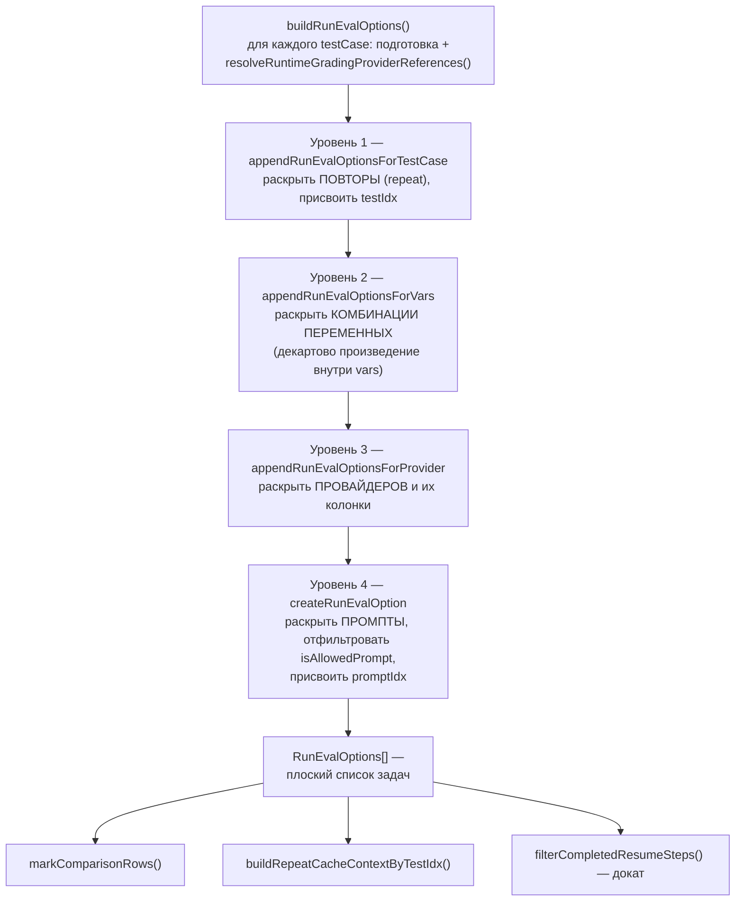
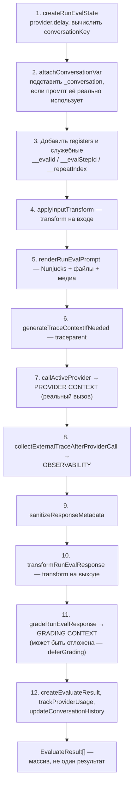
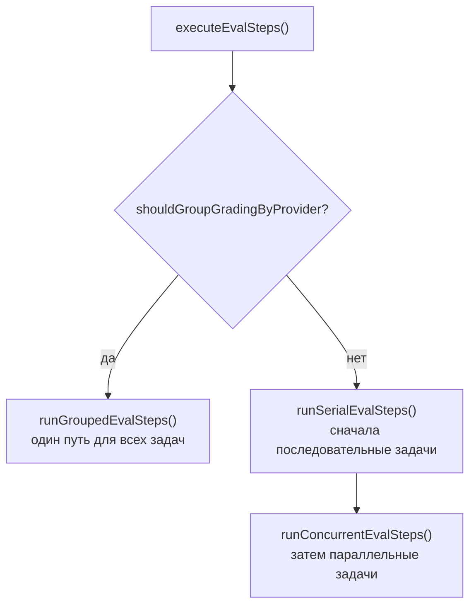
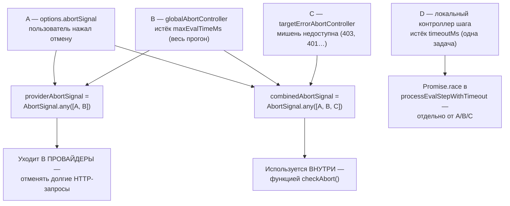

# Ядро оценки — `src/evaluator.ts`

> Разбор через призму **Domain-Driven Design**. Диаграммы — ANSI-псевдографика.
> Дополняет [ARCHITECTURE.md](./ARCHITECTURE.md), [REDTEAM.md](./REDTEAM.md),
> [PROVIDERS.md](./PROVIDERS.md), [APP.md](./APP.md), [ASSERTIONS.md](./ASSERTIONS.md),
> [SERVER.md](./SERVER.md).

---

## 0. Паспорт подсистемы

```
╔══════════════════════════════════════════════════════════════════════════════╗
║  EVALUATION CONTEXT — ядро домена и самый большой файл продукта              ║
╠══════════════════════════════════════════════════════════════════════════════╣
║  evaluator.ts                 5 073 строки  ← крупнейший файл вне провайдеров║
║  Слой в layers.json           legacy-runtime (ярус 2 из 11)                  ║
║                               «Transitional modules awaiting narrower owners»║
╠══════════════════════════════════════════════════════════════════════════════╣
║  СЕМЕЙСТВО ФАЙЛОВ                                             8 063 строки   ║
║    evaluator.ts               5 073   оркестрация                            ║
║    node/doEval.ts             1 242   прикладной сервис CLI                  ║
║    evaluatorHelpers.ts          888   рендеринг промптов и хуки              ║
║    evaluate.ts                  376   граница сериализации                   ║
║    evaluator/inMemoryStore.ts   161   адаптер без зависимостей               ║
║    node/evaluationStore.ts       89   адаптер к модели Eval                  ║
║    node/evaluatorRuntime.ts      87   адаптер рантайма Node                  ║
║    evaluator/runtime.ts          78   ПОРТЫ                                  ║
║    node/evaluate.ts              69   реэкспорт                              ║
╠══════════════════════════════════════════════════════════════════════════════╣
║  Внутри evaluator.ts                                                         ║
║    функций верхнего уровня      104                                          ║
║    методов класса Evaluator      36  (35 приватных + evaluate)               ║
║    интерфейсов и типов           12                                          ║
║    импортов                      65  из 62 разных источников                 ║
║    ЭКСПОРТОВ                      8  ← узкая публичная поверхность           ║
╠══════════════════════════════════════════════════════════════════════════════╣
║  Тесты                    25 файлов · 11 264 строки  (в 2,2 раза больше)     ║
╚══════════════════════════════════════════════════════════════════════════════╝
```

**Формулировка предметной области в одном предложении.** Evaluator превращает
декларацию эксперимента в декартово произведение задач, исполняет их с учётом
порядка, лимитов и таймаутов, отдаёт каждый результат на оценку и сохраняет всё
через порт, ничего не зная о базе данных.

**Парадокс, с которого стоит начать.** Ядро всего продукта приписано к слою
`legacy-runtime` — тому самому, который документация репозитория описывает как
«переходные модули, ожидающие более узких владельцев». Самая важная часть системы
формально числится техдолгом. Это не небрежность: `evaluator.ts` действительно
ещё не имеет чистой границы, и авторы предпочли назвать это вслух, а не
задекорировать красивым слоем.

---

## 1. Единый язык подсистемы

| Термин | Носитель в коде | Смысл |
|---|---|---|
| **Evaluator** | `evaluator.ts:3285` | Класс-оркестратор. Обобщён по двум параметрам типа. |
| **RunEvalOptions** | `types/index.ts` | Одна задача матрицы: промпт × провайдер × тест × повтор. |
| **runEval** | `evaluator.ts:1559` | Исполнение одной задачи. Возвращает массив: ходов может быть несколько. |
| **EvaluationStore** | `evaluator/runtime.ts` | Порт хранилища. 14 методов, 7 свойств. |
| **EvaluatorRuntime** | `evaluator/runtime.ts` | Порт рантайма: создать хранилище и писатели файлов. |
| **EvalConversations** | поле класса | Состояние диалогов по ключу «провайдер+промпт». |
| **EvalRegisters** | поле класса | Значения, сохранённые через `storeOutputAs`, доступные следующим тестам. |
| **evalStep** | сквозной параметр | Синоним `RunEvalOptions` в методах класса. |
| **CompletedPrompt** | `types/index.ts` | Промпт с накопленными метриками — колонка таблицы результатов. |
| **testIdx / promptIdx** | сквозные индексы | Координаты результата: строка и колонка. Ключ идемпотентности. |
| **_conversation** | `CONVERSATION_VAR_NAME` | Переменная промпта с историей диалога. Её наличие делает прогон последовательным. |
| **deferGrading** | `ProcessEvalStepOptions` | Отложить оценку, чтобы сгруппировать вызовы к одному судье. |
| **repeatIndex** | `RunEvalOptions` | Номер повтора. Задаёт пространство имён кэша. |
| **ProgressBarManager** | `evaluator.ts:173` | Прогресс в терминале. В веб-интерфейсе отключается. |

---

## 2. Место в архитектуре

```
   ┌──────────────────────────────────────────────────────────────────────┐
   │  ПРИНАДЛЕЖНОСТЬ К СЛОЯМ — расщепление по трём ярусам                 │
   ├──────────────────────────────────────────────────────────────────────┤
   │                                                                      │
   │   ярус 3  node             src/evaluate.ts                           │
   │                            src/node/doEval.ts                        │
   │                            src/node/evaluationStore.ts               │
   │                            src/node/evaluatorRuntime.ts              │
   │                                    ▲                                 │
   │                                    │ реализует порты                 │
   │                                    │                                 │
   │   ярус 2  legacy-runtime   src/evaluator.ts        5 073             │
   │                            src/evaluator/          ПОРТЫ + адаптер   │
   │                            src/evaluatorHelpers.ts                   │
   │                                                                      │
   │   ⚠  Ядро домена лежит НИЖЕ адаптеров, но выше contracts — и при     │
   │      этом в слое, официально помеченном как переходный.              │
   │                                                                      │
   │   legacy-runtime по edge-baseline: 101 импорт в node, 14 в providers,│
   │   12 в core — три ОБРАТНЫХ ребра, самые тяжёлые в системе.           │
   │   Значительная их часть исходит именно отсюда.                       │
   └──────────────────────────────────────────────────────────────────────┘

   ЧТО ИМПОРТИРУЕТ evaluator.ts — 65 импортов из 62 источников

     util        18  ████████████████████
     tracing      7  ████████
     types        6  ███████
     redteam      4  ████        ← знает о прикладной подобласти
     scheduler    3  ███
     providers    3  ███
     models       2  ██          ← но НЕ класс Eval, только функции-помощники
     node         1  █           ← nodeEvaluatorRuntime, адаптер по умолчанию
     + 27 одиночных: assertions · matchers · cache · blobs · telemetry ·
       suggestions · progress · logger · cliState · envars · constants ·
       async · chalk · glob · lru-cache · readline · winston · cli-progress

   ┌──────────────────────────────────────────────────────────────────────┐
   │  ГЛАВНОЕ НАБЛЮДЕНИЕ ОБ ИМПОРТАХ                                      │
   │                                                                      │
   │  Класс Eval НЕ импортируется — это подтверждает заявление            │
   │  документации. Из models берутся только три функции:                 │
   │    getResultIndexKey · sanitizeResultForJsonlArtifact                │
   │    generateIdFromPrompt                                              │
   │                                                                      │
   │  НО: `import { nodeEvaluatorRuntime } from './node/evaluatorRuntime'`│
   │  Порт абстрактен, а привязка по умолчанию зашита в тот же файл.      │
   │  Инверсия зависимостей проведена наполовину: движок можно            │
   │  сконфигурировать другим рантаймом, но по умолчанию он тянет         │
   │  конкретный адаптер уровня Node.                                     │
   └──────────────────────────────────────────────────────────────────────┘
```

---

## 3. Порты и адаптеры

```
                   ┌───────────────────────────────────────────┐
                   │  class Evaluator<TEvaluation, TResult>    │
                   │  evaluator.ts:3285                        │
                   │                                           │
                   │  store: EvaluationStore<…>                │
                   │  testSuite · options · stats              │
                   │  conversations · registers                │
                   │  fileWriters · rateLimitRegistry          │
                   └────────────────┬──────────────────────────┘
                                    │ зависит только от абстракций
   ┌────────────────────────────────▼──────────────────────────────────┐
   │  evaluator/runtime.ts — ПОРТЫ, 78 строк на три интерфейса         │
   ├───────────────────────────────────────────────────────────────────┤
   │                                                                   │
   │  interface EvaluationStore                       14 методов       │
   │    ЗАПИСЬ    appendResult · appendPrompts · saveResult · save     │
   │              recordFinalResult · recordResultPersistenceFailure   │
   │              setDurationMs · setVars                              │
   │    ЧТЕНИЕ    readResults · readResultsByTestIdx                   │
   │              readFailedResultsByTestIdx                           │
   │              readCompletedIndexPairs   ← ДОКАТ прерванного прогона│
   │    ПРОЧЕЕ    hasResultPersistenceFailure · toEvaluateResult       │
   │    7 свойств: evaluation · id · config · persisted · prompts ·    │
   │               results · resultPersistenceFailed                   │
   │                                                                   │
   │  interface EvaluatorResultWriter        write() · close()         │
   │                                                                   │
   │  interface EvaluatorRuntime                                       │
   │    createEvaluationStore(evaluation)                              │
   │    createResultWriters(outputPath, { append })                    │
   │    resolveRuntimeTestSuite?(testSuite)     ← необязательный       │
   └───────────────────────────────────────────────────────────────────┘
                    │                                    │
     ┌──────────────▼──────────────┐      ┌──────────────▼──────────────┐
     │  АДАПТЕР Node               │      │  АДАПТЕР In-Memory          │
     │  node/evaluationStore.ts 89 │      │  evaluator/                 │
     │  node/evaluatorRuntime.ts 87│      │    inMemoryStore.ts     161 │
     ├─────────────────────────────┤      ├─────────────────────────────┤
     │  EvalEvaluationStore        │      │  InMemoryEvaluationStore    │
     │    implements               │      │    implements               │
     │      EvaluationStore        │      │      EvaluationStore        │
     │        <Eval, EvalResult>   │      │        <InMemoryEvaluation, │
     │                             │      │         EvaluateResult>     │
     │  Тонкий делегат: каждый     │      │                             │
     │  метод — одна строка,       │      │  Две Map по ключу           │
     │  переадресующая агрегату.   │      │  `${testIdx}:${promptIdx}`  │
     │                             │      │  для отказавших и финальных │
     │  → Drizzle → SQLite         │      │  → память процесса          │
     │                             │      │                             │
     │  Плюс: писатели JSONL,      │      │  Для встраиваемых сценариев │
     │  режим append при докате,   │      │  и точечных тестов.         │
     │  рендеринг env для трасс    │      │  Зависимостей — ноль.       │
     └─────────────────────────────┘      └─────────────────────────────┘
```

### 3.1. Деталь адаптера: неподвижная точка при рендеринге окружения

`nodeEvaluatorRuntime.resolveRuntimeTestSuite` решает задачу, которой нет в
самом движке: переменные окружения могут ссылаться друг на друга.

```
   env:
     BASE:  https://api.example.com
     TRACE: {{ env.BASE }}/v1/traces      ← ссылка на другую переменную

   Решение — итерация до неподвижной точки, ограниченная числом ключей:

     for (pass = 0; pass < Object.keys(env).length; pass++) {
       next = renderEnvOnlyInObject(prev, { ...process.env, ...prev })
       if (next совпадает с prev) break        ← сошлось
       prev = next
     }

   Верхняя граница числа проходов равна числу переменных: цепочка ссылок
   не может быть длиннее, а циклическая ссылка просто исчерпает бюджет
   вместо бесконечного цикла.

   Отдельно: preserveTracingCredentialReferences — учётные данные трассировки
   НЕ раскрываются в подставленные значения, а сохраняются как ссылки.
```

---

## 4. Карта файла: девять зон

```
 ┌─────────────────────────────────────────────────────────────────────────────┐
 │  строки        зона                                    что там              │
 ├─────────────────────────────────────────────────────────────────────────────┤
 │     1– 140     импорты и константы            65 импортов, 6 констант       │
 │   141– 380     ProgressBarManager             прогресс-бар + LRU-кэш        │
 │   381–1 560    помощники runEval              ~50 функций: рендеринг,       │
 │                                               вызов провайдера, трассы,     │
 │                                               оценка, преобразования        │
 │  1 559–1 800   runEval / runEvalInternal      КОНВЕЙЕР ОДНОГО ВЫЗОВА        │
 │  1 800–2 460   метрики, промпты, сценарии     агрегация метрик, слияние     │
 │                                               сравнительных результатов     │
 │  2 460–2 900   развёртка матрицы              четыре уровня вложения        │
 │  2 900–3 285   конкурентность и группировка   выбор режима исполнения       │
 │  3 285–5 039   class Evaluator                36 методов, 1 754 строки      │
 │  5 039–5 073   evaluate() — три перегрузки    единственный вход             │
 └─────────────────────────────────────────────────────────────────────────────┘

   ┌──────────────────────────────────────────────────────────────────────┐
   │  ПРИ ЭТОМ ЭКСПОРТОВ ВСЕГО ВОСЕМЬ:                                    │
   │                                                                      │
   │    evaluate()                        главный вход (3 перегрузки)     │
   │    runEval()                         одна задача, для встраивания    │
   │    ProgressBarManager                класс прогресса                 │
   │    PromptSuggestionsRejectedError    доменная ошибка                 │
   │    isAllowedPrompt                   фильтр промптов                 │
   │    getTraceId · getTraceLinkage      связывание с телеметрией        │
   │    formatVarsForDisplay              вывод                           │
   │    generateVarCombinations           декартово произведение          │
   │    __resetPromptConversationCache…   только для тестов               │
   │                                                                      │
   │  Пять тысяч строк при восьми экспортах — инкапсуляция отличная.      │
   │  Проблема файла не в дырявости, а в размере.                         │
   └──────────────────────────────────────────────────────────────────────┘
```

---

## 5. Развёртка матрицы: четыре уровня вложения

```
 buildRunEvalOptions({ tests, testSuite, concurrency, … })
        │
        │  for (testCase of tests)
        │      prepareTestCaseForEval()               подготовка
        │      resolveRuntimeGradingProviderReferences()
        ▼
 ┌─────────────────────────────────────────────────────────────────────────┐
 │ УРОВЕНЬ 1 · appendRunEvalOptionsForTestCase                             │
 │     раскрывает ПОВТОРЫ (repeat) и присваивает testIdx                   │
 └────────────────────────────────┬────────────────────────────────────────┘
                                  ▼
 ┌─────────────────────────────────────────────────────────────────────────┐
 │ УРОВЕНЬ 2 · appendRunEvalOptionsForVars                                 │
 │     раскрывает КОМБИНАЦИИ ПЕРЕМЕННЫХ через generateVarCombinations()    │
 │     — декартово произведение массивов внутри vars                       │
 └────────────────────────────────┬────────────────────────────────────────┘
                                  ▼
 ┌─────────────────────────────────────────────────────────────────────────┐
 │ УРОВЕНЬ 3 · appendRunEvalOptionsForProvider                             │
 │     раскрывает ПРОВАЙДЕРОВ и их колонки (columnsByProvider)             │
 └────────────────────────────────┬────────────────────────────────────────┘
                                  ▼
 ┌─────────────────────────────────────────────────────────────────────────┐
 │ УРОВЕНЬ 4 · createRunEvalOption                                         │
 │     раскрывает ПРОМПТЫ, фильтрует через isAllowedPrompt,                │
 │     присваивает promptIdx                                               │
 └────────────────────────────────┬────────────────────────────────────────┘
                                  ▼
                        RunEvalOptions[]   — плоский список задач

   ┌──────────────────────────────────────────────────────────────────────┐
   │  РАЗМЕР МАТРИЦЫ                                                      │
   │                                                                      │
   │    N = тесты × комбинации_переменных × провайдеры × промпты × повторы│
   │                                                                      │
   │  Сценарии (scenarios) разворачиваются РАНЬШЕ, в buildTestsFromSuite  │
   │  → buildScenarioTests → mergeScenarioTest, и приходят сюда уже как   │
   │  обычные тест-кейсы. Поэтому уровней вложения четыре, а не пять.     │
   │                                                                      │
   │  Каждая задача получает: свой AbortSignal, ссылку на реестр лимитов, │
   │  общие conversations и registers, evalId и три индекса.              │
   └──────────────────────────────────────────────────────────────────────┘

   Сразу после развёртки — три постобработки:

     markComparisonRows()              пометить строки с select-best/max-score
     buildRepeatCacheContextByTestIdx() пространства имён кэша по повторам
     filterCompletedResumeSteps()      выкинуть уже посчитанное (докат)
```

Та же развёртка как Mermaid-диаграмма:



**Своими словами.** Представь мастерскую, которая выпускает не один товар,
а сразу все возможные сочетания. Первый цех берёт заготовку (тест-кейс) и
решает, сколько экземпляров из неё сделать — по числу заказанных повторов,
и на каждом экземпляре пишет номер (`testIdx`). Второй цех берёт каждый
такой экземпляр и клонирует его по числу комбинаций начинки — если у
заготовки три вида переменных с двумя вариантами каждая, из одной
заготовки выходит уже несколько. Третий цех клонирует то, что получилось,
по числу поставщиков, которые должны собрать готовое изделие
(провайдеры). Четвёртый — по числу чертежей сборки, по которым каждый
поставщик будет работать (промпты), и заодно выбраковывает те чертежи,
которые этому поставщику использовать не разрешено. На выходе — не
изделие, а плоский список нарядов на работу: «заготовка №7, такая-то
начинка, поставщик B, чертёж 2» — и нарядов ровно столько, сколько дало
последовательное умножение на всех четырёх цехах. Сразу после этого
конвейер делает три быстрые пометки на свежих нарядах: где сравнивать
между собой несколько вариантов одного теста, в каком пространстве имён
держать кэш повторов, и какие наряды можно вообще не печатать, потому
что прошлый прогон их уже выполнил.

### 5.1. Докат прерванного прогона

```
   filterCompletedResumeSteps(runEvalOptions, store)

     если не cliState.resume ИЛИ не store.persisted  →  выход

     completedPairs = await store.readCompletedIndexPairs({
       excludeErrors: cliState.retryMode      ← в режиме retry ошибки
     })                                          НЕ считаются завершёнными

     удалить из списка все шаги, чей `${testIdx}:${promptIdx}` уже есть

     catch → предупреждение и ПОЛНЫЙ прогон
             ↑ сбой чтения не должен превращаться в потерю данных;
               лучше пересчитать всё, чем пропустить непосчитанное

   Пара (testIdx, promptIdx) — единственный ключ идемпотентности во всей
   подсистеме. На нём же держатся: сравнительные ассёршены, учёт сбоев
   записи и обе Map в адаптере in-memory.
```

---

## 6. Конвейер одной задачи: `runEval`

```
 runEval(options: RunEvalOptions): Promise<EvaluateResult[]>
        │                                    ↑ МАССИВ, а не один результат:
        │                                      многоходовая атака порождает
        │                                      строку на каждый ход
        ▼
 ┌─────────────────────────────────────────────────────────────────────────┐
 │  1 · createRunEvalState                                                 │
 │        provider.delay ??= PROMPTFOO_DELAY_MS                            │
 │        вычисление conversationKey                                       │
 ├─────────────────────────────────────────────────────────────────────────┤
 │  2 · attachConversationVar                                              │
 │        vars._conversation = conversations[key] || []                    │
 │        ↑ только если промпт РЕАЛЬНО ссылается на переменную             │
 │          и не выключено через PROMPTFOO_DISABLE_CONVERSATION_VAR        │
 │          или test.options.disableConversationVar                        │
 ├─────────────────────────────────────────────────────────────────────────┤
 │  3 · Object.assign(vars, registers)      значения из storeOutputAs      │
 │      Object.assign(vars, getEvalRuntimeVars(…))                         │
 │        __evalId · __evalStepId · __repeatIndex                          │
 │        ↑ служебные переменные, доступные промпту, но вычищаемые         │
 │          из сохраняемого результата функцией omitEvalRuntimeVars        │
 ├─────────────────────────────────────────────────────────────────────────┤
 │  4 · applyInputTransform                 transform на входе             │
 │  5 · renderRunEvalPrompt                 Nunjucks + файлы + медиа       │
 │  6 · generateTraceContextIfNeeded        traceparent для связывания     │
 ├─────────────────────────────────────────────────────────────────────────┤
 │  7 · callActiveProvider ──────────────────► PROVIDER CONTEXT            │
 │        buildCallApiContext: originalProvider, vars, prompt, trace       │
 │        applyProviderDelayIfNeeded — но НЕ для ответа из кэша            │
 ├─────────────────────────────────────────────────────────────────────────┤
 │  8 · collectExternalTraceAfterProviderCall ─► OBSERVABILITY             │
 │  9 · sanitizeResponseMetadata            вычистка перед сохранением     │
 │ 10 · transformRunEvalResponse            transform на выходе            │
 ├─────────────────────────────────────────────────────────────────────────┤
 │ 11 · gradeRunEvalResponse ────────────────► GRADING CONTEXT             │
 │        может быть ОТЛОЖЕНА (deferGrading) ради группировки судей        │
 ├─────────────────────────────────────────────────────────────────────────┤
 │ 12 · createEvaluateResult · trackProviderUsage                          │
 │      updateConversationHistory                                          │
 └─────────────────────────────────────────────────────────────────────────┘
```

Тот же конвейер как Mermaid-диаграмма:



**Своими словами.** Это заказ в ресторане, обработанный от приёма до чека.
Официант сначала записывает заказ и вспоминает, был ли этот столик здесь
раньше — если да, подкладывает к заказу историю прошлых блюд, но только
если кухня реально спрашивает про неё в рецепте (шаги 1–2). Дальше в
заказ дописывают заметки с прошлых блюд этого же вечера и служебные
пометки для внутреннего учёта, которые гость не увидит в чеке (шаг 3).
Рецепт слегка подгоняют под ингредиенты, которые реально есть на кухне
(шаг 4), собирают само блюдо по рецепту, с подставленными именами гостя
и приложенными фото-референсами (шаг 5), и вешают на поднос бирку для
отслеживания, чтобы потом можно было проследить весь путь блюда (шаг 6).
Затем блюдо реально уходит к повару и готовится (шаг 7) — это единственный
шаг, где что-то происходит по-настоящему, всё остальное — подготовка и
учёт. Собирают показания приборов, сколько заняло готовки (шаг 8),
протирают тарелку перед подачей, чтобы на ней не осталось того, что не
должно быть видно гостю (шаг 9), и слегка меняют оформление подачи,
если так просили (шаг 10). Наконец блюдо пробует дегустатор и выставляет
оценку — но иногда дегустатор нарочно откладывает оценку, чтобы попробовать
сразу несколько блюд одной партии и не бегать к судейскому столику по
одному (шаг 11). В конце официант выписывает чек и обновляет историю
столика (шаг 12). А выдаёт вся эта цепочка не один результат, а массив —
потому что если гость заказал дегустационное меню из нескольких блюд
подряд (многоходовой диалог), в чеке будет строка на каждое блюдо, а не
одна общая.

### 6.1. Отложенная оценка и группировка судей

```
   Обычный порядок:     задача → провайдер → судья → задача → провайдер → судья
   Групповой порядок:   задача → провайдер ┐
                        задача → провайдер ├→ ОДИН пакет к судье
                        задача → провайдер ┘

   Условие включения — PROVIDER_GROUPED_ASSERTION_TYPES: набор типов
   проверок, которые выгодно слать судье пачкой.

   shouldDeferGradingForTest(test) решает по каждому тесту отдельно.

   Побочный эффект, зафиксированный в GRADING CONTEXT: при активной очереди
   группировки конкурентность ассёршенов принудительно опускается до 1,
   потому что параллельная отправка переставляет порядок постановки
   в очередь и РАЗБИВАЕТ группы одного судьи (см. ASSERTIONS.md §8.1).
```

---

## 7. Три режима исполнения

```
 ┌─────────────────────────────────────────────────────────────────────────────┐
 │  executeEvalSteps — развилка на два пути                                    │
 ├─────────────────────────────────────────────────────────────────────────────┤
 │                                                                             │
 │   if (shouldGroupGradingByProvider)                                         │
 │       runGroupedEvalSteps()          ← один путь для всего                  │
 │   else                                                                      │
 │       runSerialEvalSteps()           ← сначала последовательные             │
 │       runConcurrentEvalSteps()       ← потом параллельные                   │
 │                                                                             │
 │   Порядок во второй ветви не случаен: последовательные задачи могут         │
 │   писать в registers через storeOutputAs, и параллельные должны видеть      │
 │   уже записанное.                                                           │
 └─────────────────────────────────────────────────────────────────────────────┘
```

Та же развилка как Mermaid-диаграмма:



**Своими словами.** Представь кухню, где часть заказов обязательно готовят
по очереди, а часть — на нескольких горелках сразу. Если для этой партии
заказов важно, чтобы все блюда попали к одному дегустатору одним подносом
(группировка оценки у одного судьи), повар ведёт вообще всё через один
общий конвейер, без разделения. Если такой группировки нет, кухня сначала
готовит по одному все заказы, которые обязаны идти строго по очереди —
потому что повар делает в них пометки в общий блокнот заказов
(`storeOutputAs`), а следующий заказ должен эту пометку уже видеть, когда
до него дойдёт очередь. И только после того как очередные заказы
закончены, оставшиеся готовятся параллельно на нескольких горелках сразу.
Поменять порядок местами нельзя: если запустить параллельные заказы
раньше, они не увидят пометок, которые ещё не успели появиться в
блокноте. Отдельно кухня иногда сама принудительно сводит число горелок
к одной — если блюдо использует историю разговора с этим же гостем,
если оно пишет в общий блокнот заказов, или если требует одну-единственную
браузерную сессию, которую нельзя делить между параллельными заказами —
и каждый такой случай сопровождается пометкой в журнале, почему кухня
вдруг замедлилась.

```
 ┌─────────────────────────────────────────────────────────────────────────────┐
 │  adjustConcurrencyForSerialFeatures — три причины опуститься до 1           │
 ├─────────────────────────────────────────────────────────────────────────────┤
 │                                                                             │
 │   1  промпт использует _conversation                                        │
 │        Диалог по определению упорядочен. Параллельный прогон перемешал бы   │
 │        историю.                                                             │
 │                                                                             │
 │   2  тест использует storeOutputAs                                          │
 │        Следующий тест читает то, что записал предыдущий. Это состояние,     │
 │        разделяемое между задачами.                                          │
 │                                                                             │
 │   3  провайдер browser-provider с config.persistSession = true              │
 │        Одна браузерная сессия не может обслуживать параллельные задачи.     │
 │                                                                             │
 │   Каждое понижение сопровождается сообщением в лог с причиной —             │
 │   пользователь видит, почему прогон идёт медленнее ожидаемого.              │
 └─────────────────────────────────────────────────────────────────────────────┘

 ┌─────────────────────────────────────────────────────────────────────────────┐
 │  Кэш «использует ли промпт _conversation» — LRU на 1 024 записи             │
 ├─────────────────────────────────────────────────────────────────────────────┤
 │                                                                             │
 │   const { referenced, parsed } = analyzeTemplateReference(prompt.raw, …)    │
 │   if (parsed) cache.set(prompt.raw, referenced)   ← ТОЛЬКО при успехе       │
 │                                                                             │
 │   ┌───────────────────────────────────────────────────────────────────┐     │
 │   │  Комментарий объясняет, почему неудачный разбор не кэшируется:    │     │
 │   │  такая запись отравила бы кэш на весь срок жизни процесса и       │     │
 │   │  ТИХО понизила бы будущие диалоговые прогоны до параллельного     │     │
 │   │  исполнения. Ошибка проявилась бы не падением, а перемешанной     │     │
 │   │  историей диалога — то есть неверными результатами.               │     │
 │   └───────────────────────────────────────────────────────────────────┘     │
 └─────────────────────────────────────────────────────────────────────────────┘
```

---

## 8. Прерывание: четыре независимых источника

Самая тонкая часть механики. В `_runEvaluation` живут четыре сигнала, и они
намеренно комбинируются по-разному для провайдеров и для внутреннего цикла.

```
 ┌─────────────────────────────────────────────────────────────────────────────┐
 │  ИСТОЧНИКИ ПРЕРЫВАНИЯ                                                       │
 ├─────────────────────────────────────────────────────────────────────────────┤
 │   A  options.abortSignal            пользователь нажал отмену               │
 │   B  globalAbortController          истёк maxEvalTimeMs (весь прогон)       │
 │   C  targetErrorAbortController     мишень недоступна (403, 401 и т.п.)     │
 │   D  локальный контроллер шага      истёк timeoutMs (одна задача)           │
 └─────────────────────────────────────────────────────────────────────────────┘

 ┌─────────────────────────────────────────────────────────────────────────────┐
 │  ДВА РАЗНЫХ КОМБИНИРОВАННЫХ СИГНАЛА                                         │
 ├─────────────────────────────────────────────────────────────────────────────┤
 │                                                                             │
 │   providerAbortSignal  =  AbortSignal.any([ A, B ])                         │
 │        ↑ уходит В ПРОВАЙДЕРЫ — чтобы отменять долгие HTTP-запросы           │
 │                                                                             │
 │   combinedAbortSignal  =  AbortSignal.any([ A, B, C ])                      │
 │        ↑ используется ВНУТРИ, функцией checkAbort()                         │
 │                                                                             │
 │   ┌───────────────────────────────────────────────────────────────────┐     │
 │   │  ПОЧЕМУ C НЕ ПОПАДАЕТ В ПРОВАЙДЕРЫ — цитата комментария:          │     │
 │   │  «Сигнал ошибки мишени не передаётся провайдерам, потому что      │     │
 │   │   к моменту, когда мы обнаружили 403, вызов провайдера УЖЕ        │     │
 │   │   завершился — он нужен только для остановки цикла эвалюатора.»   │     │
 │   │                                                                    │    │
 │   │  Передача этого сигнала вниз была бы бессмысленной работой:        │    │
 │   │  отменять уже завершившийся запрос нечего.                         │    │
 │   └───────────────────────────────────────────────────────────────────┘     │
 └─────────────────────────────────────────────────────────────────────────────┘

 ┌─────────────────────────────────────────────────────────────────────────────┐
 │  ТАЙМАУТ ОТДЕЛЬНОГО ШАГА — processEvalStepWithTimeout                       │
 ├─────────────────────────────────────────────────────────────────────────────┤
 │                                                                             │
 │   Promise.race([                                                            │
 │     processEvalStep(шаг с локальным сигналом, {                             │
 │       onRowsReady: clearEvalStepTimeout,     ← СНЯТЬ таймер, как только     │
 │                                                строки получены              │
 │       shouldSkipStaleRows: () => didTimeout, ← отбросить опоздавшие         │
 │     }),                                                                     │
 │     таймер, отклоняющий промис                                              │
 │   ])                                                                        │
 │                                                                             │
 │   Тонкость: onRowsReady снимает таймер РАНЬШЕ завершения шага — потому      │
 │   что после получения строк остаётся только сохранение, которое             │
 │   прерывать по таймауту вредно: это привело бы к потере уже полученного     │
 │   результата.                                                               │
 │                                                                             │
 │   При срабатывании: createEvalStepTimeoutResult + createTimeoutMetrics —    │
 │   в таблице появляется строка с ошибкой, а не дыра.                         │
 ├─────────────────────────────────────────────────────────────────────────────┤
 │  ТАЙМАУТ ВСЕГО ПРОГОНА — maxEvalTimeMs                                      │
 │    createMaxDurationTimeoutResult · addMaxDurationTimeoutResults            │
 │    Непосчитанные задачи получают строки с объяснением, а прогон             │
 │    сохраняется. Прерванный прогон — это результат, а не пустота.            │
 └─────────────────────────────────────────────────────────────────────────────┘
```

Сборка двух комбинированных сигналов из четырёх источников как
Mermaid-диаграмма:



**Своими словами.** Представь пожарную сигнализацию здания с четырьмя
независимыми кнопками тревоги, но с двумя разными колоколами. Первый
колокол (сигнал для провайдеров) звонит, если кто-то нажал кнопку
«стоп» вручную или сработал общий таймер всего здания — но НЕ звонит,
если сработала кнопка «мишень недоступна». Причина проста: к моменту,
когда стало известно, что мишень недоступна (403 или 401), звонок уже
закончился — звонить колоколом провайдерам ради уже завершённого звонка
бессмысленно, это работа впустую. Второй колокол (используется только
внутри самого здания, чтобы остановить внутренний цикл) звонит от всех
трёх кнопок сразу, включая «мишень недоступна» — потому что здесь важно
остановить именно общий обход, а не отдельный звонок. И есть четвёртая,
совсем отдельная сигнализация — персональный кухонный таймер на одно
конкретное блюдо (шаг), который тикает независимо от всей пожарной
системы здания и участвует в отдельной гонке на время только с этим
одним блюдом.

---

## 9. Фаза сравнительных проверок

`select-best` и `max-score` не могут работать во время основного прогона: им
нужны все варианты одного теста сразу. Поэтому они вынесены в отдельную фазу.

```
   ОСНОВНОЙ ПРОГОН                          ФАЗА СРАВНЕНИЯ
   ───────────────                          ──────────────
   markComparisonRows() пометила
   строки с такими проверками
        │
        ▼
   ┌────────────────────┐
   │ rowsWithSelectBest │──────┐
   │ rowsWithMaxScore   │      │  после того как ВСЕ задачи посчитаны
   └────────────────────┘      ▼
                        ┌──────────────────────────────────────────────┐
                        │ processComparisonAssertions                  │
                        ├──────────────────────────────────────────────┤
                        │  processSelectBestAssertions                 │
                        │    getResultsToCompare(testIdx)              │
                        │       ← store.readResultsByTestIdx           │
                        │    runCompareAssertion                       │
                        │    mergeSelectBestGradingResult              │
                        │                                              │
                        │  processMaxScoreAssertions                   │
                        │    mergeMaxScoreGradingResult                │
                        │                                              │
                        │  finalizeComparisonGrading                   │
                        │  mergeComparisonTokenUsage                   │
                        │    ↑ токены судьи-сравнителя доначисляются   │
                        │      к общему учёту                          │
                        └──────────────────────────────────────────────┘

   Прогресс этой фазы считается отдельно: updateComparisonReporterTotals
   и updateComparisonReporterProgress — иначе прогресс-бар «застывал» бы
   на 100 % во время сравнения.

   repeatCacheContextByTestIdx нужен именно здесь: при повторах сравнивать
   надо варианты внутри ОДНОГО повтора, а не смешивать повторы между собой.
```

---

## 10. Доменные события: хуки расширений

```
   beforeAll ──► [ beforeEach ──► ТЕСТ ──► afterEach ] × N ──► afterAll
       │              │                        │                  │
       ▼              ▼                        ▼                  ▼
   { suite }      { test }            { test, result }    { suite, results,
                                                            prompts, evalId,
                                                            config }

 ┌─────────────────────────────────────────────────────────────────────────────┐
 │  КОНТРАКТ ИЗМЕНЯЕМОСТИ — что хук вправе поменять                            │
 ├─────────────────────────────────────────────────────────────────────────────┤
 │   beforeAll   suite целиком (изменяемый)                                    │
 │   beforeEach  test целиком (изменяемый)                                     │
 │   afterEach   ТОЛЬКО ТРИ ПОЛЯ результата:                                   │
 │                 result.namedScores                                          │
 │                 result.metadata                                             │
 │                 result.response.metadata                                    │
 │               Они мелко сливаются в результат и сохраняются.                │
 │               Изменить pass или score хук не может.                         │
 │   afterAll    ничего — только чтение (отправка в мониторинг и т.п.)         │
 └─────────────────────────────────────────────────────────────────────────────┘

 ┌─────────────────────────────────────────────────────────────────────────────┐
 │  ДВЕ СОГЛАШЕНИЯ О ВЫЗОВЕ, выбираемые по имени функции                       │
 ├─────────────────────────────────────────────────────────────────────────────┤
 │                                                                             │
 │   file://hooks.js:beforeAll     имя совпало с именем хука                   │
 │        → НОВОЕ соглашение: (context, { hookName })                          │
 │        → вызывается ТОЛЬКО для этого хука                                   │
 │                                                                             │
 │   file://hooks.js:myHandler     произвольное имя                            │
 │        → СТАРОЕ соглашение: (hookName, context)                             │
 │        → вызывается для ВСЕХ хуков                                          │
 │                                                                             │
 │   EXTENSION_HOOK_NAMES = { beforeAll, beforeEach, afterEach, afterAll }     │
 │   ↑ множество, по которому и различаются соглашения                         │
 │                                                                             │
 │   Обратная совместимость без версионирования API: старые расширения         │
 │   продолжают работать, новые получают точечную привязку.                    │
 └─────────────────────────────────────────────────────────────────────────────┘

   ensureDefaultTestForExtensions(testSuite) вызывается ПЕРЕД beforeAll:
   если расширения есть, а defaultTest нет — он создаётся, потому что
   хуку нужно куда-то класть изменения.

   Это domain events в бедной форме: синхронные хуки, без шины и без
   персистентности событий, но с чётко типизированным контекстом
   (ExtensionHookContextMap) и явным контрактом изменяемости.
```

---

## 11. Завершение: порядок разборки важен

```
 async evaluate() {
   try {
     startOtlpReceiverIfNeeded()        приёмник телеметрии
     if (tracingEnabled) initializeOtel()
     return await this._runEvaluation()
   } finally {
     ┌───────────────────────────────────────────────────────────────────┐
     │  ШАГ 1 · ЗАКРЫТЬ ПИСАТЕЛИ JSONL — ПЕРВЫМИ                         │
     │                                                                   │
     │    Promise.allSettled(fileWriters.map(w => w.close()))            │
     │                                                                   │
     │    Комментарий объясняет: разборка OTEL и провайдеров может       │
     │    занять несколько секунд, а файл должен быть полностью сброшен  │
     │    ДО того, как послепрогонная перезапись прочитает его обратно,  │
     │    и дескриптор должен освободиться сразу.                        │
     │                                                                   │
     │    allSettled — чтобы сбой одного писателя не блокировал очистку  │
     │    и не маскировал ошибку другого.                                │
     ├───────────────────────────────────────────────────────────────────┤
     │  ШАГ 2 · flushOtel() → shutdownOtel()                             │
     │          задержка для доэкспорта спанов провайдерами              │
     ├───────────────────────────────────────────────────────────────────┤
     │  ШАГ 3 · метрики планировщика в телеметрию                        │
     │          rateLimitRegistry.dispose()                              │
     │          redteamProviderManager.setRateLimitRegistry(undefined)   │
     │          cliState.maxConcurrency = undefined                      │
     │            ↑ сброс глобального состояния между прогонами          │
     ├───────────────────────────────────────────────────────────────────┤
     │  ШАГ 4 · РЕШЕНИЕ О СУДЬБЕ ОШИБКИ ЗАКРЫТИЯ ФАЙЛА                   │
     │                                                                   │
     │    if (ошибок закрытия нет)              → ничего                 │
     │    else if (была ошибка прогона/очистки) → только залогировать    │
     │         ↑ вторичная ошибка ввода-вывода не должна маскировать     │
     │           первичную                                               │
     │    else if (store.resultPersistenceFailed) → БРОСИТЬ              │
     │         ↑ база не приняла результаты, JSONL — единственная копия, │
     │           её усечение обязано быть замечено                       │
     │    else                                   → только залогировать   │
     │         ↑ в базе есть авторитетная копия, файл будет              │
     │           перегенерирован из неё                                  │
     │                                                                   │
     │    Несколько ошибок сворачиваются в AggregateError.               │
     └───────────────────────────────────────────────────────────────────┘
   }
 }
```

---

## 12. Прикладной слой над ядром

```
   CLI  promptfoo eval                    SDK  import { evaluate }
        │                                       │
        ▼                                       │
   node/doEval.ts        1 242 строки           │
     разбор аргументов · загрузка конфига ·     │
     сборка TestSuite · вывод таблицы ·         │
     запись файлов · шаринг · коды выхода       │
        │                                       │
        ▼                                       ▼
   evaluate.ts            376 строк — ГРАНИЦА СЕРИАЛИЗАЦИИ
        │
        │  createSerializableUnifiedConfig()
        │    toSerializableProviderRef      живой провайдер → ссылка
        │    toSerializableTestCase         функции → '[inline function]'
        │    toSerializableScenario         то же для сценариев
        │    replaceFunctionTransforms
        │
        │  ┌──────────────────────────────────────────────────────────┐
        │  │  Если функции были заменены И включена запись результата,│
        │  │  выводится предупреждение: сохранённый конфиг НЕ         │
        │  │  воспроизведёт эти функции при повторном прогоне;        │
        │  │  для round-trip нужны строковые выражения или file://.   │
        │  │                                                          │
        │  │  Честное признание границы: не всё, что можно передать   │
        │  │  в SDK, можно сохранить в YAML.                          │
        │  └──────────────────────────────────────────────────────────┘
        │
        │  createRuntimeTestSuite()   загрузка провайдеров и промптов
        │  resolveNestedProviders()   провайдеры внутри ассёршенов
        │  resolveGradingProvider()   судья
        ▼
   evaluator.ts  evaluate(testSuite, evalRecord, options, runtime?)
```

---

## 13. Диагноз

```
╔═══════════════════════════════════════════════════════════════════════════╗
║  СИЛЬНЫЕ СТОРОНЫ                                                          ║
╠═══════════════════════════════════════════════════════════════════════════╣
║  ✔ Порт EvaluationStore выделен честно и узко: 14 методов, ни одного      ║
║    лишнего. Движок не импортирует класс Eval — заявление документации     ║
║    подтверждается кодом.                                                  ║
║                                                                           ║
║  ✔ Два адаптера, и второй (in-memory) действительно без зависимостей —    ║
║    доказательство, что порт не протекает.                                 ║
║                                                                           ║
║  ✔ Восемь экспортов на 5 073 строки. Инкапсуляция превосходная.           ║
║                                                                           ║
║  ✔ Разделение сигналов прерывания на «для провайдеров» и «для цикла»      ║
║    с объяснением причины прямо в коде.                                    ║
║                                                                           ║
║  ✔ Прерванный прогон — это результат, а не пустота: и таймаут шага,       ║
║    и таймаут прогона порождают строки с объяснением.                      ║
║                                                                           ║
║  ✔ Три причины понизить конкурентность названы и логируются с причиной.   ║
║                                                                           ║
║  ✔ LRU-кэш не кэширует неудачный разбор — потому что тихое понижение      ║
║    до параллельного исполнения дало бы неверные результаты, а не сбой.    ║
║                                                                           ║
║  ✔ Порядок разборки в finally обоснован построчно, включая правило,       ║
║    когда ошибку закрытия файла нужно бросить, а когда только записать.    ║
║                                                                           ║
║  ✔ Два соглашения о вызове хуков дают обратную совместимость              ║
║    без версионирования API.                                               ║
║                                                                           ║
║  ✔ Тесты в 2,2 раза объёмнее кода: 11 264 строки в 25 файлах, разбитых    ║
║    по темам (execution · sessions · scenarios · repeatCache · routing).   ║
╠═══════════════════════════════════════════════════════════════════════════╣
║  СЛАБЫЕ МЕСТА                                                             ║
╠═══════════════════════════════════════════════════════════════════════════╣
║  ✘ 5 073 строки в одном файле: 104 функции верхнего уровня и класс на     ║
║    36 методов. Это God Object, и он же единственный узел, знающий обо     ║
║    всех контекстах системы сразу.                                         ║
║                                                                           ║
║  ✘ Ядро домена приписано к слою legacy-runtime — «переходные модули       ║
║    без владельца». Формально самая важная часть системы числится долгом.  ║
║                                                                           ║
║  ✘ Инверсия зависимостей проведена наполовину: порт абстрактен, но        ║
║    привязка по умолчанию (nodeEvaluatorRuntime) зашита в тот же файл.     ║
║    Из-за этого evaluator.ts тянет node, а legacy-runtime → node — самое   ║
║    тяжёлое обратное ребро системы (101 импорт).                           ║
║                                                                           ║
║  ✘ 65 импортов из 62 источников, включая четыре из redteam. Ядро оценки   ║
║    знает о прикладной подобласти безопасности.                            ║
║                                                                           ║
║  ✘ Класс несёт как минимум шесть ответственностей: развёртку матрицы,     ║
║    исполнение, тайм-ауты, сравнительное оценивание, телеметрию и          ║
║    отрисовку прогресс-бара. ProgressBarManager вообще живёт в том же      ║
║    файле — 200 строк работы с терминалом внутри доменного ядра.           ║
║                                                                           ║
║  ✘ Методы принимают объекты параметров на 10–17 полей                     ║
║    (executeEvalSteps — шестнадцать). Это следствие того, что состояние    ║
║    прогона не выделено в отдельный объект и протаскивается вручную.       ║
║                                                                           ║
║  ✘ Порядок вызовов в _runEvaluation значим в десятке мест, но нигде       ║
║    не зафиксирован типами — только комментариями и тестами.               ║
╚═══════════════════════════════════════════════════════════════════════════╝
```

### Оценка по осям

```
   Порты и адаптеры         ██████████████████░░░  8/10   порт чист, привязка нет
   Инкапсуляция             ████████████████████░  9/10   8 экспортов
   Единственная ответственность ████░░░░░░░░░░░░░  2/10   шесть ролей в классе
   Обработка сбоев          ████████████████████░  9/10
   Управление состоянием    ████████████░░░░░░░░░  6/10   параметры на 16 полей
   Изоляция от инфраструктуры ██████████░░░░░░░░░  5/10   прогресс-бар в ядре
   Тестируемость            ██████████████████░░░  8/10
```

---

## 14. Рекомендации по эволюции

```
   1 · Убрать nodeEvaluatorRuntime из evaluator.ts.
       Сделать `runtime` обязательным параметром evaluate(), а привязку
       по умолчанию перенести в node/evaluate.ts — туда, где ей и место.
       Это единственная правка, разрывающая ребро evaluator → node
       и делающая ядро действительно независимым от рантайма.

   2 · Вынести ProgressBarManager и CIProgressReporter.
       Отрисовка терминала — не доменная логика. Порт вида
       `EvaluationProgressReporter` с адаптерами «терминал», «CI»
       и «тишина» уберёт 200+ строк и зависимости от cli-progress,
       chalk и readline.

   3 · Выделить объект состояния прогона.
       Сейчас через десяток методов протаскиваются одни и те же
       шестнадцать полей. Объект EvaluationRunState вместил бы
       processedIndices, evalStepIndexMap, processingContext, сигналы
       и репортёры — и сигнатуры сжались бы до двух-трёх параметров.

   4 · Разделить класс на четыре по границам ответственности:
         TestMatrixExpander     развёртка и докат
         EvalStepExecutor       исполнение, режимы, тайм-ауты
         ComparativeGrader      select-best и max-score
         EvalTelemetryRecorder  сбор и отправка метрик
       Evaluator остаётся координатором на 300–400 строк.

   5 · Разорвать evaluator → redteam (4 импорта).
       Ядро оценки не должно знать о плагинах и стратегиях. Нужное
       выносится в contracts или передаётся через опции.

   6 · После шагов 1 и 5 переселить evaluator.ts из legacy-runtime
       в core — туда, где ядро домена и должно быть по замыслу
       docs/architecture/packages.md.
```

---

## 15. Карта семейства файлов

```
src/
├── evaluator.ts                          5 073  ЯДРО
│   ├── 1– 140    импорты (65) и константы (6)
│   ├── 141– 380  ProgressBarManager · LRU-кэш _conversation
│   ├── 381–1 560 ~50 помощников runEval:
│   │              createRunEvalState · attachConversationVar
│   │              renderRunEvalPrompt · callActiveProvider
│   │              collectExternalTraceAfterProviderCall
│   │              gradeRunEvalResponse · transformRunEvalResponse
│   │              applyGradingResult · applyGradingError
│   │              getTraceId · getTraceLinkage
│   ├── 1 559     runEval / runEvalInternal        конвейер одного вызова
│   ├── 1 870     formatVarsForDisplay
│   ├── 1 897     generateVarCombinations          декартово произведение
│   ├── 1 947–2 460 метрики и слияние сравнительных результатов
│   ├── 2 460–2 900 РАЗВЁРТКА МАТРИЦЫ
│   │              buildRunEvalOptions
│   │              appendRunEvalOptionsForTestCase   ← повторы
│   │              appendRunEvalOptionsForVars       ← переменные
│   │              appendRunEvalOptionsForProvider   ← провайдеры
│   │              createRunEvalOption               ← промпты
│   │              filterCompletedResumeSteps        ← докат
│   ├── 2 934     adjustConcurrencyForSerialFeatures
│   ├── 3 285–5 039 class Evaluator — 36 методов
│   │              processEvalStep · processEvalStepWithTimeout
│   │              executeEvalSteps · runGroupedEvalSteps
│   │              runSerialEvalSteps · runConcurrentEvalSteps
│   │              processComparisonAssertions
│   │              processSelectBestAssertions · processMaxScoreAssertions
│   │              saveInterruptedEval · saveTargetUnavailableEvalIfNeeded
│   │              finalizeEvaluation · recordEvalTelemetry
│   │              _runEvaluation · evaluate
│   └── 5 041     evaluate() — три перегрузки
│
├── evaluator/
│   ├── runtime.ts                           78  ПОРТЫ
│   │     EvaluationStore · EvaluatorResultWriter · EvaluatorRuntime
│   │     EvaluationRecord · EvaluationStoreResult
│   └── inMemoryStore.ts                    161  адаптер без зависимостей
│
├── evaluatorHelpers.ts                     888
│     renderPrompt · resolveVariables · collectFileMetadata
│     extractTextFromPDF · detectMimeFromBase64
│     runExtensionHook + четыре типа контекста
│
├── evaluate.ts                             376  ГРАНИЦА СЕРИАЛИЗАЦИИ
│     createSerializableUnifiedConfig · createRuntimeTestSuite
│     resolveNestedProviders · resolveGradingProvider · maybeShareEval
│
└── node/
    ├── doEval.ts                         1 242  прикладной сервис CLI
    ├── evaluate.ts                          69  реэкспорт
    ├── evaluationStore.ts                   89  адаптер к модели Eval
    └── evaluatorRuntime.ts                  87  писатели JSONL ·
                                               рендеринг env до неподвижной точки

test/evaluator/                    25 файлов · 11 264 строки
    basic · execution · assertions · scenarios · sessions · metrics
    metadata · options · routing · repeatCache · defaultTest
    generatedPrompts · gradingConcurrency · runEval · runtime
    inMemoryStore · select-best-minimal.integration
```

---

## 16. Команды

```bash
npx vitest run test/evaluator                    # весь набор
npx vitest run test/evaluator/execution.test.ts  # режимы исполнения
npx vitest run test/evaluator/runtime.test.ts    # порты и адаптеры
```

Переменные, влияющие на поведение ядра:

```bash
PROMPTFOO_DELAY_MS                  задержка между вызовами провайдера
PROMPTFOO_DISABLE_CONVERSATION_VAR  выключить переменную _conversation
PROMPTFOO_SHORT_CIRCUIT_TEST_FAILURES  падать на первой провалившейся проверке
PROMPTFOO_ASSERTIONS_MAX_CONCURRENCY   параллельность проверок (по умолчанию 3)
PROMPTFOO_TRACING_ENABLED              включить OpenTelemetry
```

Числа из этого документа воспроизводятся так:

```bash
wc -l src/evaluator.ts                                        # 5073
grep -cE "^export " src/evaluator.ts                          # экспорты
grep -c "^import" src/evaluator.ts                            # 65
```

---

*Документ описывает `src/evaluator.ts` и его окружение на коммите `2c140ef`,
promptfoo 0.122.0. Дата среза — 26 августа 2026.*
