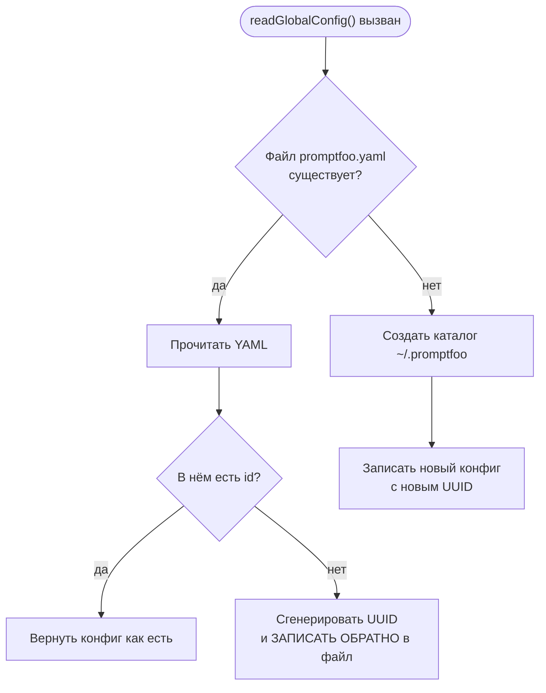
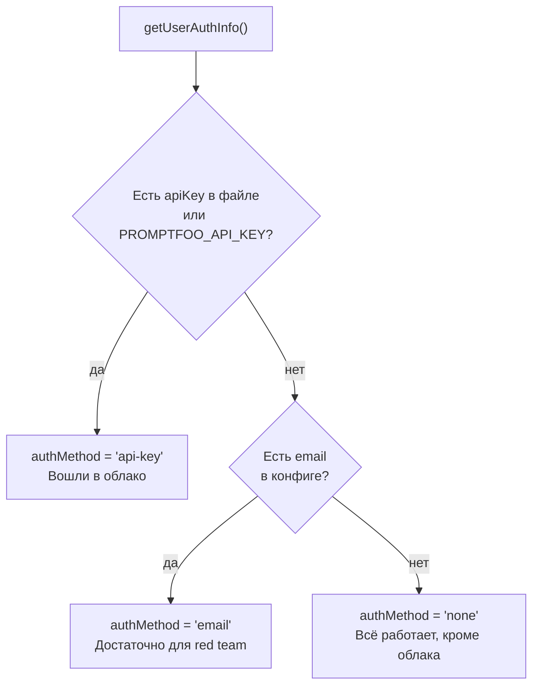
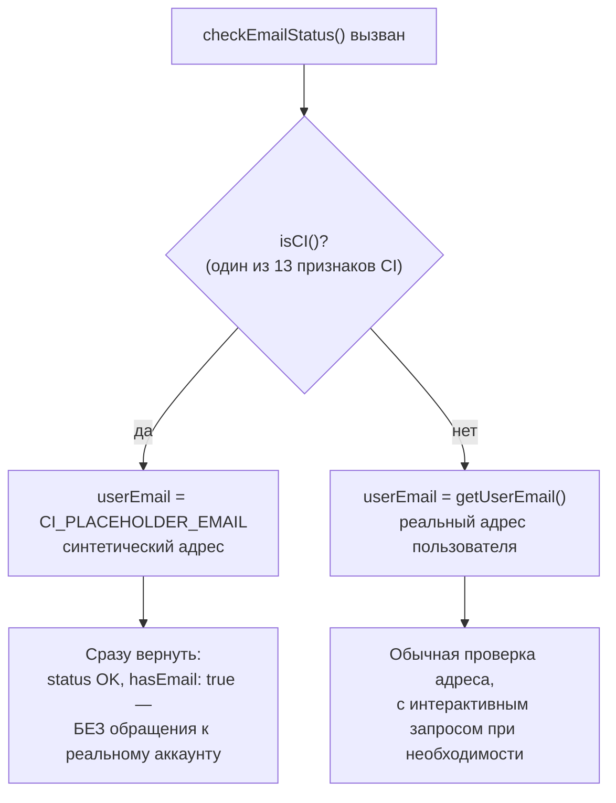
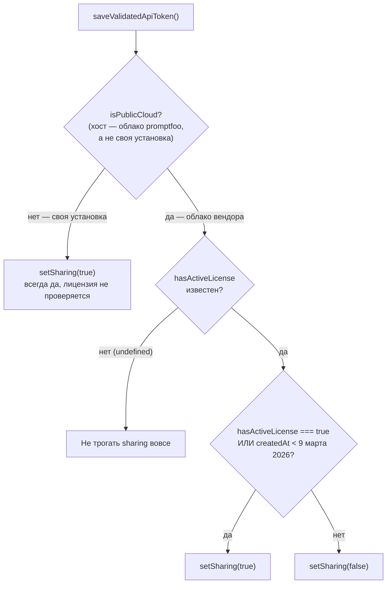

# Учётная запись и облако — `src/globalConfig`

> Разбор через призму **Domain-Driven Design**. Диаграммы — ANSI-псевдографика.
> Дополняет [SPINE.md](SPINE.md), [CACHE.md](CACHE.md), [DATABASE.md](DATABASE.md),
> [REDTEAM.md](REDTEAM.md), [COMMANDS.md](COMMANDS.md), [ARCHITECTURE.md](ARCHITECTURE.md).
>
> Три файла, связывающие локальный запуск с личностью: кто вы, вошли ли вы
> в облако и что вам за это положено. Всплывало в CACHE.md и SPINE.md,
> не разбиралось ни разу.

---

## 0. Паспорт подсистемы

```
╔══════════════════════════════════════════════════════════════════════════════╗
║  src/globalConfig — единственное изменяемое состояние ВНЕ проекта            ║
╠══════════════════════════════════════════════════════════════════════════════╣
║  файл                вход   строк   тест   что держит                        ║
║  ──────────────────────────────────────────────────────────────────────────  ║
║  cloud.ts              22     377    762   класс CloudConfig, ключ, команда  ║
║  accounts.ts           43     360    959   личность, email, метод входа      ║
║  globalConfig.ts        3      62    200   чтение и запись YAML на диске     ║
║  ──────────────────────────────────────────────────────────────────────────  ║
║  ИТОГО                 68     799  1 921                                     ║
╠══════════════════════════════════════════════════════════════════════════════╣
║  Отношение тест/код ..... 2.40 : 1   рекорд серии                            ║
║  AGENTS.md .............. НЕТ                                                ║
║  Слой ................... node   tier 3, один из 10 корней                   ║
╠══════════════════════════════════════════════════════════════════════════════╣
║  Хранилище .............. ~/.promptfoo/promptfoo.yaml                        ║
║  Потребителей ........... redteam(26) util(8) commands(5) server(4)          ║
║                           providers(2) node(2) telemetry share models …      ║
╚══════════════════════════════════════════════════════════════════════════════╝
```

Рядом с этим файлом лежат ещё два, которым посвящены отдельные документы:
`promptfoo.db` ([DATABASE.md](DATABASE.md)) и `cache/` ([CACHE.md](CACHE.md)).
Каталог `~/.promptfoo` — и есть всё состояние promptfoo между запусками.

---

## 1. Единый язык подсистемы

| Термин | Носитель в коде | Смысл в предметной области |
| --- | --- | --- |
| **Global config** | `~/.promptfoo/promptfoo.yaml` | Настройки пользователя, а не проекта; переживают все конфиги |
| **User id** | `globalConfig.id` | Анонимный UUID, создаваемый при первом чтении |
| **Auth method** | `'api-key' \| 'email' \| 'none'` | Три уровня знакомства инструмента с пользователем |
| **Cloud config** | `globalConfig.cloud` | Ключ, адрес API, адрес приложения, признак шеринга |
| **Grandfathering** | `SHARING_CUTOFF_DATE` | Право, сохранённое за теми, кто пришёл раньше даты |
| **Public cloud** | `isPromptfooCloudHost` | Отличие хостинга вендора от собственной установки |
| **CI placeholder** | `CI_PLACEHOLDER_EMAIL` | Синтетический адрес, чтобы CI не спрашивал ничего |
| **Partial write** | `writeGlobalConfigPartial` | Слияние верхнего уровня; `null` означает удалить ключ |

---

## 2. Личность создаётся побочным эффектом чтения

Самое неожиданное в подсистеме — там, где ждёшь просто чтения файла.

```
╔══════════════════════════════════════════════════════════════════════════════╗
║  readGlobalConfig() — globalConfig.ts:21                                     ║
╠══════════════════════════════════════════════════════════════════════════════╣
║                                                                              ║
║   let globalConfig: GlobalConfig = { id: crypto.randomUUID() };              ║
║                                                                              ║
║   если файл ЕСТЬ:                                                            ║
║     прочитать YAML                                                           ║
║     если в нём НЕТ id → сгенерировать и ЗАПИСАТЬ ОБРАТНО                     ║
║                                                                              ║
║   если файла НЕТ:                                                            ║
║     создать каталог                                                          ║
║     записать конфиг с новым id                                               ║
╠══════════════════════════════════════════════════════════════════════════════╣
║   ФУНКЦИЯ С ИМЕНЕМ read ПИШЕТ НА ДИСК.                                       ║
║                                                                              ║
║   Это не небрежность, а следствие требования: идентификатор должен           ║
║   существовать к моменту первого обращения кого угодно. Отложи его           ║
║   создание до явного вызова — и телеметрия первого запуска окажется          ║
║   без id, а второй запуск получит другой.                                    ║
║                                                                              ║
║   Цена: любой вызов readGlobalConfig создаёт ~/.promptfoo, даже если         ║
║   вызывающему нужно было только посмотреть.                                  ║
╚══════════════════════════════════════════════════════════════════════════════╝
```

Та же логика как Mermaid-диаграмма:



**Своими словами.** Представь стойку регистрации в гостинице, где на
вопрос «а какой у меня номер брони?» администратор никогда не отвечает
«брони нет» — вместо этого он тут же, прямо на месте, оформляет бронь
задним числом и называет номер, как будто она была всегда. Если ты
гость, который уже останавливался здесь раньше, — администратор
открывает твою карточку (файл существует), но если в ней почему-то
не записан номер комнаты (нет id), тут же его вписывает и сохраняет
карточку заново, а не оставляет пустое поле. Если же ты вообще в первый
раз в этой гостинице — заводят новую папку с нуля и сразу присваивают
номер. Странность в том, что это происходит на действии, которое
называется «посмотреть карточку», а не «оформить». Но это не халатность
администратора, а требование: номер должен существовать уже к первому
вопросу о госте, кто бы его ни задал, — отложи оформление до отдельного
явного шага, и первый визит гостя вообще нигде не окажется учтён.

`getUserId():63` в `accounts.ts` повторяет ту же логику ещё раз — генерирует
и записывает, если `id` не нашёлся. Двойная страховка на случай, если
`readGlobalConfig` вызвали в обход.

Этот UUID — то, чем `telemetry.ts` ([SPINE.md §6](SPINE.md)) идентифицирует
установку в PostHog. Связь односторонняя: телеметрия знает про
`globalConfig`, а `globalConfig` про телеметрию — нет.

### Семантика `null` при частичной записи

```
   writeGlobalConfigPartial(partial)                             :45

   Object.entries(partialConfig).forEach(([key, value]) => {
     if (value !== undefined && value !== null) {
       updatedConfig[key] = value;
     } else {
       delete updatedConfig[key];        ← УДАЛЕНИЕ, не запись null
     }
   });

   ┌──────────────────────────────────────────────────────────────────────┐
   │  Передать null — значит стереть ключ. Это единственный способ        │
   │  «разлогиниться» частично, и на нём построен CloudConfig.delete():   │
   │                                                                      │
   │    delete(): void { writeGlobalConfigPartial({ cloud: {} }); … }     │
   │                                                                      │
   │  Обратите внимание — пустой объект, а не null: ключ cloud остаётся,  │
   │  но опустошается. Разница видна в YAML и в том, как читается         │
   │  isEnabled().                                                        │
   └──────────────────────────────────────────────────────────────────────┘
```

---

## 3. Три уровня знакомства

```
╔══════════════════════════════════════════════════════════════════════════════╗
║  getUserAuthInfo() — accounts.ts:51                                          ║
╠══════════════════════════════════════════════════════════════════════════════╣
║                                                                              ║
║   const email = globalConfig?.account?.email || null;                        ║
║   const isLoggedIntoCloud = !!(globalConfig?.cloud?.apiKey                   ║
║                             || process.env.PROMPTFOO_API_KEY);               ║
║                                                                              ║
║   authMethod: isLoggedIntoCloud ? 'api-key'                                  ║
║             : email             ? 'email'                                    ║
║             :                     'none'                                     ║
╠══════════════════════════════════════════════════════════════════════════════╣
║                                                                              ║
║   'none'      ничего не знаем. Работает всё, кроме облачных функций.         ║
║   'email'     знаем адрес. Достаточно для red team — см. §4.                 ║
║   'api-key'   вошли в облако. Ключ из файла ИЛИ из переменной окружения.     ║
║                                                                              ║
║   Порядок проверки задаёт приоритет: ключ сильнее email. Пользователь        ║
║   с обоими считается вошедшим по ключу.                                      ║
╚══════════════════════════════════════════════════════════════════════════════╝
```

Та же проверка как Mermaid-диаграмма:



**Своими словами.** Представь турникет на входе в клуб с тремя уровнями
пропуска. Первое, что проверяет охранник, — есть ли у тебя именной
пропуск с чипом (ключ API из файла или из переменной окружения): если
есть, дальше вообще ничего не спрашивают, ты вошёл по высшему уровню
доступа, и неважно, что где-то в кармане у тебя ещё лежит визитка с
твоим адресом. Только если чипованного пропуска нет, охранник смотрит,
не назвал ли ты хотя бы свой адрес электронной почты на входе (визитка) —
этого достаточно, чтобы попасть в определённые залы клуба, но не во все.
А если у тебя нет ни пропуска, ни визитки — тебя всё равно пускают внутрь
и разрешают пользоваться почти всем в клубе, кроме одной комнаты с
табличкой «только для тех, кого мы знаем в лицо» (облачные функции).
Порядок проверки — сначала чип, потом визитка — не случайный: если у
человека есть и то и другое, охрана всё равно засчитывает его по
старшему уровню, чипу, а не по более слабому доказательству личности.

Комментарий у `isLoggedIntoCloud:135` фиксирует изменение политики:

> CI environments can authenticate via API keys, so we no longer exclude CI

Раньше CI исключался из «вошедших» намеренно — видимо, чтобы не тянуть
интерактивные сценарии в конвейер. Теперь исключение снято, потому что
ключ в переменной окружения — законный способ входа именно для CI.

---

## 4. Email как пропуск в red team

```
   Сообщение из checkEmailStatus:167:
     «Redteam evals require email verification.
      Please enter your work email:»

   ┌── Почему именно red team ────────────────────────────────────────────┐
   │  REDTEAM.md описывает генерацию атак удалёнными сервисами            │
   │  promptfoo. Это ресурс вендора, и он квотируется — отсюда            │
   │  'exceeded_limit' среди причин отказа.                               │
   └──────────────────────────────────────────────────────────────────────┘

   EmailValidationError с типизированной причиной            :37
   ┌──────────────────────────────────────────────────────────────────────┐
   │  export type EmailValidationFailureReason =                          │
   │    | 'prompt_cancelled'              пользователь нажал Esc          │
   │    | 'exceeded_limit'                исчерпана квота                 │
   │    | 'email_verification_required'   адрес не подтверждён            │
   │                                                                      │
   │  Три причины, три разных действия для вызывающего. Обычный Error     │
   │  заставил бы разбирать текст сообщения.                              │
   └──────────────────────────────────────────────────────────────────────┘
```

### Обход для CI

```
╔══════════════════════════════════════════════════════════════════════════════╗
║   const ciMode = isCI();                                                     ║
║   const userEmail = ciMode ? CI_PLACEHOLDER_EMAIL : getUserEmail();          ║
║                                                                              ║
║   if (ciMode) {                                                              ║
║     // CI uses a synthetic placeholder to avoid interactive prompts.         ║
║     // Treat it as already validated so test runs do not depend on           ║
║     // live account state.                                                   ║
║     return { status: EmailValidationStatus.OK, hasEmail: true, … };          ║
║   }                                                                          ║
╠══════════════════════════════════════════════════════════════════════════════╣
║   Две причины в одном комментарии, и вторая важнее первой:                   ║
║                                                                              ║
║   1. интерактивный запрос в CI повесил бы сборку                             ║
║   2. прогон в CI не должен ЗАВИСЕТЬ ОТ ЖИВОГО СОСТОЯНИЯ АККАУНТА —           ║
║      иначе тесты краснеют от того, что у кого-то кончилась квота             ║
║                                                                              ║
║   isCI() — те самые тринадцать признаков из envars.ts (SPINE.md §3).         ║
╚══════════════════════════════════════════════════════════════════════════════╝
```

Тот же обход как Mermaid-диаграмма:



**Своими словами.** Представь заводской конвейер, который каждую ночь
прогоняет один и тот же тестовый образец продукции, чтобы проверить, что
станки работают правильно. Если бы для этого теста нужен был настоящий
живой клиент с настоящим личным кабинетом, у которого может внезапно
закончиться на счету оплаченная услуга, — конвейер бы иногда красил
станки в аварийный цвет не потому, что станки сломались, а просто потому,
что у случайного клиента ночью кончилась подписка. Поэтому для ночного
теста используют не настоящего клиента, а манекен с биркой «тестовый»
(синтетический email-заглушка): манекен всегда «прошёл проверку» заранее,
и конвейер про него ничего не спрашивает — ни разрешения, ни статуса
счёта. А вот настоящий человек, который приходит в обычное рабочее время
(не CI), проходит настоящую проверку целиком, вплоть до вопроса «а
подтверди, пожалуйста, свою почту», если потребуется. Манекен нужен не
для удобства, а чтобы результат ночного теста не зависел от того, у кого
именно из живых клиентов сегодня какое настроение и какой остаток на
счету.

### Два таймаута

```
   const timeout = options?.validate ? 3000 : 500;

   ┌──────────────────────────────────────────────────────────────────────┐
   │  500 мс  — «есть ли вообще такой адрес». Фоновая проверка,           │
   │            не должна задерживать запуск.                             │
   │  3000 мс — полная валидация. Сопровождается строкой в лог:           │
   │            logger.info('Checking email…') — «since it can take       │
   │            a sec», как написано в комментарии.                       │
   └──────────────────────────────────────────────────────────────────────┘

   Адрес хоста выбирается тут же:
     cloudConfig.isEnabled() ? cloudConfig.getApiHost()
                             : PROMPTFOO_CLOUD_API_URL ?? api.promptfoo.app
   с обрезкой хвостовых слэшей: .replace(/\/+$/, '')
```

---

## 5. `CloudConfig` — 20 методов вокруг одного YAML-ключа

```
╔══════════════════════════════════════════════════════════════════════════════╗
║  class CloudConfig — cloud.ts:93                                             ║
╠══════════════════════════════════════════════════════════════════════════════╣
║  ДОСТУП                     ОРГАНИЗАЦИИ И КОМАНДЫ                            ║
║    isEnabled                  getCurrentOrganizationId                       ║
║    getApiKey / setApiKey      setCurrentOrganization                         ║
║    getApiHost / setApiHost    getCurrentTeamId / setCurrentTeamId            ║
║    getAppUrl / setAppUrl      clearCurrentTeamId                             ║
║    getSharing / setSharing    cacheTeams / getCachedTeams                    ║
║    delete                                                                    ║
║  ВХОД                                                                        ║
║    validateApiToken(token, apiHost)      GET /api/v1/users/me                ║
║    validateAndSetApiToken(...)           проверить и сохранить               ║
║    saveValidatedApiToken(...)            записать всё разом                  ║
╠══════════════════════════════════════════════════════════════════════════════╣
║  const cloudConfig = new CloudConfig(false);                      :377       ║
║                                        ▲                                     ║
║        initializeImmediately = false — тот же приём, что у Telemetry         ║
║        (SPINE.md §6): импорт модуля не должен читать диск и ходить в сеть.   ║
╚══════════════════════════════════════════════════════════════════════════════╝
```

Ключ читается с приоритетом файла над окружением наоборот, чем можно ждать:

```
   getApiKey(): string | undefined {
     return this.config.apiKey || process.env.PROMPTFOO_API_KEY;
   }

   Сохранённый ключ сильнее переменной окружения. Для CI это значит:
   если на машине уже делали `auth login`, переменная не переопределит
   сохранённое значение.
```

### Защита от чужого `API_HOST`

```
   ┌── warnOnceAboutLegacyApiHost :~20 ───────────────────────────────────┐
   │                                                                      │
   │  «Ignoring the API_HOST environment variable for Promptfoo Cloud     │
   │   routing. To point at a self-hosted deployment, use                 │
   │   PROMPTFOO_CLOUD_API_URL or `promptfoo auth login --host <url>`.»   │
   │                                                                      │
   │  API_HOST — слишком общее имя. Оно почти наверняка уже занято        │
   │  в окружении пользователя чем-то своим, и увести туда облачный       │
   │  трафик означало бы отправить ключ на посторонний адрес.             │
   │                                                                      │
   │  Переменная ИГНОРИРУЕТСЯ, а не используется. Предупреждение          │
   │  показывается ОДИН раз за процесс — флагом hasWarnedAboutLegacy…     │
   └──────────────────────────────────────────────────────────────────────┘
```

---

## 6. Одна дата в исходном коде

```
╔══════════════════════════════════════════════════════════════════════════════╗
║  export const SHARING_CUTOFF_DATE = new Date('2026-03-09T00:00:00Z');        ║
║                                                                              ║
║  // Free customers created before this date are grandfathered                ║
║  // into auto-share.                                                         ║
╠══════════════════════════════════════════════════════════════════════════════╣
║  saveValidatedApiToken(...) — единственное место, где дата читается:         ║
║                                                                              ║
║    const isPublicCloud = isPromptfooCloudHost(apiHost)                       ║
║                       || isPromptfooCloudHost(app.url);                      ║
║                                                                              ║
║    if (!isPublicCloud) {                                                     ║
║      this.setSharing(true);                    ← своя установка: всегда да   ║
║    } else if (typeof hasActiveLicense === 'boolean') {                       ║
║      const createdAt = user?.createdAt ? new Date(user.createdAt) : null;    ║
║      const isGrandfathered = createdAt != null                               ║
║                           && createdAt < SHARING_CUTOFF_DATE;                ║
║      this.setSharing(hasActiveLicense || isGrandfathered);                   ║
║    }                                                                         ║
╚══════════════════════════════════════════════════════════════════════════════╝
```

Та же логика как Mermaid-диаграмма:



**Своими словами.** Представь клуб с платным доступом к общему залу, у
которого действует старое правило «кто вступил до определённой даты —
тому общий зал бесплатно навсегда». Сначала охрана на входе смотрит,
в КАКОЕ именно здание клуба ты пришёл: если это твоё собственное здание,
которое ты сам себе построил и сам администрируешь (своя, on-prem
установка), то правило о лицензии вообще не применяется — раз здание
твоё, тебе туда можно всегда, потому что охрана в твоём здании физически
не умеет проверять чужие абонементы. А вот если ты пришёл в фирменное
здание клуба, охрана смотрит на два документа сразу: действующий
абонемент (`hasActiveLicense`) или старую карточку с датой вступления
(`createdAt`). Если карточка датирована раньше 9 марта 2026 года —
пропускают по старому правилу, даже без абонемента. Если и абонемента
нет, и карточка новая — не пропускают. И есть третий, менее заметный
случай: если охрана вообще не смогла прочитать, есть ли у тебя абонемент
(сервер не ответил на этот вопрос ничем внятным), она предпочитает
ничего не трогать и оставить прежний статус, как был, а не гадать.

Комментарий объясняет, почему собственная установка не проходит проверку
лицензии:

> On-prem installations are always enterprise deployments. Applying the
> public-cloud `hasActiveLicense` gate to on-prem hosts incorrectly disables
> auto-sharing to the on-prem Report Server when the server omits the field
> or returns false because it has no licence-check logic.

Это редкий случай, когда **коммерческое правило записано в открытом коде**
и его видно целиком: кто пришёл до 9 марта 2026 — сохраняет автошеринг
бесплатно; у остальных он зависит от лицензии; своя установка не проверяется
вовсе, потому что её сервер о лицензиях ничего не знает.

Отдельно отмечен риск устаревания — прямо в комментарии к `setSharing`:

> this value is only updated at authentication time (via
> `validateAndSetApiToken`) and may become stale if the user's license status
> changes between re-authentications.

Купил лицензию — автошеринг не включится, пока не войдёшь заново.

### Что считается «своим» хостом

```
   const CLOUD_HOSTNAMES = new Set([
     new URL('https://api.promptfoo.app').hostname,
     new URL('https://www.promptfoo.app').hostname,
     new URL('https://promptfoo.app').hostname,
   ]);

   function isPromptfooCloudHost(url: string): boolean {
     const hostname = new URL(url).hostname.toLowerCase().replace(/\.$/, '');
     return CLOUD_HOSTNAMES.has(hostname);
   }
                                        ▲
   .replace(/\.$/, '') снимает завершающую точку: «promptfoo.app.» —
   технически корректное FQDN-имя того же хоста. Без этого сравнение
   строк дало бы «не наш хост» и включило бы шеринг мимо лицензии.
```

Сравнение по множеству, а не по суффиксу — намеренно строгое.
`evil-promptfoo.app` и `promptfoo.app.attacker.com` не пройдут.

---

## Диагноз

```
╔══════════════════════════════════════════════════════════════════════════════╗
║                           ДИАГНОЗ src/globalConfig                           ║
╠══════════════════════════════════════════════════════════════════════════════╣
║  СИЛЬНЫЕ СТОРОНЫ                                                             ║
║                                                                              ║
║  ✔ Отношение тест/код 2.40:1 — рекорд серии. 1921 строка тестов              ║
║    на 799 строк кода, и это оправданно: ошибка здесь стоит либо              ║
║    утечки ключа, либо отказа платной функции.                                ║
║                                                                              ║
║  ✔ API_HOST игнорируется намеренно, с однократным предупреждением            ║
║    и указанием правильных способов. Слишком общее имя переменной             ║
║    не уведёт ключ на посторонний адрес.                                      ║
║                                                                              ║
║  ✔ Сравнение хостов по точному множеству со снятием завершающей точки.       ║
║    Суффиксное сравнение пропустило бы promptfoo.app.attacker.com.            ║
║                                                                              ║
║  ✔ EmailValidationError несёт типизированную причину из трёх значений —      ║
║    вызывающий не разбирает текст сообщения.                                  ║
║                                                                              ║
║  ✔ Обход для CI обоснован не удобством, а независимостью от живого           ║
║    состояния аккаунта: чужая исчерпанная квота не красит чужие тесты.        ║
║                                                                              ║
║  ✔ Коммерческое правило (дата, лицензия, on-prem) записано в коде            ║
║    целиком и с объяснением каждой ветки.                                     ║
║                                                                              ║
║  ✔ Отложенная инициализация cloudConfig — импорт модуля не читает            ║
║    диск и не ходит в сеть. Тот же приём, что у telemetry.                    ║
╠══════════════════════════════════════════════════════════════════════════════╣
║  СЛАБЫЕ МЕСТА                                                                ║
║                                                                              ║
║  ✘ readGlobalConfig() ПИШЕТ на диск. Функция с именем read создаёт           ║
║    каталог и файл, и это не отражено ни в имени, ни в сигнатуре.             ║
║                                                                              ║
║  ✘ Ключ API хранится в ~/.promptfoo/promptfoo.yaml открытым текстом.         ║
║    Ни keychain, ни шифрования, ни проверки прав на файл.                     ║
║                                                                              ║
║  ✘ Признак sharing обновляется только при входе и по признанию               ║
║    авторов может устареть. Пользователь, купивший лицензию, не увидит        ║
║    эффекта до повторного `auth login`, и нигде об этом не сказано.           ║
║                                                                              ║
║  ✘ SHARING_CUTOFF_DATE — коммерческое условие, вкомпилированное              ║
║    в клиент. Сдвинуть его можно только выпуском новой версии,                ║
║    а старые клиенты продолжат жить со своей датой.                           ║
║                                                                              ║
║  ✘ Нет AGENTS.md, при том что каталог трогает 26 файлов redteam              ║
║    и держит единственный секрет, который promptfoo хранит сам.               ║
║                                                                              ║
║  ✘ Логика личности задвоена: getUserId() повторяет генерацию UUID,           ║
║    уже сделанную в readGlobalConfig(). Расхождение при правке одной          ║
║    из двух ничем не поймается.                                               ║
║                                                                              ║
║  ✘ Запись не атомарна: writeFileSync поверх существующего файла.             ║
║    Прерывание между открытием и записью оставит усечённый YAML —             ║
║    и вместе с ним потерянные ключ и идентификатор.                           ║
╚══════════════════════════════════════════════════════════════════════════════╝
```

### Оценка по осям

```
  Покрытие тестами             ██████████  10/10   2.40:1, рекорд серии
  Защита от подмены хоста      █████████░   9/10   точное множество, FQDN-точка
  Типизация отказов            ████████░░   8/10   три причины вместо текста
  Объяснённость правил         ████████░░   8/10   коммерческая логика с обоснованием
  Поведение в CI               ████████░░   8/10   не зависит от живого аккаунта
  Хранение секрета             ████░░░░░░   4/10   открытый текст, без прав и шифрования
  Честность имён               ███░░░░░░░   3/10   read пишет на диск
  Документированность          ███░░░░░░░   3/10   нет AGENTS.md
  ─────────────────────────────────────────────────────────────────────────────
  ИНТЕГРАЛЬНО                  ███████░░░   6.6/10
```

Подсистема хорошо защищает от **чужой ошибки** — подменённого хоста, забытой
переменной, зависшего CI. И почти не защищает от **своей**: секрет лежит
открытым текстом, запись не атомарна, имя функции не сообщает о записи.

---

## Рекомендации по эволюции

1. **Переименовать `readGlobalConfig` в `readOrCreateGlobalConfig`** — или
   разделить на честную пару: `readGlobalConfig()` без побочных эффектов
   и `ensureGlobalConfig()` для инициализации. Сейчас 68 вызывающих не знают,
   что читают с записью.

2. **Писать конфиг атомарно:** во временный файл рядом, затем `fs.renameSync`.
   Файл содержит ключ API и идентификатор установки; усечённый YAML означает
   и потерю входа, и новую личность в телеметрии.

3. **Ограничить права на файл.** `fs.writeFileSync(..., { mode: 0o600 })`
   при создании. Ключ API в файле, читаемом всей группой, — лишний риск
   на многопользовательской машине.

4. **Убрать задвоение генерации UUID.** `getUserId()` должен просто читать
   то, что уже гарантировал `readGlobalConfig()`.

5. **Перепроверять `sharing` не только при входе.** Либо освежать признак
   при первом обращении за день, либо явно писать в подсказке `auth login`,
   что после покупки лицензии нужно войти заново. Сейчас риск устаревания
   известен авторам и неизвестен пользователю.

6. **Завести `src/globalConfig/AGENTS.md`** с четырьмя пунктами: `read` пишет
   на диск; ключ хранится открытым текстом; `null` в partial-записи удаляет
   ключ; `API_HOST` игнорируется намеренно.

7. **Вынести `SHARING_CUTOFF_DATE` на сторону сервера.** Клиент спрашивает
   `hasActiveLicense`, сервер уже знает дату создания — он же может вернуть
   и готовый ответ про grandfathering, не заставляя каждый выпуск клиента
   носить в себе коммерческую дату.

---

## Карта директории

```
src/globalConfig/
├── globalConfig.ts .................................. 62   вход 3
│     writeGlobalConfig            :14
│     readGlobalConfig             :21   ⚠ создаёт файл и UUID
│     writeGlobalConfigPartial     :45   null → удалить ключ
│
├── accounts.ts ..................................... 360   вход 43
│     AuthMethod                   :24   'api-key' | 'email' | 'none'
│     UserAuthInfo                 :26
│     EmailValidationFailureReason :32   три причины отказа
│     EmailValidationError         :37
│     getUserAuthInfo              :51   ← ядро определения личности
│     getUserId                    :63   ⚠ задвоение генерации UUID
│     getUserEmail :75 · setUserEmail :80 · clearUserEmail :88
│     getUserEmailNeedsValidation :96 · setUserEmailNeedsValidation :101
│     getUserEmailValidated :109 · setUserEmailValidated :114
│     getAuthor                    :122
│     isLoggedIntoCloud            :135   CI больше не исключается
│     getAuthMethod                :146
│     checkEmailStatus             :161   CI_PLACEHOLDER_EMAIL, 500/3000 мс
│     promptForEmailUnverified     :259
│
└── cloud.ts ........................................ 377   вход 22
      CLOUD_API_HOST                 :4
      CLOUD_HOSTNAMES                :6    точное множество из трёх имён
      SHARING_CUTOFF_DATE            :13   2026-03-09, коммерческое правило
      isPromptfooCloudHost           :~20  снимает завершающую точку FQDN
      warnOnceAboutLegacyApiHost     :~28  API_HOST игнорируется
      class CloudConfig              :93   20 методов + конструктор
        isEnabled · get/setApiKey · get/setApiHost · get/setAppUrl
        get/setSharing · delete · saveConfig · reload
        saveValidatedApiToken · validateApiToken · validateAndSetApiToken
        организации и команды · cacheTeams / getCachedTeams
      cloudConfig = new CloudConfig(false)  :377  отложенная инициализация

Связанные файлы:
    ~/.promptfoo/promptfoo.yaml ........  хранилище (рядом с .db и cache/)
    src/configTypes.ts .................  тип GlobalConfig
    src/telemetry.ts ...................  берёт id через getUserId
    src/util/config/manage.ts ..........  getConfigDirectoryPath
    src/envars.ts ......................  isCI для обхода в конвейере
    test/globalConfig.test.ts .......... 200
    test/globalConfig/accounts.test.ts . 959
    test/globalConfig/cloud.test.ts .... 762
```

---

## Команды

```bash
# Состав и объём
wc -l src/globalConfig/*.ts

# ГЛАВНОЕ: функция read, которая пишет
grep -n -A 16 'export function readGlobalConfig' src/globalConfig/globalConfig.ts

# Семантика null при частичной записи
grep -n -A 12 'writeGlobalConfigPartial' src/globalConfig/globalConfig.ts

# Три уровня знакомства
grep -n -A 10 'export function getUserAuthInfo' src/globalConfig/accounts.ts

# Коммерческое правило целиком
grep -n -B 3 'SHARING_CUTOFF_DATE' src/globalConfig/cloud.ts
grep -n -A 12 'const isPublicCloud' src/globalConfig/cloud.ts

# Защита от подмены хоста
grep -n -A 8 'CLOUD_HOSTNAMES' src/globalConfig/cloud.ts

# Почему API_HOST игнорируется
grep -n -A 10 'warnOnceAboutLegacyApiHost' src/globalConfig/cloud.ts

# Обход для CI
grep -n -A 12 'const ciMode = isCI' src/globalConfig/accounts.ts

# Кто зависит
grep -rl "globalConfig/" src/ --exclude-dir=node_modules | grep -v '^src/globalConfig' \
  | sed 's|^src/||;s|/.*||' | sort | uniq -c | sort -rn

# Тесты
npx vitest run test/globalConfig.test.ts test/globalConfig
```

> **Осторожно:** `~/.promptfoo/promptfoo.yaml` содержит ключ API в открытом
> виде и идентификатор установки. Не публикуйте его и не копируйте в отчёты
> об ошибках. Для экспериментов задавайте отдельный `PROMPTFOO_CONFIG_DIR`.

---

*Документ описывает `src/globalConfig` на коммите `2c140ef`, promptfoo 0.122.0. Дата среза — 27 августа 2026.*
