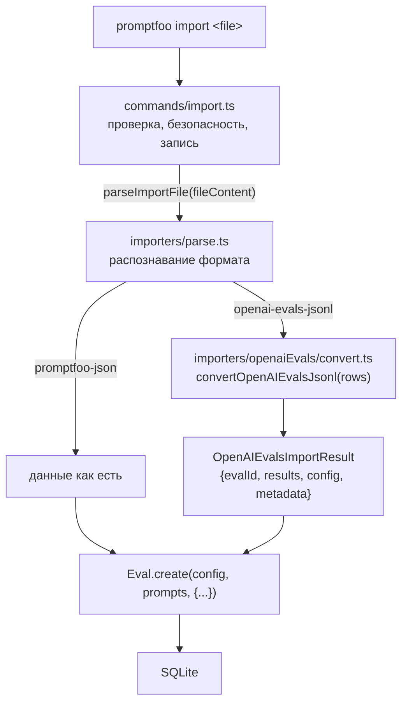
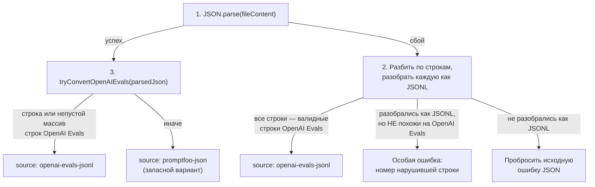
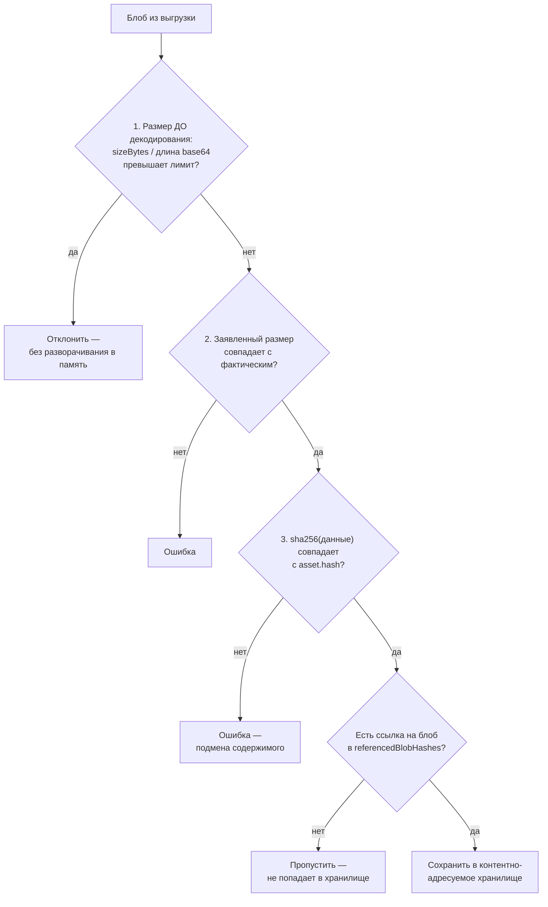

# Импорт чужих прогонов — `src/importers`

> Разбор через призму **Domain-Driven Design**. Диаграммы — ANSI-псевдографика.
> Дополняет [ARCHITECTURE.md](./ARCHITECTURE.md), [EVALUATOR.md](./EVALUATOR.md),
> [BLOBS.md](./BLOBS.md), [CODESCAN.md](./CODESCAN.md), [TRACING.md](./TRACING.md),
> [MODELS.md](./MODELS.md), [COMMANDS.md](./COMMANDS.md), [TYPES.md](./TYPES.md),
> [UTIL.md](./UTIL.md), [SCHEDULER.md](./SCHEDULER.md), [PROMPTS.md](./PROMPTS.md),
> [MATCHERS.md](./MATCHERS.md), [ASSERTIONS.md](./ASSERTIONS.md),
> [PROVIDERS.md](./PROVIDERS.md), [REDTEAM.md](./REDTEAM.md),
> [SERVER.md](./SERVER.md), [APP.md](./APP.md).

---

## 0. Паспорт подсистемы

```
╔══════════════════════════════════════════════════════════════════════════════╗
║  IMPORTERS — антикоррупционный слой для чужих результатов                    ║
╠══════════════════════════════════════════════════════════════════════════════╣
║  Слой в layers.json     legacy-runtime (ярус 2)                              ║
║  Объём                  6 файлов · 582 строки  ← САМАЯ МАЛЕНЬКАЯ подсистема  ║
║  Плюс команда           commands/import.ts · 553 строки                      ║
╠══════════════════════════════════════════════════════════════════════════════╣
║  openaiEvals/convert.ts   409   перевод формата OpenAI в модель promptfoo    ║
║  parse.ts                  82   распознавание формата файла                  ║
║  openaiEvals/types.ts      44   ·  openaiEvals/validation.ts 31              ║
║  types.ts                   8   ·  openaiEvals/index.ts 8                    ║
╠══════════════════════════════════════════════════════════════════════════════╣
║  Поддерживаемых форматов        2  promptfoo-json · openai-evals-jsonl       ║
║  Функций-предикатов             4  без единой зависимости от zod             ║
║  Безопасных MIME-типов при импорте  8 + любой audio/*                        ║
║  Тесты                  2 файла · 1 620 строк  (в 2,8 раза больше кода)      ║
╚══════════════════════════════════════════════════════════════════════════════╝
```

**Формулировка предметной области в одном предложении.** Импортёры — это
**антикоррупционный слой наоборот**: если `src/providers` переводит чужие
протоколы в доменную модель на лету ([PROVIDERS.md](./PROVIDERS.md)), то здесь
переводится **чужой архив результатов**, уже завершённый и сохранённый другой
системой.

**Почему модуль такой маленький.** Форматов поддерживается ровно два, и один
из них — собственный. Вся содержательная работа — 409 строк перевода из
выгрузки OpenAI Evals, где чужая плоская модель отображается в двумерную
матрицу promptfoo.

---

## 1. Единый язык подсистемы

| Термин | Носитель в коде | Смысл |
|---|---|---|
| **ParsedImportFile** | `types.ts` | Размеченное объединение: источник + данные. |
| **IMPORT_SOURCE_PROMPTFOO** | `types.ts` | `'promptfoo-json'` — собственная выгрузка. |
| **IMPORT_SOURCE_OPENAI_EVALS** | `types.ts` | `'openai-evals-jsonl'` — выгрузка панели OpenAI. |
| **OpenAIEvalsJsonlRow** | `openaiEvals/types.ts` | Одна строка чужой выгрузки. |
| **run_id** | поле строки | Прогон OpenAI. Становится **колонкой** матрицы. |
| **data_source_idx** | поле строки | Номер элемента набора. Часть ключа **строки**. |
| **alignment key** | `convert.ts:281` | `${data_source_idx}:${sha256(канонический item)}` — ключ строки. |
| **grades / passes** | поля строки | Числовые оценки и булевы вердикты граверов OpenAI. |
| **ExportedBlobAsset** | `types/index.ts:1511` | Блоб, встроенный в переносимую выгрузку. |
| **SAFE_IMPORTED_BLOB_MIME_TYPES** | `commands/import.ts:102` | Белый список типов, безопасных для выдачи. |

---

## 2. Место подсистемы в архитектуре

```
   promptfoo import <file>
        │
        ▼
   commands/import.ts        553 строки — проверка, безопасность, запись
        │
        │  parseImportFile(fileContent)
        ▼
   importers/parse.ts         82 строки — РАСПОЗНАВАНИЕ ФОРМАТА
        │
        ├─ promptfoo-json      → данные как есть
        └─ openai-evals-jsonl  → convertOpenAIEvalsJsonl(rows)
                                      │
                                      ▼
                              importers/openaiEvals/convert.ts   409 строк
                                      │
                                      ▼
                              OpenAIEvalsImportResult
                                { evalId, results, config, metadata }
        │
        ▼
   Eval.create(config, prompts, { id, createdAt, author, results, … })
        │                                          MODELS.md §3.1
        ▼
   SQLite

 ┌─────────────────────────────────────────────────────────────────────────────┐
 │  РАЗДЕЛЕНИЕ ОБЯЗАННОСТЕЙ ПРОВЕДЕНО ЧЁТКО                                    │
 │                                                                             │
 │    importers/   ЧИСТЫЙ ПЕРЕВОД. Ни файловой системы, ни базы, ни сети.      │
 │                 Вход — строка, выход — структура. 582 строки.               │
 │                                                                             │
 │    commands/    ВСЁ ОСТАЛЬНОЕ: чтение файла, проверка целостности           │
 │      import.ts  блобов, санитизация MIME-типов, создание агрегата.          │
 │                 553 строки.                                                 │
 │                                                                             │
 │  Модуль перевода можно вызвать из теста, передав строку, — и это            │
 │  единственная причина, по которой на 582 строки кода приходится             │
 │  1 620 строк тестов.                                                        │
 └─────────────────────────────────────────────────────────────────────────────┘
```

Тот же путь файла как Mermaid-диаграмма:



**Своими словами.** Это таможенный пункт с переводчиком, сидящим сбоку. Файл
приходит на границу, и первым его встречает пограничник (`commands/import.ts`) —
он не разбирается, что внутри, а проверяет общую безопасность посылки и
готовит её к оформлению. Дальше посылку относят к эксперту по формату
(`importers/parse.ts`), который смотрит на неё и определяет: это свой,
доморощенный формат, или иностранный. Если свой — посылку пропускают как
есть, без изменений. Если иностранный (выгрузка OpenAI Evals) — её отдают
переводчику (`convert.ts`), который построчно пересобирает содержимое в
формат, понятный местному складу. После перевода, каким бы путём посылка ни
шла, обе дорожки сходятся в одной точке приёмки (`Eval.create`), которая
не знает и не обязана знать, откуда именно приехал груз — своим он был или
переведённым, — и кладёт его на общий склад (SQLite) по одним и тем же
правилам.

---

## 3. Распознавание формата: три попытки по убыванию строгости

```
   parseImportFile(fileContent)                            parse.ts:48

 ┌─────────────────────────────────────────────────────────────────────────────┐
 │                                                                             │
 │   1  JSON.parse(fileContent)                                                │
 │        УСПЕХ  →  это цельный JSON, идём к шагу 3                            │
 │        СБОЙ   →  возможно, это JSONL, идём к шагу 2                         │
 │                                                                             │
 │   2  parseJsonlLines: разбить по строкам, разобрать каждую                  │
 │        ВСЕ строки — валидные строки OpenAI Evals                            │
 │            →  { source: 'openai-evals-jsonl', evalData: convert(rows) }     │
 │                                                                             │
 │        разобрались как JSONL, но НЕ похожи на OpenAI Evals                  │
 │            →  ОСОБАЯ ОШИБКА, см. ниже                                       │
 │                                                                             │
 │        не разобрались как JSONL                                             │
 │            →  пробросить ИСХОДНУЮ ошибку JSON                               │
 │                                                                             │
 │   3  tryConvertOpenAIEvals(parsedJson)                                      │
 │        одна строка OpenAI Evals ИЛИ непустой массив таких строк             │
 │            →  { source: 'openai-evals-jsonl', … }                           │
 │        иначе                                                                │
 │            →  { source: 'promptfoo-json', evalData: parsedJson }            │
 │              ↑ ЗАПАСНОЙ ВАРИАНТ: всё, что не опознано как чужое,            │
 │                считается своим                                              │
 └─────────────────────────────────────────────────────────────────────────────┘

 ┌─────────────────────────────────────────────────────────────────────────────┐
 │  ДЕТАЛЬ, РАДИ КОТОРОЙ НАПИСАНА ОТДЕЛЬНАЯ ВЕТКА ОШИБКИ                       │
 ├─────────────────────────────────────────────────────────────────────────────┤
 │                                                                             │
 │   Комментарий объясняет:                                                    │
 │                                                                             │
 │     «Файл разобрался чисто как JSONL, но не является корректной             │
 │      выгрузкой OpenAI Evals. Переброс ошибки JSON всего файла здесь         │
 │      УКАЗАЛ БЫ НА ФИКТИВНУЮ ПОЗИЦИЮ; сообщаем о несоответствии схемы        │
 │      и указываем нарушившую строку.»                                        │
 │                                                                             │
 │     const invalidRowIndex = parsedRows.findIndex(row => !isValid(row));     │
 │     throw new Error(`File parsed as JSONL but line ${idx + 1} is not        │
 │       a valid OpenAI Evals row. …`);                                        │
 │                                                                             │
 │   ┌───────────────────────────────────────────────────────────────────┐     │
 │   │  Без этой ветки пользователь увидел бы что-то вроде               │     │
 │   │  «Unexpected token { in JSON at position 4127» — позицию          │     │
 │   │  во ВСЁМ файле, которая ничего не означает, потому что файл       │     │
 │   │  и не должен был быть цельным JSON.                               │     │
 │   │                                                                    │    │
 │   │  Вместо этого называется НОМЕР СТРОКИ и говорится, каких           │    │
 │   │  двух форматов ожидали. Диагностика стоит четырёх строк кода.     │     │
 │   └───────────────────────────────────────────────────────────────────┘     │
 └─────────────────────────────────────────────────────────────────────────────┘
```

Та же цепочка попыток как Mermaid-диаграмма:



**Своими словами.** Представь приёмщика посылок, который проверяет содержимое
по убывающей строгости, как таможенник, у которого всего три попытки понять,
что перед ним. Сначала он пробует прочитать содержимое целиком, одним куском
(`JSON.parse`) — если получилось, он переходит сразу к третьей, самой точной
проверке. Если не получилось — это не значит «мусор», это значит «возможно,
посылка составлена из отдельных строчек» (JSONL), и он пробует прочитать её
построчно. Тут развилка на три исхода: все строчки оказались правильными
бланками известной иностранной формы (OpenAI Evals) — готово, формат
определён; строчки читаются, но бланк не тот — это отдельный, самый ценный
случай, потому что вместо «где-то в файле ошибка» приёмщик называет ТОЧНЫЙ
номер неправильной строки; а если файл вообще не читается построчно, приёмщик
возвращает самую первую ошибку — она честнее, чем ошибка от неудачной
попытки прочитать построчно то, что и не должно было ею быть. Третья, самая
точная проверка смотрит: похоже ли содержимое на одну или несколько записей
иностранного бланка — и если нет, срабатывает запасной вариант: раз это не
опознано как чужое, значит это своё, и посылку пропускают под этим
предположением.

### 3.1. Валидация без zod

```
   isOpenAIEvalsJsonlRow(value)                    validation.ts:17

     isRecord(value)
     typeof value.run_id === 'string'
     typeof value.data_source_idx === 'number'
       && Number.isInteger(...)  && >= 0
     isRecord(value.item)
     value.sample === undefined || isRecord(value.sample)
     isNumberRecord(value.grades)          ← все значения конечные числа
     value.grader_samples === undefined || isRecord(...)
     value.passes === undefined || isBooleanRecord(...)

 ┌─────────────────────────────────────────────────────────────────────────────┐
 │  ПОЧЕМУ ЗДЕСЬ НЕТ ZOD, ХОТЯ ВЕСЬ РЕПОЗИТОРИЙ НА НЁМ                         │
 │                                                                             │
 │   Схема нужна не для валидации ПОЛЬЗОВАТЕЛЬСКОГО ввода с внятной            │
 │   диагностикой, а для БЫСТРОГО РАЗЛИЧЕНИЯ ДВУХ ФОРМАТОВ. Предикат           │
 │   вызывается на каждой строке файла — и на массиве в тысячи строк           │
 │   разница между ручной проверкой и safeParse заметна.                       │
 │                                                                             │
 │   Плюс семантика: здесь нужен ответ «да/нет», а не разобранный              │
 │   объект с приведёнными типами. Функция-предикат с сужением типа            │
 │   (`value is OpenAIEvalsJsonlRow`) даёт ровно это.                          │
 │                                                                             │
 │   Отдельно отмечу isNumberRecord: проверяется не только тип, но и           │
 │   Number.isFinite — NaN и Infinity в оценках отсекаются на входе,           │
 │   а не всплывают позже при подсчёте средних.                                │
 └─────────────────────────────────────────────────────────────────────────────┘
```

---

## 4. Перевод модели: из плоского списка в матрицу

Содержательная часть подсистемы. Две модели устроены по-разному, и весь
`convert.ts` — про их согласование.

```
 ┌─────────────────────────────────────────────────────────────────────────────┐
 │  ЧУЖАЯ МОДЕЛЬ — плоский список строк                                        │
 ├─────────────────────────────────────────────────────────────────────────────┤
 │    { run_id: 'run_A', data_source_idx: 0, item: {...}, grades: {...} }      │
 │    { run_id: 'run_A', data_source_idx: 1, item: {...}, grades: {...} }      │
 │    { run_id: 'run_B', data_source_idx: 0, item: {...}, grades: {...} }      │
 │    { run_id: 'run_B', data_source_idx: 1, item: {...}, grades: {...} }      │
 ├─────────────────────────────────────────────────────────────────────────────┤
 │  СВОЯ МОДЕЛЬ — двумерная матрица promptIdx × testIdx                        │
 ├─────────────────────────────────────────────────────────────────────────────┤
 │                                                                             │
 │                    промпт 0        промпт 1                                 │
 │                    (run_A)         (run_B)                                  │
 │       тест 0    ┌─────────────┬─────────────┐                               │
 │       item X    │ EvaluateResult│EvaluateResult│                            │
 │                 ├─────────────┼─────────────┤                               │
 │       тест 1    │ EvaluateResult│EvaluateResult│                            │
 │       item Y    └─────────────┴─────────────┘                               │
 │                                                                             │
 │    run_id           →  КОЛОНКА (promptIdx)                                  │
 │    alignment key    →  СТРОКА  (testIdx)                                    │
 └─────────────────────────────────────────────────────────────────────────────┘
```

### 4.1. Ключ выравнивания: как совместить строки разных прогонов

```
   getOpenAIItemAlignmentKey(row)                   convert.ts:281

     itemHash = sha256(JSON.stringify(canonicalizeOpenAIItem(row.item)))
     return `${row.data_source_idx}:${itemHash}`

   canonicalizeOpenAIItem(value)                    convert.ts:265
     рекурсивно СОРТИРУЕТ КЛЮЧИ объектов, сохраняя порядок массивов

 ┌─────────────────────────────────────────────────────────────────────────────┐
 │  ЗАЧЕМ КАНОНИЗАЦИЯ                                                          │
 │                                                                             │
 │    Два прогона над одним набором данных должны лечь в ОДНУ строку           │
 │    таблицы — иначе сравнение прогонов невозможно, а именно ради             │
 │    сравнения импорт и делается.                                             │
 │                                                                             │
 │    Но JSON.stringify зависит от порядка ключей: { a: 1, b: 2 } и            │
 │    { b: 2, a: 1 } дают разные строки и разные хэши. Порядок ключей          │
 │    в выгрузке не гарантирован ничем.                                        │
 │                                                                             │
 │    Рекурсивная сортировка ключей делает хэш зависящим только от             │
 │    СОДЕРЖИМОГО. Массивы при этом НЕ сортируются — в них порядок             │
 │    значим.                                                                  │
 ├─────────────────────────────────────────────────────────────────────────────┤
 │  ПОЧЕМУ В КЛЮЧЕ ЕЩЁ И data_source_idx                                       │
 │                                                                             │
 │    Одинаковый элемент может встретиться в наборе дважды — например,         │
 │    дубликат в датасете. Хэш содержимого их не различит, и два               │
 │    разных теста схлопнулись бы в один.                                      │
 │                                                                             │
 │    Пара «номер + хэш» различает и одинаковые элементы на разных             │
 │    позициях, и одинаковые позиции с разным содержимым (что                  │
 │    означало бы разные наборы данных).                                       │
 └─────────────────────────────────────────────────────────────────────────────┘
```

### 4.2. Сборка за один проход

```
   convertOpenAIEvalsJsonl(rows)                    convert.ts:333

     ПРОХОД 1 — построение индексов
       promptIdxByRunId       run_id → номер колонки (в порядке появления)
       rowsByRunId            строки, сгруппированные по прогону
       firstRowByAlignmentKey первая строка каждого ключа выравнивания
       testIdxByAlignmentKey  ключ → номер строки (в порядке появления)
       alignmentKeyByRow      ключ для каждой исходной строки

     ПРОХОД 2 — создание результатов
       для каждой строки: promptIdx и testIdx уже известны из индексов

     ПРОХОД 3 — метрики промптов
       createOpenAIPromptMetrics по результатам каждой колонки

     tests = первые строки каждого ключа → AtomicTestCase[]

   ┌───────────────────────────────────────────────────────────────────────┐
   │  ПОРЯДОК КОЛОНОК И СТРОК — ПО ПЕРВОМУ ПОЯВЛЕНИЮ                       │
   │                                                                       │
   │  Ни run_id, ни ключи выравнивания не сортируются. Матрица             │
   │  сохраняет порядок исходного файла, и импорт одного и того же         │
   │  файла дважды даёт идентичную таблицу.                                │
   └───────────────────────────────────────────────────────────────────────┘
```

### 4.3. Идентификатор прогона: два случая

```
   evalId =
     один run_id      →  `openai-evals-${sanitize(runIds[0])}`
     несколько        →  `openai-evals-runs-${sha256(sorted.join('\n')).slice(0,24)}`

   sanitizeOpenAIEvalsIdPart(value) = value.replace(/[^A-Za-z0-9_-]/g, '_')

   ┌───────────────────────────────────────────────────────────────────────┐
   │  Для одного прогона идентификатор ЧИТАЕМ и содержит исходный run_id   │
   │  — по нему можно найти прогон в панели OpenAI.                        │
   │                                                                       │
   │  Для нескольких читаемость невозможна (имена не влезут), поэтому      │
   │  берётся хэш ОТСОРТИРОВАННОГО списка: набор прогонов { A, B }         │
   │  и { B, A } — это один и тот же импорт, и повторный импорт            │
   │  тех же прогонов даст тот же идентификатор.                           │
   │                                                                       │
   │  Санитизация небуквенно-цифровых символов нужна, потому что           │
   │  идентификатор становится первичным ключом и попадает в URL.          │
   └───────────────────────────────────────────────────────────────────────┘
```

---

## 5. Перевод оценок: чужие граверы в `GradingResult`

```
   OpenAI даёт по каждой строке два словаря:
     grades:  { 'grader_1': 0.87, 'grader_2': 1.0 }     ЧИСЛА
     passes:  { 'grader_1': true, 'grader_2': false }   БУЛЕВЫ

   promptfoo ожидает GradingResult с componentResults (ASSERTIONS.md §4)

 ┌─────────────────────────────────────────────────────────────────────────────┐
 │  СООТВЕТСТВИЕ                                                               │
 ├─────────────────────────────────────────────────────────────────────────────┤
 │                                                                             │
 │   каждый гравер  →  componentResult:                                        │
 │       pass         из passes[graderName]                                    │
 │       score        pass ? 1 : 0        ← НЕ из grades!                      │
 │       namedScores  { [graderName]: grade }   ← сюда идёт число              │
 │       reason       «OpenAI grader "X" passed with grade 0.87.»              │
 │       metadata     openaiGraderName · openaiGrade · openaiPass ·            │
 │                    openaiGraderSample                                       │
 │                                                                             │
 │   итог  →  GradingResult:                                                   │
 │       pass    ВСЕ граверы прошли (или их нет вовсе)                         │
 │       score   passedCount / totalCount                                      │
 │       reason  перечисление НЕ прошедших по имени                            │
 │                                                                             │
 │   ┌───────────────────────────────────────────────────────────────────┐     │
 │   │  ТОНКОСТЬ: score компонента — БУЛЕВ (0 или 1), а числовая          │    │
 │   │  оценка уходит в namedScores.                                      │    │
 │   │                                                                    │    │
 │   │  Это верно по смыслу: в модели promptfoo score компонента —        │    │
 │   │  вклад в средневзвешенное (ASSERTIONS.md §8), а grade у OpenAI     │    │
 │   │  это независимая метрика гравера, чья шкала неизвестна.            │    │
 │   │  Складывать чужие шкалы в общий балл было бы неверно;              │    │
 │   │  показывать их как именованные метрики — правильно.                │    │
 │   │                                                                    │    │
 │   │  Пустой набор граверов даёт pass: true и score: 1 —                │    │
 │   │  «нечего проверять» трактуется как успех.                          │    │
 │   └───────────────────────────────────────────────────────────────────┘     │
 └─────────────────────────────────────────────────────────────────────────────┘
```

### 5.1. Прочие переводы

```
   createOpenAIEvalsPrompt(runId, rows)

     hasStringInput = все строки имеют item.input типа string
       да   →  raw = '{{item.input}}'   ← РАБОЧИЙ ШАБЛОН Nunjucks
       нет  →  raw = 'Imported OpenAI eval item'   ← заглушка

     provider = `openai-evals:${runId}`   ← синтетический идентификатор

   ┌───────────────────────────────────────────────────────────────────────┐
   │  Если входы были строками, импортированный «промпт» становится        │
   │  настоящим шаблоном — и импортированный прогон можно ПЕРЕЗАПУСТИТЬ    │
   │  в promptfoo, подставив свой провайдер. Если нет — остаётся только    │
   │  просмотр.                                                            │
   │                                                                       │
   │  Провайдер синтетический: openai-evals:<run_id> не разрешится ни      │
   │  одной фабрикой (PROVIDERS.md §5.3), и это правильно — прогон уже     │
   │  состоялся, вызывать некого.                                          │
   └───────────────────────────────────────────────────────────────────────┘

   getOpenAITokenUsage · getOpenAISampleError · getOpenAIOutput ·
   getOpenAIFailureReason · createOpenAIResponse
     — восстановление ProviderResponse из чужого поля sample,
       у которого типизировано лишь несколько полей, а остальное
       объявлено как [key: string]: unknown
```

---

## 6. Безопасность импорта: чужой файл как недоверенный ввод

Сам модуль перевода данные не проверяет — этим занимается команда. И там
модель угроз проговорена явно.

```
 ┌─────────────────────────────────────────────────────────────────────────────┐
 │  commands/import.ts:100                                                     │
 │                                                                             │
 │    // Portable exports are untrusted input; imported blobs must not         │
 │    // become active same-origin content.                                    │
 │                                                                             │
 │    «Переносимые выгрузки — НЕДОВЕРЕННЫЙ ВВОД; импортированные блобы         │
 │     не должны становиться АКТИВНЫМ КОНТЕНТОМ ТОГО ЖЕ ИСТОЧНИКА.»            │
 ├─────────────────────────────────────────────────────────────────────────────┤
 │  БЕЛЫЙ СПИСОК MIME-ТИПОВ                                                    │
 │                                                                             │
 │    SAFE_IMPORTED_BLOB_MIME_TYPES:                                           │
 │      image/avif · image/gif · image/jpeg · image/png · image/webp           │
 │      video/mp4 · video/ogg · video/webm                                     │
 │    SAFE_IMPORTED_AUDIO_MIME_TYPE_REGEX:  /^audio\/[a-z0-9_+-]+$/i           │
 │                                                                             │
 │    всё остальное  →  'application/octet-stream'                             │
 │                                                                             │
 │    ┌───────────────────────────────────────────────────────────────┐        │
 │    │  ЧТО ЭТО ЗАКРЫВАЕТ                                             │       │
 │    │                                                                │       │
 │    │  Выгрузка приходит от кого угодно — из чата, из письма,        │       │
 │    │  из чужого репозитория. Блоб с типом text/html или             │       │
 │    │  image/svg+xml, отданный сервером просмотра, исполнился бы     │       │
 │    │  в браузере В ИСТОЧНИКЕ ИНТЕРФЕЙСА promptfoo — то есть         │       │
 │    │  получил бы доступ к его localStorage и к API.                 │       │
 │    │                                                                │       │
 │    │  Обратите внимание, что SVG в белый список НЕ входит, хотя     │       │
 │    │  это изображение: SVG может содержать скрипт.                  │       │
 │    │                                                                │       │
 │    │  Приведение к application/octet-stream заставляет браузер      │       │
 │    │  скачать файл, а не исполнить.                                 │       │
 │    └───────────────────────────────────────────────────────────────┘        │
 ├─────────────────────────────────────────────────────────────────────────────┤
 │  ТРИ ПРОВЕРКИ ЦЕЛОСТНОСТИ БЛОБА                                             │
 │                                                                             │
 │    1  РАЗМЕР ДО ДЕКОДИРОВАНИЯ                                               │
 │         asset.sizeBytes > BLOB_MAX_SIZE                                     │
 │         || asset.data.length > MAX_EXPORTED_BLOB_BASE64_LENGTH              │
 │              ↑ ceil(BLOB_MAX_SIZE / 3) × 4 + 4 — точный пересчёт base64     │
 │         Гигантская строка отсекается, НЕ будучи развёрнутой в память.       │
 │                                                                             │
 │    2  ЗАЯВЛЕННЫЙ РАЗМЕР СОВПАДАЕТ С ФАКТИЧЕСКИМ                             │
 │         data.length !== asset.sizeBytes  →  ошибка                          │
 │                                                                             │
 │    3  ХЭШ СОВПАДАЕТ С СОДЕРЖИМЫМ                                            │
 │         sha256(data) !== asset.hash.toLowerCase()  →  ошибка                │
 │              ↑ иначе подделанный хэш позволил бы ПОДМЕНИТЬ содержимое       │
 │                уже существующего блоба в контентно-адресуемом хранилище     │
 │                (BLOBS.md §3)                                                │
 ├─────────────────────────────────────────────────────────────────────────────┤
 │  ИМПОРТИРУЮТСЯ ТОЛЬКО ЛИ ССЫЛАЮЩИЕСЯ БЛОБЫ                                  │
 │                                                                             │
 │    prepareBlobAssets(blobAssets, referencedBlobHashes)                      │
 │      if (!referencedBlobHashes.has(asset.hash.toLowerCase())) → пропустить  │
 │                                                                             │
 │    Блоб, на который никто не ссылается, не попадает в хранилище —           │
 │    выгрузка не может использоваться как способ заполнить чужой диск.        │
 │                                                                             │
 │    Испорченный блоб пропускается с предупреждением, а не рушит импорт.      │
 └─────────────────────────────────────────────────────────────────────────────┘
```

Три проверки и фильтр ссылок как Mermaid-диаграмма:



**Своими словами.** Это досмотр багажа в аэропорту, где каждый следующий
контроль имеет смысл только после того, как пройден предыдущий, и порядок
проверок выбран не случайно. Сначала багаж взвешивают, даже не открывая, —
если он слишком тяжёл уже по заявленному весу и по длине упаковочной ленты,
его разворачивать не станут вовсе, зачем тратить силы на то, что и так не
пропустят (проверка 1, до декодирования base64). Прошёл по весу — сверяют,
совпадает ли вес на бирке с весом на весах: если багаж заявлен на пять
килограммов, а весит семь, это подозрительно само по себе (проверка 2).
Прошёл и это — сверяют пломбу: у каждого чемодана есть заводской слепок
(хэш), и если содержимое внутри подменили хоть на байт, слепок не сойдётся
(проверка 3) — иначе кто-то мог бы подменить содержимое чемодана, который уже
стоит на складе под тем же номером. И только после всех трёх проверок
багаж проверяют на последний, отдельный вопрос: а его вообще кто-нибудь
ждёт на этом рейсе (есть ли на него ссылка)? Если нет — его не грузят на
склад, каким бы целым он ни был, потому что склад не резиновый, а чужой
никем не востребованный чемодан — это способ засорить чужое хранилище.

### 6.1. Совместимость с двумя версиями сводки

```
   isImportableV3Results(results)      version === 3 && prompts[] && results[]
   isImportableLegacyResults(results)  version !== 3 && results[] && table{}

   Обе формы принимаются (TYPES.md §4). Прогон, выгруженный годовалой
   версией promptfoo, импортируется в текущую.
```

---

## 7. Диагноз

```
╔═══════════════════════════════════════════════════════════════════════════╗
║  СИЛЬНЫЕ СТОРОНЫ                                                          ║
╠═══════════════════════════════════════════════════════════════════════════╣
║  ✔ Чистое разделение: перевод не касается ни диска, ни базы, ни сети.     ║
║    Вход — строка, выход — структура. Отсюда 2,8 строки тестов             ║
║    на строку кода.                                                        ║
║                                                                           ║
║  ✔ Ключ выравнивания канонизирует объект перед хешированием, поэтому      ║
║    порядок ключей в чужой выгрузке не влияет на совмещение строк.         ║
║    Массивы при этом не сортируются — там порядок значим.                  ║
║                                                                           ║
║  ✔ Пара «номер + хэш» различает дубликаты элементов в наборе,             ║
║    которые один только хэш схлопнул бы в одну строку.                     ║
║                                                                           ║
║  ✔ Отдельная ветка ошибки для «разобралось как JSONL, но не тот           ║
║    формат» — с номером строки вместо бессмысленной позиции в файле.       ║
║                                                                           ║
║  ✔ Числовые оценки чужих граверов уходят в namedScores, а не в score:     ║
║    чужая шкала не смешивается со средневзвешенным promptfoo.              ║
║                                                                           ║
║  ✔ Идентификатор прогона читаем для одного run_id и устойчив              ║
║    к порядку для нескольких.                                              ║
║                                                                           ║
║  ✔ Импортированный промпт становится рабочим шаблоном, когда входы        ║
║    были строками, — прогон можно перезапустить своими провайдерами.       ║
║                                                                           ║
║  ✔ Белый список MIME-типов при импорте закрывает исполнение чужого        ║
║    контента в источнике интерфейса; SVG намеренно не включён.             ║
║                                                                           ║
║  ✔ Три независимые проверки блоба, включая сверку хэша, — подмена         ║
║    содержимого в контентно-адресуемом хранилище невозможна.               ║
║                                                                           ║
║  ✔ Размер проверяется ДО декодирования base64.                            ║
║                                                                           ║
║  ✔ Обе версии сводки результатов принимаются.                             ║
╠═══════════════════════════════════════════════════════════════════════════╣
║  СЛАБЫЕ МЕСТА                                                             ║
╠═══════════════════════════════════════════════════════════════════════════╣
║  ✘ Нет ни AGENTS.md, ни упоминания в корневом. Вторая подсистема          ║
║    после blobs, о которой в документации репозитория не сказано           ║
║    ничего.                                                                ║
║                                                                           ║
║  ✘ Нет собственного тестового каталога: покрытие обеспечивается           ║
║    через test/commands/import.test.ts и смоук-тест. Модуль перевода       ║
║    тестируется опосредованно, хотя он и написан так, чтобы                ║
║    тестироваться напрямую.                                                ║
║                                                                           ║
║  ✘ Запасной вариант «всё неопознанное — promptfoo-json» означает,         ║
║    что произвольный JSON доходит до Eval.create и падает уже там,         ║
║    с сообщением о структуре, а не о формате файла.                        ║
║                                                                           ║
║  ✘ Расширение под третий формат потребует правки parse.ts: цепочка        ║
║    попыток зашита в функцию, реестра импортёров нет. При двух             ║
║    форматах это уместно, при четырёх станет неудобно.                     ║
║                                                                           ║
║  ✘ Тип OpenAISample почти не типизирован ([key: string]: unknown),        ║
║    и пять функций извлекают из него поля вручную с проверками             ║
║    на каждом шаге.                                                        ║
║                                                                           ║
║  ✘ Санитизация MIME-типов и проверки блобов живут в commands/import,      ║
║    а не рядом с blobs — при том что это правила безопасности              ║
║    хранилища, а не разбора аргументов (COMMANDS.md §4.1).                 ║
╚═══════════════════════════════════════════════════════════════════════════╝
```

### Оценка по осям

```
   Чистота перевода          ████████████████████░  9/10   без побочных эффектов
   Совмещение моделей        ████████████████████░  9/10   канонический ключ
   Безопасность импорта      ██████████████████░░░  8/10   белый список + хэш
   Диагностика ошибок        ████████████████░░░░░  7/10   но не для чужого JSON
   Расширяемость             ████████████░░░░░░░░░  6/10   цепочка вместо реестра
   Документированность       ██████░░░░░░░░░░░░░░░  3/10   нет AGENTS.md
   Тестируемость             ██████████████░░░░░░░  7/10   опосредованно
```

---

## 8. Рекомендации по эволюции

```
   1 · Завести реестр импортёров вместо цепочки попыток.
         interface Importer {
           id: string;
           detect(content: string, parsed?: unknown): boolean;
           convert(content: string, parsed?: unknown): ImportResult;
         }
       Тот же приём, что у фабрик провайдеров (PROVIDERS.md §5.2)
       и плагинов редтима (REDTEAM.md §3). Третий формат — это файл
       плюс строка в массиве, а не правка parse.ts.

   2 · Перенести проверки блобов из commands/import в src/blobs.
       Белый список MIME-типов, сверка хэша и лимиты размера — правила
       хранилища. В commands должен остаться разбор аргументов
       и вызов. Заодно правило станет доступным серверу, который
       тоже принимает блобы.

   3 · Добавить test/importers/ с прямыми тестами перевода.
       Модуль написан чистым специально ради этого — вход строка,
       выход структура. Фикстуры уже есть
       (test/__fixtures__/openai-evals-*.jsonl).

   4 · Написать AGENTS.md.
       Двух абзацев достаточно: чем импортёр отличается от провайдера
       (архив против живого вызова), и что перевод обязан оставаться
       свободным от побочных эффектов.

   5 · Улучшить сообщение для неопознанного JSON.
       Сейчас произвольный файл молча считается выгрузкой promptfoo
       и падает позже. Достаточно лёгкой проверки на наличие
       results/version перед возвратом запасного варианта.

   6 · Типизировать OpenAISample по схеме выгрузки OpenAI.
       Пять функций-извлекателей с ручными проверками можно свести
       к одному предикату, если поля описаны.
```

---

## 9. Карта директории

```
src/importers/                 6 файлов · 582 строки
│
├── types.ts                      8  ParsedImportFile — размеченное объединение
│                                    IMPORT_SOURCE_PROMPTFOO ·
│                                    IMPORT_SOURCE_OPENAI_EVALS
│
├── parse.ts                     82  parseImportFile — три попытки:
│                                      JSON → JSONL → запасной вариант
│                                    tryConvertOpenAIEvals · parseJsonlLines
│                                    ОСОБАЯ ошибка с номером строки
│
└── openaiEvals/                 492
    ├── index.ts                  8  барель
    ├── types.ts                 44  OpenAIEvalsJsonlRow · OpenAISample ·
    │                                OpenAIEvalsImportResult
    ├── validation.ts            31  isOpenAIEvalsJsonlRow · isRecord ·
    │                                isNumberRecord · isBooleanRecord
    │                                ← предикаты без zod
    └── convert.ts              409  convertOpenAIEvalsJsonl
        ├── canonicalizeOpenAIItem       рекурсивная сортировка ключей
        ├── getOpenAIItemAlignmentKey    `${idx}:${sha256(canonical)}`
        ├── createOpenAIEvalsPrompt      колонка матрицы
        ├── createOpenAITestCase         строка матрицы
        ├── createOpenAIGradingResult    граверы → componentResults
        ├── createOpenAIComponentResult  grade → namedScores, pass → score
        ├── createOpenAIResult           EvaluateResult
        ├── createOpenAIResponse         восстановление ProviderResponse
        ├── getOpenAITokenUsage · getOpenAISampleError · getOpenAIOutput
        ├── getOpenAIFailureReason · createOpenAIPromptMetrics
        └── sanitizeOpenAIEvalsIdPart

СМЕЖНОЕ
  commands/import.ts           553  ЧТЕНИЕ ФАЙЛА И БЕЗОПАСНОСТЬ
    SAFE_IMPORTED_BLOB_MIME_TYPES (8 + audio/*)
    sanitizeImportedBlobMimeType → application/octet-stream
    decodeBlobAsset · validateBlobAssetData (размер · длина · хэш)
    prepareBlobAssets (только ссылающиеся) · importBlobAssets
    isImportableV3Results · isImportableLegacyResults
    extractEvalId · extractCreatedAt · extractAuthor · extractVars ·
    extractDurations · deriveVarsFromResults
  util/output.ts               794  ОБРАТНАЯ СТОРОНА: exportBlobAssets
  types/index.ts:1511               ExportedBlobAsset · OutputFile.blobAssets

test/commands/import.test.ts        основное покрытие
test/smoke/export-import.test.ts    круговой прогон выгрузка → импорт
test/__fixtures__/openai-evals-items.jsonl
test/__fixtures__/openai-evals-multi-run-items.jsonl
```

---

## 10. Команды

```bash
promptfoo import results.json              # своя выгрузка
promptfoo import openai-evals-items.jsonl  # выгрузка панели OpenAI
promptfoo export <evalId> -o results.json  # обратная операция
```

Тесты:

```bash
npx vitest run test/commands/import.test.ts
npx vitest run test/smoke/export-import.test.ts
```

Числа из этого документа воспроизводятся так:

```bash
find src/importers -name '*.ts' | xargs cat | wc -l          # 582
wc -l src/commands/import.ts                                 # 553
find test -path '*import*' -name '*.ts' | xargs cat | wc -l  # 1620
```

---

*Документ описывает `src/importers` и смежное `commands/import.ts`
на коммите `2c140ef`, promptfoo 0.122.0. Дата среза — 26 августа 2026.*
