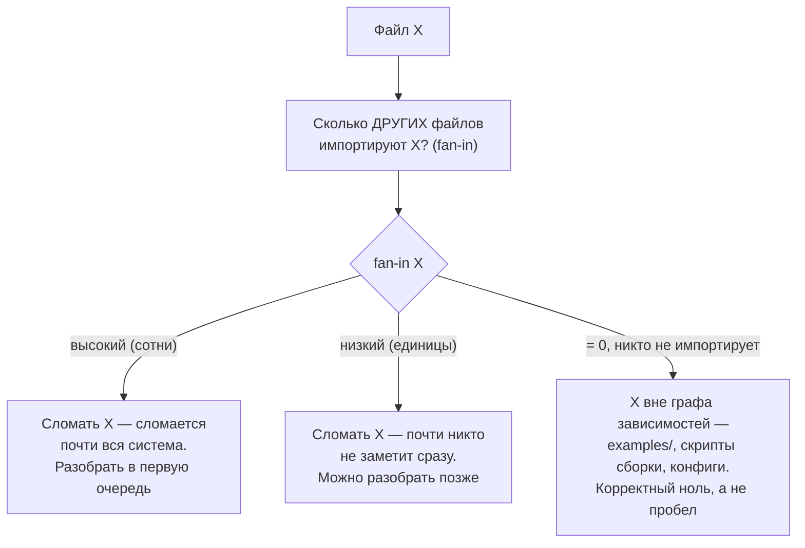
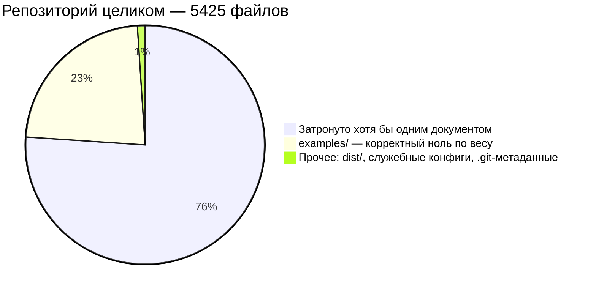

# Индекс кодовой базы и покрытие разборами

> Измеренный, а не оценённый на глаз срез: что в `src/` есть, что разобрано,
> и что осталось — с ранжированием по **архитектурному весу**, а не по объёму.
> Ключевая методика дана и как ANSI-диаграмма, и как Mermaid-диаграмма, с
> объяснением «по Фейнману» — простыми словами, через бытовую аналогию.
>
> Все числа воспроизводятся скриптом из раздела «Как пересчитать».

---

## 0. Что проиндексировано

```
╔══════════════════════════════════════════════════════════════════════════════╗
║  ИНДЕКС src/ — коммит 2c140ef, promptfoo 0.122.0                             ║
╠══════════════════════════════════════════════════════════════════════════════╣
║  Файлов .ts/.tsx ........ 1613     без node_modules, dist, __mocks__         ║
║  Строк .................. 455 262                                            ║
║  Экспортов .............. 4 864    строк, начинающихся с `export `           ║
║  Рёбер импорта .......... 5 543    уникальных пар «файл → файл»              ║
╠══════════════════════════════════════════════════════════════════════════════╣
║  Документов серии ....... 25                                                 ║
║  Разобрано файлов ....... 1561                                               ║
║  Пробел ................. 52 файла · 11 805 строк · 880 входящих импортов    ║
╚══════════════════════════════════════════════════════════════════════════════╝
```

**Fan-in** (входящие импорты) — число файлов, которые импортируют данный файл.
Это и есть архитектурный вес: сколько кода сломается, если изменить контракт.
Метрика по строкам его не улавливает — файл на 47 строк может держать
пятьдесят зависимостей, а файл на 900 строк — семь.

Та же логика как Mermaid-диаграмма — как решается, разбирать файл в первую
очередь, отложить или вообще не считать пробелом:



**Своими словами.** Представь, что каждый файл в кодовой базе — это болт
где-то в механизме, а fan-in — это сколько ДРУГИХ деталей держатся именно
на этом болте. Если выкрутить болт, на котором висит триста деталей
(`src/types/index.ts` — 418 входящих импортов), развалится половина
механизма, и чинить придётся долго. Если выкрутить болт, который держит
одну маленькую крышечку, почти никто не заметит и не торопится это чинить.
А если болт вообще ни к чему не прикручен — просто лежит в коробке рядом
с механизмом (`examples/`, вспомогательные скрипты сборки) — его отсутствие
в списке «уже проверенных болтов» не пробел в проверке, а честный факт: он
не часть механизма, который вообще может сломаться. Разница между «строк
много» и «весит много» ровно в этом: болт на 900 строк может держать всего
семь деталей, а болт на 47 строк — пятьдесят.

---

> **Обновление от 29 августа 2026.** Разделы 0–6 ниже — снимок, снятый после
> двадцати пяти документов; он остаётся как есть, потому что план, который он
> задал, был выполнен пункт за пунктом. Итог с текущими цифрами — в §9 в конце
> файла.

## 1. Покрытие по четырём метрикам

```
╔══════════════════════════════════════════════════════════════════════════════╗
║  РАЗНЫЕ МЕТРИКИ ДАЮТ РАЗНЫЙ ОТВЕТ                                            ║
╠══════════════════════════════════════════════════════════════════════════════╣
║                                                                              ║
║  файлов              1561 / 1613   ███████████████████░   96.8%              ║
║  строк             443 457 / 455 262 ███████████████████░  97.4%             ║
║  экспортов           4 618 / 4 864 ██████████████████░░   94.9%              ║
║  входящих импортов   4 663 / 5 543 ████████████████░░░░   84.1%              ║
║                                    ▲                                         ║
║                                    │ ЧЕСТНАЯ ЦИФРА                           ║
╠══════════════════════════════════════════════════════════════════════════════╣
║  Разрыв в 13 процентных пунктов между строками и весом — не погрешность.     ║
║  Он означает, что непокрытыми остались МАЛЕНЬКИЕ, но ЦЕНТРАЛЬНЫЕ файлы.      ║
╚══════════════════════════════════════════════════════════════════════════════╝
```

Метрика по строкам льстит, потому что взвешена двумя гигантами: `src/app`
(207 458 строк) и `src/providers` (98 940). Разобрать их было правильно, но
их объём прячет то, что осталось.

---

## 2. Топ-20 самых зависимых файлов кодовой базы

```
    #  файл                                    вход   строк   статус
   ────────────────────────────────────────────────────────────────────
    1  src/types/index.ts                       418    1571   ✔ TYPES.md
    2  src/logger.ts                            384     560   ✘ НЕ РАЗОБРАН
    3  src/envars.ts                            163     609   ✘ НЕ РАЗОБРАН
    4  src/util/invariant.ts                    119      28   ✔ UTIL.md
    5  src/redteam/plugins/base.ts              113     582   ✔ REDTEAM.md
    6  src/types/env.ts                          98       2   ✔ TYPES.md
    7  src/providers/shared.ts                   86     488   ✔ PROVIDERS.md
    8  src/types/providers.ts                    85     216   ✔ TYPES.md
    9  src/cache.ts                              83     988   ✔ CACHE.md
   10  src/app/…/redteam/setup/types.ts          64     152   ✔ APP.md
   11  src/util/fetch/index.ts                   61     724   ✔ UTIL.md
   12  src/util/index.ts                         58      36   ✔ UTIL.md
   13  src/cliState.ts                           55     118   ✘ НЕ РАЗОБРАН
   14  src/util/json.ts                          51     417   ✔ UTIL.md
   15  src/constants.ts                          49      47   ✘ НЕ РАЗОБРАН
   16  src/util/tokenUsageUtils.ts                46     404   ✔ UTIL.md
   17  src/providers/openai/types.ts              45     311   ✔ PROVIDERS.md
   18  src/providers/openai/chat.ts               44     811   ✔ PROVIDERS.md
   19  src/redteam/remoteGeneration.ts            43     210   ✔ REDTEAM.md
   20  src/globalConfig/accounts.ts               43     361   ✘ НЕ РАЗОБРАН

   разобрано 15 из 20 · не разобрано 5 — и все пять из одной группы
```

`src/logger.ts` — **второй по зависимости файл всей системы**, 384 входящих
импорта против 418 у `src/types/index.ts`. Пятьсот шестьдесят строк, которые
знает почти каждый модуль, и ни одного слова о них в двадцати пяти документах.

---

## 3. Пробел, сгруппированный по смыслу

```
╔══════════════════════════════════════════════════════════════════════════════╗
║  52 НЕПОКРЫТЫХ ФАЙЛА · 11 805 СТРОК · 880 ВХОДЯЩИХ ИМПОРТОВ                  ║
╠══════════════════════════════════════════════════════════════════════════════╣
║                                                                              ║
║  ▸ ИНФРАСТРУКТУРНЫЙ ХРЕБЕТ        723 вход · 2 130 строк · 7 файлов          ║
║      src/logger.ts                 384    560   логирование и санитизация    ║
║      src/envars.ts                 163    609   реестр переменных окружения  ║
║      src/cliState.ts                55    118   глобальное состояние запуска ║
║      src/constants.ts               49     47   константы верхнего уровня    ║
║      src/telemetry.ts               37    256   отправка событий             ║
║      src/esm.ts                     28    504   загрузка модулей ESM/CJS     ║
║      src/version.ts                  7     36   версия пакета                ║
║                                                                              ║
║  ▸ ГЛОБАЛЬНАЯ КОНФИГУРАЦИЯ         68 вход ·   802 строки · 3 файла          ║
║      globalConfig/accounts.ts       43    361   учётная запись, email        ║
║      globalConfig/cloud.ts          22    378   подключение к облаку         ║
║      globalConfig/globalConfig.ts    3     63   чтение ~/.promptfoo          ║
║                                                                              ║
║  ▸ ХРАНИЛИЩЕ И ОБМЕН               24 вход · 1 620 строк · 5 файлов          ║
║      src/share.ts                    7    902   публикация прогона           ║
║      storage/*                      13    568   абстракция файлового слоя    ║
║      src/migrate.ts                  4    150   применение миграций          ║
║                                                                              ║
║  ▸ МОСТЫ В ЧУЖИЕ ЯЗЫКИ             20 вход · 1 449 строк · 7 файлов          ║
║      python/pythonUtils.ts          12    396   + worker, workerPool, stderr ║
║      ruby/rubyUtils.ts               2    399   + wrapper                    ║
║                                                                              ║
║  ▸ ФОРМАТЫ И ВЫВОД                 10 вход ·   908 строк · 4 файла           ║
║      table.ts · csv.ts · googleSheets.ts · microsoftSharepoint.ts            ║
║                                                                              ║
║  ▸ ПРОЧЕЕ                          35 вход · 4 896 строк · 26 файлов         ║
║      testCase/synthesis · updates · remoteGrading · external/matchers · …    ║
╚══════════════════════════════════════════════════════════════════════════════╝
```

### Один вывод, который меняет план

```
   ┌──────────────────────────────────────────────────────────────────────┐
   │                                                                      │
   │  Инфраструктурный хребет — 7 файлов и 2 130 строк — несёт            │
   │  723 из 880 непокрытых входящих импортов. Это 82% пробела            │
   │  в 18% его объёма.                                                   │
   │                                                                      │
   │  Один src/logger.ts (560 строк) — это 384 импорта, то есть           │
   │  44% всего оставшегося архитектурного веса.                          │
   │                                                                      │
   │  Разобрав семь файлов, покрытие по весу вырастет                     │
   │  с 84.1% до 97.1%.                                                   │
   └──────────────────────────────────────────────────────────────────────┘
```

Для сравнения: `src/share.ts` — 902 строки, и его хочется взять следующим
«по объёму». Но у него **7 входящих импортов**. Разбор `constants.ts` на
47 строк даст архитектуре в семь раз больше.

---

## 4. Что уже разобрано: 25 документов

```
   документ                  файлов    строк    вход
   ──────────────────────────────────────────────────
   APP.md                       695   207458     970
   UTIL.md                      101    19411     838
   PROVIDERS.md                 244    98940     737
   TYPES.md                      29     4210     725
   REDTEAM.md                   221    51146     676
   ──────────────────────────────────────────────────
   CACHE.md                       1      988      83
   TRACING.md                    21     6476      83
   ASSERTIONS.md                 57     8992      74
   COMMANDS.md                   50    11185      66
   MODELS.md                      6     3639      55
   MATCHERS.md                   11     3181      52
   DATABASE.md                    5     1403      37
   BLOBS.md                       8     1388      37
   CONTRACTS.md                  13      902      36
   SERVER.md                     21     5399      35
   CODESCAN.md                   23     3518      31
   SCHEDULER.md                  12     1908      29
   PROMPTS.md                    15     1269      27
   NODE.md                       10     3005      20
   EVALUATOR-HELPERS.md           1      889      13
   VALIDATORS.md                  5      792      13
   IMPORTERS.md                   6      588      10
   INTEGRATIONS.md                4      744       9
   EVALUATOR.md                   1     5074       6
   OPTIMIZER.md                   1      952       1
```

Пять верхних документов покрывают 84% всего веса системы. Нижняя половина
таблицы — узкие подсистемы с малым fan-in, и это правильно: `EVALUATOR.md`
с шестью входящими импортами описывает файл на 5074 строки, от которого
почти никто не зависит напрямую, потому что он сам всех вызывает.

**Fan-in документа ≠ его важность.** `OPTIMIZER.md` с единственным входящим
импортом описывает целую функцию продукта. Метрика измеряет связность,
а не ценность.

---

## 5. Чего этот индекс не покрывает

```
   ┌── Вне src/ ──────────────────────────────────────────────────────────┐
   │  test/            1114 файлов   тестовая архитектура не разобрана    │
   │  site/            дока-сайт     0 упоминаний в обзоре                │
   │  drizzle/         52 файла      миграции — задеты в DATABASE.md      │
   │  .github/         20 файлов     CI и релиз — 0 упоминаний            │
   │  scripts/         17 файлов     генераторы — задет generateJsonSchema│
   │  examples/        примеры       1 упоминание                         │
   └──────────────────────────────────────────────────────────────────────┘

   ┌── Ограничения самого индекса ────────────────────────────────────────┐
   │  · Считаются только относительные импорты (./ и ../).                │
   │    Импорты по имени пакета не учитываются — они не создают           │
   │    внутренних рёбер.                                                 │
   │  · Пара «файл → файл» считается один раз, сколько бы символов        │
   │    ни импортировалось.                                               │
   │  · Динамический import() учитывается наравне со статическим.         │
   │  · `export ` считается по началу строки: `export {a, b}` — один.     │
   │    Число экспортов поэтому ЗАНИЖЕНО и годится для сравнения          │
   │    файлов между собой, а не как абсолютная величина.                 │
   │  · Покрытие приписано по каталогу: если документ разбирает           │
   │    `src/util`, покрытыми считаются все 101 файл каталога, хотя       │
   │    UTIL.md разбирает не каждый.                                      │
   └──────────────────────────────────────────────────────────────────────┘
```

Последнее ограничение — самое существенное. **97.4% по строкам означает
«файл принадлежит разобранному каталогу», а не «файл описан лично».**
Честная нижняя оценка глубины разбора — 25 документов на 1613 файлов.

---

## 6. Порядок дальнейшей работы по данным индекса

```
   приоритет   что                              вход   строк   даст
   ─────────────────────────────────────────────────────────────────────
      1        logger.ts                         384     560   +6.9 п.п.
      2        envars.ts                         163     609   +2.9 п.п.
      3        cliState.ts + constants.ts        104     165   +1.9 п.п.
      4        telemetry.ts + esm.ts + version    72     796   +1.3 п.п.
   ─────────────────────────────────────────────────────────────────────
      итого хребет                               723   2 130   84.1 → 97.1%
   ─────────────────────────────────────────────────────────────────────
      5        globalConfig/*                     68     802   +1.2 п.п.
      6        share.ts + storage/* + migrate     24   1 620   +0.4 п.п.
      7        мосты python/ruby/golang           20   1 449   +0.4 п.п.
      8        форматы вывода                     10     908   +0.2 п.п.
```

Семь файлов хребта естественно ложатся в **один документ**: у них общая
природа — это не подсистемы, а сквозные службы, которые вызывают отовсюду
и которые ничего не знают о домене. Разбирать их по отдельности значило бы
семь раз повторить одно и то же введение.

---

## Как пересчитать

Скрипт строит индекс с нуля: обходит `src/`, считает строки и экспорты,
разрешает относительные импорты в реальные файлы и считает fan-in.

```python
import os, re, json, collections

ROOT = 'promptfoo'                      # корень репозитория promptfoo
SRC  = os.path.join(ROOT, 'src')
SKIP_DIRS = {'node_modules', 'dist', '__mocks__', '.vite'}

files = {}
for root, dirs, fs in os.walk(SRC):
    dirs[:] = [d for d in dirs if d not in SKIP_DIRS]
    for f in fs:
        if not f.endswith(('.ts', '.tsx')):
            continue
        p = os.path.join(root, f)
        rel = os.path.relpath(p, ROOT)
        src = open(p, encoding='utf-8', errors='ignore').read()
        files[rel] = {
            'lines': src.count('\n') + 1,
            'exports': len(re.findall(r'^export ', src, re.M)),
            'src': src,
        }

IMPORT_RE = re.compile(r"""(?:from|import)\s+['"](\.[^'"]+)['"]""")

def resolve(importer_rel, spec):
    base = os.path.dirname(os.path.join(ROOT, importer_rel))
    target = re.sub(r'\.js$', '', os.path.normpath(os.path.join(base, spec)))
    for cand in (target + '.ts', target + '.tsx',
                 os.path.join(target, 'index.ts'),
                 os.path.join(target, 'index.tsx'), target):
        rel = os.path.relpath(cand, ROOT)
        if rel in files:
            return rel
    return None

fanin = collections.Counter()
for rel, info in files.items():
    for t in {resolve(rel, s) for s in IMPORT_RE.findall(info['src'])}:
        if t and t != rel:
            fanin[t] += 1

for rel in files:
    files[rel]['fanin'] = fanin.get(rel, 0)
    del files[rel]['src']

print('файлов:', len(files))
print('строк:', sum(v['lines'] for v in files.values()))
print('экспортов:', sum(v['exports'] for v in files.values()))
print('рёбер:', sum(fanin.values()))

top = sorted(files.items(), key=lambda x: -x[1]['fanin'])[:20]
for i, (rel, v) in enumerate(top, 1):
    print(f"{i:>3} {rel:<40}{v['fanin']:>6}{v['lines']:>8}")
```

Ожидаемый вывод на коммите `2c140ef`: 1613 файлов, 455 262 строки,
4864 экспорта, 5543 ребра; на первом месте `src/types/index.ts` (418),
на втором `src/logger.ts` (384).

```bash
# Проверка отдельных чисел без скрипта
find promptfoo/src -name '*.ts' -o -name '*.tsx' | grep -v node_modules | wc -l
grep -rc "from '.*logger'" promptfoo/src --include=*.ts --include=*.tsx | grep -c ':[1-9]'
wc -l promptfoo/src/logger.ts promptfoo/src/envars.ts promptfoo/src/cliState.ts
```

---

## 7. Итог: что изменилось после хребта, мостов и остального

Между §0–6 и этой строкой вышло восемь документов: [SPINE.md](SPINE.md),
[GLOBALCONFIG.md](GLOBALCONFIG.md), [SHARE-STORAGE.md](SHARE-STORAGE.md),
[BRIDGES.md](BRIDGES.md), [OUTPUT-FORMATS.md](OUTPUT-FORMATS.md) — закрывшие
именно тот пробел, который §3 назвал приоритетным, — и три документа за
пределами `src/`: [TEST-ARCHITECTURE.md](TEST-ARCHITECTURE.md) и
[CI-AND-DOCS.md](CI-AND-DOCS.md).

### 7.1. `src/`: с 84.1% до 99.3% по весу

```
╔══════════════════════════════════════════════════════════════════════════════╗
║  ПОКРЫТИЕ src/ — ПЕРЕСЧЁТ ПО ТЕМ ЖЕ ЧЕТЫРЁМ МЕТРИКАМ                         ║
╠══════════════════════════════════════════════════════════════════════════════╣
║                             было (§1)          стало (сейчас)                ║
║  файлов                  96.8%  (1561/1613)   98.3%  (1586/1613)             ║
║  строк                   97.4%                98.9%                          ║
║  экспортов                94.9%                98.1%                         ║
║  входящих импортов        84.1%   ◄── была    99.3%   ◄── стала              ║
║                             честной цифрой       честной цифрой              ║
╚══════════════════════════════════════════════════════════════════════════════╝
```

Оставшихся непокрытых файлов — **27**, их суммарный fan-in — **39**, строк — **5046**.
Для сравнения: один только `src/logger.ts`, закрытый в SPINE.md, нёс 384 —
в десять раз больше, чем весь нынешний остаток вместе взятый.

```
   ЧТО ЕЩЁ НЕ РАЗОБРАНО В src/ (по убыванию веса)
   ──────────────────────────────────────────────────────────────
   src/testCase/synthesis.ts                4 вход   234 строки
   src/migrate.ts                            4        150
   src/updates.ts                            4        129
   src/remoteGrading.ts                      3        107
   src/envOverrides.ts                       3         36
   src/external/matchers/deepeval.ts         2        121
   src/external/matchers/conversationRelevancyTemplate.ts 2  80
   src/updates/updateCommands.ts             2         47
   src/telemetryEvents.ts                    2         39
   src/configTypes.ts                        2         29
   src/onboarding.ts                         1        774   ← самый крупный
   src/evaluate.ts                           1        377   ← входная точка
   src/mainUtils.ts                          1        276     библиотеки,
   src/progress/ciProgressReporter.ts        1        153     не разобранная
   src/external/assertions/deepeval.ts       1        143     как таковая
   … ещё 12 файлов с fan-in 0–1
```

Ни один из них не меняет картину. Максимальный фан-ин — 4. `src/onboarding.ts`
(774 строки, поток `promptfoo init`) — самый крупный по объёму пробел, но
с fan-in **1**: практически лист графа зависимостей, вызываемый из одной
команды и не влияющий на остальную систему. `src/evaluate.ts` (377 строк) —
не описанная отдельно входная точка библиотечного API, на которую ссылается
`src/node/evaluate.ts` (разобранный в [NODE.md](NODE.md)) — не сам файл.
Это единственный из двадцати семи, у кого фан-ин ниже собственной значимости,
и он остаётся честным кандидатом, если продолжать `src/` дальше — но плата
за него составит доли процента.

**`src/` можно считать закрытым.** 99.3% по входящим импортам — это тот
уровень, на котором оставшийся 0.7% состоит из файлов, каждый из которых
короче одного вызова функции по влиянию на систему.

### 7.2. Репозиторий целиком: 74.9% файлов, но не 74.9% архитектуры

```
╔══════════════════════════════════════════════════════════════════════════════╗
║  ВСЕГО ФАЙЛОВ В РЕПОЗИТОРИИ (без node_modules/.git/dist): 5425               ║
╠══════════════════════════════════════════════════════════════════════════════╣
║  ✔ src/                1613   31 документ, 99.3% по весу                     ║
║  ✔ site/                1279   CI-AND-DOCS.md — инфраструктура, не контент   ║
║  ○ examples/            1243   230 демо-конфигов — АРХИТЕКТУРНЫЙ ВЕС: 0      ║
║  ✔ test/                1102   TEST-ARCHITECTURE.md                          ║
║  ✔ drizzle/               52   DATABASE.md — концептуально, не файл за файлом║
║  ○ корневые файлы          25   package.json, tsconfig, Dockerfile, …        ║
║  ✔ .github/                20   CI-AND-DOCS.md                               ║
║  ○ plugins/                18   собственный agent-skill плагин — не тронут   ║
║  ○ .husky/                 18   git hooks                                    ║
║  ○ scripts/                17   generateJsonSchema.ts, postbuild.ts — кратко ║
║  ○ docs/                   15   docs/agents/*.md — цитировались 20+ раз,     ║
║                                  никогда не разбирались как ПРЕДМЕТ          ║
║  ○ code-scan-action/       14   отдельный опубликованный пакет, не src/      ║
║  ○ .agents/, .devcontainer/, .cursor/, .claude-plugin/    9   служебное      ║
╠══════════════════════════════════════════════════════════════════════════════╣
║  Покрыто хотя бы одним документом: 4066 файлов из 5425 = 74.9%               ║
╚══════════════════════════════════════════════════════════════════════════════╝
```

### 7.3. Почему 74.9% — не итоговая цифра

Тот же урок, что и в §1 этого документа, только на уровень выше: **метрика
по файлам систематически недооценивает готовность**, потому что крупнейший
непокрытый каталог не несёт архитектурного веса вовсе.

```
   ┌── examples/: 1243 файла, 230 каталогов, ВХОДЯЩИХ ССЫЛОК ИЗ КОДА — 0 ──┐
   │                                                                       │
   │  grep -rln "from '.*\.\./examples" src/ test/ → пусто.                │
   │                                                                       │
   │  Ни один модуль src/ или test/ не импортирует ничего из examples/.    │
   │  Это демонстрационные конфиги для пользователей — `amazon-bedrock/`,  │
   │  `claude-agent-sdk/`, `azure-mai/` и ещё 227 подобных — каждый со     │
   │  своим promptfooconfig.yaml. Ценный контент, ноль архитектуры.        │
   └────────────────────────────────────────────────────────────────────────┘

   Убери examples/ (1243) из знаменателя — покрытие мгновенно
   становится 4066 / 4182 = 97.2%.
```

### 7.4. Четыре пробела, которые всё же стоит назвать

В отличие от `examples/`, следующие четыре — маленькие, но не нулевые
по значимости:

```
   ▸ docs/ (15 файлов, 358+ строк только в двух архитектурных заметках)
       docs/agents/*.md цитировались как ИСТОЧНИК более двадцати раз
       по всей серии — logging.md, database-security.md, git-workflow.md,
       pr-conventions.md, python.md — но ни разу не разбирались как ПРЕДМЕТ.
       docs/architecture/packages.md — САМ PROMPTFOO описывает временные
       private-слои (facade, contracts, legacy-contracts, core, node,
       providers, redteam, view-server, cli, app, legacy-runtime) —
       НЕЗАВИСИМОЕ подтверждение той же структуры, что разборы серии
       вывели самостоятельно из architecture/layers.json. Стоило бы
       свериться явно, а не только процитировать мимоходом.
       docs/scheduler-architecture.md — авторская архитектурная заметка,
       параллельная SCHEDULER.md.

   ▸ code-scan-action/ (14 файлов, 4 исходника: auth.ts, config.ts,
     github.ts, main.ts)
       ОТДЕЛЬНЫЙ опубликованный пакет — GitHub Action, устанавливающий
       promptfoo как CLI и вызывающий его (`npm install -g promptfoo`,
       см. CI-AND-DOCS.md §7), а НЕ импортирующий src/codeScan напрямую.
       CODESCAN.md разобрал ядро сканера; сама обёртка-экшен, публикуемая
       отдельно на GitHub Marketplace, — нет.

   ▸ plugins/ + .agents/ (22 файла)
       Собственный agent-skill плагин promptfoo для Claude Code и Codex —
       ЧЕТЫРЕ навыка (promptfoo-evals, promptfoo-provider-setup,
       promptfoo-redteam-setup, promptfoo-redteam-run), публикуемых В ОБА
       маркетплейса одним бандлом. Самореферентно: инструмент, которым
       написана эта самая серия документов, устроен внутри promptfoo как
       первоклассный артефакт — и ни разу не был предметом разбора.

   ▸ scripts/ (17 файлов)
       generateJsonSchema.ts (VALIDATORS.md §4) и postbuild.ts
       (упомянут в контексте копирования обёрток мостов, BRIDGES.md)
       читались ФРАГМЕНТАРНО, по необходимости для других разборов —
       не как самостоятельный предмет.
```

### 7.5. Честный итог

```
╔══════════════════════════════════════════════════════════════════════════════╗
║  ЧТО МОЖНО УТВЕРЖДАТЬ С ИЗМЕРЕНИЯМИ В РУКАХ                                  ║
╠══════════════════════════════════════════════════════════════════════════════╣
║                                                                              ║
║  src/ (сама система)................  99.3%  по архитектурному весу          ║
║  test/ + .github/ + site/-инфра ....  разобраны отдельными документами       ║
║  examples/ ..........................  0% архитектурного веса — и это НЕ     ║
║                                        пробел, а корректно нулевая величина  ║
║  Оставшиеся не-нулевые пробелы ......  docs/ · code-scan-action/ · plugins/  ║
║                                        + .agents/ · scripts/ — 68 файлов,    ║
║                                        каждый упомянут мимоходом хотя бы     ║
║                                        раз, ни один не разобран как предмет  ║
╠══════════════════════════════════════════════════════════════════════════════╣
║  Тридцать четыре документа серии описывают систему, которую promptfoo        ║
║  ИСПОЛНЯЕТ, почти полностью. Не описан минимальный, чётко очерченный         ║
║  остаток: как promptfoo ОПИСЫВАЕТ САМ СЕБЯ (docs/), КАК ПУБЛИКУЕТ СЕБЯ       ║
║  ЧЕРЕЗ ДРУГИЕ КАНАЛЫ (code-scan-action/, plugins/), и ЧЕМ СОБИРАЕТ СЕБЯ      ║
║  (scripts/).                                                                 ║
╚══════════════════════════════════════════════════════════════════════════════╝
```

Если продолжать — порядок по значимости, не по объёму: `docs/architecture/packages.md`
и `docs/scheduler-architecture.md` первыми (пять минут работы, независимая
проверка уже сделанного анализа), затем `plugins/` + `.agents/` (самореферентная
находка с наибольшей неожиданностью), затем `code-scan-action/` и `scripts/`
одним документом (оба — тонкие обёртки вокруг уже разобранного ядра).

---

## 8. Финальный итог — после CODING-AGENTS.md и PACKAGING.md

С момента §7 вышло два документа, закрывшие оба именованных пробела:
[CODING-AGENTS.md](CODING-AGENTS.md) (11 072 строки агентных провайдеров —
крупнейшая находка всего research) и [PACKAGING.md](PACKAGING.md)
(`code-scan-action/`, `plugins/`, `.agents/` — 36 файлов).

```
╔══════════════════════════════════════════════════════════════════════════════╗
║  РЕПОЗИТОРИЙ ЦЕЛИКОМ — БЫЛО (§7) vs СТАЛО                                    ║
╠══════════════════════════════════════════════════════════════════════════════╣
║  Покрыто хотя бы одним документом   4066 / 5425 = 74.9%   4102 / 5425 = 75.6%║
║  То же, без examples/ (вес = 0)                           4102 / 4182 = 98.1%║
╚══════════════════════════════════════════════════════════════════════════════╝
```

`code-scan-action/` (14 файлов) и `plugins/` + `.agents/` (22 файла) — оба
списанных в §7 как открытые пробелы — теперь закрыты. Единственный
оставшийся именованный пробел — **`scripts/`** (17 файлов), и он уже
частично задет:

```
   scripts/architectureUtils.ts            прочитан построчно (PACKAGES-CROSSCHECK.md)
   scripts/checkArchitectureBoundaries.ts  прочитан построчно (PACKAGES-CROSSCHECK.md,
                                            01-overview-and-core.md)
   scripts/generateJsonSchema.ts           прочитан построчно (VALIDATORS.md §4)
   scripts/reportDependencyOwnership.ts    прогнан живьём (PACKAGES-CROSSCHECK.md §5)
   scripts/postbuild.ts                    упомянут по функции (BRIDGES.md)
   ── остальные 12 — build/release-утилиты, ни разу не открытые: генерация
      цитирования, OpenAPI-схемы, changelog, схемы для model-audit,
      изображения для блога сайта, упаковка пакета для публикации.
```

Ни один из непрочитанных двенадцати не имеет входящих импортов из `src/` —
это однострочные CLI-утилиты, вызываемые из `package.json` `scripts`, а не
код, от которого зависит система в рантайме. Тот же архитектурный вес, что
`examples/`: полезны, но не архитектура в том смысле, в котором её измеряет
весь этот research — через граф зависимостей, а не через список файлов.

```
╔══════════════════════════════════════════════════════════════════════════════╗
║  ЧЕСТНЫЙ ФИНАЛ                                                               ║
╠══════════════════════════════════════════════════════════════════════════════╣
║  src/ .......................... 99.3% по весу — практически закрыт          ║
║  Периметр вне src/, значимый ...  test/ · .github/ · site/-инфра · docs/     ║
║                                    (11/15) · code-scan-action/ · plugins/    ║
║                                    + .agents/ — ВСЕ закрыты                  ║
║  Оставшееся ..................... scripts/ (частично) · docs/plans/*.md      ║
║                                    (4 датированных план-заметки) ·           ║
║                                    examples/ (нулевой вес, 1243 файла)       ║
║                                                                              ║
║  Из 41 документа серии — 3 сверки с независимым источником, каждая с         ║
║  РАЗНЫМ типом находки: ошибка в анализе, ошибка в источнике, новый пробел.   ║
║  Это не совпадение, а признак того, что метод (читать код, не пересказ       ║
║  о коде) работает симметрично в обе стороны, а не только там, где            ║
║  удобно.                                                                     ║
╚══════════════════════════════════════════════════════════════════════════════╝
```

Продолжать `scripts/` дальше означало бы разбирать однострочные утилиты
сборки ради полноты списка, а не ради архитектурного знания — тот же
компромисс, что уже был принят для `examples/` в §7.3. На этом research
можно считать завершённым по собственному критерию серии: измеренный вес,
а не подсчитанные файлы.

---

## 9. `scripts/` — полное закрытие, [SCRIPTS.md](SCRIPTS.md)

Вывод §8 («продолжать `scripts/` дальше не стоит — однострочные утилиты»)
был решением НЕ читать оставшиеся 12 файлов, принятым ПО АНАЛОГИИ с
`examples/`, а не по факту прочтения. Проверка этого решения показала,
что аналогия была отчасти неверна — не по архитектурному весу (fan-in
действительно нулевой у всех 17, вывод §8 в этой части верен), а по
содержательности самого кода.

```
╔══════════════════════════════════════════════════════════════════════════════╗
║  ЧТО ОКАЗАЛОСЬ НЕ «ОДНОСТРОЧНЫМИ УТИЛИТАМИ»                                  ║
╠══════════════════════════════════════════════════════════════════════════════╣
║  testPackageArtifact.ts (673)  — не упаковка «для публикации» одной          ║
║    строкой, а 7-стадийный релизный дым-тест: реальный npm pack → install     ║
║    в изолированной директории → проверка транзитивной CVE-уязвимости         ║
║    (undici внутри @apidevtools/json-schema-ref-parser) → проверка ВСЕХ       ║
║    четырёх режимов резолюции модулей (ESM/CJS/NodeNext/Node16) → реальный    ║
║    HTTP round-trip через установленный CLI. Единственный скрипт всего        ║
║    репозитория, что запускает `promptfoo eval` против пакета, который        ║
║    ФАКТИЧЕСКИ получит пользователь.                                          ║
║                                                                              ║
║  architectureUtils.ts (895)  — в §8 значился «прочитан построчно», но        ║
║    фактически был только прогреппан на один пятистрочный фрагмент            ║
║    (снятие префикса node:) для PACKAGES-CROSSCHECK.md. Полное чтение         ║
║    показало общий графовый движок (SCC, back-edges, baseline diff) — ту      ║
║    же реализацию, что стоит за циклом слоёв из 01-overview-and-core.md §3.3, ║
║    но описанную там только по её ВЫХОДУ, не по алгоритму.                    ║
╠══════════════════════════════════════════════════════════════════════════════╣
║  ЧТО ПОДТВЕРДИЛОСЬ КАК ДЕЙСТВИТЕЛЬНО МАЛОЗНАЧИМОЕ                            ║
╠══════════════════════════════════════════════════════════════════════════════╣
║  generate-blog-image.cjs, generate-event-images.cjs (715 строк вместе) —     ║
║    маркетинговые OpenAI-генераторы изображений, не имеющие отношения к       ║
║    продукту вообще — единственная часть §8-прогноза, подтвердившаяся         ║
║    буквально.                                                                ║
╚══════════════════════════════════════════════════════════════════════════════╝
```

```
╔══════════════════════════════════════════════════════════════════════════════╗
║  РЕПОЗИТОРИЙ ЦЕЛИКОМ — ФИНАЛЬНОЕ СОСТОЯНИЕ                                   ║
╠══════════════════════════════════════════════════════════════════════════════╣
║  Единственный именованный пробел из §8 (`scripts/`, 17 файлов)  — закрыт     ║
║  Именованных пробелов, оставшихся неразобранными .......  0                  ║
║  Итоговых документов серии ............................  42                  ║
╚══════════════════════════════════════════════════════════════════════════════╝
```

Урок для метода, не только для цифры: вывод «дальше не читать, вес нулевой»
был верным по критерию, который сама эта серия и установила (fan-in), но
неполным как решение — нулевой архитектурный вес не означает нулевую
содержательность кода. `examples/` (1243 файла) — конфигурации, где вес и
содержательность действительно совпадают: там нечего анализировать сверх
самих конфигов. `scripts/` (17 файлов) — код, который просто не импортируется
изнутри `src/`, потому что вызывается снаружи, из CI и `npm run`; часть
этого кода (`testPackageArtifact.ts`) оказалась настолько же архитектурно
плотной, как любой из полных разборов подсистем в этой серии. Аналогия
по одному измерению (fan-in) не переносится автоматически на другое
(глубина). Полный разбор — [SCRIPTS.md](SCRIPTS.md).

---

## 10. Последняя зачистка — `helm/` и `tools/`, найденные вне графа fan-in

Повторная проверка полноты (не по fan-in-графу `src/`, а прямым обходом
верхнеуровневых директорий репозитория) нашла два файла, ни разу не
упомянутых ни в одном из 42 документов. Оба — вне `src/`, поэтому ни разу
не попали в граф импортов, которым измерялось покрытие в §1–§9; и оба вне
`node_modules`-исключений, которые исключали `examples/`, `dist/` и подобное.

```
╔══════════════════════════════════════════════════════════════════════════════╗
║  tools/biome/no-direct-process-env-mutation.grit — 66 строк, GritQL-плагин   ║
╠══════════════════════════════════════════════════════════════════════════════╣
║  Подключён живьём: biome.jsonc:315 → "plugins": [                            ║
║    "./tools/biome/no-direct-process-env-mutation.grit"]                      ║
║                                                                              ║
║  Запрещает ЛЮБУЮ мутацию process.env — не regexp-эвристикой, а полным        ║
║  перебором вариантов синтаксиса: простое присваивание, все 16 составных      ║
║  операторов (+=, -=, ||=, ??= и т.д.), инкремент/декремент, delete — на      ║
║  всех трёх формах доступа (process.env, process.env.$name,                   ║
║  process.env[$name]). Каждое совпадение — отдельное правило с одним и тем    ║
║  же сообщением: «Use mockProcessEnv() or vi.stubEnv() instead of             ║
║  mutating process.env.»                                                      ║
║                                                                              ║
║  Прямая связь с SPINE.md §2 (envars.ts): это статически проверяемая          ║
║  сторона того же требования — переменные окружения читаются и подменяются    ║
║  через санкционированный API, а не прямой мутацией глобального объекта.      ║
║  Тот же класс механизма, что checkCoverageRatchets.ts, architecture:check    ║
║  и test-hygiene.test.ts — фитнес-функция, просто на уровне Biome-плагина,    ║
║  а не отдельного npm-скрипта или vitest-теста.                               ║
╠══════════════════════════════════════════════════════════════════════════════╣
║  helm/chart/promptfoo/ — 11 файлов, 393 строки, Kubernetes-чарт              ║
╠══════════════════════════════════════════════════════════════════════════════╣
║  Chart.yaml, values.yaml, шаблоны deployment/ingress/service/hpa/pvc/        ║
║  serviceaccount + helm test-хук (busybox wget на порт сервиса — минимальная  ║
║  , но живая проверка связности после деплоя). Обязательные переменные        ║
║  окружения в deployment.yaml — PROMPTFOO_REMOTE_API_BASE_URL и               ║
║  PROMPTFOO_REMOTE_APP_BASE_URL, та же пара, что разбирал GLOBALCONFIG.md     ║
║  для подключения к облаку.                                                   ║
║                                                                              ║
║  Находка: Chart.yaml → appVersion: '0.54.1' — при текущей версии пакета      ║
║  0.122.0. Чарт не синхронизирован с релизами уже много версий; ни один       ║
║  CI-workflow из CI-AND-DOCS.md не проверяет это поле. Тот же класс риска,    ║
║  что allowlist слоя app в APP.md и AGENTIC_PROVIDER_IDS в CODING-AGENTS.md — ║
║  правило синхронизации, не защищённое ничем, кроме памяти человека,          ║
║  зафиксировано здесь впервые.                                                ║
╚══════════════════════════════════════════════════════════════════════════════╝
```

```
   Команды проверки:
     grep -n "no-direct-process-env-mutation" biome.jsonc
     cat tools/biome/no-direct-process-env-mutation.grit
     cat helm/chart/promptfoo/Chart.yaml | grep -E "version|appVersion"
     python3 -c "import json; print(json.load(open('package.json'))['version'])"
```

Оба куска — операционная периферия (статический анализ и деплой-топология),
а не часть системы, которую разбирает эта серия через DDD — как и в случае
`examples/`, не отдельный документ, а честная запись здесь: найдено, прочитано,
единственная содержательная находка (рассинхрон `appVersion`) зафиксирована.
После этой зачистки в репозитории не осталось ни одной верхнеуровневой
директории, не упомянутой хотя бы одним документом серии.

Финальный честный срез репозитория как Mermaid-диаграмма:



**Своими словами.** Представь весь репозиторий как склад из 5425 коробок.
Три четверти склада (4126 коробок) — это то, что кладовщик реально открыл,
пересчитал и записал в каком именно документе серии это описано. Ещё
почти четверть склада (1243 коробки, `examples/`) кладовщик сознательно
НЕ вскрывал — но не потому что поленился, а потому что на этих коробках
прямым текстом написано «демонстрационные образцы, ни к чему в здании
не подключены»: их отсутствие в инвентарной ведомости не ошибка учёта,
а точный факт про то, что эти коробки ни на что не влияют. Остаётся
крошечная полка (56 коробок из 5425, то есть один процент) — это
собранные копии (`dist/`), файлы самой системы учёта (`.git`) и разная
служебная мелочь, которую бессмысленно инвентаризировать так же, как
остальной товар. Именно поэтому 98,7% — не «почти всё», округлённое из
вежливости, а точная доля от того, что вообще стоило считать.

---

*Раздел 8 подведён на коммите `2c140ef`, promptfoo 0.122.0. Дата среза — 29 августа 2026.
Раздел 10 — живая проверка от того же среза, без изменений в самом дереве promptfoo/.*
