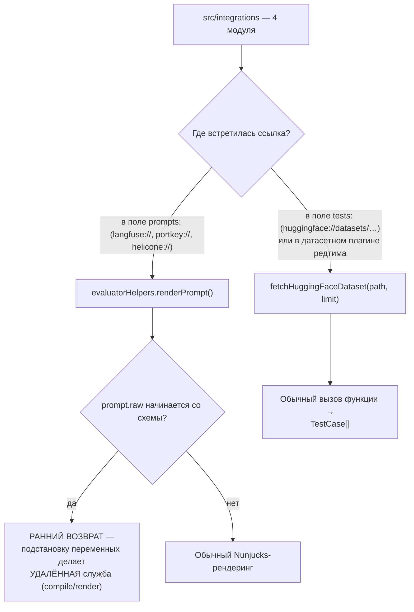
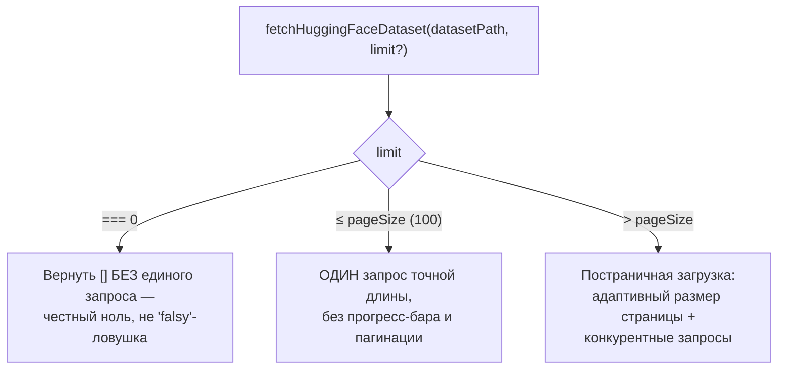
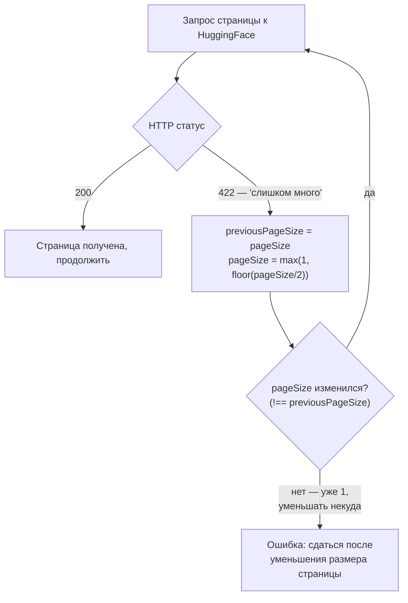

# Внешние реестры и датасеты — `src/integrations`

> Разбор через призму **Domain-Driven Design**. Диаграммы — ANSI-псевдографика.
> Дополняет [ARCHITECTURE.md](./ARCHITECTURE.md), [PROMPTS.md](./PROMPTS.md),
> [IMPORTERS.md](./IMPORTERS.md), [BLOBS.md](./BLOBS.md), [CODESCAN.md](./CODESCAN.md),
> [TRACING.md](./TRACING.md), [MODELS.md](./MODELS.md), [COMMANDS.md](./COMMANDS.md),
> [TYPES.md](./TYPES.md), [UTIL.md](./UTIL.md), [SCHEDULER.md](./SCHEDULER.md),
> [MATCHERS.md](./MATCHERS.md), [ASSERTIONS.md](./ASSERTIONS.md),
> [PROVIDERS.md](./PROVIDERS.md), [REDTEAM.md](./REDTEAM.md),
> [SERVER.md](./SERVER.md), [APP.md](./APP.md), [EVALUATOR.md](./EVALUATOR.md).

---

## 0. Паспорт подсистемы

```
╔══════════════════════════════════════════════════════════════════════════════╗
║  INTEGRATIONS — чужие источники промптов и наборов данных                    ║
╠══════════════════════════════════════════════════════════════════════════════╣
║  Слой в layers.json     legacy-runtime (ярус 2)                              ║
║  Объём                  4 файла · 740 строк                                  ║
╠══════════════════════════════════════════════════════════════════════════════╣
║  huggingfaceDatasets.ts   513   загрузка наборов данных · 69 % модуля        ║
║  helicone.ts              110   реестр промптов                              ║
║  langfuse.ts               68   реестр промптов                              ║
║  portkey.ts                49   реестр промптов                              ║
╠══════════════════════════════════════════════════════════════════════════════╣
║  ДВЕ РАЗНЫЕ ЗАДАЧИ В ОДНОМ КАТАЛОГЕ                                          ║
║    реестры промптов   3 файла · 227 строк · схемы langfuse:// и др.          ║
║    источник данных    1 файл  · 513 строк · huggingface://datasets/          ║
╠══════════════════════════════════════════════════════════════════════════════╣
║  Переменных окружения           9                                            ║
║  Потребителей HuggingFace       6  (5 редтимовских плагинов + чтение тестов) ║
║  Тесты                  2 файла · 906 строк  (покрыты 2 из 4 модулей)        ║
╚══════════════════════════════════════════════════════════════════════════════╝
```

**Формулировка предметной области в одном предложении.** Integrations —
это точки, где promptfoo **берёт чужое**: промпт, живущий в стороннем реестре,
или набор данных, лежащий на HuggingFace.

**Ключевое отличие от провайдеров.** `src/providers` вызывает чужую модель,
получая ответ ([PROVIDERS.md](./PROVIDERS.md)). `src/importers` читает чужой
архив результатов ([IMPORTERS.md](./IMPORTERS.md)). А эти четыре модуля
приносят **вход эксперимента** — то, что подаётся мишени, а не то, что от неё
получено.

---

## 1. Единый язык подсистемы

| Термин | Носитель в коде | Смысл |
|---|---|---|
| **Prompt registry** | `langfuse` · `portkey` · `helicone` | Внешнее хранилище промптов с версиями. |
| **`langfuse://`** | `evaluatorHelpers.ts:427` | Схема ссылки на промпт в Langfuse. |
| **`portkey://`** | `evaluatorHelpers.ts:424` | То же для Portkey. |
| **`helicone://`** | `evaluatorHelpers.ts:485` | То же для Helicone. |
| **`huggingface://datasets/`** | `parseDatasetPath` | Ссылка на набор данных. |
| **label / version** | разбор ссылки Langfuse | Две формы адресации промпта. |
| **major.minor** | разбор ссылки Helicone | Двухсоставная версия. |
| **compile(vars)** | клиент Langfuse | **Удалённая** подстановка переменных. |
| **disableVarExpansion** | `TestCase.options` | Запрет раскрытия матрицы по переменным набора. |
| **castRowToVars** | `huggingfaceDatasets.ts:14` | Строка набора → переменные тест-кейса. |

---

## 2. Место подсистемы в архитектуре

```
   ЧЕТЫРЕ МОДУЛЯ — ДВА СОВЕРШЕННО РАЗНЫХ ПУТИ ВЫЗОВА

 ┌─────────────────────────────────────────────────────────────────────────────┐
 │  ПУТЬ 1 · РЕЕСТРЫ ПРОМПТОВ — перехват в renderPrompt                        │
 ├─────────────────────────────────────────────────────────────────────────────┤
 │                                                                             │
 │   evaluatorHelpers.renderPrompt(prompt, vars, …)      PROMPTS.md §7         │
 │        │                                                                    │
 │        │  if (prompt.raw.startsWith('portkey://'))   → РАННИЙ ВОЗВРАТ       │
 │        │  else if ('langfuse://')                    → РАННИЙ ВОЗВРАТ       │
 │        │  else if ('helicone://')                    → РАННИЙ ВОЗВРАТ       │
 │        │                                                                    │
 │        ▼  ни одна схема не подошла                                          │
 │   Nunjucks-рендеринг                                                        │
 │                                                                             │
 │   ┌───────────────────────────────────────────────────────────────────┐     │
 │   │  ЭТО САМЫЙ ВАЖНЫЙ АРХИТЕКТУРНЫЙ ФАКТ ПОДСИСТЕМЫ                    │    │
 │   │                                                                    │    │
 │   │  Три реестра перехватывают промпт ДО шаблонизатора и возвращают    │    │
 │   │  готовую строку. Подстановку переменных делает УДАЛЁННАЯ СЛУЖБА:   │    │
 │   │                                                                    │    │
 │   │    Langfuse   prompt.compile(stringVars)                           │    │
 │   │    Portkey    POST /prompts/<id>/render  body: { variables }       │    │
 │   │    Helicone   prompt_compiled в ответе                             │    │
 │   │                                                                    │    │
 │   │  СЛЕДСТВИЕ ПЕРВОЕ: правила безопасности шаблонов (PROMPTS.md §8)   │    │
 │   │  к этим трём путям не применяются — Nunjucks не вызывается,        │    │
 │   │  process.env в шаблон не попадает.                                 │    │
 │   │                                                                    │    │
 │   │  СЛЕДСТВИЕ ВТОРОЕ, обратное: ЗНАЧЕНИЯ ПЕРЕМЕННЫХ УХОДЯТ НАРУЖУ.    │    │
 │   │  В редтимовском прогоне это полезная нагрузка атаки, в обычном —   │    │
 │   │  данные теста. Стороннему реестру они видны целиком, и нигде       │    │
 │   │  в коде это не оговорено.                                          │    │
 │   └───────────────────────────────────────────────────────────────────┘     │
 ├─────────────────────────────────────────────────────────────────────────────┤
 │  ПУТЬ 2 · НАБОРЫ ДАННЫХ — обычный вызов функции                             │
 ├─────────────────────────────────────────────────────────────────────────────┤
 │                                                                             │
 │   util/testCaseReader.ts            tests: huggingface://datasets/…         │
 │   redteam/plugins/aegis.ts          ┐                                       │
 │   redteam/plugins/beavertails.ts    │ ПЯТЬ ДАТАСЕТНЫХ ПЛАГИНОВ              │
 │   redteam/plugins/toxicChat.ts      ├ REDTEAM.md §5, семейство 3            │
 │   redteam/plugins/unsafebench.ts    │                                       │
 │   redteam/plugins/imageDatasetUtils ┘                                       │
 │        │                                                                    │
 │        └──────►  fetchHuggingFaceDataset(path, limit) → TestCase[]          │
 │                                                                             │
 │   То есть половина датасетных плагинов редтима держится на одном            │
 │   файле в 513 строк.                                                        │
 └─────────────────────────────────────────────────────────────────────────────┘
```

Те же два пути как Mermaid-диаграмма:



**Своими словами.** Представь почтовое отделение, где под одной вывеской
«интеграции» на самом деле работают два совершенно разных окошка.
В первом окошке (реестры промптов) происходит вот что: если бланк письма
пришёл с готовой пометкой чужой службы — не заполняй его сам, отправь
бланк обратно в ту же чужую службу, пусть там впишут нужные данные
и вернут готовое письмо (три схемы перехватываются ДО собственного
шаблонизатора и улетают за подстановкой переменных на сторону). Если
пометки нет — тогда бланк заполняешь сам, обычным способом (Nunjucks).
Второе окошко (наборы данных) устроено совсем иначе — это не пересылка
бланка туда-обратно, а просто поход на чужой склад за готовой партией
товара: вызвал функцию, получил результат, и точка — никакой удалённой
подстановки, никакого перехвата на входе. Пять разных клиентов
пользуются вторым окошком, и половина из них — специализированные
отделы редтима, которым нужны наборы данных с чужого склада как сырьё
для собственной работы. Общее у двух окошек — только слово на вывеске.

### 2.1. Как схемы не попадают в файловый загрузчик

```
   prompts/utils.ts:maybeFilePath — список запрещённых подстрок:

     forbiddenSubstrings = ['\n', 'portkey://', 'langfuse://', 'helicone://']

   ┌───────────────────────────────────────────────────────────────────────┐
   │  Строка langfuse://my-prompt содержит '/', а значит подошла бы        │
   │  под эвристику «похоже на путь» (PROMPTS.md §3.1) — и загрузчик       │
   │  промптов попытался бы открыть её как файл.                           │
   │                                                                       │
   │  Явный запрет останавливает это на входе. Связь между двумя           │
   │  модулями держится на списке из трёх строк, продублированном          │
   │  относительно веток в renderPrompt: добавив четвёртый реестр,         │
   │  нужно не забыть про оба места.                                       │
   └───────────────────────────────────────────────────────────────────────┘
```

---

## 3. Три реестра промптов

```
 ┌─────────────────────────────────────────────────────────────────────────────┐
 │  LANGFUSE — 68 строк, самая богатая адресация                               │
 ├─────────────────────────────────────────────────────────────────────────────┤
 │                                                                             │
 │   ФОРМЫ ССЫЛКИ, разбираемые в evaluatorHelpers:427                          │
 │                                                                             │
 │     langfuse://prompt-id@label                                              │
 │     langfuse://prompt-id@label:type                                         │
 │     langfuse://prompt-id:version-or-label                                   │
 │     langfuse://prompt-id:version-or-label:type                              │
 │                                                                             │
 │     labelMatch   = /^(.+)@([^:@]+)(?::(.+))?$/                              │
 │     versionMatch = /^([^:]+):([^:]+)(?::(.+))?$/                            │
 │                                                                             │
 │   ┌───────────────────────────────────────────────────────────────────┐     │
 │   │  Комментарий объясняет выбор жадной группы в первой регулярке:     │    │
 │   │  «Более устойчивый разбор, который обрабатывает @ В                │    │
 │   │   ИДЕНТИФИКАТОРАХ ПРОМПТОВ. Ищем ПОСЛЕДНИЙ @, за которым идёт      │    │
 │   │   образец метки.»                                                  │    │
 │   │                                                                    │    │
 │   │  Идентификатор промпта может сам содержать @ (например,            │    │
 │   │  имя с адресом почты). Жадная `(.+)` слева заставляет разбор       │    │
 │   │  прижаться к последнему @, а не к первому.                         │    │
 │   └───────────────────────────────────────────────────────────────────┘     │
 │                                                                             │
 │   Автоопределение версии против метки:  /^\d+$/ → версия, иначе метка       │
 │                                                                             │
 │   ЛЕНИВАЯ ЗАГРУЗКА КЛИЕНТА                                                  │
 │     await import('@langfuse/client')                                        │
 │     при сбое — сообщение с готовой командой установки:                      │
 │       «npm install @langfuse/client»                                        │
 │     Пакет необязательный; не пользуешься Langfuse — не платишь за него.     │
 │                                                                             │
 │   ТРИ РАЗНЫХ ТЕКСТА ОШИБКИ в зависимости от формы адресации                 │
 │     с меткой · без версии · с версией — чтобы в сообщении было видно,       │
 │     что именно не нашлось                                                   │
 │                                                                             │
 │   ПРИВЕДЕНИЕ ПЕРЕМЕННЫХ                                                     │
 │     «compile() ожидает Record<string, string>», поэтому не-строки           │
 │     проходят через JSON.stringify. Объект-переменная доедет до              │
 │     удалённого шаблона как JSON-текст, а не как структура.                  │
 ├─────────────────────────────────────────────────────────────────────────────┤
 │  PORTKEY — 49 строк, самый простой                                          │
 ├─────────────────────────────────────────────────────────────────────────────┤
 │                                                                             │
 │     POST https://api.portkey.ai/v1/prompts/<id>/render                      │
 │     header  x-portkey-api-key                                               │
 │     body    { variables }                                                   │
 │                                                                             │
 │     invariant(apiKey, 'PORTKEY_API_KEY is required')  ← падение на входе    │
 │                                                                             │
 │     Ответ типизирован целиком: model · n · top_p · max_tokens ·             │
 │     temperature · presence_penalty · frequency_penalty · messages[]         │
 │                                                                             │
 │     Наверх возвращается только messages: JSON.stringify(result.messages)    │
 │     ⚠  Остальные поля ответа — параметры вызова модели — ОТБРАСЫВАЮТСЯ.     │
 │        Реестр знает, с какой температурой запускать промпт, но              │
 │        promptfoo этим не пользуется.                                        │
 │                                                                             │
 │     Вызов идёт через fetchWithProxy — уважает настройки прокси              │
 │     (UTIL.md §5), в отличие от Langfuse, который ходит своим клиентом.      │
 ├─────────────────────────────────────────────────────────────────────────────┤
 │  HELICONE — 110 строк, версии major.minor                                   │
 ├─────────────────────────────────────────────────────────────────────────────┤
 │                                                                             │
 │     helicone://<id>:<major>.<minor>                                         │
 │                                                                             │
 │     buildFilter(majorVersion?, minorVersion?) собирает вложенный            │
 │     фильтр в формате запроса Helicone:                                      │
 │       { left: { prompts_versions: { major_version: { equals: N } } },       │
 │         operator: 'and', right: 'all' }                                     │
 │                                                                             │
 │     Тип Result<T, K> = ResultSuccess<T> | ResultError<K> —                  │
 │     размеченное объединение вместо исключений, как у самой службы.          │
 └─────────────────────────────────────────────────────────────────────────────┘
```

---

## 4. HuggingFace: 69 % модуля на один источник данных

```
   fetchHuggingFaceDataset(datasetPath, limit?) → TestCase[]

   Базовый адрес: https://datasets-server.huggingface.co/rows

 ┌─────────────────────────────────────────────────────────────────────────────┐
 │  РАЗБОР ССЫЛКИ — parseDatasetPath                                           │
 ├─────────────────────────────────────────────────────────────────────────────┤
 │    huggingface://datasets/<owner>/<repo>?split=train&config=custom          │
 │                                                                             │
 │    Параметры по умолчанию:  split = 'test' · config = 'default'             │
 │    Пользовательские параметры ПЕРЕКРЫВАЮТ умолчания (слияние в две петли,   │
 │    а не Object.assign — порядок явный).                                     │
 ├─────────────────────────────────────────────────────────────────────────────┤
 │  ТРИ РЕЖИМА ЗАГРУЗКИ                                                        │
 ├─────────────────────────────────────────────────────────────────────────────┤
 │                                                                             │
 │   0  limit === 0                                                            │
 │        «Honor explicit 0 limit and avoid network traffic»                   │
 │        → вернуть [] БЕЗ единого запроса                                     │
 │        ↑ ноль ложен в JavaScript, и наивная проверка `if (limit)`           │
 │          отправила бы запрос за полным набором                              │
 │                                                                             │
 │   1  limit <= pageSize (100)                                                │
 │        ОДИН запрос с точной длиной. Без прогресс-бара, без пагинации.       │
 │                                                                             │
 │   2  всё остальное                                                          │
 │        постраничная загрузка с адаптивным размером страницы                 │
 │        и конкурентными запросами                                            │
 └─────────────────────────────────────────────────────────────────────────────┘
```

Те же три режима как Mermaid-диаграмма:



**Своими словами.** Представь, что нужно принести воды с колодца, и есть
три совершенно разных способа в зависимости от того, сколько воды
заказано. Если заказано ровно ноль вёдер — вообще не идёшь к колодцу,
и это не округление, а честный отдельный случай: ноль в этой системе
счёта коварен, потому что наивная проверка «если количество задано»
приняла бы ноль за «количество не задано» и отправила бы за полным
колодцем воды по ошибке. Если нужно немного — меньше, чем помещается
в один обычный поход, — идёшь один раз с вёдрами точно нужного числа,
без всякой подготовки и без индикатора прогресса, потому что поход
и так короткий. А если нужно много — организуешь несколько ходок, причём
размер вёдер на каждой ходке подстраивается по дороге (об этом отдельно
ниже), и при необходимости за водой идёт сразу несколько человек
одновременно, а не один туда-обратно.

### 4.1. Адаптивный размер страницы

```
   pageSize стартует со 100 и подстраивается по СРЕДНЕМУ РАЗМЕРУ СТРОКИ:

     avgRowSize > 4 КБ    →  pageSize = clamp(pageSize, 25, 50)
     avgRowSize > 1 КБ    →  pageSize = clamp(pageSize, 50, 75)
     avgRowSize < 256 Б   →  pageSize = min(200, pageSize × 1.5)

   ┌───────────────────────────────────────────────────────────────────────┐
   │  Набор из коротких текстовых строк и набор из изображений в base64    │
   │  требуют разного числа строк на запрос. Фиксированные 100 либо        │
   │  упрутся в лимит ответа на тяжёлом наборе, либо сделают лишние        │
   │  сотни запросов на лёгком.                                            │
   │                                                                       │
   │  Изменение размера логируется отладочным сообщением с указанием       │
   │  старого, нового значения и среднего размера строки.                  │
   └───────────────────────────────────────────────────────────────────────┘
```

### 4.2. Реакция на отказ 422

```
   if (response.status === 422) {
     previousPageSize = pageSize;
     pageSize = Math.max(1, Math.floor(pageSize / 2));
     logger.warn(«…Reducing page size from X to Y and retrying.»);
     if (pageSize === previousPageSize) {
       throw new Error(«…after reducing page size.»);   ← ЗАЩИТА ОТ ЗАЦИКЛИВАНИЯ
     }
     continue;
   }

   ┌───────────────────────────────────────────────────────────────────────┐
   │  422 от службы HuggingFace означает «запрошено слишком много».        │
   │  Ответ — деление размера страницы пополам и повтор.                   │
   │                                                                       │
   │  Условие выхода построено на неизменности значения: когда pageSize    │
   │  уже равен 1, `Math.floor(1/2)` даёт 0, `Math.max(1, 0)` возвращает   │
   │  1 — размер перестал уменьшаться, и цикл прекращается ошибкой,        │
   │  а не крутится вечно.                                                 │
   │                                                                       │
   │  Это тот же принцип, что в планировщике (SCHEDULER.md §6):            │
   │  падать быстро, но с явной нижней границей.                           │
   └───────────────────────────────────────────────────────────────────────┘
```

Та же защита от зацикливания как Mermaid-диаграмма:



**Своими словами.** Представь грузчика, который пытается пронести стопку
коробок через узкую дверь. Если он застрял (сервис ответил «слишком
много за раз») — он не бросает попытки и не прёт напролом, а просто
делит стопку пополам и пробует снова с меньшей стопкой. Если и с меньшей
стопкой не пролезло — снова делит пополам, и так далее, пока стопка
не станет совсем маленькой. Но у этого есть дно: если в руках осталась
ровно одна коробка и даже с ней не пролезть — делить больше нечего,
половина от одной коробки — это по-прежнему одна коробка, а не половина
коробки. Именно в этот момент грузчик перестаёт пытаться и честно
говорит: не могу, дверь слишком узкая даже для одной коробки. Это
и защищает от того, чтобы грузчик бесконечно пытался протиснуться
с одной и той же неизменной ношей.

### 4.3. Конкурентная догрузка

```
   Условия включения — оба одновременно:

     pagesRemaining > CONCURRENT_FETCH_PAGES_THRESHOLD   (2)
     tests.length < totalNeeded × CONCURRENT_FETCH_PROGRESS_THRESHOLD  (0.8)

     maxConcurrent = min(MAX_CONCURRENT_REQUESTS (3), pagesRemaining)

   ┌───────────────────────────────────────────────────────────────────────┐
   │  Второе условие — порог прогресса 80 % — неочевидно и разумно:        │
   │  на последних процентах загрузки конкурентность бесполезна            │
   │  (страниц осталось мало), а риск перебрать лишнего есть.              │
   │                                                                       │
   │  Потолок в три одновременных запроса — уважение к чужой службе.       │
   │  Собственного планировщика (SCHEDULER.md) здесь нет: этот путь        │
   │  идёт мимо реестра лимитов, потому что не является вызовом            │
   │  провайдера.                                                          │
   └───────────────────────────────────────────────────────────────────────┘

   Кэширование — через общий fetchWithCache: «30s timeout, json format,
   4 retries» по умолчанию. Повторный прогон того же набора данных
   не ходит в сеть, и в лог пишется пометка [cached].

   Прогресс — отдельный класс DatasetProgressBar, скрывающий себя
   в веб-интерфейсе (тот же приём, что в эвалюаторе, EVALUATOR.md §13).
```

### 4.4. Аутентификация и превращение строк в тесты

```
   ТРИ ИМЕНИ ОДНОЙ ПЕРЕМЕННОЙ, по порядку:
     HF_TOKEN  →  HF_API_TOKEN  →  HUGGING_FACE_HUB_TOKEN
   Первое непустое становится заголовком Authorization: Bearer.
   Приватные наборы данных без токена недоступны, публичные работают без него.

   const test: TestCase = {
     vars: castRowToVars(row),
     options: { disableVarExpansion: true },   ← ВАЖНО
   };

 ┌─────────────────────────────────────────────────────────────────────────────┐
 │  ЗАЧЕМ disableVarExpansion                                                  │
 │                                                                             │
 │   Обычно массив в переменной раскрывается в декартово произведение:         │
 │   generateVarCombinations превращает { x: [1,2] } в два тест-кейса          │
 │   (EVALUATOR.md §5).                                                        │
 │                                                                             │
 │   Строка набора данных — это ОДИН пример, даже если какое-то её поле        │
 │   является массивом (список меток, набор вариантов ответа). Раскрытие       │
 │   превратило бы тысячу строк набора в десятки тысяч тестов и исказило       │
 │   бы саму методику: набор данных задаёт фиксированную выборку.              │
 │                                                                             │
 │   Флаг ставится на КАЖДЫЙ тест-кейс из набора, а не глобально —             │
 │   тесты из конфига рядом продолжают раскрываться как обычно.                │
 └─────────────────────────────────────────────────────────────────────────────┘
```

---

## 5. Диагноз

```
╔═══════════════════════════════════════════════════════════════════════════╗
║  СИЛЬНЫЕ СТОРОНЫ                                                          ║
╠═══════════════════════════════════════════════════════════════════════════╣
║  ✔ Реестры промптов перехватываются до шаблонизатора, поэтому             ║
║    подстановку делает та служба, которая владеет промптом, —              ║
║    а не promptfoo своим Nunjucks.                                         ║
║                                                                           ║
║  ✔ Схемы явно исключены из эвристики «похоже на путь», иначе              ║
║    загрузчик промптов попытался бы открыть их как файлы.                  ║
║                                                                           ║
║  ✔ Клиент Langfuse грузится лениво, а при отсутствии пакета               ║
║    сообщение содержит готовую команду установки.                          ║
║                                                                           ║
║  ✔ Разбор ссылки Langfuse учитывает @ внутри идентификатора промпта       ║
║    и различает числовую версию и текстовую метку автоматически.           ║
║                                                                           ║
║  ✔ Три разных текста ошибки по форме адресации — видно, что именно        ║
║    не нашлось.                                                            ║
║                                                                           ║
║  ✔ Размер страницы HuggingFace подстраивается под средний размер          ║
║    строки: лёгкий набор грузится крупными страницами, тяжёлый — мелкими.  ║
║                                                                           ║
║  ✔ Отказ 422 обрабатывается делением страницы пополам с явной защитой     ║
║    от зацикливания на нижней границе.                                     ║
║                                                                           ║
║  ✔ Конкурентность включается только когда она полезна: больше двух        ║
║    страниц впереди и меньше 80 % прогресса; потолок три запроса.          ║
║                                                                           ║
║  ✔ Явный нулевой предел не порождает сетевого запроса — ловушка           ║
║    ложного нуля обойдена.                                                 ║
║                                                                           ║
║  ✔ disableVarExpansion сохраняет методику набора данных: строка           ║
║    остаётся одним примером.                                               ║
╠═══════════════════════════════════════════════════════════════════════════╣
║  СЛАБЫЕ МЕСТА                                                             ║
╠═══════════════════════════════════════════════════════════════════════════╣
║  ✘ Нигде не оговорено, что при использовании реестра ЗНАЧЕНИЯ             ║
║    ПЕРЕМЕННЫХ УХОДЯТ ТРЕТЬЕЙ СТОРОНЕ. Для инструмента, чей                ║
║    AGENTS.md по промптам целиком посвящён недоверенным данным             ║
║    (PROMPTS.md §8), это заметный пробел.                                  ║
║                                                                           ║
║  ✘ Разбор трёх схем живёт НЕ ЗДЕСЬ, а в evaluatorHelpers — 70 строк       ║
║    ветвлений внутри renderPrompt. Модуль integrations содержит только     ║
║    клиентов, но не собственную маршрутизацию.                             ║
║                                                                           ║
║  ✘ Список запрещённых подстрок в prompts/utils.ts дублирует набор         ║
║    веток в renderPrompt. Четвёртый реестр потребует правки двух мест      ║
║    в разных модулях, и рассогласование ничем не ловится.                  ║
║                                                                           ║
║  ✘ Два разных транспорта: Portkey ходит через fetchWithProxy,             ║
║    HuggingFace — через fetchWithCache, Langfuse — собственным             ║
║    клиентом мимо обоих. Настройки прокси и кэша применяются               ║
║    непоследовательно.                                                     ║
║                                                                           ║
║  ✘ Portkey отбрасывает параметры вызова из ответа (температуру,           ║
║    max_tokens и прочее), хотя типизирует их. Реестр знает, как            ║
║    запускать промпт, но это знание теряется.                              ║
║                                                                           ║
║  ✘ Тестами покрыты два модуля из четырёх: huggingfaceDatasets             ║
║    и langfuse. Прямых тестов portkey и helicone в test/integrations нет.  ║
║                                                                           ║
║  ✘ Ни AGENTS.md, ни упоминания в корневом. Третья подсистема после        ║
║    blobs и importers, о которой в документации не сказано ничего.         ║
║                                                                           ║
║  ✘ Каталог объединяет две несвязанные задачи: реестры промптов            ║
║    (вход через renderPrompt) и источник наборов данных (вход через        ║
║    чтение тестов и плагины редтима). Общего у них только слово            ║
║    «интеграция».                                                          ║
╚═══════════════════════════════════════════════════════════════════════════╝
```

### Оценка по осям

```
   Устойчивость загрузки     ████████████████████░  9/10   адаптация и 422
   Экономия сети             ██████████████████░░░  8/10   кэш, нулевой предел
   Диагностика               ████████████████░░░░░  7/10   три текста ошибки
   Связность модуля          ██████████░░░░░░░░░░░  5/10   две разные задачи
   Расположение логики       ████████████░░░░░░░░░  6/10   разбор схем не здесь
   Прозрачность для данных   ████████░░░░░░░░░░░░░  4/10   утечка не оговорена
   Тестируемость             ████████████░░░░░░░░░  6/10   покрыты 2 из 4
```

---

## 6. Рекомендации по эволюции

```
   1 · Оговорить передачу переменных третьей стороне.
       Достаточно абзаца в документации и предупреждения в отладочном
       логе при первом использовании реестра: значения переменных теста
       уходят на внешнюю службу. В редтимовском прогоне это полезная
       нагрузка атаки, и пользователь должен знать.

   2 · Перенести разбор схем из evaluatorHelpers в integrations.
       Семьдесят строк ветвлений в renderPrompt — это маршрутизация
       по реестрам, а не рендеринг промпта. Реестр вида
         { scheme: 'langfuse://', parse(rest), fetch(parsed, vars) }
       убирает и ветвления, и дублирование списка запрещённых подстрок.

   3 · Разделить каталог.
         integrations/promptRegistries/   langfuse · portkey · helicone
         integrations/datasets/           huggingface
       Либо перенести huggingfaceDatasets ближе к потребителям: пять
       из шести — датасетные плагины редтима.

   4 · Свести транспорт к одному.
       fetchWithProxy и fetchWithCache должны применяться единообразно;
       клиент Langfuse, идущий мимо обоих, не уважает ни прокси,
       ни кэш, ни ограничения повторов (SCHEDULER.md §8.1).

   5 · Использовать параметры из ответа Portkey.
       model, temperature, max_tokens и прочее уже типизированы —
       достаточно вернуть их наверх как конфигурацию промпта.

   6 · Добавить прямые тесты portkey и helicone в test/integrations.
       Оба модуля целиком состоят из разбора чужого формата ответа —
       ровно то, что ломается при обновлении сторонней службы.
```

---

## 7. Карта директории

```
src/integrations/              4 файла · 740 строк
│
├── huggingfaceDatasets.ts    513  ИСТОЧНИК НАБОРОВ ДАННЫХ
│   ├── castRowToVars                строка набора → переменные
│   ├── parseDatasetPath             huggingface://datasets/<owner>/<repo>?…
│   ├── class DatasetProgressBar     прогресс, скрытый в веб-интерфейсе
│   ├── fetchHuggingFaceDataset      три режима загрузки
│   ├── константы адаптации          100 → clamp(25,50) · clamp(50,75) · ×1.5
│   ├── обработка 422                деление пополам + защита от цикла
│   └── конкурентность               порог 2 страницы · 80 % · потолок 3
│
├── helicone.ts               110  РЕЕСТР ПРОМПТОВ · версии major.minor
│   ├── buildFilter                  вложенный фильтр запроса
│   ├── Result<T, K>                 размеченное объединение вместо исключений
│   └── PromptVersionCompiled        prompt_compiled с готовой подстановкой
│
├── langfuse.ts                68  РЕЕСТР ПРОМПТОВ · метки и версии
│   ├── ленивый import('@langfuse/client')
│   ├── три текста ошибки по форме адресации
│   └── приведение переменных к строкам перед compile()
│
└── portkey.ts                 49  РЕЕСТР ПРОМПТОВ · самый простой
    ├── POST /v1/prompts/<id>/render через fetchWithProxy
    ├── PortkeyResponse              полностью типизированный ответ
    └── наверх уходят только messages

СМЕЖНОЕ
  evaluatorHelpers.ts:424–496       РАЗБОР ТРЁХ СХЕМ, ранний возврат
                                    до Nunjucks-рендеринга
  prompts/utils.ts:maybeFilePath    запрет схем в эвристике «похоже на путь»
  util/testCaseReader.ts            tests: huggingface://datasets/…
  redteam/plugins/                  aegis · beavertails · toxicChat ·
                                    unsafebench · imageDatasetUtils
  types/index.ts:914                TestCase.options.disableVarExpansion
  evaluator.ts:2607                 применение disableVarExpansion

test/integrations/         2 файла · 906 строк
    huggingfaceDatasets.test.ts · langfuse.test.ts
    ⚠ portkey и helicone прямых тестов не имеют
```

---

## 8. Команды

Ссылки в конфигурации:

```yaml
prompts:
  - langfuse://my-prompt@production
  - langfuse://my-prompt:3:chat
  - portkey://pp-my-prompt-id
  - helicone://my-prompt:2.1

tests: huggingface://datasets/rajpurkar/squad?split=validation&limit=100
```

Тесты:

```bash
npx vitest run test/integrations
```

Переменные окружения:

```bash
LANGFUSE_PUBLIC_KEY · LANGFUSE_SECRET_KEY · LANGFUSE_HOST
PORTKEY_API_KEY
HELICONE_API_KEY
HF_TOKEN · HF_API_TOKEN · HUGGING_FACE_HUB_TOKEN
```

Числа из этого документа воспроизводятся так:

```bash
cat src/integrations/*.ts | wc -l                                   # 740
grep -rln "fetchHuggingFaceDataset" src | grep -v integrations      # потребители
cat test/integrations/*.ts | wc -l                                  # 906
```

---

*Документ описывает `src/integrations` на коммите `2c140ef`, promptfoo 0.122.0.
Дата среза — 26 августа 2026.*
