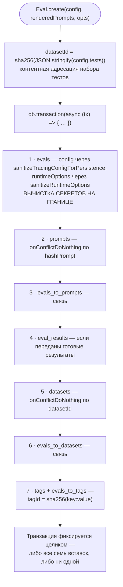
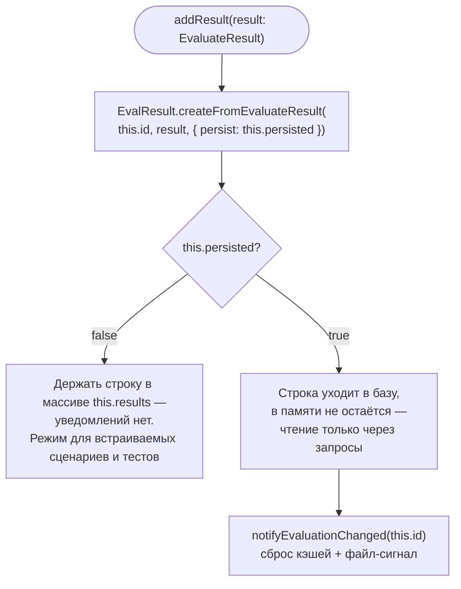
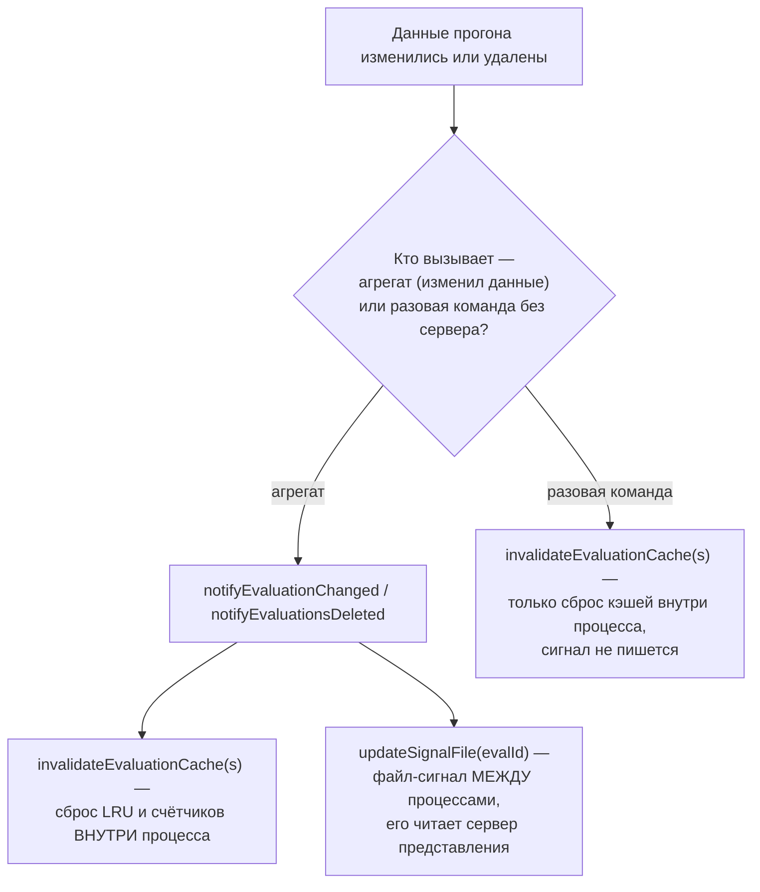
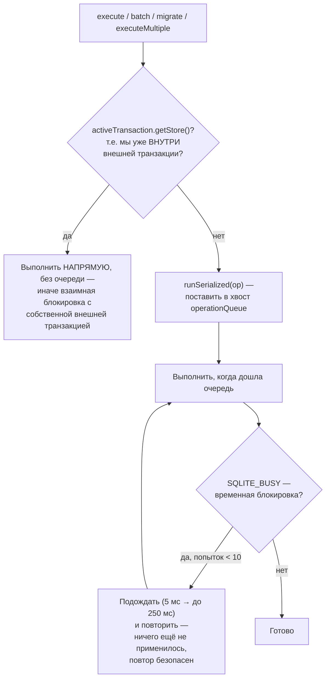

# Агрегаты и персистентность — `src/models`

> Разбор через призму **Domain-Driven Design**. Диаграммы — ANSI-псевдографика.
> Дополняет [ARCHITECTURE.md](./ARCHITECTURE.md), [EVALUATOR.md](./EVALUATOR.md),
> [COMMANDS.md](./COMMANDS.md), [TYPES.md](./TYPES.md), [UTIL.md](./UTIL.md),
> [SCHEDULER.md](./SCHEDULER.md), [PROMPTS.md](./PROMPTS.md),
> [MATCHERS.md](./MATCHERS.md), [ASSERTIONS.md](./ASSERTIONS.md),
> [PROVIDERS.md](./PROVIDERS.md), [REDTEAM.md](./REDTEAM.md),
> [SERVER.md](./SERVER.md), [APP.md](./APP.md).

---

## 0. Паспорт подсистемы

```
╔══════════════════════════════════════════════════════════════════════════════╗
║  MODELS — агрегаты домена и граница персистентности                          ║
╠══════════════════════════════════════════════════════════════════════════════╣
║  Слой в layers.json     node (ярус 3), вместе с database · storage ·         ║
║                         globalConfig · util · evaluate.ts                    ║
║  Объём                  6 файлов · 3 633 строки                              ║
║  ORM                    Drizzle поверх libSQL/SQLite                         ║
╠══════════════════════════════════════════════════════════════════════════════╣
║  eval.ts               1 861   АГРЕГАТ Eval + EvalQueries                    ║
║  evalResult.ts         1 035   сущность EvalResult + вычистка секретов       ║
║  modelAudit.ts           464   агрегат ModelAudit                            ║
║  evalPerformance.ts      188   кэш счётчиков и оптимизированные запросы      ║
║  evalMutation.ts          53   ЧЕТЫРЕ операции согласования кэшей            ║
║  prompt.ts                32   генерация идентификатора промпта              ║
╠══════════════════════════════════════════════════════════════════════════════╣
║  СМЕЖНОЕ — src/database  5 файлов · 1 398 строк                              ║
║    tables.ts             495   15 таблиц · 48 индексов                       ║
║    index.ts              415   подключение · WAL · сериализация операций     ║
║    signal.ts             347   межпроцессное уведомление                     ║
║    testing.ts            101   ·  evalDeletion.ts 40                         ║
╠══════════════════════════════════════════════════════════════════════════════╣
║  Тесты                  9 + 4 файла · 7 335 + 1 493 строки                   ║
╚══════════════════════════════════════════════════════════════════════════════╝
```

**Формулировка предметной области в одном предложении.** `src/models` держит
**границу транзакции** домена: `Eval` — корень агрегата, `EvalResult` — сущность
внутри него, и ничто не попадает в базу и не покидает её, минуя эту пару.

**Три обязанности, названные в `AGENTS.md`.** Правила подсистемы формулируют
ровно те инварианты, которые агрегат обязан держать: единый жизненный цикл
(прогон, результаты, трассы, файл-сигнал и кэши — одно целое), обратная
совместимость сохранённого JSON и **вычистка секретов на границе персистентности**.

---

## 1. Единый язык подсистемы

| Термин | Носитель в коде | Смысл |
|---|---|---|
| **Eval** | `eval.ts:311` | Корень агрегата. Один прогон эксперимента. |
| **EvalResult** | `evalResult.ts:612` | Сущность внутри агрегата. Одна ячейка таблицы. |
| **EvalQueries** | `eval.ts:160` | Статические read-запросы вне агрегата. Зачаток CQRS. |
| **persisted** | поле `Eval` | Записан ли прогон в базу. Определяет, держать ли результаты в памяти. |
| **datasetId** | `eval.ts:485` | `sha256(JSON.stringify(config.tests))` — контентная адресация набора тестов. |
| **getResultIndexKey** | `evalResult.ts:1033` | `${testIdx}:${promptIdx}` — ключ идемпотентности. |
| **notifyEvaluationChanged** | `evalMutation.ts` | Сбросить кэши процесса + написать в файл-сигнал. |
| **buildSafeJsonPath** | `eval.ts:120` | Экранирование ключа для `json_extract`. |
| **serializeTopLevelOperations** | `database/index.ts:253` | Очередь, спасающая от `SQLITE_BUSY`. |
| **resultPersistenceFailed** | поле `Eval` | База не приняла строку — она остаётся в памяти ради сравнений. |

---

## 2. Место подсистемы в архитектуре

```
   Модели входят в слой node (ярус 3) — тот же, что util, database и storage.
   Показатели слоя целиком: ~700 входящих импортов, второе место после
   legacy-contracts (TYPES.md §2).

   КТО ОБРАЩАЕТСЯ К АГРЕГАТУ

     node/evaluationStore.ts   ← АДАПТЕР ПОРТА (EVALUATOR.md §3)
     server/routes/eval.ts     14 эндпойнтов HTTP
     commands/*.ts             show · export · delete · import · retry
     util/database.ts          сводки и списки
     share.ts                  выгрузка наружу

   ┌──────────────────────────────────────────────────────────────────────┐
   │  ГЛАВНОЕ АРХИТЕКТУРНОЕ СВОЙСТВО                                      │
   │                                                                      │
   │  Движок оценки НЕ ИМПОРТИРУЕТ класс Eval. Он работает через порт     │
   │  EvaluationStore, а класс появляется только в адаптере               │
   │  node/evaluationStore.ts — тонком делегате, где каждый метод         │
   │  переадресует вызов агрегату одной строкой.                          │
   │                                                                      │
   │  Из evaluator.ts сюда идут ровно три импорта, и все — функции,       │
   │  а не класс: getResultIndexKey, sanitizeResultForJsonlArtifact,      │
   │  generateIdFromPrompt (EVALUATOR.md §2).                             │
   └──────────────────────────────────────────────────────────────────────┘
```

---

## 3. Агрегат `Eval`

```
 ┌─────────────────────────────────────────────────────────────────────────────┐
 │  СОРОК ШЕСТЬ МЕТОДОВ, СГРУППИРОВАННЫХ ПО РОЛЯМ                              │
 ├─────────────────────────────────────────────────────────────────────────────┤
 │                                                                             │
 │   ФАБРИКИ (static)                                                          │
 │     create(config, renderedPrompts, opts)   создание в транзакции           │
 │     findById(id) · latest() · getMany(limit)                                │
 │                                                                             │
 │   КОМАНДЫ — меняют состояние                                                │
 │     addResult · addPrompts · setResults · setVars · addVar                  │
 │     setDurationMs · setGenerationDurationMs · setTable                      │
 │     save · delete · copy · clearResults                                     │
 │                                                                             │
 │   ЗАПРОСЫ — читают                                                          │
 │     getResults · loadResults · getPrompts · getTable · getStats             │
 │     getResultsCount · getTotalResultRowCount · getTraces                    │
 │     fetchResultsByTestIdx · getFailedResultsByTestIdx                       │
 │     findTargetErrorStatus · getFilteredMetrics · getTablePage               │
 │                                                                             │
 │   ПРЕОБРАЗОВАНИЯ                                                            │
 │     toEvaluateSummary() → V3 или V2 · toResultsFile()                       │
 │     version() · useOldResults()                                             │
 │                                                                             │
 │   СБОИ ЗАПИСИ — отдельная группа, см. §5                                    │
 │     recordResultPersistenceFailure · hasResultPersistenceFailure            │
 │     recordFinalJsonlResult · getFinalJsonlResults                           │
 │                                                                             │
 │   ПРИВАТНЫЕ                                                                 │
 │     buildFilterWhereSql (240 строк) · queryTestIndices                      │
 └─────────────────────────────────────────────────────────────────────────────┘
```

### 3.1. Создание: одна транзакция на пять таблиц

```
   Eval.create(config, renderedPrompts, opts)

     datasetId = sha256(JSON.stringify(config.tests || []))
        ↑ КОНТЕНТНАЯ АДРЕСАЦИЯ: одинаковый набор тестов даёт один
          идентификатор, и повторный прогон переиспользует запись

     db.transaction(async (tx) => {
       ┌───────────────────────────────────────────────────────────────┐
       │ 1  evals    config → sanitizeTracingConfigForPersistence      │
       │                        runtimeOptions → sanitizeRuntimeOptions│
       │                        ↑ ВЫЧИСТКА СЕКРЕТОВ НА ГРАНИЦЕ         │
       │                          (UTIL.md §3.5)                       │
       │                                                               │
       │ 2  prompts             onConflictDoNothing по hashPrompt      │
       │ 3  evals_to_prompts    связь                                  │
       │ 4  eval_results        если переданы готовые результаты       │
       │ 5  datasets            onConflictDoNothing по datasetId       │
       │ 6  evals_to_datasets   связь                                  │
       │ 7  tags + evals_to_tags   tagId = sha256(`${key}:${value}`)   │
       └───────────────────────────────────────────────────────────────┘
     })

   ┌───────────────────────────────────────────────────────────────────────┐
   │  onConflictDoNothing ВЕЗДЕ, ГДЕ ЕСТЬ ОБЩИЙ СЛОВАРЬ                    │
   │                                                                       │
   │  Промпты, наборы данных и метки адресуются хэшем содержимого          │
   │  и разделяются между прогонами. Повторная вставка того же промпта     │
   │  не ошибка, а норма — и обрабатывается на уровне SQL, а не            │
   │  предварительной проверкой существования.                             │
   │                                                                       │
   │  Разрешение автора: если вызывающий передал author явно (даже null),  │
   │  оно уважается; глобальная цепочка getAuthor() включается только      │
   │  когда поля нет вовсе. Проверка через 'author' in opts, а не          │
   │  через истинность — чтобы явный null не подменялся.                   │
   └───────────────────────────────────────────────────────────────────────┘
```

Та же транзакция как Mermaid-диаграмма:



**Своими словами.** Представь оформление одной посылки на почте, где
семь разных отделов должны поставить свою печать, прежде чем посылка
считается принятой, — и либо печати ставят все семь, либо не ставит ни
один. Сначала посылку взвешивают и на неё клеят номер, вычисленный из
самого содержимого — одинаковое содержимое всегда получает один и тот же
номер, поэтому повторно принесённая точно такая же посылка не заводит
новую запись, а находит старую (`datasetId`). Дальше — семь отделов по
очереди, но перед первым же отделом с посылки специально снимают всё,
что похоже на паспортные данные или пароли, и кладут в архив уже
очищенную версию (отдел 1: `evals`, вычистка секретов). Отделы 2 и 3
регистрируют текст письма и связь письма с посылкой, но если точно такой
же текст уже лежит в архиве текстов — новую копию не заводят, а
привязывают к старой (`onConflictDoNothing` по хэшу текста). Отдел 4
кладёт уже готовые результаты, если они есть. Отделы 5 и 6 делают с
набором тестов то же самое, что отделы 2–3 делали с текстом — переиспользуют
существующую запись вместо дубликата. Отдел 7 клеит бирки-метки, тоже
адресованные по содержимому. А главное — всё это происходит за одной
стойкой, в одной операции: если седьмой отдел вдруг откажет, печати,
поставленные первыми шестью, тоже аннулируются, будто посылку никто не
приносил.

### 3.2. Память: результаты держатся только у непersisted прогона

```
   async addResult(result: EvaluateResult) {
     const newResult = await EvalResult.createFromEvaluateResult(
       this.id, result, { persist: this.persisted });

     if (!this.persisted) {
       this.results.push(newResult);
       // «Мы храним результаты в памяти, ТОЛЬКО если прогон не записан
       //  в базу. Это чтобы избежать проблем с памятью при больших
       //  оценках.»
     }

     if (this.persisted) {
       notifyEvaluationChanged(this.id);   ← сброс кэшей + файл-сигнал
     }
   }

   ┌───────────────────────────────────────────────────────────────────────┐
   │  ДВА ВЗАИМОИСКЛЮЧАЮЩИХ РЕЖИМА ОДНОГО АГРЕГАТА                         │
   │                                                                       │
   │    persisted = true    строки уходят в базу, в памяти не остаются;    │
   │                        чтение — через запросы; каждая запись          │
   │                        уведомляет наблюдателей                        │
   │                                                                       │
   │    persisted = false   строки живут в массиве; уведомлений нет;       │
   │                        режим для встраиваемых сценариев и тестов      │
   │                                                                       │
   │  Прогон на сотни тысяч строк в первом режиме не расходует память      │
   │  линейно — это и есть причина существования флага.                    │
   └───────────────────────────────────────────────────────────────────────┘
```

Развилка `addResult` как Mermaid-диаграмма:



**Своими словами.** Представь два разных способа вести протокол
собрания. Первый — секретарь всё записывает от руки в отдельный блокнот
и никому не рассылает копии: удобно для короткой летучки, но блокнот
физически не резиновый, и для собрания на сто тысяч реплик он просто не
поместится в карман (`persisted = false`, режим для встраиваемых
сценариев и тестов). Второй способ — секретарь сразу сдаёт каждую реплику
в архив, ничего не держит при себе, а всем заинтересованным лицам
рассылает короткое уведомление «протокол обновился, пересчитайте свои
заметки» (`persisted = true`, запись в базу и `notifyEvaluationChanged`
со сбросом кэшей и файлом-сигналом). Выбор способа — это не мелочь, а
осознанный компромисс: первый способ быстрее для короткого разговора,
второй — единственный, который не ломается на разговоре длиной в
сотни тысяч реплик.

---

## 4. Сущность `EvalResult` и вычистка на границе

```
 ┌─────────────────────────────────────────────────────────────────────────────┐
 │  ЧЕТЫРЕ ФУНКЦИИ ОЧИСТКИ ПЕРЕД ЗАПИСЬЮ                                       │
 ├─────────────────────────────────────────────────────────────────────────────┤
 │                                                                             │
 │   sanitizeProvider(provider)                       evalResult.ts:93         │
 │     Живой ApiProvider → { id, label, config }, где config пропущен          │
 │     через sanitizeProviderConfig. То есть в базу уходит ОПИСАНИЕ            │
 │     провайдера, а не объект с ключами и заголовками.                        │
 │     Три формы входа (ApiProvider · ProviderOptions · объект с id-функцией), │
 │     запасной путь — safeJsonStringify, ошибки проглатываются.               │
 │                                                                             │
 │   persistTraceMetadata(metadata, traceId, evaluationId)   :421              │
 │     Привязка результата к трассе для последующего чтения.                   │
 │                                                                             │
 │   stripTraceLinkageFromMetadata(metadata)                 :454              │
 │     Обратная операция — снятие привязки.                                    │
 │                                                                             │
 │   sanitizeResultForJsonlArtifact(result)                  :552              │
 │     Отдельная очистка для потокового JSONL: артефакт на диске               │
 │     проходит собственный контур, а не полагается на очистку БД.             │
 │                                                                             │
 │   ┌───────────────────────────────────────────────────────────────────┐     │
 │   │  Правило из AGENTS.md сформулировано именно как ГРАНИЦА:          │     │
 │   │  «Конфигурации провайдеров, заголовки, переменные тестов,          │    │
 │   │   промпты и конфигурации граверов должны пройти существующие      │     │
 │   │   санитайзеры/пути редактирования, ПРЕЖДЕ ЧЕМ попадут в строки    │     │
 │   │   БД или экспортируемые артефакты.»                                │    │
 │   │                                                                    │    │
 │   │  Обратите внимание: перечислены оба выхода — база И артефакт.     │     │
 │   │  Для каждого своя функция.                                         │    │
 │   └───────────────────────────────────────────────────────────────────┘     │
 ├─────────────────────────────────────────────────────────────────────────────┤
 │  ПАКЕТНЫЕ ПУТИ                                                              │
 │    createFromEvaluateResult(evalId, result, { persist })                    │
 │    createManyFromEvaluateResult(results, evalId)   ← массовая вставка       │
 │    findManyByEvalId · findManyByEvalIdAndTestIndices                        │
 │    getCompletedIndexPairs(...)   ← ДОКАТ прерванного прогона                │
 └─────────────────────────────────────────────────────────────────────────────┘
```

---

## 5. Сбой записи: строка остаётся в памяти ради сравнений

Самый тонкий инвариант подсистемы, и он объяснён в коде развёрнутым
комментарием.

```
   recordResultPersistenceFailure(result) {
     this.resultPersistenceFailed = true;
     this.failedResults.set(getResultIndexKey(result), result);
     this.failedEvalResults.delete(key);
   }

 ┌─────────────────────────────────────────────────────────────────────────────┐
 │  ЗАЧЕМ ХРАНИТЬ СТРОКУ, КОТОРУЮ НЕ ПРИНЯЛА БАЗА                              │
 ├─────────────────────────────────────────────────────────────────────────────┤
 │                                                                             │
 │  Комментарий: «Сохраняем строку, чтобы СРАВНИТЕЛЬНЫЕ АССЁРШЕНЫ              │
 │  (max-score / select-best) могли оценить полный набор выводов —             │
 │  в базе этой строки нет — и чтобы отказавшая строка получила                │
 │  каноническую оценку, а не была выдана в устаревшем,                        │
 │  до-сравнительном состоянии.»                                               │
 │                                                                             │
 │  Сравнительные проверки читают ВСЕ варианты одного теста из базы            │
 │  (ASSERTIONS.md §7, EVALUATOR.md §9). Если одна строка не записалась,       │
 │  выбор «лучшего из пяти» превратился бы в выбор из четырёх — и              │
 │  результат был бы тихо неверным.                                            │
 ├─────────────────────────────────────────────────────────────────────────────┤
 │  getFailedResultsByTestIdx(testIdx) — восстановление с КЭШИРОВАНИЕМ         │
 │                                                                             │
 │  Второй комментарий объясняет, почему реконструкция кэшируется:             │
 │                                                                             │
 │    «Когда у теста есть И select-best, И max-score, select-best              │
 │     МУТИРУЕТ экземпляр, и max-score должен строиться поверх этой            │
 │     мутации, а не перечитывать устаревшую до-сравнительную строку           │
 │     (что стёрло бы предыдущую оценку из финального артефакта).              │
 │     Это повторяет то, как персистентные строки составляют оценку            │
 │     через save() и повторное чтение.»                                       │
 │                                                                             │
 │  То есть в памяти воспроизводится семантика «сохранил — перечитал»,         │
 │  чтобы две последовательные сравнительные проверки складывались             │
 │  так же, как они складываются через базу.                                   │
 └─────────────────────────────────────────────────────────────────────────────┘
```

---

## 6. Безопасность запросов

```
 ┌─────────────────────────────────────────────────────────────────────────────┐
 │  buildFilterWhereSql — 240 строк построения WHERE                           │
 ├─────────────────────────────────────────────────────────────────────────────┤
 │                                                                             │
 │  ВСЕ пользовательские значения идут параметрами шаблона Drizzle:            │
 │    sql`eval_id = ${this.id}`                                                │
 │    sql`failure_reason = ${ResultFailureReason.ERROR}`                       │
 │                                                                             │
 │  ДИНАМИЧЕСКИЕ КЛЮЧИ JSON — через json_each(), а не конкатенацию:            │
 │                                                                             │
 │    EXISTS (                                                                 │
 │      SELECT 1 FROM json_each(named_scores)                                  │
 │      WHERE json_each.key = ${metricKey}      ← ключ = ЗНАЧЕНИЕ параметра    │
 │    )                                                                        │
 │                                                                             │
 │  ЛИБО через buildSafeJsonPath — путь строится в JS и передаётся             │
 │  параметром, а не подставляется в текст запроса:                            │
 │                                                                             │
 │    escapeJsonPathKey(key) = key.replace(/\\/g,'\\\\').replace(/"/g,'\\"')   │
 │    buildSafeJsonPath(field) = `$."${escapeJsonPathKey(field)}"`             │
 │                                                                             │
 │    Комментарий разделяет два уровня защиты явно:                            │
 │      «Имя поля всё ещё нуждается в экранировании JSON-пути, чтобы           │
 │       спецсимволы остались внутри закавыченного ключа. БЕЗОПАСНОСТЬ         │
 │       SQL обеспечивается передачей возвращаемого пути через шаблоны         │
 │       sql Drizzle КАК ЗНАЧЕНИЯ, никогда как сырой SQL.»                     │
 ├─────────────────────────────────────────────────────────────────────────────┤
 │  ТОЧНОСТЬ ВМЕСТО LIKE                                                       │
 │                                                                             │
 │    Режим 'user-rated' ищет ручную оценку человека. Комментарий:             │
 │    «Использует EXISTS + json_each для точного запроса по JSON               │
 │     (избегает ложных срабатываний от LIKE)».                                │
 │                                                                             │
 │    Наивный LIKE '%"type":"human"%' нашёл бы это сочетание в любом           │
 │    текстовом поле — например в самом ответе модели.                         │
 └─────────────────────────────────────────────────────────────────────────────┘

   Отдельный тестовый файл на это: test/database/sqlSafety.test.ts
```

---

## 7. Согласование кэшей и уведомление процессов

```
 ┌─────────────────────────────────────────────────────────────────────────────┐
 │  evalMutation.ts — 53 строки, четыре операции                               │
 ├─────────────────────────────────────────────────────────────────────────────┤
 │                                                                             │
 │   invalidateEvaluationCache(evalId?)                                        │
 │       clearStandaloneEvalCache()   LRU без гранулярности по прогону         │
 │       clearCountCache(evalId)      счётчики; без id — все                   │
 │       «Только для когерентности кэшей ВНУТРИ процесса —                     │
 │        НЕ уведомляет сервер представления.»                                 │
 │                                                                             │
 │   invalidateEvaluationCaches(evalIds[])                                     │
 │       LRU чистится ОДИН раз (гранулярности нет, повторять расточительно),   │
 │       счётчики — по каждому id                                              │
 │                                                                             │
 │   notifyEvaluationChanged(evalId?)                                          │
 │       invalidateEvaluationCache(evalId) + updateSignalFile(evalId)          │
 │       ↑ ВЫЗЫВАЕТСЯ ПОСЛЕ создания или изменения данных прогона              │
 │                                                                             │
 │   notifyEvaluationsDeleted(evalIds?)                                        │
 │       ↑ ВЫЗЫВАЕТСЯ ПОСЛЕ удаления; без аргумента — «удалены все»            │
 │       Комментарий: «Список прогонов изменился, поэтому LRU обновляем        │
 │       всегда. Устаревают счётчики только удалённых прогонов, поэтому        │
 │       очистку счётчиков ограничиваем ими; полная очистка зарезервирована    │
 │       для случая "удалены все".»                                            │
 ├─────────────────────────────────────────────────────────────────────────────┤
 │  ДВА УРОВНЯ СОГЛАСОВАНИЯ, РАЗДЕЛЁННЫЕ ЯВНО                                  │
 │                                                                             │
 │    ВНУТРИ ПРОЦЕССА   invalidate*   — сброс LRU и счётчиков                  │
 │    МЕЖДУ ПРОЦЕССАМИ  notify*       — то же + запись в файл-сигнал,          │
 │                                      который читает сервер                  │
 │                                      представления (SERVER.md §6)           │
 │                                                                             │
 │    Разделение важно: команда, работающая без поднятого сервера,             │
 │    не обязана писать сигнал; агрегат, меняющий данные, — обязан.            │
 └─────────────────────────────────────────────────────────────────────────────┘
```

Те же два уровня как Mermaid-диаграмма:



**Своими словами.** Представь офис с общей доской объявлений в коридоре
и внутренним ежедневником у каждого сотрудника на столе. Когда данные
меняются, у сотрудника есть выбор из двух действий, и не любое действие
годится в любой ситуации. Первое — просто зачеркнуть устаревшую пометку
в СВОЁМ ежедневнике, чтобы самому больше на неё не полагаться
(`invalidate*` — сброс кэшей внутри процесса, дешёвая операция, никто
кроме тебя об этом не узнает). Второе — сделать то же самое И ещё
повесить записку на доску объявлений в коридоре, чтобы другие кабинеты
(другой процесс — сервер представления) тоже узнали, что данные
изменились (`notify*` — то же самое плюс файл-сигнал). Разница не
формальность: сотрудник, который просто уточняет что-то для себя одного,
никого в коридор звать не обязан, а вот тот, кто реально ИЗМЕНИЛ общие
данные — записал результат прогона, удалил старый, — обязан повесить
записку, иначе другие кабинеты продолжат работать по устаревшей копии.

---

## 8. Слой базы: три решения, каждое со своей причиной

### 8.1. Сериализация операций верхнего уровня

```
   serializeTopLevelOperations(client, db)      database/index.ts:253

 ┌─────────────────────────────────────────────────────────────────────────────┐
 │  ПРОБЛЕМА, названная в комментарии:                                         │
 │                                                                             │
 │    «libSQL открывает НОВОЕ логическое соединение для операторов             │
 │     верхнего уровня и интерактивных транзакций, поэтому обычная             │
 │     запись, начатая пока транзакция владеет блокировкой записи,             │
 │     падает с SQLITE_BUSY, если операции корневого хендла                    │
 │     не сериализованы.»                                                      │
 ├─────────────────────────────────────────────────────────────────────────────┤
 │  РЕШЕНИЕ — очередь обещаний плюс AsyncLocalStorage                          │
 │                                                                             │
 │    operationQueue = Promise.resolve()                                       │
 │    runSerialized(op) → ставит op в хвост очереди                            │
 │                                                                             │
 │    Оборачиваются четыре метода клиента:                                     │
 │      execute · batch · migrate · executeMultiple                            │
 │                                                                             │
 │    ⚠ ЗАЩИТА ОТ ВЗАИМНОЙ БЛОКИРОВКИ                                          │
 │                                                                             │
 │      if (activeTransaction.getStore()) return method(...args)               │
 │                                                                             │
 │      Комментарий: «Внешняя транзакция уже владеет сериализованной           │
 │      очередью. Если помощник, вызванный из этой транзакции,                 │
 │      использует корневой хендл для чтения, постановка его в очередь         │
 │      ЗА внешней транзакцией привела бы к взаимной блокировке.               │
 │      Повтор здесь тоже заблокировал бы (конкурирующая блокировка —          │
 │      это та самая транзакция, внутри которой мы находимся),                 │
 │      поэтому выполняем напрямую.»                                           │
 ├─────────────────────────────────────────────────────────────────────────────┤
 │  ПОВТОР ПРИ ВРЕМЕННОЙ БЛОКИРОВКЕ                                            │
 │    TRANSIENT_LOCK_RETRY_ATTEMPTS  10                                        │
 │    TRANSIENT_LOCK_RETRY_BASE_MS    5                                        │
 │    TRANSIENT_LOCK_RETRY_MAX_MS   250                                        │
 │                                                                             │
 │    Обоснование: «Операторного уровня методы атомарны, поэтому               │
 │    временный сбой блокировки означает, что НИЧЕГО НЕ БЫЛО ПРИМЕНЕНО.        │
 │    libsql выполняет интерактивные транзакции на собственном                 │
 │    соединении, поэтому блокировка таблицы предыдущего писателя может        │
 │    ненадолго пережить JS-обещание, которое её сняло; повтор проходит        │
 │    это окно, не ослабляя изоляцию (чтения по-прежнему видят только          │
 │    зафиксированные строки).»                                                │
 └─────────────────────────────────────────────────────────────────────────────┘
```

Очередь и защита от взаимной блокировки как Mermaid-диаграмма:



**Своими словами.** Представь единственное окошко в справочном бюро,
через которое проходят все посетители по очереди — потому что здание
устроено так, что при попытке обслужить двоих одновременно через разные
двери случается неразбериха с документами (libSQL открывает новое
соединение для каждой операции верхнего уровня, и без очереди это даёт
`SQLITE_BUSY`). Но у этого окошка есть один нюанс: если посетитель уже
находится ВНУТРИ отдельного кабинета для долгого приёма — оформляет
что-то в рамках уже открытой транзакции, — и ему из этого же кабинета
нужно быстро что-то уточнить у того же окошка, его нельзя снова
отправлять в общую очередь. Общая очередь физически принадлежит именно
его кабинету — отправить его в конец собственной же очереди означало бы,
что кабинет ждёт сам себя и никогда не откроется (взаимная блокировка).
Поэтому для таких посетителей делается исключение — их обслуживают
напрямую, без очереди. А для всех остальных, кто в очереди всё же постоял,
но наткнулся на временно запертую дверь (блокировка таблицы ещё не
успела снять предыдущий писатель), предусмотрен вежливый повтор: подождать
чуть-чуть и попробовать снова, до десяти раз — это безопасно, потому что
временный отказ означает «ничего ещё не случилось», а не «случилось наполовину».

### 8.2. Режим WAL и изоляция тестов

```
   PRAGMA busy_timeout = 5000
   PRAGMA journal_mode = WAL          если не PROMPTFOO_DISABLE_WAL_MODE
   PRAGMA synchronous = NORMAL        «хороший баланс безопасности и скорости с WAL»

   Результат journal_mode ПЕРЕЧИТЫВАЕТСЯ и сверяется: если WAL не включился
   (сетевая ФС, права), выводится предупреждение с подсказкой, как его
   подавить, — а не молчаливое продолжение в journal-режиме.

 ┌─────────────────────────────────────────────────────────────────────────────┐
 │  ИЗОЛЯЦИЯ ТЕСТОВ — общая база в памяти                                      │
 │                                                                             │
 │    IS_TESTING → file::memory:?cache=shared                                  │
 │      «чтобы внутренние соединения libSQL разделяли одну схему»              │
 │                                                                             │
 │    Изоляция достигается ПОЛНЫМ СБРОСОМ СХЕМЫ между тестами:                 │
 │      resetTestDatabaseClient · closeTestDatabaseClients                     │
 │                                                                             │
 │    AGENTS.md отдельно предупреждает: использовать ТОЧНО ТОТ URL,            │
 │    что в index.ts, и не изобретать именованные варианты вида                │
 │    file:<name>?mode=memory&cache=shared.                                    │
 ├─────────────────────────────────────────────────────────────────────────────┤
 │  ПЕРВОЕ ПРАВИЛО AGENTS.md, выделенное жирным:                               │
 │    «НИКОГДА не удаляйте и не сбрасывайте локальную БД или кэш               │
 │     пользователя.» Рабочая база — ~/.promptfoo/promptfoo.db.                │
 │                                                                             │
 │  И правило про транзакции:                                                  │
 │    «Не оборачивайте вызовы провайдеров, сетевую работу или работу           │
 │     с файловой системой в долгоживущие транзакции; libSQL открывает         │
 │     свежие соединения для транзакций верхнего уровня.»                      │
 └─────────────────────────────────────────────────────────────────────────────┘
```

### 8.3. Удаление трасс: порядок обязателен

```
   deleteTraceRecordsForEvals(db, evalIds)      database/evalDeletion.ts, 40 строк

 ┌─────────────────────────────────────────────────────────────────────────────┐
 │  «traces.evaluation_id → evals.id и spans.trace_id → traces.trace_id        │
 │   защищены внешними ключами (pragma foreign_keys = ON) БЕЗ                  │
 │   ON DELETE CASCADE, поэтому любой путь удаления прогона обязан             │
 │   очистить СПАНЫ перед ТРАССАМИ перед самой строкой прогона.»               │
 │                                                                             │
 │   Порядок в Eval.delete() ровно такой:                                      │
 │     1  deleteTraceRecordsForEvals   спаны, затем трассы                     │
 │     2  evals_to_datasets · evals_to_prompts · evals_to_tags                 │
 │     3  eval_results                                                         │
 │     4  evals                                                                │
 │   Всё в одной транзакции.                                                   │
 ├─────────────────────────────────────────────────────────────────────────────┤
 │  ЛИМИТ ПАРАМЕТРОВ SQLITE                                                    │
 │    SQLITE_MAX_BOUND_PARAMETERS = 999                                        │
 │    Идентификаторы прогонов режутся на пачки по 999.                         │
 │                                                                             │
 │    А спаны удаляются КОРРЕЛИРОВАННЫМ ПОДЗАПРОСОМ, а не списком              │
 │    идентификаторов трасс — «чтобы запрос оставался в пределах лимита        │
 │    связанных параметров SQLite, даже когда у прогона много трасс».          │
 │    Один прогон может породить тысячи трасс; перечислять их поимённо         │
 │    в IN (...) было бы невозможно.                                           │
 └─────────────────────────────────────────────────────────────────────────────┘
```

### 8.4. Схема

```
   15 таблиц · 48 индексов        database/tables.ts, 495 строк

   Плотность индексации показательна — только на eval_results их четырнадцать:

     eval_result_eval_id_idx              eval_result_test_idx
     eval_result_eval_test_idx            eval_result_eval_success_idx
     eval_result_eval_failure_idx         eval_result_eval_test_success_idx
     eval_result_response_idx             eval_result_named_scores_idx
     eval_result_metadata_idx             eval_result_test_case_vars_idx
     eval_result_test_case_metadata_idx   eval_result_metadata_plugin_id_idx
     eval_result_metadata_strategy_id_idx eval_result_grading_result_*_idx ×2

   Индексы по plugin_id и strategy_id — прямое следствие редтимовской
   отчётности: таблица результатов фильтруется по плагину и стратегии
   в интерфейсе (APP.md §10.3, серверная фильтрация).
```

---

## 9. Диагноз

```
╔═══════════════════════════════════════════════════════════════════════════╗
║  СИЛЬНЫЕ СТОРОНЫ                                                          ║
╠═══════════════════════════════════════════════════════════════════════════╣
║  ✔ Граница агрегата проведена честно: движок оценки не импортирует        ║
║    класс Eval, а работает через порт EvaluationStore.                     ║
║                                                                           ║
║  ✔ Вычистка секретов выполняется на ГРАНИЦЕ персистентности, причём       ║
║    для базы и для файлового артефакта — отдельными функциями.             ║
║                                                                           ║
║  ✔ Два режима агрегата (persisted / нет) решают задачу памяти при         ║
║    больших прогонах явным флагом, а не догадками.                         ║
║                                                                           ║
║  ✔ Сохранение непринятой базой строки ради сравнительных проверок —       ║
║    неочевидный инвариант, объяснённый двумя развёрнутыми комментариями.   ║
║                                                                           ║
║  ✔ Безопасность SQL: параметры Drizzle везде, json_each для динамических  ║
║    ключей, EXISTS вместо LIKE, отдельный тестовый файл sqlSafety.         ║
║                                                                           ║
║  ✔ Сериализация операций libSQL с защитой от взаимной блокировки через    ║
║    AsyncLocalStorage — редкое и точное решение с обоснованием.            ║
║                                                                           ║
║  ✔ Порядок удаления трасс продиктован внешними ключами и записан          ║
║    в комментарии; лимит 999 параметров обойдён подзапросом.               ║
║                                                                           ║
║  ✔ Разделение согласования на внутрипроцессное и межпроцессное            ║
║    вынесено в отдельный модуль из 53 строк.                               ║
║                                                                           ║
║  ✔ Контентная адресация промптов, наборов и меток с onConflictDoNothing.  ║
║                                                                           ║
║  ✔ Тесты в 2,4 раза объёмнее кода: 7 335 + 1 493 строки.                  ║
╠═══════════════════════════════════════════════════════════════════════════╣
║  СЛАБЫЕ МЕСТА                                                             ║
╠═══════════════════════════════════════════════════════════════════════════╣
║  ✘ eval.ts на 1 861 строку с 46 методами. Агрегат совмещает управление    ║
║    состоянием, построение SQL (240 строк в одном приватном методе)        ║
║    и преобразование в форматы выдачи.                                     ║
║                                                                           ║
║  ✘ Команды и запросы живут в одном классе. EvalQueries — зачаток          ║
║    разделения, но в нём всего пять статических методов, а getTablePage,   ║
║    getFilteredMetrics и queryTestIndices остались в агрегате.             ║
║                                                                           ║
║  ✘ buildFilterWhereSql разбирает фильтры через JSON.parse(filter),        ║
║    то есть контракт фильтра — нетипизированная строка. Форма проверяется  ║
║    ветвлениями и предупреждениями в лог, а не схемой.                     ║
║                                                                           ║
║  ✘ Две версии сводки (V2/V3) выбираются внутри toEvaluateSummary.         ║
║    Обратная совместимость обеспечена, но её стоимость размазана           ║
║    по методам чтения.                                                     ║
║                                                                           ║
║  ✘ Кэши процесса (LRU прогонов, счётчики) физически лежат в               ║
║    evalPerformance и standaloneEvalCache, а согласуются из                ║
║    evalMutation — связь между тремя модулями держится на соглашении.      ║
║                                                                           ║
║  ✘ sanitizeProvider глотает любые ошибки пустым catch и падает            ║
║    в safeJsonStringify. Провайдер необычной формы запишется как есть,     ║
║    без вычистки конфигурации.                                             ║
║                                                                           ║
║  ✘ Сериализация всех операций верхнего уровня через одну очередь —        ║
║    правильное лекарство от SQLITE_BUSY, но оно делает запись              ║
║    строго последовательной на уровне процесса.                            ║
╚═══════════════════════════════════════════════════════════════════════════╝
```

### Оценка по осям

```
   Границы агрегата         ██████████████████░░░  8/10   порт выделен
   Безопасность запросов    ████████████████████░  9/10   параметры + json_each
   Работа с памятью         ████████████████████░  9/10   два режима
   Согласованность кэшей    ████████████████░░░░░  7/10   три модуля, соглашение
   Разделение команд/запросов ████████░░░░░░░░░░░  4/10   всё в одном классе
   Устойчивость к сбоям     ████████████████████░  9/10   строки не теряются
   Тестируемость            ██████████████████░░░  8/10
```

---

## 10. Рекомендации по эволюции

```
   1 · Вынести построение SQL из агрегата.
       buildFilterWhereSql (240 строк), queryTestIndices, getTablePage
       и getFilteredMetrics — это read-модель, а не поведение агрегата.
       Модуль evalQueryBuilder.ts снимет с eval.ts около трети объёма.

   2 · Типизировать контракт фильтра.
       Сейчас JSON.parse(filter) над строкой. Zod-схема ResultsFilter
       (она уже есть на стороне интерфейса, APP.md §10.3) должна
       применяться и здесь — тогда неверный фильтр даст внятную ошибку
       вместо предупреждения в лог и молчаливого пропуска условия.

   3 · Довести разделение команд и запросов.
       EvalQueries уже существует — перенести туда все чисто читающие
       методы. Агрегат оставит create · save · addResult · addPrompts ·
       delete · copy и охрану инвариантов.

   4 · Свести кэши в один модуль.
       evalPerformance (счётчики), standaloneEvalCache (LRU) и
       evalMutation (согласование) описывают одну заботу тремя файлами.

   5 · Убрать пустой catch в sanitizeProvider.
       Провайдер неожиданной формы должен логироваться, а не тихо
       обходить вычистку конфигурации.

   6 · Рассмотреть отдельную очередь для чтений.
       Сейчас serializeTopLevelOperations выстраивает в одну очередь
       и записи, и чтения корневого хендла. Чтения в WAL-режиме не
       конфликтуют с писателем — их можно не сериализовать.
```

---

## 11. Карта директории

```
src/models/                    6 файлов · 3 633 строки
│
├── AGENTS.md                       единый жизненный цикл · обратная
│                                   совместимость · вычистка на границе
│
├── eval.ts                  1 861  АГРЕГАТ
│   ├── :95–158    escapeJsonPathKey · buildSafeJsonPath ·
│   │              combineFilterConditions
│   ├── :160  class EvalQueries     пять статических read-методов
│   ├── :311  class Eval            46 методов
│   │    ├── :350  latest · :367 findById · :433 getMany
│   │    ├── :461  create           ТРАНЗАКЦИЯ на 7 вставок
│   │    ├── :669  save   · :751 addResult   · :1352 addPrompts
│   │    ├── :774  recordResultPersistenceFailure  ← §5
│   │    ├── :911  buildFilterWhereSql   240 строк построения WHERE
│   │    ├── :1155 queryTestIndices · :1231 getTablePage
│   │    ├── :1429 toEvaluateSummary  V3 или V2
│   │    ├── :1463 getTraces · :1508 toResultsFile
│   │    └── :1526 delete · :1547 copy
│   └
│
├── evalResult.ts            1 035  СУЩНОСТЬ + ВЫЧИСТКА
│   ├── :93   sanitizeProvider              живой провайдер → описание
│   ├── :421  persistTraceMetadata
│   ├── :454  stripTraceLinkageFromMetadata
│   ├── :552  sanitizeResultForJsonlArtifact  отдельный контур для файла
│   ├── :612  class EvalResult
│   │    createFromEvaluateResult · createManyFromEvaluateResult
│   │    findManyByEvalId · getCompletedIndexPairs (докат)
│   │    save · toEvaluateResult
│   └── :1033 getResultIndexKey   `${testIdx}:${promptIdx}`
│
├── modelAudit.ts              464  агрегат ModelAudit · createScanId
├── evalPerformance.ts         188  getCachedResultsCount ·
│                                   getTotalResultRowCount · clearCountCache ·
│                                   queryTestIndicesOptimized
├── evalMutation.ts             53  invalidate* × 2 · notify* × 2
└── prompt.ts                   32  generateIdFromPrompt

src/database/                  5 файлов · 1 398 строк
├── AGENTS.md                       «НИКОГДА не удаляйте локальную БД»
├── tables.ts                  495  15 таблиц · 48 индексов
├── index.ts                   415  getDb · WAL · busy_timeout ·
│                                   serializeTopLevelOperations ·
│                                   withTransientLockRetry
├── signal.ts                  347  DatabaseSignal · setupSignalWatcher
│                                   (разобран в SERVER.md §6)
├── testing.ts                 101  resetTestDatabaseClient
└── evalDeletion.ts             40  deleteTraceRecordsForEvals

test/models/     9 файлов · 7 335 строк
test/database/   4 файла  · 1 493 строки  (включая sqlSafety.test.ts)
```

---

## 12. Команды

```bash
npx vitest run test/models test/database          # весь набор
npx vitest run test/database/sqlSafety.test.ts    # безопасность запросов
npx vitest run test/models/evalMutation.test.ts   # согласование кэшей
```

Переменные окружения:

```bash
PROMPTFOO_CONFIG_DIR         каталог базы и кэша (по умолчанию ~/.promptfoo)
PROMPTFOO_DISABLE_WAL_MODE   отключить WAL
IS_TESTING                   переключить на общую базу в памяти
```

Числа из этого документа воспроизводятся так:

```bash
cat src/models/*.ts | wc -l                              # 3633
grep -c "sqliteTable" src/database/tables.ts             # 15 таблиц
grep -c "index(" src/database/tables.ts                  # 48 индексов
```

---

*Документ описывает `src/models` и `src/database` на коммите `2c140ef`,
promptfoo 0.122.0. Дата среза — 26 августа 2026.*
