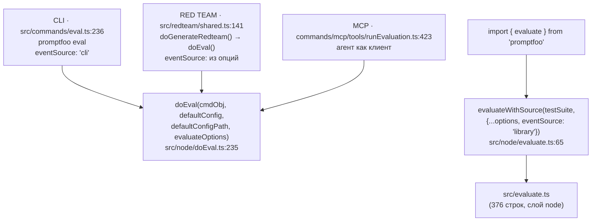
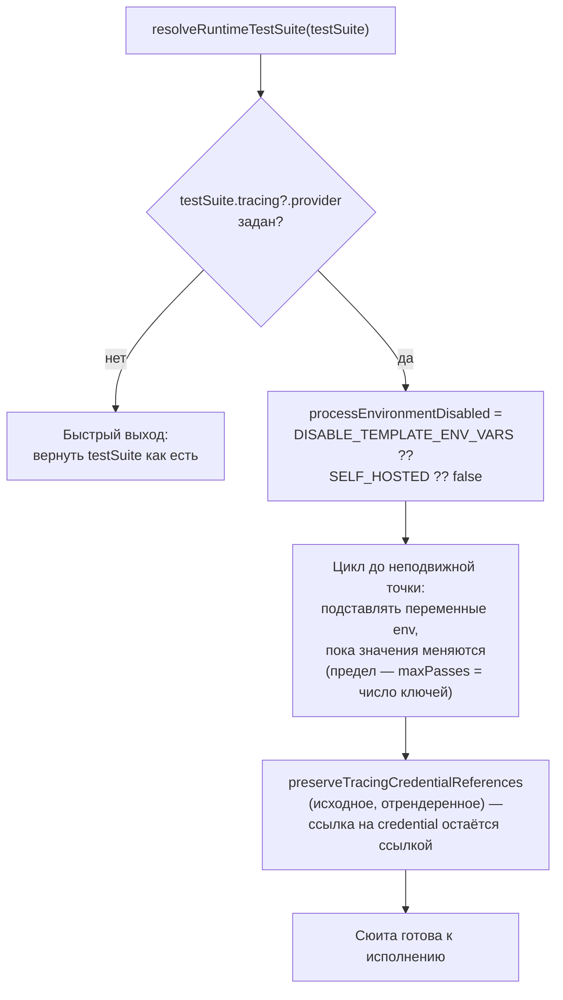
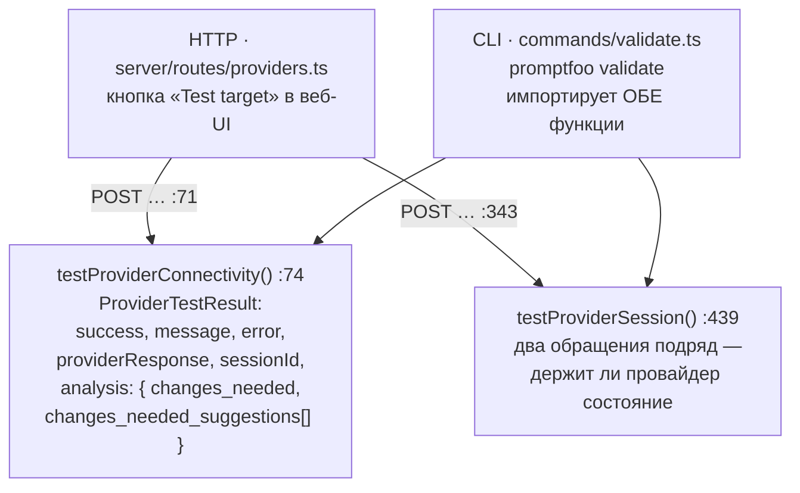
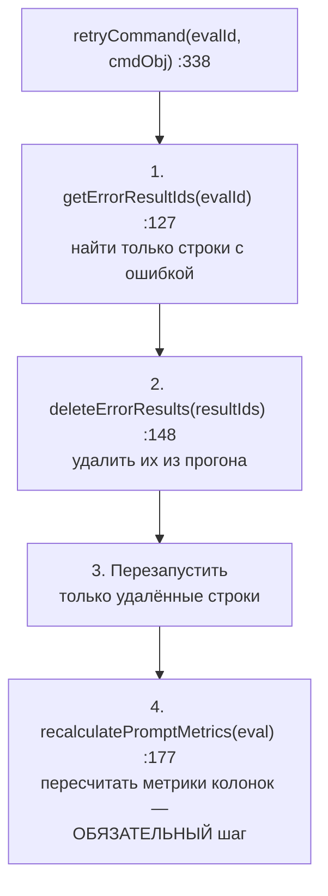

# Программная точка входа — `src/node`

> Разбор через призму **Domain-Driven Design**. Диаграммы — ANSI-псевдографика.
> Дополняет [EVALUATOR.md](EVALUATOR.md), [COMMANDS.md](COMMANDS.md), [MODELS.md](MODELS.md),
> [SERVER.md](SERVER.md), [REDTEAM.md](REDTEAM.md), [ARCHITECTURE.md](ARCHITECTURE.md).
>
> COMMANDS.md описывает путь через CLI. Здесь — путь через библиотеку, и общий
> для них обоих оркестратор `doEval`.

---

## 0. Паспорт подсистемы

```
╔══════════════════════════════════════════════════════════════════════════════╗
║  src/node — оркестрация прогона и привязка портов к Node-реализациям         ║
╠══════════════════════════════════════════════════════════════════════════════╣
║  Файлов ................. 8                                                  ║
║  Строк .................. 2756                                               ║
║  AGENTS.md .............. НЕТ                                                ║
║  Публичная бочка ........ index.ts — 1 строка, 2 экспорта                    ║
╠══════════════════════════════════════════════════════════════════════════════╣
║  Слой ................... node   tier 3 из 11                                ║
║  Входящих рёбер слоя .... 894    БОЛЬШЕ, ЧЕМ У ЛЮБОГО ДРУГОГО СЛОЯ           ║
║  Исходящих рёбер слоя ... 272                                                ║
║  Каталог src/node — одна десятая слоя: 2756 строк из 30 874                  ║
╠══════════════════════════════════════════════════════════════════════════════╣
║  Тестов ................. 2903 строки / 5 файлов в test/node                 ║
║  Без собственного теста . doEval.ts (1242) · evaluate.ts (69) ·              ║
║                           shareInstructions.ts (23)                          ║
╠══════════════════════════════════════════════════════════════════════════════╣
║  Потребителей doEval .... 3    CLI · redteam run · MCP-сервер                ║
║  Потребителей testProvider  2  HTTP-роут сервера · CLI-команда validate      ║
╚══════════════════════════════════════════════════════════════════════════════╝
```

Каталог маленький, но стоит на главном перекрёстке: **через `doEval` проходит
каждый прогон оценки в системе** — запущен он из терминала, из веб-интерфейса,
из red team или из MCP-инструмента.

---

## 1. Дисциплина чтения: каталог `src/node` ≠ слой `node`

Это первое, обо что спотыкается читатель конституции слоёв, и ни один
предыдущий документ серии этого не разъяснял.

```
╔══════════════════════════════════════════════════════════════════════════════╗
║  СЛОЙ node — десять корней, 30 874 строки                                    ║
╠══════════════════════════════════════════════════════════════════════════════╣
║  корень                строк   файлов   разобрано                            ║
║  ────────────────────────────────────────────────────────────────────────    ║
║  src/util              19310      101    UTIL.md                             ║
║  src/models             3633        6    MODELS.md                           ║
║  src/node               2756        8    ← ЭТОТ ДОКУМЕНТ                     ║
║  src/database           1398        5    не разобрано                        ║
║  src/cache.ts            987        1    не разобрано                        ║
║  src/share.ts            901        1    не разобрано                        ║
║  src/globalConfig        799        3    не разобрано                        ║
║  src/storage             565        3    не разобрано                        ║
║  src/evaluate.ts         376        1    не разобрано                        ║
║  src/migrate.ts          149        1    не разобрано                        ║
╚══════════════════════════════════════════════════════════════════════════════╝
```

Когда `edge-baseline.json` сообщает «providers → node: 301», это **не** значит,
что провайдеры 301 раз импортируют `src/node/`. В подавляющем большинстве это
импорты из `src/util/`. Каталог `src/node/` — одна десятая слоя по объёму.

Имя слоя описывает не расположение файлов, а **свойство**: всё, что здесь
лежит, требует настоящей среды Node — файловой системы, SQLite, сети, процесса.
Отсюда и `util`, и `database`, и `cache.ts` в одной корзине с `node/`.

---

## 2. Единый язык подсистемы

| Термин | Носитель в коде | Смысл в предметной области |
| --- | --- | --- |
| **doEval** | `doEval.ts:235` | Оркестратор одного прогона: конфиг → сюита → оценка → вывод → шеринг |
| **EvalRunError** | `doEval.ts:142` | Отказ прогона с явным POSIX-кодом выхода |
| **Evaluator runtime** | `EvaluatorRuntime<TEval, TResult>` | Порт: чем именно ядро оценки пишет, хранит и разрешает окружение |
| **Evaluation store** | `EvaluationStore<…>` | Порт персистентности: 10 методов чтения и записи результатов |
| **Result writer** | `EvaluatorResultWriter` | Порт потоковой записи в файл; реализация — JSONL |
| **Runtime test suite** | `resolveRuntimeTestSuite` | Сюита после подстановки переменных окружения — то, что реально исполняется |
| **Connectivity test** | `testProviderConnectivity` | Проверка «мишень отвечает и её ответ разбирается» до запуска прогона |
| **Session test** | `testProviderSession` | Проверка, что провайдер держит состояние между двумя обращениями |
| **Retry** | `retryCommand` | Перезапуск только упавших с ошибкой строк существующего прогона |

---

## 3. Три двери в один оркестратор

```
╔══════════════════════════════════════════════════════════════════════════════╗
║  КТО ВЫЗЫВАЕТ doEval                                                         ║
╚══════════════════════════════════════════════════════════════════════════════╝

   ┌─ CLI ──────────────────┐  ┌─ RED TEAM ────────────┐  ┌─ MCP ─────────────┐
   │ src/commands/eval.ts   │  │ src/redteam/shared.ts │  │ commands/mcp/     │
   │ :236                   │  │ :141                  │  │  tools/           │
   │                        │  │                       │  │  runEvaluation.ts │
   │ promptfoo eval         │  │ doGenerateRedteam()   │  │ :423              │
   │                        │  │   затем doEval()      │  │                   │
   │ eventSource: 'cli'     │  │ eventSource: из опций │  │ агент как клиент  │
   └───────────┬────────────┘  └───────────┬───────────┘  └─────────┬─────────┘
               │                           │                        │
               └───────────────┬───────────┴────────────────────────┘
                               ▼
                  ┌────────────────────────────────┐
                  │  doEval(cmdObj, defaultConfig, │
                  │         defaultConfigPath,     │
                  │         evaluateOptions)       │
                  │         src/node/doEval.ts:235 │
                  └────────────────────────────────┘

   ОТДЕЛЬНО — библиотечный API, минуя doEval:
   ┌──────────────────────────────────────────────────────────────────────┐
   │  import { evaluate } from 'promptfoo';                               │
   │        │                                                             │
   │        ▼  src/node/evaluate.ts:65 — 4 строки кода, 60 строк JSDoc    │
   │  evaluateWithSource(testSuite, {...options, eventSource: 'library'}) │
   │        │                                                             │
   │        ▼  src/evaluate.ts (376 строк, слой node)                     │
   └──────────────────────────────────────────────────────────────────────┘
```

Те же двери как Mermaid-диаграмма:



**Своими словами.** Представь здание с тремя парадными дверьми и отдельным
служебным входом сбоку. В парадные двери заходят три разных посетителя —
человек из терминала, автоматика red team, агент через MCP, — и всех
троих охрана на входе (`doEval`) встречает одинаково: просит заполнить
одну и ту же форму в стиле «опций командной строки», даже если посетитель
пришёл вообще не из командной строки. Red team и MCP не спорят с формой —
они просто подстраиваются под неё, потому что вход изначально
спроектирован под самого частого гостя, терминал. А вот у служебного входа
(библиотечный `import { evaluate }`) всё иначе: он вообще не заходит через
парадный холл и не имеет дела с охраной `doEval` — у него свой маршрут
через `src/evaluate.ts`, и единственное, что он делает так же, как
остальные, — это цепляет на грудь такой же бейдж-пропуск, только с другой
надписью: не «cli», а «library». Бейдж — это `eventSource`, и именно по
нему здание потом понимает, кому в случае неполадки просто вывести
сообщение на табло в холле, а кому — молча вернуть ошибку обратно в руки
(`isCliEventSource`).

Обратите внимание на асимметрию. `doEval` принимает **опции командной строки**
(`Partial<CommandLineOptions & Command>`) — включая `Command` из Commander.
То есть путь, которым ходят все три «внутренних» вызывающих, спроектирован
вокруг CLI, и red team с MCP подстраиваются под его форму.

Библиотечный `evaluate` идёт другой дорогой — через `src/evaluate.ts`, — и
единственное, что он делает поверх, это проставляет `eventSource: 'library'`.
Разделение честное: у библиотеки свой вход, у команд свой.

`eventSource` пронизывает обе ветки и определяет не только телеметрию:
`isCliEventSource(evaluateOptions)` в `doEval` решает, писать ли ошибки
в терминал или бросать исключение вызывающему.

---

## 4. Отказ прогона: код выхода как часть контракта

```
╔══════════════════════════════════════════════════════════════════════════════╗
║  EvalRunError — doEval.ts:142                                                ║
╚══════════════════════════════════════════════════════════════════════════════╝

  export class EvalRunError extends Error {
    readonly exitCode: number;
    constructor(message: string, exitCode: number = 1) {
      …
      // POSIX exit codes are 1-255 (0 means success). Coerce silly values to
      // the default rather than letting `exitCode = 0` silently mask a real
      // failure.
      this.exitCode =
        Number.isInteger(exitCode) && exitCode >= 1 && exitCode <= 255 ? exitCode : 1;
    }
  }

   ┌── Что здесь сделано правильно ───────────────────────────────────────┐
   │                                                                      │
   │  exitCode = 0  →  принудительно 1                                    │
   │  exitCode = 300 →  принудительно 1                                   │
   │  exitCode = 2.5 →  принудительно 1                                   │
   │                                                                      │
   │  Ошибка НЕ МОЖЕТ выйти с кодом успеха. Для инструмента, который      │
   │  живёт в CI и чей выход читает pipeline, это не мелочь: молчаливый   │
   │  ноль превратил бы упавший прогон в зелёный билд.                    │
   └──────────────────────────────────────────────────────────────────────┘
```

Парная функция `failEvalRun:154` разводит два режима по `isCliInvocation`:
в CLI — красная строка в лог и возврат запасного `Eval`, в библиотеке —
исключение вызывающему. Один и тот же отказ, две формы подачи.

---

## 5. Порты и адаптеры: где ядро встречается со средой

Это архитектурно самое ценное, что есть в каталоге, и ради этого сюда стоит
заглядывать.

```
╔══════════════════════════════════════════════════════════════════════════════╗
║  ПОРТ (абстракция)                    АДАПТЕР (реализация)                   ║
╠══════════════════════════════════════════════════════════════════════════════╣
║  src/evaluator/runtime.ts  78 строк   src/node/evaluatorRuntime.ts  87 строк ║
║  ────────────────────────────────     ────────────────────────────────────   ║
║                                                                              ║
║  interface EvaluatorRuntime<T,R> {    export const nodeEvaluatorRuntime      ║
║    resolveRuntimeTestSuite?()    ──►    подстановка env в сюиту              ║
║    createEvaluationStore()       ──►    new EvalEvaluationStore(evaluation)  ║
║    createResultWriters()         ──►    JsonlFileWriter на каждый .jsonl     ║
║  }                                                                           ║
║                                                                              ║
║  interface EvaluationStore<T,R> {     src/node/evaluationStore.ts  89 строк  ║
║    appendResult()                     class EvalEvaluationStore              ║
║    appendPrompts()                      implements EvaluationStore<Eval,     ║
║    readResults()                                          EvalResult>        ║
║    readResultsByTestIdx()                                                    ║
║    readFailedResultsByTestIdx()       ─── и ВТОРАЯ реализация ───            ║
║    readCompletedIndexPairs()          src/evaluator/inMemoryStore.ts  161    ║
║    hasResultPersistenceFailure()      class InMemoryEvaluationStore          ║
║    … 10 методов                       ✘ НИ ОДНОГО ПОТРЕБИТЕЛЯ В src/         ║
║  }                                                                           ║
╚══════════════════════════════════════════════════════════════════════════════╝
```

Порт `EvaluationStore` намеренно узкий: он работает не с `EvalResult`, а с
`EvaluationStoreResult` — это `Pick<EvaluateResult, …>` из 15 полей. Ядро
оценки видит ровно то, что ему нужно для записи, и ничего сверх.

### Что делает `resolveRuntimeTestSuite`

```
   Единственный метод порта, который не сводится к «создай объект».

   ┌──────────────────────────────────────────────────────────────────────┐
   │  if (!testSuite.tracing?.provider) return testSuite;  ← быстрый выход│
   │                                                                      │
   │  processEnvironmentDisabled =                                        │
   │      getEnvBool('PROMPTFOO_DISABLE_TEMPLATE_ENV_VARS',               │
   │                 getEnvBool('PROMPTFOO_SELF_HOSTED', false))          │
   │                     ▲                                                │
   │      в self-hosted подстановка process.env выключена ПО УМОЛЧАНИЮ    │
   │      — сервер не должен раздавать своё окружение в шаблоны           │
   │                                                                      │
   │  ЦИКЛ ДО НЕПОДВИЖНОЙ ТОЧКИ:                                          │
   │    maxPasses = Object.keys(renderedEnv).length                       │
   │    повторять подстановку, пока значения меняются                     │
   │    ▲ переменная может ссылаться на переменную; предел числом ключей  │
   │      гарантирует остановку даже на циклической ссылке                │
   │                                                                      │
   │  preserveTracingCredentialReferences(исходное, отрендеренное)        │
   │    ▲ не даёт секрету МАТЕРИАЛИЗОВАТЬСЯ в конфиге трассировки:        │
   │      ссылка на credential остаётся ссылкой                           │
   └──────────────────────────────────────────────────────────────────────┘
```

Тот же процесс как Mermaid-диаграмма:



**Своими словами.** Представь двух людей, заполняющих анкеты, где часть
полей — это не значения, а ссылки друг на друга: «мой адрес = смотри
адрес соседа». Если соседей всего несколько и цепочка ссылок конечная,
через несколько кругов сверки все поля наконец устаканиваются и перестают
меняться — вот тогда сверку и можно прекратить. Но что, если сосед А
ссылается на соседа Б, а Б — обратно на А? Без ограничения сверка шла бы
вечно. Поэтому заранее назначают потолок — не больше кругов, чем вообще
есть полей в анкете, — и на этом остановятся, даже если круговая ссылка
так и не разрешилась. И ещё одно отдельное правило для этих анкет: если
где-то в поле должен был подставиться пароль, в анкету пишут не сам
пароль, а табличку «см. связку ключей» — то есть настоящий секрет
никогда не переписывается открытым текстом в итоговый документ,
который потом кто-то может увидеть (конфиг трассировки).

Три решения в тридцати строках, и каждое закрывает свой класс проблем:
неограниченная рекурсия, утечка окружения хоста в self-hosted развёртывании,
материализация секрета в артефакте трассировки.

---

## 6. Инверсия, которая не завершена

А теперь — расплата.

```
╔══════════════════════════════════════════════════════════════════════════════╗
║  ПОРТ ЕСТЬ, ИНВЕРСИИ НЕТ                                                     ║
╠══════════════════════════════════════════════════════════════════════════════╣
║                                                                              ║
║   src/evaluator.ts:26                                                        ║
║     import { nodeEvaluatorRuntime } from './node/evaluatorRuntime';          ║
║                    ▲                                                         ║
║                    │  прямой импорт конкретного адаптера                     ║
║                                                                              ║
║   src/evaluator.ts:5065                                                      ║
║     runtime ?? (nodeEvaluatorRuntime as unknown as EvaluatorRuntime<…>)      ║
║                    ▲                                                         ║
║                    │  Node-адаптер — значение по умолчанию                   ║
║                    │  плюс двойное приведение через unknown                  ║
║                                                                              ║
╠══════════════════════════════════════════════════════════════════════════════╣
║   ЧТО ЭТО ЗНАЧИТ ДЛЯ СЛОЁВ                                                   ║
║                                                                              ║
║      evaluator.ts  ∈  legacy-runtime  (tier 2)                               ║
║      evaluatorRuntime.ts ∈ node       (tier 3)                               ║
║                                                                              ║
║      tier 2 ──импортирует──► tier 3        ОБРАТНОЕ РЕБРО                    ║
║                                                                              ║
║      legacy-runtime → node : 101 импортов                                    ║
║                                                                              ║
║   Порт задумывался, чтобы этого ребра не было. Ребро осталось —              ║
║   потому что связывание по умолчанию сделано импортом, а не внедрением.      ║
╚══════════════════════════════════════════════════════════════════════════════╝
```

Формально всё на месте: интерфейс объявлен в `src/evaluator/runtime.ts`,
реализация отдельно, параметр `runtime` в сигнатуре позволяет подменить.
Практически ядро знает имя конкретного адаптера и импортирует его напрямую.

Ошибочно было бы принять за симптом того же самого `InMemoryEvaluationStore`:
161 строка второй реализации порта, у которой нет потребителей в `src/` — её
вызывает только собственный тест. Разница в том, что здесь это **не** дефект.
`docs/architecture/packages.md` называет её назначение прямо: «a dependency-light
state implementation for embedded evaluators and focused tests» — облегчённая
реализация именно для встраивания promptfoo как библиотеки и для точечных
тестов, а не для CLI-пути, который всегда персистентен через `EvalEvaluationStore`.
Отсутствие потребителей в `src/` тут ожидаемо: сценарий embedded-библиотеки
попросту не реализован в самом репозитории, а тест — не случайный сторож,
а адресный потребитель, ради которого адаптер и написан.

---

## 7. `testProvider` — единственный модуль с двумя поверхностями

```
╔══════════════════════════════════════════════════════════════════════════════╗
║  testProvider.ts — 759 строк, две двери                                      ║
╚══════════════════════════════════════════════════════════════════════════════╝

   ┌─ HTTP ────────────────────────────┐   ┌─ CLI ────────────────────────────┐
   │ src/server/routes/providers.ts:71 │   │ src/commands/validate.ts         │
   │   POST … → testProviderConnectivity│   │   promptfoo validate            │
   │ src/server/routes/providers.ts:343│   │   импортирует ОБЕ функции        │
   │   POST … → testProviderSession    │   │   и выводит их типы через        │
   │                                   │   │   Awaited<ReturnType<…>>         │
   │ Кнопка «Test target» в веб-UI     │   │                                  │
   └─────────────────┬─────────────────┘   └────────────────┬─────────────────┘
                     └────────────────┬─────────────────────┘
                                      ▼
   ┌──────────────────────────────────────────────────────────────────────┐
   │  testProviderConnectivity()   :74                                    │
   │    ProviderTestResult { success, message, error,                     │
   │                         providerResponse, transformedRequest,        │
   │                         sessionId,                                   │
   │                         analysis: { changes_needed,                  │
   │                                     changes_needed_reason,           │
   │                                     changes_needed_suggestions[] } } │
   │                            ▲                                         │
   │            LLM разбирает ответ мишени и объясняет, что чинить        │
   │                                                                      │
   │  testProviderSession()        :439                                   │
   │    два обращения подряд; держит ли провайдер состояние               │
   │    SessionTestResult { …, details: { sessionId, sessionSource,       │
   │                                       request1, request2 } }         │
   └──────────────────────────────────────────────────────────────────────┘
```

Поле `analysis` выделяет этот модуль: он не просто сообщает «не работает», а
прогоняет ответ через модель и возвращает `changes_needed_suggestions` —
список конкретных правок конфигурации. Для red team это критично: [REDTEAM.md](REDTEAM.md)
описывает прогоны на сотни атак, и обнаружить неверно настроенную мишень
нужно до них, а не после.

Обе поверхности как Mermaid-диаграмма:



**Своими словами.** Представь контроль на входе с двумя разными
турникетами — парадным (кнопка «Test target» в браузере) и служебным
(команда `promptfoo validate` в терминале), — но за обоими турникетами
стоит один и тот же охранник с одним и тем же списком правил. Кто бы ни
прошёл, охранник делает одно из двух: либо проверяет, откликается ли
пост вообще и понятен ли его ответ (`testProviderConnectivity`), либо
стучится дважды подряд и смотрит, помнит ли пост, кто приходил в первый
раз (`testProviderSession`). Самое ценное — не сама проверка, а то, что
охранник не просто говорит «не пускает» или «пускает». Если что-то не
так, он отдаёт результат модели, которая читает ответ поста и пишет
конкретную памятку: что именно поправить в настройках, а не просто
«ошибка». Поскольку турникет один и тот же для обоих входов, кнопка в
интерфейсе физически не может вести себя иначе, чем команда в
терминале, — они зовут одну и ту же охрану.

Обе поверхности — HTTP и CLI — зовут одну функцию. Разъехаться поведение
кнопки в интерфейсе и команды в терминале не может по построению.

---

## 8. `retry` — единственная операция над завершённым прогоном

```
   retry.ts  486 строк                       промышленный сценарий:
   ┌──────────────────────────────────────┐  прогон на 500 тестов, 12 упали
   │  getErrorResultIds(evalId)      :127 │  с 429 от провайдера. Перезапускать
   │      ▼ только строки с ошибкой       │  все 500 — деньги и время.
   │  deleteErrorResults(resultIds)  :148 │
   │      ▼ удалить их из прогона         │  ┌── Порядок операций ────────┐
   │  … перезапуск …                      │  │ 1. найти упавшие           │
   │      ▼                               │  │ 2. удалить их              │
   │  recalculatePromptMetrics(eval) :177 │  │ 3. перезапустить           │
   │      ▼ метрики колонок пересчитать   │  │ 4. пересчитать МЕТРИКИ     │
   │  retryCommand(evalId, cmdObj)   :338 │  └────────────────────────────┘
   └──────────────────────────────────────┘
      Шаг 4 обязателен: метрики промпта — агрегат по строкам. Заменили
      строки — агрегат протух. Без пересчёта прогон покажет старый счёт.

   Тестируется плотнее всего в каталоге:
   test/node/retry.integration.test.ts   1603 строки
   test/node/retry.test.ts                558 строк
   ────────────────────────────────────────────────
   2161 строки теста на 486 строк кода   =  4.4 : 1
```

Тот же порядок операций как Mermaid-диаграмма:



**Своими словами.** Представь склад после ревизии, на котором нашли
12 бракованных коробок из 500. Переделывать всю партию бессмысленно —
дорого и долго. Поэтому сначала на бумаге отмечают ТОЛЬКО номера
бракованных коробок (`getErrorResultIds`), а не всю партию. Потом эти
коробки физически убирают со склада — не помечают браком, а именно
убирают, освобождая место (`deleteErrorResults`). Дальше на освободившееся
место заново завозят замену — только тех самых 12 коробок, а не всех 500.
И вот последний шаг — тот, который легко забыть, но без которого всё
предыдущее теряет смысл: итоговую накладную склада, где написано «всего
такого-то товара на сумму такую-то», нужно пересчитать заново
(`recalculatePromptMetrics`). Накладная — это не список коробок, а сумма
по ним; подменили несколько коробок — сумма на бумаге устарела, даже
если сами коробки на полках уже правильные. Именно поэтому пересчёт
итога — не необязательное украшение, а обязательный последний шаг.

Отношение 4.4:1 — самое высокое из всего, что встречалось в серии. И это
оправданно: `retry` **удаляет данные** из существующего прогона. Ошибка здесь
не портит новый результат, а разрушает старый.

---

## 9. Публичная бочка и то, что мимо неё

```
   src/node/index.ts — весь файл:

      export { evaluate, evaluateWithSource } from './evaluate';

   ┌── Через бочку ───────────────────────────────────────────────────────┐
   │  evaluate            69 строк    ✔                                   │
   │  evaluateWithSource  (реэкспорт) ✔                                   │
   └──────────────────────────────────────────────────────────────────────┘

   ┌── Мимо бочки — прямыми импортами из других слоёв ────────────────────┐
   │  doEval               1242   ← commands/eval · redteam/shared · MCP  │
   │  testProvider          759   ← server/routes · commands/validate     │
   │  retry                 486   ← commands/retry                        │
   │  evaluationStore        89   ← evaluatorRuntime                      │
   │  evaluatorRuntime       87   ← evaluator.ts (обратное ребро, §6)     │
   │  shareInstructions      23                                           │
   │  ────────────────────────────────────────────────────────────────    │
   │  2686 строк из 2756 = 97.5% каталога                                 │
   └──────────────────────────────────────────────────────────────────────┘
```

Бочка описывает 2.5% каталога. Это не ошибка — `index.ts` здесь оформляет
*библиотечный* контракт, а не внутренний. Но следствие в том, что границы
каталога не существует: любой слой импортирует любой файл `src/node/` напрямую,
и ничто этому не препятствует.

---

## Диагноз

```
╔══════════════════════════════════════════════════════════════════════════════╗
║                               ДИАГНОЗ src/node                               ║
╠══════════════════════════════════════════════════════════════════════════════╣
║  СИЛЬНЫЕ СТОРОНЫ                                                             ║
║                                                                              ║
║  ✔ Порты выделены явно и узко: EvaluationStore работает с Pick<> из 15       ║
║    полей, а не с полным EvalResult. Ядро видит ровно необходимое.            ║
║                                                                              ║
║  ✔ resolveRuntimeTestSuite закрывает три класса проблем в тридцати строках:  ║
║    цикл до неподвижной точки против рекурсивных ссылок, отключение           ║
║    process.env по умолчанию в self-hosted, запрет материализации секретов.   ║
║                                                                              ║
║  ✔ EvalRunError не может выйти с кодом 0. Для инструмента, чей exit code     ║
║    читает CI, это защита от зелёного билда на упавшем прогоне.               ║
║                                                                              ║
║  ✔ testProvider обслуживает и HTTP-роут, и CLI одной функцией — поведение    ║
║    кнопки в UI и команды в терминале разъехаться не может.                   ║
║                                                                              ║
║  ✔ Анализ мишени через LLM (changes_needed_suggestions) — не «не работает»,  ║
║    а список правок конфигурации.                                             ║
║                                                                              ║
║  ✔ retry покрыт в отношении 4.4:1 — рекорд серии, оправданный тем, что       ║
║    операция удаляет данные из существующего прогона.                         ║
║                                                                              ║
║  ✔ InMemoryEvaluationStore — 161 строка ЛЁГКОЙ реализации порта для          ║
║    embedded-сценариев и точечных тестов. Отсутствие потребителей в src/      ║
║    ожидаемо: CLI-путь персистентен по определению. Назначение названо        ║
║    в docs/architecture/packages.md, а не додумано по коду.                   ║
╠══════════════════════════════════════════════════════════════════════════════╣
║  СЛАБЫЕ МЕСТА                                                                ║
║                                                                              ║
║  ✘ doEval.ts — 1242 строки, самый нагруженный перекрёсток системы —          ║
║    БЕЗ СОБСТВЕННОГО ТЕСТА. Косвенно задет шестью чужими наборами.            ║
║                                                                              ║
║  ✘ Инверсия зависимости объявлена, но не выполнена: evaluator.ts (tier 2)    ║
║    импортирует nodeEvaluatorRuntime (tier 3) напрямую и делает его           ║
║    значением по умолчанию через двойное приведение `as unknown as`.          ║
║                                                                              ║
║  ✘ Нет AGENTS.md, хотя каталог держит главный оркестратор и обе              ║
║    реализации портов.                                                        ║
║                                                                              ║
║  ✘ doEval принимает Partial<CommandLineOptions & Command> — тип Commander    ║
║    в сигнатуре оркестратора. Red team и MCP подстраиваются под форму CLI.    ║
║                                                                              ║
║  ✘ index.ts описывает 2.5% каталога; остальные 97.5% импортируются           ║
║    пофайлово из четырёх других слоёв. Границы модуля нет.                    ║
║                                                                              ║
║  ✘ Имя слоя вводит в заблуждение: 894 входящих ребра «в node» — это в        ║
║    основном src/util, а не src/node. Ни один документ этого не пояснял       ║
║    до настоящего.                                                            ║
╚══════════════════════════════════════════════════════════════════════════════╝
```

### Оценка по осям

```
  Выделение портов             █████████░   9/10   узкий Pick<>, честные интерфейсы
  Безопасность окружения       █████████░   9/10   self-hosted, неподвижная точка, секреты
  Обработка отказов            ████████░░   8/10   POSIX-коды, два режима подачи
  Единая поверхность           ████████░░   8/10   testProvider одинаков в HTTP и CLI
  Покрытие тестами             █████░░░░░   5/10   2903 строки, но doEval без теста
  Инверсия зависимости         ████░░░░░░   4/10   порт есть, обратное ребро осталось
  Границы модуля               ███░░░░░░░   3/10   бочка описывает 2.5%
  Документированность          ██░░░░░░░░   2/10   нет AGENTS.md; имя слоя путает
  ─────────────────────────────────────────────────────────────────────────────
  ИНТЕГРАЛЬНО                  ██████░░░░   6.0/10
```

Каталог решает трудные задачи хорошо и лёгкие — плохо. Подстановка окружения,
коды выхода, границы порта продуманы до мелочей. Тест главного файла,
`AGENTS.md` и внятная бочка — не сделаны.

---

## Рекомендации по эволюции

1. **Написать `test/node/doEval.test.ts`.** 1242 строки на трёх путях вызова
   без собственного набора — самый крупный риск каталога. Начать с матрицы
   `eventSource` × режим отказа: именно она определяет, полетит исключение
   или ляжет строка в лог.

2. **Довести инверсию до конца.** Убрать `import { nodeEvaluatorRuntime }` из
   `evaluator.ts`, сделать параметр `runtime` обязательным и передавать
   адаптер из трёх точек входа. Это снимает часть из 101 обратного ребра
   `legacy-runtime → node` и заодно убирает `as unknown as`.

3. **Рассмотреть `InMemoryEvaluationStore` для внутренних прогонов оптимизатора.**
   [OPTIMIZER.md](OPTIMIZER.md) описывает до восьми прогонов с `persisted: false`,
   которые сейчас всё равно идут через `EvalEvaluationStore`, — а по назначению
   из `docs/architecture/packages.md` это ровно тот случай, для которого
   лёгкий адаптер и написан. Перевод не обязателен, но естественный кандидат
   уже есть внутри самого репозитория, а не только во внешних embedded-сценариях.

4. **Завести `src/node/AGENTS.md`** и записать в нём в первую очередь то,
   чего нет больше нигде: различие каталога и слоя, три пути в `doEval`,
   правило «не материализовать credential-ссылки», запрет на `exitCode: 0`.

5. **Убрать `Command` из сигнатуры `doEval`.** Ввести собственный тип опций
   оркестратора и адаптировать CLI-объект на стороне `commands/eval.ts`.
   Тогда red team и MCP перестанут зависеть от формы Commander.

6. **Расширить `index.ts` до настоящей границы каталога** — или, наоборот,
   зафиксировать в `AGENTS.md`, что бочка обслуживает только библиотечный
   контракт, а внутренние импорты пофайловые и это норма. Сейчас читатель
   не может отличить одно от другого.

---

## Карта директории

```
src/node/
├── index.ts .......................................... 1   бочка, 2 экспорта
│
├── doEval.ts ...................................... 1242   ✘ без теста
│     EvalCommandSchema           :77   Zod поверх CommandLineOptionsSchema
│     EvalRunError                :142  POSIX-код выхода, 0 запрещён
│     failEvalRun                 :154  CLI: лог + fallback / lib: throw
│     handleRecoverableWatchError :170
│     resolveReplayConfigs        :104
│     resolveSuggestionOptions    :186
│     showRedteamProviderLabelMissingWarning :220
│     doEval                      :235  главный оркестратор
│
├── testProvider.ts ................................. 759   test/node/testProvider.test.ts
│     ProviderTestResult          :39   + analysis от LLM
│     SessionTestResult           :53
│     testProviderConnectivity    :74   ← server/routes + commands/validate
│     testProviderSession         :439  ← server/routes + commands/validate
│
├── retry.ts ........................................ 486   2161 строка тестов, 4.4:1
│     getErrorResultIds           :127
│     deleteErrorResults          :148
│     recalculatePromptMetrics    :177  обязателен после подмены строк
│     retryCommand                :338  ← commands/retry
│
├── evaluationStore.ts ............................... 89   test/node/evaluationStore.test.ts
│     class EvalEvaluationStore implements EvaluationStore<Eval, EvalResult>
│
├── evaluatorRuntime.ts .............................. 87   test/node/evaluatorRuntime.test.ts
│     nodeEvaluatorRuntime: EvaluatorRuntime<Eval, EvalResult>
│       resolveRuntimeTestSuite · createEvaluationStore · createResultWriters
│
├── evaluate.ts ...................................... 69   ✘ без теста; 60 строк JSDoc
│     evaluate() — публичный библиотечный API
│
└── shareInstructions.ts ............................. 23   ✘ без теста

Связанные файлы вне каталога:
    src/evaluator/runtime.ts .......................... 78   определения портов
    src/evaluator/inMemoryStore.ts ................... 161   второй адаптер, без потребителей
    src/evaluator.ts:26, :5065 ............................  прямой импорт адаптера
    src/evaluate.ts .................................. 376   путь библиотечного API
    src/commands/eval.ts:236 ..............................  вызов doEval из CLI
    src/redteam/shared.ts:141 .............................  вызов doEval из red team
    src/commands/mcp/tools/runEvaluation.ts:423 ...........  вызов doEval из MCP
    test/node/ ...................................... 2903   5 файлов
```

---

## Команды

```bash
# Состав каталога
find src/node -name '*.ts' | xargs wc -l | sort -rn

# ГЛАВНОЕ: каталог src/node — это НЕ слой node
python3 -c "import json;d=json.load(open('architecture/layers.json'));print([l['roots'] for l in d['layers'] if l['name']=='node'])"

# Слой node — самый нагруженный по входящим рёбрам
python3 -c "
import json;b=json.load(open('architecture/edge-baseline.json'))
for t in ['node','legacy-contracts','legacy-runtime']:
    print(t, sum(v for k,v in b.items() if k.endswith('-> '+t)))"

# Три потребителя doEval
grep -rn 'doEval(' src/ | grep -v '^src/node/doEval.ts'

# Обе поверхности testProvider
grep -rn 'testProviderConnectivity\|testProviderSession' src/ | grep -v '^src/node/'

# Незавершённая инверсия: ядро импортирует конкретный адаптер
grep -n 'nodeEvaluatorRuntime' src/evaluator.ts

# Лёгкий адаптер: подтвердить, что src/ его не использует (ожидаемо — см. §6)
grep -rn 'InMemoryEvaluationStore' src/ test/ | grep -v '^test/evaluator/'

# Покрытие тестами по файлам
for f in doEval testProvider retry evaluationStore evaluatorRuntime evaluate; do
  printf '%-22s %6s  %s\n' "$f.ts" "$(wc -l < src/node/$f.ts)" \
    "$(ls test/node/$f*.test.ts 2>/dev/null | tr '\n' ' ')"
done

# Тесты каталога
npx vitest run test/node test/evaluator
```

---

*Документ описывает `src/node` на коммите `2c140ef`, promptfoo 0.122.0. Дата среза — 26 августа 2026.*
