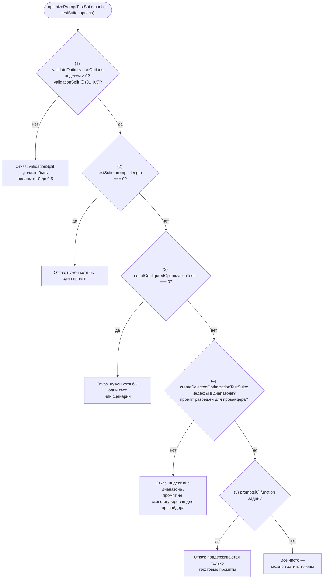
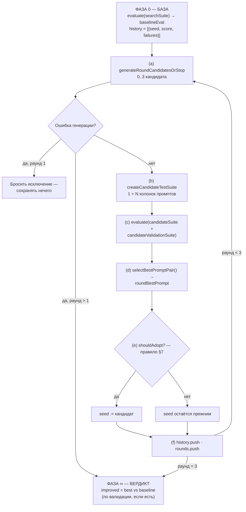
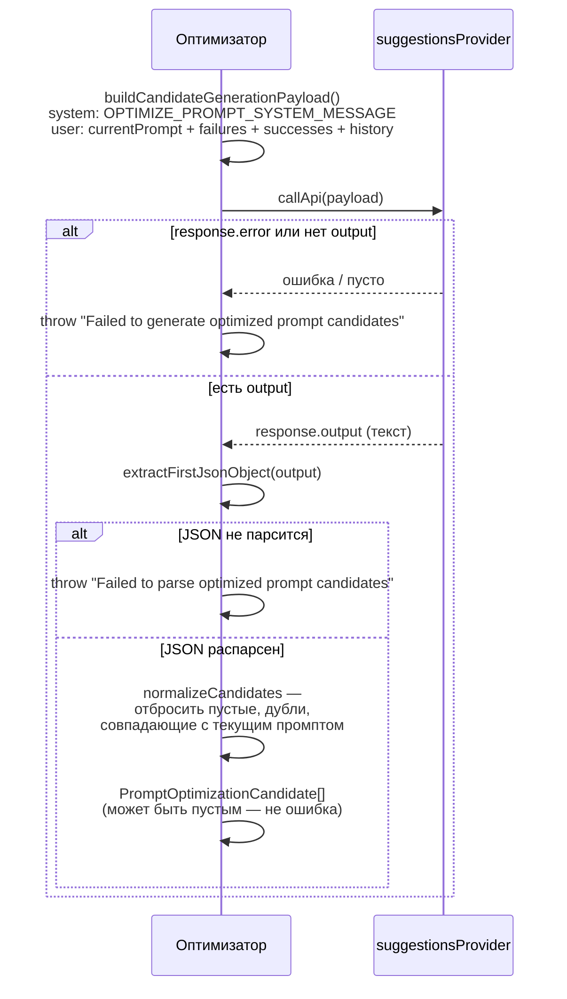

# Оптимизатор промптов — `src/optimizer`

> Разбор через призму **Domain-Driven Design**. Диаграммы — ANSI-псевдографика.
> Дополняет [EVALUATOR.md](EVALUATOR.md), [PROMPTS.md](PROMPTS.md), [COMMANDS.md](COMMANDS.md),
> [PROVIDERS.md](PROVIDERS.md), [MODELS.md](MODELS.md), [ARCHITECTURE.md](ARCHITECTURE.md).

---

## 0. Паспорт подсистемы

```
╔══════════════════════════════════════════════════════════════════════════════╗
║  src/optimizer — поисковый цикл над текстом промпта                          ║
╠══════════════════════════════════════════════════════════════════════════════╣
║  Файлов ................. 1        promptOptimizer.ts                        ║
║  Строк .................. 951                                                ║
║  Функций ................ 33       из них экспортировано 2                   ║
║  Экспортов всего ........ 5        3 интерфейса + 2 функции                  ║
║  AGENTS.md .............. НЕТ      и не упомянут в корневом AGENTS.md        ║
║  Подкаталогов ........... 0        плоский модуль                            ║
╠══════════════════════════════════════════════════════════════════════════════╣
║  Слой ................... legacy-runtime  (tier 2 из 11)                     ║
║  Потребителей ........... 1        src/commands/optimize.ts                  ║
║  Импортируемых модулей .. 13       10 значений + 3 типа                      ║
╠══════════════════════════════════════════════════════════════════════════════╣
║  Тестов ................. 1405 строк / 34 сценария it()                      ║
║    test/optimizer/promptOptimizer.test.ts ... 1131 строк / 24 it()           ║
║    test/commands/optimize.test.ts ...........  274 строки / 10 it()          ║
║  Отношение тест/код ..... 1.48 : 1                                           ║
╠══════════════════════════════════════════════════════════════════════════════╣
║  Раундов по умолчанию ... 3        DEFAULT_ROUNDS                            ║
║  Кандидатов за раунд .... 3        DEFAULT_CANDIDATE_COUNT                   ║
║  Максимум колонок ....... 1 + 3x(1+3) = 13 колонок оценки (без валидации)    ║
║  Потолок validationSplit  0.5      VALIDATION_SPLIT_MAX                      ║
╚══════════════════════════════════════════════════════════════════════════════╝
```

Это самая маленькая подсистема из разобранных: **один файл, ни одного подкаталога,
ни одного `AGENTS.md`** — и ни одной строки в таблице «Project Structure» корневого
`AGENTS.md`, где перечислены 12 других каталогов `src/`. И при этом — единственная
подсистема в репозитории, которая *пишет промпты вместо человека*. Всё остальное
в promptfoo измеряет то, что человек написал.

---

## 1. Единый язык подсистемы

| Термин | Носитель в коде | Смысл в предметной области |
| --- | --- | --- |
| **Seed prompt** | `seedPrompt: Prompt` | Текущий лучший промпт — точка, от которой стартует следующий раунд |
| **Routing prompt** | `routingPrompt: Prompt` | Исходный, нулевой промпт; по нему решается, к каким тестам относится оптимизация |
| **Candidate** | `PromptOptimizationCandidate` | Переписанный вариант промпта + гипотеза, почему он должен быть лучше |
| **Hypothesis** | `candidate.hypothesis?: string` | Объяснение LLM, *почему* именно это изменение должно помочь |
| **Round** | `PromptOptimizationRound` | Один цикл «сгенерировать → оценить → принять или отвергнуть» |
| **Search split** | `searchTestSuite` | Тесты, на которых оптимизатор *ищет* улучшение — и на которых может переобучиться |
| **Validation split** | `validationTestSuite` | Отложенные тесты, которых LLM никогда не видит; на них выносится вердикт |
| **Baseline** | `baselineEval`, `baselinePrompt` | Замер до оптимизации — точка отсчёта для «стало ли лучше» |
| **Search history** | `PromptOptimizationHistoryItem[]` | Лента «промпт → счёт → провалы», которую видит LLM при следующей генерации |
| **Adoption** | `shouldAdopt` | Решение сделать кандидата новым seed'ом |
| **Improvement** | `improved: boolean` | Итоговый вердикт: превзошёл ли лучший промпт исходный |

Обратите внимание на разделение **seed** и **routing**. Оно неочевидно, но
несёт весь вес корректности: seed меняется каждый раунд, routing — никогда.
По routing'у восстанавливается принадлежность тестов, по seed'у — текст, который
переписываем. Слить их в одно поле — значит на втором раунде потерять тесты,
привязанные к исходной метке промпта.

---

## 2. Место подсистемы в архитектуре

Оптимизатор живёт в слое `legacy-runtime` — том же, где `evaluator.ts`,
`suggestions.ts`, `openapi/` и ещё 35 корней. Это **tier 2 из 11**: почти дно
конституции слоёв, ниже только `contracts` и `legacy-contracts`.

```
              tierOrder ───────────────────────────────────────────────►
   0            1                2             3       4          5        6
contracts  legacy-contracts  LEGACY-RUNTIME   node  providers  redteam   core
                                   ▲
                                   │  src/optimizer здесь
                                   │
   ┌───────────────────────────────┴───────────────────────────────────┐
   │  Разрешённые зависимости legacy-runtime (allowedDependencies):    │
   │  contracts · core · legacy-contracts · node · providers · redteam │
   └───────────────────────────────────────────────────────────────────┘

   Входящие рёбра слоя               Исходящие рёбра слоя
   ────────────────────              ─────────────────────
   providers   → legacy-runtime  325 legacy-runtime → node             101
   node        → legacy-runtime  150 legacy-runtime → legacy-contracts  68
   redteam     → legacy-runtime  142 legacy-runtime → providers         14
   cli         → legacy-runtime   83 legacy-runtime → core              12
   core        → legacy-runtime   47 legacy-runtime → redteam            6
   view-server → legacy-runtime   35 legacy-runtime → contracts          2
   app         → legacy-runtime    7
   legacy-contracts → …            4 Всего: 793 входящих / 203 исходящих
```

Внутри этого перегруженного слоя оптимизатор — редкий гость с **одним-единственным
потребителем**:

```
╔══════════════════════════════════════════════════════════════════════════════╗
║  ЕДИНСТВЕННЫЙ ПУТЬ ВЫЗОВА                                                    ║
╠══════════════════════════════════════════════════════════════════════════════╣
║                                                                              ║
║   src/main.ts:110                                                            ║
║        │  optimizeCommand(program, defaultConfig, defaultConfigPath)         ║
║        ▼                                                                     ║
║   src/commands/optimize.ts:135      ← регистрация Commander-команды          ║
║        │  doOptimize(options)                                                ║
║        ▼                                                                     ║
║   src/commands/optimize.ts:4                                                 ║
║        │  import { optimizePromptTestSuite } from '../optimizer/…'           ║
║        ▼                                                                     ║
║   src/optimizer/promptOptimizer.ts:739                                       ║
║        optimizePromptTestSuite(config, testSuite, options)                   ║
║                                                                              ║
║   Публичного фасада НЕТ: promptfoo как библиотека оптимизатор не отдаёт.     ║
║   Единственная дверь — CLI-команда `promptfoo optimize`.                     ║
╚══════════════════════════════════════════════════════════════════════════════╝
```

Исходящие связи — ровно 13 модулей, ни одного лишнего:

```
   ┌── promptOptimizer.ts импортирует ────────────────────────────────────┐
   │                                                                      │
   │  ЗНАЧЕНИЯ (10)                       ЧТО БЕРЁТ                       │
   │  ─────────────────────────────       ────────────────────────────    │
   │  ../evaluator                        evaluate() — весь прогон        │
   │  ../models/eval                      Eval — контейнер результатов    │
   │  ../models/prompt                    generateIdFromPrompt()          │
   │  ../prompts/index                    OPTIMIZE_PROMPT_SYSTEM_MESSAGE  │
   │  ../providers/defaults               getDefaultProviders()           │
   │  ../types/index                      CompletedPrompt Prompt TestSuite│
   │  ../util/json                        extractFirstJsonObject()        │
   │  ../util/promptMatching              isPromptAllowed()               │
   │  ../util/sanitizer                   sanitizeObject()                │
   │  ../logger  +  chalk                 вывод                           │
   │                                                                      │
   │  ТИПЫ (3)                                                            │
   │  ../models/evalResult · ../types/index · ../types/internal           │
   └──────────────────────────────────────────────────────────────────────┘
```

Ни одного импорта из `redteam`, `server`, `app`, `database`. Оптимизатор
разговаривает только с ядром оценки — это чистый **domain service** поверх
агрегата `Eval`.

---

## 3. Пять предполётных проверок

Прежде чем потратить хоть один вызов модели, `optimizePromptTestSuite`
проходит воронку отказов. Порядок здесь — часть контракта: сначала дешёвые
проверки аргументов, потом дорогие проверки конфигурации.

```
╔══════════════════════════════════════════════════════════════════════════════╗
║  ВОРОНКА ОТКАЗОВ — optimizePromptTestSuite:739                               ║
╚══════════════════════════════════════════════════════════════════════════════╝

  вход: (config, testSuite, options)
    │
    ├─(1)─ validateOptimizationOptions(options)                        :409
    │        promptIndex / providerIndex   — целое ≥ 0?
    │        validationSplit               — (0 … 0.5] ?
    │        ✘ → "validationSplit must be a number greater than 0
    │             and less than or equal to 0.5."
    │
    ├─(2)─ testSuite.prompts.length === 0 ?
    │        ✘ → "Prompt optimization requires at least one configured prompt."
    │
    ├─(3)─ countConfiguredOptimizationTests(testSuite) === 0 ?         :700
    │        считает explicit tests + scenarios.config × scenarios.tests
    │        и повторяет логику неявного теста из эвалюатора:
    │        ✘ → "…requires at least one configured test or scenario."
    │
    ├─(4)─ createSelectedOptimizationTestSuite(...)                    :437
    │        promptIndex в диапазоне?   ✘ → "…out of range. Available: 0-N"
    │        providerIndex в диапазоне? ✘ → "…out of range. Available: 0-N"
    │        isPromptAllowed(prompt, providerPromptMap[providerKey]) ?
    │        ✘ → "Prompt index N is not configured for provider index M."
    │
    └─(5)─ selectedTestSuite.prompts[0].function ?
             ✘ → "Prompt optimization currently supports
                  literal string prompts only."
    │
    ▼  всё чисто — можно тратить токены
```

Та же воронка как Mermaid-диаграмма:



**Своими словами.** Это предполётный лист лётчика, где каждый следующий пункт
списка дороже предыдущего, поэтому пилот не тратит время на дорогую проверку,
пока не прошёл дешёвую. Сначала — не встал ли штурвал в невозможное положение
(числа индексов и доля валидации в допустимых границах). Потом — не пуст ли
самолёт (есть ли хоть один промпт). Потом — назначен ли рейс хоть куда-то (есть
ли тесты, на которых вообще можно лететь) — и здесь список сверяется с
инструкцией соседнего цеха (эвалюатора), а не пишет свою. Потом — тот ли это
самолёт и тот ли аэродром (индексы промпта и провайдера существуют, и именно
этому провайдеру разрешено принимать именно этот промпт). И только в самом
конце, когда всё остальное уже подтверждено, — последняя, самая частная
деталь: не пытается ли пилот взлететь на модели двигателя, которую эта служба
вообще не обслуживает (промпт как функция, а не текст, — не поддерживается).
Провались любая ступень — рейс отменяется без единого литра топлива; лишь
когда пройдены все пять, стартует дорогая часть — вызовы модели.

Пункт (3) заслуживает отдельного внимания. Функция `countConfiguredOptimizationTests`
не просто считает элементы — она **зеркалит поведение эвалюатора**, и авторы
явно об этом написали:

> `eval` synthesizes one implicit `[{}]` test (merging `defaultTest`) only
> when there are no `tests` and `scenarios` is absent — an empty `scenarios`
> array still suppresses it (see `getInitialTests` in `src/evaluator.ts`).
> Mirror that exactly so the preflight does not accept testless configs.

Это классический **conformist**-момент в терминах DDD: оптимизатор не пытается
переопределить правило соседнего контекста, он его копирует и оставляет ссылку
на первоисточник. Цена — дублирование, которое разъедется при рефакторинге
`getInitialTests`. Выгода — предполётная проверка не пропускает конфиг, на
котором эвалюатор потом ничего не запустит.

Разрыв закрывает `hasRunnableDefaultTest:688`: `defaultTest` считается
«запускаемым», только если у него есть непустой `assert` или непустые `vars`,
и особый случай — `assertScoringFunction` без ассертов признаётся мёртвым.

---

## 4. Раздел валидации: защита от переобучения

Это **центральный механизм** подсистемы, и он не про эффективность, а про честность.
Наивный оптимизатор промптов переобучается тривиально: он показывает LLM провалившиеся
тесты, LLM вписывает ответы в промпт, счёт растёт, обобщение падает.
`createValidationPartition` существует ровно для того, чтобы это не выглядело победой.

```
╔══════════════════════════════════════════════════════════════════════════════╗
║  createValidationPartition:360    tests.length = 10, validationSplit = 0.3   ║
╚══════════════════════════════════════════════════════════════════════════════╝

  validationTestCount = min( 10-1 , max(1, round(10 × 0.3)) ) = 3
  searchTestCount     = 10 - 3 = 7

   tests[0..9]
   ┌───┬───┬───┬───┬───┬───┬───┬───┬───┬───┐
   │ 0 │ 1 │ 2 │ 3 │ 4 │ 5 │ 6 │ 7 │ 8 │ 9 │
   └───┴───┴───┴───┴───┴───┴───┴───┴───┴───┘
     └──────── slice(0,7) ─────────┘ └ slice(7) ┘
     ▼                               ▼
   ┌──────────────────────────┐   ┌────────────────────────┐
   │  searchTestSuite         │   │  validationTestSuite   │
   │  ────────────────────    │   │  ───────────────────   │
   │  LLM ВИДИТ провалы       │   │  LLM НЕ ВИДИТ НИЧЕГО   │
   │  отсюда и переписывает   │   │  используется только   │
   │  промпт под них          │   │  для вынесения вердикта│
   └──────────────────────────┘   └────────────────────────┘

   ┌── Границы ────────────────────────────────────────────────────────┐
   │  min(tests.length - 1, …)  → search-сплит НИКОГДА не пуст         │
   │  max(1, …)                 → validation-сплит НИКОГДА не пуст     │
   │  tests.length < 2          → раздел не делается вообще            │
   │  VALIDATION_SPLIT_MAX=0.5  → валидация не больше половины набора  │
   └───────────────────────────────────────────────────────────────────┘
```

**Раздел детерминирован, а не случаен.** `slice(0, n)` / `slice(n)` — никакого
перемешивания. Один и тот же конфиг всегда даёт один и тот же раздел, что делает
запуски воспроизводимыми, но означает: если тесты в YAML отсортированы по теме,
валидация проверит только последнюю тему.

**Сценарии несовместимы с валидацией** — и это отказ, а не тихое игнорирование:

```
if (validationSplit !== undefined && validationSplit > VALIDATION_SPLIT_MIN) {
  if (testSuite.scenarios?.length) {
    throw new Error(
      'validationSplit is not supported for scenario-based prompt optimization; '
      + 'expand scenarios into explicit tests first.',
    );
  }
}
```

Причина видна из `countConfiguredOptimizationTests`: сценарий разворачивается в
`config.length × tests.length` тестов *внутри* эвалюатора, и до этого разворота
оптимизатор не знает, где резать. Вместо приблизительного раздела — честное
сообщение с готовым действием для пользователя.

---

## 5. Цикл поиска: три раунда, тринадцать колонок

```
╔══════════════════════════════════════════════════════════════════════════════╗
║  ГЛАВНЫЙ ЦИКЛ — optimizePromptTestSuite:739..951                             ║
╚══════════════════════════════════════════════════════════════════════════════╝

  ФАЗА 0 — БАЗА
  ┌──────────────────────────────────────────────────────────────────────────┐
  │  evaluate(searchTestSuite)      → baselineEval                           │
  │  evaluate(validationTestSuite)  → baselineValidationEval   (если сплит)  │
  │  selectBestPromptPair()         → baselinePrompt + baselineValidation…   │
  │                                                                          │
  │  baselineResults ─┬─ !success → currentFailures   (первые 6)             │
  │                   └─  success → currentSuccesses  (первые 3)             │
  │                                                                          │
  │  history = [{ prompt: seed.raw, score, failures }]                       │
  └──────────────────────────────────────────────────────────────────────────┘
                                    │
  ┌─────────────────────────────────┴────────────────────────────────────────┐
  │  for (round = 1; round <= 3; round++)                                    │
  │                                                                          │
  │   (a) generateRoundCandidatesOrStop(round, {prompt, failures,            │
  │                                             successes, history})    :259 │
  │        ├─ успех    → 0..3 кандидата                                      │
  │        ├─ ошибка   ∧ round === 1  → THROW  (нечего сохранять)            │
  │        └─ ошибка   ∧ round  >  1  → null → break (сохраняем найденное)   │
  │                                                                          │
  │   (b) createCandidateTestSuite(searchSuite, routing, seed, cands)   :573 │
  │        строит сюиту с 1 + N колонками промптов                           │
  │                                                                          │
  │   (c) evaluate(candidateSearchSuite)      → candidateEval                │
  │       evaluate(candidateValidationSuite)  → candidateValidationEval      │
  │                                                                          │
  │   (d) selectBestPromptPair() → roundBestPrompt (+ validation)            │
  │                                                                          │
  │   (e) ПРАВИЛО ПРИНЯТИЯ — см. §7                                          │
  │        shouldAdopt ? seed := кандидат : seed остаётся прежним            │
  │                                                                          │
  │   (f) history.push({prompt: seed.raw, score, failures})                  │
  │       rounds.push({round, candidateEval, candidates, chosenPrompt, …})   │
  └──────────────────────────────────────────────────────────────────────────┘
                                    │
  ФАЗА ∞ — ВЕРДИКТ                  ▼
  ┌──────────────────────────────────────────────────────────────────────────┐
  │  improved = валидация есть                                               │
  │             ? score(bestVal) > score(baseVal)                            │
  │               ∨ (равны ∧ score(best) > score(baseline))                  │
  │             : score(best) > score(baseline)                              │
  │  logOptimizationOutcome(...) → зелёный или жёлтый вывод                  │
  └──────────────────────────────────────────────────────────────────────────┘
```

Тот же цикл как Mermaid-диаграмма:



**Своими словами.** Представь мастера, который три вечера подряд пытается
улучшить один и тот же чертёж табуретки. В первый вечер он снимает исходные
размеры и отправляет их на пробную сборку — это база, с которой будет
сравниваться всё остальное. Каждый следующий вечер устроен одинаково: сначала
он просит подмастерье набросать до трёх новых вариантов чертежа (сгенерировать
кандидатов); если подмастерье в первый же вечер ничего не смог придумать —
работа прекращается совсем, сравнивать не с чем. Если же осечка случилась на
втором или третьем вечере — мастер не выбрасывает уже сделанное, а просто
заканчивает пораньше с тем, что есть. Когда варианты готовы, мастер собирает
их ВСЕ — и старый чертёж, и новые — в одну партию и отправляет на одну и ту же
проверку прочности, чтобы сравнение было честным. Из этой партии выбирается
лучший вариант, и тут решается главный вопрос: этот вариант действительно
лучше прежнего, или только показался лучше (правило из §7)? Если лучше —
именно он становится новым «текущим чертежом» для следующего вечера; если
нет — мастер остаётся при старом. И какой бы ни был исход, запись о вечере
подшивается в журнал. После трёх таких вечеров — или досрочной остановки —
выносится финальный вердикт: стал ли табурет лучше, чем был в самом начале.

**Бюджет прогонов.** Без валидации: 1 базовый + 3 раунда = **4 прогона
эвалюатора**, но каждый раунд оценивает 1 + 3 = 4 колонки промптов, то есть
1 + 3×4 = **13 колонок** на всём наборе search-тестов. С валидацией число
прогонов и колонок удваивается: **8 прогонов / 26 колонок**. При 20 тестах и
одном провайдере это порядка 260 обращений к целевой модели плюс 3 обращения к
`suggestionsProvider`. Ни `DEFAULT_ROUNDS`, ни `DEFAULT_CANDIDATE_COUNT` не
выведены во флаги CLI — бюджет фиксирован в коде.

**Раннее прерывание** заслуживает цитаты, потому что описывает именно тот сбой,
который случается на практике:

> Later rounds frequently fail to produce *new* candidates as the prompt
> converges, or on a transient provider error. Don't discard the improvements
> already adopted in earlier rounds: stop and return the best prompt found so
> far (a first-round failure rethrows inside the helper).

Асимметрия «раунд 1 бросает, раунды 2–3 останавливаются» — это правило
предметной области, а не защитное программирование. Провал первого раунда
означает «оптимизация не состоялась»; провал третьего означает «оптимизация
закончилась раньше запланированного, результат есть».

---

## 6. Как кандидаты становятся колонками таблицы

Оптимизатор не изобретает механизм сравнения — он **переиспользует главную
способность эвалюатора**: прогнать N промптов против одного провайдера и выдать
матрицу счетов. Кандидаты просто становятся дополнительными колонками.

```
╔══════════════════════════════════════════════════════════════════════════════╗
║  createCandidateTestSuite:573 — превращение кандидатов в колонки             ║
╚══════════════════════════════════════════════════════════════════════════════╝

  ВХОД                                    ВЫХОД: TestSuite.prompts
  seedPrompt = { raw: "…", label: "P" }   ┌───────────────────────────────────┐
  candidates = [ c1, c2, c3 ]             │ [0] seedPrompt                    │
                                          │      label: "P"                   │
       каждый c_i превращается в:         │ [1] { …seed, raw: c1.prompt,      │
       { ...seedPrompt,                   │       label: "P [optimized 1]",   │
         raw:   candidate.prompt,         │       id: generateIdFromPrompt() }│
         label: `${label} [optimized N]`, │ [2] "P [optimized 2]"             │
         id:    generateIdFromPrompt() }  │ [3] "P [optimized 3]"             │
                                          └───────────────────────────────────┘

  Важное: id пересчитывается ПОСЛЕ подмены raw и label — иначе кандидаты
  склеились бы с seed'ом по идентичному id внутри Eval.

  ┌── Плюс четыре синхронных пересборки фильтров ─────────────────────────┐
  │                                                                       │
  │  providerPromptMap    ← buildCandidateProviderPromptMap :502          │
  │  tests[].prompts      ← buildCandidateTests             :522          │
  │  defaultTest.prompts  ← buildCandidateDefaultTest       :538          │
  │  scenarios[]….prompts ← buildCandidateScenarios         :554          │
  │                                                                       │
  │  все четыре сводятся к одной функции: extendPromptFilter :478         │
  └───────────────────────────────────────────────────────────────────────┘
```

`extendPromptFilter` — самое тонкое место модуля:

```
function extendPromptFilter(allowedPrompts, routingPrompt, seedPrompt, candidateLabels) {
  if (!Array.isArray(allowedPrompts) || !isPromptAllowed(routingPrompt, allowedPrompts)) {
    return allowedPrompts;                 // ← фильтра нет ИЛИ он нас не касается
  }
  return Array.from(new Set([              // ← иначе расширяем, не ломая
    ...allowedPrompts,
    routingPrompt.label, routingPrompt.id,
    seedPrompt.label,    seedPrompt.id,
    ...candidateLabels,
  ].filter(Boolean)));
}
```

Читается так: **«если этот тест был предназначен исходному промпту — пусть он
теперь предназначен ещё и всем кандидатам; если нет — не трогаем»**. Проверка
идёт по `routingPrompt`, а расширение включает и `seedPrompt`. Именно здесь
работает разделение из §1: на третьем раунде seed — это уже переписанный текст,
которого в пользовательском фильтре нет и быть не может, а routing — исходный,
по которому фильтр и был написан.

`Set` вокруг массива нужен потому, что на первом раунде `routingPrompt === seedPrompt`
и метки продублировались бы.

---

## 7. Правило принятия улучшения

```
╔══════════════════════════════════════════════════════════════════════════════╗
║  ЛЕКСИКОГРАФИЧЕСКИЙ ПОРЯДОК: валидация первична, поиск — тайбрейк            ║
╚══════════════════════════════════════════════════════════════════════════════╝

  БЕЗ ВАЛИДАЦИОННОГО СПЛИТА
  ┌───────────────────────────────────────────────────────────────────────┐
  │  roundImproved = scoreOf(roundBestPrompt) > previousScore             │
  │                                                                       │
  │  Единственный критерий — счёт на тех же тестах, что видела LLM.       │
  │  Переобучение здесь неотличимо от улучшения. Это осознанный           │
  │  компромисс ради работы на конфигах с одним-двумя тестами.            │
  └───────────────────────────────────────────────────────────────────────┘

  С ВАЛИДАЦИОННЫМ СПЛИТОМ                                         :864..871
  ┌───────────────────────────────────────────────────────────────────────┐
  │  roundImproved =                                                      │
  │       roundBestValidationScore  >  previousValidationScore            │
  │    ∨ ( roundBestValidationScore === previousValidationScore           │
  │        ∧ scoreOf(roundBestPrompt) > previousScore )                   │
  └───────────────────────────────────────────────────────────────────────┘

                        vScore выше?
                             │
              ┌──────── ДА ──┴── НЕТ ────────┐
              ▼                              ▼
         ПРИНЯТЬ                      vScore равен?
                                           │
                            ┌──── ДА ──────┴──── НЕТ ────┐
                            ▼                            ▼
                   sScore выше?                     ОТВЕРГНУТЬ
                        │                    (даже если sScore вырос —
             ┌── ДА ────┴─── НЕТ ──┐          это и есть переобучение)
             ▼                     ▼
         ПРИНЯТЬ             ОТВЕРГНУТЬ
```

То же правило как Mermaid-диаграмма:

```mermaid
flowchart TD
    Start["Сравнить roundBest с previous"] --> Q1{"Есть валидационный сплит?"}
    Q1 -->|"нет"| S1{"scoreOf(roundBest) > previousScore?"}
    S1 -->|"да"| Accept1["ПРИНЯТЬ<br/>(единственный критерий —<br/>счёт на тех же тестах, что видела LLM)"]
    S1 -->|"нет"| Reject1["ОТВЕРГНУТЬ"]
    Q1 -->|"да"| Q2{"vScore выше<br/>previousValidationScore?"}
    Q2 -->|"да"| Accept2["ПРИНЯТЬ"]
    Q2 -->|"нет"| Q3{"vScore равен<br/>previousValidationScore?"}
    Q3 -->|"нет"| Reject2["ОТВЕРГНУТЬ"]
    Q3 -->|"да"| Q4{"sScore (поиск) выше<br/>previousScore?"}
    Q4 -->|"да"| Accept3["ПРИНЯТЬ"]
    Q4 -->|"нет, даже если sScore вырос —<br/>это переобучение"| Reject3["ОТВЕРГНУТЬ"]
```



**Своими словами.** Представь ученика, который готовится к экзамену по старым
билетам (поиск — тесты, которые видит LLM при переписывании промпта), и есть
отдельный, скрытый от него контрольный билет, который он не видел никогда
(валидация). Если контрольного билета нет вообще — судим только по старым
билетам, и это заведомо ненадёжно: ученик мог просто вызубрить именно эти
вопросы, поэтому улучшение здесь принимается на веру. Но если контрольный
билет есть — решает в первую очередь ОН, а не старые билеты. Стал ли ученик
отвечать на скрытый билет лучше? Тогда — зачёт, неважно, что там со старыми.
Стал ли отвечать на скрытый билет ХУЖЕ? Тогда — незачёт, даже если по старым
билетам прогресс огромный: это и есть признак того, что ученик просто
вызубрил ответы, а не научился думать. И только если результат по скрытому
билету остался РОВНО тем же — тогда, и только тогда, в дело идёт старый билет
как решающий довод: улучшился ли результат хотя бы на нём. Итог: скрытый
экзамен всегда главнее видимого, а видимый решает только при полном равенстве
по скрытому.

Тот же порядок повторяется дважды: внутри раунда (`shouldAdopt`) и на выходе
(`improved`). И тот же порядок зашит в `selectBestPromptPair:319` — при выборе
лучшей колонки внутри одного прогона.

Три детали, каждая из которых меняет поведение:

```
   ┌── scoreOf:109 ──────────────────────────────────────────────────────┐
   │  const score = prompt.metrics?.score;                               │
   │  return Number.isFinite(score) ? score : Number.NEGATIVE_INFINITY;  │
   │                                                                     │
   │  NaN / undefined / Infinity → −∞, а не 0. Промпт без метрик         │
   │  не может случайно выиграть у промпта со счётом 0.                  │
   └─────────────────────────────────────────────────────────────────────┘

   ┌── selectBestPrompt:308 — reduce с оператором >= ────────────────────┐
   │  (best, prompt) => scoreOf(prompt) >= scoreOf(best) ? prompt : best │
   │                                                                     │
   │  >=, а не >: при равенстве побеждает ПОЗЖЕ идущий, то есть          │
   │  кандидат, а не seed. Внутри одного прогона это смещение в пользу   │
   │  нового текста. На уровне раунда компенсируется строгим >           │
   │  в правиле принятия — при равенстве раунд не улучшил ничего.        │
   └─────────────────────────────────────────────────────────────────────┘

   ┌── findPromptIndex:353 — сопоставление по (raw, label) ──────────────┐
   │  index >= 0 ? index : 0                                             │
   │  Не найдено → индекс 0, то есть seed. Тихий фолбэк без лога.        │
   └─────────────────────────────────────────────────────────────────────┘
```

---

## 8. Диалог с моделью-оптимизатором

```
╔══════════════════════════════════════════════════════════════════════════════╗
║  generateOptimizedPromptCandidates:206 — единственный внешний вызов          ║
╚══════════════════════════════════════════════════════════════════════════════╝

  getDefaultProviders().suggestionsProvider
        │   ← тот же провайдер, что у `promptfoo suggest`;
        │      конфигурируется глобально, отдельного флага нет
        ▼
  buildCandidateGenerationPayload:138  →  JSON.stringify([ system, user ])
        │
        ├─ [0] OPTIMIZE_PROMPT_SYSTEM_MESSAGE   (src/prompts/grading.ts:133)
        │      "You improve prompts using concrete evaluation evidence."
        │      требует {"candidates":[{hypothesis, prompt}]}
        │      "Do not return markdown fences or commentary outside the JSON"
        │
        └─ [1] user: safeJsonStringify({
                 goal:          "Improve this prompt … without changing its intent."
                 candidateCount: 3
                 currentPrompt:  <текст текущего seed'а>
                 failures:      ≤ 6 примеров   ← createOptimizationExamples
                 successes:     ≤ 3 примера
                 searchHistory: [ {prompt, score, failures}, … ]
                 responseFormat: { candidates:[{hypothesis, prompt}] }
               })
        ▼
  provider.callApi(payload)
        │
        ├─ response.error ∨ !response.output
        │     → throw "Failed to generate optimized prompt candidates: …"
        │
        ▼
  extractFirstJsonObject(String(response.output))
        │  терпимо к обёрткам вокруг JSON, несмотря на запрет в системном промпте
        ├─ парс не удался → throw "Failed to parse optimized prompt candidates: …"
        ▼
  normalizeCandidates:173
        │
        ├─ typeof prompt !== 'string'          → выбросить
        ├─ trim() пустой                       → выбросить
        ├─ prompt === текущий (после trim)     → выбросить  ◄── ключевое
        ├─ уже в Set дублей                    → выбросить
        ├─ hypothesis не строка / пустая       → undefined, кандидат остаётся
        └─ набрали candidateCount              → break
        ▼
  PromptOptimizationCandidate[]   (может быть ПУСТЫМ — и это не ошибка)
```

Тот же обмен как Mermaid-диаграмма:



**Своими словами.** Представь, что мастер пишет письмо стороннему консультанту
с просьбой предложить до трёх улучшений чертежа: в письмо он честно вкладывает
и что уже не получилось (провалы), и что уже получилось (успехи), и весь
предыдущий разговор с этим же консультантом (историю раундов) — чтобы тот не
повторял старые советы. Если консультант вообще не ответил или прислал пустое
письмо — мастер сразу сообщает об ошибке, дальше идти некуда. Если ответ
пришёл, но в письме не удаётся найти внятный список предложений (не
распарсился JSON) — тоже ошибка, но уже другая: консультант ответил, но
невнятно. А если письмо разобрать удалось — мастер не берёт все предложения
подряд, а сначала фильтрует: выбрасывает пустые записи, выбрасывает дубли, и —
это ключевое — выбрасывает любое предложение, которое на самом деле совпадает
с уже действующим чертежом. Именно этот последний фильтр и есть момент, когда
консультант признаётся: «мне больше нечего добавить» — а мастер просто
получает пустой список вместо ошибки. Пустое письмо с предложениями — это не
сбой переписки, а естественный конец диалога.

Отбрасывание кандидата, равного текущему промпту, — это и есть механизм
естественной сходимости. Когда LLM перестаёт придумывать новое, `normalizeCandidates`
возвращает пустой массив; сюита оценки строится из одной колонки, ни один кандидат
не побеждает, `shouldAdopt` остаётся `false`, seed не меняется. Цикл дорабатывает
оставшиеся раунды вхолостую — досрочного выхода по «нет кандидатов» здесь нет,
`break` срабатывает только на исключении.

### Санитизация: что именно уходит наружу

```
   sanitizeExampleValue(value, context)                                   :97
        │
        ├─ value == null                → undefined
        │
        ├─ sanitizeObject(value, { context, maxDepth: 4 })
        │      маскирует секреты, обрезает глубину
        │
        ├─ stringifyValue(...)          строка как есть, иначе JSON.stringify
        │
        └─ truncateText(..., MAX_EXAMPLE_TEXT_LENGTH = 1200)
               многоточие в конце при обрезке

   Применяется к КАЖДОМУ полю примера — createOptimizationExamples:119
   ┌─────────────────────────────────────────────────────────────────────┐
   │  vars ✔   output ✔   error ✔   gradingReason ✔   namedScores ✔      │
   │  score ✘  success ✘        (числа и булевы — санитайзер не нужен)   │
   └─────────────────────────────────────────────────────────────────────┘
```

Это существенно: в примерах провалов сидят **пользовательские переменные и
ответы целевой модели**, и они уходят стороннему провайдеру подсказок. Без
`sanitizeObject` каждый прогон оптимизатора был бы каналом утечки. `maxDepth: 4`
дополнительно ограничивает глубину — вложенный объект не раздует полезную
нагрузку, даже если в тесте лежит целый API-ответ.

---

## 9. Изоляция побочных эффектов

Оптимизатор запускает эвалюатор от 4 до 8 раз. Каждый такой запуск в обычной
жизни писал бы результаты в БД и в пользовательский файл. Здесь — ни того, ни
другого.

```
╔══════════════════════════════════════════════════════════════════════════════╗
║  ТРИ БАРЬЕРА ПРОТИВ ЗАГРЯЗНЕНИЯ ПОЛЬЗОВАТЕЛЬСКИХ ДАННЫХ                      ║
╠══════════════════════════════════════════════════════════════════════════════╣
║                                                                              ║
║  БАРЬЕР 1: БАЗА ДАННЫХ                                                       ║
║    new Eval(optimizationConfig, { persisted: false })                        ║
║    Промежуточные эвалы живут в памяти. `promptfoo view` их не увидит.        ║
║                                                                              ║
║  БАРЬЕР 2: ФАЙЛ ВЫВОДА                                                       ║
║    const optimizationConfig = { ...config, outputPath: undefined };          ║
║                                                                              ║
║    Комментарий авторов, дословно:                                            ║
║    «Internal optimizer evals are intermediate runs and must not write to     ║
║     the user's configured output. Strip outputPath so the Evaluator does     ║
║     not append baseline or candidate result rows to a .jsonl file the user   ║
║     expects only `eval` to populate.»                                        ║
║                                                                              ║
║    Особенно важно для .jsonl — он дописывается, а не перезаписывается.       ║
║                                                                              ║
║  БАРЬЕР 3: МУТАЦИЯ СЮИТЫ                                                     ║
║    cloneOptimizationTestSuite(suite)  перед КАЖДЫМ evaluate()          :660  ║
║                                                                              ║
║    Поверхностное копирование по конкретным полям, где эвалюатор мутирует:    ║
║    assert[] · options · metadata · vars · prompts · providers                ║
║    Плюс defaultTest и scenarios (config[] и tests[] по отдельности).         ║
║    Без этого 13 колонок накапливали бы мутации друг друга.                   ║
╚══════════════════════════════════════════════════════════════════════════════╝

  ┌── Плюс режим прогона: createEvaluationOptions:721 ────────────────────┐
  │  { ...config.evaluateOptions,                                         │
  │    cache: false,           ← кандидаты всегда свежие                  │
  │    eventSource: 'library', ← телеметрия не считает это CLI-эвалом     │
  │    showProgressBar: false, ← 13 прогресс-баров подряд не нужны        │
  │    silent: true }          ← вывод только от самого оптимизатора      │
  └───────────────────────────────────────────────────────────────────────┘
```

Заметьте порядок в `createEvaluationOptions`: спред пользовательских
`evaluateOptions` идёт **первым**, а четыре критичных поля перекрывают его
после. Пользователь не может случайно включить кэш или запись прогресса
внутри оптимизатора.

`assertOptimizationEvalHasResults:731` закрывает последнюю дыру: если после
всех фильтров не выполнилось ни одного теста, ошибка приходит сразу и внятно —
*«No eval test cases ran for the validation split — check filters and other test
scoping options»* — вместо загадочного нуля в счёте тремя раундами позже.

---

## 10. Поверхность CLI

```
   promptfoo optimize                             src/commands/optimize.ts:135
   ┌──────────────────────────────────────────────────────────────────────┐
   │  -c, --config <path>          promptfooconfig.yaml по умолчанию      │
   │  --prompt-index <index>       индекс промпта    (default 0)          │
   │  --provider-index <index>     индекс провайдера (default 0)          │
   │  --validation-split <ratio>   (0 … 0.5]                              │
   │  --env-file, --env-path <p>   загрузка .env                          │
   └──────────────────────────────────────────────────────────────────────┘

   Валидация флагов дублируется на уровне Commander — parseValidationSplit
   и parseSelectionIndex бросают InvalidArgumentError ДО загрузки конфига,
   чтобы опечатка не стоила пользователю разбора YAML.

   ┌── Чего в CLI НЕТ ────────────────────────────────────────────────────┐
   │  ✘ количество раундов         (DEFAULT_ROUNDS = 3, только в коде)    │
   │  ✘ количество кандидатов      (DEFAULT_CANDIDATE_COUNT = 3)          │
   │  ✘ выбор провайдера подсказок (берётся из getDefaultProviders())     │
   │  ✘ запись результата в файл   (только вывод в терминал)              │
   │  ✘ seed / детерминизм         (раздел детерминирован, LLM — нет)     │
   └──────────────────────────────────────────────────────────────────────┘

   Телеметрия пишется дважды: 'optimize - started' до запуска и второй
   раз после, уже с searchTestCount / validationTestCount / validationSplit.
```

Обратите внимание: команда оптимизирует **один промпт против одного провайдера**
— это записано в её собственном `.description()`: *«Optimize one prompt against
one configured provider»*. Индексы, а не имена — самый низкоуровневый способ
выбора из возможных, и `availableIndexRange:433` компенсирует это подсказкой
`0-N` в тексте ошибки.

---

## Диагноз

```
╔══════════════════════════════════════════════════════════════════════════════╗
║                             ДИАГНОЗ src/optimizer                            ║
╠══════════════════════════════════════════════════════════════════════════════╣
║  СИЛЬНЫЕ СТОРОНЫ                                                             ║
║                                                                              ║
║  ✔ Раздел валидации как первичный критерий. Это то, что отличает             ║
║    инженерный инструмент от демо: оптимизатор способен сказать «стало        ║
║    лучше на поиске, но не на валидации» и отвергнуть кандидата.              ║
║                                                                              ║
║  ✔ Три независимых барьера изоляции (persisted:false, outputPath:undefined,  ║
║    клонирование сюиты). Каждый закрывает свой класс загрязнения.             ║
║                                                                              ║
║  ✔ Санитизация КАЖДОГО поля примера перед отправкой стороннему провайдеру.   ║
║    Единственная подсистема, где утечка была бы структурной, — и она закрыта. ║
║                                                                              ║
║  ✔ Разделение routing/seed промптов. Неочевидное решение, без которого       ║
║    фильтры тестов ломались бы начиная со второго раунда.                     ║
║                                                                              ║
║  ✔ Асимметрия обработки ошибок по раундам: первый бросает, остальные         ║
║    сохраняют найденное. Правило предметной области, а не try/catch.          ║
║                                                                              ║
║  ✔ Отношение тест/код 1.48:1 — 1405 строк тестов на 951 строку кода.         ║
║    Выше, чем у большинства разобранных подсистем.                            ║
║                                                                              ║
║  ✔ Никакой зависимости от redteam / server / app / database. Чистый          ║
║    domain service над агрегатом Eval.                                        ║
╠══════════════════════════════════════════════════════════════════════════════╣
║  СЛАБЫЕ МЕСТА                                                                ║
║                                                                              ║
║  ✘ Ни AGENTS.md в каталоге, ни строки в таблице корневого AGENTS.md.         ║
║    Один из 18 каталогов src/ без локальных доков — но единственный,          ║
║    который принимает решения за пользователя, а не считает метрики.          ║
║                                                                              ║
║  ✘ Бюджет прогонов зашит константами. 13–26 колонок оценки — это реальные    ║
║    деньги, и уменьшить их пользователь не может ничем, кроме правки кода.    ║
║                                                                              ║
║  ✘ Пустой список кандидатов не прерывает цикл. Сошедшийся промпт             ║
║    доигрывает оставшиеся раунды вхолостую, тратя вызовы провайдера.          ║
║                                                                              ║
║  ✘ Раздел валидации детерминирован по позиции (slice). Тесты,                ║
║    сгруппированные по темам в YAML, дают тематически смещённую валидацию.    ║
║                                                                              ║
║  ✘ countConfiguredOptimizationTests дублирует getInitialTests из             ║
║    evaluator.ts. Комментарий предупреждает, но связь не проверяется тестом.  ║
║                                                                              ║
║  ✘ findPromptIndex тихо возвращает 0 при несовпадении. Промах маскируется    ║
║    под «это был seed», без единой строки в лог.                              ║
║                                                                              ║
║  ✘ Без validationSplit защиты от переобучения нет вообще, а флаг             ║
║    по умолчанию выключен. Дефолт — небезопасный режим.                       ║
║                                                                              ║
║  ✘ 951 строка в одном файле при 33 функциях. Границы «раздел / генерация /   ║
║    сборка сюиты / цикл» уже видны в коде, но не выражены файлами.            ║
║                                                                              ║
║  ✘ Гипотезы кандидатов (hypothesis) собираются, попадают в результат —       ║
║    и нигде не выводятся пользователю. Мёртвая ценность.                      ║
╚══════════════════════════════════════════════════════════════════════════════╝
```

### Оценка по осям

```
  Изоляция побочных эффектов   ██████████  10/10   три барьера, ни одной щели
  Защита от утечек             █████████░   9/10   sanitizeObject на всех полях
  Методологическая честность   ████████░░   8/10   валидация есть, но не по умолчанию
  Покрытие тестами             ████████░░   8/10   1.48:1, 34 сценария
  Обработка ошибок             ████████░░   8/10   осмысленные сообщения; один тихий фолбэк
  Единый язык                  ███████░░░   7/10   routing/seed чётко, но нигде не описано
  Конфигурируемость            ████░░░░░░   4/10   бюджет и провайдер захардкожены
  Модульность                  ████░░░░░░   4/10   один файл, 951 строка, 33 функции
  Документированность          ███░░░░░░░   3/10   нет AGENTS.md; спасают комментарии в коде
  Наблюдаемость                ███░░░░░░░   3/10   logger.info по фазам, гипотезы не видны
  ─────────────────────────────────────────────────────────────────────────────
  ИНТЕГРАЛЬНО                  ██████░░░░   6.4/10
```

Профиль читается однозначно: **безопасность и корректность вылизаны, эргономика
не начата**. Это код, который писали, думая о том, как он может навредить
пользовательским данным, — и не думая о том, как им будут пользоваться.

---

## Рекомендации по эволюции

1. **Завести `src/optimizer/AGENTS.md` и строку в таблице корневого `AGENTS.md`.**
   Минимум, который нужно там записать: разделение routing/seed, лексикографическое
   правило принятия, три барьера изоляции и запрет на снятие `outputPath: undefined`.

2. **Прервать цикл при пустом списке кандидатов.** Одна строка рядом с
   существующим `if (candidates === null) break;`:
   `if (candidates.length === 0) { logger.info('Prompt converged…'); break; }`
   Экономит до двух вызовов провайдера и одного полного прогона на каждый
   сошедшийся конфиг.

3. **Вывести бюджет во флаги:** `--rounds` и `--candidates` с текущими значениями
   по умолчанию. `DEFAULT_ROUNDS` и `DEFAULT_CANDIDATE_COUNT` уже параметризованы
   внутри — не хватает только двух `.option()` и проброса через
   `PromptOptimizationOptions`.

4. **Сделать `--validation-split` включённым по умолчанию** при `tests.length >= 4`
   (например, 0.25), с возможностью отключить через `--validation-split 0`.
   Небезопасный режим не должен быть дефолтным; на малых наборах текущее
   поведение сохранится само за счёт проверки `tests.length < 2`.

5. **Печатать гипотезы принятых кандидатов.** `PromptOptimizationRound.candidates`
   уже несёт `hypothesis`, а `logOptimizationOutcome` их игнорирует. Строка
   «round 2 adopted: <hypothesis>» превращает чёрный ящик в объяснимый процесс
   почти бесплатно.

6. **Перемешивать раздел с фиксированным seed'ом.** Детерминизм сохранится,
   тематическое смещение исчезнет. Ключ перемешивания — хеш от содержимого
   конфига, чтобы одинаковый конфиг всегда давал одинаковый раздел.

7. **Залогировать фолбэк в `findPromptIndex`.** `logger.debug` в ветке
   `index < 0` стоит одну строку и снимает целый класс немых расхождений.

8. **Связать `countConfiguredOptimizationTests` с `getInitialTests` тестом.**
   Один параметризованный тест, прогоняющий одинаковые конфиги через обе функции
   и сравнивающий счёт, превратит комментарий-предупреждение в проверяемый контракт.

9. **Разделить файл на четыре.** Границы уже прочерчены функциями:
   `partition.ts` (:360–436), `candidates.ts` (:82–307), `suite.ts` (:437–687),
   `optimize.ts` (:688–951). Слой `legacy-runtime` от этого не изменится,
   а читаемость — заметно.

---

## Карта директории

```
src/optimizer/
└── promptOptimizer.ts ................................... 951

    ├─ Константы                                     :22–29    (8 шт.)
    ├─ Внутренние типы                               :31–41
    │    PromptOptimizationCandidate
    │    PromptOptimizationCandidateResponse
    ├─ Публичные типы                                :43–75
    │    PromptOptimizationResult          :43
    │    PromptOptimizationRound           :60
    │    PromptOptimizationOptions         :70
    │
    ├─ ПРИМИТИВЫ                                     :82–137
    │    truncateText                      :82
    │    stringifyValue                    :86
    │    sanitizeExampleValue              :97
    │    scoreOf                           :109
    │    formatScore                       :114
    │    createOptimizationExamples        :119
    │    toEvaluateResult                  :134
    │
    ├─ ГЕНЕРАЦИЯ КАНДИДАТОВ                          :138–277
    │    buildCandidateGenerationPayload   :138
    │    normalizeCandidates               :173
    │    generateOptimizedPromptCandidates :206  ← экспорт
    │    generateRoundCandidatesOrStop     :259
    │
    ├─ ВЫБОР ЛУЧШЕГО                                 :278–359
    │    logOptimizationOutcome            :278
    │    selectBestPrompt                  :308
    │    selectBestPromptPair              :319
    │    findPromptIndex                   :353
    │
    ├─ РАЗДЕЛ И ВАЛИДАЦИЯ ВХОДА                      :360–436
    │    createValidationPartition         :360
    │    validateOptimizationOptions       :409
    │    availableIndexRange               :433
    │
    ├─ СБОРКА СЮИТЫ КАНДИДАТОВ                       :437–618
    │    createSelectedOptimizationTestSuite :437
    │    extendPromptFilter                :478
    │    buildCandidateProviderPromptMap   :502
    │    buildCandidateTests               :522
    │    buildCandidateDefaultTest         :538
    │    buildCandidateScenarios           :554
    │    createCandidateTestSuite          :573
    │
    ├─ КЛОНИРОВАНИЕ                                  :619–687
    │    cloneTestCaseForOptimization      :619
    │    cloneScenarioForOptimization      :646
    │    cloneOptimizationTestSuite        :660
    │
    └─ ПРЕДПОЛЁТ И ЦИКЛ                              :688–951
         hasRunnableDefaultTest             :688
         countConfiguredOptimizationTests   :700
         createEvaluationOptions            :721
         assertOptimizationEvalHasResults   :731
         optimizePromptTestSuite            :739  ← экспорт, 213 строк

Связанные файлы вне каталога:
    src/commands/optimize.ts ................ 179   единственный потребитель
    src/prompts/grading.ts:133 .............. OPTIMIZE_PROMPT_SYSTEM_MESSAGE
    src/main.ts:110 ......................... регистрация команды
    test/optimizer/promptOptimizer.test.ts .. 1131
    test/commands/optimize.test.ts ..........  274
    site/docs/usage/prompt-optimization.md .. пользовательская документация
```

---

## Команды

```bash
# Размер и состав модуля
wc -l src/optimizer/promptOptimizer.ts
grep -cE '^(export )?(async )?function ' src/optimizer/promptOptimizer.ts
grep -nE '^export ' src/optimizer/promptOptimizer.ts

# Инвентарь функций с номерами строк
grep -nE '^(export )?(async )?function ' src/optimizer/promptOptimizer.ts | sed 's/(.*//'

# Кто импортирует оптимизатор (ожидается ровно один потребитель)
grep -rn "optimizer/promptOptimizer" src/

# Тесты и их объём
wc -l test/optimizer/promptOptimizer.test.ts test/commands/optimize.test.ts
grep -c "it(" test/optimizer/promptOptimizer.test.ts

# Слой модуля и рёбра слоя
python3 -c "import json;d=json.load(open('architecture/layers.json'));print([l['name'] for l in d['layers'] if any('optimizer' in r for r in l['roots'])])"
python3 -c "import json;b=json.load(open('architecture/edge-baseline.json'));print({k:v for k,v in b.items() if 'legacy-runtime' in k})"

# Проверка конституции слоёв
npm run architecture:check

# Запуск тестов подсистемы
npx vitest test/optimizer/promptOptimizer.test.ts
npx vitest test/commands/optimize.test.ts

# Реальный прогон на локальной сборке
npm run local -- optimize -c path/to/promptfooconfig.yaml --validation-split 0.3
```

---

*Документ описывает `src/optimizer` на коммите `2c140ef`, promptfoo 0.122.0. Дата среза — 26 августа 2026.*
