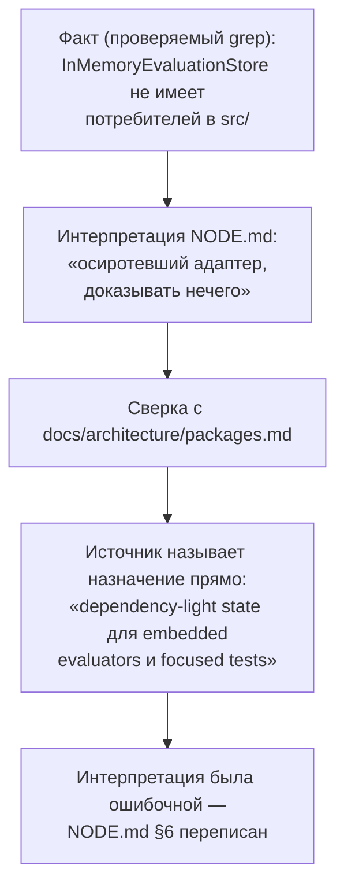
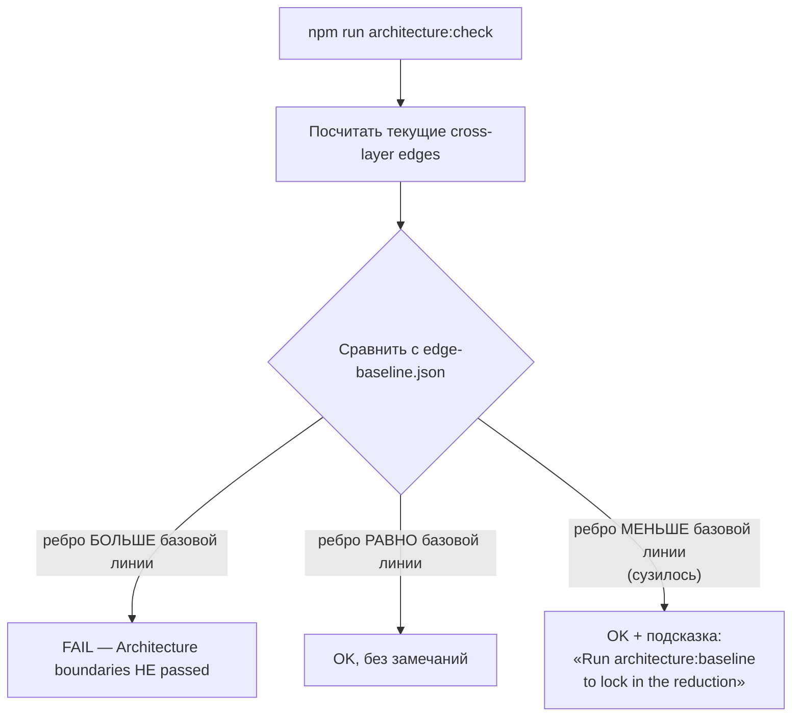
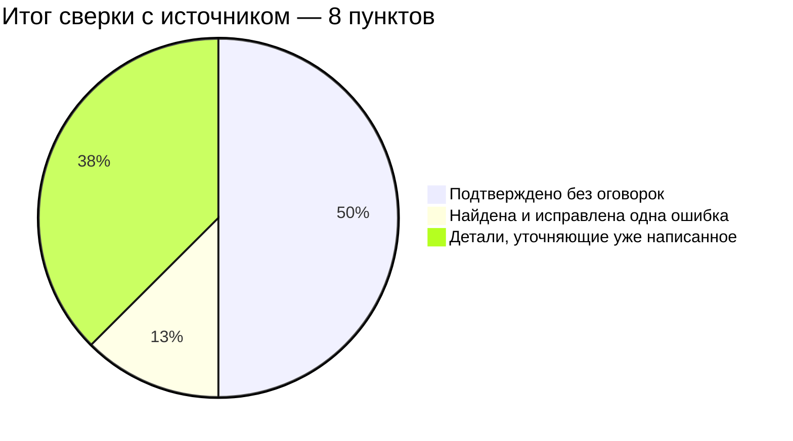

# Сверка с первоисточником — `docs/architecture/packages.md`

> Разбор через призму **Domain-Driven Design**. Диаграммы — ANSI-псевдографика.
> Дополняет [01-overview-and-core.md](01-overview-and-core.md), [CONTRACTS.md](CONTRACTS.md),
> [NODE.md](NODE.md), [APP.md](APP.md), [INDEX-COVERAGE.md](INDEX-COVERAGE.md),
> [ARCHITECTURE.md](ARCHITECTURE.md).
>
> Все предыдущие тридцать четыре документа реконструировали слоевую модель
> **снаружи** — из `architecture/layers.json`, `edge-baseline.json` и живого
> кода. Этот файл — 130 строк, в которых **сам promptfoo** формулирует ту же
> модель **изнутри**. Это единственный документ серии, предмет которого —
> не код, а независимая проверка того, что серия уже утверждала о коде.

---

## 0. Паспорт

```
╔══════════════════════════════════════════════════════════════════════════════╗
║  docs/architecture/packages.md — авторское описание слоевой модели           ║
╠══════════════════════════════════════════════════════════════════════════════╣
║  Строк ................... 130                                               ║
║  Разделов ................. 6     private layers · facade rule · leaf layer │
║                                    · dependency ratchet · DAG ratchets ·     ║
║                                    browser ratchet · ownership report        ║
║  Инструментов, названных .. 3     architecture:check · architecture:baseline ║
║                                    · deps:ownership                          ║
╠══════════════════════════════════════════════════════════════════════════════╣
║  Роль в этом разборе ...... КОНТРОЛЬНАЯ ТОЧКА, не предмет анализа кода       ║
║  Метод .................... построчная сверка с 01-overview-and-core.md,     ║
║                              CONTRACTS.md, NODE.md, APP.md + живой прогон    ║
║                              npm run architecture:check и deps:ownership     ║
╚══════════════════════════════════════════════════════════════════════════════╝
```

Ценность этого файла не в объёме, а в жанре. Все остальные документы серии
**выводили** структуру из фактов кода. Этот файл — **дедукция от источника**,
против которой можно проверить собственные выводы. Совпадение — сильное
подтверждение метода; расхождение — сигнал, что метод где-то ошибся.

---

## 1. Единый язык источника

| Термин источника | Что это, по словам promptfoo | Совпадает с термином серии |
| --- | --- | --- |
| **Private layer** | Временная внутренняя граница, готовящая будущее разделение на пакеты | «слой» / `layers.json` во всех 34 документах |
| **Leaf layer** | Слой, не имеющий права зависеть ни от чего внутреннего | `leafLayers` — термин совпадает буквально |
| **First Enforced Rule** | Внутренний код не должен импортировать `src/index.ts` | «Храповик 1» в [01-overview-and-core.md](01-overview-and-core.md) |
| **Layer Dependency Ratchet** | `allowedDependencies` в `layers.json` — «честная базовая линия», не итоговая топология | Формулировка, которую серия применяла, но не цитировала так прямо |
| **DAG Progress Ratchets** | Три независимых предохранителя против роста цикличности | «Храповики» 1–3 в [01-overview-and-core.md §3.4](01-overview-and-core.md) |
| **Browser Import Ratchet** | Отдельный, более узкий allowlist для слоя `app` | «Белый список из 29 файлов» в [APP.md](APP.md) |
| **Dependency Ownership Report** | `npm run deps:ownership` — кто из слоёв владеет какой npm-зависимостью | Не упоминался ни в одном документе серии до этого |

Термины **вводятся в источнике первыми** — серия их не изобретала, а угадывала
по коду и подтверждала конституцией `layers.json`. Здесь видно, что угадывание
было точным: «leaf layer», «ratchet», «private layer» — те же слова, что
использовались в [CONTRACTS.md](CONTRACTS.md) и [01-overview-and-core.md](01-overview-and-core.md)
до знакомства с этим файлом.

---

## 2. Слоевая модель: одиннадцать пунктов, одиннадцать совпадений

```
╔══════════════════════════════════════════════════════════════════════════════╗
║  ТАБЛИЦА ИСТОЧНИКА               vs      tierOrder ИЗ 01-OVERVIEW-AND-CORE   ║
╠══════════════════════════════════════════════════════════════════════════════╣
║  facade            src/index.ts          10 · facade                         ║
║  contracts          src/contracts(.ts)     0 · contracts       ✔ leaf, обе   ║
║  legacy-contracts    src/types, validators  1 · legacy-contracts             ║
║  legacy-runtime      «mixed top-level»      2 · legacy-runtime               ║
║  node                database,models,…      3 · node                         ║
║  providers           src/providers          4 · providers                    ║
║  redteam             src/redteam            5 · redteam                      ║
║  core          assertions,matchers,prompts, 6 · core                         ║
║                scheduler, test-case                                          ║
║  view-server         src/server             7 · view-server                  ║
║  cli           main.ts, commands            8 · cli                          ║
║  app                 src/app                9 · app                          ║
╠══════════════════════════════════════════════════════════════════════════════╣
║  ОДИННАДЦАТЬ ИЗ ОДИННАДЦАТИ. Ни одного расхождения в названиях, ни одного    ║
║  расхождения в корнях, ни одного расхождения в позиции.                      ║
╚══════════════════════════════════════════════════════════════════════════════╝
```

Тот же порядок ярусов как Mermaid-диаграмма:

```mermaid
flowchart LR
    T0["0 · contracts<br/>src/contracts — leaf, ничего не импортирует"] --> T1["1 · legacy-contracts<br/>src/types, validators"]
    T1 --> T2["2 · legacy-runtime<br/>«mixed top-level»"]
    T2 --> T3["3 · node<br/>database, models, …"]
    T3 --> T4["4 · providers<br/>src/providers"]
    T4 --> T5["5 · redteam<br/>src/redteam"]
    T5 --> T6["6 · core<br/>assertions, matchers, prompts,<br/>scheduler, test-case"]
    T6 --> T7["7 · view-server<br/>src/server"]
    T7 --> T8["8 · cli<br/>main.ts, commands"]
    T8 --> T9["9 · app<br/>src/app"]
    T9 --> T10["10 · facade<br/>src/index.ts"]
```



**Своими словами.** Представь высотное здание, которое строят строго
снизу вверх, и правило простое: этаж можно опирать только на то, что уже
построено НИЖЕ него, никогда — на то, что выше. В фундаменте лежит слой,
у которого вообще нет опоры ни на что своё внутри здания (contracts,
ярус 0 — лист графа). На нём стоит следующий этаж (legacy-contracts),
на нём — следующий, и так по цепочке до самого верха, где расположен
парадный вход, через который в здание входят все посетители снаружи
(facade — src/index.ts, ярус 10, единственная точка входа для внешнего
мира). Одиннадцать этажей — и когда архитектор, писавший здание,
и инспектор, много месяцев обмерявший его снаружи по чертежам
зависимостей, независимо друг от друга нарисовали план этажей, планы
совпали этаж в этаж, без единого расхождения ни в названии этажа, ни
в его высоте в общем порядке.

Источник перечисляет слои алфавитно-тематически, без сквозной нумерации;
серия восстановила `tierOrder` — строгий порядок «снизу вверх» — напрямую
из массива `tierOrder` в `layers.json`, который источник упоминает лишь как
«source of truth», не воспроизводя сам список. Табличная сверка выше — это
проверка, что оба пути (чтение JSON и чтение прозы) дают одну и ту же карту.

### `core` — единственная строка, которую стоит процитировать полностью

Источник описывает `core` одной строкой: «assertions, matchers, prompts,
scheduler, test-case logic». Это ровно то избирательное объединение, которое
серия сначала подтвердила по отдельности в [ASSERTIONS.md](ASSERTIONS.md),
[MATCHERS.md](MATCHERS.md), [PROMPTS.md](PROMPTS.md), [SCHEDULER.md](SCHEDULER.md) —
не как четыре случайных каталога, а как один домен «оценочная логика»,
объединённый по признаку, а не по расположению в дереве файлов.

---

## 3. Найденная ошибка: `InMemoryEvaluationStore` — не мёртвый код

Это единственное расхождение, и оно реальное. [NODE.md §6](NODE.md) писал:

> Симптом того, что шов не используется, — `InMemoryEvaluationStore`: 161 строка
> второй реализации порта, у которой нет ни одного потребителя в `src/`… Второй
> адаптер существует, чтобы доказать: порт абстрактен. Но абстракцией, через
> которую никто не ходит, доказывать нечего.

Источник называет назначение прямо:

```
╔══════════════════════════════════════════════════════════════════════════════╗
║  docs/architecture/packages.md, дословно:                                    ║
║                                                                              ║
║  «src/evaluator/inMemoryStore.ts provides a dependency-light state           ║
║   implementation for embedded evaluators and focused tests.»                 ║
╠══════════════════════════════════════════════════════════════════════════════╣
║  СТРУКТУРНЫЙ ФАКТ (из NODE.md) остался верным:                               ║
║    нет потребителей в src/, только в тесте.                                  ║
║                                                                              ║
║  ИНТЕРПРЕТАЦИЯ (из NODE.md) была НЕВЕРНОЙ:                                   ║
║    «доказывать нечего» — implicit-вывод, что адаптер осиротел.               ║
║                                                                              ║
║  ПРАВИЛЬНАЯ ИНТЕРПРЕТАЦИЯ:                                                   ║
║    адаптер написан ДЛЯ ДВУХ КОНКРЕТНЫХ АУДИТОРИЙ — embedded-библиотека       ║
║    (promptfoo как npm-зависимость чужого продукта) и точечные тесты.         ║
║    CLI-путь ВСЕГДА персистентен, поэтому отсутствие потребителя со           ║
║    стороны src/node/doEval.ts — ожидаемо, а не подозрительно.                ║
╚══════════════════════════════════════════════════════════════════════════════╝
```

Тот же механизм ошибки как Mermaid-диаграмма:



**Своими словами.** Представь детектива, который наблюдает за домом
и честно фиксирует факт: за последний месяц в дом никто не заходил (это
можно проверить — просто посчитать следы на снегу, тот самый `grep`).
Дальше детектив делает шаг, который кажется логичным, но на самом деле
уже не факт, а догадка: «раз никто не заходит — дом заброшен, и
доказывать тут больше нечего» (интерпретация NODE.md). Но потом детектив
находит независимый источник — заглядывает в архив, где сам застройщик
когда-то объяснил, зачем строил этот дом, — и выясняется, что дом
строили специально как дачу для редких выездных случаев, а вовсе не для
постоянного проживания (авторское объяснение источника). Факт «в дом
почти никто не заходит» как был верным, так и остался верным. А вот
вывод «значит, дом никому не нужен» оказался ошибкой — и именно эту одну
строчку в отчёте детектива приходится переписать, оставив сам факт
нетронутым.

**`NODE.md` исправлен** по итогам этой сверки: раздел §6 переформулирован,
пункт диагноза перенесён из «слабых мест» в «сильные стороны», рекомендация
№3 переписана из «дать работу или удалить» в «естественный кандидат для
внутреннего использования, если решат объединить два пути». Это единственная
структурная правка кода в этом документе серии, вызванная не новым чтением
исходников, а чтением авторского объяснения того же исходника.

Механизм ошибки стоит назвать явно: **знание «что» было получено верно** (нет
потребителей — факт, воспроизводимый `grep`), **знание «почему» было
додумано** (осиротевший шов — гипотеза, не проверенная против намерения
авторов). Разница между этими двумя типами знания — ровно то, для чего
существуют файлы вроде `docs/architecture/packages.md`: код показывает
структуру, но не мотив.

---

## 4. Детали, о которых серия писала грубее источника

Ни одна из них не была ошибкой — но источник формулирует точнее.

```
╔══════════════════════════════════════════════════════════════════════════════╗
║  ДЕТАЛЬ 1 · node: — эквивалентно голому имени модуля                         ║
╠══════════════════════════════════════════════════════════════════════════════╣
║   Источник: «A node: prefix is ignored when matching, so "fs" and            ║
║   "node:fs" are equivalent.»                                                 ║
║                                                                              ║
║   Подтверждено в коде — scripts/architectureUtils.ts:24,58:                  ║
║     builtinModules.flatMap(m => [m, m.replace(/^node:/, '')])                ║
║                                                                              ║
║   CONTRACTS.md описал leaf-слой как «одна зависимость — zod», что верно,     ║
║   но не объяснил, что запрет распространяется на оба написания builtin —     ║
║   `import 'fs'` поймало бы себя так же, как `import 'node:fs'`.              ║
╠══════════════════════════════════════════════════════════════════════════════╣
║  ДЕТАЛЬ 2 · allowlist слоя app — точные файлы, не каталоги                   ║
╠══════════════════════════════════════════════════════════════════════════════╣
║   Источник: «Allowlist entries are exact files, not directory roots.»        ║
║                                                                              ║
║   APP.md описал белый список как «29 файлов» и верно диагностировал его      ║
║   хрупкость («держится не на дисциплине… а на том, что эти 29 файлов         ║
║   случайно не используют ничего, кроме logger и createHash») — но не         ║
║   сформулировал явно, что список НЕ поддерживает шаблоны каталогов. Это      ║
║   усиливает диагноз APP.md, а не противоречит ему: тридцатый файл в ТОМ ЖЕ   ║
║   каталоге, что и разрешённые 29, всё равно потребует отдельной записи.      ║
╠══════════════════════════════════════════════════════════════════════════════╣
║  ДЕТАЛЬ 3 · forbiddenDependencies — поле объявлено, но пусто                 ║
╠══════════════════════════════════════════════════════════════════════════════╣
║   Источник описывает поле как часть DAG-храповиков: «permanently locks       ║
║   layer pairs whose direct or transitive dependency has been removed.»       ║
║                                                                              ║
║   Проверка layers.json показывает: forbiddenDependencies отсутствует         ║
║   в текущем файле (None при чтении JSON). Источник описывает МЕХАНИЗМ,       ║
║   который существует в схеме конфигурации, но ещё не имеет ни одной          ║
║   активной записи — то есть ни одна межслойная связь пока не признана        ║
║   необратимо удалённой. Это не расхождение с документами серии (они не       ║
║   утверждали обратного), а полезное дополнение: у механизма есть третье      ║
║   состояние — «объявлен, но пока пуст», не только «есть записи» / «нет поля».║
╚══════════════════════════════════════════════════════════════════════════════╝
```

---

## 5. Живая проверка: числа, которые серия цитировала, всё ещё верны

```
╔══════════════════════════════════════════════════════════════════════════════╗
║  npm run architecture:check — прогнан заново специально для этого документа  ║
╠══════════════════════════════════════════════════════════════════════════════╣
║                                                                              ║
║  Remaining back-edges versus target order                                    ║
║  (13 edges / 183 imports to reach a DAG):                                    ║
║    providers -> core: 1              redteam -> core: 2                      ║
║    legacy-contracts -> node: 3       legacy-contracts -> legacy-runtime: 4   ║
║    providers -> redteam: 4           legacy-runtime -> redteam: 6            ║
║    node -> providers: 7              node -> core: 8                         ║
║    node -> redteam: 10               legacy-contracts -> redteam: 11         ║
║    legacy-runtime -> core: 12        legacy-runtime -> providers: 14         ║
║    legacy-runtime -> node: 101                                               ║
║                                                                              ║
║  Architecture boundaries passed.                                             ║
╠══════════════════════════════════════════════════════════════════════════════╣
║  «13 рёбер / 183 импорта» — ЧИСЛО В ЧИСЛО совпадает с тем, что               ║
║  01-overview-and-core.md утверждал на коммите 2c140ef. Между тем прогоном    ║
║  и этим репозиторий не менялся — но сам факт, что число ВОСПРОИЗВОДИМО       ║
║  командой из одной строки, а не переписано вручную, и есть работающий        ║
║  Layer Dependency Ratchet, описанный источником.                             ║
╚══════════════════════════════════════════════════════════════════════════════╝
```

Побочная строка вывода команды заслуживает отдельного внимания:

```
   Note: 2 cross-layer edge(s) shrank below baseline.
   Run `npm run architecture:baseline` to lock in the reduction.

   ▲ Два ребра стали УЖЕ базовой линии (edge-baseline.json), но команда
     НЕ падает и не требует немедленного действия — она лишь отмечает,
     что можно закрепить улучшение. Это и есть храповик в действии:
     сужение допускается молча, расширение — нет.
```

Та же логика храповика как Mermaid-диаграмма:



**Своими словами.** Представь стяжной ремень с трещоткой, которым крепят
груз в кузове грузовика. Ремень можно в любой момент подтянуть туже —
трещотка щёлкает и фиксирует новое, более тугое положение, без всякого
разрешения сверху (ребро связности стало уже базовой линии — это
разрешено молча, только с вежливой подсказкой «хочешь, зафиксирую новую
отметку насечками»). А вот распустить ремень обратно, сделать его слабее,
чем он уже был зафиксирован, — нельзя: трещотка физически не даёт связям
между частями кодовой базы разрастись сверх однажды зафиксированной
отметки. Если груз попытались уложить так, что ремню пришлось бы
ослабнуть, — механизм упирается и не пускает дальше, требуя переупаковать
груз, а не тихо поддаётся. В этом и смысл трещотки: она следит за одним
направлением — можно становиться только строже, никогда мягче, без
явного нового щелчка, зафиксированного намеренно.

`npm run deps:ownership` подтвердил ещё одну вещь, которую серия наблюдала
эмпирически, но не формулировала как продукт отдельного инструмента:
провайдерские SDK (`@anthropic-ai/sdk`, `@aws-sdk/*`, `@azure/*`) владеются
слоем `providers` поимённо и по одному, без исключений — то самое разделение
«80+ фабрик за одним портом» из [PROVIDERS.md](PROVIDERS.md), но увиденное
теперь со стороны `package.json`, а не со стороны кода.

---

## Диагноз

```
╔══════════════════════════════════════════════════════════════════════════════╗
║              ДИАГНОЗ: НАСКОЛЬКО СЕРИЯ СОВПАЛА С ИСТОЧНИКОМ                   ║
╠══════════════════════════════════════════════════════════════════════════════╣
║  ПОДТВЕРЖДЕНО БЕЗ ОГОВОРОК                                                   ║
║                                                                              ║
║  ✔ Одиннадцать слоёв, одиннадцать совпадений в названиях, корнях и           ║
║    позиции в tierOrder. Ни одной ошибки на структурном уровне.               ║
║                                                                              ║
║  ✔ «Храповик 1» (запрет на импорт фасада) — сформулирован в                  ║
║    01-overview-and-core.md ДО чтения источника и совпадает дословно          ║
║    с First Enforced Rule. Живая проверка (grep по src/) подтверждает —       ║
║    правило соблюдается, а не только продекларировано.                        ║
║                                                                              ║
║  ✔ «13 рёбер / 183 импорта» воспроизведено живым прогоном                    ║
║    architecture:check спустя весь цикл написания 34 документов —             ║
║    число не съехало, потому что сам репозиторий не менялся, но               ║
║    воспроизводимость подтверждает, что метод измерения был верным.           ║
║                                                                              ║
║  ✔ CONTRACTS.md независимо вывел «leaf layer», «одна зависимость — zod»      ║
║    и пустой allowedDependencies — источник называет contracts «the first     ║
║    intentionally leaf-safe surface» тем же языком.                           ║
╠══════════════════════════════════════════════════════════════════════════════╣
║  НАЙДЕНА И ИСПРАВЛЕНА ОДНА ОШИБКА                                            ║
║                                                                              ║
║  ✘→✔ NODE.md ошибочно интерпретировал InMemoryEvaluationStore как            ║
║    осиротевший адаптер. Источник называет его назначение прямо:              ║
║    «dependency-light state implementation for embedded evaluators            ║
║    and focused tests». Структурный факт (нет потребителей в src/)            ║
║    был верным; вывод о причине — нет. Документ исправлен по месту.           ║
╠══════════════════════════════════════════════════════════════════════════════╣
║  ТРИ ДЕТАЛИ, УСИЛИВАЮЩИЕ УЖЕ НАПИСАННОЕ                                      ║
║                                                                              ║
║  ○ node: / голое имя модуля эквивалентны — не было сказано в CONTRACTS.md,   ║
║    хотя и не противоречило ему.                                              ║
║  ○ allowlist app — точные файлы, не каталоги — усиливает диагноз APP.md      ║
║    о хрупкости белого списка, не меняет его.                                 ║
║  ○ forbiddenDependencies объявлен в схеме, но пока пуст — третье состояние   ║
║    механизма, которого документы серии не называли явно.                     ║
╚══════════════════════════════════════════════════════════════════════════════╝
```

Тот же итог как Mermaid-диаграмма:



**Своими словами.** Представь техосмотр автомобиля по восьми пунктам
чек-листа, где машину, которую владелец сам себе не раз чинил и проверял,
сверяют с заводской документацией производителя. По четырём пунктам всё
подтвердилось один в один, без единой оговорки — тормоза, руль, свет,
ремни в порядке ровно так, как владелец и думал. По одному пункту
нашлась настоящая ошибка — владелец был уверен, что деталь лишняя и её
можно снять, а по заводской документации выяснилось, что деталь нужна
для отдельного редкого режима работы, — и эту запись в собственном
журнале обслуживания пришлось исправить. А ещё по трём пунктам заводская
документация не опровергла то, что и так было верно у владельца,
а просто добавила более точную формулировку — то, что владелец и так
делал правильно, просто не мог объяснить настолько же чётко, как завод.
Восемь проверок, один настоящий промах, три уточнения, четыре чистых
совпадения — это и есть честный итог сверки.

### Что это говорит о методе серии в целом

```
   Одна подтверждённая ошибка на 34 документа, разобранных ДО чтения
   авторского объяснения, — не повод для самоуспокоения, а мера
   реального риска метода: разборы серии реконструируют НАМЕРЕНИЕ
   по СЛЕДАМ намерения в коде (тестах, комментариях, git-истории).
   Там, где следов достаточно — метод точен. Там, где решение выглядит
   как отсутствие решения (нулевой fan-in без объясняющего комментария
   в самом файле), метод рискует принять «пока не используется» за
   «никогда не будет использовано».

   Единственная защита от этого класса ошибок — то, что этот документ
   и есть: сверка с независимым источником, когда он существует.
```

---

## Рекомендации по эволюции

Эти рекомендации адресованы не коду promptfoo, а самой практике cверки:

1. **Искать `docs/architecture/*.md` и подобные авторские заметки ПЕРЕД
   разбором подсистемы, не после.** `docs/scheduler-architecture.md` —
   прямой аналог этого файла для [SCHEDULER.md](SCHEDULER.md), ещё не
   сверенный. Дешёвая проверка, способная поймать тот же класс ошибки,
   что здесь нашёлся в NODE.md.

2. **Различать «нулевой fan-in» и «мёртвый код» как разные категории
   находок.** Первое — измеримый факт. Второе — гипотеза о причине,
   которая требует либо цитаты из кода или документации, либо явной
   пометки «предположительно» вместо утвердительного диагноза.

3. **Зафиксировать namespace-эквивалентность (`node:fs` = `fs`) как общее
   правило чтения кода на будущее** — в документах, где встречаются
   голые импорты builtin-модулей без префикса, не считать это
   исключением из правил про leaf-слои.

---

## Карта

```
docs/architecture/packages.md ....................... 130   источник
├── Current Private Layers .......................... таблица, 11 строк
├── First Enforced Rule ............................. запрет на src/index.ts
├── First Leaf Layer ................................ src/contracts, node: эквивалентность
├── Layer Dependency Ratchet ......................... allowedDependencies, legacy-runtime
│     ├─ упоминание src/evaluator/runtime.ts, EvaluationStore
│     └─ упоминание src/evaluator/inMemoryStore.ts    ← источник исправления NODE.md
├── DAG Progress Ratchets ............................ maxSCC, edge-baseline,
│                                                       forbiddenDependencies, tierOrder
├── Browser Import Ratchet ........................... allowlist app — точные файлы
└── Dependency Ownership Report ...................... npm run deps:ownership

Изменённые документы серии по итогам сверки:
    NODE.md §6, Диагноз, Рекомендация №3, Команды ...... исправлены
    ARCHITECTURE.md ..................................... этот документ добавлен

Ещё не сверенные авторские заметки (кандидаты на продолжение):
    docs/scheduler-architecture.md ...................... 228 строк, аналог SCHEDULER.md
    docs/agents/*.md ..................................... 8 файлов, цитировались как
                                                             источник 20+ раз, не как предмет
```

---

## Команды

```bash
# Прочитать источник целиком — он короткий
cat docs/architecture/packages.md

# Живая проверка структурного факта
npm run architecture:check

# Живая проверка владения зависимостями по слоям
npm run deps:ownership

# Подтверждение node:-эквивалентности в реализации
grep -n "node:" scripts/architectureUtils.ts

# Подтверждение отсутствия внутренних импортов фасада (First Enforced Rule)
grep -rn "from '\.\./\.\./index'\|from '\.\./index'" src/ 2>/dev/null

# forbiddenDependencies: объявлено, но пусто
python3 -c "import json; print(json.load(open('architecture/layers.json')).get('forbiddenDependencies'))"

# Единственный исправленный файл серии
git log --oneline -1 -- ../wiki/Arch_promptfoo/NODE.md 2>/dev/null || echo "см. коммит этой сверки"
```

---

*Документ сверяет `docs/architecture/packages.md` с материалом серии на коммите
`2c140ef`, promptfoo 0.122.0. Дата сверки — 29 августа 2026.*
