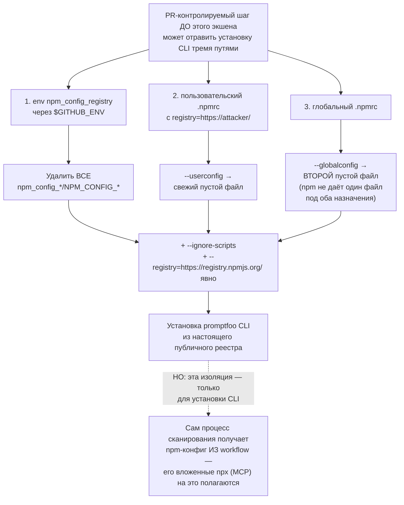
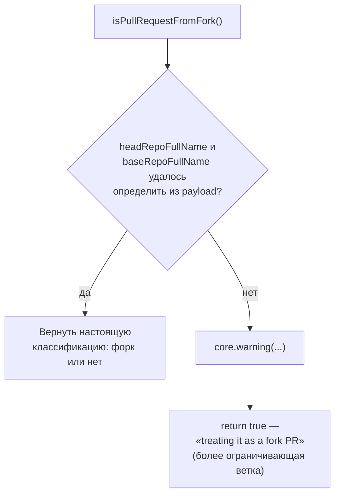
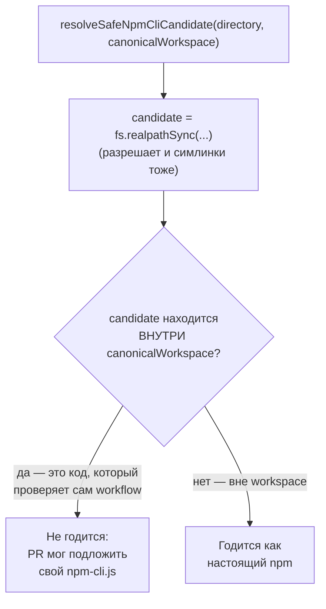
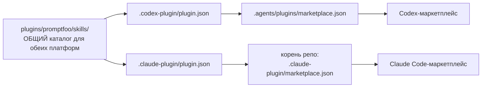

# Упаковка себя для чужих экосистем — `code-scan-action/` и `plugins/`, `.agents/`

> Разбор через призму **Domain-Driven Design**. Диаграммы — ANSI-псевдографика.
> Дополняет [CODESCAN.md](CODESCAN.md), [CI-AND-DOCS.md](CI-AND-DOCS.md),
> [AGENTS-DOCS.md](AGENTS-DOCS.md), [CODING-AGENTS.md](CODING-AGENTS.md),
> [ARCHITECTURE.md](ARCHITECTURE.md).
>
> Последние два именованных пробела из [INDEX-COVERAGE.md §7](INDEX-COVERAGE.md).
> Оба — не часть продукта promptfoo, а способы, которыми promptfoo **упаковывает
> сам себя** для чужих систем распространения: GitHub Actions Marketplace и
> агентные плагин-маркетплейсы Claude Code / Codex.

---

## 0. Паспорт

```
╔══════════════════════════════════════════════════════════════════════════════╗
║  code-scan-action/ — отдельно публикуемый пакет-обёртка                      ║
╠══════════════════════════════════════════════════════════════════════════════╣
║  Файлов .................. 14      свой package.json и lockfile              ║
║  src/ .................... 1 290   auth.ts 23 · config.ts 50 ·               ║
║                                    github.ts 193 · main.ts 1 024             ║
║  Тестов ................... 1 905   отношение 1.48 : 1                       ║
║  Импортирует из основного    src/types/codeScan — единственная связь         ║
║  репозитория напрямую        с ядром CODESCAN.md                             ║
╠══════════════════════════════════════════════════════════════════════════════╣
║  plugins/ + .agents/ — agent-skill плагин для Claude Code и Codex            ║
╠══════════════════════════════════════════════════════════════════════════════╣
║  Файлов .................. 22      18 в plugins/ + 4 в .agents/              ║
║  Скиллов, опубликованных .. 4      promptfoo-evals · provider-setup ·        ║
║                                    redteam-setup · redteam-run               ║
║  SKILL.md (4 шт) суммарно . 716     references/*.md ................ 903     ║
║  Детерминированных скриптов 1 973   openapi-operation-to-*config.mjs (2 шт)  ║
║  Тестов .................... 7 515  promptfooPlugin.test.ts — один файл      ║
╚══════════════════════════════════════════════════════════════════════════════╝
```

Оба каталога объединяет то, что MODELS.md, PROVIDERS.md и остальные тридцать
восемь документов серии ни разу не формулировали как отдельный вопрос: **как
promptfoo распространяется не через `npm install`.** Ответов два, и они
принципиально разные — один встраивается в чужой CI, другой учит AI-агента
пользоваться promptfoo как инструментом.

---

## 1. Единый язык

| Термин | Носитель | Смысл |
| --- | --- | --- |
| **Fork PR** | `isPullRequestFromFork()` | PR из форка — по умолчанию не сканируется, доверия меньше |
| **OIDC token** | `authenticateWithOidc()` | Токен GitHub Actions для аутентификации на сервере promptfoo без секрета в конфиге |
| **Isolated install** | `installPromptfooCli()` | Установка CLI с обнулённым npm-конфигом — публичный реестр гарантирован |
| **Skill** | `plugins/promptfoo/skills/*` | Автономный модуль знания для AI-агента: когда применять, как действовать |
| **Meta selector skill** | запрещённый паттерн | Скилл-диспетчер поверх остальных — намеренно не создан |
| **Marketplace** | `.claude-plugin/marketplace.json`, `.agents/plugins/marketplace.json` | Манифест, через который платформа обнаруживает плагин |
| **Contributor copy** | `.claude/skills/promptfoo-evals/` | Скилл для работы НАД promptfoo, отдельный от скилла, публикуемого ДЛЯ пользователей promptfoo |

---

## 2. `code-scan-action` — тот же самый пользователь, для которого пишет `.github/AGENTS.md`

[CI-AND-DOCS.md §2](CI-AND-DOCS.md) разобрал `.github/AGENTS.md` как список
закрытых атак на воркфлоу — «не выпускай токен в среду недоверенного кода»,
«явно указывай `--registry` при `npm install`». `code-scan-action/src/main.ts` —
не документ с правилами, а код, который **эти самые правила реализует**, да
ещё жёстче, чем сама формулировка требует.

```
╔══════════════════════════════════════════════════════════════════════════════╗
║  installPromptfooCli() — три канала подмены реестра, закрыты одновременно    ║
╠══════════════════════════════════════════════════════════════════════════════╣
║   Комментарий в коде, дословно:                                              ║
║   «A PR-controlled step running before this action can poison either:        ║
║    set npm_config_registry via $GITHUB_ENV, or write                         ║
║    registry=https://attacker/ to $HOME/.npmrc.»                              ║
║                                                                              ║
║   1. env-переменная      → удаляются ВСЕ npm_config_*/NPM_CONFIG_*           ║
║   2. пользовательский    → --userconfig указывает на СВЕЖИЙ пустой файл      ║
║      .npmrc                                                                  ║
║   3. глобальный .npmrc   → --globalconfig указывает на ВТОРОЙ пустой файл    ║
║      («npm rejects loading one file as both»)                                ║
║                                                                              ║
║   + --ignore-scripts     установленный пакет не исполнит свой postinstall    ║
║   + --registry=https://registry.npmjs.org/ явно, поверх всего этого          ║
╠══════════════════════════════════════════════════════════════════════════════╣
║  Осознанный компромисс, названный прямо: эта изоляция применяется ТОЛЬКО     ║
║  к установке самого CLI. Сам процесс сканирования получает конфиг npm ИЗ     ║
║  workflow — «because its nested npx (MCP) invocations rely on it». Разные    ║
║  уровни доверия для разных стадий одного действия, а не единая политика      ║
║  «всё или ничего».                                                           ║
╚══════════════════════════════════════════════════════════════════════════════╝
```

Та же защита как Mermaid-диаграмма:



**Своими словами.** Представь, что перед заселением в гостиницу кто-то
посторонний — гость, заселившийся минутой раньше и имеющий доступ к общей
стойке, — теоретически мог тремя разными способами подменить адрес, по
которому гостинице закажут ваш багаж: переклеить временную табличку на
стойке, подложить свою записку в ваш персональный почтовый ящик или подменить
общий справочник адресов на ресепшене. Администратор не полагается на то, что
«уж как-нибудь пронесёт» — он закрывает все три канала разом, причём не
выборочно, а буквально: сдирает ВСЕ временные таблички подчистую, выдаёт вам
заведомо пустой персональный почтовый ящик взамен старого, и справочник на
ресепшене тоже подменяет на второй, отдельный пустой экземпляр — потому что
использовать один и тот же экземпляр справочника сразу для двух целей
гостиница технически не может. Поверх всего этого он ещё и вслух, прямо в
присутствии клиента, называет настоящий адрес склада, откуда должен приехать
багаж, и просит курьера не выполнять по дороге никаких попутных поручений от
посторонних. Но у этой предосторожности есть чётко обозначенная граница: она
действует только на этапе получения самого багажа. Как только гостиница
начинает обслуживать вас дальше (запускать сканирование), она снова пользуется
обычным, общим справочником адресов — потому что часть внутренних служб
гостиницы устроена так, что без общего справочника попросту не работает.

### `NODE_OPTIONS` — канал атаки, не названный в `.github/AGENTS.md`

```
   delete env.NODE_OPTIONS;

   // A PR-controlled step running earlier in the workflow can persist
   // NODE_OPTIONS=--require=/path/to/payload.cjs via $GITHUB_ENV. Node
   // preloads that module into every child node process — npm during the
   // install and promptfoo during the scan (when the OIDC token / API key
   // are in scope).
```

Это конкретный, названный по имени вектор, который ни разу не встречался
в [CI-AND-DOCS.md](CI-AND-DOCS.md): переменная окружения, влияющая не на
реестр пакетов, а на **сам процесс Node** — принудительная предзагрузка
модуля в каждый дочерний процесс. Обезвреживается одной строкой, но требует
знать о существовании этого конкретного механизма Node заранее.

### Отказ — безопасная сторона неопределённости

```
   isPullRequestFromFork():
     headRepoFullName или baseRepoFullName не удалось определить из payload?
       → core.warning(...)
       → return true   ← «treating it as a fork PR»

   Тот же паттерн, что buildServerRequestResponse() в CODING-AGENTS.md:
   при невозможности определить контекст выбирается БОЛЕЕ ОГРАНИЧИВАЮЩАЯ
   ветка, а не более удобная.
```

То же решение как Mermaid-диаграмма:



**Своими словами.** Представь пограничника, который должен решить: пропускать
человека по внутреннему, льготному коридору или по общему, со строгой
проверкой. В обычном случае документы читаются легко, и решение однозначно.
Но если часть документа размыта и прочитать её не удаётся — пограничник не
гадает и не выбирает льготный вариант «на всякий случай в пользу человека».
Он делает ровно наоборот: фиксирует, что документ нечитаем, и отправляет
человека по строгому коридору, как будто перед ним точно чужак — просто
потому что ошибиться в СТРОГУЮ сторону безопасно (лишняя проверка никого не
ранит), а ошибиться в ЛЬГОТНУЮ сторону — нет. Не «не знаю, значит, наверное,
свой», а «не знаю — значит, действуем так, будто чужой». Тот же самый ход
мысли встречается в этой кодовой базе не один раз — и каждый раз при
неопределённости выбирается более осторожная, а не более удобная ветка.

### Путь к npm — не внутри проверяемого кода

```
   resolveSafeNpmCliCandidate(directory, canonicalWorkspace):
     candidate = fs.realpathSync(...)          ← разрешает симлинки тоже
     if (!isPathWithinDirectory(canonicalWorkspace, candidate))
       return candidate   ← годится, только если ВНЕ workspace

   PR не может подложить свой npm-cli.js внутрь чекаута и заставить
   действие использовать поддельный npm для установки promptfoo.
```

Та же проверка как Mermaid-диаграмма:



**Своими словами.** Представь мастера, который приходит проверять чужую
квартиру и должен воспользоваться отвёрткой. Если отвёртка лежит ГДЕ-ТО
ВНУТРИ этой же самой квартиры — той, которую как раз и предстоит проверять, —
мастер ею не пользуется в принципе, даже если она выглядит совершенно
обычно: хозяин квартиры (в данном случае — содержимое проверяемого PR) вполне
мог заранее подложить свою собственную, подменённую отвёртку именно туда, где
мастер её и найдёт. Годится только инструмент, который физически лежит
СНАРУЖИ проверяемой квартиры — тогда его точно не мог подменить тот, кого
проверяют. Причём проверяется не то, как называется путь до инструмента, а
то, куда он В ДЕЙСТВИТЕЛЬНОСТИ ведёт — даже если это скрытый ярлык (симлинк),
который выглядит как что-то другое.

### Единственная прямая связь с основным репозиторием

```
   code-scan-action/src/config.ts:
     import { type ScanConfig, ScanConfigSchema, validateSeverity }
       from '../../src/types/codeScan';

   Не отдельный пакет с копией схемы — прямой относительный импорт
   ИЗ src/types/codeScan.ts главного репозитория. Работает только потому,
   что оба живут в одном монорепо-чекауте; при публикации собирается
   в dist/ отдельно (см. AGENTS.md: «add dist/ only when packaging
   an action release»).
```

Это делает `code-scan-action/` не полностью независимым пакетом, а
**тонкой оболочкой, разделяющей контракт валидации с CODESCAN.md** —
изменение `ScanConfigSchema` в основном репозитории напрямую меняет то,
что принимает опубликованный GitHub Action, без отдельного шага
синхронизации.

---

## 3. `plugins/` + `.agents/` — один каталог, два маркетплейса

```
╔══════════════════════════════════════════════════════════════════════════════╗
║  ОДНА ПАПКА, ДВА НЕЗАВИСИМЫХ КАНАЛА ПУБЛИКАЦИИ                               ║
╠══════════════════════════════════════════════════════════════════════════════╣
║                                                                              ║
║   plugins/promptfoo/                                                         ║
║     .codex-plugin/plugin.json    ──►  .agents/plugins/marketplace.json       ║
║                                        (Codex)                               ║
║     .claude-plugin/plugin.json   ──►  .claude-plugin/marketplace.json        ║
║                                        (корень репо, Claude Code)            ║
║     skills/                      ──►  ОБЩИЙ каталог для ОБЕИХ платформ       ║
║                                                                              ║
║  Работает, потому что sidecar-каталоги манифестов НЕ ПЕРЕСЕКАЮТСЯ            ║
║  (`.codex-plugin/` vs `.claude-plugin/`), а обе платформы обнаруживают       ║
║  скиллы автодискавери-механизмом из одного и того же skills/.                ║
╚══════════════════════════════════════════════════════════════════════════════╝
```

Та же схема как Mermaid-диаграмма:



**Своими словами.** Представь одну кухню при ресторане, которая готовит одно
и то же блюдо для двух разных залов одновременно — и не держит для этого две
отдельные плиты. Блюдо (сам скилл) только одно, готовится один раз и кладётся
на общую раздачу. А дальше каждый из двух залов забирает готовое блюдо через
СВОЮ собственную дверь с СВОИМ собственным меню на входе, и эти две двери
физически не пересекаются — официант зала А никогда не пройдёт через дверь
зала Б и наоборот. Именно поэтому кухня может честно готовить только один
раз: она не обслуживает два зала параллельно двумя разными наборами
кастрюль — она обслуживает одну раздачу, к которой ведут два независимых
входа. Если бы двери вдруг оказались одной и той же — гости одного зала
начали бы получать меню другого, и никто бы сразу не понял почему.

`version` в обоих `plugin.json` обязан совпадать («bump them together
whenever the published bundle content changes») — потому что Claude Code
доставляет изменённый контент плагина только после изменения версии; рассинхрон
версий означал бы, что один из двух маркетплейсов доставляет устаревший
контент молча.

### Четыре скилла, ни одного диспетчера

```
   promptfoo-evals            промптфу-конфиги, ассерты, регрессии
   promptfoo-provider-setup   подключение таргета/провайдера, HTTP, auth
   promptfoo-redteam-setup    настройка red team сканирования
   promptfoo-redteam-run      запуск и разбор red team прогона

   «Do not add a meta selector skill.»

   Маршрутизация — не отдельный уровень кода, а СОДЕРЖИМОЕ frontmatter
   каждого скилла:

     description: >
       Write, refine, run, and QA non-redteam promptfoo eval suites…
       Do not use for connecting a new target/provider… use
       `promptfoo-provider-setup` for connection work instead.

   Граница между promptfoo-evals и promptfoo-provider-setup описана
   ОТРИЦАНИЕМ прямо в своём же frontmatter — платформа выбирает скилл по
   совпадению описания с задачей пользователя, и описание одного скилла
   явно отсылает к соседнему там, где заканчивается его территория.
```

### Contributor copy — тот же слоган, две разные аудитории

```
╔══════════════════════════════════════════════════════════════════════════════╗
║  ДВА SKILL.md С ОДНИМ ИМЕНЕМ, РАЗНЫМ СОДЕРЖИМЫМ, РАЗНОЙ АУДИТОРИЕЙ           ║
╠══════════════════════════════════════════════════════════════════════════════╣
║   .claude/skills/promptfoo-evals/SKILL.md          222 строки                ║
║     ДЛЯ ТЕХ, КТО РАЗРАБАТЫВАЕТ САМ PROMPTFOO. Repo-local. Не публикуется.    ║
║     + references/cheatsheet.md — собственный, отдельный от плагина           ║
║                                                                              ║
║   plugins/promptfoo/skills/promptfoo-evals/SKILL.md 179 строк                ║
║     ДЛЯ ПОЛЬЗОВАТЕЛЕЙ PROMPTFOO В ЧУЖИХ РЕПОЗИТОРИЯХ. Публикуется в оба      ║
║     маркетплейса.                                                            ║
║                                                                              ║
║   Живой diff подтверждает: файлы РЕАЛЬНО РАЗЛИЧАЮТСЯ (не забытая копия).     ║
║   Тест «keeps the promptfoo-evals contributor copy self-contained»           ║
║   в promptfooPlugin.test.ts проверяет это намерение явно, а не оставляет     ║
║   на совпадение.                                                             ║
╚══════════════════════════════════════════════════════════════════════════════╝
```

### Синхронизация, которая ПРОВЕРЯЕТСЯ — контраст с находкой из CODING-AGENTS.md

```
   AGENTS.md: «When a repo-local Codex skill mirrors a .claude/skills/
   skill, keep the files byte-for-byte aligned.»

   Живая проверка: search-params/SKILL.md и redteam-plugin-development/SKILL.md
   присутствуют в ОБОИХ .agents/skills/ и .claude/skills/ — diff пустой,
   файлы идентичны побайтово.

   ┌── Это тот же класс риска, что AGENTIC_PROVIDER_IDS в CODING-AGENTS.md ─┐
   │  и allowlist слоя app в APP.md — правило синхронизации, зафиксированное│
   │  только в комментарии. НО здесь оно ЗАЩИЩЕНО тестом:                   │
   │  «keeps shared repo-local contributor skills aligned between Claude    │
   │   and Codex» — часть 7515-строчного promptfooPlugin.test.ts.           │
   │                                                                        │
   │  Тот же класс уязвимости, разный итог: там документами серии найден    │
   │  непроверяемый разрыв, здесь — разрыв закрыт исполняемой проверкой.    │
   └──────────────────────────────────────────────────────────────────────┘
```

### Скрипты внутри скилла — детерминированный код, который использует агент, не promptfoo

```
   plugins/promptfoo/skills/promptfoo-provider-setup/scripts/
     openapi-operation-to-config.mjs           942 строки

   plugins/promptfoo/skills/promptfoo-redteam-setup/scripts/
     openapi-operation-to-redteam-config.mjs  1031 строка

   Правило из AGENTS.md: «scripts/* only when deterministic helper code
   is useful» — граница между «AI-агент решает» и «код детерминированно
   вычисляет». Преобразование OpenAPI-спецификации в конфиг промптфу-
   провайдера — задача, которую выгоднее решить один раз кодом, чем
   каждый раз заново рассуждением модели. Скрипт исполняется АГЕНТОМ,
   использующим скилл, — не самим promptfoo при обычном прогоне eval.
```

---

## 4. Фитнес-функция масштаба целого документа

`test/agentSkills/promptfooPlugin.test.ts` — 7515 строк, **больше, чем
весь код `plugins/` и `.agents/` вместе взятый** (18+4 файла, из которых
только 4 SKILL.md и два скрипта содержательны). Название теста-набора
описывает структурные инварианты почти дословно как это сделал бы раздел
диагноза в этом документе:

```
   'keeps the published surface to four focused skills without
    a meta selector'
   'keeps the shared plugin bundle file inventory intentionally small'
   'serves one bundle to both the Codex and Claude marketplaces'
   'keeps the promptfoo-evals contributor copy self-contained'
   'keeps shared repo-local contributor skills aligned between
    Claude and Codex'
   'keeps every agents/openai.yaml aligned with UI metadata constraints'
```

Каждое из шести правил, которые plugins/AGENTS.md формулирует прозой, имеет
именованный тест с тем же смыслом. Это симметрично тому, что
[DATABASE.md §8](DATABASE.md) назвало `sqlSafety.test.ts` — не одна
проверка, а исполняемая версия целого документа правил.

---

## Диагноз

```
╔══════════════════════════════════════════════════════════════════════════════╗
║           ДИАГНОЗ: КАК PROMPTFOO УПАКОВЫВАЕТ СЕБЯ ДЛЯ ЧУЖИХ СИСТЕМ           ║
╠══════════════════════════════════════════════════════════════════════════════╣
║  СИЛЬНЫЕ СТОРОНЫ                                                             ║
║                                                                              ║
║  ✔ code-scan-action закрывает ТРИ независимых канала подмены npm-реестра     ║
║    одновременно (env, user .npmrc, global .npmrc) — не полагаясь на один     ║
║    флаг --registry, хотя формально его было бы достаточно для типового       ║
║    случая.                                                                   ║
║                                                                              ║
║  ✔ NODE_OPTIONS вычищен как отдельный, поимённо описанный вектор —           ║
║    класс атаки, не встречавшийся ни в одном другом документе серии.          ║
║                                                                              ║
║  ✔ Неопределённость (не удалось определить репозиторий-источник PR)          ║
║    разрешается в БОЛЕЕ ограничительную сторону, а не в удобную.              ║
║                                                                              ║
║  ✔ Один каталог скиллов обслуживает два независимых маркетплейса без         ║
║    дублирования контента — только за счёт непересекающихся sidecar-путей.    ║
║                                                                              ║
║  ✔ Отсутствие мета-скилла — архитектурное решение, а не упущение:            ║
║    маршрутизация выражена ГРАНИЦАМИ в описании каждого скилла, проверяется   ║
║    отдельным тестом.                                                         ║
║                                                                              ║
║  ✔ Правило byte-for-byte синхронизации между .agents/skills и .claude/skills ║
║    защищено тестом, а не только комментарием — редкий положительный          ║
║    контраст с тем же классом риска, найденным непроверенным в APP.md         ║
║    и CODING-AGENTS.md.                                                       ║
║                                                                              ║
║  ✔ 7515-строчный тест почти покрывает КАЖДОЕ правило из AGENTS.md            ║
║    именованной проверкой — плотность симметрична sqlSafety.test.ts.          ║
╠══════════════════════════════════════════════════════════════════════════════╣
║  СЛАБЫЕ МЕСТА                                                                ║
║                                                                              ║
║  ✘ code-scan-action/ config.ts зависит от относительного импорта             ║
║    ../../src/types/codeScan — работает только в монорепо-чекауте; при        ║
║    любой реструктуризации src/types/ это тихо сломает опубликованный         ║
║    пакет без сигнала на стороне action.                                      ║
║                                                                              ║
║    generateConfigFile строит YAML вручную конкатенацией строк, а не          ║
║    через библиотеку сериализации, хотя проект уже использует js-yaml         ║
║    в соседнем скрипте того же плагина — несогласованность инструмента        ║
║    для той же задачи в двух местах кодовой базы.                             ║
║                                                                              ║
║  ✘ Два скрипта (openapi-operation-to-*.mjs, 1973 строки) — не имеют          ║
║    отдельного упоминания в тестовой матрице plugins/AGENTS.md кроме          ║
║    общей проверки инвентаря; их собственная корректность (парсинг            ║
║    OpenAPI) не разобрана в этом документе так же глубоко, как остальное.     ║
╚══════════════════════════════════════════════════════════════════════════════╝
```

### Оценка по осям

```
  Защита от подмены реестра npm  ██████████  10/10   три канала закрыты разом
  Именование конкретных векторов █████████░   9/10   NODE_OPTIONS назван прямо
  Безопасная сторона по умолчанию █████████░   9/10   fork-PR — «treat as fork»
  Проверка правил тестами         █████████░   9/10   7515 строк, правило-в-тест
  Дуальная публикация без дублей  █████████░   9/10   один skills/, два манифеста
  Связность с основным репо       █████░░░░░   5/10   относительный импорт без изоляции
  Согласованность инструментов    ██████░░░░   6/10   YAML вручную рядом с js-yaml
  ─────────────────────────────────────────────────────────────────────────────
  ИНТЕГРАЛЬНО                    ████████░░   8.1/10
```

Самая высокая интегральная оценка среди всех документов серии измерения
пробелов — не случайно: это код, написанный с явным пониманием, что он
единственный раз пересекает границу доверия (чужой CI, чужой AI-агент),
и каждое такое пересечение здесь либо явно защищено, либо явно
задокументировано как компромисс.

---

## Рекомендации по эволюции

1. **Дать `code-scan-action/config.ts` явную защиту от расхождения схемы.**
   Contract-тест, сверяющий, что относительный импорт `../../src/types/codeScan`
   всё ещё резолвится и экспортирует ожидаемые имена — до того, как это
   тихо сломается при рефакторинге `src/types/`.

2. **Заменить ручную сборку YAML в `generateConfigFile` на `js-yaml`**,
   который уже используется в `openapi-operation-to-config.mjs` того же
   продукта. Общий инструмент для одной задачи, а не два способа её решать
   в соседних файлах одного проекта.

3. **Добавить нацеленные тесты на оба `openapi-operation-to-*.mjs`
   скрипта** — 1973 строки детерминированного парсинга OpenAPI, исполняемого
   агентом от имени пользователя, заслуживают собственной проверки вне
   общей структурной матрицы `promptfooPlugin.test.ts`.

4. **Взять byte-for-byte-синхронизацию скиллов как образец** при закрытии
   рекомендаций из [CODING-AGENTS.md](CODING-AGENTS.md) (`AGENTIC_PROVIDER_IDS`)
   и [APP.md](APP.md) (allowlist слоя `app`) — здесь показано, что тот же
   класс риска закрывается одним именованным тестом.

---

## Карта

```
code-scan-action/
├── AGENTS.md ............................................ untrusted input,
│                                                            token isolation
├── action.yml ............................................ 9 inputs,
│                                                            enable-fork-prs: false
└── src/
    ├── auth.ts ............................................. 23   OIDC
    ├── config.ts ............................................ 50   YAML вручную,
    │                                                              импорт из src/
    ├── github.ts ........................................... 193   PR files, diff
    └── main.ts ............................................ 1024   ← ГЛАВНОЕ
          createSubprocessEnv        SUBPROCESS_ENV_EXCLUSIONS
          installPromptfooCli        три канала подмены реестра закрыты
          isPullRequestFromFork      «treat as fork» при неопределённости
          resolveSafeNpmCliCandidate защита от подложенного npm-cli.js
          resolvePromptfooVersionInput  EXACT_SEMVER_PATTERN, MAX_VERSION_LENGTH

plugins/
├── AGENTS.md ............................................. 6 правил,
│                                                            зеркалируемых тестом
└── promptfoo/
    ├── .claude-plugin/plugin.json .......................... version
    ├── .codex-plugin/plugin.json ........................... version (=)
    └── skills/
        ├── promptfoo-evals/            SKILL.md 179 + references
        ├── promptfoo-provider-setup/   SKILL.md 169 + openapi-to-config.mjs (942)
        ├── promptfoo-redteam-setup/    SKILL.md 193 + openapi-to-redteam.mjs (1031)
        └── promptfoo-redteam-run/      SKILL.md 175

.agents/
├── AGENTS.md ............................................. mirror rule
├── plugins/marketplace.json .............................. Codex-канал
└── skills/
    ├── search-params/              = .claude/skills/search-params/ (проверено)
    └── redteam-plugin-development/ = .claude/skills/…/ (проверено)

.claude-plugin/marketplace.json (корень) ................... Claude Code-канал
.claude/skills/promptfoo-evals/ ............................. contributor copy,
                                                                222 строки, НЕ публикуется

test/agentSkills/promptfooPlugin.test.ts .................. 7 515   больше,
                                                              чем весь plugins/
test/code-scan-action/ ..................................... 1 905
```

---

## Команды

```bash
# Состав обоих каталогов
find code-scan-action -type f | grep -v node_modules
find plugins .agents -type f

# ГЛАВНОЕ: три канала подмены npm-реестра, закрытые разом
grep -n -B10 "async function installPromptfooCli" code-scan-action/src/main.ts | tail -12

# NODE_OPTIONS как отдельный вектор
grep -n -B3 -A5 "delete env.NODE_OPTIONS" code-scan-action/src/main.ts

# Единственная прямая связь с основным репозиторием
grep -n "from '\.\./\.\./src" code-scan-action/src/*.ts

# Проверка: скиллы .agents/ и .claude/ действительно идентичны
for f in search-params redteam-plugin-development; do
  diff -q .agents/skills/$f/SKILL.md .claude/skills/$f/SKILL.md
done

# Проверка: promptfoo-evals в двух местах — РАЗНЫЕ файлы
diff .claude/skills/promptfoo-evals/SKILL.md \
     plugins/promptfoo/skills/promptfoo-evals/SKILL.md | head -5

# Фитнес-функция целиком
npx vitest run test/agentSkills/promptfooPlugin.test.ts

# Валидация скиллов (из plugins/AGENTS.md)
CODEX_HOME="${CODEX_HOME:-$HOME/.codex}"
for skill in plugins/promptfoo/skills/*; do
  python3 "$CODEX_HOME/skills/.system/skill-creator/scripts/quick_validate.py" "$skill"
done

# Тесты code-scan-action
npx vitest run test/code-scan-action
npm --prefix code-scan-action run tsc
```

---

*Документ описывает `code-scan-action/`, `plugins/` и `.agents/` на коммите
`2c140ef`, promptfoo 0.122.0. Дата среза — 29 августа 2026.*
