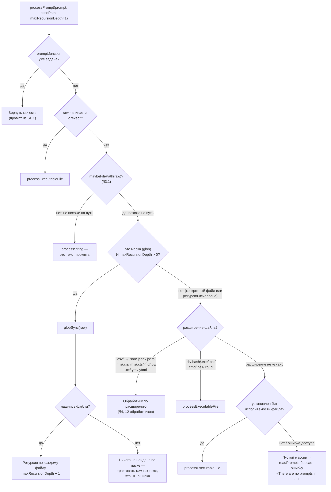
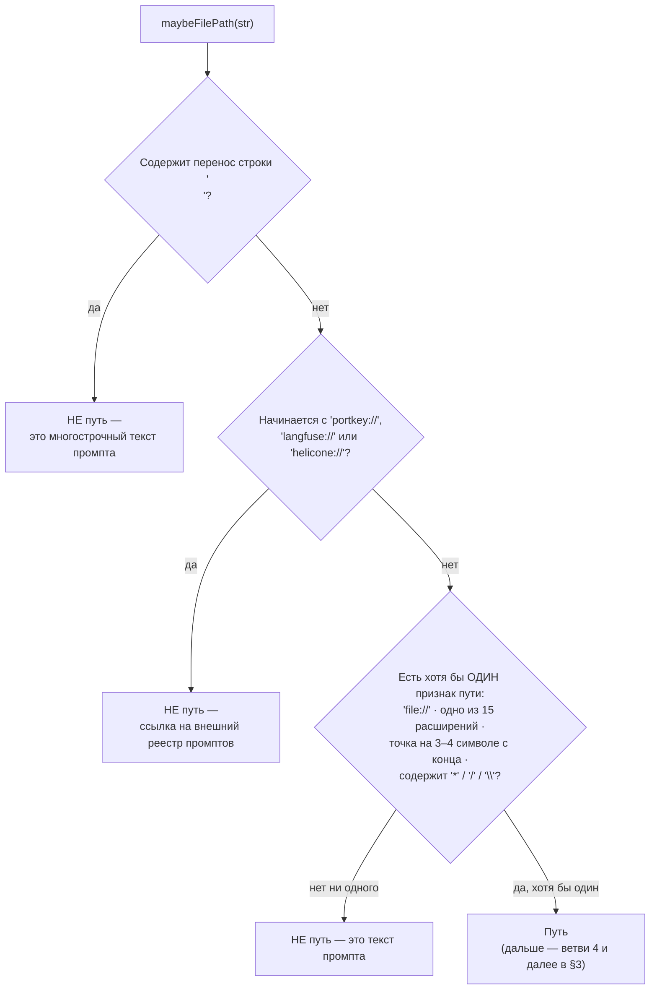
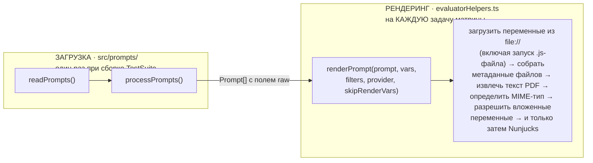
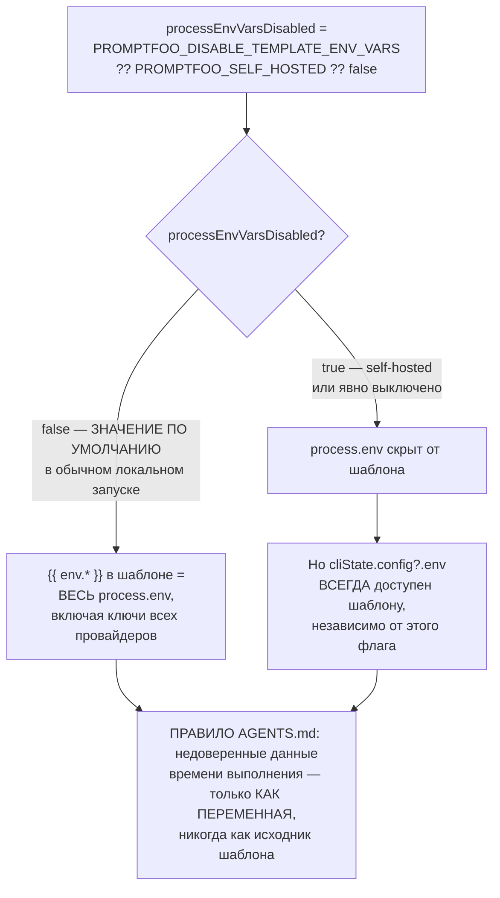

# Загрузка и обработка промптов — `src/prompts`

> Разбор через призму **Domain-Driven Design**. Диаграммы — ANSI-псевдографика.
> Дополняет [ARCHITECTURE.md](./ARCHITECTURE.md), [EVALUATOR.md](./EVALUATOR.md),
> [MATCHERS.md](./MATCHERS.md), [ASSERTIONS.md](./ASSERTIONS.md),
> [PROVIDERS.md](./PROVIDERS.md), [REDTEAM.md](./REDTEAM.md),
> [SERVER.md](./SERVER.md), [APP.md](./APP.md).

---

## 0. Паспорт подсистемы

```
╔══════════════════════════════════════════════════════════════════════════════╗
║  PROMPT CONTEXT — превращение ссылки в промпт                                ║
╠══════════════════════════════════════════════════════════════════════════════╣
║  Слой в layers.json     core (ярус 6), вместе с assertions · matchers ·      ║
║                         scheduler · testCase                                 ║
║  Объём                  15 файлов · 1 254 строки  ← самая компактная         ║
║                                                     подсистема ядра          ║
╠══════════════════════════════════════════════════════════════════════════════╣
║  index.ts                328   загрузчик и диспетчер по расширению           ║
║  grading.ts              222   девять шаблонов судейства                     ║
║  processors/             538   двенадцать обработчиков форматов              ║
║  utils.ts                100   эвристика «это путь или текст?»               ║
║  constants.ts             19   разделитель и список расширений               ║
╠══════════════════════════════════════════════════════════════════════════════╣
║  Поддерживаемых расширений        15                                         ║
║  Обработчиков форматов            12                                         ║
║  Шаблонов судейства по умолчанию   9                                         ║
║  Тесты                  17 файлов · 2 975 строк  (в 2,4 раза больше кода)    ║
╠══════════════════════════════════════════════════════════════════════════════╣
║  ⚠  РЕНДЕРИНГ ЗДЕСЬ НЕ ЖИВЁТ. Подстановка переменных происходит в            ║
║     evaluatorHelpers.renderPrompt (888 строк) — см. §7                       ║
╚══════════════════════════════════════════════════════════════════════════════╝
```

**Формулировка предметной области в одном предложении.** Подсистема отвечает на
один вопрос: «пользователь написал строку — это текст промпта, путь к файлу,
маска, или программа, которую надо запустить?» — и превращает ответ в массив
объектов `Prompt`, каждый со своей меткой и конфигурацией.

**Важное разграничение.** `src/prompts` **загружает** промпты. Рендерингом
(подстановкой переменных Nunjucks) занимается `evaluatorHelpers.renderPrompt`.
Разделение неочевидное и в документации репозитория нигде не проговорено — но
принципиальное: загрузка происходит один раз при сборке `TestSuite`, а рендеринг
— на каждую задачу матрицы.

---

## 1. Единый язык подсистемы

| Термин | Носитель в коде | Смысл |
|---|---|---|
| **Prompt** | `types/prompts.ts` | `{ raw, label, id?, config?, function? }` — единица столбца таблицы. |
| **raw** | поле `Prompt` | Текст шаблона. Для функциональных промптов — строковое представление функции. |
| **label** | поле `Prompt` | Человекочитаемое имя колонки. Формируется по-разному в каждом обработчике. |
| **function** | поле `Prompt` | Промпт, вычисляемый кодом на каждый вызов, а не строкой. |
| **processPrompt** | `index.ts:107` | Диспетчер: одна ссылка → массив промптов. |
| **maybeFilePath** | `utils.ts:6` | Эвристика: строка похожа на путь? |
| **normalizeInput** | `utils.ts` | Три формы записи промптов в конфиге → единый массив. |
| **PROMPT_DELIMITER** | `constants.ts` | `---` по умолчанию. Разделяет промпты внутри `.txt`. |
| **providerPromptMap** | `index.ts:41` | Какие промпты применимы к какому провайдеру. |
| **PromptFunctionContext** | `types/prompts.ts` | Что видит функциональный промпт: `vars`, `provider`, `config`. |
| **Grading prompt** | `grading.ts` | Шаблон судейства. Массив chat-сообщений в виде JSON-строки. |

---

## 2. Место подсистемы в архитектуре

```
   Подсистема — часть слоя core. Собственных исходящих зависимостей мало:
   fs, util, types, envars, logger. Ни одного импорта из redteam, node
   или providers — в отличие от соседей по слою.

   КТО ЕЁ ПОТРЕБЛЯЕТ:

     util/config/load.ts   readPrompts · readProviderPromptMap   ← загрузка конфига
     evaluate.ts           processPrompts · readProviderPromptMap ← сборка TestSuite
     matchers/llmGrading   DEFAULT_GRADING_PROMPT · GEVAL_* · …   ← шаблоны судей
     matchers/rag          ANSWER_RELEVANCY_GENERATE · CONTEXT_*  ← через external
     suggestions.ts        SUGGEST_PROMPTS_SYSTEM_MESSAGE
     optimizer/            OPTIMIZE_PROMPT_SYSTEM_MESSAGE
     types/index.ts        export * from './prompts'              ← реэкспорт типов

   ┌──────────────────────────────────────────────────────────────────────┐
   │  НАБЛЮДЕНИЕ: ДВЕ РОЛИ В ОДНОМ МОДУЛЕ                                 │
   │                                                                      │
   │  index.ts делает две несвязанные вещи:                               │
   │    • загружает ПОЛЬЗОВАТЕЛЬСКИЕ промпты из файлов и строк            │
   │    • реэкспортирует ВНУТРЕННИЕ шаблоны судейства из grading.ts       │
   │      и объявляет ещё два прямо в себе (GEVAL_PROMPT_STEPS,           │
   │      GEVAL_PROMPT_EVALUATE)                                          │
   │                                                                      │
   │  Первое — инфраструктура ввода. Второе — доменное знание о том,      │
   │  как формулировать вопрос модели-судье. Общего у них только слово    │
   │  «промпт».                                                           │
   │                                                                      │
   │  Отдельная странность: восемь шаблонов лежат в grading.ts, а два     │
   │  геваловских — в index.ts, рядом с загрузчиком файлов.               │
   └──────────────────────────────────────────────────────────────────────┘
```

---

## 3. Диспетчеризация: девять ветвей `processPrompt`

```
 processPrompt(prompt, basePath, maxRecursionDepth = 1)
        │
        ▼
 ┌─────────────────────────────────────────────────────────────────────────────┐
 │ ВЕТВЬ 1 · prompt.function уже задана                                        │
 │            → вернуть как есть. Промпт из SDK, объект уже готов.             │
 ├─────────────────────────────────────────────────────────────────────────────┤
 │ ВЕТВЬ 2 · raw начинается с 'exec:'                                          │
 │            → processExecutableFile — запуск произвольной программы          │
 ├─────────────────────────────────────────────────────────────────────────────┤
 │ ВЕТВЬ 3 · !maybeFilePath(raw)                                               │
 │            → processString — это просто текст промпта                       │
 ├─────────────────────────────────────────────────────────────────────────────┤
 │ ВЕТВЬ 4 · isPathPattern И maxRecursionDepth > 0                             │
 │            → globSync, затем РЕКУРСИЯ по каждому найденному файлу           │
 │              с maxRecursionDepth - 1                                        │
 │                                                                             │
 │              Глубина рекурсии ровно 1: маска раскрывается один раз,         │
 │              и найденные пути обрабатываются уже как конкретные файлы.      │
 │              Маска внутри маски невозможна.                                 │
 │                                                                             │
 │              Если по маске ничего не нашлось — строка трактуется как        │
 │              текст промпта, а не как ошибка. Комментарий поясняет:          │
 │              «по этому пути ничего нет, используем сырую строку».           │
 ├─────────────────────────────────────────────────────────────────────────────┤
 │ ВЕТВИ 5–8 · по расширению                                                   │
 │                                                                             │
 │    .csv    → processCsvPrompts     одна строка = один промпт                │
 │    .j2     → processJinjaFile      весь файл = один промпт                  │
 │    .json   → processJsonFile       + разрешение вложенных file://           │
 │    .jsonl  → processJsonlFile      одна строка JSON = один промпт           │
 │    .js/.ts/.mjs/.cjs/.mts/.cts                                              │
 │            → processJsFile         ФУНКЦИОНАЛЬНЫЙ промпт                    │
 │    .md     → processMarkdownFile   весь файл = один промпт                  │
 │    .py     → processPythonFile     ФУНКЦИОНАЛЬНЫЙ промпт                    │
 │    .txt    → processTxtFile        разбиение по PROMPT_DELIMITER            │
 │    .yml    → processYamlFile       + разрешение вложенных file://           │
 │    .yaml                                                                    │
 ├─────────────────────────────────────────────────────────────────────────────┤
 │ ВЕТВЬ 9 · известные исполняемые расширения                                  │
 │    .sh · .bash · .exe · .bat · .cmd · .ps1 · .rb · .pl                      │
 │            → processExecutableFile                                          │
 ├─────────────────────────────────────────────────────────────────────────────┤
 │ ВЕТВЬ 10 · ЗАПАСНАЯ — БИТ ИСПОЛНЯЕМОСТИ                                     │
 │                                                                             │
 │    const stats = await stat(filePath)                                       │
 │    if (stats.isFile() && (stats.mode & 0o111) !== 0)                        │
 │        → processExecutableFile                                              │
 │                                                                             │
 │    ┌───────────────────────────────────────────────────────────────┐        │
 │    │  Файл без узнаваемого расширения, но с установленным битом    │        │
 │    │  исполняемости, ЗАПУСКАЕТСЯ как генератор промптов.           │        │
 │    │                                                                │       │
 │    │  Это удобно (скрипт с shebang и без расширения — обычное дело │        │
 │    │  в Unix) и одновременно неявно: поведение зависит от прав      │       │
 │    │  доступа файла, а не от того, что написано в конфиге.          │       │
 │    │  Ошибка доступа к файлу молча проглатывается (catch {}).       │       │
 │    └───────────────────────────────────────────────────────────────┘        │
 ├─────────────────────────────────────────────────────────────────────────────┤
 │ ВЕТВЬ 11 · ничего не подошло → пустой массив                                │
 │            readPrompts превратит это в ошибку:                              │
 │            «There are no prompts in …»                                      │
 └─────────────────────────────────────────────────────────────────────────────┘
```

Тот же диспетчер как Mermaid-диаграмма:



**Своими словами.** Представь регистратуру, куда приносят одну-единственную
строку и просят определить, что это такое — уже готовый рецепт, короткая
команда, текст под диктовку или адрес, по которому нужно сходить за текстом.
Сначала спрашивают: это не строка вообще, а уже готовая функция, переданная
напрямую из кода? Тогда разговор окончен, берём как есть. Если строка
начинается со специального слова «exec:» — сразу ясно, что это команда
на запуск программы. Если ничто не намекает на то, что это адрес (нет ни
слэшей, ни точек, ни известных окончаний файлов) — значит, это просто
текст под диктовку, и его записывают дословно. Если похоже на адрес —
проверяют, не адрес ли это с звёздочкой, то есть не описание ли сразу
нескольких мест («все дома на этой улице»). Если да — сотрудник идёт
по всем найденным адресам и на каждом повторяет тот же самый вопрос
заново, но так же адрес с звёздочкой внутри уже не рассматривает —
на один обход маски даётся только одна попытка вложенности. А если по
такому групповому адресу ничего не нашлось — это не считается ошибкой:
строку просто по-честному записывают как текст под диктовку, раз уж
адреса не существует. Если адрес одиночный — смотрят на его «фамилию»
(расширение файла) и решают, каким именно обработчиком его вскрывать
или сразу запускать как программу. А если у адреса вообще нет фамилии —
последняя проверка: пощупать, не помечен ли он как исполняемый, и
только когда и это не помогло, сотрудник разводит руками — здесь
ничего нет.

### 3.1. Эвристика «путь или текст»

```
   maybeFilePath(str) — utils.ts:6

   ┌───────────────────────────────────────────────────────────────────────┐
   │  СНАЧАЛА ЗАПРЕТЫ — что ТОЧНО не путь:                                 │
   │                                                                       │
   │    '\n'            многострочный текст — это промпт, а не путь        │
   │    'portkey://'    ┐                                                  │
   │    'langfuse://'   ├ ссылки на внешние реестры промптов;              │
   │    'helicone://'   ┘ выглядят как схема URI, обрабатываются           │
   │                      интеграциями, а не файловым загрузчиком          │
   ├───────────────────────────────────────────────────────────────────────┤
   │  ЗАТЕМ ПРИЗНАКИ ПУТИ — достаточно любого:                             │
   │                                                                       │
   │    startsWith('file://')                                              │
   │    одно из 15 расширений в последнем или предпоследнем токене,        │
   │      разделённом двоеточием    ← учитывает форму file.js:functionName │
   │    третий или четвёртый символ с конца — точка                        │
   │    содержит '*'  ·  содержит '/'  ·  содержит '\'                     │
   ├───────────────────────────────────────────────────────────────────────┤
   │  ⚠  ДВЕ ПОСЛЕДНИЕ ГРУППЫ ОЧЕНЬ ШИРОКИЕ                                │
   │                                                                       │
   │    «Это не так.»              → четвёртый символ с конца — точка?     │
   │                                  нет, но подобные строки возможны     │
   │    «Скажи да/нет»             → содержит '/' → считается путём        │
   │    «Оцени 3.14»               → третий с конца — точка? нет           │
   │                                                                       │
   │  Строка «Ответь да/нет» будет принята за путь, не найдена, и —        │
   │  благодаря ветви 4 — молча вернётся как текст промпта. То есть        │
   │  ложное срабатывание эвристики не ломает поведение, но приводит       │
   │  к лишнему обращению к файловой системе и к записи в отладочный лог.  │
   └───────────────────────────────────────────────────────────────────────┘
```

Та же эвристика как Mermaid-диаграмма:



**Своими словами.** Это работа почтальона, которому дали строку и просят
рассортировать: письмо это или адрес доставки? Сначала почтальон отсеивает
то, что заведомо не адрес: если текст на несколько строк — это явно письмо,
а не адрес, адреса в одну строку не пишут. Если строка начинается с одной
из трёх узнаваемых пометок пересылки в другую почтовую службу — тоже не
адрес для этого почтальона, этим занимается другая контора. Всё, что
осталось после отсева, проверяется на признаки адреса — и здесь достаточно
хотя бы ОДНОГО совпадения: похоже на пометку «файл по адресу», оканчивается
на что-то похожее на индекс дома, есть точка почти в конце строки, есть
косая черта или звёздочка. Проблема этого второго теста в том, что он
очень жадный: строка «Скажи да/нет» проходит его только из-за одного
слэша, хотя никакой это не адрес. Но почтальон здесь подстрахован
дальше по цепочке (§3, ветвь 4): если он понесёт «письмо» по несуществующему
адресу и там никого не найдёт, он не выбросит его и не поднимет тревогу —
он просто вернётся и доставит его как обычное письмо. Ошибка сортировки
стоит лишнего похода, но не стоит потерянной почты.

### 3.2. Три формы записи в конфиге

```
   normalizeInput принимает три разных синтаксиса:

     СТРОКА          prompts: 'file://prompt.txt'
                     → [{ raw: 'file://prompt.txt' }]

     МАССИВ          prompts:
                       - 'Переведи: {{text}}'
                       - { raw: 'file://a.txt', label: 'Вариант A' }
                     → элементы-строки оборачиваются, объекты сохраняются
                       с подстановкой raw ?? id

     ОБЪЕКТ          prompts:
                       'prompts.txt': 'foo1'
                       'prompts.py': 'foo2'
                     → { label: значение, raw: ключ }
                     ⚠ помечен в коде как УСТАРЕВШИЙ формат

   Пустой ввод, число, булево — явная ошибка с распечаткой полученного.
```

---

## 4. Двенадцать обработчиков и три их архетипа

```
 ┌─────────────────────────────────────────────────────────────────────────────┐
 │ АРХЕТИП A · ФАЙЛ = ОДИН ПРОМПТ                                              │
 ├─────────────────────────────────────────────────────────────────────────────┤
 │   markdown.ts   13 строк   весь файл как есть                               │
 │   jinja.ts      22         весь файл как есть; комментарий поясняет:        │
 │                            «подобно markdown, каждый .j2 — один промпт»     │
 │   json.ts       39         + РАЗРЕШЕНИЕ ВЛОЖЕННЫХ file://                   │
 │   yaml.ts       42         + то же, затем обратно в JSON-строку             │
 │                                                                             │
 │   json/yaml разбирают содержимое, рекурсивно раскрывают ссылки file://      │
 │   через maybeLoadConfigFromExternalFile и сериализуют обратно.              │
 │   Если разбор не удался — возвращается исходный текст, БЕЗ ошибки.          │
 │   Комментарий: «сохраняет обратную совместимость для не-JSON или            │
 │   некорректного JSON».                                                      │
 ├─────────────────────────────────────────────────────────────────────────────┤
 │ АРХЕТИП B · ФАЙЛ = НЕСКОЛЬКО ПРОМПТОВ                                       │
 ├─────────────────────────────────────────────────────────────────────────────┤
 │   text.ts       42   разбиение по строке-разделителю PROMPT_DELIMITER       │
 │                      (по умолчанию '---', настраивается через               │
 │                       PROMPTFOO_PROMPT_SEPARATOR)                           │
 │                      Пустые фрагменты отбрасываются; каждый обрезается.     │
 │                                                                             │
 │   jsonl.ts      24   одна строка JSON = один промпт                         │
 │                      Метка зависит от количества: при одной строке —        │
 │                      просто путь, при нескольких — путь плюс содержимое     │
 │                                                                             │
 │   csv.ts        76   ДВА РЕЖИМА:                                            │
 │                        разделителя нет в файле → строка = промпт,           │
 │                          заголовок 'prompt' распознаётся и пропускается     │
 │                        разделитель есть → полноценный разбор CSV            │
 │                          с колонками prompt и label                         │
 │                      PROMPTFOO_CSV_DELIMITER · PROMPTFOO_CSV_STRICT         │
 │                      relax_quotes включён, если не задан строгий режим      │
 ├─────────────────────────────────────────────────────────────────────────────┤
 │ АРХЕТИП C · ФАЙЛ = ПРОГРАММА                                                │
 ├─────────────────────────────────────────────────────────────────────────────┤
 │   javascript.ts  45  importModule → функция вызывается на КАЖДЫЙ промпт     │
 │                      raw = String(promptFunction) — исходник функции        │
 │                      попадает в поле raw как её текстовое представление     │
 │   python.ts     104  runPython(filePath, functionName, [context])           │
 │                      + УСТАРЕВШИЙ режим: запуск файла целиком через         │
 │                        PythonShell, PROMPTFOO_PYTHON задаёт интерпретатор   │
 │   executable.ts 155  execFile произвольной программы, см. §5                │
 │                                                                             │
 │   Все три получают PromptFunctionContext:                                   │
 │     { vars, provider: { id, label }, config }                               │
 │   Обратите внимание: провайдер передаётся НЕ целиком, а как пара            │
 │   id + label. Скрипт не получает доступ к живому объекту провайдера         │
 │   и не может через него дотянуться до ключей.                               │
 └─────────────────────────────────────────────────────────────────────────────┘
```

---

## 5. Исполняемые промпты: `executable.ts`

Самый интересный из обработчиков — 155 строк, в которых собраны четыре решения,
каждое со своей причиной.

```
 ┌─────────────────────────────────────────────────────────────────────────────┐
 │  1 · КЛЮЧ КЭША ВКЛЮЧАЕТ ХЭШИ ФАЙЛОВ                                         │
 ├─────────────────────────────────────────────────────────────────────────────┤
 │     const fileHashes = getFileHashes(scriptParts)                           │
 │     const cacheKey =                                                        │
 │       `exec-prompt:${scriptPath}:${fileHashes.join(':')}:${context}`        │
 │                                                                             │
 │     Правка скрипта автоматически инвалидирует кэш. Без хэшей                │
 │     разработчик правил бы генератор промптов и получал старый вывод,        │
 │     не понимая почему.                                                      │
 │                                                                             │
 │     Кэш включается только если хэши посчитались (fileHashes.length > 0)     │
 │     И кэширование не отключено.                                             │
 ├─────────────────────────────────────────────────────────────────────────────┤
 │  2 · execFile, А НЕ exec                                                    │
 ├─────────────────────────────────────────────────────────────────────────────┤
 │     Аргументы передаются массивом, оболочка не участвует.                   │
 │     Контекст уходит ОДНИМ аргументом в виде JSON:                           │
 │       scriptArgs = scriptParts.concat([safeJsonStringify(context)])         │
 │                                                                             │
 │     Значения переменных теста, которые могут содержать что угодно —         │
 │     включая содержимое атаки из редтима, — не попадают в командную          │
 │     строку оболочки.                                                        │
 ├─────────────────────────────────────────────────────────────────────────────┤
 │  3 · ТАЙМАУТ ПО УМОЛЧАНИЮ — 60 СЕКУНД                                       │
 │     timeout: context.config?.timeout || 60000                               │
 │     Зависший генератор промптов не подвешивает прогон навсегда.             │
 ├─────────────────────────────────────────────────────────────────────────────┤
 │  4 · ВЫЧИСТКА ANSI-ПОСЛЕДОВАТЕЛЬНОСТЕЙ                                      │
 │     ANSI_ESCAPE = /\x1b(?:[@-Z\\-_]|\[[0-?]*[ -/]*[@-~])/g                  │
 │                                                                             │
 │     Скрипт, писавший цветной вывод в терминал, не отравит промпт            │
 │     управляющими символами. Регулярка покрывает и однобуквенные             │
 │     escape-последовательности, и CSI-последовательности целиком.            │
 └─────────────────────────────────────────────────────────────────────────────┘
```

---

## 6. Шаблоны судейства: `grading.ts`

```
   Девять шаблонов, все — JSON.stringify массива chat-сообщений:

     DEFAULT_GRADING_PROMPT          llm-rubric
     DEFAULT_AGENT_GRADING_PROMPT    agent-rubric
     PROMPTFOO_FACTUALITY_PROMPT     factuality, пять категорий A–E
     OPENAI_CLOSED_QA_PROMPT         model-graded-closedqa
     SELECT_BEST_PROMPT              select-best
     DEFAULT_WEB_SEARCH_PROMPT       search-rubric
     TRAJECTORY_GOAL_SUCCESS_PROMPT  trajectory:goal-success
     SUGGEST_PROMPTS_SYSTEM_MESSAGE  генерация вариантов промпта
     OPTIMIZE_PROMPT_SYSTEM_MESSAGE  оптимизация промпта

   + в index.ts: GEVAL_PROMPT_STEPS и GEVAL_PROMPT_EVALUATE

 ┌─────────────────────────────────────────────────────────────────────────────┐
 │  ОБЩАЯ КОНСТРУКЦИЯ — на примере DEFAULT_GRADING_PROMPT                      │
 ├─────────────────────────────────────────────────────────────────────────────┤
 │                                                                             │
 │   [ { role: 'system',                                                       │
 │       content: правило + ФОРМАТ ВЫВОДА + ДВА ПРИМЕРА },                     │
 │     { role: 'user',                                                         │
 │       content: '<Output>\n{{ output }}\n</Output>\n'                        │
 │              + '<Rubric>\n{{ rubric }}\n</Rubric>' } ]                      │
 │                                                                             │
 │   Три приёма, применённые последовательно:                                  │
 │                                                                             │
 │   а) ФОРМАТ ЗАДАН ЯВНО                                                      │
 │      «{reason: string, pass: boolean, score: number}»                       │
 │                                                                             │
 │   б) ПРИМЕРЫ ВКЛЮЧАЮТ ОТРИЦАТЕЛЬНЫЙ СЛУЧАЙ                                  │
 │      Пример с провалом («говорит как пират» при рубрике «не говорит         │
 │      как пират») показывает модели, что отвечать false — нормально.         │
 │      Без него судьи склонны соглашаться.                                    │
 │                                                                             │
 │   в) РАЗДЕЛЕНИЕ РОЛЕЙ ТЕГАМИ                                                │
 │      <Output> и <Rubric> размечают, где оцениваемое, а где критерий.        │
 │      Тот же приём — обязательный стандарт для редтимовских граверов:        │
 │      <UserQuery>, <purpose>, <AllowedEntities> (см. REDTEAM.md §3).         │
 ├─────────────────────────────────────────────────────────────────────────────┤
 │  ДВУХФАЗНАЯ СХЕМА G-EVAL — единственная в наборе                            │
 │                                                                             │
 │    ФАЗА 1  GEVAL_PROMPT_STEPS                                               │
 │            «сгенерируй 3–4 кратких шага оценки по этим критериям»           │
 │            Ответ строго: {"steps": ["…", "…"]}                              │
 │            Требования перечислены отрицаниями: «без ограждений кода»,       │
 │            «без пояснений, комментариев и лишнего текста».                  │
 │                                                                             │
 │    ФАЗА 2  GEVAL_PROMPT_EVALUATE                                            │
 │            «оцени по этой метрике, применяя сгенерированные шаги»           │
 │                                                                             │
 │    Модель сама формулирует процедуру проверки, затем сама её применяет.     │
 │    Это делает критерий воспроизводимым в пределах одного прогона,           │
 │    но не между прогонами.                                                   │
 └─────────────────────────────────────────────────────────────────────────────┘
```

---

## 7. Где на самом деле происходит рендеринг

```
   ЗАГРУЗКА                                РЕНДЕРИНГ
   src/prompts/                            src/evaluatorHelpers.ts
   один раз при сборке TestSuite           на каждую задачу матрицы
        │                                          │
        ▼                                          ▼
   readPrompts()                            renderPrompt(prompt, vars,
   processPrompts()                                      filters, provider,
        │                                                 skipRenderVars)
        │  Prompt[] с полем raw                    │
        └──────────────────────────────────────────┘

 ┌─────────────────────────────────────────────────────────────────────────────┐
 │  renderPrompt делает то, чего нет в src/prompts:                            │
 │                                                                             │
 │    • загружает переменные из file:// — включая ЗАПУСК .js-файла,            │
 │      которому передаются varName, basePrompt, vars, provider                │
 │    • собирает метаданные файлов (collectFileMetadata)                       │
 │    • извлекает текст из PDF (extractTextFromPDF)                            │
 │    • определяет MIME-тип по расширению и по сигнатуре base64                │
 │    • разрешает вложенные переменные (resolveVariables)                      │
 │    • и только затем вызывает Nunjucks                                       │
 │                                                                             │
 │  skipRenderVars — список переменных, которые НЕ подставляются:              │
 │  так редтимовская полезная нагрузка остаётся дословной.                     │
 └─────────────────────────────────────────────────────────────────────────────┘
```

Тот же разрыв «загрузка / рендеринг» как Mermaid-диаграмма:



**Своими словами.** Это разница между походом за продуктами и готовкой
конкретного блюда на заказ. Загрузка (`readPrompts`, `processPrompts`) —
это один-единственный визит в магазин перед началом смены: приносишь
рецепты домой, раскладываешь их по полкам, и это происходит один раз за
весь вечер, сколько бы заказов потом ни пришло. Рендеринг (`renderPrompt`)
— это уже готовка САМОГО блюда, и её повторяют заново на каждый отдельный
заказ (на каждую задачу матрицы: своя комбинация промпта, переменных и
провайдера). Причём в момент готовки повар делает вещи, которых не было
и не могло быть на этапе похода за продуктами: подглядывает в отдельный
файл с уточнениями к заказу (переменные из `file://`, вплоть до запуска
скрипта), проверяет происхождение и вид каждого ингредиента (метаданные
файлов, определение MIME-типа), достаёт начинку из закрытой упаковки
(извлечение текста из PDF) — и только когда всё разложено по тарелке,
наконец подставляет соусы по рецепту (Nunjucks). Часть ингредиентов
повар намеренно не трогает и подаёт как есть, прямо в упаковке
(`skipRenderVars`) — чтобы содержимое, которое должно остаться
нетронутым (редтимовская полезная нагрузка), не смешалось с остальным
блюдом.

---

## 8. Безопасность шаблонов: главный риск подсистемы

`AGENTS.md` подсистемы открывается не описанием форматов, а разделом
**Template Security**. Это единственный `AGENTS.md` в репозитории, где
безопасность вынесена на первое место.

```
 ┌─────────────────────────────────────────────────────────────────────────────┐
 │  ПОЧЕМУ ЭТО ОПАСНО — устройство движка Nunjucks                             │
 │  util/templates.ts:430  getNunjucksEngine(…, isGrader)                      │
 ├─────────────────────────────────────────────────────────────────────────────┤
 │                                                                             │
 │    autoescape: false            ← экранирование ВЫКЛЮЧЕНО                   │
 │                                                                             │
 │    env.addGlobal('env', {                                                   │
 │      ...(processEnvVarsDisabled ? {} : process.env),   ← ВСЁ ОКРУЖЕНИЕ      │
 │      ...cliState.config?.env,                                               │
 │    })                                                                       │
 │                                                                             │
 │    processEnvVarsDisabled = PROMPTFOO_DISABLE_TEMPLATE_ENV_VARS             │
 │                             ?? PROMPTFOO_SELF_HOSTED ?? false               │
 │                                                                             │
 │    То есть по умолчанию, в обычном локальном запуске, ЛЮБОЙ шаблон          │
 │    может прочитать {{ env.OPENAI_API_KEY }}. В режиме self-hosted           │
 │    доступ к process.env выключается по умолчанию — но переменные            │
 │    из конфига остаются доступны всегда.                                     │
 ├─────────────────────────────────────────────────────────────────────────────┤
 │  ПРАВИЛО, СФОРМУЛИРОВАННОЕ В AGENTS.md                                      │
 │                                                                             │
 │    «НИКОГДА не рендерите недоверенные данные времени выполнения как         │
 │     шаблон. Вывод модели, провайдера и гравера, удалённое содержимое,       │
 │     пользовательские и тестовые данные, содержимое сообщений                │
 │     _conversation — должны передаваться КАК ПЕРЕМЕННЫЕ или оставаться       │
 │     литералами, но никогда не конкатенироваться в исходник шаблона.»        │
 │                                                                             │
 │    «Аргумент-исходник шаблона у функций рендеринга — только доверенный      │
 │     ввод: конфиг, файлы промптов, текст рубрики.»                           │
 ├─────────────────────────────────────────────────────────────────────────────┤
 │  ТРЕБОВАНИЕ К ИСПРАВЛЕНИЯМ — регрессионный тест с полезной нагрузкой        │
 │                                                                             │
 │    «При починке границы шаблона добавьте регрессионный тест с               │
 │     нагрузками вида {{env.OPENAI_API_KEY}}, тегами управления потоком       │
 │     и строками, похожими на constructor/RCE, ДОКАЗЫВАЮЩИЙ, что они          │
 │     остаются литералами, когда приходят как данные времени выполнения.»     │
 │                                                                             │
 │    Обратите внимание на состав нагрузок: утечка переменной окружения,       │
 │    выполнение управляющих конструкций и попытка добраться до                │
 │    конструктора объекта — три классических вектора SSTI.                    │
 └─────────────────────────────────────────────────────────────────────────────┘

   ┌───────────────────────────────────────────────────────────────────────┐
   │  ПОЧЕМУ ЭТОТ РИСК ЗДЕСЬ ОСТРЕЕ, ЧЕМ ГДЕ-ЛИБО                          │
   │                                                                       │
   │  Promptfoo — инструмент, который НАМЕРЕННО подаёт на вход враждебные  │
   │  строки: 155 редтимовских плагинов генерируют полезные нагрузки,      │
   │  35 стратегий их преобразуют, а многоходовые агенты подставляют       │
   │  в диалог ответы самой мишени.                                        │
   │                                                                       │
   │  Если хоть один из этих текстов попадёт в позицию ИСХОДНИКА шаблона,  │
   │  а не значения переменной, атака на тестируемую систему превратится   │
   │  в атаку на сам инструмент — с доступом к ключам всех провайдеров,    │
   │  лежащим в process.env.                                               │
   │                                                                       │
   │  Отсюда и skipRenderVars в renderPrompt, и правило «данные —          │
   │  переменными», и требование регрессионного теста на каждую правку     │
   │  границы.                                                             │
   └───────────────────────────────────────────────────────────────────────┘

   Флаг isGrader: при PROMPTFOO_DISABLE_TEMPLATING шаблонизация отключается
   для пользовательских промптов, но НЕ для рубрик судейства — иначе
   встроенные шаблоны с {{ output }} и {{ rubric }} перестали бы работать.
```

Решение о видимости окружения как Mermaid-диаграмма:



**Своими словами.** Представь дом, где по умолчанию ключ от всех комнат
лежит под ковриком у входа, и любой гость, зашедший внутрь, может его
найти, просто заглянув под коврик — потому что переключатель «спрятать
ключ» по умолчанию выключен и включается только в одном специальном
режиме проживания (self-hosted). В обычном локальном доме гость,
которому дали прочитать один шаблон ({{ env.OPENAI_API_KEY }}), получает
доступ ко всей связке ключей сразу. Даже если ключ под ковриком спрятать,
в доме всё равно остаётся отдельная шкатулка с частью документов, которая
открыта гостям всегда, вне зависимости от того, спрятан общий ключ или нет
(`cliState.config?.env` доступен в любом случае). Именно поэтому в этом
доме действует железное правило для хозяев: никогда не подпускай гостя,
личность которого не проверена (ответ модели, содержимое от провайдера,
данные атакующего в редтиме), к самой двери с замком (к исходнику
шаблона) — пусть гость передаёт вещи только через окошко (значение
переменной), а не крутит ключ в замке сам.

---

## 9. Диагноз

```
╔═══════════════════════════════════════════════════════════════════════════╗
║  СИЛЬНЫЕ СТОРОНЫ                                                          ║
╠═══════════════════════════════════════════════════════════════════════════╣
║  ✔ Один обработчик — один файл, от 13 до 155 строк. Добавить формат —     ║
║    добавить файл и одну ветвь в диспетчере.                               ║
║                                                                           ║
║  ✔ Единственная подсистема ядра без импортов из redteam, node и           ║
║    providers. Зависимости — fs, types, util, envars, logger.              ║
║                                                                           ║
║  ✔ Исполняемые промпты продуманы целиком: хэши файлов в ключе кэша,       ║
║    execFile вместо exec, таймаут 60 секунд, вычистка ANSI.                ║
║                                                                           ║
║  ✔ Скрипт получает провайдера как пару id + label, а не живой объект:     ║
║    через контекст промпта не дотянуться до ключей.                        ║
║                                                                           ║
║  ✔ Отсутствие файла по маске — не ошибка, а откат к трактовке строки      ║
║    как текста. Опечатка в пути не рушит прогон.                           ║
║                                                                           ║
║  ✔ json и yaml рекурсивно раскрывают вложенные file://, а при неудачном   ║
║    разборе возвращают исходный текст вместо исключения.                   ║
║                                                                           ║
║  ✔ Шаблоны судейства построены грамотно: явный формат вывода,             ║
║    отрицательный пример и разметка ролей тегами.                          ║
║                                                                           ║
║  ✔ AGENTS.md открывается разделом о безопасности шаблонов с конкретным    ║
║    требованием к регрессионным тестам и перечнем полезных нагрузок.       ║
║                                                                           ║
║  ✔ Тесты в 2,4 раза объёмнее кода: 2 975 строк, по файлу на обработчик.   ║
╠═══════════════════════════════════════════════════════════════════════════╣
║  СЛАБЫЕ МЕСТА                                                             ║
╠═══════════════════════════════════════════════════════════════════════════╣
║  ✘ Две несвязанные роли в одном модуле: загрузка пользовательских         ║
║    промптов и хранение внутренних шаблонов судейства. Причём восемь       ║
║    шаблонов в grading.ts, а два геваловских — в index.ts, рядом           ║
║    с файловым загрузчиком.                                                ║
║                                                                           ║
║  ✘ maybeFilePath — очень широкая эвристика. Наличие '/' или точки         ║
║    в третьем-четвёртом символе с конца делает строку «путём».             ║
║    Промпт «Ответь да/нет» уйдёт в файловую подсистему, не найдётся        ║
║    и вернётся текстом — то есть работает, но через обходной путь.         ║
║                                                                           ║
║  ✘ Запасная ветвь по биту исполняемости делает поведение зависимым        ║
║    от прав доступа файла, а не от конфига. Ошибка stat проглатывается     ║
║    пустым catch, диагностики нет.                                         ║
║                                                                           ║
║  ✘ Формирование метки не унифицировано: text.ts даёт                      ║
║    `${label}: ${filePath}: ${raw}`, markdown — `${filePath}: ${первые     ║
║    50 символов}...`, jsonl — три разных варианта в зависимости            ║
║    от количества строк. Единого правила нет.                              ║
║                                                                           ║
║  ✘ Рендеринг живёт в другом модуле (evaluatorHelpers, 888 строк),         ║
║    и это разделение нигде не задокументировано. Ищущий «где               ║
║    подставляются переменные» будет искать здесь.                          ║
║                                                                           ║
║  ✘ Три обработчика (js, python, executable) исполняют пользовательский    ║
║    код, но песочницы нет ни у одного. Для локального инструмента это      ║
║    приемлемо и соответствует модели доверия (SERVER.md §8), однако        ║
║    в коде подсистемы это нигде не оговорено.                              ║
║                                                                           ║
║  ✘ autoescape: false и process.env в глобалах шаблона — по умолчанию      ║
║    включены в обычном запуске. Защита держится исключительно на           ║
║    дисциплине вызывающих, а не на устройстве движка.                      ║
╚═══════════════════════════════════════════════════════════════════════════╝
```

### Оценка по осям

```
   Расширяемость            ████████████████████░  9/10   файл на формат
   Изоляция от прочих слоёв ████████████████████░  9/10   лучшая в ядре
   Безопасность исполнения  ████████████████░░░░░  7/10   execFile, таймаут, хэши
   Безопасность шаблонов    ████████████░░░░░░░░░  6/10   держится на дисциплине
   Единообразие             ██████████░░░░░░░░░░░  5/10   метки, эвристика
   Разделение обязанностей  ██████████░░░░░░░░░░░  5/10   загрузка + шаблоны судей
   Тестируемость            ██████████████████░░░  8/10
```

---

## 10. Рекомендации по эволюции

```
   1 · Разделить модуль надвое.
         src/prompts/            загрузка пользовательских промптов
         src/prompts/grading/    шаблоны судейства (включая GEVAL_*)
       Сейчас два геваловских шаблона живут в index.ts рядом с globSync —
       перенести их в grading.ts стоит в любом случае, независимо
       от более крупного разделения.

   2 · Сузить maybeFilePath.
       Признак «содержит слэш» и «точка в третьем символе с конца»
       дают ложные срабатывания на обычном тексте. Достаточно
       явных форм: file://, известное расширение, символ маски.
       Всё остальное — текст промпта. Пользователь, желающий указать
       путь без расширения, может написать file://.

   3 · Сделать запуск по биту исполняемости явным.
       Вместо неявной проверки stats.mode — требовать префикс exec:
       или расширение. Текущее поведение зависит от chmod, о чём
       конфиг умалчивает.

   4 · Унифицировать формирование метки: одна функция
       buildPromptLabel(filePath, content, label, index) вместо
       семи разных схем в семи обработчиках.

   5 · Задокументировать границу загрузка/рендеринг.
       Одного абзаца в prompts/AGENTS.md со ссылкой на
       evaluatorHelpers.renderPrompt достаточно, чтобы читатель
       не искал подстановку переменных не там.

   6 · Рассмотреть autoescape и ограничение глобалов.
       Полное отключение process.env в шаблонах (как уже сделано
       для self-hosted) убрало бы самый ценный приз при SSTI.
       Переменные из конфига при этом остаются доступны — а именно
       они и нужны большинству шаблонов.
```

---

## 11. Карта директории

```
src/prompts/
│
├── AGENTS.md                     29  ← открывается разделом Template Security
│
├── index.ts                     328  ЗАГРУЗЧИК И ДИСПЕТЧЕР
│     readPrompts · processPrompts        точки входа
│     processPrompt                       одиннадцать ветвей диспетчеризации
│     readProviderPromptMap               какие промпты какому провайдеру
│     GEVAL_PROMPT_STEPS                  ⚠ шаблоны судейства
│     GEVAL_PROMPT_EVALUATE                 рядом с файловым загрузчиком
│     export * from './grading'
│
├── grading.ts                   222  ВОСЕМЬ ШАБЛОНОВ СУДЕЙСТВА
│     DEFAULT_GRADING_PROMPT · DEFAULT_AGENT_GRADING_PROMPT
│     PROMPTFOO_FACTUALITY_PROMPT · OPENAI_CLOSED_QA_PROMPT
│     SELECT_BEST_PROMPT · DEFAULT_WEB_SEARCH_PROMPT
│     TRAJECTORY_GOAL_SUCCESS_PROMPT
│     SUGGEST_PROMPTS_SYSTEM_MESSAGE · OPTIMIZE_PROMPT_SYSTEM_MESSAGE
│
├── utils.ts                     100  maybeFilePath · normalizeInput · hashPrompt
├── constants.ts                  19  PROMPT_DELIMITER · VALID_FILE_EXTENSIONS (15)
│
└── processors/                  538  ДВЕНАДЦАТЬ ОБРАБОТЧИКОВ
    ├── executable.ts            155  execFile · хэши в ключе кэша ·
    │                                 таймаут 60 с · вычистка ANSI
    ├── python.ts                104  runPython + устаревший режим PythonShell
    ├── csv.ts                    76  два режима: с разделителем и без
    ├── javascript.ts             45  importModule → функциональный промпт
    ├── yaml.ts                   42  + рекурсивное разрешение file://
    ├── text.ts                   42  разбиение по PROMPT_DELIMITER
    ├── json.ts                   39  + рекурсивное разрешение file://
    ├── jsonl.ts                  24  строка JSON = промпт
    ├── string.ts                 23  литеральный текст
    ├── jinja.ts                  22  файл .j2 = один промпт
    └── markdown.ts               13  файл .md = один промпт

СМЕЖНОЕ
  src/evaluatorHelpers.ts        888  РЕНДЕРИНГ: renderPrompt · resolveVariables
                                      collectFileMetadata · extractTextFromPDF
  src/util/templates.ts               getNunjucksEngine · extractVariablesFromTemplate
  src/external/prompts/ragas.ts   73  заимствованные промпты RAGAS

test/prompts/             17 файлов · 2 975 строк
    index · utils · constants · wildcard
    processors/  csv · executable · javascript · jinja · json · jsonl
                 markdown · python · python.utils · string · text · yaml
```

---

## 12. Команды

```bash
npx vitest run test/prompts                      # весь набор
npx vitest run test/prompts/processors           # только обработчики форматов
```

Переменные, влияющие на загрузку промптов:

```bash
PROMPTFOO_PROMPT_SEPARATOR          разделитель в .txt (по умолчанию ---)
PROMPTFOO_CSV_DELIMITER             разделитель CSV (по умолчанию ,)
PROMPTFOO_CSV_STRICT                строгий разбор кавычек в CSV
PROMPTFOO_PYTHON                    путь к интерпретатору Python
PROMPTFOO_DISABLE_TEMPLATING        отключить Nunjucks (кроме рубрик судей)
PROMPTFOO_DISABLE_TEMPLATE_ENV_VARS запретить доступ к process.env из шаблонов
```

Числа из этого документа воспроизводятся так:

```bash
find src/prompts -name '*.ts' | xargs cat | wc -l          # 1254
ls -1 src/prompts/processors/*.ts | wc -l                  # 12
grep -cE "^export const [A-Z_]+" src/prompts/grading.ts    # шаблоны судейства
```

---

*Документ описывает `src/prompts` на коммите `2c140ef`, promptfoo 0.122.0.
Дата среза — 26 августа 2026.*
