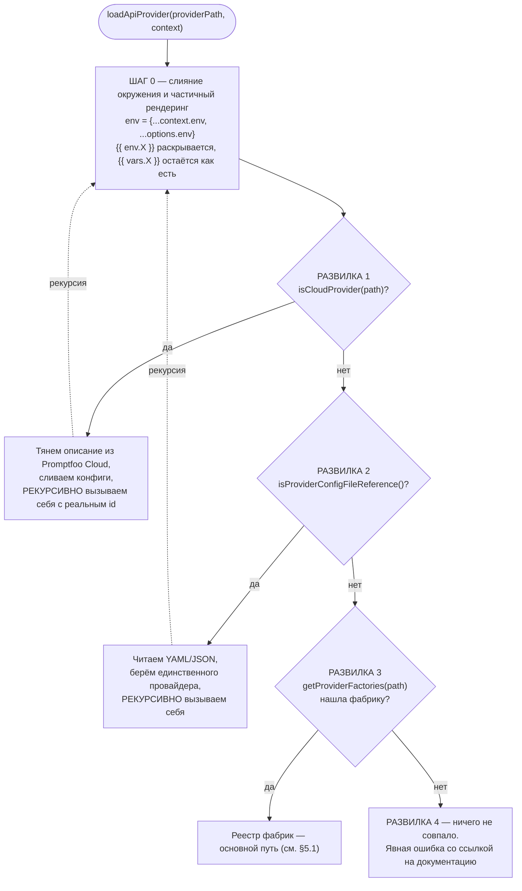
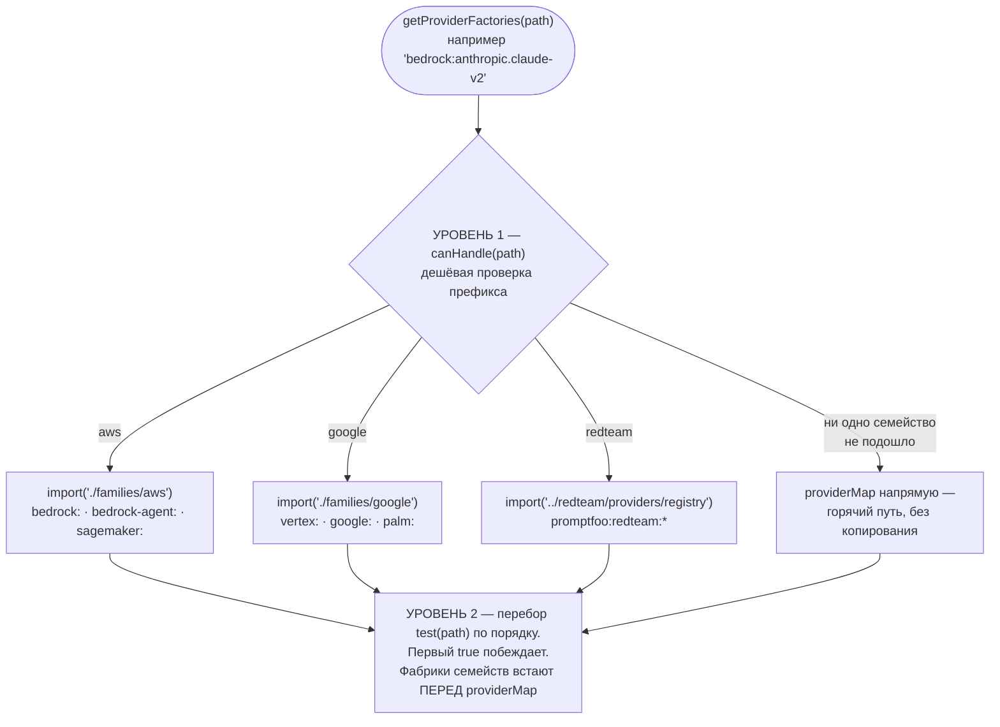
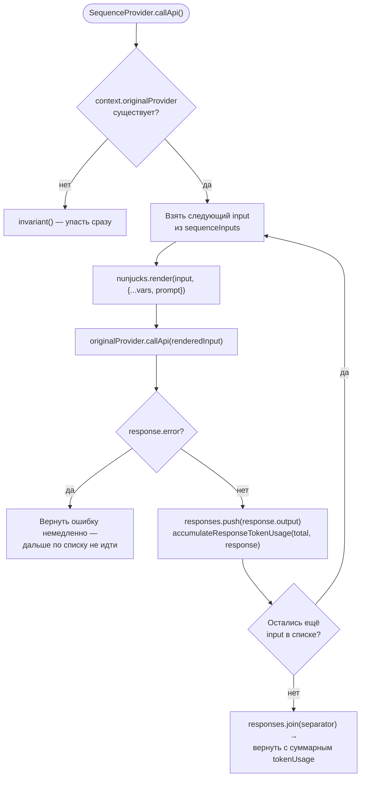
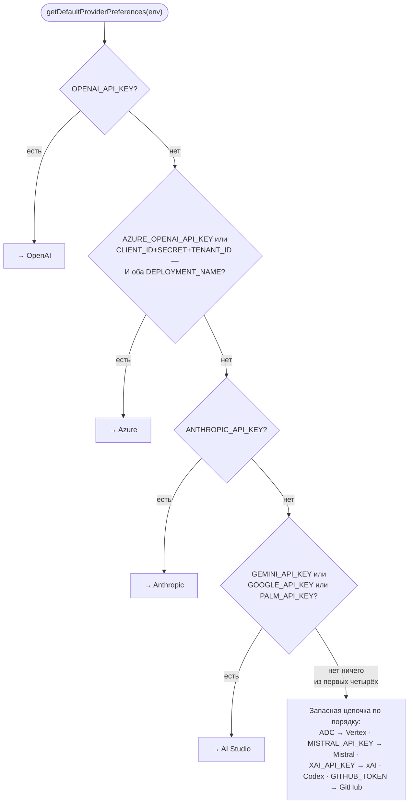

# Подсистема Providers — `src/providers`

> Разбор через призму **Domain-Driven Design**. Диаграммы — ANSI-псевдографика.
> Дополняет [ARCHITECTURE.md](./ARCHITECTURE.md) и [REDTEAM.md](./REDTEAM.md).

---

## 0. Паспорт подсистемы

```
╔══════════════════════════════════════════════════════════════════════════════╗
║  PROVIDER CONTEXT — антикоррупционный слой между доменом и внешним миром     ║
╠══════════════════════════════════════════════════════════════════════════════╣
║  Слой в layers.json     providers (ярус 4 из 11)                             ║
║  Объём                  244 файла · 98 696 строк  ←  КРУПНЕЙШИЙ МОДУЛЬ src/  ║
║  Доля от src/           15 % файлов, 22 % кода                               ║
║  Структура              87 файлов верхнего уровня + 20 подпапок              ║
╠══════════════════════════════════════════════════════════════════════════════╣
║  openai/      30 файлов · 22 485 строк      google/    13 · 10 468           ║
║  bedrock/     14 файлов ·  8 694 строки     azure/     16 ·  6 488           ║
║  elevenlabs/  27 файлов ·  4 672 строки     anthropic/  7 ·  3 201           ║
║  xai/          6 файлов ·  3 090 строк      openclaw/   9 ·  2 067           ║
║  mcp/          8 файлов ·  1 846 строк      a2a/        3 ·  1 325           ║
╠══════════════════════════════════════════════════════════════════════════════╣
║  Фабрик в providerMap            80                                          ║
║  Префиксов (startsWith)          82                                          ║
║  Точных идентификаторов          18                                          ║
║  Ленивых семейств                 3  (aws · google · redteam)                ║
║  Классов implements ApiProvider  67                                          ║
║  Классов extends *Provider       99                                          ║
║  Фабричных функций create*       43                                          ║
║  Наследников OpenAiChat…         32  ←  де-факто общий проводной протокол    ║
║  Переменных окружения           141  (ProviderEnvOverridesSchema)            ║
║  Моделей с прайсингом           305                                          ║
╚══════════════════════════════════════════════════════════════════════════════╝
```

**Формулировка предметной области в одном предложении.** Provider Context — это
переводчик. Домен знает ровно одно понятие внешнего мира — `ApiProvider` с методом
`callApi`. Всё остальное — сорок вендорских протоколов, четыре языка выполнения скриптов,
два агентных протокола, браузер и вебсокеты — живёт за этой границей и наружу не проходит.

---

## 1. Единый язык подсистемы

| Термин | Носитель в коде | Смысл |
|---|---|---|
| **ApiProvider** | `types/providers.ts:123` | Порт. Единственное, что домен знает о внешнем мире. |
| **ProviderResponse** | `contracts/providers.ts:38` | Целевой язык перевода. Всё, что вернул вендор, приводится к нему. |
| **ProviderFactory** | `registryTypes.ts` | Пара «предикат + конструктор». `test` — авторитетный диспетчер. |
| **ProviderFamily** | `registryTypes.ts` | Ленивая группа фабрик. `canHandle` — **ворота загрузки**, не диспетчер. |
| **providerPath** | сквозной параметр | Строка-идентификатор из конфига: `openai:gpt-5`, `http://…`, `python:x.py`. |
| **ProviderOptions** | `types/providers.ts:71` | Настройки экземпляра: `id`, `label`, `config`, `env`, `transform`, `delay`. |
| **CallApiContextParams** | `types/providers.ts:82` | Контекст одного вызова: переменные, промпт, трассировка, `originalProvider`. |
| **originalProvider** | `CallApiContextParams:86` | Ссылка на обёрнутого провайдера. Основа паттерна «декоратор». |
| **Target** | `providers` в конфиге | Тот же провайдер в лексике red-team. |
| **DefaultProviders** | `types/providers.ts:206` | Служебный набор: судейство, эмбеддинги, модерация, синтез, веб-поиск. |
| **EnvOverrides** | `contracts/env.ts` | 141 переменная окружения как типизированная схема, а не как `process.env`. |
| **TokenUsage** | `contracts/` | Единица учёта: prompt · completion · cached · total. |
| **transformTools** | `shared.ts:469` | Перевод описаний инструментов между форматами вендоров. |
| **cleanup / shutdown** | `providerRegistry.ts` | Освобождение долгоживущих ресурсов: воркеров, браузеров, пулов. |

---

## 2. Место подсистемы в архитектуре

Данные из `architecture/edge-baseline.json`:

```
                  ВХОДЯЩИЕ 93                    ИСХОДЯЩИЕ 908
                  (кто импортирует providers)     (от кого зависит providers)

   redteam    ── 38──►┐                     ┌──325──►  legacy-runtime
   core       ── 22──►│                     │──301──►  node
   legacy-    ── 14──►│   ┌─────────────┐   │──277──►  legacy-contracts
    runtime           ├──►│  providers  │───┤──  4──►  redteam   ◄── обратное
   node       ──  7──►│   │  (ярус 4)   │   │──  1──►  core      ◄── обратное
   app        ──  6──►│   └─────────────┘   └
   cli        ──  3──►│
   view-server──  3──►┘

   ┌──────────────────────────────────────────────────────────────────────┐
   │  ЧТО ЭТО ЗНАЧИТ                                                      │
   │                                                                      │
   │  • Соотношение 93 / 908 — самое несимметричное в системе.            │
   │    Слой почти ничего не отдаёт вверх и тянет почти всё снизу.        │
   │    Это ожидаемо для адаптерного слоя, но 908 импортов — много.       │
   │                                                                      │
   │  • app → providers всего 6 импортов, и белый список разрешает        │
   │    браузеру ровно три файла:                                         │
   │        src/providers/constants.ts                                    │
   │        src/providers/http.ts        ← ради конфигурирования мишени   │
   │        src/validators/providers.ts                                   │
   │    Для сравнения: app → redteam — 115 импортов и 9 файлов.           │
   │    Провайдеры изолированы от браузера намного лучше.                 │
   │                                                                      │
   │  • providers → redteam (4 импорта) — обратное ребро. Все четыре      │
   │    известны поимённо (см. §5.4), и три из них безопасны.             │
   └──────────────────────────────────────────────────────────────────────┘
```

---

## 3. Порт: `ApiProvider`

```
   ┌────────────────────────────────────────────────────────────────────┐
   │  interface ApiProvider extends MinimalApiProvider                  │
   │  src/types/providers.ts:123                                        │
   ├────────────────────────────────────────────────────────────────────┤
   │                                                                    │
   │   id(): string                     ◄── ИДЕНТИЧНОСТЬ                │
   │   callApi(prompt, context, opts)   ◄── ЕДИНСТВЕННЫЙ ОБЯЗАТЕЛЬНЫЙ   │
   │     → Promise<ProviderResponse>        МЕТОД. Всё остальное — опция│
   │                                                                    │
   │   ─── опциональные возможности ───────────────────────────────     │
   │   callEmbeddingApi?(input)                                         │
   │   callClassificationApi?(prompt)                                   │
   │   callModerationApi?(prompt, response)                             │
   │   getSessionId?()                                                  │
   │                                                                    │
   │   ─── настройки экземпляра ───────────────────────────────────     │
   │   config?  ·  label?  ·  delay?  ·  transform?  ·  inputs?         │
   │   toJSON?()                                                        │
   │                                                                    │
   │   ─── жизненный цикл ─────────────────────────────────────────     │
   │   cleanup?(): void | Promise<void>                                 │
   │     «освобождение долгоживущих ресурсов: воркеров, браузерных      │
   │      сессий, пулов соединений при завершении прогона.              │
   │      Отмена отдельного запроса делается через abortSignal.»        │
   └────────────────────────────────────────────────────────────────────┘

   СЕГРЕГАЦИЯ ИНТЕРФЕЙСОВ — четыре роли-расширения:

     ApiEmbeddingProvider       callEmbeddingApi обязателен
     ApiSimilarityProvider      callSimilarityApi обязателен
     ApiClassificationProvider  callClassificationApi обязателен
     ApiModerationProvider      callModerationApi обязателен

   Доменный код, которому нужны эмбеддинги, требует ApiEmbeddingProvider —
   и получает гарантию на уровне типов, а не проверку в рантайме.
```

### 3.1. Распределение классов по модальностям

```
   Completion      29  ██████████████████████████████
   Embedding       21  ██████████████████████
   Image           11  ███████████
   Chat             9  █████████
   Video            6  ██████
   Agent            5  █████
   Moderation       3  ███
   Assistant        2  ██
   Realtime         2  ██
   Transcription    1  █

   Итого 67 классов реализуют ApiProvider напрямую,
   ещё 99 — наследуются от существующих провайдеров.
```

---

## 4. Целевой язык перевода: `ProviderResponse`

Ключевой архитектурный факт: **контракт ответа живёт не в `providers`, а в
`src/contracts/providers.ts` — самом чистом, листовом слое системы**, которому
разрешён только `zod`. Это значит, что язык, на который переводит ACL, не зависит
от самого ACL и может быть прочитан браузером, ядром и любым будущим пакетом.

```
   ┌─────────────────────────────────────────────────────────────────────┐
   │  ProviderResponse — что домен получает вместо вендорского JSON      │
   ├─────────────────────────────────────────────────────────────────────┤
   │                                                                     │
   │  РЕЗУЛЬТАТ           output? · raw? · prompt? · format? · isBase64? │
   │                      providerTransformedOutput?                     │
   │                                                                     │
   │  УЧЁТ                tokenUsage? · cost? · latencyMs? · cached?     │
   │                                                                     │
   │  ОШИБКИ И ОТКАЗЫ     error? · isRefusal? · finishReason?            │
   │                      guardrails?                                    │
   │                                                                     │
   │  ДИАЛОГ              sessionId?                                     │
   │                      conversationEnded?                             │
   │                      conversationEndReason?  например thread_closed │
   │                        ↑ мишень сама завершила сессию — многоходовые│
   │                          red-team стратегии останавливаются мягко,  │
   │                          а не долбятся в закрытую дверь             │
   │                                                                     │
   │  МУЛЬТИМОДАЛЬНОСТЬ   audio?  { data · blobRef · transcript ·        │
   │                                format · sampleRate · duration }     │
   │                      video?  { blobRef · storageRef · url ·         │
   │                                resolution · aspectRatio · model }   │
   │                      images? ImageOutput[]                          │
   │                        ↑ тяжёлые данные уходят в blob-хранилище,    │
   │                          в строке результата остаётся ссылка        │
   │                                                                     │
   │  СЛУЖЕБНОЕ           metadata? { http: { status, headers, … } }     │
   │                      logProbs? · materializedVars? ·                │
   │                      materializationHandled?                        │
   └─────────────────────────────────────────────────────────────────────┘

   Рядом — три более узких контракта для соответствующих ролей:
     ProviderEmbeddingResponse · ProviderSimilarityResponse
     ProviderClassificationResponse · ProviderModerationResponse
```

---

## 5. Разрешение провайдера: четыре пути и два уровня

`loadApiProvider(providerPath, context)` — единственная точка входа. Прежде чем
дойти до реестра фабрик, она проходит три развилки, каждая из которых может
рекурсивно вызвать саму себя с другими аргументами.

```
   loadApiProvider('openai:gpt-5', context)
        │
        ▼
 ┌──────────────────────────────────────────────────────────────────────────┐
 │ ШАГ 0 · СЛИЯНИЕ ОКРУЖЕНИЯ И ЧАСТИЧНЫЙ РЕНДЕРИНГ                          │
 │                                                                          │
 │   env = { ...context.env, ...options.env }   ← провайдерский важнее      │
 │                                                                          │
 │   renderEnvOnlyInObject(config, env)                                     │
 │     Раскрываются ТОЛЬКО шаблоны окружения:  {{ env.AZURE_ENDPOINT }}     │
 │     Шаблоны переменных теста СОХРАНЯЮТСЯ:   {{ vars.user_id }}           │
 │                                                                          │
 │   ЗАЧЕМ: конструктор провайдера должен видеть реальный адрес и ключ,     │
 │   но подстановка переменных теста обязана произойти позже, в callApi(),  │
 │   потому что для каждого теста они разные. Один частичный рендеринг      │
 │   вместо двух полных — и никаких затёртых плейсхолдеров.                 │
 └──────────────────────────────┬───────────────────────────────────────────┘
                                ▼
 ┌──────────────────────────────────────────────────────────────────────────┐
 │ РАЗВИЛКА 1 · ОБЛАЧНЫЙ ПРОВАЙДЕР        isCloudProvider(path)             │
 │   Тянет описание из Promptfoo Cloud, сливает конфиги и РЕКУРСИВНО        │
 │   вызывает себя с реальным id.                                           │
 │                                                                          │
 │   Приоритет слияния env (снизу вверх):                                   │
 │       context.env  →  cloudProvider.env  →  options.env                  │
 │                                                                          │
 │   Инвариант: облачный провайдер не может указывать на другой облачный.   │
 │   Иначе — явная ошибка, а не бесконечная рекурсия.                       │
 ├──────────────────────────────────────────────────────────────────────────┤
 │ РАЗВИЛКА 2 · ССЫЛКА НА ФАЙЛ КОНФИГА    isProviderConfigFileReference()   │
 │   Читает YAML/JSON, берёт единственного провайдера, РЕКУРСИВНО вызывает  │
 │   себя. Массив в файле — явная ошибка с отсылкой к loadApiProviders      │
 ├──────────────────────────────────────────────────────────────────────────┤
 │ РАЗВИЛКА 3 · РЕЕСТР ФАБРИК             getProviderFactories(path)        │
 │   Основной путь. Разбирается ниже.                                       │
 ├──────────────────────────────────────────────────────────────────────────┤
 │ РАЗВИЛКА 4 · НИЧЕГО НЕ СОВПАЛО                                           │
 │   Ошибка со ссылкой на promptfoo.dev/docs/providers/ — не молчаливый     │
 │   undefined.                                                             │
 └──────────────────────────────────────────────────────────────────────────┘
```

Та же логика как Mermaid-диаграмма:



**Своими словами.** Представь почтовое отделение, куда принесли конверт
с адресом вроде `openai:gpt-5`. Прежде чем пытаться его разнести, работник
подставляет в текст на конверте всё, что знает про адрес отправителя и
получателя, — но оставляет нетронутыми пометки вроде «вручить лично в
руки» (шаг 0: шаблоны окружения раскрываются сразу, шаблоны переменных
теста остаются на потом, до самого вызова). Дальше — три проверки подряд,
и каждая может отправить письмо на пересортировку с НОВЫМ адресом на
конверте. Сначала смотрят: не написано ли на конверте «переслать через
облачное отделение» — если да, письмо уходит туда, там ему присваивают
настоящий адрес, и оно возвращается в начало очереди (развилка 1,
`isCloudProvider`). Если нет — проверяют, не является ли содержимое
конверта просто ссылкой на другой конверт, лежащий в отдельном файле, —
тогда достают файл, берут единственный адрес оттуда и снова пускают
письмо по кругу с начала (развилка 2). Если и это не так, письмо наконец
попадает к настоящему сортировщику — реестру фабрик, который умеет
читать префиксы адресов напрямую (развилка 3, разобрана в следующей
диаграмме). А если ни один из трёх сортировщиков не признал адрес своим,
письмо не теряется молча — оно возвращается отправителю со штампом
«такого адреса нет» и ссылкой на справочник поддерживаемых форматов
(развилка 4).

### 5.1. Два уровня диспетчеризации

```
   getProviderFactories('bedrock:anthropic.claude-v2')
        │
        ▼
 ┌────────────────────────────────────────────────────────────────────────┐
 │ УРОВЕНЬ 1 · ProviderFamily.canHandle(path)                             │
 │                                                                        │
 │   Всего три семейства — и это ВОРОТА ЗАГРУЗКИ, а не диспетчер:         │
 │                                                                        │
 │     isAwsProviderPath      →  import('./families/aws')                 │
 │                               bedrock: · bedrock-agent: · sagemaker:   │
 │     isGoogleProviderPath   →  import('./families/google')              │
 │                               vertex: · google: · palm:                │
 │     isRedteamProviderPath  →  import('../redteam/providers/registry')  │
 │                               promptfoo:redteam:*                      │
 │                                                                        │
 │   ГОРЯЧИЙ ПУТЬ: если ни одно семейство не совпало, возвращается        │
 │   модульный providerMap НАПРЯМУЮ, без копирования ~100 элементов.      │
 │   Тип возврата readonly — вызывающий не может испортить общий массив.  │
 └───────────────────────────────┬────────────────────────────────────────┘
                                 ▼
 ┌────────────────────────────────────────────────────────────────────────┐
 │ УРОВЕНЬ 2 · ProviderFactory.test(path)                                 │
 │                                                                        │
 │   Перебор по порядку. Первый, чей test() вернул true, — победитель.    │
 │   ПОРЯДОК ЭЛЕМЕНТОВ ЗНАЧИМ.                                            │
 │                                                                        │
 │   Фабрики семейств встают ПЕРЕД providerMap. Это не эстетика,          │
 │   а исправление конкретной ошибки, описанной в комментарии:            │
 │                                                                        │
 │     в providerMap есть универсальная фабрика isJavascriptFile —        │
 │     она матчит ЛЮБОЙ путь, оканчивающийся на .js/.ts/.mjs/.cts,        │
 │     без привязки к префиксу. Путь вида                                 │
 │         vertex:projects/x/locations/y/models/custom.ts                 │
 │     она перехватила бы и попыталась загрузить как модуль.              │
 │                                                                        │
 │   Префиксы семейств не пересекаются ни между собой, ни с конкретными   │
 │   префиксами providerMap, поэтому предварение меняет приоритет ТОЛЬКО  │
 │   против этого суффиксного перехватчика и в остальном нейтрально.      │
 └────────────────────────────────────────────────────────────────────────┘
```

Та же логика как Mermaid-диаграмма:



**Своими словами.** Это приёмный покой больницы с общей регистратурой и
тремя специализированными отделениями. У входа — быстрый предварительный
осмотр: медсестра смотрит на жалобу пациента и решает, не относится ли
она явно к одному из трёх особых отделений — ожоговому (aws),
кардиологическому (google) или инфекционному (redteam). Осмотр нарочно
дешёвый: не полный диагноз, а взгляд на первые слова жалобы (`canHandle` —
это ворота, а не диагностика). Отделение вызывается по требованию — оно
даже физически не открыто, пока в него не привели первого пациента
(динамический `import`). Если пациент ни на одну из трёх особых жалоб не
похож, его сразу отправляют в общую регистратуру — туда, где сидит сотня
обычных врачей общей практики (`providerMap`), без лишней пересортировки
списка. И только здесь, на втором уровне, происходит настоящая
диагностика: врачей опрашивают ПО ПОРЯДКУ, и первый, кто скажет «это мой
пациент», его и забирает (`test(path)`, порядок значим). Специализированные
отделения нарочно стоят в очереди раньше врачей общей практики — иначе
один особо всеядный врач общей практики, готовый принять почти любого
пациента с фамилией на «.js», перехватывал бы даже тех, кому на самом
деле нужен кардиолог.

### 5.2. Контракт `ProviderFactory` и `ProviderFamily`

```
   ┌──────────────────────────────────┐   ┌──────────────────────────────────┐
   │  ProviderFactory                 │   │  ProviderFamily                  │
   ├──────────────────────────────────┤   ├──────────────────────────────────┤
   │  test(path): boolean             │   │  canHandle(path): boolean        │
   │    АВТОРИТЕТНЫЙ ДИСПЕТЧЕР        │   │    ВОРОТА ЗАГРУЗКИ               │
   │    может быть сколь угодно       │   │    должен быть ДЕШЁВЫМ —         │
   │    подробным                     │   │    обычно проверка префикса      │
   │                                  │   │                                  │
   │  create(path, options, context)  │   │  factories(): Promise<Factory[]> │
   │    → Promise<ApiProvider>        │   │    динамический import()         │
   │    ВПРАВЕ считать, что его       │   │                                  │
   │    собственный test() совпал —   │   │  Дублирование предикатов между   │
   │    и не должен вызываться иначе  │   │  canHandle и test — НАМЕРЕННОЕ.  │
   └──────────────────────────────────┘   └──────────────────────────────────┘
```

### 5.3. Пространство идентификаторов

```
   82 префикса (startsWith)        18 точных совпадений

   ОБЛАЧНЫЕ LLM                    ТОЧНЫЕ ИДЕНТИФИКАТОРЫ
   openai:      anthropic:         browser        echo
   azure:       bedrock:           sequence       websocket
   vertex:      google:            slack          mcp
   mistral:     cohere:            a2a            n8n
   groq:        xai:               http  https    ws  wss
   deepseek:    moonshot:          openclaw       opencode
   perplexity:  together:          openinterpreter
   fireworks:   replicate:         llama
   ollama:      localai:           promptfoo:manual-input
   huggingface: hf:                promptfoo:simulated-user
   … ещё около сорока

   ШЛЮЗЫ И РОУТЕРЫ                 ИСПОЛНЕНИЕ КОДА
   openrouter:  litellm:           python:  golang:  ruby:  exec:
   helicone:    portkey:           file://           package:
   cloudflare-gateway:             transformers:  transformers.js:
   mlflow-gateway:  envoy:
   truefoundry:  orcarouter:       ПРОТОКОЛЫ АГЕНТОВ
   aimlapi:  cometapi:  novita:    mcp:   a2a:
                                   webhook:
   КОРПОРАТИВНЫЕ
   databricks:  snowflake:         СЛУЖЕБНЫЕ
   watsonx:     sagemaker:         promptfoo:model:
   jfrog:  qwak:  f5:  bam:        promptfoo:redteam:*  (через семейство)
   cloudera:  docker:
```

### 5.4. Обратное ребро `providers → redteam`: все четыре импорта

Разобрано поимённо, потому что это единственное структурное нарушение подсистемы:

```
   ┌────────────────────────────────────────────────────────────────────────┐
   │  registry.ts:1764   await import('../redteam/providers/registry')      │
   │      ДИНАМИЧЕСКИЙ импорт внутри ленивого семейства. Безопасен:         │
   │      при обычном прогоне без red-team модуль не грузится вовсе.        │
   ├────────────────────────────────────────────────────────────────────────┤
   │  promptfoo.ts:12-13  remoteGeneration · remoteMaterialization          │
   │      Внутренние провайдеры promptfoo:* по определению принадлежат      │
   │      обеим подобластям. Спорно, но объяснимо.                          │
   ├────────────────────────────────────────────────────────────────────────┤
   │  simulatedUser.ts:2  import { getSessionId } from '../redteam/util'    │
   │      Единственный по-настоящему лишний импорт: утилита работы          │
   │      с идентификатором сессии не имеет отношения к red-team.           │
   │      Кандидат №1 на вынос в util/ или contracts/.                      │
   └────────────────────────────────────────────────────────────────────────┘

   ГРАНИЦА ЗАЩИЩЕНА ТЕСТОМ  test/architecture/providerRedteamBoundary.test.ts

     Проверяются три файла пути диспетчеризации:
       providers/index.ts · providers/registry.ts · providers/registryTypes.ts

     Правило: НИ ОДНОГО статического рантайм-импорта из redteam.
       • import type { X } from '../redteam/…'  — РАЗРЕШЁН (стирается сборкой)
       • await import('../redteam/…')           — РАЗРЕШЁН (ленивый)
       • import { X } from '../redteam/…'       — ЗАПРЕЩЁН
       • import '../redteam/…'                  — ЗАПРЕЩЁН (побочный эффект)

     Тест ловит даже голые side-effect импорты: под них написан отдельный
     регулярный шаблон, потому что общий с необязательным `from` некорректно
     возвращается по многострочным импортам. И на сам матчер есть свои тесты —
     чтобы будущая правка не «починила» регулярку в сторону пропуска.
```

---

## 6. Таксономия провайдеров по способу связи с миром

80 фабрик неоднородны. По тому, **как** провайдер добирается до цели, они делятся
на семь категорий с принципиально разными свойствами.

```
 ┌─────────────────────────────────────────────────────────────────────────────┐
 │ 1 · ВЕНДОРСКИЕ SDK И REST — основная масса                                  │
 ├─────────────────────────────────────────────────────────────────────────────┤
 │   openai/ 22 485 · google/ 10 468 · bedrock/ 8 694 · azure/ 6 488           │
 │   elevenlabs/ 4 672 · anthropic/ 3 201 · xai/ 3 090                         │
 │                                                                             │
 │   Крупнейшие отдельные файлы всей подсистемы:                               │
 │     openai/codex-app-server.ts   3 841   ◄── самый большой файл модуля      │
 │     http.ts                      3 249                                      │
 │     openai/realtime.ts           2 616                                      │
 │     openai/codex-sdk.ts          2 466                                      │
 │     claude-agent-sdk.ts          2 421                                      │
 │     opencode-sdk.ts              1 858                                      │
 │     registry.ts                  1 821                                      │
 │                                                                             │
 │   Наблюдение: агентные SDK (Codex, Claude Agent, OpenCode) дают больше      │
 │   кода, чем классические чат-эндпойнты. Сложность сместилась от             │
 │   «отправить запрос» к «управлять сессией агента».                          │
 ├─────────────────────────────────────────────────────────────────────────────┤
 │ 2 · УНИВЕРСАЛЬНЫЙ HTTP — мишень, которой нет в списке                       │
 ├─────────────────────────────────────────────────────────────────────────────┤
 │   http.ts · httpMultipart.ts · httpTransforms.ts   (см. §7)                 │
 │   Это главный провайдер для red-team: чужое приложение подключается         │
 │   не как «модель», а как HTTP-эндпойнт с произвольной аутентификацией.      │
 ├─────────────────────────────────────────────────────────────────────────────┤
 │ 3 · ИСПОЛНЕНИЕ КОДА — четыре языка через один шаблон                        │
 ├─────────────────────────────────────────────────────────────────────────────┤
 │   createScriptBasedProviderFactory(prefix, ext, ProviderClass)              │
 │                                                                             │
 │     exec:    → ScriptCompletionProvider   (без расширения)                  │
 │     golang:  → GolangProvider    .go                                        │
 │     python:  → PythonProvider    .py                                        │
 │     ruby:    → RubyProvider      .rb                                        │
 │                                                                             │
 │   Одна фабрика-шаблон вместо четырёх копий. Матчит и префикс, и             │
 │   file://…с нужным расширением. Разрешение пути учитывает облачный          │
 │   конфиг: для него база — process.cwd(), а не context.basePath.             │
 ├─────────────────────────────────────────────────────────────────────────────┤
 │ 4 · ПРОТОКОЛЫ АГЕНТОВ                                                       │
 ├─────────────────────────────────────────────────────────────────────────────┤
 │   mcp/   8 файлов · 1 846 строк   client · auth · authProvider · transform  │
 │   a2a/   3 файла  · 1 325 строк   agent-to-agent                            │
 │                                                                             │
 │   Здесь провайдер не «зовёт модель», а говорит по протоколу, где у          │
 │   собеседника есть инструменты и состояние.                                 │
 ├─────────────────────────────────────────────────────────────────────────────┤
 │ 5 · ЖИВЫЕ КАНАЛЫ                                                            │
 ├─────────────────────────────────────────────────────────────────────────────┤
 │   browser.ts    569   управление браузером как мишенью                      │
 │   websocket.ts  400   ws: · wss:                                            │
 │   slack.ts      297   бот как мишень                                        │
 │   openai/realtime.ts · google/live.ts · elevenlabs/websocket-client.ts      │
 ├─────────────────────────────────────────────────────────────────────────────┤
 │ 6 · МЕТА-ПРОВАЙДЕРЫ (декораторы) — работают ПОВЕРХ другого провайдера       │
 ├─────────────────────────────────────────────────────────────────────────────┤
 │   sequence.ts        80   серия запросов, ответы склеиваются разделителем   │
 │   simulatedUser.ts  440   диалог, где вторую сторону играет модель          │
 │   + все 14 агентов атак из redteam/providers/                               │
 │   Подробно в §9.                                                            │
 ├─────────────────────────────────────────────────────────────────────────────┤
 │ 7 · СЛУЖЕБНЫЕ И ТЕСТОВЫЕ                                                    │
 ├─────────────────────────────────────────────────────────────────────────────┤
 │   echo.ts          55   возвращает вход — для проверки конвейера            │
 │   manualInput.ts   39   человек вводит ответ руками                         │
 │   promptfoo.ts    404   PromptfooHarmfulCompletionProvider ·                │
 │                         PromptfooChatCompletionProvider ·                   │
 │                         PromptfooSimulatedUserProvider                      │
 └─────────────────────────────────────────────────────────────────────────────┘
```

---

## 7. HTTP-провайдер: универсальный адаптер

3 249 строк — второй по величине файл подсистемы. Причина проста: это единственный
способ подключить приложение, которого нет в списке вендоров, а именно такие
приложения и тестирует red-team.

```
 ┌───────────────────────────────────────────────────────────────────────────┐
 │  HttpProviderConfigSchema — что можно описать декларативно                │
 ├───────────────────────────────────────────────────────────────────────────┤
 │                                                                           │
 │  ЗАПРОС           url · method · headers · queryParams · body             │
 │                   request      ← сырой HTTP-запрос текстом                │
 │                   useHttps     ← только вместе с raw request              │
 │                   multipart    ← загрузка файлов                          │
 │                                                                           │
 │  ТРАНСФОРМАЦИИ    transformRequest    строка-выражение или функция        │
 │                   transformResponse   она же                              │
 │                   validateStatus      какой код считать успехом           │
 │                   responseParser      устарело, замена — transformResponse│
 │                                                                           │
 │  ИНСТРУМЕНТЫ      tools · tool_choice в формате OpenAI                    │
 │                   transformToolsFormat: openai|anthropic|bedrock|google   │
 │                     ↑ описал инструменты один раз в формате OpenAI —      │
 │                       получил перевод под нужного вендора                 │
 │                                                                           │
 │  СЕССИИ           session         отдельный эндпойнт выдачи сессии        │
 │                   sessionParser   как достать идентификатор из ответа     │
 │                   sessionSource   client | server | endpoint              │
 │                   stateful        помнит ли мишень предыдущие ходы        │
 │                     ↑ без этого многоходовые атаки невозможны             │
 │                                                                           │
 │  УЧЁТ             tokenEstimation  оценка токенов, когда мишень их        │
 │                                    не сообщает                            │
 │  НАДЁЖНОСТЬ       maxRetries                                              │
 └───────────────────────────────────────────────────────────────────────────┘

 ┌───────────────────────────────────────────────────────────────────────────┐
 │  АУТЕНТИФИКАЦИЯ — шесть схем в размеченном объединении AuthSchema         │
 ├───────────────────────────────────────────────────────────────────────────┤
 │    OAuthClientCredentials    client_credentials                           │
 │    OAuthPassword             password grant                               │
 │    BasicAuth                 логин и пароль                               │
 │    BearerAuth                готовый токен                                │
 │    ApiKeyAuth                ключ в заголовке                             │
 │    FileAuth                  внешний файл-скрипт выдаёт токен             │
 ├───────────────────────────────────────────────────────────────────────────┤
 │  ПОДПИСЬ ЗАПРОСА — пять форматов ключевого материала                      │
 │    PemSignatureAuth · JksSignatureAuth · PfxSignatureAuth                 │
 │    GenericCertificateAuth · LegacySignatureAuth                           │
 │    needsSignatureRefresh() — пересоздание подписи до истечения срока      │
 ├───────────────────────────────────────────────────────────────────────────┤
 │  TLS — TlsCertificateSchema, клиентские сертификаты для взаимного TLS     │
 └───────────────────────────────────────────────────────────────────────────┘
```

### 7.1. Защита кэша токенов

Провайдер кэширует добытые токены — и делает это с оглядкой на то, что кэш
пишется на диск:

```
   AUTH_TOKEN_CACHE_HMAC_KEY = crypto.randomBytes(32)   ← новый на каждый запуск
   AUTH_TOKEN_CACHE_HMAC_CONTEXT = 'promptfoo:http-auth-token-cache-key'
   MAX_AUTH_TOKEN_CACHE_ENTRIES = 256

   stableSerialize(value)   ← канонический порядок ключей ПЕРЕД хешированием
        │
        ▼
   digestAuthCacheInput()   ← HMAC со случайным ключом процесса
        │
        ▼
   ключ кэша, из которого невозможно восстановить учётные данные
```

Почему канонизация обязательна: `JSON.stringify({a,b})` и `JSON.stringify({b,a})`
дают разные строки при одинаковом смысле. Без сортировки ключей семантически
одинаковые конфигурации промахиваются мимо кэша.

---

## 8. OpenAI-совместимость как общий проводной протокол

Самая заметная закономерность в реестре: **32 провайдера наследуются от
`OpenAiChatCompletionProvider`**. Формат запроса OpenAI стал де-факто стандартом,
и подсистема этим пользуется.

```
                    ┌──────────────────────────────────┐
                    │  OpenAiChatCompletionProvider    │
                    │  openai/chat.ts                  │
                    └──────────────┬───────────────────┘
                                   │  extends × 32
     ┌──────────────┬──────────────┼──────────────┬──────────────┐
     ▼              ▼              ▼              ▼              ▼
  ШЛЮЗЫ         ОБЛАКА         КОРПОРАТИВ    ВЫВОДНЫЕ      СПЕЦИАЛЬНЫЕ
  openrouter    deepseek       databricks    cerebras      abliteration
  helicone      moonshot       snowflake     groq          openclaw/chat
  portkey       novita         cloudera      perplexity    docker
  orcarouter    llamaApi       jfrog         huggingface   meta
  cloudflare-*  alibaba        truefoundry   atlascloud    mlflow-gateway

   ┌──────────────────────────────────────────────────────────────────────┐
   │  ПОСЛЕДСТВИЕ ДЛЯ АРХИТЕКТУРЫ                                         │
   │                                                                      │
   │  Плюс: новый OpenAI-совместимый сервис добавляется десятками строк.  │
   │  Руководство прямо говорит: если сервису достаточно базового URL и   │
   │  переменной с ключом — используйте `openai` с apiBaseUrl и напишите  │
   │  документацию, а не заводите отдельный префикс.                      │
   │                                                                      │
   │  Минус: 32 наследника делают базовый класс неприкасаемым. Любое      │
   │  изменение в openai/chat.ts (810 строк) задевает треть каталога.     │
   │  Наследование здесь выбрано вместо композиции — и цена уже уплачена. │
   └──────────────────────────────────────────────────────────────────────┘
```

### 8.1. Перевод инструментов между вендорами

`shared.ts` содержит явную таблицу перевода — сердце ACL в миниатюре:

```
                       openaiToolsToAnthropic()
   OpenAITool[]  ──────openaiToolsToBedrock()──────►  AnthropicTool[]
   (исходный              openaiToolsToGoogle()        BedrockTool[]
    формат)                                            GoogleTool[]

                       openaiToolChoiceToAnthropic()
   tool_choice   ──────openaiToolChoiceToBedrock()──►  вендорский вид
                       openaiToolChoiceToGoogle()

   Отдельно: sanitizeSchemaForGoogle() — Google принимает подмножество
   JSON Schema, и несовместимые конструкции вычищаются перед отправкой.
   Это классическая работа антикоррупционного слоя: чужое ограничение
   не должно протечь в домен и заставить пользователя писать под Google.
```

---

## 9. Провайдеры-декораторы

Отдельный архитектурный приём: провайдер, который не ходит наружу сам, а **оборачивает
другой провайдер**, полученный через `context.originalProvider`.

```
   ┌───────────────────────────────────────────────────────────────────────┐
   │  SequenceProvider — самый наглядный пример, 80 строк целиком          │
   ├───────────────────────────────────────────────────────────────────────┤
   │                                                                       │
   │   invariant(context?.originalProvider, 'Expected originalProvider')   │
   │                                                                       │
   │   for (const input of this.sequenceInputs) {                          │
   │     renderedInput = nunjucks.render(input, { ...vars, prompt })       │
   │     response = await context.originalProvider.callApi(renderedInput)  │
   │     if (response.error) return response       ← падаем на первой      │
   │     responses.push(response.output)                                   │
   │     accumulateResponseTokenUsage(total, response)  ← учёт суммируется │
   │   }                                                                   │
   │                                                                       │
   │   return { output: responses.join(separator), tokenUsage: total }     │
   └───────────────────────────────────────────────────────────────────────┘

   КТО ЕЩЁ ИСПОЛЬЗУЕТ originalProvider:

     В providers/:   sequence · simulatedUser · http · sagemaker
                     scriptCompletion · golangCompletion · scriptContext
                     elevenlabs/stt

     В redteam/providers/:  все 14 агентов атак — crescendo · goat · hydra
                            iterative · iterativeTree · iterativeMeta
                            iterativeImage · custom · bestOfN
                            indirectWebPwn · memoryPoisoning · …

   ┌───────────────────────────────────────────────────────────────────────┐
   │  ПОЧЕМУ ЭТО ВАЖНО ЗНАТЬ                                               │
   │                                                                       │
   │  Именно этот механизм делает возможными многоходовые атаки. Стратегия │
   │  подменяет testCase.provider на агента, а исходная мишень приезжает   │
   │  агенту в context.originalProvider. Агент ведёт с ней диалог, домен   │
   │  об этом не знает — он видит один вызов callApi и один результат.     │
   │                                                                       │
   │  Цена: контракт держится на соглашении. Общего базового класса или    │
   │  интерфейса DecoratingProvider нет — каждый декоратор сам проверяет   │
   │  наличие originalProvider через invariant и сам решает, суммировать   │
   │  ли токены и как поступать с ошибкой.                                 │
   └───────────────────────────────────────────────────────────────────────┘
```

Цикл `SequenceProvider` как Mermaid-диаграмма:



**Своими словами.** Представь, что нужно позвонить одному и тому же
собеседнику несколько раз подряд по заранее написанному сценарию —
сначала задать первый вопрос, дождаться ответа, потом второй, и так до
конца списка. Прежде чем набирать номер, декоратор проверяет, что у него
вообще ЕСТЬ номер собеседника — не он сам является мишенью звонка, а
получил чужой контакт от кого-то ещё (`originalProvider` из `context`),
и без этого контакта дальше идти бессмысленно (`invariant`). Дальше —
цикл: взять следующий вопрос из списка, подставить в него текущие
значения (`nunjucks.render`), позвонить по тому же самому номеру и
получить ответ. Если собеседник в какой-то момент бросил трубку с
ошибкой, весь сценарий обрывается немедленно — оставшиеся вопросы не
задаются, а звонящий сообщает об ошибке сразу, а не после того, как
отзвонит по всему списку. Если ответ пришёл нормальный, его записывают
в блокнот и приплюсовывают минуты разговора к общему счётчику (учёт
токенов суммируется по ходу цикла, а не пересчитывается в конце). Когда
список вопросов закончился, все записанные ответы склеиваются в одну
сплошную стенограмму и отдаются вместе с суммарным счётом за все звонки.

---

## 10. Провайдеры по умолчанию: каскад учётных данных

Судейство, эмбеддинги, модерация, синтез и веб-поиск требуют модели, которую
пользователь не задавал. Подсистема выбирает её сама, по наличию ключей.

```
   getDefaultProviderPreferences(env)

   ┌───────────────────────────────────────────────────────────────────────┐
   │  ПРИОРИТЕТ, сверху вниз — первый сработавший выигрывает               │
   ├───────────────────────────────────────────────────────────────────────┤
   │                                                                       │
   │   1  OPENAI_API_KEY                                    →  OpenAI      │
   │                                                                       │
   │   2  нет OpenAI  И  (AZURE_OPENAI_API_KEY  ИЛИ                        │
   │        AZURE_CLIENT_ID+SECRET+TENANT_ID)  И                           │
   │        AZURE_DEPLOYMENT_NAME  И  AZURE_OPENAI_DEPLOYMENT_NAME         │
   │                                                        →  Azure       │
   │                                                                       │
   │   3  нет OpenAI  И  ANTHROPIC_API_KEY                  →  Anthropic   │
   │                                                                       │
   │   4  нет OpenAI, нет Anthropic  И                                     │
   │        GEMINI_API_KEY | GOOGLE_API_KEY | PALM_API_KEY                 │
   │                                                        →  AI Studio   │
   │                                                                       │
   │   ── если НИЧЕГО из перечисленного, запасная цепочка: ──              │
   │                                                                       │
   │   5  учётные данные Google по умолчанию (ADC)          →  Vertex      │
   │   6  MISTRAL_API_KEY                                   →  Mistral     │
   │   7  XAI_API_KEY                                       →  xAI         │
   │   8  учётные данные Codex                              →  Codex       │
   │   9  GITHUB_TOKEN                                      →  GitHub      │
   └───────────────────────────────────────────────────────────────────────┘

   Заполняемые роли (интерфейс DefaultProviders):

     gradingProvider       судейство по рубрике
     gradingJsonProvider   судейство со структурированным выводом
     llmRubricProvider     специализированный судья рубрик
     embeddingProvider     эмбеддинги для similar-ассёршенов
     moderationProvider    модерация
     suggestionsProvider   рекомендации по исправлению
     synthesizeProvider    синтез датасетов
     webSearchProvider     веб-поиск

   Переопределение целиком:
     setDefaultCompletionProviders(provider)   — все текстовые роли разом
     setDefaultEmbeddingProviders(provider)
```

Сам каскад приоритета как Mermaid-диаграмма:



**Своими словами.** Представь повара, которому не сказали, что готовить,
и который перед ужином заглядывает в холодильник — но не как попало,
а по чёткому списку приоритетов, начиная с любимого ингредиента. Сначала
смотрит: есть ли банка с ключом OpenAI — если есть, ужин готовится из
неё, и дальше холодильник не обыскивается. Если этой банки нет,
проверяет вторую полку — но не просто «есть Azure или нет», а сразу
четыре условия одновременно: нужен и ключ (или связка логин-пароль-
организация), И оба названия развёртывания — половинчатый набор в расчёт
не идёт, будто банка треснута, и её пропускают, даже не открывая. Если
нет и этого, проверяется третья полка — Anthropic, потом четвёртая —
любой из трёх ключей Google AI Studio. Если ни одна из первых четырёх
полок не дала ужина, повар не сдаётся, а идёт в кладовку за запасными
вариантами — учётные данные Google по умолчанию, ключ Mistral, ключ xAI,
данные Codex, токен GitHub, — тоже по порядку: первый найденный и
используется. Порядок здесь не случаен: он отражает то, какому
ингредиенту повар доверяет больше остальных.

Обратите внимание: Azure требует **четыре** переменные одновременно, включая оба
имени развёртывания. Половинчатая конфигурация Azure не активирует его молча —
каскад просто идёт дальше.

---

## 11. Жизненный цикл и освобождение ресурсов

Часть провайдеров держит долгоживущие ресурсы: пул Python-воркеров, сессию браузера,
вебсокет. Без явного завершения после прогона остаются процессы-зомби.

```
   ┌───────────────────────────────────────────────────────────────────────┐
   │  providerRegistry — глобальный реестр очистки                         │
   │  src/providers/providerRegistry.ts                                    │
   ├───────────────────────────────────────────────────────────────────────┤
   │                                                                       │
   │   register(provider)     ← провайдер сам себя регистрирует            │
   │        │                                                              │
   │        └─► при ПЕРВОЙ регистрации ставятся обработчики сигналов:      │
   │              process.once('SIGINT',     …)                            │
   │              process.once('SIGTERM',    …)                            │
   │              process.once('beforeExit', …)  ← для асинхронной очистки │
   │                                              ('exit' не умеет await)  │
   │                                                                       │
   │   shutdownAll()          ← вызывается эвалюатором в блоке finally     │
   │        Promise.allSettled — сбой одного не отменяет очистку остальных.│
   │        Ошибки логируются, но НЕ пробрасываются: очистка защитная.     │
   │                                                                       │
   │   Флаг shuttingDown защищает от двойного завершения, когда прилетели  │
   │   и сигнал, и штатный вызов.                                          │
   └───────────────────────────────────────────────────────────────────────┘

   Два уровня очистки:
     ApiProvider.cleanup?()          — на уровне одного провайдера
     providerRegistry.shutdownAll()  — на уровне процесса
```

---

## 12. Учёт стоимости и токенов

```
   calculateCost(modelName, config, promptTokens, completionTokens, models)

   ┌───────────────────────────────────────────────────────────────────────┐
   │  ПРИОРИТЕТ ИСТОЧНИКА ЦЕНЫ, сверху вниз                                │
   │                                                                       │
   │    config.inputCost / config.outputCost   ← явно задано пользователем │
   │    config.cost                            ← одна цена на оба конца    │
   │    model.cost.longContext.{input,output}  ← если промпт превысил порог│
   │    model.cost.{input,output}              ← прайс-лист в коде         │
   │                                                                       │
   │  Если токены не число или модели нет в справочнике → undefined,       │
   │  а не ноль. Отсутствие данных отличается от бесплатности.             │
   └───────────────────────────────────────────────────────────────────────┘

   В коде 305 записей с прайсингом. Крупнейшие справочники:
     openai/util.ts   79 моделей
     anthropic/util.ts 19 моделей
     bedrock/pricing.ts — отдельный файл под региональные цены

   clampCachedTokens(cached, prompt) = min(max(cached, 0), prompt)
     ┌─────────────────────────────────────────────────────────────────┐
     │  Вендоры иногда сообщают кэшированных токенов больше, чем всего │
     │  в промпте (округление), или отрицательное/нечисловое значение. │
     │  Без ограничения это дало бы отрицательную стоимость или NaN.   │
     │  Защитное программирование против чужих багов — работа ACL.     │
     └─────────────────────────────────────────────────────────────────┘
```

---

## 13. Правила расширения, зафиксированные в репозитории

Подсистема с 80 фабриками нуждается в дисциплине пополнения. Она формализована.

```
 ┌─────────────────────────────────────────────────────────────────────────┐
 │  ПОРОГ ВХОДА: заводить ли отдельный префикс                             │
 ├─────────────────────────────────────────────────────────────────────────┤
 │  Требуется подтвердить: авторизованный доступ к моделям, ответственное  │
 │  владение, долговечность, ясную политику обработки данных и ценность,   │
 │  которую НЕЛЬЗЯ выразить через `openai` + apiBaseUrl.                   │
 │                                                                         │
 │  Сервису, которому нужен лишь базовый URL и переменная с ключом,        │
 │  положен обобщённый путь `openai`, документация и пример — но не        │
 │  собственный префикс.                                                   │
 ├─────────────────────────────────────────────────────────────────────────┤
 │  СЕМЬ ОБЯЗАТЕЛЬНЫХ ПУНКТОВ                                              │
 ├─────────────────────────────────────────────────────────────────────────┤
 │   1  реализовать интерфейс ApiProvider                                  │
 │   2  добавить переменные в ProviderEnvOverridesSchema (contracts/env.ts)│
 │   3  добавить их же в src/envars.ts, если документируются в CLI         │
 │   4  тесты в test/providers/                                            │
 │   5  документация site/docs/providers/<provider>.md                     │
 │   6  строка в таблице site/docs/providers/index.md (по алфавиту)        │
 │   7  пример в examples/<provider>/                                      │
 │                                                                         │
 │   После правки схемы окружения: npm run jsonSchema:generate             │
 ├─────────────────────────────────────────────────────────────────────────┤
 │  ПРАВИЛО МАРШРУТИЗАЦИИ                                                  │
 ├─────────────────────────────────────────────────────────────────────────┤
 │  Диспетчеризация по префиксу РЕГИСТРОЗАВИСИМА и осмысленна: похожие     │
 │  префиксы намеренно ведут к разным классам.                             │
 │                                                                         │
 │  Добавляя подтип (`:moderation`, `:embedding`, `:realtime`) к одному    │
 │  префиксу, нужно ЛИБО добавить его ко всем префиксам, где он уместен,   │
 │  ЛИБО явно падать с внятным сообщением там, где он не поддерживается.   │
 │                                                                         │
 │  Молчаливое сопоставление `foo:newtype` с классом, умеющим только       │
 │  `foo:chat`, — это регрессия маршрутизации. Требуется тест в            │
 │  test/providers/registry.test.ts на каждую пару префикс/подтип.         │
 ├─────────────────────────────────────────────────────────────────────────┤
 │  ГИГИЕНА КЭША                                                           │
 ├─────────────────────────────────────────────────────────────────────────┤
 │  • Никогда не включать секреты в ключ кэша: он ложится на диск в        │
 │    ~/.promptfoo/cache. Authorization, bearer-токены, ключи API,         │
 │    подписанные метаданные — вырезать до построения ключа.               │
 │    Если значение влияет на ответ — использовать несекретный             │
 │    идентификатор арендатора или отключить кэш для этого пути.           │
 │  • Канонизировать перед хешированием (сортировка ключей).               │
 │  • ВСЕГДА выставлять cached: true при отдаче из кэша — иначе            │
 │    downstream не сможет пропустить задержку rate-limit, а метрики       │
 │    перестанут отличать реальный вызов от попадания в кэш.               │
 └─────────────────────────────────────────────────────────────────────────┘
```

---

## 14. Диагноз: сильные и слабые места

```
╔═══════════════════════════════════════════════════════════════════════════╗
║  СИЛЬНЫЕ СТОРОНЫ                                                          ║
╠═══════════════════════════════════════════════════════════════════════════╣
║  ✔ Порт минимален: обязателен ровно один метод, callApi. Всё остальное —  ║
║    опции и роли-расширения. Порог реализации максимально низкий.          ║
║                                                                           ║
║  ✔ Целевой язык перевода (ProviderResponse) вынесен в contracts —         ║
║    листовой слой, где разрешён только zod. ACL не владеет своим           ║
║    собственным словарём, и это правильно.                                 ║
║                                                                           ║
║  ✔ Разделение canHandle / test проведено явно и задокументировано         ║
║    прямо в типах. Ленивая загрузка семейств экономит память и время       ║
║    старта, не усложняя диспетчеризацию.                                   ║
║                                                                           ║
║  ✔ Частичный рендеринг конфига: env-шаблоны раскрываются при загрузке,    ║
║    vars-шаблоны доживают до callApi. Тонкое и верное решение.             ║
║                                                                           ║
║  ✔ Граница с red-team защищена тестом, который проверяет и type-only,     ║
║    и side-effect импорты — и на сам матчер написаны отдельные тесты.      ║
║                                                                           ║
║  ✔ Явный жизненный цикл ресурсов с обработкой SIGINT/SIGTERM/beforeExit.  ║
║                                                                           ║
║  ✔ Защита от чужих багов встроена: clampCachedTokens, validateStatus,     ║
║    sanitizeSchemaForGoogle, withErrorContext.                             ║
║                                                                           ║
║  ✔ Порог входа для нового префикса формализован — каталог из 80 фабрик    ║
║    не растёт бесконтрольно.                                               ║
╠═══════════════════════════════════════════════════════════════════════════╣
║  СЛАБЫЕ МЕСТА                                                             ║
╠═══════════════════════════════════════════════════════════════════════════╣
║  ✘ 908 исходящих импортов при 93 входящих. Адаптерный слой тянет из       ║
║    legacy-runtime (325), node (301) и legacy-contracts (277). Пока        ║
║    эти три числа не упадут, providers невозможно вынести в пакет.         ║
║                                                                           ║
║  ✘ Наследование вместо композиции: 32 класса зависят от                   ║
║    OpenAiChatCompletionProvider. Базовый класс стал неприкасаемым —       ║
║    любая его правка задевает треть каталога.                              ║
║                                                                           ║
║  ✘ Порядок в providerMap — неявный контракт. 80 фабрик перебираются       ║
║    по порядку, и корректность зависит от расположения элементов.          ║
║    Один такой случай уже стоил ошибки: универсальный суффиксный           ║
║    перехватчик isJavascriptFile пришлось обходить предварением семейств.  ║
║    Ничто не мешает следующему широкому предикату создать ту же проблему.  ║
║                                                                           ║
║  ✘ У декораторов нет контракта. Восемь провайдеров и четырнадцать         ║
║    агентов атак опираются на соглашение об originalProvider, каждый       ║
║    по-своему проверяет его наличие и по-своему суммирует токены.          ║
║                                                                           ║
║  ✘ providers → redteam. Из четырёх импортов один — прямая утечка:         ║
║    simulatedUser.ts тянет getSessionId из redteam/util.                   ║
║                                                                           ║
║  ✘ Прайс-лист живёт в исходниках. 305 записей стоимости моделей —         ║
║    данные, меняющиеся чаще кода, но требующие релиза для обновления.      ║
║                                                                           ║
║  ✘ HttpProviderConfigSchema несёт устаревшее поле responseParser рядом    ║
║    с заменившим его transformResponse. Схема помнит обе эпохи.            ║
╚═══════════════════════════════════════════════════════════════════════════╝
```

### Оценка по осям

```
   Чистота порта            ████████████████████░  9/10
   Качество ACL             ██████████████████░░░  8/10
   Изоляция от домена       ██████████████████░░░  8/10   app тянет всего 3 файла
   Развязка снизу           ██████░░░░░░░░░░░░░░░  3/10   908 исходящих импортов
   Расширяемость            ████████████████░░░░░  7/10   низкий порог, но
                                                          хрупкий порядок реестра
   Управление ресурсами     ████████████████████░  9/10
   Защита от чужих ошибок   ██████████████████░░░  8/10
```

---

## 15. Рекомендации по эволюции

```
   1 · Убрать simulatedUser.ts → redteam/util.
       getSessionId не имеет отношения к red-team. Вынести в util/ или
       contracts/ — и обратное ребро providers → redteam сократится
       до трёх объяснимых импортов.

   2 · Заменить порядковый перебор явным разрешением префикса.
       Сейчас: линейный поиск по 80 предикатам, корректность зависит
       от порядка. Предлагается: карта «префикс → фабрика» для точных
       и префиксных совпадений плюс отдельный, ЯВНО последний список
       предикатов-перехватчиков (isJavascriptFile и подобные).
       Это устраняет целый класс ошибок маршрутизации.

   3 · Ввести интерфейс DecoratingProvider:
         • обязательное получение originalProvider
         • единая политика суммирования tokenUsage
         • единая политика распространения ошибки
       Двадцать два декоратора без общего контракта — источник
       расхождений в учёте и обработке сбоев.

   4 · Вынести прайс-лист из кода в версионируемые данные.
       305 записей меняются по расписанию вендоров, а не разработчиков.

   5 · Сократить providers → legacy-runtime (325 импортов).
       Самое тяжёлое ребро подсистемы и главное препятствие для
       выделения @promptfoo/providers в отдельный пакет.

   6 · Композиция вместо наследования для OpenAI-совместимых.
       Вместо `extends OpenAiChatCompletionProvider` — общий транспорт
       как зависимость. Тридцать два наследника сегодня делают базовый
       класс изменяемым только с оглядкой на весь каталог.
```

---

## 16. Карта директории

```
src/providers/
│
├── index.ts                   491  loadApiProvider · loadApiProviders
│                                   resolveProvider · resolveProviderConfigs
├── registry.ts              1 821  providerMap: 80 фабрик · providerFamilies: 3
├── registryTypes.ts                ProviderFactory · ProviderFamily
├── providerRegistry.ts             очистка ресурсов при завершении
├── scriptBasedProvider.ts          фабрика-шаблон для exec/python/golang/ruby
├── defaults.ts                275  каскад выбора служебных провайдеров
├── shared.ts                  487  calculateCost · transformTools ·
│                                   parseChatPrompt · переводы форматов
├── constants.ts                    ← один из трёх файлов, видимых браузеру
├── fetch.ts                        fetchWithProviderProxy
│
├── http.ts                  3 249  УНИВЕРСАЛЬНЫЙ АДАПТЕР ← ключ для red-team
├── httpMultipart.ts           268  загрузка файлов
├── httpTransforms.ts               преобразования запроса и ответа
│
├── openai/         30 файлов · 22 485 строк
│   ├── codex-app-server.ts  3 841  ← крупнейший файл подсистемы
│   ├── realtime.ts          2 616  ├── codex-sdk.ts        2 466
│   ├── responses.ts         1 532  ├── chatkit.ts          1 257
│   ├── billing.ts           1 080  ├── util.ts             1 031
│   ├── image.ts               918  ├── chat.ts               810  ← база для 32
│   ├── video.ts               791  ├── agents.ts             712
│   └── assistant · tts · transcription · moderation · embedding · defaults
│
├── google/         13 файлов · 10 468   vertex · ai.studio · live · video
│                                        gemini-image · auth · interactions
├── bedrock/        14 файлов ·  8 694   converse · agents · knowledgeBase
│                                        nova-reel · nova-sonic · luma-ray
│                                        mantle · pricing
├── azure/          16 файлов ·  6 488   chat · responses · realtime · image
│                                        video · assistant · foundry-agent
│                                        moderation · embedding · defaults
├── elevenlabs/     27 файлов ·  4 672   tts/ · stt/ · agents/ · alignment/
│                                        isolation/ · history/ · websocket
├── anthropic/       7 файлов ·  3 201   messages · completion · util
├── xai/             6 файлов ·  3 090
├── openclaw/        9 файлов ·  2 067   chat · agent · responses · device-auth
├── mcp/             8 файлов ·  1 846   client · auth · authProvider · transform
├── a2a/             3 файла  ·  1 325   agent-to-agent
├── hyperbolic/ responses/ video/ fireworks/ nscale/ groq/ nvidia/
├── github/ mistral/ families/                aws.ts · google.ts (ленивые ворота)
│
├── ── исполнение кода ──────────────────────────────────────────────
├── pythonCompletion.ts        433   golangCompletion.ts
├── rubyCompletion.ts          351   scriptCompletion.ts · scriptContext.ts
│
├── ── живые каналы ─────────────────────────────────────────────────
├── browser.ts                 569   websocket.ts   400   slack.ts   297
│
├── ── декораторы и служебные ───────────────────────────────────────
├── simulatedUser.ts           440   sequence.ts     80
├── promptfoo.ts               404   внутренние promptfoo:* провайдеры
├── echo.ts                     55   manualInput.ts  39
│
└── ── около сорока вендорских файлов верхнего уровня ───────────────
    sagemaker 1 155 · mistral 934 · watsonx 747 · meta 706 · n8n 680
    huggingface 662 · vercel 625 · replicate 597 · transformers 548
    ollama 547 · cohere 321 · openrouter 274 · litellm 219 · …
```

---

## 17. Команды для проверки утверждений

```bash
npx vitest run test/architecture/providerRedteamBoundary.test.ts   # граница с redteam
npx vitest run test/providers/registry                             # маршрутизация
npm run architecture:check                                         # границы слоя
```

Числа из этого документа воспроизводятся так:

```bash
grep -rc "extends OpenAiChatCompletionProvider" src/providers -l | wc -l   # 32
grep -rhoE "class [A-Za-z0-9_]+ implements ApiProvider" src/providers | wc -l  # 67
find src/providers -name '*.ts' | wc -l                                   # 244
```

---

*Документ описывает `src/providers` на коммите `2c140ef`, promptfoo 0.122.0.
Дата среза — 26 августа 2026.*
