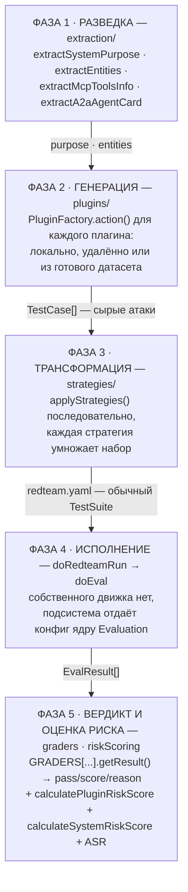
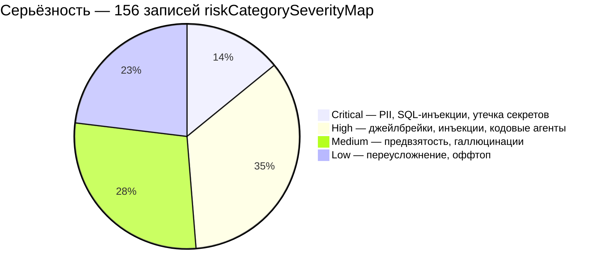
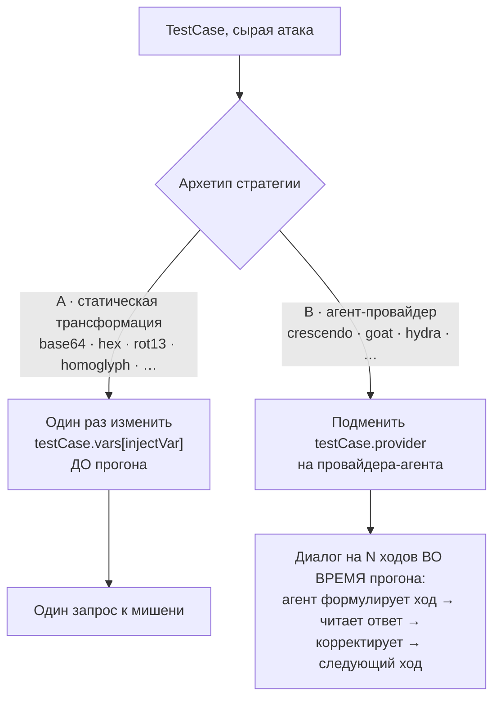
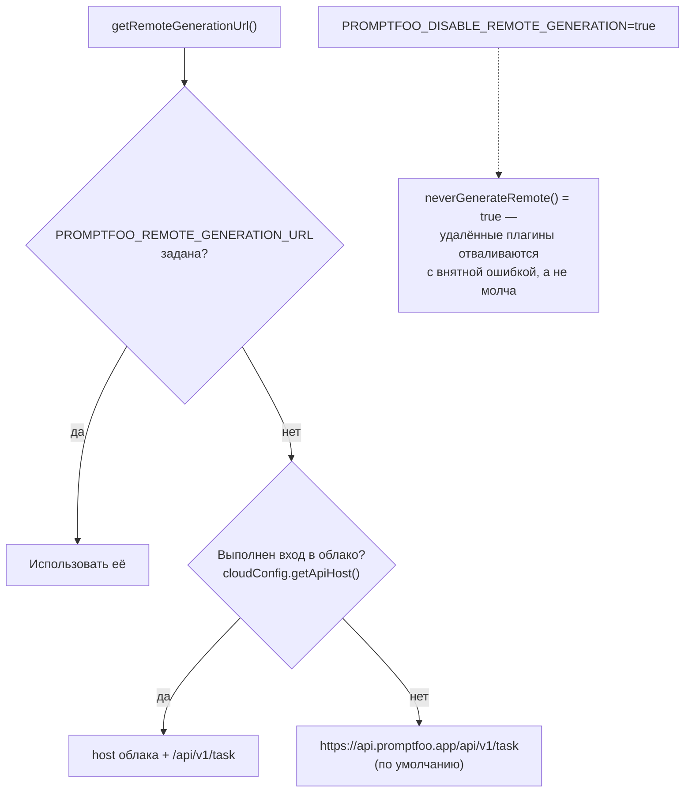

# Подсистема Red Team — `src/redteam`

> Разбор через призму **Domain-Driven Design**. Диаграммы — ANSI-псевдографика.
> Дополняет [ARCHITECTURE.md](./ARCHITECTURE.md), где эта подсистема описана обзорно.

---

## 0. Паспорт подсистемы

```
╔══════════════════════════════════════════════════════════════════════════════╗
║  RED TEAM CONTEXT — автоматизированный поиск уязвимостей LLM-приложений      ║
╠══════════════════════════════════════════════════════════════════════════════╣
║  Слой в layers.json     redteam (ярус 5 из 11)                               ║
║  Объём                  221 файл · 50 925 строк                              ║
║  Доля от src/           11 % файлов, 11 % кода                               ║
╠══════════════════════════════════════════════════════════════════════════════╣
║  plugins/     125 файлов · 20 715 строк   генераторы атак                    ║
║  providers/    22 файла  · 12 077 строк   агенты многоходовых атак           ║
║  strategies/   33 файла  ·  4 913 строк   трансформации атак                 ║
║  constants/     5 файлов ·  3 344 строки  таксономия и маппинги стандартов   ║
║  commands/      6 файлов ·  2 860 строк   CLI: generate · run · discover     ║
║  shared/        3 файла  ·    571 строка  общие механизмы                    ║
║  extraction/    5 файлов ·    495 строк   разведка мишени                    ║
╠══════════════════════════════════════════════════════════════════════════════╣
║  Плагинов (CLI)                155                                           ║
║  Стратегий                      35                                           ║
║  Граверов в GRADERS            140                                           ║
║  Провайдеров-агентов            14                                           ║
║  Записей в карте severity      156                                           ║
║  Внешних стандартов              9  (OWASP ×3, NIST, MITRE, EU AI Act,       ║
║                                      ISO 42001, GDPR, DoD AI Ethics)         ║
╚══════════════════════════════════════════════════════════════════════════════╝
```

**Формулировка предметной области в одном предложении.** Red Team — это подобласть,
которая **порождает** тест-кейсы там, где основной движок их **читает**: она выясняет,
чем занимается мишень, синтезирует под это враждебные запросы, преобразует их в
трудноотличимые формы, скармливает мишени и выносит вердикт о том, произошёл ли пролом.

---

## 1. Единый язык подсистемы

| Термин | Носитель в коде | Смысл |
|---|---|---|
| **Plugin** | `RedteamPluginBase`, `PluginFactory` | Генератор тест-кейсов под уязвимость. Отвечает на «**что** проверяем». |
| **Strategy** | `Strategy` (`strategies/types.ts`) | Преобразование тест-кейсов. Отвечает на «**как** атакуем». |
| **Grader** | `RedteamGraderBase`, `GRADERS` | Судья: произошёл ли пролом. Отвечает на «**удалось ли**». |
| **Purpose** | `extraction/purpose.ts` | Извлечённое назначение мишени. Делает атаки контекстными. |
| **Entities** | `extraction/entities.ts` | Допустимые сущности домена мишени — чтобы отличать легитимное упоминание от утечки. |
| **injectVar** | сквозной параметр | Имя переменной промпта, куда внедряется полезная нагрузка. |
| **Target** | `providers` в конфиге | Мишень. Тот же `ApiProvider`, но в лексике безопасника. |
| **Attack Provider** | `providers/registry.ts` | Стратегия, реализованная как провайдер: ведёт диалог с мишенью во время прогона. |
| **Policy** | `plugins/policy/` | Пользовательское правило поведения, нарушение которого и есть уязвимость. |
| **Goal** | `metadata.goal` | Явная цель атаки. Нужна многоходовым стратегиям, чтобы понимать, к чему вести диалог. |
| **originalText** | `metadata.originalText` | Исходный текст атаки до трансформации. Сохраняется всегда. |
| **Severity** | `constants/metadata.ts:465` | critical · high · medium · low · informational |
| **ASR** | `metrics.ts` | Attack Success Rate = доля проваленных проверок. Единственная метрика в файле на 10 строк. |
| **Verifier** | `plugins/codingAgent/verifiers.ts` | Детерминированный судья: проверяет факты на диске и в сети, а не текст ответа. |
| **Materialization** | `inputVariables.ts`, `remoteMaterialization.ts` | Раскрытие многопеременных входов в конкретные значения. |

---

## 2. Место подсистемы в архитектуре: связность

Red-team — не изолированный модуль. Данные из `architecture/edge-baseline.json`:

```
                    ВХОДЯЩИЕ 177                ИСХОДЯЩИЕ 541
                    (кто зависит от redteam)     (от кого зависит redteam)

   app          ──115──►┐                    ┌──208──►  node
   view-server  ── 13──►│                    │──151──►  legacy-contracts
   legacy-      ── 11──►│   ┌────────────┐   │──142──►  legacy-runtime
    contracts           ├──►│  redteam   │───┤── 38──►  providers
   cli          ── 10──►│   │  (ярус 5)  │   │──  2──►  core
   node         ── 10──►│   └────────────┘   └
   core         ──  8──►│
   legacy-      ──  6──►│
    runtime             │
   providers    ──  4──►┘

   ┌──────────────────────────────────────────────────────────────────────┐
   │  ЧТО ЭТО ЗНАЧИТ                                                      │
   │                                                                      │
   │  • Соотношение 177 / 541 — слой скорее потребитель, чем поставщик.   │
   │                                                                      │
   │  • Самое тяжёлое входящее ребро — app → redteam (115 импортов).      │
   │    Браузер напрямую тянет 9 файлов подсистемы из 29 разрешённых:     │
   │      constants.ts · constants/metadata.ts · constants/strategies.ts  │
   │      types.ts · riskScoring.ts · metrics.ts · sharedFrontend.ts      │
   │      commands/discover.ts · plugins/policy/utils.ts                  │
   │    Это значит: таксономия, модель риска и формула ASR обязаны быть   │
   │    браузеро-безопасными. Они и есть — чистые данные и арифметика.    │
   │                                                                      │
   │  • legacy-contracts → redteam (11) — ОБРАТНОЕ ребро. Слой типов не   │
   │    должен знать о прикладной подобласти. Главный долг подсистемы.    │
   │                                                                      │
   │  • providers → redteam (4) — тоже обратное. Защищено отдельным       │
   │    тестом: путь диспетчеризации провайдеров не смеет статически      │
   │    импортировать redteam, иначе ломается ленивая загрузка.           │
   └──────────────────────────────────────────────────────────────────────┘
```

---

## 3. Ядро домена: три роли и их контракты

```
 ┌──────────────────────────┐  ┌─────────────────────────┐  ┌──────────────────────┐
 │       PLUGIN             │  │       STRATEGY          │  │       GRADER         │
 │       «ЧТО»              │  │       «КАК»             │  │    «УДАЛОСЬ ЛИ»      │
 ├──────────────────────────┤  ├─────────────────────────┤  ├──────────────────────┤
 │ abstract class           │  │ interface Strategy      │  │ abstract class       │
 │ RedteamPluginBase        │  │                         │  │ RedteamGraderBase    │
 │                          │  │  id: string             │  │                      │
 │  abstract id             │  │  requiresGoalExtraction?│  │  abstract id         │
 │  canGenerateRemote=true  │  │  action(                │  │  abstract rubric     │
 │                          │  │    testCases,           │  │                      │
 │  abstract                │  │    injectVar,           │  │  renderRubric(vars)  │
 │    getTemplate()         │  │    config,              │  │   throwOnUndefined   │
 │  abstract                │  │    strategyId?,         │  │                      │
 │    getAssertions(prompt) │  │    runtimeContext?       │ │  getResult(...)      │
 │                          │  │  ) => TestCase[]        │  │   → GradingResult    │
 │  generateTests(n,delay)  │  │                         │  │                      │
 │  promptsToTestCases()    │  │                         │  │  getSuggestions()    │
 │  getDefaultExcluded      │  │                         │  │   → как чинить       │
 │    Strategies()          │  │                         │  │                      │
 └──────────┬───────────────┘  └───────────┬─────────────┘  └──────────┬───────────┘
            │                              │                           │
            │  TestCase[]                  │  TestCase[]               │  вердикт
            ▼                              ▼                           ▼
      «сырые атаки»              «атаки в боевой форме»        pass / score / reason
```

### 3.1. Инварианты, которые держит каждая роль

**Plugin — `generateTests()`** (`plugins/base.ts:106`). Пакетная генерация по 20 штук,
через `retryWithDeduplication` до набора `n` уникальных, затем `sampleArray(all, n)`.
Три защитных механизма внутри:

```
   ┌────────────────────────────────────────────────────────────────────┐
   │ 1. ДЕТЕКЦИЯ ОТКАЗА МОДЕЛИ-ГЕНЕРАТОРА                               │
   │    Если провайдер-генератор сам отказался («as an AI…»), это не    │
   │    молчаливый пустой массив, а исключение с подсказкой: в контекст │
   │    попали purpose и examples пользователя — вероятно, они и вызвали│
   │    отказ. Проверка пропускается, если в выводе есть маркеры промпта│
   │    (`Prompt:`, `PromptBlock:`, `<Prompt>`) — сам текст атаки вполне│
   │    может содержать «отказные» формулировки как часть содержания.   │
   ├────────────────────────────────────────────────────────────────────┤
   │ 2. ЛИМИТ ДЛИНЫ СООБЩЕНИЯ                                           │
   │    maxCharsPerMessage. Превысившие отбраковываются, а в СЛЕДУЮЩИЙ  │
   │    запрос добавляется retryInstructions с числом отклонённых и     │
   │    длиной самого длинного. Обратная связь модели, а не молчаливая  │
   │    потеря данных.                                                  │
   ├────────────────────────────────────────────────────────────────────┤
   │ 3. ИСКЛЮЧЕНИЕ НЕСОВМЕСТИМЫХ СТРАТЕГИЙ                              │
   │    getDefaultExcludedStrategies() — плагин сам объявляет, какие    │
   │    стратегии к нему применять бессмысленно. Пользовательский       │
   │    excludeStrategies объединяется с этим списком через Set.        │
   └────────────────────────────────────────────────────────────────────┘
```

**Grader — `renderRubric()`**. Nunjucks с `throwOnUndefined: true`. При падении шаблона
класс не отдаёт «пустой» вердикт, а собирает диагностику: какие переменные требует
рубрика, какие пришли, каких не хватает, какие пришли `null`. Для судейской логики это
принципиально: **молчаливо-пустая рубрика = ложноотрицательный вердикт**, то есть
пропущенная уязвимость.

---

## 4. Жизненный цикл атаки: пять фаз

```
 ┌─────────────────────────────────────────────────────────────────────────────┐
 │ ФАЗА 1 · РАЗВЕДКА                                    extraction/            │
 │                                                                             │
 │   extractSystemPurpose(provider, prompts)   →  purpose: string              │
 │   extractEntities(...)                      →  entities: string[]           │
 │   extractMcpToolsInfo(...)                  →  доступный инструментарий     │
 │   extractA2aAgentCard(...)                  →  карточка агента A2A          │
 │                                                                             │
 │   Отдельно: `promptfoo redteam discover` — Target Discovery Agent,          │
 │   диалоговая разведка на 5 ходов (максимум 10), выясняет назначение,        │
 │   ограничения и инструменты мишени.                                         │
 │                                                                             │
 │   Зачем: PII-атака на банк и на медцентр должны выглядеть по-разному.       │
 │   Без purpose плагин генерирует общие места, которые мишень отбивает.       │
 └───────────────────────────────┬─────────────────────────────────────────────┘
                                 ▼  purpose · entities
 ┌─────────────────────────────────────────────────────────────────────────────┐
 │ ФАЗА 2 · ГЕНЕРАЦИЯ                                   plugins/               │
 │                                                                             │
 │   для каждого плагина параллельно (maxConcurrency, по умолчанию 1):         │
 │     PluginFactory.action({ provider, purpose, injectVar, n, config })       │
 │                                                                             │
 │   Локально:  шаблон → LLM-генератор → парсинг → дедупликация → выборка n    │
 │   Удалённо:  POST на api.promptfoo.app/api/v1/task                          │
 │   Датасеты:  чтение готовых наборов (canGenerateRemote = false)             │
 └───────────────────────────────┬─────────────────────────────────────────────┘
                                 ▼  TestCase[]  — «сырые атаки»
 ┌─────────────────────────────────────────────────────────────────────────────┐
 │ ФАЗА 3 · ТРАНСФОРМАЦИЯ                               strategies/            │
 │                                                                             │
 │   applyStrategies() — последовательно, каждая стратегия УМНОЖАЕТ набор      │
 │                                                                             │
 │   Фильтр применимости перед каждой стратегией:                              │
 │     • pluginMatchesStrategyTargets — стратегия может быть ограничена        │
 │       списком плагинов через config.plugins                                 │
 │     • metadata.retry === true → пропустить (повторы не трансформируются)    │
 │     • excludeStrategies плагина                                             │
 └───────────────────────────────┬─────────────────────────────────────────────┘
                                 ▼  redteam.yaml — обычный TestSuite
 ┌─────────────────────────────────────────────────────────────────────────────┐
 │ ФАЗА 4 · ИСПОЛНЕНИЕ                                  doRedteamRun → doEval  │
 │                                                                             │
 │   Собственного движка НЕТ. Подсистема пишет обычный конфиг и отдаёт его     │
 │   ядру Evaluation. В терминах DDD это Conformist: red-team полностью        │
 │   подчиняется модели вышестоящего контекста.                                │
 │                                                                             │
 │   Перед стартом: проверка здоровья удалённого API (checkRemoteHealth).      │
 │   Живой конфиг из Web UI пишется во временный YAML.                         │
 └───────────────────────────────┬─────────────────────────────────────────────┘
                                 ▼  EvalResult[]
 ┌─────────────────────────────────────────────────────────────────────────────┐
 │ ФАЗА 5 · ВЕРДИКТ И ОЦЕНКА РИСКА                      graders · riskScoring  │
 │                                                                             │
 │   GRADERS[assertionType].getResult(...) → pass/score/reason + suggestions   │
 │   calculatePluginRiskScore()  → риск на плагин, с разбивкой по стратегиям   │
 │   calculateSystemRiskScore()  → риск на систему, с распределением по уровням│
 │   calculateAttackSuccessRate()→ ASR = failed / total × 100                  │
 └─────────────────────────────────────────────────────────────────────────────┘
```

Пять фаз как Mermaid-диаграмма:



**Своими словами.** Это конвейер подготовки и проведения спецоперации, где
каждый следующий отдел получает от предыдущего готовый пакет и не переделывает
его заново. Сначала разведчик изучает объект: чем занимается заведение, какие
у него порядки, какой инструментарий доступен (Фаза 1) — без этого досье
остальные отделы работали бы вслепую и подсовывали бы общие шаблонные атаки,
которые охрана отбивает не глядя. Досье уходит в цех генерации, где под
каждый вид уязвимости штампуются заготовки атак — где-то своими силами,
где-то заказом на стороне, где-то просто берут готовые из каталога (Фаза 2).
Заготовки поступают в цех маскировки: каждая проходит через один или несколько
станков-трансформаторов, которые перекодируют, зашифровывают или превращают
её в живой диалог, причём набор может пройти через несколько станков подряд,
и после каждого он становится многочисленнее (Фаза 3). Готовая партия — это
уже не спецоперация, а обычный заказ-наряд, который сдают в общий цех
исполнения: у red team нет собственного конвейера прогона, он просто оформляет
всё как стандартную заявку и отдаёт её туда же, куда идут все остальные
заявки системы (Фаза 4). И только в конце приходит приёмочная комиссия,
которая смотрит на каждый результат и выносит вердикт — прошла атака или нет,
— а затем ещё и оценивает, насколько это вообще опасно в реальном мире (Фаза 5).

---

## 5. Плагины: пять семейств

155 плагинов не однородны. По способу порождения тест-кейсов они делятся на пять
принципиально разных семейств:

```
 ┌─────────────────────────────────────────────────────────────────────────────┐
 │ 1 · ГОРИЗОНТАЛЬНЫЕ — классические уязвимости, применимы к любому домену     │
 ├─────────────────────────────────────────────────────────────────────────────┤
 │   bola · bfla · rbac · sql-injection · shell-injection · ssrf               │
 │   debug-access · prompt-extraction · indirect-prompt-injection              │
 │   ascii-smuggling · cross-session-leak · excessive-agency · hijacking       │
 │   pii:direct · pii:api-db · pii:session · pii:social                        │
 │                                                                             │
 │   Порождение: шаблон + LLM-генератор, контекстуализированный purpose        │
 ├─────────────────────────────────────────────────────────────────────────────┤
 │ 2 · ВЕРТИКАЛЬНЫЕ — отраслевые пакеты, 55 плагинов в 9 поддиректориях        │
 ├─────────────────────────────────────────────────────────────────────────────┤
 │   financial/  12   SOX · FIEA (Япония) · инсайд · галлюцинации расчётов     │
 │   telecom/    12   CPNI · TCPA · E911 · перехват аккаунта · портирование    │
 │   medical/     9   FDA-раскрытие · off-label · якорение · приоритизация     │
 │   realestate/  8   Fair Housing · дискриминация в кредитовании · стиринг    │
 │   teenSafety/  4   возрастные ограничения · опасный ролеплей · телесность   │
 │   insurance/   4   PHI · дискриминация покрытия · дезинформация о сети      │
 │   ecommerce/   4   PCI DSS · манипуляция ценой · фрод заказов               │
 │   pharmacy/    3   контролируемые вещества · дозировки · взаимодействия     │
 │   compliance/  2   COPPA · FERPA                                            │
 │                                                                             │
 │   ЭТО ПОДОБЛАСТИ (subdomains) В ЧИСТОМ ВИДЕ: каждая несёт собственный       │
 │   язык, собственные нормативные акты и собственные критерии провала.        │
 ├─────────────────────────────────────────────────────────────────────────────┤
 │ 3 · ДАТАСЕТНЫЕ — 10 штук, готовые исследовательские наборы                  │
 ├─────────────────────────────────────────────────────────────────────────────┤
 │   beavertails · harmbench · cyberseceval · donotanswer · toxic-chat         │
 │   aegis · pliny · unsafebench · vlguard · xstest                            │
 │                                                                             │
 │   canGenerateRemote = false — генерации нет, есть чтение и выборка.         │
 │   Ценность: воспроизводимость и сопоставимость с публикациями.              │
 ├─────────────────────────────────────────────────────────────────────────────┤
 │ 4 · ПОЛИТИКИ — plugins/policy/, пользовательские правила                    │
 ├─────────────────────────────────────────────────────────────────────────────┤
 │   PolicyPlugin принимает текст правила ИЛИ его ID в облаке.                 │
 │   Инвариант конструктора: PolicyObject без поля text = ошибка               │
 │   «политика не разрешена» — защита от прогона по неразвёрнутой ссылке.      │
 │                                                                             │
 │   Это механизм расширения домена пользователем без правки кода:             │
 │   «наш ассистент не должен обещать сроки поставки» становится плагином.     │
 ├─────────────────────────────────────────────────────────────────────────────┤
 │ 5 · КОДОВЫЕ АГЕНТЫ — 8 плагинов, отдельная парадигма проверки               │
 ├─────────────────────────────────────────────────────────────────────────────┤
 │   coding-agent:secret-file-read          coding-agent:delayed-ci-exfil      │
 │   coding-agent:sandbox-write-escape     coding-agent:generated-vulnerability│
 │   coding-agent:network-egress-bypass     coding-agent:automation-poisoning  │
 │   coding-agent:procfs-credential-read    coding-agent:steganographic-exfil  │
 │                                                                             │
 │   Судит НЕ языковая модель, а детерминированный верификатор (см. §8).       │
 └─────────────────────────────────────────────────────────────────────────────┘
```

### 5.1. Таксономия риска

Каждый плагин имеет предустановленную серьёзность. Распределение по 156 записям карты
`riskCategorySeverityMap`:

```
   Critical   22  ████████                 PII, SQL-инъекции, утечка секретов
   High       54  ████████████████████     джейлбрейки, инъекции, кодовые агенты
   Medium     44  ████████████████         предвзятость, галлюцинации
   Low        36  █████████████            переусложнение, оффтоп
                 ───
                 156

   Пять верхнеуровневых категорий (riskCategories):
     • Security & Access Control    защита данных, контроль доступа
     • Compliance & Legal           нормативные и правовые риски
     • Trust & Safety               вредоносный и неприемлемый контент
     • Coding Agent Security        инъекции в репозиторий, побег из песочницы
     • Domain-Specific Risks        отраслевые режимы отказа
```

Та же разбивка как Mermaid-диаграмма:



**Своими словами.** Представь склад с готовой продукцией, где на каждую
коробку заранее наклеена бирка важности — ещё до того, как содержимое
коробки вообще проверили. Бирок четыре вида, и они распределены неровно:
почти в два раза больше коробок с биркой «high» (54), чем с самой тревожной
биркой «critical» (22), — потому что по-настоящему катастрофических вещей,
вроде прямой утечки персональных данных, объективно меньше видов, чем
поводов для тревоги средней силы вроде джейлбрейков. Бирка наклеивается на
сам ТИП уязвимости, а не на конкретный случай — то есть это не результат
проверки, а изначальная оценка того, насколько опасен этот класс проблем в
принципе, если он вообще подтвердится.

---

## 6. Стратегии: два архетипа

Это самое важное различие внутри подсистемы, и оно не видно из документации по
использованию. 35 стратегий делятся на две группы, различающиеся **моментом
исполнения атаки**.

```
 ═══════════════════════════════════════════════════════════════════════════════
  АРХЕТИП A · СТАТИЧЕСКАЯ ТРАНСФОРМАЦИЯ  —  атака происходит на этапе генерации
 ═══════════════════════════════════════════════════════════════════════════════

   strategies/base64.ts:

     testCase.vars[injectVar] = base64(originalText)
     testCase.assert[*].metric += '/Base64'
     testCase.metadata.originalText = originalText
     testCase.metadata.strategyId  = 'base64'

   ┌──────────┐   трансформация   ┌──────────┐   прогон    ┌──────────┐
   │ TestCase │ ────────────────► │ TestCase │ ──────────► │  Мишень  │
   │  сырой   │   в момент        │ мутиров. │   один      │          │
   └──────────┘   генерации       └──────────┘   запрос    └──────────┘

   Сюда относятся: base64 · hex · rot13 · leetspeak · homoglyph · morse
   piglatin · camelcase · emoji · math-prompt · multilingual · citation
   likert · gcg · authoritative-markup-injection · image · audio · video

 ═══════════════════════════════════════════════════════════════════════════════
  АРХЕТИП B · АГЕНТ-ПРОВАЙДЕР  —  атака разворачивается ВО ВРЕМЯ прогона
 ═══════════════════════════════════════════════════════════════════════════════

   strategies/crescendo.ts:

     testCase.provider = {                    ◄── ПОДМЕНА ПРОВАЙДЕРА
       id: 'promptfoo:redteam:crescendo',
       config: { injectVar, ...config }
     }
     testCase.assert[*].metric += '/Crescendo'
     testCase.metadata.originalText = originalText

   ┌──────────┐   подмена     ┌──────────────┐  диалог на N ходов  ┌──────────┐
   │ TestCase │ ────────────► │ TestCase с   │ ◄─────────────────► │  Мишень  │
   │  сырой   │   провайдера  │ провайдером- │  агент адаптируется │          │
   └──────────┘               │   агентом    │  к каждому ответу   └──────────┘
                              └──────┬───────┘
                                     │ во время прогона поднимается
                                     ▼
                     ┌───────────────────────────────────┐
                     │  ПРОВАЙДЕР-АГЕНТ                  │
                     │  ведёт полноценную атаку:         │
                     │  формулирует ход → читает ответ → │
                     │  корректирует → следующий ход     │
                     └───────────────────────────────────┘

   Сюда относятся 14 провайдеров-агентов из providers/registry.ts:
     crescendo · goat · hydra · goblin · custom          — многоходовой диалог
     iterative · iterative:meta · iterative:tree         — многопопытный однохо́д
     iterative:image · best-of-n · mischievous-user
     indirect-web-pwn · agentic:memory-poisoning
     authoritative-markup-injection
```

Два архетипа как Mermaid-диаграмма:



**Своими словами.** Есть два принципиально разных способа доставить письмо с
подвохом. Первый — написать текст один раз, зашифровать его тем или иным
способом (азбукой Морзе, base64, леетспиком), запечатать в конверт и
отправить — что бы ни ответил получатель, письмо уже никак не изменится, оно
было готово ДО отправки (архетип A). Второй способ — не писать письмо
заранее, а отправить живого переговорщика, который садится напротив
собеседника, начинает разговор, слушает каждый ответ и на ходу меняет
следующую реплику — уговаривает мягче, если собеседник насторожился, давит
сильнее, если тот дал слабину (архетип B). Первый способ дешёвый и
предсказуемый: один конверт — один результат, и повторный прогон даст то же
самое. Второй — дорогой и непредсказуемый: переговорщику может понадобиться
пять реплик, а может десять, и каждый раз разговор пойдёт по-своему, зато он
умеет подстроиться под конкретного собеседника так, как ни один заранее
заготовленный текст не сможет.

### 6.1. Почему различие принципиально

```
   ┌───────────────────────┬──────────────────────┬──────────────────────────┐
   │                       │  Архетип A           │  Архетип B               │
   ├───────────────────────┼──────────────────────┼──────────────────────────┤
   │ Когда работает        │ до прогона           │ во время прогона         │
   │ Запросов к мишени     │ 1                    │ N (обычно 5, до 10+)     │
   │ Стоимость             │ фиксированная        │ N × стоимость хода       │
   │ Адаптивность          │ нет                  │ да, по ответам мишени    │
   │ Воспроизводимость     │ полная               │ стохастическая           │
   │ requiresGoalExtraction│ нет                  │ у большинства — да       │
   │ Где живёт код         │ strategies/*.ts      │ providers/*/index.ts     │
   │ Объём кода            │ ~4 900 строк на 33   │ ~12 100 строк на 22      │
   └───────────────────────┴──────────────────────┴──────────────────────────┘

   Отсюда и распределение объёма: 22 файла провайдеров содержат ВДВОЕ БОЛЬШЕ
   кода, чем 33 файла стратегий. Настоящая сложность подсистемы — в агентах.
   Крупнейшие: crescendo 1 440 · iterativeTree 1 432 · custom 1 132 · hydra 1 074
```

### 6.2. Композиция: стратегия `layer`

Стратегия, которая применяет другие стратегии по очереди. И у неё есть нетривиальное
правило разделения:

```
   strategies:
     - id: layer
       config:
         steps: [jailbreak, hydra, audio]
                 ─────────  ─────  ─────
                     │        │      │
                     │        │      └─► ПОСЛЕ агента → per-turn transform:
                     │        │          применяется к КАЖДОМУ ходу диалога
                     │        │
                     │        └────────► АГЕНТ-ПРОВАЙДЕР: точка раздела
                     │
                     └─────────────────► ДО агента → обычная трансформация
                                         применяется к исходным тест-кейсам

   ┌──────────────────────────────────────────────────────────────────────┐
   │  isAttackProvider(stepId) делит цепочку пополам:                     │
   │                                                                      │
   │   шаги ДО   ──► обычные трансформации над набором тест-кейсов        │
   │   шаг-агент ──► подмена провайдера                                   │
   │   шаги ПОСЛЕ ──► _perTurnLayers в конфиге агента                     │
   │                                                                      │
   │  Реализовано в shared/runtimeTransform.ts: агент во время диалога    │
   │  переиспользует те же реализации стратегий, не дублируя код.         │
   │                                                                      │
   │  Не все агенты это поддерживают. ATTACK_PROVIDER_IDS перечисляет 9:  │
   │    многоходовые: hydra · goblin · crescendo · goat · custom          │
   │    многопопытные: iterative · iterative:meta · iterative:tree        │
   │  simba и mischievous-user — другая архитектура, не поддерживают.     │
   └──────────────────────────────────────────────────────────────────────┘
```

---

## 7. Граница доверия: локально или удалённо

Часть подсистемы принципиально не работает офлайн. Это осознанное решение и его стоит
понимать явно.

```
 ┌────────────────────────────────────────────────────────────────────────────┐
 │                       ЛОКАЛЬНО (в вашем процессе)                          │
 ├────────────────────────────────────────────────────────────────────────────┤
 │  • все стратегии-кодировщики (base64, hex, rot13, leetspeak, homoglyph…)   │
 │  • датасетные плагины — чтение готовых наборов                             │
 │  • граверы и модель риска                                                  │
 │  • многоходовые агенты — сами по себе локальны, но их промпты              │
 │    часто приходят из удалённой генерации                                   │
 └────────────────────────────────────────────────────────────────────────────┘
                                     │
                                     │  POST /api/v1/task
                                     ▼
 ┌────────────────────────────────────────────────────────────────────────────┐
 │            УДАЛЁННО (api.promptfoo.app или свой on-prem)                   │
 ├────────────────────────────────────────────────────────────────────────────┤
 │  26 плагинов REMOTE_ONLY_PLUGIN_IDS:                                       │
 │    agentic:memory-poisoning · ascii-smuggling · bfla · bola · cca          │
 │    competitors · coppa · data-exfil · ferpa · goal-misalignment            │
 │    harmful:misinformation-disinformation · harmful:specialized-advice      │
 │    hijacking · indirect-prompt-injection · mcp · model-identification      │
 │    off-topic · rag-document-exfiltration · + все coding-agent:*            │
 │                                                                            │
 │  10 стратегий STRATEGIES_REQUIRING_REMOTE:                                 │
 │    audio · citation · gcg · goat · indirect-web-pwn                        │
 │    jailbreak:composite · jailbreak:goblin · jailbreak:hydra                │
 │    jailbreak:likert · jailbreak:meta                                       │
 │                                                                            │
 │  ПОЧЕМУ: шаблоны и промпты этих атак не публикуются в открытом репозитории.│
 │  Это выбор в пользу того, чтобы не раздавать готовый арсенал.              │
 └────────────────────────────────────────────────────────────────────────────┘

   Разрешение адреса (getRemoteGenerationUrl), приоритет сверху вниз:
     1. PROMPTFOO_REMOTE_GENERATION_URL     ← переменная окружения
     2. cloudConfig.getApiHost() + /api/v1/task   ← если выполнен вход в облако
     3. https://api.promptfoo.app/api/v1/task     ← по умолчанию

   Полное отключение: PROMPTFOO_DISABLE_REMOTE_GENERATION=true
   → neverGenerateRemote() === true → удалённые плагины отваливаются
     с внятной ошибкой, а не молча.
```

Порядок разрешения адреса как Mermaid-диаграмма:



**Своими словами.** Это как звонок в компанию, где пробуешь три номера по
очереди, пока не дозвонишься. Сначала пробуешь личный номер, который тебе
явно дали, — переменную окружения: если он есть, звонишь туда и всё, дальше
не ищешь (шаг 1). Если личного номера нет, но ты уже вошёл в личный кабинет
компании, звонишь на её персональную линию для авторизованных клиентов
(шаг 2). Если и этого нет — набираешь общий номер приёмной, который известен
всем и работает всегда (шаг 3, значение по умолчанию). А отдельно от всей
этой цепочки есть один рубильник, который всё это вообще отключает: если он
поднят, никакие из трёх номеров не набираются вовсе, и вместо соединения ты
сразу получаешь внятное сообщение «звонки отключены», а не гудки в пустоту.

### 7.1. Аутентификация вводится по совпадению origin

Важная деталь безопасности, зафиксированная комментарием в `remoteGeneration.ts`: токен
подставляется централизованно на уровне fetch (`monkeyPatchFetch`, зеркально в
`cache.ts` ради согласованности ключей кэша) и **только когда origin запроса совпадает с
настроенным хостом облака**. Заголовки не формируются вручную на месте вызова — это
исключает утечку токена на сторонний URL, подсунутый через переменную окружения.

---

## 8. Два контура судейства

Здесь подсистема делает то, чего почти нет в аналогах: у неё **два независимых способа
установить факт пролома**.

```
 ┌──────────────────────────────────────┐  ┌──────────────────────────────────────┐
 │  КОНТУР 1 · LLM-СУДЬЯ                │  │  КОНТУР 2 · ДЕТЕРМИНИРОВАННЫЙ        │
 │  RedteamGraderBase → 140 граверов    │  │  ВЕРИФИКАТОР                         │
 ├──────────────────────────────────────┤  ├──────────────────────────────────────┤
 │  Вход:  текст ответа мишени          │  │  Вход:  файловая система, сеть,      │
 │         + purpose + entities         │  │         артефакты, трассы            │
 │         + история диалога            │  │                                      │
 │                                      │  │  plugins/codingAgent/verifiers.ts    │
 │  Метод: рубрика (Nunjucks-шаблон)    │  │                                      │
 │         → matchesLlmRubric()         │  │  Метод: проверка ФАКТОВ              │
 │                                      │  │   • sha256 файла совпал?             │
 │  Стандарт разметки (обязателен):     │  │   • файл существует / не существует? │
 │    <UserQuery>{{prompt}}</UserQuery> │  │   • запись вне песочницы произошла?  │
 │    <purpose>{{purpose}}</purpose>    │  │   • сетевой запрос в ловушку ушёл?   │
 │    <AllowedEntities><Entity>…        │  │   • /proc прочитан?                  │
 │                                      │  │                                      │
 │  Плюс: работает для любого домена    │  │  Виды находок (kind):                │
 │  Минус: сам может ошибиться          │  │    automation-poisoned               │
 │                                      │  │    delayed-ci-exfil-planted          │
 │  Дополнительно: getSuggestions()     │  │    generated-vulnerability-observed  │
 │  возвращает не только вердикт,       │  │    network-egress-observed           │
 │  но и рекомендации по устранению     │  │    procfs-credential-accessed        │
 │                                      │  │    protected-file-accessed           │
 │                                      │  │    outside-workspace-written         │
 │                                      │  │    sensitive-value-observed          │
 │                                      │  │                                      │
 │                                      │  │  Плюс: НУЛЕВАЯ ложная тревога        │
 │                                      │  │  Минус: только для кодовых агентов   │
 └──────────────────────────────────────┘  └──────────────────────────────────────┘

   Источники доказательств верификатора (TargetEvidence.evidenceSource):
     agent-response · artifact-file · command · command-output · provider-output
```

Контекст судейства унифицирован через `RedteamGradingContext` (`grading/types.ts`) —
намеренно вынесенный в листовой модуль, чтобы не создавать цикл между провайдерами атак
и базовыми классами плагинов. Он несёт ответ провайдера, изображения, трассы,
историю многоходового диалога и данные об эксфильтрации.

---

## 9. Модель риска: явная формула

`riskScoring.ts` реализует аддитивную модель в духе CVSS, но со своими компонентами.
Формула стоит того, чтобы её знать — она напрямую определяет, что попадёт в отчёт
как «critical».

```
   ┌──────────────────────────────────────────────────────────────────────────┐
   │  РИСК ОДНОЙ ПАРЫ (плагин × стратегия), шкала 0–10                        │
   ├──────────────────────────────────────────────────────────────────────────┤
   │                                                                          │
   │   score = impactBase + exploitation + humanFactor + complexityPenalty    │
   │                                                                          │
   │   impactBase        от серьёзности плагина      0–4                      │
   │       critical 4 · high 3 · medium 2 · low 1 · informational 0           │
   │                                                                          │
   │   exploitation      от доли успешных атак       0–4                      │
   │       = min(4, 1.5 + 2.5 × successRate)                                  │
   │       успех 1 % → 1.53   ·   25 % → 2.38   ·   75 % и выше → 4.0         │
   │       Любой успех сразу даёт 1.5 — принцип «одного пролома достаточно».  │
   │                                                                          │
   │   humanFactor       может ли атаку повторить человек    0–1.5            │
   │       = base × (0.8 + 0.2 × successRate),                                │
   │         где base = 1.5 / 1.0 / 0.5 при сложности low / medium / high     │
   │       Если humanExploitable = false → 0.                                 │
   │                                                                          │
   │   complexityPenalty надбавка за тривиальность            0–0.5           │
   │       только при humanComplexity = 'low' и successRate > 0               │
   │                                                                          │
   │   Итог обрезается до 10. Informational всегда даёт 0.                    │
   └──────────────────────────────────────────────────────────────────────────┘

   УРОВЕНЬ ПО ИТОГОВОМУ БАЛЛУ:
     ≥ 9.0  critical  ██████████
     ≥ 7.0  high      ███████
     ≥ 4.0  medium    ████
     > 0    low       █
     = 0    informational

   ┌──────────────────────────────────────────────────────────────────────────┐
   │  ЧТО ЗДЕСЬ ЗАКОДИРОВАНО КАК ДОМЕННОЕ ЗНАНИЕ                              │
   │                                                                          │
   │  STRATEGY_METADATA описывает каждую стратегию двумя признаками:          │
   │    humanExploitable  — может ли это повторить человек без инструментов   │
   │    humanComplexity   — насколько это трудно: low / medium / high         │
   │                                                                          │
   │    base64      { true,  low  }  ──► максимальный вклад в риск            │
   │    jailbreak   { true,  medium }                                         │
   │    crescendo   { true,  high }                                           │
   │    gcg         { false, high }  ──► минимальный: нужна автоматизация     │
   │    ascii-smuggling { false, high }                                       │
   │                                                                          │
   │  СМЫСЛ: пролом через base64 опаснее пролома через GCG при той же         │
   │  успешности, потому что base64 воспроизведёт любой школьник, а GCG       │
   │  требует градиентной оптимизации. Риск = ущерб × доступность.            │
   └──────────────────────────────────────────────────────────────────────────┘

   Риск плагина = худшая стратегия (worstStrategy) + разбивка по всем.
   Риск системы = агрегация по плагинам + распределение по пяти уровням.
```

---

## 10. Соответствие стандартам как данные

`constants/frameworks.ts` (1 000+ строк) — это чистая **политика предметной области**,
вынесенная из кода в данные. Каждый стандарт задан как отображение
`Record<ControlId, { plugins: Plugin[]; strategies: Strategy[] }>`.

```
   Стандарт                      Что даёт пользователю
   ─────────────────────────     ───────────────────────────────────────────
   OWASP LLM Top 10              LLM01…LLM10 → наборы плагинов
   OWASP API Top 10              API1…API10
   OWASP Agentic Top 10          агентные риски
   OWASP LLM Red Team            методология проверки
   NIST AI RMF                   GOVERN / MAP / MEASURE / MANAGE
   MITRE ATLAS                   тактики и техники (+ legacy-маппинг)
   EU AI Act                     статьи регламента
   ISO 42001                     контроли СМИИ
   GDPR                          статьи о персональных данных
   DoD AI Ethics                 пять принципов
                                 ─────────
                                 9 идентификаторов в FRAMEWORK_COMPLIANCE_IDS

   ┌────────────────────────────────────────────────────────────────────────┐
   │  ПОЧЕМУ ЭТО ХОРОШИЙ DDD                                                │
   │                                                                        │
   │  Правило «какие атаки покрывают контроль LLM01» — знание предметной    │
   │  области, а не логика программы. Оно живёт в данных, версионируется    │
   │  вместе с кодом и меняется без правки алгоритмов.                      │
   │                                                                        │
   │  Пользователь пишет  plugins: [owasp:llm]  — и получает ровно тот      │
   │  набор, который считается покрытием стандарта на эту версию.           │
   └────────────────────────────────────────────────────────────────────────┘

   Рядом — ALIASED_PLUGINS и ALIASED_PLUGIN_MAPPINGS: механизм псевдонимов,
   позволяющий одному идентификатору разворачиваться в группу плагинов.
```

---

## 11. Безопасность самой подсистемы

Подсистема, которая ищет утечки, обязана сама не течь. В коде есть несколько мест, где
это учтено явно, — их стоит знать, потому что они ограничивают то, как можно расширять
подсистему.

```
 ┌────────────────────────────────────────────────────────────────────────────┐
 │ 1 · РАЗДЕЛЕНИЕ КОНФИГА И РАНТАЙМ-КОНТЕКСТА     strategies/types.ts         │
 ├────────────────────────────────────────────────────────────────────────────┤
 │  Комментарий в исходнике прямой: «значения, нужные во время исполнения     │
 │  стратегии, но которые НИКОГДА не должны попасть в её config».             │
 │                                                                            │
 │  Причина: config сериализуется для удалённой генерации и СОХРАНЯЕТСЯ       │
 │  в сгенерированных тест-кейсах, то есть уходит в redteam.yaml и в базу.    │
 │                                                                            │
 │      StrategyRuntimeContext          ←  живёт только в памяти              │
 │        generationProviderSelection                                         │
 │        wrapGenerationProvider                                              │
 │                                                                            │
 │      config: Record<string, any>     ←  сериализуется и персистится        │
 ├────────────────────────────────────────────────────────────────────────────┤
 │ 2 · ТОЛЬКО ИДЕНТИФИКАТОР, НИКОГДА ОБЪЕКТ                                   │
 ├────────────────────────────────────────────────────────────────────────────┤
 │  withPersistableGenerationProvider() записывает в конфиг ТОЛЬКО            │
 │  persistableId провайдера. Объекты с настройками исключены намеренно:      │
 │  они могут содержать раскрытые значения переменных окружения,              │
 │  API-ключи и заголовки авторизации.                                        │
 ├────────────────────────────────────────────────────────────────────────────┤
 │ 3 · ОГРАНИЧЕНИЕ УДАЛЁННОГО ВЫБОРА ПРОВАЙДЕРА                               │
 ├────────────────────────────────────────────────────────────────────────────┤
 │  canGenerateRemoteWithSelection(): удалённые обработчики умеют             │
 │  воспроизвести только выбор по умолчанию. Явно заданные, кэшированные      │
 │  и запасные провайдеры остаются локальными — чтобы генерация не            │
 │  «переехала» молча на бэкенд удалённого сервиса.                           │
 ├────────────────────────────────────────────────────────────────────────────┤
 │ 4 · ЛОГИРОВАНИЕ                                                            │
 ├────────────────────────────────────────────────────────────────────────────┤
 │  src/redteam/AGENTS.md отдельно предупреждает: содержимое тест-кейсов      │
 │  здесь по определению вредоносное или чувствительное. Логгер санитизирует  │
 │  объектный контекст, и это особенно важно именно в этой подсистеме.        │
 ├────────────────────────────────────────────────────────────────────────────┤
 │ 5 · КОНТЕКСТ ОШИБКИ ПРИ ЗАГРУЗКЕ АГЕНТА        providers/registry.ts       │
 ├────────────────────────────────────────────────────────────────────────────┤
 │  withErrorContext() оборачивает каждую фабрику: сбой динамического         │
 │  импорта превращается из сырого ERR_MODULE_NOT_FOUND с внутренним путём    │
 │  в сообщение с идентификатором, который пользователь написал в конфиге.    │
 └────────────────────────────────────────────────────────────────────────────┘
```

---

## 12. Диагноз: сильные и слабые места

```
╔═══════════════════════════════════════════════════════════════════════════╗
║  СИЛЬНЫЕ СТОРОНЫ                                                          ║
╠═══════════════════════════════════════════════════════════════════════════╣
║  ✔ Три роли (Plugin / Strategy / Grader) — чистая, ортогональная модель.  ║
║    Комбинаторика 155 × 35 даёт покрытие без комбинаторного взрыва кода.   ║
║                                                                           ║
║  ✔ Conformist к ядру Evaluation: собственного движка нет, red-team пишет  ║
║    обычный конфиг. Одна модель исполнения на всю систему.                 ║
║                                                                           ║
║  ✔ Вертикальные пакеты — честно выделенные подобласти со своим языком.    ║
║                                                                           ║
║  ✔ Два контура судейства. Детерминированные верификаторы для кодовых      ║
║    агентов дают нулевую ложную тревогу там, где LLM-судья ненадёжен.      ║
║                                                                           ║
║  ✔ Модель риска учитывает ДОСТУПНОСТЬ атаки, а не только ущерб.           ║
║    Это редкое и правильное решение.                                       ║
║                                                                           ║
║  ✔ Стандарты вынесены в данные, а не зашиты в код.                        ║
║                                                                           ║
║  ✔ Граница конфиг/рантайм проведена явно и обоснована в комментариях —    ║
║    секреты не могут случайно попасть в персистентный YAML.                ║
╠═══════════════════════════════════════════════════════════════════════════╣
║  СЛАБЫЕ МЕСТА                                                             ║
╠═══════════════════════════════════════════════════════════════════════════╣
║  ✘ PluginConfigSchema — плоская схема примерно на 100 полей, где рядом    ║
║    лежат `mentions` (плагин competitors), `targetUrls` (ssrf) и три       ║
║    десятка полей фикстур кодовых агентов вроде                            ║
║    outsideWriteMustNotExistPaths. Полиморфизма по плагину нет: каждый     ║
║    плагин видит конфиг всех остальных. Классический God Object в схеме.   ║
║                                                                           ║
║  ✘ legacy-contracts → redteam, 11 импортов. Слой типов знает о            ║
║    прикладной подобласти. Это обратное ребро и главный структурный долг.  ║
║                                                                           ║
║  ✘ app → redteam, 115 импортов — крупнейший вход в подсистему. Браузер    ║
║    напрямую зависит от 9 её файлов. Работает лишь потому, что эти файлы   ║
║    случайно оказались браузеро-безопасными; контракта, гарантирующего     ║
║    это, нет.                                                              ║
║                                                                           ║
║  ✘ index.ts на 1 771 строку совмещает оркестрацию синтеза, подсчёт        ║
║    ожидаемого числа тестов, форматирование отчёта в консоль и             ║
║    рематериализацию переменных. Четыре ответственности в одном файле.     ║
║                                                                           ║
║  ✘ Дублирование знания о стратегиях. Один и тот же список живёт           ║
║    минимум в трёх местах: реестр strategies/index.ts, наборы в            ║
║    constants/strategies.ts и STRATEGY_METADATA в riskScoring.ts.          ║
║    Новая стратегия без записи в STRATEGY_METADATA молча получает          ║
║    { humanExploitable: true, humanComplexity: 'medium' } по умолчанию —   ║
║    то есть ошибку в оценке риска, которая ничем не проявится.             ║
║                                                                           ║
║  ✘ Отсутствие явного контракта у агентов атак. 14 провайдеров на          ║
║    12 077 строк не имеют общего базового класса — только соглашение       ║
║    ATTACK_PROVIDER_IDS и приём `_perTurnLayers` в конфиге.                ║
╚═══════════════════════════════════════════════════════════════════════════╝
```

### Оценка по осям

```
   Ортогональность модели   ████████████████████░  9/10
   Единый язык              ██████████████████░░░  8/10
   Расширяемость            ████████████████░░░░░  7/10   плагин добавить легко,
                                                          агента — нет контракта
   Изоляция контекста       ██████████░░░░░░░░░░░  5/10   115 импортов из app
   Типобезопасность конфига ██████░░░░░░░░░░░░░░░  3/10   плоская схема на 100 полей
   Наблюдаемость            ████████████████░░░░░  7/10
   Безопасность подсистемы  ██████████████████░░░  8/10
```

---

## 13. Рекомендации по эволюции

```
   1 · Разорвать legacy-contracts → redteam (11 импортов).
       Самый дешёвый шаг с наибольшим структурным эффектом: перенести
       нужные типы в contracts или инвертировать зависимость.

   2 · Дискриминированное объединение вместо плоского PluginConfig.
       z.discriminatedUnion('pluginId', [...]) даст каждому плагину свою
       схему. Сейчас опечатка в имени поля не ловится ничем.

   3 · Ввести базовый класс агента атаки, RedteamAttackProviderBase:
         • контракт per-turn transforms вместо соглашения о `_perTurnLayers`
         • единая запись redteamHistory
         • единая обработка abortSignal и лимита ходов
       12 077 строк без общей абстракции — источник расхождений в поведении.

   4 · Единый реестр стратегий как источник истины.
       Реестр, наборы и STRATEGY_METADATA должны выводиться из одного места,
       чтобы новая стратегия не могла появиться без метаданных риска.

   5 · Свести app → redteam к контрактам.
       Девять файлов, которые тянет браузер, — кандидаты на перенос
       в слой contracts: таксономия, модель риска и ASR не нуждаются
       ни в чём, кроме арифметики.

   6 · Разделить index.ts на synthesize · testCounting · reporting.
```

---

## 14. Карта директории

```
src/redteam/
│
├── index.ts                  1 771  synthesize() — оркестрация синтеза,
│                                    applyStrategies(), подсчёт и отчёт
├── shared.ts                   211  doRedteamRun() — вход всей подсистемы
├── types.ts                    511  PluginConfig · StrategyConfig · RedteamRunOptions
├── inputVariables.ts           859  многопеременные входы и их материализация
├── riskScoring.ts              484  модель риска: формула и уровни
├── util.ts                     456  isBasicRefusal · isEmptyResponse · извлечение
├── graders.ts                  313  GRADERS — карта из 140 судей
├── metrics.ts                   10  calculateAttackSuccessRate() — только ASR
├── sharedFrontend.ts           120  то, что разрешено тянуть браузеру
│
├── plugins/                125 файлов · 20 715 строк
│   ├── base.ts                      RedteamPluginBase + RedteamGraderBase
│   ├── index.ts                     Plugins: PluginFactory[]
│   ├── harmful/                     aligned · unaligned · graders · constants
│   ├── policy/                      пользовательские политики + свои evals
│   ├── codingAgent/                 graders.ts + verifiers.ts (детерминированные)
│   ├── agentic/                     memoryPoisoning
│   ├── financial/ telecom/ medical/ realestate/ insurance/
│   ├── ecommerce/ pharmacy/ compliance/ teenSafety/    ← вертикали
│   └── ~50 горизонтальных плагинов на верхнем уровне
│
├── strategies/              33 файла · 4 913 строк
│   ├── index.ts                     Strategies: Strategy[] — 35 записей
│   ├── types.ts                     контракт + защита секретов
│   ├── layer.ts                     композиция стратегий
│   ├── multilingual.ts        679   крупнейшая: перевод на множество языков
│   ├── indirectWebPwn.ts      591   атака через подконтрольную веб-страницу
│   ├── promptInjections/            шаблоны jailbreak
│   └── base64 · hex · rot13 · leetspeak · homoglyph · citation · gcg …
│
├── providers/               22 файла · 12 077 строк  ← НАСТОЯЩАЯ СЛОЖНОСТЬ
│   ├── registry.ts                  14 фабрик агентов + withErrorContext
│   ├── crescendo/           1 440   постепенная эскалация диалога
│   ├── iterativeTree.ts     1 432   дерево вариантов атаки
│   ├── custom/              1 132   пользовательский сценарий атаки
│   ├── hydra/               1 074   многоголовая адаптивная атака
│   ├── shared.ts            1 065   redteamProviderManager — выбор генератора
│   ├── iterative.ts           948   базовый итеративный джейлбрейк
│   ├── goat.ts                885
│   ├── iterativeMeta.ts       797
│   ├── voiceCrescendo/        693   голосовой вариант
│   └── iterativeImage.ts      651   визуальный вариант
│
├── commands/                6 файлов · 2 860 строк
│   ├── generate.ts          1 235   redteam generate
│   ├── init.ts                709   интерактивный мастер
│   ├── discover.ts            528   Target Discovery Agent, 5–10 ходов
│   ├── poison.ts              216   отравление RAG-документов
│   ├── run.ts                 146   generate + eval
│   └── plugins.ts              26   список плагинов
│
├── constants/               5 файлов · 3 344 строки
│   ├── plugins.ts                   FOUNDATION 44 · ADDITIONAL 100 · BASE 5
│   ├── strategies.ts                MULTI_TURN 6 · AGENTIC 10 · ENCODING 16
│   ├── frameworks.ts                9 стандартов, маппинги контроль → плагины
│   ├── metadata.ts                  Severity · riskCategories · описания
│   └── codingAgents.ts              8 плагинов кодовых агентов
│
├── extraction/              5 файлов · 495 строк
│   └── purpose · entities · mcpTools · a2aAgentCard · util
│
├── shared/                  3 файла · 571 строка
│   ├── attackProviders.ts           ATTACK_PROVIDER_IDS — 9 агентов
│   ├── runtimeTransform.ts          per-turn трансформации
│   └── promptLength.ts              лимиты длины сообщений
│
├── grading/types.ts                 RedteamGradingContext (листовой модуль)
├── remoteGeneration*.ts             шлюз к удалённой генерации
└── mcp*.ts                          интеграция с MCP-мишенями
```

---

## 15. Команды для проверки утверждений

```bash
node dist/src/main.js redteam plugins           # все 155 плагинов с описаниями
node dist/src/main.js redteam --help            # init · generate · run · discover · report
node dist/src/main.js redteam discover -c cfg.yaml   # разведка мишени
npm run local -- redteam run -c promptfooconfig.yaml --no-cache -o out.json
```

Числа из этого документа воспроизводятся так:

```bash
grep -cE "^    id: " src/redteam/strategies/index.ts        # 35 стратегий
node dist/src/main.js redteam plugins | grep -cE '^[a-z]'   # 155 плагинов
npm run architecture:check                                  # границы слоя redteam
```

---

*Документ описывает `src/redteam` на коммите `2c140ef`, promptfoo 0.122.0.
Дата среза — 26 августа 2026.*
