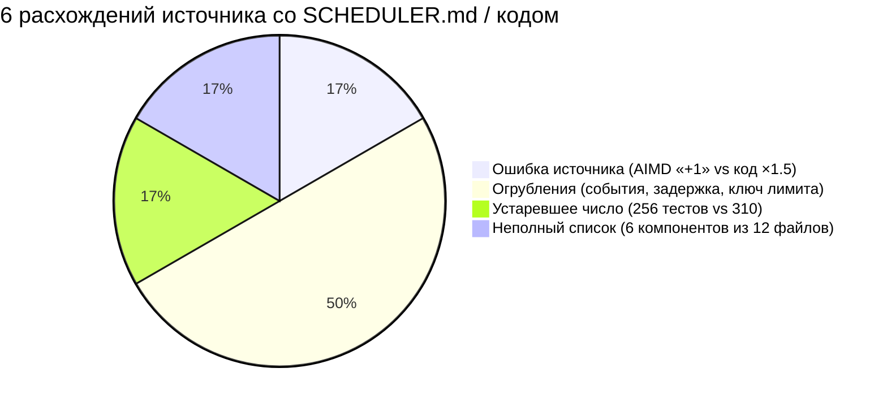
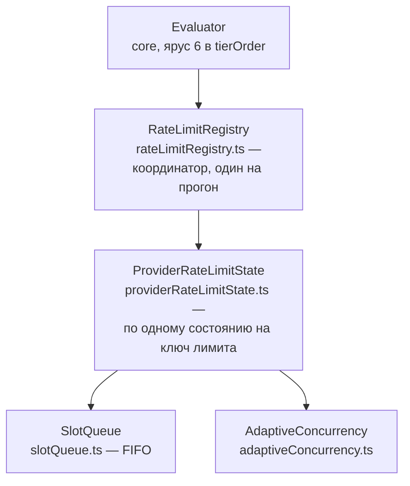
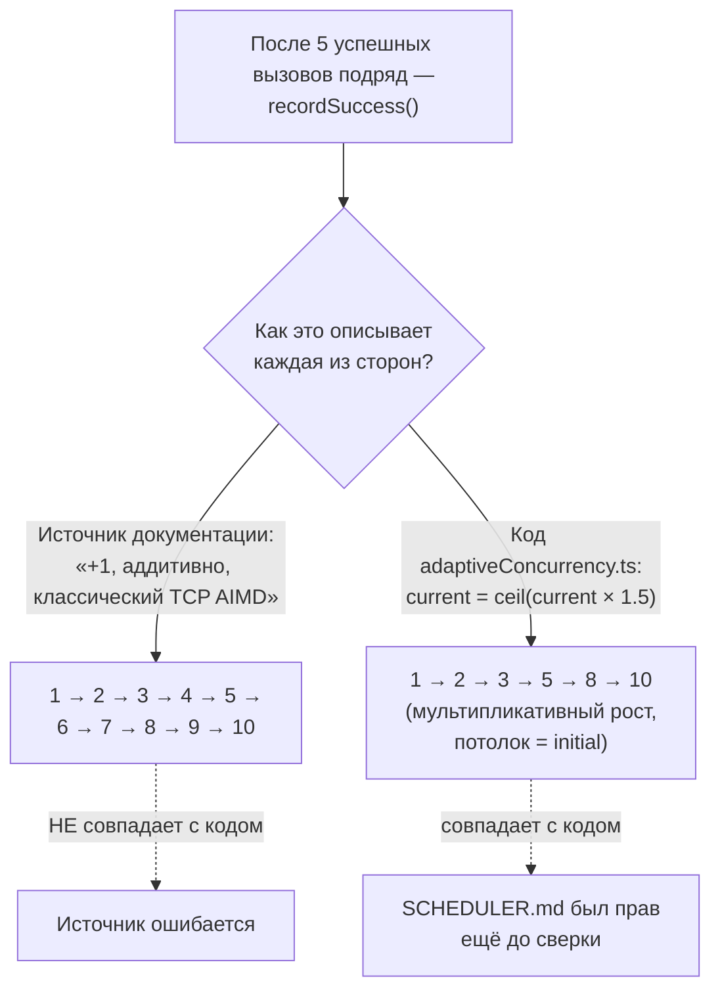

# Сверка с первоисточником — `docs/scheduler-architecture.md`

> Разбор через призму **Domain-Driven Design**. Диаграммы — ANSI-псевдографика.
> Дополняет [SCHEDULER.md](SCHEDULER.md), [PACKAGES-CROSSCHECK.md](PACKAGES-CROSSCHECK.md),
> [ARCHITECTURE.md](ARCHITECTURE.md).
>
> Второй документ жанра «сверка с источником». Первый ([PACKAGES-CROSSCHECK.md](PACKAGES-CROSSCHECK.md))
> нашёл ошибку в собственном анализе серии. Этот нашёл ошибку **в самом источнике** —
> и подтвердил её напрямую в исходном коде, а не на слово ни одной из сторон.

---

## 0. Паспорт

```
╔══════════════════════════════════════════════════════════════════════════════╗
║  docs/scheduler-architecture.md — авторское описание планировщика            ║
╠══════════════════════════════════════════════════════════════════════════════╣
║  Строк .................... 228                                              ║
║  Разделов .................. 11    overview · design goals · architecture ·  ║
║                                    components · data flow · key generation · ║
║                                    design decisions · metrics · events ·     ║
║                                    testing · performance                     ║
║  Компонентов названо ........ 6    из 12 реально существующих файлов         ║
╠══════════════════════════════════════════════════════════════════════════════╣
║  Метод ..................... построчная сверка с SCHEDULER.md + прямая       ║
║                              проверка спорных мест в исходном коде           ║
║  Найдено расхождений ........ 6    1 ошибка источника · 1 устаревшее число · ║
║                                    1 неполный список · 3 огрубления          ║
╚══════════════════════════════════════════════════════════════════════════════╝
```

Шесть найденных расхождений как Mermaid-диаграмма:



**Своими словами.** Представь ревизию склада, где сверяют старую
опись с тем, что реально стоит на полках. Из шести найденных
расхождений только ОДНО — настоящая ошибка в описи: кладовщик
написал не тот вес товара, и вес этот противоречит даже собственной
инструкции по подсчёту, приклеенной к той же полке. Половина находок
(три из шести) — не ошибки, а огрубления: опись честно упомянула
товар, просто описала его менее подробно, чем он есть на самом деле
(назвала часть содержимого коробки, но не всё; округлила диапазон
цены до одного числа). Ещё одна находка — просто устаревшая цифра:
опись писалась раньше, товара с тех пор прибыло, и разница объясняется
не ошибкой, а временем. И последняя — опись составлена ДО того, как
на склад завезли новую партию полок, поэтому шести полок из
двенадцати в ней попросту нет — не потому что их забыли посчитать,
а потому что их физически ещё не было, когда считали.

Правило метода этого документа отличается от первого сверочного: там, где
источник и `SCHEDULER.md` расходятся, решение выносит **не тот факт, что
источник авторитетнее**, а третий, независимый арбитр — исходный код. Ниже
это буквально так и сделано: там, где расхождение нашлось, следующим шагом
всегда идёт `cat` или `grep` по `src/scheduler/`.

---

## 1. Заявленная архитектура: полное совпадение состава

```
╔══════════════════════════════════════════════════════════════════════════════╗
║  ИСТОЧНИК: диаграмма из 4 уровней       vs      SCHEDULER.md §2 «Место в     ║
║                                                   архитектуре»               ║
╠══════════════════════════════════════════════════════════════════════════════╣
║  Evaluator                                       core (ярус 6 в tierOrder)   ║
║   └─ RateLimitRegistry (координатор,             rateLimitRegistry.ts —      ║
║      один на прогон)                             реестр состояний на прогон  ║
║       └─ ProviderRateLimitState (на ключ)        providerRateLimitState.ts   ║
║            ├─ SlotQueue (FIFO)                   slotQueue.ts — FIFO         ║
║            └─ AdaptiveConcurrency                adaptiveConcurrency.ts      ║
╠══════════════════════════════════════════════════════════════════════════════╣
║  Четыре уровня вложенности совпадают буквально, включая формулировку         ║
║  «один координатор на прогон, по одному состоянию на ключ лимита».           ║
╚══════════════════════════════════════════════════════════════════════════════╝
```

Та же вложенность как Mermaid-диаграмма:



**Своими словами.** Представь call-центр во время одного рабочего дня.
Есть один старший диспетчер на весь день (`RateLimitRegistry` — один
координатор на прогон). У него под рукой отдельная папка на КАЖДУЮ
телефонную линию, с которой сегодня работают (`ProviderRateLimitState`
— по одной на ключ лимита: конкретный провайдер, конкретный API-ключ,
конкретный регион). Внутри каждой папки лежат два инструмента:
список звонков, ожидающих своей очереди строго по порядку поступления
(`SlotQueue` — обычная очередь FIFO, кто раньше встал, тот раньше
и позвонит), и отдельный счётчик, сколько звонков можно вести
одновременно ПО ЭТОЙ линии прямо сейчас (`AdaptiveConcurrency` — он
сам подстраивается под то, как линия себя ведёт). Совпадение источника
документации и материала серии здесь буквальное — оба описывают
ровно эти четыре уровня вложенности одними и теми же словами.

Источник называет шесть компонентов с путями к файлам: `RateLimitRegistry`,
`ProviderRateLimitState`, `SlotQueue`, `AdaptiveConcurrency`, `HeaderParser`,
`RetryPolicy`. Все шесть присутствуют в `SCHEDULER.md` под теми же путями.

---

## 2. Найдена ошибка источника: «Increase by 1» противоречит коду

Источник в разделе «Design Decisions» и в описании `AdaptiveConcurrency`
формулирует алгоритм восстановления конкурентности так:

```
╔══════════════════════════════════════════════════════════════════════════════╗
║  docs/scheduler-architecture.md, дословно:                                   ║
║                                                                              ║
║  «On sustained success: Increase by 1 (additive increase)»                   ║
║                                                                              ║
║  «This implements AIMD (Additive Increase, Multiplicative Decrease) —        ║
║   the same algorithm TCP uses for congestion control.»                       ║
╚══════════════════════════════════════════════════════════════════════════════╝
```

`SCHEDULER.md §6` утверждал обратное — мультипликативный рост, ×1.5 — ещё до
этой сверки. Прямая проверка `src/scheduler/adaptiveConcurrency.ts` решает
спор однозначно:

```
   const RECOVERY_FACTOR = 1.5; // +50% on recovery

   recordSuccess() {
     …
     this.current = Math.min(this.initial, Math.ceil(this.current * RECOVERY_FACTOR));
     …
   }

   /**
    * Recovery path with constants (initial=10, min=1):
    * 1 → ceil(1.5) = 2   (5 successes)
    * 2 → ceil(3.0) = 3   (5 successes)
    * 3 → ceil(4.5) = 5   (5 successes)
    * 5 → ceil(7.5) = 8   (5 successes)
    * 8 → ceil(12) = 10   (5 successes, capped at initial)
    */
```

```
╔══════════════════════════════════════════════════════════════════════════════╗
║  ВЕРДИКТ                                                                     ║
╠══════════════════════════════════════════════════════════════════════════════╣
║  Код: умножение на 1.5 (мультипликативный рост).                             ║
║  SCHEDULER.md: писал «×1.5» ДО сверки — совпадает с кодом.                   ║
║  Источник: пишет «+1» и называет это классическим TCP AIMD — НЕ совпадает    ║
║  с кодом ни по формуле, ни по названию алгоритма (реализация — MIMD,         ║
║  мультипликативный рост / мультипликативное снижение, не AIMD).              ║
║                                                                              ║
║  Путь восстановления 1→2→3→5→8→10 (комментарий в самом коде) НЕ совпадает    ║
║  с тем, что дало бы аддитивное +1: 1→2→3→4→5→6→7→8→9→10. Комментарий         ║
║  в исходнике сам себе противоречит источнику документации.                   ║
╚══════════════════════════════════════════════════════════════════════════════╝
```

Тот же спор как Mermaid-диаграмма:



**Своими словами.** Представь, что два свидетеля описывают, как быстро
разгоняется один и тот же велосипедист после долгого спуска, а судья
(исходный код) может просто пересчитать секундомер сам. Один свидетель
(авторская заметка) говорит: «он каждый раз прибавляет ровно одну
и ту же скорость» — плавный, равномерный разгон, шаг за шагом,
1-2-3-4-5…, и даже называет это узнаваемым спортивным термином.
Второй свидетель (`SCHEDULER.md`, написанный по факту чтения кода) 
говорит другое: «он каждый раз ускоряется на 50% от ТЕКУЩЕЙ скорости»
— то есть чем быстрее уже едет, тем сильнее скачок вперёд на этом шаге:
1-2-3-5-8-10. Секундомер (код) подтверждает второго свидетеля дословно,
вплоть до закомментированной таблицы прямо в исходнике. Первый
свидетель не просто округлил — он назвал ДРУГОЙ, более известный
механизм разгона, которого на самом деле не было. Показательно, что
серия документов здесь ничего не переписывает: `SCHEDULER.md` был
точен и до этой проверки, потому что писался по секундомеру, а не
по пересказу свидетеля.

Ошибка не техническая мелочь: «AIMD, как в TCP» — устоявшийся термин с
конкретным математическим смыслом (константный прирост, кратное снижение).
То, что реализовано в promptfoo, — мультипликативный рост при мультипликативном
снижении, что даёт **более быстрое восстановление** при бóльших значениях
конкурентности (рост на 50% от 8 — это +4, а не +1) ценой меньшей теоретической
устойчивости, чем у классического TCP AIMD. Читатель, поверивший авторской
заметке на слово, унёс бы неверную ментальную модель поведения системы под
нагрузкой.

**`SCHEDULER.md` правки не требует** — он был точен ещё до этой сверки,
потому что математика восстановления была прочитана напрямую из
`adaptiveConcurrency.ts`, а не пересказана из чужого описания.

---

## 3. Источник неполон, но не ошибается: три случая огрубления

```
╔══════════════════════════════════════════════════════════════════════════════╗
║  СЛУЧАЙ 1 · События: источник называет 8, код эмитит 12                      ║
╠══════════════════════════════════════════════════════════════════════════════╣
║   Источник перечисляет: slot:acquired/released, ratelimit:hit/learned/       ║
║   warning, concurrency:increased/decreased, request:retrying — 8 имён.       ║
║                                                                              ║
║   grep -rhoE "emit\('[a-z:]+'" src/scheduler/*.ts | sort -u → 12 совпадений: ║
║   те же 8, плюс request:started, request:completed, request:failed,          ║
║   queue:timeout.                                                             ║
║                                                                              ║
║   SCHEDULER.md §10 «Наблюдаемость: двенадцать событий» уже перечислял        ║
║   все 12 — источник не ошибается, а иллюстрирует «для примера», не           ║
║   заявляя исчерпывающего списка.                                             ║
╠══════════════════════════════════════════════════════════════════════════════╣
║  СЛУЧАЙ 2 · «Default retry delay: 60 seconds» — это потолок, не задержка     ║
╠══════════════════════════════════════════════════════════════════════════════╣
║   DEFAULT_RETRY_POLICY = { maxRetries: 3, baseDelayMs: 1000,                 ║
║                            maxDelayMs: 60000, jitterFactor: 0.2 }            ║
║                                                                              ║
║   60 секунд — ЭТО ПОТОЛОК экспоненциального роста (baseDelayMs × 2^attempt), ║
║   а не задержка по умолчанию. Первый повтор ждёт около 1 секунды плюс        ║
║   джиттер, не 60. SCHEDULER.md §8 уже писал «база 1 с · потолок 60 с» —      ║
║   различие сохранено верно ещё до сверки.                                    ║
╠══════════════════════════════════════════════════════════════════════════════╣
║  СЛУЧАЙ 3 · Ключ лимита: источник называет 3 компонента, код использует 5    ║
╠══════════════════════════════════════════════════════════════════════════════╣
║   Источник: «Provider ID + API key hash + Organization ID».                  ║
║                                                                              ║
║   rateLimitKey.ts: providerId, apiKeyTail (последние 4 символа, НЕ хеш       ║
║   всего ключа), apiBaseUrl, region, organization — пять полей, хешируемых    ║
║   вместе в SHA-256, от которого берутся первые 12 hex-символов.              ║
║                                                                              ║
║   apiBaseUrl и region не названы источником вовсе. SCHEDULER.md §3 уже       ║
║   перечислял все пять полей до сверки, включая точное «последние четыре      ║
║   символа», а не «хеш ключа».                                                ║
╚══════════════════════════════════════════════════════════════════════════════╝
```

Общая форма всех трёх случаев одинакова: источник даёт **иллюстративный**,
не исчерпывающий список для читателя, впервые знакомящегося с модулем; серия
писала `SCHEDULER.md` по факту чтения исходного кода компонент за компонентом,
и там, где источник срезал угол, у серии угла срезано не было.

---

## 4. Число, устаревшее со временем: «256 тестов»

```
╔══════════════════════════════════════════════════════════════════════════════╗
║  Источник: «256 tests covering: unit tests for each component, edge cases,   ║
║  race condition prevention, integration with evaluator.»                     ║
╠══════════════════════════════════════════════════════════════════════════════╣
║  Живой подсчёт на коммите 2c140ef:                                           ║
║    grep -rhoE '\b(it|test)\(' test/scheduler/*.ts | wc -l → 310              ║
║    10 файлов, 4871 строка — ТОЧНО те же числа, что SCHEDULER.md §13          ║
║    цитировал независимо, до этой сверки.                                     ║
╠══════════════════════════════════════════════════════════════════════════════╣
║  310 vs 256 — не ошибка источника, а его возраст. Разница в 54 теста         ║
║  согласуется со структурной находкой ниже (§5): источник не знает            ║
║  о шести файлах модуля, появившихся позже его написания.                     ║
╚══════════════════════════════════════════════════════════════════════════════╝
```

---

## 5. Источник моложе кода: шесть файлов, которых он не видел

```
   Источник называет 6 компонентов. SCHEDULER.md разбирает 12 файлов
   модуля. Разница — не пропуск, а хронология: следующие шесть файлов
   не упомянуты источником НИ РАЗУ, даже вскользь:

     providerWrapper.ts              140 строк   обёртка любого провайдера
     types.ts                         86 строк   распознавание лимита/квоты
     providerCallQueue.ts             81 строка   группировка вызовов судьи
     providerCallExecutionContext.ts  75 строк   рантайм-контекст
     rateLimitKey.ts                  50 строк   генерация ключа пула
     index.ts                         47 строк   бочка модуля

   providerCallQueue.ts — особенно красноречивый пропуск: это отдельная
   архитектурная забота (группировка вызовов К ОДНОМУ LLM-СУДЬЕ, а не
   рейт-лимит провайдера) внутри того же каталога. Источник, написанный
   как «Adaptive Rate Limit Scheduler — Architecture», по своему названию
   не обязан её описывать — но её отсутствие подтверждает, что документ
   зафиксирован на более раннем состоянии модуля, а не переписывается
   при каждом расширении.
```

---

## Диагноз

```
╔══════════════════════════════════════════════════════════════════════════════╗
║              ДИАГНОЗ: НАСКОЛЬКО SCHEDULER.md СОВПАЛ С ИСТОЧНИКОМ             ║
╠══════════════════════════════════════════════════════════════════════════════╣
║  ПОДТВЕРЖДЕНО БЕЗ ОГОВОРОК                                                   ║
║                                                                              ║
║  ✔ Архитектура из четырёх уровней (Evaluator → Registry → State →            ║
║    Queue/Concurrency) совпадает буквально, включая «один координатор         ║
║    на прогон, одно состояние на ключ».                                       ║
║                                                                              ║
║  ✔ Все шесть названных источником компонентов присутствуют под теми же       ║
║    путями, что цитирует SCHEDULER.md.                                        ║
║                                                                              ║
║  ✔ Default max concurrency = 4, max retries = 3 — оба числа совпадают        ║
║    буквально между источником, SCHEDULER.md и живым кодом.                   ║
╠══════════════════════════════════════════════════════════════════════════════╣
║  НАЙДЕНА ОШИБКА — НО НЕ В SCHEDULER.md                                       ║
║                                                                              ║
║  ✘ Источник утверждает аддитивный рост «+1» и называет алгоритм              ║
║    классическим TCP AIMD. Код использует мультипликативный рост ×1.5.        ║
║    SCHEDULER.md был точен ещё до сверки — проверка кода на этот раз          ║
║    защитила серию, а не исправила её.                                        ║
╠══════════════════════════════════════════════════════════════════════════════╣
║  ИСТОЧНИК ОГРУБЛЯЕТ ТАМ, ГДЕ SCHEDULER.md ТОЧЕН                              ║
║                                                                              ║
║  ○ 8 событий из 12 — иллюстративный список, не исчерпывающий.                ║
║  ○ «60 секунд задержки» — на деле потолок экспоненты, не сама задержка.      ║
║  ○ «Provider ID + хеш ключа + Org ID» — реально 5 полей, включая             ║
║    apiBaseUrl и region, которых источник не называет вовсе.                  ║
║  ○ «256 тестов» — устарело на 54 теста; источник моложе кода на              ║
║    шесть файлов модуля (providerCallQueue.ts и другие).                      ║
╚══════════════════════════════════════════════════════════════════════════════╝
```

### Что это говорит о методе серии — вторая точка данных

```
   Первая сверка (PACKAGES-CROSSCHECK.md) нашла ошибку В АНАЛИЗЕ СЕРИИ
   и подтвердила ценность чтения авторских заметок ПЕРЕД разбором кода.

   Эта сверка нашла ошибку В САМОЙ АВТОРСКОЙ ЗАМЕТКЕ и подтверждает
   обратное: заметка — не более авторитетный источник, чем код, только
   БЫСТРЕЕ читается. Метод серии — читать код напрямую, а не пересказ
   о коде, — оказался достаточно строгим, чтобы не унаследовать чужую
   ошибку, но одновременно достаточно скромным, чтобы найти собственную
   ошибку в прошлый раз.

   Обе сверки вместе — сильнее одной: они показывают, что метод работает
   в ОБЕ стороны, а не только там, где источник и серия случайно совпадают.
```

---

## Рекомендации по эволюции

Адресованы практике сверки, не коду promptfoo:

1. **Не принимать формулировку «стандартный алгоритм X» на веру.** «Это AIMD,
   как в TCP» — фраза, которая звучит авторитетно и ссылается на общеизвестное
   имя. Именно такие фразы стоит проверять первыми: узнаваемое название —
   не доказательство, что реализация ему соответствует.

2. **При расхождении числа компонентов/событий проверять не только «кто прав»,
   но и «источник моложе или старше кода».** Разница в 54 теста и шесть
   ненайденных файлов здесь читается как хронологический дрейф, а не спор
   фактов — и разница в интерпретации меняет рекомендацию: не «править
   источник», а «TODO на актуализацию источника при следующей правке
   планировщика».

3. **Формулу с числовым потолком (`maxDelayMs`) не пересказывать как
   «значение по умолчанию».** Разница между «до 60 секунд» и «60 секунд»
   меняет ожидания читателя о задержке первого повтора на два порядка.

---

## Карта

```
docs/scheduler-architecture.md ...................... 228   источник
├── Overview / Design Goals ......................... zero-config, AIMD-заявка
├── Architecture (диаграмма 4 уровней) .............. совпадает буквально
├── Component Responsibilities ...................... 6 из 12 файлов
│     RateLimitRegistry · ProviderRateLimitState · SlotQueue ·
│     AdaptiveConcurrency          ← ИСТОЧНИК ОШИБКИ: «+1 additive»
│     HeaderParser · RetryPolicy
├── Data Flow (9 шагов) .............................. соответствует §8 SCHEDULER.md
├── Rate Limit Key Generation ........................ 3 поля названо, реально 5
├── Key Design Decisions (5 пунктов) ................. zero-config, fail-safe,
│                                                       proactive, isolation,
│                                                       transparent — все верны
├── Metrics ........................................... совпадает с ProviderMetrics
├── Events ............................................ 8 названо, реально 12
├── Testing ........................................... «256» — устарело, реально 310
└── Performance Characteristics ...................... circular buffer, O(1) —
                                                          совпадает с SCHEDULER.md §10

Изменённые документы серии по итогам сверки:
    SCHEDULER.md ......................................  БЕЗ ИЗМЕНЕНИЙ — уже точен
    ARCHITECTURE.md ....................................  этот документ добавлен

Ещё не сверенные авторские заметки:
    docs/agents/*.md ................................... 8 файлов, цитировались
                                                            как источник 20+ раз,
                                                            не как предмет
```

---

## Команды

```bash
# Прочитать источник целиком
cat docs/scheduler-architecture.md

# Арбитр спора: формула восстановления конкурентности
cat src/scheduler/adaptiveConcurrency.ts | grep -A3 "RECOVERY_FACTOR ="

# Полный список реально эмитируемых событий (источник истины для §3, §5)
grep -rhoE "emit\('[a-z:]+'" src/scheduler/*.ts | sort -u

# Политика повторов: база vs потолок
grep -A5 "DEFAULT_RETRY_POLICY" src/scheduler/retryPolicy.ts

# Генерация ключа лимита: сколько полей на самом деле
cat src/scheduler/rateLimitKey.ts

# Живой счёт тестов модуля
grep -rhoE "\b(it|test)\(" test/scheduler/*.ts | wc -l

# Файлы модуля, не названные источником
ls src/scheduler/*.ts
```

---

*Документ сверяет `docs/scheduler-architecture.md` с материалом серии на коммите
`2c140ef`, promptfoo 0.122.0. Дата сверки — 29 августа 2026.*
