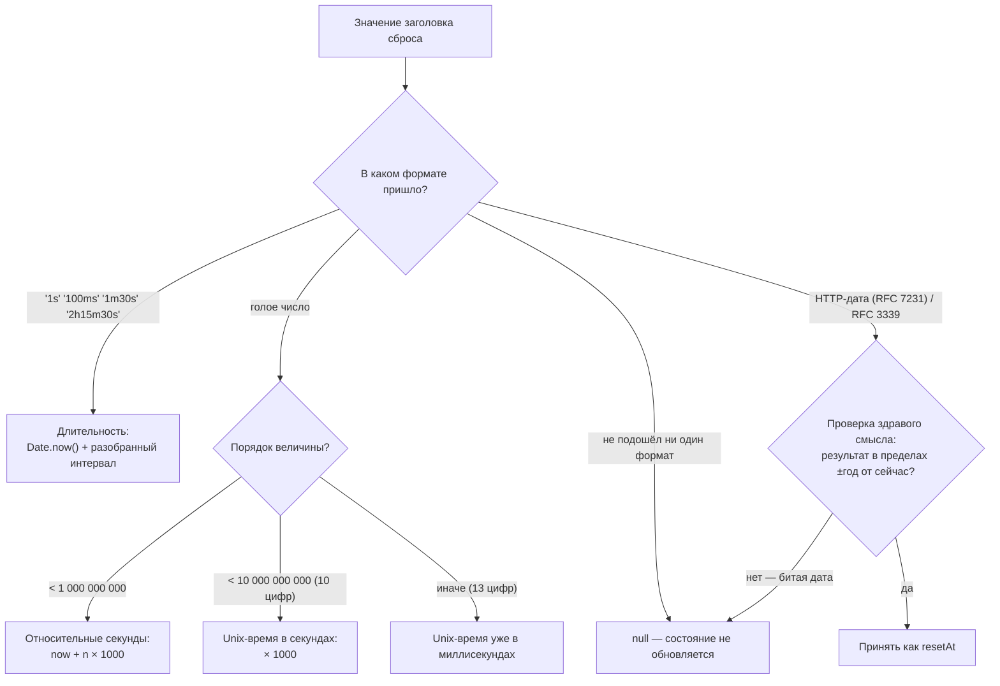
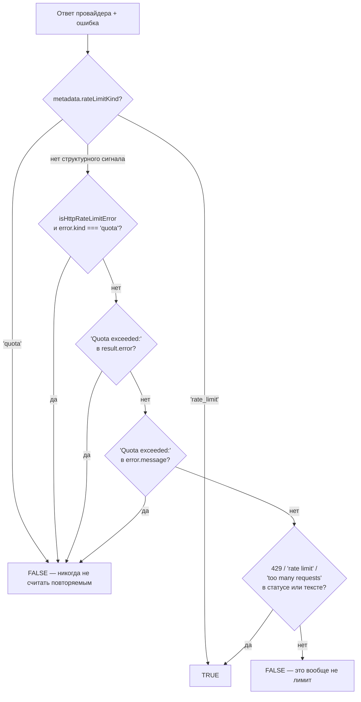
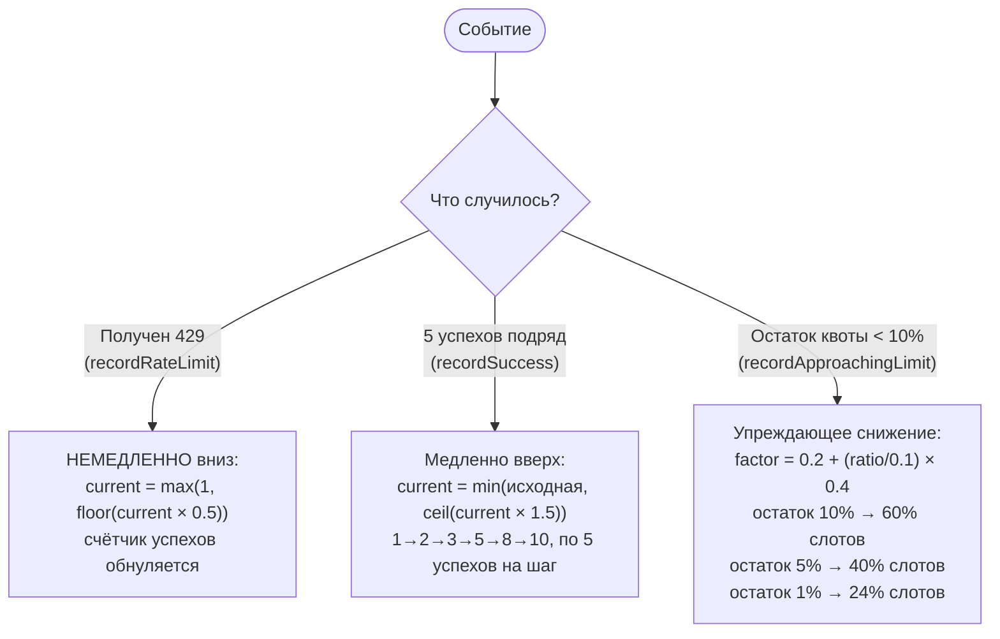
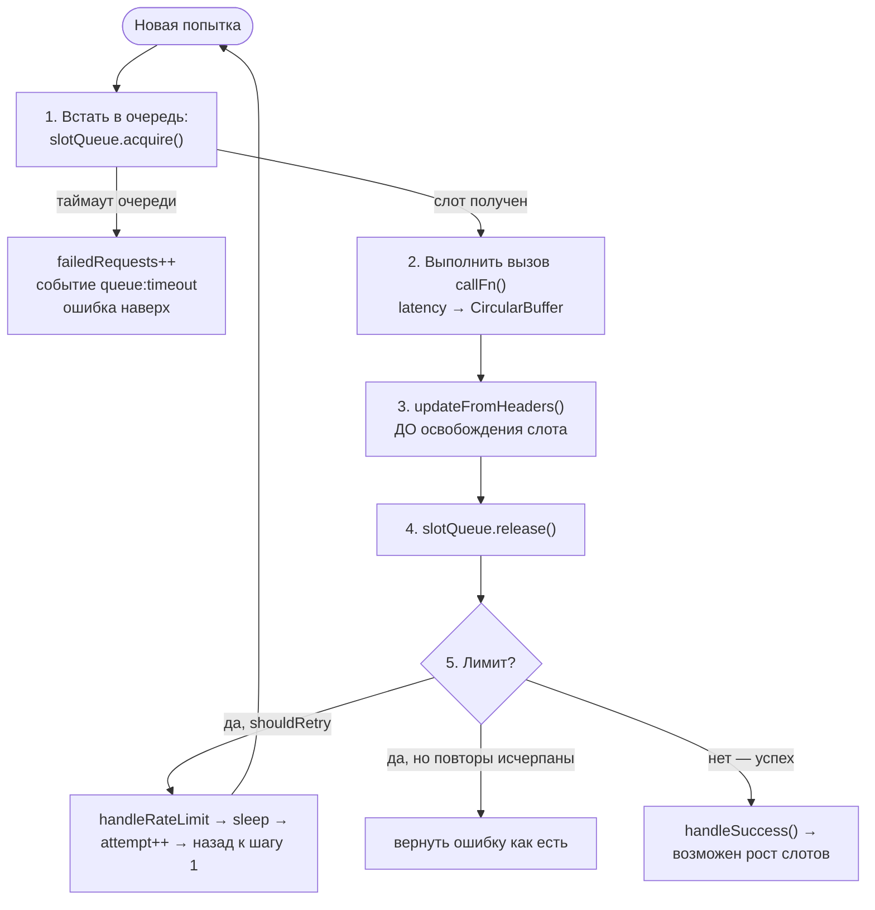

# Планировщик и лимиты частоты — `src/scheduler`

> Разбор через призму **Domain-Driven Design**. Диаграммы — ANSI-псевдографика.
> Дополняет [ARCHITECTURE.md](./ARCHITECTURE.md), [EVALUATOR.md](./EVALUATOR.md),
> [PROVIDERS.md](./PROVIDERS.md), [MATCHERS.md](./MATCHERS.md),
> [ASSERTIONS.md](./ASSERTIONS.md), [PROMPTS.md](./PROMPTS.md),
> [REDTEAM.md](./REDTEAM.md), [SERVER.md](./SERVER.md), [APP.md](./APP.md).

---

## 0. Паспорт подсистемы

```
╔══════════════════════════════════════════════════════════════════════════════╗
║  SCHEDULER — политика нагрузки на мишень как доменное правило                ║
╠══════════════════════════════════════════════════════════════════════════════╣
║  Слой в layers.json     core (ярус 6), вместе с assertions · matchers ·      ║
║                         prompts · testCase                                   ║
║  Объём                  12 файлов · 1 896 строк                              ║
║  Девиз модуля           «Zero configuration required»                        ║
╠══════════════════════════════════════════════════════════════════════════════╣
║  providerRateLimitState.ts   407   состояние и цикл повторов на один ключ    ║
║  slotQueue.ts                304   слоты конкурентности и очередь FIFO       ║
║  headerParser.ts             276   разбор заголовков лимитов                 ║
║  rateLimitRegistry.ts        200   реестр состояний на прогон                ║
║  adaptiveConcurrency.ts      142   алгоритм адаптации                        ║
║  providerWrapper.ts          140   обёртка любого провайдера                 ║
║  retryPolicy.ts               88   политика повторов                         ║
║  types.ts                     86   распознавание лимита и квоты              ║
║  providerCallQueue.ts         81   группировка вызовов одного судьи          ║
║  providerCallExecutionContext 75   рантайм-контекст ниже эвалюатора          ║
║  rateLimitKey.ts              50   ключ пула лимитов                         ║
║  index.ts                     47   барель модуля                             ║
╠══════════════════════════════════════════════════════════════════════════════╣
║  Событий реестра                12                                           ║
║  Форматов заголовков             3 семейства + Retry-After                   ║
║  Переменных окружения            4                                           ║
║  Тесты                  10 файлов · 4 871 строка  (в 2,6 раза больше кода)   ║
╚══════════════════════════════════════════════════════════════════════════════╝
```

**Формулировка предметной области в одном предложении.** Планировщик реализует
правило «не бей по мишени сильнее, чем она разрешает» — причём разрешение
не задаётся конфигурацией, а **вычитывается из ответов** и уточняется по ходу
прогона.

**Почему это домен, а не инфраструктура.** Соблазнительно считать ограничение
частоты технической деталью транспорта. Но политика нагрузки принадлежит
**процессу оценки**, а не вендору: она одинакова для OpenAI и для самописного
HTTP-эндпойнта, она должна учитываться при выборе режима исполнения и она
попадает в телеметрию прогона. Поэтому модуль лежит в `core` рядом с
ассёршенами, а не в `providers`.

---

## 1. Единый язык подсистемы

| Термин | Носитель в коде | Смысл |
|---|---|---|
| **rateLimitKey** | `rateLimitKey.ts:6` | Идентификатор **пула** лимитов. Не провайдер, а пул. |
| **ProviderRateLimitState** | `providerRateLimitState.ts:84` | Всё состояние одного пула: слоты, метрики, политика. |
| **RateLimitRegistry** | `rateLimitRegistry.ts:14` | Карта `ключ → состояние`. **Один на прогон**, не синглтон. |
| **SlotQueue** | `slotQueue.ts:28` | Слоты конкурентности + очередь FIFO ожидающих. |
| **AdaptiveConcurrency** | `adaptiveConcurrency.ts:29` | Алгоритм: сколько слотов держать сейчас. |
| **RetryPolicy** | `retryPolicy.ts` | `maxRetries` · `baseDelayMs` · `maxDelayMs` · `jitterFactor`. |
| **rate_limit vs quota** | `types.ts:32` | Временный лимит против исчерпанного счёта. Оба дают 429. |
| **ParsedRateLimitHeaders** | `headerParser.ts:1` | Нормализованный вид заголовков трёх разных вендоров. |
| **ProviderGroupedCallQueue** | `providerCallQueue.ts` | Собирает вызовы одного судьи в группу. |
| **ProviderCallExecutionContext** | `providerCallExecutionContext.ts` | Рантайм-контекст, **скрытый от провайдеров**. |
| **WRAPPED_SYMBOL** | `providerWrapper.ts:23` | Метка «уже обёрнут» — защита от двойного ограничения. |

---

## 2. Место подсистемы в архитектуре

```
   КТО ИСПОЛЬЗУЕТ ПЛАНИРОВЩИК

     evaluator.ts                 создаёт RateLimitRegistry на прогон,
                                  слушает события, ставит очередь группировки
     matchers/providers.ts        оборачивает вызовы судей теми же лимитами
     assertions/index.ts          читает контекст исполнения, чтобы понизить
                                  конкурентность при активной группировке
     util/fetch/index.ts          использует headerParser на уровне транспорта
     redteam/providers/shared.ts  передаёт реестр агентам атак

   ┌──────────────────────────────────────────────────────────────────────┐
   │  ЕДИНАЯ ТОЧКА ИНТЕГРАЦИИ                                             │
   │                                                                      │
   │  Комментарий в rateLimitRegistry.ts:                                 │
   │    «Отслеживания идемпотентности нет. Каждый вызов независим.        │
   │     ЕДИНСТВЕННАЯ ТОЧКА ИНТЕГРАЦИИ (эвалюатор) гарантирует            │
   │     отсутствие двойной обёртки.»                                     │
   │                                                                      │
   │  Плюс символ WRAPPED_SYMBOL как страховка на случай, когда провайдер │
   │  всё-таки попадает в обёртку дважды: isRateLimitWrapped проверяется  │
   │  и в matchers/providers.ts перед оборачиванием судьи.                │
   │                                                                      │
   │  Двойное ограничение опаснее отсутствия ограничения: два вложенных   │
   │  слот-механизма перемножают задержки и делают расчёт конкурентности  │
   │  бессмысленным.                                                      │
   └──────────────────────────────────────────────────────────────────────┘
```

### 2.1. Сокрытие от провайдеров

```
   ┌───────────────────────────────────────────────────────────────────────┐
   │  ProviderCallExecutionContext                                         │
   │    abortSignal? · providerCallQueue? · rateLimitRegistry?             │
   │                                                                       │
   │  Комментарий объясняет замысел:                                       │
   │    «Рантайм-контекст планировщика для вызовов провайдера ниже         │
   │     эвалюатора. Это держит внутренности планировщика ВНЕ              │
   │     CallApiContextParams, КОТОРЫЙ ПРОВАЙДЕРЫ МОГУТ ИНСПЕКТИРОВАТЬ,    │
   │     позволяя при этом помощникам матчеров переиспользовать отмену     │
   │     и оркестрацию лимитов эвалюатора.»                                │
   ├───────────────────────────────────────────────────────────────────────┤
   │  Информационное сокрытие в чистом виде: провайдер получает            │
   │  CallApiContextParams (переменные, промпт, traceparent) и НЕ ВИДИТ    │
   │  реестра лимитов. Он не может ни обойти очередь, ни изменить          │
   │  конкурентность, ни прочитать состояние соседних провайдеров.         │
   │                                                                       │
   │  Контекст передаётся через AsyncLocalStorage-подобный механизм —      │
   │  getProviderCallExecutionContext() читает его там, где нужно,         │
   │  не протаскивая через сигнатуры.                                      │
   └───────────────────────────────────────────────────────────────────────┘
```

---

## 3. Ключ пула: почему не идентификатор провайдера

```
   getRateLimitKey(provider)  →  'openai:gpt-5[a3f2c81b9e04]'

 ┌─────────────────────────────────────────────────────────────────────────────┐
 │  ЧТО ВХОДИТ В КЛЮЧ                                                          │
 ├─────────────────────────────────────────────────────────────────────────────┤
 │    providerId                     базовый идентификатор                     │
 │    apiKeyTail                     ПОСЛЕДНИЕ ЧЕТЫРЕ СИМВОЛА ключа            │
 │    apiBaseUrl                     свой хост или прокси                      │
 │    region                         регион облака                             │
 │    organization                   организация                               │
 │                                                                             │
 │    Части сортируются по имени, склеиваются и хешируются SHA-256;            │
 │    берутся первые 12 hex-символов (48 бит).                                 │
 │    Если ничего значимого нет — ключом остаётся сам providerId.              │
 ├─────────────────────────────────────────────────────────────────────────────┤
 │  ПОЧЕМУ ХВОСТ КЛЮЧА, А НЕ ВЕСЬ КЛЮЧ                                         │
 │                                                                             │
 │    Комментарий: «безопасный частичный идентификатор». Четырёх символов      │
 │    достаточно, чтобы различить два разных ключа одного вендора, и           │
 │    недостаточно, чтобы восстановить сам ключ, если хеш куда-то утечёт.      │
 │                                                                             │
 │    Тот же принцип, что в гигиене кэша провайдеров (PROVIDERS.md §13):       │
 │    секреты не попадают в долгоживущие ключи.                                │
 ├─────────────────────────────────────────────────────────────────────────────┤
 │  ПОЧЕМУ ЭТО ВАЖНО                                                           │
 │                                                                             │
 │    Правило из AGENTS.md: «держите ключи лимитов стабильными и               │
 │    достаточно специфичными, чтобы избежать взаимного влияния между          │
 │    провайдерами и моделями».                                                │
 │                                                                             │
 │    Слишком общий ключ  →  два разных аккаунта делят один пул;               │
 │                           лимит одного тормозит другой                      │
 │    Слишком узкий ключ  →  один аккаунт получает несколько пулов;            │
 │                           суммарная нагрузка превышает лимит                │
 └─────────────────────────────────────────────────────────────────────────────┘
```

---

## 4. Разбор заголовков: три диалекта и одна нормализация

```
 ┌─────────────────────────────────────────────────────────────────────────────┐
 │  parseRateLimitHeaders(headers) → ParsedRateLimitHeaders                    │
 ├─────────────────────────────────────────────────────────────────────────────┤
 │                                                                             │
 │   OPENAI_HEADERS      x-ratelimit-remaining-requests                        │
 │                       x-ratelimit-remaining-tokens                          │
 │                       x-ratelimit-limit-requests · -limit-tokens            │
 │                       x-ratelimit-reset-requests · -reset-tokens            │
 │                       ↑ ОТДЕЛЬНЫЕ счётчики запросов и токенов               │
 │                                                                             │
 │   ANTHROPIC_HEADERS   anthropic-ratelimit-*-reset  (RFC 3339)               │
 │                                                                             │
 │   STANDARD_HEADERS    ratelimit-remaining · -limit · -reset                 │
 │                       x-ratelimit-remaining · -limit · -reset (варианты)    │
 │                                                                             │
 │   RETRY-AFTER         retry-after-ms   ← проверяется ПЕРВЫМ (миллисекунды)  │
 │                       retry-after      ← затем (секунды или HTTP-дата)      │
 └─────────────────────────────────────────────────────────────────────────────┘

 ┌─────────────────────────────────────────────────────────────────────────────┐
 │  parseResetTime — четыре формата в одном поле                               │
 ├─────────────────────────────────────────────────────────────────────────────┤
 │                                                                             │
 │   1  ДЛИТЕЛЬНОСТЬ    '1s' · '100ms' · '1m30s' · '2h15m30s'                  │
 │                      → Date.now() + разобранная длительность                │
 │                                                                             │
 │   2  ГОЛОЕ ЧИСЛО     разбирается ПО ПОРЯДКУ ВЕЛИЧИНЫ:                       │
 │                                                                             │
 │        < 1 000 000 000        относительные СЕКУНДЫ → now + n×1000          │
 │        < 10 000 000 000       Unix-время в СЕКУНДАХ (10 цифр) → n×1000      │
 │        иначе                  Unix-время в МИЛЛИСЕКУНДАХ (13 цифр)          │
 │                                                                             │
 │      ┌─────────────────────────────────────────────────────────────┐        │
 │      │  Один и тот же заголовок у разных вендоров означает разное:  │       │
 │      │  «через 60» или «в момент 1735689600». Различить их можно    │       │
 │      │  только по величине — что и делается, с порогами на границах │       │
 │      │  разрядности Unix-времени.                                    │      │
 │      │                                                              │       │
 │      │  Проверка BARE_NUMBER_RE обязательна: без неё parseFloat     │       │
 │      │  съел бы первое число из строки '30 seconds' и вернул 30.    │       │
 │      └─────────────────────────────────────────────────────────────┘        │
 │                                                                             │
 │   3  HTTP-ДАТА       RFC 7231, плюс RFC 3339 от Anthropic                   │
 │                      + ПРОВЕРКА ЗДРАВОГО СМЫСЛА: результат принимается      │
 │                        только в пределах ±год от текущего момента           │
 │                        ↑ отсекает эпоху 1970 и явно битые значения          │
 │                                                                             │
 │   4  не разобралось  →  null, состояние не обновляется                      │
 └─────────────────────────────────────────────────────────────────────────────┘
```

Та же логика разбора времени сброса как Mermaid-диаграмма:



**Своими словами.** Представь администратора на ресепшене отеля, где гости
называют время заезда каждый на свой манер, и никто не подписывает единицы
измерения. Один гость говорит «через полтора часа» — это понятно сразу и
превращается в конкретную минуту на часах ресепшена (длительность). Другой
называет голое число, например 1735689600, и не говорит, что это —
через сколько секунд, или дата по календарю, или что-то ещё точнее.
Администратор не гадает, а смотрит на РАЗМЕР числа: маленькое число — это
явно «через сколько-то», число из десяти цифр — дата в секундах (так
раньше по привычке считали время компьютеры), а совсем длинное, из
тринадцати цифр, — та же дата, только в миллисекундах. Третий гость
называет обычную календарную дату словами — её тоже разбирают, но потом
обязательно сверяют со здравым смыслом: если получился 1970 год или другая
нелепость, дата не принимается — это явно ошибка речи, а не настоящий
адрес во времени. Если ни один вариант не подошёл — администратор
разводит руками и ничего не записывает, вместо того чтобы записать
наугад неверное время и подвести следующего гостя.

---

## 5. Различие, которого нет в HTTP: лимит против квоты

Оба состояния возвращают `429`. Но повторять запрос при исчерпанной квоте
означает бить по счёту, на котором кончились деньги.

```
 ┌─────────────────────────────────────────────────────────────────────────────┐
 │  isProviderResponseRateLimited(result, error)   types.ts:32                 │
 │  Возвращает true только для ПОВТОРЯЕМОГО лимита                             │
 ├─────────────────────────────────────────────────────────────────────────────┤
 │                                                                             │
 │  ПОРЯДОК ПРОВЕРОК — от структурного сигнала к строковому:                   │
 │                                                                             │
 │   1  result.metadata.rateLimitKind === 'quota'      →  FALSE  никогда       │
 │   2  result.metadata.rateLimitKind === 'rate_limit' →  TRUE                 │
 │   3  isHttpRateLimitError(error) && error.kind === 'quota'  →  FALSE        │
 │   4  result.error содержит 'Quota exceeded:'        →  FALSE                │
 │   5  error.message содержит 'Quota exceeded:'       →  FALSE                │
 │   ──────────────────────────────────────────────────────────────────        │
 │   6  http.status === 429                            ┐                       │
 │      result.error содержит '429' или 'rate limit'   ├→  TRUE                │
 │      error.message содержит '429', 'rate limit'     │                       │
 │        или 'too many requests'                      ┘                       │
 │                                                                             │
 │  ┌───────────────────────────────────────────────────────────────────┐      │
 │  │  Комментарий называет вещи своими именами:                        │      │
 │  │                                                                    │     │
 │  │  «Жёсткие отказы по квоте (исчерпание оплаты, дневные лимиты)      │     │
 │  │   совпадают с теми же подстроками 429 / too many requests, но НЕ   │     │
 │  │   ДОЛЖНЫ классифицироваться как повторяемые — это УСИЛИВАЕТ        │     │
 │  │   нагрузку на исчерпанный аккаунт, ровно та регрессия, которую     │     │
 │  │   PR 8896 закрывает на транспортном уровне.»                       │     │
 │  │                                                                    │     │
 │  │  Подстрока 'Quota exceeded:' — часть контракта форматтера ошибок,  │     │
 │  │  а не случайное совпадение. Проверка на вхождение, а не на начало  │     │
 │  │  строки, потому что провайдеры оборачивают её в префиксы вида      │     │
 │  │  'API call error: HttpRateLimitError: Quota exceeded: …'.          │     │
 │  └───────────────────────────────────────────────────────────────────┘      │
 ├─────────────────────────────────────────────────────────────────────────────┤
 │  То же различие повторено в shouldRetry (retryPolicy.ts):                   │
 │    структурная проверка на quota стоит ПЕРЕД веткой повтора лимита,         │
 │    потому что isRateLimited мог оказаться true по строковому совпадению.    │
 └─────────────────────────────────────────────────────────────────────────────┘
```

Тот же порядок проверок как Mermaid-диаграмма:



**Своими словами.** Представь банкомат, который отказал в выдаче денег,
и человека рядом, который решает — стоит подойти к этому же банкомату
через пять минут ещё раз или нет. Сначала он смотрит на официальную
табличку на экране банкомата, если она есть: «превышен дневной лимит
снятия» — это не про пустой счёт, значит табличка прямо говорит «TRUE,
можно повторить позже». А вот табличка «счёт заблокирован» или «на счету
недостаточно средств» — значит дело не в лимите вообще, и возвращаться
бессмысленно, это твёрдое «FALSE», причём проверяется в первую очередь.
Если официальной таблички на экране нет — приходится читать смятый чек,
который выплюнул банкомат, и искать там слова по смыслу: если в тексте
чека нашлось «превышена квота» — тоже FALSE, даже если рядом стоит слово
«лимит» или код 429, потому что жёсткий отказ по деньгам НЕ должен
выглядеть как повод постучаться ещё раз — иначе получится, что человек
долбит в закрытую дверь пустого сейфа. И только если ни таблички, ни
характерной фразы про квоту нет, а на чеке всё-таки мелькает «429» или
«слишком много попыток» — тогда, и только тогда, ответ TRUE: это временный
затор, а не закрытый счёт. Порядок проверки — от самого надёжного
источника информации (таблички) к самому ненадёжному (обрывку текста на
чеке) — намеренный: доверять тексту, только когда нечему больше верить.

---

## 6. Алгоритм адаптации

```
 ┌─────────────────────────────────────────────────────────────────────────────┐
 │  AdaptiveConcurrency — три события, три реакции                             │
 ├─────────────────────────────────────────────────────────────────────────────┤
 │                                                                             │
 │  КОНСТАНТЫ                                                                  │
 │    BACKOFF_FACTOR      0.5    вдвое вниз при 429                            │
 │    RECOVERY_FACTOR     1.5    +50 % при восстановлении                      │
 │    RECOVERY_THRESHOLD  5      успехов подряд до попытки роста               │
 │    WARNING_THRESHOLD   0.1    10 % остатка → упреждающее снижение           │
 │    MIN_CONCURRENCY     1                                                    │
 ├─────────────────────────────────────────────────────────────────────────────┤
 │  recordRateLimit()   — НЕМЕДЛЕННО ВНИЗ                                      │
 │      current = max(min, floor(current × 0.5))                               │
 │      счётчик успехов обнуляется                                             │
 ├─────────────────────────────────────────────────────────────────────────────┤
 │  recordSuccess()     — МЕДЛЕННО ВВЕРХ                                       │
 │      после 5 успехов подряд:                                                │
 │      current = min(initial, ceil(current × 1.5))                            │
 │                                                                             │
 │      Путь восстановления с 1 до 10 расписан в комментарии:                  │
 │        1 → 2 → 3 → 5 → 8 → 10,  по 5 успехов на шаг                         │
 │        ИТОГО 25 запросов на полное восстановление                           │
 │                                                                             │
 │      Асимметрия намеренная: падать быстро, подниматься осторожно.           │
 │      Потолком служит ИСХОДНАЯ конкурентность — планировщик никогда          │
 │      не превышает то, что задал пользователь.                               │
 ├─────────────────────────────────────────────────────────────────────────────┤
 │  recordApproachingLimit(ratio)  — УПРЕЖДАЮЩЕЕ СНИЖЕНИЕ                      │
 │                                                                             │
 │      Срабатывает, когда остаток квоты падает ниже 10 %.                     │
 │      Линейная шкала:  factor = 0.2 + (ratio / 0.1) × 0.4                    │
 │                                                                             │
 │        остаток 10 %  →  оставить 60 % конкурентности                        │
 │        остаток  5 %  →  оставить 40 %                                       │
 │        остаток  1 %  →  оставить 24 %                                       │
 │                                                                             │
 │      ┌───────────────────────────────────────────────────────────────┐      │
 │      │  Это главное отличие от обычного экспоненциального отката:    │      │
 │      │  снижение происходит ДО получения 429, по остатку из          │      │
 │      │  заголовков. Прогон не бьётся в стену, а тормозит на подходе. │      │
 │      └───────────────────────────────────────────────────────────────┘      │
 └─────────────────────────────────────────────────────────────────────────────┘
```

Три события и три реакции как Mermaid-диаграмма:



**Своими словами.** Представь водителя на трассе с круиз-контролем и
датчиком топлива вместо обычного газа и тормоза. Если радар мигнул
красным — это 429 — водитель не плавно сбрасывает скорость, а сразу и
резко жмёт по тормозу, срезая скорость пополам, и забывает, сколько до
этого ехал спокойно (счётчик успехов обнулился). Если пять контрольных
точек подряд проехали без единого мигания — то есть система убедилась,
что дорога свободна не один раз, а пять раз кряду — только тогда водитель
осторожно прибавляет газу, и не абы как, а фиксированным шагом (в
полтора раза), никогда не превышая ту скорость, с которой начал поездку.
Но есть и третий, самый интересный случай — водитель смотрит на датчик
топлива (остаток квоты по заголовкам ответа), и как только он падает
ниже 10%, начинает СБАВЛЯТЬ ход сам, заранее, ещё до того, как двигатель
заглохнет: чем меньше топлива в баке, тем сильнее сбавляет — на 10%
топлива едет на 60% скорости, а на 1% топлива — уже почти ползком, на
24%. Разница между этим и обычным «ударился — притормозил» именно в том,
что тут тормозят, ГЛЯДЯ НА СТРЕЛКУ ПРИБОРА, а не дожидаясь, пока машина
заглохнет посреди дороги.

---

## 7. Слоты и очередь

```
 ┌─────────────────────────────────────────────────────────────────────────────┐
 │  SlotQueue — слоты конкурентности с очередью FIFO                           │
 ├─────────────────────────────────────────────────────────────────────────────┤
 │                                                                             │
 │  ЗАЩИТА ОТ ГОНОК, сформулированная в комментарии класса:                    │
 │    • ВСЯ выдача слотов идёт через очередь                                   │
 │    • processQueue() синхронен и выполняется атомарно                        │
 │    • между проверкой ёмкости и инкрементом НЕТ await                        │
 │                                                                             │
 │  Даже когда слот свободен, запрос всё равно СНАЧАЛА кладётся в очередь,     │
 │  а затем немедленно вызывается processQueue(). Единый путь вместо           │
 │  двух — быстрого и медленного — исключает состояние гонки в принципе.       │
 ├─────────────────────────────────────────────────────────────────────────────┤
 │  ТАЙМАУТ ОЖИДАНИЯ В ОЧЕРЕДИ — 5 минут по умолчанию                          │
 │    PROMPTFOO_SCHEDULER_QUEUE_TIMEOUT_MS, 0 отключает                        │
 │    Истёкший запрос удаляется из очереди и отклоняется с внятным текстом.    │
 │    Такие отказы считаются как failedRequests в метриках.                    │
 ├─────────────────────────────────────────────────────────────────────────────┤
 │  isQuotaExhausted() — ПЕРВЫМ ДЕЛОМ ЧИСТИТ УСТАРЕВШЕЕ СОСТОЯНИЕ              │
 │                                                                             │
 │    if (resetAt && now >= resetAt) {                                         │
 │      remainingRequests = null; remainingTokens = null; resetAt = null       │
 │      return false                    ← окно прошло, квота снова есть        │
 │    }                                                                        │
 │                                                                             │
 │    Затем проверяются ОБА счётчика — запросов и токенов — и каждый           │
 │    только вместе с ещё не наступившим resetAt. Исчерпание без известного    │
 │    времени сброса НЕ блокирует очередь: иначе прогон завис бы навсегда.     │
 ├─────────────────────────────────────────────────────────────────────────────┤
 │  scheduleResetProcessing() — ТАЙМЕР НА МОМЕНТ СБРОСА                        │
 │    Ставится, только если есть ожидающие. По срабатыванию чистит             │
 │    исчерпанное состояние и разбирает очередь. Опроса нет — ровно один       │
 │    таймер на окно.                                                          │
 └─────────────────────────────────────────────────────────────────────────────┘
```

---

## 8. Цикл повтора

```
 executeWithRetry(requestId, callFn, options)     providerRateLimitState.ts:127

 ┌─────────────────────────────────────────────────────────────────────────────┐
 │  while (true) {                                                             │
 │    ┌─────────────────────────────────────────────────────────────────┐      │
 │    │ 1  await slotQueue.acquire(`${requestId}-${attempt}`)            │     │
 │    │      сбой (таймаут очереди) → failedRequests++, событие          │     │
 │    │      queue:timeout, проброс наверх                               │     │
 │    ├─────────────────────────────────────────────────────────────────┤      │
 │    │ 2  result = await callFn()                                       │     │
 │    │      latency в CircularBuffer                                     │    │
 │    ├─────────────────────────────────────────────────────────────────┤      │
 │    │ 3  updateFromHeaders(headers)   ДО release()                     │     │
 │    │      ↑ порядок важен: следующий запрос из очереди должен         │     │
 │    │        увидеть свежий остаток квоты, а не устаревший             │     │
 │    ├─────────────────────────────────────────────────────────────────┤      │
 │    │ 4  slotQueue.release()                                           │     │
 │    ├─────────────────────────────────────────────────────────────────┤      │
 │    │ 5  isRateLimited?  →  handleRateLimit(retryAfterMs)              │     │
 │    │                       shouldRetry?  →  sleep, attempt++, снова   │     │
 │    │                       иначе         →  вернуть как есть          │     │
 │    │      успех         →  handleSuccess() → возможен рост слотов     │     │
 │    └─────────────────────────────────────────────────────────────────┘      │
 │  }                                                                          │
 └─────────────────────────────────────────────────────────────────────────────┘
```

Тот же цикл как Mermaid-диаграмма:



**Своими словами.** Представь очередь на паспортном контроле в аэропорту,
где каждый пассажир проходит одну и ту же последовательность шагов.
Сначала — встать в очередь к свободной кабинке (шаг 1); если простоял
слишком долго и так и не дождался — уходишь ни с чем, регистрируя отказ
(таймаут очереди). Дождался — проходишь саму проверку у офицера (шаг 2,
собственно вызов). Ещё не отойдя от окошка, офицер обновляет табло с
текущей обстановкой — сколько кабинок свободно, какая загрузка — и делает
это ДО того, как ты физически освободил место перед стойкой (шаг 3
раньше шага 4): следующий в очереди должен увидеть свежие цифры на табло,
а не вчерашние. Только после этого ты отходишь от стойки, освобождая её
для следующего (шаг 4). И только теперь выясняется главное — офицер
разворачивает тебя на дополнительную проверку (лимит) или пропускает
дальше. Если развернул, но по правилам можно попробовать ещё раз — ты
уходишь в конец очереди и повторяешь весь путь заново, только уже
подождав в сторонке (sleep, attempt++). Если развернул, а попытки
кончились — сегодня прохода не будет, идёшь с этим фактом на выход.
А если пропустили сразу — считается, что кабинка справилась хорошо,
и это тихо намекает системе, что можно чуть смелее открывать соседние
кабинки (рост слотов).

```
 ┌─────────────────────────────────────────────────────────────────────────────┐
 │  getRetryDelay — сервер важнее формулы                                      │
 ├─────────────────────────────────────────────────────────────────────────────┤
 │    serverRetryAfterMs указан?                                               │
 │        === 0   →  0, повтор немедленно                                      │
 │        > 0     →  serverRetryAfterMs + джиттер, но не больше maxDelayMs     │
 │    иначе                                                                    │
 │        baseDelayMs × 2^attempt + джиттер,  не больше maxDelayMs             │
 │                                                                             │
 │    DEFAULT_RETRY_POLICY: 3 повтора · база 1 с · потолок 60 с · джиттер 0.2  │
 │                                                                             │
 │    Джиттер помечен в типе комментарием «предотвращает стадный эффект»:      │
 │    без него все параллельные запросы, получившие 429 одновременно,          │
 │    проснулись бы в один и тот же момент и снова упёрлись бы в лимит.        │
 ├─────────────────────────────────────────────────────────────────────────────┤
 │  maxRetriesOverride — точечная замена, а не подмена политики                │
 │                                                                             │
 │    Комментарий: «Переопределение НА ОДИН ВЫЗОВ только для maxRetries.       │
 │    Сохраняет остальные поля политики (откат, джиттер), чтобы конфигурация   │
 │    провайдера не могла молча их сбросить.»                                  │
 │                                                                             │
 │    Провайдер вправе сказать «мне хватит одной попытки», но не вправе        │
 │    отключить джиттер и обрушить стадо на чужой пул.                         │
 └─────────────────────────────────────────────────────────────────────────────┘
```

### 8.1. Умножение повторов — названный риск

```
   ┌───────────────────────────────────────────────────────────────────────┐
   │  AGENTS.md, раздел Risk Areas, первым пунктом:                        │
   │                                                                       │
   │    «Проверяйте ВЕСЬ стек повторов, прежде чем менять поведение:       │
   │     повторы планировщика, повторы провайдера и клиента, повторы       │
   │     на уровне fetch и специфичная для провайдера конфигурация         │
   │     ПЕРЕМНОЖАЮТСЯ друг с другом.»                                     │
   │                                                                       │
   │    «Сохраняйте семантику maxRetries: 0 — ноль означает отсутствие     │
   │     повторов НА НАСТРАИВАЕМОМ СЛОЕ.»                                  │
   ├───────────────────────────────────────────────────────────────────────┤
   │  Механизм согласования — withFetchRetryContext(providerMaxRetries, …) │
   │                                                                       │
   │  Он оборачивает вызов даже когда планировщик ОТКЛЮЧЁН:                │
   │    «Даже при отключённом планировщике распространяем контекст         │
   │     повторов, чтобы fetchWithRetries подхватил maxRetries провайдера  │
   │     как значение по умолчанию, а fetchWithProxy отключил повторы      │
   │     транзиентных ошибок при maxRetries: 0.»                           │
   │                                                                       │
   │  То есть выключение адаптивного планировщика не превращает            │
   │  maxRetries: 0 в «повторяй сколько хочешь на уровне транспорта».      │
   └───────────────────────────────────────────────────────────────────────┘
```

---

## 9. Группировка вызовов судьи

Отдельный механизм, не связанный с лимитами: собрать несколько судейств
к одному провайдеру в одну группу.

```
 ┌─────────────────────────────────────────────────────────────────────────────┐
 │  ProviderGroupedCallQueue                                                   │
 ├─────────────────────────────────────────────────────────────────────────────┤
 │                                                                             │
 │   enqueue(providerId, call)                                                 │
 │       const boundCall = AsyncResource.bind(call)                            │
 │       ↑ СОХРАНЕНИЕ АСИНХРОННОГО КОНТЕКСТА через границу очереди:            │
 │         иначе спан трассировки потерялся бы, потому что вызов               │
 │         исполняется позже и в другом стеке                                  │
 │                                                                             │
 │   takeNextGroup(preferredProviderId?)                                       │
 │       Забирает ВСЕ задания одного providerId разом.                         │
 │       Предпочтительный провайдер берётся, если для него есть задания;       │
 │       иначе — провайдер первого задания в очереди.                          │
 │                                                                             │
 │   waitForJob()  ·  hasJobs()  ·  run(job)  ·  notifyWaiters()               │
 │                                                                             │
 │  ┌───────────────────────────────────────────────────────────────────┐      │
 │  │  ПОСЛЕДСТВИЕ, ОПИСАННОЕ В ДРУГИХ ДОКУМЕНТАХ                        │     │
 │  │                                                                    │     │
 │  │  При активной очереди группировки конкурентность ассёршенов        │     │
 │  │  принудительно опускается до 1 (ASSERTIONS.md §8.1): параллельная  │     │
 │  │  отправка переставляет порядок постановки в очередь и РАЗБИВАЕТ    │     │
 │  │  группы одного судьи.                                              │     │
 │  │                                                                    │     │
 │  │  А эвалюатор в этом режиме идёт по отдельной ветви исполнения      │     │
 │  │  runGroupedEvalSteps (EVALUATOR.md §7), где оценка откладывается   │     │
 │  │  через deferGrading.                                               │     │
 │  │                                                                    │     │
 │  │  Один класс на 81 строку задаёт режим работы трёх подсистем.       │     │
 │  └───────────────────────────────────────────────────────────────────┘      │
 └─────────────────────────────────────────────────────────────────────────────┘
```

---

## 10. Наблюдаемость: двенадцать событий

```
   RateLimitRegistry extends EventEmitter

     request:started · request:completed · request:failed
     request:retrying
     ratelimit:hit · ratelimit:learned · ratelimit:warning
     concurrency:increased · concurrency:decreased
     slot:acquired · slot:released
     queue:timeout

   Эвалюатор подписывается на часть из них и пишет в отладочный лог
   (EVALUATOR.md §3), а по завершении прогона выгружает метрики
   в телеметрию.

 ┌─────────────────────────────────────────────────────────────────────────────┐
 │  ProviderMetrics — что известно про каждый пул                              │
 ├─────────────────────────────────────────────────────────────────────────────┤
 │    rateLimitKey · activeRequests · maxConcurrency · queueDepth              │
 │    totalRequests · completedRequests · failedRequests                       │
 │    rateLimitHits · retriedRequests                                          │
 │    avgLatencyMs · p50LatencyMs · p99LatencyMs                               │
 ├─────────────────────────────────────────────────────────────────────────────┤
 │  CircularBuffer для задержек — кольцевой буфер вместо массива               │
 │                                                                             │
 │    push()          O(1)   вместо shift() на O(n)                            │
 │    toSortedArray() O(n log n) только при чтении метрик                      │
 │                                                                             │
 │    Комментарий прямо называет причину: «O(1) вставки вместо O(n) shift()».  │
 │    При десятках тысяч запросов за прогон разница между O(1) и O(n)          │
 │    на каждом ответе перестаёт быть теоретической.                           │
 │                                                                             │
 │    Перцентили считаются по индексу: floor((n-1) × X/100).                   │
 └─────────────────────────────────────────────────────────────────────────────┘
```

---

## 11. Диагноз

```
╔═══════════════════════════════════════════════════════════════════════════╗
║  СИЛЬНЫЕ СТОРОНЫ                                                          ║
╠═══════════════════════════════════════════════════════════════════════════╣
║  ✔ Лимиты ВЫЧИТЫВАЮТСЯ, а не настраиваются. Три диалекта заголовков       ║
║    и четыре формата времени сброса приводятся к одному виду.              ║
║                                                                           ║
║  ✔ Различение временного лимита и исчерпанной квоты — с проверкой         ║
║    структурного сигнала перед строковым и с прямой ссылкой на             ║
║    регрессию, которую это закрывает.                                      ║
║                                                                           ║
║  ✔ Упреждающее снижение по остатку квоты: прогон тормозит НА ПОДХОДЕ      ║
║    к лимиту, а не после удара в него.                                     ║
║                                                                           ║
║  ✔ Асимметрия «падать вдвое, расти в полтора после пяти успехов»          ║
║    с расписанным в комментарии путём восстановления.                      ║
║                                                                           ║
║  ✔ Гонка за слот исключена конструктивно: единый путь через очередь,      ║
║    синхронный processQueue, никаких await между проверкой и захватом.     ║
║                                                                           ║
║  ✔ Обновление состояния из заголовков ДО освобождения слота — следующий   ║
║    запрос видит свежий остаток.                                           ║
║                                                                           ║
║  ✔ Внутренности планировщика скрыты от провайдеров: отдельный             ║
║    рантайм-контекст вместо полей в CallApiContextParams.                  ║
║                                                                           ║
║  ✔ Ключ пула включает хвост API-ключа, а не сам ключ.                     ║
║                                                                           ║
║  ✔ Реестр создаётся НА ПРОГОН, а не глобально — «NOT a singleton»         ║
║    написано прямо в комментарии класса.                                   ║
║                                                                           ║
║  ✔ Умножение повторов названо главным риском в AGENTS.md, и семантика     ║
║    maxRetries: 0 распространяется вниз даже при выключенном               ║
║    планировщике.                                                          ║
║                                                                           ║
║  ✔ Кольцевой буфер задержек — O(1) на вставку.                            ║
║                                                                           ║
║  ✔ Тесты в 2,6 раза объёмнее кода, с отдельным файлом на поведение        ║
║    реестра помимо модульных тестов.                                       ║
╠═══════════════════════════════════════════════════════════════════════════╣
║  СЛАБЫЕ МЕСТА                                                             ║
╠═══════════════════════════════════════════════════════════════════════════╣
║  ✘ Распознавание лимита во многом строковое: '429', 'rate limit',         ║
║    'too many requests', 'Quota exceeded:'. Структурный сигнал             ║
║    rateLimitKind существует, но большинство провайдеров его не            ║
║    выставляют, и работает запасной путь по подстрокам.                    ║
║                                                                           ║
║  ✘ Константы адаптации (0.5 · 1.5 · 5 · 0.1) зашиты в код и не            ║
║    настраиваются. Для мишени с длинным окном лимита пять успехов          ║
║    подряд — слишком быстрый повод для роста.                              ║
║                                                                           ║
║  ✘ Токены и запросы делят ОДИН счётчик конкурентности. Заголовки          ║
║    OpenAI дают раздельные остатки, isQuotaExhausted проверяет оба,        ║
║    но AdaptiveConcurrency оперирует одним числом слотов.                  ║
║                                                                           ║
║  ✘ Восстановление ограничено ИСХОДНОЙ конкурентностью. Если               ║
║    пользователь задал 4, а мишень выдержала бы 40, планировщик            ║
║    этого не узнает: он умеет только опускаться и возвращаться.            ║
║                                                                           ║
║  ✘ providerRateLimitState.ts на 407 строк совмещает состояние лимита,     ║
║    цикл повторов, сбор метрик и кольцевой буфер.                          ║
║                                                                           ║
║  ✘ Ключ запроса содержит Date.now() и Math.random() — для метрик          ║
║    достаточно, но воспроизводимость логов между прогонами теряется.       ║
║                                                                           ║
║  ✘ Группировка вызовов судьи живёт в том же модуле, что и лимиты,         ║
║    хотя решает другую задачу и не связана с ними ни данными,              ║
║    ни состоянием.                                                         ║
╚═══════════════════════════════════════════════════════════════════════════╝
```

### Оценка по осям

```
   Адаптивность              ████████████████████░  9/10   упреждающее снижение
   Устойчивость к гонкам     ████████████████████░  9/10   единый путь через очередь
   Изоляция от провайдеров   ████████████████████░  9/10   скрытый контекст
   Настраиваемость           ████████░░░░░░░░░░░░░  4/10   константы зашиты
   Разделение обязанностей   ██████████████░░░░░░░  7/10   группировка не отсюда
   Наблюдаемость             ████████████████████░  9/10   12 событий + метрики
   Тестируемость             ██████████████████░░░  8/10
```

---

## 12. Рекомендации по эволюции

```
   1 · Вынести ProviderGroupedCallQueue в отдельный модуль.
       Группировка вызовов судьи не имеет отношения к лимитам частоты:
       ни общего состояния, ни общих данных. Её место рядом с матчерами
       или в собственном src/grouping/.

   2 · Сделать константы адаптации настраиваемыми.
       BACKOFF_FACTOR, RECOVERY_FACTOR, RECOVERY_THRESHOLD и
       WARNING_THRESHOLD — параметры политики, а не физические постоянные.
       Мишень с окном лимита в минуту и мишень с окном в сутки требуют
       разной осторожности при росте.

   3 · Разделить счётчики запросов и токенов.
       Заголовки уже дают оба остатка, isQuotaExhausted уже проверяет оба —
       не хватает только раздельного управления слотами. Прогон, упирающийся
       в токены, а не в запросы, сейчас снижает конкурентность целиком.

   4 · Разбить providerRateLimitState.ts:
         RateLimitWindow      состояние окна и заголовки
         RetryExecutor        цикл повторов
         ProviderMetrics      сбор метрик и кольцевой буфер

   5 · Продвигать структурный сигнал rateLimitKind.
       Каждый провайдер, выставивший его, убирает одну строковую эвристику.
       Стоит завести это требованием для новых провайдеров рядом с семью
       обязательными пунктами (PROVIDERS.md §13).

   6 · Рассмотреть режим разведки лимита.
       Необязательный флаг, позволяющий планировщику подниматься ВЫШЕ
       исходной конкурентности, пока не встретит первый 429. Для длинных
       прогонов на щедрых аккаунтах это заметный выигрыш; по умолчанию —
       выключено, потому что противоречит принципу «не превышать заданное».
```

---

## 13. Карта директории

```
src/scheduler/
│
├── AGENTS.md                        Risk Areas: умножение повторов первым пунктом
├── index.ts                     47  барель модуля
│
├── ── ЛИМИТЫ И СОСТОЯНИЕ ────────────────────────────────────────────────
├── rateLimitKey.ts              50  getRateLimitKey — ключ ПУЛА, не провайдера
│                                    providerId + хвост ключа + baseUrl +
│                                    region + organization → SHA-256[:12]
├── headerParser.ts             276  три диалекта заголовков,
│                                    четыре формата времени сброса,
│                                    проверка здравого смысла на HTTP-дате
├── types.ts                     86  isProviderResponseRateLimited
│                                    ↑ различение rate_limit и quota
│                                    getProviderResponseHeaders
├── providerRateLimitState.ts   407  состояние одного пула:
│                                    executeWithRetry · updateFromHeaders
│                                    handleRateLimit · handleSuccess
│                                    CircularBuffer · getMetrics
├── rateLimitRegistry.ts        200  карта ключ → состояние, ОДИН НА ПРОГОН
│                                    EventEmitter на 12 событий
│
├── ── КОНКУРЕНТНОСТЬ ────────────────────────────────────────────────────
├── adaptiveConcurrency.ts      142  recordSuccess · recordRateLimit
│                                    recordApproachingLimit
│                                    0.5 вниз · 1.5 вверх · порог 5 · 10 %
├── slotQueue.ts                304  acquire · release · processQueue
│                                    isQuotaExhausted · scheduleResetProcessing
│                                    таймаут очереди 5 минут
├── retryPolicy.ts               88  getRetryDelay · shouldRetry
│                                    3 повтора · 1 с · 60 с · джиттер 0.2
│
├── ── ИНТЕГРАЦИЯ ────────────────────────────────────────────────────────
├── providerWrapper.ts          140  wrapProviderWithRateLimiting
│                                    WRAPPED_SYMBOL · isRateLimitWrapped
│                                    createProviderRateLimitOptions
├── providerCallExecutionContext.ts  75  рантайм-контекст, СКРЫТЫЙ
│                                        от провайдеров
└── providerCallQueue.ts         81  ProviderGroupedCallQueue
                                     AsyncResource.bind · takeNextGroup

test/scheduler/           10 файлов · 4 871 строка
    adaptiveConcurrency · headerParser · providerRateLimitState
    providerWrapper · rateLimitKey · rateLimitRegistry
    rateLimitRegistry.behavior · retryPolicy · slotQueue · types
```

---

## 14. Команды

```bash
npx vitest run test/scheduler                          # весь набор
npx vitest run test/scheduler/slotQueue.test.ts        # слоты и очередь
npx vitest run test/scheduler/headerParser.test.ts     # разбор заголовков
```

Переменные окружения:

```bash
PROMPTFOO_DISABLE_ADAPTIVE_SCHEDULER   отключить адаптацию целиком
PROMPTFOO_MIN_CONCURRENCY              нижняя граница слотов (по умолчанию 1)
PROMPTFOO_SCHEDULER_QUEUE_TIMEOUT_MS   таймаут ожидания в очереди (5 мин, 0 = выкл)
```

Числа из этого документа воспроизводятся так:

```bash
cat src/scheduler/*.ts | wc -l                                    # 1896
grep -hoE "emit\('[a-z:]+'" src/scheduler/*.ts | sort -u | wc -l  # события
cat test/scheduler/*.ts | wc -l                                   # 4871
```

---

*Документ описывает `src/scheduler` на коммите `2c140ef`, promptfoo 0.122.0.
Дата среза — 26 августа 2026.*
