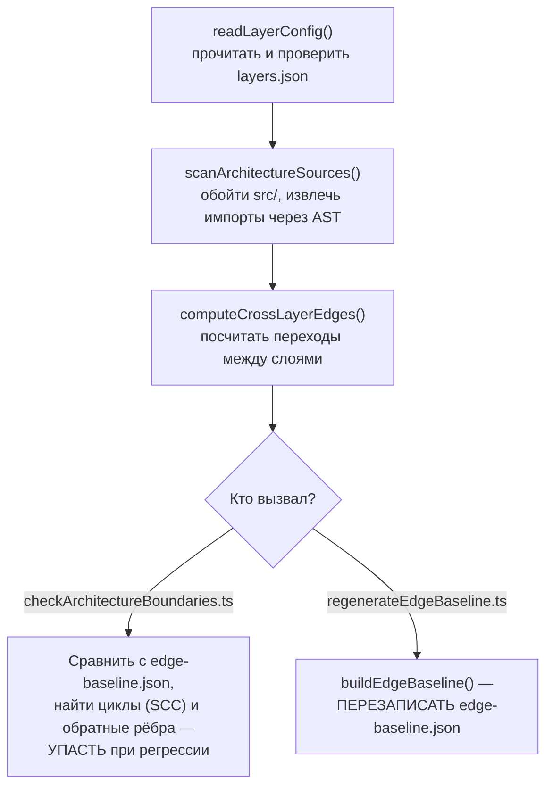
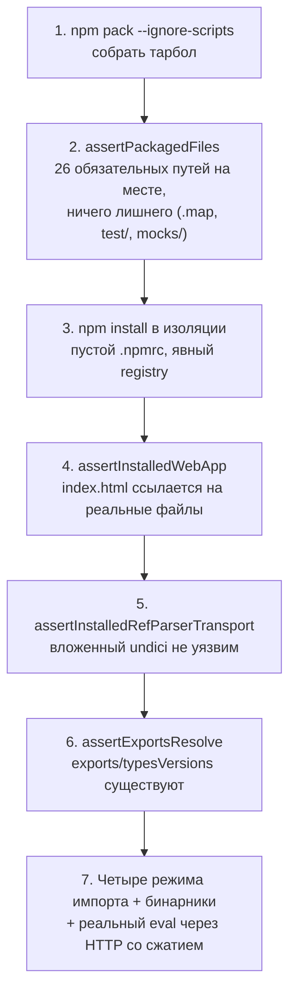
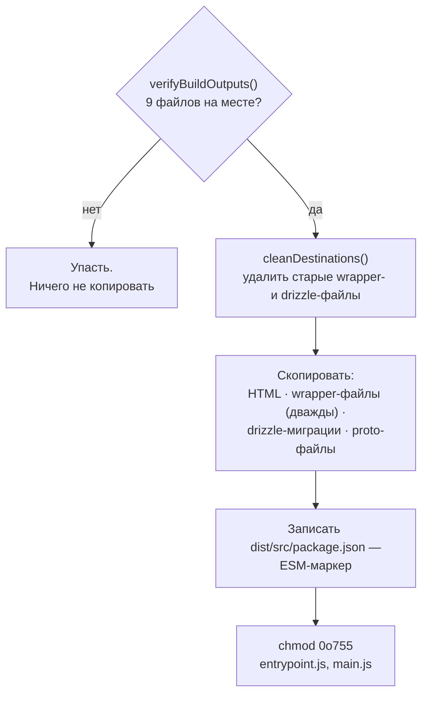
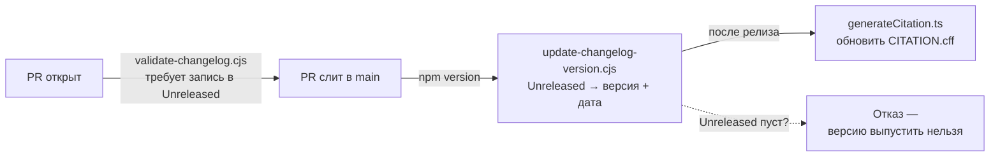

# `scripts/` — код, который выполняет CI и релиз, а не пользователь

> Разбор через призму **Domain-Driven Design**. Диаграммы — ANSI-псевдографика;
> для четырёх ключевых конвейеров добавлены Mermaid-диаграммы с объяснением
> «по Фейнману» — простыми словами, через бытовую аналогию, без жаргона.
> Если можешь объяснить механизм бабушке — значит, правда его понял; если
> нет — там, где объяснение спотыкается, обычно и прячется непонятая деталь.
> Последний именованный пробел из [INDEX-COVERAGE.md §8](INDEX-COVERAGE.md) —
> все 17 файлов прочитаны построчно или прогнаны живьём для этого документа.
> Дополняет [CI-AND-DOCS.md](CI-AND-DOCS.md) (что запускает `.github/`),
> [01-overview-and-core.md §3](01-overview-and-core.md) (слоевая модель,
> которую здесь же и проверяет `architectureUtils.ts`), [PACKAGING.md](PACKAGING.md)
> (как promptfoo упаковывает себя для ЧУЖИХ систем — этот документ описывает,
> как он упаковывает себя для СВОЕЙ собственной, `npm install promptfoo`).

---

## 0. Паспорт

```
╔══════════════════════════════════════════════════════════════════════════════╗
║  scripts/ — 17 файлов, 4 579 строк, ни одного исполняемого во время eval     ║
╠══════════════════════════════════════════════════════════════════════════════╣
║  .ts (tsx-запуск) ......... 10 файлов   3 076 строк                          ║
║  .cjs (node напрямую) ...... 4 файла   1 264 строки                          ║
║  .py (python3) ............. 1 файл      141 строка                          ║
║  requirements.txt .......... 1 файл    (не код, не считается в 4 579)        ║
╠══════════════════════════════════════════════════════════════════════════════╣
║  Юнит-тесты в test/scripts/  7 файлов   2 614 строк   отношение 0.57 : 1     ║
║  Скриптов БЕЗ юнит-теста ... 9 из 17   (см. §9 — не пробел, а форма)         ║
╠══════════════════════════════════════════════════════════════════════════════╣
║  Крупнейший файл .......... architectureUtils.ts   895 строк — общий движок  ║
║                              для checkArchitectureBoundaries.ts И            ║
║                              regenerateEdgeBaseline.ts                       ║
║  Единственный, кто запускает подпроцесс promptfoo целиком                    ║
║                              testPackageArtifact.ts — реальный `eval` против ║
║                              установленного из npm-тарбола пакета            ║
╚══════════════════════════════════════════════════════════════════════════════╝
```

`scripts/` не описан ни в одном `AGENTS.md` каталога — собственного файла
`scripts/AGENTS.md` нет. Это не пробел в документации, а сигнал: правила
для каждого скрипта живут рядом с тем, что он проверяет или собирает —
`architecture:check` упомянут в контексте слоевой модели, `test:package-artifact`
в контексте релиза. `scripts/` — не отдельный ограниченный контекст, а
**горизонтальный слой инструментов**, обслуживающих все остальные.

---

## 1. Единый язык

| Термин | Носитель | Смысл |
| --- | --- | --- |
| **Ratchet** (храповик) | `checkCoverageRatchets.ts`, `edge-baseline.json` | Порог, который может ужесточаться, но не ослабевать без явного перегенерирования |
| **Critical path** | `isCriticalPath()` | Файл, для которого порог покрытия обязателен ВСЕГДА, а не только если он новый |
| **Cross-layer edge** | `computeCrossLayerEdges()` | Импорт из файла слоя A в файл слоя B — единица измерения связности |
| **Baseline** | `architecture/edge-baseline.json` | Зафиксированное число импортов на каждое ребро — рост ловится, сокращение поощряется |
| **Packaged artifact** | `npm pack` | Реальный `.tgz`-тарбол, который получит пользователь `npm install promptfoo` |
| **ESM marker** | `dist/src/package.json` со значением `{"type": "module"}` | Файл без содержательного кода, чья единственная роль — сказать Node, как парсить соседей |
| **Unreleased section** | `CHANGELOG.md` | Единственное место, куда PR разрешено дописывать запись — версионные секции только для релиза |
| **Requirements pin** | `modelaudit_schema_requirements.txt` | Ровно одна закреплённая версия стороннего пакета — генератор отказывается работать с любой другой |

---

## 2. Три семьи в одном каталоге

```
╔══════════════════════════════════════════════════════════════════════════════╗
║  СЕМЬЯ 1 — ФИТНЕС-ФУНКЦИИ (проверяют, что код не сгнил)                      ║
╠══════════════════════════════════════════════════════════════════════════════╣
║  architectureUtils.ts (895)        общий движок для двух следующих           ║
║  checkArchitectureBoundaries.ts (183)   npm run architecture:check           ║
║  regenerateEdgeBaseline.ts (33)         npm run architecture:baseline        ║
║  checkCoverageRatchets.ts (553)         npm run test:coverage:ratchet        ║
║  checkTypeScriptCoverage.ts (98)        npm run check:typescript-coverage    ║
╠══════════════════════════════════════════════════════════════════════════════╣
║  СЕМЬЯ 2 — РЕЛИЗ (превращают src/ в то, что получит пользователь)            ║
╠══════════════════════════════════════════════════════════════════════════════╣
║  postbuild.ts (320)                     npm run postbuild                    ║
║  testPackageArtifact.ts (673)           npm run test:package-artifact        ║
║  validate-changelog.cjs (312)           CI-хук на CHANGELOG.md               ║
║  update-changelog-version.cjs (237)     postversion-хук `npm version`        ║
║  generateCitation.ts (121)              npm run citation:generate            ║
╠══════════════════════════════════════════════════════════════════════════════╣
║  СЕМЬЯ 3 — ГЕНЕРАТОРЫ ПРОИЗВОДНЫХ АРТЕФАКТОВ (код → checked-in файл)         ║
╠══════════════════════════════════════════════════════════════════════════════╣
║  generateJsonSchema.ts (157)            npm run jsonSchema:generate          ║
║  generateOpenApi.ts (46)                npm run openapi:generate/:check      ║
║  generate_modelaudit_schema.py (141)    npm run modelAuditSchema:generate    ║
║  reportDependencyOwnership.ts (95)      npm run deps:ownership               ║
╠══════════════════════════════════════════════════════════════════════════════╣
║  ВНЕ ЦЕПОЧКИ ДОВЕРИЯ — маркетинговый контент, не читается promptfoo сам      ║
╠══════════════════════════════════════════════════════════════════════════════╣
║  generate-blog-image.cjs (164)          ручной запуск, OpenAI Images API     ║
║  generate-event-images.cjs (551)        ручной запуск, OpenAI Images API     ║
╚══════════════════════════════════════════════════════════════════════════════╝
```

Показательно, где проходит граница: первые две семьи (2 302 строки) исполняются
CI на каждом PR или релизе — их падение блокирует слияние. Генераторы (третья
семья, 439 строк) исполняются вручную при изменении контракта и коммитятся как
обычный файл. Последняя пара (715 строк, самая длинная категория из четырёх)
не имеет отношения к продукту вообще — это единственный код в `scripts/`,
который вызывает OpenAI напрямую через `https`, а не через `src/providers`.

---

## 3. `architectureUtils.ts` — общий движок, а не утилита

895 строк — крупнейший файл каталога, и единственный, который [PACKAGES-CROSSCHECK.md](PACKAGES-CROSSCHECK.md)
и [01-overview-and-core.md §3](01-overview-and-core.md) цитировали раньше, чем
разбирали как предмет. Обе прежние цитаты касались одного пятистрочного фрагмента
(снятие префикса `node:`); полная функция файла — не хелпер, а **общая реализация
графового анализа**, которую используют два независимых скрипта с разными
глаголами: один ПРОВЕРЯЕТ текущий граф против сохранённого, другой ПЕРЕЗАПИСЫВАЕТ
сохранённый граф текущим.

```
╔══════════════════════════════════════════════════════════════════════════════╗
║  Общий конвейер: checkArchitectureBoundaries.ts + regenerateEdgeBaseline.ts  ║
╠══════════════════════════════════════════════════════════════════════════════╣
║   readLayerConfig(repoRoot)                                                  ║
║     validateLayerDefinition · validateDependencies · validateAliases         ║
║     validateRootsDoNotOverlap · validateTierOrder                            ║
║     validateMaxStronglyConnectedComponentSize · validateForbiddenDependencies║
║     validateDagPolicy                                                        ║
║          │  architecture/layers.json проверяется на непротиворечивость       ║
║          │  ДО того, как по нему что-либо считается                          ║
║          ▼                                                                   ║
║   scanArchitectureSources(repoRoot, config)                                  ║
║     getSourceFiles → extractModuleSpecifiers (AST, не regexp)                ║
║          │  getStaticModuleSpecifier проходит по узлам синтаксического       ║
║          │  дерева — тот же класс инструмента, что test-hygiene.test.ts      ║
║          │  из TEST-ARCHITECTURE.md, просто для другой цели                  ║
║          ▼                                                                   ║
║   computeCrossLayerEdges(repoRoot, config, sourceScan)                       ║
║     resolveInternalModule · getLayerForFile · getExternalModuleName          ║
║          │  считает импорты, где слой файла-источника ≠ слой файла-цели      ║
║          ▼                                                                   ║
║   ┌─ checkArchitectureBoundaries.ts ──┐  ┌─ regenerateEdgeBaseline.ts ──┐    ║
║   │ findViolations                     │  │ buildEdgeBaseline            │   ║
║   │ computeStronglyConnectedComponents │  │ → перезаписывает             │   ║
║   │ findBackEdges (против tierOrder)   │  │   architecture/edge-baseline │   ║
║   │ findForbiddenDependencyViolations  │  │   .json целиком              │   ║
║   │ compareEdgesToBaseline             │  └───────────────────────────────┘  ║
║   │ → падает при регрессии             │                                     ║
║   └─────────────────────────────────────┘                                    ║
╚══════════════════════════════════════════════════════════════════════════════╝
```

Та же схема как Mermaid-диаграмма:



**Своими словами.** Представь инспектора здания с должностной инструкцией.
Прежде чем идти проверять хоть одну комнату, инспектор сперва перечитывает
саму инструкцию — не противоречит ли она сама себе (`readLayerConfig` со
своими семью `validate*`-проверками). Потом инспектор обходит все комнаты
и записывает каждую дверь, которая ведёт из одной зоны здания в другую
(`scanArchitectureSources` — не на глаз, а разбирая код в синтаксическое
дерево, как таможенник разбирает чемодан по слоям, а не ощупывает его
снаружи). Затем инспектор считает: сколько дверей ведёт из зоны A в зону B
(`computeCrossLayerEdges`). А вот дальше с этим же самым списком дверей
работают два РАЗНЫХ человека по-разному. Один сверяет список со СТАРЫМ
актом осмотра и бьёт тревогу, если появилась новая дверь или старая стала
шире, чем была (`checkArchitectureBoundaries.ts`) — и отдельно проверяет,
не образовалась ли круговая цепочка дверей, из которой нет выхода наружу
(strongly connected component — комната A ведёт в B, B ведёт в C, C снова
ведёт в A). Второй человек ничего не сравнивает — он просто выписывает
СВЕЖИЙ акт осмотра взамен старого, будто вчерашнего акта не было
(`regenerateEdgeBaseline.ts`). Обход один и тот же; разница только в том,
сравнивают результат со вчерашним или подменяют им вчерашний.

`computeStronglyConnectedComponents` — та самая функция, что стоит за
циклом в графе слоёв, разобранным в [01-overview-and-core.md §3.3](01-overview-and-core.md)
(`findBackEdges`, сравнение рёбер с `tierOrder`). Прежде этот документ описывал
поведение фитнес-функции по её выходу (какие рёбра она ловит); теперь видно
её реализацию — обнаружение сильно связных компонент через обход графа, а
не через список известных исключений.

### Тест на сам механизм — не только на его результат

`test/scripts/architectureDag.test.ts` (346 строк) и `architectureUtils.test.ts`
(730 строк) тестируют функции `architectureUtils.ts` напрямую — не через
запуск CLI-обёртки и парсинг stdout, а вызовом `computeCrossLayerEdges`,
`findBackEdges`, `compareEdgesToBaseline` с синтетическими графами. Единственный
файл каталога, для которого юнит-тестов (1 076 строк) больше, чем строк
кода (895) — граф-алгоритм, а не CLI-обвязка, получает соразмерную проверку.

---

## 4. `checkCoverageRatchets.ts` — не «глобальный храповик», а точечный гейт

553 строки — второй по размеру файл каталога, и единственное место, где эта
серия ранее ошиблась в характеристике механизма. [CI-AND-DOCS.md](CI-AND-DOCS.md)
описывал его расплывчато: «текущее покрытие фиксируется как минимум… PR,
опускающий его ниже зафиксированного порога, красит CI» — формулировка,
которая читается как «глобальный ratchet, применяемый ко всему проекту».
Полное чтение `evaluateCoverageRatchets()` (строки 368–431) показывает более
узкий и более осмысленный механизм.

```
╔══════════════════════════════════════════════════════════════════════════════╗
║  DEFAULT_COVERAGE_THRESHOLDS — абсолютный порог, не относительный храповик   ║
╠══════════════════════════════════════════════════════════════════════════════╣
║   branches: 70   functions: 80   lines: 80   statements: 80                  ║
║                                                                              ║
║  Держит порог ТОЛЬКО файл, который либо:                                     ║
║    (а) новый в этом PR (git-статус 'A'), либо                                ║
║    (б) входит в именованный critical path                                    ║
║                                                                              ║
║  Всё остальное, изменённое в PR, — в skippedFiles, без проверки порога.      ║
║  Это НЕ «нельзя понизить общее покрытие репозитория» — существующий файл     ║
║  вне critical path может потерять покрытие в PR, и checkCoverageRatchets     ║
║  этого не заметит.                                                           ║
╠══════════════════════════════════════════════════════════════════════════════╣
║  backend  sourcePrefix: 'src/'                                               ║
║           excludePrefixes: src/app/, src/__mocks__/                          ║
║           excludeFiles: src/entrypoint.ts, src/main.ts, src/migrate.ts       ║
║           criticalPrefixes: src/assertions/, src/matchers/,                  ║
║                              src/util/config/                                ║
║           criticalFiles: src/evaluator.ts, src/evaluatorHelpers.ts,          ║
║                           src/prompts.ts                                     ║
╠══════════════════════════════════════════════════════════════════════════════╣
║  frontend sourcePrefix: 'src/app/src/'                                       ║
║           criticalPrefixes: store/, stores/, tests/                          ║
║           criticalFiles: src/app/src/utils/api.ts                            ║
╚══════════════════════════════════════════════════════════════════════════════╝
```

Именованный `criticalFiles`/`criticalPrefixes` список — независимое
подтверждение того, чему сама серия документов уже отдавала непропорционально
много внимания: [EVALUATOR.md](EVALUATOR.md), [ASSERTIONS.md](ASSERTIONS.md),
[MATCHERS.md](MATCHERS.md), [EVALUATOR-HELPERS.md](EVALUATOR-HELPERS.md),
[PROMPTS.md](PROMPTS.md) — все пять получили отдельные документы раньше, чем
любой из смежных модулей той же величины. Список `criticalFiles` в этом файле —
не источник этого решения (он написан не для документации), но факт, что он
называет ровно те же пять файлов, — сигнал, что приоритет серии совпадает
с приоритетом, который сама команда promptfoo закодировала в CI-гейте.

---

## 5. `testPackageArtifact.ts` — единственный скрипт, что запускает реальный `eval`

673 строки, `npm run test:package-artifact` — не юнит-тест и не сборка, а
**сквозной релизный дым-тест**: берёт код репозитория, упаковывает его так,
как это сделает `npm publish`, устанавливает получившийся тарбол в изолированную
директорию как сторонний пользователь и запускает получившийся CLI по-настоящему.

```
╔══════════════════════════════════════════════════════════════════════════════╗
║  main() — семь стадий, каждая может провалить релиз раньше публикации        ║
╠══════════════════════════════════════════════════════════════════════════════╣
║  1. npm pack --ignore-scripts --json  →  ровно один артефакт с именем        ║
║     promptfoo                                                                ║
║                                                                              ║
║  2. assertPackagedFiles(packResult)                                          ║
║     requiredPackagedPaths — 26 путей: dist/src/{index,main,entrypoint,       ║
║     contracts}.{js,cjs,d.ts,d.cts} · dist/src/{python,ruby,golang}/wrapper.* ║
║     · dist/src/server/… · dist/src/tracing/proto/**/*.proto ·                ║
║     dist/drizzle/meta/_journal.json                                          ║
║     + миграции drizzle (тем же фильтром shouldCopyDrizzlePath, что и         ║
║       postbuild.ts, §6) + файлы веб-приложения из dist/src/app               ║
║     + НЕТ .map, НЕТ dist/test/, НЕТ dist/src/__mocks__/                      ║
║     + entrypoint.js и main.js реально исполняемы (mode & 0o111)              ║
║                                                                              ║
║  3. npm install --ignore-scripts --registry=https://registry.npmjs.org/      ║
║     в изолированной директории — тот же паттерн, что PACKAGING.md нашёл      ║
║     в code-scan-action/src/main.ts: пустой userconfig, явный реестр          ║
║                                                                              ║
║  4. assertInstalledWebApp — index.html ссылается на реальные .js/.css,       ║
║     каждый путь проверен fs.existsSync                                       ║
║                                                                              ║
║  5. assertInstalledRefParserTransport — см. врезку ниже                      ║
║                                                                              ║
║  6. assertExportsResolve — каждый относительный путь из exports/             ║
║     typesVersions установленного package.json реально существует на диске    ║
║                                                                              ║
║  7. writeConsumerScripts + запуск ВСЕХ ЧЕТЫРЁХ режимов резолюции модулей:    ║
║     import-package.mjs (ESM) · require-package.cjs (CJS) ·                   ║
║     import-contracts.ts под tsconfig NodeNext ·                              ║
║     require-contracts.cts под tsconfig Node16 — каждый проверяет и           ║
║     основной вход promptfoo, И подпуть promptfoo/contracts                   ║
║                                                                              ║
║     + запуск установленных бинарников promptfoo/pf --version                 ║
║     + runInstalledCompressionEval — см. врезку ниже                          ║
╚══════════════════════════════════════════════════════════════════════════════╝
```

Те же семь стадий как Mermaid-диаграмма:



**Своими словами.** Представь, что продаёшь мебель по почте и хочешь быть
уверен, что покупатель соберёт её и она не развалится. Проверять коробку
на складе — не то же самое, что реально её собрать. Здесь именно второе.
Сначала упаковываешь коробку по-настоящему, теми же инструментами, что
использует настоящий `npm publish` (стадия 1). Затем пересчитываешь
содержимое — все ли детали внутри, и не завалялась ли внутри случайно
инструкция от ДРУГОЙ мебели: карта исходников, скомпилированные тесты
(стадия 2). Потом — и это важно — собираешь мебель не в своей мастерской,
где под рукой полно чужих инструментов, а в ПУСТОЙ комнате, где нет вообще
ничего, кроме содержимого коробки (стадия 3: чистый `.npmrc`, явный
реестр). Проверяешь, что у собранного шкафа реально открываются все дверцы
(стадия 4 — сайт находит свои файлы). Проверяешь один конкретный шуруп
на трещину — не свой, а вложенный внутрь одной из деталей от смежного
поставщика (стадия 5 — undici внутри `json-schema-ref-parser`). Сверяешь
инструкцию по сборке: каждая деталь, упомянутая в схеме, реально лежит
в коробке (стадия 6 — `exports`/`typesVersions`). А в конце не просто
садишься на стул четырьмя разными способами, проверяя, что он не
шатается (стадия 7, ESM/CJS/NodeNext/Node16) — а ещё и реально
им пользуешься: гоняешь через собранный пакет настоящую задачу с
настоящим сетевым трафиком, сжатым gzip и brotli, и смотришь, что
результат совпал с ожидаемым.

### Проверка на транзитивную уязвимость, не на прямую

```
   const PATCHED_UNDICI_RANGE = '^6.28.0 || ^7.29.0 || >=8.9.0';
   // The August 2026 undici advisories were fixed in 6.28.0, 7.29.0 and 8.9.0.
   // Keep this in sync with PATCHED_UNDICI_RANGE in test/package-manifests.test.ts.

   assertInstalledRefParserTransport(): читает undici, установленный не самим
   promptfoo, а ВЛОЖЕННО — через @apidevtools/json-schema-ref-parser, который
   promptfoo использует для резолвинга $ref в JSON Schema. Комментарий в коде,
   дословно объясняющий, зачем эта проверка не тавтология: диапазон версий
   в package.json парсера npm обязан соблюсti при любой установке — то есть
   проверка ЭТОГО диапазона была бы проверкой утверждения, гарантированного
   самим npm. Единственное, что действительно можно не заметить, — какая
   ИМЕННО версия из этого диапазона реально разрешилась у конкретного
   пользователя при публикации конкретного тарбола. Проверяется дважды:
   здесь (после install из тарбола) и в test/package-manifests.test.ts
   (dev-зависимости) — тот же диапазон, названный по имени в обоих местах.
```

### Проверка не файлов, а поведения — HTTP-декомпрессия

```
   runInstalledCompressionEval(): поднимает настоящий HTTP-сервер на
   127.0.0.1, отвечающий gzip и brotli телами. Пишет promptfooconfig.json
   с двумя http-провайдерами, указывающими на этот сервер. Запускает
   dist/src/entrypoint.js (УСТАНОВЛЕННЫЙ, не локальный) как отдельный
   процесс с обнулёнными *_PROXY-переменными. Проверяет, что оба провайдера
   вернули success: true и правильно распакованное тело.

   Единственная проверка во всём scripts/, которая исполняет не сборку и
   не парсинг файла, а реальный сетевой обмен через код, идентичный тому,
   что получит конечный пользователь.
```

---

## 6. `postbuild.ts` — что именно уезжает в `dist/`

320 строк, `npm run postbuild`, часть цепочки `npm run build` (tsdown → postbuild).
Раньше в серии упоминался только по функции (`src/esm.ts`'s `getWrapperDir()` в
[BRIDGES.md](BRIDGES.md), сам факт копирования — в самом первом выводе `npm run build`
этой сессии); полное чтение показывает структуру с явной защитой от частичной сборки.

```
╔══════════════════════════════════════════════════════════════════════════════╗
║  postbuild() — проверка ДО копирования, не после                             ║
╠══════════════════════════════════════════════════════════════════════════════╣
║  verifyBuildOutputs() — 9 REQUIRED_BUILD_OUTPUTS (dist/src/entrypoint.js,    ║
║  dist/src/main.js, dist/src/contracts.{js,cjs,d.ts,d.cts},                   ║
║  dist/src/index.{js,cjs}, dist/src/server/index.js) обязаны существовать     ║
║  ДО того, как postbuild начнёт копировать хоть что-то — если tsdown          ║
║  провалился частично, postbuild падает с явным списком, а не копирует        ║
║  ассеты поверх сломанной сборки молча.                                       ║
╠══════════════════════════════════════════════════════════════════════════════╣
║  Задачи копирования (после проверки):                                        ║
║   *.html из src/                     → dist/src/                             ║
║   python/ruby/golang wrapper-файлы   → dist/src/{type}/ И                    ║
║                                         dist/src/server/{type}/ — ДВАЖДЫ,    ║
║   │  комментарий объясняет зачем: getWrapperDir() резолвит через             ║
║   │  import.meta.url, который в собранном сервере указывает на               ║
║   │  dist/src/server/index.js, а не на dist/src/main.js                      ║
║   drizzle/  (кроме .md, CLAUDE*, AGENTS*) → dist/drizzle/                    ║
║   src/tracing/proto/            → dist/src/tracing/proto/  (рекурсивно)      ║
╠══════════════════════════════════════════════════════════════════════════════╣
║  После копирования:                                                          ║
║   cleanDestinations() ПЕРЕД копированием — удаляет старые wrapper- и         ║
║     drizzle-директории целиком, чтобы файл, удалённый из src/, не остался    ║
║     в dist/ от предыдущей сборки                                             ║
║   dist/src/package.json = {"type": "module"}  — ESM-маркер                   ║
║   chmod 0o755 на entrypoint.js и main.js (no-op на Windows, отловлен try)    ║
╚══════════════════════════════════════════════════════════════════════════════╝
```

Та же последовательность как Mermaid-диаграмма:



**Своими словами.** Это как сборы в дорогу с чужим чемоданом, который уже
кто-то паковал до тебя. Первым делом — не начинаешь класть вещи, а
проверяешь, что паспорт, билет и кошелёк реально у тебя в руках
(`verifyBuildOutputs`): если чего-то из главного нет, ехать вообще нельзя,
и упаковывать остальное бессмысленно — лучше узнать об этом сейчас, чем
в аэропорту. Дальше — прежде чем класть новое, вытряхиваешь из чемодана
всё, что осталось от прошлой поездки (`cleanDestinations`), иначе туда
случайно уедет что-то устаревшее, чего в этой поездке уже не должно быть.
Потом кладёшь свежее: странички сайта, вспомогательные скрипты для других
языков (причём в ДВА разных кармана чемодана — потому что два разных
модуля потом будут искать их каждый в своём кармане), миграции базы,
файлы сетевого протокола. Когда всё сложено, приклеиваешь к чемодану
бирку «этот багаж — по новым правилам» (ESM-маркер) и следишь, чтобы
два предмета, которые понадобятся сразу на выходе из самолёта, лежали
расстёгнутыми и под рукой, а не были случайно заперты на замок
(`chmod 0o755` на два исполняемых файла).

`shouldCopyDrizzlePath` — единственная функция файла, экспортированная и
переиспользуемая: `testPackageArtifact.ts` вызывает её же (§5, стадия 2) для
проверки, что тот же самый фильтр, которым собрали `dist/drizzle/`, применился
и к содержимому упакованного тарбола — не два похожих списка исключений,
поддерживаемых раздельно, а одна функция, вызванная в двух точках конвейера.

---

## 7. Релизная гигиена — changelog и citation

Три небольших скрипта, объединённых тем, что каждый существует, чтобы не
дать человеку забыть шаг вручную.

```
╔══════════════════════════════════════════════════════════════════════════════╗
║  validate-changelog.cjs (312) — CI-гейт на PR                                ║
╠══════════════════════════════════════════════════════════════════════════════╣
║  Три правила поверх git diff CHANGELOG.md:                                   ║
║   1. Каждая добавленная запись содержит (#1234)                              ║
║   2. Ни одна не содержит commit-хеш (abc1234) ВМЕСТО номера PR               ║
║      (regex различает: /\([a-f0-9]{7,40}\)/ отдельно от /\(#\d+\)/)          ║
║   3. Все новые записи — в секции Unreleased, не в версионированной           ║
║  Обходится метками PR: no-changelog (исключительные случаи),                 ║
║  dependencies (автоматизированные апдейты зависимостей)                      ║
║  Пропускается целиком для веток chore/bump-version-*                         ║
╠══════════════════════════════════════════════════════════════════════════════╣
║  update-changelog-version.cjs (237) — postversion-хук `npm version`          ║
╠══════════════════════════════════════════════════════════════════════════════╣
║  Переносит содержимое Unreleased в новую секцию ## [x.y.z] - YYYY-MM-DD,     ║
║  затем перезаписывает Unreleased пустым шаблоном из девяти категорий         ║
║  Keep a Changelog (Added/Changed/Deprecated/Removed/Fixed/Security/          ║
║  Dependencies/Documentation/Tests). Отказывается работать, если Unreleased   ║
║  пуст (isEmptySection) — нельзя выпустить версию без единой строчки          ║
║  изменений, зафиксированной validate-changelog.cjs же на этапе PR.           ║
╠══════════════════════════════════════════════════════════════════════════════╣
║  generateCitation.ts (121) — npm run citation:generate                       ║
╠══════════════════════════════════════════════════════════════════════════════╣
║  Обновляет CITATION.cff: version и license — из package.json,                ║
║  date-released — из GitHub Releases API по тегу версии (fallback —           ║
║  сегодняшняя дата, если релиз ещё не опубликован). Сериализует через         ║
║  js-yaml с lineWidth: -1 (без переноса длинных строк).                       ║
╚══════════════════════════════════════════════════════════════════════════════╝
```

Тот же цикл как Mermaid-диаграмма:



**Своими словами.** Это эстафета из трёх бегунов, где физически нельзя
стартовать, пока предыдущий не добежал правильно. Первый бегун
(`validate-changelog.cjs`) стоит у ворот слияния PR и не пускает дальше
эстафетную палочку, если на ней нет правильной бирки — записи об изменении
с настоящим номером PR, причём именно в разделе «ещё не выпущено», а не
в уже закрытом разделе прошлого релиза. Второй бегун
(`update-changelog-version.cjs`) стартует только по отдельной команде
«новая версия!» — берёт всё, что одобрил первый, запечатывает это под
сегодняшней датой и вручает следующему бегуну новую, пустую палочку для
следующего отрезка пути. Если первый бегун не донёс до этой точки вообще
ничего (раздел пуст), второй просто отказывается бежать — пустая
эстафетная палочка останавливает всю гонку, а не едет дальше с пустыми
руками. Третий бегун (`generateCitation.ts`) бежит последним, без спешки,
и просто поправляет табличку на финише — какая версия и какого числа
на самом деле добежала.

Эти три скрипта образуют замкнутый цикл: `validate-changelog.cjs` не даёт
смержить PR без строки в Unreleased → `update-changelog-version.cjs` не даёт
выпустить версию, если Unreleased пуст → `generateCitation.ts` синхронно
подтягивает получившуюся версию в цитируемый артефакт. Ни один шаг не
полагается на память человека — каждый следующий проверяет результат
предыдущего.

---

## 8. Генераторы производных артефактов

Четыре скрипта с общей формой: код — источник истины, checked-in файл — его
снимок, и CI (или прямой запуск с `--check`) ловит расхождение.

```
   generateJsonSchema.ts (157)    src/validators/*  → site/static/config-schema.json
     разобран ранее в VALIDATORS.md §4 — Zod-схема конфига в JSON Schema

   generateOpenApi.ts (46)        src/openapi/server.ts → site/static/openapi.json
     createServerOpenApiDocument() форматируется через тот же биом-бинарник
     (require.resolve('@biomejs/biome/bin/biome')), что и остальной репозиторий —
     не свой форматтер для одного файла. --check сравнивает текущий файл
     с только что отрендеренным байт-в-байт, без записи

   generate_modelaudit_schema.py (141)  Python-пакет modelaudit →
     site/static/schemas/modelaudit/*.json
     Единственный Python-скрипт каталога. validate_python_version() требует
     3.10 ≤ версия < 3.14 ДО импорта пакета. load_result_model() сравнивает
     installed_version с версией, закреплённой построчным парсингом
     modelaudit_schema_requirements.txt (modelaudit==X.Y.Z) — отказывается
     генерировать схему для НЕ той версии пакета, даже совместимой внешне.
     write_text_atomic() пишет через tempfile + os.replace, не через прямую
     запись — частично записанный JSON Schema не может попасть в дерево

   reportDependencyOwnership.ts (95)   ранее прогнан живьём в
     PACKAGES-CROSSCHECK.md §5 — сопоставляет package.json-зависимости
     с владеющими модулями по факту импорта, не по декларации
```

Общая черта всех четырёх: ни один не редактирует свой выходной файл
инкрементально. Каждый вычисляет полный артефакт заново из текущего кода и
либо перезаписывает файл целиком, либо (в режиме `--check`) сравнивает с тем,
что уже лежит в дереве, побайтово. Расхождение возможно только одним
способом — кто-то поправил исходный код и забыл перегенерировать снимок.

---

## 9. За пределами доверенной цепочки: `generate-blog-image.cjs` и `generate-event-images.cjs`

715 строк — больше, чем `checkCoverageRatchets.ts`, — и единственный код
`scripts/`, не имеющий отношения к продукту, тестам или релизу. Оба скрипта
запускаются вручную (не из CI, нет `npm run`-алиаса ни у одного из двух в
`package.json`), читают `OPENAI_API_KEY` из `.env` через `dotenv`, обращаются
к `api.openai.com` напрямую через встроенный `https`-модуль Node — не через
`src/providers`, потому что это не eval и не имеет отношения к тому, что
тестирует promptfoo. Результат — PNG/JPEG-изображения для `site/static/img/`
(обложки блога и карточки мероприятий).

```
   generate-blog-image.cjs (164)   один вызов, CLI-флаги --filename/--prompt/
                                    --size/--output-dir, промпт передаётся
                                    аргументом или задаётся строкой в файле

   generate-event-images.cjs (551) МАССИВ из предопределённых конфигураций
                                    событий (BSides Seattle 2025, AI Security
                                    Summit 2025, …), каждая — многострочный
                                    промпт с описанием стиля иллюстрации;
                                    после скачивания PNG конвертирует в JPEG
                                    через `sips` (macOS) с fallback на
                                    ImageMagick `convert`, качество 85
```

Присутствие этих файлов в каталоге `scripts/` — не архитектурная находка,
а честная граница измерения: [INDEX-COVERAGE.md](INDEX-COVERAGE.md) с самого
начала мерил покрытие через fan-in (входящие рёбра графа импортов). У обоих
файлов fan-in равен нулю той же природы, что и у `examples/` — их не
импортирует ничего в `src/` или `test/`, потому что они не часть системы,
которую эта серия документов описывает. Они прочитаны здесь для полноты
`scripts/` как каталога, а не потому, что несут архитектурный вес.

---

## 10. Тестовое покрытие `scripts/` самого себя

```
╔══════════════════════════════════════════════════════════════════════════════╗
║  test/scripts/ — 7 файлов, 2 614 строк, против 4 579 строк в scripts/        ║
╠══════════════════════════════════════════════════════════════════════════════╣
║  С юнит-тестом (7):              БЕЗ юнит-теста (10):                        ║
║   architectureUtils.ts    730     testPackageArtifact.ts  ← сам себе тест    ║
║   validate-changelog.cjs  577     generateCitation.ts                        ║
║   architectureDag.test    346     generateOpenApi.ts                         ║
║     (тестирует часть той же          regenerateEdgeBaseline.ts               ║
║      architectureUtils.ts)          reportDependencyOwnership.ts             ║
║   update-changelog…       474     generateJsonSchema.ts                      ║
║   postbuild.ts            245     generate_modelaudit_schema.py              ║
║   checkCoverageRatchets   234     generate-blog-image.cjs                    ║
║   checkTypeScriptCoverage   8     generate-event-images.cjs                  ║
╚══════════════════════════════════════════════════════════════════════════════╝
```

Разрыв не случаен по составу. Все семь протестированных — скрипты с
**чистой логикой**, которую можно вызвать функцией и сравнить с ожидаемым
значением без побочных эффектов (парсинг diff, вычисление графа, сравнение
строк). Все десять непротестированных — либо сами являются интеграционным
тестом (`testPackageArtifact.ts` — не нуждается в обёртке, он и есть проверка),
либо делают ровно одну вещь целиком через побочный эффект (сходить в сеть,
записать файл, вызвать внешний процесс), где юнит-тест означал бы либо мокать
всё вплоть до бессодержательности, либо превратиться в тот же интеграционный
прогон, что и сам скрипт. `checkTypeScriptCoverage.test.ts` — восемь строк
против 98 строк проверяемого файла — не пробел, а признание того же: сам
факт «эта функция возвращает 0 на текущем дереве» и есть весь смысл теста.

---

## Диагноз

```
╔══════════════════════════════════════════════════════════════════════════════╗
║                    ДИАГНОЗ: scripts/ КАК ИНСТРУМЕНТАЛЬНЫЙ СЛОЙ               ║
╠══════════════════════════════════════════════════════════════════════════════╣
║  СИЛЬНЫЕ СТОРОНЫ                                                             ║
║                                                                              ║
║  ✔ testPackageArtifact.ts проверяет реальный тарбол реальной установкой в    ║
║    изолированной директории, включая живой HTTP round-trip через             ║
║    установленный CLI — не имитацию, а фактическое поведение конечного        ║
║    пользователя, до публикации.                                              ║
║                                                                              ║
║  ✔ Проверка транзитивной уязвимости (undici внутри ref-parser) объяснена     ║
║    в коде явным комментарием, почему прямая проверка была бы тавтологией —   ║
║    редкий случай, когда КОММЕНТАРИЙ формулирует архитектурное рассуждение,   ║
║    а не просто описывает следующую строку.                                   ║
║                                                                              ║
║  ✔ postbuild.ts проверяет условия ДО побочных эффектов (verifyBuildOutputs   ║
║    прежде чем копировать хоть файл) и переиспользует один и тот же фильтр    ║
║    (shouldCopyDrizzlePath) в testPackageArtifact.ts — не два похожих         ║
║    списка исключений, а одна экспортированная функция.                       ║
║                                                                              ║
║  ✔ architectureUtils.ts — общий движок для проверки и для перегенерации      ║
║    одного и того же графа; критические файлы, названные в                    ║
║    checkCoverageRatchets.ts, независимо совпадают с приоритетами, которые    ║
║    сама эта серия документов уже расставила по объёму разборов.              ║
║                                                                              ║
║  ✔ Цикл changelog: validate (PR) → update (релиз) → citation (после          ║
║    релиза) — три отдельных скрипта, каждый проверяет результат               ║
║    предыдущего, ни один не полагается на память человека.                    ║
║                                                                              ║
║  ✔ Юнит-тестовое покрытие внутри scripts/ распределено не равномерно, а      ║
║    ровно там, где логика чистая — 730 строк теста на 895-строчный            ║
║    графовый алгоритм, 8 строк теста на 98-строчную проверку с одним          ║
║    осмысленным исходом.                                                      ║
╠══════════════════════════════════════════════════════════════════════════════╣
║  СЛАБЫЕ МЕСТА                                                                ║
║                                                                              ║
║  ✘ checkCoverageRatchets.ts держит порог ТОЛЬКО для новых и критических      ║
║    файлов — существующий файл вне critical path может тихо потерять          ║
║    покрытие в обычном PR, и ни один из 17 скриптов каталога этого не         ║
║    заметит. Не дефект реализации — сознательный компромисс между             ║
║    строгостью и стоимостью false positive на рефакторинге, но                ║
║    неочевидный по одному только названию «coverage ratchet».                 ║
║                                                                              ║
║  ✘ generate-blog-image.cjs и generate-event-images.cjs дублируют логику      ║
║    (generateImage/downloadImage почти идентичны в обоих файлах) — общий      ║
║    хелпер для вызова OpenAI Images API и скачивания результата               ║
║    отсутствует, хотя оба файла лежат рядом и решают одну задачу.             ║
║                                                                              ║
║  ✘ generate_modelaudit_schema.py — единственный Python-файл каталога,        ║
║    зависящий от системного pip-окружения (`python3 -m pip install --no-deps`)║
║    вне обычного `npm ci`; не имеет собственной CI-проверки версии Python     ║
║    заранее — ошибка проявится только при попытке импорта пакета.             ║
╚══════════════════════════════════════════════════════════════════════════════╝
```

### Оценка по осям

```
  Проверка релизного артефакта живьём ██████████  10/10   HTTP round-trip через установленный CLI
  Защита от частичной сборки          █████████░   9/10   verifyBuildOutputs до копирования
  Переиспользование логики между      █████████░   9/10   architectureUtils как общий движок,
    скриптами                                              shouldCopyDrizzlePath в двух местах
  Точность критики собственного       ████████░░   8/10   критический путь — гейт по имени файла,
    покрытия                                                не по факту регрессии везде
  Соразмерность юнит-тестов сложности █████████░   9/10   тест длиннее кода там, где логика графовая
  Однородность инструментов внутри    ███████░░░   7/10   два похожих OpenAI-скрипта без общего хелпера
    одной семьи
  ─────────────────────────────────────────────────────────────────────────────
  ИНТЕГРАЛЬНО                        █████████░   8.7/10
```

Вторая по высоте интегральная оценка среди всех документов серии, измеряющих
пробелы (после [PACKAGING.md](PACKAGING.md), 8.1/10) — по той же причине:
это код, который пересекает границу «внутри репозитория» → «то, что получит
чужой процесс» (npm-реестр, конечный пользователь, CI-раннер), и каждое такое
пересечение либо проверено вживую, либо явно названо компромиссом в
комментарии рядом.

---

## Рекомендации по эволюции

1. **Назвать `checkCoverageRatchets.ts` менее обманчиво** или явно
   задокументировать в README/AGENTS.md, что порог держится только для
   новых и критических файлов. Название «coverage ratchet» подсказывает
   монотонность по всему репозиторию — реальный механизм точнее описывается
   как «gate on new and critical files», и путаница уже случилась один раз
   в этой самой серии документов (см. правку в [CI-AND-DOCS.md](CI-AND-DOCS.md)).

2. **Вынести общий хелпер** `generateImage`/`downloadImage` из
   `generate-blog-image.cjs` и `generate-event-images.cjs` в третий файл —
   оба реализуют один и тот же вызов OpenAI Images API и скачивание
   результата почти дословно одинаковым кодом.

3. **Добавить лёгкую CI-проверку версии Python** для
   `generate_modelaudit_schema.py` — например, шаг в `.github/`, запускающий
   `validate_python_version()` изолированно, чтобы несовместимое окружение
   ловилось в момент настройки раннера, а не в момент попытки импортировать
   `modelaudit`.

4. **Расширить critical path в `checkCoverageRatchets.ts`**, если появятся
   новые файлы сопоставимой значимости — список сейчас статичен и требует
   ручного редактирования; стоит держать его синхронным с тем, как эволюционирует
   сама кодовая база (например, если `src/scheduler` или `src/tracing`
   вырастут до сопоставимой критичности с уже перечисленными путями).

---

## Карта директории

```
scripts/
├── architectureUtils.ts ............... 895   общий движок графа слоёв
├── testPackageArtifact.ts ............. 673   сквозной релизный дым-тест
├── checkCoverageRatchets.ts ........... 553   точечный гейт покрытия
├── generate-event-images.cjs .......... 551   маркетинг, OpenAI Images API
├── postbuild.ts ........................ 320   src/ → dist/, non-TS ассеты
├── validate-changelog.cjs ............. 312   CI-гейт на CHANGELOG.md
├── update-changelog-version.cjs ....... 237   postversion-хук npm version
├── checkArchitectureBoundaries.ts ..... 183   npm run architecture:check
├── generate-blog-image.cjs ............ 164   маркетинг, OpenAI Images API
├── generateJsonSchema.ts .............. 157   Zod → JSON Schema конфига
├── generate_modelaudit_schema.py ...... 141   единственный Python-скрипт
├── generateCitation.ts ................ 121   CITATION.cff из package.json
├── checkTypeScriptCoverage.ts .......... 98   tsc --showConfig ⊇ git ls-files
├── reportDependencyOwnership.ts ........ 95   package.json ⇄ владеющий модуль
├── generateOpenApi.ts .................. 46   src/openapi/server.ts → JSON
└── regenerateEdgeBaseline.ts ........... 33   тонкий драйвер architectureUtils

test/scripts/
├── architectureUtils.test.ts .......... 730
├── validate-changelog.test.ts ......... 577
├── architectureDag.test.ts ............ 346
├── update-changelog-version.test.ts ... 474
├── postbuild.test.ts ................... 245
├── checkCoverageRatchets.test.ts ....... 234
└── checkTypeScriptCoverage.test.ts ....... 8
```

---

## Команды

```bash
# Точный состав каталога
wc -l scripts/*.ts scripts/*.cjs scripts/*.py | sort -n

# Фитнес-функции — все три можно прогнать локально
npm run architecture:check
npm run test:coverage:ratchet
npm run check:typescript-coverage

# ГЛАВНОЕ: реальный релизный дым-тест — пакует, устанавливает, запускает eval
npm run test:package-artifact

# Проверка транзитивной уязвимости undici — синхронизирован диапазон в двух файлах
grep -n "PATCHED_UNDICI_RANGE" scripts/testPackageArtifact.ts test/package-manifests.test.ts

# Что именно требует postbuild.ts до копирования
grep -n -A10 "REQUIRED_BUILD_OUTPUTS" scripts/postbuild.ts | head -12

# Общий фильтр, используемый И сборкой, И релизным тестом
grep -rn "shouldCopyDrizzlePath" scripts/

# Критические файлы гейта покрытия — сверка с документами серии
grep -n -A6 "criticalFiles: \[" scripts/checkCoverageRatchets.ts

# Генераторы производных артефактов в режиме проверки (не перезаписи)
npm run openapi:check
npm run jsonSchema:generate -- --help 2>/dev/null || true

# Тестовое покрытие самого scripts/
wc -l test/scripts/*.test.ts | sort -n
ls scripts/*.ts scripts/*.cjs scripts/*.py | while read -r f; do
  base=$(basename "$f" | sed -E 's/\.(ts|cjs|py)$//')
  test -f "test/scripts/${base}.test.ts" && echo "ЕСТЬ  $f" || echo "нет   $f"
done
```

---

*Документ описывает `scripts/` на коммите `2c140ef`, promptfoo 0.122.0.
Дата среза — 29 августа 2026.*
