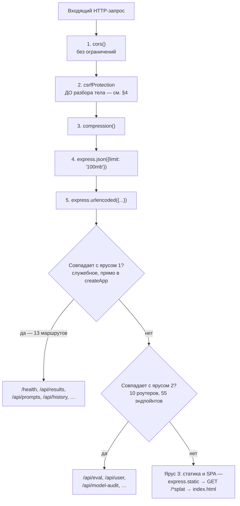
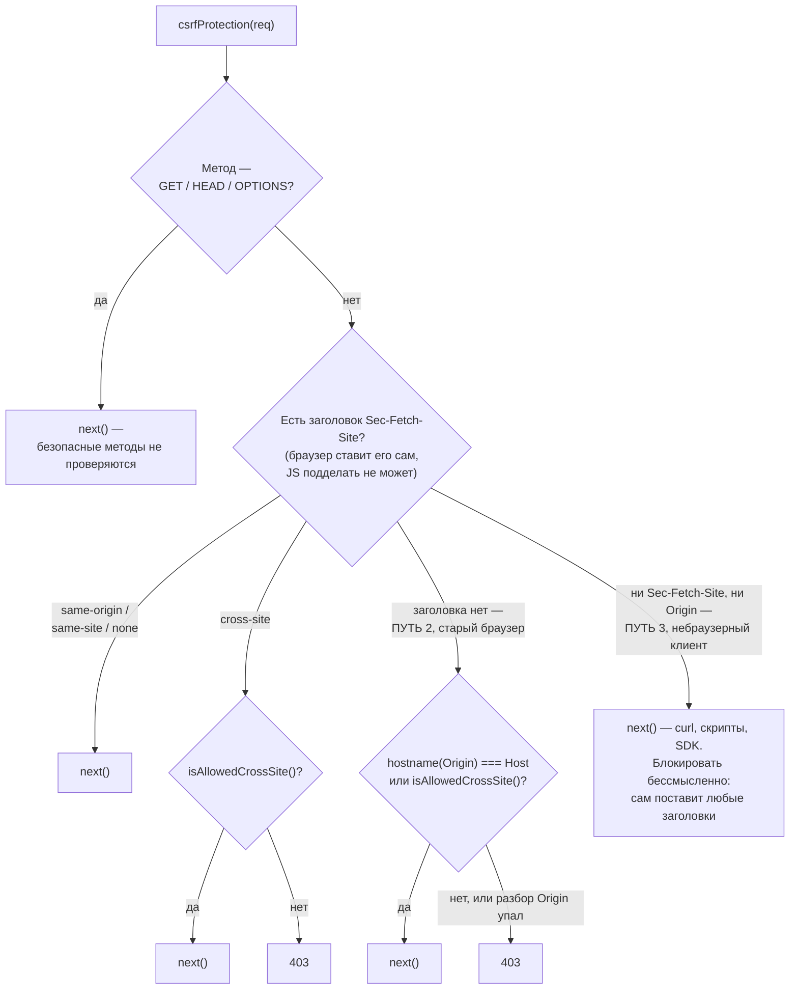
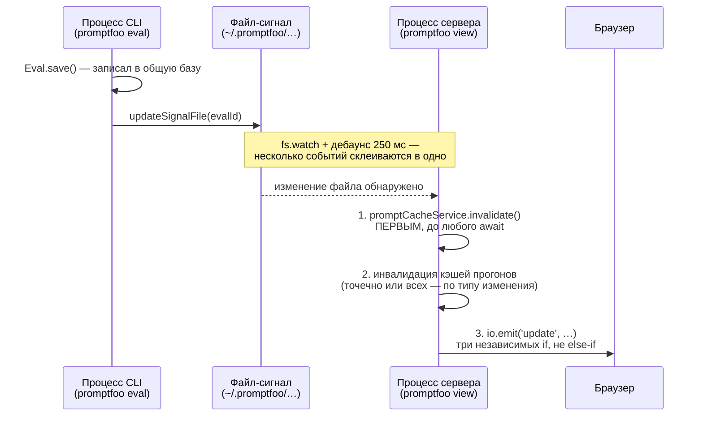
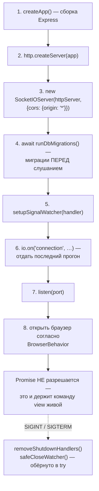

# Подсистема View Server — `src/server`

> Разбор через призму **Domain-Driven Design**. Диаграммы — ANSI-псевдографика.
> Дополняет [ARCHITECTURE.md](./ARCHITECTURE.md), [REDTEAM.md](./REDTEAM.md),
> [PROVIDERS.md](./PROVIDERS.md), [APP.md](./APP.md), [ASSERTIONS.md](./ASSERTIONS.md).

---

## 0. Паспорт подсистемы

```
╔══════════════════════════════════════════════════════════════════════════════╗
║  VIEW-SERVER CONTEXT — открытый сервис поверх домена                         ║
╠══════════════════════════════════════════════════════════════════════════════╣
║  Слой в layers.json     view-server (ярус 7 из 11)                           ║
║  Стек                   Express 5 · Socket.IO · Zod · Drizzle/libSQL         ║
║  Объём                  21 файл · 5 378 строк  ← самая компактная подсистема ║
║  Порт по умолчанию      15500  (API_PORT)                                    ║
╠══════════════════════════════════════════════════════════════════════════════╣
║  routes/       10 файлов · 3 628 строк · 55 эндпойнтов                       ║
║  services/      3 файла  ·   738 строк                                       ║
║  config/        1 файл   ·   179 строк                                       ║
║  middleware/    1 файл   ·   115 строк  (только CSRF)                        ║
║  utils/         3 файла  ·   125 строк                                       ║
║  server.ts + index.ts + errors.ts       633 строки                           ║
╠══════════════════════════════════════════════════════════════════════════════╣
║  HTTP-эндпойнтов всего            68                                         ║
║      55 в роутерах + 13 прямо в createApp                                    ║
║  Схем валидации (src/types/api)   12 файлов · 1 502 строки                   ║
║  Middleware цепочка                5 звеньев                                 ║
║  Аутентификация                    ОТСУТСТВУЕТ (осознанно, см. §8)           ║
╚══════════════════════════════════════════════════════════════════════════════╝
```

**Формулировка предметной области в одном предложении.** View Server — это
**Open Host Service** в терминах DDD: единственный опубликованный протокол, через
который внешний мир (браузер) получает доступ к домену. Собственной доменной логики
у него почти нет — 5 378 строк на 68 эндпойнтов — потому что его работа состоит
в валидации, переводе в HTTP и обратно, и в оповещении о чужих изменениях.

---

## 1. Единый язык подсистемы

| Термин | Носитель в коде | Смысл |
|---|---|---|
| **createApp** | `server.ts:122` | Сборка Express-приложения. Чистая функция — удобна в тестах. |
| **startServer** | `server.ts:371` | Жизненный цикл: HTTP + Socket.IO + миграции + наблюдатель + завершение. |
| **Router** | `routes/*.ts` | Десять роутеров, по одному на ресурс. Монтируются на `/api/<ресурс>`. |
| **Schemas** | `src/types/api/*.ts` | Zod-схемы, сгруппированные в объект `<Ресурс>Schemas`. |
| **replyValidationError** | `utils/errors.ts` | Единственный способ ответить 400 на ошибку разбора. |
| **sendError** | `utils/errors.ts` | Единственный способ ответить 500. Внутренности наружу не уходят. |
| **ServerError** | `errors.ts` | Ошибка старта или работы. Живёт в листовом модуле — ради разрыва цикла. |
| **DatabaseSignal** | `database/signal.ts` | Межпроцессное уведомление об изменении данных. |
| **setupSignalWatcher** | `database/signal.ts:328` | Наблюдатель за файлом-сигналом с дебаунсом 250 мс. |
| **Job** | `services/evalJobService.ts` | Прогон, запущенный из UI. Живёт только в памяти процесса. |
| **BrowserBehavior** | `util/server.ts:9` | Шесть режимов открытия браузера при старте. |
| **staticDir** | `server.ts:findStaticDir` | Каталог собранного SPA. Ищется по двум путям. |

---

## 2. Место подсистемы в архитектуре

```
                  ВХОДЯЩИЕ 6                     ИСХОДЯЩИЕ 117

                                           ┌── 44──►  node
                  ┌──────────────┐         │── 35──►  legacy-runtime
   cli ──6──────►│ view-server  │─────────┤── 21──►  legacy-contracts
                  │  (ярус 7)    │         │── 13──►  redteam
                  └──────────────┘         │──  3──►  providers
                                           └──  1──►  core

   ┌──────────────────────────────────────────────────────────────────────┐
   │  ТРИ НАБЛЮДЕНИЯ                                                      │
   │                                                                      │
   │  • Единственный потребитель — cli (6 импортов): команда              │
   │    `promptfoo view` поднимает сервер. Больше сервер не нужен никому. │
   │                                                                      │
   │  • Слой ацикличен: в компоненту сильной связности из шести слоёв     │
   │    не входит (см. ARCHITECTURE.md §3.3). Все 117 исходящих рёбер     │
   │    идут строго вниз по tierOrder.                                    │
   │                                                                      │
   │  • ⚠ В allowedDependencies слоя ЗНАЧИТСЯ `cli`, но такого ребра      │
   │    в edge-baseline.json НЕТ. То есть конституция разрешает связь,    │
   │    которая (а) не используется и (б) немедленно создала бы цикл      │
   │    view-server ↔ cli, потому что обратное ребро cli → view-server    │
   │    уже существует. Разрешение выдано авансом и его стоит отозвать.   │
   └──────────────────────────────────────────────────────────────────────┘
```

---

## 3. Конвейер запроса

```
 ┌─────────────────────────────────────────────────────────────────────────────┐
 │  createApp() — цепочка middleware, порядок значим                           │
 ├─────────────────────────────────────────────────────────────────────────────┤
 │                                                                             │
 │   1  cors()                     политика по умолчанию, без ограничений      │
 │   2  csrfProtection             ← собственная реализация, см. §4            │
 │   3  compression()              gzip ответов                                │
 │   4  express.json({ limit })    REQUEST_SIZE_LIMIT = '100mb'                │
 │   5  express.urlencoded({ … })  тот же лимит                                │
 │                                                                             │
 │   ⚠  CSRF стоит ВТОРЫМ — до разбора тела. Отклонённый кросс-сайтовый        │
 │      запрос не заставляет сервер парсить 100 МБ JSON.                       │
 └────────────────────────────────┬────────────────────────────────────────────┘
                                  ▼
 ┌─────────────────────────────────────────────────────────────────────────────┐
 │  МАРШРУТИЗАЦИЯ, три яруса                                                   │
 ├─────────────────────────────────────────────────────────────────────────────┤
 │                                                                             │
 │   ЯРУС 1 · служебное и историческое, прямо в createApp — 13 маршрутов       │
 │      /health                        никогда не 500, даже при сбое схемы     │
 │      /api/remote-health             состояние удалённой генерации           │
 │      /api/results  /api/results/:id  устаревшие пути, оставлены живыми      │
 │      /api/prompts  /api/prompts/:sha256hash                                 │
 │      /api/history  /api/datasets                                            │
 │      /api/results/share  · /share/check-domain                              │
 │      /api/dataset/generate  · /api/telemetry                                │
 │                                                                             │
 │   ЯРУС 2 · десять роутеров — 55 эндпойнтов                                  │
 │      /api/eval          14  ██████████████                                  │
 │      /api/user           8  ████████                                        │
 │      /api/model-audit    8  ████████                                        │
 │      /api/providers      7  ███████                                         │
 │      /api/redteam        5  █████                                           │
 │      /api/configs        4  ████                                            │
 │      /api/media          3  ███                                             │
 │      /api/blobs          3  ███                                             │
 │      /api/traces         2  ██                                              │
 │      /api/version        1  █                                               │
 │                                                                             │
 │   ЯРУС 3 · статика и клиентская маршрутизация                               │
 │      setJavaScriptMimeType   починка MIME для .js                           │
 │      express.static(staticDir, { dotfiles: 'allow' })                       │
 │      GET /*splat  →  index.html                                             │
 │                                                                             │
 │   Комментарий в коде фиксирует инвариант порядка: статика ОБЯЗАНА идти      │
 │   после API, иначе перехватила бы динамические маршруты.                    │
 └─────────────────────────────────────────────────────────────────────────────┘
```

Тот же конвейер как Mermaid-диаграмма:



**Своими словами.** Представь аэропорт с фиксированным порядком
проверок, и порядок здесь важен не меньше, чем сами проверки.
Сначала — открытые ворота без вопросов (`cors()`, без ограничений).
Потом — контроль пропуска на эту конкретную стойку (CSRF), и он
стоит РАНЬШЕ сканера багажа сознательно: нет смысла просвечивать
чужой стокилограммовый чемодан, если человека сюда вообще не должны
были пускать. Дальше — сжатие багажа для экономии места (`compression`),
а затем уже настоящие сканеры, читающие содержимое сумки — отдельно
для двух форматов упаковки, оба с одинаковым щедрым лимитом в 100 МБ.
Пройдя все пять постов, пассажира отправляют по выходам в строгом
порядке приоритета: сначала проверяют старые, исторические выходы,
прописанные прямо на табло вручную (13 маршрутов, вкопанных прямо
в `createApp`, а не сгруппированных); если ни один не подошёл —
десять современных терминалов, каждый под свой конкретный рейс
(десять роутеров, 55 направлений); а если не подошло вообще ничего —
пассажир попадает в общий зал ожидания собранного приложения, который
ловит буквально всё оставшееся и отдаёт один и тот же `index.html`,
предоставляя дальше разбираться уже клиентскому роутеру внутри
браузера.

### 3.1. Договор об обработке одного запроса

Правила из `AGENTS.md` подсистемы, соблюдаемые единообразно во всех роутерах:

```
   ┌────────────────────────────────────────────────────────────────────┐
   │   ВАЛИДАЦИЯ — ДО блока try                                         │
   │     const r = EvalSchemas.Update.Request.safeParse(req.body)       │
   │     if (!r.success) { replyValidationError(res, r.error); return } │
   │     const { field } = r.data      ← ВАЛИДИРОВАННЫЕ данные,         │
   │                                     никогда не req.body напрямую   │
   ├────────────────────────────────────────────────────────────────────┤
   │   ОТВЕТ — через .parse(), а не .safeParse()                        │
   │     res.json(EvalSchemas.Update.Response.parse({ … }))             │
   │     ← схема ответа обязана бросить, если сервер собрал не то:      │
   │       нарушение контракта своей стороной — это баг, а не 200       │
   ├────────────────────────────────────────────────────────────────────┤
   │   ОШИБКА — только через sendError()                                │
   │     sendError(res, 500, 'Failed to process request', error)        │
   │     ← «Никогда не выставляйте наружу внутренние детали ошибки»     │
   │       (String(error), error.message) — прямая цитата из AGENTS.md  │
   ├────────────────────────────────────────────────────────────────────┤
   │   ФОРМА ОШИБКИ — всегда { error: string }                          │
   └────────────────────────────────────────────────────────────────────┘
```

### 3.2. Схемы как отдельный слой

Ключевое архитектурное решение: **схемы живут не в сервере**, а в `src/types/api/` —
и потому доступны обеим сторонам провода.

```
   src/types/api/            12 файлов · 1 502 строки
   ├── eval.ts        399    ├── modelAudit.ts  256   ├── providers.ts  229
   ├── server.ts      154    ├── redteam.ts     146   ├── blobs.ts      112
   ├── configs.ts      90    ├── media.ts        50   ├── traces.ts      39
   ├── version.ts      25    ├── user.ts          1   └── common.ts       1

   Группировка по операциям, не по типам:

     export const EvalSchemas = {
       Update:       { Params, Request, Response },
       Table:        { Params, Query, Response, JsonExportResponse },
       Copy:         { Params, Request, Response },
       Replay:       { Request, Response },
       SubmitRating: { Params, Request, Response },
       Save:         { Request, Response },
       Delete:       { Params, Response },
       BulkDelete:   { Request },
       AddResults:   { Params, Request },
       GetMetadataKeys / GetMetadataValues: { Params, Query, Response },
     } as const

   ┌──────────────────────────────────────────────────────────────────────┐
   │  ПОЧЕМУ ЭТО PUBLISHED LANGUAGE, А НЕ ПРОСТО ТИПЫ                     │
   │                                                                      │
   │  Одна и та же схема:                                                 │
   │    • валидирует вход на сервере       .safeParse(req.body)           │
   │    • валидирует выход на сервере      .parse(responseBody)           │
   │    • типизирует вызов в браузере      import type … from             │
   │                                       '@promptfoo/types/api/eval'    │
   │                                                                      │
   │  Контракт физически один. Рассинхронизация между клиентом и          │
   │  сервером невозможна без правки общего файла.                        │
   │                                                                      │
   │  Приёмы, зафиксированные в AGENTS.md:                                │
   │    .passthrough()                     сохранить лишние поля          │
   │    .nullable().optional()                                            │
   │      .transform(v => v ?? default)    обратная совместимость         │
   │    z.unknown()                        для заведомо переменных данных │
   │                                       (вывод провайдера)             │
   └──────────────────────────────────────────────────────────────────────┘
```

---

## 4. CSRF: три пути и явная модель угроз

Единственный middleware, написанный вручную (115 строк). Разбирается подробно,
потому что это вся защита сервера от браузерного злоупотребления.

```
 ┌─────────────────────────────────────────────────────────────────────────────┐
 │  csrfProtection(req, res, next)                                             │
 ├─────────────────────────────────────────────────────────────────────────────┤
 │                                                                             │
 │   GET · HEAD · OPTIONS  →  next() сразу. Безопасные методы не проверяются.  │
 │                                                                             │
 │   host = req.headers.host                                                   │
 │     ⚠  ТОЛЬКО Host. Комментарий объясняет: X-Forwarded-Host управляем       │
 │        атакующим, если перед сервером нет доверенного прокси, который       │
 │        его перезаписывает.                                                  │
 ├─────────────────────────────────────────────────────────────────────────────┤
 │  ПУТЬ 1 · есть заголовок Sec-Fetch-Site                                     │
 │                                                                             │
 │     Это forbidden header: JavaScript не может его подделать — его           │
 │     ставит сам браузер.                                                     │
 │                                                                             │
 │       'same-origin' · 'same-site' · 'none'   →  пропустить                  │
 │       'cross-site'                           →  проверить isAllowedCrossSite│
 │                                                 иначе 403                   │
 │                                                                             │
 │     Комментарий честно оговаривает границу: same-site пропускает            │
 │     соседние поддомены (evil.example.com → app.example.com). Это            │
 │     принято сознательно — same-site и так делит куки, а недомашние          │
 │     развёртывания должны стоять за обратным прокси с собственной            │
 │     защитой от CSRF.                                                        │
 ├─────────────────────────────────────────────────────────────────────────────┤
 │  ПУТЬ 2 · Sec-Fetch-Site нет, но есть Origin (старые браузеры)              │
 │                                                                             │
 │     hostname(Origin) === stripPort(Host)   →  пропустить                    │
 │     isAllowedCrossSite(origin, host)       →  пропустить                    │
 │     иначе                                  →  403                           │
 │     разбор Origin бросил                   →  403                           │
 ├─────────────────────────────────────────────────────────────────────────────┤
 │  ПУТЬ 3 · нет ни того, ни другого — небраузерный клиент                     │
 │                                                                             │
 │     curl · скрипты · SDK  →  next()                                         │
 │                                                                             │
 │     ┌───────────────────────────────────────────────────────────────┐       │
 │     │  ЛОГИКА: CSRF — атака, при которой ЧУЖОЙ САЙТ заставляет      │       │
 │     │  браузер жертвы отправить запрос. Клиент без браузерных       │       │
 │     │  заголовков не является жертвой — он и есть отправитель.      │       │
 │     │  Блокировать его бессмысленно: он всё равно поставит любые    │       │
 │     │  заголовки, какие захочет.                                    │       │
 │     └───────────────────────────────────────────────────────────────┘       │
 ├─────────────────────────────────────────────────────────────────────────────┤
 │  isAllowedCrossSite(origin, host)                                           │
 │                                                                             │
 │     1  оба хоста локальные?  KNOWN_LOCAL_HOSTS =                            │
 │          localhost · 127.0.0.1 · [::1] · ::1 · local.promptfoo.app          │
 │        ↑ разные написания одной машины считаются одним источником           │
 │     2  origin в PROMPTFOO_CSRF_ALLOWED_ORIGINS (список через запятую)       │
 └─────────────────────────────────────────────────────────────────────────────┘
```

Три пути как Mermaid-диаграмма:



**Своими словами.** Представь охранника на входе в клуб, который
должен отличить обычного гостя от гостя, которого исподтишка толкает
вперёд незнакомец с другой стороны улицы — это и есть суть CSRF: чужой
сайт заставляет БРАУЗЕР ЖЕРТВЫ послать запрос без её ведома. К меню
на входе (безопасные методы — просто посмотреть) пропускают без
вопросов, там нечем навредить. Для всех, кто пытается что-то СДЕЛАТЬ
(оставить заказ), охранник сначала ищет неподделываемый бейджик,
который прикалывает сам браузер, а не гость (`Sec-Fetch-Site`): если
на нём написано «я пришёл из этого же здания» или «из соседнего» —
пропускает сразу; если написано прямым текстом «меня прислал персонал
ДРУГОГО здания через дорогу» — охранник сверяется со списком
разрешённых соседей, прежде чем пустить. Гости постарше приходят вовсе
без такого бейджика, и тогда охранник смотрит на то, что гость сам
написал на своей визитке (`Origin`), сверяя её с адресом этого самого
клуба или всё с тем же списком. А есть и третий тип посетителей —
это вообще не человек, которого кто-то мог обманом подтолкнуть, а
курьер, зашедший через служебный вход с собственными, самостоятельно
напечатанными бумагами (`curl`, скрипты, SDK). Обманывать браузер
здесь некого — курьер и заказчик это один и тот же субъект, поэтому
требовать от него браузерный бейджик было бы театром: он и так может
подписать себе любую бумагу, какую захочет.

---

## 5. Обработка ошибок

`utils/errors.ts` — 106 строк, из которых больше половины комментарии, объясняющие
неочевидные решения. Три уровня защиты.

```
 ┌─────────────────────────────────────────────────────────────────────────────┐
 │  УРОВЕНЬ 1 · serializeError — чтобы ошибка вообще попала в лог              │
 ├─────────────────────────────────────────────────────────────────────────────┤
 │                                                                             │
 │   Проблема: логгеры сериализуют контекст через JSON.stringify, а            │
 │   `name`, `message` и `stack` у Error — НЕПЕРЕЧИСЛИМЫЕ свойства.            │
 │   Наивная передача Error в лог даёт `{}`.                                   │
 │                                                                             │
 │   Решение — порядок раскладки значим:                                       │
 │     ...value              сначала перечислимые собственные поля             │
 │                           (code/errno/syscall/path у Node SystemError,      │
 │                            $metadata/$fault у AWS SDK, метаданные           │
 │                            провайдеров)                                     │
 │     name, message, stack  затем четыре стандартных — чтобы они              │
 │                           побеждали, даже если подкласс их затенил          │
 │     cause                 рекурсивно                                        │
 │                                                                             │
 │   Защита от бесконечности: MAX_CAUSE_DEPTH = 4 и множество `seen`.          │
 │   Цикл err.cause = err не обрушит стек и не сделает лог патологическим.     │
 ├─────────────────────────────────────────────────────────────────────────────┤
 │  УРОВЕНЬ 2 · safeRespond — чтобы ответ ушёл даже при сбое схемы             │
 ├─────────────────────────────────────────────────────────────────────────────┤
 │                                                                             │
 │   try { parsed = ErrorResponseSchema.parse(body) }                          │
 │   catch { parsed = { error: body.error } }   ← конверт собран вручную       │
 │                                                                             │
 │   Комментарий объясняет: иначе сбой разбора ВНУТРИ канонической воронки     │
 │   ошибок выскочил бы за try/catch вызывающего и попал в обработчик          │
 │   Express по умолчанию — клиент получил бы пустой 500 без тела.             │
 │   Ошибка в обработчике ошибок не должна ухудшать положение.                 │
 ├─────────────────────────────────────────────────────────────────────────────┤
 │  УРОВЕНЬ 3 · разделение публичного и внутреннего                            │
 ├─────────────────────────────────────────────────────────────────────────────┤
 │                                                                             │
 │   sendError(res, status, publicMessage, internalError?)                     │
 │       logger.error(publicMessage, toLogContext(internalError))  ← в лог     │
 │       res.json({ error: publicMessage })                        ← наружу    │
 │                                                                             │
 │   replyValidationError(res, zodError)                                       │
 │       error:   z.prettifyError(error)      человекочитаемо                  │
 │       details: { issues: error.issues }    машиночитаемо                    │
 │                                                                             │
 │       ⚠  Комментарий содержит аудиторскую оговорку: issues у Zod несут      │
 │          только пути, коды и имена типов — не введённые пользователем       │
 │          значения. НО если в схеме появится .refine, чьё сообщение          │
 │          подставляет неверный ввод, это сообщение уйдёт на провод.          │
 │          Такие схемы требуется проверять отдельно.                          │
 └─────────────────────────────────────────────────────────────────────────────┘
```

---

## 6. Оповещение об изменениях: файл-сигнал

Самый интересный механизм подсистемы. Данные меняет не сервер, а **другой процесс**:
CLI-прогон `promptfoo eval` пишет в ту же базу. Сервер должен об этом узнать.

```
 ┌─────────────────────────────────────────────────────────────────────────────┐
 │                        ДВА ПРОЦЕССА, ОДНА БАЗА                              │
 ├─────────────────────────────────────────────────────────────────────────────┤
 │                                                                             │
 │   ПРОЦЕСС CLI                             ПРОЦЕСС СЕРВЕРА                   │
 │   promptfoo eval                          promptfoo view                    │
 │        │                                        ▲                           │
 │        │ Eval.save()                            │ fs.watch + debounce 250мс │
 │        ▼                                        │                           │
 │   updateSignalFile(evalId) ───► файл-сигнал ────┘                           │
 │                                 ~/.promptfoo/…                              │
 │                                                                             │
 │   Межпроцессная связь без сокетов, очередей и опроса базы —                 │
 │   один файл и наблюдатель файловой системы.                                 │
 └─────────────────────────────────────────────────────────────────────────────┘

 ┌─────────────────────────────────────────────────────────────────────────────┐
 │  DatabaseSignal — структура, переживающая склейку                           │
 ├─────────────────────────────────────────────────────────────────────────────┤
 │    type: 'delete' | 'update'    последняя по времени мутация                │
 │    evalId?                      последний адресный id (устаревший путь)     │
 │    updatedEvalIds?              МНОЖЕСТВО адресных обновлений               │
 │    deletedEvalIds?              удалённые                                   │
 │    refreshLatest?               неадресное «показать последний прогон»      │
 │                                                                             │
 │   ┌───────────────────────────────────────────────────────────────────┐     │
 │   │  ЗАЧЕМ ТАК СЛОЖНО. Дебаунс в 250 мс склеивает несколько событий   │     │
 │   │  в одно. Если бы сигнал нёс только `type`, то пара «обновление,   │     │
 │   │  затем удаление» потеряла бы обновление, а «удаление, затем       │     │
 │   │  обновление» — удаление.                                          │     │
 │   │                                                                   │     │
 │   │  Поэтому компоненты НЕЗАВИСИМЫ: склеенный сигнал может нести      │     │
 │   │  одновременно набор адресных обновлений, неадресное обновление    │     │
 │   │  и удаление — независимо от значения `type`.                      │     │
 │   │                                                                   │     │
 │   │  Читать сырые поля запрещено. Есть четыре предиката:              │     │
 │   │    hasUpdateComponent · hasUnscopedUpdate                         │     │
 │   │    hasDeleteComponent · updateEvalIds                             │     │
 │   └───────────────────────────────────────────────────────────────────┘     │
 └─────────────────────────────────────────────────────────────────────────────┘

 ┌─────────────────────────────────────────────────────────────────────────────┐
 │  ОБРАБОТКА СИГНАЛА — порядок шагов обоснован построчно                      │
 ├─────────────────────────────────────────────────────────────────────────────┤
 │                                                                             │
 │   1  promptCacheService.invalidate()                                        │
 │        ПЕРВЫМ ДЕЛОМ, до любого await. Комментарий: иначе сигнал,            │
 │        пришедший во время ожидания запроса к базе, мог бы не сбросить       │
 │        кэш /api/prompts.                                                    │
 │                                                                             │
 │   2  инвалидация кэшей прогонов                                             │
 │        удалено ВСЁ  ИЛИ  есть неадресное обновление                         │
 │            → invalidateEvaluationCache()        сбросить все                │
 │        иначе                                                                │
 │            → invalidateEvaluationCaches([…])    точечно                     │
 │        Обоснование: неадресное обновление может затронуть любой прогон,     │
 │        потому что «последний» с точки зрения другого процесса неизвестен.   │
 │                                                                             │
 │   3  эмиссия в Socket.IO — три независимых if, НЕ else-if                   │
 │        io.emit('update', { deletedEvalIds })     если есть удаление         │
 │        io.emit('update', { evalId })             по одному на каждый        │
 │                                                  выживший адресный          │
 │        io.emit('update', latest ? {evalId} : null)  если неадресное         │
 │                                                                             │
 │        Порядок не случаен: неадресное идёт последним, чтобы корневой        │
 │        вид /eval в итоге показал именно последний прогон.                   │
 │                                                                             │
 │        Отдельно обработан гонок: адресное обновление прогона, который       │
 │        уже удалён (выиграл гонку у собственного удаления в окне             │
 │        дебаунса), не эмитит ничего — клиенты согласуются на следующем       │
 │        сигнале.                                                             │
 │                                                                             │
 │   4  весь обработчик обёрнут в void …catch()                                │
 │        Комментарий: обращения к базе могут отклониться на временной         │
 │        ошибке libsql; без catch это стало бы unhandledRejection и           │
 │        обрушило бы долгоживущий сервер.                                     │
 └─────────────────────────────────────────────────────────────────────────────┘

   При подключении клиента:  socket.emit('init', latest ? { evalId } : null)
   Браузер сразу узнаёт, что показывать, не делая отдельного запроса.
```

Тот же механизм как Mermaid-диаграмма:



**Своими словами.** Представь двух соседей по квартире, которые
пользуются одним общим блокнотом на кухне (общая база данных), но
никогда не говорят друг с другом напрямую. Один сосед (процесс CLI)
дописал что-то в блокнот и, вместо того чтобы кричать через стену,
прикалывает записку на общую доску у двери (файл-сигнал): «на кухне
что-то изменилось». Второй сосед (процесс сервера) не сидит и не
пялится на доску постоянно — это расточительно (постоянный опрос базы) —
у него вместо этого датчик вроде дымового, который следит за доской,
но специально ждёт четверть секунды ПОСЛЕ ПОСЛЕДНЕЙ записки, прежде
чем реагировать: если первый сосед приколол подряд пять записок (пять
изменений в базе), датчик не бежит на кухню пять раз — он дожидается,
пока поток записок утихнет, и разбирается сразу со всем сразу
(дебаунс 250 мс). Когда датчик наконец срабатывает, второй сосед
делает три вещи строго по порядку: сначала, раньше вообще любого
другого дела, выбрасывает вчерашний список покупок (инвалидация кэша
промптов — ДО любого ожидания, иначе записка, пришедшая прямо во
время похода в магазин, была бы пропущена); затем решает, выбросить
ли только несколько устаревших продуктов или содержимое всего
холодильника целиком — в зависимости от того, была записка точной
или расплывчатой; и только потом — крикнуть через стену всем, кто
слушает (браузеру через Socket.IO), что именно изменилось. Ни розеток,
ни постоянного подглядывания за блокнотом — только одна доска
объявлений и один терпеливый датчик.

---

## 7. Состояние в памяти процесса

Сервер держит два кэша и один реестр. Все три — процесс-локальные и исчезают
вместе с процессом.

```
 ┌─────────────────────────────────────────────────────────────────────────────┐
 │  PromptCacheService — кэш /api/prompts с эпохами                            │
 ├─────────────────────────────────────────────────────────────────────────────┤
 │                                                                             │
 │    private allPrompts: PromptWithMetadata[] | null                          │
 │    private generation = 0                    ← счётчик эпох                 │
 │                                                                             │
 │    async getAll() {                                                         │
 │      if (allPrompts != null) return allPrompts                              │
 │      const gen = this.generation          ← снимок эпохи ДО await           │
 │      const prompts = await getPrompts()   ← единственная точка уступки      │
 │      if (gen === this.generation)         ← эпоха не сменилась?             │
 │        this.allPrompts = prompts          ← только тогда пишем в кэш        │
 │      return prompts                       ← ВОЗВРАЩАЕМ ЛОКАЛЬНУЮ ПЕРЕМЕННУЮ │
 │    }                                                                        │
 │                                                                             │
 │    invalidate() { this.generation += 1; this.allPrompts = null }            │
 │                                                                             │
 │   ┌───────────────────────────────────────────────────────────────────┐     │
 │   │  Опирается на однопоточность цикла событий Node: invalidate()      │    │
 │   │  атомарен, а в getAll() ровно одна точка уступки. Загрузка,        │    │
 │   │  начатая до инвалидации, обнаруживается проверкой эпохи и в кэш    │    │
 │   │  не попадает.                                                      │    │
 │   │                                                                    │    │
 │   │  Возврат локальной `prompts`, а не `this.allPrompts` — не          │    │
 │   │  стилистика: параллельный invalidate() мог обнулить поле, и        │    │
 │   │  повторное чтение вернуло бы null.                                 │    │
 │   └───────────────────────────────────────────────────────────────────┘     │
 ├─────────────────────────────────────────────────────────────────────────────┤
 │  EvalJobService — прогоны, запущенные из UI                                 │
 ├─────────────────────────────────────────────────────────────────────────────┤
 │                                                                             │
 │    private jobs = new Map<string, Job>()                                    │
 │    Job = { evalId, status, progress, total, result, logs }                  │
 │                                                                             │
 │    Каждый get/create ВОЗВРАЩАЕТ КОПИЮ (cloneJob), а не ссылку —             │
 │    вызывающий не может испортить внутреннее состояние.                      │
 │                                                                             │
 │    cloneResult() — самописная сериализация вместо structuredClone:          │
 │      • BigInt → строка         (JSON.stringify на BigInt бросает)           │
 │      • циклические ссылки → undefined                                       │
 │        через стек `ancestors`, разматываемый по `this` в replacer           │
 │      Результат прогона содержит произвольные данные провайдера,             │
 │      в которых возможно и то, и другое.                                     │
 │                                                                             │
 │    ⚠  Ничего не персистится. Перезапуск сервера теряет все задания.         │
 ├─────────────────────────────────────────────────────────────────────────────┤
 │  loadServerConfig — провайдеры для UI                                       │
 ├─────────────────────────────────────────────────────────────────────────────┤
 │    ${PROMPTFOO_CONFIG_DIR}/ui-providers.yaml  →  ~/.promptfoo/…             │
 │    (принимаются оба расширения, .yaml и .yml)                               │
 │    Кэшируется в модульной переменной до перезапуска процесса.               │
 └─────────────────────────────────────────────────────────────────────────────┘
```

---

## 8. Модель доверия: локальный однопользовательский инструмент

Это главное, что нужно понимать о подсистеме, и это зафиксировано в коде явно.

```
╔═══════════════════════════════════════════════════════════════════════════╗
║  ЧЕГО В СЕРВЕРЕ НЕТ — И ЭТО ОСОЗНАННО                                     ║
╠═══════════════════════════════════════════════════════════════════════════╣
║                                                                           ║
║  ✗ АУТЕНТИФИКАЦИИ. Ни сессий, ни токенов, ни middleware проверки.         ║
║    Комментарий в routes/blobs.ts:451 формулирует прямо:                   ║
║      «В OSS-версии это локальный сервер без аутентификации                ║
║       пользователей. Для мультиарендных развёртываний                     ║
║       (например Promptfoo Cloud) нужна дополнительная авторизация:        ║
║       проверка доступа к прогону, владения командой, сессии/токены.»      ║
║                                                                           ║
║    POST /api/user/login — НЕ вход в приложение. Это сохранение            ║
║    токена Promptfoo Cloud в локальный конфиг, тот же путь, что у CLI.     ║
║                                                                           ║
║  ✗ ОГРАНИЧЕНИЯ ЧАСТОТЫ. AGENTS.md запрещает его добавлять:                ║
║      «Никогда не добавляйте ограничители частоты к маршрутам              ║
║       локального сервера. Если сканер кода помечает                       ║
║       js/missing-rate-limiting — оставьте маршрут без ограничения,        ║
║       задокументируйте причину и закройте оповещение как                  ║
║       намеренное исключение локального сервера.»                          ║
║                                                                           ║
║  ✗ ОГРАНИЧЕНИЯ CORS. app.use(cors()) без параметров.                      ║
║    Socket.IO: cors: { origin: '*' }.                                      ║
║                                                                           ║
║  ✗ ПЕСОЧНИЦЫ ФАЙЛОВОЙ СИСТЕМЫ. POST /api/model-audit/check-path           ║
║    принимает произвольный путь, раскрывает ~/ и сообщает,                 ║
║    существует ли он и файл это или каталог.                               ║
║                                                                           ║
╠═══════════════════════════════════════════════════════════════════════════╣
║  ЧТО ЕСТЬ ВМЕСТО ЭТОГО                                                    ║
╠═══════════════════════════════════════════════════════════════════════════╣
║  ✔ CSRF-защита — от чужого сайта, а не от чужого пользователя             ║
║  ✔ Валидация как защита: /api/media/:type/:filename не нуждается          ║
║    в санитизации пути, потому что схема не пропустит ничего лишнего:      ║
║        type:     z.enum(['audio','image','video'])                        ║
║        filename: /^[a-f0-9]{12}\.[a-z0-9]+$/i                             ║
║    Ни '..', ни '/' в такой строке появиться не может.                     ║
║  ✔ Блобы отдаются по хэшу и только при наличии ссылки на них              ║
║    (проверка blob_references) — способность, а не авторизация,            ║
║    но случайный перебор хэшей она отсекает                                ║
║  ✔ Секреты вычищаются на выходе: redactAzureBlobSasTokens(config)         ║
║    в /api/results/:id                                                     ║
║  ✔ Внутренние детали ошибок никогда не покидают процесс                   ║
╚═══════════════════════════════════════════════════════════════════════════╝

   ВЫВОД. Модель угроз — «один человек на своей машине». Сервер защищается
   от вредоносной ВЕБ-СТРАНИЦЫ в браузере оператора, но не от вредоносного
   ОПЕРАТОРА и не от сети. Выставлять его наружу без обратного прокси
   с собственной аутентификацией нельзя, и код об этом честно предупреждает.
```

---

## 9. Жизненный цикл

```
   promptfoo view                                 npm run dev:server
        │                                                │
        └────────────────► startServer(port, ◄───────────┘
                             browserBehavior)
                                  │
   ┌──────────────────────────────▼──────────────────────────────────────┐
   │  1  createApp()                          сборка Express             │
   │  2  http.createServer(app)                                          │
   │  3  new SocketIOServer(httpServer, { cors: { origin: '*' } })       │
   │  4  await runDbMigrations()              ← миграции ПЕРЕД слушанием │
   │  5  setupSignalWatcher(handler)          наблюдатель за файлом      │
   │  6  io.on('connection', …)               отдать последний прогон    │
   │  7  listen(port)                                                    │
   │  8  открыть браузер согласно BrowserBehavior                        │
   └──────────────────────────────┬──────────────────────────────────────┘
                                  ▼
   ┌─────────────────────────────────────────────────────────────────────┐
   │  Возвращается Promise, который НЕ РАЗРЕШАЕТСЯ до завершения.        │
   │  Это и есть механизм, удерживающий команду `view` в работе.         │
   │                                                                     │
   │  Завершение по SIGINT / SIGTERM:                                    │
   │    removeShutdownHandlers()   снять свои слушатели                  │
   │    safeCloseWatcher()         закрытие наблюдателя обёрнуто в try:  │
   │                               двойное закрытие или частично         │
   │                               сломанный FSWatcher могут бросить,    │
   │                               и это не должно заблокировать         │
   │                               Promise жизненного цикла              │
   └─────────────────────────────────────────────────────────────────────┘

   BrowserBehavior — шесть режимов, а не флаг «открывать/нет»:
     ASK · OPEN · SKIP · OPEN_TO_REPORT
     OPEN_TO_REDTEAM_CREATE · OPEN_TO_EVAL_SETUP
   Команда может открыть браузер сразу на нужном экране — например
   `promptfoo redteam setup` ведёт прямо в конструктор атак.

   index.ts (точка входа dev-режима) перед стартом делает
   checkServerRunning(port) и вежливо выходит с кодом 1, если сервер уже поднят.
```

Та же последовательность как Mermaid-диаграмма:



**Своими словами.** Представь открытие ресторана на вечер, где шаги
обязаны идти строго по порядку, иначе весь вечер пойдёт не так.
Сначала строят кухню и зал (`createApp` — сборка Express). Потом
подключают телефонную линию для заказов и внутреннюю связь для
персонала (HTTP-сервер и Socket.IO). Дальше — и это важно —
ПЕРЕД тем, как отпереть входную дверь, проверяют кладовку по чек-листу
и досыпают то, чего не хватает под сегодняшнее меню (миграции базы):
плохая идея впускать первого гостя, если кухня ещё не готова готовить
по новому меню. Потом ставят человека у чёрного входа следить за
поставками, которые могут прийти из СОВСЕМ ДРУГОЙ кухни через город
(наблюдатель за файлом-сигналом — потому что процесс CLI это отдельная
кухня, пишущая в ту же кладовку). Готовят, что говорить первому гостю,
который зайдёт (обработчик подключения Socket.IO — отдать последний
прогон). И только теперь отпирают дверь (`listen(port)`) и, смотря
как менеджер попросил встречать сегодня, может быть, сразу проводят
первого гостя к нужному столику (`BrowserBehavior` — открыть браузер
сразу на нужном экране). А дальше — то, что и держит ресторан
«открытым» как процесс: никто явно не объявляет вечер закрытым,
обещание (Promise) просто не разрешается, ресторан остаётся открытым,
пока кто-то снаружи не перевернёт табличку на двери (SIGINT/SIGTERM) —
и тогда персонал аккуратно перестаёт следить за чёрным входом,
обёрнутый в страховку на случай, если дверь уже была сломана или
кто-то попытается запереть её дважды.

### 9.1. Поиск собранного приложения

```
   findStaticDir()
     1  <baseDir>/app          обычный путь
     2  <baseDir>/../app       после сборки: сервер в dist/src/server,
                               приложение в dist/src/app
     3  вернуть путь 1 всё равно, но с предупреждением в лог —
        «мягкий отказ» вместо падения на старте

   Служебная деталь: setJavaScriptMimeType чинит MIME-тип для .js.
   Без него часть окружений отдаёт модули как text/plain, и браузер
   отказывается их исполнять.
```

---

## 10. Прикладные сервисы

```
 ┌─────────────────────────────────────────────────────────────────────────────┐
 │  services/redteamTestCaseGenerationService.ts            596 строк          │
 ├─────────────────────────────────────────────────────────────────────────────┤
 │   Питает кнопку «попробовать» в конструкторе редтима: сгенерировать         │
 │   ОДНУ атаку и показать её, не запуская полный прогон.                      │
 │                                                                             │
 │   MULTI_TURN_HANDLERS: Record<MultiTurnStrategy, MultiTurnHandler>          │
 │     handleGoatStrategy · handleHydraStrategy · handleGoblinStrategy         │
 │     handleCrescendoLikeStrategy · handleMischievousUserStrategy             │
 │                                                                             │
 │   То есть сервер умеет вести многоходовую атаку интерактивно, ход за        │
 │   ходом, отдавая браузеру промежуточное состояние диалога.                  │
 │                                                                             │
 │   RemoteGenerationDisabledError — отдельный класс ошибки: без удалённой     │
 │   генерации многоходовые стратегии не работают, и пользователь должен       │
 │   узнать причину, а не увидеть общий 500.                                   │
 │                                                                             │
 │   getPluginConfigurationError(plugin) — предварительная проверка            │
 │   конфигурации плагина ДО генерации.                                        │
 ├─────────────────────────────────────────────────────────────────────────────┤
 │  Прочие маршруты, стоящие упоминания                                        │
 ├─────────────────────────────────────────────────────────────────────────────┤
 │   POST /api/providers/test          проверить мишень одним запросом         │
 │   POST /api/providers/test-session  проверить, помнит ли мишень контекст    │
 │        ↑ без рабочих сессий многоходовые атаки бессмысленны — и UI          │
 │          проверяет это до того, как пользователь запустит прогон            │
 │   POST /api/providers/http-generator  собрать конфигурацию HTTP-мишени      │
 │                                       по образцу запроса                    │
 │   POST /api/eval/job  ·  GET /api/eval/job/:id   запуск и опрос прогресса   │
 │   POST /api/redteam/run · /cancel · GET /status                             │
 │   POST /api/eval/replay              переиграть отдельный результат         │
 │   POST /api/eval/:id/copy            клонировать прогон                     │
 └─────────────────────────────────────────────────────────────────────────────┘
```

---

## 11. Диагноз: сильные и слабые места

```
╔═══════════════════════════════════════════════════════════════════════════╗
║  СИЛЬНЫЕ СТОРОНЫ                                                          ║
╠═══════════════════════════════════════════════════════════════════════════╣
║  ✔ Схемы вынесены в src/types/api и используются обеими сторонами.        ║
║    Контракт физически один — рассинхронизация клиента и сервера           ║
║    невозможна без правки общего файла.                                    ║
║                                                                           ║
║  ✔ Ответы валидируются через .parse(), а не .safeParse(): нарушение       ║
║    контракта своей стороной трактуется как баг, а не как успешный ответ.  ║
║                                                                           ║
║  ✔ Единая воронка ошибок с тремя уровнями защиты, включая запасной        ║
║    конверт на случай сбоя самой схемы ошибки.                             ║
║                                                                           ║
║  ✔ serializeError решает реальную и неочевидную проблему: неперечислимые  ║
║    поля Error, цепочки cause, циклы — всё учтено и объяснено.             ║
║                                                                           ║
║  ✔ Файл-сигнал даёт межпроцессное оповещение без сокетов и без опроса     ║
║    базы, а структура сигнала спроектирована так, чтобы пережить склейку   ║
║    в окне дебаунса без потери компонентов.                                ║
║                                                                           ║
║  ✔ Кэш промптов корректен относительно параллельных инвалидаций —         ║
║    эпохи, а не блокировки.                                                ║
║                                                                           ║
║  ✔ Валидация как защита: маршрут медиафайлов не нуждается в санитизации   ║
║    пути, потому что схема физически не пропускает опасную строку.         ║
║                                                                           ║
║  ✔ Модель доверия названа вслух в комментариях, а не подразумевается.     ║
║                                                                           ║
║  ✔ createApp() — чистая функция, отделённая от startServer():             ║
║    приложение тестируется без поднятия сокета.                            ║
║                                                                           ║
║  ✔ Слой ацикличен: все 117 исходящих рёбер идут строго вниз.              ║
╠═══════════════════════════════════════════════════════════════════════════╣
║  СЛАБЫЕ МЕСТА                                                             ║
╠═══════════════════════════════════════════════════════════════════════════╣
║  ✘ allowedDependencies слоя включает `cli`, хотя такого ребра нет,        ║
║    а появившись, оно создало бы цикл с существующим cli → view-server.    ║
║    Разрешение выдано авансом.                                             ║
║                                                                           ║
║  ✘ Тринадцать маршрутов объявлены прямо в createApp вместо роутеров.      ║
║    Часть из них устаревшие (/api/results дублирует /api/eval), но         ║
║    ничем не помечена как таковая — в отличие от маршрутов фронтенда,      ║
║    где редиректы снабжены номерами версий.                                ║
║                                                                           ║
║  ✘ REQUEST_SIZE_LIMIT = 100 МБ на ВСЕ маршруты без исключения.            ║
║    Значение оправдано для загрузки результатов прогона, но применяется    ║
║    и к /api/telemetry, и к /api/user/email.                               ║
║                                                                           ║
║  ✘ Задания живут только в памяти. Перезапуск сервера во время прогона     ║
║    из UI теряет и прогресс, и логи, и связь с результатом.                ║
║                                                                           ║
║  ✘ routes/eval.ts — 941 строка на 14 эндпойнтов. Внутри и работа с        ║
║    заданиями, и выборка страниц таблицы, и переигрывание, и               ║
║    копирование, и массовое удаление.                                      ║
║                                                                           ║
║  ✘ routes/modelAudit.ts — 710 строк, причём один обработчик /scan         ║
║    занимает около четырёхсот. Логика сканирования просочилась             ║
║    в транспортный слой вместо отдельного сервиса.                         ║
║                                                                           ║
║  ✘ Схема ответа для /api/model-audit/check-path не проходит через         ║
║    replyValidationError — там res.status(400).json(…) вручную,            ║
║    в обход канонической воронки.                                          ║
╚═══════════════════════════════════════════════════════════════════════════╝
```

### Оценка по осям

```
   Чистота контракта        ████████████████████░  9/10   схемы общие для сторон
   Обработка ошибок         ████████████████████░  9/10
   Изоляция домена          ████████████████░░░░░  7/10   117 исходящих, но вниз
   Безопасность             ██████████████░░░░░░░  6/10   адекватна модели угроз,
                                                          но модель очень узкая
   Согласованность стиля    ████████████████░░░░░  7/10   13 маршрутов вне роутеров
   Устойчивость состояния   ██████████░░░░░░░░░░░  5/10   задания только в памяти
   Тестируемость            ██████████████████░░░  8/10   createApp отделён
```

---

## 12. Рекомендации по эволюции

```
   1 · Убрать `cli` из allowedDependencies слоя view-server.
       Разрешение не используется, а его применение немедленно создало бы
       цикл. Отзыв бесплатен и делает конституцию честнее.

   2 · Перенести 13 маршрутов из createApp в роутеры.
       /api/results и /api/results/:id — в evalRouter,
       /api/prompts и /api/datasets — в собственные,
       /health и /*splat оставить (это инфраструктура, а не ресурс).
       Устаревшие пути пометить так же, как редиректы во фронтенде:
       с указанием версии, начиная с которой они устарели.

   3 · Разнести лимит размера тела по маршрутам.
       100 МБ нужны загрузке результатов, а не телеметрии.
       express.json({ limit }) можно навешивать на роутер.

   4 · Вынести сканирование моделей из routes/modelAudit.ts в
       services/modelAuditService.ts — по образцу уже существующих
       evalJobService и redteamTestCaseGenerationService.

   5 · Персистить задания.
       Таблица в той же SQLite вместо Map в памяти. Прогон, запущенный
       из UI, переживёт перезапуск сервера, а прогресс можно будет
       восстановить.

   6 · Привести check-path к общей воронке: replyValidationError
       вместо ручного res.status(400).json.

   7 · Если появится задача выставить сервер в сеть — начинать не с
       аутентификации в маршрутах, а с отдельного слоя авторизации,
       место для которого уже размечено комментарием в blobs.ts:451.
```

---

## 13. Карта директории

```
src/server/
│
├── index.ts                   27  точка входа dev-режима
│                                  checkServerRunning → startServer(SKIP)
├── server.ts                 569  createApp() · startServer() ·
│                                  findStaticDir() · обработчик сигнала ·
│                                  13 маршрутов · монтирование 10 роутеров
├── errors.ts                  37  ServerError — ЛИСТОВОЙ модуль без
│                                  внутренних импортов, чтобы src/index.ts
│                                  мог его реэкспортировать без цикла
│
├── middleware/
│   └── csrfProtection.ts     115  три пути проверки · KNOWN_LOCAL_HOSTS ·
│                                  PROMPTFOO_CSRF_ALLOWED_ORIGINS
│
├── routes/                    10 файлов · 3 628 строк · 55 эндпойнтов
│   ├── eval.ts               941  14 эндпойнтов: job · table · metadata ·
│   │                              results · replay · rating · copy · delete
│   ├── modelAudit.ts         710   8: scan · check-path · check-installed ·
│   │                              scanners · scans CRUD
│   ├── blobs.ts              500   3: список · метаданные · выдача по хэшу
│   ├── redteam.ts            412   5: generate-test · run · cancel ·
│   │                              :taskId · status
│   ├── providers.ts          354   7: test · test-session · http-generator ·
│   │                              config-status · …
│   ├── user.ts               210   8: email · id · login · logout ·
│   │                              cloud-config · email/status
│   ├── version.ts            136   1: проверка обновлений
│   ├── media.ts              136   3: stats · info · выдача файла
│   ├── configs.ts            130   4: CRUD конфигураций
│   └── traces.ts              59   2: трассы по прогону
│
├── services/                   3 файла · 738 строк
│   ├── redteamTestCaseGenerationService.ts  596
│   │      предпросмотр атаки · MULTI_TURN_HANDLERS для пяти стратегий
│   ├── evalJobService.ts      104  Map заданий · клонирование с обработкой
│   │                              BigInt и циклов
│   └── promptCacheService.ts   38  кэш с эпохами
│
├── config/
│   └── serverConfig.ts       179  ui-providers.yaml из ~/.promptfoo
│
└── utils/
    ├── errors.ts             106  sendError · replyValidationError ·
    │                              serializeError · safeRespond
    ├── downloadHelpers.ts     16  заголовки скачивания
    └── evalTableUtils.ts       3

src/types/api/                 12 файлов · 1 502 строки  ← PUBLISHED LANGUAGE
    eval · modelAudit · providers · server · redteam · blobs
    configs · media · traces · version · user · common

src/database/signal.ts        347  МЕЖПРОЦЕССНОЕ ОПОВЕЩЕНИЕ
    DatabaseSignal · updateSignalFile · readSignalFile ·
    setupSignalWatcher (debounce 250 мс) ·
    hasUpdateComponent · hasUnscopedUpdate · hasDeleteComponent
```

---

## 14. Команды

```bash
npm run dev:server                              # только сервер, :15500
npm run dev                                     # сервер + фронтенд
curl -s http://localhost:15500/health           # {"status":"OK","version":"…"}
```

Числа из этого документа воспроизводятся так:

```bash
find src/server -name '*.ts' | wc -l                                   # 21
grep -chE "^[a-zA-Z]+[Rr]outer\.(get|post|patch|put|delete)" src/server/routes/*.ts
lsof -nP -iTCP:15500 -sTCP:LISTEN                                      # кто слушает
```

---

*Документ описывает `src/server` на коммите `2c140ef`, promptfoo 0.122.0.
Дата среза — 26 августа 2026.*
