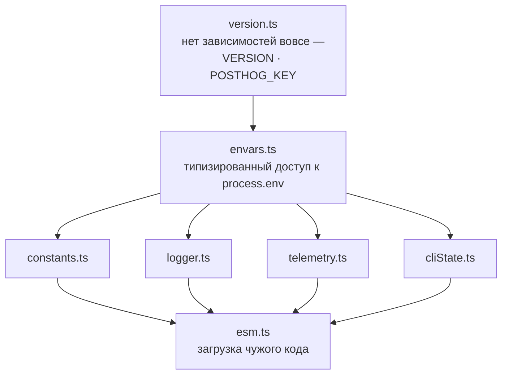
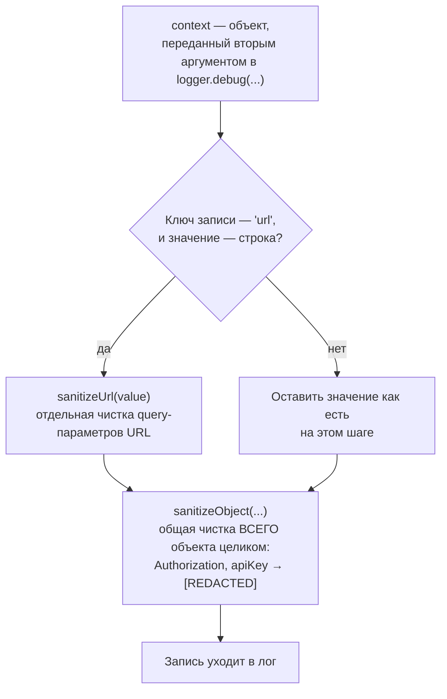
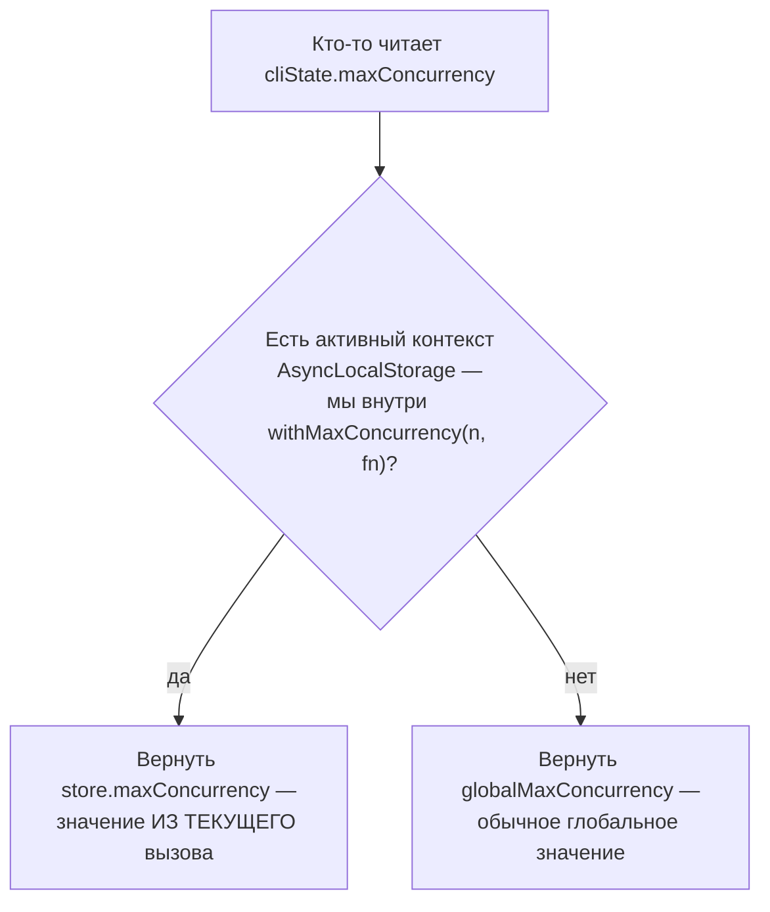
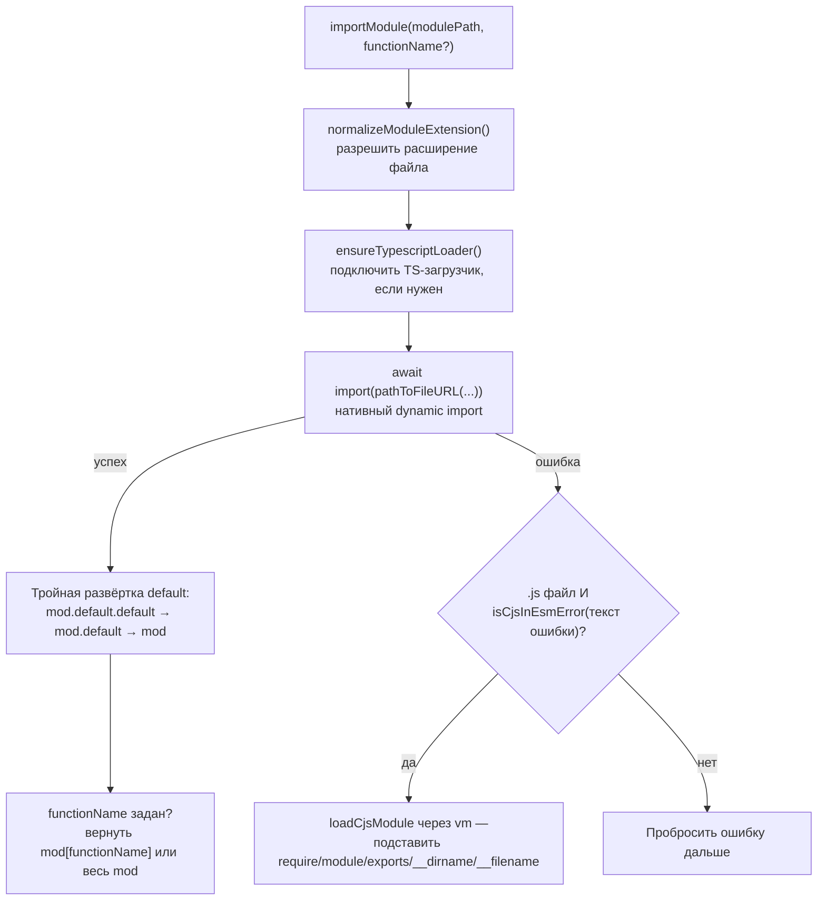

# Инфраструктурный хребет — семь сквозных служб

> Разбор через призму **Domain-Driven Design**. Диаграммы — ANSI-псевдографика.
> Дополняет [INDEX-COVERAGE.md](INDEX-COVERAGE.md), [UTIL.md](UTIL.md),
> [TYPES.md](TYPES.md), [CACHE.md](CACHE.md), [DATABASE.md](DATABASE.md),
> [ARCHITECTURE.md](ARCHITECTURE.md).
>
> Семь файлов, которые не принадлежат ни одной подсистеме и нужны каждой.
> По данным [INDEX-COVERAGE.md](INDEX-COVERAGE.md) они несут **82% непокрытого
> архитектурного веса в 18% его объёма**.
>
> Счёт строк здесь — по `wc -l`. Скрипт в [INDEX-COVERAGE.md](INDEX-COVERAGE.md)
> считает `count('\n') + 1`, то есть на единицу больше для каждого файла,
> оканчивающегося переводом строки: 2130 против 2123 на семь файлов.

---

## 0. Паспорт

```
╔══════════════════════════════════════════════════════════════════════════════╗
║  ХРЕБЕТ — то, на чём стоит всё остальное                                     ║
╠══════════════════════════════════════════════════════════════════════════════╣
║  файл                вход   строк   тест   что делает                        ║
║  ──────────────────────────────────────────────────────────────────────────  ║
║  logger.ts            384     559   1665   лог с обязательной санитизацией   ║
║  envars.ts            163     608    479   типизированный реестр окружения   ║
║  cliState.ts           55     117      0   состояние текущего запуска        ║
║  constants.ts          49      46    382   константы и адреса сервисов       ║
║  telemetry.ts          37     255    845   отправка событий в PostHog        ║
║  esm.ts                28     503    449   загрузка пользовательских модулей ║
║  version.ts             7      35    432   версия и ключ аналитики           ║
║  ──────────────────────────────────────────────────────────────────────────  ║
║  ИТОГО                723   2 123   4 252                                    ║
╠══════════════════════════════════════════════════════════════════════════════╣
║  Отношение тест/код ..... 2.00 : 1                                           ║
║  Слои ................... node (envars, cliState, esm, telemetry, version)   ║
║                           legacy-runtime (logger, constants)                 ║
║  AGENTS.md .............. НЕТ ни у одного                                    ║
╚══════════════════════════════════════════════════════════════════════════════╝
```

`logger.ts` — **второй по зависимости файл всей системы**: 384 входящих импорта
против 418 у `src/types/index.ts`. Разница между ними принципиальна: типы
импортируют, чтобы что-то описать, логгер — чтобы что-то сделать. Это самая
зависимая *исполняемая* единица promptfoo.

---

## 1. Что объединяет эти семь файлов

```
╔══════════════════════════════════════════════════════════════════════════════╗
║  ПРИЗНАК СКВОЗНОЙ СЛУЖБЫ                                                     ║
╠══════════════════════════════════════════════════════════════════════════════╣
║                                                                              ║
║   Обычная подсистема          Сквозная служба                                ║
║   ─────────────────────       ─────────────────────                          ║
║   знает свой домен            НЕ знает домена вообще                         ║
║   вызывается из немногих      вызывается отовсюду                            ║
║   мест по своей теме                                                         ║
║   у неё есть каталог          это один файл в корне src/                     ║
║   и AGENTS.md                                                                ║
║   имеет собственный           не имеет: она — часть языка,                   ║
║   единый язык                 на котором говорят другие                      ║
╠══════════════════════════════════════════════════════════════════════════════╣
║   Проверка признака: ни один из семи не импортирует ничего из                ║
║   assertions, matchers, redteam, server, app, optimizer, importers.          ║
║   Зависимости идут только вниз или вбок — внутри самого хребта.              ║
╚══════════════════════════════════════════════════════════════════════════════╝
```

Внутренний порядок хребта:

```
                     version.ts        нет зависимостей вовсе
                         │             VERSION · POSTHOG_KEY
                         ▼
                     envars.ts         типизированный доступ к process.env
                         │
            ┌────────────┼────────────┬──────────────┐
            ▼            ▼            ▼              ▼
      constants.ts   logger.ts   telemetry.ts   cliState.ts
            │            │            │              │
            └────────────┴─────┬──────┴──────────────┘
                               ▼
                            esm.ts     загрузка чужого кода

   Ниже всех — version.ts: 36 строк, которые ничего не импортируют.
   Выше всех — esm.ts: он загружает пользовательский код и потому
   должен знать и пути, и логгер, и окружение.
```

Тот же порядок как Mermaid-диаграмма:



**Своими словами.** Представь хребет как дом, который строили снизу вверх,
и в котором каждый следующий этаж опирается ровно на то, что уже построено
ниже. В фундаменте — `version.ts`: тридцать шесть строк, которым ничего
не нужно ни от одного другого этажа, только номер версии и ключ телеметрии,
зашитые прямо туда при сборке. На нём стоит первый этаж — `envars.ts`:
единственная дверь, через которую вообще разрешено спрашивать у
операционной системы значение переменной окружения. Выше — сразу четыре
отдельные комнаты, построенные бок о бок на одном и том же первом этаже
и не знающие друг о друге: константы, логгер, телеметрия и состояние
текущего запуска. Каждая из них использует только то, что дал первый
этаж, и ничего не берёт у соседних комнат. А крыша дома — `esm.ts`, потому
что именно ему, чтобы впустить в дом чужой код (провайдер или ассерт,
написанный пользователем), нужно заглянуть сразу во все четыре комнаты —
и в константы, и в логгер, и в телеметрию, и в состояние запуска. Стрелки
на диаграмме идут строго снизу вверх: нижний этаж никогда не знает о
существовании верхнего, а верхний не может быть построен, пока не готов
нижний.

---

## 2. `logger.ts` — санитизация как обязанность, а не опция

384 входящих импорта означают: любое решение в этом файле действует на всю
систему. Главное из них — **лог не может обойти санитизацию**.

```
╔══════════════════════════════════════════════════════════════════════════════╗
║  ПРАВИЛО ПРОЕКТА — docs/agents/logging.md                                    ║
╠══════════════════════════════════════════════════════════════════════════════╣
║                                                                              ║
║   ПРАВИЛЬНО                                                                  ║
║     logger.debug('[Provider]: Making API request', {                         ║
║       url, method, headers: { Authorization: 'Bearer secret-token' },        ║
║       body: { apiKey: 'secret-key', data: 'value' },                         ║
║     });                                                                      ║
║     → Authorization и apiKey становятся [REDACTED]                           ║
║                                                                              ║
║   АНТИПАТТЕРН                                                                ║
║     logger.debug(`Config: ${JSON.stringify(config)}`);                       ║
║     → секрет уже внутри СТРОКИ, санитизировать нечего                        ║
║                                                                              ║
║   Причина, названная в документе тремя пунктами:                             ║
║     Security    — секреты не утекают в лог                                   ║
║     Consistency — структурный лог ищется и разбирается                       ║
║     Safety      — содержимое тестов red team бывает вредоносным              ║
╚══════════════════════════════════════════════════════════════════════════════╝
```

Механика — `sanitizeContext:367`:

```
   ┌──────────────────────────────────────────────────────────────────────┐
   │  for (const [key, value] of Object.entries(context)) {               │
   │    if (key === 'url' && typeof value === 'string') {                 │
   │      contextWithSanitizedUrls[key] = sanitizeUrl(value);             │
   │    } else { … }                                                      │
   │  }                                                                   │
   │  return sanitizeObject(contextWithSanitizedUrls,                     │
   │                        { context: 'log context' });                  │
   └──────────────────────────────────────────────────────────────────────┘

   Два уровня: URL получает специальную обработку (в нём секрет
   прячется в query-параметрах), всё остальное — общий sanitizeObject.

   Тот же sanitizeObject работает в оптимизаторе перед отправкой примеров
   стороннему провайдеру (OPTIMIZER.md §8) и в кэше при построении ключа
   (CACHE.md §4). Одна функция, три границы утечки.
```

Та же механика как Mermaid-диаграмма:



**Своими словами.** Представь досмотр в аэропорту с двумя разными постами.
Сперва — отдельный, специальный пост для одной конкретной категории вещей:
жидкостей, которые проверяют не так, как остальной багаж, потому что
именно в них удобно что-то спрятать. В логе такая же особая категория —
поле `url`: секрет там прячется не на виду, а внутри строки запроса,
среди других параметров, и его вырезают отдельной функцией, `sanitizeUrl`,
ещё до общей проверки. Но досмотр на этом не заканчивается: весь чемодан
целиком, включая уже проверенные жидкости, всё равно проходит через общий
сканер (`sanitizeObject`) — тот, что ищет любые поля с говорящими именами
вроде `Authorization` или `apiKey` и стирает их значение, что бы ни было
внутри объекта. Два поста работают не вместо друг друга, а один за другим:
специальный — для одной заранее известной ловушки, общий — для всего
остального, включая то, что ещё не придумали заранее назвать по имени.

### Остальное содержимое logger.ts

```
   ┌── Уровни и переключение ─────────────────────────────────────────────┐
   │  LOG_LEVELS :35 · getLogLevel :203 · setLogLevel :207                │
   │  isDebugEnabled :219                                                 │
   └──────────────────────────────────────────────────────────────────────┘
   ┌── Файлы прогона и ротация ───────────────────────────────────────────┐
   │  MAX_LOG_FILES = 50               :13                                │
   │  setupLogDirectory :227 — при 50 и более файлах удаляет лишние       │
   │  createRunLogFile :261 — отдельный файл на каждый запуск,            │
   │    имя из ISO-времени с заменой : и . на -                           │
   │  PROMPTFOO_LOG_DIR переопределяет каталог                            │
   └──────────────────────────────────────────────────────────────────────┘
   ┌── Подмена и перехват ────────────────────────────────────────────────┐
   │  setLogger :341           заменить логгер целиком (тесты, встройка)  │
   │  setLogCallback :18       перехват для веб-интерфейса                │
   │  clearLogCallbackIfOwned :22  снимает ТОЛЬКО свой колбэк —           │
   │    иначе параллельный прогон снёс бы чужой перехват                  │
   │  setStructuredLogging :31 объект вместо строки, для облачных логов   │
   └──────────────────────────────────────────────────────────────────────┘
   ┌── Завершение ────────────────────────────────────────────────────────┐
   │  isLoggerShuttingDown — флаг, после которого записи не принимаются   │
   │  closeLogger :499 — дождаться сброса буферов winston                 │
   │  «Prevent new writes once shutdown starts»                           │
   └──────────────────────────────────────────────────────────────────────┘
   ┌── Отладка ───────────────────────────────────────────────────────────┐
   │  initializeSourceMapSupport :73 — ЛЕНИВО, только при debug           │
   │  getCallerLocation :97 — файл и строка вызывающего                   │
   └──────────────────────────────────────────────────────────────────────┘
```

Ленивая загрузка source maps — мелочь с большим эффектом: разбор карт
исходников дорог, а нужен только когда кто-то читает трассы.

---

## 3. `envars.ts` — 253 переменные, проверяемые компилятором

```
╔══════════════════════════════════════════════════════════════════════════════╗
║  РЕЕСТР ВМЕСТО process.env                                                   ║
╠══════════════════════════════════════════════════════════════════════════════╣
║                                                                              ║
║   Ключей в EnvVars ...... 253                                                ║
║     PROMPTFOO_* ......... 92    поведение самого инструмента                 ║
║     провайдерские и др. . 161   AWS(13) AZURE(12) OPENAI(9) REPLICATE(9)     ║
║                                 ANTHROPIC(5) COHERE(5) OPENCLAW(5) MISTRAL(4)║
║                                                                              ║
║   export type EnvVarKey = keyof EnvVars;                          :475       ║
║                                                                              ║
║   Следствие: getEnvString('PROMPTFO_API_KEY') — ОШИБКА КОМПИЛЯЦИИ.           ║
║   Опечатка в имени переменной окружения перестала быть тихой.                ║
╠══════════════════════════════════════════════════════════════════════════════╣
║   Четыре типизированных доступа с перегрузками:                              ║
║     getEnvString :483   getEnvBool :508                                      ║
║     getEnvInt    :525   getEnvFloat :545                                     ║
║                                                                              ║
║   Перегрузка решает вопрос, который иначе решался бы на каждом вызове:       ║
║     getEnvString(key)                 → string | undefined                   ║
║     getEnvString(key, defaultValue)   → string                               ║
╚══════════════════════════════════════════════════════════════════════════════╝
```

Разбор булева значения — редкий случай, когда стоит процитировать буквально:

```
   return ['1', 'true', 'yes', 'yup', 'yeppers'].includes(value.toLowerCase());
```

Всё, что не из этого списка, — ложь. То есть `PROMPTFOO_DISABLE_CACHE=0`,
`=off`, `=false`, `=disabled` и пустая строка дают одинаковое «выключено»,
а `yeppers` — включено. Список намеренно широк со стороны согласия и
намеренно строг со стороны отказа: случайное значение никогда не включит
флаг по ошибке.

### Определение среды

```
   isCI() :583 — тринадцать признаков подряд:
     CI · GITHUB_ACTIONS · TRAVIS · CIRCLECI · JENKINS · GITLAB_CI ·
     APPVEYOR · CODEBUILD_BUILD_ID · TF_BUILD · BITBUCKET_COMMIT ·
     BUDDY · BUILDKITE · TEAMCITY_VERSION

   isNonInteractive() :606
     return isCI() || !process.stdin.isTTY || !process.stdout.isTTY;

   ┌── Зачем ─────────────────────────────────────────────────────────────┐
   │  Прогресс-бары, интерактивные подсказки и живое переключение         │
   │  подробности (клавиша v в redteam/shared.ts) осмысленны только       │
   │  в терминале. В CI они превращают лог в мусор из управляющих         │
   │  последовательностей.                                                │
   └──────────────────────────────────────────────────────────────────────┘
```

---

## 4. `cliState.ts` — глобальное состояние, ставшее контекстным

Сто семнадцать строк, которые выглядят как антипаттерн — изменяемый
синглтон, — и на деле им не являются.

```
╔══════════════════════════════════════════════════════════════════════════════╗
║  ГЕТТЕР, ЧИТАЮЩИЙ AsyncLocalStorage                                          ║
╠══════════════════════════════════════════════════════════════════════════════╣
║                                                                              ║
║   const state: CliState = {                                                  ║
║     get maxConcurrency() {                                                   ║
║       const store = maxConcurrencyContext.getStore();                        ║
║       if (store) { return store.maxConcurrency; }   ← контекст вызова        ║
║       return globalMaxConcurrency;                  ← иначе глобальное       ║
║     },                                                                       ║
║     set maxConcurrency(value) { … симметрично … },                           ║
║     withMaxConcurrency(n, fn) {                                              ║
║       return maxConcurrencyContext.run({ maxConcurrency: n }, fn);           ║
║     },                                                                       ║
║   };                                                                         ║
╠══════════════════════════════════════════════════════════════════════════════╣
║   Старый код пишет cliState.maxConcurrency = 4 и работает.                   ║
║   Новый код оборачивает вызов в withMaxConcurrency и получает                ║
║   изоляцию: параллельные прогоны не видят настроек друг друга.               ║
║                                                                              ║
║   Миграция от глобального состояния к контекстному БЕЗ правки                ║
║   вызывающих. Ровно то, что делает геттер там, где было поле.                ║
╚══════════════════════════════════════════════════════════════════════════════╝
```

Тот же геттер как Mermaid-диаграмма:



**Своими словами.** Представь дом с одним общим правилом на входной двери —
«не больше четырёх гостей одновременно» — и отдельными комнатами, где иногда
на время вешают свою временную табличку с другим числом, только для тех,
кто сейчас в этой конкретной комнате. Когда кто-то спрашивает
`cliState.maxConcurrency`, происходит не чтение одной и той же общей
таблички всеми подряд, а сначала проверка: а не нахожусь ли я прямо сейчас
внутри комнаты со своей временной табличкой (это и есть `withMaxConcurrency` —
временный контекст на время одного конкретного вызова)? Если да — читается
число с этой временной таблички, и оно действует только здесь и сейчас,
не задевая остальной дом. Если нет — читается общее число с входной двери,
то самое, что было бы прочитано и старым кодом, который вообще не знает
о временных табличках. В этом и фокус переезда: старый код, который просто
читает `cliState.maxConcurrency` как обычное поле, продолжает работать без
единой правки — он просто никогда не оказывается внутри временной комнаты,
и потому всегда видит общее правило.

**Одно из пяти применений `AsyncLocalStorage` в системе.** Остальные —
[DATABASE.md §5](DATABASE.md) (определить «мы внутри транзакции»),
[CACHE.md §5](CACHE.md) (текущее пространство имён), `util/fetch/retryContext.ts`
(контекст повтора запроса) и `scheduler/providerCallExecutionContext.ts`
(см. [SCHEDULER.md](SCHEDULER.md)). Один приём для одной задачи: узнать,
где мы находимся, не протаскивая параметр через каждый промежуточный вызов.

Что ещё держит `cliState`:

```
   basePath · config · selectedProviderConfigs      что запускаем
   remote · webUI                                    откуда запущено
   resume · retryMode · _retryErrorResultIds         режим повтора
   debugLogFile · errorLogFile                       куда пишем
   postActionCallback                                что сделать в конце
   requestTracingConfig · activeOtlpReceiver         трассировка

   ┌── Комментарий про retryMode — 11 строк, объясняющих различие ────────┐
   │  «resume mode skips all completed (testIdx, promptIdx) pairs;        │
   │   retryMode additionally excludes ERROR results from "completed"     │
   │   pairs, so they get re-evaluated instead of skipped.                │
   │   When retryMode is true, resume should also be true.»               │
   │                                                                      │
   │  И рядом — след конкретной правки:                                   │
   │  «_retryErrorResultIds … Added in v0.121.0 as part of the retry      │
   │   data safety fix.» (см. retry в NODE.md §8)                         │
   └──────────────────────────────────────────────────────────────────────┘

   Последняя строка файла:
     setEnvOverridesProvider(() => state.config?.env);
   — регистрация обратного вызова, через который envOverrides достаёт
   env из конфига, не импортируя cliState. Разрыв цикла зависимостей.
```

---

## 5. `constants.ts` — 46 строк с архитектурным предупреждением

```
   ┌── Комментарий, который стоит всего файла ────────────────────────────┐
   │                                                                      │
   │  // Re-export HUMAN_ASSERTION_TYPE from providers/constants for      │
   │  // backward compatibility (providers/constants is browser-safe,     │
   │  // constants.ts is not due to envars import)                        │
   └──────────────────────────────────────────────────────────────────────┘

   Здесь названа граница, которой нет в конституции слоёв: БРАУЗЕРНАЯ
   БЕЗОПАСНОСТЬ. `envars.ts` трогает process.env, значит всё, что его
   импортирует, непригодно для сборки фронтенда. `constants.ts` заражён
   транзитивно — и потому существует `providers/constants` как чистый
   двойник для APP.md.

   Ни layers.json, ни architecture:check это не проверяют. Ограничение
   держится на комментарии.
```

Содержимое — адреса и умолчания:

```
   DEFAULT_QUERY_LIMIT      100
   DEFAULT_MAX_CONCURRENCY  4         ← сравните со SCHEDULER.md
   DEFAULT_API_BASE_URL     https://api.promptfoo.app
   CLOUD_PROVIDER_PREFIX    promptfoo://provider/
   CONSENT_ENDPOINT         https://api.promptfoo.dev/consent
   EVENTS_ENDPOINT          https://a.promptfoo.app
   R_ENDPOINT               https://r.promptfoo.app/

   TERMINAL_MAX_WIDTH — вычисляется при загрузке модуля:
     isTTY && columns > 10 ? columns - 10 : 120

   Четыре функции вместо констант, потому что каждая читает окружение:
     getShareApiBaseUrl · getDefaultShareViewBaseUrl ·
     getShareViewBaseUrl · getDefaultPort (15500)
```

Три адреса телеметрии в файле общих констант — это и есть ответ на вопрос
«куда именно уходят данные»: `a.promptfoo.app` для событий,
`api.promptfoo.dev/consent` для согласия, `r.promptfoo.app` для перенаправлений.

---

## 6. `telemetry.ts` — четыре выключателя и один симметричный аргумент

```
╔══════════════════════════════════════════════════════════════════════════════╗
║  ЧТО ВЫКЛЮЧАЕТ ОТПРАВКУ                                                      ║
╠══════════════════════════════════════════════════════════════════════════════╣
║   PROMPTFOO_DISABLE_TELEMETRY   явный отказ пользователя                     ║
║   IS_TESTING                    тесты не шлют событий                        ║
║   POSTHOG_KEY === ''            в dev-сборке ключа нет вовсе                 ║
║   TELEMETRY_TIMEOUT_MS = 1000   отправка не задерживает выход дольше секунды ║
╠══════════════════════════════════════════════════════════════════════════════╣
║   Ключ приходит из version.ts и попадает туда только на production-сборке:   ║
║     export const POSTHOG_KEY: string =                                       ║
║       typeof __PROMPTFOO_POSTHOG_KEY__ === 'undefined' ? '' : …              ║
║                                                                              ║
║   То есть локальная сборка из исходников физически не может отправить        ║
║   событие — не потому, что проверяет флаг, а потому что ключа нет.           ║
╚══════════════════════════════════════════════════════════════════════════════╝

   ┌── Деталь, объяснённая в комментарии ─────────────────────────────────┐
   │  «Without this, PostHog's internal setInterval keeps the Node.js     │
   │   event loop [alive]»                                                │
   │                                                                      │
   │  Клиент аналитики держал бы процесс promptfoo незавершённым.         │
   │  Для CLI это означало бы, что команда отработала, а терминал         │
   │  не возвращается.                                                    │
   └──────────────────────────────────────────────────────────────────────┘

   telemetryDisabledRecorded — флаг «уже записали, что телеметрия
   отключена». Симметричный аргумент: даже отказ фиксируется ровно один
   раз, а не при каждом вызове.

   Экземпляр создаётся с initializeImmediately: false — идентификация
   пользователя откладывается до первого события, чтобы импорт модуля
   не делал сетевых обращений.
```

---

## 7. `esm.ts` — загрузка чужого кода и честное предупреждение

Самый большой файл хребта (503 строки) и единственный, кто исполняет
код, который написал не автор promptfoo: пользовательские провайдеры,
ассерты, хуки, промпт-функции из `file://`.

```
╔══════════════════════════════════════════════════════════════════════════════╗
║  importModule(modulePath, functionName?)                          :243       ║
╠══════════════════════════════════════════════════════════════════════════════╣
║                                                                              ║
║   normalizeModuleExtension(modulePath)              :167                     ║
║        │  разрешить расширение                                               ║
║   ensureTypescriptLoader(loadPath)                  :148                     ║
║        │  подключить загрузчик TS, если нужен                                ║
║   await import(pathToFileURL(safeResolve(loadPath)))                         ║
║        │  «Native dynamic import - no eval() needed in ESM-only environment» ║
║        ▼                                                                     ║
║   mod = importedModule?.default?.default                                     ║
║      || importedModule?.default                                              ║
║      || importedModule                                                       ║
║        ▲ тройная развёртка: транспиляторы заворачивают default по-разному    ║
║        ▼                                                                     ║
║   functionName ? mod[functionName] : mod                                     ║
║                                                                              ║
║   catch → если .js И isCjsInEsmError(msg) → loadCjsModule через vm           ║
╚══════════════════════════════════════════════════════════════════════════════╝
```

Тот же конвейер как Mermaid-диаграмма:



**Своими словами.** Представь, что пытаешься открыть чужую дверь одним и тем
же современным ключом, который подходит к большинству новых замков без
всяких ухищрений — это нативный `import`, просто пробуешь войти напрямую,
без всякого обходного трюка вроде `eval`. Перед тем как вставить ключ,
сначала на всякий случай проверяешь, тот ли это тип двери и не нужен ли
особый переходник для старого протокола (`normalizeModuleExtension`,
`ensureTypescriptLoader`). Если ключ подошёл — дверь открылась, но за ней
иногда обнаруживается ещё одна вложенная дверь, потом ещё одна: некоторые
сборщики заворачивают то, что реально нужно, в лишний слой `default`,
поэтому приходится разворачивать вложенность до трёх раз подряд, пока не
покажется настоящая комната. А если ключ НЕ подошёл — не сдаёшься сразу,
а сначала читаешь табличку отказа: если это конкретно файл с расширением
`.js`, а сообщение об ошибке похоже на одну из семи знакомых формулировок
(«require is not defined» и подобные), значит дверь на самом деле старого
образца — написана в другом протоколе (CommonJS), который новым ключом не
открывается в принципе. Тогда в ход идёт запасной инструмент — не отмычка,
а полноценный дубликат замка старого образца, собранный вручную (`vm`),
с подставленными `require`, `module`, `exports` и именами файла и
каталога — теми самыми деталями, которые старый протокол ожидает найти
на месте. Если же табличка отказа говорит о чём-то совсем другом — дверь
просто не открылась, и ошибка идёт дальше как есть.

### Распознавание CommonJS в мире ESM

```
   isCjsInEsmError :354 — семь признаков по тексту ошибки:
     'require is not defined'      прямой вызов require()
     'module is not defined'       module.exports
     'exports is not defined'      exports.x
     '__dirname is not defined'    глобальная переменная CJS
     '__filename is not defined'   она же
     'Cannot use import statement' смешанный случай
     'ERR_REQUIRE_ESM'             код ошибки Node

   ┌── Почему нельзя проще ───────────────────────────────────────────────┐
   │  «createRequire() doesn't work for .js files in "type": "module"     │
   │   packages because Node.js still treats them as ESM based on         │
   │   package.json. We use Node's vm module to execute the code with     │
   │   proper CJS globals.»                                               │
   │                                                                      │
   │  Пользователь написал провайдер на CommonJS, положил его рядом       │
   │  с package.json, где "type": "module". Node откажется. promptfoo     │
   │  исполнит его в vm-контексте с подставленными require, module,       │
   │  exports, __dirname, __filename.                                     │
   └──────────────────────────────────────────────────────────────────────┘
```

### Предупреждение, которое стоит выделить

```
   ┌── SECURITY NOTE, дословно из :378 ───────────────────────────────────┐
   │                                                                      │
   │  «This is NOT a security sandbox. The executed code has full access  │
   │   to the file system, network, etc. via the injected require         │
   │   function and process object.»                                      │
   │                                                                      │
   │  Модуль vm в Node часто принимают за песочницу. Здесь прямо          │
   │  сказано, что это не так, и названа причина — инъекция require       │
   │  и process. Пользовательский провайдер имеет те же права, что        │
   │  и сам promptfoo, и это осознанно: «custom providers, assertions,    │
   │  hooks … need full Node.js capabilities».                            │
   └──────────────────────────────────────────────────────────────────────┘

   Плюс getWrapperDir(type) :59 для 'python' | 'ruby' | 'golang' —
   поиск скриптов-обёрток, которые postbuild копирует в dist
   (см. вывод npm run build). Это стык хребта с мостами в чужие языки.
```

---

## 8. `version.ts` — 35 строк, определяющих три сборки

```
   declare const __PROMPTFOO_VERSION__: string | undefined;
   declare const __PROMPTFOO_POSTHOG_KEY__: string | undefined;

   ┌── Три среды, три источника ──────────────────────────────────────────┐
   │  production (tsdown `define`)  константа ВСТРАИВАЕТСЯ в код          │
   │  разработка (npm scripts)      process.env.npm_package_version       │
   │  браузер                       VITE_PROMPTFOO_VERSION                │
   │  ничего из этого               '0.0.0-development' и '' для ключа    │
   └──────────────────────────────────────────────────────────────────────┘

   ┌── Замечание про entrypoint ──────────────────────────────────────────┐
   │  «__PROMPTFOO_NODE_ENGINE_RANGE__ … are also injected at build time, │
   │   but are declared in entrypoint.ts to maintain its zero-dependency  │
   │   isolation. The entrypoint must check Node version before importing │
   │   any modules.»                                                      │
   │                                                                      │
   │  Точка входа обязана проверить версию Node ДО первого импорта —      │
   │  иначе синтаксис из новой версии уронит процесс раньше, чем          │
   │  успеет появиться внятное сообщение. Поэтому константы движка        │
   │  объявлены не здесь, а там, и entrypoint.ts не импортирует ничего.   │
   └──────────────────────────────────────────────────────────────────────┘
```

Семь входящих импортов при 35 строках — самый низкий вес в хребте. Но это
единственный файл, чьё значение меняется в зависимости от того, как собран
пакет, и потому у него 432 строки тестов.

---

## Диагноз

```
╔══════════════════════════════════════════════════════════════════════════════╗
║                              ДИАГНОЗ ХРЕБТА                                  ║
╠══════════════════════════════════════════════════════════════════════════════╣
║  СИЛЬНЫЕ СТОРОНЫ                                                             ║
║                                                                              ║
║  ✔ Санитизация встроена в сам акт логирования, а не оставлена на             ║
║    вызывающего. Та же sanitizeObject закрывает три границы утечки:           ║
║    лог, ключ кэша, примеры для провайдера подсказок.                         ║
║                                                                              ║
║  ✔ 253 переменные окружения проверяются компилятором через                   ║
║    keyof EnvVars. Опечатка в имени перестала быть тихой ошибкой.             ║
║                                                                              ║
║  ✔ Разбор булева асимметричен: широкий список согласия, всё                  ║
║    остальное — отказ. Случайное значение не включит флаг.                    ║
║                                                                              ║
║  ✔ cliState мигрирует от глобального состояния к контекстному через          ║
║    геттер над AsyncLocalStorage — без правки вызывающего кода.               ║
║    Один из пяти носителей приёма в системе.                                  ║
║                                                                              ║
║  ✔ Ключ аналитики физически отсутствует в сборке из исходников —             ║
║    отправка невозможна, а не запрещена флагом.                               ║
║                                                                              ║
║  ✔ vm-исполнение CJS честно помечено как НЕ песочница, с названной           ║
║    причиной и обоснованием, зачем такие права нужны.                         ║
║                                                                              ║
║  ✔ Отношение тест/код 2.00:1 при 4252 строках тестов.                        ║
║                                                                              ║
║  ✔ Ленивая загрузка source maps и отложенная идентификация телеметрии:       ║
║    импорт модуля не делает дорогой работы и не ходит в сеть.                 ║
╠══════════════════════════════════════════════════════════════════════════════╣
║  СЛАБЫЕ МЕСТА                                                                ║
║                                                                              ║
║  ✘ cliState.ts — ЕДИНСТВЕННЫЙ файл хребта без собственного теста, при        ║
║    55 входящих импортах и при том, что он держит режим повтора,              ║
║    пути логов и конфигурацию трассировки.                                    ║
║                                                                              ║
║  ✘ Граница «браузерная безопасность» существует только в комментарии         ║
║    constants.ts. layers.json её не знает, architecture:check не проверяет.   ║
║    Один импорт envars в browser-safe модуль сломает сборку фронтенда.        ║
║                                                                              ║
║  ✘ Правило логирования (объект вторым аргументом) не проверяется ничем.      ║
║    Антипаттерн из docs/agents/logging.md — обычный вызов с шаблонной         ║
║    строкой — пройдёт и линтер, и CI. Сравните с sqlSafety.test.ts,           ║
║    который ищет sql.raw() по всему src/ (DATABASE.md §8).                    ║
║                                                                              ║
║  ✘ Ни у одного из семи файлов нет AGENTS.md, при 723 входящих импортах       ║
║    на всех. Правила живут в docs/agents/logging.md и в комментариях.         ║
║                                                                              ║
║  ✘ constants.ts вычисляет TERMINAL_MAX_WIDTH при загрузке модуля.            ║
║    Изменение размера окна после старта не учитывается.                       ║
║                                                                              ║
║  ✘ Распознавание CJS — сопоставление с текстом сообщения об ошибке.          ║
║    Смена формулировки в Node сломает откат молча, теста на это нет.          ║
║                                                                              ║
║  ✘ Тринадцать признаков CI перечислены вручную. Новая система сборки         ║
║    не определится, и prompfoo будет рисовать прогресс-бары в её логах.       ║
╚══════════════════════════════════════════════════════════════════════════════╝
```

### Оценка по осям

```
  Защита от утечек             █████████░   9/10   санитизация в самом логе
  Типобезопасность окружения   █████████░   9/10   253 ключа через keyof
  Работа с контекстом          █████████░   9/10   AsyncLocalStorage, миграция без правок
  Честность о рисках           █████████░   9/10   «NOT a security sandbox»
  Покрытие тестами             ███████░░░   7/10   2.00:1, но cliState без теста
  Совместимость сред           ███████░░░   7/10   три сборки, CJS в ESM, но по тексту ошибок
  Проверяемость правил         ███░░░░░░░   3/10   ни logging, ни browser-safe не в CI
  Документированность          ███░░░░░░░   3/10   нет AGENTS.md ни у одного файла
  ─────────────────────────────────────────────────────────────────────────────
  ИНТЕГРАЛЬНО                  ███████░░░   7.0/10
```

Хребет сделан людьми, которые понимали, что 384 импорта не дают права на
ошибку. Слабость одна и общая: **правила этого слоя нигде не проверяются**.
Санитизацию можно обойти шаблонной строкой, браузерную границу — одним
импортом, и ни то, ни другое не уронит CI.

---

## Рекомендации по эволюции

1. **Фитнес-функция на антипаттерн логирования.** По образцу
   `sqlSafety.test.ts`: обойти `src/`, найти вызовы `logger.*` с шаблонной
   строкой, содержащей `${`, и падать. Правило из `docs/agents/logging.md`
   станет проверяемым, а не рекомендательным.

2. **Фитнес-функция на браузерную границу.** Список browser-safe модулей
   плюс проверка, что ни один из них не импортирует `envars`, `cliState`,
   `logger` транзитивно. Сейчас граница держится на одном комментарии
   в `constants.ts`.

3. **Написать `test/cliState.test.ts`.** 55 входящих импортов, режим повтора,
   пути логов, конфигурация трассировки — и ноль тестов. Начать с изоляции:
   два параллельных `withMaxConcurrency` не должны видеть значений друг друга.

4. **Завести один `src/SPINE.AGENTS.md`** на все семь файлов: правило
   санитизации, запрет на `process.env` в обход `envars`, браузерная граница,
   предупреждение про vm. Отдельные AGENTS.md для файла на 36 строк избыточны,
   общий — нет.

5. **Заменить распознавание CJS на пробное разрешение.** Вместо разбора
   текста ошибки — попытаться определить тип модуля заранее по содержимому
   и ближайшему `package.json`. Как минимум добавить тест, фиксирующий
   текущие семь формулировок.

6. **Сделать `TERMINAL_MAX_WIDTH` функцией.** Одна строка, снимающая класс
   странностей при изменении размера окна во время долгого прогона.

7. **Заменить список CI на библиотеку или дополнить эвристикой.** Тринадцать
   имён — это тринадцать систем, о которых знали на момент написания.

---

## Карта хребта

```
src/version.ts ..................................... 35   вход 7
     VERSION · POSTHOG_KEY — встраиваются tsdown через define
     примечание про entrypoint.ts и его нулевые зависимости

src/envars.ts ..................................... 608   вход 163
     EnvVars                            253 ключа (92 PROMPTFOO_*)
     EnvVarKey = keyof EnvVars          :475
     getEnvString :483 · getEnvBool :508 · getEnvInt :525 · getEnvFloat :545
     getEvalTimeoutMs :565 · getMaxEvalTimeMs :575
     isCI :583 (13 признаков) · isNonInteractive :606

src/constants.ts ................................... 46   вход 49
     DEFAULT_QUERY_LIMIT · DEFAULT_MAX_CONCURRENCY 4
     DEFAULT_API_BASE_URL · CLOUD_PROVIDER_PREFIX
     CONSENT_ENDPOINT · EVENTS_ENDPOINT · R_ENDPOINT
     getShareApiBaseUrl · getShareViewBaseUrl · getDefaultPort (15500)
     TERMINAL_MAX_WIDTH — вычисляется при загрузке
     ⚠ комментарий о браузерной границе

src/logger.ts ..................................... 559   вход 384
     setLogCallback :18 · clearLogCallbackIfOwned :22
     setStructuredLogging :31 · LOG_LEVELS :35
     SanitizedLogContext :48
     setLoggerShuttingDown :64 · getLoggerShuttingDown :69
     initializeSourceMapSupport :73 (лениво) · getCallerLocation :97
     consoleFormatter :151 · fileFormatter :175 · winstonLogger :185
     getLogLevel :203 · setLogLevel :207 · isDebugEnabled :219
     setupLogDirectory :227 (MAX_LOG_FILES = 50) · createRunLogFile :261
     initializeRunLogging :274 · createLogMethod :305 · setLogger :341
     sanitizeContext :367  ← ГЛАВНОЕ
     createLogMethodWithContext :395 · logRequestResponse :452
     closeLogger :499

src/cliState.ts ................................... 117   вход 55  ✘ без теста
     ActiveOtlpReceiver · CliState
     maxConcurrencyContext · requestTracingConfigContext  (AsyncLocalStorage)
     геттеры/сеттеры поверх контекста
     withMaxConcurrency · withRequestTracingConfig · setActiveOtlpReceiver
     setEnvOverridesProvider(() => state.config?.env)   разрыв цикла

src/telemetry.ts .................................. 255   вход 37
     getPostHogClient :18 (4 выключателя) · TELEMETRY_TIMEOUT_MS 1000
     getRuntimeMetadata :44 · class Telemetry :53
     telemetry = new Telemetry(false)   отложенная инициализация
     Symbol.for('promptfoo.telemetry.instance') — единственность экземпляра

src/esm.ts ........................................ 503   вход 28
     WrapperType 'python'|'ruby'|'golang' · getWrapperDir :59
     resolvePackageEntryPoint :125 · ensureTypescriptLoader :148
     normalizeModuleExtension :167 · getDirectory :206
     importModule :243  ← загрузка пользовательского кода
     isCjsInEsmError :354 (7 признаков) · loadCjsModule :378
     ⚠ SECURITY NOTE: vm — НЕ песочница

Связанные файлы:
    docs/agents/logging.md .............  правило и антипаттерн
    src/util/sanitizer.ts ..............  sanitizeObject, sanitizeUrl
    src/envOverrides.ts ................  получает env через колбэк
    src/entrypoint.ts ..................  проверка версии Node до импортов
    src/providers/constants.ts .........  browser-safe двойник constants.ts
    test/ ..............................  4252 строки на семь файлов
```

---

## Команды

```bash
# Вес каждого файла хребта (fan-in) — скрипт в INDEX-COVERAGE.md
wc -l src/logger.ts src/envars.ts src/cliState.ts src/constants.ts \
      src/telemetry.ts src/esm.ts src/version.ts

# ГЛАВНОЕ в logger: санитизация каждого контекста
grep -n -A 14 'function sanitizeContext' src/logger.ts

# Реестр окружения: сколько ключей и какие семейства
python3 -c "
import re
s=open('src/envars.ts',encoding='utf-8').read()
b=re.search(r'(?:type|interface) EnvVars[^{]*\{(.*?)\n\}', s, re.S).group(1)
k=re.findall(r'^\s+([A-Z][A-Z_0-9]*)\??:', b, re.M)
print('всего', len(k), '| PROMPTFOO_*', sum(1 for x in k if x.startswith('PROMPTFOO')))"

# Разбор булева значения
grep -n "yeppers" src/envars.ts

# Определение CI — тринадцать признаков
grep -n -A 16 'export function isCI' src/envars.ts

# AsyncLocalStorage: три применения в системе
grep -rn 'AsyncLocalStorage' src/ --exclude-dir=node_modules | grep -v test

# Браузерная граница — только комментарий, проверки нет
grep -n -B 2 'browser-safe' src/constants.ts

# vm — не песочница
grep -n -A 4 'SECURITY NOTE' src/esm.ts

# Выключатели телеметрии
grep -n 'DISABLE_TELEMETRY\|IS_TESTING\|TELEMETRY_TIMEOUT_MS' src/telemetry.ts

# Тесты хребта
npx vitest run test/logger.test.ts test/envars.test.ts test/constants.test.ts \
  test/telemetry.test.ts test/esm.test.ts
```

---

*Документ описывает семь файлов инфраструктурного хребта на коммите `2c140ef`,
promptfoo 0.122.0. Дата среза — 27 августа 2026.*
