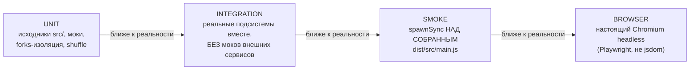
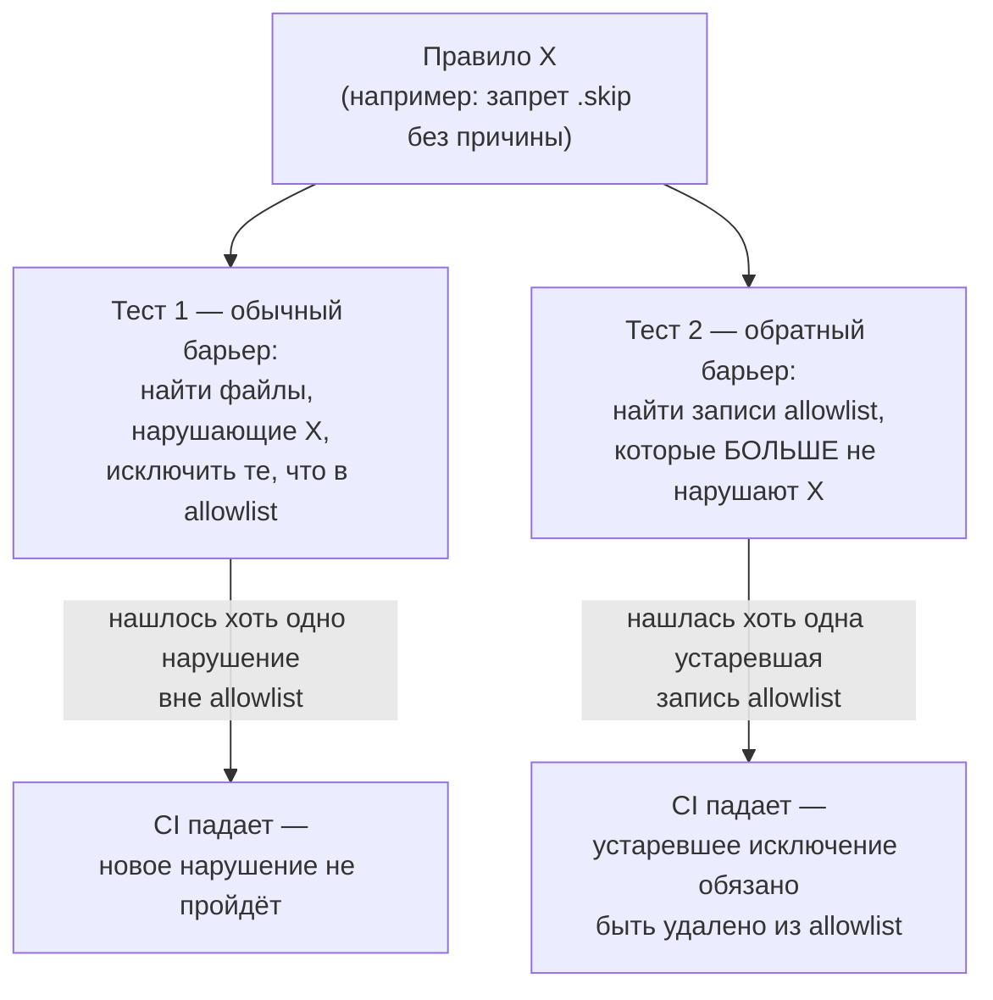
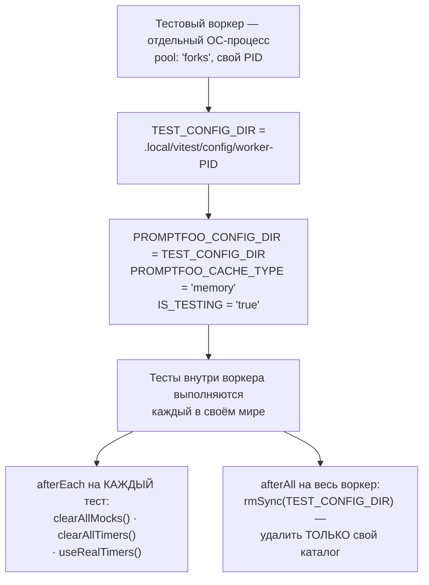
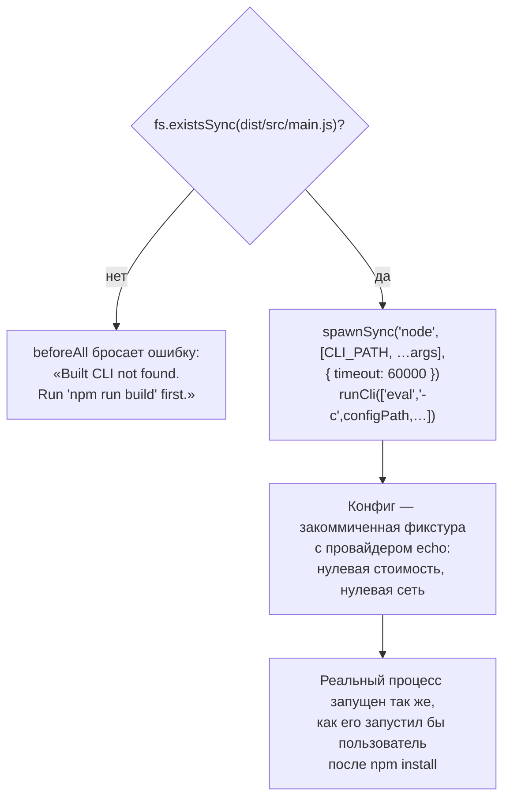

# Тестовая архитектура — `test/`

> Разбор через призму **Domain-Driven Design**. Диаграммы — ANSI-псевдографика.
> Дополняет [DATABASE.md](DATABASE.md), [CACHE.md](CACHE.md), [SPINE.md](SPINE.md),
> [ARCHITECTURE.md](ARCHITECTURE.md).
>
> Первый разбор за пределами `src/`. Здесь живут фитнес-функции, которые
> цитировались по всей серии — `sqlSafety.test.ts` в [DATABASE.md](DATABASE.md),
> границы слоёв в конституции — и механизм, который держит их все от гниения.

---

## 0. Паспорт

```
╔══════════════════════════════════════════════════════════════════════════════╗
║  test/ — 1114 файлов, 459 928 строк backend-тестов (.ts/.tsx)                ║
╠══════════════════════════════════════════════════════════════════════════════╣
║  .ts/.tsx ................ 872    из них *.test.* ................. 845      ║
║  .yaml (фикстуры) ........ 126                                               ║
║  .py (мосты) .............. 22    .js/.mjs/.cjs (фикстуры) .......... 55     ║
║  прочее ................... 39    (.json, .jsonl, .md, .txt, .rb, .go, …)    ║
║       ▲ включая 12 файлов внутри __fixtures__/mock-packages/node_modules —   ║
║         намеренно закоммиченные фикстуры резолва пакетов, не мусор           ║
╠══════════════════════════════════════════════════════════════════════════════╣
║  Плюс frontend: src/app/**/*.test.tsx ............. 285 файлов               ║
║  Плюс браузерные: src/app/**/*.browser.tsx ...........  1 файл (Playwright)  ║
╠══════════════════════════════════════════════════════════════════════════════╣
║  Конфигураций vitest ..... 4    unit · integration · smoke · browser         ║
║  AGENTS.md ............... ЕСТЬ, самый длинный из встречавшихся в серии      ║
╚══════════════════════════════════════════════════════════════════════════════╝
```

1114 файлов — это тестовая архитектура сопоставимого масштаба с `src/` целиком
(1613 файлов). Она не просто проверяет продукт — она **защищает сама себя**:
крупнейший файл каталога, `test-hygiene.test.ts`, не тестирует promptfoo,
а тестирует остальные тесты.

---

## 1. Единый язык

| Термин | Носитель в коде | Смысл в предметной области |
| --- | --- | --- |
| **Unit test** | `test/**/*.test.ts` | Изолированный тест, мокает внешние зависимости |
| **Integration test** | `**/*.integration.test.ts` | Реальные подсистемы вместе; отдельный конфиг и запуск |
| **Smoke test** | `test/smoke/*.test.ts` | Проверка **собранного** `dist/src/main.js`, а не исходников |
| **Browser test** | `*.browser.tsx` | Реальный Chromium через Playwright, а не jsdom |
| **Architecture test** | `test/architecture/*.test.ts` | Проверка структурных инвариантов кода как AST, а не поведения |
| **Hygiene suite** | `test/test-hygiene.test.ts` | Тест, который проверяет остальные тесты на паттерны риска |
| **Allowlist entry** | `AllowedSkip`, `legacySleepPromiseFiles`, … | Явно разрешённое исключение из правила, с обязанным сроком годности |
| **Stale allowlist check** | `keeps the … allowlist scoped to active …` | Тест, что запись в allowlist ещё нужна — не забытая индульгенция |
| **Fake timers** | `vi.useFakeTimers()` | Замена реального времени детерминированным для тестов таймеров |
| **Worker isolation** | `pool: 'forks'`, `TEST_CONFIG_DIR` | Каждый тестовый процесс — отдельный ОС-процесс с личным каталогом конфига |

---

## 2. Четыре яруса пирамиды, а не три

```
╔══════════════════════════════════════════════════════════════════════════════╗
║  ЧТО ПРОВЕРЯЕТСЯ                    КОНФИГ                     ЧТО ЗАПУСКАЕТ ║
╠══════════════════════════════════════════════════════════════════════════════╣
║                                                                              ║
║  UNIT              vitest.config.ts              test/**/*.test.ts           ║
║    исходники src/, замоканные зависимости, forks-изоляция, shuffle           ║
║                                                                              ║
║  INTEGRATION        vitest.integration.config.ts  **/*.integration.test.ts   ║
║    реальные подсистемы вместе, БЕЗ моков внешних сервисов                    ║
║                                                                              ║
║  SMOKE               vitest.smoke.config.ts        test/smoke/*.test.ts      ║
║    spawnSync НАД СОБРАННЫМ dist/src/main.js — то, что реально ставит         ║
║    себе пользователь через npm install                                       ║
║                                                                              ║
║  BROWSER              vitest.browser.config.ts     src/**/*.browser.tsx      ║
║    настоящий Chromium headless через Playwright — не jsdom-имитация DOM      ║
╚══════════════════════════════════════════════════════════════════════════════╝
```

Те же четыре яруса как Mermaid-диаграмма:



**Своими словами.** Представь приёмку нового станка на заводе в четыре
этапа, где каждый следующий этап проверяет то, что предыдущий физически
не мог проверить. Первый этап — проверка чертежей и отдельных деталей
на столе у инженера, часть деталей заменена муляжами для скорости (unit —
исходники и моки). Второй — уже настоящая сборка нескольких узлов вместе,
без муляжей, чтобы посмотреть, как они по-настоящему взаимодействуют
(integration). Третий этап — самый коварный: станок, который прекрасно
работал на инженерном столе, может отказать после того, как его
упаковали, отвезли и распаковали на месте — потому что что-то забыли
положить в ящик или инструкция по сборке устарела. Поэтому здесь берут
не чертёж, а уже упакованный и распакованный станок и включают именно
его (smoke — `spawnSync` над `dist/`, тем самым файлом, который получит
покупатель). А четвёртый этап проверяет не сам станок, а то, как с ним
реально работает человек за настоящим пультом управления, а не за
нарисованной имитацией пульта (browser — настоящий Chromium, а не
jsdom). Ни один из четырёх этапов не заменяет остальные — зелёный
чертёж ничего не говорит о том, доедет ли станок целым до склада.

Разница между **unit** и **smoke** — не в глубине, а в **объекте проверки**.
Unit-тест может быть зелёным, а собранный пакет — сломан: ошибка в
`package.json` `exports`, забытый файл в `.npmignore`, путь, который работает
из исходников, но не из `dist/`. Smoke-тест ловит именно это, запуская
`node dist/src/main.js eval …` как обычный пользователь — через `spawnSync`,
а не через импорт модуля.

`vitest.setup.ts` подключается только к unit-конфигу. Integration и smoke
намеренно идут в обход общего мока окружения — им нужна не имитация,
а нечто ближе к реальности.

---

## 3. Тест, который проверяет тесты

`test/test-hygiene.test.ts` — 1369 строк, крупнейший одиночный файл каталога.
Он не знает о promptfoo как о продукте вообще. Его предмет — **сам код теста**,
разобранный через настоящий парсер (`oxc-parser`), а не через regexp по тексту.

```
╔══════════════════════════════════════════════════════════════════════════════╗
║  ЧТО ПРОВЕРЯЕТСЯ AST-АНАЛИЗОМ ИСХОДНИКОВ КАЖДОГО ТЕСТА                       ║
╠══════════════════════════════════════════════════════════════════════════════╣
║   ✘ .only()                      — фокус-режим, забытый перед коммитом       ║
║   ✘ .skip() без записи в allowlist — молчаливо выключенный тест              ║
║   ✘ прямая мутация process.env    — process.env.FOO = 'x' в случайном тесте  ║
║   ✘ снимок process.env по ссылке  — const env = process.env (не копия!)      ║
║   ✘ setTimeout-based sleep-ожидание — await new Promise(r => setTimeout(r))  ║
║   ✘ зависшие hoisted-моки без reset — vi.hoisted() без mockReset в beforeEach║
╚══════════════════════════════════════════════════════════════════════════════╝
```

### Почему AST, а не regexp

```
   Комментарий из providerRedteamBoundary.test.ts, применимый и здесь:

   «A single combined regex with an optional `from` clause backtracks
    incorrectly across multi-line imports (the lazy body happily hops
    to the next `from` on the next line)…»

   test-hygiene.test.ts парсит файл через oxc-parser и обходит дерево по
   visitorKeys — так же, как это делает сам компилятор. .only, спрятанный
   в комментарии или в строке '.only()', НЕ считается вызовом: AST различает
   код и текст, которые для regexp неотличимы.
```

### Паттерн, повторяющийся шесть раз: правило + страж allowlist'а

Каждая из шести проверок реализована **парой** тестов, а не одним:

```
   it('keeps new root tests from adding X', () => {
     const violations = findFilesMatchingPolicy(hasX)
       .filter(file => !allowlist.has(file));
     expect(violations).toEqual([]);
   });

   it('keeps the X allowlist scoped to active violations', () => {
     const stale = findStalePolicyAllowlistFiles(allowlist, hasX);
     expect(stale).toEqual([]);          ◄── ключевое: allowlist не должен
   });                                        расти в одну сторону
```

Тот же парный паттерн как Mermaid-диаграмма:



**Своими словами.** Представь школу с освобождением от физкультуры по
справке. Справка — это запись в allowlist: «этому ученику разрешено не
бежать кросс, потому что…». За порядком следят два разных сотрудника,
а не один. Первый — обычный дежурный у входа на стадион: не пускает
бегать без уважительной причины любого, у кого нет справки, — это
привычная проверка, которую ожидаешь. Но есть и второй сотрудник, школьная
медсестра, которая раз в четверть перебирает ВСЕ справки и вычёркивает
любую, чей срок годности истёк или чей владелец уже здоров, — даже если
никто об этом не просил. Без второго сотрудника ящик со справками
превратился бы в кладбище: однажды выданное освобождение действовало бы
вечно, даже когда причина давно исчезла. Именно наличие ВТОРОГО, обратного
контролёра не даёт списку исключений расти только в одну сторону.

Первый тест — обычный барьер: новый файл с нарушением не пройдёт CI.
Второй — **обратный** барьер: если файл из allowlist перестал нарушать
правило (его почистили), запись в allowlist обязана исчезнуть тоже, иначе
тест падает. Без второго теста allowlist превратился бы в кладбище
устаревших исключений, которое никто не решается тронуть.

### Как выглядит запись исключения

```
   {
     file: 'python/worker.test.ts',
     kind: 'skip',
     linePattern: /process\.platform === 'win32' && process\.env\.CI
                   \? describe\.skip : describe/,
     reason: 'Python temp-file IPC is unreliable under Windows CI security policy',
   }
```

`linePattern` — не просто «этот файл разрешён», а «эта **конкретная** строка
кода разрешена». Добавить второй `.skip` в тот же файл — новое нарушение,
которое allowlist не покроет. `reason` обязателен и читается людьми —
16 таких записей на весь `test/`, и по каждой можно понять, почему исключение
существует, не открывая git blame.

Меньше десяти строк из 1369 отведено под сам `describe('root test hygiene')`
с тестами — остальное это инфраструктура парсинга AST, форматирования
сообщений об ошибке (`formatUsage` со ссылкой файл:строка:колонка) и
таблица allowlist. Инфраструктура одной проверки больше самой проверки —
это нормально для инструмента, который должен точно называть виновника.

---

## 4. Архитектурные тесты: границы как код, а не как документ

`test/architecture/` — два файла, 166 строк, и это ровно та проверка,
которую я цитировал в каждом разборе серии как «architecture:check».

```
╔══════════════════════════════════════════════════════════════════════════════╗
║  providerRedteamBoundary.test.ts — 149 строк                                 ║
╠══════════════════════════════════════════════════════════════════════════════╣
║   Инвариант: providers/index.ts, registry.ts, registryTypes.ts —             ║
║   ДИСПЕТЧЕР провайдеров — не должны СТАТИЧЕСКИ импортировать redteam.        ║
║                                                                              ║
║   Почему именно эти три файла, а не весь providers/ (из комментария):        ║
║   «Per-provider implementation files … may still import redteam utilities    ║
║    for unrelated reasons — the invariant this test protects is specifically  ║
║    that the *dispatch* path stays free of static redteam imports, so it is   ║
║    enumerated rather than globbed.»                                          ║
║                                                                              ║
║   Загрузка ЛЮБОГО провайдера не должна тянуть за собой весь red team —       ║
║   иначе простой promptfoo eval с OpenAI импортировал бы 155 плагинов         ║
║   атак, которыми никогда не воспользуется.                                   ║
║                                                                              ║
║   type-only импорты ИСКЛЮЧЕНЫ из проверки — они стираются компилятором       ║
║   и не создают реальной загрузки в рантайме.                                 ║
╚══════════════════════════════════════════════════════════════════════════════╝
```

Это тот же принцип, что `sqlSafety.test.ts` из [DATABASE.md §8](DATABASE.md):
архитектурное правило, которое иначе жило бы только в документации,
переведено в код, читающий исходники всей кодовой базы и падающий
на нарушении. Разница в масштабе — здесь два конкретных инварианта,
там один общий на весь `src/`, а `architecture:check` (упоминаемый
во всех предыдущих 30 документах) — третий, самый широкий слой той же идеи,
уже применённый ко всей матрице слоёв `architecture/layers.json`.

---

## 5. Изоляция: сколько процессов, столько миров

```
╔══════════════════════════════════════════════════════════════════════════════╗
║  vitest.config.ts — конкурентность и изоляция                                ║
╠══════════════════════════════════════════════════════════════════════════════╣
║   pool: 'forks'                                                              ║
║     «Worker threads share memory with the main process and can leak.         ║
║      When a fork dies or is recycled, the OS fully reclaims its memory.»     ║
║     ▲ дороже потоков, но течь памяти умирает вместе с процессом              ║
║                                                                              ║
║   maxWorkers = max(cpuCount - 2, 4)      два ядра оставлены системе          ║
║   isolate: true                          каждый файл теста — чистое окружение║
║   execArgv: ['--max-old-space-size=3072']  3 ГБ на воркер, с потолком        ║
║                                                                              ║
║   sequence: { shuffle: true }                                                ║
║     «Run tests in random order to catch test isolation issues early.»        ║
║     ▲ порядок — часть проверки: тест, зависящий от соседа, себя выдаст       ║
║       --sequence.seed=N воспроизводит конкретный сбойный прогон              ║
╚══════════════════════════════════════════════════════════════════════════════╝
```

### `vitest.setup.ts` — изоляция файловой системы по PID

```
   const TEST_CONFIG_DIR = path.join('.local', 'vitest', 'config',
                                      `worker-${process.pid}`);

   ┌── У КАЖДОГО воркера — свой ~/.promptfoo ────────────────────────────────┐
   │  PROMPTFOO_CONFIG_DIR: TEST_CONFIG_DIR                                  │
   │  PROMPTFOO_CACHE_TYPE: 'memory'                                         │
   │  IS_TESTING: 'true'                                                     │
   │                                                                         │
   │  Симметрично тому, что CACHE.md и DATABASE.md описывают для рантайма:   │
   │  IS_TESTING=true маршрутизирует БД на file::memory:?cache=shared,       │
   │  а конфигурация — на каталог, привязанный к PID процесса.               │
   │  Параллельные воркеры физически не могут столкнуться на диске.          │
   └────────────────────────────────────────────────────────────────────────┘

   afterAll убирает только СВОЙ каталог:
     rmSync(TEST_CONFIG_DIR, { recursive: true, force: true })
     «Each worker gets a unique config dir, so we can safely remove
      only its own files.»

   afterEach — три действия на КАЖДЫЙ тест, без исключений:
     vi.clearAllMocks()    очистка истории вызовов
     vi.clearAllTimers()   отмена зависших таймеров
     vi.useRealTimers()    возврат к настоящему времени, если тест
                           подменял его fake timers
```

Та же изоляция как Mermaid-диаграмма:



**Своими словами.** Представь общежитие, где у каждого жильца — не
просто своя комната, а своя комната под номером, равным его паспортному
номеру (PID процесса), и ключ от чужой комнаты физически не подходит
ни к одному другому замку. Заехав, жилец получает свой персональный
холодильник и свою персональную картотеку документов (`TEST_CONFIG_DIR`,
база данных в памяти) — соседи по коридору о них даже не узнают, а
значит, два жильца никогда не подерутся за один и тот же продукт на
одной полке. Между отдельными делами внутри СВОЕГО дня жилец каждый раз
приводит комнату в порядок по одному и тому же ритуалу: убирает
черновики со стола, выключает будильник, если переводил его вручную
(`afterEach` на каждый тест). А когда жилец окончательно выселяется, он
выносит мусор ТОЛЬКО из своей комнаты — комендант специально всем
объяснил, что у каждого номер комнаты уникальный, поэтому можно смело
не проверять чужие двери (`afterAll` удаляет только свой каталог).

Комментарий про выбор `clearAllMocks()` вместо `restoreAllMocks()` стоит
процитировать — это осознанный компромисс, а не забывчивость:

> We use `clearAllMocks()` instead of `restoreAllMocks()` because
> `restoreAllMocks()` would break tests that set up spies at module/describe
> level expecting them to persist across tests within a describe block.

`AGENTS.md` тут же предупреждает о цене этого выбора: `clearAllMocks()`
не трогает `mockReturnValue`/`mockResolvedValue`, поэтому `vi.hoisted()`-моки
обязаны сбрасываться вручную в `beforeEach` — а `test-hygiene.test.ts`
проверяет, что это правило не забыто.

---

## 6. Смоук-тест: последняя проверка перед тем, как поверить в код

```
   test/smoke/ — 15 файлов, единственный ярус, который трогает dist/, а не src/

   const CLI_PATH = path.resolve(__dirname, '../../dist/src/main.js');

   beforeAll(() => {
     if (!fs.existsSync(CLI_PATH)) {
       throw new Error(`Built CLI not found. Run 'npm run build' first.`);
     }
   });

   runCli(['eval', '-c', configPath, '-o', outputPath, '--no-cache'])
     via spawnSync('node', [CLI_PATH, ...args], { timeout: 60000 })

   Фикстуры — test/smoke/fixtures/configs/*.yaml, КОММИТЯТСЯ в git
   (в отличие от временных файлов теста), с провайдером echo — детерминированным
   и бесплатным: нулевая стоимость, нулевая сетевая нестабильность.
```

Тот же прогон как Mermaid-диаграмма:



**Своими словами.** Это приёмка автомобиля прямо с конвейера, а не
чтение чертежа. Прежде чем вообще пробовать заводить машину, приёмщик
сперва смотрит, доехала ли она вообще до конца конвейера, — если машины
физически ещё нет на площадке, он не выдумывает проверку, а сразу
отправляет обратно на сборку с понятной запиской «сначала собери».
Если машина на месте — приёмщик садится и заводит её по-настоящему,
тем же ключом, каким это сделает будущий покупатель, а не через диагностический
разъём для инженеров. Маршрут для тест-драйва — заранее размеченная и
всегда одна и та же трасса на территории завода (закоммиченная
фикстура с провайдером `echo`): она ничего не стоит и не зависит от
того, идёт ли снаружи дождь, — то есть от капризов настоящей дороги
(сетевой нестабильности реальных провайдеров). Если машина проезжает
этот круг своим ходом — значит, реальный человек, купивший именно эту
машину с полки магазина, тоже сможет на ней уехать.

Это последний рубеж перед тем, как считать изменение готовым: не «функция
работает», а «пользователь, только что поставивший пакет через `npm install`,
сможет его запустить». `docs/plans/smoke-tests.md`, на который ссылается
`AGENTS.md`, фиксирует чек-лист для этого яруса отдельно от остальных трёх.

---

## Диагноз

```
╔══════════════════════════════════════════════════════════════════════════════╗
║                        ДИАГНОЗ тестовой архитектуры                          ║
╠══════════════════════════════════════════════════════════════════════════════╣
║  СИЛЬНЫЕ СТОРОНЫ                                                             ║
║                                                                              ║
║  ✔ test-hygiene.test.ts анализирует АСТ, а не текст — правило нельзя         ║
║    случайно обойти форматированием или закомментированным примером.          ║
║                                                                              ║
║  ✔ Allowlist двусторонний: не только «это разрешено», но и «это уже НЕ       ║
║    нужно разрешать» — забытые исключения ловятся тем же CI.                  ║
║                                                                              ║
║  ✔ Четыре яруса проверяют РАЗНЫЕ объекты: исходники (unit), реальные         ║
║    подсистемы (integration), собранный пакет (smoke), настоящий браузер      ║
║    (browser) — а не один и тот же код с разной степенью мока.                ║
║                                                                              ║
║  ✔ providerRedteamBoundary.test.ts защищает конкретный, названный вслух      ║
║    инвариант — три файла диспетчера, а не весь providers/ — с объяснением,   ║
║    почему граница проведена именно там.                                      ║
║                                                                              ║
║  ✔ Изоляция по PID симметрична рантайм-изоляции из DATABASE.md и CACHE.md:   ║
║    та же идея (уникальный каталог/пространство на воркер), применённая       ║
║    и к тестам, и к продакшену.                                               ║
║                                                                              ║
║  ✔ Случайный порядок выполнения — часть самой проверки, а не побочный        ║
║    эффект производительности; --sequence.seed делает сбой воспроизводимым.   ║
║                                                                              ║
║  ✔ Smoke-тесты проверяют dist/, а не src/ — единственный ярус, ловящий       ║
║    ошибки упаковки, которые unit-тесты по определению не видят.              ║
╠══════════════════════════════════════════════════════════════════════════════╣
║  СЛАБЫЕ МЕСТА                                                                ║
║                                                                              ║
║  ✘ test-hygiene.test.ts защищает только КОРЕНЬ test/ («root tests») —        ║
║    судя по именам проверок («keeps new ROOT tests…»). Нарушение в            ║
║    test/providers/ или test/redteam/ этим механизмом не ловится.             ║
║                                                                              ║
║  ✘ test/architecture/ — всего 2 файла, 166 строк, на 1613 файлов src/.       ║
║    Большая часть структурных инвариантов держится на architecture:check      ║
║    и AGENTS.md-комментариях, а не на тестах в этом каталоге.                 ║
║                                                                              ║
║  ✘ 16 записей allowlist — компромисс, зафиксированный в коде: Windows CI     ║
║    не может надёжно прогнать Python-протокол через временные файлы           ║
║    (см. BRIDGES.md §3), и это решено исключением, а не починкой.             ║
║                                                                              ║
║  ✘ oxc-parser — обязательная зависимость самого тестового набора для         ║
║    единственного файла. Смена его API незаметно ослабила бы hygiene suite,   ║
║    и ничто не проверяет сам парсер на актуальность разбора синтаксиса.       ║
║                                                                              ║
║  ✘ Четыре отдельных конфига vitest означают, что «зелёный CI» — это          ║
║    минимум четыре разных команды; ни один общий раннер не гарантирует        ║
║    прогон всех четырёх без явного перечисления в CI-пайплайне.               ║
╚══════════════════════════════════════════════════════════════════════════════╝
```

### Оценка по осям

```
  Защита от гниения тестов     ██████████  10/10   AST-анализ, двусторонний allowlist
  Изоляция воркеров             █████████░   9/10   forks, PID-каталоги, случайный порядок
  Покрытие ярусов пирамиды      █████████░   9/10   unit/integration/smoke/browser раздельно
  Именованные инварианты        ████████░░   8/10   providerRedteamBoundary с обоснованием
  Проверка сборки               ████████░░   8/10   smoke бьёт по dist/, а не src/
  Масштаб architecture/         ████░░░░░░   4/10   2 файла на весь src/
  Охват hygiene за пределы root ███░░░░░░░   3/10   не распространяется на подкаталоги
  ─────────────────────────────────────────────────────────────────────────────
  ИНТЕГРАЛЬНО                   ████████░░   7.9/10
```

Самый высокий балл среди всех разборов серии. Это ожидаемо: тестовая
инфраструктура — то немногое в проекте, что явно проектировалось с мыслью
«как этот механизм защитит сам себя от деградации», а не только «как он
проверит продукт».

---

## Рекомендации по эволюции

1. **Распространить hygiene-проверки за пределы корня `test/`.** Названия
   тестов («root test hygiene», «new ROOT tests») говорят, что подкаталоги —
   `test/providers/`, `test/redteam/` — не покрыты тем же AST-анализом.
   Если причина в производительности (парсинг 872 файлов на каждый прогон),
   стоит явно это зафиксировать как компромисс, а не оставлять как
   молчаливо принятый факт архитектуры.

2. **Расширить `test/architecture/`.** Два файла на 166 строк — тонкий слой
   поверх более широкого `architecture:check`. Кандидаты на добавление:
   инварианты, которые уже были найдены в разборах серии как хрупкие —
   например, browser-safe граница `constants.ts` (SPINE.md §5), которую
   сейчас держит только комментарий.

3. **Записать план починки Windows CI для Python-протокола** рядом
   с allowlist-записями в `test-hygiene.test.ts`, а не только `reason`.
   Исключение без срока превращается в постоянное — ссылка на тикет
   удерживала бы это в поле зрения.

4. **Один сводный скрипт для всех четырёх ярусов.** `npm run test:all`,
   последовательно вызывающий unit → integration → smoke → browser,
   с общим отчётом. Сейчас «весь тест зелёный» проверяется дисциплиной
   CI-конфигурации, а не одной командой, которую разработчик может
   запустить локально перед пушем.

---

## Карта

```
test/
├── AGENTS.md ....................................... самый подробный в серии
│     запуск · критические правила · моки · env · Zustand · провайдеры ·
│     smoke · конфигурация · fake timers
│
├── test-hygiene.test.ts ............................ 1369   ГЛАВНЫЙ РАЗБОР
│     TestControlUsage / AllowedSkip                          типы политики
│     getStaticImportSpecifiers-подобный AST-обход через oxc-parser
│     describe('root test hygiene')                  16 записей allowlist
│       .only запрещён безусловно
│       .skip разрешён только по явной записи с reason
│       process.env: прямая мутация запрещена, снимок по ссылке запрещён
│       setTimeout-sleep запрещён → vi.useFakeTimers() / waitFor()
│       hoisted-моки без mockReset запрещены
│       каждое правило — пара тестов: барьер + страж устаревания allowlist
│
├── architecture/ .................................... 166   тонкий, но точный
│     evaluatorStoreBoundary.test.ts .......... 17
│     providerRedteamBoundary.test.ts ......... 149
│       providerLoadingFiles = [providers/index.ts, registry.ts,
│                                registryTypes.ts]
│       type-only импорты исключены из проверки
│
├── smoke/ ............................................. 15 файлов
│     бьёт по dist/src/main.js через spawnSync, не по исходникам
│     fixtures/configs/*.yaml — коммитятся, провайдер echo
│
├── providers/ ......................................... 96 файлов, крупнейший
├── util/ ............................................... 67
├── assertions/ .......................................... 60
├── redteam/plugins/ ..................................... 48
├── redteam/strategies/ .................................. 29
├── evaluator/ ............................................ 25
├── tracing/ .............................................. 21
├── matchers/ ............................................. 21
├── commands/ .............................................. 20
│
├── __mocks__/ ................................. ручные модульные подмены
├── __fixtures__/ .............. mock-packages, .jsonl-примеры, тестовые модули
├── factories/ ......................................... фабрики тестовых данных
├── code-scan-action/ ................................. 4 теста отдельного экшена
├── agentSkills/ ......................................... контракт-тесты плагинов
└── examples/ ............................................ e2e по каталогу examples/

src/app/**/*.test.tsx ................................ 285   frontend, отдельные конфиги
src/app/**/*.browser.tsx ................................ 1   Playwright/Chromium

Конфигурация:
    vitest.config.ts .................. unit, pool:'forks', shuffle:true
    vitest.integration.config.ts ...... integration
    vitest.smoke.config.ts ............ smoke, против dist/
    src/app/vitest.browser.config.ts .. настоящий Chromium
    vitest.setup.ts .................... 60   PID-изоляция, afterEach/afterAll
```

---

## Команды

```bash
# Точный подсчёт
find test -type f | wc -l
find test -name '*.test.ts' -o -name '*.test.tsx' | wc -l
find test -name '*.ts' -o -name '*.tsx' | xargs cat | wc -l

# ГЛАВНОЕ: тест, проверяющий тесты
npx vitest run test/test-hygiene.test.ts
wc -l test/test-hygiene.test.ts
grep -c "reason:" test/test-hygiene.test.ts

# Архитектурные инварианты как код
npx vitest run test/architecture
cat test/architecture/providerRedteamBoundary.test.ts | head -30

# Четыре яруса по отдельности
npm test                                    # unit
npm run test:integration                    # integration
npm run test:smoke                          # smoke, требует npm run build
npx vitest run --config src/app/vitest.browser.config.ts   # browser

# Воспроизвести сбойный порядок выполнения
npx vitest run --sequence.seed=12345

# Отключить перемешивание при отладке
npx vitest run --sequence.shuffle=false

# Изоляция по PID в реальном времени
grep -n "TEST_CONFIG_DIR\|worker-\$" vitest.setup.ts
```

---

*Документ описывает `test/` на коммите `2c140ef`, promptfoo 0.122.0. Дата среза — 29 августа 2026.*
