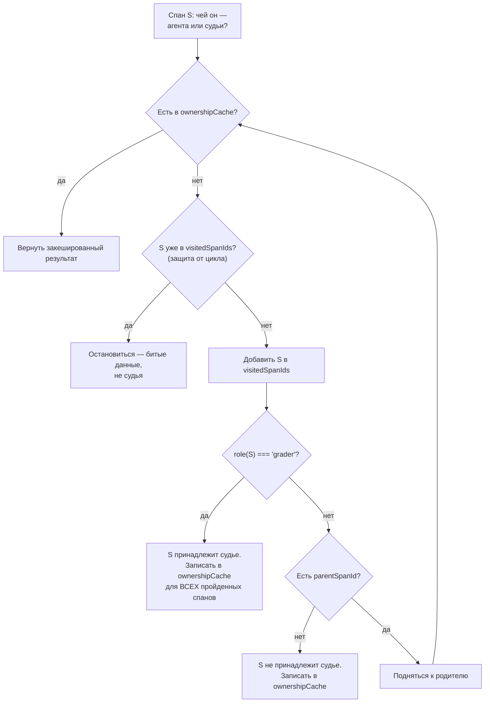
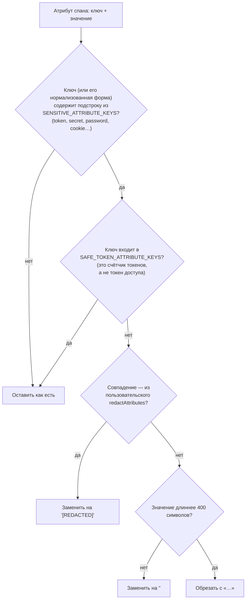
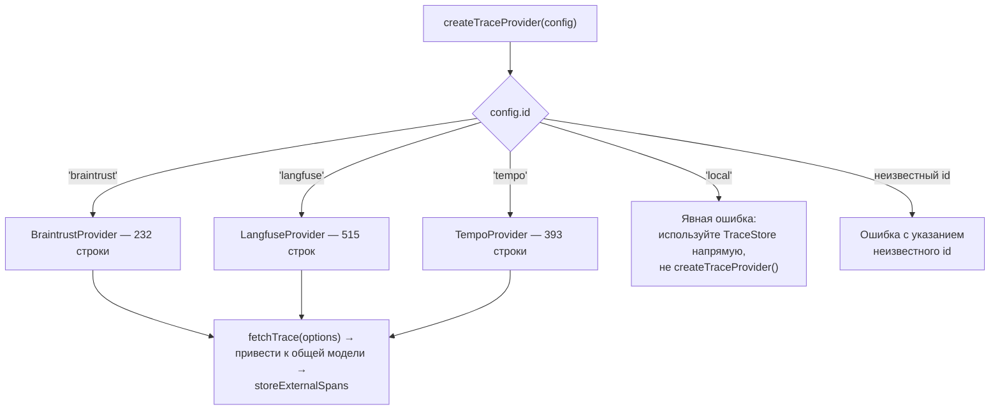
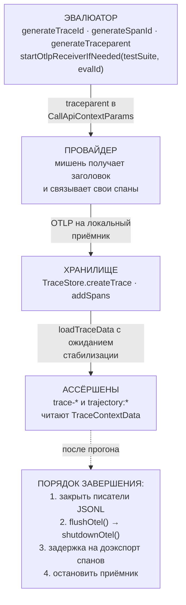

# Наблюдаемость и телеметрия — `src/tracing`

> Разбор через призму **Domain-Driven Design**. Диаграммы — ANSI-псевдографика.
> Дополняет [ARCHITECTURE.md](./ARCHITECTURE.md), [EVALUATOR.md](./EVALUATOR.md),
> [MODELS.md](./MODELS.md), [COMMANDS.md](./COMMANDS.md), [TYPES.md](./TYPES.md),
> [UTIL.md](./UTIL.md), [SCHEDULER.md](./SCHEDULER.md), [PROMPTS.md](./PROMPTS.md),
> [MATCHERS.md](./MATCHERS.md), [ASSERTIONS.md](./ASSERTIONS.md),
> [PROVIDERS.md](./PROVIDERS.md), [REDTEAM.md](./REDTEAM.md),
> [SERVER.md](./SERVER.md), [APP.md](./APP.md).

---

## 0. Паспорт подсистемы

```
╔══════════════════════════════════════════════════════════════════════════════╗
║  TRACING — оценка ПРОЦЕССА, а не только результата                           ║
╠══════════════════════════════════════════════════════════════════════════════╣
║  Слой в layers.json     legacy-runtime (ярус 2)                              ║
║  Объём                  21 файл · 6 455 строк + 473 строки .proto            ║
║  Основа                 OpenTelemetry · семантические соглашения GenAI       ║
╠══════════════════════════════════════════════════════════════════════════════╣
║  otlpReceiver.ts       1 161   приёмник OTLP внутри процесса                 ║
║  genaiTracer.ts          905   спаны по соглашениям gen_ai.*                 ║
║  traceContext.ts         660   сборка контекста для ассёршенов               ║
║  providers/langfuse.ts   515   ·  store.ts 483  ·  evaluatorTracing.ts 457   ║
║  providers/tempo.ts      393   ·  targetTracer.ts 338 · protobuf.ts 263      ║
║  providers/braintrust.ts 232   ·  otelSdk.ts 228 · localSpanExporter.ts 175  ║
╠══════════════════════════════════════════════════════════════════════════════╣
║  Внешних систем трассировки     3  (Langfuse · Tempo · Braintrust)           ║
║  Ролей спана                    3  (test_case · target · grader)             ║
║  Семейств атрибутов инструментов 6  (tool · function · ai.toolCall · …)      ║
║  Переменных окружения          12                                            ║
║  Тесты                  25 файлов · 10 178 строк  (в 1,6 раза больше кода)   ║
╚══════════════════════════════════════════════════════════════════════════════╝
```

**Формулировка предметной области в одном предложении.** Трассировка — это
подсистема, которая делает возможной оценку **процесса** получения ответа,
а не только самого ответа: сколько шагов сделал агент, какими инструментами
воспользовался, в каком порядке и не упал ли по дороге.

**Почему это принципиально для продукта.** Девять проверок из 66 (`trajectory:*`
и `trace-*`, см. [ASSERTIONS.md §6](./ASSERTIONS.md)) оценивают не текст, а
последовательность действий. Без телеметрии они невозможны. И для редтима это
не украшение: восемь плагинов кодовых агентов судятся **детерминированными
верификаторами** по фактам из трасс и файловой системы, а не языковой моделью
([REDTEAM.md §8](./REDTEAM.md)).

---

## 1. Единый язык подсистемы

| Термин | Носитель в коде | Смысл |
|---|---|---|
| **Trace / Span** | таблицы `traces`, `spans` | Трасса — одно исполнение; спан — один шаг внутри неё. |
| **traceparent** | `spanRoles.ts:getActiveTraceparent` | Заголовок W3C: `00-<traceId>-<spanId>-<flags>`. |
| **Span role** | `SPAN_ROLE_ATTRIBUTE` | `test_case` · `target` · `grader`. Кому принадлежит шаг. |
| **OTLP** | `otlpReceiver.ts` | Протокол приёма телеметрии. JSON и protobuf. |
| **TraceStore** | `store.ts:148` | Хранилище трасс поверх SQLite. |
| **TraceContextData** | `traceContext.ts:35` | Трасса, приведённая к виду для ассёршенов. |
| **Trace policy** | `OTLPReceiverTracePolicy` | Правила приёма на один прогон: имена команд, что вычищать. |
| **GenAIAttributes** | `genaiTracer.ts:28` | Соглашения `gen_ai.*` — общий словарь индустрии. |
| **Tool attribute family** | `toolAttributes.ts` | Шесть способов, которыми вендоры называют вызов инструмента. |
| **TraceProvider** | `providers/types.ts` | Порт к внешней системе трассировки. |

---

## 2. Место подсистемы в архитектуре

```
   Слой legacy-runtime (ярус 2) — тот же, что evaluator.ts и logger.
   Собственных потребителей у трассировки четыре, и все обращаются
   к ней за разным:

     evaluator.ts        7 импортов   поднятие приёмника, генерация
                                      traceparent, связывание с прогоном
     assertions/index.ts              чтение трасс для проверок trace-* ·
                                      ожидание стабилизации спанов
     matchers/providers  через        роль 'grader' для вызовов судьи
                         scheduler
     app (белый список)  1 файл       tracing/store.ts — просмотр в UI
     server/routes       traces.ts    два эндпойнта HTTP

 ┌─────────────────────────────────────────────────────────────────────────────┐
 │  ТРИ ТОЧКИ ВХОДА ТЕЛЕМЕТРИИ — три разных источника                          │
 ├─────────────────────────────────────────────────────────────────────────────┤
 │                                                                             │
 │   1  СВОИ СПАНЫ          genaiTracer · targetTracer                         │
 │        promptfoo сам инструментирует вызовы провайдеров                     │
 │                                                                             │
 │   2  СПАНЫ МИШЕНИ        otlpReceiver                                       │
 │        тестируемое приложение шлёт OTLP на локальный приёмник               │
 │        ↑ ЭТО И ЕСТЬ ГЛАВНОЕ: мишень рассказывает о себе изнутри             │
 │                                                                             │
 │   3  ВНЕШНЕЕ ХРАНИЛИЩЕ   providers/ (Langfuse · Tempo · Braintrust)         │
 │        трассы уже лежат в чужой системе — забрать их оттуда                 │
 └─────────────────────────────────────────────────────────────────────────────┘
```

---

## 3. Роли спанов: чья это активность

Самое содержательное решение подсистемы, без которого агентные проверки давали
бы неверный результат.

```
   spanRoles.ts — 32 строки

     export const SPAN_ROLE_ATTRIBUTE = 'promptfoo.span.role';
     export type PromptfooSpanRole = 'test_case' | 'target' | 'grader';

     withSpanRole(role, fn)     проставить роль на время выполнения
     getActiveSpanRole()        прочитать текущую

     Комментарий над функцией формулирует смысл прямо:
     «Держать активность оценивания, принадлежащую эвалюатору,
      ОТДЕЛЬНО от поведения мишени.»

 ┌─────────────────────────────────────────────────────────────────────────────┐
 │  ЗАЧЕМ ЭТО НУЖНО                                                            │
 ├─────────────────────────────────────────────────────────────────────────────┤
 │                                                                             │
 │   Проверка trajectory:step-count спрашивает: «сколько шагов сделал агент?»  │
 │                                                                             │
 │   Но во время прогона свои спаны порождает не только мишень:                │
 │     • сам promptfoo — вызовы провайдера                                     │
 │     • МОДЕЛЬ-СУДЬЯ — llm-rubric, g-eval и прочие обращения к грейдеру       │
 │       (MATCHERS.md §4.2: каждый вызов судьи оборачивается спаном            │
 │        с role: 'grader')                                                    │
 │                                                                             │
 │   Без разделения ролей судейские вызовы посчитались бы шагами агента,       │
 │   и проверка «агент уложился в пять шагов» падала бы тем чаще,              │
 │   чем больше проверок навешено на тест. Оценка влияла бы на                 │
 │   собственный результат.                                                    │
 ├─────────────────────────────────────────────────────────────────────────────┤
 │  isGraderOwnedSpan — обход дерева вверх          store.ts:72                │
 │                                                                             │
 │    Роль ставится только на КОРЕНЬ поддерева судьи. Дочерние спаны           │
 │    её не несут, поэтому принадлежность определяется подъёмом                │
 │    по цепочке parentSpanId до первого спана с role === 'grader'.            │
 │                                                                             │
 │    Две защиты в одном цикле:                                                │
 │      visitedSpanIds   защита от цикла в дереве (битые данные)               │
 │      ownershipCache   мемоизация: результат записывается для ВСЕХ           │
 │                       пройденных спанов сразу, а не только для исходного    │
 │                                                                             │
 │    Второе важно по производительности: без него обход глубокого             │
 │    дерева был бы квадратичным по числу спанов.                              │
 └─────────────────────────────────────────────────────────────────────────────┘

   getActiveTraceparent() отдаёт заголовок ТОЛЬКО когда контекст спана
   действителен (`trace.isSpanContextValid`). Комментарий: «Возвращать
   пригодный traceparent только когда у активного спана есть корректный
   записанный контекст.» Иначе мишень получила бы заголовок с нулевыми
   идентификаторами и связала бы свои спаны в несуществующую трассу.
```

Обход дерева для определения владельца спана — как Mermaid-диаграмма:



**Своими словами.** Представь инспектора, который получает на руки один-
единственный листок из большого дела и должен выяснить: этот листок относится
к работе экзаменатора или к работе самого экзаменуемого? Роль «экзаменатор»
проставляется только на САМОМ ПЕРВОМ листке своего дела — на всех
подшитых к нему следом отметки нет. Поэтому инспектор не смотрит на листок
в одиночку, а поднимается по скрепке вверх: у этого листка есть родитель? нет
метки «экзаменатор» — поднимаемся выше. Нашли метку — весь спущенный путь
листков признаётся делом экзаменатора. Дошли до самого верха дела и метки не
встретили — значит, это дело самого экзаменуемого. Чтобы не заблудиться в
подшивке, где кто-то по ошибке скрепил лист сам с собой в петлю, инспектор
помечает каждый просмотренный листок галочкой и останавливается, если видит
галочку второй раз. А чтобы не проделывать этот подъём заново для каждого
следующего листка того же самого дела, найденный ответ записывается сразу для
ВСЕХ листков, через которые инспектор только что прошёл, — не только для
самого первого, с которого начали.

---

## 4. Приёмник OTLP: мишень рассказывает о себе

```
 ┌─────────────────────────────────────────────────────────────────────────────┐
 │  otlpReceiver.ts — 1 161 строка, крупнейший файл подсистемы                 │
 ├─────────────────────────────────────────────────────────────────────────────┤
 │                                                                             │
 │   ДВА ФОРМАТА: json · protobuf                                              │
 │     DEFAULT_ACCEPT_FORMATS = ['json', 'protobuf']                           │
 │     Собственный разбор protobuf — protobuf.ts (263 строки) плюс             │
 │     четыре файла .proto (473 строки) из спецификации OpenTelemetry:         │
 │       trace.proto · common.proto · resource.proto · trace_service.proto     │
 │                                                                             │
 │   ДВА ВИДА ЗАПИСЕЙ                                                          │
 │     OTLPTraceRequest   спаны — основной путь                                │
 │     OTLPLogsRequest    ЖУРНАЛЬНЫЕ ЗАПИСИ, превращаемые в спаны              │
 │                        длительностью LOG_SPAN_DURATION_MS = 1 мс            │
 │                        ↑ приложение, шлющее логи вместо трасс,              │
 │                          всё равно оставляет след в траектории              │
 ├─────────────────────────────────────────────────────────────────────────────┤
 │  ГРАНИЦЫ, ЗАДАННЫЕ ЯВНО — правило AGENTS.md «терпимо и ОГРАНИЧЕННО»         │
 │                                                                             │
 │    MAX_LOG_BODY_ATTR_LENGTH   8192   тело записи режется с пометкой         │
 │                                      `... [truncated]`                      │
 │    MAX_BODY_AS_NAME_LENGTH     128   тело становится именем спана           │
 │                                      только если короткое                   │
 │    LOG_EVENT_NAME_DENYLIST           чёрный список событий:                 │
 │                                      'claude_code.tracing'                  │
 │                                      ↑ собственная телеметрия               │
 │                                        инструмента не должна попадать       │
 │                                        в траекторию мишени                  │
 ├─────────────────────────────────────────────────────────────────────────────┤
 │  ОТБРАКОВКА ИСПОРЧЕННЫХ ИДЕНТИФИКАТОРОВ                                     │
 │                                                                             │
 │    BASE64_ZERO_SPAN_ID   = /^A{11,12}=?$/                                   │
 │    BASE64_ZERO_TRACE_ID  = /^A{22}(?:==)?$/                                 │
 │                                                                             │
 │    Нулевой идентификатор в base64 состоит из букв «A» — так выглядит        │
 │    неинициализированный контекст. Такие спаны получают новый                │
 │    randomSpanId() вместо того, чтобы схлопнуться в один узел.               │
 ├─────────────────────────────────────────────────────────────────────────────┤
 │  ПОЛИТИКА ПРИЁМА НА ПРОГОН — OTLPReceiverTracePolicy                        │
 │                                                                             │
 │    evaluationId        к какому прогону привязывать                         │
 │    commandToolNames    какие инструменты считать командами                  │
 │    redactAttributes    какие атрибуты вычистить ДО ЗАПИСИ                   │
 │                        (подстрочное совпадение без учёта регистра)          │
 │                                                                             │
 │    Приёмник может быть общим для нескольких прогонов, поэтому политика      │
 │    регистрируется отдельно на каждый — registerOtlpReceiverTracePolicy.     │
 └─────────────────────────────────────────────────────────────────────────────┘
```

---

## 5. Вычистка секретов: два контура и один список исключений

```
 ┌─────────────────────────────────────────────────────────────────────────────┐
 │  КОНТУР 1 · sanitizeAttributes.ts — атрибуты спанов, 112 строк              │
 ├─────────────────────────────────────────────────────────────────────────────┤
 │                                                                             │
 │   SENSITIVE_ATTRIBUTE_KEYS — девять подстрок:                               │
 │     authorization · cookie · set-cookie · token · api_key · apikey ·        │
 │     secret · password · passphrase                                          │
 │                                                                             │
 │   Совпадение проверяется ДВАЖДЫ: по строке в нижнем регистре и по её        │
 │   нормализованной форме (убраны все не-буквенно-цифровые символы), —        │
 │   чтобы `x-api-key`, `x_api_key` и `xApiKey` ловились одинаково.            │
 │                                                                             │
 │   ┌───────────────────────────────────────────────────────────────────┐     │
 │   │  SAFE_TOKEN_ATTRIBUTE_KEYS — БЕЛЫЙ СПИСОК ИЗ ВОСЕМНАДЦАТИ КЛЮЧЕЙ  │     │
 │   │                                                                    │    │
 │   │    gen_ai.usage.input_tokens · gen_ai.usage.output_tokens ·        │    │
 │   │    gen_ai.request.max_tokens · promptfoo.usage.total_tokens ·      │    │
 │   │    llm.usage.prompt_tokens · gen_ai.usage.cached_tokens · …        │    │
 │   │                                                                    │    │
 │   │  ВСЕ ОНИ СОДЕРЖАТ ПОДСТРОКУ «token» И БЫЛИ БЫ ВЫЧИЩЕНЫ.           │     │
 │   │  Но это СЧЁТЧИКИ токенов, а не токены доступа — вычистив их,      │     │
 │   │  система потеряла бы учёт расхода на каждом спане.                 │    │
 │   │                                                                    │    │
 │   │  Два комментария в списке объясняют, почему он такой длинный:      │    │
 │   │    «Сохранить счётчики токенов от ВНЕШНЕ инструментированных       │    │
 │   │     LLM-приложений» (ключи llm.usage.*)                            │    │
 │   │    «Сохранить читаемость исторических атрибутов спана после        │    │
 │   │     обновления» (устаревшие формы gen_ai.usage.*)                  │    │
 │   │                                                                    │    │
 │   │  То есть белый список несёт и совместимость с чужими               │    │
 │   │  соглашениями, и совместимость с собственным прошлым.              │    │
 │   └───────────────────────────────────────────────────────────────────┘     │
 │                                                                             │
 │   Три уровня вычистки, различающиеся маркером:                              │
 │     пользовательский шаблон (redactAttributes)  →  '[REDACTED]'             │
 │     встроенный список чувствительных ключей     →  '<redacted>'             │
 │     длинная строка (> 400 символов)             →  обрезка с «…»            │
 ├─────────────────────────────────────────────────────────────────────────────┤
 │  КОНТУР 2 · genaiTracer.sanitizeBody — тела запросов, 4 096 символов        │
 ├─────────────────────────────────────────────────────────────────────────────┤
 │                                                                             │
 │   SENSITIVE_PATTERNS — девять регулярных выражений по СОДЕРЖИМОМУ:          │
 │     sk-… и pk-… длиной 20+          →  <REDACTED_API_KEY>                   │
 │     api_key/secret/token = «…»      →  ключ сохраняется, значение нет       │
 │     password = …                    →  то же                                │
 │     Authorization: Bearer …         →  схема сохраняется, токен нет         │
 │     AKIA…                           →  <REDACTED_AWS_KEY>                   │
 │                                                                             │
 │   ⚠  ПОСЛЕДНИЙ ШАБЛОН — С ФУНКЦИЕЙ-ПРОВЕРКОЙ, А НЕ СЛЕПОЙ ЗАМЕНОЙ:          │
 │                                                                             │
 │     /\b([a-zA-Z0-9/+=]{40})/g  →  замена ТОЛЬКО если строка выглядит        │
 │        как base64 И СОДЕРЖИТ СИМВОЛ '/'                                     │
 │                                                                             │
 │     Сорок буквенно-цифровых символов — это и секретный ключ AWS,            │
 │     и обычный SHA-1, и просто длинное слово. Дополнительное условие         │
 │     на '/' отсекает большую часть ложных срабатываний.                      │
 └─────────────────────────────────────────────────────────────────────────────┘
```

Проверка одного атрибута спана в контуре 1 — как Mermaid-диаграмма:



**Своими словами.** Представь охранника на входе, который проверяет
содержимое каждого чемодана по слову на бирке. Слово «token» на бирке само по
себе ничего не решает — охранник обучен одному важному исключению:
восемнадцать конкретных, заранее выученных наизусть бирок с этим словом
на самом деле означают не «пропуск», а «счётчик пройденных людей» — их
пропускают не глядя, потому что выкинуть их — значит потерять учёт расходов
компании. Всё остальное с подозрительным словом на бирке идёт под
контролируемое вскрытие, и дальше есть три разных штампа в зависимости от
того, ЧЕЙ это был список подозрительных слов: если чемодан попал под
персональное правило, которое сам пользователь заранее продиктовал охране, —
штамп «[REDACTED]»; если сработало встроенное правило охраны — штамп мягче,
«<redacted>»; а если содержимое просто слишком длинное само по себе, даже без
подозрительного слова на бирке, — его не прячут целиком, а обрезают
многоточием, оставляя начало на виду.

### 5.1. Вычистка по умолчанию на чтении

```
   TraceStore.getTrace(traceId, { sanitizeAttributes = true })
   TraceStore.getSpans(traceId, { sanitizeAttributes = true })
   TraceStore.getTracesByEvaluation(evalId, { sanitizeAttributes = true })

   Правило из AGENTS.md:
     «Храните достаточно СЫРЫХ данных спана для ассёршенов, но вычищайте
      похожие на учётные данные атрибуты при чтениях для интерфейса
      и экспорта ПО УМОЛЧАНИЮ. Используйте sanitizeAttributes: false
      только для внутренних рабочих процессов ассёршенов, которым явно
      нужны сырые атрибуты.»

   ┌───────────────────────────────────────────────────────────────────────┐
   │  ЭТО РЕДКОЕ И ВЕРНОЕ РЕШЕНИЕ                                          │
   │                                                                       │
   │  Обычно выбирают одно из двух: либо вычищать при записи (и терять     │
   │  данные навсегда), либо не вычищать вовсе (и рисковать на выдаче).    │
   │                                                                       │
   │  Здесь выбрано третье: хранить сырое, вычищать на выходе, а           │
   │  безопасное значение флага сделать умолчанием. Проверка,              │
   │  которой нужны сырые атрибуты, обязана попросить их ЯВНО —            │
   │  и именно так делает loadTraceData в ассёршенах                       │
   │  (ASSERTIONS.md §9: getTrace(traceId, { sanitizeAttributes: false })).│
   └───────────────────────────────────────────────────────────────────────┘
```

---

## 6. Нормализация: шесть способов назвать вызов инструмента

```
   toolAttributes.ts — 108 строк, решающих задачу совместимости

 ┌─────────────────────────────────────────────────────────────────────────────┐
 │  ШЕСТЬ СЕМЕЙСТВ АТРИБУТОВ, КАЖДОЕ СО СВОИМИ СУФФИКСАМИ                      │
 ├─────────────────────────────────────────────────────────────────────────────┤
 │                                                                             │
 │    prefix 'tool'          .name · _name                                     │
 │                           .args · .arguments · .input · _args · _input      │
 │                           + голый ключ 'tool'                               │
 │    prefix 'function'      .name · _name  ·  .args · .arguments · .input     │
 │    prefix 'ai.toolCall'   .name  ·  .args · .arguments · .input             │
 │    prefix 'gen_ai.tool'   .name  ·  + gen_ai.tool.call.args / .arguments    │
 │    prefix 'agent.tool'    _name  ·  + agent.tool · agent.toolName           │
 │                                                                             │
 │    COMMAND_ATTRIBUTE_KEYS   codex.command · command · command.name ·        │
 │                             command_name                                    │
 │    SEARCH_ATTRIBUTE_KEYS    codex.search.query · search.query · search_query│
 ├─────────────────────────────────────────────────────────────────────────────┤
 │  ЗАЧЕМ ЭТО НУЖНО                                                            │
 │                                                                             │
 │    Правило AGENTS.md: «Нормализуйте атрибуты инструментов и команд          │
 │    через toolAttributes.ts / traceContext.ts, чтобы проверки траектории     │
 │    продолжали работать ПОПЕРЁК СОГЛАШЕНИЙ ТЕЛЕМЕТРИИ РАЗНЫХ                 │
 │    ПРОВАЙДЕРОВ.»                                                            │
 │                                                                             │
 │    Проверка trajectory:tool-used спрашивает «вызывал ли агент               │
 │    инструмент X». Но Vercel AI SDK пишет ai.toolCall.name,                  │
 │    OpenTelemetry GenAI — gen_ai.tool.name, а самописный агент —             │
 │    просто tool_name. Без нормализации проверка работала бы                  │
 │    ровно с одним вендором.                                                  │
 │                                                                             │
 │    Это тот же приём антикоррупционного слоя, что в src/providers            │
 │    (PROVIDERS.md §8.1: transformTools между четырьмя форматами) —           │
 │    только направление обратное: не наружу, а внутрь.                        │
 └─────────────────────────────────────────────────────────────────────────────┘
```

---

## 7. Собственные спаны: соглашения GenAI

```
   genaiTracer.ts — 905 строк, реализация словаря gen_ai.*

 ┌─────────────────────────────────────────────────────────────────────────────┐
 │  ЧТО ПИШЕТСЯ В СПАН ВЫЗОВА МОДЕЛИ                                           │
 ├─────────────────────────────────────────────────────────────────────────────┤
 │    ЗАПРОС    gen_ai.request.model · .temperature · .top_p · .top_k ·        │
 │              .max_tokens · .stop_sequences · .frequency_penalty ·           │
 │              .presence_penalty                                              │
 │    ОТВЕТ     gen_ai.response.id · .model · .finish_reasons                  │
 │    РАСХОД    gen_ai.usage.*  (входные, выходные, кэш чтения и записи)       │
 │    СИСТЕМА   gen_ai.system · gen_ai.provider.name · gen_ai.operation.name   │
 │    АГЕНТ     gen_ai.agent.id · .name · gen_ai.turn.index                    │
 │    ИНСТРУМЕНТ gen_ai.tool.name · .call.id                                   │
 │    ОЦЕНКА    gen_ai.evaluation.name · .score.value · .score.label ·         │
 │              .explanation                                                   │
 │              ↑ ВЕРДИКТ СУДЬИ ТОЖЕ ПОПАДАЕТ В ТРАССУ                         │
 ├─────────────────────────────────────────────────────────────────────────────┤
 │  ФУНКЦИИ-ОБЁРТКИ                                                            │
 │    withGenAISpan(…)        обернуть вызов модели                            │
 │    withGenAIToolSpan(…)    обернуть вызов инструмента                       │
 │    openTurnSpan / closeTurnSpan   многоходовой диалог: ход как спан         │
 │    addActiveSpanRoleAttribute     проставить роль из контекста              │
 │                                                                             │
 │  targetTracer.ts (338 строк) — отдельный трассировщик для МИШЕНИ,           │
 │  чтобы её вызовы отличались от служебных.                                   │
 └─────────────────────────────────────────────────────────────────────────────┘
```

---

## 8. Внешние системы: порт и три адаптера

```
   providers/  1 375 строк

     interface TraceProvider          providers/types.ts
       fetchTrace(options) → FetchTraceResult

     createTraceProvider(config)      фабрика по config.id
       'braintrust' → BraintrustProvider   232 строки
       'langfuse'   → LangfuseProvider     515 строк
       'tempo'      → TempoProvider        393 строки
       'local'      → ЯВНАЯ ОШИБКА: «Local provider id should use
                      TraceStore directly, not createTraceProvider()»
       иначе        → ошибка с указанием неизвестного id

     // Future providers:
     // case 'jaeger':                ← место оставлено в коде

   isExternalTraceProvider(config) = config.id !== 'local' && !!config.endpoint

 ┌─────────────────────────────────────────────────────────────────────────────┐
 │  ЗАЧЕМ ЗАБИРАТЬ ТРАССЫ ИЗ ЧУЖОЙ СИСТЕМЫ                                     │
 │                                                                             │
 │  Приложение уже инструментировано и шлёт телеметрию в Langfuse или          │
 │  Tempo. Просить команду перенаправить экспорт на локальный приёмник         │
 │  ради прогона тестов — неприемлемо. Проще прочитать оттуда.                 │
 │                                                                             │
 │  Прочитанные спаны сохраняются локально (storeExternalSpans), и             │
 │  дальше работают те же проверки, что и для собственных, — то есть           │
 │  внешний источник приводится к общей модели, а не обрабатывается            │
 │  особым путём.                                                              │
 │                                                                             │
 │  discardCyclicExternalSpans — защита от битого дерева из чужой              │
 │  системы: спаны с циклической связью родитель-потомок отбрасываются         │
 │  до сохранения.                                                             │
 │                                                                             │
 │  redactExternalSpan — вычистка применяется и к чужим спанам тоже.           │
 └─────────────────────────────────────────────────────────────────────────────┘
```

Выбор адаптера как Mermaid-диаграмма:



**Своими словами.** Это стойка регистрации с одной вывеской «сдать трассы» и
разными окошками за ней. Посетитель называет систему, в которой уже лежат его
записи, — и его направляют строго в одно из окошек: одно обслуживает только
клиентов Braintrust, второе — только Langfuse, третье — только Tempo. За
каждым окошком свой сотрудник со своими бланками, но результат работы всех
троих один и тот же формат выписки, который потом кладётся в общую картотеку
рядом с записями, собранными вообще без стойки регистрации — напрямую из
собственных спанов promptfoo. Если посетитель по ошибке называет систему
«local» — ему сразу объясняют, что для неё стойка регистрации не нужна
вообще, свои записи и так лежат в общей картотеке. А если он называет систему,
которой здесь никогда не было, — ему прямо говорят, что такого окошка нет,
вместо того чтобы молча отправить неизвестно куда.

---

## 9. Жизненный цикл и связывание

```
 ┌─────────────────────────────────────────────────────────────────────────────┐
 │  ЦЕПОЧКА СВЯЗЫВАНИЯ — правило AGENTS.md первым пунктом                      │
 ├─────────────────────────────────────────────────────────────────────────────┤
 │                                                                             │
 │   «Сохраняйте связность трассы: eval ID, test case ID, trace ID,            │
 │    span ID, parent span ID и распространение traceparent должны             │
 │    оставаться СОГЛАСОВАННЫМИ между эвалюатором, провайдером,                │
 │    хранилищем и путями ассёршенов.»                                         │
 │                                                                             │
 │   ЭВАЛЮАТОР                                                                 │
 │     generateTraceId · generateSpanId · generateTraceparent                  │
 │     startOtlpReceiverIfNeeded(testSuite, evalId)                            │
 │            │                                                                │
 │            ▼  traceparent в CallApiContextParams                            │
 │   ПРОВАЙДЕР                                                                 │
 │     мишень получает заголовок и связывает свои спаны                        │
 │            │                                                                │
 │            ▼  OTLP на локальный приёмник                                    │
 │   ХРАНИЛИЩЕ                                                                 │
 │     TraceStore.createTrace · addSpans                                       │
 │            │                                                                │
 │            ▼  loadTraceData с ожиданием стабилизации                        │
 │   АССЁРШЕНЫ                                                                 │
 │     trace-* и trajectory:* читают TraceContextData                          │
 ├─────────────────────────────────────────────────────────────────────────────┤
 │  ПОРЯДОК ЗАВЕРШЕНИЯ (EVALUATOR.md §11)                                      │
 │                                                                             │
 │    1  закрыть писатели JSONL                                                │
 │    2  flushOtel() → shutdownOtel()                                          │
 │    3  ЗАДЕРЖКА, чтобы провайдеры успели доэкспортировать спаны              │
 │    4  остановить приёмник                                                   │
 │                                                                             │
 │    Задержка на третьем шаге — признание асинхронной природы OTLP:           │
 │    мишень может отправить последние спаны уже после того, как               │
 │    вернула ответ.                                                           │
 ├─────────────────────────────────────────────────────────────────────────────┤
 │  ОЖИДАНИЕ СТАБИЛИЗАЦИИ на стороне ассёршенов (ASSERTIONS.md §9)             │
 │    опрос до тех пор, пока число спанов не перестанет меняться               │
 │    N раз подряд; пустая трасса не считается стабильной                      │
 ├─────────────────────────────────────────────────────────────────────────────┤
 │  ХРАНЕНИЕ                                                                   │
 │    TraceStore.deleteOldTraces(retentionDays)   очистка по сроку             │
 │    Eval.delete → deleteTraceRecordsForEvals    спаны → трассы → прогон      │
 │                                                (MODELS.md §8.3)             │
 └─────────────────────────────────────────────────────────────────────────────┘

   Символ для обработчиков завершения:
     OTEL_HANDLERS_KEY = Symbol.for('promptfoo.otelHandlers')
   Symbol.for — глобальный реестр: обработчики находятся даже когда
   модуль загружен в нескольких экземплярах.
```

Цепочка связывания как Mermaid-диаграмма:



**Своими словами.** Это эстафета с одной и той же биркой на протяжении всего
забега, а не четыре отдельных забега подряд. Эвалюатор на старте пишет на
бирке номер прогона и заводит приёмник, готовый принять донесения. Бирка
(заголовок traceparent) передаётся провайдеру — то есть тестируемому
приложению, — и всё, что оно теперь делает, само подписывается тем же
номером, а не каким-то своим. Донесения приходят на приёмник и оседают в
хранилище — уже привязанные к тому же самому прогону, без дополнительной
сверки. А когда проверки читают итоговую картину, они спрашивают именно
хранилище, а не гоняются за донесениями сами. Отдельная тонкость — конец
забега не наступает по свистку сразу: сначала закрываются файлы отчёта,
потом останавливается система телеметрии, потом — и это специально —
даётся небольшая пауза, потому что тестируемое приложение может дослать
последнее донесение уже ПОСЛЕ того, как формально ответило на вопрос, и
только затем закрывается сам приёмник. Поспешить на этом последнем шаге —
значит потерять донесения, отправленные буквально секундой позже ответа.

---

## 10. Диагноз

```
╔═══════════════════════════════════════════════════════════════════════════╗
║  СИЛЬНЫЕ СТОРОНЫ                                                          ║
╠═══════════════════════════════════════════════════════════════════════════╣
║  ✔ Роли спанов отделяют активность судьи от поведения мишени. Без этого   ║
║    оценка влияла бы на собственный результат.                             ║
║                                                                           ║
║  ✔ Обход дерева для определения владельца — с защитой от цикла и          ║
║    мемоизацией по всей пройденной цепочке, а не только по корню.          ║
║                                                                           ║
║  ✔ Хранение сырых данных при вычистке НА ЧТЕНИИ, с безопасным             ║
║    умолчанием и явным флагом для внутренних потребителей.                 ║
║                                                                           ║
║  ✔ Белый список из восемнадцати ключей-счётчиков токенов —                ║
║    точное исправление ложного срабатывания подстрочного правила.          ║
║                                                                           ║
║  ✔ Шаблон на сорок символов base64 срабатывает только при наличии '/',    ║
║    а не слепо — ещё одно снижение ложных срабатываний.                    ║
║                                                                           ║
║  ✔ Шесть семейств атрибутов инструментов приводятся к одному виду,        ║
║    иначе проверки траектории работали бы с одним вендором.                ║
║                                                                           ║
║  ✔ Приёмник терпим и ограничен одновременно: два формата, журнальные      ║
║    записи как спаны, чёрный список событий, лимиты длины, отбраковка      ║
║    нулевых идентификаторов.                                               ║
║                                                                           ║
║  ✔ Собственная телеметрия инструмента исключена из траектории мишени.     ║
║                                                                           ║
║  ✔ Внешние трассы приводятся к общей модели, а не обрабатываются          ║
║    отдельным путём; к ним применяется та же вычистка.                     ║
║                                                                           ║
║  ✔ traceparent отдаётся только при действительном контексте спана.        ║
║                                                                           ║
║  ✔ Тесты в 1,6 раза объёмнее кода, включая отдельный файл                 ║
║    performanceBenchmark.test.ts.                                          ║
╠═══════════════════════════════════════════════════════════════════════════╣
║  СЛАБЫЕ МЕСТА                                                             ║
╠═══════════════════════════════════════════════════════════════════════════╣
║  ✘ otlpReceiver.ts на 1 161 строку совмещает разбор двух форматов,        ║
║    приём спанов, приём журнальных записей, нормализацию, вычистку         ║
║    и HTTP-обвязку.                                                        ║
║                                                                           ║
║  ✘ Подсистема живёт в legacy-runtime — слое «переходных модулей без       ║
║    владельца», как evaluator.ts (EVALUATOR.md §0) и types                 ║
║    (TYPES.md §8). Третий случай, когда важная часть системы               ║
║    формально числится долгом.                                             ║
║                                                                           ║
║  ✘ Собственный разбор protobuf (263 строки + 473 строки .proto)           ║
║    вместо библиотеки. Работает, но это код, который придётся              ║
║    сопровождать при изменении спецификации OTLP.                          ║
║                                                                           ║
║  ✘ Вычистка секретов реализована ЗДЕСЬ отдельно от util/sanitizer         ║
║    (UTIL.md §3): свои девять подстрок, свои девять шаблонов, свой         ║
║    белый список. Третья независимая реализация в репозитории              ║
║    после util/sanitizer и evalConfig на стороне интерфейса.               ║
║                                                                           ║
║  ✘ Список семейств атрибутов инструментов — открытый перечень.            ║
║    Новый вендор с иным соглашением тихо не распознается, и проверка       ║
║    траектории даст ложноотрицательный результат.                          ║
║                                                                           ║
║  ✘ Задержка перед остановкой приёмника — фиксированная. Это работает,     ║
║    но по той же логике, что отвергнута в ассёршенах, где ожидание         ║
║    построено на стабилизации счётчика, а не на таймере.                   ║
║                                                                           ║
║  ✘ Три внешних адаптера (1 140 строк) не имеют общей базы, кроме          ║
║    интерфейса и providers/fetch.ts на 73 строки.                          ║
╚═══════════════════════════════════════════════════════════════════════════╝
```

### Оценка по осям

```
   Связность трассы          ████████████████████░  9/10
   Разделение ролей          ████████████████████░  9/10   редкое решение
   Вычистка секретов         ██████████████████░░░  8/10   но третья реализация
   Совместимость соглашений  ████████████████░░░░░  7/10   открытый перечень
   Устойчивость приёма       ██████████████████░░░  8/10
   Связность модуля          ████████████░░░░░░░░░  6/10   приёмник на 1 161 строку
   Тестируемость             ██████████████████░░░  8/10
```

---

## 11. Рекомендации по эволюции

```
   1 · Разбить otlpReceiver.ts:
         otlpDecoder      разбор json и protobuf
         spanIngestion    приём и нормализация спанов
         logIngestion     журнальные записи как спаны
         receiverServer   HTTP-обвязка и политики
       Каждая часть тестируется отдельно; сейчас тест на приёмник
       вынужденно проверяет всё сразу.

   2 · Свести вычистку секретов к одному источнику.
       util/sanitizer уже содержит 59 имён полей и 8 сигнатур значений.
       Здесь нужны те же правила плюс белый список счётчиков токенов —
       то есть параметр, а не отдельная реализация. Расхождение между
       тремя списками рано или поздно даст утечку в одном из них.

   3 · Сделать перечень семейств атрибутов расширяемым конфигурацией.
       Пользователь с собственным соглашением телеметрии сейчас
       вынужден править исходники. Достаточно поля в конфигурации
       трассировки по образцу commandToolNames, который уже так устроен.

   4 · Заменить фиксированную задержку перед остановкой приёмника
       на ожидание стабилизации — приём, уже применённый в ассёршенах
       (ASSERTIONS.md §9). Логика одна и та же: ждать, пока поток
       спанов не иссякнет, а не отмерять время.

   5 · Рассмотреть библиотеку для protobuf.
       736 строк собственного кода на разбор чужой спецификации —
       кандидат на замену, если найдётся зависимость без тяжёлого хвоста.

   6 · После шагов 1–2 переселить подсистему из legacy-runtime.
       Наблюдаемость — самостоятельная забота, ей уместен собственный
       слой между node и core.
```

---

## 12. Карта директории

```
src/tracing/                  21 файл · 6 455 строк
│
├── AGENTS.md                       связность трассы · сырое хранение +
│                                   вычистка на чтении · терпимый
│                                   и ограниченный приём
│
├── ── ПРИЁМ ─────────────────────────────────────────────────────────────
├── otlpReceiver.ts          1 161  ДВА ФОРМАТА · спаны и журнальные записи ·
│                                   политика на прогон · лимиты ·
│                                   отбраковка нулевых идентификаторов
├── protobuf.ts                263  собственный разбор protobuf
├── proto/                     473  четыре файла .proto из спецификации OTel
│
├── ── СОБСТВЕННЫЕ СПАНЫ ─────────────────────────────────────────────────
├── genaiTracer.ts             905  словарь gen_ai.* · withGenAISpan ·
│                                   withGenAIToolSpan · openTurnSpan ·
│                                   sanitizeBody (9 шаблонов)
├── targetTracer.ts            338  трассировщик мишени
├── otelSdk.ts                 228  initializeOtel · flushOtel · shutdownOtel ·
│                                   OTEL_HANDLERS_KEY (Symbol.for)
├── otelConfig.ts               93  OtelConfig из переменных окружения
├── localSpanExporter.ts       175  экспорт в локальное хранилище
├── resourceAttributes.ts       11
│
├── ── РОЛИ И ФИЛЬТРАЦИЯ ─────────────────────────────────────────────────
├── spanRoles.ts                32  test_case · target · grader ·
│                                   getActiveTraceparent
├── spanFilter.ts               54
├── sanitizeAttributes.ts      112  9 подстрок + БЕЛЫЙ СПИСОК из 18 ключей
├── toolAttributes.ts          108  шесть семейств атрибутов инструментов
│
├── ── ХРАНЕНИЕ И ЧТЕНИЕ ─────────────────────────────────────────────────
├── store.ts                   483  TraceStore · isGraderOwnedSpan ·
│                                   deleteOldTraces · sanitizeAttributes=true
├── traceContext.ts            660  TraceContextData для ассёршенов ·
│                                   discardCyclicExternalSpans ·
│                                   redactExternalSpan · deriveInsights
├── evaluatorTracing.ts        457  generateTraceId/SpanId/traceparent ·
│                                   startOtlpReceiverIfNeeded ·
│                                   resetTracingState
│
└── ── ВНЕШНИЕ СИСТЕМЫ ───────────────────────────────────────────────────
    providers/                1 375
    ├── langfuse.ts            515   ·  tempo.ts 393  ·  braintrust.ts 232
    ├── types.ts               112   интерфейс TraceProvider
    ├── fetch.ts                73   ·  index.ts 50  (фабрика)
    └                                // Future providers: jaeger

СМЕЖНОЕ
  database/tables.ts                таблицы traces и spans
  database/evalDeletion.ts          порядок удаления: спаны → трассы → прогон
  assertions/index.ts               loadTraceData с ожиданием стабилизации
  server/routes/traces.ts           два эндпойнта HTTP

test/tracing/            25 файлов · 10 178 строк
    otlpReceiver · genaiTracer · store · storePersistence · storeRetention
    sanitizeAttributes · toolAttributes · spanFilter · targetTracer
    executionHierarchy · integration · performanceBenchmark · providers/
```

---

## 13. Команды

```bash
npx vitest run test/tracing
npx vitest run test/evaluator/trace-integration.test.ts
npx vitest run test/assertions/trace.test.ts test/assertions/trajectory.test.ts
```

Переменные окружения:

```bash
PROMPTFOO_TRACING_ENABLED           включить трассировку прогона
PROMPTFOO_OTEL_ENABLED              включить OTel SDK
PROMPTFOO_OTEL_ENDPOINT             внешний приёмник OTLP
OTEL_EXPORTER_OTLP_ENDPOINT         стандартная переменная OTel
PROMPTFOO_OTEL_SERVICE_NAME         имя службы (по умолчанию promptfoo)
PROMPTFOO_OTEL_LOCAL_EXPORT         запись в локальное хранилище
PROMPTFOO_OTEL_DEBUG                отладочный вывод OTel
PROMPTFOO_TRACE_FETCH_MAX_ATTEMPTS  попыток дождаться трассы
PROMPTFOO_TRACE_FETCH_RETRY_DELAY_MS задержка между попытками
PROMPTFOO_TRACE_FETCH_STABLE_POLLS  опросов без изменений
```

Числа из этого документа воспроизводятся так:

```bash
find src/tracing -name '*.ts' | xargs cat | wc -l                # 6455
grep -hoE "'gen_ai\.[a-z_.]+'" src/tracing/genaiTracer.ts | sort -u | wc -l
find test/tracing -name '*.ts' | xargs cat | wc -l               # 10178
```

---

*Документ описывает `src/tracing` на коммите `2c140ef`, promptfoo 0.122.0.
Дата среза — 26 августа 2026.*
