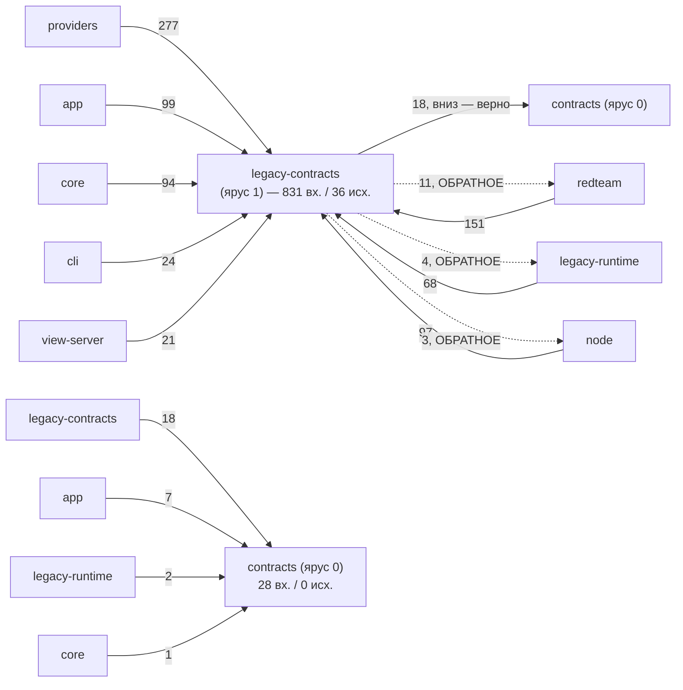
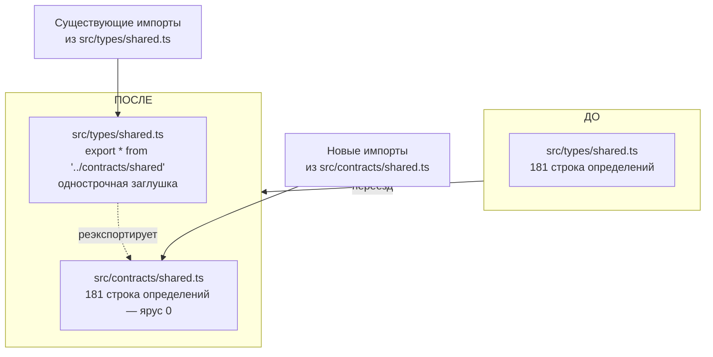
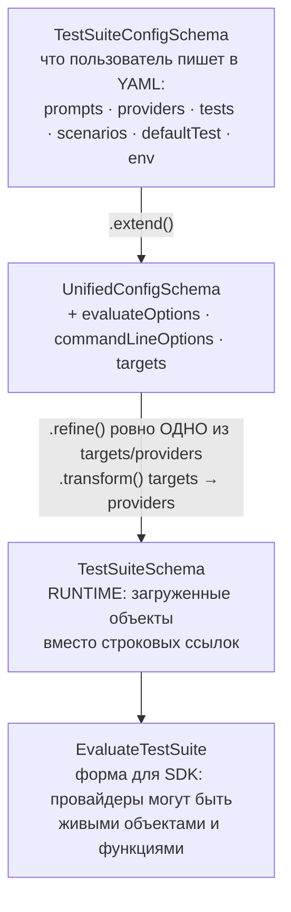
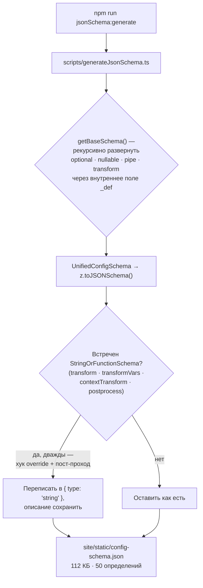

# Контракты и схемы — `src/types`

> Разбор через призму **Domain-Driven Design**. Диаграммы — ANSI-псевдографика.
> Дополняет [ARCHITECTURE.md](./ARCHITECTURE.md), [EVALUATOR.md](./EVALUATOR.md),
> [UTIL.md](./UTIL.md), [SCHEDULER.md](./SCHEDULER.md), [PROMPTS.md](./PROMPTS.md),
> [MATCHERS.md](./MATCHERS.md), [ASSERTIONS.md](./ASSERTIONS.md),
> [PROVIDERS.md](./PROVIDERS.md), [REDTEAM.md](./REDTEAM.md),
> [SERVER.md](./SERVER.md), [APP.md](./APP.md).

---

## 0. Паспорт подсистемы

```
╔══════════════════════════════════════════════════════════════════════════════╗
║  LEGACY-CONTRACTS — единый язык системы, пойманный на середине переезда      ║
╠══════════════════════════════════════════════════════════════════════════════╣
║  Слой в layers.json     legacy-contracts (ярус 1 из 11)                      ║
║                         «Transitional mixed runtime types and validators»    ║
║  Состав слоя            src/types + src/validators                           ║
║  Объём                  29 + 5 файлов · 4 181 + 787 строк                    ║
╠══════════════════════════════════════════════════════════════════════════════╣
║  СОСЕДНИЙ СЛОЙ — ЦЕЛЬ ПЕРЕЕЗДА                                               ║
║  contracts (ярус 0)     src/contracts · 12 файлов · 888 строк                ║
║                         allowedExternal: ["zod"] и больше НИЧЕГО             ║
╠══════════════════════════════════════════════════════════════════════════════╣
║  types/index.ts               1 570   ядро единого языка                     ║
║  types/api/  (11 файлов)      1 502   схемы HTTP-контракта                   ║
║  types/codeScan.ts              394   ·  types/targetLink.ts 219             ║
║  types/providers.ts             215   ·  types/modelAudit.ts 133             ║
║  validators/redteam.ts          603   валидация редтимовского конфига        ║
╠══════════════════════════════════════════════════════════════════════════════╣
║  Входящих импортов (весь слой)     831  ← БОЛЬШЕ, ЧЕМ У ЛЮБОГО ДРУГОГО       ║
║  Исходящих импортов                 36                                       ║
║  Переменных окружения в контракте  141                                       ║
║  Определений в JSON Schema          50                                       ║
║  Файлов-реэкспортов из contracts     8                                       ║
╚══════════════════════════════════════════════════════════════════════════════╝
```

**Формулировка предметной области в одном предложении.** `src/types` — это
**единый язык** системы в исполняемом виде: 66 типов проверок, схема
конфигурации, контракт результата и форма HTTP-обмена живут здесь одновременно
как типы TypeScript и как схемы Zod.

**Главный сюжет.** Подсистема находится **посередине запланированного переезда**
из `legacy-contracts` в `contracts` — слой ярусом ниже, которому разрешён только
`zod`. Восемь файлов уже переехали и оставили после себя однострочные заглушки.
Остальное держит одно обратное ребро: `types/index.ts` реэкспортирует типы
редтима целиком.

---

## 1. Единый язык подсистемы

| Термин | Носитель в коде | Смысл |
|---|---|---|
| **UnifiedConfig** | `types/index.ts:1398` | Полная декларация эксперимента. Корень схемы. |
| **TestSuiteConfig** | `types/index.ts:1239` | Конфиг набора тестов. База для `UnifiedConfig`. |
| **TestSuite** | `types/index.ts:1110` | Runtime-вид конфига: живые провайдеры и промпты. |
| **TestCase / AtomicTestCase** | `types/index.ts:870 / 978` | Тест-кейс до и после развёртки. |
| **Assertion / AssertionSet** | `types/index.ts:717 / 698` | Проверка и группа проверок. |
| **GradingResult** | `types/index.ts:527` | Вердикт. Рекурсивен через `componentResults`. |
| **EvaluateResult** | `types/index.ts:391` | Результат одной задачи матрицы. |
| **ProviderEnvOverridesSchema** | `contracts/env.ts` | 141 переменная окружения как типизированная схема. |
| **ApiProvider** | `types/providers.ts:123` | Порт к внешнему миру. |
| **`<Ресурс>Schemas`** | `types/api/*.ts` | Группировка схем по операциям HTTP. |
| **Leaf layer** | `architecture/layers.json` | Слой, которому запрещено импортировать что-либо, кроме `zod`. |

---

## 2. Место подсистемы в архитектуре

```
                        ВХОДЯЩИЕ 831                    ИСХОДЯЩИЕ 36

   providers      ──277──►┐                       ┌── 18──►  contracts
   redteam        ──151──►│                       │── 11──►  redteam  ◄─ ОБРАТНОЕ
   app            ── 99──►│  ┌─────────────────┐  │──  4──►  legacy-runtime ◄─ ОБР.
   node           ── 97──►├─►│ legacy-contracts│──┤──  3──►  node          ◄─ ОБР.
   core           ── 94──►│  │    (ярус 1)     │  └
   legacy-runtime ── 68──►│  └─────────────────┘
   cli            ── 24──►│
   view-server    ── 21──►┘

   ┌──────────────────────────────────────────────────────────────────────┐
   │  831 ВХОДЯЩИЙ ИМПОРТ — АБСОЛЮТНЫЙ РЕКОРД СИСТЕМЫ                     │
   │                                                                      │
   │  Для сравнения (см. остальные документы):                            │
   │    legacy-contracts   831   ← этот слой                              │
   │    node               ~700                                           │
   │    legacy-runtime     ~650                                           │
   │    providers            93                                           │
   │    redteam             177                                           │
   │    app                   0                                           │
   │                                                                      │
   │  Каждый слой системы, кроме facade, зависит отсюда. Это ожидаемо     │
   │  для слоя типов — и именно поэтому любое его загрязнение             │
   │  распространяется на всё.                                            │
   └──────────────────────────────────────────────────────────────────────┘

   ДЛЯ КОНТРАСТА — СОСЕДНИЙ ЧИСТЫЙ СЛОЙ:

                        ВХОДЯЩИЕ 28                     ИСХОДЯЩИЕ 0

   legacy-contracts ─18──►┐   ┌─────────────┐
   app              ─ 7──►├──►│  contracts  │──────►  НИКУДА
   legacy-runtime   ─ 2──►│   │  (ярус 0)   │         allowedExternal: zod
   core             ─ 1──►┘   └─────────────┘
```

Тот же граф зависимостей как Mermaid-диаграмма:



**Своими словами.** Представь многоэтажный дом, где вода по трубам обязана
течь только вниз, к фундаменту — так задумано строителями (`tierOrder`).
`legacy-contracts` — это большой технический этаж, в который стекается
вода из восьми разных квартир сразу (831 труба). По правилам этот этаж
должен отдавать всю воду ниже, в фундамент (`contracts`, ярус 0) — и
восемнадцать труб действительно так и сделаны. Но восемнадцать других
труб проложены вопреки чертежу — они несут воду ОБРАТНО ВВЕРХ, в те же
самые квартиры, откуда вода и пришла: в квартиру редтима, в квартиру
рантайма, в квартиру node. Вода на этом этаже течёт и вниз, и вверх
одновременно — то есть этаж не просто передаточный, он ещё и подпитывает
несколько квартир выше себя, чего в исправном доме с гравитацией
быть не должно. Рядом стоит второй, куда более скромный технический
этаж — сам фундамент (`contracts`, ярус 0). В него тоже втекает вода,
но всего из четырёх труб, и по счастью ни одна труба из фундамента
никуда не выходит: вода, попавшая туда, остаётся там навсегда. Это и
есть правильно построенный, надёжный этаж — просто в него пока мало кто
подключился напрямую.

---

## 3. Переезд в чистый слой: механика и текущее состояние

```
 ┌─────────────────────────────────────────────────────────────────────────────┐
 │  ПРИЁМ ПЕРЕЕЗДА — определение вниз, однострочная заглушка наверх            │
 ├─────────────────────────────────────────────────────────────────────────────┤
 │                                                                             │
 │   ДО:   src/types/shared.ts        181 строка определений                   │
 │                                                                             │
 │   ПОСЛЕ:                                                                    │
 │         src/contracts/shared.ts    181 строка определений   ← ярус 0        │
 │         src/types/shared.ts        export * from '../contracts/shared';     │
 │                                                                             │
 │   Все существующие импорты продолжают работать. Слой contracts получает     │
 │   определение, слой types — заглушку.                                       │
 ├─────────────────────────────────────────────────────────────────────────────┤
 │  ВОСЕМЬ ФАЙЛОВ УЖЕ ПЕРЕЕХАЛИ                                                │
 │                                                                             │
 │    types/shared.ts        →  contracts/shared.ts             181            │
 │    types/providers.ts     →  contracts/providers.ts          174  (частично)│
 │    types/env.ts           →  contracts/env.ts                153            │
 │    types/prompts.ts       →  contracts/prompts.ts             58            │
 │    types/transform.ts     →  contracts/transform.ts           38            │
 │    types/api/common.ts    →  contracts/api/common.ts          53            │
 │    types/api/user.ts      →  contracts/api/user.ts           152            │
 │    validators/prompts.ts  →  contracts/validators/prompts.ts  34            │
 │    validators/shared.ts   →  contracts/validators/shared.ts   20            │
 │                                                                             │
 │    Плюс contracts/blobs.ts и contracts/traceProviderEndpoint.ts,            │
 │    созданные там сразу.                                                     │
 ├─────────────────────────────────────────────────────────────────────────────┤
 │  ГРАНИЦА ЗАФИКСИРОВАНА В package.json                                       │
 │                                                                             │
 │    "exports": {                                                             │
 │      ".":          dist/src/index.js       ← полный фасад                   │
 │      "./contracts": dist/src/contracts.js  ← ЧИСТЫЙ ПОДПУТЬ                 │
 │    }                                                                        │
 │                                                                             │
 │    AGENTS.md подсистемы формулирует прямо: «публикуемый подпуть             │
 │    promptfoo/contracts — НАСТОЯЩАЯ публичная граница, поэтому               │
 │    редактируйте схемы окружения и контрактов в src/contracts/,              │
 │    а src/types/ пусть их реэкспортирует».                                   │
 │                                                                             │
 │    То есть переезд — не внутренняя уборка, а формирование отдельного        │
 │    публикуемого пакета внутри существующего.                                │
 └─────────────────────────────────────────────────────────────────────────────┘
```

Приём переезда как Mermaid-диаграмма:



**Своими словами.** Это как переезд отдела в новое здание, но так, чтобы
клиенты, которые годами звонили по старому номеру, не заметили разницы.
Раньше определения жили в одном месте — в старом кабинете (`src/types/shared.ts`,
181 строка). После переезда сами определения физически перемещаются
в новое здание, этажом ниже (`src/contracts/shared.ts`) — а в старом
кабинете вместо них остаётся табличка «мы переехали, вот новый адрес»,
которая автоматически переключает звонок на новый номер (однострочный
`export *`). Итог: кто звонил по старому номеру — по-прежнему дозванивается,
просто через переадресацию. Кто уже знает новый адрес — идёт прямо туда,
минуя старый кабинет вообще. Восемь отделов такой переезд уже совершили;
табличка с переадресацией в старом кабинете остаётся навсегда, а не
временно, — это часть плана, а не недоделка.

### 3.1. Что мешает завершить переезд

```
   types/index.ts:71     export * from '../redteam/types';

   ┌───────────────────────────────────────────────────────────────────────┐
   │  ОДНА СТРОКА, КОТОРАЯ ДЕРЖИТ ВЕСЬ ДОЛГ                                │
   │                                                                       │
   │  Слой типов реэкспортирует ВЕСЬ модуль типов редтима. Значит:         │
   │    • любой потребитель @promptfoo/types транзитивно получает          │
   │      типы прикладной подобласти безопасности                          │
   │    • src/types не может переехать в contracts, потому что contracts   │
   │      запрещено импортировать что-либо, кроме zod                      │
   │    • ребро legacy-contracts → redteam обратное: ярус 1 зависит        │
   │      от яруса 5                                                       │
   ├───────────────────────────────────────────────────────────────────────┤
   │  ВСЕ ОДИННАДЦАТЬ ИМПОРТОВ ПОИМЁННО                                    │
   │                                                                       │
   │   types/index.ts:19    RedteamConfigSchema     ← из validators/redteam│
   │   types/index.ts:36    типы из redteam/types                          │
   │   types/index.ts:71    export * from redteam/types      ← реэкспорт   │
   │                                                                       │
   │   types/api/redteam.ts:2   ALL_PLUGINS · ALL_STRATEGIES               │
   │   types/api/redteam.ts:7   типы из redteam/types                      │
   │   types/api/redteam.ts:12  Plugin · Strategy                          │
   │                                                                       │
   │   validators/providers.ts:2   InputsSchema                            │
   │                                                                       │
   │   validators/redteam.ts:26-40  константы, коллекции кодовых агентов,  │
   │                                стратегии, типы — пять импортов        │
   ├───────────────────────────────────────────────────────────────────────┤
   │  ПРИРОДА ЗАВИСИМОСТИ РАЗНАЯ, И ЭТО ВАЖНО ДЛЯ ПЛАНА                    │
   │                                                                       │
   │  a) Импорты ДАННЫХ: ALL_PLUGINS, ALL_STRATEGIES, коллекции кодовых    │
   │     агентов. Это перечни — их место в contracts, и перенос            │
   │     механический.                                                     │
   │                                                                       │
   │  b) Импорты ТИПОВ: Plugin, Strategy, InputsSchema. Тоже переносимы,   │
   │     это чистые определения на zod.                                    │
   │                                                                       │
   │  c) Реэкспорт export * — единственная по-настоящему структурная       │
   │     проблема: он делает типы редтима частью публичного @promptfoo/    │
   │     types, и его удаление сломает импорты у потребителей.             │
   │                                                                       │
   │  Пункты (a) и (b) закрываются переносом перечней в contracts.         │
   │  Пункт (c) требует объявленного изменения публичного API.             │
   └───────────────────────────────────────────────────────────────────────┘
```

---

## 4. Ядро единого языка: `types/index.ts`

1 570 строк, около 120 экспортов. Схемы Zod и типы TypeScript объявлены рядом:
`z.infer` выводит второе из первого, так что расхождение невозможно.

```
 ┌─────────────────────────────────────────────────────────────────────────────┐
 │  ЧЕТЫРЕ УРОВНЯ КОНФИГУРАЦИИ — от файла до рантайма                          │
 ├─────────────────────────────────────────────────────────────────────────────┤
 │                                                                             │
 │   TestSuiteConfigSchema      1239   что пользователь пишет в YAML           │
 │        │                             prompts · providers · tests ·          │
 │        │                             scenarios · defaultTest · env · …      │
 │        ▼ .extend()                                                          │
 │   UnifiedConfigSchema        1398   + evaluateOptions · commandLineOptions  │
 │        │                            + targets (синоним providers)           │
 │        │                                                                    │
 │        │  .refine()   ровно ОДНО из targets / providers, не оба             │
 │        │  .transform() targets → providers, пустые extensions удаляются     │
 │        ▼                                                                    │
 │   TestSuiteSchema            1110   RUNTIME: загруженные объекты вместо     │
 │        │                            строковых ссылок                        │
 │        ▼                                                                    │
 │   EvaluateTestSuite          1443   форма для SDK: провайдеры могут быть    │
 │                                     живыми объектами и функциями            │
 └─────────────────────────────────────────────────────────────────────────────┘

 ┌─────────────────────────────────────────────────────────────────────────────┐
 │  ЧТО ЕЩЁ ЖИВЁТ В ЭТОМ ФАЙЛЕ                                                 │
 ├─────────────────────────────────────────────────────────────────────────────┤
 │   ПРОВЕРКИ      BaseAssertionTypesSchema (66) · AssertionTypeSchema         │
 │                 AssertionSchema · AssertionSetSchema · AssertionParams      │
 │                 GradingResult · ResultSuggestion                            │
 │                 См. [ASSERTIONS.md §3](./ASSERTIONS.md)                     │
 │                                                                             │
 │   ТЕСТ-КЕЙСЫ    TestCaseSchema · AtomicTestCaseSchema · ScenarioSchema      │
 │                 TestGeneratorConfigSchema · TestCaseWithPlugin              │
 │                                                                             │
 │   РЕЗУЛЬТАТЫ    EvaluateResult · EvaluateTable · EvaluateTableRow           │
 │                 EvaluateStats · EvaluateSummaryV2 · EvaluateSummaryV3       │
 │                 ↑ ДВЕ ВЕРСИИ СВОДКИ сосуществуют: старые сохранённые        │
 │                   прогоны читаются в V2, новые пишутся в V3                 │
 │                                                                             │
 │   РАНТАЙМ       RunEvalOptions · EvalConversations · EvalRegisters          │
 │                 RateLimitRegistryRef · ProviderCallQueueRef                 │
 │                 ↑ ссылочные интерфейсы вместо реальных классов —            │
 │                   чтобы слой типов не зависел от планировщика               │
 │                                                                             │
 │   ВЫВОД         OutputFileExtension (8 форматов) · OutputFile ·             │
 │                 OutputMetadata · ResultsFile · Job                          │
 │                                                                             │
 │   ПРОЧЕЕ        CommandLineOptionsSchema · GradingConfigSchema ·            │
 │                 EvaluateOptionsSchema · DerivedMetricSchema ·               │
 │                 EvalResultsFilterMode · ResultFailureReason                 │
 └─────────────────────────────────────────────────────────────────────────────┘

   Шесть реэкспортов делают index.ts единой точкой входа:
     export * from '../redteam/types'   ← проблемный
     export * from './agent'
     export * from './prompts'          → contracts/prompts
     export * from './providers'
     export * from './shared'           → contracts/shared
     export * from './tracing'
```

Цепочка из четырёх уровней конфигурации как Mermaid-диаграмма:



**Своими словами.** Представь один и тот же рецепт блюда, который проходит
четыре стадии превращения — от текста в кулинарной книге до готового
блюда на столе. Стадия первая — то, что написано в книге буквами: список
ингредиентов, названия шагов (`TestSuiteConfigSchema` — именно так
выглядит YAML-файл пользователя). Стадия вторая — та же запись, но с
добавленными служебными пометками на полях: какие ножи использовать,
куда положить готовое блюдо (`UnifiedConfigSchema`, плюс опции командной
строки; здесь же происходит проверка «нельзя назвать один и тот же
ингредиент и старым, и новым именем сразу» — `targets` и `providers`
взаимоисключающи). Стадия третья — рецепт наконец покидает книгу:
ингредиенты, названные по имени, заменяются на реально купленные,
лежащие на кухонном столе продукты (`TestSuiteSchema` — вместо строковых
ссылок настоящие загруженные объекты: провайдеры, промпты). Стадия
четвёртая — особая сервировка для тех, кто готовит не по книге, а сам,
программно: здесь позволяется положить на стол не просто купленный
продукт, а живую функцию, которая готовит блюдо на лету (`EvaluateTestSuite` —
форма для SDK, провайдеры могут быть живыми объектами и функциями).
Каждая стадия — не альтернатива предыдущей, а её усложнение: дальше по
цепочке рецепт становится не менее, а более конкретным.

### 4.1. Приём разрыва зависимости: ссылочные интерфейсы

```
   types/index.ts:51   export interface RateLimitRegistryRef { … }
   types/index.ts:67   export interface ProviderCallQueueRef  { … }

   ┌───────────────────────────────────────────────────────────────────────┐
   │  Слой типов не может импортировать RateLimitRegistry из планировщика: │
   │  это создало бы ребро legacy-contracts → core.                        │
   │                                                                       │
   │  Вместо этого объявляется УЗКИЙ ИНТЕРФЕЙС с теми методами, которые    │
   │  реально нужны в сигнатурах. Планировщик его структурно удовлетворяет,│
   │  импорта не возникает.                                                │
   │                                                                       │
   │  Тот же приём стоило бы применить к редтимовским типам — но там       │
   │  поверхность гораздо шире, чем два метода.                            │
   └───────────────────────────────────────────────────────────────────────┘
```

---

## 5. HTTP-контракт: `types/api/`

```
   11 файлов · 1 502 строки. Разобраны подробно в [SERVER.md §3.2](./SERVER.md).
   Здесь — взгляд со стороны контракта.

   eval.ts        399   modelAudit.ts  256   providers.ts  229
   server.ts      154   redteam.ts     146   blobs.ts      112
   configs.ts      90   media.ts        50   traces.ts      39
   version.ts      25   common.ts        1 ← реэкспорт из contracts
                        user.ts          1 ← реэкспорт из contracts

 ┌─────────────────────────────────────────────────────────────────────────────┐
 │  ГРУППИРОВКА ПО ОПЕРАЦИЯМ, А НЕ ПО ТИПАМ                                    │
 │                                                                             │
 │    export const EvalSchemas = {                                             │
 │      Update:  { Params, Request, Response },                                │
 │      Table:   { Params, Query, Response, JsonExportResponse },              │
 │      Delete:  { Params, Response },                                         │
 │      …                                                                      │
 │    } as const                                                               │
 │                                                                             │
 │  Одна схема обслуживает три роли:                                           │
 │    сервер   .safeParse(req.body)     проверка входа                         │
 │    сервер   .parse(responseBody)     проверка выхода                        │
 │    браузер  import type              типизация вызова                       │
 │                                                                             │
 │  Контракт физически один — расхождение клиента и сервера невозможно.        │
 ├─────────────────────────────────────────────────────────────────────────────┤
 │  ПРАВИЛА СОВМЕСТИМОСТИ ИЗ AGENTS.md                                         │
 │                                                                             │
 │   «Сохраняйте обратную совместимость, если пользователь ЯВНО не попросил    │
 │    её сломать. Предпочитайте необязательные поля, преобразования с          │
 │    nullable и разрешающие схемы ответа — СТАРЫЕ СОХРАНЁННЫЕ ПРОГОНЫ         │
 │    И КЛИЕНТЫ ВСЁ ЕЩЁ ШЛЮТ СТАРЫЕ ФОРМЫ.»                                    │
 │                                                                             │
 │   «Не используйте any, чтобы скрыть расхождение схемы. Для сохранения       │
 │    неизвестного вывода провайдера используйте z.unknown() или               │
 │    ограниченный passthrough, но НЕ any.»                                    │
 │                                                                             │
 │   Различие принципиальное: any отключает проверку типов, z.unknown()        │
 │   сохраняет её и заставляет вызывающего сузить тип явно.                    │
 └─────────────────────────────────────────────────────────────────────────────┘
```

---

## 6. Валидаторы: `src/validators`

```
   Пять файлов, 787 строк — вторая половина слоя legacy-contracts.

     redteam.ts     603   RedteamConfigSchema и всё вокруг него
     util.ts        122   formatConfigBody · formatConfigHeaders ·
                          validateSessionConfig ·
                          determineEffectiveSessionSource
     providers.ts    60   валидация ссылок на провайдеров
     prompts.ts       1   → contracts/validators/prompts
     shared.ts        1   → contracts/validators/shared

 ┌─────────────────────────────────────────────────────────────────────────────┐
 │  ПОЧЕМУ redteam.ts ЗАНИМАЕТ 77 % СЛОЯ ВАЛИДАТОРОВ                           │
 ├─────────────────────────────────────────────────────────────────────────────┤
 │    RedteamPluginSchema      строка ИЛИ объект с конфигурацией               │
 │    strategyIdSchema         встроенная стратегия ИЛИ file:// ИЛИ custom:*   │
 │    RedteamStrategySchema    строка ИЛИ объект                               │
 │    RedteamConfigSchema      всё вместе + перекрёстные проверки              │
 │                                                                             │
 │    Каждое поле принимает несколько форм записи, и каждую надо разобрать     │
 │    и нормализовать. Плюс валидация против перечней из 155 плагинов          │
 │    и 35 стратегий — отсюда и импорты из redteam/constants.                  │
 ├─────────────────────────────────────────────────────────────────────────────┤
 │  validators/util.ts — валидация СЕССИЙ HTTP-мишени                          │
 │    validateSessionConfig · determineEffectiveSessionSource                  │
 │    Разделяет client / server / endpoint (см. PROVIDERS.md §7) и решает,     │
 │    какой источник сессии действует при неоднозначной конфигурации.          │
 │    Без рабочих сессий многоходовые атаки бессмысленны.                      │
 └─────────────────────────────────────────────────────────────────────────────┘
```

---

## 7. Схема как публикуемый артефакт

```
   npm run jsonSchema:generate
        │
        ▼
   scripts/generateJsonSchema.ts
        │
        │  UnifiedConfigSchema  →  z.toJSONSchema()
        │
        ▼
   site/static/config-schema.json    112 КБ · 50 определений

   Пользователь ставит в свой YAML:
     # yaml-language-server: $schema=https://promptfoo.dev/config-schema.json
   и получает автодополнение и проверку прямо в редакторе.

 ┌─────────────────────────────────────────────────────────────────────────────┐
 │  ДВЕ ХИТРОСТИ ГЕНЕРАТОРА, ОБЪЯСНЁННЫЕ В КОММЕНТАРИЯХ                        │
 ├─────────────────────────────────────────────────────────────────────────────┤
 │                                                                             │
 │  1 · РАСПАКОВКА ОБЁРТОК                                                     │
 │      UnifiedConfigSchema обёрнут в .pipe()/.transform(), а для JSON Schema  │
 │      нужна ВХОДНАЯ схема, а не выходная. getBaseSchema рекурсивно           │
 │      разворачивает optional · nullable · pipe · transform через             │
 │      внутреннее поле _def.                                                  │
 │                                                                             │
 │      Комментарий честно предупреждает: «Этот скрипт обращается к            │
 │      внутреннему свойству _def библиотеки Zod… Может потребовать            │
 │      обновления, если внутренняя структура Zod изменится.»                  │
 │                                                                             │
 │  2 · ПРЕОБРАЗОВАНИЯ КАК СТРОКИ                                              │
 │      TRANSFORM_KEYS (transform · transformVars · contextTransform ·         │
 │      postprocess) объявлены как StringOrFunctionSchema — функция в JSON     │
 │      Schema непредставима. Генератор переписывает такие узлы в              │
 │      { type: 'string' }, СОХРАНЯЯ описание, чтобы подсказка в редакторе     │
 │      осталась полезной.                                                     │
 │                                                                             │
 │      Делается это дважды: через хук override и пост-проходом по дереву —    │
 │      потому что Zod переписывает часть узлов уже после хука.                │
 └─────────────────────────────────────────────────────────────────────────────┘

   Обязанность разработчика зафиксирована в AGENTS.md: изменение схемы
   конфига, окружения, провайдеров или API требует перегенерации артефакта
   и проверки затронутых страниц документации.
```

Конвейер генерации как Mermaid-диаграмма:



**Своими словами.** Это конвейер перевода живого чертежа в бумажную
инструкцию для покупателя мебели. На входе — рабочий чертёж, по которому
инженеры реально собирают мебель у себя в цеху; в нём есть детали,
понятные только цеху, — обёртки и преобразования, которые печатному
листу бумаги не нужны (`.pipe()`/`.transform()`). Первым делом эти
обёртки аккуратно снимают, добираясь до настоящей исходной формы детали,
а не до формы, в которую она превращается после обработки (`getBaseSchema`,
разворачивание через внутреннее поле библиотеки — приём, который сам
код честно называет хрупким: обновится библиотека — может сломаться).
Дальше чертёж переводится в понятный покупателю бумажный формат.
Но есть одна деталь, которую на бумаге нарисовать в принципе нельзя —
это не деталь мебели, а функция-инструмент, которую в дереве конфигурации
можно передать вместо простого текста. Такую деталь на бумаге просто
подписывают словами «сюда — любая строка», сохраняя исходную подсказку,
чтобы покупатель понимал, что вообще-то ему можно передать нечто более
хитрое; причём подписывают дважды, потому что после первой обработки
чертёж успевает измениться сам по себе, и деталь снова становится не той
формы. Готовая бумажная инструкция кладётся на видное место, откуда её
может забрать любой редактор кода — и подсказывать пользователю прямо
во время печати YAML.

---

## 8. Диагноз

```
╔═══════════════════════════════════════════════════════════════════════════╗
║  СИЛЬНЫЕ СТОРОНЫ                                                          ║
╠═══════════════════════════════════════════════════════════════════════════╣
║  ✔ Схема и тип — одно определение. z.infer выводит TypeScript-тип из      ║
║    схемы Zod, расхождение исключено конструктивно.                        ║
║                                                                           ║
║  ✔ Переезд в чистый слой идёт по внятному приёму: определение вниз,       ║
║    однострочная заглушка наверх. Восемь файлов уже переехали, ни один     ║
║    импорт не сломан.                                                      ║
║                                                                           ║
║  ✔ Цель переезда — не абстрактная чистота, а публикуемый подпуть          ║
║    promptfoo/contracts, уже объявленный в package.json.                   ║
║                                                                           ║
║  ✔ Слой contracts действительно чист: ноль исходящих рёбер, разрешён      ║
║    только zod, запрещены даже встроенные модули Node.                     ║
║                                                                           ║
║  ✔ Ссылочные интерфейсы (RateLimitRegistryRef, ProviderCallQueueRef)      ║
║    разрывают зависимость от планировщика структурной типизацией.          ║
║                                                                           ║
║  ✔ Схемы API группируются по операциям и обслуживают сервер и браузер     ║
║    из одного файла.                                                       ║
║                                                                           ║
║  ✔ Правила совместимости записаны явно, включая различие между any        ║
║    и z.unknown().                                                         ║
║                                                                           ║
║  ✔ Две версии сводки результатов сосуществуют — старые прогоны            ║
║    читаются, новые пишутся в актуальном формате.                          ║
║                                                                           ║
║  ✔ JSON Schema генерируется из того же источника, что и рантайм-проверка. ║
╠═══════════════════════════════════════════════════════════════════════════╣
║  СЛАБЫЕ МЕСТА                                                             ║
╠═══════════════════════════════════════════════════════════════════════════╣
║  ✘ export * from '../redteam/types' в types/index.ts — одна строка,       ║
║    которая делает типы прикладной подобласти частью публичного            ║
║    @promptfoo/types и блокирует переезд всего слоя.                       ║
║                                                                           ║
║  ✘ types/index.ts на 1 570 строк с ~120 экспортами: конфиг, проверки,     ║
║    результаты, рантайм-опции и форматы вывода в одном файле.              ║
║                                                                           ║
║  ✘ 831 входящий импорт при 36 исходящих. Любое загрязнение слоя           ║
║    распространяется на всю систему; цена ошибки здесь максимальна.        ║
║                                                                           ║
║  ✘ Слой называется legacy-contracts и описан как «переходные              ║
║    смешанные рантайм-типы и валидаторы» — то есть носитель единого        ║
║    языка формально числится техдолгом. Та же ситуация, что                ║
║    у evaluator.ts (EVALUATOR.md §0), и по той же причине.                 ║
║                                                                           ║
║  ✘ validators/redteam.ts на 603 строки — 77 % слоя валидаторов на одну    ║
║    подобласть, и именно он тянет пять импортов из redteam.                ║
║                                                                           ║
║  ✘ Генератор JSON Schema опирается на внутреннее поле _def библиотеки     ║
║    Zod. Риск назван в комментарии, но не закрыт тестом на структуру.      ║
║                                                                           ║
║  ✘ Разделение между types/ и contracts/ не выражено ничем, кроме          ║
║    расположения файла. Читателю неочевидно, почему shared.ts —            ║
║    заглушка, а index.ts — определение.                                    ║
╚═══════════════════════════════════════════════════════════════════════════╝
```

### Оценка по осям

```
   Единство схемы и типа     ████████████████████░  9/10   z.infer
   Обратная совместимость    ██████████████████░░░  8/10   V2/V3, правила явные
   Чистота слоя              ██████████░░░░░░░░░░░  5/10   ребро в redteam
   Связность файлов          ████████████░░░░░░░░░  6/10   index.ts на 1 570 строк
   Публичная граница         ████████████████░░░░░  7/10   объявлена, не достроена
   Генерация артефактов      ██████████████░░░░░░░  7/10   опора на _def
```

---

## 9. Рекомендации по эволюции

```
   1 · Перенести перечни редтима в contracts.
       ALL_PLUGINS · ALL_STRATEGIES · CODING_AGENT_* · Plugin · Strategy ·
       InputsSchema — это данные и чистые zod-определения. После переноса
       восемь из одиннадцати импортов исчезают механически, а
       validators/redteam.ts и types/api/redteam.ts перестают зависеть
       от слоя redteam.

   2 · Убрать export * from '../redteam/types'.
       Единственный шаг, требующий объявленного изменения публичного API.
       Переходный путь: оставить реэкспорт с пометкой @deprecated на один
       мажорный цикл, документировав замену — импорт из promptfoo/contracts.

   3 · Разбить types/index.ts по темам:
         config.ts       TestSuiteConfig · UnifiedConfig · TestSuite
         assertions.ts   типы проверок и GradingResult
         results.ts      EvaluateResult · EvaluateTable · сводки
         runtime.ts      RunEvalOptions · ссылочные интерфейсы
       index.ts остаётся точкой входа с реэкспортами.

   4 · Довести переезд оставшихся файлов.
       После шагов 1–3 в types/ остаются только те определения, которые
       действительно требуют рантайма. Их и стоит считать окончательным
       содержимым legacy-contracts — и переименовать слой из «legacy»
       во что-то, отражающее назначение.

   5 · Закрыть риск генератора схемы тестом.
       Проверка формы _def при обновлении Zod: тест, падающий с внятным
       сообщением вместо молча испорченного артефакта.

   6 · Задокументировать правило «что где живёт».
       Одного абзаца в types/AGENTS.md достаточно: определение без
       зависимостей — в contracts, определение, требующее рантайма, —
       в types, заглушка-реэкспорт остаётся навсегда.
```

---

## 10. Карта директории

```
src/types/                    29 файлов · 4 181 строка
│
├── AGENTS.md                      публичная граница = promptfoo/contracts
│
├── index.ts                1 570  ЯДРО ЕДИНОГО ЯЗЫКА, ~120 экспортов
│   ├── :19  · :36 · :71           ← ТРИ ИМПОРТА ИЗ REDTEAM
│   ├── :51  RateLimitRegistryRef  ссылочный интерфейс
│   ├── :67  ProviderCallQueueRef  ссылочный интерфейс
│   ├── :391 EvaluateResult        :475 EvaluateTable
│   ├── :527 GradingResult         :603 BaseAssertionTypesSchema (66)
│   ├── :717 AssertionSchema       :870 TestCaseSchema
│   ├── :1110 TestSuiteSchema      :1239 TestSuiteConfigSchema
│   └── :1398 UnifiedConfigSchema  :1542 OutputFileExtension (8)
│
├── providers.ts              215  ApiProvider · ProviderOptions ·
│                                  CallApiContextParams · DefaultProviders
├── api/                    1 502  СХЕМЫ HTTP-КОНТРАКТА
│   ├── eval.ts               399  ← крупнейшая
│   ├── modelAudit.ts         256  ·  providers.ts   229
│   ├── server.ts             154  ·  redteam.ts     146  ← 3 импорта из redteam
│   ├── blobs.ts              112  ·  configs.ts      90
│   ├── media.ts               50  ·  traces.ts       39  ·  version.ts 25
│   ├── common.ts               1  → contracts/api/common
│   └── user.ts                 1  → contracts/api/user
│
├── codeScan.ts               394  ·  targetLink.ts  219  ·  modelAudit.ts 133
├── agent.ts                   25  ·  eventSource.ts  22  ·  email.ts       20
├── tracing.ts                 18  ·  internal.ts     14  ·  cache.ts       12
├── optional-deps.d.ts         31  ·  build.d.ts       2
│
└── ЗАГЛУШКИ-РЕЭКСПОРТЫ (по одной строке)
    shared.ts · prompts.ts · env.ts · transform.ts

src/validators/                5 файлов · 787 строк
├── redteam.ts                603  ← 5 импортов из redteam
├── util.ts                   122  валидация сессий HTTP-мишени
├── providers.ts               60  ← 1 импорт из redteam
├── prompts.ts                  1  → contracts/validators/prompts
└── shared.ts                   1  → contracts/validators/shared

src/contracts/                12 файлов · 888 строк   ЯРУС 0, ТОЛЬКО ZOD
├── index.ts                   11  барель из десяти реэкспортов
├── shared.ts                 181  TokenUsage · VarValue · InputType · …
├── providers.ts              174  ProviderResponse ← цель перевода ACL
├── env.ts                    153  ProviderEnvOverridesSchema (141 переменная)
├── api/user.ts               152  ·  api/common.ts  53
├── prompts.ts                 58  ·  transform.ts   38
├── validators/prompts.ts      34  ·  validators/shared.ts 20
├── blobs.ts                   11  ·  traceProviderEndpoint.ts 3
└── (src/contracts.ts          1)  export * from './contracts/index.js'

scripts/generateJsonSchema.ts       UnifiedConfigSchema → JSON Schema
site/static/config-schema.json 112 КБ · 50 определений
```

---

## 11. Команды

```bash
npx vitest run test/types test/validators   # схемы и валидаторы
npm run jsonSchema:generate                 # перегенерировать config-schema.json
npm run tsc                                 # проверка типов
npm run architecture:check                  # границы слоёв
```

Числа из этого документа воспроизводятся так:

```bash
find src/types -name '*.ts' | xargs cat | wc -l                    # 4181
find src/contracts -name '*.ts' | xargs cat | wc -l                # 888
grep -rn "redteam" src/types src/validators | grep import | wc -l  # импорты
```

---

*Документ описывает `src/types`, `src/validators` и `src/contracts`
на коммите `2c140ef`, promptfoo 0.122.0. Дата среза — 26 августа 2026.*
