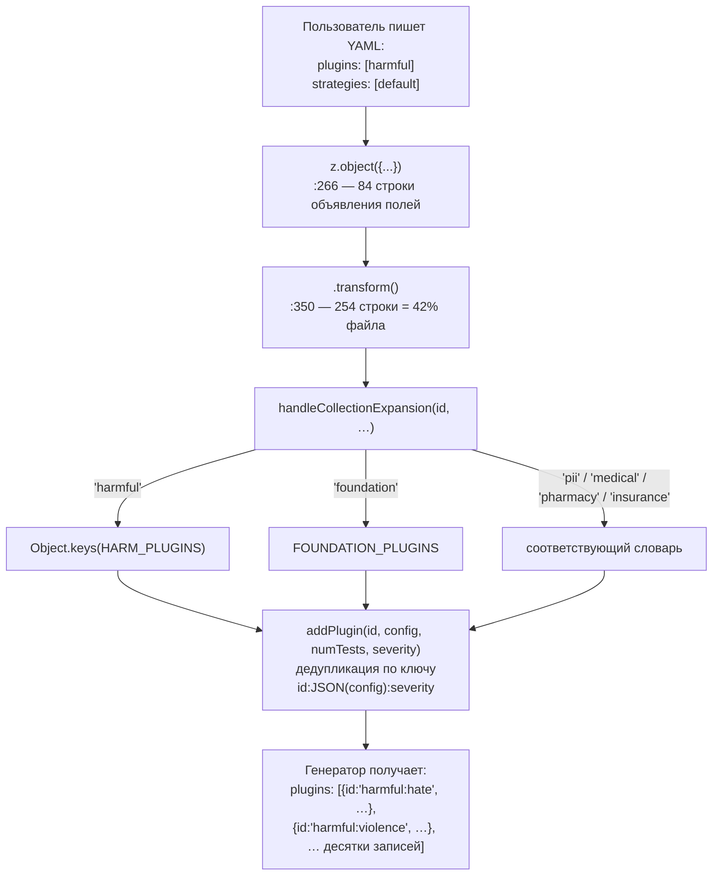
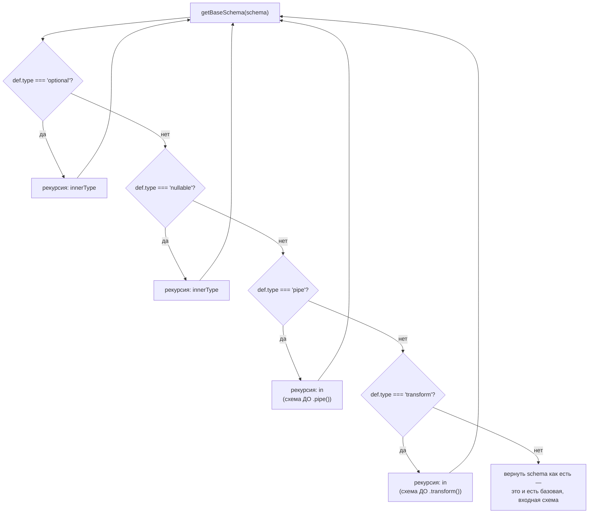
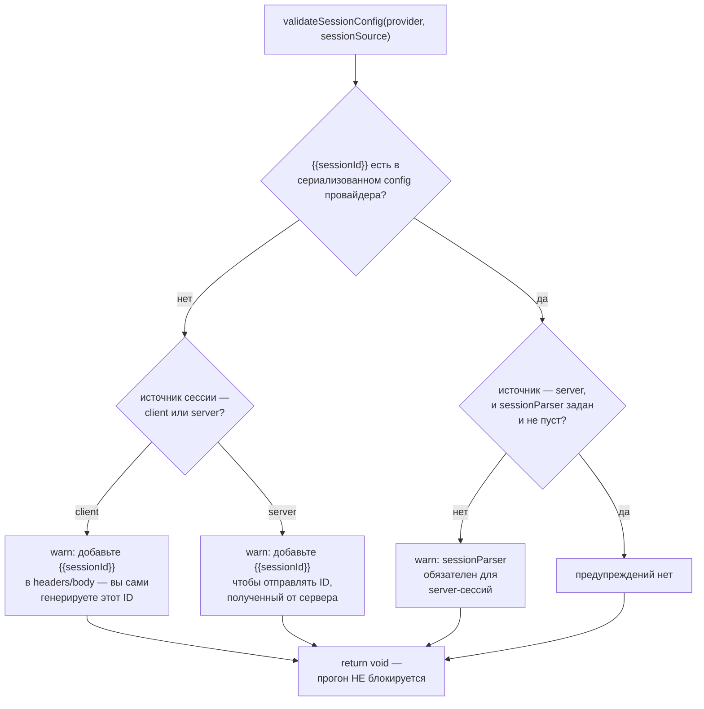

# Застава конфигурации — `src/validators`

> Разбор через призму **Domain-Driven Design**. Диаграммы — ANSI-псевдографика.
> Дополняет [TYPES.md](TYPES.md), [CONTRACTS.md](CONTRACTS.md), [REDTEAM.md](REDTEAM.md),
> [PROVIDERS.md](PROVIDERS.md), [ARCHITECTURE.md](ARCHITECTURE.md).
>
> TYPES.md и CONTRACTS.md описывают, как единый язык **объявлен**. Здесь — как он
> **применяется** к пользовательскому YAML на рантайме.

---

## 0. Паспорт подсистемы

```
╔══════════════════════════════════════════════════════════════════════════════╗
║  src/validators — Zod на границе с пользовательским конфигом                 ║
╠══════════════════════════════════════════════════════════════════════════════╣
║  Файлов ................. 5      из них 2 — однострочные шимы                ║
║  Строк .................. 787                                                ║
║  AGENTS.md .............. ЕСТЬ   28 строк                                    ║
╠══════════════════════════════════════════════════════════════════════════════╣
║  redteam.ts ............. 603    77% каталога                                ║
║  util.ts ................ 122                                                ║
║  providers.ts ........... 60                                                 ║
║  prompts.ts ............. 1      export * from contracts/validators/prompts  ║
║  shared.ts .............. 1      export * from contracts/validators/shared   ║
╠══════════════════════════════════════════════════════════════════════════════╣
║  Слой ................... legacy-contracts   tier 1, вместе с src/types      ║
║  Вклад в обратные рёбра . 6 из 11 импортов legacy-contracts → redteam        ║
╠══════════════════════════════════════════════════════════════════════════════╣
║  Тестов ................. 1551 строка / 5 файлов                             ║
║  Отношение тест/код ..... 1.97 : 1                                           ║
╠══════════════════════════════════════════════════════════════════════════════╣
║  Продукт ................ site/static/config-schema.json — 110 KB,           ║
║                           50 определений, крупнейший enum на 291 значение    ║
╚══════════════════════════════════════════════════════════════════════════════╝
```

Каталог с обманчивым именем. «Валидаторы» подразумевают проверку — здесь же
происходит **разворачивание**: 42% главного файла заняты трансформацией,
которая превращает `plugins: ['harmful']` в список конкретных плагинов.
Это доменный сервис, оформленный как Zod-схема.

---

## 1. Единый язык подсистемы

| Термин | Носитель в коде | Смысл в предметной области |
| --- | --- | --- |
| **Config contract** | `RedteamConfigSchema`, `ProvidersSchema` | Обещание пользователю: этот YAML будет работать и в следующей версии |
| **Collection** | `COLLECTIONS`, `handleCollectionExpansion` | Псевдоним группы плагинов: `harmful`, `pii`, `foundation`, `medical` |
| **Expansion** | `.transform()` в `redteam.ts:350` | Превращение коллекции в перечень конкретных плагинов |
| **Plugin option** | `pluginOptions: string[]` | Объединение коллекций, всех плагинов и алиасов — словарь допустимого |
| **Aliased plugin** | `ALIASED_PLUGINS` | Старое имя плагина, которое обязано продолжать работать |
| **Legacy shim** | `prompts.ts`, `shared.ts` | Однострочный реэкспорт из `src/contracts/validators/*` |
| **Session source** | `determineEffectiveSessionSource` | Кто владеет идентификатором сессии: клиент, сервер или эндпойнт |
| **Actionable message** | `superRefine` + `ctx.addIssue` | Ошибка, называющая допустимые значения и ссылку на документацию |

---

## 2. Место подсистемы: половина слоя `legacy-contracts`

```
              tierOrder ────────────────────────────────────────────────►
    0                 1                  2            3      4       5
 contracts   LEGACY-CONTRACTS     legacy-runtime    node providers redteam
                    ▲                                                 ▲
                    │  roots: ['src/types', 'src/validators']         │
                    │                                                 │
                    └──────── 11 обратных рёбер ──────────────────────┘

   Из CONTRACTS.md: legacy-contracts имеет 831 входящий импорт и 18 обратных
   рёбер вверх по tierOrder. Одиннадцать из них ведут в redteam. Вот они:

   ┌──────────────────────────────────────────────────────────────────────┐
   │  ВКЛАД src/validators — 6 рёбер                                      │
   │    validators/providers.ts:2  → ../redteam/types                     │
   │    validators/redteam.ts:26   → ../redteam/constants                 │
   │    validators/redteam.ts:27   → ../redteam/constants/codingAgents    │
   │    validators/redteam.ts:28   → ../redteam/constants/strategies      │
   │    validators/redteam.ts:32   → ../redteam/constants                 │
   │    validators/redteam.ts:40   → ../redteam/types                     │
   │                                                                      │
   │  ВКЛАД src/types — 5 рёбер                                           │
   │    types/index.ts:36          → ../redteam/types                     │
   │    types/index.ts:71          → export * from '../redteam/types'     │
   │    types/api/redteam.ts:2     → ../../redteam/constants              │
   │    types/api/redteam.ts:7     → ../../redteam/types                  │
   │    types/api/redteam.ts:12    → ../../redteam/constants              │
   │                                                                      │
   │  ────────────────────────────────────────────────────────────────    │
   │  ИТОГО 11 = ровно столько, сколько в edge-baseline.json              │
   │                                                                      │
   │  Двенадцатый импорт — types/index.ts:19 → ../validators/redteam —    │
   │  внутрислойный: оба корня принадлежат legacy-contracts.              │
   └──────────────────────────────────────────────────────────────────────┘
```

Так закрывается вопрос, оставленный открытым в [CONTRACTS.md §6](CONTRACTS.md):
откуда берутся обратные рёбра «фундамента». **Отсюда.** Схема, обязанная
проверять имена плагинов, вынуждена знать их перечень — а перечень живёт
в `src/redteam/constants`, пятью тирами выше.

Это не небрежность, а структурная ловушка: словарь допустимых значений
принадлежит той подсистеме, которая эти значения реализует. Вынести словарь
вниз, в `contracts`, значит оторвать его от плагинов, которые он описывает.

---

## 3. Схема, которая не проверяет, а вычисляет

```
╔══════════════════════════════════════════════════════════════════════════════╗
║  RedteamConfigSchema — redteam.ts:266..603                                   ║
╠══════════════════════════════════════════════════════════════════════════════╣
║                                                                              ║
║   :266 ┌─ z.object({ … }) ──────────────────── 84 строки объявления полей    ║
║        │    injectVar · purpose · provider · numTests · language ·           ║
║        │    frameworks · entities · contexts · plugins · strategies ·        ║
║        │    maxConcurrency · testGenerationInstructions · …                  ║
║        │                                                                     ║
║   :350 └─ .transform((data): RedteamFileConfig => { … })                     ║
║             ▲                                                                ║
║             │  254 строки — 42% ФАЙЛА                                        ║
║             │                                                                ║
║             ├─ addPlugin(id, config, numTests, severity)                     ║
║             ├─ expandCollection(collection, …)                               ║
║             └─ handleCollectionExpansion(id, …)                              ║
║                   'foundation' → FOUNDATION_PLUGINS                          ║
║                   'harmful'    → Object.keys(HARM_PLUGINS)                   ║
║                   'pii'        → PII_PLUGINS                                 ║
║                   'medical'    → MEDICAL_PLUGINS                             ║
║                   'pharmacy'   → PHARMACY_PLUGINS                            ║
║                   'insurance'  → INSURANCE_PLUGINS                           ║
║                   …                                                          ║
╚══════════════════════════════════════════════════════════════════════════════╝

   ЧТО ВИДИТ ПОЛЬЗОВАТЕЛЬ            ЧТО ПОЛУЧАЕТ ГЕНЕРАТОР
   ┌─────────────────────┐           ┌──────────────────────────────────┐
   │ redteam:            │           │ plugins: [                       │
   │   plugins:          │  ──────►  │   { id: 'harmful:hate',      … } │
   │     - harmful       │ transform │   { id: 'harmful:violence',  … } │
   │   strategies:       │           │   { id: 'harmful:self-harm', … } │
   │     - default       │           │   … десятки записей …            │
   └─────────────────────┘           └──────────────────────────────────┘
```

Тот же конвейер как Mermaid-диаграмма:



**Своими словами.** Представь заказ в ресторане, где можно сказать
официанту не «дайте мне вот эти семь конкретных блюд», а «дайте мне
морскую тарелку» — и повар сам знает, что сегодня в неё входит. Схема
сначала проверяет, что бланк заказа заполнен правильно: указаны ли
разделы «блюда», «способ подачи», «количество порций» и так далее
(`z.object`, 84 строки). Дальше бланк уходит не сразу на кухню, а
к су-шефу, который переписывает общие названия в конкретные тикеты для
поваров (`.transform`, 254 строки — почти половина файла). Услышав
«морская тарелка», су-шеф не отправляет на кухню саму фразу «морская
тарелка» — он открывает справочник, какие конкретно блюда сегодня
входят в эту категорию, и выписывает отдельный тикет на каждое
(`handleCollectionExpansion`: «harmful» превращается в список из
десятков конкретных пунктов, «foundation», «pii», «medical» — каждое
в свой список). При этом действует правило против дублей: если один и
тот же тикет пришёл дважды с одинаковыми уточнениями — это один тикет,
а если с разными (другой соус, другая порция) — это два разных блюда;
и если сначала пришёл общий тикет, а потом уточнение по одному
конкретному блюду — уточнение побеждает. Официант так и не увидел
готовый список — гость написал «морская тарелка», а кухня получила
дюжину точных заказов.

Ключ дедупликации — составной:

```
   `${item}:${JSON.stringify(config)}:${severity || ''}`

   Один плагин может встретиться дважды с РАЗНЫМ config или severity —
   и это два разных плагина. Один и тот же с одинаковыми параметрами —
   один. Плюс правило замещения:

     if (!existingPlugin || existingPlugin.numTests === undefined) {
       addPlugin(item, config, numTests, severity);
     }

   Запись с явным numTests вытесняет запись без него. Значит порядок
   «сначала коллекция, потом уточнение отдельного плагина» работает так,
   как ожидает человек, писавший YAML.
```

`AGENTS.md` предупреждает об этом прямо, и предупреждение адресовано тому,
кто будет писать тесты:

> If a validator expands aliases, defaults, or collections, test the parsed
> output, not just parse success.

Проверять `safeParse().success` здесь бессмысленно — вся работа происходит
после успешного разбора.

---

## 4. Цена трансформации: генератор JSON Schema лезет во внутренности Zod

Трансформация даёт удобство пользователю и создаёт проблему инструментам.

```
╔══════════════════════════════════════════════════════════════════════════════╗
║  scripts/generateJsonSchema.ts                                               ║
╠══════════════════════════════════════════════════════════════════════════════╣
║                                                                              ║
║  Комментарий авторов, дословно:                                              ║
║                                                                              ║
║  «NOTE: This script accesses Zod's internal _def property to extract the     ║
║   input schema from pipe/transform wrappers. This is necessary because       ║
║   UnifiedConfigSchema uses .pipe() for transforms, and we need the input     ║
║   schema for JSON Schema generation. This may need updating if Zod's         ║
║   internal structure changes.»                                               ║
║                                                                              ║
║  function getBaseSchema(schema: ZodType): ZodType {                          ║
║    const def = schema._def as { type?, in?, innerType? };                    ║
║    if (def?.type === 'optional'  && def?.innerType) …                        ║
║    if (def?.type === 'nullable'  && def?.innerType) …                        ║
║    if (def?.type === 'pipe'      && def?.in) …                               ║
║    if (def?.type === 'transform' && def?.in) …                               ║
║    return schema;                                                            ║
║  }                                                                           ║
╠══════════════════════════════════════════════════════════════════════════════╣
║  Причина: JSON Schema должна описывать ВХОД (то, что пишет человек),         ║
║  а не ВЫХОД (развёрнутый список из десятков плагинов). Zod по умолчанию      ║
║  отдаёт выход. Чтобы добраться до входа, скрипт рекурсивно разворачивает     ║
║  обёртки через приватное поле `_def`.                                        ║
╚══════════════════════════════════════════════════════════════════════════════╝

   Продукт — site/static/config-schema.json:
   ┌──────────────────────────────────────────────────────────────────────┐
   │  110 KB · 50 определений · крупнейший enum — 291 значение            │
   │                                                                      │
   │  Это то, что даёт автодополнение в редакторе при написании           │
   │  promptfooconfig.yaml. 291 значение — pluginOptions: объединение     │
   │  коллекций, всех 155 плагинов и алиасов, отсортированное.            │
   └──────────────────────────────────────────────────────────────────────┘
```

Разворачивание обёрток `getBaseSchema` как Mermaid-диаграмма:



**Своими словами.** Представь подарок, завёрнутый в несколько слоёв
бумаги, и тебе нужно найти сам подарок, а не описывать упаковку.
Первый слой может означать «подарка может и не быть вовсе» (`optional`)
— разворачиваешь, идёшь дальше. Второй слой может означать «внутри
либо подарок, либо пустая коробка» (`nullable`) — тоже разворачиваешь.
А следующие два слоя устроены хитрее: это не упаковочная бумага,
а рецепт — «возьми сырой продукт и приготовь из него блюдо» (`pipe`
и `transform`, те самые 254 строки трансформации из §3). Инструмент,
который генерирует автодополнение для редактора, хочет показать
человеку СЫРОЙ ПРОДУКТ — то, что тот сам может написать в YAML,
— а не готовое блюдо, которое получится после разворачивания
коллекций. Поэтому вместо того чтобы фотографировать готовое блюдо,
функция каждый раз ныряет ПОД рецепт, забирает то, что было на
входе, и продолжает разворачивать это заново — слой за слоем,
через чёрный ход (приватное поле `_def`, к которому её никто не
приглашал), — пока не наткнётся на слой, который уже ничего не
оборачивает. Вот он и есть искомый подарок.

Зависимость от приватного `_def` — принятый долг, и авторы это записали:
«may need updating if Zod's internal structure changes». В `package.json`
zod закреплён как `^4.3.6`, то есть минорные обновления придут автоматически.

---

## 5. Сообщения об ошибках как часть контракта

`AGENTS.md` требует: *«Preserve actionable error messages»*. Посмотрим, что
это значит на практике — четыре `superRefine` в `redteam.ts`:

```
   ┌── Неизвестное имя плагина ───────────────────────────────────────────┐
   │  `Invalid plugin name "${val}". Must be one of: ${pluginOptions      │
   │   .join(', ')} (or a path starting with file://)`                    │
   │                                                                      │
   │  ▲ В сообщение подставляется ВЕСЬ список из 291 значения.            │
   │    Многословно — зато пользователь видит допустимое, не уходя        │
   │    в документацию.                                                   │
   └──────────────────────────────────────────────────────────────────────┘

   ┌── Неизвестный идентификатор плагина ─────────────────────────────────┐
   │  `Invalid plugin id "${val}". Custom plugins must start with file:// │
   │   or use a built-in plugin. See                                      │
   │   https://www.promptfoo.dev/docs/red-team/plugins for available      │
   │   plugins.`                                                          │
   │                                                                      │
   │  ▲ Здесь наоборот — ссылка вместо перечня. Разные ветки              │
   │    объединения выбирают разную стратегию подсказки.                  │
   └──────────────────────────────────────────────────────────────────────┘
```

Обе ветки живут в одном `z.union`: сначала пробуется `z.enum(pluginOptions)`,
затем `z.string()` с проверкой на `file://`. Zod при неудаче объединения
показывает ошибки всех веток — поэтому пользователь получает и перечень,
и ссылку.

---

## 6. `util.ts` — валидация, которая предупреждает, а не запрещает

Сто двадцать две строки, не имеющие отношения к Zod. Это проверки конфигурации
сессий, вызываемые из `testProviderSession` ([NODE.md §7](NODE.md)).

```
╔══════════════════════════════════════════════════════════════════════════════╗
║  validateSessionConfig — util.ts:62                                          ║
╠══════════════════════════════════════════════════════════════════════════════╣
║                                                                              ║
║   ПРОВЕРКА 1: есть ли {{sessionId}} в конфиге провайдера                     ║
║     const configStr = JSON.stringify(provider.config || {});                 ║
║     const hasSessionIdTemplate = configStr.includes('{{sessionId}}');        ║
║                                                                              ║
║     ▲ Поиск подстроки по сериализованному конфигу — грубо, но покрывает      ║
║       любое расположение: заголовок, тело, вложенный объект.                 ║
║                                                                              ║
║     Сообщение РАЗНОЕ для клиентских и серверных сессий:                      ║
║       client → «you should include {{sessionId}} in your request headers     ║
║                 or body to send the client-generated session ID»             ║
║       server → «…to send the session ID in subsequent requests»              ║
║                                                                              ║
║   ПРОВЕРКА 2: для серверных сессий обязателен sessionParser                  ║
║     if (!sessionParser || sessionParser.trim() === '') → предупреждение      ║
║                                                                              ║
╠══════════════════════════════════════════════════════════════════════════════╣
║   ОБЕ ПРОВЕРКИ — logger.warn, НЕ throw.                                      ║
║                                                                              ║
║   Функция возвращает void и ничего не блокирует. Конфигурация мишени         ║
║   бывает нестандартной, и запретить прогон из-за отсутствия подстроки —      ║
║   значит закрыть рабочие сценарии. Предупреждение с объяснением —            ║
║   компромисс между «молча сломается» и «не дам запустить».                   ║
╚══════════════════════════════════════════════════════════════════════════════╝
```

Те же две проверки как Mermaid-диаграмма:



**Своими словами.** Это как приборная панель автомобиля, а не
иммобилайзер — лампочка загорается, но мотор не глохнет. Первая
проверка: есть ли в бланке конфигурации специально отведённое место
под номерок талона ({{sessionId}})? Если нет — загорается лампочка,
и цвет её разный в зависимости от того, кто вообще должен вписать
туда номер: если номерок выдаёшь ты сам (client), лампочка напоминает
тебе его вписать; если номерок должен прислать в ответ другая сторона
(server), лампочка напоминает оставить для него место. Вторая проверка
касается только второго случая: если ты ждёшь номерок от сервера, есть
ли у тебя вообще инструкция, ГДЕ именно в ответе этот номерок искать
(`sessionParser`)? Нет инструкции — вторая лампочка. Обе лампочки —
именно лампочки, а не блокировка зажигания: функция ничего не
`throw`-ит, только предупреждает и возвращает пустоту. Причина проста —
бывают нестандартные машины (нестандартные конфигурации мишени), для
которых эти лампочки в принципе неприменимы, и глушить мотор из-за
формально отсутствующей отметки значило бы не дать уехать тем, у кого
всё на самом деле в порядке.

`determineEffectiveSessionSource:110` разрешает третий случай — источник
сессии может быть задан и в `sessionConfig`, и в `provider.config`, и нужно
правило приоритета.

Соседство с Zod-схемами в одном каталоге объясняется только именем: и то,
и другое «валидация». По существу это разные вещи — декларативный контракт
конфига и императивная проверка UX.

---

## 7. Провайдеры: шестьдесят строк на самую широкую границу

```
   providers.ts — 60 строк на подсистему из 80+ фабрик (см. PROVIDERS.md)

   ┌──────────────────────────────────────────────────────────────────────┐
   │  ProviderOptionsSchema :14   объект конфигурации                     │
   │  ApiProviderSchema     :29   объект с методом id()                   │
   │  ProvidersSchema       :47   z.union — строка | массив | запись | …  │
   │  ProviderSchema        :60   z.union([z.string(),                    │
   │                                       ApiProviderSchema,             │
   │                                       ProviderOptionsSchema])        │
   └──────────────────────────────────────────────────────────────────────┘

   Шестьдесят строк на восемьдесят провайдеров возможны потому, что схема
   намеренно НЕ описывает config конкретного провайдера. Правило из AGENTS.md:

     «Prefer explicit z.unknown(), z.record(), unions, transforms, or
      passthrough behavior over z.any() when preserving arbitrary
      provider/plugin config.»

   z.unknown() против z.any() — не косметика. z.any() отключает проверку
   типов у ПОТРЕБИТЕЛЯ значения; z.unknown() заставляет его сузить тип
   прежде чем использовать. Схема отказывается описывать содержимое,
   но не отказывается от типобезопасности вокруг него.
```

`ProvidersSchema` подключён в трёх местах: `types/index.ts:1247` (внутри
`UnifiedConfigSchema`), `types/index.ts:1401–1402` (`providers` и `targets`
как синонимы) и `util/config/load.ts:363–364`. Последнее — отдельная проверка
при загрузке файла конфигурации.

---

## 8. Два однострочных файла

```
   prompts.ts:  export * from '../contracts/validators/prompts';
   shared.ts:   export * from '../contracts/validators/shared';

   ┌── Что за ними стоит ─────────────────────────────────────────────────┐
   │                                                                      │
   │  Это те самые шимы из CONTRACTS.md §7. Оба входят в восьмёрку пар    │
   │  под фитнес-функцией test/contracts/shimEquivalence.test.ts,         │
   │  которая требует РЕФЕРЕНЦИАЛЬНОГО равенства символов (toBe).         │
   │                                                                      │
   │  AGENTS.md каталога формулирует порядок работы:                      │
   │    «Read src/contracts/AGENTS.md, edit the contract source first,    │
   │     and keep test/contracts/shimEquivalence.test.ts passing.»        │
   │                                                                      │
   │  Правка здесь запрещена по существу: строка одна, менять в ней       │
   │  нечего, а любое отклонение уронит toBe-сверку.                      │
   └──────────────────────────────────────────────────────────────────────┘

   Показательно, что на 2 строки шимов приходится 231 строка тестов:
     test/validators/prompts.test.ts  141
     test/validators/shared.test.ts    90
   Тесты проверяют не реэкспорт, а поведение самих контрактных схем —
   по старому адресу, которым пользуется 96.7% кодовой базы.
```

---

## Диагноз

```
╔══════════════════════════════════════════════════════════════════════════════╗
║                            ДИАГНОЗ src/validators                            ║
╠══════════════════════════════════════════════════════════════════════════════╣
║  СИЛЬНЫЕ СТОРОНЫ                                                             ║
║                                                                              ║
║  ✔ Отношение тест/код 1.97:1 — самое высокое среди разобранных каталогов.    ║
║    1551 строка тестов на 787 строк кода, и это оправданно: здесь             ║
║    проходит граница с пользовательским вводом.                               ║
║                                                                              ║
║  ✔ Сообщения об ошибках подставляют перечень допустимых значений или         ║
║    ссылку на документацию. Требование «actionable messages» записано         ║
║    в AGENTS.md и выполняется в коде.                                         ║
║                                                                              ║
║  ✔ Осознанный выбор z.unknown() вместо z.any(): схема отказывается           ║
║    описывать чужой config, но сохраняет типобезопасность вокруг него.        ║
║                                                                              ║
║  ✔ Ключ дедупликации плагинов учитывает config и severity, а правило         ║
║    замещения по numTests делает порядок «коллекция, затем уточнение»         ║
║    интуитивным для человека, пишущего YAML.                                  ║
║                                                                              ║
║  ✔ AGENTS.md предупреждает о главной ловушке тестирования: проверять         ║
║    результат разбора, а не факт успеха. Для схемы, где 42% — трансформация,  ║
║    это единственно верный совет.                                             ║
║                                                                              ║
║  ✔ Схемы — единственный источник config-schema.json, дающей автодополнение   ║
║    в редакторе. Каждое поле снабжено .describe().                            ║
╠══════════════════════════════════════════════════════════════════════════════╣
║  СЛАБЫЕ МЕСТА                                                                ║
║                                                                              ║
║  ✘ Каталог называется «валидаторы», но 42% главного файла — вычисление.      ║
║    Разворачивание коллекций в список плагинов — доменная логика red team,    ║
║    оформленная как побочный эффект разбора конфига.                          ║
║                                                                              ║
║  ✘ Шесть из одиннадцати обратных рёбер legacy-contracts → redteam            ║
║    начинаются здесь. Схема обязана знать словарь, словарь живёт              ║
║    пятью тирами выше.                                                        ║
║                                                                              ║
║  ✘ Генератор JSON Schema читает приватное поле Zod `_def`. Авторы это        ║
║    знают и записали, но zod закреплён как ^4.3.6 — минорное обновление       ║
║    придёт само и может сломать генерацию.                                    ║
║                                                                              ║
║  ✘ 77% каталога — один файл на 603 строки, из которых трансформация          ║
║    занимает 254. Границы «поля / словарь / разворачивание» не выражены.      ║
║                                                                              ║
║  ✘ util.ts не имеет отношения к остальному каталогу: императивные            ║
║    проверки UX сессий рядом с декларативными контрактами конфига.            ║
║    Общее только слово «валидация» в названии.                                ║
║                                                                              ║
║  ✘ Обе проверки в validateSessionConfig — logger.warn без возвращаемого      ║
║    значения. Вызывающий не может отличить «всё хорошо» от «предупредили      ║
║    и поехали дальше», а значит не может показать это в интерфейсе.           ║
╚══════════════════════════════════════════════════════════════════════════════╝
```

### Оценка по осям

```
  Покрытие тестами             ██████████  10/10   1.97:1, рекорд серии
  Качество сообщений об ошибках █████████░   9/10   перечень или ссылка на docs
  Документированность          ████████░░   8/10   AGENTS.md называет главную ловушку
  Обратная совместимость       ████████░░   8/10   ALIASED_PLUGINS, правило в AGENTS.md
  Типобезопасность             ████████░░   8/10   z.unknown() вместо z.any()
  Чистота границы слоя         ████░░░░░░   4/10   6 обратных рёбер из 11
  Соответствие имени           ███░░░░░░░   3/10   42% файла — не валидация
  Модульность                  ███░░░░░░░   3/10   77% в одном файле; util.ts не отсюда
  ─────────────────────────────────────────────────────────────────────────────
  ИНТЕГРАЛЬНО                  ███████░░░   6.6/10
```

Каталог отлично делает то, за что отвечает на границе с пользователем, и
плохо держит собственные границы. Разворачивание коллекций — правильная
функция, оказавшаяся не в том слое: она принадлежит red team, а исполняется
в tier 1.

---

## Рекомендации по эволюции

1. **Вынести разворачивание коллекций в `src/redteam`.** Схема остаётся
   валидатором и возвращает то, что написал пользователь; `expandRedteamPlugins()`
   вызывается генератором отдельно. Это снимает 254 строки из tier 1, убирает
   часть обратных рёбер и заодно избавляет генератор JSON Schema от нужды
   разворачивать `.pipe()` через приватное `_def`.

2. **Закрепить zod точной версией или добавить тест на `_def`.** Пока
   генератор зависит от внутренней структуры Zod, `^4.3.6` — это ставка на
   то, что минорное обновление ничего не поменяет. Минимум — тест, который
   генерирует схему и проверяет, что крупнейший enum не опустел.

3. **Разделить `redteam.ts` на три файла:** `redteam/fields.ts` (объявление
   полей), `redteam/vocabulary.ts` (`pluginOptions`, `strategyIdSchema`),
   `redteam/expand.ts` (трансформация). Границы уже прочерчены функциями.

4. **Переселить `util.ts`.** Проверки сессий вызываются из
   `src/node/testProvider.ts` и логически принадлежат ему. Каталог валидаторов
   станет однородным.

5. **Дать `validateSessionConfig` возвращаемое значение.** Массив
   предупреждений вместо `logger.warn` позволит показать их в веб-интерфейсе
   рядом с результатом проверки мишени — сейчас они видны только в логе.

6. **Записать в `AGENTS.md`, почему словарь импортируется из `redteam`.**
   Обратное ребро выглядит как ошибка ровно до тех пор, пока не объяснено.
   Одного абзаца достаточно, чтобы следующий читатель не пытался его «починить».

---

## Карта директории

```
src/validators/
├── AGENTS.md ...................................... 28
│
├── redteam.ts .................................... 603   77% каталога
│     RedteamContextSchema            :66
│     pluginOptions                   :85   COLLECTIONS ∪ ALL_PLUGINS ∪ ALIASED
│     RedteamPluginObjectSchema       :91
│       └ superRefine                 :94, :102   сообщения с перечнем/ссылкой
│     RedteamPluginSchema            :128   z.union
│       └ superRefine                :131, :139
│     strategyIdSchema               :152
│       └ superRefine :153 · refine :165, :177
│     RedteamStrategySchema          :189
│     RedteamGenerateOptionsSchema   :204
│     RedteamConfigSchema            :266
│       ├ z.object — поля            :267..349   каждое с .describe()
│       └ .transform                 :350..603   254 строки = 42% файла
│            addPlugin · expandCollection · handleCollectionExpansion
│
├── util.ts ....................................... 122   ← логически чужой
│     formatConfigBody                :8
│     formatConfigHeaders             :43
│     validateSessionConfig           :62    logger.warn, не throw
│     determineEffectiveSessionSource :110
│
├── providers.ts ................................... 60
│     ProviderOptionsSchema :14 · ApiProviderSchema :29
│     ProvidersSchema       :47 · ProviderSchema    :60
│
├── prompts.ts ...................................... 1   шим → contracts
└── shared.ts ....................................... 1   шим → contracts

Связанные файлы вне каталога:
    src/redteam/constants/* ..............  словарь плагинов и стратегий
    src/types/index.ts:1247,:1330,:1401 ..  подключение в UnifiedConfigSchema
    src/util/config/load.ts:363 ..........  проверка при загрузке конфига
    src/redteam/commands/generate.ts:615 .  RedteamConfigSchema.safeParse
    scripts/generateJsonSchema.ts ........  разворачивает .pipe() через _def
    site/static/config-schema.json .......  110 KB, 50 определений, enum на 291
    test/validators/ ..................... 1551 строка / 5 файлов
    test/contracts/shimEquivalence.test.ts  сторожит два однострочника
```

---

## Команды

```bash
# Состав каталога
find src/validators -name '*.ts' | xargs wc -l | sort -rn

# ГЛАВНОЕ: доля трансформации в redteam.ts
grep -n '\.transform(' src/validators/redteam.ts
python3 -c "print(f'{603-350+1} из 603 = {(603-350+1)/603*100:.0f}%')"

# Обратные рёбра: откуда legacy-contracts зависит от redteam
grep -rn "from '.*redteam" src/validators/ src/types/

# Сверка с конституцией слоёв (ожидается 11)
python3 -c "import json;b=json.load(open('architecture/edge-baseline.json'));print(b['legacy-contracts -> redteam'])"

# Сообщения об ошибках
grep -n 'message: `Invalid' src/validators/redteam.ts

# Продукт схем — JSON Schema для автодополнения в редакторе
ls -la site/static/config-schema.json
python3 -c "
import json;d=json.load(open('site/static/config-schema.json'))
best=[]
def w(o):
  global best
  if isinstance(o,dict):
    e=o.get('enum')
    if isinstance(e,list) and len(e)>len(best): best=e
    for v in o.values(): w(v)
  elif isinstance(o,list):
    for v in o: w(v)
w(d); print('крупнейший enum:', len(best))"

# Перегенерация схемы после правки валидаторов
npm run jsonSchema:generate

# Штатная валидация (из AGENTS.md)
npx vitest run test/validators test/contracts
npm run tsc
```

---

*Документ описывает `src/validators` на коммите `2c140ef`, promptfoo 0.122.0. Дата среза — 26 августа 2026.*
